# 第 1 章　几何和复算术

## 1.1　引言

### 1.1.1　历史概述

自复数最初被发现以来，四个半世纪已经过去。这里，读者大概已经知道，所谓复数，是指形如 $a+ib$ 的数，其中 $a,b$ 是普通实数，而不同于任何普通实数的是，$i$ 满足 $i^2=-1$。这一发现最终对整个数学产生了深远影响：它把许多此前看似彼此无关的事物统一起来，也解释了许多此前看来无法理解的现象。尽管结局如此美好——事实上，这个故事直到今天仍在继续展开——复数被发现之后的发展却慢得令人痛苦。的确，与十九世纪取得的进展相比，复数诞生后的最初二百五十年几乎没有取得什么成果。

复数怎么可能在笛卡尔、费马、莱布尼茨、甚至牛顿等伟大思想的诞生和消逝的岁月里一直处于休眠状态呢？答案似乎在于这样一个事实：复数最初并没有受到人们的欢迎，而是受到了怀疑、困惑，甚至敌意。

吉罗拉莫·卡尔达诺 (Girolamo Cardano) 于 1545 年出版的《Ars Magna》通常被认为是复数的出生证明。然而，卡尔达诺在那项工作中引入了这些数字，只是为了立即将它们斥为“微妙，因为它们毫无用处”。正如我们将要讨论的，拉斐尔·邦贝利 (Rafael Bombelli) 在 1572 年出版的《代数》中首次对复数进行了实质性计算。然而，我们也发现这位创新者似乎否认自己的发现（至少在最初是这样），他说“整个问题似乎建立在诡辩而非真理之上”。迟至 1702 年，莱布尼茨将 $i$（-1 的平方根）描述为“存在与不存在之间的两栖动物”。这种情绪在当时的术语中得到了呼应。就复数的讨论而言，复数被称为“不可能”或“虚数”，后一个术语（不幸的是）一直延续到今天。即使在 1770 年，情况仍然十分混乱，像欧拉这样伟大的数学家有可能错误地认为$\sqrt{-2}\sqrt{-3}=\sqrt{6}$。

> 然而，“虚数”现在指的是 $i$ 的实数倍，而不是一般的复数。顺便提及，引入术语“实数”正是为了将此类数与“虚数”区分开。

所有这些麻烦的根本原因似乎是一道心理或哲学障碍。当没有人觉得自己知道“复数究竟是什么”这个问题的答案时，又怎能满怀热情或信心去研究它们呢？

直到十八世纪末，人们才找到了令人满意的答案。韦塞尔、阿尔冈和高斯彼此独立、又相继迅速地认识到，复数可以得到一种简单而具体的几何解释：把它看作平面上的点（或向量）。神秘的量 $a+ib$，不过就是 $xy$ 平面上笛卡尔坐标为 $(a,b)$ 的点；等价地，它也是从原点指向该点的向量。见图 [1]。这样理解时，这个平面记作 $\mathbb C$，称为复平面。

> 复平面也称为“高斯平面”或“阿尔冈平面”。

  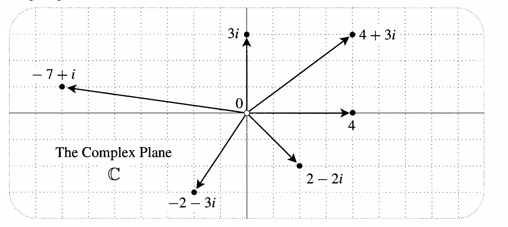
  
图[1]

现在，两个复数的加法与乘法也都可以得到同样明确的几何意义。加法规则如图 [2a] 所示：

$$
两个复数之和 A+B 由普通向量加法的平行四边形法则给出。\tag{1}
$$

  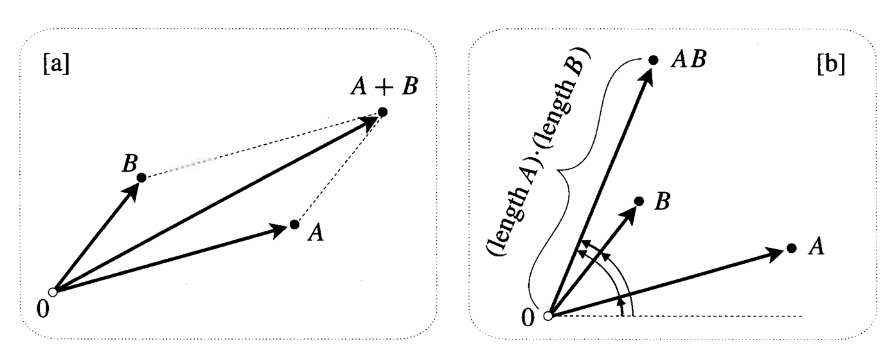
  
图[2]

这与图 [1] 完全一致；例如，$4+3i$ 的确就是 $4$ 与 $3i$ 的向量和。

图 [2b] 给出了不那么显然的乘法规则：

$$
AB 的长度等于 A 与 B 的长度之积，而 AB 的辐角等于 A 与 B 的辐角之和。\tag{2}
$$

这一规则并不能从图 [1] 直接看出，但它至少与 $3i=3\cdot i$ 这样的事实相容。再看一个更有趣的例子：$i$ 与自身相乘。由于 $i$ 的模为 $1$、辐角为 $\pi/2$，所以 $i^2$ 的模仍为 $1$，而辐角为 $\pi$；因此 $i^2=-1$。

韦塞尔和阿尔冈发表的几何解释几乎没有引起注意，但高斯当时已经享有盛名，正如今天一样；他的声望确保了把复数看作平面上点的观点得到广泛传播和接受。至少在最初，比这种新解释的具体细节更重要的是：人们终于有办法理解这些数了——它们从此成为正当的研究对象。无论如何，创造发明的闸门即将打开。

人们用了两个半世纪才接受复数；但随后，关于如何用复数进行微积分的优美新理论——也就是我们今天所说的复分析——却发展得惊人地快。大多数基本结果由柯西、黎曼等人在 1814 至 1851 年间取得，前后还不到四十年！

### 1.1.2　庞贝利的“奇想”

复分析的力量与美最终源于乘法规则（2）和加法规则（1）的结合。邦贝利最早以符号形式发现了这些规则；两个多世纪以后，复平面的几何图景才把图 [2] 展现在人们面前。既然我们刚才仿佛是凭空写出了这些规则，现在不妨回到十六世纪，考察它们的代数起源。

许多教材常借求解二次方程来引入复数：

$$x^2=mx+c. \tag{3}$$

早在两千多年前，人们就已经知道一种等价于现代求根公式的方法来解这类方程。但如果 $m^2+4c$ 为负数，又该怎么办？正是这个问题促使卡尔达诺考虑负数的平方根。到这里，这种叙述还符合史实；但教材随后常说，为了让式 (3) 总有解，人们不得不认真对待复数。无论在今天还是在十六世纪，这个理由都没有多大说服力。事实上，前面已经说过，卡尔达诺毫不迟疑地把这种“解”斥为无用之物。

卡尔达诺并不是缺乏进一步研究此事的想象力，相反，他有一个相当有力的理由不去做。对于古希腊人来说，数学是世纪的事务。因此，如(3)这样的代数关系并不被视为一个独立的问题，而只是解决一个真正几何问题的工具。例如，(3)可以被认为代表了寻找抛物线 y = x² 与直线 y = mx + c 交点的问题，见图[3a]。

  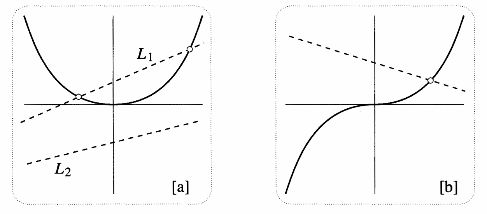
  
图 1-3

在$L_1$的情况下，问题有解；代数上，$(m^2 + 4c) > 0$，两个交点由上述公式给出。在 $L2$ 的情况下，问题显然没有解；代数上，$(m^2 + 4c) < 0$，无解的事实通过公式中“不可实现”的数出现得到了正确体现。

真正迫使人们认真对待复数的并不是二次方程，而是三次方程

$$x^3=3px+2q.$$

> 例 1 表明，一般三次方程总可以化为这种形式。

从几何上说，这个方程表示求三次曲线 $y=x^3$ 与直线 $y=3px+2q$ 的交点，见图[3b]。利用塔塔利亚的方法，卡尔达诺在《大术》中说明，这个方程可由一个非凡的公式求解：

$$x=\sqrt[3]{q+\sqrt{q^2-p^3}}+\sqrt[3]{q-\sqrt{q^2-p^3}}. \tag{4}$$

> 关于这个公式的推导，可见例2

这个公式问世约三十年后，邦贝利察觉到其中有一种奇异而矛盾的现象。若直线 $y=3px+2q$ 满足 $p^3>q^2$，公式中就会出现复数。例如，他考察了 $x^3=15x+4$，由公式得到

$$x=\sqrt[3]{2+11i}+\sqrt[3]{2-11i}.$$

在先前图 [3a] 的二次方程情形中，复数的出现只是说明相应几何问题无解；但在图 [3b] 中，直线显然总会与三次曲线相交。事实上，直接观察邦贝利的例子就能看出实根是 $x=4$。

邦贝利在试图化解这个悖论时产生了一个自称为“奇想”的念头：也许

$$\sqrt[3]{2+11i}=2+ni,\qquad \sqrt[3]{2-11i}=2-ni,$$

从而能由上式恢复出实根 $x=4$。要使这种设想成立，他首先必须假定两个复数 $A=a_1+ia_2$ 与 $B=b_1+ib_2$ 按通常方式相加：

$$A+B=(a_1+ia_2)+(b_1+ib_2)=(a_1+b_1)+i(a_2+b_2). \tag{5}$$

接着，为了判断是否确实存在 $n$ 使 $\sqrt[3]{2+11i}=2+ni$，他必须计算 $(2+ni)^3$。为此，他假定可以像普通代数那样展开括号，并使用 $i^2=-1$，于是得到两个复数的乘法规则：

$$AB=(a_1+ia_2)(b_1+ib_2)=(a_1b_1-a_2b_2)+i(a_1b_2+a_2b_1). \tag{6}$$

这条规则证实了他的“奇想”，因为现在可以验证 $(2\pm i)^3=2\pm11i$。请自行验算。

尽管复数本身仍然显得神秘，邦贝利关于三次方程的工作却表明：一个完全实的问题，也可能必须借助复算术才能解决。

正如它的诞生一样，复数理论的后续发展与数学（以及物理学）其他领域的进步密不可分。遗憾的是，我们只能在本书中触及这些问题。为了对这些相互联系进行完整而引人入胜的描述，读者可以参考Stillwell [1989]。重复前言中所说的内容，我们不能夸大阅读斯蒂尔韦尔的书和本书的价值。

### 1.1.3　一些术语和记号

将历史抛在脑后，我们现在介绍用于描述复数的现代术语和符号。下表总结了这些信息，并在[4]中进行了说明。

| 名称 | 含义 | 记号 |
|---|---|---|
| $z$ 的模 | $z$ 的长度 $r$ | $\| z\|$ |
| $z$ 的辐角 | $z$ 的角 $\theta$ | $\arg(z)$ |
| $z$ 的实部 | $z$ 的 $x$ 坐标 | $\operatorname{Re}(z)$ |
| $z$ 的虚部 | $z$ 的 $y$ 坐标 | $\operatorname{Im}(z)$ |
| 虚数 | $i$ 的实数倍 | — |
| 实轴 | 实数集合 | — |
| 虚轴 | 虚数集合 | — |
| $z$ 的复共轭 | $z$ 关于实轴的反射 | $\bar z$ |

  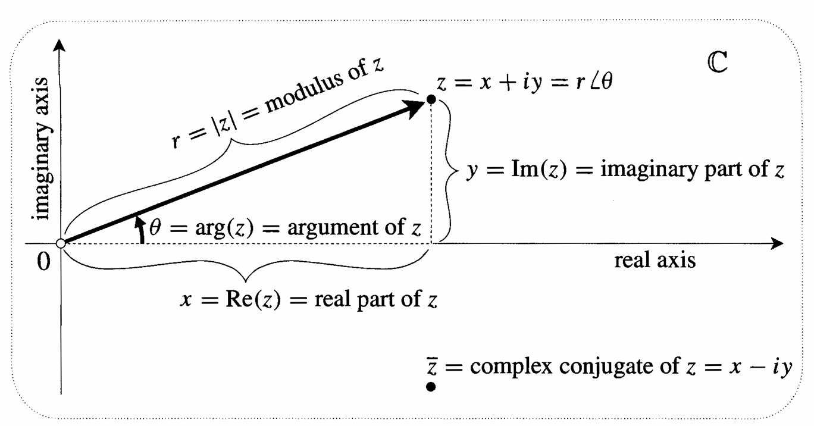
  
图 1-4

一开始就理解这一点是很有价值的：根据几何观点，复数是一个单一的、不可分割的实体——平面上的一个点。只有当我们选择用数值坐标来描述这样一个点时，复数才显得是复合的或“复杂”的。更准确地说，C被认为是二维的，这意味着需要两个实数（坐标）来标记其中的一个点，但具体的标记方式完全取决于我们。

给点标记的一种方法是使用笛卡尔坐标（实部 $x$ 和虚部 $y$），复数写作 $z = x + iy$。当我们处理两个复数的加法时，这是自然的标记方式，因为（5）指出 $A + B$ 的实部和虚部分别由 $A$ 和 $B$ 的实部和虚部相加得到。

在乘法问题中，笛卡尔标记不再自然，因为它导致繁琐而缺乏启发性的规则 (6)。更简单的几何规则 (2) 表明，应改用极坐标标记典型点 $z$：令 $r=|z|$、$\theta=\arg z$，写作 $z=r\angle\theta$，而不是 $z=x+iy$。符号 $\angle$ 提醒我们 $\theta$ 是 $z$ 的辐角。此时几何乘法规则变成

$$(R\angle\phi)(r\angle\theta)=Rr\angle(\theta+\phi). \tag{7}$$

> 有些人至今仍使用这种记号；这里只暂时使用它。本章稍后将引入更好的标准记号，并在全书其余部分采用。

与笛卡尔标记 $x+iy$ 一样，一个给定的极坐标标记 $r\angle\theta$ 确定唯一的点；但反过来，同一点的极坐标标记并不唯一，因为相差 $2\pi$ 整数倍的辐角表示同一方向：

$$r\angle\theta=r\angle(\theta+2\pi k),\qquad k\in\mathbb Z.$$

笛卡尔坐标与极坐标是标记复数最常用的两种方法，但不是仅有的方法；第 3 章还会遇到另一种重要表示。

### 1.1.4　练习

在继续之前，我们强烈建议读者熟悉目前为止介绍的概念、术语和记号。请从几何和（或）代数的角度验证下列事实：

- $\operatorname{Re}(z)=\dfrac{z+\bar z}{2}$；
- $\operatorname{Im}(z)=\dfrac{z-\bar z}{2i}$；
- 若 $z=x+iy$，则 $|z|=\sqrt{x^2+y^2}$；
- $\tan(\arg z)=\dfrac{\operatorname{Im}(z)}{\operatorname{Re}(z)}$；
- $z\bar z=|z|^2$，因而当 $z\ne0$ 时，$\dfrac1z=\dfrac{\bar z}{|z|^2}$；
- $r\angle\theta=r(\cos\theta+i\sin\theta)$；
- 若 $z=r\angle\theta$，则 $z^{-1}=\dfrac1r\angle(-\theta)$；
- $(1+i)^4=-4$，$(1+i)^5=-4(1+i)$，$(1+i)^{13}=-2^6(1+i)$；
- $(1+i\sqrt3)^3=-8$，$(1+i\sqrt3)^6=2^6$；
- $\overline{z_1z_2}=\bar z_1\bar z_2$，且 $\overline{z_1/z_2}=\bar z_1/\bar z_2$。

最后，证明所谓的广义三角不等式：

$$|z_1+z_2+\cdots+z_n|\le |z_1|+|z_2|+\cdots+|z_n|. \tag{8}$$

等号在什么条件下成立？

### 1.1.5　符号算术和几何算术的等价性

我们一直在将符号规则 (5) 和 (6) 与几何规则 (1) 和 (2) 交替使用，现在我们通过展示它们确实是等价的来证明这一点。对于学习过向量的人来说，加法规则 (1) 和 (5) 的等价性是熟悉的；无论如何，这一验证足够简单，我们可以放心地留给读者。因此，我们只讨论乘法规则 (2) 和 (6) 的等价性。

首先说明如何从几何规则推出符号规则。为此，我们把几何规则 (7) 改述成一种格外有用而重要的形式。设 $z$ 是复平面 $\mathbb C$ 中的任意点，并考察它乘以固定复数 $A=R\angle\phi$ 后移到哪里。根据式 (7)，$z$ 的模被放大 $R$ 倍，辐角增加 $\phi$。现在设想对平面上的每一点同时实施这一操作：

$$从几何上说，乘以复数 A=R\angle\phi，就是把平面绕原点旋转 \phi，并按因子 R 伸缩。 \tag{9}$$

这里有几点需要说明：

- 旋转和伸缩都以原点为中心；
- 先旋转后伸缩与先伸缩后旋转没有区别；
- 若 $R<1$，所谓“伸缩”实际上是收缩。

图 [5] 说明了这种变换的效果：浅色图形被映为深色图形。请自行验证，图中 $A=1+i\sqrt3=2\angle(\pi/3)$。

  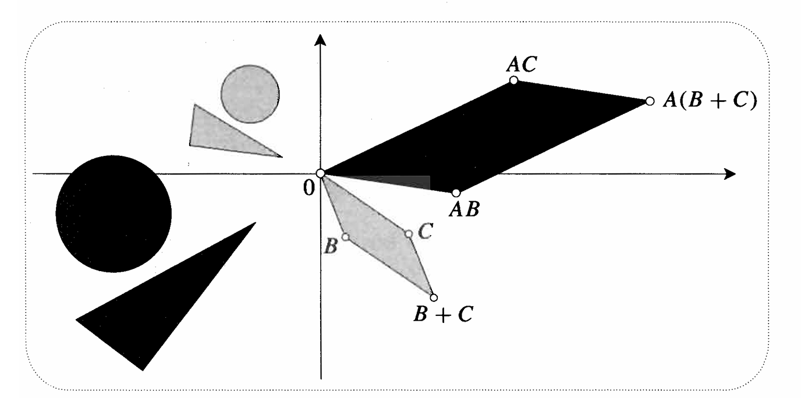
  
图[5]

现在，从几何规则推导出符号规则已是一个简单的事情。回忆一下庞贝利（Bombelli）在推导公式（6）时所采取的基本步骤：(i) $i^2 = -1$；(ii) $A(B + C) = AB + AC$。我们已经看到几何规则给出了(i)，而图[5]现在显示(ii)也是成立的，其简单的理由是加法$B + C$是以点$O、B、C$为顶点的平行四边形的第四个顶点。为了证明(ii)，我们只需观察到乘以$A$会将该平行四边形旋转并放大为另一个以$O、AB、AC$和$A(B + C)$为顶点的平行四边形。这完成了公式（6）的推导。

  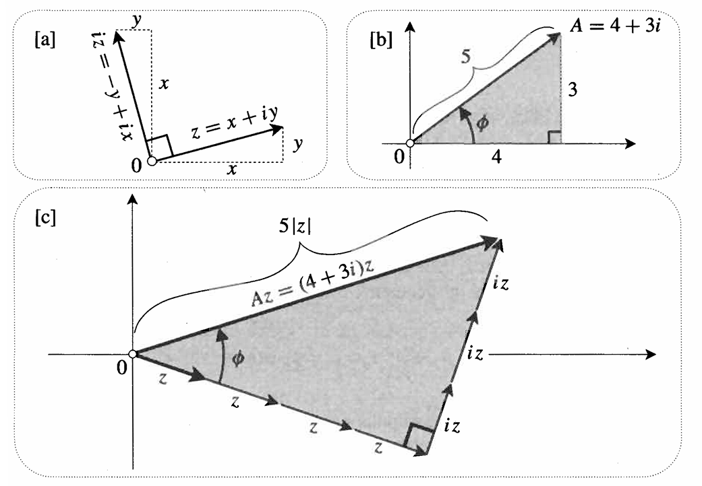
  
图[6]

现在反过来从符号规则推出几何规则。先考察变换 $z\mapsto iz$。

> 这个变换把复平面上的每一点绕原点逆时针旋转 $90^\circ$，且不改变它到原点的距离。若 $z=x+iy$，则
> $$iz=i(x+iy)=-y+ix$$
> 因而坐标变化为 $(x,y)\mapsto(-y,x)$；等价地，$z$ 的模保持不变，辐角增加 $\pi/2$。

由符号规则，

$$x+iy\longmapsto-y+ix,$$

图 [6a] 表明，$iz$ 正是把 $z$ 逆时针旋转直角所得的结果。再利用这个事实解释一般变换 $z\mapsto Az$。取 $A=4+3i=5\angle\phi$，其中 $\phi=\tan^{-1}(3/4)$，见图 [6b]。展开括号可得

$$z\mapsto Az=(4+3i)z=4z+3(iz).$$

图 [6c] 把这一式子可视化。比较图 [6b] 与 [6c] 中的阴影三角形可见，两者相似，因此乘以 $5\angle\phi$ 的确把平面旋转 $\phi$，并放大 $5$ 倍。这就完成了证明。

通常的教材会借助三角恒等式完成这一步；这里的论证则说明，那些恒等式本质上只是复数乘法简单规则的一种较繁复的表现。

## 1.2　欧拉公式

### 1.2.1　引言

是时候用一种更好的记法来取代 $r\angle\theta$ 了。这种新记法建立在下面这个奇妙的事实之上：

$$e^{i\theta}=\cos\theta+i\sin\theta. \tag{10}$$

这个结果是莱昂哈德·欧拉在大约1740年发现的，为了纪念他，它被称为欧拉公式。

  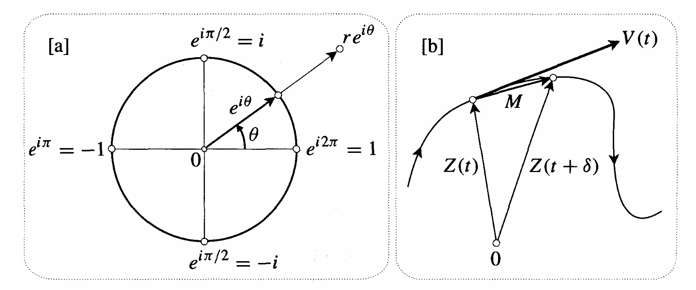
  
图[7]

在解释它之前，先说说它的含义和用途。如图 [7a] 所示，公式表明 $e^{i\theta}$ 是单位圆上辐角为 $\theta$ 的点。于是一般复数不必再写成 $z=r\angle\theta$，而可写成 $z=re^{i\theta}$：先取指向 $z$ 的单位向量 $e^{i\theta}$，再把它伸长 $r=|z|$ 倍。这种表示的妙处之一，是复数乘法的几何规则 (7) 变得几乎一目了然：

$$(Re^{i\phi})(re^{i\theta})=Rr e^{i(\phi+\theta)}.$$

换句话说，像处理实指数函数 $e^x$ 那样对 $e^{i\theta}$ 作代数运算，会得到关于复数的正确结论。

要解释欧拉公式，必须先回答更基本的问题：$e^{i\theta}$ 究竟是什么意思？”不少作者干脆把它定义为 $\cos\theta+i\sin\theta$。这种做法在逻辑上没有问题，却把欧拉最伟大的成果之一降成了同义反复。下面给出两个支持式 (10) 的启发性论证；更深入的论证将在后续章节出现。

### 1.2.2　用质点运动来论证

回忆一个基本事实：$e^x$ 的导数就是它自身，

$$\frac{d}{dx}e^x=e^x.$$

事实上，这可以视为指数函数的定义性质：如果

$$f'(x)=f(x),\qquad f(0)=1,$$

那么 $f(x)=e^x$。类似地，若 $k$ 是实常数，则 $e^{kx}$ 可以由下面两个条件定义：

$$f'(x)=kf(x),\qquad f(0)=1.$$

现在要把普通指数函数 $e^x$ 从实数自变量推广到纯虚数自变量，我们仍要求这一性质成立，于是得到

$$\frac{d}{dt}e^{it}=ie^{it}. \tag{11}$$

我们使用字母 t 代替 x，因为我们现在将变量视为时间。我们习惯于将实函数的导数看作函数图像切线的斜率，但我们如何理解上述方程中的导数呢？

为了理解这一点，想象一个粒子沿着复平面中的曲线运动。见[7b]。粒子的运动可以通过参数方式描述，即在时间 $t$ 时，其位置是复数 $Z(t)$。接下来，从物理学回忆一下，速度 $V(t)$ 是一个向量——现在被视为复数——其长度和方向由运动粒子的瞬时速度和瞬时运动方向（切线方向）给出。图中显示了粒子在时间 $t$ 和 $t + \Delta t$ 之间的运动 M，这应该能帮助理解。因此，给定一个复函数 $Z(t)$（实变量 $t$ 的函数），我们总可以将 $Z$ 视为运动粒子的位置，而其导数则视为速度。

我们现在可以使用这个想法来求解 $Z(t) = e^{it}$ 情况下的轨迹。参见 图[8]。

  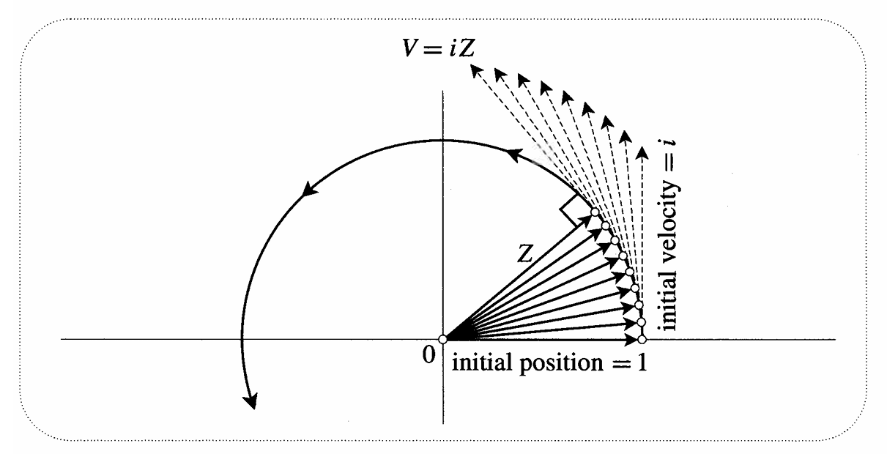
  
图[8]

由式 (11)，速度 $V=\dot Z=iZ$，也就是把位置向量 $Z$ 逆时针旋转直角。初始时 $Z(0)=e^0=1$，所以初速度为 $i$，粒子竖直向上运动。片刻之后，它沿这一方向移动了一小段，而新的速度仍与新的位置向量垂直。不断重复这一过程可见，粒子沿单位圆运动。

既然整个运动过程中 $|Z(t)|=1$，便有 $|V(t)|=|iZ(t)|=1$。因此经过时间 $t=\theta$，粒子沿单位圆走过弧长 $\theta$，于是 $Z(\theta)=e^{i\theta}$ 的辐角就是 $\theta$。这正是欧拉公式的几何表述。

### 1.2.3　用幂级数来论证

指数函数的幂级数为

$$e^x=1+x+\frac{x^2}{2!}+\frac{x^3}{3!}+\cdots,$$

直接计算可验证它的导数仍等于自身；进一步研究还表明，这个级数对一切实数 $x$ 都收敛。

把 $x$ 取为实数 $\theta$ 时，图 [9] 把这个由水平实数项组成的无穷和画了出来。为了理解 $e^{i\theta}$，现在把 $x=i\theta$ 代入：

$$e^{i\theta}=1+i\theta+\frac{(i\theta)^2}{2!}+\frac{(i\theta)^3}{3!}+\cdots.$$

这个级数与 $e^\theta$ 的级数同样有意义；不同的是，各项不再同向，而是每一项都与前一项成直角，于是形成一种螺旋状的折线。

图形直观地表明：$e^\theta$ 级数的收敛性保证了 $e^{i\theta}$ 的螺旋级数也收敛到复平面中的某个确定点。不过，它为何恰好落在单位圆上、辐角又为何恰好是 $\theta$，还并不明显。把级数拆成实部和虚部：

$$e^{i\theta}=C(\theta)+iS(\theta),$$

其中

$$C(\theta)=1-\frac{\theta^2}{2!}+\frac{\theta^4}{4!}-\cdots,qquad
S(\theta)=\theta-\frac{\theta^3}{3!}+\frac{\theta^5}{5!}-\cdots.$$

  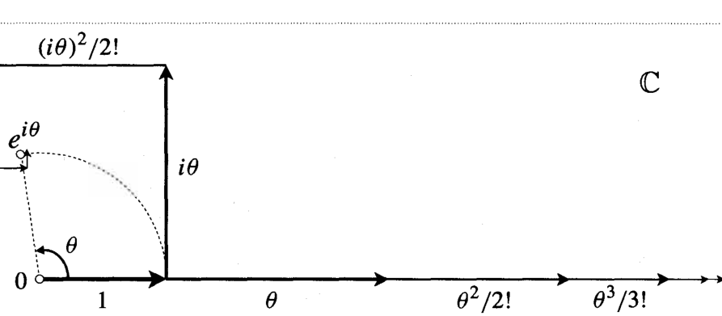
  
图 1-9

此时可以直接援引泰勒定理，认出 $C(\theta)$ 与 $S(\theta)$ 分别是 $\cos\theta$ 和 $\sin\theta$ 的幂级数。但也可以用下面这个不依赖泰勒定理的初等论证得到结论。

我们要证明 $e^{i\theta}=C(\theta)+iS(\theta)$ 的两件事：(i) 它的模为 $1$；(ii) 它的辐角为 $\theta$。逐项微分幂级数可得

$$C'=-S,qquad S'=C.$$

首先，

$$\frac{d}{d\theta}|e^{i\theta}|^2
=\frac{d}{d\theta}(C^2+S^2)
=2(CC'+SS')=0.$$

所以 $|e^{i\theta}|$ 与 $\theta$ 无关；又因 $e^{i0}=1$，故对一切 $\theta$ 都有 $|e^{i\theta}|=1$。

再设 $\Theta(\theta)$ 为 $e^{i\theta}$ 的辐角，则 $\tan\Theta=S/C$。利用 $C^2+S^2=1$ 以及 $C'=-S, S'=C$，对两边求导可得 $\Theta'(\theta)=1$，从而 $\Theta(\theta)=\theta+\text{常数}$。取 $e^{i0}=1$ 的辐角为 $0$，便得 $\Theta(\theta)=\theta$。[若把初始辐角取为 $2\pi$，几何上会有什么不同吗？]顺便说，这也在不使用泰勒定理的情况下证明了 $C(\theta)$ 与 $S(\theta)$ 分别就是 $\cos\theta$ 和 $\sin\theta$。

### 1.2.4　用欧拉公式来表示正弦和余弦

欧拉公式的一个简单但重要的结果是，正弦和余弦可以由指数函数构造出来。更准确地说，检查[10]

  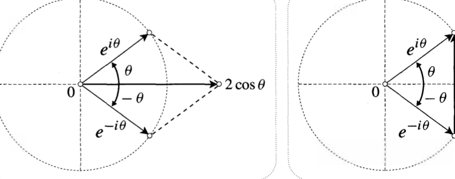
  
图 1-10

$$\cos\theta=\frac{e^{i\theta}+e^{-i\theta}}{2},\qquad \sin\theta=\frac{e^{i\theta}-e^{-i\theta}}{2i}. \tag{12}$$

## 1.3　一些应用

### 1.3.1　引言

通常那些看起来不涉及复数的问题，通过复数的视角来看，仍然能够以最优雅的方式解决。在本节中，我们将通过来自数学各个领域的多种示例来说明这一点。更多示例可以在本章末尾的练习中找到。

第一个例子[三角学]仅仅说明了已发展概念的威力，但其余的例子则发展了重要的新思想。

### 1.3.2　三角学

所有三角恒等式都可以看作复数乘法规则的结果。下面为简化记号，令 $C=\cos\theta$、$S=\sin\theta$，并令 $c=\cos\phi$、$s=\sin\phi$。

  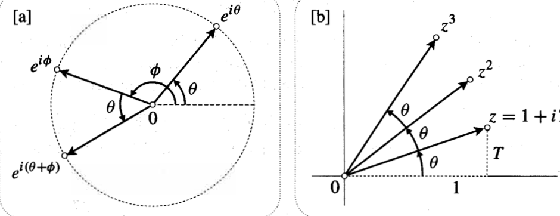
  
图 1-11

要求 $\cos(\theta+\phi)$ 的恒等式，可把它看成 $e^{i(\theta+\phi)}$ 的实部，见图 [11a]。由于

$$\begin{aligned}
\cos(\theta+\phi)+i\sin(\theta+\phi)
&=e^{i(\theta+\phi)}\\
&=e^{i\theta}e^{i\phi}\\
&=(C+iS)(c+is)\\
&=(Cc-Ss)+i(Sc+Cs),
\end{aligned}$$

比较实部和虚部便同时得到

$$\cos(\theta+\phi)=Cc-Ss,qquad
\sin(\theta+\phi)=Sc+Cs.$$

这也展示了复数方法的一个优势：一个复等式同时包含两个实等式。

为了同时求出 $\cos3\theta$ 与 $\sin3\theta$，考察

$$\begin{aligned}
\cos3\theta+i\sin3\theta
&=e^{i3\theta}=(e^{i\theta})^3=(C+iS)^3\\
&=(C^3-3CS^2)+i(3C^2S-S^3).
\end{aligned}$$

再用 $C^2+S^2=1$，便得到熟悉的公式

$$\cos3\theta=4C^3-3C,qquad \sin3\theta=3S-4S^3.$$

刚才我们把倍角的三角函数表示为原角三角函数的幂，也可以反过来把幂表示成倍角函数。例如，由 $2\cos\theta=e^{i\theta}+e^{-i\theta}$ 可得

$$16\cos^4\theta=(e^{i\theta}+e^{-i\theta})^4
=2\cos4\theta+8\cos2\theta+6,$$

即

$$\cos^4\theta=\frac18\cos4\theta+\frac12\cos2\theta+\frac38.$$

尽管欧拉公式在进行此类计算时非常方便，但它并非必需：我们实际上使用的只是复数乘法几何形式和符号形式的等价性。为了强调这一点，让我们做一个不使用欧拉公式的例子。

为了用 $T=\tan\theta$ 表示 $\tan3\theta$，考察 $z=1+iT$，见图 [11b]。$z$ 的辐角为 $\theta$，故 $z^3$ 的辐角为 $3\theta$。于是

$$z^3=(1+iT)^3=(1-3T^2)+i(3T-T^3),$$

从而

$$\tan3\theta=\frac{\operatorname{Im}(z^3)}{\operatorname{Re}(z^3)}
=\frac{3T-T^3}{1-3T^2}.$$

### 1.3.3　几何

我们将把关于几何应用的讨论建立在一个单一的例子上。在[12a]中，我们已经在任意四边形的各边上构造了正方形。让

  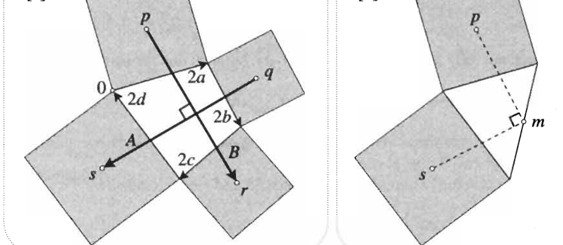
  
图 1-12

让我们证明这张图片强烈暗示的内容：连接相对正方形中心的线段是垂直且等长的。要找到这个令人惊讶的结果的纯几何证明需要极大的创造力，因此我们不依赖自己的智慧，而是借助他人的智慧。

为方便起见引入因子 $2$，令 $2a,2b,2c,2d$ 表示依次沿四边形四条边的复数。四边形闭合的唯一条件是

$$a+b+c+d=0.$$

如图把复平面的原点取在边 $2a$ 的起点。要到达建在该边上的正方形中心 $p$，先沿 $a$ 前进，再沿与 $a$ 垂直且等长的方向前进；由于 $ia$ 是 $a$ 逆时针旋转直角所得，故

$$p=(1+i)a.$$

同理，

$$q=2a+(1+i)b,quad
r=2a+2b+(1+i)c,quad
s=2a+2b+2c+(1+i)d.$$

令 $A=s-q$（从 $q$ 指向 $s$）且 $B=r-p$（从 $p$ 指向 $r$），则

$$A=(b+2c+d)+i(d-b),qquad
B=(a+2b+c)+i(c-a).$$

要证明 $A$ 与 $B$ 垂直且等长，只须证明 $B=iA$，也就是 $B$ 由 $A$ 旋转 $\pi/2$ 得到。等价地，只须验证 $A+iB=0$；而

$$A+iB=(a+b+c+d)+i(a+b+c+d)=0.$$

图 [12b] 给出了相关结论：在任意三角形的两边上作正方形，从两个正方形中心到第三边中点 $m$ 的线段互相垂直且等长。练习 21 说明可由图 [12b] 很快推出图 [12a]。当然，也可沿用上面的复数方法证明它；不过下面将寻找一个纯几何论证。

为此，我们将进行一个有趣的绕道，研究平面的平移和旋转在复函数中的表现。实际上，这个“绕道”比我们将应用其结果的几何难题要重要得多。

设 Tu 表示由向量 v 进行的平面平移，使得一个一般点 $z$ 被映射为 T_u($z$) = $z$ + v。参见 [13a]，其中也说明了平移对三角形的影响。To 的逆变换，记作 T^-1，是使其恢复原状的变换；更正式地，T_u^-1 定义为 T_u^-1 ° T_u = & = T_u ° T_u^-1，其中 & 是“什么也不做”的变换（称为恒等变换），它将每个点映射到自身。

如果我们先进行平移 Tv，然后再进行另一次平移 Tw，那么平面的复合映射 Tw o T 也是一次平移：

Tw o T,(z) = Tw(z + v) = z + (w + u) = Tw+v(z)。这为我们提供了一种激发加法本身的有趣方式。如果我们引入一个复数 v 作为平移 T，那么我们就可以将两个复数 T 和 Tw 的“和”定义为依次执行这些平移（无论顺序如何）的净效果。当然，这将等价于我们实际给出的加法定义。

这种方法基于 Finney [1970] 的一篇论文。

  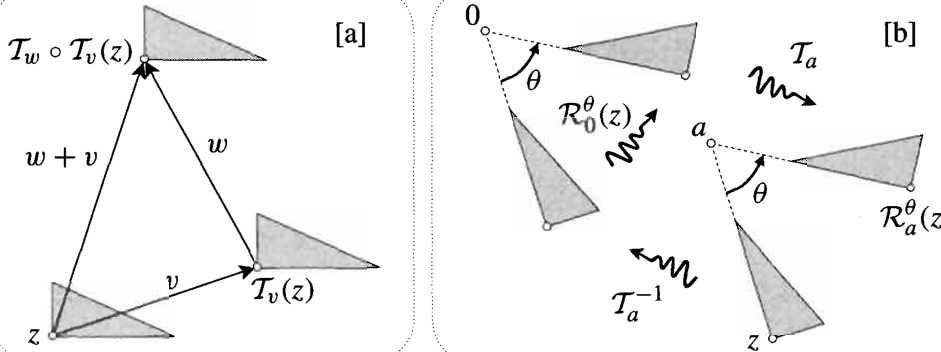
  
图 1-13

设 Ro 表示平面绕点 a 旋转角度 θ。对于作为复函数的旋转，注意 (9) 表示绕原点的旋转可以写成 Rg(z) = e^{iθ} z。

如[13b]所示，一般旋转 Ra 可以通过将 a 平移到 O，围绕 O 旋转，然后将 O 再平移回 a 来实现：

Re(z) = (TaR  T-1)(z) = ei (z -a) +α = eioz + k，其中 k = a(1 - eig)。因此我们发现，绕任意一点的旋转可以改为先绕原点进行相同的旋转，然后再进行平移：平移总是可以归约为单次旋转：

T, oR = R，其中 c = v/(1 - eiα)。以同样的方式，你可以很容易地验证，如果我们在旋转之前进行平移，净变换仍然可以通过一次旋转来完成：R& o T, -- Re。p 是什么？

刚得到的结果在几何上当然并不明显 [试一试]，它们用来说明将平移和旋转视为复函数的强大作用。作为进一步的说明，考虑围绕不同点进行两次旋转的净效应。将旋转表示为复函数，一个简单的计算 [练习] 得出(Rg oR)($z$) = ei(α $)$z$   v，其中 = aeiΦ(1 -eie) b(1 -ei冲)。除非 (Φ) 是 2π 的倍数，否则前一段因此告诉我们 Rg oR = R(9)，其中 [如果 b = a 或 Φ = 0，c 应该等于多少？检查公式。] 这个结果是

  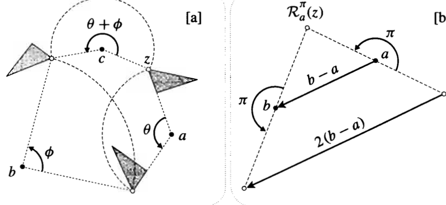
  
图 1-14

如图[14a]所示。稍后我们将找到这个结果的纯几何解释，并且在此过程中，给出由上述复杂公式得到的点c的一个非常简单的几何作图方法。

另一方面，如果 ( + §) 是 2 的倍数，那么 ei(β+$) = 1，并且Rg 。R = T，其中 ~= (1 - eiΦ)(b - a)。例如，令 . = Φ = π，这预测 R o Ra = T2(b-a) 是沿连接第一个旋转中心到第二个旋转中心的复数的两倍的平移。实际上这确实正确，可以直接从 [14b] 推导出来。

以上关于两个旋转组合的结果意味着[练习]设 M = Ra, o.. o R Ra 是 n 次旋转的复合并且设 @ = 1 + 22 + ... + On 为旋转的总量。在一般情况下，M = -R（对于某个c），但是如果是2的倍数，那么回到我们最初的问题，我们现在可以给出一个优雅的几何解释，我们只需要发现 M 对单个点的作用。显然，M(k) = k，所以 M 是零平移，即恒等变换 &。因此，如果我们定义 s' = Rm (s)，那么 m 是 ss' 的中点。但是，另一方面，因此三角形 sps' 是等腰三角形，并且在 p 点有直角，所以 sm 和 pm 是垂直的并且长度相等。完成。

  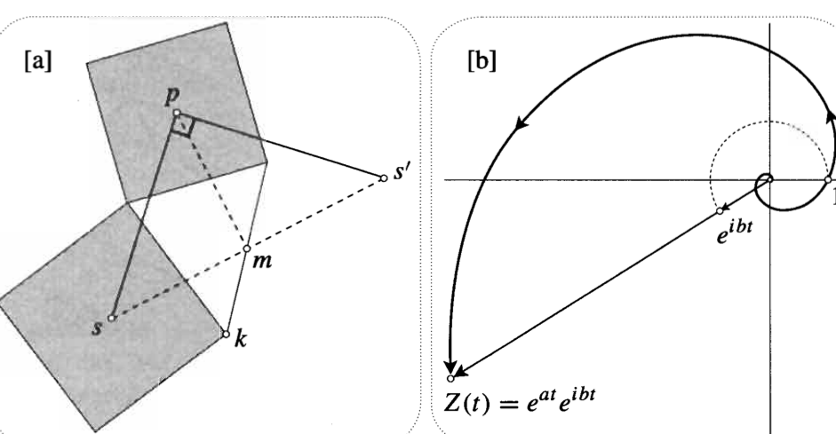
  
图 1-15

### 1.3.4　微积分

作为微积分方面的例子，考虑求 $e^x\sin x$ 的第 $100$ 阶导数。更一般地，我们将说明如何用复数求 $e^{at}\sin bt$ 的第 $n$ 阶导数。

讨论欧拉公式时，我们把 $e^{it}$ 看成一个质点在时刻 $t$ 的位置；它以单位速度沿单位圆运动。同理，$e^{ibt}$ 可看成一个以角速度 $b$ 绕原点旋转的单位复数。若在旋转的同时把它按因子 $e^{at}$ 伸长，其端点便描出一条从原点向外盘旋的螺线，见图 [15b]。

这与开头问题的联系在于，质点在时刻 $t$ 的位置为

$$Z(t)=e^{at}e^{ibt}=e^{at}\cos bt+i,e^{at}\sin bt.$$

因此，$e^{at}\sin bt$ 是 $Z$ 的竖直（虚部）分量，它的导数就是速度 $V=\dot Z$ 的竖直分量。

我们可以通过对上述表达式中Z的各分量进行求导来简单地找到V，但我们将利用这个例子来介绍本书将会一直使用的几何方法。在[16]中，考虑该运动回忆速度的定义：当 $\delta\to0$ 时，$V$ 是 $M/\delta$ 的极限。本书会使用两种等价说法：(i) “当 $\delta$ 为无穷小时，$V=M/\delta$”；(ii) “当 $\delta\to0$ 时，$V$ 与 $M/\delta$ 最终相等”。

这里的“最终相等”和“无穷小”都有明确的技术含义；“无穷小”并不指某种神秘的、真正无限小的量。更准确地说，若 $X$、$Y$ 都依赖于 $\delta$，那么“当 $\delta$ 为无穷小时 $X=Y$”是指

$$\lim_{\delta\to0}\frac{X}{Y}=1,$$

也就是说，当 $\delta\to0$ 时，$X$ 与 $Y$ 最终相等。由极限的基本定理，“最终相等”继承了普通相等的许多性质。例如，由 $V$ 与 $M/\delta$ 最终相等，可知 $V\delta$ 与 $M$ 也最终相等。关于这种区别的更多讨论，参见 Chandrasekhar [1995]。

我们现在回到寻找螺旋粒子速度的问题。通过这些点的圆弧（以O为中心）。现在设A和B为将Z(t)连接到这些射线和圆弧示意交点的复数。如果8是无穷小的，则B与A和Z成直角，并且M = A + B。

  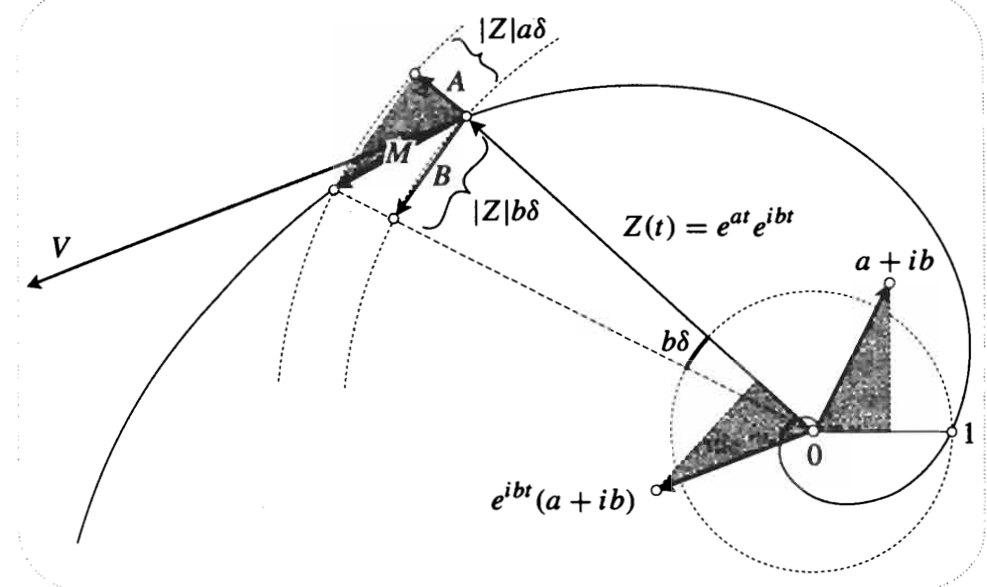
  
图 1-16

来求 $A$ 与 $B$ 的最终长度。在时间间隔 $\delta$ 内，$Z$ 的辐角增加 $b\delta$，两条射线因而在单位圆上截出长为 $b\delta$ 的弧，在经过 $Z$ 的圆上截出长为 $|Z|b\delta$ 的弧。因此 $|B|$ 与 $|Z|b\delta$ 最终相等。另一方面，$|A|$ 是这段时间内 $|Z(t)|=e^{at}$ 的增量，所以 $|A|$ 与 $|Z|a\delta$ 最终相等。

所以，图中 $Z$ 处的阴影三角形最终与斜边为 $a+ib$ 的阴影直角三角形相似。把后一个三角形旋转到 $Z$ 的方向并按 $|Z|\delta$ 伸缩，可见当 $\delta$ 为无穷小时

$$M=(a+ib)Z\delta,$$

两边除以 $\delta$ 并取极限，得到

$$\dot Z=(a+ib)Z. \tag{13}$$

因此，所有从原点出的射线都以相同的角度切割螺旋线（a + ib 的角度），并且粒子的速度与其到原点的距离成正比。

请注意，尽管我们尚未给出 e?（其中 z 是一般的复数）的含义，但将 Z(t) = e^(at) * e^(ibt) = e^(a+ib)t 写出来无疑是很诱人的。这使得结果 (13) 看起来非常自然。相反，这也表明我们应该将 e^z = e^(x+iy) 定义为 e^x * e^(iy)；在下一章中，这一步骤的另一个理由将会出现。

利用式 (13)，继续求导便很容易：每求一次导数，只需把前一个结果乘以 $a+ib$。[可尝试在图 [16] 上画出这些逐次导数。] 写成

$$a+ib=Re^{i\phi},\qquad R=\sqrt{a^2+b^2},\qquad
\phi=\tan^{-1}(b/a)$$

（$\phi$ 应取正确象限中的值），于是

$$Z^{(n)}=(a+ib)^nZ=R^n e^{in\phi}e^{at}e^{ibt}
=R^n e^{at}e^{i(bt+n\phi)}.$$

$$\frac{d^n}{dt^n}\!\left(e^{at}\sin bt\right)=(a^2+b^2)^{n/2}e^{at}\sin\!\left[bt+n\tan^{-1}\!\left(\frac{b}{a}\right)\right]. \tag{14}$$

### 1.3.5　代数

罗杰·科茨（Roger Cotes）在去世前一年（1716）作出了一项重要发现，使他原则上能够计算一族积分

$$\int\frac{dx}{x^n-1},\qquad n=1,2,3,\ldots.$$

要看它与代数的联系，先取 $n=2$。分母可分解为 $x^2-1=(x-1)(x+1)$，再作部分分式分解：

$$\frac1{x^2-1}=\frac12\left(\frac1{x-1}-\frac1{x+1}\right).$$

对较大的 $n$，若不使用复数，就不能把 $x^n-1$ 完全分解为一次因子——而在 1716 年，复数仍是稀罕且备受怀疑的工具。不过科茨知道，只要能把 $x^n-1$ 分解为实一次因子与实二次因子，便能计算这个积分；所谓“实二次因子”，是指系数全为实数的二次多项式。

例如，(x^4 - 1) 可以分解为 (x - 1)(x + 1)(x^2 + 1)，得到的部分分式表达式的形式，因此可以得到一个可以用 ln 和 tan⁻¹ 来求值的积分。更一般地，即使分解涉及比 (x^2 + 1) 更复杂的二次式，也很容易证明，只需要 ln 和 tan⁻¹ 就可以求出由此得到的积分。

为了把科茨关于 $x^n-1$ 的工作放在更广的背景中，我们先考察多项式的根与因式分解之间的一般联系。令 $c,z$ 为复数，并考虑几何级数

$$G_{m-1}=c^{m-1}+c^{m-2}z+c^{m-3}z^2+\cdots+cz^{m-2}+z^{m-1}.$$

与实代数中一样，注意到 $zG_{m-1}$ 与 $cG_{m-1}$ 几乎含有相同的项；两式相减便得

$$(z-c)G_{m-1}=z^m-c^m. \tag{15}$$

如果我们将 c 视为固定的，z 视为变量，那么 (z^m - c^m) 是关于 z 的 m 次多项式，并且 z = c 是一个根。结果 (15) 表明这个 m 次多项式可以分解为一次项 (z - c) 与 (m - 1) 次多项式 G_{m-1} 的乘积。

1637 年，笛卡尔发表了这一结果的重要推广。设一般的 $n$ 次多项式为

$$P_n(z)=z^n+Az^{n-1}+\cdots+Dz+E,$$

其中系数 $A,ldots,E$ 可以是复数。式 (15) 蕴含

$$P_n(z)-P_n(c)=(z-c)\,[G_{n-1}+AG_{n-2}+\cdots+D],$$

由此得到把根与可因式分解性联系起来的笛卡尔因式定理：若 $c$ 是 $P_n(z)=0$ 的一个根，则

$$P_n(z)=(z-c)P_{n-1}(z),$$

其中 $P_{n-1}$ 的次数为 $n-1$。

若再找到 $P_{n-1}$ 的一个根 $c'$，同样的推理给出 $P_n=(z-c)(z-c')P_{n-2}$。如此继续，笛卡尔定理就展现出把 $P_n$ 分解为恰好 $n$ 个一次因子的可能性：

$$P_n(z)=(z-c_1)(z-c_2)\cdots(z-c_n). \tag{16}$$

如果我们不承认复根的存在（如18世纪早期），那么这种分解在某些情况下是可能的（例如，$z$² - 1），而在其他情况下则不可能（例如，$z$³ - 1）。但是，与此形成鲜明对比的是，如果承认复数，那么可以证明 Pn 在复数域 C 中总共有 n 个根，并且分解（16）总是可能的。这就是所谓的代数学基本定理，我们将在第7章解释它的正确性。

式 (16) 中每个因子 $z-c_k$ 都表示从根 $c_k$ 指向变量点 $z$ 的复数。图 [17a] 画出了一般三次多项式的情形。若写成 $z-c_k=R_ke^{i\phi_k}$，式 (16) 便成为更形象的形式

$$P_n(z)=R_1R_2\cdots R_n,e^{i(\phi_1+\phi_2+\cdots+\phi_n)}.$$

虽然代数学基本定理对科茨来说尚不可用，但让我们看看它如何保证他能够成功地将 xn - 1 分解为实线性因子和二次因子。科茨的多项式具有实系数，并且，一般来说，我们可以证明若多项式的系数全为实数，则它的非实根成共轭对出现，因而多项式可分解为实一次因子与实二次因子。事实上，若 $P_n$ 的系数都是实数，则 $P_n(c)=0$ 蕴含 $P_n(\bar c)=0$ [练习]；而每对共轭因子满足

$$(z-c)(z-\bar c)=z^2-2\operatorname{Re}(c)z+|c|^2,$$

这正是实二次因子。

现在让我们讨论一下科特是如何通过利用正n边形的几何性质，将xn - 1分解为实数一次因子和二次因子的。[“n边形”是指一个有n条边的多边形。] 要理解以下内容，请把自己置身于他的18世纪的视角，并忘掉你刚刚学到的关于代数学基本定理的所有知识；甚至忘掉复数和复平面！

对于 n 的前几个值，Un(x) = xn - 1 的所需因式分解为

$$U_2(x)=(x-1)(x+1). \tag{17}$$

$$U_3(x)=(x-1)(x^2+x+1). \tag{18}$$

$$U_4(x)=(x-1)(x+1)(x^2+1). \tag{19}$$

  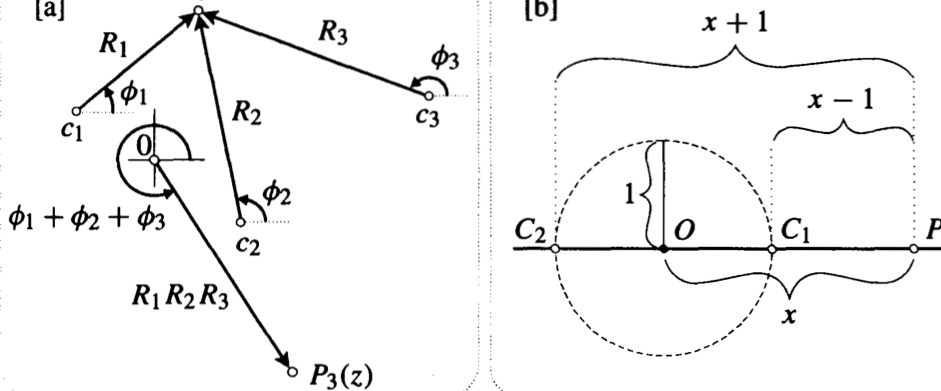
  
图 1-17

但是总体模式似乎难以捉摸。

为了找到这样的模式，让我们尝试将最简单的情况 (17) 进行可视化。参见 [17b]。设 O 为一个固定点，P 为平面上一条直线上的一个可变点（我们不把它看作 C），并设 x 表示距离 OP。如果我们现在以 O 为中心画一个单位半径的圆，并设 C1 和 C2 为该圆与直线的交点，那么显然° U2(x) = PC1 · PC2。

为了用同样的思路理解二次因子，先跳过式 (18)，考察式 (19) 中较简单的二次因子。若暂不使用复数，$U_4(x)$ 只能分解到这一步；但若想把它理解成四个“线性距离因子”的乘积，可重写为

$$U_4(x)=(x-1)(x+1)\sqrt{x^2+1}\sqrt{x^2+1}.$$

勾股定理表明：到 $P$ 的距离为 $\sqrt{x^2+1}$ 的点，应位于过 $O$ 且垂直于 $OP$ 的直线上，并与 $O$ 相距 $1$。参见图 [18a]，于是

$$U_4(x)=PC_1\cdot PC_2\cdot PC_3\cdot PC_4,$$

其中 $C_1C_2C_3C_4$ 是图中的单位圆内接正方形。

既然正方形给出了 $U_4(x)$ 的分解，也许正三角形能够给出 $U_3(x)$ 的分解。参见图 [18b]。由勾股定理，

$$PC_1\cdot PC_2\cdot PC_3
=(x-1)\left[\left(x+\frac12\right)^2+\left(\frac{\sqrt3}{2}\right)^2\right]
=(x-1)(x^2+x+1),$$

在这里，以及在接下来的内容中，为了方便起见，我们假设 x > 1，因此 Un(x) 是

  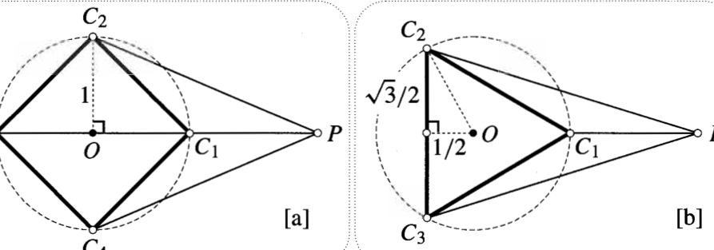
  
图 1-18

这确实是 U3(x) 的所需分解式 (18)！

现在出现了一个对 Un 的合理概括：

若 $C_1C_2\cdots C_n$ 是以 $O$ 为圆心、半径为 $1$ 的圆内接正 $n$ 边形，而 $P$ 是射线 $OC_1$ 上满足 $OP=x$ 的点，则

$$U_n(x)=PC_1\cdot PC_2\cdots PC_n.$$

这就是科茨的结果。遗憾的是，他只陈述了结论而没有证明，也没有留下发现它的线索；我们只能猜测，他也许受到过类似上述几何论证的启发。

由于正 n 边形的顶点总是成对对称，且与 P 的距离相等，[18] 中的例子清楚地表明，科特的结果确实等同于将 Un(x) 分解为实线性因子和二次因子。

恢复关于复数及其几何解释的记忆后，科茨的结果就很容易理解和证明。取 $O$ 为复平面的原点、$C_1=1$，则正 $n$ 边形的顶点正是 $U_n(z)=z^n-1$ 的 $n$ 个复根：

$$C_k=e^{2\pi i(k-1)/n},\qquad k=1,\ldots,n.$$

这些顶点称为 $n$ 次单位根。

由笛卡尔因式定理，

$$z^n-1=\prod_{k=1}^n(z-C_k),$$

而每对共轭根产生一个实二次因子。每个因子 $z-C_k=R_ke^{i\phi_k}$ 都可看成从正 $n$ 边形顶点 $C_k$ 指向 $z$ 的复数，参见图 [17a]。因此，若 $P$ 是平面中任意一点，便有

  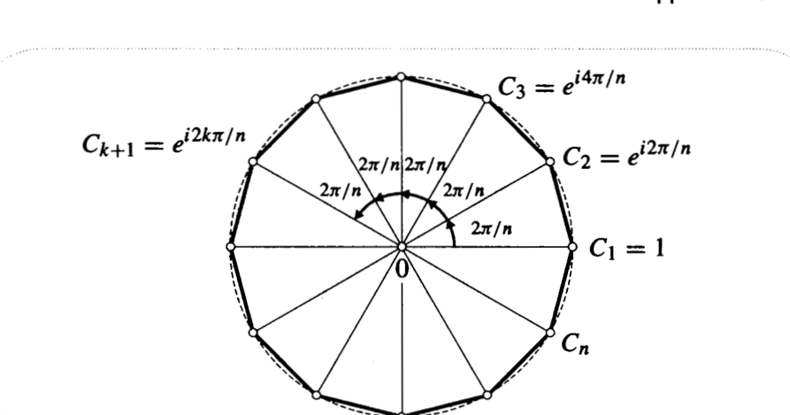
  
图 1-19

$$U_n(P)=\bigl(PC_1\cdot PC_2\cdots PC_n\bigr)e^{i\Phi},qquad
\Phi=\phi_1+\phi_2+\cdots+\phi_n.$$

若 $P$ 恰在实轴上且 $P>1$，则 $\Phi=0$ [请确认这一点]，于是恢复科茨的原结论。

9 Stillwell [1989, p. 195] 推测，科茨实际上使用了复数（正如我们刚才所做的），随后却有意把结果表述成不需要复数的形式。

我们没有立即用复数的形式陈述和证明科茨的结果，因为我们觉得我们最初的、直接的方法有些非常吸引人的地方。回过头看，它表明即使我们试图回避复数，我们也无法回避复平面的几何！

### 1.3.6　向量运算

复数加法不仅等同于向量加法，下面还将看到，熟悉的点积与叉积（也称标量积与向量积）都包含在复数乘法之中。这两种向量运算在物理学中极其重要——它们本来就是由物理学家提出的——所以它们与复数乘法的联系，无论对把复分析应用于物理世界，还是用物理直觉理解复分析，都会很有价值。

当复数 $z=x+iy$ 只被看作向量时，我们把它写成粗体，并把分量排成一列：

$$\mathbf z=\begin{pmatrix}x\\y\end{pmatrix}.$$

虽然点积和叉积对空间中的任意向量都有意义，以下只考虑同一平面——复平面——中的向量。

给定向量 $\mathbf a,\mathbf b$，图 [20a] 回顾了点积的定义：一个向量的长度乘以另一向量在它上面的投影长度，即

$$\mathbf a\cdot\mathbf b=|a|,|b|\cos\theta
=\mathbf b\cdot\mathbf a,$$

  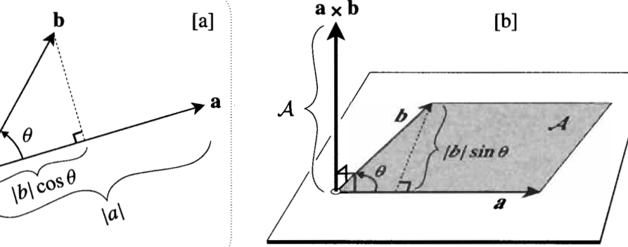
  
图 1-20

其中 $\theta$ 是从 $\mathbf a$ 到 $\mathbf b$ 的夹角。

图[20b] 回顾了叉积的定义：a × b 是垂直于向量 a 和 b 所在平面的向量，其长度等于由 a 和 b 张成的平行四边形的面积 A。但等一下，有两个（相反的）方向垂直于 C；我们应该选择哪一个？

写成 $A=|a|,|b|\sin\theta$ 后，面积 $A$ 带有符号。把从 $\mathbf a$ 到 $\mathbf b$ 的有向角 $\theta$ 取在 $(-\pi,\pi]$ 内，则 $A$ 与 $\theta$ 同号。若 $A>0$，如图 [20b]，定义 $\mathbf a\times\mathbf b$ 指向平面上方；若 $A<0$，则指向下方。因此

$$\mathbf a\times\mathbf b=-(\mathbf b\times\mathbf a).$$

这种关于 a × b 的传统定义本质上是三维的，因此它带来了一个问题：如果把 a 和 b 看作复数，a × b 就不可能是复数，因为它不在 a 和 b 所在的（复数）平面上。点积没有这样的问题，因为 a·b 只是一个实数，这表明由于这里的向量全在同一平面内，所有叉积的方向只有正、反两种可能，彼此真正不同的只是带符号面积 $A$ 的数值。因此本书把平面向量的叉积重新定义为由 $\mathbf a,mathbf b$ 张成的平行四边形的带符号面积：

$$\mathbf a\times\mathbf b=|a|,|b|\sin\theta
=-(\mathbf b\times\mathbf a).$$

图 [21] 中 $a=|a|e^{i\alpha}$、$b=|b|e^{i\beta}$，从 $a$ 到 $b$ 的有向角为 $\theta=\beta-\alpha$。为揭示点积、叉积与复数乘法的关系，把复平面中每一点乘以 $\bar a$。这个变换把平面旋转 $-\alpha$，再放大 $|a|$ 倍；观察斜边为 $b$ 的阴影直角三角形在此变换下的像，立刻得到

$$\bar a b=\mathbf a\cdot\mathbf b+i(\mathbf a\times\mathbf b). \tag{20}$$

当然，也可直接计算：

$$\bar a b=|a|,|b|e^{i(\beta-\alpha)}
=|a|,|b|(\cos\theta+i\sin\theta),$$

其实部正是点积，虚部正是带符号的叉积。

  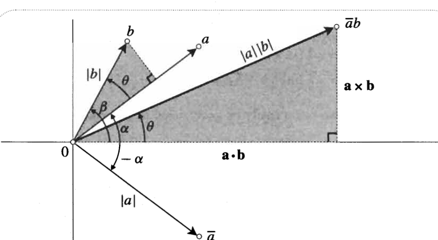
  
图 1-21

所谓“向量运算”，是指点积和叉积由几何定义，与坐标轴的具体选择无关。一旦选定笛卡尔坐标，由式 (20) 立即得到：若 $a=x+iy$、$b=x'+iy'$，则

$$\bar a b=(x-iy)(x'+iy')=(xx'+yy')+i(xy'-yx'),$$

所以

$$\mathbf a\cdot\mathbf b=xx'+yy',\qquad
\mathbf a\times\mathbf b=xy'-yx'.$$

我们最后给出一个例子，说明面积符号(a × b)的重要性。考虑求四边形 [22a] 的面积 A' 的问题，其顶点按逆时针顺序为 a、b、c 和 d。显然，这只是将四边形顶点与原点连成的四个三角形的普通无符号面积之和。因此，由于每个三角形的面积为

  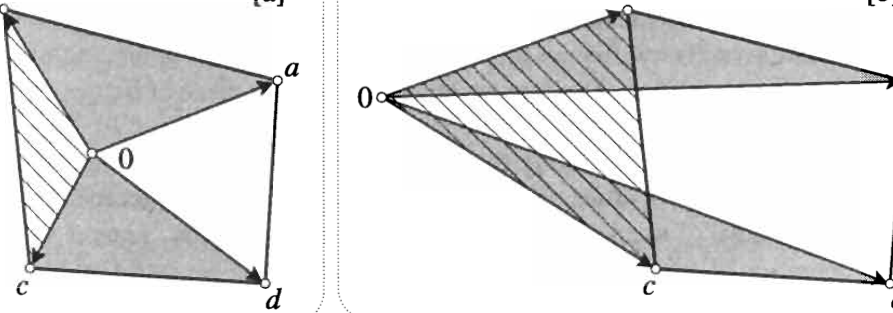
  
图 1-22

只是相应平行四边形面积的一半，

$$A=\frac{1}{2}[(\mathbf a\times\mathbf b)+(\mathbf b\times\mathbf c)+(\mathbf c\times\mathbf d)+(\mathbf d\times\mathbf a)]. \tag{21}$$

显然，这个公式很容易推广到多边形，边数更多的情况但是如果0在四边形外面呢？在[22b]中，A显然是三个三角形的普通面积之和减去有条纹三角形的普通面积。由于从b到c的角是负的，(b × c)自动为条纹面积的负值，因此A正好由相同的公式给出你能找到一个 O 的位置，使得两个带符号的面积为负吗？检查公式是否仍然有效。练习 35 显示 (21) 总是成立的。

## 1.4　变换与欧氏几何

### 1.4.1　克莱因眼中的几何

即使拥有巨大的后见之明，要以引人注目的方式介绍复数仍然很困难。从历史上看，我们已经看到三次方程如何在代数上迫使我们接触复数，在讨论科茨的工作时，我们也看到它们几何解释的某种必然性。在本节中，我们将尝试展示复数是如何非常自然，几乎不可避免地，从对平面欧几里得几何的仔细重新审视中出现的。

正如本节标题后的 * 所示，其所包含的内容本身就非常有趣，而且它们对于理解本书的其他可选章节也是必需的。

尽管古希腊人在几何学上做出了许多美丽而卓越的发现，但直到两千年后，费利克斯·克莱因才首次提出并回答了“几何学是什么？”这一问题。

让我们从一开始就将讨论限制在平面几何上。人们可能会说，这是研究平面上几何图形的几何性质，但什么是（i）“几何性质”，以及（ii）“几何图形”呢？我们将集中讨论（i），快速略过（ii），将“几何图形”解释为我们可以用一个无限细的笔在一张无限大的厚纸上绘制的任何东西。

至于(i)，我们首先注意到，如果两个图形（例如两个三角形）具有相同的几何性质，那么（从几何的角度来看）它们必须是“相同的”、“相等的”，或者如通常所说的，全等的。因此，如果我们有一个关于全等（“几何等价”）的明确定义，那么我们就可以逆向进行。这方面，Nikulin 和 Shafarevich [1987] 的优秀著作是我们所知的唯一另一部尝试类似做法的作品。

观察并将几何性质定义为所有全等图形共有的性质。那么，我们如何判断两个图形在几何上是否相同考虑[23]中的三角形，并想象它们是你可以手中拿起的纸片。要看看T是否与T'全等，你可以拿起T 并检查它是否可以放在 T' 上方。注意，我们必须被允许在空间中移动 T 这一点至关重要：为了将 T 放在 T 上方，我们必须先将它翻转过来；我们不能仅仅在平面内滑动 T。初步概括地说，这表明如果存在一种使图形 F 通过空间运动与 F' 重合的运动，那么图形 F 就与另一图形 F' 全等。注意，这一讨论表明存在两种根本不同的运动类型：一种涉及将图形翻转过来，另一种则不涉及。稍后，我们将回到这个问题。

  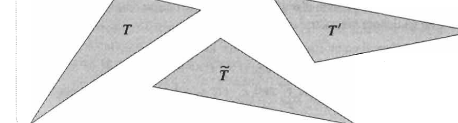
  
图 1-23

然而，用空间中的搬动来定义平面几何显然不够令人满意。回到图 [23]，设想 $T$ 与 $T'$ 分别画在两张透明塑料片上。现在拿起的不只是三角形 $T$，而是画着它的整张薄片；把这张薄片叠到另一张上，使 $T$ 与 $T'$ 重合。运动结束时，第一张薄片上的每一点 $A$ 都落在第二张薄片的某一点 $A'$ 上。于是可把运动 $M$ 定义为平面到自身的映射 $A\mapsto A'=M(A)$。

当然，并非任何映射都算作运动；还必须表达薄片在搬动中保持刚性的含义，也就是任意两点之间的距离不变。因此定义：

运动是平面到自身的映射，并且保持任意两点之间的距离不变。　(22)这里所谓的“运动”通常也叫刚体运动或等距变换。有了这个精确定义，便可最终定义几何上的全等：

若存在运动 $M$ 使 $F'=M(F)$，则称 $F'$ 与 $F$ 全等，记作 $F'\cong F$。　(23)接下来，作为我们之前讨论的结果，图形的几何性质是指在图形所有可能的运动下都不会改变的性质。最后，回答开头提出的“几何是什么？”这一问题时，克莱因会回答，它是对这一运动集合的不变量的研究。

上个世纪最显著的发现之一是欧几里得几何并不是唯一可能的几何。第六章将研究两种所谓的非欧几里得几何，但目前我们只想解释克莱因是如何能够概括上述思想，从而涵盖这些几何的。

（23）的目标是利用一系列变换引入几何等价的概念。但这种 -类型的等式会如我们所期望和预期的那样表现吗？要回答这个问题，我们必须先明确这些期望。为了避免将此一般讨论与（23）中关于全等的具体概念混淆，我们将几何相等用 ~ 表示。（$i$） 一个图形应等于自身：F ~ F，对所有 F。（ii） 如果 F 等于 F'，则 F' 应等于 F： F ~ F' → F' ~ F。（ii） 如果 F 和 F' 相等，且 F' 和 F“ 相等，那么 F 和 F” 也应当如此。任何满足这些期望的关系称为等价关系。

现在假设我们保留几何等价的定义（23），但是我们通过将距离保持变换的族替换为某个其他的变换族 G 来推广（22）中“运动”的定义。应该很清楚，不是任何任意的 G 都能与我们定义几何等价的目标相兼容。事实上，(i)、(ii) 和 (iii) 表明 G 必须具有以下非常特殊的结构，这在 [24] 中有示意说明。 (i) 变换族 G 必须包含一个变换 E（称为恒等变换），它映射每一点指向自身。(ii) 如果 G 包含一个变换 M，那么它也必须包含一个变换M-1（称为逆变换）可以撤销 M。[请自行检验：要使 $M^{-1}$ 存在，要存在（更别提成为 G 的成员），M 必须具有以下特殊性质是 (a) 满射 和 (b) 单射，即 (a) 每个点必须是…的像某些点，并且（b）不同的点必须有不同的像。J (ii) 如果 M 和 N 是 G 的成员，那么复合变换也是 G 的成员N o M = (M 后接 N)。$G$ 的这种性质称为封闭性。由此自然得到一个在整个数学中都具有根本意义的概念：满足上述三个条件的变换族 $G$ 称为群。

例如，可令 $G$ 为射影变换群。对一个平面图形作透视图时，从原平面到“画布”平面的映射称为透视变换；射影变换则定义为有限次透视变换的复合。你能看出这些射影变换为什么构成群吗？

  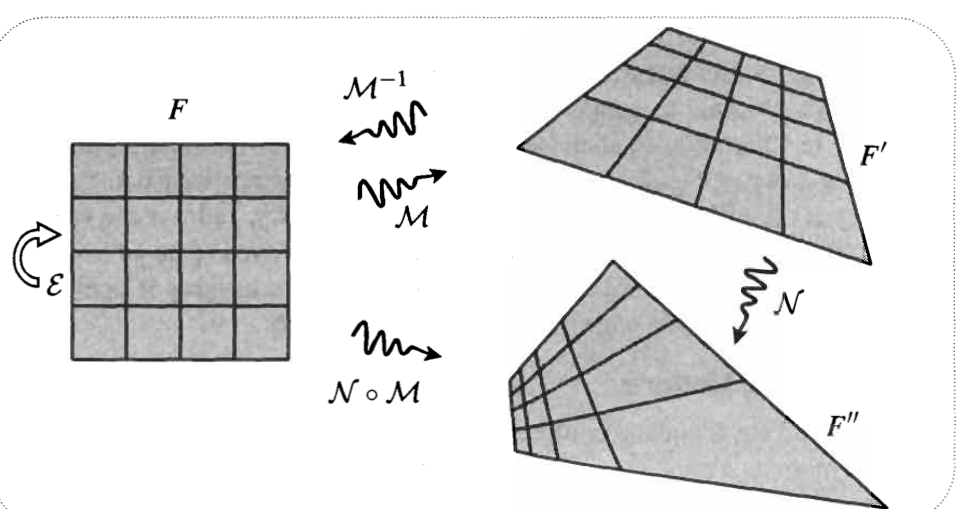
  
图 1-24

图 [24] 示意了群中恒等、逆与复合这三种基本要求。

让我们检查(22)中定义的运动是否确实形成一个群： (i) 由于恒等变换保持距离，它是一种运动。 (i) 如果存在，运动的逆变换将保持距离，因此它自身也是一种运动。关于存在性，(a) 当我们将一个运动应用于整个平面时，图像是整个平面，这是完全可能的——我们将在稍后证明——而且(b) 不同点之间的非零距离会被运动保持，所以它们的像仍然是不同的。 (ii) 如果两个变换不改变距离，那么依次应用它们也不会改变距离，所以两个运动的复合还是另一个运动。

克莱因的想法是，我们可以首先随意选择一个群 G，然后将相应的“几何”定义为对该 G 不变量的研究。[克莱因首次在 1872 年——当时他 23 岁！——在埃尔朗根大学宣布了这个想法，因此它被称为他的埃尔朗根计划。]例如，如果我们选择 G 为运动群，我们就得到了熟悉的欧几里得几何，如 [24] 所示的所谓射影几何。

克莱因对几何的视野还要宽广。到目前为止，我们考虑的是整个平面上的图形；但若只允许在某个圆盘 $D$ 内作图，也可以用完全相同的方法建立“$D$ 的几何”：给定一个把 $D$ 映到自身的变换群 $H$，相应的几何就是研究 $H$ 的不变量。若怀疑这样的群是否存在，可考虑圆盘绕其中心的所有旋转。在更抽象的情形中，还须加入第四条要求——结合律，即 $A\circ(B\circ C)=(A\circ B)\circ C$；对于变换的复合，这条性质自动成立。

读者可能会觉得，上述讨论是数学泛化失控的典型案例——由此产生的几何概念（用一句话来说）“复杂得毫无用处”。事实远非如此！在第三章中，我们将很自然地考虑一个特别有趣的将圆盘映射到自身的变换群。由此产生的非欧几何称为双曲几何或洛巴切夫斯基几何，这是第六章的主题。远非无用，这种几何在数学的各个领域被证明是一个极其强大的工具，它持续提供的洞见处于当代研究的前沿。

### 1.4.2　运动的分类

为了理解欧几里得几何的基础，似乎我们必须研究其运动群。目前，这个群被相当抽象地定义为将平面映射到自身的保持距离的映射的集合。然而，想出具体的运动例子是很容易的：围绕任意一点的平面旋转、平面平移或平面对某条直线的反射。我们的目标是以同样生动的方式理解最一般可能的运动。

一个运动由它在任意三个不共线点上的作用唯一确定。　(24)我们的意思是，知道三个点发生了什么，就能告诉我们平面上的每一个点必须发生什么。要理解这一点，首先看看[25]。这表明

  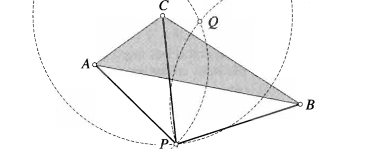
  
图 1-25

每个点 P 都由它到这样一个三角形的顶点 A、B、C 的距离唯一确定。从 A 和 B 的距离产生两个圆，它们（通常情况下）在两点 P 和 Q 相交。第三个距离（来自 C）则确定 P。

为了得到结果（24），现在看[26]。这说明了一个运动 M 将 A、B、C 映射到 A'、B'、C'。根据运动的定义，M 必须映射一个任意的13这就是地震定位的方法。地震开始时会发出两种类型的波：快速移动的压缩“P波”和较慢移动的破坏性剪切“S波”。因此，P波会在 S波之前到达地震站，这些事件之间的时间差可以用来计算地震距离该地震站的距离。在另外两个地震站重复此计算，可以定位地震。

  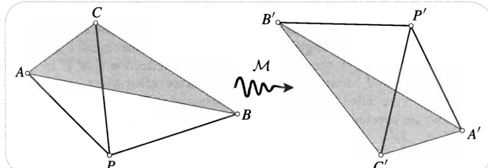
  
图 1-26

将点 P 对应到一个点 P'，使得 P' 到 A'、B'、C' 的距离等于 P 到 A、B、C 的原始距离。因此，如图所示，P' 是唯一确定的。完成。

朝着分类迈出的重要一步是意识到存在两种根本不同的运动类型。根据我们之前对空间运动的理解，这一区别在于一个图形在可以放到与之全等的图形上之前，是否必须翻转。要了解在新定义（22）下这个二分法是如何产生的，假设一个运动将两点A和B映射到A'和B'。见[27]。根据（24），运动尚未确定：我们需要知道任意（非共线）第三点C的像，例如[27]中所示的点。由于运动保持C与A和B之间的距离，C的像只有两种可能，即C'及其在通过A'和B'的直线L上的反射C。因此，恰好存在两种将A、B映射到A'、B'的运动（分别记为M和M'）。M 将 C 发送到 C'，并且 M 将 C 发送到 C。

可以通过观察它们如何影响角度来区分 M 和 M。所有运动都保持角度的大小，但我们可以看到 M 还保持角度的方向，而 M 会逆转角度。这个区别的基本本质可以从这样一个事实看出：M 实际上必须保持所有角度，而 M 必须逆转所有角度。

  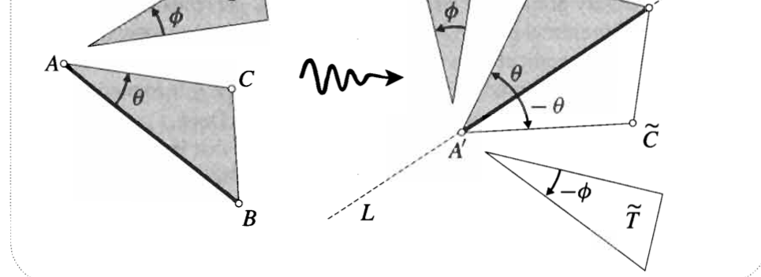
  
图 1-27

为此，请考虑三角形 T 中角 Φ 的变化。如果 C 移动到 C'（即，如果运动是 M），那么按照文献 [26] 中所示的构造，T 的像是 T'，且角度保持不变。另一方面，如果 C 移动到 C（即，如果运动是 M），那么 T 的像是 T' 在 L 上的反射 T，且角度发生反转。保持角度的运动称为保向运动，而反转角度的运动称为反向运动。因此，旋转和平移是保向运动，而反射是反向运动。总结我们所发现的内容，恰有一个保向运动 $M$ 和一个反向运动 $M^*$ 把给定线段 $AB$ 映为等长线段 $A'B'$；且 $M^*$ 等于 $M$ 后接关于直线 $A'B'$ 的反射。　(25)M = （M 后跟在直线 A'B' 上的反射）。

为了理解运动，我们可以考虑两条随机抽取的等长线段 AB 和 A'B'，然后找到保向运动（以及反向运动）每个保向运动都是一个旋转，或者在例外情形下是一个平移。　(26)请注意，这个结果让我们对之前关于旋转和平移组合的计算有了更深入的了解：由于任何两个保向运动的组合是另一个保向运动 [为什么？]，它只能是旋转或平移。

$$M(z)=e^{i\theta}z+v. \tag{27}$$

我们现在建立 (26)。如果线段 A'B' 平行于 AB，那么向量 AB 和 A'B' 要么相等，要么相反。如果它们相等，如 [28al] 所示，则运动为平移；如果它们相反，如 [28b] 所示，则运动是以直线 AA' 与 BB' 的交点为中心的 π 旋转。

如果这些线段不平行，则将它们（如有必要）画至它们在 M 点相交，并令 3 为 AB 和 A'B' 方向之间的夹角。见 [28c]。首先回忆一个圆的基本性质：弦 AA' 在圆弧 AMA' 的每一点上所对的角相等。接着，令 O 为该弧与 AA' 的垂直平分线的交点。我们现在可以看到，将 AB 移动到 A'B' 的保向运动是绕 O 旋转的，因为显然 A 被旋转到 A'，且 AB 的方向被旋转到 A'B' 的方向。完成。

平移之所以被称为“例外情形”，是因为任取两条等长线段，它们平行的可能性极小。事实上，给定 $AB$，只有当 $A'B'$ 恰好取无穷多个可能方向中的那一个平行方向时，所需的保向运动才是平移；因此，随机选取的保向运动为平移的数学概率实际上是零！

对于我们来说，直接变换将比反向变换更重要，因此我们将反向运动的研究归入习题 39、40、41。原因是

  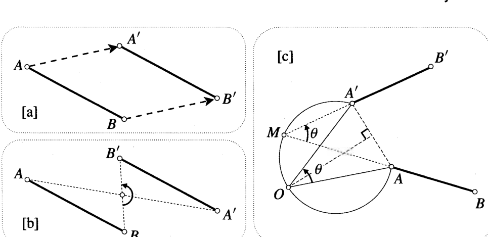
  
图 1-28

对保向运动的更大关注源于这样一个事实：它们形成了一个群（完整运动群的一个子群），而反向运动则没有。你能明白为什么吗？

### 1.4.3　三反射定理

在化学中，人们关注的是原子的相互作用，但要获得更深入的见解，必须研究构成原子的电子、质子和中子。同样，尽管我们关注的是保向运动，但通过研究构成保向运动的反向运动，我们也将获得更深入的见解。

每个保向运动都是两个反射的复合。　(28)请注意，（25）的第二句话随后暗示了每一个反向运动都是三个反射的组合。参见练习 39。简而言之，每个运动都是两次或三次反射的组合，这个结果被称为三我们之前试图证明运动集合构成一个群，但没有成功整齐而明确地，对于一系列反射的逆运算是通过反转反射执行的顺序来获得的。

在下文中，令 RL 表示关于直线 L 的反射。因此，先关于 L1 的反射再关于 L2 的反射记作 L2 o L1。根据 (26)，证明 (28) 相当于表明每个旋转（以及每个平移）都可以写成 RL2 o RL 的形式。这是以下结论的直接结果：

如果 L1 和 L2 在 O 相交，并且从 L1 到 L2 的角度是，则RL2 或 RL1 是绕 O 旋转 2§14 像 (26) 这样的结果可以被视为这个定理的结果；有关这种方法的优雅且基础的阐述，请参见 Stillwell [1992]。

如果L1和L2平行，且V是连接它们的垂线从L1到L2的向量，然后RL2 o L，是2V的平移。 这两个结果都足够容易直接证明 [试试吧！]，但以下或许更优雅。

首先，由于 L2 o RL 是一个保向运动（因为它角度翻转了两次），它要么是旋转，要么是平移。其次，注意旋转和平移可以通过它们的不变曲线来区分，也就是说，不变曲线是被映射到自身的曲线。对于绕点 O 的旋转，不变曲线是以 O 为中心的圆，而对于平移，它们是不变的平行于平移方向的直线。

  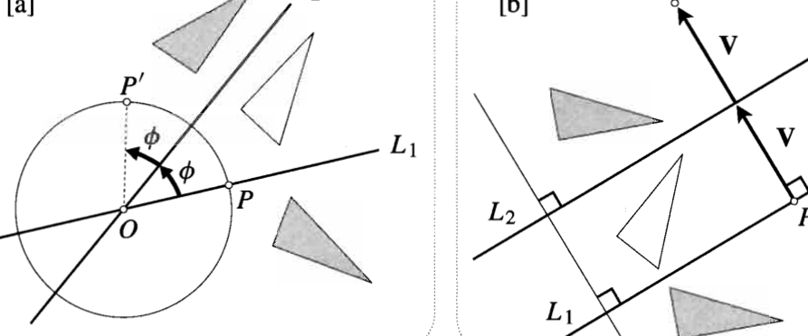
  
图 1-29

现在看 [29a]。显然 L2 o L 对以 O 为中心的任意圆不变，因此它是以 O 为中心的旋转。要看旋转的角度为 2p，请考虑 Li 上任意点 P 的像 P'。完成。

现在看看 [29b]。显然，L2 o L 保持任何垂直于 L1 和 L2 的直线不变，因此它是沿这些直线方向的平移。为了看出平移是 2V，考虑 Li 上任意一点 P 的像 P'。完成。

请注意，一个旋转可以表示为 L2 o L1，其中 L1、L2 是通过旋转中心并包含角度 (3/2) 的任意一对直线。同样，一个平移 T 对应于任意一对相距 T/2 的平行直线。这种情况提供了一种非常优雅的方法来组合旋转和平移。

例如，见 [30a]。这里围绕 a 的旋转通过 3 被表示为 NL2 o WLi，而围绕 b 的旋转通过 被表示为 RL, o RL)。要找到先围绕 a 再围绕 b 的旋转的净效果，选择 L2 = L'$i$ 为通过 a 和 b 的直线。如果 3 ≠ 2，则 L1 和 L' 会在某一点 c 相交，如 [30b] 所示。因此，两次旋转的组合由给出，这是围绕 c 的旋转，通过 (Φ)！这个构造与我们在第 18 页的计算相符，如练习 36 所示。

  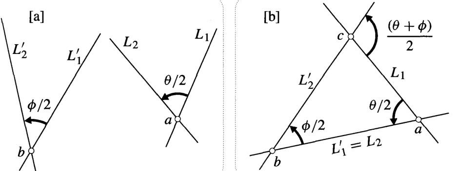
  
图 1-30

这种方法的更多例子见习题 42 和 43。

### 1.4.4　相似性与复算术

让我们更仔细地看看距离在欧几里得几何中的作用。假设我们在同一个平面上有两个直角三角形 T 和 T，并且假设 Jack 测量 T，而 Jill 测量 T。如果 Jack 和 Jill 都报告说他们的三角形的边长为 3、4 和 5，那么人们很容易认为这两个三角形是相同的，也就是说存在一个运动 M 使得 T = M(T)。但是等等！假设 Jack 的尺子以厘米为单位，而 Jill 的尺子以英寸为单位。这两个三角形是相似的，但它们不全等。哪一个才是真正的 3、4、5 三角形？当然，它们都是。

关键在于，每当我们用数字谈论距离时，我们都假定了一个测量单位。这个单位可以想象成某条线段U，例如，当我们说另一条线段的长度为5时，我们的意思是正好可以把5个U放进这条线段。但是在我们的二维平面上，U的任何选择都与其他选择一样好——没有绝对的测量单位，我们的几何定理应该反映这一事实。

冥想这一点，我们认识到欧几里得定理实际上并不依赖于 U 的这个（任意的）选择，因为它们只处理长度的比率，而长度的比率与 U 无关。例如，杰克可以验证他的三角形 T 满足勾股定理的形式(3厘米)² + (4厘米)² = (5厘米)²，但将两边都除以 (5厘米)²，这可以用边长比例重新写成纯数字的形式：试着想另一个定理，并检查它是否也仅涉及比例。在第6章的非欧几何中，我们将在曲面上作图，曲面的曲率大小将决定一个绝对长度单位。

由于欧几里得几何的定理并不涉及图形的实际大小，因此我们早先关于几何相等的定义（以运动为基础）显然过于严格：如果两个图形相似，它们就应该被认为是相同的。更准确地说，如果存在一个将一个图形映射到另一个图形的相似映射，我们现在认为两个图形是相同的，其中相似变换S是一种将平面映射到自身的映射，并保持比例不变很容易看出[练习]，给定的相似变换S将每个距离都按相同的（非零）因子r扩展，我们称r为S的扩展。因此，我们可以通过在上标中包含扩展来细化我们的符号，因此带有扩展r的一般相似变换写作Sr。显然，恒等变换是一种相似变换，sk o sr = skr，并且(Sr)-1 = s(1/r)，因此可以相当清楚地看出，所有相似变换的集合构成一个群。由此我们得出欧几里得的定义。

欧氏几何研究的是在相似变换群作用下保持不变的几何图形性质。　(29)由于运动只是单位扩展的相似变换，运动群是相似变换群的一个子群；我们先前尝试定义一个 Sr 的简单例子是中心放大 Do。如 [31a] 所示，这会保持点 o 固定，并将每个线段 oA 按比例 r 放大。注意，如果将这个中心放大随后（或之前）进行以相同中心为中心的旋转 Rg，则我们得到 [31b] 所示的伸缩旋转。注意，中心放大可以被视为一种特殊情况

  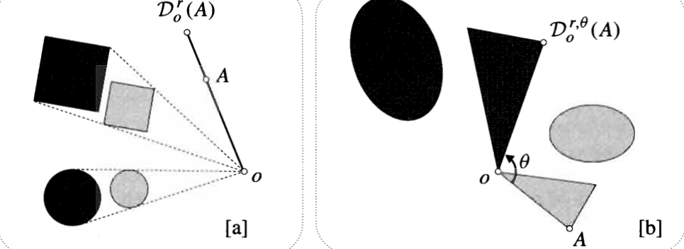
  
图 1-31

这个数字应该敲响警钟。取 o 为复平面 C 的原点，（9）表明 Do 对应于乘以 r e^{$i$θ}：相反，这是关键点，复数乘法的规则可以被视为伸缩旋转行为的结果。

集中于以共有固定中心 o 的伸缩旋转集合，这个中心将被视为复平面的原点。每个 Ds 都由它的扩展率 r 和旋转 § 唯一确定，因此它可以表示为在角度 处的长度 R。哪个向量将代表这些伸缩旋转的组合？从几何上看，很明显DR.中 o De = Dee o DR = DRr,(e+)，所以新向量是通过将原始向量的长度相乘并将它们的角度相加得到的——复数乘法！

在第17页我们看到，如果将复数视为平移，那么组合会产生复数加法。现在我们看到，如果它们被视为伸缩旋转，那么组合会产生复数乘法。为了完整地“用几何解释复数”，我们将展示这些平移和伸缩旋转对于欧几里得几何是基础的，因为要理解(29)中涉及的一般相似性Sr，请注意如果p是一个

$$S^r=M\circ D_o^r. \tag{30}$$

因此，我们对运动的分类意味着相似性有两种：如果 M 保持角度，那么 sr 也会保持角度【保向相似变换】；如果 M 逆转角度，那么 sr 也会逆转角度【相反相似】。

正如前面着重研究保向运动群一样，现在也着重研究保向相似变换群。平移与伸缩旋转的基本作用可概括为：

每个保向相似变换都是伸缩旋转，或者在例外情形下是平移。　(31)对我们来说，这一事实构成了对复数的一个令人满意的“解释”；正如在前言中提到的，同样有力的解释也可以在物理定律中找到。

要开始理解 (31)，请注意 (25) 和 (30) 暗示了保向相似变换是由任意线段 A B 的像 A'B' 决定的。首先考虑一个特殊情况，其中 A'B' 的长度与 A B 相等。然后我们有三个

  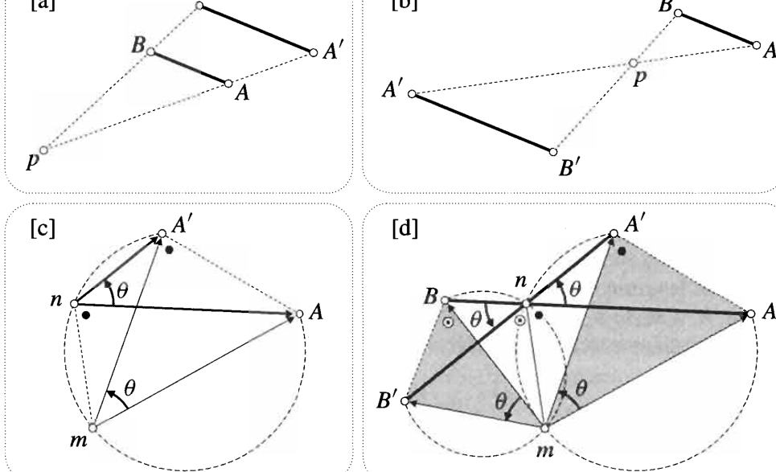
  
图 1-32

在[28]中的情况，所有这些情况都与(31)一致。如果A'B'和AB平行但长度不相等，那么我们有[32a]和[32b]中显示的两种情况，在这两种情况下，我们都画出了交于点p的直线AA'和BB'。通过引用现在考虑更有趣的一般情况，其中 A'B' 和 AB 既不等长，也不平行。看看 [32d]，它对此进行了说明。这里 n 是两条线段的交点（必要时生成），是它们之间的角度。为了建立 (31)，我们必须证明我们可以通过一次伸缩旋转将 AB 转到 A'B'。暂时只需注意，如果 AB 最终要与 A'B' 具有相同方向，那么它必须旋转，所以实际的断言是：存在一点 q 和一个扩展系数 r，使得将 A 映射到 A'，将 B 映射到 B'。

考虑在 [32c] 中重现的 [32d] 的部分。显然，通过选择 r = (n A' / n A)，Dr:° 将 A 映射到 A'。更一般地，你会看到我们可以用 D' 将 A 映射到 A' 当且仅当 AA' 在 q 处所对的角相同。因此，适当的图示说明了这样的一个位置，q = m。在返回到 [32d] 之前，我们还需要注意一件事：m A 在 n 和 A' 处所对的角相同（标记为）。

让我们回到 [32d]。我们希望 D;' 将 A 映射到 A'，B 映射到 B'。根据上述论证，g 必须位于圆弧 An A' 上，并且位于圆弧 Bn B' 上。因此只有两种可能性：q = n 或 q = m（两条圆弧的另一个交点）。如果你仔细想想，这是一个高度戏剧性的时刻。我们仅凭角度的考虑就将 q 的可能性缩小到两个点；对于这两个点中的任意一个，我们都可以选择扩展 r 的值，因此以使 A 映射到 A'，但是，一旦做出了这个选择，要么 B 会映射到 B'，要么不会！此外，从图中可以清楚地看出，如果 q = n，那么 B 不会映射到 B'，所以 q = m 是唯一剩下的可能。

为了使 Dm? 能同时将 A 映射到 A' 并将 B 映射到 B'，我们需要满足 r = (mA'/mA) = (mB'/mB)；换句话说，这两个阴影三角形需要相似。它们实际上相似无疑是一种奇迹。观察在 n 处形成的角，我们看到 +  +  = π，通过将右侧视为两个阴影三角形的角和，结果立刻得出。这就完成了我们对（31）的证明。

读者可能会觉得不满意的是，(31) 需要关于任意点的伸缩旋转，而复数表示的是关于固定点 o（原点）的伸缩旋转。对此可以这样回答：注意到 AB 在 Dg 和 D 下的像将是平行且长度相等的，因此将存在一个平移 [详见练习 44] T，将一个映射到另一个。换句话说，一般的伸缩旋转与以原点为中心的伸缩旋转的区别仅在于一个平移：Dgo = T, o D°。总而言之，因此，每个保向相似变换都可表示成如下复函数：

$$S(z)=re^{i\theta}z+v.$$

16 上述证明的优点是可以分步骤推进，不必一次发现全部构造。其他证明见 Coxeter and Greitzer [1967, p. 97]、Coxeter [1969, p. 73] 和 Eves [1992, p. 71]；另见习题 45 中使用复函数的简短证明。

### 1.4.5　空间复数？

让我们简要尝试把上述思想推广到三维空间。首先，空间中的中心伸缩（中心为 $O$）仍按前面的方法定义；以同一点为中心的伸缩旋转，则是这种伸缩与绕一条经过 $O$ 的轴所作空间旋转的复合。再次以式 (29) 作为欧氏几何的定义，我们马上就有了一个很好的开端，因为关键结论 (31) 可以推广为：空间中的每个保向相似变换，都是伸缩旋转、平移，或者伸缩旋转与沿其旋转轴方向平移的复合。详见 Coxeter [1969, p. 103]。

我们或许会尝试仿照平面情形建立一种“空间复数”代数：把加法定义为平移的复合，把乘法定义为伸缩旋转的复合。加法没有问题——空间中的位置向量可以看成平移，而平移的复合正是通常的空间向量加法；事实上，这种加法在四维乃至 $n$ 维空间中都同样成立。

现在考虑具有共同固定中心 $O$ 的伸缩旋转集合 $Q$。乘法的定义起初也很顺利：两个伸缩旋转的“乘积”$Q_1\circ Q_2$ 显然仍是同类的伸缩旋转，记作 $Q_3$；因为 $Q_1\circ Q_2$ 仍使 $O$ 不动。若 $Q_1,Q_2$ 的伸缩因子为 $r_1,r_2$，则 $Q_3$ 的伸缩因子显然是 $r_3=r_1r_2$。第 6 章将给出一个简单的几何作图，由 $Q_1,Q_2$ 的旋转求出 $Q_3$ 的旋转。然而，与平面旋转不同，空间旋转的先后次序会影响结果，因此这种乘法不满足交换律：

$$Q_1\circ Q_2\ne Q_2\circ Q_1. \tag{32}$$

我们固然习惯于可交换的乘法，但式 (32) 并不存在逻辑矛盾，所以非交换性还不能算建立“空间复数”代数的决定性障碍。

然而，当我们试图将这些伸缩旋转表示为空间中的点（或向量）时，确实会出现一个根本性的问题。类比复数乘法，我们希望把方程 Q1 o Q2 = Q3 理解为伸缩旋转 Q1 将点 Q2 映射到点 Q3。但这种解释是不可能的！在空间中指定一个点需要三个数，而指定一个伸缩旋转却需要四个数：一个表示伸展，一个表示旋转角度，还有两个表示旋转轴的方向。

虽然我们未能找到复数的三维类比，但我们已经发现了三维空间的四维伸缩旋转空间 Q（以 O 为中心）。Q 的成员称为四元数，它们可以被描绘为四维空间中的点或向量，但如何做到这一点的详细内容将要等到第六章才能介绍。四元数可以通过普通的向量加法来相加，并且可以使用上述非交换规则（对应伸缩旋转的组合）进行乘法运算。

复数相乘规则和四元数相乘规则的发现有一些有趣的相似之处。众所周知，四元数规则是由威廉·罗恩·汉密尔顿爵士在1843年以代数形式发现的。鲜为人知的是，早在三年前，奥林德·罗德里格斯就已经发表了一项优雅的几何研究，研究空间中旋转的组合，基本上包含了相同的结果；只是直到很久以后，人们才认识到罗德里格斯的几何与汉密尔顿的代数是等价的。

汉密尔顿和罗德里格斯只是两位“不走运”的数学家：如果他们看到伟大的卡尔·弗里德里希·高斯未发表的笔记本，大概都会感到沮丧。早在 1819 年，高斯就像在私人航海日志中随手记下一条记录那样，写下了自己对四元数乘法规则的发现。

在第6章中，我们将详细研究四元数乘法，并发现它具有优雅的应用。然而，这一讨论的直接好处是，我们现在可以看到二维空间的一个非凡特性，那就是可以将其中的点解释为作用于它的基本欧几里得变换。

17 要看清这一点，可设想一个以 $O$ 为中心的球面。旋转轴的方向可由它与球面的交点指定，而这个点需要两个坐标，例如经度和纬度。

18 参见 Altmann [1989]，了解这一过程如何被揭示的详细而有趣的内容。
