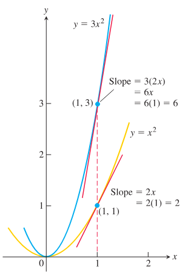

# PDF 转 Markdown 校对要求

本文档记录 2026-06-11 校对《Thomas Calculus》中文 Markdown 时确认的要求，用于后续继续处理 `第3章_导数.md` 及其他章节时参考。

## 总原则

1. 翻译必须按照英文原文逐段对应，不要压缩、概括或自行改写成讲义式内容。
2. 原文中的例题、定义、法则、证明、图注、补充说明都要保留，不得漏译。
3. 原文是一句话的题干，Markdown 中也尽量保持一句话，不要拆成“求 + 公式 + 的导数”这类多段结构。
4. 原文为普通正文的内容，不要擅自做成蓝色边框。
5. 原文为定义框或法则框时，边框里只放原文框内的内容；框外的 “In particular...”“In prime notation...” 等说明必须放在框外。
6. 不要随意新增原文没有的定义框、解释框或总结框。
7. 例题编号必须和原文一致。发现漏例题时，应补回缺失例题，并修正后续错位编号。
8. 解答过程要尽量保留原文中的关键步骤、旁注和使用的法则，不要只给最终结果。

## 公式排版

1. 原文是行内公式的，Markdown 中也用行内公式，例如 `$\bigl(f(x+h)-f(x)\bigr)/h$`，不要改成独立公式块。
2. 原文是展示公式或多行推导的，使用 `$$ ... $$` 和 `aligned` 环境。
3. 多个小题如果原文排成一行，不使用 Markdown 表格；用一个 LaTeX 展示公式块排成一行，例如：

   ```latex
   $$
   \text{(a) }x^3\qquad
   \text{(b) }x^{2/3}\qquad
   \text{(c) }x^{\sqrt{2}}
   $$
   ```

4. 不要把 `\qquad` 裸露在普通 Markdown 行中。
5. 分数写成规范形式，例如 `\frac{4}{3}`，不要写成容易误读的 `\frac43`。
6. 原文中公式编号如 `(1)`、`(2)`，应保留。

## 定义框和法则框

1. 使用已有蓝色边框样式：

   ```html
   <div style="width: 100%; margin: 1em 0; overflow-x: auto;">
     <div style="width: 100%; box-sizing: border-box; border: 1px solid #00a6df; padding: 0.7em 1em; text-align: left;">
       <div style="font-weight: 700; color: #008fd3; margin-bottom: 0.45em;">标题</div>
       <div>正文</div>
       <div>
         $$
         ...
         $$
       </div>
     </div>
   </div>
   ```

2. `Derivative Constant Multiple Rule` 框内只包含：

   `If u is a differentiable function of x, and c is a constant, then ...`

   “In particular, if n is any real number...” 放在框外。

3. `Derivative Product Rule` 框内只包含：

   `If u and y are differentiable at x, then so is their product uy, and ...`

   “The derivative of the product uy is...”“In prime notation...”“In function notation...” 都放在框外。

4. 原文中 `Difference Rule` 是普通正文加公式，不使用边框。

## 图片处理

1. 原文有图时，如果本地 `images/图号.png` 缺失，需要从 PDF 截图生成。
2. 截图只截图像本体，不截入原书题注。
3. 图片保存到 `托马斯微积分/images/`，命名为原图号，例如 `3-10.png`、`3-11.png`。
4. Markdown 中按已有样式插入图片和中文题注：

   ```html
   <div align="center">
     
     <div style="font-style: italic; font-size: 0.92em; color: #666; margin-top: 0.35em;">图 3.10 ...</div>
   </div>
   ```

5. 图注参考原文翻译，但由 Markdown 自己提供，不直接截原书题注。
6. 生成截图时要打开检查，确认没有裁掉坐标轴、标签、曲线文字，也没有截入题注。
7. 用于定位和裁切的临时整页渲染图处理完后清理，只保留最终 `images/*.png`。

## 章节结构要求

1. 小节标题按原文翻译，例如：
   - `Instantaneous Rates of Change` -> `瞬时变化率`
   - `Motion Along a Line: Displacement, Velocity, Speed, Acceleration, and Jerk` -> `沿直线运动：位移、速度、速率、加速度与急动度`
   - `Second- and Higher-Order Derivatives` -> `二阶及高阶导数`
2. 小节开头的引言段必须完整翻译，不能用概括句替代。
3. 原文中小节内部的定义框、例题、说明段、图必须按顺序出现。

## 已确认的具体校对点

1. 幂法则一般形式前的说明要完整翻译，包括：
   - 幂法则对所有实数 `n` 成立
   - `n` 可以是无理数
   - 应用时指数减 1，再乘以原指数
   - 证明推迟到第 3.8 节
2. `Applying the Power Rule` 和对应 `Example 1` 不能漏。
3. `Example 2` 及图 3.10 不能漏。
4. `For example, if y=x^4+12x...` 这类正文例句必须补齐。
5. 有限和法则推广段必须完整，包括三函数示例和附录 2 证明说明。
6. `Example 3`、`Example 4`、`Example 5`、`Example 6`、`Example 7`、`Example 8`、`Example 9` 都要按原文补齐。
7. 指数函数导数部分不能只给结论，必须保留从导数定义推导到常数 `L`、图 3.12、`a=e`、公式 (2)、自然指数函数导数结论的完整过程。
8. 乘积法则和商法则部分要保留反例、函数记号、例题、证明结尾说明。
9. `Second- and Higher-Order Derivatives` 不要压缩成记号框，要按原文完整翻译二阶导、三阶导、`n` 阶导、例 10 和符号读法。
10. `The Derivative as a Rate of Change` 的引言段、`Instantaneous Rates of Change` 小节、定义框、例 1 必须完整翻译。
11. 直线运动小节必须保留位移、平均速度、速度定义、方向说明、速率定义、加速度与急动度说明，以及图 3.14、图 3.15。

## 工作流程建议

1. 修改前先对照英文备份和 PDF 页面，确认原文结构。
2. 如果英文备份由 OCR 产生且公式或变量异常，以 PDF 页面截图为准。
3. 每次补译后，用 `Get-Content -Encoding UTF8` 检查上下文。
4. 对图片，先渲染 PDF 页面，裁切图像本体，保存到 `images/`，用图片查看工具确认后再插入 Markdown。
5. 完成一段后检查是否造成后续例题编号错位、重复例题或残留压缩版内容。
