<!--
来源：Thomas' Calculus，Chapter 12: Vectors and the Geometry of Space，PDF 页 718-764。
整理规范：依据 pdf转md文件.md；使用 PDF 文本层抽取，移除分页标记、页眉和明显图内散落标注；正文翻译为中文；公式尽量改写为 KaTeX 兼容 LaTeX。
-->

# 第12章 向量与空间几何

概述 本章是多元微积分研究的基础。为了在许多现实世界的情况和高等数学中应用微积分，我们需要解析几何来描述三维空间。为了实现这个目标，我们引入了三维坐标系和向量。基于我们已经了解的 xy 平面坐标，我们通过添加第三个轴来测量 xy 平面上方和下方的距离来建立空间坐标。然后我们定义向量并用它们来研究空间的解析几何。向量提供了定义空间中的直线、平面、曲线和曲面方程的简单方法。我们在本书的其余部分中使用这些几何概念来研究空间运动以及多个变量和向量场的函数演算，及其在科学、工程、运筹学、经济学和高等数学中的许多重要应用。

## 12.1 三维坐标系

为了在空间中定位一个点，我们使用三个相互垂直的坐标轴，如图 12.1 所示。此处显示的轴构成了右手坐标系。当你握住右手，使手指从正 $x$ 轴向正 $y$ 轴卷曲时，拇指指向正 $z$ 轴。因此，当你从 $z$ 轴正方向俯视 $xy$ 平面时，平面中的正角是从正 $x$ 轴绕正 $z$ 轴逆时针测量的。（在左手坐标系中，图 12.1 中的 $z$ 轴将指向下方，并且从正 $x$ 轴顺时针测量时，平面中的角为正。右手坐标系和左手坐标系并不等效。）

  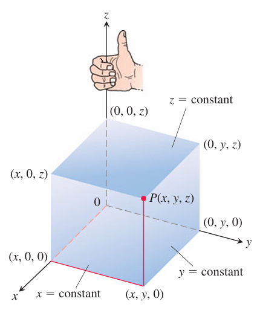
   
  图 12.1 笛卡儿坐标系是右手坐标系。

 

空间中点 $P$ 的笛卡儿坐标 $(x, y, z)$，是通过 $P$ 且垂直于各坐标轴的平面与坐标轴相交处的数值。空间中的笛卡儿坐标也称为直角坐标，因为定义它们的坐标轴互相垂直。$x$ 轴上的点的 $y$ 坐标和 $z$ 坐标都等于零；也就是说，它们的坐标形如 $(x, 0, 0)$。类似地，$y$ 轴上的点的坐标形如 $(0, y, 0)$，$z$ 轴上的点的坐标形如 $(0, 0, z)$。

坐标轴确定的三个平面分别是 $xy$ 平面，其标准方程为 $z = 0$；$yz$ 平面，其标准方程为 $x = 0$；以及 $xz$ 平面，其标准方程为 $y = 0$。它们在原点 $(0, 0, 0)$ 相交（图 12.2）。原点也可以简单地记作 $0$，有时也用字母 $O$ 表示。

  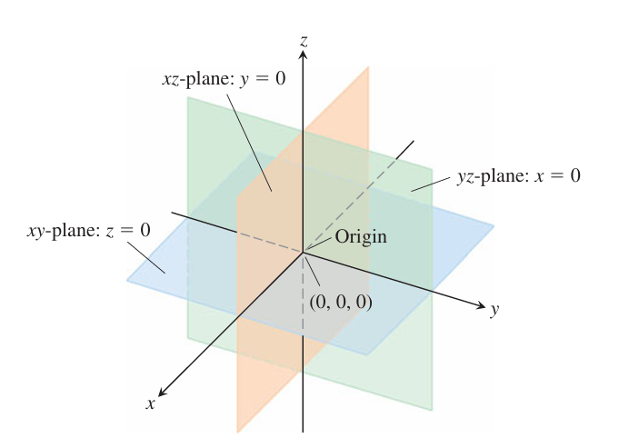
   
  图 12.2 平面 x = 0、y = 0 和 z = 0 将空间划分为八个卦限。

 

三个坐标平面 $x = 0$、$y = 0$ 和 $z = 0$ 将空间划分为八个区域，称为卦限。点的三个坐标全为正的卦限称为第一卦限；其余七个卦限没有约定俗成的编号。

垂直于 $x$ 轴的平面中的点都具有相同的 $x$ 坐标，这个坐标就是该平面与 $x$ 轴相交处的数值；$y$ 坐标和 $z$ 坐标可以是任意数。类似地，垂直于 $y$ 轴的平面中的点有一个共同的 $y$ 坐标，垂直于 $z$ 轴的平面中的点有一个共同的 $z$ 坐标。

为了写出这些平面的方程，我们命名公共坐标的值。平面 $x = 2$ 是在 $x = 2$ 处垂直于 $x$ 轴的平面。平面 $y = 3$ 是在 $y = 3$ 处垂直于 $y$ 轴的平面。平面 $z = 5$ 是在 $z = 5$ 处垂直于 $z$ 轴的平面。图 12.3 显示了平面 $x = 2$、$y = 3$ 和 $z = 5$ 及其交点 $(2, 3, 5)$。

  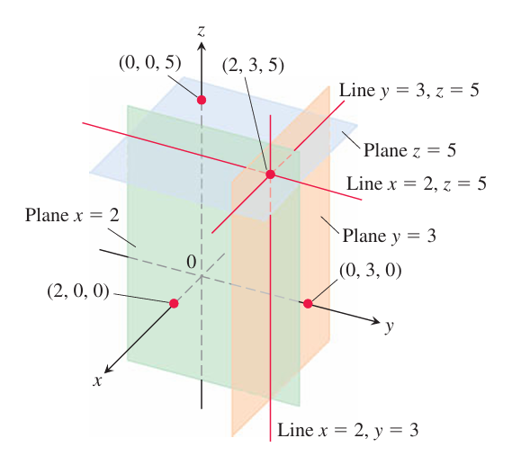
   
  图 12.3 平面 x = 2、y = 3 和 z = 5 确定通过点 (2, 3, 5) 的三条直线。

 

图 12.3 中的平面 $x = 2$ 和 $y = 3$ 相交于一条平行于 $z$ 轴的直线。这条直线由方程组 $x = 2$、$y = 3$ 描述。当且仅当 $x = 2$ 且 $y = 3$ 时，点 $(x, y, z)$ 位于这条直线上。类似地，平面 $y = 3$ 和 $z = 5$ 的交线由方程组 $y = 3$、$z = 5$ 描述，这条直线平行于 $x$ 轴。平面 $x = 2$ 和 $z = 5$ 的交线平行于 $y$ 轴，由方程组 $x = 2$、$z = 5$ 描述。

在以下示例中，我们将坐标方程和不等式与它们在空间中定义的点集进行匹配。

**例 1** 我们用几何方式解释这些方程和不等式。

**(a)** $z \ge 0$

由 $xy$ 平面上及其上方的点组成的半空间。

**(b)** $x = -3$

在 $x = -3$ 处垂直于 $x$ 轴的平面。该平面平行于 $yz$ 平面，并在其后方 3 个单位处。

**(c)** $z = 0,\ x \le 0,\ y \ge 0$

$xy$ 平面的第二象限。

**(d)** $x \ge 0,\ y \ge 0,\ z \ge 0$

第一卦限。

**(e)** $-1 \le y \le 1$

平面 $y = -1$ 和 $y = 1$ 之间的夹层（包括这两个平面）。

**(f)** $y = -2,\ z = 2$

平面 $y = -2$ 和 $z = 2$ 的交线。也可以说，这是过点 $(0, -2, 2)$ 且平行于 $x$ 轴的直线。

**例 2** 哪些点 $P(x, y, z)$ 满足方程 $x^2 + y^2 = 4$ 和 $z = 3$？

**解：**

这些点位于水平面 $z = 3$ 中，并在该平面中构成圆 $x^2 + y^2 = 4$。我们将这组点称为“平面 $z = 3$ 中的圆 $x^2 + y^2 = 4$”，或者更简单地称为“圆 $x^2 + y^2 = 4,\ z = 3$”（图 12.4）。

  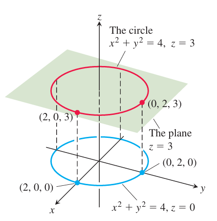
   
  图 12.4 平面 z = 3 中的圆 x2 + y2 = 4（例 2）。

 

### 空间中的距离和球体

$xy$ 平面中两点之间距离的公式可以扩展到空间中的点。点 $P_1(x_1, y_1, z_1)$ 和 $P_2(x_2, y_2, z_2)$ 之间的距离为

$$
\|P_1P_2\| = \sqrt{(x_2 - x_1)^2 + (y_2 - y_1)^2 + (z_2 - z_1)^2}.
$$

**证明** 我们构造一个矩形盒子，其面平行于坐标平面，点 $P_1$ 和 $P_2$ 位于盒子的对角处（图 12.5）。如果 $A(x_2, y_1, z_1)$ 和 $B(x_2, y_2, z_1)$ 是图中所示的盒子的顶点，则三个盒子边缘 $P_1A$、$AB$ 和 $BP_2$ 的长度为

$$
\|P_1A\| = |x_2 - x_1|,\qquad
\|AB\| = |y_2 - y_1|,\qquad
\|BP_2\| = |z_2 - z_1|.
$$

  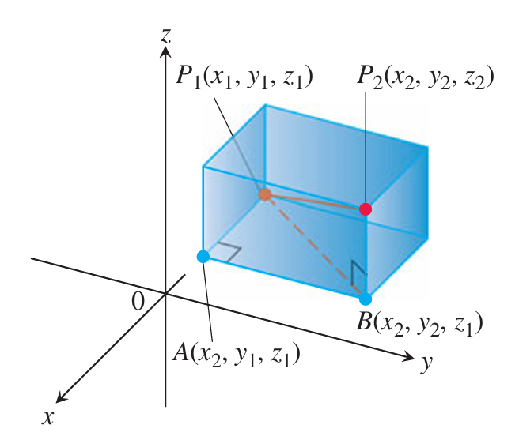
   
  图 12.5 通过对直角三角形 P1AB 和 P1BP2 应用毕达哥拉斯定理，求 P1 和 P2 之间的距离。

 

因为三角形 $P_1BP_2$ 和 $P_1AB$ 都是直角三角形，所以两次应用毕达哥拉斯定理得到

$$
\|P_1P_2\|^2 = \|P_1B\|^2 + \|BP_2\|^2
$$

以及

$$
\|P_1B\|^2 = \|P_1A\|^2 + \|AB\|^2.
$$

所以

$$
\begin{aligned}
\|P_1P_2\|^2
&= \|P_1B\|^2 + \|BP_2\|^2 \\
&= \|P_1A\|^2 + \|AB\|^2 + \|BP_2\|^2 \\
&= (x_2 - x_1)^2 + (y_2 - y_1)^2 + (z_2 - z_1)^2.
\end{aligned}
$$

**例 3** 点 $P_1(2, 1, 5)$ 和 $P_2(-2, 3, 0)$ 之间的距离为

$$
\begin{aligned}
\|P_1P_2\|
&= \sqrt{(-2 - 2)^2 + (3 - 1)^2 + (0 - 5)^2} \\
&= \sqrt{16 + 4 + 25} \\
&= \sqrt{45} \approx 6.708.
\end{aligned}
$$

我们可以使用距离公式来写出空间中球面的方程（图 12.6）。点 $P(x, y, z)$ 位于以 $P_0(x_0, y_0, z_0)$ 为中心、半径为 $a$ 的球面上，当且仅当 $\|P_0P\| = a$，即

$$
(x - x_0)^2 + (y - y_0)^2 + (z - z_0)^2 = a^2.
$$

  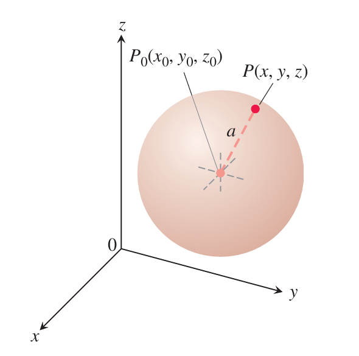
   
  图 12.6 以点 (x0, y0, z0) 为中心、半径为 a 的球面。

 

以点 $(x_0, y_0, z_0)$ 为中心、半径为 $a$ 的球面。半径为 $a$ 且中心为 $(x_0, y_0, z_0)$ 的球面的标准方程为

$$
(x - x_0)^2 + (y - y_0)^2 + (z - z_0)^2 = a^2.
$$

**例 4** 求球面

$$
x^2 + y^2 + z^2 + 3x - 4z + 1 = 0.
$$

**解：**

我们以求圆心和半径的方式求球心和半径：根据需要对 $x$、$y$ 和 $z$ 项配方，并将每个二次式写成一次式的平方。然后，从标准形式的方程中读出中心和半径。对于此处的球面，我们有

$$
x^2 + y^2 + z^2 + 3x - 4z + 1 = 0
$$

$$
(x^2 + 3x) + y^2 + (z^2 - 4z) = -1
$$

$$
\left(x^2 + 3x + \left(\frac{3}{2}\right)^2\right) + y^2
+ \left(z^2 - 4z + \left(\frac{-4}{2}\right)^2\right)
= -1 + \left(\frac{3}{2}\right)^2 + \left(\frac{-4}{2}\right)^2
$$

$$
\left(x + \frac{3}{2}\right)^2 + y^2 + (z - 2)^2
= -1 + \frac{9}{4} + 4
= \frac{21}{4}.
$$

从该标准形式中，我们得知 $x_0 = -\frac{3}{2}$、$y_0 = 0$、$z_0 = 2$，且 $a = \frac{\sqrt{21}}{2}$。中心是 $\left(-\frac{3}{2}, 0, 2\right)$，半径为 $\frac{\sqrt{21}}{2}$。

**例 5** 以下是涉及球面的不等式和方程的一些几何解释。

**(a)** $x^2 + y^2 + z^2 < 4$

球面 $x^2 + y^2 + z^2 = 4$ 的内部。

**(b)** $x^2 + y^2 + z^2 \le 4$

由球面 $x^2 + y^2 + z^2 = 4$ 围成的实心球。或者说，球面 $x^2 + y^2 + z^2 = 4$ 及其内部。

**(c)** $x^2 + y^2 + z^2 > 4$

球面 $x^2 + y^2 + z^2 = 4$ 的外部。

**(d)** $x^2 + y^2 + z^2 = 4,\ z \le 0$

由 $xy$ 平面（平面 $z = 0$）从球面 $x^2 + y^2 + z^2 = 4$ 切下的下半球。

正如极坐标提供了在 $xy$ 平面中定位点的另一种方法（第 11.3 节），三维空间中也存在不同于此处建立的笛卡儿坐标系的其他坐标系。我们将在第 15.7 节研究其中两种。

## 12.2 向量

我们测量的某些事物仅由其大小决定。例如，要记录质量、长度或时间，我们只需写下一个数字并命名一个适当的测量单位。我们需要更多信息来描述力、位移或速度。为了描述力，我们需要记录它作用的方向以及它的大小。为了描述物体的位移，我们必须说出它移动的方向以及距离。为了描述物体的速度，我们必须知道物体的运动方向以及运动速度。在本节中，我们将展示如何表示在平面或空间中同时具有大小和方向的事物。

### 分量形式

力、位移或速度等量称为向量，用有向线段表示（图 12.7）。箭头指向动作的方向，其长度以适当选择的单位给出动作的大小。例如，力向量指向力作用的方向，其长度是力强度的度量；速度向量指向运动方向，其长度就是运动物体的速度。图 12.8 显示了粒子在平面或空间中沿着路径移动的特定位置处的速度向量 $\mathbf{v}$。（向量的这种应用将在第 13 章中研究。）

  <strong>定义</strong> 
  有向线段 $\overrightarrow{AB}$ 表示起点为 $A$、终点为 $B$ 的向量，其长度记为 $\|\overrightarrow{AB}\|$。如果两个向量具有相同的长度和方向，则它们相等。

  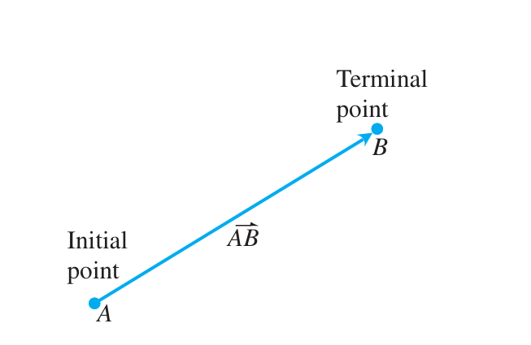
   
  图 12.7 有向线段 $\overrightarrow{AB}$ 称为向量。$(a)$ 二维 $(b)$ 三维

 

  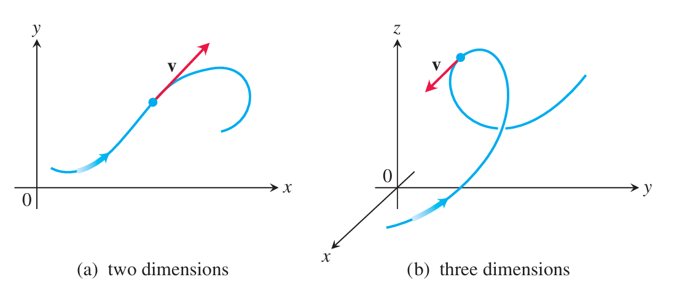
   
  图 12.8 粒子沿空间平面 $(b)$ 中的路径 $(a)$ 运动的速度向量。路径上的箭头指示粒子的运动方向。

 

如果我们绘制向量时使用的箭头具有相同的长度、平行并且指向相同的方向（图 12.9），则无论其初始点如何，它们都被理解为表示相同的向量。

在教科书中，向量通常以小写、粗体字母书写，例如 $\mathbf{u}$、$\mathbf{v}$ 和 $\mathbf{w}$。有时我们使用大写粗体字母（例如 $\mathbf{F}$）来表示力向量。在手写形式中，习惯上在字母上方画小箭头，例如 $\vec u$、$\vec v$、$\vec w$ 和 $\vec F$。

我们需要一种用代数方式表示向量的方法，以便更精确地了解向量的方向。令 $\mathbf{v}=\overrightarrow{PQ}$。存在一条等于 $\overrightarrow{PQ}$ 的有向线段，其初始点为原点（图 12.10）。它代表 $\mathbf{v}$ 在标准位置上的位置，也是我们通常用来表示 $\mathbf{v}$ 的向量。当 $\mathbf{v}$ 处于标准位置时，我们可以通过写出其终点 $(v_1, v_2, v_3)$ 的坐标来指定 $\mathbf{v}$。如果 $\mathbf{v}$ 是平面中的向量，则其终点 $(v_1, v_2)$ 有两个坐标。

  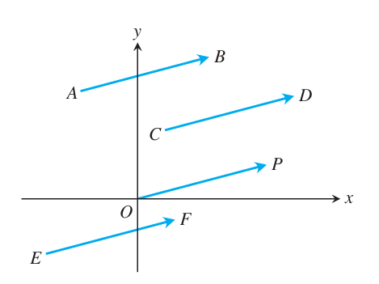
   
  图 12.9 此处所示的平面中的四个箭头（有向线段）具有相同的长度和方向。因此它们代表相同的向量，我们写作 $\overrightarrow{AB}=\overrightarrow{CD}=\overrightarrow{OP}=\overrightarrow{EF}$。

 

  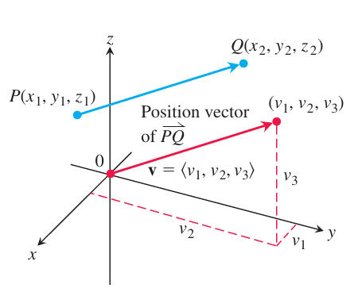
   
  图 12.10 标准位置的向量 $\overrightarrow{PQ}$ 的初始点位于原点。有向线段 $\overrightarrow{PQ}$ 和 $\mathbf{v}$ 平行且长度相同。$\mathbf{v}$ 在标准位置时其终点坐标为 $(v_1, v_2, v_3)$。如果 $\mathbf{v}$ 是平面中的向量，其终点 $(v_1, v_2)$ 有两个坐标。

 

  <strong>定义</strong> 
  如果 $\mathbf{v}$ 是平面内的二维向量，等于以原点为起点、终点为 $(v_1, v_2)$ 的向量，则 $\mathbf{v}$ 的分量形式为

$$
\mathbf{v} = \langle v_1, v_2\rangle.
$$

  如果 $\mathbf{v}$ 是一个三维向量，等于以原点为起点、终点为 $(v_1, v_2, v_3)$ 的向量，则 $\mathbf{v}$ 的分量形式为

$$
\mathbf{v} = \langle v_1, v_2, v_3\rangle.
$$

因此，二维向量是实数的有序对 $\mathbf{v}=\langle v_1, v_2\rangle$，三维向量是实数的有序三元组 $\mathbf{v}=\langle v_1, v_2, v_3\rangle$。数 $v_1$、$v_2$ 和 $v_3$ 是 $\mathbf{v}$ 的分量。

如果 $\mathbf{v}=\langle v_1, v_2, v_3\rangle$ 由有向线段 $\overrightarrow{PQ}$ 表示，其中起点为 $P(x_1,y_1,z_1)$，终点为 $Q(x_2,y_2,z_2)$，则 $x_1+v_1=x_2$、$y_1+v_2=y_2$，且 $z_1+v_3=z_2$（见图 12.10）。因此，$v_1=x_2-x_1$、$v_2=y_2-y_1$ 和 $v_3=z_2-z_1$ 是 $\overrightarrow{PQ}$ 的分量。

综上所述，给定点 $P(x_1,y_1,z_1)$ 和 $Q(x_2,y_2,z_2)$，等于 $\overrightarrow{PQ}$ 的标准位置向量 $\mathbf{v}=\langle v_1, v_2, v_3\rangle$ 为

$$
\mathbf{v}=\langle x_2-x_1,\ y_2-y_1,\ z_2-z_1\rangle.
$$

如果 $\mathbf{v}$ 是二维的，以 $P(x_1,y_1)$ 和 $Q(x_2,y_2)$ 为平面上的点，则

$$
\mathbf{v}=\langle x_2-x_1,\ y_2-y_1\rangle.
$$

平面向量没有第三个分量。有了这种理解，我们将发展三维向量的代数，并在向量是二维（平面向量）时简单地删除第三个分量。

两个向量相等当且仅当它们的标准位置向量相同。因此，$\langle u_1,u_2,u_3\rangle$ 和 $\langle v_1,v_2,v_3\rangle$ 相等当且仅当 $u_1=v_1$、$u_2=v_2$ 和 $u_3=v_3$。

向量 $\overrightarrow{PQ}$ 的大小或长度是其任何等效有向线段表示的长度。特别地，如果 $\mathbf{v}=\langle x_2-x_1,\ y_2-y_1,\ z_2-z_1\rangle$ 是 $\overrightarrow{PQ}$ 的标准位置向量，则距离公式给出 $\mathbf{v}$ 的大小或长度，用符号 $\|\mathbf{v}\|$ 或 $|\mathbf{v}|$ 表示。

向量 $\mathbf{v}=\overrightarrow{PQ}$ 的大小或长度为非负数

$$
\|\mathbf{v}\|=\sqrt{v_1^2+v_2^2+v_3^2}
=\sqrt{(x_2-x_1)^2+(y_2-y_1)^2+(z_2-z_1)^2}
$$

（见图 12.10）。

唯一长度为 $0$ 的向量是零向量 $\mathbf{0}=\langle 0,0\rangle$ 或 $\mathbf{0}=\langle 0,0,0\rangle$。该向量也是唯一没有特定方向的向量。

**例 1**

求以 $P(-3,4,1)$ 为起点、以 $Q(-5,2,2)$ 为终点的向量的 $(a)$ 分量形式和 $(b)$ 长度。

**解：**

$(a)$ 表示 $\overrightarrow{PQ}$ 的标准位置向量 $\mathbf{v}$ 具有分量

$$
v_1 = x_2-x_1 = -5-(-3)=-2,
$$

$$
v_2 = y_2-y_1 = 2-4=-2,
$$

$$
v_3 = z_2-z_1 = 2-1=1.
$$

$\overrightarrow{PQ}$ 的分量形式是

$$
\mathbf{v}=\langle -2,-2,1\rangle.
$$

$(b)$ $\mathbf{v}=\overrightarrow{PQ}$ 的长度或大小是

$$
\|\mathbf{v}\|=\sqrt{(-2)^2+(-2)^2+1^2}=\sqrt{9}=3.
$$

**例 2** 一辆小车被 20-lb 的力 $\mathbf{F}$ 沿着平滑的水平地板拉动，力与地面成 $45^\circ$ 角（图 12.11）。推动小车前进的有效力是多少？

  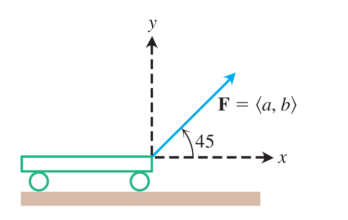
   
  图 12.11 向前拉小车的力由向量 $\mathbf{F}$ 表示，其水平分量为有效力（例 2）。

 

**解：**

有效力是 $\mathbf{F}=\langle a,b\rangle$ 的水平分量，由

$$
a=\|\mathbf{F}\|\cos 45^\circ = 20\cdot \frac{\sqrt{2}}{2}\approx 14.14\ \mathrm{lb}
$$

给出。请注意，$\mathbf{F}$ 是一个二维向量。

### 向量代数运算

涉及向量的两个主要运算是向量加法和标量乘法。标量只是一个实数，当我们想要引起注意它与向量的差异时，就这样称呼它。标量可以是正数、负数或零，用于通过乘法“缩放”向量。

  <strong>定义</strong> 
  令 $\mathbf{u}=\langle u_1,u_2,u_3\rangle$ 和 $\mathbf{v}=\langle v_1,v_2,v_3\rangle$ 为向量，其中 $k$ 为标量。

加法：

$$
\mathbf{u}+\mathbf{v}=\langle u_1+v_1,\ u_2+v_2,\ u_3+v_3\rangle
$$

标量乘法：

$$
k\mathbf{u}=\langle ku_1,\ ku_2,\ ku_3\rangle.
$$

我们通过将向量的相应分量相加来将向量相加。我们通过将每个分量乘以标量来将向量乘以标量。这些定义适用于平面向量，但只有两个分量：$\langle u_1,u_2\rangle$ 和 $\langle v_1,v_2\rangle$。

向量加法的定义在图 12.12a 中以几何方式说明了平面向量，其中一个向量的初始点位于另一个向量的终点处。另一种解释如图 12.12b 所示，称为向量加法的平行四边形定律，其中和向量称为合成向量，是平行四边形的对角线。在物理学中，力与速度、加速度等一样以向量方式相加。因此，例如，作用在受到两个重力作用的粒子上的力是通过将两个力向量相加获得的。

  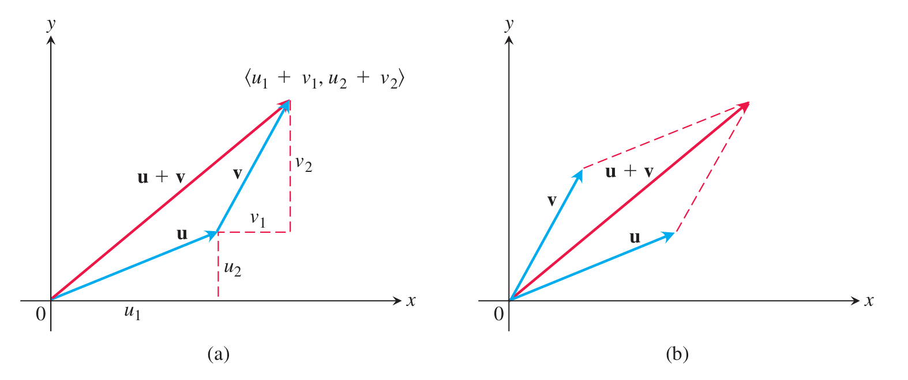
   
  图 12.12 $(a)$ 向量和的几何解释。$(b)$ 向量加法的平行四边形定律，其中两个向量都处于标准位置。

 

图 12.13 显示了标量 $k$ 和向量 $\mathbf{u}$ 的乘积 $k\mathbf{u}$ 的几何解释。如果 $k>0$，则 $k\mathbf{u}$ 与 $\mathbf{u}$ 方向相同；如果 $k<0$，则 $k\mathbf{u}$ 的方向与 $\mathbf{u}$ 的方向相反。比较 $\mathbf{u}$ 和 $k\mathbf{u}$ 的长度，我们看到

  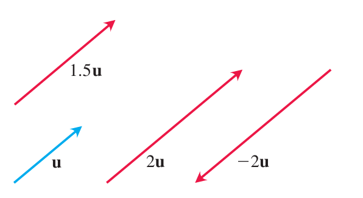
   
  图 12.13 标量 $k$ 和向量 $\mathbf{u}$ 的乘积 $k\mathbf{u}$ 的几何解释。

 

$$
\|k\mathbf{u}\|=\sqrt{(ku_1)^2+(ku_2)^2+(ku_3)^2}=|k|\sqrt{u_1^2+u_2^2+u_3^2}=|k|\,\|\mathbf{u}\|.
$$

$k\mathbf{u}$ 的长度是标量 $k$ 的绝对值乘以 $\mathbf{u}$ 的长度。向量 $(-1)\mathbf{u}=-\mathbf{u}$ 与 $\mathbf{u}$ 具有相同的长度，但指向相反的方向。两个向量的差 $\mathbf{u}-\mathbf{v}$ 由

$$
\mathbf{u}-\mathbf{v}=\mathbf{u}+(-\mathbf{v}).
$$

如果 $\mathbf{u}=\langle u_1,u_2,u_3\rangle$ 和 $\mathbf{v}=\langle v_1,v_2,v_3\rangle$，则

$$
\mathbf{u}-\mathbf{v}=\langle u_1-v_1,\ u_2-v_2,\ u_3-v_3\rangle.
$$

请注意，$(\mathbf{u}-\mathbf{v})+\mathbf{v}=\mathbf{u}$，因此将向量 $\mathbf{u}-\mathbf{v}$ 添加到 $\mathbf{v}$ 得到 $\mathbf{u}$（图 12.14a）。图 12.14b 将 $\mathbf{u}-\mathbf{v}$ 之差显示为 $\mathbf{u}+(-\mathbf{v})$ 之和。

  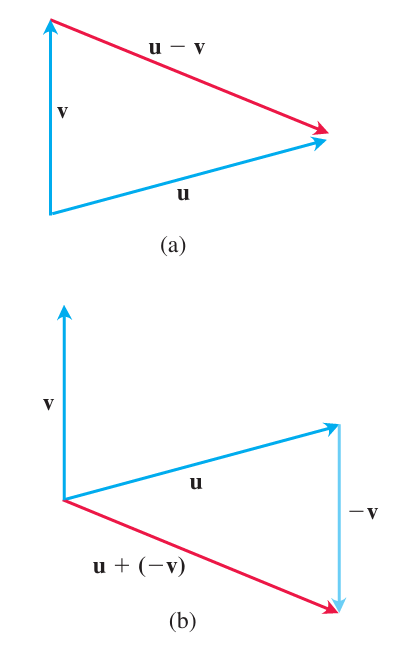
   
  图 12.14 $(a)$ 向量 $\mathbf{u}-\mathbf{v}$ 与 $\mathbf{v}$ 相加，得到 $\mathbf{u}$。$(b)$ $\mathbf{u}-\mathbf{v}=\mathbf{u}+(-\mathbf{v})$。

 

**例 3**

设 $\mathbf{u}=\langle -1,3,1\rangle$ 和 $\mathbf{v}=\langle 4,7,0\rangle$。求 $(a)$ $2\mathbf{u}+3\mathbf{v}$，$(b)$ $\mathbf{u}-\mathbf{v}$，$(c)$ $\frac{1}{2}\mathbf{u}$ 的分量。

**解：**

$$
(a)\quad 2\mathbf{u}+3\mathbf{v}=2\langle -1,3,1\rangle+3\langle 4,7,0\rangle
=\langle -2,6,2\rangle+\langle 12,21,0\rangle
=\langle 10,27,2\rangle.
$$

$$
(b)\quad \mathbf{u}-\mathbf{v}=\langle -1,3,1\rangle-\langle 4,7,0\rangle
=\langle -5,-4,1\rangle.
$$

$$
(c)\quad \frac{1}{2}\mathbf{u}=\left\langle -\frac{1}{2},\frac{3}{2},\frac{1}{2}\right\rangle.
$$

向量运算具有普通算术的许多属性。

  <strong>向量运算的性质</strong> 
  设 $\mathbf{u}$、$\mathbf{v}$、$\mathbf{w}$ 为向量，$a$、$b$ 为标量。

$$
\begin{aligned}
1.\quad &\mathbf{u}+\mathbf{v}=\mathbf{v}+\mathbf{u} \\
2.\quad &(\mathbf{u}+\mathbf{v})+\mathbf{w}=\mathbf{u}+(\mathbf{v}+\mathbf{w}) \\
3.\quad &\mathbf{u}+\mathbf{0}=\mathbf{u} \\
4.\quad &\mathbf{u}+(-\mathbf{u})=\mathbf{0} \\
5.\quad &0\mathbf{u}=\mathbf{0} \\
6.\quad &1\mathbf{u}=\mathbf{u} \\
7.\quad &a(b\mathbf{u})=(ab)\mathbf{u} \\
8.\quad &a(\mathbf{u}+\mathbf{v})=a\mathbf{u}+a\mathbf{v} \\
9.\quad &(a+b)\mathbf{u}=a\mathbf{u}+b\mathbf{u}
\end{aligned}
$$

使用向量加法和标量乘法的定义可以轻松验证这些属性。例如，为了建立性质 1，我们有

$$
\mathbf{u}+\mathbf{v}=\langle u_1,u_2,u_3\rangle+\langle v_1,v_2,v_3\rangle
$$

$$
=\langle u_1+v_1,\ u_2+v_2,\ u_3+v_3\rangle
$$

$$
=\langle v_1+u_1,\ v_2+u_2,\ v_3+u_3\rangle
$$

$$
=\langle v_1,v_2,v_3\rangle+\langle u_1,u_2,u_3\rangle
$$

$$
= \mathbf{v}+\mathbf{u}.
$$

当三个或更多空间向量位于同一平面时，我们说它们是共面向量。例如，向量 $\mathbf{u}$、$\mathbf{v}$ 和 $\mathbf{u}+\mathbf{v}$ 始终共面。

### 单位向量

长度为 $1$ 的向量 $\mathbf{v}$ 称为单位向量。标准单位向量为

$$
\mathbf{i}=\langle 1,0,0\rangle,
$$

$$
\mathbf{j}=\langle 0,1,0\rangle,
$$

和

$$
\mathbf{k}=\langle 0,0,1\rangle.
$$

任何向量 $\mathbf{v}=\langle v_1,v_2,v_3\rangle$ 都可以写为标准单位向量的线性组合，如下所示：

$$
\mathbf{v}=\langle v_1,v_2,v_3\rangle
=\langle v_1,0,0\rangle+\langle 0,v_2,0\rangle+\langle 0,0,v_3\rangle
$$

$$
=v_1\langle 1,0,0\rangle+v_2\langle 0,1,0\rangle+v_3\langle 0,0,1\rangle
$$

$$
=v_1\mathbf{i}+v_2\mathbf{j}+v_3\mathbf{k}.
$$

我们将标量（或数字）$v_1$ 称为向量 $\mathbf{v}$ 的 $\mathbf{i}$-分量，将 $v_2$ 称为 $\mathbf{j}$-分量，将 $v_3$ 称为 $\mathbf{k}$-分量。在分量形式中，从 $P_1(x_1,y_1,z_1)$ 到 $P_2(x_2,y_2,z_2)$ 的向量为

$$
\overrightarrow{P_1P_2}=(x_2-x_1)\mathbf{i}+(y_2-y_1)\mathbf{j}+(z_2-z_1)\mathbf{k}
$$

  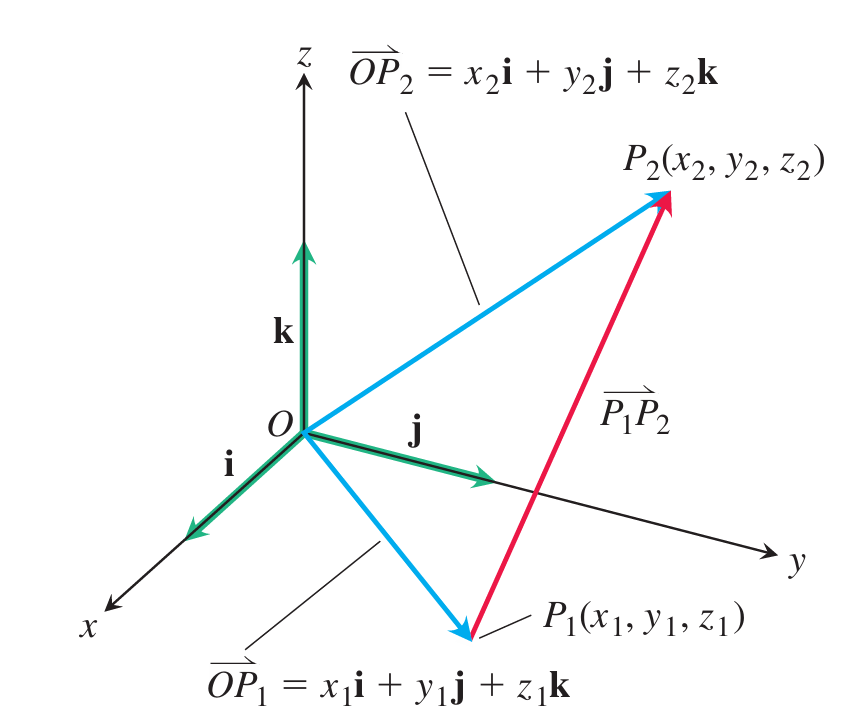
   
  图 12.15 从 $P_1$ 到 $P_2$ 的向量是 $\overrightarrow{P_1P_2}=(x_2-x_1)\mathbf{i}+(y_2-y_1)\mathbf{j}+(z_2-z_1)\mathbf{k}$。

 

每当 $\mathbf{v}\ne 0$ 时，其长度 $\|\mathbf{v}\|$ 不为零，且

$$
\left\|\frac{1}{\|\mathbf{v}\|}\mathbf{v}\right\|=1.
$$

即 $\frac{\mathbf{v}}{\|\mathbf{v}\|}$ 是 $\mathbf{v}$ 方向的单位向量，称为非零向量 $\mathbf{v}$ 的方向。

**例 4** 求从 $P_1(1,0,1)$ 到 $P_2(3,2,0)$ 的向量方向上的单位向量 $\mathbf{u}$。

**解：**

我们将 $\overrightarrow{P_1P_2}$ 除以它的长度：

$$
\overrightarrow{P_1P_2}=(3-1)\mathbf{i}+(2-0)\mathbf{j}+(0-1)\mathbf{k}=2\mathbf{i}+2\mathbf{j}-\mathbf{k}
$$

$$
\|\overrightarrow{P_1P_2}\|=\sqrt{2^2+2^2+(-1)^2}=\sqrt{9}=3
$$

$$
\mathbf{u}=\frac{\overrightarrow{P_1P_2}}{\|\overrightarrow{P_1P_2}\|}
=\frac{2\mathbf{i}+2\mathbf{j}-\mathbf{k}}{3}
=\frac{2}{3}\mathbf{i}+\frac{2}{3}\mathbf{j}-\frac{1}{3}\mathbf{k}.
$$

单位向量 $\mathbf{u}$ 是 $\overrightarrow{P_1P_2}$ 的方向。

**例 5**

如果 $\mathbf{v}=3\mathbf{i}-4\mathbf{j}$ 是速度向量，则将 $\mathbf{v}$ 表示为速度乘以运动方向的乘积。

**解：**

速度是 $\mathbf{v}$ 的大小（长度）：

$$
\|\mathbf{v}\|=\sqrt{3^2+(-4)^2}=5.
$$

单位向量 $\frac{\mathbf{v}}{\|\mathbf{v}\|}$ 是 $\mathbf{v}$ 的方向：

$$
\frac{\mathbf{v}}{\|\mathbf{v}\|}=\frac{3\mathbf{i}-4\mathbf{j}}{5}
=\frac{3}{5}\mathbf{i}-\frac{4}{5}\mathbf{j}.
$$

$$
\mathbf{v}=3\mathbf{i}-4\mathbf{j}=5\left(\frac{3}{5}\mathbf{i}-\frac{4}{5}\mathbf{j}\right).
$$

总之，我们可以通过写 $\mathbf{v}=\|\mathbf{v}\|\frac{\mathbf{v}}{\|\mathbf{v}\|}$ 来根据其两个重要特征（长度和方向）来表达任何非零向量 $\mathbf{v}$。

如果 $\mathbf{v}\ne \mathbf{0}$，则

1. $\frac{\mathbf{v}}{\|\mathbf{v}\|}$ 是单位向量，称为 $\mathbf{v}$ 的方向；

2. 方程 $\mathbf{v}=\|\mathbf{v}\|\frac{\mathbf{v}}{\|\mathbf{v}\|}$ 将 $\mathbf{v}$ 表示为其长度乘以方向。

**例 6** 沿向量 $\mathbf{v}=2\mathbf{i}+2\mathbf{j}-\mathbf{k}$ 方向施加 $6$ 牛顿的力。将力 $\mathbf{F}$ 表示为其大小和方向的乘积。

**解：**

力向量的大小为 $6$，方向为 $\frac{\mathbf{v}}{\|\mathbf{v}\|}$，因此

$$
\mathbf{F}=6\frac{\mathbf{v}}{\|\mathbf{v}\|}
=6\frac{2\mathbf{i}+2\mathbf{j}-\mathbf{k}}{\sqrt{2^2+2^2+(-1)^2}}
$$

$$
\mathbf{F}=6\left(\frac{2}{3}\mathbf{i}+\frac{2}{3}\mathbf{j}-\frac{1}{3}\mathbf{k}\right).
$$

### 线段的中点

向量在几何中通常很有用。例如，通过平均求得线段中点的坐标。

连接点 $P_1(x_1,y_1,z_1)$ 和 $P_2(x_2,y_2,z_2)$ 的线段的中点 $M$ 是点

$$
M\left(\frac{x_1+x_2}{2},\frac{y_1+y_2}{2},\frac{z_1+z_2}{2}\right).
$$

要了解原因，请观察（图 12.16）

$$
\overrightarrow{OM}
=\overrightarrow{OP_1}+\frac{1}{2}\overrightarrow{P_1P_2}
$$

$$
\overrightarrow{OM}
=\overrightarrow{OP_1}+\frac{1}{2}(\overrightarrow{OP_2}-\overrightarrow{OP_1})
=\frac{1}{2}(\overrightarrow{OP_1}+\overrightarrow{OP_2})
$$

$$
=\frac{x_1+x_2}{2}\mathbf{i}+\frac{y_1+y_2}{2}\mathbf{j}+\frac{z_1+z_2}{2}\mathbf{k}.
$$

  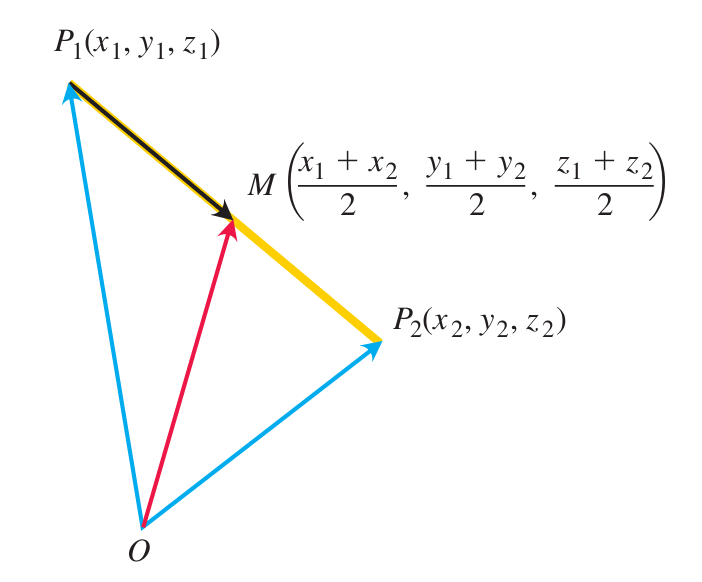
   
  图 12.16 中点的坐标是 $P_1$ 和 $P_2$ 的坐标的平均值。

 

**例 7** 连接 $P_1(3,-2,0)$ 和 $P_2(7,4,4)$ 的线段的中点是

$$
\left(\frac{3+7}{2},\frac{-2+4}{2},\frac{0+4}{2}\right)=(5,1,2).
$$

### 应用

向量的一个重要应用是在导航中。

**例 8**

一架喷气式客机在静止空气中以 500 英里/小时的速度向正东飞行，遇到从东偏北 60 度方向吹来的 70 英里/小时的顺风。飞机将指南针保持在正东方向，但由于风的原因，获得了新的地面速度和方向。这些是什么？

**解：**

如果 $\mathbf{u}$ 是飞机单独的速度，$\mathbf{v}$ 是顺风的速度，则 $\|\mathbf{u}\|=500$ 和 $\|\mathbf{v}\|=70$（图 12.17）。飞机相对于地面的速度由合成向量 $\mathbf{u}+\mathbf{v}$ 的大小和方向给出。如果我们让正 $x$ 轴代表东，正 $y$ 轴代表北，则 $\mathbf{u}$ 和 $\mathbf{v}$ 的分量形式为

  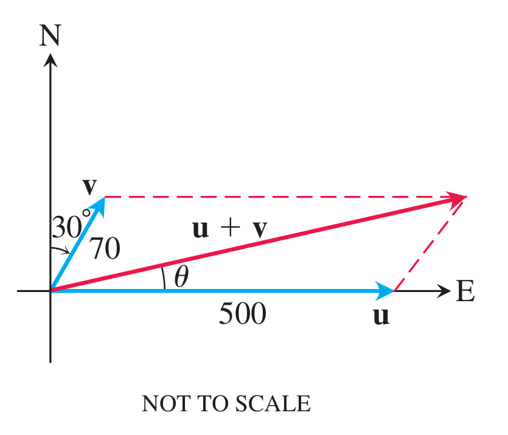
   
  图 12.17 代表示例 8 中飞机 $\mathbf{u}$ 和顺风 $\mathbf{v}$ 速度的向量。

 

$$
\mathbf{u}=\langle 500,0\rangle
$$

和

$$
\mathbf{v}=\langle 70\cos 60^\circ,\ 70\sin 60^\circ\rangle
=\langle 35,\ 35\sqrt{3}\rangle.
$$

所以，

$$
\mathbf{u}+\mathbf{v}=\langle 535,\ 35\sqrt{3}\rangle=535\mathbf{i}+35\sqrt{3}\,\mathbf{j}
$$

$$
\|\mathbf{u}+\mathbf{v}\|=\sqrt{535^2+(35\sqrt{3})^2}\approx 538.4
$$

和

$$
\theta=\tan^{-1}\frac{35\sqrt{3}}{535}\approx 6.5^\circ.
$$

飞机的新地面速度约为 $538.4\ \mathrm{mph}$，新方向约为东偏北 $6.5^\circ$。

另一个重要的应用发生在物理和工程中，当多个力作用在单个物体上时。

**例 9** $75\ \mathrm{N}$ 的重物由两根钢丝悬挂，如图 12.18a 所示。

求作用在两条导线上的力 $\mathbf{F}_1$ 和 $\mathbf{F}_2$。

**解：**

力向量 $\mathbf{F}_1$ 和 $\mathbf{F}_2$ 的大小为 $\|\mathbf{F}_1\|$ 和 $\|\mathbf{F}_2\|$，分量以牛顿为单位测量。合力为 $\mathbf{F}_1+\mathbf{F}_2$，且大小必须相等、作用方向与重力向量 $\mathbf{w}$ 相反（或向上）（见图 12.18b）。由图可知，

$$
\mathbf{F}_1=\langle-\|\mathbf{F}_1\|\cos 55^\circ,\ \|\mathbf{F}_1\|\sin 55^\circ\rangle
$$

$$
\mathbf{F}_2=\langle\|\mathbf{F}_2\|\cos 40^\circ,\ \|\mathbf{F}_2\|\sin 40^\circ\rangle.
$$

由于 $\mathbf{F}_1+\mathbf{F}_2=\langle 0,75\rangle$，所得向量给出方程组

$$
-\|\mathbf{F}_1\|\cos 55^\circ+\|\mathbf{F}_2\|\cos 40^\circ=0
$$

$$
\|\mathbf{F}_1\|\sin 55^\circ+\|\mathbf{F}_2\|\sin 40^\circ=75.
$$

求解第一个方程中的 $\|\mathbf{F}_2\|$ 并将结果代入第二个方程，我们得到

$$
\|\mathbf{F}_2\|=\frac{\|\mathbf{F}_1\|\cos 55^\circ}{\cos 40^\circ}
$$

和

$$
\|\mathbf{F}_1\|\sin 55^\circ+\frac{\|\mathbf{F}_1\|\cos 55^\circ}{\cos 40^\circ}\sin 40^\circ=75.
$$

由此得出

$$
\|\mathbf{F}_1\|=\frac{75}{\sin 55^\circ+\cos 55^\circ\tan 40^\circ}\approx 57.67\ \mathrm{N},
$$

和

$$
\|\mathbf{F}_2\|=\frac{75\cos 55^\circ}{\sin(55^\circ+40^\circ)}\approx 43.18\ \mathrm{N}.
$$

  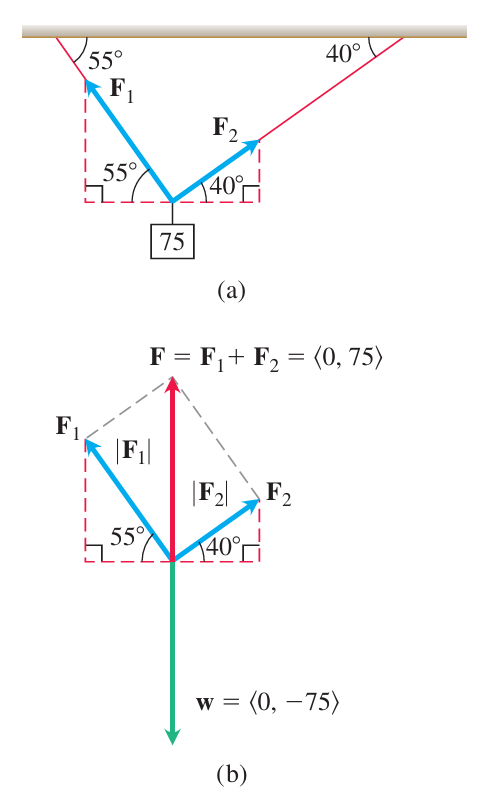
   
  图 12.18 示例 9 中的悬挂重量。则力向量为 $\mathbf{F}_1=\langle -33.08,47.24\rangle$ 和 $\mathbf{F}_2=\langle 33.08,27.76\rangle$。

 

## 12.3 点积

如果把力 $\mathbf{F}$ 作用在沿路径运动的粒子上，我们常常需要知道这个力在运动方向上的大小。若 $\mathbf{v}$ 与施力点处路径的切线平行，则我们要找的是 $\mathbf{F}$ 在 $\mathbf{v}$ 方向上的分量。设 $\theta$ 是 $\mathbf{F}$ 与 $\mathbf{v}$ 之间的角，则这个标量大小为 $\|\mathbf{F}\|\cos\theta$（图 12.19）。

  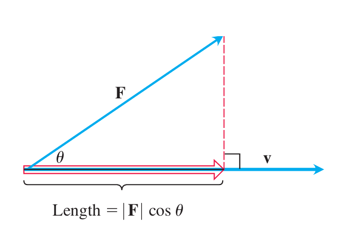
   
  图 12.19 力 $\mathbf{F}$ 在向量 $\mathbf{v}$ 方向上的大小是 $\mathbf{F}$ 在 $\mathbf{v}$ 上的投影的长度 $\|\mathbf{F}\|\cos\theta$。

 

本节介绍点积。点积也称为内积或标量积，因为两个向量相乘后得到的是一个标量，而不是向量。点积可以用来求两个向量之间的角、一个向量在另一个向量方向上的投影，以及恒定力通过位移所做的功。

### 向量之间的角度

当两个非零向量 $\mathbf{u}$ 和 $\mathbf{v}$ 的初始点重合时，它们形成一个角 $\theta$，其中 $0\le \theta\le \pi$（图 12.20）。若两个向量不在同一直线上，则 $\theta$ 在包含这两个向量的平面内测量；若它们在同一直线上，则同向时夹角为 $0$，反向时夹角为 $\pi$。

  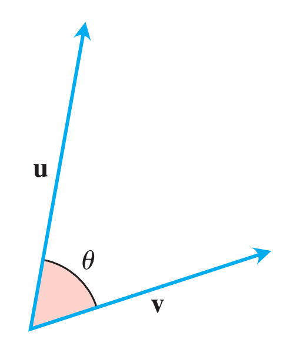
   
  图 12.20 向量 $\mathbf{u}$ 和 $\mathbf{v}$ 之间的角。

 

  <strong>定义</strong> 
  向量 $\mathbf{u}=\langle u_1,u_2,u_3\rangle$ 和 $\mathbf{v}=\langle v_1,v_2,v_3\rangle$ 的点积是标量

$$
\mathbf{u}\cdot\mathbf{v}=u_1v_1+u_2v_2+u_3v_3.
$$

  对二维向量，定义为

$$
\langle u_1,u_2\rangle\cdot\langle v_1,v_2\rangle=u_1v_1+u_2v_2.
$$

**例 1** 计算点积。

**(a)**

$$
\langle 1,-2,-1\rangle\cdot\langle -6,2,-3\rangle
=(1)(-6)+(-2)(2)+(-1)(-3)=-7.
$$

**(b)**

$$
\left(\frac12\mathbf{i}+3\mathbf{j}+\mathbf{k}\right)\cdot(4\mathbf{i}-\mathbf{j}+2\mathbf{k})
=\left(\frac12\right)(4)+(3)(-1)+(1)(2)=1.
$$

  <strong>定理 1：两个向量之间的角</strong> 
  若 $\mathbf{u}$ 和 $\mathbf{v}$ 是非零向量，则它们之间的角 $\theta$ 满足

$$
\cos\theta=\frac{\mathbf{u}\cdot\mathbf{v}}{\|\mathbf{u}\|\,\|\mathbf{v}\|},
\qquad
\theta=\cos^{-1}\left(\frac{\mathbf{u}\cdot\mathbf{v}}{\|\mathbf{u}\|\,\|\mathbf{v}\|}\right).
$$

**证明** 令 $\mathbf{w}=\mathbf{u}-\mathbf{v}$。将余弦定理（第 1.3 节公式 (8)）应用到图 12.21 中的三角形，可得

$$
\|\mathbf{w}\|^2=\|\mathbf{u}\|^2+\|\mathbf{v}\|^2-2\|\mathbf{u}\|\,\|\mathbf{v}\|\cos\theta.
$$

又因为

$$
\mathbf{w}=\langle u_1-v_1,\ u_2-v_2,\ u_3-v_3\rangle,
$$

所以

$$
\begin{aligned}
\|\mathbf{w}\|^2
&=(u_1-v_1)^2+(u_2-v_2)^2+(u_3-v_3)^2,\\
\|\mathbf{u}\|^2+\|\mathbf{v}\|^2-\|\mathbf{w}\|^2
&=2(u_1v_1+u_2v_2+u_3v_3)\\
&=2(\mathbf{u}\cdot\mathbf{v}).
\end{aligned}
$$

代回余弦定理可得

$$
\|\mathbf{u}\|\,\|\mathbf{v}\|\cos\theta=\mathbf{u}\cdot\mathbf{v},
$$

因此得到角度公式。

**例 2** 求 $\mathbf{u}=\mathbf{i}-2\mathbf{j}-2\mathbf{k}$ 与 $\mathbf{v}=6\mathbf{i}+3\mathbf{j}+2\mathbf{k}$ 之间的角。

**解：**

$$
\mathbf{u}\cdot\mathbf{v}=(1)(6)+(-2)(3)+(-2)(2)=-4,
$$

$$
\|\mathbf{u}\|=\sqrt{1^2+(-2)^2+(-2)^2}=3,
\qquad
\|\mathbf{v}\|=\sqrt{6^2+3^2+2^2}=7.
$$

所以

$$
\theta=\cos^{-1}\left(\frac{-4}{(3)(7)}\right)
\approx 1.76\ \text{rad}\approx 100.98^\circ.
$$

若 $\mathbf{u}\cdot\mathbf{v}>0$，则夹角为锐角；若 $\mathbf{u}\cdot\mathbf{v}<0$，则夹角为钝角。

**例 3** 求由顶点 $A=(0,0)$、$B=(3,5)$、$C=(5,2)$ 确定的三角形 $ABC$ 中顶点 $C$ 处的角 $\theta$（图 12.22）。

**解：** 角 $\theta$ 是向量 $\overrightarrow{CA}$ 和 $\overrightarrow{CB}$ 之间的角。它们的分量形式为

$$
\overrightarrow{CA}=\langle -5,-2\rangle,
\qquad
\overrightarrow{CB}=\langle -2,3\rangle.
$$

于是

$$
\overrightarrow{CA}\cdot\overrightarrow{CB}=(-5)(-2)+(-2)(3)=4,
$$

$$
\|\overrightarrow{CA}\|=\sqrt{(-5)^2+(-2)^2}=\sqrt{29},
\qquad
\|\overrightarrow{CB}\|=\sqrt{(-2)^2+3^2}=\sqrt{13}.
$$

因此

$$
\theta=\cos^{-1}\left(\frac{4}{\sqrt{29}\sqrt{13}}\right)
\approx 78.1^\circ\approx 1.36\ \text{rad}.
$$

### 正交向量

两个非零向量垂直时，它们之间的角为 $\pi/2$。此时

$$
\mathbf{u}\cdot\mathbf{v}=\|\mathbf{u}\|\,\|\mathbf{v}\|\cos\frac{\pi}{2}=0.
$$

反过来，若非零向量 $\mathbf{u}$ 和 $\mathbf{v}$ 满足 $\mathbf{u}\cdot\mathbf{v}=0$，则 $\cos\theta=0$，所以 $\theta=\pi/2$。

  <strong>定义</strong> 
  如果 $\mathbf{u}\cdot\mathbf{v}=0$，则称向量 $\mathbf{u}$ 和 $\mathbf{v}$ 正交。

**例 4** 通过点积判断正交。

**(a)** $\mathbf{u}=\langle 3,-2\rangle$ 与 $\mathbf{v}=\langle 4,6\rangle$ 正交，因为

$$
\mathbf{u}\cdot\mathbf{v}=(3)(4)+(-2)(6)=0.
$$

**(b)** $\mathbf{u}=3\mathbf{i}-2\mathbf{j}+\mathbf{k}$ 与 $\mathbf{v}=2\mathbf{j}+4\mathbf{k}$ 正交，因为

$$
\mathbf{u}\cdot\mathbf{v}=(3)(0)+(-2)(2)+(1)(4)=0.
$$

**(c)** 零向量与每个向量都正交，因为

$$
\mathbf{0}\cdot\mathbf{u}=0.
$$

### 点积的性质和向量投影

  <strong>点积的性质</strong> 
  若 $\mathbf{u}$、$\mathbf{v}$、$\mathbf{w}$ 为任意向量，$c$ 为标量，则

$$
\begin{aligned}
1.\quad &\mathbf{u}\cdot\mathbf{v}=\mathbf{v}\cdot\mathbf{u},\\
2.\quad &(c\mathbf{u})\cdot\mathbf{v}=\mathbf{u}\cdot(c\mathbf{v})=c(\mathbf{u}\cdot\mathbf{v}),\\
3.\quad &\mathbf{u}\cdot(\mathbf{v}+\mathbf{w})=\mathbf{u}\cdot\mathbf{v}+\mathbf{u}\cdot\mathbf{w},\\
4.\quad &\mathbf{u}\cdot\mathbf{u}=\|\mathbf{u}\|^2,\\
5.\quad &\mathbf{0}\cdot\mathbf{u}=0.
\end{aligned}
$$

性质 1 和性质 3 可直接由定义验证。例如，

$$
\mathbf{u}\cdot\mathbf{v}=u_1v_1+u_2v_2+u_3v_3
=v_1u_1+v_2u_2+v_3u_3=\mathbf{v}\cdot\mathbf{u},
$$

且

$$
\begin{aligned}
\mathbf{u}\cdot(\mathbf{v}+\mathbf{w})
&=\langle u_1,u_2,u_3\rangle\cdot\langle v_1+w_1,v_2+w_2,v_3+w_3\rangle\\
&=u_1(v_1+w_1)+u_2(v_2+w_2)+u_3(v_3+w_3)\\
&=(u_1v_1+u_2v_2+u_3v_3)+(u_1w_1+u_2w_2+u_3w_3)\\
&=\mathbf{u}\cdot\mathbf{v}+\mathbf{u}\cdot\mathbf{w}.
\end{aligned}
$$

### 向量投影

设 $\mathbf{v}\ne\mathbf{0}$。向量 $\mathbf{u}$ 在 $\mathbf{v}$ 上的向量投影记作 $\operatorname{proj}_{\mathbf{v}}\mathbf{u}$。它表示 $\mathbf{u}$ 在 $\mathbf{v}$ 方向上的部分。如果 $\theta$ 是 $\mathbf{u}$ 和 $\mathbf{v}$ 的夹角，则标量分量为 $\|\mathbf{u}\|\cos\theta$。

向量投影为

$$
\operatorname{proj}_{\mathbf{v}}\mathbf{u}
=\left(\frac{\mathbf{u}\cdot\mathbf{v}}{\|\mathbf{v}\|^2}\right)\mathbf{v}.
\tag{1}
$$

$\mathbf{u}$ 在 $\mathbf{v}$ 方向上的标量分量为

$$
\|\mathbf{u}\|\cos\theta
=\mathbf{u}\cdot\frac{\mathbf{v}}{\|\mathbf{v}\|}
=\frac{\mathbf{u}\cdot\mathbf{v}}{\|\mathbf{v}\|}.
\tag{2}
$$

注意：向量投影和标量分量只依赖于 $\mathbf{v}$ 的方向，而不依赖于 $\mathbf{v}$ 的长度。

**例 5** 求 $\mathbf{u}=6\mathbf{i}+3\mathbf{j}+2\mathbf{k}$ 在 $\mathbf{v}=\mathbf{i}-2\mathbf{j}-2\mathbf{k}$ 上的向量投影，以及 $\mathbf{u}$ 在 $\mathbf{v}$ 方向上的标量分量。

**解：**

$$
\mathbf{u}\cdot\mathbf{v}=6-6-4=-4,
\qquad
\mathbf{v}\cdot\mathbf{v}=1+4+4=9.
$$

由式 $(1)$，

$$
\operatorname{proj}_{\mathbf{v}}\mathbf{u}
=\frac{-4}{9}(\mathbf{i}-2\mathbf{j}-2\mathbf{k})
=-\frac49\mathbf{i}+\frac89\mathbf{j}+\frac89\mathbf{k}.
$$

由式 $(2)$，

$$
\frac{\mathbf{u}\cdot\mathbf{v}}{\|\mathbf{v}\|}
=\frac{-4}{3}.
$$

所以标量分量为 $-4/3$。

**例 6** 求力 $\mathbf{F}=5\mathbf{i}+2\mathbf{j}$ 在 $\mathbf{v}=\mathbf{i}-3\mathbf{j}$ 上的向量投影，以及 $\mathbf{F}$ 在 $\mathbf{v}$ 方向上的标量分量。

**解：**

$$
\mathbf{F}\cdot\mathbf{v}=5-6=-1,
\qquad
\mathbf{v}\cdot\mathbf{v}=1+9=10.
$$

向量投影为

$$
\operatorname{proj}_{\mathbf{v}}\mathbf{F}
=\frac{-1}{10}(\mathbf{i}-3\mathbf{j})
=-\frac{1}{10}\mathbf{i}+\frac{3}{10}\mathbf{j}.
$$

标量分量为

$$
\frac{\mathbf{F}\cdot\mathbf{v}}{\|\mathbf{v}\|}
=\frac{-1}{\sqrt{10}}.
$$

进一步地，向量 $\mathbf{u}-\operatorname{proj}_{\mathbf{v}}\mathbf{u}$ 与 $\operatorname{proj}_{\mathbf{v}}\mathbf{u}$ 正交。因此

$$
\mathbf{u}
=\operatorname{proj}_{\mathbf{v}}\mathbf{u}
+\left(\mathbf{u}-\operatorname{proj}_{\mathbf{v}}\mathbf{u}\right)
$$

把 $\mathbf{u}$ 表示成了一个平行于 $\mathbf{v}$ 的向量与一个垂直于 $\mathbf{v}$ 的向量之和。

### 功

在第 6 章中，若恒定力的大小为 $F$，物体沿力的方向移动距离 $d$，则功为 $W=Fd$。这个公式只适用于力沿运动方向作用的情形。

如果力 $\mathbf{F}$ 使物体产生位移 $\mathbf{D}=\overrightarrow{PQ}$，且 $\mathbf{F}$ 与 $\mathbf{D}$ 的夹角为 $\theta$，则真正做功的是 $\mathbf{F}$ 在 $\mathbf{D}$ 方向上的分量。因此

$$
W=(\|\mathbf{F}\|\cos\theta)\|\mathbf{D}\|
=\mathbf{F}\cdot\mathbf{D}.
$$

  <strong>定义</strong> 
  恒定力 $\mathbf{F}$ 通过位移 $\mathbf{D}=\overrightarrow{PQ}$ 所做的功为

$$
W=\mathbf{F}\cdot\mathbf{D}.
$$

**例 7** 若 $\|\mathbf{F}\|=40\,\mathrm{N}$、$\|\mathbf{D}\|=3\,\mathrm{m}$，且 $\theta=60^\circ$，则 $\mathbf{F}$ 从 $P$ 到 $Q$ 所做的功为

$$
W=\mathbf{F}\cdot\mathbf{D}
=\|\mathbf{F}\|\,\|\mathbf{D}\|\cos\theta
=(40)(3)\cos60^\circ
=60\,\mathrm{J}.
$$

当我们在第 16 章学习沿空间中更一般路径求变力所做的功时，会遇到更复杂的功问题。

## 12.4 叉积

在研究平面中的直线时，当我们需要描述直线如何倾斜时，我们使用斜率和倾斜角度的概念。在太空中，我们需要一种方法来描述平面如何倾斜。我们通过将平面上的两个向量相乘得到垂直于平面的第三个向量来实现这一点。第三个向量的方向告诉我们平面的“倾角”。我们用来将向量相乘的乘积是向量或叉积，这是两种向量乘法中的第二种。我们在本节中研究叉积。

### 空间中两个向量的叉积

我们从空间中两个非零向量 u 和 v 开始。如果 u 和 v 不平行，则它们确定一个平面。我们根据右手定则选择垂直于平面的单位向量n。这意味着我们选择 n 作为单位（法线）向量，当您的手指从 u 到 v 卷曲角度 u 时，该向量指向右手拇指所指向的方向（图 12.27）。然后我们定义一个新向量如下。 n u × v

图 12.27

$$
u \times v.
$$

  <strong>定义</strong> 
  叉积 $u\times v$（“$u$ cross $v$”）是向量

$$
u \times v = (\|u0\| v0 sin u) n.
$$

与点积不同，叉积是向量。因此，它也称为 u 和 v 的向量积，并且仅适用于空间中的向量。向量 $u \times v$ 与 u 和 v 正交，因为它是 n 的标量倍数。有一种直接的方法可以计算两个向量的分量的叉积。该方法不需要我们知道它们之间的角度（如定义所示），但我们暂时推迟计算，以便我们可以首先关注叉积的属性。由于 0 和 p 的正弦值都为零，因此将两个平行非零向量的叉积定义为 0 是有意义的。如果 u 和 v 之一或两者为零，我们也将 $u \times v$ 定义为零。这样，当且仅当 u 和 v 平行或者其中一个或两个为零时，两个向量 u 和 v 的叉积为零。

### 平行向量

非零向量 u 和 v 是平行的，当且仅当 $u \times v$ = 0 时。

### 叉积的性质

如果 u、v 和 w 是任意向量且 r、s 是标量，则

1。 (ru) * (sv) = (rs)$(u \times v)$

$$
2. u \times (v + w) = u \times v + u \times w
$$

$$
3. v \times u = -(u \times v)
$$

$$
4. (v + w) \times u = v \times u + w \times u
$$

$$
5. 0 \times u = 0
$$

$$
6. u \times (v \times w) = (u \cdot w)v - (u \cdot v)w
$$

叉积遵循以下定律。例如，要可视化属性 3，请注意，当您的右手手指从 v 到 u 卷曲角度 u 时，您的拇指指向相反的方向；我们在形成 $v \times u$ 时选择的单位向量是我们在形成 $u \times v$ 时选择的单位向量的负数（图 12.28）。性质1可以通过将叉积的定义应用到方程两边并比较结果来验证。属性2在附录8中得到证明。属性4通过将属性2中的等式两边都乘以-1并使用属性3反转乘积的顺序来得出。属性5是一个定义。通常，叉积乘法不具有关联性，因此 $[原文待校] \times w$ 通常不等于 $u \times [原文待校]$。当我们应用定义和性质 3 来计算 i、j 和 k 的成对叉积时，我们发现（图 12.29）

$$
i \times j = -(j \times i) = k
$$

$$
j \times k = -(k \times j) = i
$$

$$
k \times i = -(i \times k) = j
$$

和

$$
i \times i = j \times j = k \times k = 0.
$$

### $|u \times v|$ 是平行四边形的面积

因为 n 是单位向量，所以 $u \times v$ 的大小为 −n v × u

图 12.28

$$
v \times u.
$$

的构造$k = i$ × j $j = k$ × i $i = j$ × k

图 12.29

i、j 和 k 的成对叉积。回忆叉积图 0 $u \times v0$ = $\|u\|$ $\|v\|$ 0 sinu0 0 $n0 = 0$ u0 $\|v\|$ sinu。这是由 u 和 v 确定的平行四边形的面积（图 12.30），$\|u\|$ 是平行四边形的底，$\|v\|$ 0 sinu0 是高度。

### $u \times v$ 的行列式公式

我们的下一个目标是根据相对于笛卡儿坐标系的 u 和 v 分量计算 $u \times v$。假设

$$
u = u1i + u2j + u3k
$$

和

$$
v = v1i + v^2 j + v3k.
$$

，那么分配律和 i、j 和 k 相乘的规则告诉我们

$$
u \times v = (u1i + u^2 j + u3k) \times (v1i + v^2 j + v3k)
$$

$$
= u1v1i \times i + u1v2i \times j + u1v3i \times k
$$

$$
+ u2v1j \times i + u2v2j \times j + u2v3j \times k
$$

$$
+ u3v1k \times i + u3v2k \times j + u3v3k \times k
$$

$$
= (u2v3 - u3v2)i - (u1v3 - u3v1)j + (u1v2 - u2v1)k.
$$

最后一行的组成项很难记住，但它们与符号行列式 3 u1 u2 u3 v1 v2 v3 3 的展开式中的项相同。

$$
h = \|v\| 0 sin u0
$$

$Area = base$ · $height = 0$ u0 · $\|v\|$ 0 sin $u0 = 0$ u × v 0

图 12.30

由 u 和 v 确定的平行四边形。因此我们以这种易于记忆的形式重述计算。行列式 2 * 2 和 3 * 3 行列式计算如下： 2 a d 2 = ad - bc 3 a1 a2 a3 b1 b2 b3 c1 c2 c3

$$
3 = a1 2 b^2
$$

b3 c2 c3 2 - a2 2 b1 b3 c1 c3

$$
2 + a^3 2 b1
$$

b2 c1 c2 2

计算叉积作为行列式 If $u = u1i$ + u2j + u3k 和 $v = v1i$ + v2j + v3k，则

$$
u \times v = 3
$$

u1 u2 u3 v1 v2 v3 3 。

**例 1**

如果 $u = 2$i + j + k 且 $v = -4$i + 3j + k，则求 $u \times v$ 和 $v \times u$。

**解：**

我们展开符号行列式：

$$
u \times v = 3
$$

2 1 1 -4 3 1 3 = ` 1 1 3 1 ` i - ` 2 1 -4 1 ` j + ` 2 1 -4 3 ` k

$$
= -2i - 6j + 10k
$$

$$
v \times u = -(u \times v) = 2i + 6j - 10k
$$

性质 3

**例 2** 求垂直于 平面的向量P$(1, -1, 0)$、Q$(2, 1, -1)$、

和 R$(-1, 1, 2)$（图 12.31）。

**解：**

向量 r $PQ \times r$ PR 垂直于平面，因为它垂直于两个向量。从成分来看， r $PQ = [原文待校]i$ + $(1 + 1)$j + $[原文待校]k = i$ + 2j - k r $PR = [原文待校]i$ + $(1 + 1)$j + $[原文待校]k = -2$i + 2j + 2k r $PQ \times r$ $PR = 3$ 1 2 -1 -2 2 2 3 = ` 2 -1 2 2 ` i - ` 1 -1 -2 2 ` j + ` 1 2 -2 2 ` k

$$
= 6i + 6k.
$$

**例 3** 求顶点为 P$(1, -1, 0)$、Q$(2, 1, -1)$ 和

R$(-1, 1, 2)$ 的三角形的面积（图 12.31）。

**解：**

由 P、Q 和 R 确定的平行四边形的面积为 0 r $PQ \times r$ PR 0 = 0 6i + 6k0 示例 2 中的值

$$
= 2(6)2 + (6)2 = 22 \cdot 36 = 622.
$$

三角形的面积是该面积的一半，即 322。

**例 4** 找到垂直于 P$(1, -1, 0)$ 平面的单位向量， Q$(2, 1, -1)$、

和 R$(-1, 1, 2)$。

**解：**

由于r $PQ \times r$ PR 垂直于平面，因此其方向n 是垂直于平面的单位向量。取示例 2 和 3 中的值，我们有

$$
n =
$$

r $PQ \times r$ PR 0 r $PQ \times r$ PR 0

$$
= 6i + 6k
$$

622

$$
=
$$

1 22

$$
i +
$$

1 22

k.

P(1, −1, 0) Q(2, 1, –1) R(−1, 1, 2)

图 12.31

向量 r $PQ \times r$ PR 垂直于三角形PQR 的平面（例2）。三角形 PQR 的面积是 0 r $PQ \times r$ PR 0 的一半（示例 3）。为了便于使用行列式计算叉积，我们通常以 $v = v1i$ + v2j + v3k 的形式编写向量，而不是按顺序三元组 $v = 8$v1、v2、v39 编写。

### 扭矩

当我们通过向扳手施加力 F 来转动螺栓时（图 12.32），我们会产生导致螺栓旋转的扭矩。根据右手定则，扭矩向量指向螺栓轴线的方向（因此从向量尖端看，旋转方向为逆时针）。扭矩的大小取决于施加力到扳手上的距离以及施加点处垂直于扳手的力的大小。我们用来测量扭矩大小的数字是杠杆臂 r 的长度和 F 垂直于 r 的标量分量的乘积。在图 12.32 的符号中，扭矩大小 $vector = 0$ r0 $\|F\|$ sinu 或 0 $r \times F0$ 。如果我们让 n 为沿着螺栓轴线在扭矩方向上的单位向量，则扭矩向量的完整描述为 $r \times F$，或扭矩向量 = ($\|r\|$ $\|F\|$ sinu) n。回想一下，当 u 和 v 平行时，我们将 $u \times v$ 定义为 0。这也与扭矩解释一致。如果图 12.32 中的力 F 与扳手平行，这意味着我们试图通过沿着扳手手柄的线推或拉来转动螺栓，则产生的扭矩为零。

**例 5**

图 12.33 中枢轴点 P 上的力 F 产生的扭矩大小为 0 r $PQ \times F0$ = 0 r PQ 0 $\|F\|$ sin70° ≈$(3)$$(20)$$(0.94)$ ≈$56.4 ft$-lb。在此示例中，扭矩向量指向页面之外的方向。

### 三重标量或盒积

产品 $[原文待校] \cdot w$ 称为 u、v 和 w（按该顺序）的三重标量积。从公式 0 $[原文待校] \cdot w0$ = 0 $u \times v0$ $\|w\|$ 0 cosu0 可以看出，该乘积的绝对值就是由 u、v 和 w 确定的平行六面体（平行四边形边长的盒子）的体积（图 12.34）。数字 0 $u \times v0$ 是底面积 n r F F 垂直于 r 的扭矩分量。它的长度是 $\|F\|$ sin u。

图 12.32

扭矩向量描述了力 F 驱动螺栓向前的趋势。 F P Q $3 ft$ 杆 $20 lb$ 力大小 70°

图 12.33

F 在 P 处施加的扭矩大小约为 $56.4 ft$-lb（示例 5）。棒绕 P 逆时针旋转。 w $Height = 0$ w0 0 cos u0 u × v $base = 0$ u × v0 $Volume = area$ 底座的面积 · $height = 0$ u × v0 $\|w\|$ 0 cos $u0 = 0$ (u × v) · w0

图 12.34

数字 0 $[原文待校] \cdot w0$ 是 a 的体积平行六面体。平行四边形。数字 $\|w\|$ 0 cos u0 是平行六面体的高度。由于这种几何形状，$[原文待校] \cdot w$ 也称为 u、v 和 w 的盒积。将 v 和 w 平面以及 w 和 u 平面视为由 u、v 和 w 确定的平行六面体的底平面，我们看到

$$
(u \times v) \cdot w = (v \times w) \cdot u = (w \times u) \cdot v.
$$

由于点积是可交换的，因此我们也有

$$
(u \times v) \cdot w = u \cdot (v \times w).
$$

三重标量积可以作为行列式求值：

$$
(u \times v) \cdot w = c ` u^2
$$

u3 v2 v3 ` i - ` u1 u3 v1 v3 ` j + ` u1 u2 v1 v2 ` k $d \cdot w$ = w1 ` u2 u3 v2 v3 ` - w2 ` u1 u3 v1 v3 ` + w3 ` u1 u2 v1 v2 `

$$
= 3
$$

u1 u2 u3 v1 v2 v3 w1 w2 w3 3 .点和叉可以在三标量积中互换，而不改变其值。

计算三重标量积作为行列式

$$
(u \times v) \cdot w = 3
$$

u1 u2 u3 v1 v2 v3 w1 w2 w3 3

**例 6** 求由 $u = i$ + 2j - k、

$v = -2$i + 3k 和 $w = 7$j - 确定的盒子（平行六面体）的体积4k。

**解：**

使用计算 3 * 3 行列式的规则，我们发现

$$
(u \times v) \cdot w = 3
$$

1 2 -1 -2 3 7 -4

$$
3 = (1) 2 0
$$

3 7 -4 2 - $(2)$ 2 -2 3 -4

$$
2 + (-1) 2 -2
$$

7

$$
2 = -23.
$$

体积为 0 $[原文待校] \cdot w0$ = $23 units$ 的立方。

## 12.5 空间中的直线和平面

本节介绍如何使用标量和向量积来编写空间中的直线、线段和平面的方程。我们将在本书的其余部分中使用这些表示来研究空间中曲线和曲面的计算。

### 空间中的直线和线段

在平面中，直线由一个点和一个给出直线斜率的数字确定。在空间中，一条线由一个点和一个给出线方向的向量确定。假设 L 是空间中穿过点 P0$(x0, y0, z0)$ 且与向量 $v = v1i$ + v2j + v3k 平行的线。那么 L 就是所有点 P$(x, y, z)$ 的集合，其中 r P0P 与 v 平行（图 12.35）。因此，r $P0P = tv$ 对于某个标量参数 t。 t的值取决于点P沿直线的位置，t的定义域为(-q,q)。方程 r $P0P = tv$ 的展开形式是

$$
(x - x0)i + (y - y0)j + (z - z0)k = t(v1i + v2j + v3k),
$$

，可以重写为 xi + yj + $zk = x0i$ + y0j + z0k + t(v1i + v2j + v3k)。 $(1)$ 如果 r(t) 是直线上点 P$(x, y, z)$ 的位置向量，r0 是点 P0$(x0, y0, z0)$ 的位置向量，则方程 $(1)$ 给出空间中直线方程的以下向量形式。 L P$(x, y, z)$ P0$(x0, y0, z0)$

图 12.35

当且仅当 r P0P 是 v 的标量倍数时，点 P 位于 L 到 P0 上，与 v 平行。 直线的向量方程 与 v 平行的直线 L 到 P0$(x0, y0, z0)$ 的向量方程为 r(t) = r0 + tv, -q 6 t 6 q, $(2)$ 其中 r 是L 和 r0 上点 P$(x, y, z)$ 的位置向量是 P0$(x0, y0, z0)$ 的位置向量。直线的参数方程 通过 P0$(x0, y0, z0)$ 平行于 $v = v1i$ + v2j + v3k 的直线的标准参数化为 $x = x0$ + tv1, $y = y0$ + tv2, $z = z0$ + tv3, -q 6 t 6 q $(3)$ 使方程两侧的相应分量相等$(1)$ 给出三个涉及参数 t 的标量方程：$x = x0$ + tv1、$y = y0$ + tv2、$z = z0$ + tv3。这些方程为我们提供了参数区间 -q 6 t 6 q 的直线的标准参数化。

**例 1** 求通过 $(-2, 0, 4)$ 与

$v = 2$i + 4j - 2k 平行的直线的参数方程（图 12.36）。

**解：**

当 P0$(x0, y0, z0)$ 等于 $(-2, 0, 4)$ 且 v1i + v2j + v3k 等于 2i + 4j - 2k 时，方程 $(3)$ 变为

$$
x = -2 + 2t,
$$

$$
y = 4t,
$$

$$
z = 4 - 2t.
$$

**例 2** 求通过 P$(-3, 2, -3)$ 和

Q$(1, -1, 4)$ 的直线的参数方程。

**解：**

向量 r PQ = (1 - $(-3)$)i + $(-1 - 2)$j + (4 - $(-3)$)k

$$
= 4i - 3j + 7k
$$

与直线平行，方程 $(3)$ 和 $[原文待校] = [原文待校]$ 给出

$$
x = -3 + 4t,
$$

$$
y = 2 - 3t,
$$

$$
z = -3 + 7t.
$$

我们可以选择 Q$(1, -1, 4)$ 作为“基点”并写成

$$
x = 1 + 4t,
$$

$$
y = -1 - 3t,
$$

$$
z = 4 + 7t.
$$

这些方程与第一个方程一样有效；他们只是将您放置在给定 t 值的直线上的不同点。请注意，参数化不是唯一的。不仅“基点”可以改变，参数也可以改变。方程 $x = -3$ + 4t3、$y = 2$ - 3t3 和 $z = -3$ + 7t3 也参数化示例 2 中的直线。为了参数化连接两点的线段，我们首先参数化穿过这些点的直线。然后，我们找到端点的 t 值，并将 t 限制在由这些值界定的闭区间内。线方程与添加的限制一起对线段进行参数化。

**例 3** 参数化连接点 P$(-3, 2, -3)$ 的线段并

Q$(1, -1, 4)$（图 12.37）。

**解：**

我们从通过 P 和 Q 的直线方程开始，在本例中取自示例 2：

$$
x = -3 + 4t,
$$

$$
y = 2 - 3t,
$$

$$
z = -3 + 7t.
$$

我们观察到这一点

$$
(x, y, z) = (-3 + 4t, 2 - 3t, -3 + 7t)
$$

该线路在 $t = 0$ 处经过 P$(-3, 2, -3)$，在 $t = 1$ 处经过 Q$(1, -1, 4)$。我们添加限制 0 ≤ $t \le  1$ 来参数化该段：

$$
x = -3 + 4t,
$$

$$
y = 2 - 3t,
$$

$$
z = -3 + 7t,
$$

$$
0 \le  t \le  1.
$$

如果我们将一条线视为从位置 P0$(x0, y0, z0)$ 开始并沿向量 v 方向移动的粒子的路径，则空间中线的向量形式（方程 $(2)$）会更具启发性。重写方程 $(2)$，我们有 r(t) = r0 + tv

$$
= r0 + t\|v\| v
$$

$\|v\|$ 。 $(4)$ 2 4 4 2 4 8

$$
v = 2i + 4j −2k
$$

$$
t = 2
$$

P2$(2, 8, 0)$ P1$(0, 4, 2)$

$$
t = 1
$$

$$
t = 0
$$

P0(–2, 0, 4)

图 12.36

示例 1 中直线上的选定点和参数值。箭头显示 t 增加的方向。 1 2 −1 −3

$$
t = 1
$$

$$
t = 0
$$

P(−3, 2, −3) Q(1, −1, 4)

图 12.37

示例3导出线段PQ的参数化。箭头表示t增加的方向。初始时间 速度 方向位置 换句话说，粒子在时间 t 时的位置是其初始位置加上其沿直线运动方向 $v> 0$ v0 移动的距离 ($speed \times time$)。

**例 4** 直升机将从始发地的直升机停机坪直接飞向

以 60 $f\frac{t}{sec}$ 的速度移动点 $(1, 1, 1)$。 $10 sec$之后直升机的位置是多少？

**解：**

我们将原点放置在直升机的起始位置（直升机停机坪）。那么单位向量

$$
u =
$$

1 23

$$
i +
$$

1 23

$$
j +
$$

1 23给出了直升机的飞行方向。根据方程 $(4)$，直升机在任意时间 t 的位置为 r(t) = r0 + t(速度)u

$$
= 0 + t(60)¢ 1
$$

23

$$
i +
$$

1 23

$$
j +
$$

1 23k≤

$$
= 2023t(i + j + k).
$$

当$t = 10$秒时，

$$
r(10) = 20023(i + j + k)
$$

$$
= 820023, 20023, 200239 .
$$

从原点飞往 $(1, 1, 1)$ 的 $10 sec$ 飞行后，直升机位于点 120023、20023、$200232 in$ 空间。它移动的距离为 (60 $f\frac{t}{sec}$)($10 sec$) = $600 ft$，这是向量 r$(10)$ 的长度。

### 空间中点到直线的距离

为了求出从点 S 到穿过平行于向量 v 的点 P 的直线的距离，我们需要求 r PS 在垂直于直线的向量方向上的标量分量的绝对值（图 12.38）。在图中的表示法中，标量分量的绝对值为0 r PS 0 sinu，即0 r $PS \times v0$ $\|v\|$ 。 SP 0 PS 0 sin u

图 12.38

从 S 到通过 P 平行于 v 的线的距离为 0 r PS 0 sinu，其中 u 是 r PS 和 v 之间的角度。从点 S 到通过 P 平行于 v 的线的距离

$$
d = 0 r
$$

$PS \times v0$ $\|v\|$ $(5)$

**例 5** 求点 S$(1, 1, 5)$ 到直线的距离

长：

$$
x = 1 + t,
$$

$$
y = 3 - t,
$$

$$
z = 2t.
$$

**解：**

从 L 的方程中我们可以看出，L 平行于 $v = i$ - j + 2k 穿过 P$(1, 3, 0)$。其中 r $PS = $(1 - 1)$i$ + $(1 - 3)$j + $$(5 - 0)$k = -2$j + 5k 且 r $PS \times v$ = 3 -2 5 1 -1 2

$$
3 = i + 5j + 2k,
$$

方程 $(5)$ 给出

$$
d = 0 r
$$

$PS \times v0$ $\|v\|$

$$
= 21 + 25 + 4
$$

$$
21 + 1 + 4
$$

$$
= 230
$$

26

$$
= 25.
$$

### 空间中平面的方程

空间中的平面是通过知道平面上的一点及其“倾斜”或方向来确定的。这种“倾斜”是通过指定垂直于或法向于平面的向量来定义的。假设平面 M 通过点 P0$(x0, y0, z0)$ 且垂直于非零向量 $n = Ai$ + Bj + Ck。那么 M 是所有点 P$(x, y, z)$ 的集合，其中 r P0P 与 n 正交（图 12.39）。因此，点积 $n \cdot r$ $P0P = 0$。该方程等价于 (Ai + Bj + Ck) # 3$(x - x0)$i + $(y - y0)$j + $[原文待校]k4 = 0$，因此平面 M 由满足

$$
A(x - x0) + B(y - y0) + C(z - z0) = 0.
$$

n P0$(x0, y0, z0)$ 的点 [原文待校] 组成 平面 M P$(x, y, z)$

图 12.39

空间平面的标准方程定义为垂直于平面的向量的向量方程： 点 P 位于通过 P0 垂直于 n 的平面内当且仅当 $n \cdot r$

$$
P0P = 0.
$$

平面方程 通过 P0$(x0, y0, z0)$ 垂直于 $n = Ai$ + Bj + Ck 的平面有 向量方程： $n \cdot r$

$$
P0P = 0
$$

分量方程：

$$
A(x - x0) + B(y - y0) + C(z - z0) = 0
$$

简化分量方程： Ax + By + $Cz = D$，其中 $D = Ax0$ + By0 + Cz0

**例 6** 找到通过 P0$(-3, 0, 7)$ 垂直于

$$
n = 5i + 2j - k.
$$

**解：**

的平面方程 分量方程为

$$
5(x - (-3)) + 2(y - 0) + (-1)(z - 7) = 0.
$$

简化，我们得到

$$
5x + 15 + 2y - z + 7 = 0
$$

$$
5x + 2y - z = -22.
$$

注意示例 6 中 $n = 5$i + 2j - k 的分量如何变为方程 5x + 2y - $z = -22$ 中 x、y 和 z 的系数。向量 $n = Ai$ + Bj + Ck 垂直于平面 Ax + By + $Cz = D$。

**例 7** 通过 A$(0, 0, 1)$、B$(2, 0, 0)$ 和 C$(0, 3, 0)$ 求平面方程。

**解：**

我们找到一个垂直于平面的向量，并将其与其中一个点（无论是哪个点）一起使用来写出该平面的方程。叉积 r $AB \times r$ $AC = 3$ 2 -1 3 -1

$$
3 = 3i + 2j + 6k
$$

垂直于平面。我们将该向量的分量和 A$(0, 0, 1)$ 的坐标代入方程的分量形式，以获得

$$
3(x - 0) + 2(y - 0) + 6(z - 1) = 0
$$

$$
3x + 2y + 6z = 6.
$$

### 交线

正如线平行当且仅当它们具有相同的方向一样，两个平面当且仅当它们的法线平行时才平行，或者对于某个标量 k 为 $n1 = kn2$。两个不平行的平面相交于一条直线。

**例 8** 找到与平面

3x - 6y - 2z = 15 和 2x + $y - 2z = 5$ 的交线平行的向量。

**解：**

两个平面的交线垂直于两个平面的法向量 n1 和 n2（图 12.40），因此平行于 $n1 \times n2$。反过来，$n1 \times n2$ 是平行于平面交线的向量。在我们的例子中，

$$
n1 \times n2 = 3
$$

3 -6 -2 2 1 -2

$$
3 = 14i + 2j + 15k.
$$

$n1 \times n2$ 的任何非零标量倍数也可以。

**例 9** 求平面

3x - 6y - 2z = 15 和 2x + $y - 2z = 5$ 相交线的参数方程。

**解：**

我们找到一个平行于直线的向量和直线上的一个点，并使用方程 $(3)$。示例 8 将 $v = 14$i + 2j + 15k 标识为平行于直线的向量。为了找到直线上的点，我们可以取两个平面的任意公共点。将 $z = 0$ 代入平面方程并同时求解 x 和 y，将这些点之一标识为 $(3, -1, 0)$。该行是

$$
x = 3 + 14t,
$$

$$
y = -1 + 2t,
$$

$$
z = 15t.
$$

$z = 0$ 的选择是任意的，我们也可以选择 $z = 1$ 或 $z = -1$。或者我们可以让 $x = 0$ 并求解 y 和 z。不同的选择只会给出同一条线的不同参数化。有时我们想知道直线和平面的交点。例如，如果我们正在看一块平板，并且有一条线段穿过它，我们可能有兴趣知道该线段的哪一部分被平板隐藏在我们的视野之外。该应用程序用于计算机图形学。 PLANE 2 PLANE 1 n1 × n2 n2 n1

图 12.40

两个平面的交线与平面法向量的关系（示例 8）。

**例 10** 找到直线所在的点

$$
x = 8
$$

$$
3 + 2t,
$$

$$
y = -2t,
$$

$$
z = 1 + t
$$

与平面 3x + 2y + 6z = 6 相交。

**解：**

如果点 a8 3 + 2t, -2t, 1 + tb 的坐标满足平面方程，即 3a8 3 + 2tb + 2(-2t) + 6(1 + t) = 6，则点 a8 3 + 2t, -2t, 1 + tb 位于平面内

$$
8 + 6t - 4t + 6 + 6t = 6
$$

$$
8t = -8
$$

$$
t = -1.
$$

交点是

$$
(x, y, z)0 t=-1 = a8
$$

$$
3 - 2, 2, 1 - 1b = a 2
$$

3, 2, 0b 。

### 点到平面的距离

如果 P 是法线为 n 的平面上的点，则任意点 S 到平面的距离就是 r PS 在 n 上的向量投影的长度。即，从 S 到平面的距离为 d = ` r $PS \cdot n$ 0 n0 ` $(6)$，其中 $n = Ai$ + Bj + Ck 垂直于平面。

**例 11** 求从 S$(1, 1, 3)$ 到平面 3x + 2y + 6z = 6 的距离。

**解：**

我们在平面上找到一个点 P，并计算 r PS 到垂直于平面的向量 n 上的向量投影的长度（图 12.41）。方程 3x + 2y + 6z = 6 中的系数给出

$$
n = 3i + 2j + 6k.
$$

$(0, 0, 1)$ $(2, 0, 0)$

$$
n = 3i + 2j + 6k
$$

S 到平面 P$(0, 3, 0)$ 的距离

$$
3x + 2y + 6z = 6
$$

S$(1, 1, 3)$

图 12.41

从 S 到平面的距离是 r PS 到 n 上的向量投影的长度（示例 11）。平面上最容易从平面方程中找到的点是截距。如果我们取 P 为 y 轴截距 $(0, 3, 0)$，则 r $PS = $(1 - 0)$i$ + $(1 - 3)$j + $(3 - 0)$k

$$
= i - 2j + 3k,
$$

$$
\|n\| = 2(3)2 + (2)2 + (6)2 = 249 = 7.
$$

S 到平面的距离为 d = ` r $PS \cdot n$ 0 n0 ` 工程长度 r PS

$$
= ` (i - 2j + 3k) \cdot a^3
$$

$$
7i + 2
$$

$$
7j + 6
$$

7kb ` = ` 3 7 - 4

$$
7 + 18
$$

7 ` = 17 7 。

### 平面之间的角度

两个相交平面之间的角度定义为其法向量之间的锐角（图 12.42）。

**例 12** 求平面 3x - 6y - 2z = 15 和

$$
2x + y - 2z = 5.
$$

**解：**

向量

$$
n1 = 3i - 6j - 2k,
$$

$$
n2 = 2i + j - 2k
$$

是平面的法线。它们之间的角度是

$$
u = cos-1 a n1 \cdot n2
$$

0 n10 0 n20 b

$$
= cos-1 a 4
$$

21b ≈1.38 弧度。约 79 度 n2 n1

图 12.42

两个平面之间的角度是从它们的法线之间的角度获得的。

## 12.6 柱面和二次曲面

到目前为止，我们已经研究了两种特殊类型的曲面：球体和平面。在本节中，我们将扩展库存以包括各种圆柱体和二次曲面。二次曲面是由 x、y 和 z 的二次方程定义的曲面。球体是二次曲面，但还有其他同样有趣的曲面，将在第 14-16 章中用到。

### 圆柱体

圆柱体是通过沿给定平面曲线移动直线同时保持直线与给定固定线平行而生成的曲面。该曲线称为圆柱体的生成曲线（图 12.43）。在立体几何中，圆柱体意味着圆柱体，生成曲线是圆，但现在我们允许生成任何类型的曲线。第一个示例中的圆柱体是由抛物线生成的。

**例 1** 求由平行于 z 轴

并穿过抛物线 $y = x^2$、$z = 0$ 的直线构成的圆柱体方程（图 12.44）。

**解：**

点 P0$(x0, x0 2, 0)$ 位于 xy 平面中的抛物线 $y = x^2$ 上。那么，对于任何 z 值，点 Q$(x0, x0 2, z)$ 都位于圆柱体上，因为它位于通过 P0 且与 z 轴平行的直线

$$
x = x0, y = x0
$$

2 上。相反，y 坐标为其 x 坐标的平方的任何点 Q$(x0, x0 2, z)$ 都位于圆柱体上，因为它位于平行于 z 轴的

$$
x = x0, y = x0
$$

2 通过 P0 的直线上（图 12.44）。因此，无论 z 的值如何，表面上的点都是坐标满足方程 $y = x^2$ 的点。这使得 $y = x^2$ 成为圆柱体的方程。因此，我们将该圆柱体称为“圆柱体 $y = x^2$”。平行于 x 轴的生成曲线的线 生成曲线（在 yz 平面中）

图 12.43

圆柱体和生成曲线。正如示例 1 所示，xy 平面中的任何曲线 $f[原文待校] = c$ 都定义了一个平行于 z 轴的圆柱体，其方程也是 $f[原文待校] = c$。例如，方程 x2 + $y^2 = 1$ 定义了由平行于 z 轴且穿过 xy 平面中的圆 x2 + $y^2 = 1$ 的直线构成的圆柱体。类似地，xz 平面中的任何曲线 $g[原文待校] = c$ 定义一个平行于 y 轴的圆柱体，其空间方程也是 $g[原文待校] = c$。任何曲线 $h[原文待校] = c$ 定义一个平行于 x 轴的圆柱体，其空间方程也是 $h[原文待校] = c$。然而，圆柱体的轴线不必平行于坐标轴。

### 二次曲面

二次曲面是 x、y 和 z 的二次方程的空间图。在本节中，我们研究由方程 Ax2 + By2 + Cz2 + $Dz = E$ 给出的二次曲面，其中 A、B、C、D 和 E 是常数。基本的二次曲面有椭球体、抛物面、椭圆锥体和双曲面。球体是椭球体的特例。我们提供了一些示例来说明如何绘制二次曲面，然后给出基本类型的图形汇总表。

**例 2** 椭球体

x2

$$
a^2 + y^2
$$

$$
b^2 + z^2
$$

$$
c^2 = 1
$$

（图 12.45）在 ({a, 0, 0)、(0, {b, 0) 和 (0, 0, {c) 处切割坐标轴。它位于由不等式 0 $x0 \le  a$、0 $y0 \le  b$ 和 0 $z0 \le  c$ 定义的矩形框内。该表面相对于每个坐标平面对称，因为定义方程中的每个变量都是平方的。 PA RA BO LA

$$
y = x^2
$$

P0$(x0, x0 2, 0)$ Q0$(x0, x0 2, z)$

图 12.44

示例 1 中圆柱体的每个点都有 $(x0, x0 2, z)$ 形式的坐标。我们称之为“气缸 $y = x^2$”。 L L I P S z0 ELLIP SE EL LI PS 平面中的椭圆横截面 $z = z0$ xy 平面中的椭圆

$$
+
$$

$$
= 1
$$

x2 a2 y2 b2 yz 平面中的椭圆

$$
+
$$

$$
= 1
$$

y2 b2 z2 c2 xz 平面中的椭圆 x2 a2 z2 c2

$$
+
$$

$$
= 1
$$

图 12.45

示例2中的椭圆体x2

$$
a^2 + y^2
$$

$$
b^2 + z^2
$$

$$
c^2 = 1
$$

在三个坐标平面中的每一个中都具有椭圆形横截面。三个坐标平面与曲面相切的曲线是椭圆。例如，x2

$$
a^2 + y^2
$$

$$
b^2 = 1
$$

当

$$
z = 0.
$$

平面 $z = z0$, 0 z00 6 c 从曲面切出的曲线是椭圆 x2

$$
a^2(1 - (z0>c)2) +
$$

y2

$$
b^2(1 - (z0>c)2) = 1.
$$

如果任意两个半轴 a、b 和 c 相等，则该曲面是旋转椭球体。如果三者都相等，则表面是球体。

**例 3** 双曲抛物面

y2 b2 - x2

$$
a^2 = z
$$

c, c 7 0 相对于平面 $x = 0$ 和 $y = 0$ 对称（图 12.46）。这些平面中的横截面为 $x = 0$：抛物线 $z = c$ b2y2。 $(1)$ $y = 0$：抛物线 z = - c a2x2。 $(2)$ 在平面 $x = 0$ 中，抛物线从原点向上开口。平面 $y = 0$ 中的抛物线开口向下。如果我们用平面 $z = z0$ 7 0 切割表面，则横截面是双曲线 y2 b2 - x2

$$
a^2 = z0
$$

c ，其焦轴平行于 y 轴，其顶点位于方程 $(1)$ 中的抛物线上。如果 z0 为负，则焦轴平行于 x 轴，并且顶点位于方程 $(2)$ 中的抛物线上。在原点附近，地表形状像马鞍或山口。对于沿着 yz 平面表面移动的人来说，原点看起来就像是最小值。对于在 xz 平面上行进的人来说，原点看起来像是最大值。这样的点称为曲面的鞍点。我们将在 14.7 节中详细讨论鞍点。表 12.1 显示了六种基本类型的二次曲面的图形。所示的每个表面相对于 z 轴对称，但也可以使用其他坐标轴（对方程进行适当更改）。 yz 平面中的抛物线 $z = y^2$ b2 xz 平面中的抛物线 z = − x2 a2 平面中的双曲线的一部分 −

$$
= 1
$$

平面中的 $z = c$ y2 b2 x2 a2 平面中的双曲线部分 −

$$
= 1
$$

z = −c y2 b2 x2 a2 鞍点 P R L PARA L HY PE R L

图 12.46

双曲抛物面 ($y^2>b^2$) - ($x^2>a^2$) = $\frac{z}{c}$, c 7 0。在 xy 平面上方和下方垂直于 z 轴的平面中的横截面是双曲线。垂直于其他轴的平面中的横截面是抛物线。

表 12.1 Graphs of Quadric Surfaces

$$
z = c
$$

L LI P S L L I P S HYPERBOLA L L I P S 双曲线的一部分 − = $1 in$ xz 平面 x2 a2 z2 c2 平面中的椭圆

$$
+
$$

$$
= 2
$$

$z = c$ x2 a2 y2 b2 xy 平面中的椭圆

$$
+
$$

$$
= 1
$$

x2 a2 y2 b2 双曲线的一部分 -

$$
= 1
$$

在 yz 平面 y2 b2 z2 c2 a"2 b"2 H YPE RBO L 一张纸的双曲线 x2

$$
a^2 + y^2
$$

b2 -z2

$$
c^2 = 1
$$

x2 a2 y2 b2 L LI P S z 5 c 线 z 5 – 在yz 平面 直线 z $5 in$ xz 平面 L LI P S 椭圆 1 5 $1 in$ 平面 z 5 c 椭圆锥 x2

$$
a^2 + y^2
$$

$$
b^2 = z^2
$$

c2 双曲抛物面 y2 b2 −x2

$$
a^2 = z
$$

$$
c, c + 0
$$

H Y P ER BOL L L I P S HYPE RB OL L L I P S 平面中的椭圆

$$
+
$$

$$
= 1
$$

$z = c$"2 x2 a2 y2 b2 xz 平面中的双曲线 −

$$
= 1
$$

z2 c2 x2 a2 yz 平面中的双曲线 −

$$
= 1
$$

z2 c2 y2 b2 $(0, 0, c)$ 顶点 (0, 0, -c) 顶点两片的 HY PE R L 双曲面 z2 c2 −x2 a2 −y2

$$
b^2 = 1
$$

L L I P S z0 L LI PS 平面 z 5 z0 椭圆形 1 5 $1 in$ xy 平面 x2 a2 y2 b2 椭圆 1 5 $1 in$ yz 平面y2 b2 z2 c2 xz 平面中的椭圆 x2 a2 z2 c2 1 5 1 ELLIP SE ELLIPSOID x2

$$
a^2 + y^2
$$

$$
b^2 + z^2
$$

$$
c^2 = 1
$$

PA RA BO L L LI P S xz 平面 a2 中的抛物线 z 5 x2 yz 平面中的抛物线 z 5 y2 b2 z 5 c 椭圆 1 5 $1 in$ 平面 z 5 c x2 a2 y2 b2 椭圆抛物线 x2

$$
a^2 + y^2
$$

$$
b^2 = z
$$

中的抛物线 z 5 y2 yz 平面 b2 xz 平面中的抛物线 z 5 – x2 a2 双曲线的一部分 2 5 $1 in$ 平面 z 5 c y2 b2 x2 a2 双曲线的一部分 2 5 $1 in$ 平面 z 5 –c y2 b2 x2 a2 鞍点 P R L PA RA BO L HY P R L 
