<!--
来源：Thomas' Calculus，Chapter 13: Vector-Valued Functions and Motion in Space，PDF 页 765-802（印刷页 751-788）。
整理规范：参考 pdf转md文件.md 与 第12章_向量与空间几何.md 中 12.4 节的 Markdown 风格；使用 PDF 文本层抽取并人工整理；正文翻译为中文；公式改写为 KaTeX 兼容 LaTeX。
说明：本文件整理第 13 章正文 13.1--13.6，未收录各节练习、章末复习题和附加练习。
-->

# 第13章 向量值函数与空间运动

概述 现在我们已经学习了向量和空间几何，可以把这些思想与之前关于函数的研究结合起来。本章介绍向量值函数的微积分。向量值函数的定义域仍然是实数集合，但值域由向量组成，而不是标量。当一个向量值函数变化时，变化可能同时发生在大小和方向上，因此它的导数本身也是一个向量；它的积分也是向量。我们用这些函数的微积分来描述平面或空间中运动物体的路径和运动，因此速度与加速度都由向量给出。本章还引入一些新的标量，用来度量空间曲线的弯曲和扭转。

## 13.1 空间曲线及其切向量

当一个质点在时间区间 $I$ 内通过空间运动时，我们把质点的坐标看成定义在 $I$ 上的函数：

$$
\begin{equation}
x=f(t),\qquad y=g(t),\qquad z=h(t),\qquad t\in I.
\tag{1}
\end{equation}
$$

点 $(x,y,z)=\bigl(f(t),g(t),h(t)\bigr)$，$t\in I$，构成空间中的一条曲线，称为质点的路径。式(1)中的方程和区间对这条曲线进行了参数化。

空间曲线也可以用向量形式表示。向量

$$
\begin{equation}
\mathbf r(t)=\overrightarrow{OP}=f(t)\mathbf i+g(t)\mathbf j+h(t)\mathbf k
\tag{2}
\end{equation}
$$

从原点指向时刻 $t$ 处质点的位置 $P\bigl(f(t),g(t),h(t)\bigr)$，称为质点的位置向量（图 13.1）。函数 $f$、$g$、$h$ 是该位置向量的分量函数（或分量）。我们把质点的路径看作向量 $\mathbf r$ 在时间区间 $I$ 内扫出的曲线。

  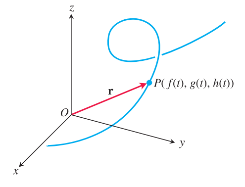
  
图 13.1 质点在空间中运动时，位置向量 $\mathbf r=\overrightarrow{OP}$ 是时间的函数。

 

图 13.2 展示了由计算机绘图程序生成的几条空间曲线，这些曲线不容易手工绘制。

  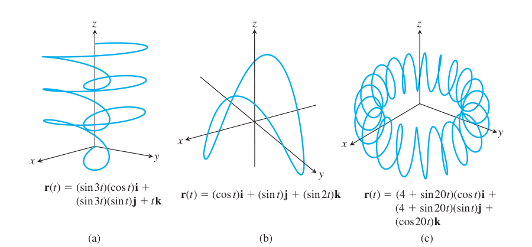
  
图 13.2 空间曲线由位置向量 $\mathbf r(t)$ 定义。

 

式(2)把 $\mathbf r$ 定义为实变量 $t$ 在区间 $I$ 上的向量函数。更一般地说，定义在定义域集合 $D$ 上的向量值函数（或向量函数）是一条规则，它把 $D$ 中的每一个元素对应到空间中的一个向量。现在我们讨论的定义域是实数区间，相应得到空间曲线。以后在第 16 章中，定义域将是平面区域；那时向量函数将表示空间中的曲面。定义在平面或空间区域上的向量函数还会产生“向量场”，它们在研究流体流动、引力场和电磁现象时很重要。第 16 章将研究向量场及其应用。

为了与向量函数区别，实值函数称为标量函数。式(2)中 $\mathbf r$ 的各个分量都是 $t$ 的标量函数。向量值函数的定义域是其各分量函数定义域的公共部分。

**例 1** 作向量函数

$$
\mathbf r(t)=(\cos t)\mathbf i+(\sin t)\mathbf j+t\mathbf k
$$

的图形。

**解：** 向量函数

$$
\mathbf r(t)=(\cos t)\mathbf i+(\sin t)\mathbf j+t\mathbf k
$$

对所有实数 $t$ 有定义。由 $\mathbf r$ 描出的曲线绕圆柱面 $x^2+y^2=1$ 盘旋（图 13.3）。曲线位于该圆柱面上，是因为 $\mathbf r$ 的 $\mathbf i$ 分量和 $\mathbf j$ 分量作为 $\mathbf r$ 端点的 $x$ 坐标和 $y$ 坐标，满足圆柱面的方程：

$$
x^2+y^2=(\cos t)^2+(\sin t)^2=1.
$$

随着 $\mathbf k$ 分量 $z=t$ 增大，曲线向上升。每当 $t$ 增加 $2\pi$，曲线就绕圆柱面转一周。这条曲线称为螺旋线。方程

$$
x=\cos t,\qquad y=\sin t,\qquad z=t
$$

参数化了这条螺旋线，这里默认参数区间为 $-\infty<t<\infty$。

  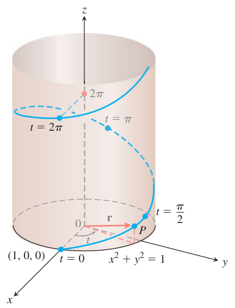
  
图 13.3 螺旋线 $\mathbf r(t)=(\cos t)\mathbf i+(\sin t)\mathbf j+t\mathbf k$ 的上半部分。

 

图 13.4 展示了更多螺旋线。注意，参数 $t$ 的常数倍会改变单位时间内的旋转圈数。

  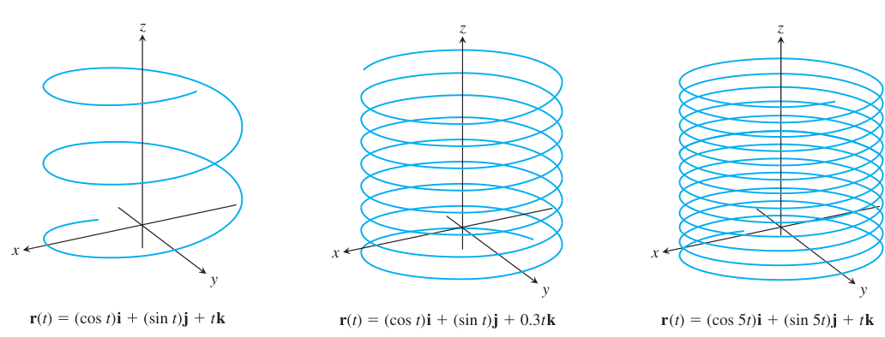
  
图 13.4 螺旋线像弹簧一样绕圆柱面向上盘旋。

 

### 极限与连续性

向量值函数极限的定义方式与实值函数极限的定义方式类似。

  

    
定义

    

      设 $\mathbf r(t)=f(t)\mathbf i+g(t)\mathbf j+h(t)\mathbf k$ 是定义域为 $D$ 的向量函数，$\mathbf L$ 是一个向量；我们说 $\mathbf r$ 当 $t$ 趋近于 $t_0$ 时以 $\mathbf L$ 为极限，并记作
      $$
      \lim_{t\to t_0}\mathbf r(t)=\mathbf L.
      $$
      也就是说，对任意数 $\epsilon>0$，都存在相应的数 $\delta>0$，使得对所有 $t\in D$，
      $$
      |\mathbf r(t)-\mathbf L|<\epsilon
      \quad\text{只要}\quad
      0<|t-t_0|<\delta.
      $$
    

  

若 $\mathbf L=L_1\mathbf i+L_2\mathbf j+L_3\mathbf k$，则可以证明，$\lim_{t\to t_0}\mathbf r(t)=\mathbf L$ 当且仅当

$$
\lim_{t\to t_0}f(t)=L_1,\qquad
\lim_{t\to t_0}g(t)=L_2,\qquad
\lim_{t\to t_0}h(t)=L_3.
$$

这里略去证明。于是可以按分量计算向量函数的极限：

$$
\begin{equation}
\lim_{t\to t_0}\mathbf r(t) =
\left(\lim_{t\to t_0}f(t)\right)\mathbf i +
\left(\lim_{t\to t_0}g(t)\right)\mathbf j +
\left(\lim_{t\to t_0}h(t)\right)\mathbf k.
\tag{3}
\end{equation}
$$

**例 2** 若

$$
\mathbf r(t)=(\cos t)\mathbf i+(\sin t)\mathbf j+t\mathbf k,
$$

则

$$
\lim_{t\to \pi/4}\mathbf r(t) =
\frac{\sqrt2}{2}\mathbf i+\frac{\sqrt2}{2}\mathbf j+\frac{\pi}{4}\mathbf k.
$$

向量函数连续性的定义与区间上标量函数连续性的定义相同。

  

    
定义

    
若 $\lim_{t\to t_0}\mathbf r(t)=\mathbf r(t_0)$，则称向量函数 $\mathbf r(t)$ 在定义域中的点 $t=t_0$ 处连续。若它在整个定义区间上连续，则称它连续。

  

由式(3)可知，$\mathbf r(t)$ 在 $t=t_0$ 处连续，当且仅当它的每个分量函数都在该点连续。

**例 3**

(a) 图 13.2 和图 13.4 中的所有空间曲线都是连续的，因为它们的分量函数在 $(-\infty,\infty)$ 中每一个 $t$ 值处都连续。

(b) 函数

$$
\mathbf g(t)=(\cos t)\mathbf i+(\sin t)\mathbf j+\lfloor t\rfloor\mathbf k
$$

在每一个整数处都不连续，因为最大整数函数 $\lfloor t\rfloor$ 在每一个整数处都不连续。

### 导数、速度与加速度

设 $\mathbf r(t)=f(t)\mathbf i+g(t)\mathbf j+h(t)\mathbf k$ 是质点沿空间曲线运动的位置向量，并且 $f$、$g$、$h$ 都是 $t$ 的可导函数。则质点在时刻 $t$ 与时刻 $t+\Delta t$ 的位置差为

$$
\Delta \mathbf r=\mathbf r(t+\Delta t)-\mathbf r(t).
$$

（图 13.5a）。按分量计算，有

$$
\begin{aligned}
\Delta \mathbf r
&=\mathbf r(t+\Delta t)-\mathbf r(t)\\
&=\bigl[f(t+\Delta t)\mathbf i+g(t+\Delta t)\mathbf j+h(t+\Delta t)\mathbf k\bigr]\\
&\quad-\bigl[f(t)\mathbf i+g(t)\mathbf j+h(t)\mathbf k\bigr]\\
&=\bigl[f(t+\Delta t)-f(t)\bigr]\mathbf i
 +\bigl[g(t+\Delta t)-g(t)\bigr]\mathbf j
 +\bigl[h(t+\Delta t)-h(t)\bigr]\mathbf k.
\end{aligned}
$$

当 $\Delta t$ 趋近于零时，有三件事似乎同时发生。第一，点 $Q$ 沿曲线趋近于点 $P$。第二，割线 $PQ$ 似乎趋近于曲线在 $P$ 处的切线这一极限位置。第三，商 $\Delta \mathbf r/\Delta t$（图 13.5b）趋近于极限

$$
\begin{aligned}
\lim_{\Delta t\to 0}\frac{\Delta\mathbf r}{\Delta t}
&=
\left[\lim_{\Delta t\to 0}\frac{f(t+\Delta t)-f(t)}{\Delta t}\right]\mathbf i
+\left[\lim_{\Delta t\to 0}\frac{g(t+\Delta t)-g(t)}{\Delta t}\right]\mathbf j\\
&\quad+
\left[\lim_{\Delta t\to 0}\frac{h(t+\Delta t)-h(t)}{\Delta t}\right]\mathbf k\\
&=\frac{df}{dt}\mathbf i+\frac{dg}{dt}\mathbf j+\frac{dh}{dt}\mathbf k.
\end{aligned}
$$

  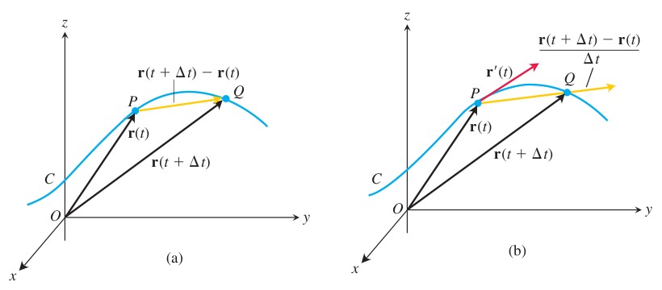
  
图 13.5 当 $\Delta t\to 0$ 时，点 $Q$ 沿曲线趋向点 $P$，向量 $\overrightarrow{PQ}/\Delta t$ 趋于切向量 $\mathbf r'(t)$。

 

这些观察引出下面的定义。

  <strong>定义</strong> 
  若 $f$、$g$、$h$ 在 $t$ 处都有导数，则向量函数
  $$
  \mathbf r(t)=f(t)\mathbf i+g(t)\mathbf j+h(t)\mathbf k
  $$
  在 $t$ 处有导数（或称可导）。其导数是向量函数
  $$
  \mathbf r'(t)=\frac{d\mathbf r}{dt}
  =\lim_{\Delta t\to 0}
  \frac{\mathbf r(t+\Delta t)-\mathbf r(t)}{\Delta t}
  =\frac{df}{dt}\mathbf i+\frac{dg}{dt}\mathbf j+\frac{dh}{dt}\mathbf k.
  $$

若向量函数 $\mathbf r$ 在定义域的每一点都可导，则称 $\mathbf r$ 可导。由 $\mathbf r$ 描出的曲线若满足 $d\mathbf r/dt$ 连续且处处不为 $\mathbf 0$，就称为光滑曲线；也就是说，$f$、$g$、$h$ 具有连续的一阶导数，并且这些导数不同时为 $0$。

导数定义的几何意义如图 13.5 所示。点 $P$ 和 $Q$ 的位置向量分别为 $\mathbf r(t)$ 和 $\mathbf r(t+\Delta t)$，向量 $\overrightarrow{PQ}$ 可由 $\mathbf r(t+\Delta t)-\mathbf r(t)$ 表示。当 $\Delta t>0$ 时，标量倍数

$$
\frac{1}{\Delta t}\bigl(\mathbf r(t+\Delta t)-\mathbf r(t)\bigr)
$$

与向量 $\overrightarrow{PQ}$ 指向相同。随着 $\Delta t\to 0$，这个向量趋近于曲线在点 $P$ 处的一个切向量（图 13.5b）。当 $\mathbf r'(t)\ne\mathbf 0$ 时，$\mathbf r'(t)$ 被定义为曲线在点 $P$ 处的切向量。曲线在点 $\bigl(f(t_0),g(t_0),h(t_0)\bigr)$ 处的切线，是过该点并且平行于 $\mathbf r'(t_0)$ 的直线。要求 $d\mathbf r/dt\ne\mathbf 0$，是为了保证光滑曲线在每一点都有连续转动的切线；光滑曲线没有尖角或尖点。

由有限条光滑曲线首尾连续拼接而成的曲线，称为分段光滑曲线。

  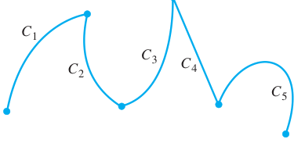
  
图 13.6 由五条光滑曲线首尾连续连接而成的分段光滑曲线。

 

无论 $\Delta \mathbf r$ 指向前方还是后方，商 $\Delta \mathbf r/\Delta t$ 总是指向运动的前方。因此，当

$$
\frac{d\mathbf r}{dt}=\lim_{\Delta t\to 0}\frac{\Delta \mathbf r}{\Delta t}
$$

不为 $\mathbf 0$ 时，它也指向运动方向。这说明位置对时间的变化率 $d\mathbf r/dt$ 总是指向运动方向。对光滑曲线来说，$d\mathbf r/dt$ 从不为零；质点不会停下或反向运动。

如果 $\mathbf r$ 是运动质点的位置向量，那么

$$
\mathbf v(t)=\frac{d\mathbf r}{dt}
$$

是速度向量，它与路径相切；速度的大小

$$
|\mathbf v(t)|
$$

是速率；加速度向量为

$$
\mathbf a(t)=\frac{d\mathbf v}{dt}=\frac{d^2\mathbf r}{dt^2}.
$$

速度可以写成

$$
\text{Velocity}
=|\mathbf v|\frac{\mathbf v}{|\mathbf v|}
=\text{speed}\cdot \text{direction}.
$$

例如，对

$$
\mathbf r(t)=(\cos t)\mathbf i+(\sin t)\mathbf j+t\mathbf k,
$$

有

$$
\mathbf v(t)=\mathbf r'(t)=-(\sin t)\mathbf i+(\cos t)\mathbf j+\mathbf k.
$$

这说明螺旋线在参数 $t$ 处的切向量沿着该速度向量的方向。

**例 4** 设质点的位置向量为

$$
\mathbf r(t)=2\cos t\,\mathbf i+2\sin t\,\mathbf j+5\cos^2t\,\mathbf k.
$$

求速度、速率和加速度，并画出速度向量 $\mathbf v(7\pi/4)$。

**解：**

$$
\mathbf v(t)=\mathbf r'(t)
=-2\sin t\,\mathbf i+2\cos t\,\mathbf j-10\cos t\sin t\,\mathbf k
=-2\sin t\,\mathbf i+2\cos t\,\mathbf j-5\sin 2t\,\mathbf k.
$$

$$
\mathbf a(t)=\mathbf r''(t)
=-2\cos t\,\mathbf i-2\sin t\,\mathbf j-10\cos 2t\,\mathbf k.
$$

速率为

$$
|\mathbf v(t)| =
\sqrt{(-2\sin t)^2+(2\cos t)^2+(-5\sin 2t)^2} =
\sqrt{4+25\sin^2 2t}.
$$

当 $t=7\pi/4$ 时，

$$
\mathbf v\left(\frac{7\pi}{4}\right)=\sqrt2\,\mathbf i+\sqrt2\,\mathbf j+5\mathbf k,
$$

$$
\mathbf a\left(\frac{7\pi}{4}\right)=-\sqrt2\,\mathbf i+\sqrt2\,\mathbf j,
$$

$$
\left|\mathbf v\left(\frac{7\pi}{4}\right)\right|=\sqrt{29}.
$$

运动曲线以及 $t=7\pi/4$ 时的速度向量见图 13.7。

  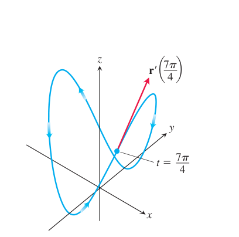
  
图 13.7 例 4 中 $t=7\pi/4$ 时的运动曲线和速度向量。

 

### 向量函数的求导法则

设 $\mathbf u$ 和 $\mathbf v$ 是 $t$ 的可导向量函数，$\mathbf C$ 是常向量，$c$ 是标量，$f$ 是可导标量函数，则：

$$
\frac{d}{dt}\mathbf C=\mathbf 0.
$$

$$
\frac{d}{dt}\bigl[c\mathbf u(t)\bigr]=c\mathbf u'(t).
$$

$$
\frac{d}{dt}\bigl[f(t)\mathbf u(t)\bigr] =
f'(t)\mathbf u(t)+f(t)\mathbf u'(t).
$$

$$
\frac{d}{dt}\bigl[\mathbf u(t)+\mathbf v(t)\bigr] =
\mathbf u'(t)+\mathbf v'(t).
$$

$$
\frac{d}{dt}\bigl[\mathbf u(t)-\mathbf v(t)\bigr] =
\mathbf u'(t)-\mathbf v'(t).
$$

$$
\frac{d}{dt}\bigl[\mathbf u(t)\cdot\mathbf v(t)\bigr] =
\mathbf u'(t)\cdot\mathbf v(t)+\mathbf u(t)\cdot\mathbf v'(t).
$$

$$
\frac{d}{dt}\bigl[\mathbf u(t)\times\mathbf v(t)\bigr] =
\mathbf u'(t)\times\mathbf v(t)+\mathbf u(t)\times\mathbf v'(t).
$$

$$
\frac{d}{dt}\bigl[\mathbf u(f(t))\bigr] =
f'(t)\mathbf u'(f(t)).
$$

使用叉积求导法则时要保持因子顺序。如果左边是 $\mathbf u\times\mathbf v$，右边也必须保持 $\mathbf u$ 在前、$\mathbf v$ 在后；否则符号会出错。

**叉积求导法则的证明思路** 与标量乘积法则相似：

$$
\frac{d}{dt}\bigl(\mathbf u\times\mathbf v\bigr) =
\lim_{h\to 0}
\frac{\mathbf u(t+h)\times\mathbf v(t+h)-\mathbf u(t)\times\mathbf v(t)}{h}.
$$

在分子中加减同一项 $\mathbf u(t)\times\mathbf v(t+h)$，得到

$$
\begin{aligned}
\frac{d}{dt}\bigl(\mathbf u\times\mathbf v\bigr)
&=
\lim_{h\to 0}
\left[
\frac{\mathbf u(t+h)-\mathbf u(t)}{h}\times \mathbf v(t+h) +
\mathbf u(t)\times
\frac{\mathbf v(t+h)-\mathbf v(t)}{h}
\right] \\
&=
\mathbf u'(t)\times\mathbf v(t)+\mathbf u(t)\times\mathbf v'(t).
\end{aligned}
$$

### 常长向量函数

如果 $\mathbf r(t)$ 的长度恒定，即 $|\mathbf r(t)|=c$，则 $\mathbf r(t)$ 与 $\mathbf r'(t)$ 正交。因为

$$
\mathbf r(t)\cdot\mathbf r(t)=c^2,
$$

两边对 $t$ 求导：

$$
\mathbf r'(t)\cdot\mathbf r(t)+\mathbf r(t)\cdot\mathbf r'(t)=0.
$$

由点积交换律，

$$
2\mathbf r'(t)\cdot\mathbf r(t)=0,
$$

因此

$$
\mathbf r(t)\cdot\frac{d\mathbf r}{dt}=0.
$$

这说明质点在以原点为中心的球面上运动时，位置向量与速度向量垂直。

  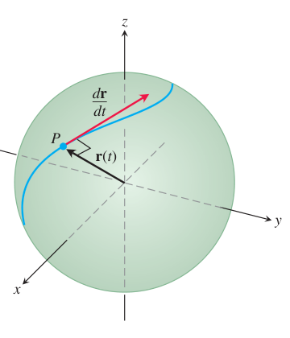
  
图 13.8 质点在球面上运动时，位置向量 $\mathbf r$ 与速度向量 $d\mathbf r/dt$ 正交。

 

## 13.2 向量函数的积分；抛射运动

向量函数的积分按分量定义。若

$$
\mathbf r(t)=f(t)\mathbf i+g(t)\mathbf j+h(t)\mathbf k,
$$

且三个分量在区间 $[a,b]$ 上可积，则

$$
\int_a^b \mathbf r(t)\,dt =
\left(\int_a^b f(t)\,dt\right)\mathbf i +
\left(\int_a^b g(t)\,dt\right)\mathbf j +
\left(\int_a^b h(t)\,dt\right)\mathbf k.
$$

不定积分也按分量进行，并在最后加上常向量：

$$
\int \mathbf r(t)\,dt =
\left(\int f(t)\,dt\right)\mathbf i +
\left(\int g(t)\,dt\right)\mathbf j +
\left(\int h(t)\,dt\right)\mathbf k +
\mathbf C.
$$

**例 1** 求

$$
\int \bigl((\cos t)\mathbf i+\mathbf j-2t\mathbf k\bigr)\,dt.
$$

**解：**

$$
\int \bigl((\cos t)\mathbf i+\mathbf j-2t\mathbf k\bigr)\,dt =
(\sin t)\mathbf i+t\mathbf j-t^2\mathbf k+\mathbf C.
$$

**例 2** 求定积分

$$
\int_0^\pi \bigl((\cos t)\mathbf i+\mathbf j-2t\mathbf k\bigr)\,dt.
$$

**解：**

$$
\begin{aligned}
\int_0^\pi \bigl((\cos t)\mathbf i+\mathbf j-2t\mathbf k\bigr)\,dt
&=
\left[\sin t\right]_0^\pi\mathbf i +
\left[t\right]_0^\pi\mathbf j -
\left[t^2\right]_0^\pi\mathbf k \\
&=
\pi\mathbf j-\pi^2\mathbf k.
\end{aligned}
$$

### 由加速度求速度和位置

如果给定加速度

$$
\frac{d^2\mathbf r}{dt^2}=\mathbf a(t),
$$

则一次积分得到速度，再积分得到位置。积分常向量由初始条件确定。

**例 3** 设滑翔机的加速度为

$$
\mathbf a(t)=-3\cos t\,\mathbf i-3\sin t\,\mathbf j+2\mathbf k,
$$

且

$$
\mathbf v(0)=3\mathbf j,\qquad \mathbf r(0)=4\mathbf i.
$$

求位置函数。

**解：** 积分加速度得速度：

$$
\mathbf v(t)=-3\sin t\,\mathbf i+3\cos t\,\mathbf j+2t\mathbf k+\mathbf C_1.
$$

由 $\mathbf v(0)=3\mathbf j$ 得 $\mathbf C_1=\mathbf 0$，所以

$$
\mathbf v(t)=-3\sin t\,\mathbf i+3\cos t\,\mathbf j+2t\mathbf k.
$$

继续积分：

$$
\mathbf r(t)=3\cos t\,\mathbf i+3\sin t\,\mathbf j+t^2\mathbf k+\mathbf C_2.
$$

由 $\mathbf r(0)=4\mathbf i$ 得 $\mathbf C_2=\mathbf i$，于是

$$
\mathbf r(t)=(1+3\cos t)\mathbf i+3\sin t\,\mathbf j+t^2\mathbf k.
$$

  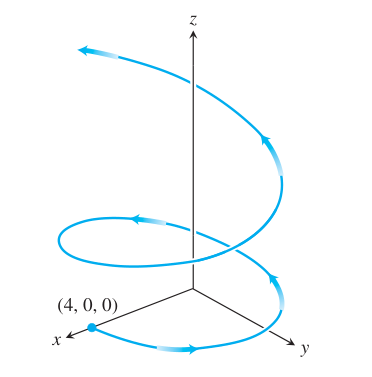
  
图 13.9 例 3 中滑翔机的路径；路径绕 $z$ 轴盘旋，但不是螺旋线。

 

### 理想抛射运动

理想抛射运动中，忽略空气阻力，物体只受重力作用。取竖直向上为 $\mathbf j$ 正方向，则加速度为

$$
\frac{d^2\mathbf r}{dt^2}=-g\mathbf j.
$$

设初始位置为 $\mathbf r_0$，初始速度为 $\mathbf v_0$。积分得到

$$
\frac{d\mathbf r}{dt}=-gt\,\mathbf j+\mathbf v_0,
$$

以及

$$
\mathbf r(t)=-\frac12gt^2\mathbf j+\mathbf v_0t+\mathbf r_0.
$$

若从原点发射，初速度大小为 $v_0$，发射角为 $\alpha$，则

$$
\mathbf v_0=(v_0\cos\alpha)\mathbf i+(v_0\sin\alpha)\mathbf j.
$$

  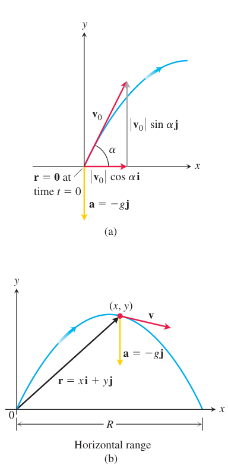
  
图 13.10 理想抛射运动中，初始时刻和之后时刻的位置、速度与加速度。

 

于是理想抛射运动的向量方程为

$$
\mathbf r(t) =
(v_0\cos\alpha)t\,\mathbf i +
\left((v_0\sin\alpha)t-\frac12gt^2\right)\mathbf j.
$$

分量形式为

$$
x=(v_0\cos\alpha)t,\qquad
y=(v_0\sin\alpha)t-\frac12gt^2.
$$

消去参数 $t$ 可得轨道方程

$$
y =
-\frac{g}{2v_0^2\cos^2\alpha}x^2 +
(\tan\alpha)x,
$$

所以理想抛射体沿抛物线运动。

当抛射体从原点发射并落回同一水平面时：

$$
y_{\max}=\frac{(v_0\sin\alpha)^2}{2g},
$$

$$
t_{\text{flight}}=\frac{2v_0\sin\alpha}{g},
$$

$$
R=\frac{v_0^2}{g}\sin 2\alpha.
$$

若从点 $(x_0,y_0)$ 发射，则位置向量为

$$
\mathbf r(t) =
\bigl(x_0+(v_0\cos\alpha)t\bigr)\mathbf i +
\left(y_0+(v_0\sin\alpha)t-\frac12gt^2\right)\mathbf j.
$$

  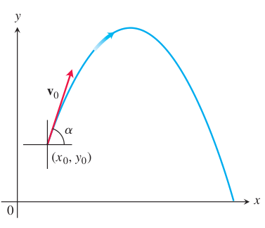
  
图 13.11 从 $(x_0,y_0)$ 以初速度 $\mathbf v_0$、仰角 $\alpha$ 发射的抛射体路径。

 

**例 4** 一个抛射体从原点发射，初速 $500\text{ m/sec}$，发射角为 $45^\circ$。忽略空气阻力，求路径方程。

**解：**

$$
x=(500\cos45^\circ)t=\frac{500}{\sqrt2}t,
$$

$$
y=(500\sin45^\circ)t-\frac12gt^2
=\frac{500}{\sqrt2}t-\frac12gt^2.
$$

消去 $t=x/(500/\sqrt2)$ 得到

$$
y=x-\frac{g}{250000}x^2.
$$

## 13.3 空间中的弧长

本节与接下来两节研究描述曲线形状的数学量。首先讨论空间曲线的弧长。光滑曲线可以用沿曲线的有向距离来标定。

  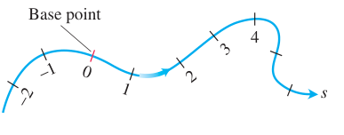
  
图 13.12 光滑曲线可以像数轴一样标定，每一点的坐标是它到预选基点的有向距离。

 

若质点沿曲线

$$
\mathbf r(t)=x(t)\mathbf i+y(t)\mathbf j+z(t)\mathbf k,\qquad a\le t\le b,
$$

运动，且速度

$$
\mathbf v(t)=\mathbf r'(t)
$$

连续，则曲线从 $t=a$ 到 $t=b$ 的弧长为

$$
L=\int_a^b |\mathbf v(t)|\,dt =
\int_a^b
\sqrt{
\left(\frac{dx}{dt}\right)^2 +
\left(\frac{dy}{dt}\right)^2 +
\left(\frac{dz}{dt}\right)^2
}\,dt.
$$

**例 1** 滑翔机沿螺旋线

$$
\mathbf r(t)=(\cos t)\mathbf i+(\sin t)\mathbf j+t\mathbf k
$$

上升。求从 $t=0$ 到 $t=2\pi$ 的路径长度。

**解：**

$$
\mathbf v(t)=-(\sin t)\mathbf i+(\cos t)\mathbf j+\mathbf k.
$$

因此

$$
|\mathbf v(t)|=\sqrt{\sin^2t+\cos^2t+1}=\sqrt2.
$$

弧长为

$$
L=\int_0^{2\pi}\sqrt2\,dt=2\pi\sqrt2.
$$

  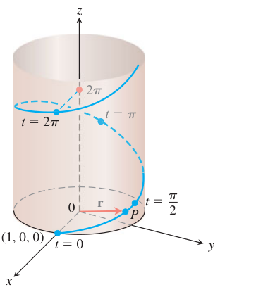
  
图 13.13 例 1 中的螺旋线 $\mathbf r(t)=(\cos t)\mathbf i+(\sin t)\mathbf j+t\mathbf k$。

 

### 弧长参数

选取曲线上的基点 $P(t_0)$。参数 $t$ 的每一个值都确定曲线上的点 $P(t)$。沿曲线从基点到 $P(t)$ 的有向距离定义为

$$
s(t)=\int_{t_0}^t |\mathbf v(\tau)|\,d\tau.
$$

  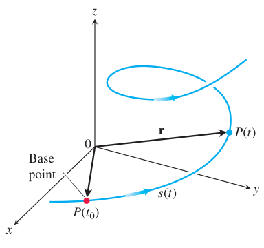
  
图 13.14 从基点 $P(t_0)$ 到曲线上任一点 $P(t)$ 的有向距离为弧长参数 $s(t)$。

 

若 $t>t_0$，则 $s(t)$ 是沿曲线从 $P(t_0)$ 到 $P(t)$ 的距离；若 $t<t_0$，则 $s(t)$ 是这个距离的相反数。参数 $s$ 称为曲线的弧长参数。

对上式求导可得

$$
\frac{ds}{dt}=|\mathbf v(t)|.
$$

这说明质点沿路径覆盖距离的速率等于速度向量的大小。

**例 2** 对螺旋线

$$
\mathbf r(t)=(\cos t)\mathbf i+(\sin t)\mathbf j+t\mathbf k,
$$

若从 $t_0=0$ 开始测量弧长，则

$$
s(t)=\int_0^t \sqrt2\,d\tau=\sqrt2\,t.
$$

所以

$$
t=\frac{s}{\sqrt2}.
$$

代入原式，得到以弧长为参数的表示：

$$
\mathbf r(s) =
\cos\left(\frac{s}{\sqrt2}\right)\mathbf i +
\sin\left(\frac{s}{\sqrt2}\right)\mathbf j +
\frac{s}{\sqrt2}\mathbf k.
$$

### 单位切向量

在光滑曲线上，单位切向量定义为

$$
\mathbf T=\frac{\mathbf v}{|\mathbf v|}.
$$

  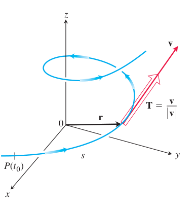
  
图 13.15 用速度向量 $\mathbf v$ 除以其长度 $|\mathbf v|$，得到单位切向量 $\mathbf T$。

 

若用弧长参数 $s$ 表示曲线，则

$$
\frac{d\mathbf r}{ds} =
\frac{d\mathbf r}{dt}\frac{dt}{ds} =
\mathbf v\frac{1}{|\mathbf v|} =
\mathbf T.
$$

因此，$\dfrac{d\mathbf r}{ds}$ 是沿速度方向的单位切向量。

**例 3** 设

$$
\mathbf r(t)=3\cos t\,\mathbf i+3\sin t\,\mathbf j+t^2\mathbf k.
$$

求单位切向量。

**解：**

$$
\mathbf v(t)=-3\sin t\,\mathbf i+3\cos t\,\mathbf j+2t\mathbf k,
$$

$$
|\mathbf v(t)|=\sqrt{9+4t^2}.
$$

所以

$$
\mathbf T(t) =
\frac{-3\sin t}{\sqrt{9+4t^2}}\mathbf i +
\frac{3\cos t}{\sqrt{9+4t^2}}\mathbf j +
\frac{2t}{\sqrt{9+4t^2}}\mathbf k.
$$

  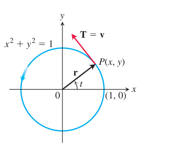
  
图 13.16 单位圆上的逆时针运动，速度方向即单位切向量方向。

 

## 13.4 曲率与曲线的法向量

本节研究曲线如何转弯或弯曲。设曲线用弧长参数 $s$ 表示。单位切向量 $\mathbf T$ 随 $s$ 的变化率给出曲线的转弯快慢。曲率定义为

$$
\kappa=\left|\frac{d\mathbf T}{ds}\right|.
$$

若 $\left|d\mathbf T/ds\right|$ 很大，则曲线在该点急剧转弯，曲率较大；若它接近零，则曲线转弯较慢，曲率较小。

  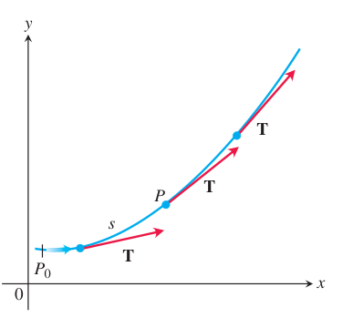
  
图 13.17 点 $P$ 沿弧长增加方向运动时，单位切向量 $\mathbf T$ 转动；$|d\mathbf T/ds|$ 描述曲率。

 

若曲线由一般参数 $t$ 给出，则由链式法则

$$
\kappa =
\left|\frac{d\mathbf T}{ds}\right| =
\left|\frac{d\mathbf T}{dt}\frac{dt}{ds}\right| =
\frac{1}{|\mathbf v|}
\left|\frac{d\mathbf T}{dt}\right|.
$$

因此

$$
\kappa =
\frac{1}{|\mathbf v|}
\left|\frac{d\mathbf T}{dt}\right|,
\qquad
\mathbf T=\frac{\mathbf v}{|\mathbf v|}.
$$

**例 1** 一条直线可表示为

$$
\mathbf r(t)=\mathbf C+t\mathbf v,
$$

其中 $\mathbf C$ 与 $\mathbf v$ 是常向量。此时

$$
\mathbf r'(t)=\mathbf v,\qquad
\mathbf T=\frac{\mathbf v}{|\mathbf v|},
$$

是常向量，因此

$$
\kappa=\frac{1}{|\mathbf v|}\left|\frac{d\mathbf T}{dt}\right|=0.
$$

所以直线的曲率为零。

  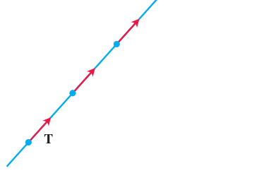
  
图 13.18 沿直线运动时，$\mathbf T$ 始终指向同一方向，因此曲率为零。

 

**例 2** 半径为 $a$ 的圆

$$
\mathbf r(t)=a\cos t\,\mathbf i+a\sin t\,\mathbf j
$$

满足

$$
\mathbf v(t)=-a\sin t\,\mathbf i+a\cos t\,\mathbf j,\qquad
|\mathbf v(t)|=a.
$$

因此

$$
\mathbf T(t)=-\sin t\,\mathbf i+\cos t\,\mathbf j,
$$

$$
\frac{d\mathbf T}{dt}=-\cos t\,\mathbf i-\sin t\,\mathbf j,
\qquad
\left|\frac{d\mathbf T}{dt}\right|=1.
$$

所以

$$
\kappa=\frac{1}{a}.
$$

圆的曲率等于半径的倒数。

### 主单位法向量

因为 $\mathbf T$ 是单位向量，所以 $\mathbf T$ 与 $d\mathbf T/ds$ 正交。当 $\kappa\ne 0$ 时，定义主单位法向量

$$
\mathbf N =
\frac{1}{\kappa}\frac{d\mathbf T}{ds}.
$$

若曲线用参数 $t$ 表示，也可写成

$$
\mathbf N =
\frac{d\mathbf T/dt}{|d\mathbf T/dt|}.
$$

向量 $\mathbf N$ 指向曲线弯曲的方向。

  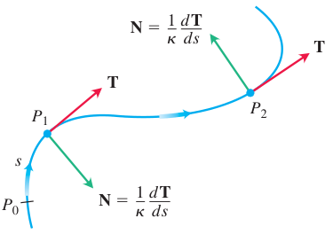
  
图 13.19 向量 $d\mathbf T/ds$ 总是指向 $\mathbf T$ 转动的方向，主单位法向量 $\mathbf N$ 是它的方向。

 

**例 3** 对圆

$$
\mathbf r(t)=a\cos t\,\mathbf i+a\sin t\,\mathbf j,
$$

有

$$
\mathbf T(t)=-\sin t\,\mathbf i+\cos t\,\mathbf j,
$$

所以

$$
\mathbf N(t)=-\cos t\,\mathbf i-\sin t\,\mathbf j.
$$

这个法向量指向圆心。

### 密切圆

在平面曲线的一点 $P$ 处，若 $\kappa\ne 0$，曲率圆或密切圆是满足以下条件的圆：

1. 与曲线在 $P$ 处相切；
2. 在 $P$ 处具有与曲线相同的曲率；
3. 圆心位于曲线凹侧。

曲率半径为

$$
\rho=\frac{1}{\kappa}.
$$

  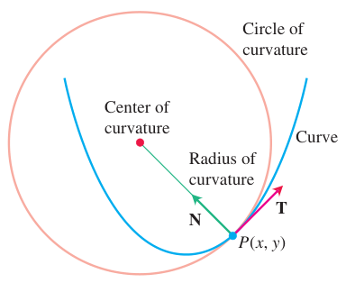
  
图 13.20 点 $P(x,y)$ 处密切圆的圆心位于曲线的凹侧。

 

若曲线在点 $P$ 处的位置向量为 $\mathbf r$，则密切圆圆心为

$$
\mathbf r+\frac{1}{\kappa}\mathbf N.
$$

**例 4** 求抛物线 $y=x^2$ 在原点处的密切圆。

**解：** 取参数表示

$$
\mathbf r(t)=t\mathbf i+t^2\mathbf j.
$$

计算可得原点处曲率

$$
\kappa=2.
$$

因此曲率半径为

$$
\rho=\frac12.
$$

在原点处 $\mathbf T=\mathbf i$，$\mathbf N=\mathbf j$，所以圆心为 $(0,1/2)$。密切圆方程为

$$
x^2+\left(y-\frac12\right)^2=\left(\frac12\right)^2.
$$

  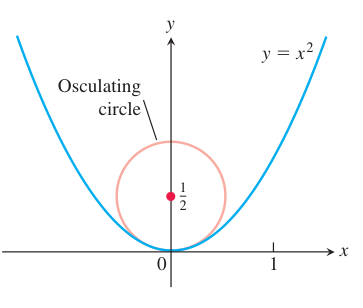
  
图 13.21 抛物线 $y=x^2$ 在原点处的密切圆。

 

### 空间曲线的曲率与法向量

对于空间曲线，定义与平面曲线相同：

$$
\mathbf T=\frac{\mathbf v}{|\mathbf v|},
\qquad
\kappa=\left|\frac{d\mathbf T}{ds}\right| =
\frac{1}{|\mathbf v|}
\left|\frac{d\mathbf T}{dt}\right|,
$$

且

$$
\mathbf N =
\frac{1}{\kappa}\frac{d\mathbf T}{ds} =
\frac{d\mathbf T/dt}{|d\mathbf T/dt|}.
$$

**例 5** 求螺旋线

$$
\mathbf r(t)=a\cos t\,\mathbf i+a\sin t\,\mathbf j+bt\,\mathbf k,\qquad a,b\ge 0,\quad a^2+b^2\ne 0,
$$

的曲率。

  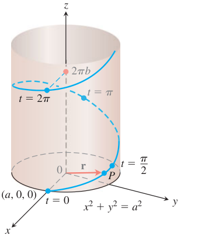
  
图 13.22 螺旋线 $\mathbf r(t)=(a\cos t)\mathbf i+(a\sin t)\mathbf j+bt\mathbf k$，其中 $a,b>0$ 且 $t\ge 0$。

 

**解：**

$$
\mathbf v(t)=-a\sin t\,\mathbf i+a\cos t\,\mathbf j+b\mathbf k,
$$

$$
|\mathbf v(t)|=\sqrt{a^2+b^2}.
$$

所以

$$
\mathbf T(t) =
\frac{-a\sin t\,\mathbf i+a\cos t\,\mathbf j+b\mathbf k}{\sqrt{a^2+b^2}}.
$$

进一步有

$$
\frac{d\mathbf T}{dt} =
\frac{-a\cos t\,\mathbf i-a\sin t\,\mathbf j}{\sqrt{a^2+b^2}},
$$

$$
\left|\frac{d\mathbf T}{dt}\right| =
\frac{a}{\sqrt{a^2+b^2}}.
$$

因此

$$
\kappa =
\frac{1}{\sqrt{a^2+b^2}}
\cdot
\frac{a}{\sqrt{a^2+b^2}} =
\frac{a}{a^2+b^2}.
$$

**例 6** 求上例螺旋线的主单位法向量。

**解：**

$$
\mathbf N(t) =
\frac{d\mathbf T/dt}{|d\mathbf T/dt|} =
-\cos t\,\mathbf i-\sin t\,\mathbf j.
$$

该向量在水平面内指向螺旋线轴线。

## 13.5 加速度的切向分量与法向分量

若沿空间曲线运动，只用 $\mathbf i$、$\mathbf j$、$\mathbf k$ 分解加速度有时不够揭示几何意义。更自然的是沿曲线的切向和法向分解。

由于

$$
\mathbf v=|\mathbf v|\mathbf T,
$$

对 $t$ 求导：

$$
\mathbf a =
\frac{d\mathbf v}{dt} =
\frac{d|\mathbf v|}{dt}\mathbf T +
|\mathbf v|\frac{d\mathbf T}{dt}.
$$

又因为

$$
\frac{d\mathbf T}{dt} =
\frac{d\mathbf T}{ds}\frac{ds}{dt} =
\kappa \mathbf N |\mathbf v|,
$$

所以

$$
\mathbf a =
\frac{d|\mathbf v|}{dt}\mathbf T +
\kappa|\mathbf v|^2\mathbf N.
$$

这就是加速度沿切向和法向的分解：

$$
\mathbf a=a_T\mathbf T+a_N\mathbf N,
$$

其中

$$
a_T=\frac{d|\mathbf v|}{dt},
\qquad
a_N=\kappa|\mathbf v|^2.
$$

切向分量 $a_T$ 描述速率变化，法向分量 $a_N$ 描述速度方向变化。

  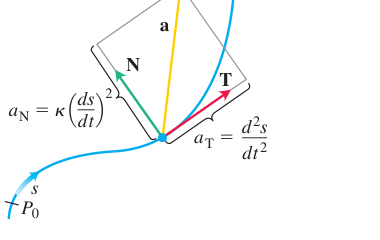
  
图 13.25 加速度的切向分量和法向分量；加速度 $\mathbf a$ 位于 $\mathbf T$ 与 $\mathbf N$ 张成的平面内。

 

在圆周运动中，切向分量刻画速率变化，法向分量指向圆心。

  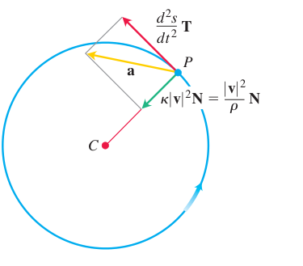
  
图 13.26 物体绕半径为 $r$ 的圆逆时针加速运动时的切向和法向加速度分量。

 

常用计算公式为

$$
a_T=\frac{\mathbf v\cdot\mathbf a}{|\mathbf v|},
$$

$$
a_N=\frac{|\mathbf v\times\mathbf a|}{|\mathbf v|}.
$$

**例 1** 不求 $\mathbf T$ 和 $\mathbf N$，写出运动

$$
\mathbf r(t)=(\cos t+t\sin t)\mathbf i+(\sin t-t\cos t)\mathbf j
$$

的加速度切向分量和法向分量。

**解：**

$$
\mathbf v(t)=t\cos t\,\mathbf i+t\sin t\,\mathbf j,
$$

$$
|\mathbf v(t)|=|t|.
$$

当 $t>0$ 时，

$$
a_T=\frac{d|\mathbf v|}{dt}=1.
$$

又

$$
\mathbf a(t)=(\cos t-t\sin t)\mathbf i+(\sin t+t\cos t)\mathbf j,
$$

可求

$$
|\mathbf a|^2=1+t^2.
$$

由 $|\mathbf a|^2=a_T^2+a_N^2$ 得

$$
a_N=t.
$$

该运动的路径是圆的渐开线。

  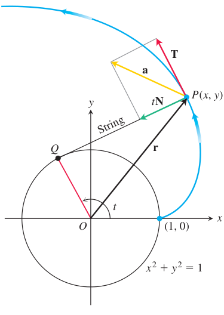
  
图 13.27 例 1 中运动的切向和法向加速度分量；拉紧的细线从固定圆上展开时，端点描出圆的渐开线。

 

### TNB 标架

空间曲线的副法向量定义为

$$
\mathbf B=\mathbf T\times\mathbf N.
$$

向量 $\mathbf B$ 是同时垂直于 $\mathbf T$ 和 $\mathbf N$ 的单位向量。三元组

$$
\mathbf T,\qquad \mathbf N,\qquad \mathbf B
$$

称为曲线的 TNB 标架。

  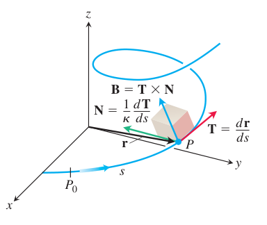
  
图 13.23 沿空间曲线运动的相互正交单位向量 $\mathbf T$、$\mathbf N$、$\mathbf B$ 组成 TNB 标架。

 

  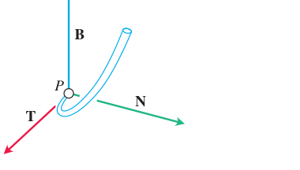
  
图 13.24 向量 $\mathbf T$、$\mathbf N$、$\mathbf B$ 按此顺序构成空间中的右手正交标架。

 

由 $\mathbf B$ 与 $\mathbf T$、$\mathbf N$ 正交，空间曲线在一点附近可以关联三个平面：

1. 密切平面：由 $\mathbf T$ 和 $\mathbf N$ 张成；
2. 法平面：由 $\mathbf N$ 和 $\mathbf B$ 张成；
3. 校正平面：由 $\mathbf T$ 和 $\mathbf B$ 张成。

  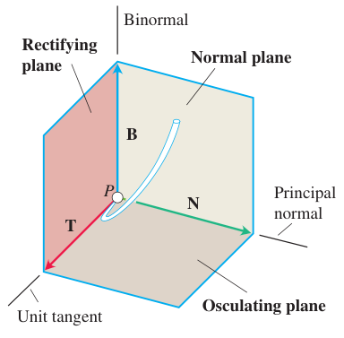
  
图 13.28 由 $\mathbf T$、$\mathbf N$、$\mathbf B$ 确定的密切平面、法平面和校正平面。

 

### 挠率

曲率度量曲线弯曲的快慢；挠率度量曲线离开密切平面的快慢。若 $\mathbf B$ 关于弧长的导数存在，则挠率定义为

$$
\tau=-\frac{d\mathbf B}{ds}\cdot\mathbf N.
$$

挠率可以为正、负或零。

  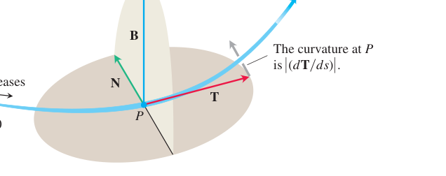
  
图 13.29 每个运动物体都携带一个刻画其路径几何特征的 TNB 标架。

 

对于由

$$
\mathbf r(t)=x(t)\mathbf i+y(t)\mathbf j+z(t)\mathbf k
$$

给出的曲线，若 $\mathbf v=\mathbf r'$、$\mathbf a=\mathbf r''$ 且 $\mathbf r'''$ 存在，则

$$
\tau =
\frac{(\mathbf v\times\mathbf a)\cdot \mathbf r'''}{|\mathbf v\times\mathbf a|^2}.
$$

用行列式写作

$$
\tau =
\frac{
\begin{vmatrix}
x' & y' & z'\\
x'' & y'' & z''\\
x''' & y''' & z'''
\end{vmatrix}
}{
|\mathbf v\times\mathbf a|^2
}.
$$

### 由速度和加速度计算曲率

因为

$$
a_N=\kappa|\mathbf v|^2
$$

且

$$
a_N=\frac{|\mathbf v\times\mathbf a|}{|\mathbf v|},
$$

所以

$$
\kappa =
\frac{|\mathbf v\times\mathbf a|}{|\mathbf v|^3}.
$$

这条公式可以直接由任意参数下的速度和加速度求曲线的几何曲率。

**例 2** 求螺旋线

$$
\mathbf r(t)=a\cos t\,\mathbf i+a\sin t\,\mathbf j+bt\,\mathbf k
$$

的挠率。

**解：**

$$
\mathbf v=-a\sin t\,\mathbf i+a\cos t\,\mathbf j+b\mathbf k,
$$

$$
\mathbf a=-a\cos t\,\mathbf i-a\sin t\,\mathbf j,
$$

$$
\mathbf r'''=a\sin t\,\mathbf i-a\cos t\,\mathbf j.
$$

计算得

$$
\tau=\frac{b}{a^2+b^2}.
$$

因此螺旋线的曲率和挠率都是常数：

$$
\kappa=\frac{a}{a^2+b^2},
\qquad
\tau=\frac{b}{a^2+b^2}.
$$

## 13.6 极坐标中的速度与加速度

本节推导极坐标中的速度和加速度公式。设质点在平面中运动，其位置由极坐标 $(r,\theta)$ 描述。定义径向单位向量和横向单位向量：

$$
\mathbf u_r=(\cos\theta)\mathbf i+(\sin\theta)\mathbf j,
$$

$$
\mathbf u_\theta=-(\sin\theta)\mathbf i+(\cos\theta)\mathbf j.
$$

其中 $\mathbf u_r$ 指向从原点到质点的方向，$\mathbf u_\theta$ 是把 $\mathbf u_r$ 逆时针旋转 $90^\circ$ 得到的方向。

  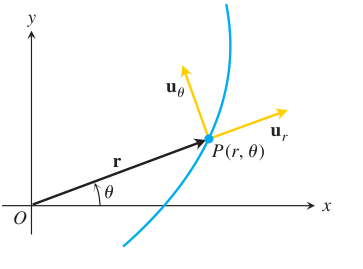
  
图 13.30 极坐标中，$\mathbf u_r$ 沿位置向量方向，$\mathbf u_\theta$ 垂直于 $\mathbf u_r$ 并指向 $\theta$ 增大的方向。

 

对 $\theta$ 求导：

$$
\frac{d\mathbf u_r}{d\theta} =
-(\sin\theta)\mathbf i+(\cos\theta)\mathbf j =
\mathbf u_\theta,
$$

$$
\frac{d\mathbf u_\theta}{d\theta} =
-(\cos\theta)\mathbf i-(\sin\theta)\mathbf j =
-\mathbf u_r.
$$

若 $\theta=\theta(t)$，则由链式法则

$$
\frac{d\mathbf u_r}{dt} =
\frac{d\mathbf u_r}{d\theta}\frac{d\theta}{dt} =
\dot\theta\,\mathbf u_\theta,
$$

$$
\frac{d\mathbf u_\theta}{dt} =
\frac{d\mathbf u_\theta}{d\theta}\frac{d\theta}{dt} =
-\dot\theta\,\mathbf u_r.
$$

位置向量为

$$
\mathbf r=r\mathbf u_r.
$$

因此速度为

$$
\mathbf v =
\frac{d}{dt}(r\mathbf u_r) =
\dot r\,\mathbf u_r+r\dot\theta\,\mathbf u_\theta.
$$

  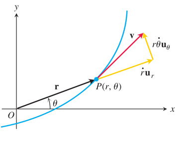
  
图 13.31 极坐标中，速度向量分解为 $\dot r\,\mathbf u_r+r\dot\theta\,\mathbf u_\theta$。

 

继续求导，得加速度

$$
\begin{aligned}
\mathbf a
&=
\frac{d}{dt}
\bigl(\dot r\,\mathbf u_r+r\dot\theta\,\mathbf u_\theta\bigr)\\
&=
(\ddot r-r\dot\theta^2)\mathbf u_r +
(r\ddot\theta+2\dot r\dot\theta)\mathbf u_\theta.
\end{aligned}
$$

所以极坐标中的速度与加速度公式为

$$
\mathbf v=\dot r\,\mathbf u_r+r\dot\theta\,\mathbf u_\theta,
$$

$$
\mathbf a=(\ddot r-r\dot\theta^2)\mathbf u_r +
(r\ddot\theta+2\dot r\dot\theta)\mathbf u_\theta.
$$

圆柱坐标中还要加上竖直方向分量 $z\mathbf k$。

  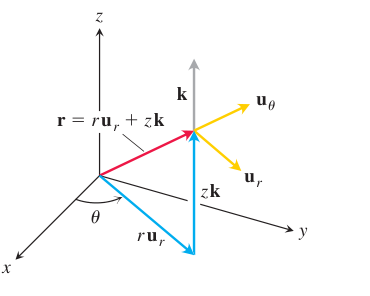
  
图 13.32 圆柱坐标中的位置向量和基本单位向量；当 $z\ne 0$ 时，$|\mathbf r|\ne r$。

 

**例 1** 若质点沿圆 $r=a$ 运动，则 $\dot r=0$、$\ddot r=0$。速度和加速度为

$$
\mathbf v=a\dot\theta\,\mathbf u_\theta,
$$

$$
\mathbf a=-a\dot\theta^2\mathbf u_r+a\ddot\theta\,\mathbf u_\theta.
$$

若角速度 $\dot\theta$ 为常数，则 $\ddot\theta=0$，于是

$$
\mathbf a=-a\dot\theta^2\mathbf u_r,
$$

加速度指向圆心。

### 开普勒第二定律的向量形式

设质点在平面中受中心力作用。中心力总是沿径向方向，所以加速度 $\mathbf a$ 与位置向量 $\mathbf r$ 平行。于是

  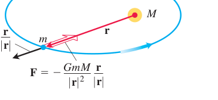
  
图 13.33 引力沿两个质心连线方向作用。

 

$$
\mathbf r\times\mathbf a=\mathbf 0.
$$

注意

$$
\frac{d}{dt}(\mathbf r\times\mathbf v) =
\mathbf v\times\mathbf v+\mathbf r\times\mathbf a =
\mathbf 0.
$$

因此

$$
\mathbf r\times\mathbf v=\mathbf h
$$

是常向量。

  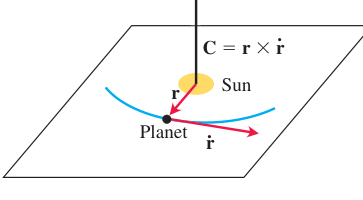
  
图 13.34 满足牛顿引力和运动定律的行星，在垂直于 $\mathbf C=\mathbf r\times\dot{\mathbf r}$ 的固定平面内运动。

 

在极坐标中，

$$
\mathbf r=r\mathbf u_r,
\qquad
\mathbf v=\dot r\,\mathbf u_r+r\dot\theta\,\mathbf u_\theta.
$$

所以

$$
\mathbf r\times\mathbf v =
r\mathbf u_r\times
\bigl(\dot r\,\mathbf u_r+r\dot\theta\,\mathbf u_\theta\bigr) =
r^2\dot\theta\,(\mathbf u_r\times\mathbf u_\theta).
$$

其大小为

$$
|\mathbf r\times\mathbf v|=r^2\dot\theta.
$$

极坐标中的面积微元为

  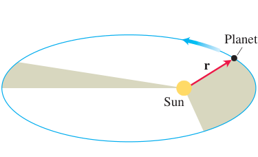
  
图 13.35 行星与太阳的连线在相等时间内扫过相等面积。

 

$$
dA=\frac12r^2\,d\theta.
$$

因此面积扫过速率为

$$
\frac{dA}{dt} =
\frac12r^2\frac{d\theta}{dt} =
\frac12r^2\dot\theta.
$$

由于 $r^2\dot\theta$ 为常数，所以

$$
\frac{dA}{dt}
$$

也是常数。这就是开普勒第二定律的数学表达：在中心力作用下，质点的径向向量在相等时间内扫过相等面积。

若轨道是椭圆，则长轴长度满足 $2a=r_0+r_{\max}$。

  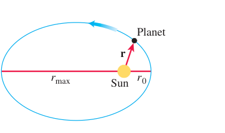
  
图 13.36 椭圆长轴的长度为 $2a=r_0+r_{\max}$。

 
