<!--
来源：Thomas' Calculus，Chapter 15: Multiple Integrals，PDF 页 896-957（印刷页 882-943）。
整理规范：遵循《PDF转Markdown校对要求.md》；正文逐段翻译；公式改写为 KaTeX 兼容 LaTeX。
说明：本文件整理第 15 章正文 15.1-15.8，不收录各节练习、章末复习题、附加练习与技术应用项目。
-->

# 第15章 多重积分

概述 本章把平面区域上二元函数 $f(x,y)$ 的二重积分定义为逼近黎曼和的极限。正如一重积分表示有向面积一样，二重积分表示有向体积。二重积分可以利用第 5.4 节研究的微积分基本定理来计算，不过现在要分别对两个变量积分，因此需要计算两次。二重积分可用于求平面区域的面积以及二维薄片的质量和形心。我们还定义三维区域上的三元积分；三元积分可用于计算三维物体的体积、质量、质心、转动惯量以及其他物理量。正如对单变量函数积分时变量代换往往很有帮助一样，在多重积分中变换坐标系也很有用。我们将特别关注极坐标、柱坐标和球坐标。在这些坐标系中，积分的计算常常会大为简化。

## 15.1 矩形上的二重积分与累次积分

第 5 章把区间 $[a,b]$ 上连续函数 $f(x)$ 的定积分定义为黎曼和的极限。本节把这一思想推广到平面内有界矩形 $R$ 上二元连续函数 $f(x,y)$ 的二重积分。单变量函数 $f(x)$ 的积分所用的黎曼和，是把有限区间分割成许多小区间，将每个小区间的宽度乘以 $f$ 在该小区间内某点 $c_k$ 处的值，再把所有乘积相加得到的。我们采用类似的分割、相乘与求和过程，把二重积分构造为逼近黎曼和的极限。

### 二重积分

我们从最简单的平面区域——矩形——开始研究二重积分。设函数 $f(x,y)$ 定义在矩形区域

$$
R:\qquad a\le x\le b,\qquad c\le y\le d
$$

上。用一组平行于 $x$ 轴和 $y$ 轴的直线把 $R$ 分成许多小矩形（图 15.1）。这些直线把 $R$ 分成 $n$ 个矩形小块；当每一小块的宽和高变小时，小块的数目 $n$ 就会增大。这些小矩形构成 $R$ 的一个分割。

  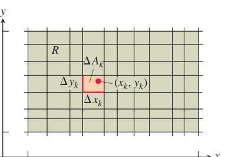
  
图 15.1 用矩形网格把区域 $R$ 分割成面积为 $\Delta A_k=\Delta x_k\Delta y_k$ 的小矩形。

宽为 $\Delta x$、高为 $\Delta y$ 的小矩形面积是 $\Delta A=\Delta x\Delta y$。若按某种次序给分割 $R$ 的小矩形编号，则它们的面积记为 $\Delta A_1,\Delta A_2,\ldots,\Delta A_n$，其中 $\Delta A_k$ 是第 $k$ 个小矩形的面积。

为了在 $R$ 上构造黎曼和，我们在第 $k$ 个小矩形中选取一点 $(x_k,y_k)$，把 $f$ 在该点的值乘以面积 $\Delta A_k$，再将所有乘积相加：

$$
S_n=\sum_{k=1}^{n}f(x_k,y_k)\Delta A_k.
$$

根据第 $k$ 个小矩形中 $(x_k,y_k)$ 的选取方式不同，$S_n$ 可能取不同的值。

我们关心的是：当分割中所有小矩形的宽和高都趋于零时，这些黎曼和会怎样变化。分割 $P$ 的范数记作 $\lVert P\rVert$，它是分割中任一小矩形的最大宽度或最大高度。如果 $\lVert P\rVert=0.1$，那么分割 $R$ 的每个小矩形的宽和高都不超过 $0.1$。当 $P$ 的范数趋于零（记作 $\lVert P\rVert\to0$）时，黎曼和有时会收敛。所得极限写作

$$
\lim_{\lVert P\rVert\to0}\sum_{k=1}^{n}f(x_k,y_k)\Delta A_k.
$$

当 $\lVert P\rVert\to0$、各小矩形变得又窄又矮时，它们的数目 $n$ 增加，所以也可以把这个极限写成

$$
\lim_{n\to\infty}\sum_{k=1}^{n}f(x_k,y_k)\Delta A_k,
$$

这里约定当 $n\to\infty$ 时，$\lVert P\rVert\to0$，因而 $\Delta A_k\to0$。

这种极限涉及许多选择。小矩形的集合由竖直和水平网格线决定，这些网格线确定了 $R$ 的一个矩形分割。在所得的每个小矩形中，还要任意选择一个点 $(x_k,y_k)$ 来计算 $f$ 的值。这些选择共同确定一个黎曼和。为了形成极限，我们一次又一次地重复整个过程，所选分割中的矩形宽和高都趋于零，而矩形数目趋于无穷。

如果无论怎样作出这些选择，和 $S_n$ 都存在并趋于同一个极限值，就称函数 $f$ 可积，并把这个极限称为 $f$ 在 $R$ 上的二重积分，记作

$$
\iint_R f(x,y)\,dA
\qquad\text{或}\qquad
\iint_R f(x,y)\,dx\,dy.
$$

可以证明，如果 $f(x,y)$ 在 $R$ 上处处连续，那么 $f$ 可积，这与第 5 章讨论的单变量情形相同。许多不连续函数也是可积的，包括只在有限个点或有限条光滑曲线上不连续的函数。这些结论的证明留给更高阶的教材。

### 作为体积的二重积分

当 $f(x,y)$ 在 $xy$ 平面的矩形区域 $R$ 上为正时，可以把 $f$ 在 $R$ 上的二重积分解释为一个三维立体的体积：该立体位于 $xy$ 平面上方，下方以 $R$ 为界，上方以曲面 $z=f(x,y)$ 为界（图 15.2）。和

$$
S_n=\sum f(x_k,y_k)\Delta A_k
$$

中的每一项 $f(x_k,y_k)\Delta A_k$，都是一个竖直矩形柱的体积，用来逼近立体中底面 $\Delta A_k$ 正上方那一部分的体积。因此，$S_n$ 逼近我们要定义的整个立体体积。我们把这个体积定义为

$$
\text{体积}=\lim_{n\to\infty}S_n
=\iint_R f(x,y)\,dA,
$$

其中当 $n\to\infty$ 时 $\Delta A_k\to0$。

  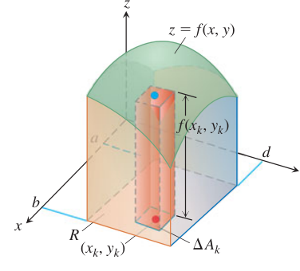
  
图 15.2 用矩形柱逼近立体，使我们可以把更一般立体的体积定义为二重积分。图中立体的体积就是 $f(x,y)$ 在底面区域 $R$ 上的二重积分。

正如所预期的，这种更一般的体积计算方法与第 6 章的方法给出相同结果，不过这里不作证明。图 15.3 表明，随着矩形柱数目 $n$ 增加，黎曼和对体积的逼近越来越精确。

  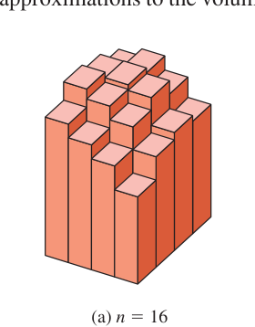
  
图 15.3 随着 $n$ 增加，黎曼和近似趋近于图 15.2 所示立体的总体积：（a）$n=16$；（b）$n=64$；（c）$n=256$。

### 用 Fubini 定理计算二重积分

假设要计算平面 $z=4-x-y$ 下方、$xy$ 平面中矩形区域

$$
R:\qquad 0\le x\le2,\qquad 0\le y\le1
$$

上方的体积。若采用第 6.1 节的切片法，用垂直于 $x$ 轴的平面切割（图 15.4），体积为

$$
\int_{x=0}^{x=2}A(x)\,dx, \tag{1}
$$

  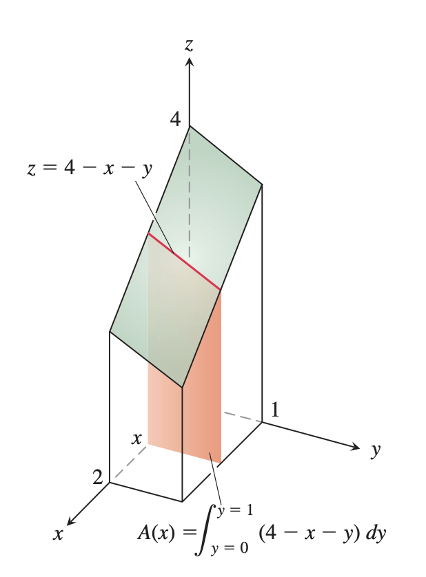
  
图 15.4 为得到截面积 $A(x)$，固定 $x$，关于 $y$ 积分。

其中 $A(x)$ 是位置 $x$ 处的截面积。对每一个 $x$，可以用积分

$$
A(x)=\int_{y=0}^{y=1}(4-x-y)\,dy \tag{2}
$$

计算 $A(x)$；这个积分是在位置 $x$ 的截面平面内，曲线 $z=4-x-y$ 下方的面积。计算 $A(x)$ 时，$x$ 保持不变，对 $y$ 积分。结合式 (1) 和式 (2)，整个立体的体积为

$$
\begin{aligned}
\text{体积}
&=\int_0^2 A(x)\,dx
=\int_0^2\left(\int_0^1(4-x-y)\,dy\right)dx\\
&=\int_0^2\left[4y-xy-\frac{y^2}{2}\right]_{y=0}^{y=1}dx
=\int_0^2\left(\frac72-x\right)dx\\
&=\left[\frac72x-\frac{x^2}{2}\right]_0^2=5.
\end{aligned}
$$

如果只想写出体积公式而不实际计算积分，可以写成

$$
\text{体积}=\int_0^2\int_0^1(4-x-y)\,dy\,dx. \tag{3}
$$

右端的式子称为累次积分或重复积分。它表示：先把 $x$ 保持不变，对 $4-x-y$ 关于 $y$ 从 $y=0$ 到 $y=1$ 积分，再把所得表达式关于 $x$ 从 $x=0$ 到 $x=2$ 积分。积分限 $0$ 和 $1$ 与 $y$ 有关，所以写在最靠近 $dy$ 的积分号上；另外两个积分限 $0$ 和 $2$ 与变量 $x$ 有关，所以写在与 $dx$ 配对的外层积分号上。

如果改用垂直于 $y$ 轴的平面切割来计算体积（图 15.5），会发生什么？作为 $y$ 的函数，典型截面积是

$$
\begin{aligned}
A(y)
&=\int_{x=0}^{x=2}(4-x-y)\,dx\\
&=\left[4x-\frac{x^2}{2}-xy\right]_{x=0}^{x=2}
=6-2y. \tag{4}
\end{aligned}
$$

  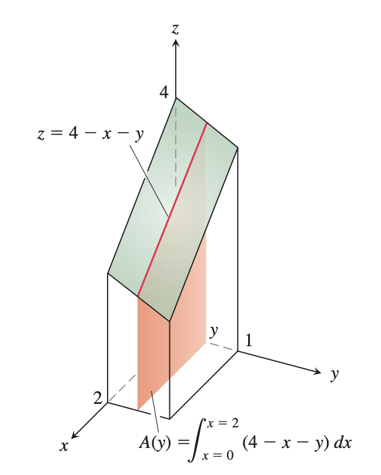
  
图 15.5 为得到截面积 $A(y)$，固定 $y$，关于 $x$ 积分。

因此整个立体的体积为

$$
\text{体积}=\int_{y=0}^{y=1}A(y)\,dy
=\int_0^1(6-2y)\,dy
=\left[6y-y^2\right]_0^1=5,
$$

与前面的计算一致。

同样，也可以把体积写成累次积分

$$
\text{体积}=\int_0^1\int_0^2(4-x-y)\,dx\,dy.
$$

右端表示：先像式 (4) 那样对 $4-x-y$ 关于 $x$ 从 $x=0$ 到 $x=2$ 积分，再把结果关于 $y$ 从 $y=0$ 到 $y=1$ 积分。在这个累次积分中，积分次序是先 $x$ 后 $y$，与式 (3) 的次序相反。

这两个用累次积分完成的体积计算，与矩形 $R:0\le x\le2,0\le y\le1$ 上的二重积分

$$
\iint_R(4-x-y)\,dA
$$

有什么关系？答案是：两个累次积分都给出了这个二重积分的值。这是合理的，因为二重积分和两个累次积分度量的是同一个立体的体积。Guido Fubini 于 1907 年发表的一个定理指出，矩形上任意连续函数的二重积分，都可以按任一积分次序计算成累次积分。（Fubini 在更一般的条件下证明了该定理；下面是适用于这里的形式。）

  

    
定理 1——Fubini 定理（第一种形式）

    
如果 $f(x,y)$ 在矩形区域 $R:a\le x\le b,c\le y\le d$ 上处处连续，那么

    

      $$
      \iint_R f(x,y)\,dA
      =\int_c^d\int_a^b f(x,y)\,dx\,dy
      =\int_a^b\int_c^d f(x,y)\,dy\,dx.
      $$
    

  

Fubini 定理说明，矩形上的二重积分可以作为累次积分来计算。因此，我们可以一次对一个变量积分，利用微积分基本定理求出二重积分。

Fubini 定理还说明可以采用任一积分次序来计算二重积分，这带来了真正的便利。用切片法计算体积时，既可以使用垂直于 $x$ 轴的平面，也可以使用垂直于 $y$ 轴的平面。

**例 1** 对下列函数和区域计算 $\iint_R f(x,y)\,dA$：

$$
f(x,y)=100-6x^2y,
\qquad
R:\quad 0\le x\le2,\quad -1\le y\le1.
$$

  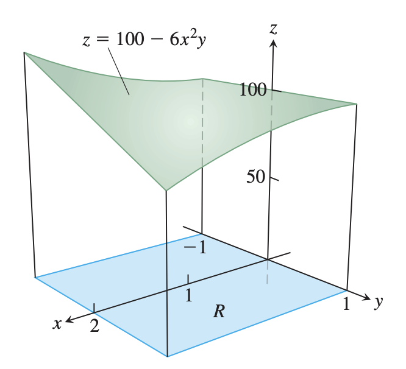
  
图 15.6 二重积分 $\iint_R f(x,y)\,dA$ 给出该曲面下方、矩形区域 $R$ 上方的体积（例 1）。

**解：** 图 15.6 展示了曲面下方的立体。由 Fubini 定理，

$$
\begin{aligned}
\iint_R f(x,y)\,dA
&=\int_{-1}^{1}\int_0^2(100-6x^2y)\,dx\,dy\\
&=\int_{-1}^{1}\left[100x-2x^3y\right]_{x=0}^{x=2}dy\\
&=\int_{-1}^{1}(200-16y)\,dy\\
&=\left[200y-8y^2\right]_{-1}^{1}=400.
\end{aligned}
$$

颠倒积分次序得到相同答案：

$$
\begin{aligned}
\int_0^2\int_{-1}^{1}(100-6x^2y)\,dy\,dx
&=\int_0^2\left[100y-3x^2y^2\right]_{y=-1}^{y=1}dx\\
&=\int_0^2\bigl[(100-3x^2)-(-100-3x^2)\bigr]dx\\
&=\int_0^2 200\,dx=400.
\end{aligned}
$$

**例 2** 求由椭圆抛物面 $z=10+x^2+3y^2$ 从上方、矩形

$$
R:\qquad 0\le x\le1,\qquad 0\le y\le2
$$

从下方所围区域的体积。

  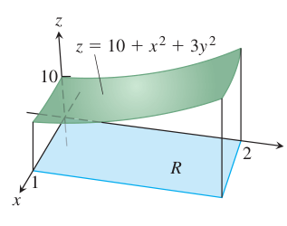
  
图 15.7 二重积分 $\iint_R f(x,y)\,dA$ 给出该曲面下方、矩形区域 $R$ 上方的体积（例 2）。

**解：** 曲面和立体如图 15.7 所示。体积由二重积分给出：

$$
\begin{aligned}
V
&=\iint_R(10+x^2+3y^2)\,dA\\
&=\int_0^1\int_0^2(10+x^2+3y^2)\,dy\,dx\\
&=\int_0^1\left[10y+x^2y+y^3\right]_{y=0}^{y=2}dx\\
&=\int_0^1(20+2x^2+8)\,dx\\
&=\left[20x+\frac23x^3+8x\right]_0^1
=\frac{86}{3}.
\end{aligned}
$$

## 15.2 一般区域上的二重积分

本节定义并计算平面中比矩形更一般的有界区域上的二重积分。这些二重积分仍作为累次积分计算，实际操作中的主要问题是确定积分限。由于积分区域的边界不一定是平行于坐标轴的线段，积分限往往包含变量，而不只是常数。

### 有界非矩形区域上的二重积分

为了定义函数 $f(x,y)$ 在图 15.8 所示有界非矩形区域 $R$ 上的二重积分，我们仍先用小矩形网格覆盖 $R$，使这些小矩形的并集包含 $R$ 的所有点。但由于 $R$ 的边界是曲线，不可能用有限个完全位于 $R$ 内的矩形恰好填满 $R$，网格中的一些小矩形会有一部分位于 $R$ 外。构造 $R$ 的一个分割时，只取完全位于 $R$ 内的矩形，不使用部分或全部位于 $R$ 外的矩形。对于通常遇到的区域，当分割的范数（所用矩形的最大宽或高）趋于零时，被包含在分割中的 $R$ 的部分会越来越多。

  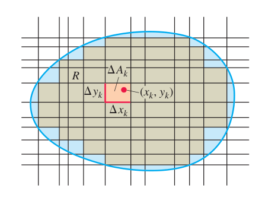
  
图 15.8 用矩形网格把一个有界非矩形区域分割成矩形小块。

得到 $R$ 的一个分割后，按某种次序把矩形编号为 $1$ 到 $n$，并令 $\Delta A_k$ 表示第 $k$ 个矩形的面积。再在第 $k$ 个矩形中选一点 $(x_k,y_k)$，构造黎曼和

$$
S_n=\sum_{k=1}^{n}f(x_k,y_k)\Delta A_k.
$$

当形成 $S_n$ 的分割范数趋于零，即 $\lVert P\rVert\to0$ 时，每个内接矩形的宽和高趋于零，矩形数目趋于无穷。如果 $f(x,y)$ 连续，那么这些黎曼和收敛到一个与所有选择无关的极限。这个极限称为 $f(x,y)$ 在 $R$ 上的二重积分：

$$
\lim_{\lVert P\rVert\to0}\sum_{k=1}^{n}f(x_k,y_k)\Delta A_k
=\iint_R f(x,y)\,dA.
$$

$R$ 的边界性质会带来区间上积分所没有的问题。当 $R$ 具有曲线边界时，一个分割中的 $n$ 个矩形位于 $R$ 内部，却不能覆盖整个 $R$。要使分割很好地逼近 $R$，当分割范数趋于零时，那些只能由部分位于 $R$ 外的小矩形覆盖的区域必须变得可以忽略。本书遇到的所有区域都满足这种“能被小范数分割几乎填满”的性质。由多边形、圆、椭圆以及区间上连续函数的图像首尾相接所组成的边界都没有问题。“分形”形状的曲线可能造成困难，但在多数应用中很少出现。关于哪些区域可以用于计算二重积分的严格讨论，留给更高阶的教材。

### 体积

如果 $f(x,y)$ 在 $R$ 上为正且连续，就像前面一样，把 $R$ 与曲面 $z=f(x,y)$ 之间立体的体积定义为 $\iint_R f(x,y)\,dA$（图 15.9）。

  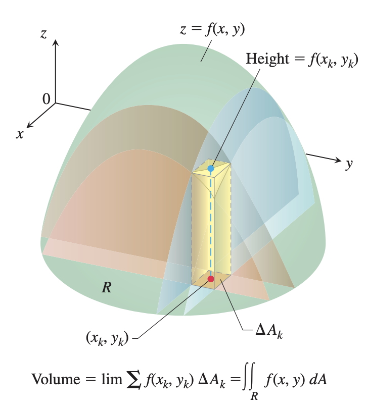
  
图 15.9 把逼近矩形柱体积之和的极限定义为具有曲线底面的立体体积。

若 $R$ 是图 15.10 所示区域，上、下边界分别为曲线 $y=g_2(x)$ 和 $y=g_1(x)$，两侧边界为直线 $x=a$ 和 $x=b$，就可以再次用切片法计算体积。先求截面积

$$
A(x)=\int_{g_1(x)}^{g_2(x)}f(x,y)\,dy,
$$

再把 $A(x)$ 从 $x=a$ 到 $x=b$ 积分，得到累次积分

$$
V=\int_a^b A(x)\,dx
=\int_a^b\int_{g_1(x)}^{g_2(x)}f(x,y)\,dy\,dx. \tag{1}
$$

  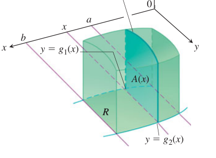
  
图 15.10 图中竖直切片的面积为 $A(x)$。把该面积从 $x=a$ 到 $x=b$ 积分即可求出立体体积。

类似地，如果 $R$ 是图 15.11 所示区域，边界为曲线 $x=h_2(y)$、$x=h_1(y)$ 和直线 $y=c$、$y=d$，那么切片法给出的体积是

$$
\text{体积}=\int_c^d\int_{h_1(y)}^{h_2(y)}f(x,y)\,dx\,dy. \tag{2}
$$

  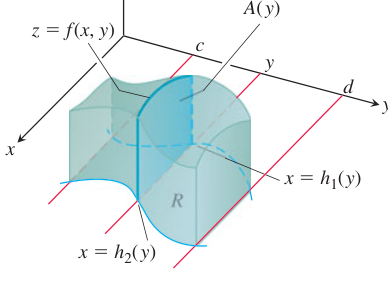
  
图 15.11 图中立体的体积为 $\int_c^dA(y)\,dy=\int_c^d\int_{h_1(y)}^{h_2(y)}f(x,y)\,dx\,dy$。对同一个立体，定理 2 说明既可采用图 15.10 的方法，也可采用这里的方法，两种计算结果相同。

式 (1) 和式 (2) 中的累次积分都给出前面定义的 $f$ 在 $R$ 上的二重积分，这是下面更强形式的 Fubini 定理的推论。

  

    
定理 2——Fubini 定理（较强形式）

    
设 $f(x,y)$ 在区域 $R$ 上连续。

    
1. 如果 $R$ 由 $a\le x\le b$、$g_1(x)\le y\le g_2(x)$ 定义，且 $g_1,g_2$ 在 $[a,b]$ 上连续，那么
      $$
      \iint_R f(x,y)\,dA
      =\int_a^b\int_{g_1(x)}^{g_2(x)}f(x,y)\,dy\,dx.
      $$
    

    
2. 如果 $R$ 由 $c\le y\le d$、$h_1(y)\le x\le h_2(y)$ 定义，且 $h_1,h_2$ 在 $[c,d]$ 上连续，那么
      $$
      \iint_R f(x,y)\,dA
      =\int_c^d\int_{h_1(y)}^{h_2(y)}f(x,y)\,dx\,dy.
      $$
    

  

**例 1** 一个棱柱的底面是 $xy$ 平面中由 $x$ 轴、直线 $y=x$ 和 $x=1$ 围成的三角形，顶面位于平面 $z=f(x,y)=3-x-y$ 内，求该棱柱的体积。

**解：** 见图 15.12。对 $0$ 到 $1$ 之间的任意 $x$，$y$ 从 $0$ 变到 $x$（图 15.12b），因此

$$
\begin{aligned}
V
&=\int_0^1\int_0^x(3-x-y)\,dy\,dx\\
&=\int_0^1\left[3y-xy-\frac{y^2}{2}\right]_{y=0}^{y=x}dx\\
&=\int_0^1\left(3x-\frac{3x^2}{2}\right)dx
=\left[\frac{3x^2}{2}-\frac{x^3}{2}\right]_0^1=1.
\end{aligned}
$$

颠倒积分次序（图 15.12c），体积积分为

$$
\begin{aligned}
V
&=\int_0^1\int_y^1(3-x-y)\,dx\,dy\\
&=\int_0^1\left[3x-\frac{x^2}{2}-xy\right]_{x=y}^{x=1}dy\\
&=\int_0^1\left(\frac52-4y+\frac32y^2\right)dy\\
&=\left[\frac52y-2y^2+\frac{y^3}{2}\right]_0^1=1.
\end{aligned}
$$

两个积分相等，正如它们应当满足的那样。

  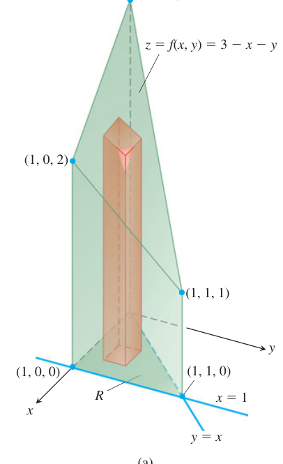
  
图 15.12 （a）底面为 $xy$ 平面中三角形的棱柱，其体积定义为 $R$ 上的二重积分。（b）先关于 $y$、再关于 $x$ 积分的积分限。（c）先关于 $x$、再关于 $y$ 积分的积分限（例 1）。

Fubini 定理保证二重积分可以按任一积分次序计算，但其中一种次序可能比另一种容易。下面的例子说明了这种情况。

**例 2** 设 $R$ 是 $xy$ 平面中由 $x$ 轴、直线 $y=x$ 和直线 $x=1$ 围成的三角形，计算

$$
\iint_R\frac{\sin x}{x}\,dA.
$$

**解：** 积分区域如图 15.13 所示。如果先关于 $y$、再关于 $x$ 积分，则

$$
\begin{aligned}
\int_0^1\left(\int_0^x\frac{\sin x}{x}\,dy\right)dx
&=\int_0^1\left[\frac{y\sin x}{x}\right]_{y=0}^{y=x}dx\\
&=\int_0^1\sin x\,dx
=1-\cos1\approx0.46.
\end{aligned}
$$

如果颠倒积分次序并尝试计算

$$
\int_0^1\int_y^1\frac{\sin x}{x}\,dx\,dy,
$$

就会遇到困难，因为 $\int(\sin x)/x\,dx$ 不能用初等函数表示（没有简单的原函数）。

在这种情况下，没有一般法则能预先判断哪一种积分次序更好。如果最先选择的次序行不通，就尝试另一种。有时两种次序都行不通，这时就需要采用数值近似。

  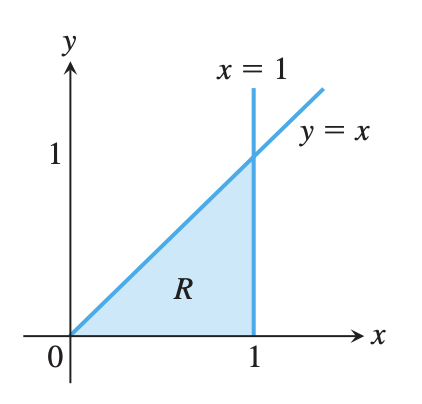
  
图 15.13 例 2 的积分区域。

### 确定积分限

下面给出一种适用于许多平面区域的积分限确定方法。对于更复杂、不能直接使用该方法的区域，通常可以把它分成若干个适用该方法的部分。

#### 使用竖直截线

要把 $\iint_R f(x,y)\,dA$ 写成先关于 $y$、再关于 $x$ 的累次积分，可按以下三步进行：

1. **作图。** 画出积分区域并标出边界曲线（图 15.14a）。
2. **确定 $y$ 的积分限。** 想象一条竖直直线 $L$ 沿 $y$ 增大的方向穿过 $R$，标出 $L$ 进入和离开 $R$ 时的 $y$ 值。这些就是 $y$ 的积分限，通常是 $x$ 的函数而不是常数（图 15.14b）。
3. **确定 $x$ 的积分限。** 选择能包含穿过 $R$ 的所有竖直直线的 $x$ 范围。图示积分为

$$
\iint_R f(x,y)\,dA
=\int_0^1\int_{1-x}^{\sqrt{1-x^2}}f(x,y)\,dy\,dx.
$$

  

    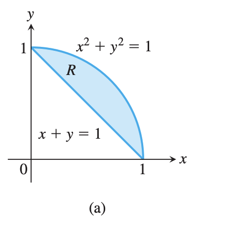
    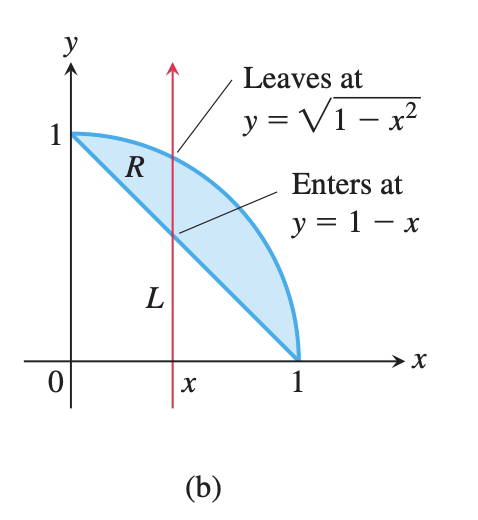
    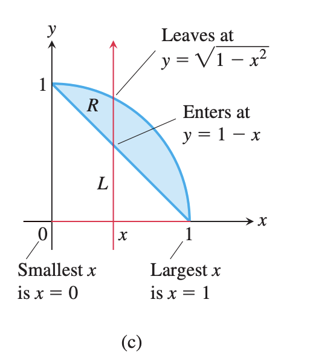
  

  
图 15.14 先关于 $y$、再关于 $x$ 积分时确定积分限。

#### 使用水平截线

要按相反次序把同一二重积分写成累次积分，就在第 2、3 步中使用水平直线而不是竖直直线（见图 15.15）。所得积分为

$$
\iint_R f(x,y)\,dA
=\int_0^1\int_{1-y}^{\sqrt{1-y^2}}f(x,y)\,dx\,dy.
$$

  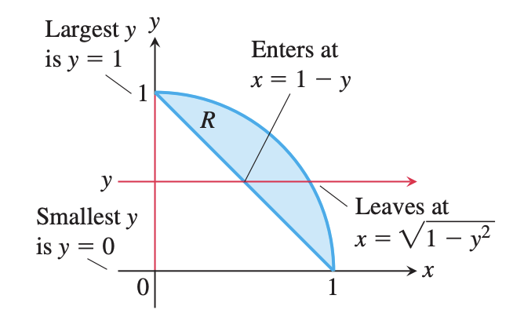
  
图 15.15 先关于 $x$、再关于 $y$ 积分时确定积分限。

**例 3** 画出积分

$$
\int_0^2\int_{x^2}^{2x}(4x+2)\,dy\,dx
$$

的积分区域，并写出颠倒积分次序后的等价积分。

**解：** 积分区域由不等式 $x^2\le y\le2x$ 和 $0\le x\le2$ 给出。因此，它是 $x=0$ 与 $x=2$ 之间由曲线 $y=x^2$ 和 $y=2x$ 围成的区域（图 15.16a）。

为了确定反向积分的积分限，想象一条水平直线从左向右穿过该区域。它在 $x=y/2$ 处进入，在 $x=\sqrt y$ 处离开。为了包含所有这样的水平直线，令 $y$ 从 $0$ 变到 $4$（图 15.16b）。所得积分是

$$
\int_0^4\int_{y/2}^{\sqrt y}(4x+2)\,dx\,dy.
$$

这两个积分的共同值为 $8$。

  

    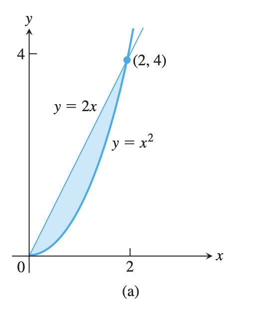
    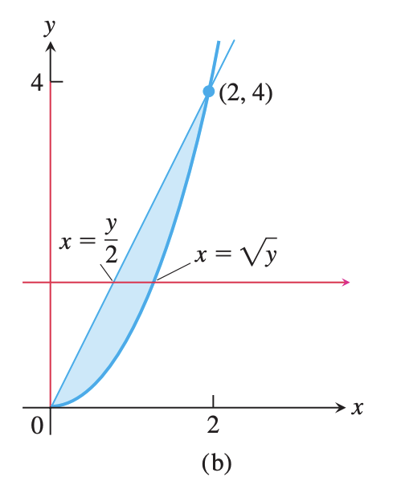
  

  
图 15.16 例 3 的积分区域。

### 二重积分的性质

与一重积分一样，连续函数的二重积分具有在计算和应用中很有用的代数性质。若 $f(x,y)$ 和 $g(x,y)$ 在有界区域 $R$ 上连续，则有：

1. **常数倍性质**

   $$
   \iint_R cf(x,y)\,dA=c\iint_R f(x,y)\,dA
   \qquad（c\text{ 为任意常数}）.
   $$

2. **和差性质**

   $$
   \iint_R\bigl(f(x,y)\pm g(x,y)\bigr)\,dA
   =\iint_Rf(x,y)\,dA\pm\iint_Rg(x,y)\,dA.
   $$

3. **控制性质**

   $$
   \begin{aligned}
   &\iint_R f(x,y)\,dA\ge0
   &&\text{如果 }f(x,y)\ge0\text{ 于 }R,\\
   &\iint_R f(x,y)\,dA\ge\iint_R g(x,y)\,dA
   &&\text{如果 }f(x,y)\ge g(x,y)\text{ 于 }R.
   \end{aligned}
   $$

4. **可加性**

   $$
   \iint_R f(x,y)\,dA
   =\iint_{R_1}f(x,y)\,dA+\iint_{R_2}f(x,y)\,dA,
   $$

   如果 $R$ 是两个不重叠区域 $R_1$ 和 $R_2$ 的并。

性质 4 假定积分区域 $R$ 被分解为不重叠区域 $R_1$ 和 $R_2$，它们的边界由有限条线段或光滑曲线组成。图 15.17 给出了一个例子。

  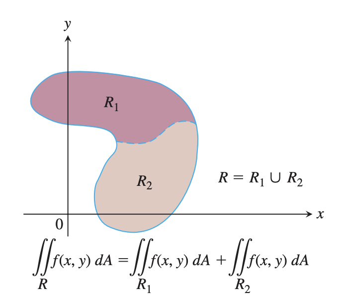
  
图 15.17 矩形区域的可加性对由光滑曲线围成的区域同样成立。

这些性质背后的思想是积分的行为与和相同。如果把函数 $f(x,y)$ 替换为它的常数倍 $cf(x,y)$，那么 $f$ 的黎曼和

$$
S_n=\sum_{k=1}^{n}f(x_k,y_k)\Delta A_k
$$

就被 $cf$ 的黎曼和

$$
\sum_{k=1}^{n}cf(x_k,y_k)\Delta A_k
=c\sum_{k=1}^{n}f(x_k,y_k)\Delta A_k=cS_n
$$

取代。令 $n\to\infty$，可知 $c\lim_{n\to\infty}S_n=c\iint_Rf\,dA$ 与 $\lim_{n\to\infty}cS_n=\iint_Rcf\,dA$ 相等，因此常数倍性质从和延续到了二重积分。

其他性质也很容易先对黎曼和验证，并由同样的理由延续到二重积分。以上讨论说明了基本思想；要真正证明这些性质，还需要更仔细地分析黎曼和的收敛方式。

**例 4** 求位于曲面 $z=16-x^2-y^2$ 下方、区域 $R$ 上方的楔形立体体积，其中 $R$ 由曲线 $y=2\sqrt x$、直线 $y=4x-2$ 和 $x$ 轴围成。

**解：** 图 15.18a 展示了曲面和所求“楔形”立体，图 15.18b 展示了 $xy$ 平面中的积分区域。如果按 $dy\,dx$ 的次序积分，就需要两个积分：当 $0\le x\le0.5$ 时，$y$ 从 $0$ 变到 $2\sqrt x$；当 $0.5\le x\le1$ 时，$y$ 从 $4x-2$ 变到 $2\sqrt x$。因此选择按 $dx\,dy$ 的次序积分，只需一个二重积分，其积分限如图 15.18b 所示。体积为

$$
\begin{aligned}
\iint_R(16-x^2-y^2)\,dA
&=\int_0^2\int_{y^2/4}^{(y+2)/4}(16-x^2-y^2)\,dx\,dy\\
&=\int_0^2\left[16x-\frac{x^3}{3}-xy^2\right]_{x=y^2/4}^{x=(y+2)/4}dy\\
&=\left[\frac{191y}{24}+\frac{63y^2}{32}-\frac{145y^3}{96}
-\frac{49y^4}{768}+\frac{y^5}{20}+\frac{y^7}{1344}\right]_0^2\\
&=\frac{20803}{1680}\approx12.4.
\end{aligned}
$$

  

    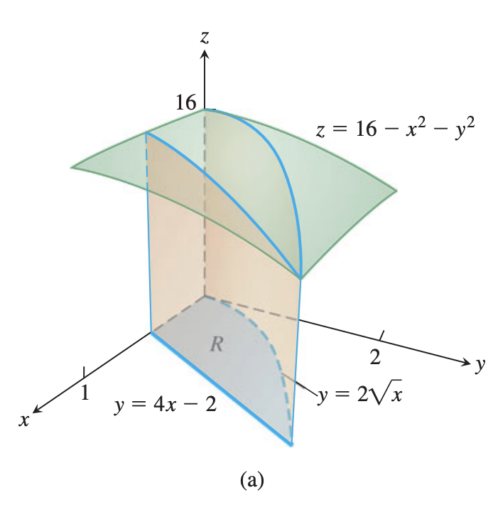
    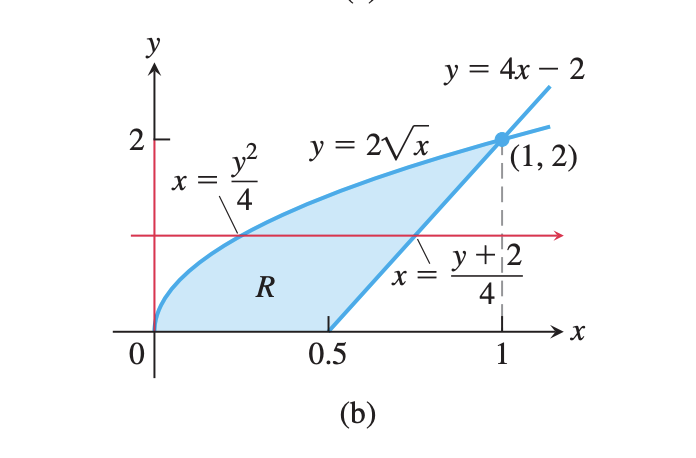
  

  
图 15.18 （a）例 4 所求体积对应的“楔形”立体。（b）积分区域 $R$ 以及 $dx\,dy$ 的积分次序。

以上讨论主要说明：当 $f$ 为正连续函数时，二重积分表示曲面 $z=f(x,y)$ 与底面区域 $R$ 之间立体的体积。与一重积分中的有向面积类似，如果 $f(x_k,y_k)<0$，那么黎曼和中的对应项 $f(x_k,y_k)\Delta A_k$ 也为负，表示该小块对有向体积作负贡献。因此，对定义在 $R$ 上的任意连续函数 $f$，二重积分表示曲面与区域 $R$ 之间的有向体积，而不一定是立体的总体积。二重积分还有其他解释；下一节将看到如何用它计算一般平面区域的面积。

## 15.3 用二重积分求面积

本节说明如何用二重积分计算平面内有界区域的面积，以及如何求二元函数的平均值。

### 平面内有界区域的面积

在上一节区域 $R$ 上二重积分的定义中令 $f(x,y)=1$，黎曼和就化为

$$
S_n=\sum_{k=1}^{n}f(x_k,y_k)\Delta A_k
=\sum_{k=1}^{n}\Delta A_k. \tag{1}
$$

这只是 $R$ 的分割中所有小矩形面积之和，它逼近我们要定义的 $R$ 的面积。当 $R$ 的分割范数趋于零时，分割中所有矩形的高和宽都趋于零，而对 $R$ 的覆盖越来越完整（图 15.8）。我们把 $R$ 的面积定义为极限

$$
\lim_{\lVert P\rVert\to0}\sum_{k=1}^{n}\Delta A_k
=\iint_R dA. \tag{2}
$$

与本章其他定义一样，这一定义适用于比以前单变量面积定义更广泛的区域；而在两种定义都适用的区域上，它们给出相同结果。为了计算面积定义中的积分，只需在 $R$ 上对常函数 $f(x,y)=1$ 积分。

  

    
定义

    
闭有界平面区域 $R$ 的面积为
      $$
      A=\iint_R dA.
      $$
    

  

**例 1** 求第一象限内由 $y=x$ 和 $y=x^2$ 围成的区域 $R$ 的面积。

**解：** 画出区域（图 15.19），注意两曲线交于原点和 $(1,1)$，于是

$$
\begin{aligned}
A
&=\int_0^1\int_{x^2}^{x}dy\,dx
=\int_0^1[y]_{x^2}^{x}dx\\
&=\int_0^1(x-x^2)\,dx
=\left[\frac{x^2}{2}-\frac{x^3}{3}\right]_0^1
=\frac16.
\end{aligned}
$$

注意，计算内层累次积分后得到的一重积分 $\int_0^1(x-x^2)\,dx$，正是用第 5.6 节的方法求两曲线之间面积的积分。

  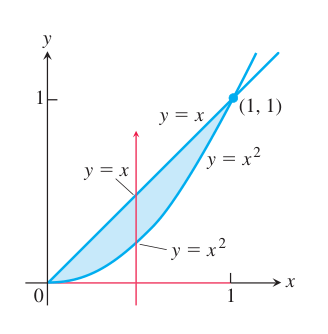
  
图 15.19 例 1 的区域。

**例 2** 求由抛物线 $y=x^2$ 和直线 $y=x+2$ 围成的区域 $R$ 的面积。

**解：** 如果把 $R$ 分成图 15.20a 所示的 $R_1$ 和 $R_2$，面积可写成

$$
A=\iint_{R_1}dA+\iint_{R_2}dA
=\int_0^1\int_{-\sqrt y}^{\sqrt y}dx\,dy
+\int_1^4\int_{y-2}^{\sqrt y}dx\,dy.
$$

另一方面，颠倒积分次序（图 15.20b）得到

$$
A=\int_{-1}^{2}\int_{x^2}^{x+2}dy\,dx.
$$

第二种表示只需一个积分，更为简单，实际计算时只会写出这一种。于是

$$
\begin{aligned}
A
&=\int_{-1}^{2}[y]_{x^2}^{x+2}dx
=\int_{-1}^{2}(x+2-x^2)\,dx\\
&=\left[\frac{x^2}{2}+2x-\frac{x^3}{3}\right]_{-1}^{2}
=\frac92.
\end{aligned}
$$

  

    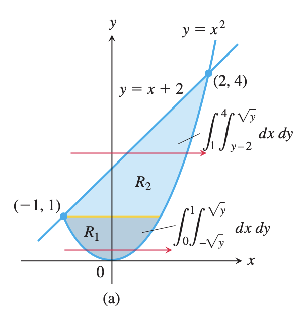
    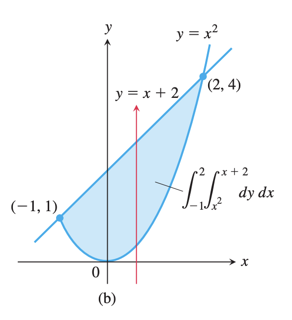
  

  
图 15.20 计算该面积时，（a）若先关于 $x$ 积分，需要两个二重积分；（b）若先关于 $y$ 积分，只需一个二重积分（例 2）。

**例 3** 用以下两种方法求区域

$$
R:\qquad -2\le x\le2,\qquad
-1-\sqrt{4-x^2}\le y\le1+\sqrt{4-x^2}
$$

所描述运动场的面积：（a）Fubini 定理；（b）简单几何。

**解：** 区域 $R$ 如图 15.21 所示。

（a）由图中的对称性可知，$R$ 的面积是其第一象限部分面积的 4 倍。利用 Fubini 定理，

$$
\begin{aligned}
A
&=\iint_RdA
=4\int_0^2\int_0^{1+\sqrt{4-x^2}}dy\,dx\\
&=4\int_0^2\left(1+\sqrt{4-x^2}\right)dx\\
&=4\left[x+\frac{x}{2}\sqrt{4-x^2}
+2\sin^{-1}\frac{x}{2}\right]_0^2\\
&=8+4\pi.
\end{aligned}
$$

为什么积分结果中会出现 $\sin^{-1}(x/2)$？

$\sin^{-1}$ 在这里表示反正弦函数 $\arcsin$，不是 $1/\sin$。对于其中的积分

$$
\int\sqrt{4-x^2}\,dx,
$$

令

$$
x=2\sin\theta,
\qquad dx=2\cos\theta\,d\theta.
$$

由于 $0\le x\le2$，可取 $0\le\theta\le\pi/2$，从而

$$
\sqrt{4-x^2}
=\sqrt{4-4\sin^2\theta}
=2\cos\theta.
$$

于是

$$
\begin{aligned}
\int\sqrt{4-x^2}\,dx
&=4\int\cos^2\theta\,d\theta\\
&=2\int(1+\cos2\theta)\,d\theta\\
&=2\theta+\sin2\theta+C.
\end{aligned}
$$

再由 $x=2\sin\theta$ 得

$$
\theta=\sin^{-1}\frac{x}{2},
$$

并且

$$
\sin2\theta
=2\sin\theta\cos\theta
=\frac{x}{2}\sqrt{4-x^2}.
$$

因此

$$
\int\sqrt{4-x^2}\,dx
=\frac{x}{2}\sqrt{4-x^2}
+2\sin^{-1}\frac{x}{2}+C.
$$

（b）区域 $R$ 由一个矩形和安装在矩形两侧的两个半径为 $2$ 的半圆组成。因此，把 $4\times2$ 矩形的面积与半径为 $2$ 的圆面积相加，得到

$$
A=8+\pi(2)^2=8+4\pi.
$$

  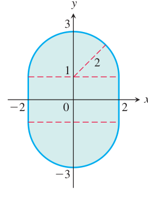
  
图 15.21 例 3 中区域 $R$ 所描述的运动场。

### 平均值

闭区间上可积单变量函数的平均值，是函数在该区间上的积分除以区间长度。对于定义在平面有界区域上的可积二元函数，平均值是区域上的积分除以区域面积。可以把函数想象成某一时刻水箱中晃动的水面高度，水箱竖直壁位于该区域边界的正上方。让水静止到恒定高度，就能看出水的平均高度。此高度等于水的体积除以 $R$ 的面积。因此，把可积函数 $f$ 在区域 $R$ 上的平均值定义为

$$
f\text{ 在 }R\text{ 上的平均值}
=\frac{1}{R\text{ 的面积}}\iint_R f\,dA. \tag{3}
$$

如果 $f$ 是覆盖 $R$ 的薄板温度，那么 $f$ 在 $R$ 上的二重积分除以 $R$ 的面积，就是薄板的平均温度。如果 $f(x,y)$ 是点 $(x,y)$ 到某个固定点 $P$ 的距离，那么 $f$ 在 $R$ 上的平均值就是 $R$ 中各点到 $P$ 的平均距离。

**例 4** 求函数 $f(x,y)=x\cos(xy)$ 在矩形

$$
R:\qquad 0\le x\le\pi,\qquad 0\le y\le1
$$

上的平均值。

**解：** $f$ 在 $R$ 上的积分为

$$
\begin{aligned}
\int_0^\pi\int_0^1x\cos(xy)\,dy\,dx
&=\int_0^\pi[\sin(xy)]_{y=0}^{y=1}dx\\
&=\int_0^\pi\sin x\,dx
=[-\cos x]_0^\pi=2.
\end{aligned}
$$

这里关于 $y$ 积分时，$\int x\cos(xy)\,dy=\sin(xy)+C$。区域 $R$ 的面积是 $\pi$，所以 $f$ 在 $R$ 上的平均值为

$$
\frac{2}{\pi}
$$

## 15.4 极坐标形式的二重积分

把二重积分变换到极坐标后，有时更容易计算。本节说明如何完成这种变换，以及如何计算边界由极坐标方程给出的区域上的二重积分。

### 极坐标中的积分

定义 $xy$ 平面区域 $R$ 上的二重积分时，我们把 $R$ 切分成边平行于坐标轴的矩形，因为这些矩形的边具有常数 $x$ 值或常数 $y$ 值。在极坐标中，自然的小块是由常数 $r$ 和常数 $\theta$ 的边围成的“极坐标矩形”。为避免描述积分区域时产生歧义，以下极坐标点 $(r,\theta)$ 均取 $r\ge0$。

设函数 $f(r,\theta)$ 定义在区域 $R$ 上，$R$ 由射线 $\theta=\alpha,\theta=\beta$ 和连续曲线 $r=g_1(\theta),r=g_2(\theta)$ 围成，并且对 $\alpha$ 与 $\beta$ 之间的每个 $\theta$，都有

$$
0\le g_1(\theta)\le g_2(\theta)\le a.
$$

那么 $R$ 位于扇形区域 $Q:0\le r\le a,\alpha\le\theta\le\beta$ 内，其中 $0\le\beta-\alpha\le2\pi$（图 15.22）。

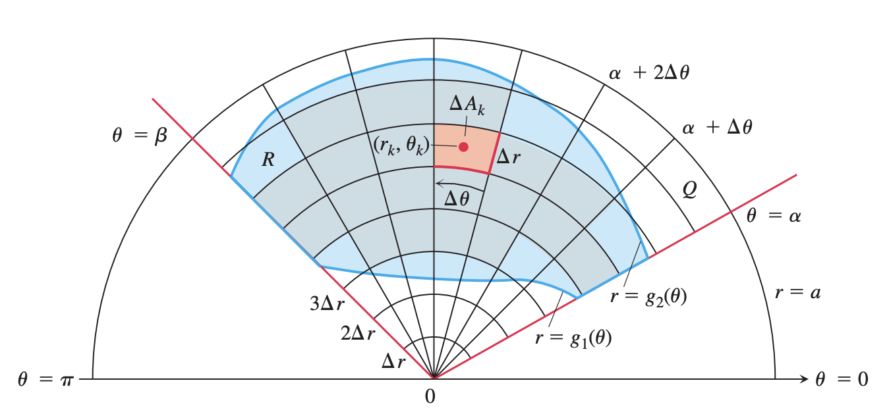
图 15.22 区域 $R:g_1(\theta)\le r\le g_2(\theta),\alpha\le\theta\le\beta$ 包含在扇形区域 $Q$ 中；圆弧和射线对 $Q$ 的分割诱导出 $R$ 的分割。

用圆心在原点、半径依次为 $\Delta r,2\Delta r,\ldots,m\Delta r$ 的圆弧和射线

$$
\theta=\alpha,\quad\theta=\alpha+\Delta\theta,\quad\ldots,
\quad\theta=\alpha+m'\Delta\theta=\beta
$$

覆盖 $Q$，其中 $\Delta r=a/m$、$\Delta\theta=(\beta-\alpha)/m'$。这些圆弧和射线把 $Q$ 分成称为“极坐标矩形”的小块。给位于 $R$ 内的极坐标矩形编号，面积记为 $\Delta A_k$，在其中任取一点 $(r_k,\theta_k)$，构造

$$
S_n=\sum_{k=1}^{n}f(r_k,\theta_k)\Delta A_k.
$$

若 $f$ 在 $R$ 上连续，当网格不断细化、$\Delta r$ 和 $\Delta\theta$ 趋于零时，该和趋于极限，定义为

$$
\lim_{n\to\infty}S_n=\iint_Rf(r,\theta)\,dA.
$$

为计算此极限，需要用 $\Delta r$ 和 $\Delta\theta$ 表示 $\Delta A_k$。取 $r_k$ 为第 $k$ 个极坐标矩形内外圆弧半径的平均值，则内半径为 $r_k-\Delta r/2$，外半径为 $r_k+\Delta r/2$（图 15.23）。半径 $r$、圆心角 $\theta$ 的扇形面积为 $A=\theta r^2/2$，所以

$$
\begin{aligned}
\Delta A_k
&=\frac{\Delta\theta}{2}
\left[\left(r_k+\frac{\Delta r}{2}\right)^2
-\left(r_k-\frac{\Delta r}{2}\right)^2\right]\\
&=r_k\Delta r\Delta\theta.
\end{aligned}
$$

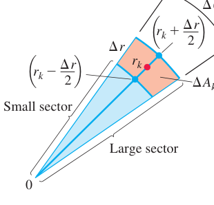
图 15.23 用大扇形面积减小扇形面积，得到 $\Delta A_k=r_k\Delta r\Delta\theta$。

因此

$$
S_n=\sum_{k=1}^{n}f(r_k,\theta_k)r_k\Delta r\Delta\theta,
$$

极限就是 $\iint_R f(r,\theta)r\,dr\,d\theta$。Fubini 定理的相应形式给出

$$
\iint_R f(r,\theta)\,dA
=\int_\alpha^\beta\int_{g_1(\theta)}^{g_2(\theta)}
f(r,\theta)r\,dr\,d\theta.
$$

### 确定积分限

直角坐标中的三步法同样适用于极坐标：

1. **作图。** 画出区域并标出边界曲线（图 15.24a）。
2. **确定 $r$ 的积分限。** 从原点沿 $r$ 增大的方向作射线 $L$ 穿过 $R$，标出射线进入和离开 $R$ 时的 $r$ 值；它们通常依赖于 $L$ 与正 $x$ 轴的夹角 $\theta$（图 15.24b）。
3. **确定 $\theta$ 的积分限。** 找出围住 $R$ 的最小和最大 $\theta$ 值（图 15.24c）。图示区域的积分为

$$
\iint_Rf(r,\theta)\,dA
=\int_{\pi/4}^{\pi/2}\int_{\sqrt2\csc\theta}^{2}
f(r,\theta)r\,dr\,d\theta.
$$

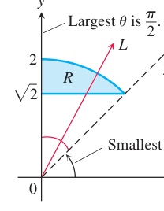
图 15.24 在极坐标中确定积分限。

**例 1** 求函数 $f(r,\theta)$ 在心形线 $r=1+\cos\theta$ 内、圆 $r=1$ 外的区域 $R$ 上积分时的积分限。

**解：** 先画出区域并标出边界（图 15.25）。从原点发出的典型射线在 $r=1$ 处进入 $R$，在 $r=1+\cos\theta$ 处离开。与 $R$ 相交的射线从 $\theta=-\pi/2$ 变化到 $\theta=\pi/2$，所以积分为

$$
\int_{-\pi/2}^{\pi/2}\int_1^{1+\cos\theta}
f(r,\theta)r\,dr\,d\theta.
$$

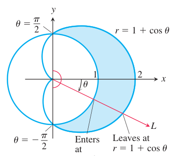
图 15.25 为例 1 的区域确定极坐标积分限。

若 $f(r,\theta)=1$，则 $f$ 在 $R$ 上的积分就是 $R$ 的面积。虽然这里不作证明，但该面积公式与前面的所有面积公式一致。

极坐标中的面积

极坐标平面内闭有界区域 $R$ 的面积为
$$
A=\iint_Rr\,dr\,d\theta.
$$

**例 2** 求双纽线 $r^2=4\cos2\theta$ 所围区域的面积。

**解：** 作图确定积分限（图 15.26）。由对称性，总面积是第一象限部分面积的 4 倍：

$$
\begin{aligned}
A
&=4\int_0^{\pi/4}\int_0^{\sqrt{4\cos2\theta}}r\,dr\,d\theta\\
&=4\int_0^{\pi/4}2\cos2\theta\,d\theta
=4[\sin2\theta]_0^{\pi/4}=4.
\end{aligned}
$$

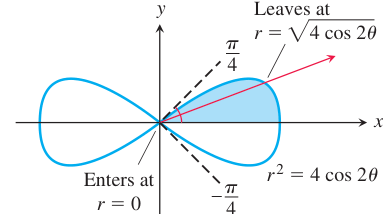
图 15.26 对阴影区域积分时，$r$ 从 $0$ 变到 $\sqrt{4\cos2\theta}$，$\theta$ 从 $0$ 变到 $\pi/4$（例 2）。

### 把直角坐标积分变为极坐标积分

把直角坐标积分 $\iint_Rf(x,y)\,dx\,dy$ 变为极坐标积分有两步：先代入 $x=r\cos\theta,y=r\sin\theta$，并把 $dx\,dy$ 换成 $r\,dr\,d\theta$；再为 $R$ 的边界给出极坐标积分限。于是

$$
\iint_Rf(x,y)\,dx\,dy
=\iint_Gf(r\cos\theta,r\sin\theta)r\,dr\,d\theta,
$$

其中 $G$ 表示用极坐标描述的同一积分区域。这类似第 5 章的换元法，只是现在需要替换两个变量。注意面积微元 $dx\,dy$ 不是换成 $dr\,d\theta$，而是换成 $r\,dr\,d\theta$。第 15.8 节将更一般地讨论多重积分中的变量代换。

极坐标中的面积微元

$$dA=r\,dr\,d\theta.$$

**例 3** 设 $R$ 是由 $x$ 轴和曲线 $y=\sqrt{1-x^2}$ 围成的半圆区域（图 15.27），计算

$$
\iint_Re^{x^2+y^2}\,dy\,dx.
$$

**解：** 在直角坐标中，这不是初等积分，无法直接先对 $x$ 或 $y$ 积分。但这类积分在数学（例如统计学）中很重要。代入极坐标并用 $r\,dr\,d\theta$ 替换 $dy\,dx$：

$$
\begin{aligned}
\iint_Re^{x^2+y^2}\,dy\,dx
&=\int_0^\pi\int_0^1e^{r^2}r\,dr\,d\theta\\
&=\int_0^\pi\left[\frac12e^{r^2}\right]_0^1d\theta
=\frac\pi2(e-1).
\end{aligned}
$$

$r\,dr\,d\theta$ 中的因子 $r$ 正好使 $e^{r^2}$ 可积；没有它就无法找到内层积分的原函数。

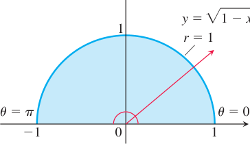
图 15.27 例 3 的半圆区域是 $0\le r\le1,0\le\theta\le\pi$。

**例 4** 计算

$$
\int_0^1\int_0^{\sqrt{1-x^2}}(x^2+y^2)\,dy\,dx.
$$

**解：** 先对 $y$ 积分会得到

$$
\int_0^1\left(x^2\sqrt{1-x^2}+\frac{(1-x^2)^{3/2}}{3}\right)dx,
$$

不用积分表很难计算。原区域是第一象限内单位四分之一圆。代入 $x=r\cos\theta,y=r\sin\theta$，其中 $0\le\theta\le\pi/2,0\le r\le1$，得到

$$
\int_0^{\pi/2}\int_0^1r^2r\,dr\,d\theta
=\int_0^{\pi/2}\frac14\,d\theta=\frac\pi8.
$$

极坐标变换在这里有效，一是因为 $x^2+y^2$ 化为 $r^2$，二是因为积分限变成常数。

**例 5** 求上方由抛物面 $z=9-x^2-y^2$、下方由 $xy$ 平面内单位圆围成的立体体积。

**解：** 积分区域是单位圆 $x^2+y^2\le1$，极坐标表示为 $0\le r\le1,0\le\theta\le2\pi$（图 15.28）。因此

$$
\begin{aligned}
V
&=\iint_R(9-x^2-y^2)\,dA
=\int_0^{2\pi}\int_0^1(9-r^2)r\,dr\,d\theta\\
&=\int_0^{2\pi}\left[\frac92r^2-\frac14r^4\right]_0^1d\theta
=\frac{17}{4}(2\pi)=\frac{17\pi}{2}.
\end{aligned}
$$

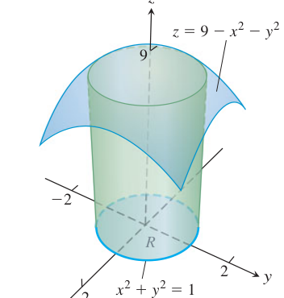
图 15.28 例 5 的立体区域。

**例 6** 用极坐标积分求 $xy$ 平面中位于圆 $x^2+y^2=4$ 内、直线 $y=1$ 上方且直线 $y=\sqrt3x$ 下方的区域 $R$ 的面积。

**解：** 区域如图 15.29。直线 $y=\sqrt3x$ 的斜率是 $\sqrt3=\tan\theta$，故 $\theta=\pi/3$。直线 $y=1$ 与圆交于 $x=\sqrt3$；从原点到 $(\sqrt3,1)$ 的射线斜率为 $1/\sqrt3$，倾角为 $\pi/6$。当 $\theta$ 从 $\pi/6$ 变到 $\pi/3$ 时，$r$ 从直线 $y=1$ 变到圆。由 $r\sin\theta=1$ 得直线的极坐标方程 $r=\csc\theta$，圆的方程为 $r=2$。所以

$$
\begin{aligned}
A
&=\int_{\pi/6}^{\pi/3}\int_{\csc\theta}^{2}r\,dr\,d\theta\\
&=\frac12\int_{\pi/6}^{\pi/3}(4-\csc^2\theta)\,d\theta\\
&=\frac12[4\theta+\cot\theta]_{\pi/6}^{\pi/3}
=\frac\pi3-\frac{\sqrt3}{3}.
\end{aligned}
$$

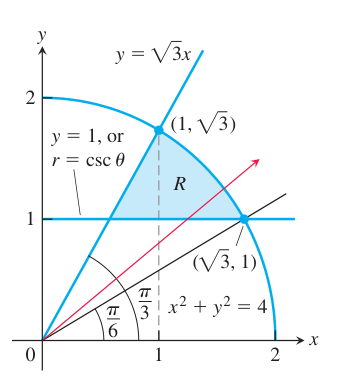
图 15.29 例 6 的区域 $R$。

---

## 15.5 直角坐标中的三重积分

正如二重积分使我们能够处理单积分无法处理的更一般情形，三重积分又使我们能够解决更加广泛的问题。我们用三重积分计算三维形体的体积以及函数在三维区域上的平均值。在研究三维向量场和流体流动时也会出现三重积分，第 16 章将讨论这些应用。

### 三重积分

设 \(F(x,y,z)\) 是定义在空间中闭有界区域 \(D\) 上的函数，例如实心球或一团黏土所占据的区域。用平行于坐标平面的平面，把一个包含 \(D\) 的长方体区域划分成许多小长方体（图 15.30）。把完全落在 \(D\) 内的小长方体按某种次序编号为 \(1,\ldots,n\)。第 \(k\) 个小长方体的尺寸为 \(\Delta x_k,\Delta y_k,\Delta z_k\)，体积为 \(\Delta V_k=\Delta x_k\Delta y_k\Delta z_k\)。在每个小长方体内取一点 \((x_k,y_k,z_k)\)，构造和

$$
S_n=\sum_{k=1}^{n}F(x_k,y_k,z_k)\Delta V_k. \tag{1}
$$

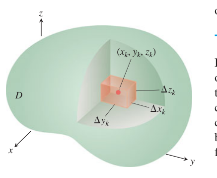
图 15.30 用体积为 \(\Delta V_k\) 的小长方体划分一个立体区域。

当用越来越小的小长方体划分 \(D\)，使 \(\Delta x_k,\Delta y_k,\Delta z_k\) 以及分割范数 \(\lVert P\rVert\)（这些长度中的最大值）都趋于零时，若无论怎样选择分割和点 \((x_k,y_k,z_k)\)，上述和都趋于同一极限，就称 \(F\) 在 \(D\) 上可积。若 \(F\) 连续，并且 \(D\) 的边界由有限个光滑曲面沿有限条光滑曲线连接而成，则 \(F\) 可积。这个极限称为 \(F\) 在 \(D\) 上的三重积分：

$$
\lim_{n\to\infty}S_n=\iiint_DF(x,y,z)\,dV,
\qquad
\lim_{\lVert P\rVert\to0}S_n=\iiint_DF(x,y,z)\,dx\,dy\,dz.
$$

连续函数可积的区域 \(D\)，就是那些边界“足够光滑”的区域。

### 空间区域的体积

若 \(F\equiv1\)，则式（1）化为 \(S_n=\sum\Delta V_k\)。当各小长方体的边长趋于零时，它们越来越充分地填满 \(D\)。因此定义：

**定义**

空间中闭有界区域 \(D\) 的体积为

$$
V=\iiint_DdV.
$$

这个定义与以前的体积定义相符。这个积分使我们能够计算由曲面围成、比第 6 章和第 15.2 节所见立体更一般的立体体积。

### 按 \(dz\,dy\,dx\) 的次序确定积分限

我们用 Fubini 定理的三维版本，把三重积分化为三个依次进行的单积分。为计算 \(\iiint_DF(x,y,z)\,dV\)，先对 \(z\) 积分，再对 \(y\) 积分，最后对 \(x\) 积分：

1. **画图。** 画出 \(D\) 及其在 \(xy\) 平面上的竖直投影 \(R\)，标出 \(D\) 的上、下边界曲面和 \(R\) 的上、下边界曲线。
2. **确定 \(z\) 限。** 过 \(R\) 内典型点 \((x,y)\) 作平行于 \(z\) 轴的直线 \(M\)。它在 \(z=f_1(x,y)\) 处进入 \(D\)，在 \(z=f_2(x,y)\) 处离开。
3. **确定 \(y\) 限。** 过 \((x,y)\) 作平行于 \(y\) 轴的直线 \(L\)。它在 \(y=g_1(x)\) 处进入 \(R\)，在 \(y=g_2(x)\) 处离开。
4. **确定 \(x\) 限。** 选择能涵盖所有穿过 \(R\) 且平行于 \(y\) 轴的直线的范围 \(a\le x\le b\)。

于是

$$
\int_a^b\int_{g_1(x)}^{g_2(x)}
\int_{f_1(x,y)}^{f_2(x,y)}
F(x,y,z)\,dz\,dy\,dx.
$$

改变积分次序时步骤类似；\(D\) 的“影子”位于最后两个积分变量所在的坐标平面内。上述方法适用于上下各由一个曲面围成、且投影区域上下各由一条曲线围成的立体。带有复杂孔洞的区域通常要先分成较简单的区域。

**例 1** 求曲面 \(z=x^2+3y^2\) 与 \(z=8-x^2-y^2\) 所围区域 \(D\) 的体积。

**解：** 两曲面相交于 \(x^2+2y^2=4,\ z\ge0\)。投影 \(R\) 的边界也是这个椭圆，上、下边界分别为 \(y=\pm\sqrt{(4-x^2)/2}\)。竖直线在 \(z=x^2+3y^2\) 处进入 \(D\)，在 \(z=8-x^2-y^2\) 处离开，而 \(x\) 从 \(-2\) 变到 \(2\)。

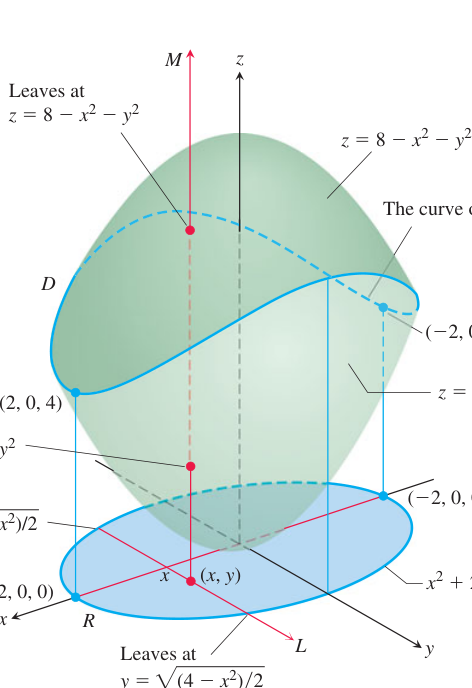
图 15.31 例 1 中两个抛物面所围的区域。

$$
\begin{aligned}
V&=\int_{-2}^{2}\int_{-\sqrt{(4-x^2)/2}}^{\sqrt{(4-x^2)/2}}
\int_{x^2+3y^2}^{8-x^2-y^2}dz\,dy\,dx\\
&=\int_{-2}^{2}\int_{-\sqrt{(4-x^2)/2}}^{\sqrt{(4-x^2)/2}}
(8-2x^2-4y^2)\,dy\,dx\\
&=\frac{4\sqrt2}{3}\int_{-2}^{2}(4-x^2)^{3/2}\,dx
=8\pi\sqrt2.
\end{aligned}
$$

最后一步使用代换 \(x=2\sin u\)。

**例 2** 四面体 \(D\) 的顶点为 \((0,0,0),(1,1,0),(0,1,0),(0,1,1)\)。写出按 \(dy\,dz\,dx\) 次序计算 \(\iiint_DF(x,y,z)\,dV\) 的积分限。

**解：** 把 \(D\) 投影到 \(xz\) 平面（图 15.32）。\(D\) 的右、左边界平面为 \(y=1\) 和 \(y=x+z\)，投影 \(R\) 的上、下边界为 \(z=1-x\) 和 \(z=0\)。因此

$$
\int_0^1\int_0^{1-x}\int_{x+z}^{1}F(x,y,z)\,dy\,dz\,dx.
$$

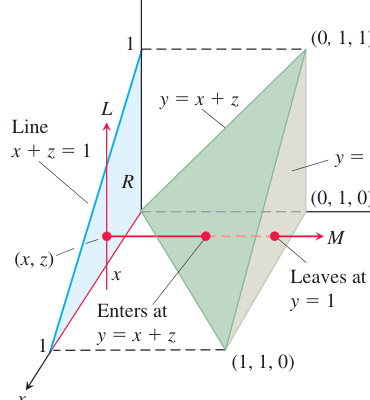
图 15.32 确定四面体 \(D\) 上三重积分的积分限（例 2 和例 3）。

**例 3** 先按 \(dz\,dy\,dx\)，再按 \(dy\,dz\,dx\) 的次序，对例 2 的四面体上的 \(F(x,y,z)=1\) 积分。

**解：** 在 \(xy\) 平面的投影中，竖直线从 \(z=0\) 进入四面体，在 \(z=y-x\) 处离开；投影由 \(y=x\)、\(y=1\)、\(x=0\) 围成（图 15.33）。所以

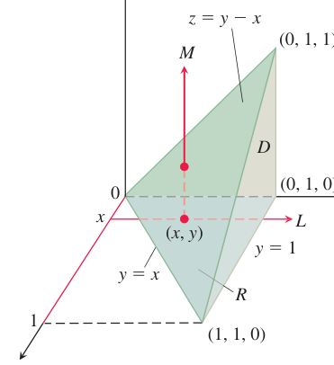
图 15.33 按 \(dz\,dy\,dx\) 次序确定例 3 的积分限。

$$
\begin{aligned}
V&=\int_0^1\int_x^1\int_0^{y-x}dz\,dy\,dx
=\int_0^1\int_x^1(y-x)\,dy\,dx\\
&=\int_0^1\left(\frac12-x+\frac12x^2\right)dx
=\frac16.
\end{aligned}
$$

按例 2 的次序，

$$
\begin{aligned}
V&=\int_0^1\int_0^{1-x}\int_{x+z}^{1}dy\,dz\,dx\\
&=\int_0^1\int_0^{1-x}(1-x-z)\,dz\,dx
=\frac12\int_0^1(1-x)^2dx=\frac16.
\end{aligned}
$$

### 空间中函数的平均值

$$
\boxed{\text{\(F\) 在 \(D\) 上的平均值}
=\frac{1}{D\text{ 的体积}}\iiint_DF\,dV.} \tag{2}
$$

例如，若 \(F(x,y,z)=\sqrt{x^2+y^2+z^2}\)，这个平均值就是 \(D\) 中各点到原点距离的平均值。若 \(F\) 是占据 \(D\) 的固体的温度，则它是固体的平均温度。

**例 4** 求 \(F(x,y,z)=xyz\) 在第一卦限中由坐标平面和平面 \(x=2,y=2,z=2\) 围成的立方体上的平均值。

**解：** 立方体体积为 8，且

$$
\int_0^2\int_0^2\int_0^2xyz\,dx\,dy\,dz
=\int_0^2\int_0^22yz\,dy\,dz
=\int_0^24z\,dz=8.
$$

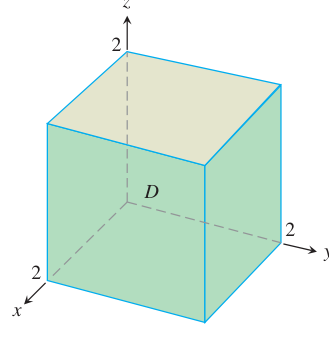
图 15.34 例 4 的积分区域。

故平均值为 \((1/8)(8)=1\)。这里选择了 \(dx\,dy\,dz\)，其余五种积分次序同样可行。

### 三重积分的性质

三重积分具有与二重积分和单积分相同的代数性质。只需把第 15.2 节列出的四条性质中的二重积分换成三重积分即可。

---

## 15.6 矩与质心

本节说明如何在直角坐标中计算二维和三维物体的质量与矩。第 15.7 节将给出柱坐标和球坐标中的计算。这里的定义和思想与第 6.6 节的一元情形相似，但现在可以处理更符合实际的情况。

### 质量与一阶矩

若 \(\delta(x,y,z)\) 是占据空间区域 \(D\) 的物体的密度（单位体积的质量），则 \(\delta\) 在 \(D\) 上的积分给出物体的质量。设想把物体分成 \(n\) 个如图 15.35 所示的质量微元：

$$
M=\lim_{n\to\infty}\sum_{k=1}^n\Delta m_k
=\lim_{n\to\infty}\sum_{k=1}^n\delta(x_k,y_k,z_k)\Delta V_k
=\iiint_D\delta(x,y,z)\,dV.
$$

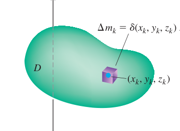
图 15.35 定义物体质量时，先把物体分成有限个质量微元 \(\Delta m_k\)。

立体区域 \(D\) 关于某坐标平面的一阶矩，定义为 \(D\) 内点到该平面的距离与该点密度乘积的三重积分。例如

$$
M_{yz}=\iiint_Dx\delta(x,y,z)\,dV,
\qquad \bar x=\frac{M_{yz}}M.
$$

对于薄而平的二维物体，略去 \(z\) 坐标即可。例如，覆盖区域 \(R\) 的薄板关于 \(y\) 轴的一阶矩为

$$
M_y=\iint_Rx\delta(x,y)\,dA.
$$

**表 15.1　质量与一阶矩公式**

三维立体：

$$
\begin{aligned}
M&=\iiint_D\delta\,dV,\\
M_{yz}&=\iiint_Dx\delta\,dV,&
M_{xz}&=\iiint_Dy\delta\,dV,&
M_{xy}&=\iiint_Dz\delta\,dV,\\
\bar x&=\frac{M_{yz}}M,&
\bar y&=\frac{M_{xz}}M,&
\bar z&=\frac{M_{xy}}M.
\end{aligned}
$$

二维薄板：

$$
\begin{aligned}
M&=\iint_R\delta\,dA,\\
M_y&=\iint_Rx\delta\,dA,&M_x&=\iint_Ry\delta\,dA,\\
\bar x&=\frac{M_y}M,&\bar y&=\frac{M_x}M.
\end{aligned}
$$

**例 1** 求密度为常数 \(\delta\)、下方为圆盘 \(R:x^2+y^2\le4,\ z=0\)、上方为抛物面 \(z=4-x^2-y^2\) 的立体的质心（图 15.36）。

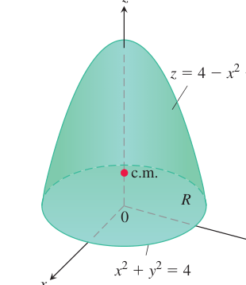
图 15.36 求一个立体的质心（例 1）。

**解：** 由对称性 \(\bar x=\bar y=0\)。极坐标使下列积分更简便：

$$
\begin{aligned}
M_{xy}
&=\iint_R\int_0^{4-x^2-y^2}z\delta\,dz\,dy\,dx\\
&=\frac{\delta}{2}\int_0^{2\pi}\int_0^2(4-r^2)^2r\,dr\,d\theta
=\frac{32\pi\delta}{3}.
\end{aligned}
$$

类似地，\(M=8\pi\delta\)，所以

$$
\bar z=\frac{M_{xy}}M=\frac43,
$$

质心为 \((0,0,4/3)\)。

密度为常数时，质心也称为物体的**形心**。求形心时可令 \(\delta=1\)，再用一阶矩除以质量来求各坐标；二维物体也同样适用。

**例 2** 求第一象限内由 \(y=x\) 和 \(y=x^2\) 围成区域的形心。

**解：**

$$
\begin{aligned}
M&=\int_0^1\int_{x^2}^x1\,dy\,dx=\frac16,\\
M_x&=\int_0^1\int_{x^2}^xy\,dy\,dx=\frac1{15},\\
M_y&=\int_0^1\int_{x^2}^xx\,dy\,dx=\frac1{12}.
\end{aligned}
$$

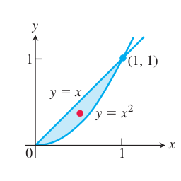
图 15.37 例 2 中区域的形心。

因此

$$
\bar x=\frac{M_y}M=\frac12,\qquad
\bar y=\frac{M_x}M=\frac25,
$$

形心为 \((1/2,2/5)\)。

### 转动惯量

一阶矩描述平衡以及物体在重力场中绕不同轴受到的力矩。对旋转轴，还要关心其储存的能量，这就要用二阶矩，也就是转动惯量。把转轴分成质量为 \(\Delta m_k\) 的小块，令 \(r_k\) 为第 \(k\) 块质心到旋转轴的距离（图 15.38）。若角速度为 \(\omega=d\theta/dt\)，则该质心的线速度是 \(v_k=r_k\omega\)，动能近似为

$$
\frac12\Delta m_kv_k^2=\frac12\omega^2r_k^2\Delta m_k.
$$

在极限下，

$$
KE_{\text{轴}}=\int\frac12\omega^2r^2\,dm
=\frac12\omega^2\int r^2\,dm. \tag{1}
$$

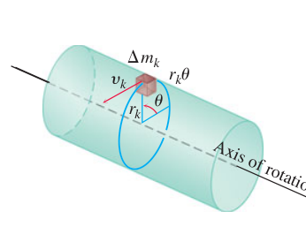
图 15.38 把转轴分成小块并把各块动能相加。

其中

$$
I=\int r^2\,dm
$$

是转轴关于旋转轴线的转动惯量，所以 \(KE_{\text{轴}}=\tfrac12I\omega^2\)。

转动惯量类似于直线运动中的质量：质量使机车难以启动或停止，转动惯量则使转轴难以启动或停止。它不仅取决于总质量，还取决于质量的分布；离旋转轴越远的质量，贡献越大。

若 \(r(x,y,z)\) 是点 \((x,y,z)\) 到直线 \(L\) 的距离，则整个物体关于 \(L\) 的转动惯量为

$$
I_L=\iiint_Dr^2(x,y,z)\delta(x,y,z)\,dV.
$$

若 \(L\) 分别是坐标轴，便得到

$$
\begin{aligned}
I_x&=\iiint_D(y^2+z^2)\delta\,dV,\\
I_y&=\iiint_D(x^2+z^2)\delta\,dV,\\
I_z&=\iiint_D(x^2+y^2)\delta\,dV.
\end{aligned}
$$

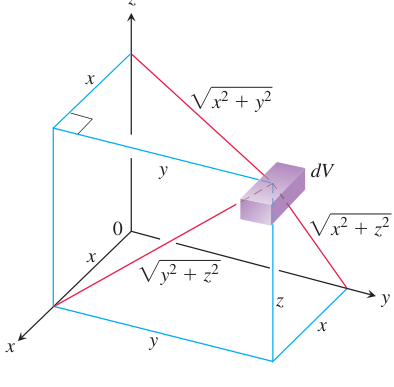
图 15.39 体积元 \(dV\) 到各坐标平面和坐标轴的距离。

**表 15.2　转动惯量（二阶矩）公式**

三维立体的公式如上，且 \(I_L=\iiint_Dr^2\delta\,dV\)。二维薄板有

$$
I_x=\iint_Ry^2\delta\,dA,\quad
I_y=\iint_Rx^2\delta\,dA,\quad
I_L=\iint_Rr^2\delta\,dA,
$$

关于原点的极转动惯量为

$$
I_0=\iint_R(x^2+y^2)\delta\,dA=I_x+I_y.
$$

**例 3** 求图 15.40 所示、密度为常数 \(\delta\) 的长方体的 \(I_x,I_y,I_z\)。

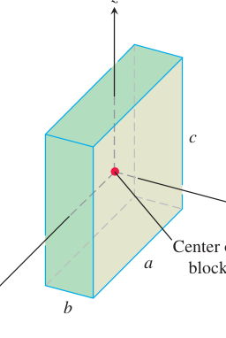
图 15.40 原点位于长方体中心（例 3）。

**解：**

$$
I_x=\int_{-c/2}^{c/2}\int_{-b/2}^{b/2}\int_{-a/2}^{a/2}
(y^2+z^2)\delta\,dx\,dy\,dz.
$$

被积函数关于 \(x,y,z\) 都是偶函数，所以只需积一个卦限再乘以 8：

$$
\begin{aligned}
I_x&=8\int_0^{c/2}\int_0^{b/2}\int_0^{a/2}
(y^2+z^2)\delta\,dx\,dy\,dz\\
&=\frac{abc\delta}{12}(b^2+c^2)
=\frac{M}{12}(b^2+c^2),
\end{aligned}
$$

其中 \(M=abc\delta\)。类似地，

$$
I_y=\frac{M}{12}(a^2+c^2),\qquad
I_z=\frac{M}{12}(a^2+b^2).
$$

**例 4** 一块薄板覆盖第一象限内由 \(x\) 轴、\(x=1\) 和 \(y=2x\) 围成的三角形，密度为 \(\delta(x,y)=6x+6y+6\)。求它关于坐标轴和原点的转动惯量。

**解：**

$$
\begin{aligned}
I_x&=\int_0^1\int_0^{2x}y^2\delta(x,y)\,dy\,dx\\
&=\int_0^1(40x^4+16x^3)\,dx=12.
\end{aligned}
$$

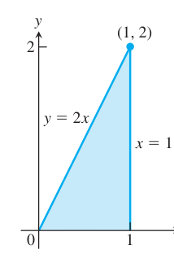
图 15.41 例 4 中薄板覆盖的三角形区域。

类似地，

$$
I_y=\int_0^1\int_0^{2x}x^2\delta(x,y)\,dy\,dx=\frac{39}{5}.
$$

计算 \(I_x\) 时积分的是 \(y^2\) 乘密度，计算 \(I_y\) 时积分的是 \(x^2\) 乘密度。由 \(I_0=I_x+I_y\)，

$$
I_0=12+\frac{39}{5}=\frac{99}{5}.
$$

转动惯量还决定水平金属梁在载荷下弯曲的程度。梁的刚度等于某个常数乘以典型横截面关于梁纵轴的转动惯量 \(I\)。\(I\) 越大，梁越硬，给定载荷下弯曲越小。因此采用工字梁而不是方形截面梁：上下翼缘使大部分质量远离纵轴，从而增大 \(I\)（图 15.42）。

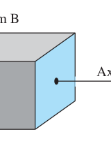
图 15.42 横截面关于纵轴的极转动惯量越大，梁越硬；A、B 面积相同，但 A 更硬。

---

## 15.7 柱坐标和球坐标中的三重积分

物理、工程或几何计算涉及圆柱、圆锥或球面时，使用本节介绍的柱坐标或球坐标常能简化工作。坐标变换及三重积分求值的步骤，与第 15.4 节平面极坐标的变换相似。

### 柱坐标积分

把 \(xy\) 平面上的极坐标与通常的 \(z\) 轴结合起来，就得到空间的柱坐标。空间中每一点对应一个或多个形如 \((r,\theta,z)\) 的坐标三元组（图 15.43），其中要求 \(r\ge0\)。

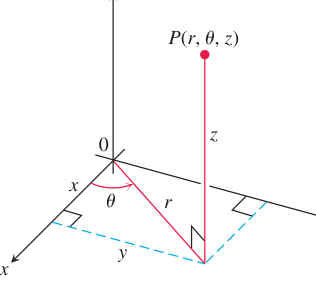
图 15.43 空间中一点的柱坐标为 \(r,\theta,z\)。

**定义**

柱坐标用有序三元组 \((r,\theta,z)\) 表示空间中的点 \(P\)，其中 \(r\ge0\)：

1. \(r,\theta\) 是 \(P\) 在 \(xy\) 平面上的竖直投影的极坐标；
2. \(z\) 是直角坐标中的竖直坐标。

直角坐标与柱坐标的关系为

$$
x=r\cos\theta,\qquad y=r\sin\theta,\qquad z=z,
\qquad r^2=x^2+y^2,\qquad \tan\theta=\frac yx.
$$

在柱坐标中，\(r=a\) 表示以 \(z\) 轴为轴、半径为 \(a\) 的整个圆柱面，而不只表示 \(xy\) 平面上的圆（图 15.44）；\(r=0\) 表示 \(z\) 轴；\(\theta=\theta_0\) 表示包含 \(z\) 轴且与正 \(x\) 轴成角 \(\theta_0\) 的平面；\(z=z_0\) 表示垂直于 \(z\) 轴的平面。因此柱坐标很适合描述轴为 \(z\) 轴的圆柱面，以及包含或垂直于 \(z\) 轴的平面。

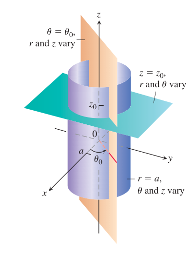
图 15.44 柱坐标中的坐标等值方程给出圆柱面和平面。

计算区域 \(D\) 上的三重积分时，把 \(D\) 分成小柱形楔块。第 \(k\) 个楔块内 \(r,\theta,z\) 的改变量为 \(\Delta r_k,\Delta\theta_k,\Delta z_k\)。其底面积近似为 \(r_k\Delta r_k\Delta\theta_k\)，体积近似为

$$
\Delta V_k=\Delta z_k\,r_k\Delta r_k\Delta\theta_k.
$$

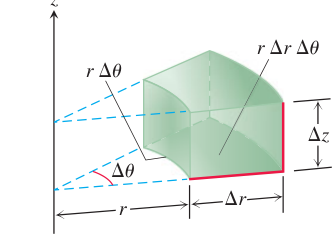
图 15.45 柱坐标中楔块体积近似为 \(\Delta z\,r\Delta r\Delta\theta\)。

所以 Riemann 和为

$$
S_n=\sum_{k=1}^nf(r_k,\theta_k,z_k)\Delta z_k\,r_k\Delta r_k\Delta\theta_k,
$$

在分割范数趋于零时，

$$
\iiint_Df\,dV=\iiint_Df(r,\theta,z)\,dz\,r\,dr\,d\theta.
$$

因此柱坐标中的体积微元是

$$
\boxed{dV=dz\,r\,dr\,d\theta.}
$$

积分时通常把 \(\theta\) 限制在长度不超过 \(2\pi\) 的区间 \(a\le\theta\le b\)。

**例 1** 区域 \(D\) 下方由 \(z=0\) 围成，侧面由圆柱面 \(x^2+(y-1)^2=1\) 围成，上方由抛物面 \(z=x^2+y^2\) 围成。求柱坐标积分限。

**解：** \(D\) 在 \(xy\) 平面上的投影 \(R\) 的边界为

$$
x^2+(y-1)^2=1
\ \Longrightarrow\ r^2-2r\sin\theta=0
\ \Longrightarrow\ r=2\sin\theta.
$$

竖直线从 \(z=0\) 进入 \(D\)，在 \(z=r^2\) 处离开；从原点发出的射线从 \(r=0\) 到 \(r=2\sin\theta\)，并在 \(0\le\theta\le\pi\) 内扫过 \(R\)（图 15.46）。故

$$
\iiint_Df(r,\theta,z)\,dV
=\int_0^\pi\int_0^{2\sin\theta}\int_0^{r^2}
f(r,\theta,z)\,dz\,r\,dr\,d\theta.
$$

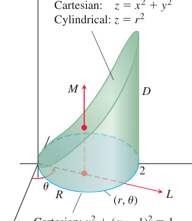
图 15.46 在柱坐标中确定积分限（例 1）。

**如何在柱坐标中积分**

按 \(z,r,\theta\) 的次序计算区域 \(D\) 上的积分：

1. 画出 \(D\) 及其在 \(xy\) 平面上的投影 \(R\)，标出边界；
2. 过 \(R\) 内典型点作平行于 \(z\) 轴的直线，确定 \(g_1(r,\theta)\le z\le g_2(r,\theta)\)；
3. 从原点作射线，确定 \(h_1(\theta)\le r\le h_2(\theta)\)；
4. 让射线扫过 \(R\)，确定 \(a\le\theta\le b\)。

$$
\iiint_Df\,dV
=\int_a^b\int_{h_1(\theta)}^{h_2(\theta)}
\int_{g_1(r,\theta)}^{g_2(r,\theta)}
f(r,\theta,z)\,dz\,r\,dr\,d\theta.
$$

**例 2** 求圆柱面 \(x^2+y^2=4\) 内、抛物面 \(z=x^2+y^2\) 下方、\(xy\) 平面上方的均匀立体（\(\delta=1\)）的形心。

**解：** 立体上方为 \(z=r^2\)，下方为 \(z=0\)，底面为 \(0\le r\le2\) 的圆盘（图 15.47）。由对称性，\(\bar x=\bar y=0\)。

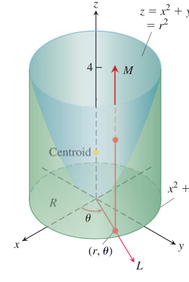
图 15.47 求此立体的形心（例 2）。

$$
\begin{aligned}
M_{xy}
&=\int_0^{2\pi}\int_0^2\int_0^{r^2}z\,dz\,r\,dr\,d\theta
=\frac{32\pi}{3},\\
M
&=\int_0^{2\pi}\int_0^2\int_0^{r^2}dz\,r\,dr\,d\theta
=8\pi.
\end{aligned}
$$

于是

$$
\bar z=\frac{M_{xy}}M=\frac43,
$$

形心为 \((0,0,4/3)\)。注意该形心在 \(z\) 轴上，但位于立体之外。

### 球坐标与积分

球坐标用两个角和一个距离确定空间中的点（图 15.48）。第一坐标 \(\rho=|\overrightarrow{OP}|\) 是点到原点的距离，永不为负；第二坐标 \(\phi\) 是 \(\overrightarrow{OP}\) 与正 \(z\) 轴的夹角，要求 \(0\le\phi\le\pi\)；第三坐标 \(\theta\) 与柱坐标中的角相同。

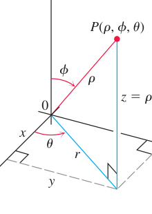
图 15.48 球坐标 \(\rho,\phi,\theta\) 及其与 \(x,y,z,r\) 的关系。

**定义**

球坐标用有序三元组 \((\rho,\phi,\theta)\) 表示空间中的点 \(P\)，其中：

1. \(\rho\) 是 \(P\) 到原点的距离，\(\rho\ge0\)；
2. \(\phi\) 是 \(\overrightarrow{OP}\) 与正 \(z\) 轴的夹角，\(0\le\phi\le\pi\)；
3. \(\theta\) 是柱坐标中的角。

在地球地图上，\(\theta\) 与一点所在的经线有关，\(\phi\) 与纬度有关，而 \(\rho\) 与该点在地表上方的高度有关。

\(\rho=a\) 表示以原点为中心、半径为 \(a\) 的球面；\(\phi=\phi_0\) 表示顶点在原点、轴为 \(z\) 轴的单个圆锥面（把 \(xy\) 平面看作 \(\phi=\pi/2\) 的圆锥面）；若 \(\phi_0>\pi/2\)，圆锥向下张开；\(\theta=\theta_0\) 表示含 \(z\) 轴、与正 \(x\) 轴成角 \(\theta_0\) 的半平面（图 15.49）。

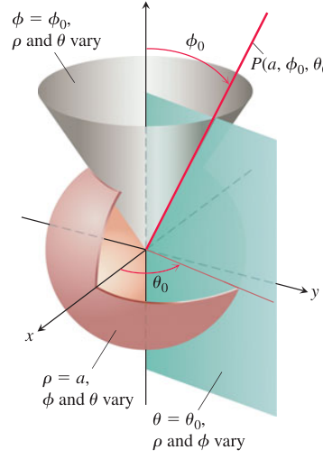
图 15.49 球坐标中的坐标等值方程给出球面、单圆锥面和半平面。

球坐标与直角坐标、柱坐标之间的关系为

$$
\begin{aligned}
r&=\rho\sin\phi,\\
x&=\rho\sin\phi\cos\theta,\\
y&=\rho\sin\phi\sin\theta,\\
z&=\rho\cos\phi,\\
\rho&=\sqrt{x^2+y^2+z^2}=\sqrt{r^2+z^2}.
\end{aligned} \tag{1}
$$

**例 3** 求球面 \(x^2+y^2+(z-1)^2=1\) 的球坐标方程。

**解：** 代入式（1）：

$$
\begin{aligned}
\rho^2\sin^2\phi(\cos^2\theta+\sin^2\theta)
+(\rho\cos\phi-1)^2&=1,\\
\rho^2(\sin^2\phi+\cos^2\phi)&=2\rho\cos\phi,\\
\rho&=2\cos\phi.
\end{aligned}
$$

\(\phi\) 从球的北极处的 0 变到南极处的 \(\pi/2\)；方程不含 \(\theta\)，反映了关于 \(z\) 轴的对称性（图 15.50）。

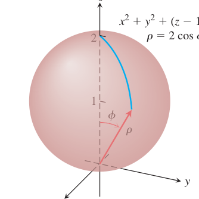
图 15.50 例 3 的球面。

**例 4** 求圆锥面 \(z=\sqrt{x^2+y^2}\) 的球坐标方程。

**解法 1（几何法）：** 圆锥关于 \(z\) 轴对称，并在 \(yz\) 平面第一象限内沿 \(z=y\) 与该平面相交，所以圆锥与正 \(z\) 轴的夹角为 \(\pi/4\)，方程为 \(\phi=\pi/4\)。

**解法 2（代数法）：**

$$
\rho\cos\phi=\rho\sin\phi
\quad\Longrightarrow\quad
\cos\phi=\sin\phi
\quad\Longrightarrow\quad
\phi=\frac\pi4.
$$

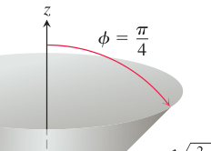
图 15.51 例 4 的圆锥面。

球坐标适于描述以原点为中心的球面、以 \(z\) 轴为铰链的半平面，以及顶点在原点且轴为 \(z\) 轴的圆锥面。

计算球坐标三重积分时，把区域分成球形楔块。楔块三条边的长度近似为 \(\Delta\rho,\rho\Delta\phi,\rho\sin\phi\,\Delta\theta\)，所以

$$
\Delta V_k=\rho_k^2\sin\phi_k\,
\Delta\rho_k\Delta\phi_k\Delta\theta_k.
$$

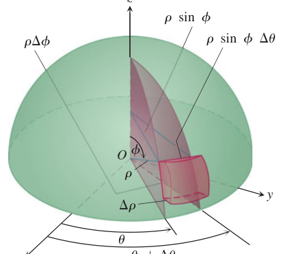
图 15.52 球坐标中使用球形楔块的体积。

对应的 Riemann 和为

$$
S_n=\sum_{k=1}^nf(\rho_k,\phi_k,\theta_k)
\rho_k^2\sin\phi_k\Delta\rho_k\Delta\phi_k\Delta\theta_k.
$$

当分割范数趋于零且 \(f\) 连续时，

$$
\iiint_Df\,dV
=\iiint_Df(\rho,\phi,\theta)\rho^2\sin\phi\,d\rho\,d\phi\,d\theta,
$$

即

$$
\boxed{dV=\rho^2\sin\phi\,d\rho\,d\phi\,d\theta.}
$$

**如何在球坐标中积分**

按 \(\rho,\phi,\theta\) 的次序计算旋转立体（或其一部分）上的积分：

1. 画出 \(D\) 及其在 \(xy\) 平面上的投影 \(R\)，标出边界；
2. 从原点向 \(D\) 作射线 \(M\)，确定 \(g_1(\phi,\theta)\le\rho\le g_2(\phi,\theta)\)；
3. 对给定的 \(\theta\)，确定 \(\phi_{\min}\le\phi\le\phi_{\max}\)；
4. 让 \(M\) 的投影扫过 \(R\)，确定 \(a\le\theta\le b\)。

$$
\iiint_Df\,dV
=\int_a^b\int_{\phi_{\min}}^{\phi_{\max}}
\int_{g_1(\phi,\theta)}^{g_2(\phi,\theta)}
f(\rho,\phi,\theta)\rho^2\sin\phi\,d\rho\,d\phi\,d\theta.
$$

**例 5** 求由圆锥 \(\phi=\pi/3\) 从实心球 \(\rho\le1\) 中切出的“冰淇淋蛋筒” \(D\) 的体积。

**解：** 射线从 \(\rho=0\) 到 \(\rho=1\)，角 \(\phi\) 从 0 到 \(\pi/3\)，而其投影以 \(0\le\theta\le2\pi\) 扫过底面（图 15.53）。

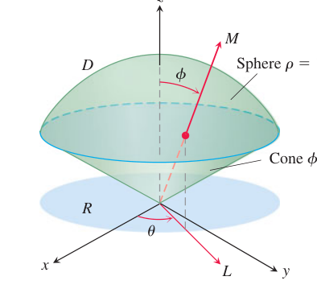
图 15.53 例 5 的“冰淇淋蛋筒”。

$$
\begin{aligned}
V&=\int_0^{2\pi}\int_0^{\pi/3}\int_0^1
\rho^2\sin\phi\,d\rho\,d\phi\,d\theta\\
&=\int_0^{2\pi}\int_0^{\pi/3}\frac13\sin\phi\,d\phi\,d\theta
=\frac\pi3.
\end{aligned}
$$

**例 6** 密度为 \(\delta=1\) 的固体占据例 5 的区域 \(D\)。求它关于 \(z\) 轴的转动惯量。

**解：** 直角坐标中

$$
I_z=\iiint_D(x^2+y^2)\,dV.
$$

而 \(x^2+y^2=\rho^2\sin^2\phi\)，所以

$$
\begin{aligned}
I_z
&=\int_0^{2\pi}\int_0^{\pi/3}\int_0^1
\rho^4\sin^3\phi\,d\rho\,d\phi\,d\theta\\
&=\frac15\int_0^{2\pi}\int_0^{\pi/3}
(1-\cos^2\phi)\sin\phi\,d\phi\,d\theta
=\frac{\pi}{12}.
\end{aligned}
$$

坐标变换及三重积分中的体积微元汇总如下：

$$
\begin{array}{lll}
\text{柱坐标到直角坐标}&
x=r\cos\theta,\ y=r\sin\theta,\ z=z,
&dV=dz\,r\,dr\,d\theta,\\
\text{球坐标到直角坐标}&
x=\rho\sin\phi\cos\theta,\ y=\rho\sin\phi\sin\theta,\ z=\rho\cos\phi,
&dV=\rho^2\sin\phi\,d\rho\,d\phi\,d\theta,\\
\text{球坐标到柱坐标}&
r=\rho\sin\phi,\ z=\rho\cos\phi,\ \theta=\theta.&
\end{array}
$$

下一节将给出确定柱坐标和球坐标中 \(dV\) 的更一般方法，结果当然与这里相同。

---

## 15.8 多重积分中的变量代换

本节介绍利用坐标变换对多重积分作变量代换的思想。变量代换通过简化被积函数、积分限或二者，把复杂积分替换为更容易计算的积分。多元变换与变量代换的完整讨论属于更高等的课程；这里的介绍说明刚学过的代换如何体现从单变量积分推广而来的普遍思想。

### 二重积分中的变量代换

第 15.4 节的极坐标代换是二重积分一般代换方法的一个特例。一般方法把变量的改变看成区域之间的变换。

设 \(uv\) 平面内的区域 \(G\) 由方程

$$
x=g(u,v),\qquad y=h(u,v)
$$

变换成 \(xy\) 平面内的区域 \(R\)（图 15.54），并假定该变换在 \(G\) 的内部是一一对应的。称 \(R\) 为 \(G\) 在该变换下的**像**，称 \(G\) 为 \(R\) 的**原像**。定义在 \(R\) 上的函数 \(f(x,y)\)，也可看成定义在 \(G\) 上的函数 \(f(g(u,v),h(u,v))\)。

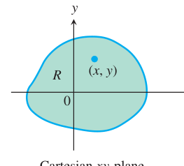
图 15.54 方程 \(x=g(u,v),y=h(u,v)\) 把 \(uv\) 平面内区域 \(G\) 上的积分变为 \(xy\) 平面内区域 \(R\) 上的积分。

回顾单变量代换（为与这里的记号一致，交换第 5 章中的变量名）：

$$
\int_{g(a)}^{g(b)}f(x)\,dx
=\int_a^bf(g(u))g'(u)\,du,
\qquad x=g(u),\quad dx=g'(u)\,du.
$$

为得到二重积分的对应公式，需要一个类似 \(g'(u)\) 的因子，把 \(G\) 中的面积元 \(du\,dv\) 变成 \(R\) 中对应的 \(dx\,dy\)。这个因子应依赖于 \(u,v\)，并包含变换方程的四个一阶偏导数。由此得到以德国数学家 Carl Jacobi 命名的定义。

**定义**

坐标变换 \(x=g(u,v),y=h(u,v)\) 的 **Jacobian 行列式**（简称 Jacobian）为

$$
J(u,v)=
\begin{vmatrix}
\dfrac{\partial x}{\partial u}&\dfrac{\partial x}{\partial v}\\[4pt]
\dfrac{\partial y}{\partial u}&\dfrac{\partial y}{\partial v}
\end{vmatrix}
=\frac{\partial x}{\partial u}\frac{\partial y}{\partial v}
-\frac{\partial y}{\partial u}\frac{\partial x}{\partial v}
=\frac{\partial(x,y)}{\partial(u,v)}. \tag{1}
$$

这个偏导数组成的行列式在这里扮演单变量中导数 \(g'\) 的角色。Jacobian 衡量变换在点 \((u,v)\) 附近把面积放大或缩小的程度；因子 \(|J|\) 把 \(G\) 中微分矩形的面积 \(du\,dv\) 换算为 \(R\) 中对应的微分面积：

$$
\boxed{dx\,dy=\left|\frac{\partial(x,y)}{\partial(u,v)}\right|du\,dv.}
$$

一般来说，缩放因子 \(|J|\) 随 \(G\) 中的位置改变。

**定理 3　二重积分的变量代换**

设 \(f(x,y)\) 在区域 \(R\) 上连续，\(G\) 是 \(R\) 在变换 \(x=g(u,v),y=h(u,v)\) 下的原像，并且该变换在 \(G\) 内部一一对应。若 \(g,h\) 在 \(G\) 内部具有连续的一阶偏导数，则

$$
\iint_Rf(x,y)\,dx\,dy
=\iint_Gf(g(u,v),h(u,v))
\left|\frac{\partial(x,y)}{\partial(u,v)}\right|du\,dv. \tag{2}
$$

式（2）的推导较复杂，属于高等微积分课程，这里不作证明。

**例 1** 求极坐标变换 \(x=r\cos\theta,\ y=r\sin\theta\) 的 Jacobian，并用式（2）把直角坐标积分写成极坐标积分。

**解：** 图 15.55 表明，这个变换把矩形 \(G:0\le r\le1,\ 0\le\theta\le\pi/2\) 变成第一象限内由 \(x^2+y^2=1\) 围成的四分之一圆 \(R\)。

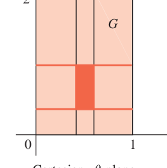
图 15.55 极坐标变换把 \(G\) 变为 \(R\)，Jacobian 因子 \(r\) 对面积元进行缩放。

$$
J(r,\theta)=
\begin{vmatrix}
\cos\theta&-r\sin\theta\\
\sin\theta&r\cos\theta
\end{vmatrix}
=r(\cos^2\theta+\sin^2\theta)=r.
$$

因 \(r\ge0\)，所以

$$
\iint_Rf(x,y)\,dx\,dy
=\iint_Gf(r\cos\theta,r\sin\theta)\,r\,dr\,d\theta. \tag{3}
$$

这正是第 15.4 节用几何方法得到的公式。注意，式（3）右边并不是只对 \(f(r\cos\theta,r\sin\theta)\) 在“极坐标平面”内积分，而是对 \(f(r\cos\theta,r\sin\theta)r\) 在直角 \(r\theta\) 平面内的区域 \(G\) 上积分。

**例 2** 利用变换

$$
u=\frac{2x-y}{2},\qquad v=\frac y2 \tag{4}
$$

计算

$$
\int_0^4\int_{y/2}^{(y/2)+1}\frac{2x-y}{2}\,dx\,dy.
$$

**解：** 原积分区域 \(R\) 是图 15.56 中的梯形。由式（4）反解得

$$
x=u+v,\qquad y=2v. \tag{5}
$$

边界 \(x=y/2,\ x=y/2+1,\ y=0,\ y=4\) 分别变成 \(u=0,\ u=1,\ v=0,\ v=2\)，所以原像 \(G\) 是矩形 \(0\le u\le1,\ 0\le v\le2\)。

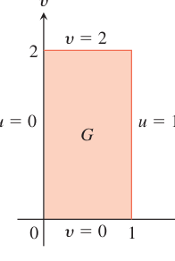
图 15.56 方程 \(x=u+v,y=2v\) 把矩形 \(G\) 变为梯形 \(R\)。

$$
J(u,v)=
\begin{vmatrix}1&1\\0&2\end{vmatrix}=2.
$$

于是

$$
\begin{aligned}
\int_0^4\int_{y/2}^{(y/2)+1}\frac{2x-y}{2}\,dx\,dy
&=\int_0^2\int_0^1u\,|J|\,du\,dv\\
&=\int_0^2\int_0^12u\,du\,dv=2.
\end{aligned}
$$

这种把矩形映成梯形的变换称为线性变换，其 Jacobian 在整个 \(G\) 上为常数。

**例 3** 计算

$$
\int_0^1\int_0^{1-x}\sqrt{x+y}\,(y-2x)^2\,dy\,dx.
$$

**解：** 被积函数提示取

$$
u=x+y,\qquad v=y-2x.
$$

反解得

$$
x=\frac u3-\frac v3,\qquad
y=\frac{2u}{3}+\frac v3. \tag{6}
$$

原区域边界 \(x+y=1,x=0,y=0\) 分别变为 \(u=1,v=u,v=-2u\)，所以 \(G\) 由 \(0\le u\le1,\ -2u\le v\le u\) 给出（图 15.57）。

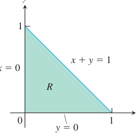
图 15.57 式（6）把 \(G\) 变为 \(R\)，逆变换为 \(u=x+y,v=y-2x\)。

$$
J(u,v)=
\begin{vmatrix}1/3&-1/3\\2/3&1/3\end{vmatrix}
=\frac13.
$$

故

$$
\begin{aligned}
\int_0^1\int_0^{1-x}\sqrt{x+y}(y-2x)^2\,dy\,dx
&=\int_0^1\int_{-2u}^{u}u^{1/2}v^2\left(\frac13\right)dv\,du\\
&=\int_0^1u^{7/2}\,du=\frac29.
\end{aligned}
$$

**例 4** 计算

$$
\int_1^2\int_{1/y}^{y}\sqrt{\frac yx}\,e^{\sqrt{xy}}\,dx\,dy.
$$

**解：** 根式提示取

$$
u=\sqrt{xy},\qquad v=\sqrt{\frac yx}.
$$

平方后有 \(u^2=xy,v^2=y/x\)，因此

$$
x=\frac uv,\qquad y=uv,\qquad u>0,\ v>0.
$$

Jacobian 不再为常数：

$$
J(u,v)=
\begin{vmatrix}
1/v&-u/v^2\\
v&u
\end{vmatrix}
=\frac{2u}{v}.
$$

所以被积函数连同面积因子变为

$$
\sqrt{\frac yx}e^{\sqrt{xy}}|J|
=ve^u\frac{2u}{v}=2ue^u.
$$

原区域 \(R\) 如图 15.58。边界 \(xy=1,y=x,y=2\) 分别变为 \(u=1,v=1,uv=2\)，所以 \(G\) 由 \(1\le u\le2,\ 1\le v\le2/u\) 给出（图 15.59）。

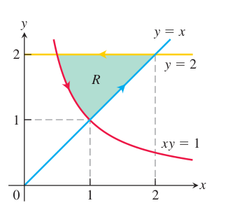
图 15.58 例 4 的原积分区域 \(R\)。

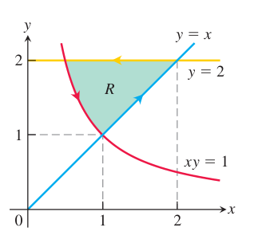
图 15.59 与图 15.58 中 \(R\) 的边界相对应的区域 \(G\)。

因此

$$
\begin{aligned}
\int_1^2\int_{1/y}^{y}\sqrt{\frac yx}e^{\sqrt{xy}}\,dx\,dy
&=\int_1^2\int_1^{2/u}2ue^u\,dv\,du\\
&=2\int_1^2(2-u)e^u\,du
=2e(e-2).
\end{aligned}
$$

这里要特别注意积分次序。这个例子展示了由简化被积函数而产生的非线性坐标变换。与极坐标变换一样，非线性变换可以把直线边界映成曲线边界，或由逆变换把曲线变为直线。一般的非线性变换分析更复杂，完整理论留待高等课程。

### 三重积分中的变量代换

第 15.7 节的柱坐标和球坐标代换，是三重积分中一般变量代换的特例。设 \(uvw\) 空间内区域 \(G\) 由可微方程

$$
x=g(u,v,w),\qquad
y=h(u,v,w),\qquad
z=k(u,v,w)
$$

一一对应地变换为 \(xyz\) 空间内区域 \(D\)（图 15.60）。定义在 \(D\) 上的函数 \(F(x,y,z)\) 可视为 \(G\) 上的

$$
H(u,v,w)=F(g(u,v,w),h(u,v,w),k(u,v,w)).
$$

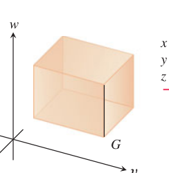
图 15.60 三个变换方程把 \(D\) 上的积分改写为 \(G\) 上的积分。

若 \(g,h,k\) 具有连续的一阶偏导数，则

$$
\iiint_DF(x,y,z)\,dx\,dy\,dz
=\iiint_GH(u,v,w)|J(u,v,w)|\,du\,dv\,dw, \tag{7}
$$

其中

$$
J(u,v,w)=
\begin{vmatrix}
\dfrac{\partial x}{\partial u}&\dfrac{\partial x}{\partial v}&\dfrac{\partial x}{\partial w}\\[4pt]
\dfrac{\partial y}{\partial u}&\dfrac{\partial y}{\partial v}&\dfrac{\partial y}{\partial w}\\[4pt]
\dfrac{\partial z}{\partial u}&\dfrac{\partial z}{\partial v}&\dfrac{\partial z}{\partial w}
\end{vmatrix}
=\frac{\partial(x,y,z)}{\partial(u,v,w)}.
$$

这个行列式衡量变换在 \(G\) 中一点附近把体积放大或缩小的程度。与二维情形相同，这里略去式（7）的推导。

对柱坐标，变换为

$$
x=r\cos\theta,\qquad y=r\sin\theta,\qquad z=z.
$$

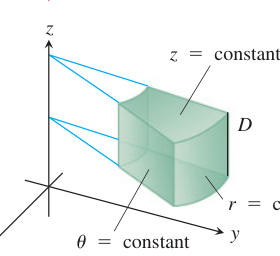
图 15.61 柱坐标变换把直角 \(r\theta z\) 空间中的小长方体变为柱形楔块。

$$
J(r,\theta,z)=
\begin{vmatrix}
\cos\theta&-r\sin\theta&0\\
\sin\theta&r\cos\theta&0\\
0&0&1
\end{vmatrix}
=r.
$$

所以

$$
\iiint_DF(x,y,z)\,dx\,dy\,dz
=\iiint_GH(r,\theta,z)\,r\,dr\,d\theta\,dz,
$$

其中 \(r\ge0\)，可去掉绝对值。

对球坐标，

$$
x=\rho\sin\phi\cos\theta,\quad
y=\rho\sin\phi\sin\theta,\quad
z=\rho\cos\phi.
$$

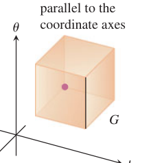
图 15.62 球坐标变换把直角 \(\rho\phi\theta\) 空间中的小长方体变为球形楔块。

其 Jacobian（见习题 23）为

$$
J(\rho,\phi,\theta)=\rho^2\sin\phi.
$$

因 \(0\le\phi\le\pi\) 时 \(\sin\phi\ge0\)，故

$$
\iiint_DF(x,y,z)\,dx\,dy\,dz
=\iiint_GH(\rho,\phi,\theta)\rho^2\sin\phi\,
d\rho\,d\phi\,d\theta,
$$

与第 15.7 节所得结果相同。

**例 5** 利用变换

$$
u=\frac{2x-y}{2},\qquad v=\frac y2,\qquad w=\frac z3 \tag{8}
$$

计算

$$
\int_0^3\int_0^4\int_{y/2}^{(y/2)+1}
\left(\frac{2x-y}{2}+\frac z3\right)dx\,dy\,dz.
$$

**解：** 原积分区域 \(D\) 的边界都是平面（图 15.63）。由式（8）反解得

$$
x=u+v,\qquad y=2v,\qquad z=3w. \tag{9}
$$

边界 \(x=y/2,x=y/2+1,y=0,y=4,z=0,z=3\) 依次变成

$$
u=0,\quad u=1,\quad v=0,\quad v=2,\quad w=0,\quad w=1.
$$

因此 \(G\) 是单位 \(u,w\) 方向、\(v\) 方向长度为 2 的长方体。

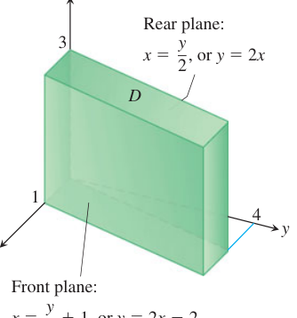
图 15.63 式（9）把长方体 \(G\) 变为 \(D\)，式（8）把 \(D\) 变回 \(G\)（例 5）。

$$
J(u,v,w)=
\begin{vmatrix}
1&1&0\\
0&2&0\\
0&0&3
\end{vmatrix}=6.
$$

于是

$$
\begin{aligned}
&\int_0^3\int_0^4\int_{y/2}^{(y/2)+1}
\left(\frac{2x-y}{2}+\frac z3\right)dx\,dy\,dz\\
&\qquad=\int_0^1\int_0^2\int_0^1(u+w)\,6\,du\,dv\,dw\\
&\qquad=6\int_0^1\int_0^2\left(\frac12+w\right)dv\,dw\\
&\qquad=6\int_0^1(1+2w)\,dw=12.
\end{aligned}
$$
