<!--
来源：Thomas' Calculus, Chapter 1: Functions, PDF pages 15-72。
说明：本文件由 PDF 文本层自动整理为 Markdown 初稿；复杂公式、表格和图题后续仍可按原 PDF 精校。
-->

# 第 1 章 函数

## 概述

函数是研究微积分的基础. 在本章中,我们回顾了什么是函数以及如何把它们描绘成图像,它们是如何结合和转变的,以及如何将其分类的。 我们回顾三角函数,我们讨论在使用计算器和计算机获取函数图像时可能发生的误表示。 我们还讨论反函数、指数函数和对数函数。 实数系统,笛卡尔坐标,直线,圆,parabolas,和椭圆在附录中审查.

## 1.1 函数及其图像

函数是用数学术语描述现实世界的工具. 一个函数可以用一个方程,一个图像,一个数字表,或者一个口头描述来表示;我们将在本书中使用全部四个表述. 本节审查这些函数设想。

### 函数、定义域和值域

水沸腾的温度取决于海平面的高度(沸点随着你的升降而下降)。 对现金投资支付的利息取决于投资的持有时间。 一个圆的面积取决于圆的半径. 物体沿直线路径以恒定速度行驶的距离取决于经过的时间. 在每种情况下,一个可变数量值,比如y,取决于另一个可变数量值,我们可以称之为x. 我们说“y是x的一个函数”,并象征性地写作y=f(x)(“y等于x的f”). 在这个注解中,符号f代表函数,字母x是代表f输入值的独立变量,y是x时f的依赖变量或输出值.

**定义**

从集合 $D$ 到集合 $Y$ 的函数 $f$ 是一条规则：它把 $D$ 中的每个元素 $x$ 指派给 $Y$ 中唯一的一个元素 $f(x)$。所有可能输入值组成的集合 $D$ 称为函数的定义域。随着 $x$ 在 $D$ 中变化，所有输出值 $f(x)$ 组成的集合称为函数的值域。值域不一定包含集合 $Y$ 中的每个元素。

函数的定义域和值域可以是任意对象的集合，但在微积分中，它们通常是实数集或实数集的子集。函数常由一个公式给出，这个公式说明怎样由输入变量计算输出值。例如，公式 $A=\pi r^2$ 给出了由半径 $r$ 计算圆面积 $A$ 的规则（这里 $r$ 作为长度只能取正值）。

当我们用公式 $y=f(x)$ 定义函数，并且上下文没有明示或限制定义域时，定义域通常取为使公式给出实数 $y$ 值的最大实数集合，称为自然定义域。如果要限制定义域，必须明确说明。例如，$y=x^2$ 的定义域是全体实数；如果只允许 $x$ 取正值，可以写作 $y=x^2,\ x>0$。

改变公式所作用的定义域通常也会改变值域。$y=x^2$ 的值域是 $[0,\infty)$；而 $y=x^2,\ x\ge2$ 的值域是所有大于或等于 $4$ 的实数。用集合记号可写作

$$
\{x^2\mid x\ge2\}=\{y\mid y\ge4\}=[4,\infty).
$$

当一个函数的值域是一组实数时，称该函数为实值函数。我们所考虑的单个实变量的实值函数，其定义域和值域通常是区间或若干区间的并。区间可以是开区间、闭区间或半开半闭区间，也可以是有限区间或无限区间。有时，函数的值域并不容易确定。

函数 $f$ 可以看成一台机器：只要输入定义域中的值 $x$，它就输出值域中的值 $f(x)$（图 1.1）。函数也可以用箭头图表示（图 1.2）。每个箭头把定义域 $D$ 中的一个元素指向集合 $Y$ 中唯一的一个元素。注意，一个函数可以在定义域中两个不同输入处取同一个值，但每个输入 $x$ 只能被指派给一个输出值 $f(x)$。

**例 1** 让我们来验证一些简单的自然域和相关范围

函数。 每种情况下的域都是x的值,公式对此有道理. 输入( 域) 输出( 范围) x f( x) f

图 1.1
显示某种机器函数的图像 。 x f(a) f(x) D = 定义域集 Y = 包含范围的集

图 1.2
从集合 $D$ 到集合 $Y$ 的函数。

| 函数 | 定义域（$x$） | 值域（$y$） |
|---|---:|---:|
| $y=x^2$ | $(-\infty,\infty)$ | $[0,\infty)$ |
| $y=1/x$ | $(-\infty,0)\cup(0,\infty)$ | $(-\infty,0)\cup(0,\infty)$ |
| $y=\sqrt{x}$ | $[0,\infty)$ | $[0,\infty)$ |
| $y=\sqrt{4-x}$ | $(-\infty,4]$ | $[0,\infty)$ |
| $y=\sqrt{1-x^2}$ | $[-1,1]$ | $[0,1]$ |

**解：**

公式 $y=x^2$ 对任意实数 $x$ 都给出实数 $y$，所以定义域是 $(-\infty,\infty)$。它的值域是 $[0,\infty)$，因为任意实数的平方都非负，而且每个非负数 $y$ 都可以写成 $y=(\sqrt y)^2$。

公式 $y=1/x$ 对除 $x=0$ 以外的每个实数 $x$ 都有意义。为了保持算术规则一致，不能用任何数除以 $0$。$y=1/x$ 的值域是全体非零实数，因为若 $y\ne0$，取 $x=1/y$ 就有 $1/x=y$。

公式 $y=\sqrt{x}$ 只有在 $x\ge0$ 时给出实数值。它的值域是 $[0,\infty)$，因为每个非负数都是某个实数的平方根。对于 $y=\sqrt{4-x}$，根号内必须满足 $4-x\ge0$，即 $x\le4$，所以定义域是 $(-\infty,4]$，值域是 $[0,\infty)$。

公式 $y=\sqrt{1-x^2}$ 只有当 $-1\le x\le1$ 时给出实数值；在这个定义域上，$1-x^2$ 的取值从 $0$ 到 $1$，所以值域为 $[0,1]$。

### 函数图像

若函数 $f$ 的定义域为 $D$，则它的图像由笛卡尔平面中的点组成，这些点的坐标就是 $f$ 的输入-输出对。用集合记号表示，图像为

$$
\{(x,f(x))\mid x\in D\}.
$$

函数 $f(x)=x+2$ 的图像是所有满足 $y=x+2$ 的点 $(x,y)$ 组成的集合，即图 1.3 中的直线。函数 $f$ 的图像可以直观显示它的行为。如果 $(x,y)$ 是图像上的点，则 $y=f(x)$ 是图像在 $x$ 处的高度；这个高度可能为正，也可能为负，取决于 $f(x)$ 的符号（图 1.4）。

图 1.3
f(x) = x + 2 的图是 y 的值为 x + 2. y × f(x) (x,y) f(1) f(2)的一组点.

图 1.4
如果 $(x,y)$ 位于 $f$ 的图像上，那么值 $y=f(x)$ 就是图像在 $x$ 处的高度；如果 $f(x)<0$，则图像位于 $x$ 轴下方。

图 1.5
例2中的函数图。

**例 2** 在区间 $[-2,2]$ 上作函数 $y=x^2$ 的图像。

**解：**

先列出满足公式 $y=x^2$ 的若干 $(x,y)$ 数值对，再把这些点描在坐标平面上，并用一条标有方程的光滑曲线连接它们（见图 1.5）。我们怎样知道 $y=x^2$ 的图像不会是其他形状？可以描更多点，但仍然要判断点与点之间发生了什么。第 4 章将说明，微积分正是回答这类问题的工具。在那以前，我们只能尽可能谨慎地描点并连接它们。

### 用数值表示函数

我们看到一个函数如何用公式(区域函数)和图(例2)来表示代数。 另一种表达函数的方法是通过数值表进行数字化. 数字表示常被工程师和实验科学家使用. 从一个适当的数值表中,可以使用例2中说明的方法,在计算机的协助下获得函数图。 仅由表中各点组成的图称为散点图.

**例 3** 音乐笔记是空气中的压力波. 与下列项目有关的数据:

图1.6给出了记录的压力位移与调音叉制作的音乐音符的秒数。 该表提供了一段时间内压力函数的表示. 如果我们首先制作一个散点,然后将表格中的数据点(t,p)连接起来,我们就得到图中显示的图像。 -0.6-0.4-0.2 0.4 0.6 0.8 1.0 t(秒) p(压力)0.001 0.002 0.004 0.006 0.003 0.005

图 1.6
通过绘图点的平滑曲线给出了以附带的提交数据(例3)为代表的压力函数图. 时间压力 0.00091 - 0.080 0.00362 0.217 0.00108 0.200 0.00379 0.480 0.481 0.0044 0.093 0.00416 0.80435 0.827 0.0080 0.0844 0.00453 0.0749 0.0098 0.00471 0.581 0.00216 0.603 0.048 0.346 0.308 0.0057 0.00525 - 0.00243 0.099 0.005271 - 0.0054 0.00543 - 320 0.0289 - 0.003562 - 0.354 0.00348 0.00579 - 0.248 0.00325 - 0.248 -0.0035 - 0.00344 - 0.004441

### 函数的垂线检验

并不是坐标平面中的每条曲线都可以是函数的图像。函数 $f$ 在定义域中的每个 $x$ 只能有一个值 $f(x)$，因此任意垂直线都不能与函数图像相交超过一次。如果 $a$ 在 $f$ 的定义域中，则垂直线 $x=a$ 与 $f$ 的图像只在点 $(a,f(a))$ 相交。

圆不能作为一个函数的图像，因为某些垂直线会与圆相交两次。不过，图 1.7a 中的圆确实包含两个函数的图像：上半圆可写为

$$
f(x)=\sqrt{1-x^2},
$$

下半圆可写为

$$
g(x)=-\sqrt{1-x^2}.
$$

### 分段定义函数

有时，一个函数会在定义域的不同部分用不同公式描述。一个例子是绝对值函数

$$
|x|=
\begin{cases}
x, & x\ge0,\\
-x, & x<0.
\end{cases}
$$

这个公式表示：当 $x\ge0$ 时函数值等于 $x$；当 $x<0$ 时函数值等于 $-x$。在模拟现实世界数据时，经常会出现这种分段定义的函数。

**例 4** 函数

函数

$$
f(x)=
\begin{cases}
-x, & x<0,\\
x^2, & 0\le x\le1,\\
1, & x>1
\end{cases}
$$

在整条实数线上定义，但根据 $x$ 所在的位置使用不同公式。也就是说，当 $x<0$ 时，$y=-x$；当 $0\le x\le1$ 时，$y=x^2$；当 $x>1$ 时，$y=1$。尽管公式分成三段，它仍然只是一个函数，其定义域为全体实数（图 1.9）。

**例 5** 对任意数 $x$，不超过 $x$ 的最大整数称为最大整数函数或向下取整函数。

图 1.10 显示了它的图像。例如，$\lfloor2.4\rfloor=2$，$\lfloor1.9\rfloor=1$，$\lfloor0\rfloor=0$，$\lfloor-1.2\rfloor=-2$。

**例 6** 对任意数 $x$，不小于 $x$ 的最小整数称为最小整数函数或向上取整函数。

图 1.11 显示了它的图像。对正的 $x$ 值，这个函数可以表示停车场按每小时或不足一小时收费 1 美元时，停车 $x$ 小时的费用。

图 1.7
(a) 圆不是函数的图像，因为它不能通过垂线检验；(b) 上半圆是函数 $f(x)=\sqrt{1-x^2}$ 的图像；(c) 下半圆是函数 $g(x)=-\sqrt{1-x^2}$ 的图像。

图 1.9
要画出这里显示的函数 $y=f(x)$，需要在定义域的不同部分使用不同公式（例 4）。

图 1.8
绝对值函数的定义域为 $(-\infty,\infty)$，值域为 $[0,\infty)$。

图 1.10
最大整数函数 $y=\lfloor x\rfloor$ 的图像位于直线 $y=x$ 上或其下方，因此给出 $x$ 的整数下界（例 5）。

### 增函数和减函数

如果函数的图像在从左向右移动时上升，我们说函数递增；如果图像在从左向右移动时下降，我们说函数递减。

图 1.11
最小整数函数 $y=\lceil x\rceil$ 的图像位于直线 $y=x$ 上或其上方，因此给出 $x$ 的整数上界（例 6）。

图 1.12
$y=x^2$（偶函数）的图像关于 $y$ 轴对称；$y=x^3$（奇函数）的图像关于原点对称。

**定义**

设 $f$ 是定义在区间 $I$ 上的函数，$x_1$ 和 $x_2$ 是 $I$ 中任意两点。

1. 如果只要 $x_1<x_2$ 就有 $f(x_1)<f(x_2)$，则称 $f$ 在 $I$ 上递增。
2. 如果只要 $x_1<x_2$ 就有 $f(x_1)>f(x_2)$，则称 $f$ 在 $I$ 上递减。

必须注意，定义要求对 $I$ 中每一对满足 $x_1<x_2$ 的点都成立。因为这里用严格不等号比较函数值，所以有时也说 $f$ 在 $I$ 上严格递增或严格递减。区间可以是有限的（有界的），也可以是无限的（无界的），但区间本身不能只含一个点。

**例 7** 图 1.9 所示的函数在 $(-\infty,0]$ 上递减，在 $[0,1]$ 上递增。

由于定义中使用严格不等号比较函数值，该函数在 $[1,\infty)$ 上既不递增也不递减。

### 偶函数和奇函数：对称性

偶数和奇数函数的图具有特征的对称性.

**定义**

函数 $y=f(x)$ 称为偶函数，如果对定义域中的每个 $x$ 都有

$$
f(-x)=f(x).
$$

函数 $y=f(x)$ 称为奇函数，如果对定义域中的每个 $x$ 都有

$$
f(-x)=-f(x).
$$

“偶”和“奇”的名称来自 $x$ 的幂。例如，$y=x^2$ 和 $y=x^4$ 是偶函数，因为 $(-x)^2=x^2$ 且 $(-x)^4=x^4$；$y=x$ 和 $y=x^3$ 是奇函数，因为 $(-x)^1=-x$ 且 $(-x)^3=-x^3$。

偶函数的图像关于 $y$ 轴对称。由于 $f(-x)=f(x)$，点 $(x,y)$ 在图像上当且仅当点 $(-x,y)$ 也在图像上。奇函数的图像关于原点对称。由于 $f(-x)=-f(x)$，点 $(x,y)$ 在图像上当且仅当点 $(-x,-y)$ 也在图像上。等价地说，若图像绕原点旋转 $180^\circ$ 后保持不变，则它关于原点对称。注意，这些定义要求 $x$ 和 $-x$ 必须同时属于 $f$ 的定义域。

**例 8** 以下是说明定义的若干函数。

下面的函数说明了这些定义：

1. $f(x)=x^2$ 是偶函数，因为对所有 $x$ 都有 $(-x)^2=x^2$，图像关于 $y$ 轴对称。
2. $f(x)=x^2+1$ 是偶函数，因为 $(-x)^2+1=x^2+1$，图像仍关于 $y$ 轴对称（图 1.13a）。
3. $f(x)=x$ 是奇函数，因为对所有 $x$ 都有 $f(-x)=-x=-f(x)$，图像关于原点对称。
4. $f(x)=x+1$ 既不是奇函数也不是偶函数。因为 $f(-x)=-x+1$，而 $-f(x)=-x-1$，二者不相等；同时 $f(-x)$ 也不等于 $f(x)$（图 1.13b）。

### 常见函数

在微积分中经常遇到若干重要的函数类型。这里先作简要介绍。

### 线性函数

形如

$$
f(x)=mx+b
$$

的函数称为线性函数，其中 $m$ 和 $b$ 为常数。图 1.14a 显示了 $f(x)=mx$ 的一些图像，此时 $b=0$，所以这些直线都经过原点。函数 $f(x)=x$（即 $m=1,\ b=0$）称为恒等函数。当斜率 $m=0$ 时，得到常值函数（图 1.14b）。图像经过原点且斜率为正的线性函数称为正比例关系。

图 1.13
(a) 在函数 $y=x^2$ 中加常数 $1$，得到的函数 $y=x^2+1$ 仍是偶函数，图像仍关于 $y$ 轴对称。(b) 在函数 $y=x$ 中加常数 $1$，得到的函数 $y=x+1$ 不再是奇函数，因为它失去了关于原点的对称性；它也不是偶函数（例 8）。

图 1.14
(a) 经过原点、斜率为 $m$ 的直线；(b) 斜率为 $m=0$ 的常值函数。

如果变量 $y$ 与 $1/x$ 成正比，则有时称 $y$ 与 $x$ 成反比，因为 $1/x$ 是 $x$ 的乘法逆元。

### 幂函数

形如

$$
f(x)=x^a
$$

的函数称为幂函数，其中 $a$ 为常数。下面考虑几个重要情形。

**定义**

两个变量 $y$ 和 $x$ 成正比，是指其中一个总是另一个的非零常数倍；也就是说，对某个非零常数 $k$，有 $y=kx$。

**(a) $a=n$ 为正整数。** 图 1.15 给出了 $f(x)=x^n,\ n=1,2,3,4,5$ 的图像。这些函数对所有实数 $x$ 都有定义。随着 $n$ 增大，在区间 $(-1,1)$ 内曲线更贴近 $x$ 轴；当 $|x|>1$ 时，曲线增长更快。每条曲线都经过原点和点 $(1,1)$。偶数次幂的图像关于 $y$ 轴对称，奇数次幂的图像关于原点对称。偶数次幂函数在 $(-\infty,0]$ 上递减，在 $[0,\infty)$ 上递增；奇数次幂函数在整条实数轴 $(-\infty,\infty)$ 上递增。

图 1.15
$f(x)=x^n,\ n=1,2,3,4,5$，定义域为 $-\infty<x<\infty$。

图 1.16
幂函数 $f(x)=x^a$ 的图像，其中 (a) $a=-1$，(b) $a=-2$。

**(b) $a=-1$ 或 $a=-2$。** 函数

$$
f(x)=x^{-1}=\frac{1}{x},\qquad g(x)=x^{-2}=\frac{1}{x^2}
$$

的图像如图 1.16 所示。这两个函数都在 $x\ne0$ 时有定义。$y=1/x$ 的图像是双曲线 $xy=1$，远离原点时逐渐接近坐标轴；$y=1/x^2$ 的图像也逐渐接近坐标轴。$f$ 的图像关于原点对称，并且在 $(-\infty,0)$ 和 $(0,\infty)$ 上都递减。$g$ 的图像关于 $y$ 轴对称，在 $(-\infty,0)$ 上递增，在 $(0,\infty)$ 上递减。

**(c) $a=1/2,1/3,3/2,2/3$。** 函数

$$
f(x)=x^{1/2}=\sqrt{x},\qquad g(x)=x^{1/3}=\sqrt[3]{x}
$$

分别是平方根函数和立方根函数。平方根函数的定义域是 $[0,\infty)$，立方根函数对所有实数 $x$ 都有定义。图 1.17 还给出了 $y=x^{3/2}$ 和 $y=x^{2/3}$ 的图像。回顾：

$$
x^{3/2}=(x^{1/2})^3,\qquad x^{2/3}=(x^{1/3})^2.
$$

### 多项式

函数 $p$ 称为多项式，如果

$$
p(x)=a_nx^n+a_{n-1}x^{n-1}+\cdots+a_1x+a_0,
$$

其中 $n$ 是非负整数，$a_0,a_1,\ldots,a_n$ 是实常数，称为多项式的系数。所有多项式的定义域都是 $(-\infty,\infty)$。

图 1.17
幂函数 $f(x)=x^a$ 的图像，其中 $a=1/2,1/3,3/2,2/3$。

如果首项系数 $a_n\ne0$ 且 $n>0$，则 $n$ 称为多项式的次数。$m\ne0$ 的线性函数是一阶多项式。二阶多项式通常写作

$$
p(x)=ax^2+bx+c,
$$

称为二次函数。类似地，三阶多项式写作

$$
p(x)=ax^3+bx^2+cx+d,
$$

称为三次函数。图 1.18 显示了三个多项式图像。第 4 章将研究绘制多项式图像的技术。

图 1.18
三种多项式函数的图像。

图 1.19
三种有理函数的图像。图像所接近的直线称为渐近线，它们本身不属于图像。渐近线将在第 2.6 节讨论。

### 有理函数

有理函数是两个多项式的商，即

$$
f(x)=\frac{p(x)}{q(x)},
$$

其中 $p$ 和 $q$ 是多项式。它的定义域是所有满足 $q(x)\ne0$ 的实数 $x$。图 1.19 给出了几个有理函数的图像。

### 三角函数

第 1.3 节将回顾六个基本三角函数。正弦函数和余弦函数的图像见图 1.21。

### 指数函数

形如

$$
f(x)=a^x
$$

的函数称为指数函数，其中底数 $a>0$ 且 $a\ne1$。所有指数函数的定义域都是 $(-\infty,\infty)$，值域都是 $(0,\infty)$，因此指数函数永远不取值 $0$。第 1.5 节将讨论指数函数。图 1.22 显示了一些指数函数的图像。

### 代数函数

利用代数运算（加、减、乘、除、取根）从多项式构造出来的函数称为代数函数。所有有理函数都是代数函数，但代数函数还包括更复杂的函数，例如满足

$$
y^3-9xy+x^3=0
$$

的函数。第 3.7 节将研究这类函数。图 1.20 显示了三种代数函数的图像。

图 1.20
三个代数函数的图像。

图 1.21
正弦函数和余弦函数的图像。

图 1.22
指数函数图。

### 对数函数

这些是形如

$$
f(x)=\log_a x
$$

的函数，其中底数 $a>0$ 且 $a\ne1$。它们是指数函数的反函数，第 1.6 节将讨论这些函数。图 1.23 显示了四种不同底数的对数函数图像。在每种情况下，定义域都是 $(0,\infty)$，值域都是 $(-\infty,\infty)$。

图 1.24
地窖或悬索的图 (拉丁文catena意为"链条. -1 x y y = 对数3x y = 对数10x y = 对数2x y = 对数5x

图 1.23
四个对数函数的图形。

### 超越函数

这些是非代数函数。它们包括三角函数、反三角函数、指数函数和对数函数，以及许多其他函数。超越函数的一个具体例子是悬链线。它的图像具有缆线的形状，像电话线或电线一样，从一个支撑点连到另一个支撑点，并在自身重量下自由下垂（图 1.24）。第 7.3 节将讨论定义该图像的函数。

## 1.2 函数的组合；图像的平移与伸缩

在本节中,我们审视合并或转变函数形成新函数的主要方式。

### 和、差、积与商

和数一样，函数也可以相加、相减、相乘、相除（分母不能为零）以产生新函数。如果 $f$ 和 $g$ 是函数，那么对同时属于二者定义域的每个 $x$，即

$$
x\in D(f)\cap D(g),
$$

定义

$$
(f+g)(x)=f(x)+g(x),
$$

$$
(f-g)(x)=f(x)-g(x),
$$

$$
(fg)(x)=f(x)g(x).
$$

第一个公式左边的 $+$ 表示函数相加这个运算，右边的 $+$ 表示实数 $f(x)$ 和 $g(x)$ 相加。在 $D(f)\cap D(g)$ 中满足 $g(x)\ne0$ 的点，还可以定义商函数

$$
\left(\frac{f}{g}\right)(x)=\frac{f(x)}{g(x)}.
$$

函数也可以乘以常数：如果 $c$ 是实数，则对 $f$ 的定义域中的所有 $x$，定义

$$
(cf)(x)=cf(x).
$$

**例 1** 公式定义的函数

$f(x)=\sqrt{x}$ 和 $g(x)=\sqrt{1-x}$ 的定义域分别为

$$
D(f)=[0,\infty),\qquad D(g)=(-\infty,1].
$$

二者定义域的交集是 $[0,1]$。下表总结了这些函数的代数组合及其定义域。乘积函数也可记作 $f\cdot g$。

| 函数 | 公式 | 定义域 |
|---|---|---:|
| $f+g$ | $(f+g)(x)=\sqrt{x}+\sqrt{1-x}$ | $[0,1]$ |
| $f-g$ | $(f-g)(x)=\sqrt{x}-\sqrt{1-x}$ | $[0,1]$ |
| $g-f$ | $(g-f)(x)=\sqrt{1-x}-\sqrt{x}$ | $[0,1]$ |
| $fg$ | $(fg)(x)=\sqrt{x}\sqrt{1-x}=\sqrt{x(1-x)}$ | $[0,1]$ |
| $f/g$ | $(f/g)(x)=\sqrt{x}/\sqrt{1-x}=\sqrt{x/(1-x)}$ | $[0,1)$ |
| $g/f$ | $(g/f)(x)=\sqrt{1-x}/\sqrt{x}=\sqrt{(1-x)/x}$ | $(0,1]$ |

函数 $f+g$ 的图像可以由 $f$ 和 $g$ 的图像得到：在每个 $x\in D(f)\cap D(g)$ 处，把相应的纵坐标 $f(x)$ 和 $g(x)$ 相加即可（图 1.25）。图 1.26 显示了例 1 中 $f+g$ 和 $fg$ 的图像。

图 1.25
图形化地增加了两个函数. xy g(x) = "1 - x f(x) = "x y = f + g y = f → • • • •

图 1.26
函数 $f+g$ 的定义域是 $f$ 和 $g$ 的定义域的交集，即 $x$ 轴上二者重叠的区间 $[0,1]$。这个区间也是函数 $fg$ 的定义域（例 1）。

### 复合函数

复合是合并函数的另一种方法。当 $g$ 的输出值落在 $f$ 的定义域内时，就可以形成复合函数 $f\circ g$。要计算 $(f\circ g)(x)$，先求 $g(x)$，再求 $f(g(x))$。图 1.27 用机器图表示复合，图 1.28 用箭头图表示复合。

图 1.27
复合函数 $f\circ g$ 使用第一个函数 $g$ 的输出 $g(x)$ 作为第二个函数 $f$ 的输入。

图 1.28
$f\circ g$ 的箭头图。如果 $x$ 属于 $g$ 的定义域，并且 $g(x)$ 属于 $f$ 的定义域，就可以组成 $(f\circ g)(x)$。要计算复合函数 $g\circ f$（当它有定义时），先求 $f(x)$，再求 $g(f(x))$。$g\circ f$ 的定义域是 $f$ 的定义域中那些使 $f(x)$ 属于 $g$ 的定义域的数。通常，$f\circ g$ 和 $g\circ f$ 是不同的函数。

**定义**

如果 $f$ 和 $g$ 是函数，则复合函数 $f\circ g$（读作“$f$ 复合 $g$”）定义为

$$
(f\circ g)(x)=f(g(x)).
$$

$f\circ g$ 的定义域由 $g$ 的定义域中那些满足 $g(x)$ 属于 $f$ 的定义域的数 $x$ 组成。

**例 2** 如果 $f(x)=\sqrt{x}$ 且 $g(x)=x+1$，求

(a) $(f\circ g)(x)$；(b) $(g\circ f)(x)$；(c) $(f\circ f)(x)$；(d) $(g\circ g)(x)$。

**解：**

各复合函数及其定义域如下：

| 复合函数 | 公式 | 定义域 |
|---|---|---:|
| $f\circ g$ | $(f\circ g)(x)=f(g(x))=\sqrt{x+1}$ | $[-1,\infty)$ |
| $g\circ f$ | $(g\circ f)(x)=g(f(x))=\sqrt{x}+1$ | $[0,\infty)$ |
| $f\circ f$ | $(f\circ f)(x)=f(f(x))=\sqrt{\sqrt{x}}=\sqrt[4]{x}$ | $[0,\infty)$ |
| $g\circ g$ | $(g\circ g)(x)=g(g(x))=(x+1)+1=x+2$ | $(-\infty,\infty)$ |

例如，$f\circ g$ 的定义域是 $[-1,\infty)$，因为 $g(x)=x+1$ 对所有实数 $x$ 都有定义，但只有当 $x+1\ge0$ 时，$g(x)$ 才属于 $f$ 的定义域。

注意，如果 $f(x)=x^2$ 且 $g(x)=\sqrt{x}$，则

$$
(f\circ g)(x)=f(\sqrt{x})=(\sqrt{x})^2=x.
$$

然而 $f\circ g$ 的定义域是 $[0,\infty)$，而不是 $(-\infty,\infty)$，因为 $\sqrt{x}$ 要求 $x\ge0$。

### 函数图像的平移

从已有函数得到新函数的一种常见方法，是在函数的每个输出值上加一个常数，或在输入变量上加一个常数。新函数的图像就是原图像的垂直平移或水平平移。

| 平移 | 公式 | 效果 |
|---|---|---|
| 垂直平移 | $y=f(x)+k$ | 若 $k>0$，上移 $k$ 个单位；若 $k<0$，下移 $|k|$ 个单位 |
| 水平平移 | $y=f(x+h)$ | 若 $h>0$，左移 $h$ 个单位；若 $h<0$，右移 $|h|$ 个单位 |

**例 3**

(a) 在公式 $y=x^2$ 的右侧加 $1$，得到 $y=x^2+1$，会使图像上移 $1$ 个单位（图 1.29）。

(b) 在公式 $y=x^2$ 的右侧加 $-2$，得到 $y=x^2-2$，会使图像下移 $2$ 个单位（图 1.29）。

(c) 把 $y=x^2$ 中的 $x$ 替换为 $x+3$，得到 $y=(x+3)^2$，会使图像左移 $3$ 个单位；替换为 $x-2$，得到 $y=(x-2)^2$，会使图像右移 $2$ 个单位（图 1.30）。

(d) 在 $y=|x|$ 中把 $x$ 替换为 $x-2$，再在结果上加 $-1$，得到

$$
y=|x-2|-1,
$$

会使图像右移 $2$ 个单位并下移 $1$ 个单位（图 1.31）。

### 函数图像的伸缩与反射

要缩放函数 $y=f(x)$ 的图像，就是在垂直方向或水平方向上拉伸或压缩图像。为此，可以把函数 $f$ 或自变量 $x$ 乘以适当常数 $c$。关于坐标轴的反射是一个特例，对应 $c=-1$。

图 1.29
要把 $f(x)=x^2$ 的图像向上（或向下）平移，就在 $f$ 的公式中加正（或负）常数（例 3a 和 3b）。

图 1.30
要把 $y=x^2$ 的图像向左移动，就把一个正常数加到 $x$ 上；要把图像向右移动，就把一个负常数加到 $x$ 上（例 3c）。

图 1.31
$y=|x|$ 的图像右移 $2$ 个单位并下移 $1$ 个单位（例 3d）。

**例 4** 下面对 $y=\sqrt{x}$ 的图像进行伸缩和反射。

(a) 垂直伸缩：把 $y=\sqrt{x}$ 的右侧乘以 $3$，得到 $y=3\sqrt{x}$，会把图像在垂直方向拉伸为原来的 $3$ 倍（图 1.32）。若乘以 $1/3$，则图像在垂直方向压缩为原来的 $1/3$。

(b) 水平伸缩：$y=\sqrt{3x}$ 的图像是把 $y=\sqrt{x}$ 的图像在水平方向压缩为原来的 $1/3$；$y=\sqrt{x/3}$ 的图像是把 $y=\sqrt{x}$ 的图像在水平方向拉伸为原来的 $3$ 倍（图 1.33）。注意

$$
\sqrt{3x}=\sqrt3\sqrt{x},
$$

所以水平压缩也可以表现为不同因子的垂直拉伸。类似地，水平拉伸也可能对应某种垂直压缩。

(c) 反射：$y=-\sqrt{x}$ 的图像是 $y=\sqrt{x}$ 关于 $x$ 轴的反射；$y=\sqrt{-x}$ 的图像是 $y=\sqrt{x}$ 关于 $y$ 轴的反射（图 1.34）。

图 1.32
把 $y=\sqrt{x}$ 的图像按系数 $3$ 作垂直拉伸和压缩（例 4a）。

图 1.33
把 $y=\sqrt{x}$ 的图像按系数 $3$ 作水平拉伸和压缩（例 4b）。

图 1.34
$y=\sqrt{x}$ 关于坐标轴的反射（例 4c）。

垂直、水平伸缩与反射公式可概括如下：

| 变换 | 公式 | 图像效果 |
|---|---|---|
| 垂直拉伸 | $y=cf(x)$，$c>1$ | 将 $f$ 的图像在垂直方向拉伸为原来的 $c$ 倍 |
| 垂直压缩 | $y=\frac1c f(x)$，$c>1$ | 将 $f$ 的图像在垂直方向压缩为原来的 $1/c$ |
| 水平压缩 | $y=f(cx)$，$c>1$ | 将 $f$ 的图像在水平方向压缩为原来的 $1/c$ |
| 水平拉伸 | $y=f(x/c)$，$c>1$ | 将 $f$ 的图像在水平方向拉伸为原来的 $c$ 倍 |
| 关于 $x$ 轴反射 | $y=-f(x)$ | 关于 $x$ 轴反射 $f$ 的图像 |
| 关于 $y$ 轴反射 | $y=f(-x)$ | 关于 $y$ 轴反射 $f$ 的图像 |

**例 5** 已知函数 $f(x)=x^4-4x^3+10$（图 1.35a），求下列图像的公式：

(a) 将图像水平压缩为原来的 $1/2$，再关于 $y$ 轴反射（图 1.35b）。

(b) 将图像垂直压缩为原来的 $1/2$，再关于 $x$ 轴反射（图 1.35c）。

图 1.35
(a) f.(b)的原始图 y=f(x)部分的横向压缩乘以2的系数,然后跨y轴反射. (c) y=f(x)部分的垂直压缩(a)乘以系数2,然后跨x轴反射(例5)。

**解：**

(a) 为了水平压缩为原来的 $1/2$，把 $x$ 替换为 $2x$；为了关于 $y$ 轴反射，再把 $x$ 替换为 $-x$。因此应在 $f$ 的公式中用 $-2x$ 代替 $x$：

$$
y=f(-2x)=(-2x)^4-4(-2x)^3+10=16x^4+32x^3+10.
$$

(b) 先垂直压缩为原来的 $1/2$，再关于 $x$ 轴反射，得到

$$
y=-\frac12 f(x)=-\frac12x^4+2x^3-5.
$$

## 1.3 三角函数

本节回顾弧度制和基本三角函数。

### 角

角可以用度数或弧度来度量。半径为 $r$ 的圆中，圆心角 $A'CB'$ 的弧度数定义为该圆心角所对弧长 $s$ 中包含的“半径单位”个数。如果用 $\theta$ 表示这个以弧度度量的圆心角，那么 $\theta=s/r$（图 1.36），或

$$
\boxed{\displaystyle s=r\theta \quad (\theta \text{ 以弧度计})\qquad(1)}
$$

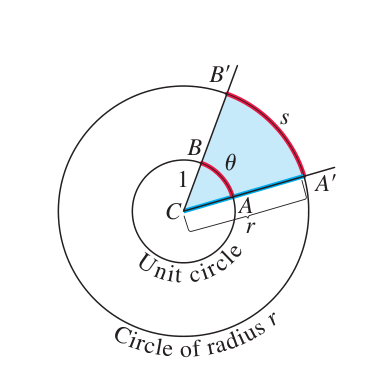 图 1.36 中心角 A'CB' 的弧度量为 θ=s/r。对于半径 r=1 的单位圆，θ 是圆心角 ACB 从单位圆截得的弧 AB 的长度。

如果圆是半径 $r = 1$ 的单位圆，那么由图 1.36 和方程 (1) 可知，以弧度度量的圆心角 $\theta$ 就是该角从单位圆上截得的弧长。由于单位圆转一周是 $360^\circ$ 或 $2\pi$ 弧度，因此有

$$
\pi \text{ 弧度} = 180^\circ \tag{2}
$$

于是 $1$ 弧度 $= 180/\pi$ 度（约 $57.3^\circ$），$1^\circ = \pi/180$ 弧度（约 $0.017$ 弧度）。表 1.1 给出了一些基本角的度数和弧度之间的对应关系。

表 1.1 按度和弧度测量的常用角

| 度数 | $-180^\circ$ | $-135^\circ$ | $-90^\circ$ | $-45^\circ$ | $0^\circ$ | $45^\circ$ | $90^\circ$ | $135^\circ$ | $180^\circ$ |
|---:|---:|---:|---:|---:|---:|---:|---:|---:|---:|
| 弧度 | $-\pi$ | $-3\pi/4$ | $-\pi/2$ | $-\pi/4$ | $0$ | $\pi/4$ | $\pi/2$ | $3\pi/4$ | $\pi$ |

在 $xy$ 平面中，如果一个角的顶点位于原点，且始边沿正 $x$ 轴方向，则称这个角处于标准位置（图 1.37）。从正 $x$ 轴逆时针量得的角取正度量；顺时针量得的角取负度量。

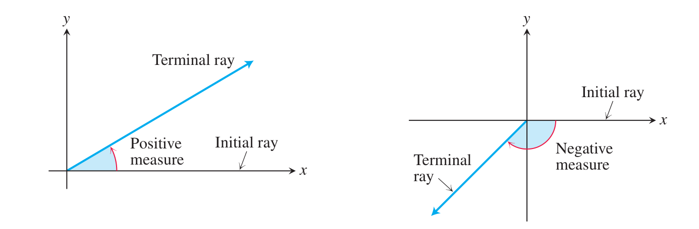 图 1.37 在 xy 平面中处于标准位置的角。

描述逆时针旋转的角可以任意大，超过 $2\pi$ 弧度或 $360^\circ$；同样，描述顺时针旋转的角可以具有各种大小的负度量（图 1.38）。

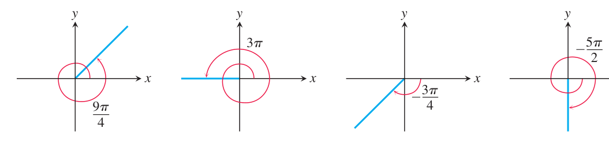 图 1.38 非零弧度量可以是正的，也可以是负的，并且可以超过 2π。

#### 角度约定

从现在起，在本书中除非明确说明使用度数或其他单位，否则所有角都默认用弧度度量。当我们说角 $\pi/3$ 时，指的是 $\pi/3$ 弧度（$60^\circ$），而不是 $\pi/3$ 度。使用弧度可以简化微积分中的许多运算；如果用度数度量角，某些涉及三角函数的结论将不再成立。

### 六个基本三角函数

你可能熟悉用直角三角形的边来定义锐角的三角函数（图 1.39）。

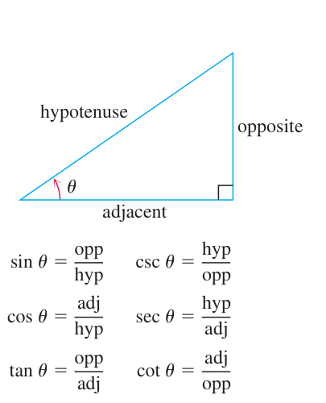 图 1.39 锐角的三角比。

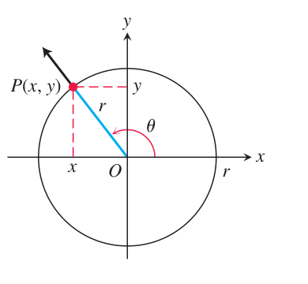 图 1.40 一般角 θ 的三角函数用 x、y 和 r 定义。

我们先把角放在半径为 $r$ 的圆的标准位置中，从而把这个定义扩展到钝角和负角。然后，用角的终边与圆相交的点 $P(x,y)$（图 1.40）的坐标定义三角函数：

$$
\sin \theta = \frac{y}{r}, \qquad \csc \theta = \frac{r}{y},
$$

$$
\cos \theta = \frac{x}{r}, \qquad \sec \theta = \frac{r}{x},
$$

$$
\tan \theta = \frac{y}{x}, \qquad \cot \theta = \frac{x}{y}.
$$

这些扩展定义与锐角时的直角三角形定义一致。注意，在商有定义时，

$$
\tan \theta = \frac{\sin \theta}{\cos \theta}, \qquad
\cot \theta = \frac{\cos \theta}{\sin \theta},
$$

$$
\sec \theta = \frac{1}{\cos \theta}, \qquad
\csc \theta = \frac{1}{\sin \theta}.
$$

可见，如果 $x = \cos \theta = 0$，则 $\tan \theta$ 和 $\sec \theta$ 没有定义；也就是说，当 $\theta$ 为 $\pm \pi/2, \pm 3\pi/2, \ldots$ 时，它们没有定义。同样，当 $y = \sin \theta = 0$，也就是 $\theta = 0, \pm \pi, \pm 2\pi, \ldots$ 时，$\cot \theta$ 和 $\csc \theta$ 没有定义。

一些特殊角的三角函数精确值可以从图 1.41 中的三角形读出。例如：

$$
\begin{array}{lll}
\sin \dfrac{\pi}{4}=\dfrac{\sqrt{2}}{2},&
\sin \dfrac{\pi}{6}=\dfrac{1}{2},&
\sin \dfrac{\pi}{3}=\dfrac{\sqrt{3}}{2},\\[0.8em]
\cos \dfrac{\pi}{4}=\dfrac{\sqrt{2}}{2},&
\cos \dfrac{\pi}{6}=\dfrac{\sqrt{3}}{2},&
\cos \dfrac{\pi}{3}=\dfrac{1}{2},\\[0.8em]
\tan \dfrac{\pi}{4}=1,&
\tan \dfrac{\pi}{6}=\dfrac{\sqrt{3}}{3},&
\tan \dfrac{\pi}{3}=\sqrt{3}.
\end{array}
$$

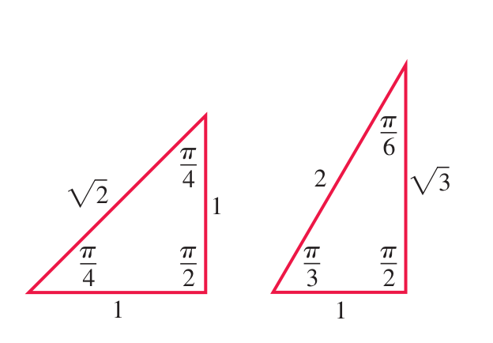 图 1.41 两个常见直角三角形的弧度角和边长。

CAST 规则（图 1.42）有助于记忆各象限中哪些基本三角函数为正、哪些为负。例如，从图 1.43 中的三角形可得：

$$
\sin \frac{2\pi}{3} = \frac{\sqrt{3}}{2}, \qquad
\cos \frac{2\pi}{3} = -\frac{1}{2}, \qquad
\tan \frac{2\pi}{3} = -\sqrt{3}.
$$

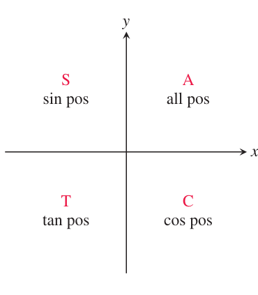 图 1.42 CAST 规则说明各象限中哪些三角函数为正。

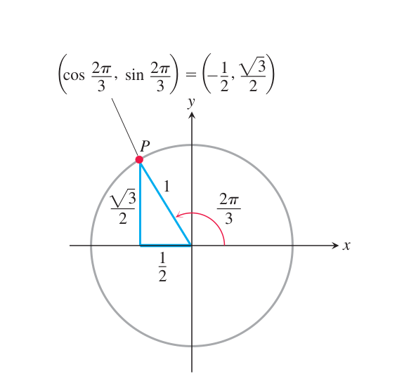 图 1.43 计算 sin(2π/3)、cos(2π/3) 和 tan(2π/3) 的参考三角形。边长来自直角三角形的几何关系。

表 1.2 所选 $\theta$ 的 $\sin \theta$、$\cos \theta$ 和 $\tan \theta$ 的值

| 度数 | $-180^\circ$ | $-135^\circ$ | $-90^\circ$ | $-45^\circ$ | $0^\circ$ | $30^\circ$ | $45^\circ$ | $60^\circ$ | $90^\circ$ | $120^\circ$ | $135^\circ$ | $150^\circ$ | $180^\circ$ | $270^\circ$ | $360^\circ$ |
|---:|---:|---:|---:|---:|---:|---:|---:|---:|---:|---:|---:|---:|---:|---:|---:|
| $\theta$（弧度） | $-\pi$ | $-\frac{3\pi}{4}$ | $-\frac{\pi}{2}$ | $-\frac{\pi}{4}$ | $0$ | $\frac{\pi}{6}$ | $\frac{\pi}{4}$ | $\frac{\pi}{3}$ | $\frac{\pi}{2}$ | $\frac{2\pi}{3}$ | $\frac{3\pi}{4}$ | $\frac{5\pi}{6}$ | $\pi$ | $\frac{3\pi}{2}$ | $2\pi$ |
| $\sin \theta$ | $0$ | $-\frac{\sqrt2}{2}$ | $-1$ | $-\frac{\sqrt2}{2}$ | $0$ | $\frac12$ | $\frac{\sqrt2}{2}$ | $\frac{\sqrt3}{2}$ | $1$ | $\frac{\sqrt3}{2}$ | $\frac{\sqrt2}{2}$ | $\frac12$ | $0$ | $-1$ | $0$ |
| $\cos \theta$ | $-1$ | $-\frac{\sqrt2}{2}$ | $0$ | $\frac{\sqrt2}{2}$ | $1$ | $\frac{\sqrt3}{2}$ | $\frac{\sqrt2}{2}$ | $\frac12$ | $0$ | $-\frac12$ | $-\frac{\sqrt2}{2}$ | $-\frac{\sqrt3}{2}$ | $-1$ | $0$ | $1$ |
| $\tan \theta$ | $0$ | $1$ | 未定义 | $-1$ | $0$ | $\frac{\sqrt3}{3}$ | $1$ | $\sqrt3$ | 未定义 | $-\sqrt3$ | $-1$ | $-\frac{\sqrt3}{3}$ | $0$ | 未定义 | $0$ |

### 三角函数的周期和图像

当一个角的度量为 $\theta$，另一个角的度量为 $\theta + 2\pi$，并且二者都处于标准位置时，它们的终边重合。因此两个角具有相同的三角函数值：

$$
\sin(\theta + 2\pi) = \sin \theta, \qquad \tan(\theta + 2\pi) = \tan \theta,
$$

等等。同样，

$$
\cos(\theta - 2\pi) = \cos \theta, \qquad \sin(\theta - 2\pi) = \sin \theta,
$$

等等。我们说六个基本三角函数是周期函数，正是为了描述这种重复行为。

**定义**

如果存在正数 $p$，使得对每个 $x$ 都有

$$
f(x+p)=f(x),
$$

则函数 $f(x)$ 称为周期函数。满足这一条件的最小正数 $p$ 称为 $f$ 的周期。

三角函数的周期：

$$
\tan(x+\pi)=\tan x, \qquad \cot(x+\pi)=\cot x.
$$

周期 $2\pi$：

$$
\sin(x+2\pi)=\sin x, \qquad \cos(x+2\pi)=\cos x,
$$

$$
\sec(x+2\pi)=\sec x, \qquad \csc(x+2\pi)=\csc x.
$$

当我们在坐标平面中绘制三角函数时，通常用 $x$ 表示自变量，而不是 $\theta$。图 1.44 显示，正切函数和余切函数的周期为 $\pi$，其他四个函数的周期为 $2\pi$。另外，这些图像中的对称性也表明余弦函数和正割函数是偶函数，其他四个函数是奇函数（虽然这并不能构成证明）。

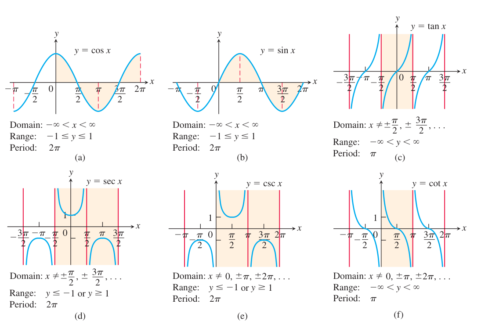 图 1.44 使用弧度测量的六个基本三角函数图像。每个三角函数的阴影部分表示一个周期。

### 三角恒等式

平面中任意点 $P(x,y)$ 的坐标可以用该点到原点的距离 $r$，以及射线 $OP$ 与正 $x$ 轴所成的角 $\theta$ 来表示（图 1.40）。由于 $x/r = \cos \theta$ 且 $y/r = \sin \theta$，我们有

$$
x = r\cos \theta, \qquad y = r\sin \theta.
$$

当 $r = 1$ 时，可以把毕达哥拉斯定理应用到图 1.45 中的参考直角三角形，得到

> 毕达哥拉斯定理：在直角三角形中，若两条直角边长为 $a$ 和 $b$，斜边长为 $c$，则 $a^2+b^2=c^2$。

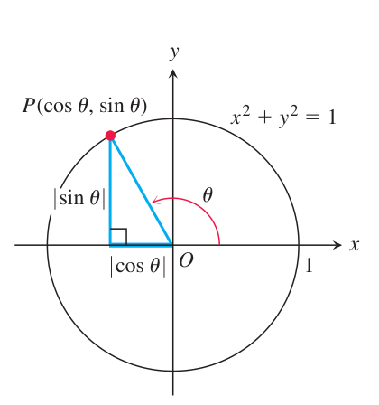 图 1.45 一般角 θ 的参考三角形。

应用毕达哥拉斯定理后，得到下面的基本恒等式：

$$
\boxed{\displaystyle \cos^2 \theta + \sin^2 \theta = 1\qquad(3)}
$$

这个等式对 $\theta$ 的所有值都成立，是三角学中最常用的恒等式。依次用 $\cos^2 \theta$ 和 $\sin^2 \theta$ 去除这个恒等式，可得

$$
\boxed{\displaystyle \begin{gathered}1+\tan^2 \theta=\sec^2 \theta\\[4pt]1+\cot^2 \theta=\csc^2 \theta\end{gathered}}
$$

下面的公式对所有角 $A$ 和 $B$ 都成立（练习 58）。

$$
\boxed{\begin{gathered}\text{加法公式}\\[4pt]\begin{aligned}\cos(A+B) &= \cos A \cos B-\sin A \sin B \\ \sin(A+B) &= \sin A \cos B+\cos A \sin B\end{aligned}\qquad(4)\end{gathered}}
$$

对于 $\cos(A-B)$ 和 $\sin(A-B)$ 也有类似的公式（练习 35 和 36）。本书所需的所有三角恒等式都可以由方程 (3) 和 (4) 推出。例如，在加法公式中用 $\theta$ 同时代替 $A$ 和 $B$，得到

$$
\boxed{\begin{gathered}\text{倍角公式}\\[4pt]\begin{aligned}\cos 2\theta &= \cos^2 \theta-\sin^2 \theta \\ \sin 2\theta &= 2\sin \theta \cos \theta\end{aligned}\qquad(5)\end{gathered}}
$$

还可以由下面两个方程联立得到更多公式：

$$
\cos^2 \theta+\sin^2 \theta=1, \qquad
\cos^2 \theta-\sin^2 \theta=\cos 2\theta.
$$

把这两个方程相加，得到 $2\cos^2 \theta=1+\cos 2\theta$；用第一个方程减去第二个方程，得到 $2\sin^2 \theta=1-\cos 2\theta$。于是得到下面的恒等式，它们在积分学中很有用。

$$
\boxed{\begin{gathered}\text{半角公式}\\[4pt]\begin{array}{rl}\cos^2 \theta &= \dfrac{1+\cos 2\theta}{2}\qquad(6)\\[6pt]\sin^2 \theta &= \dfrac{1-\cos 2\theta}{2}\qquad(7)\end{array}\end{gathered}}
$$

### 余弦定理

如果 $a$、$b$、$c$ 是三角形 $ABC$ 的边长，且 $\theta$ 是边 $c$ 所对的角，那么

$$
\boxed{\displaystyle c^2 = a^2 + b^2 - 2ab\cos \theta\qquad(8)}
$$

这就是余弦定理。我们可以看到，如果像图 1.46 一样，在三角形的一侧引入以 $C$ 为原点、以正 $x$ 轴为一边的坐标系，那么 $A$ 的坐标为 $(b,0)$，$B$ 的坐标为 $(a\cos \theta,a\sin \theta)$。因此，$A$ 与 $B$ 之间距离的平方为

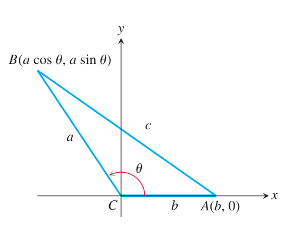 图 1.46 A 和 B 之间距离的平方给出了余弦定理。

由图中两点的距离公式，得到

$$
\begin{aligned}
c^2
&= (a\cos \theta-b)^2 + (a\sin \theta)^2 \\
&= a^2(\cos^2 \theta+\sin^2 \theta)+b^2-2ab\cos \theta \\
&= a^2+b^2-2ab\cos \theta
\end{aligned}
$$

余弦定理推广了毕达哥拉斯定理。如果 $\theta = \pi/2$，则 $\cos \theta = 0$，于是 $c^2 = a^2 + b^2$。

### 两个特殊不等式

对于用弧度度量的任意角 $\theta$，正弦函数和余弦函数满足下面的不等式。

$$
\boxed{\displaystyle -\lvert\theta\rvert \le \sin \theta \le \lvert\theta\rvert, \qquad -\lvert\theta\rvert \le 1-\cos \theta \le \lvert\theta\rvert.}
$$

为了确定这些不等式，我们将 $\theta$ 描绘为标准位置的非零角（图 1.47）。图中的圆是单位圆，因此 $|\theta|$ 等于圆弧 $AP$ 的长度。于是线段 $AP$ 的长度小于 $|\theta|$。三角形 $APQ$ 是直角三角形，长度为 $QP = |\sin \theta|$，$AQ = 1-\cos \theta$。由毕达哥拉斯定理以及 $AP < |\theta|$ 可得

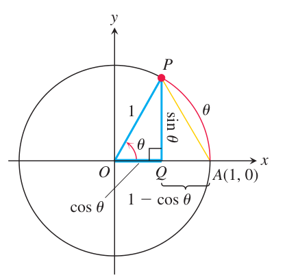 图 1.47 从这个为 θ > 0 绘制的图的几何关系中，可以得到不等式 sin² θ + (1-cos θ)² ≤ θ²。

于是相应的公式为

$$
\sin^2 \theta + (1-\cos \theta)^2 = (AP)^2 \le \theta^2 \tag{9}
$$

方程 (9) 左边的各项都是非负的，因此每一项都不超过它们的和，也就小于或等于 $\theta^2$。这等价于

$$
|\sin \theta| \le |\theta|, \qquad |1-\cos \theta| \le |\theta|
$$

这些不等式将在下一章用到。

### 三角函数图像的变换

移位、伸展、压缩和反射函数图像的规则同样适用于本节讨论的三角函数。

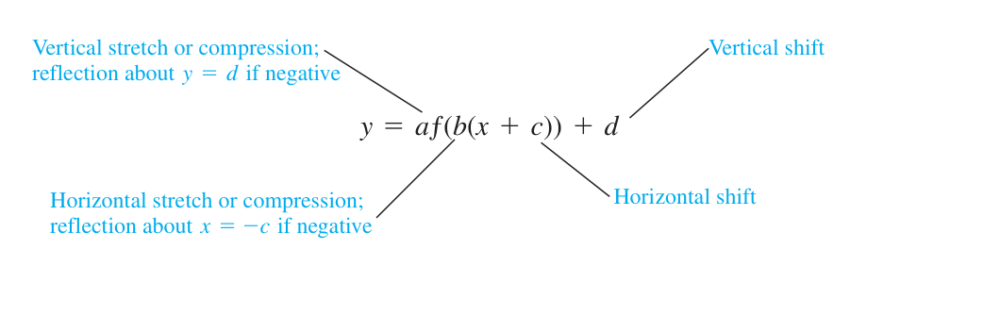 三角函数图像的变换规则。

适用于正弦函数的变换规则给出一般正弦函数（或 sinusoid）公式

$$
f(x) = A\sin\left(\frac{2\pi}{B}(x-C)\right)+D
$$

其中 $|A|$ 为振幅，$|B|$ 为周期，$C$ 为水平移位，$D$ 为垂直移位。图中各个术语可以通过曲线

$$
y=A\sin\left(\frac{2\pi}{B}(x-C)\right)+D
$$

来解释：中线为 $y=D$，振幅为 $|A|$，周期为 $|B|$。

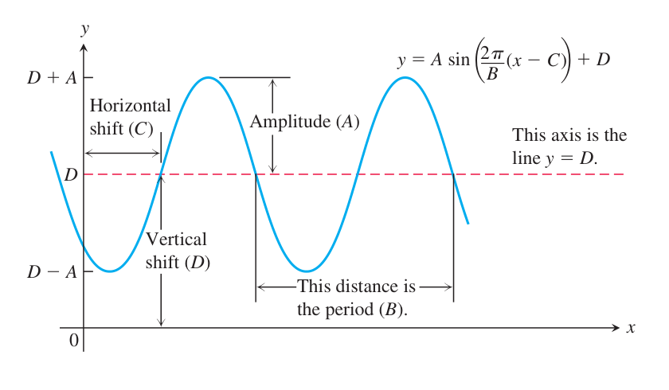 一般正弦函数各参数的图形意义。

## 1.4 使用软件作图

今天，一些硬件设备，包括计算机、计算器和智能手机，都有基于软件的作图应用，使我们能够高精度地绘制非常复杂的函数图。其中许多函数并不容易手工绘制。然而，使用这种作图软件时必须谨慎；在本节中，我们讨论可能出现的一些问题。在第四章中，我们将看到微积分如何帮助我们判断自己是否已经准确看到了函数图的所有重要特征。

### 图形窗口

使用软件作图时，图像的一部分会显示在显示窗口或查看窗口中。根据软件的不同，默认窗口可能给出不完整或误导性的图像。

当两个坐标轴上的单位长度或比例相同时，我们称其为正方形窗口。这个术语并不意味着显示窗口本身是正方形（它通常是矩形），而是表示 x 单位与 y 单位的长度相同。当图像以默认模式显示时，x 单位可能与 y 单位的缩放不同，以便捕捉图像的基本特征。这种缩放差异会导致视觉扭曲，从而可能造成对函数行为的错误解释。

一些作图软件允许我们通过指定一个或两个区间来设置查看窗口，例如 $a \le x \le b$ 和 $c \le y \le d$，也可能允许把两个轴所用的尺度设为相同。软件会在 $[a,b]$ 中选择等距的 $x$ 值，然后绘制点 $(x, f(x))$。只有当 $x$ 位于函数定义域中且 $f(x)$ 位于区间 $[c,d]$ 内时，点才会被绘制。随后，软件在每个绘图点和它的下一个相邻点之间绘制一条短线段。下面的例子说明这一过程可能产生的一些常见问题。

**例 1** 作函数 $f(x)=x^3-7x^2+28$ 的图像。

三个显示窗口分别为：

1. $[-10,10]\times[-10,10]$；
2. $[-4,4]\times[-50,10]$；
3. $[-4,10]\times[-60,60]$。

**解：**

(a) 我们选择 $a=-10,\ b=10,\ c=-10,\ d=10$ 来指定 $x$ 值的区间和窗口中的 $y$ 值范围。由此得到的图像见图 1.48a。这个窗口似乎截去了图像下部，而且 $x$ 值范围过大。我们试试下一个窗口。

图 1.48
$f(x)=x^3-7x^2+28$ 在不同查看窗口中的图像。选择一个能清晰显示图像的窗口，往往需要试验和调整（例 1）。软件使用的默认窗口可以自动显示 (c) 中的图像。(b) 我们看到图中出现了一些新特征（图 1.48b），但顶部缺失，并且需要在右侧看到更多 $x=4$ 附近的图像。下一扇窗口会有帮助。(c) 图 1.48c 显示新的查看窗口中的图像。观察可知，在这个窗口里得到的图像更完整，表现为一个合理的三次多项式图像。

**例 2** 当显示一个图像时,x单位可能与y单位不同,如:

图 1.48b 和图 1.48c 所示图像。其结果是画面出现扭曲，可能令人误解。显示窗口可以通过压缩或拉伸一个轴上的单位来制成正方形，以配合另一个轴上的尺度，从而给出真实图像。许多软件系统都有内置选项让窗口“平方”。图 1.49a 在非正方形窗口 $[-4,4]\times[-6,8]$ 中显示直线 $y=x$ 和 $y=-x+\sqrt{32}$，以及半圆 $y=\sqrt{9-x^2}$ 的图像。注意其中的扭曲：直线看起来并不垂直，半圆看起来像椭圆。图 1.49b 在正方形窗口中显示相同函数的图像，其中 $x$ 单位和 $y$ 单位的缩放相同。图 1.49c 显示图 1.49b 的放大视图，即正方形窗口 $[-3,3]\times[0,4]$。如果有理函数的分母在查看窗口内的某个 $x$ 值处为零，作图软件可能会产生一条从窗口上方到下方的陡峭近竖直线段。例 3 说明了这种陡峭线段。有时三角函数图像会快速振荡。当作图软件绘制并连接图像上的点时，许多最大值和最小值实际上会被遗漏，结果得到的图像可能非常误导人。

**例 3** 作函数 $f(x)=\sin(100x)$ 的图像。

**解：**

图 1.50a 显示了 $f$ 在查看窗口 $[-12,12]\times[-1,1]$ 中的图像。这个图看起来很奇怪，因为正弦曲线应当在 $-1$ 和 $1$ 之间周期性振荡，但图 1.50a 没有表现出这种行为。我们也许会尝试较小的查看窗口，例如 $[-6,6]\times[-1,1]$，但图像并没有变好（图 1.50b）。困难在于三角函数 $y=\sin(100x)$ 的周期非常小：

$$
\frac{2\pi}{100}\approx 0.063
$$

如果选择更小的查看窗口 $[-0.1,0.1]\times[-1,1]$，就得到图 1.50c 所示的图像。该图显示出正弦曲线预期的振荡情况。

图 1.49
直线 $y=x$ 和 $y=-x+\sqrt{32}$，以及半圆 $y=\sqrt{9-x^2}$ 的图像在非正方形窗口中显示为扭曲的 (a)，但在正方形窗口中显示清晰 (b) 和 (c)（例 2）。有些软件可能无法提供 (b) 或 (c) 中的查看选项。 (a)-1-12(b)-1-6(c)-1 0.1-0.1

图 1.50
函数 $y=\sin(100x)$ 在三个查看窗口中的图像。由于周期为 $2\pi/100\approx0.063$，所以 (c) 中较小的窗口最能显示这种快速振荡函数的真实形态（例 3）。

**例 4**

图形函数 y = cos x + 200sin 200x.

**解：**

在查看窗口 $[-6,6]\times[-1,1]$ 中，图像看起来很像余弦函数，上面有一些非常小而尖锐的扰动（图 1.51a）。当我们把窗口大幅缩小到 $[-0.2,0.2]\times[0.97,1.01]$，得到图 1.51b 中的图像时，就能观察得更清楚。现在可以看到第二项 $\frac{1}{200}\sin(200x)$ 产生的小而快速的振荡，叠加在较大的余弦曲线上。

### 获取完整图像

某些作图软件在 $x<0$ 时不会显示 $f(x)$ 的图像部分。这通常是软件用来计算函数值的算法造成的。有时可以通过用不同方式定义函数公式来获得完整图像，如下例所示。

**例 5** 作函数 $y=x^{1/3}$ 的图像。

**解：**

一些作图软件会显示图 1.52a 所示的图像。把它与图 1.17 中 $y=x^{1/3}=\sqrt[3]{x}$ 的图像比较，可以看到 $x<0$ 的左分支缺失。图像不同的原因是，软件算法把 $x^{1/3}$ 计算为

$$
e^{(1/3)\ln x}。
$$

由于对数函数没有为负的 $x$ 值定义，软件只能产生 $x>0$ 的右分支。（对数函数和指数函数将在接下来的两节介绍。）(a)-1-6(b) 1.01 0.97 0.2-0.2。

图 1.51
在(b)中,我们看到函数 y = cos x + 200sin 200x图中的特写视图(a)。 该术语cos x显然主导了第二个术语,即1,200sin 200x,该术语沿余弦曲线产生快速振荡. 两种观点都需要对图像有一个明确的概念(例4)。 (a)-2-3(b)-2-3。

图 1.52
$y=x^{1/3}$ 的图像在 (a) 中缺少左分支。在 (b) 中，我们绘制函数

$$
f(x)=x|x|^{-2/3}
$$

从而得到两个分支（见例 5）。为了获得显示两个分支的完整图像，可以绘制这个函数。除 $x=0$ 外，它等于 $x^{1/3}$。图 1.52b 显示了 $f$ 的图像。

### 把握收集数据的趋势

我们已指出，应用科学家和分析员经常收集数据，研究某一具体问题或感兴趣的现象。如果没有已知的原理或物理定律把自变量和因变量联系起来，就可以把数据绘制成散点图，以帮助寻找能够捕捉数据点总体趋势的曲线。这个过程称为回归分析，相应的曲线称为回归曲线。

许多作图工具都带有软件，可以寻找某一类曲线的回归曲线（例如直线、二次曲线、其他多项式曲线或幂曲线），然后把所得曲线叠加到散点图上。这一过程产生有用的图形化显示，而回归曲线的公式往往可用于作出合理估计，或帮助解释所研究的问题。一种常见方法称为最小二乘法，它通过最小化数据点与曲线之间竖直距离的平方和来找到理想的回归曲线。最小二乘法是一个优化问题。（在第 14.7 节练习中，我们将讨论如何计算与数据相关联的回归直线。）下面举几个例子，说明如何利用现有软件寻找曲线。请记住，不同软件包可能有不同的数据点输入方式，也有不同的输出特征。

**例 6** 表1.3显示年度学费和全日学费。

1990-2011年就读于加利福尼亚大学。 列表中的数据引用了相应成本生效的学年开始时间. 使用该表查找一条反映数据点趋势的回归线,并使用该线估算2018-19学年的费用.

**解：**

我们使用可以拟合直线的回归软件，把表格中的数据输入后得到公式

$$
y=506.25x-1.0066\times10^6,
$$

其中 $x$ 表示年份，$y$ 表示当年生效的费用。图 1.53 显示数据散点和这条回归线的图像。由该直线方程可得，当 $x=2018$ 时，

$$
y=506.25(2018)-1.0066\times10^6=15013。
$$

因此，2018-19 学年的估计费用为 $15{,}013$ 美元（四舍五入到最接近的美元）。最后两个数据点高于图中的趋势线，因此这一估计可能偏低。2 000 6 000 4 000 12 000 10 000 8 000 14 000 xy

图 1.53
加利福尼亚大学学费和学费的分层和回归线从表1.3(例6)。

1.3 学费
4 166 3 964 6 802 11 287 13 218

**例 7** 疾病控制和预防中心记录了死亡情况。

1970-2006年来自美国的肺结核患者。 我们在表1.4中列出了每5年的数据。 查找能捕捉数据点趋势的线性回归曲线和二次回归曲线。 哪个曲线可能是更好的预测器?

**解：**

使用可以拟合直线和二次曲线的回归软件，输入数据后得到线性拟合

$$
y=2.2279\times10^5-111.04x,
$$

以及二次拟合

$$
y=1451.350x^2-3483953x+464757147,
$$

其中 $x$ 代表年份，$y$ 代表死亡人数。图 1.54 显示数据散点以及两条趋势曲线。从图中看，除 1990 年和 1995 年外，二次曲线似乎更接近数据趋势，也可能给出更好的预测。然而，二次曲线似乎在接近 2000 年时达到最小值，此后上升，因此很可能不适合用于 2010 年以后的估计。这个例子说明了用回归曲线预测超出建模数据范围的值存在风险。

1.4 美国死于
结核病年份,x死亡,y5 217人

图 1.54
根据表1.4(例7),美国结核病死亡率带有回归线和四曲线的散点。

## 1.5 指数函数

指数函数是数学中最重要的函数之一，并广泛出现在各种应用中，包括利率、放射性衰变、人口增长、疾病传播、自然资源消耗、地球大气压力、放在较冷环境中的热物体的温度变化，以及化石年代测定等。在本节中，我们用直观方式非正式地介绍这些函数。第七章将根据重要的微积分思想和结果对它们作严格讨论。

### 指数行为

当正数 $P$ 加倍时，它增加到原来的 $2$ 倍，变为 $2P$。如果再次加倍，就变为 $2(2P)=2^2P$；第三次加倍给出 $2(2^2P)=2^3P$。持续这样加倍，会引导我们考虑函数

$$
f(x)=2^x。
$$

我们称它为指数函数，因为变量 $x$ 出现在 $2^x$ 的指数中。$g(x)=10^x$ 和 $h(x)=(1/2)^x$ 等函数也是指数函数的例子。一般地，如果 $a\ne1$ 是正常数，则函数

$$
f(x)=a^x,\qquad a>0
$$

称为以 $a$ 为底的指数函数。

**例 1** 2014年,100美元被投资到一个储蓄账户,通过该账户增长

(a) 每年(每年一次)以5.5%的利率累积利息。 假设没有将额外资金存入账户,也没有提取任何资金,则给出一个公式,说明账户中X年之后的A数额。

**解：**

如果 $P=100$，则第一年结束时，账户中的金额是原始金额加上应计利息：

$$
P+\frac{5.5}{100}P=(1+0.055)P=1.055P。
$$

第二年结束时，账户再次赚取利息，并增长到

$$
(1+0.055)(1.055P)=1.055^2P=100(1.055)^2。
$$

不要将指数函数 $2^x$ 与幂函数 $x^2$ 混淆。在指数函数中，变量 $x$ 位于指数中；而在幂函数中，变量 $x$ 是底数。继续这一过程，$x$ 年之后账户的值为

$$
A=100(1.055)^x。
$$

这是以 $1.055$ 为底的指数函数的常数倍。表 1.5 显示前四年的应计金额。注意，该账户每年的金额总是上一年金额的 $1.055$ 倍。

表 1.5
金额(美元) 增加(美元) $100(1.055)=105.50$ 5.50；$100(1.055)^2=111.30$ 5.80；$100(1.055)^3=117.42$ 6.12；$100(1.055)^4=123.88$ 6.46。一般来说，$x$ 年后的金额由

$$
P(1+r)^x
$$

给出，其中 $r$ 为以小数表示的利率。对于整数和有理指数，指数函数 $f(x)=a^x$ 的值按以下方式计算。如果 $x=n$ 是正整数，则

$$
a^n = \underbrace{a\cdot a\cdots a}_{n\text{ 个因子}}。
$$

如果 $x=0$，则 $a^0=1$；如果 $x=-n$，其中 $n$ 是正整数，则 $a^{-n}=1/a^n$。如果 $x=1/n$，其中 $n$ 是正整数，则 $a^{1/n}=\sqrt[n]{a}$。如果 $x=p/q$ 是任意有理数，则

$$
a^{p/q}=\sqrt[q]{a^p}=(\sqrt[q]{a})^p。
$$

如果 $x$ 是无理数，$a^x$ 的意义并不那么直接，但可以通过考虑越来越接近 $x$ 的有理数指数来定义。第七章将严格定义这一含义。图 1.55 再次显示了若干指数函数图像；这些图像表示所有实数输入 $x$ 的指数函数值。选择无理数 $x$ 对应的 $a^x$ 值，是为了使函数 $f(x)=a^x$ 连续。这个概念将在下一章仔细讨论。这样可以保证当 $a>1$ 时图像保持递增，当 $0<a<1$ 时图像保持递减（见图 1.55）。

图 1.55
指数函数图。

接着考虑下面这个数列，它由 $\sqrt3$ 的十进制近似值作为指数得到：

$$
2^1,\ 2^{1.7},\ 2^{1.73},\ 2^{1.732},\ 2^{1.7320},\ldots \tag{1}
$$

我们知道数列 (1) 中每个数的意义，因为 $1,1.7,1.73,1.732,\ldots$ 都是有理数，并且越来越接近 $\sqrt3$。随着这些指数越来越接近 $\sqrt3$，数列 (1) 也越来越接近某个固定的数，我们把这个数定义为 $2^{\sqrt3}$。表 1.6 显示了这些近似值如何趋近于

$$
2^{\sqrt3}\approx3.321997086.
$$

实数的完备性（附录 7 简要讨论）保证这个过程给出一个唯一的实数。同样的方法也可以定义任意无理数 $x$ 对应的 $2^x$（更一般地，定义 $a^x,\ a>0$）。这样一来，指数函数图像上就不会因为无理数指数而出现“空洞”。

在实际计算中，可以用计算器取 $x$ 的连续小数近似，并建立类似表 1.6 的表格来近似 $a^x$。指数函数遵循下面列出的常用规则。当指数是整数或有理数时，这些规则可以用代数方法验证；对所有实数指数的证明将在第 4 章和第 7 章中给出。

表 1.6 当 $r$ 更接近 $\sqrt3$ 时，$2^r$ 的值

| $r$ | $2^r$ |
|---:|---:|
| $1.0$ | $2.000000000$ |
| $1.7$ | $3.249009585$ |
| $1.73$ | $3.317278183$ |
| $1.732$ | $3.321880096$ |
| $1.7320$ | $3.321880096$ |
| $1.73205$ | $3.321995226$ |
| $1.732050$ | $3.321995226$ |
| $1.7320508$ | $3.321997068$ |
| $1.732080$ | $3.322053086$ |

### 指数规则

如果 $a>0$ 且 $b>0$，则对所有实数 $x$ 和 $y$，下列规则都成立：

1. $a^x a^y = a^{x+y}$
2. $\dfrac{a^x}{a^y}=a^{x-y}$
3. $(a^x)^y=a^{xy}$
4. $a^x b^x=(ab)^x$
5. $\dfrac{a^x}{b^x}=\left(\dfrac{a}{b}\right)^x$

**例 2** 我们说明如何利用指数规则来简化数值表达式。

1. $3^{1.1}\cdot 3^{0.7}=3^{1.1+0.7}=3^{1.8}$（规则 1）
2. $7^p\cdot 8^p=(56)^p$（规则 4）
3. $\left(\dfrac{4}{9}\right)^{1/2}=\dfrac{4^{1/2}}{9^{1/2}}=\dfrac{2}{3}$（规则 5）

### 自然指数函数

用于模拟自然、物理和经济现象的最重要指数函数是自然指数函数，其底数是特殊常数 e。数 e 是无理数，其值约为 2.718281828（保留到小数点后 9 位）。在第 3.8 节中，我们将给出计算 e 值的方法。

用这个数作为底数，而不是用 $2$ 或 $10$ 这样的简单数，起初可能显得奇怪。使用 $e$ 作为底数的优点在于，它简化了微积分中的许多计算。如果观察图 1.55a，可以看到指数函数 $y=a^x$ 的图像会随着底数 $a$ 增大而变陡。这种陡峭程度可以通过图像在某一点处切线的斜率来表达。函数图像的切线将在下一章精确定义；直观地说，图像上一点处的切线就是“刚好接触”该点的直线，类似圆的切线。图 1.56 显示了几个 $a$ 值对应的 $y=a^x$ 图像在 $y$ 轴交点处的斜率。注意，当 $a=e$ 时，斜率恰好等于 $1$。这就是数 $e$ 在微积分中如此有用的性质：$y=e^x$ 的图像在 $y$ 轴交点处的斜率为 $1$。

### 指数增长和衰减

指数函数 $y=e^{kx}$（其中 $k$ 为非零常数）常用于模拟指数增长或衰减。函数

$$
y=y_0e^{kx}
$$

在 $k>0$ 时是指数增长模型，在 $k<0$ 时是指数衰减模型。这里 $y_0$ 表示常数。

指数增长的一个例子是用

$$
y=Pe^{rt}
$$

模拟连续复利，其中 $P$ 是初始投资金额，$r$ 是以小数表示的利率，$t$ 是与 $r$ 单位一致的时间。指数衰减的一个例子是模型

$$
y=Ae^{-1.2\times10^{-4}t},
$$

它表示放射性同位素碳-14 如何随时间衰减。这里 $A$ 是碳-14 的初始量，$t$ 是以年为单位的时间。碳-14 衰变至今被用于贝壳、种子、木质文物等生物遗骸的年代测定。图 1.57 显示了指数增长和指数衰减的图像。xy m = 0.7 (a)y = 2 x y (c) m = 1.1 y = 3 x y (b) m = 1 y = e x

图 1.56
在指数函数中，$y=e^x$ 的图像具有这样的性质：图像在穿过 $y$ 轴时切线斜率恰好为 $1$。底数小于 $e$ 的函数（如 $2^x$）斜率小于 $1$；底数大于 $e$ 的函数（如 $3^x$）斜率大于 $1$。

图 1.57
(a) 指数增长，$k=1.5>0$；(b) 指数衰减，$k=-1.2<0$。 (b) 0.5 0.6 0.2 1.5 1.4 2.5-0.5-0.5 $y=e^{-1.2x}$ $y=e^{1.5x}$ (a) 1.5 0.5 - 1 xy xy

**例 3** 投资公司通常使用模型 $y=Pe^{rt}$ 计算

投资的增长。 利用这一模式跟踪2014年投资100美元的增长,年利率为5.5%.

**解：**

令 $t=0$ 代表 2014 年，$t=1$ 代表 2015 年，依此类推。指数增长模型为

$$
y(t)=Pe^{rt},
$$

其中 $P=100$（初始投资），$r=0.055$（以小数表示的年利率），$t$ 是年数。为了预测 2018 年账户中的金额，经过 4 年，取 $t=4$，计算

$$
y(4)=100e^{0.055(4)}=100e^{0.22}=124.61
$$

与此相比，例 1 中每年计息得到的账户金额为 $123.88$ 美元。

**例 4** 实验室实验显示,一些原子释放出一部分

质量作为辐射，其余的原子会重新形成某种新元素的原子。例如，放射性碳-14 衰变为氮；镭最终衰变为铅。如果 $y_0$ 是 $t=0$ 时存在的放射性原子核数量，则以后任意时间 $t$ 仍然存在的数量为

$$
y=y_0e^{-rt}, \qquad r>0
$$

数 $r$ 称为该放射性物质的衰变率（第 7.2 节会说明这个公式如何得到）。对于碳-14，当 $t$ 以年为单位时，实验确定其衰变率约为

$$
r=1.2\times10^{-4}
$$

预测 866 年后还剩多少百分比的碳-14。

**解：**

如果我们从 $y_0$ 个碳-14 原子核开始，866 年后剩下的数量为

$$
y(866)=y_0e^{(-1.2\times10^{-4})(866)}\approx(0.901)y_0
$$

也就是说，866 年后约剩下原来 $90\%$ 的碳-14，所以大约 $10\%$ 的原子核已经衰变。下一节例 7 将说明如何求样品中一半放射性原子核衰变所需的年数（称为物质的半衰期）。你可能会问，为什么我们用函数族 $y=e^{kx}$ 来表示不同常数 $k$ 的情形，而不是使用一般指数函数 $y=a^x$。下一节会说明，对适当的 $k$，指数函数 $a^x$ 等于 $e^{kx}$。因此公式 $y=e^{kx}$ 覆盖了所有可能性，而且更容易使用。

## 1.6 反函数和对数

撤销或倒置一个函数 $f$ 的效果的函数称为 $f$ 的逆函数。许多常见函数（虽然不是全部）都具有反函数。在本节中，我们把自然对数函数 $y=\ln x$ 作为指数函数 $y=e^x$ 的反函数来讨论，并给出若干反三角函数的例子。

### 一一函数

一个函数是一个规则，它把值域中的一个值分配给定义域中的每个元素。一些函数会把定义域中的多个元素分配到相同的值。函数 $f(x)=x^2$ 把数字 $-1$ 和 $+1$ 都分配到同一个值 $1$；$\pi/3$ 和 $2\pi/3$ 的正弦值都是 $\sqrt{3}/2$。另一些函数在其值域中的每个值至多取到一次。不同数字的平方根和立方总是不同的。在定义域中不同元素处具有不同函数值的函数称为一对一函数。这类函数在其值域中每个值恰好取到一次。

**定义**

函数 $f(x)$ 在定义域 $D$ 上是一对一的，如果只要 $x_1\ne x_2$（且 $x_1,x_2\in D$），就有

$$
f(x_1)\ne f(x_2)
$$

**例 1** 一些函数在其整个自然域上是一对一的. 其他人员

有些函数并不在整个定义域上是一对一的，但通过把定义域限制在较小的区间上，可以得到一对一函数。原函数和受限函数不是同一个函数，因为它们的定义域不同；但二者在较小定义域上的函数值相同，因此原函数可以看作受限函数从较小定义域到较大定义域的延伸。

(a) $f(x)=\sqrt{x}$ 在任意非负数定义域上是一对一的，因为只要 $x_1\ne x_2$，就有 $\sqrt{x_1}\ne\sqrt{x_2}$。

(b) $g(x)=\sin x$ 在区间 $[0,\pi]$ 上不是一对一的，因为

$$
\sin\frac{\pi}{6}=\sin\frac{5\pi}{6}
$$

事实上，对于子区间 $[0,\pi/2)$ 中的每个元素 $x_1$，在子区间 $(\pi/2,\pi]$ 中都有相应的元素 $x_2$ 满足 $\sin x_1=\sin x_2$，因此定义域中不同的元素被分配到值域中的相同值。但是，正弦函数在 $[0,\pi/2]$ 上是一对一的，因为它在该区间上递增，对不同输入给出不同输出。

一对一函数 $y=f(x)$ 的图像最多与任意给定水平线相交一次。如果函数图像与某条水平线相交超过一次，就说明它至少对两个不同的 $x$ 值取到相同的 $y$ 值，因此不是一对一的（图 1.58）。

图 1.58
(a) $y=x^3$ 和 $y=\sqrt{x}$ 分别在其定义域 $(-\infty,\infty)$ 和 $[0,\infty)$ 上是一对一的；(b) $y=x^2$ 和 $y=\sin x$ 在其定义域上不是一对一的。

水平线检验：函数 $y=f(x)$ 是一对一的，当且仅当其图像最多与每条水平线相交一次。

### 反函数

由于一对一函数的每个输出都只来自一个输入,所以函数的效果可以倒转,将一个输出送回它来自的输入.

**定义**

假设 $f$ 是定义域 $D$ 上的一对一函数，值域为 $R$。反函数 $f^{-1}$ 定义为

$$
f^{-1}(b)=a \quad \text{当且仅当} \quad f(a)=b
$$

$f^{-1}$ 的定义域为 $R$，值域为 $D$。符号 $f^{-1}$ 读作“$f$ 的反函数”。$f^{-1}$ 中的 $-1$ 不是指数；$f^{-1}(x)$ 并不表示 $1/f(x)$。注意，$f$ 和 $f^{-1}$ 的定义域与值域相互交换。

**例 2** 假设一对一函数y=f(x)由数值表给出

注意点：不要将反函数 $f^{-1}$ 与倒数函数 $1/f$ 混淆。$x$、$f(x)$ 的值表可以通过交换行列得到 $x=f^{-1}(y)$ 的值表。

如果我们把输入 $x$ 送入 $f$ 得到输出 $f(x)$，再把 $f^{-1}$ 应用于 $f(x)$，就会直接回到 $x$。类似地，如果我们取 $f$ 值域中的某个 $y$，先应用 $f^{-1}$，再把 $f$ 应用于所得的 $f^{-1}(y)$，就会回到原来的 $y$。也就是说，一个函数与它的反函数复合，效果等同于什么都不做：

$$
(f^{-1}\circ f)(x)=x,
$$

$$
(f\circ f^{-1})(y)=y
$$

只有一对一函数才有反函数。原因是，如果 $f(x_1)=y$ 且 $f(x_2)=y$ 对两个不同输入 $x_1$ 和 $x_2$ 都成立，那么无法给 $f^{-1}(y)$ 指定一个同时满足 $f^{-1}(f(x_1))=x_1$ 和 $f^{-1}(f(x_2))=x_2$ 的值。当 $x_2>x_1$ 时，如果某函数在区间上递增，则有 $f(x_2)>f(x_1)$，因此它是一对一的，并且有反函数。递减函数也有反函数。不增不减的函数仍然可能是一对一的，并且可能有反函数。

#### 求反函数

一个函数的图像和它的反函数图像密切相关。要从图像中读取函数值，我们从 $x$ 轴上的点 $x$ 开始，垂直到图像上，然后水平移动到 $y$ 轴读取 $y$ 的值。反函数可以通过反转这一过程从图中读取：从 $y$ 轴上的点 $y$ 开始，水平移动到 $y=f(x)$ 的图像上，然后垂直移动到 $x$ 轴，读取 $x=f^{-1}(y)$ 的值（图 1.59）。x y x y RANGE OF f DOMAIN OF f (a) 要找到x时的f值,我们从x开始,到曲线,然后到y轴. y = f(x) x y y DOMAIN of f -1 RANGE of f -1 x = f -1(y) (b) f -1的图是f的图,但与x和y互换. 为了找到给y的x, 我们从y开始,然后到曲线, 下到x轴。 f -1的域是f的范围. f -1的范围是f y x (b, a) (a, b) y = x x = f -1 (y) RANGE OF f -1 DOMAIN OF f -1 (c) 为了以更通常的方式绘制f -1的图像,我们反映跨线的系统 y = x x y = f -1 RANGE OF f -1 y = f -1 (x) (d) 然后我们交换字母 x 和 y. 我们现在有一个f-1的正常外观图,作为x的函数.

图 1.59
$y=f^{-1}(x)$ 的图像可以通过把 $y=f(x)$ 的图像关于直线 $y=x$ 反射得到。我们希望把 $f^{-1}$ 的图像画成通常的函数图像形式，使输入值沿 $x$ 轴排列，而不是沿 $y$ 轴排列。为此，通过关于 $45^\circ$ 直线 $y=x$ 反射来交换 $x$ 轴和 $y$ 轴。图 1.59 显示了 $f$ 和 $f^{-1}$ 图像之间的关系。

从 $f$ 求 $f^{-1}$ 的过程可以归纳为两步：

1. 从公式 $y=f(x)$ 中解出 $x$。这会给出公式 $x=f^{-1}(y)$，其中 $x$ 表示为 $y$ 的函数。
2. 交换 $x$ 和 $y$，得到公式 $y=f^{-1}(x)$，其中 $f^{-1}$ 以常规形式表示，$x$ 为自变量，$y$ 为因变量。

**例 3** 求函数 $y=\frac{1}{2}x+1$ 的反函数，并把它表示为 $x$ 的函数。

**解：**

1. 先由

$$
y=\frac{1}{2}x+1
$$

解出 $x$。该图像是一条通过水平线检验的直线（图 1.60）：

$$
2y=x+2,\qquad x=2y-2
$$

2. 交换 $x$ 和 $y$，得到

$$
y=2x-2
$$

因此，$f(x)=\frac{1}{2}x+1$ 的反函数为

$$
f^{-1}(x)=2x-2
$$

为了检查，我们验证两种复合都给出恒等函数：

$$
f^{-1}(f(x))=2\left(\frac{1}{2}x+1\right)-2=x,
$$

$$
f(f^{-1}(x))=\frac{1}{2}(2x-2)+1=x
$$

**例 4** 求函数 $y=x^2,\ x\ge0$ 的反函数，并把它表示为 $x$ 的函数。

**解：**

对于 $x\ge0$，该图像满足水平线检验，因此函数是一对一的，并且有反函数。为了找到反函数，我们首先由

$$
y=x^2
$$

解出 $x$。因为 $x\ge0$，所以 $x=\sqrt{y}$。然后交换 $x$ 和 $y$，得到

$$
y=\sqrt{x}
$$

因此，函数 $y=x^2,\ x\ge0$ 的反函数是 $y=\sqrt{x}$（图 1.61）。注意，函数 $y=x^2,\ x\ge0$ 的定义域被限制为非负实数，因此是一对一的（图 1.61），并且有反函数。另一方面，函数 $y=x^2$ 如果没有定义域限制，就不是一对一的（图 1.58b），因此没有反函数。x $y=x^2,\ x\ge0$ y = x y = "x

图 1.61
函数 $y=\sqrt{x}$ 和 $y=x^2,\ x\ge0$ 是互为反函数的（例 4）。x y - 2 - 2 $y=2x-2$ $y=x$ y = x + 1

图 1.60
图 $f(x)=\frac{1}{2}x+1$ 和 $f^{-1}(x)=2x-2$ 一起显示了二者关于直线 $y=x$ 的对称性（例 3）。

### 对数函数

如果 $a$ 是 $1$ 以外的任意正实数，则以 $a$ 为底的指数函数 $f(x)=a^x$ 是一对一的。因此，它有反函数。这个反函数称为以 $a$ 为底的对数函数。

**定义**

以 $a$ 为底的对数函数 $y=\log_a x$，是以 $a$ 为底的指数函数 $y=a^x$（$a>0,\ a\ne1$）的反函数。$\log_a x$ 的定义域为 $(0,\infty)$，值域为 $(-\infty,\infty)$。第 1.1 节中的图 1.23 显示了四个对数函数的图像；图 1.62a 显示了 $y=\log_2 x$ 的图像。

当 $a>1$ 时，$y=a^x$ 的图像增长很快，因此它的反函数 $y=\log_a x$ 增长较慢。虽然我们还没有用 $y$ 显式表示方程 $y=a^x$ 中 $x$ 的技术，因此不能直接给出计算对数的公式，但仍然可以通过把指数函数 $y=a^x$ 的图像关于直线 $y=x$ 反射，得到 $y=\log_a x$ 的图像。图 1.62 显示了 $a=2$ 和 $a=e$ 时的图像。

以 $2$ 为底的对数常用于计算机科学。以 $e$ 和 $10$ 为底的对数在应用中非常重要，因此许多计算器都为它们设置了专用键。它们也有特殊记号和名称：$\log_e x$ 写作 $\ln x$，$\log_{10} x$ 写作 $\log x$。函数 $y=\ln x$ 称为自然对数函数，$y=\log x$ 通常称为常用对数函数。对于自然对数，$\ln x=y$ 等价于 $e^y=x$。特别地，令 $x=e$，可得 $\ln e=1$，因为 $e^1=e$。

### 对数性质

由约翰·纳皮尔(John Napier)发明的对数论是现代电子计算机之前在算术计算方面唯一最重要的改进. 它们之所以如此有用,是因为对数的属性会减少正数的乘法,从而增加其对数,将正数除法以减其对数,将一个数的乘法以减其对数. 我们把这些自然对数的属性总结为一系列规则,我们在第三章中加以证明。 虽然我们在这里阐述了所有真正权力r的权力规则,但如果r是一个不合理的数字,则在第四章之前无法妥善处理。 我们还确定了第7章中任何依据的对数函数规则的有效性。 * 欲进一步了解文中提到的历史数字以及微积分的许多主要要素和专题的发展情况,请访问www.aw.com/tomas。

**定理 1 自然对数的代数性质**

对于任意 $b>0$ 和 $x>0$，自然对数满足下列规则：

1. 乘积规则：$\ln(bx)=\ln b+\ln x$
2. 商规则：$\ln\left(\dfrac{b}{x}\right)=\ln b-\ln x$
3. 倒数规则：$\ln\left(\dfrac{1}{x}\right)=-\ln x$
4. 幂规则：$\ln(x^r)=r\ln x$

历史人物：John Napier (1550-1617)。x y = log2x y = 2x y = x (a) x y e - 1 - 2(1,e)y = in x y = ex (b)

图 1.62
(a) $2^x$ 的图像及其反函数 $\log_2 x$ 的图像。(b) $e^x$ 的图像及其反函数 $\ln x$ 的图像。

**例 5** 这里我们用定理1中的属性来简化三个表达式.

(a) $\ln4+\ln(\sin x)=\ln(4\sin x)$（乘积规则）。

(b) $\ln\left(\dfrac{x+1}{2x-3}\right)=\ln(x+1)-\ln(2x-3)$（商规则）。

(c) $\ln\left(\dfrac{1}{8}\right)=-\ln8=-\ln(2^3)=-3\ln2$（倒数规则和幂规则）。

因为 $a^x$ 和 $\log_a x$ 互为反函数，所以按任一顺序复合都会得到恒等函数。$a^x$ 和 $\log_a x$ 的反函数性质为：

1. 以 $a$ 为底：

$$
\log_a(a^x)=x,\qquad a^{\log_a x}=x
$$

其中 $a>0,\ a\ne1,\ x>0$。

2. 以 $e$ 为底：

$$
\ln(e^x)=x,\qquad e^{\ln x}=x
$$

其中 $x>0$。

在方程 $x=e^{\ln x}$ 中用 $a^x$ 替换 $x$，可以把 $a^x$ 改写成以 $e$ 为底的形式：

$$
a^x=e^{\ln(a^x)}=e^{x\ln a}=e^{(\ln a)x}.
$$

指数重排：因此，指数函数 $a^x$ 与 $e^{kx}$ 相同，其中 $k=\ln a$。每个指数函数都是自然指数函数的幂：

$$
a^x=e^{x\ln a}
$$

也就是说，$a^x=e^{kx}$，其中 $k=\ln a$。例如，

$$
2^x=e^{x\ln2},\qquad 5^{-3x}=e^{-3x\ln5}
$$

再回到 $a^x$ 和 $\log_a x$ 的反函数性质，有

$$
x=a^{\log_a x}
$$

取自然对数得

$$
\ln x=\ln\left(a^{\log_a x}\right)=(\log_a x)(\ln a)
$$

将此式改写为

$$
\log_a x=\frac{\ln x}{\ln a},
$$

可见每个对数函数都是自然对数 $\ln x$ 的常数倍。这使我们能把 $\ln x$ 的代数性质推广到 $\log_a x$。例如，$\log_a(bx)=\log_a b+\log_a x$。

改变基数公式：每个对数函数都是自然对数的常数倍数。

$$
\log_a x=\frac{\ln x}{\ln a},\qquad a>0,\ a\ne1
$$

### 应用

在 1.5 节中，我们研究了指数增长和衰减问题的例子。这里，我们用对数的性质来回答关于这些问题的更多问题。

**例 6** 如果将1000美元投资到一个收入为5.25%的账户,则会增加利息

每年计算到2 500美元需要多长时间?

**解：**

由第 1.5 节例 1 可知，当 $P=1000$、$r=0.0525$ 时，账户在 $t$ 年后的金额为

$$
1000(1.0525)^t。
$$

因此，当账户达到 $2500$ 美元时，需要解方程

$$
1000(1.0525)^t=2500
$$

于是

$$
(1.0525)^t=2.5
$$

两边取对数：

$$
t\ln(1.0525)=\ln(2.5),
$$

所以

$$
t=\frac{\ln(2.5)}{\ln(1.0525)}\approx17.9
$$

账户金额将在约 18 年后达到 $2500$ 美元。

**例 7** 放射性元素的半衰期是半数放射性元素所需的时间。

样品中放射性原子核衰变到原来一半所需的时间称为半衰期。值得注意的是，半衰期是一个常数，它不取决于样品中最初存在的放射性原子核数量，而只取决于放射性物质本身。

为了说明这一点，设 $y_0$ 是样品中最初存在的放射性原子核数量。以后任意时间 $t$ 的剩余数量为

$$
y=y_0e^{-kt}
$$

要求剩余数量等于原来的一半，即

$$
y_0e^{-kt}=\frac{1}{2}y_0
$$

于是

$$
e^{-kt}=\frac{1}{2},
$$

两边取自然对数得

$$
-kt=\ln\frac{1}{2}=-\ln2,
$$

所以

$$
t=\frac{\ln2}{k} \tag{1}
$$

这个 $t$ 值就是元素的半衰期，只取决于 $k$ 的值；初始数量 $y_0$ 没有影响。钋-210 的有效放射性寿命很短，因此用天而不是年来度量。从 $y_0$ 个放射性原子开始，$t$ 天后剩余的放射性原子数量为

$$
y=y_0e^{-5\times10^{-3}t}
$$

该元素的半衰期为

$$
\frac{\ln2}{5\times10^{-3}}\approx139\text{ 天}
$$

这意味着 139 天后仍有 $\frac{1}{2}y_0$ 个放射性原子；再过 139 天（总共 278 天）后，还剩其中的一半，即 $\frac{1}{4}y_0$，等等（见图 1.63）。

### 反三角函数

第 1.3 节回顾了一般弧度角 $x$ 的六个基本三角函数。这些函数不是一对一的（它们的值会周期性重复）。然而，可以把它们的定义域限制在某些区间上，使它们成为一对一函数。

图 1.63
时间 $t$ 时剩余的钋-210 数量，其中 $y_0$ 表示初始放射性原子数（例 7）。

图 1.64
$y=\sin^{-1}x$ 的图像。正弦函数在 $x=-\pi/2$ 时取值 $-1$，在 $x=\pi/2$ 时取值 $1$。通过把正弦函数的定义域限制在区间 $[-\pi/2,\pi/2]$ 上，可以使它成为一对一函数，从而具有反函数 $\sin^{-1}x$（图 1.64）。类似的定义域限制可以用于所有六个三角函数。

这些等式读作“$y$ 等于 $x$ 的反正弦”或“$y$ 等于 $\arcsin x$”等。注意：反函数记号中的 $-1$ 表示“反函数”，并不表示倒数。例如，$\sin x$ 的倒数是

$$
(\sin x)^{-1}=\frac{1}{\sin x}=\csc x
$$

六个反三角函数的图像可以通过把受限三角函数的图像关于直线 $y=x$ 反射得到。图 1.65b 显示 $y=\sin^{-1}x$ 的图像，图 1.66 显示所有六个反三角函数的图像。下面仔细研究其中两个函数。

### 反正弦函数和反余弦函数

我们把反正弦和反余弦定义为取值为角（用弧度度量）的函数，这些角属于正弦函数和余弦函数的受限定义域。

图 1.65
(a) $y=\sin x,\ -\pi/2\le x\le\pi/2$。关于直线 $y=x$ 反射得到的 $\sin^{-1}x$ 图像，是曲线 $x=\sin y$ 的一部分。$y=\sin^{-1}x$ 的图像（图 1.65b）关于原点对称，因此反正弦函数是奇函数：

$$
\sin^{-1}(-x)=-\sin^{-1}x \tag{2}
$$

$y=\cos^{-1}x$ 的图像（图 1.67b）没有这样的对称性。

**例 8**

求值：(a) $\sin^{-1}\left(\frac{\sqrt3}{2}\right)$；(b) $\cos^{-1}\left(-\frac12\right)$。

**解：**

(a) 因为

$$
\sin\frac{\pi}{3}=\frac{\sqrt3}{2}
$$

且 $\pi/3$ 属于反正弦函数的值域 $[-\pi/2,\pi/2]$，所以

$$
\sin^{-1}\left(\frac{\sqrt3}{2}\right)=\frac{\pi}{3}
$$

见图 1.68a。

(b) 因为

$$
\cos\frac{2\pi}{3}=-\frac12
$$

且 $2\pi/3$ 属于反余弦函数的值域 $[0,\pi]$，所以

$$
\cos^{-1}\left(-\frac12\right)=\frac{2\pi}{3}
$$

见图 1.68b。

图 1.66
六个基本反三角函数的图。

**定义**

$y=\sin^{-1}x$ 是区间 $[-\pi/2,\pi/2]$ 中满足 $\sin y=x$ 的数。$y=\cos^{-1}x$ 是区间 $[0,\pi]$ 中满足 $\cos y=x$ 的数。

#### “反正弦”和“反余弦”中的“弧”

对于单位圆和弧度角，弧长公式 $s=r\theta$ 变为 $s=\theta$，因此圆心角和它所对的弧具有相同的度量。如果 $x=\sin y$，那么 $y$ 除了是正弦值为 $x$ 的角，也是在单位圆上截出该角的弧长。因此，我们称它为“正弦为 $x$ 的弧”。使用例 8 中说明的相同程序，可以得到反正弦和反余弦函数的一些常用值。

| $x$ | $\sin^{-1}x$ | $\cos^{-1}x$ |
|---|---:|---:|
| $\sqrt3/2$ | $\pi/3$ | $\pi/6$ |
| $\sqrt2/2$ | $\pi/4$ | $\pi/4$ |
| $1/2$ | $\pi/6$ | $\pi/3$ |
| $-1/2$ | $-\pi/6$ | $2\pi/3$ |
| $-\sqrt2/2$ | $-\pi/4$ | $3\pi/4$ |
| $-\sqrt3/2$ | $-\pi/3$ | $5\pi/6$ |

图 1.68
反正弦函数和反余弦函数的值（例 8）。

图 1.67
(a) $y=\cos x,\ 0\le x\le\pi$；(b) 其反函数 $y=\cos^{-1}x$ 的图像。关于直线 $y=x$ 反射得到的 $\cos^{-1}x$ 图像是曲线 $x=\cos y$ 的一部分。

**例 9** 在从芝加哥飞往圣路易斯的 240 英里飞行中

飞行员发现飞机偏离航线 12 英里，如图 1.69 所示。求与原正确航向平行的航向角 $a$、角 $b$，以及漂移修正角 $c=a+b$。

**解：**

根据毕达哥拉斯定理和给出的信息，可得飞机已经沿实际航向飞行了约 179 英里（图 1.69）。因为芝加哥到圣路易斯的距离为 240 英里，所以原航线的剩余航段约为 61 英里。再次应用毕达哥拉斯定理，可得飞机当前位置到圣路易斯的距离约为 62 英里。

由图 1.69 可知

$$
180\sin a=12,\qquad 62\sin b=12.
$$

因此

$$
a=\sin^{-1}\frac{12}{180}\approx0.067\text{ rad}\approx3.8^\circ,
$$

$$
b=\sin^{-1}\frac{12}{62}\approx0.195\text{ rad}\approx11.2^\circ.
$$

所以漂移修正角为

$$
c=a+b\approx15^\circ.
$$

从图 1.70 可以看出，$\cos^{-1}x$ 与 $\cos^{-1}(-x)$ 满足

$$
\cos^{-1}x+\cos^{-1}(-x)=\pi \tag{3}
$$

或

$$
\cos^{-1}(-x)=\pi-\cos^{-1}x \tag{4}
$$

另外，从图 1.71 的三角形可以看出，当 $x>0$ 时，

$$
\sin^{-1}x+\cos^{-1}x=\frac{\pi}{2} \tag{5}
$$

图 1.69
漂移校正的图像(例9),其距离环绕到最近的英里(画不缩放).

图 1.70
$\cos^{-1}x$ 和 $\cos^{-1}(-x)$ 是互补于 $\pi$ 的两个角，因此它们的和为 $\pi$。

图 1.71
$\sin^{-1}x$ 和 $\cos^{-1}x$ 是互余角，因此它们的和为 $\pi/2$。

方程 (5) 对区间 $[-1,1]$ 中的其他 $x$ 值也成立，虽然不能直接由图 1.71 中的三角形得出。这一结论可以由方程 (2) 和方程 (4) 推出。第 3.9 节还将定义反正切、反余切、反正割和反余割函数。在那里，我们会利用这里讨论的性质，进一步发展反三角函数在微积分中的其他性质。
