<!--
来源：Thomas' Calculus，Chapter 3: Derivatives，PDF 页 137-236（印刷页 123-222）。
整理规范：依据 pdf转md文件.md，并参考 第12章_向量与空间几何.md 的单章 Markdown 形式。
说明：本文件已转为中文整理稿；公式按 KaTeX 兼容写法重排。原 PDF 抽取初稿另存为“第3章_导数_英文初稿备份.md”，便于后续逐题核对。
-->

# 第3章 导数

概述 本章把第 2 章中关于曲线斜率和函数变化率的直观讨论，转化为极限语言下的精确定义。曲线在一点处的切线斜率、函数在一点处的瞬时变化率，都会归结为同一个极限，也就是导数。随后我们把“一点处的导数”推广为“导函数”，并建立求导法则，使常见函数及其组合可以不必每次从极限定义出发就能求导。导数是微积分的核心概念之一，它用于研究切线、速度、加速度、边际成本、灵敏度、相关变化率、线性近似以及许多科学、工程、经济和医学问题。

## 3.1 切线与一点处的导数

本节将定义曲线在一点处的斜率与切线，以及函数在一点处的导数。导数为我们提供了一种统一的方法：既可以求函数图像的斜率，也可以求函数的瞬时变化率。

### 函数图像的切线

为了求任意曲线 $y=f(x)$ 在点 $P=(x_0,f(x_0))$ 处的切线，我们使用第 2.1 节介绍的方法：先计算通过 $P$ 和邻近点 $Q=(x_0+h,f(x_0+h))$ 的割线斜率 $\frac{f(x_0+h)-f(x_0)}{h}$，然后考察当 $h\to 0$ 时这个斜率的极限（图 3.1）。如果极限存在，就把它称为曲线在 $P$ 处的斜率，并把通过 $P$ 且具有这个斜率的直线定义为曲线在 $P$ 处的切线。

  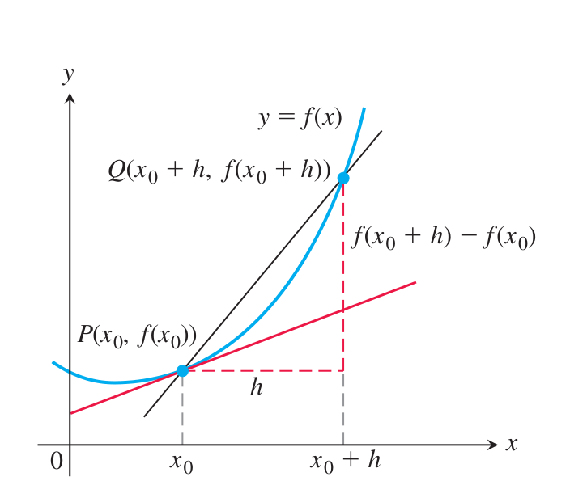
  
图 3.1 $P$ 处切线的斜率为 $\displaystyle \lim_{h\to 0}\frac{f(x_0+h)-f(x_0)}{h}$。

 

  

    
定义

    

      曲线 $y=f(x)$ 在点 $P=(x_0,f(x_0))$ 处的斜率是数
      $$
      m=\lim_{h\to 0}\frac{f(x_0+h)-f(x_0)}{h},
      $$
      前提是该极限存在。曲线在 $P$ 处的切线，是通过 $P$ 且斜率为 $m$ 的直线。
    

  

在第 2.1 节例 3 中，我们已经应用这些定义，求出了抛物线 $f(x)=x^2$ 在点 $P(2,4)$ 处的斜率，以及该抛物线在 $P$ 处的切线。下面再看一个例子。

**例 1** 

**(a)** 求曲线 $y=1/x$ 在任意点 $x=a\ne 0$ 处的斜率。它在点 $x=-1$ 处的斜率是多少？

**(b)** 斜率在哪里等于 $-1/4$？

**(c)** 当 $a$ 变化时，曲线在点 $(a,1/a)$ 处的切线会发生什么变化？

**解：**

**(a)** 这里 $f(x)=1/x$。在点 $(a,1/a)$ 处的斜率为

$$
\begin{aligned}
m
&=\lim_{h\to 0}\frac{f(a+h)-f(a)}{h}\\
&=\lim_{h\to 0}\frac{\frac{1}{a+h}-\frac{1}{a}}{h}\\
&=\lim_{h\to 0}\frac{1}{h}\cdot\frac{a-(a+h)}{a(a+h)}\\
&=\lim_{h\to 0}\frac{-h}{ha(a+h)}\\
&=\lim_{h\to 0}\frac{-1}{a(a+h)}\\
&=-\frac{1}{a^2}.
\end{aligned}
$$

注意，在能够通过代入 $h=0$ 来计算极限之前，每一个分式前都必须一直写着“$\lim_{h\to 0}$”。数 $a$ 可以为正，也可以为负，但不能为 0。当 $a=-1$ 时，斜率为

$$
-\frac{1}{(-1)^2}=-1.
$$

**(b)** 曲线 $y=1/x$ 在 $x=a$ 处的斜率为 $-1/a^2$。它等于 $-1/4$，只要

$$
-\frac{1}{a^2}=-\frac14,
$$

这个方程等价于 $a^2=4$，所以 $a=2$ 或 $a=-2$。曲线在两点 $(2,1/2)$ 和 $(-2,-1/2)$ 处的斜率为 $-1/4$。

**(c)** 当 $a\ne 0$ 时，斜率 $-1/a^2$ 总是负的。当 $a\to 0^+$ 时，斜率趋于 $-\infty$，切线变得越来越陡；当 $a\to 0^-$ 时，也出现同样的情况。当 $a$ 沿任一方向远离原点时，斜率趋于 0，切线逐渐变平，越来越接近水平。

  

    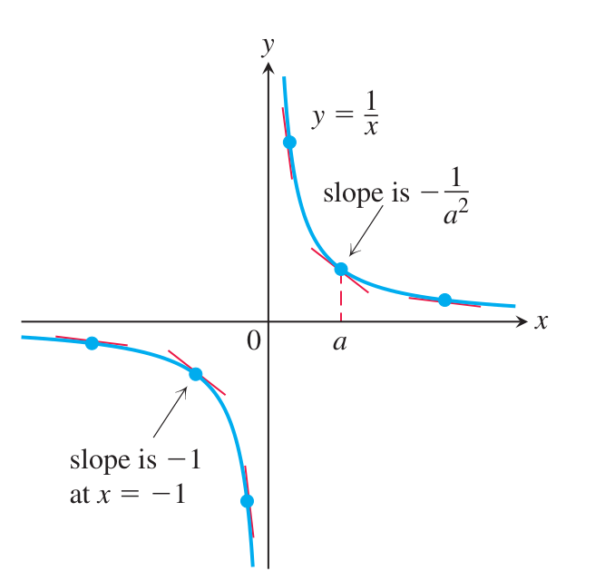
    
图 3.2 切点靠近原点时，切线斜率很陡；随着切点远离原点，切线逐渐变平（例 1）。

  

  

    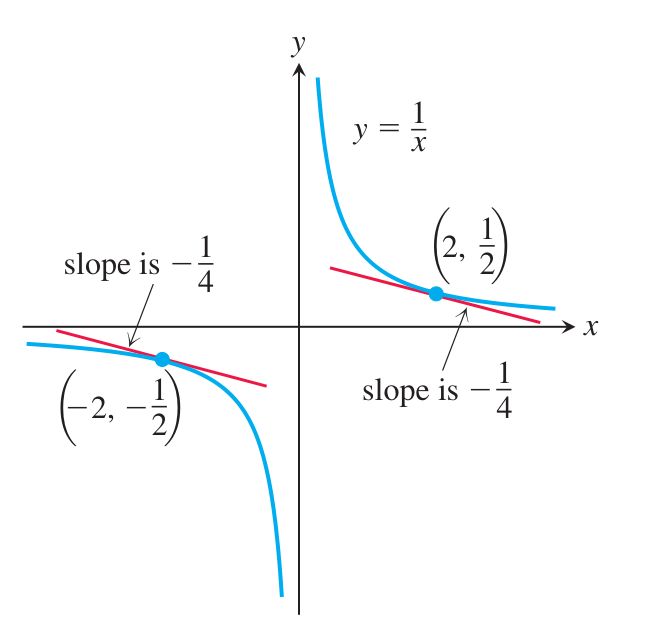
    
图 3.3 曲线 $y=1/x$ 上斜率为 $-1/4$ 的两条切线（例 1）。

  

 

### 变化率：一点处的导数

表达式

$$
\frac{f(x_0+h)-f(x_0)}{h},\qquad h\ne 0
$$

称为函数 $f$ 在 $x_0$ 处、增量为 $h$ 的差商。如果差商在 $h\to 0$ 时有极限，我们给这个极限一个专门名称。

  

    
定义

    

      函数 $f$ 在点 $x_0$ 处的导数记作 $f'(x_0)$，定义为
      $$
      f'(x_0)=\lim_{h\to 0}\frac{f(x_0+h)-f(x_0)}{h},
      $$
      前提是该极限存在。
    

  

如果把差商解释为割线的斜率，那么导数给出的就是曲线 $y=f(x)$ 在点 $P=(x_0,f(x_0))$ 处的斜率。练习 33 表明，线性函数 $f(x)=mx+b$ 在任意点 $x_0$ 处的导数，恰好就是这条直线的斜率，因此

$$
f'(x_0)=m,
$$

这与我们对斜率的定义是一致的。

如果把差商解释为平均变化率（第 2.1 节），那么导数给出的就是函数在点 $x=x_0$ 处相对于 $x$ 的瞬时变化率。我们将在第 3.4 节研究这一解释。

**例 2** 设一块石头从静止开始自由下落，前 $t$ 秒下落的距离为 $s=16t^2$ 英尺。求 $t=1$ 秒时石头的瞬时速度。

**解：** 取 $f(t)=16t^2$。在 $t=1$ 到 $t=1+h$ 的时间间隔内，平均速度为

$$
\frac{f(1+h)-f(1)}{h}
=\frac{16(1+h)^2-16}{h}
=16(h+2).
$$

因此瞬时速度为

$$
f'(1)=\lim_{h\to 0}16(h+2)=32\ \text{ft/sec}.
$$

### 小结

我们一直在讨论曲线的斜率、曲线的切线、函数的变化率，以及函数在一点处的导数。所有这些概念都指向同一个极限。

  

    

      差商极限
      $$
      \lim_{h\to 0}\frac{f(x_0+h)-f(x_0)}{h}
      $$
      可以解释为：
      <ol style="margin-bottom: 0;">
        <li>图像 $y=f(x)$ 在 $x=x_0$ 处的斜率。</li>
        <li>曲线 $y=f(x)$ 在 $x=x_0$ 处切线的斜率。</li>
        <li>$f(x)$ 关于 $x$ 在 $x=x_0$ 处的变化率。</li>
        <li>函数 $f$ 在一点处的导数 $f'(x_0)$。</li>
      </ol>
    

  

在接下来的几节中，我们让点 $x_0$ 在函数 $f$ 的定义域中变化。

## 3.2 作为函数的导数

上一节中，我们把 $y=f(x)$ 在点 $x=x_0$ 处的导数定义为极限

$$
f'(x_0)=\lim_{h\to 0}\frac{f(x_0+h)-f(x_0)}{h}.
$$

现在，我们通过考察 $f$ 的定义域中每一点 $x$ 处的这个极限，来研究由 $f$ 派生出的导函数。

  

    
定义

    

      函数 $f(x)$ 关于变量 $x$ 的导函数，是函数 $f'$；它在 $x$ 处的值为
      $$
      f'(x)=\lim_{h\to 0}\frac{f(x+h)-f(x)}{h},
      $$
      前提是该极限存在。
    

  

在定义中使用记号 $f(x)$，是为了强调导函数 $f'(x)$ 是相对于自变量 $x$ 来定义的。$f'$ 的定义域是 $f$ 的定义域中使该极限存在的点的集合；这意味着 $f'$ 的定义域可能与 $f$ 的定义域相同，也可能比 $f$ 的定义域小。若 $f'$ 在某个特定的 $x$ 处存在，就说 $f$ 在 $x$ 处可导（有导数）。若 $f'$ 在 $f$ 定义域中的每一点都存在，就称 $f$ 可导。

如果写 $z=x+h$，那么 $h=z-x$，并且 $h$ 趋近于 0 当且仅当 $z$ 趋近于 $x$。因此，导数还有如下等价定义（见图 3.4）：

  

    
导数的另一种公式

    

      $$
      f'(x)=\lim_{z\to x}\frac{f(z)-f(x)}{z-x}.
      $$
    

  

  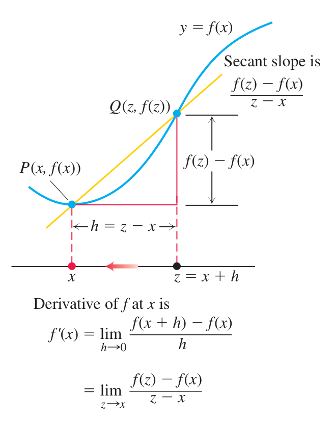
  
图 3.4 差商的两种形式。

 

在求导函数时，这个公式有时更方便，因为它把注意力放在趋近于 $x$ 的点 $z$ 上。

### 由定义计算导数

计算导数的过程称为求导。为了强调求导是对函数 $y=f(x)$ 进行的一种运算，我们使用记号

$$
\frac{d}{dx}f(x)
$$

作为表示导数 $f'(x)$ 的另一种方式。第 3.1 节例 1 说明了函数 $y=1/x$ 在 $x=a$ 时的求导过程。若用 $x$ 表示定义域中的任意一点，就得到公式

$$
\frac{d}{dx}\left(\frac{1}{x}\right)=-\frac{1}{x^2},\qquad x\ne 0.
$$

下面再看两个例子，其中都让 $x$ 表示函数 $f$ 定义域中的任意一点。

**例 1** 求函数 $f(x)=\frac{x}{x-1}$ 的导数。

**解：**

$$
\begin{aligned}
f'(x)
&=\lim_{h\to 0}\frac{\frac{x+h}{x+h-1}-\frac{x}{x-1}}{h}\\
&=\lim_{h\to 0}\frac{1}{h}\cdot
\frac{(x+h)(x-1)-x(x+h-1)}{(x+h-1)(x-1)}\\
&=\lim_{h\to 0}\frac{-h}{h(x+h-1)(x-1)}\\
&=-\frac{1}{(x-1)^2}.
\end{aligned}
$$

**例 2** 

**(a)** 求 $f(x)=\sqrt{x}$ 在 $x>0$ 时的导数。

**(b)** 求曲线 $y=\sqrt{x}$ 在 $x=4$ 处的切线方程。

**解：**

**(a)** 我们使用导数的另一种公式来计算 $f'$：

$$
\begin{aligned}
f'(x)
&=\lim_{z\to x}\frac{f(z)-f(x)}{z-x}\\
&=\lim_{z\to x}\frac{\sqrt{z}-\sqrt{x}}{z-x}\\
&=\lim_{z\to x}
\frac{\sqrt{z}-\sqrt{x}}{z-x}\cdot
\frac{\sqrt{z}+\sqrt{x}}{\sqrt{z}+\sqrt{x}}\\
&=\lim_{z\to x}\frac{1}{\sqrt{z}+\sqrt{x}}\\
&=\frac{1}{2\sqrt{x}}.
\end{aligned}
$$

**(b)** 曲线在 $x=4$ 处的斜率为

$$
f'(4)=\frac{1}{2\sqrt{4}}=\frac14.
$$

切线通过点 $(4,2)$，斜率为 $1/4$，如图 3.5 所示。因此

  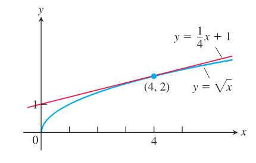
  
图 3.5 曲线 $y=\sqrt{x}$ 及其在 $(4,2)$ 处的切线；切线斜率由 $x=4$ 处的导数给出（例 2）。

$$
y=2+\frac14(x-4),
$$

即

$$
y=\frac14x+1.
$$

### 记号

函数 $y=f(x)$ 的导数有许多表示方法，其中自变量是 $x$，因变量是 $y$。导数的一些常用替代记号为

$$
f'(x)=y'=\frac{dy}{dx}=\frac{df}{dx}=\frac{d}{dx}f(x)=D(f)(x)=D_xf(x).
$$

符号 $\frac{d}{dx}$ 和 $D$ 表示求导运算。我们把 $\frac{dy}{dx}$ 读作“$y$ 对 $x$ 的导数”，把 $\frac{df}{dx}$ 和 $\left(\frac{d}{dx}\right)f(x)$ 读作“$f$ 对 $x$ 的导数”。撇号记号 $y'$ 和 $f'$ 来自牛顿曾用于导数的记号；$\frac{d}{dx}$ 形式的记号则类似于莱布尼茨使用的记号。在第 3.11 节引入“微分”概念之前，符号 $\frac{dy}{dx}$ 不应被看作一个比值。

为了表示导数在某个指定数 $x=a$ 处的值，我们使用记号

$$
f'(a)=\left.\frac{dy}{dx}\right|_{x=a}
=\left.\frac{df}{dx}\right|_{x=a}
=\left.\frac{d}{dx}f(x)\right|_{x=a}.
$$

例如，在例 2 中，

$$
f'(4)=\left.\frac{d}{dx}\sqrt{x}\right|_{x=4}
=\left.\frac{1}{2\sqrt{x}}\right|_{x=4}
=\frac{1}{2\sqrt{4}}=\frac14.
$$

### 导函数的图像

我们常常可以通过估计 $f$ 的图像上的斜率，画出 $y=f(x)$ 的导函数的合理近似图像。也就是说，我们在 $xy$ 平面内画出点 $(x,f'(x))$，并用一条光滑曲线把它们连起来，这条曲线就表示 $y=f'(x)$。

**例 3** 画出图 3.6a 中函数 $y=f(x)$ 的导函数图像。

**解：** 我们在 $f$ 的图像上以较密的间隔画出切线，并用这些切线的斜率估计相应点处 $f'(x)$ 的值。然后画出对应的 $(x,f'(x))$ 点，并把这些点连成一条光滑曲线，如图 3.6b 所示。

  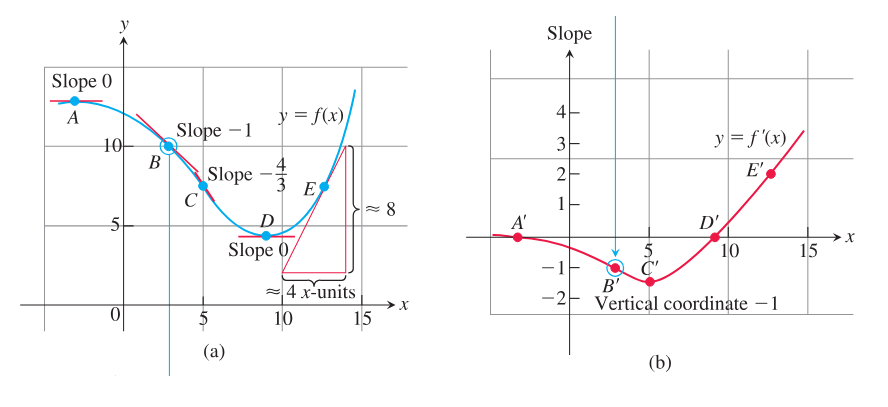
  
图 3.6 通过从 (a) 中 $y=f(x)$ 的图像读取斜率，得到 (b) 中 $y=f'(x)$ 的图像。$B'$ 的纵坐标就是点 $B$ 处的斜率，其他点同理。点 $E$ 处的斜率约为 $8/4=2$。在 (b) 中可以看出，$f$ 的变化率在 $A'$ 与 $D'$ 之间为负，在 $D'$ 右侧为正。

从 $y=f'(x)$ 的图像中能学到什么？一眼就可以看出：

1. $f$ 的变化率在哪里为正、为负或为零。
2. 任意 $x$ 处增长率的大致大小，以及它与 $f(x)$ 本身大小之间的关系。
3. 变化率本身在哪里增大或减小。

### 可导性与单侧导数

如果函数 $y=f(x)$ 在某个开区间（有限或无限）的每一点都有导数，就称它在这个开区间上可导。如果它在闭区间 $[a,b]$ 上可导，就要求它在内部 $(a,b)$ 上可导，并且端点处的极限

$$
\begin{array}{ll}
\displaystyle \lim_{h\to 0^+}\frac{f(a+h)-f(a)}{h} & \text{点 }a\text{ 处的右导数},\\[1.2em]
\displaystyle \lim_{h\to 0^-}\frac{f(b+h)-f(b)}{h} & \text{点 }b\text{ 处的左导数}
\end{array}
$$

都存在（图 3.7）。

  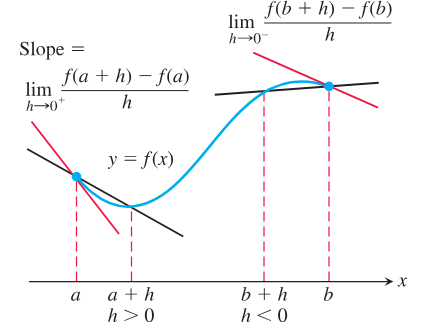
  
图 3.7 闭区间端点处的导数是单侧极限。

右导数和左导数可以在函数定义域的任意一点定义。根据第 2.4 节的定理 6，函数在一点处有导数，当且仅当它在该点的左导数和右导数都存在，并且这两个单侧导数相等。

**例 4** 函数 $y=|x|$ 在 $(-\infty,0)$ 和 $(0,\infty)$ 上可导，但在 $x=0$ 处不可导。

**解：** 由第 3.1 节可知，$y=mx+b$ 的导数就是斜率 $m$。因此，在原点右侧，

$$
\frac{d}{dx}(|x|)
=\frac{d}{dx}(x)
=\frac{d}{dx}(1\cdot x)
=1
$$

在原点左侧，

$$
\frac{d}{dx}(|x|)
=\frac{d}{dx}(-x)
=\frac{d}{dx}(-1\cdot x)
=-1
$$

见图 3.8。原点处没有导数，因为这里的单侧导数不同。

点 $0$ 处 $|x|$ 的右导数为

$$
\begin{aligned}
\lim_{h\to 0^+}\frac{|0+h|-|0|}{h}
&=\lim_{h\to 0^+}\frac{|h|}{h}\\
&=\lim_{h\to 0^+}\frac{h}{h}\qquad (h>0\text{ 时 }|h|=h)\\
&=\lim_{h\to 0^+}1=1.
\end{aligned}
$$

点 $0$ 处 $|x|$ 的左导数为

$$
\begin{aligned}
\lim_{h\to 0^-}\frac{|0+h|-|0|}{h}
&=\lim_{h\to 0^-}\frac{|h|}{h}\\
&=\lim_{h\to 0^-}\frac{-h}{h}\qquad (h<0\text{ 时 }|h|=-h)\\
&=\lim_{h\to 0^-}(-1)=-1.
\end{aligned}
$$

  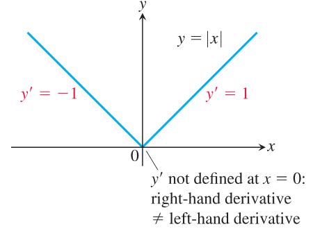
  
图 3.8 函数 $y=|x|$ 在原点处不可导，因为它的图像在那里有一个“尖角”（例 4）。

**例 5** 在例 2 中，我们已经求得，当 $x>0$ 时，

$$
\frac{d}{dx}\sqrt{x}=\frac{1}{2\sqrt{x}}.
$$

现在用定义来考察 $x=0$ 处是否存在导数：

$$
\lim_{h\to 0^+}\frac{\sqrt{0+h}-\sqrt{0}}{h}
=\lim_{h\to 0^+}\frac{1}{\sqrt{h}}
=\infty.
$$

由于这个右极限不是有限值，所以在 $x=0$ 处没有导数。又因为在 $y=\sqrt{x}$ 的图像上，连接原点与点 $(h,\sqrt{h})$ 的割线斜率趋于 $\infty$，所以该图像在原点处有一条垂直切线（见第 9 页图 1.17）。

### 函数在一点处何时没有导数

如果通过点 $P(x_0,f(x_0))$ 与图像上邻近点 $Q$ 的割线斜率，在 $Q$ 趋近于 $P$ 时趋于一个有限极限，那么函数在点 $x_0$ 处有导数。只要这些割线不能趋向某个极限位置，或者当 $Q$ 趋近于 $P$ 时趋于垂直，导数就不存在。因此，可导性是函数图像的一种“光滑性”条件。函数可能因为许多原因在某点没有导数，包括图像上存在如下情形：

  

    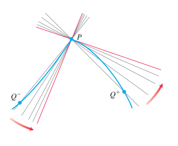
    
1. 尖角：左右单侧导数不同。

  

  

    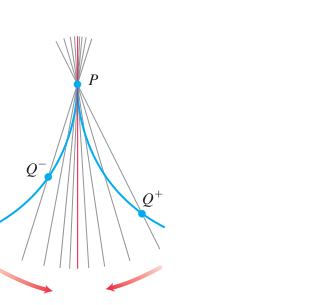
    
2. 尖点：$PQ$ 的斜率从一侧趋于 $\infty$，从另一侧趋于 $-\infty$。

  

  

    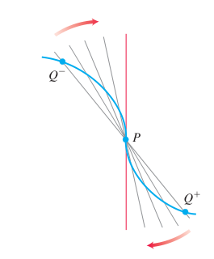
    
3. 垂直切线：$PQ$ 的斜率从两侧都趋于 $\infty$，或从两侧都趋于 $-\infty$（图中为 $-\infty$）。

  

  

    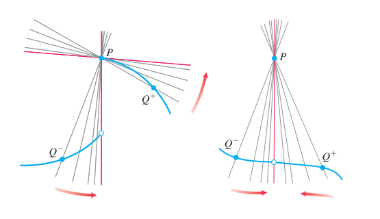
    
4. 不连续：原书给出了两个例子。

  

还有一种导数可能不存在的情况：函数在 $P$ 附近的斜率剧烈振荡，例如 $f(x)=\sin(1/x)$ 在原点附近的情形；该函数在原点不连续（见图 2.31）。

### 可导函数连续

函数在每一个有导数的点处连续。

  

    定理 1：可导必连续
    如果 $f$ 在 $x=c$ 处有导数，那么 $f$ 在 $x=c$ 处连续。
  

**证明** 已知 $f'(c)$ 存在，我们必须证明 $\lim_{x\to c}f(x)=f(c)$，或者等价地，证明 $\lim_{h\to 0}f(c+h)=f(c)$。若 $h\ne 0$，则

$$
f(c+h)=f(c)+\bigl(f(c+h)-f(c)\bigr)
=f(c)+\frac{f(c+h)-f(c)}{h}\cdot h.
$$

现在令 $h\to 0$。根据第 2.2 节定理 1，

$$
\begin{aligned}
\lim_{h\to 0}f(c+h)
&=\lim_{h\to 0}f(c)
+\lim_{h\to 0}\frac{f(c+h)-f(c)}{h}\cdot\lim_{h\to 0}h\\
&=f(c)+f'(c)\cdot 0\\
&=f(c)+0\\
&=f(c).
\end{aligned}
$$

用类似的单侧极限论证可以说明：如果 $f$ 在 $x=c$ 处有一侧导数（右导数或左导数），那么 $f$ 在 $x=c$ 处从相应一侧连续。

定理 1 说明，如果函数在某点不连续（例如有跳跃不连续），那么它在那里不可能可导。最大整数函数 $y=\lfloor x\rfloor$ 在每个整数 $x=n$ 处都不可导（见第 2.5 节例 4）。

**注意** 定理 1 的逆命题是错误的。函数在某点连续，并不一定在该点有导数；绝对值函数的例 4 已经说明了这一点。

## 3.3 求导法则

本节介绍若干规则，使我们能够简单而直接地求常数函数、幂函数、多项式、指数函数、有理函数以及它们的某些组合的导数，而不必每次都取极限。

### 常数、幂、倍数、和与差

一个简单的求导规则是：每一个常数函数的导数都是零。

  

    
常数函数的导数

    
若 $f$ 取常值 $f(x)=c$，则

    

      $$
      \frac{df}{dx}=\frac{d}{dx}(c)=0.
      $$
    

  

**证明** 我们把导数定义应用于 $f(x)=c$，也就是输出恒为常数 $c$ 的函数（图 3.9）。在每一个 $x$ 值处，都有

$$
f'(x)=\lim_{h\to 0}\frac{f(x+h)-f(x)}{h}
=\lim_{h\to 0}\frac{c-c}{h}
=\lim_{h\to 0}0=0.
$$

  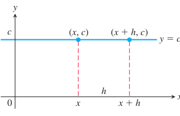
  
图 3.9 公式 $\frac{d}{dx}(c)=0$ 的另一种说法是：常数函数的值从不改变，水平直线在每一点处的斜率都是零。

由第 3.1 节可知，

$$
\frac{d}{dx}\left(\frac{1}{x}\right)=-\frac{1}{x^2},
\qquad\text{或}\qquad
\frac{d}{dx}(x^{-1})=-x^{-2}.
$$

由上一节例 2 还可知，

$$
\frac{d}{dx}\sqrt{x}=\frac{1}{2\sqrt{x}},
\qquad\text{或}\qquad
\frac{d}{dx}(x^{1/2})=\frac12 x^{-1/2}.
$$

这两个例子说明了一个关于幂函数 $x^n$ 求导的一般规则。我们先证明 $n$ 为正整数时的情形。

  

    
正整数幂的导数

    
若 $n$ 为正整数，则

    

      $$
      \frac{d}{dx}x^n=nx^{n-1}.
      $$
    

  

**正整数幂法则的证明** 公式

$$
z^n-x^n=(z-x)\left(z^{n-1}+z^{n-2}x+\cdots+zx^{n-2}+x^{n-1}\right)
$$

可以通过把右端乘开来验证。于是由导数定义的另一种形式，

$$
\begin{aligned}
f'(x)
&=\lim_{z\to x}\frac{f(z)-f(x)}{z-x}\\
&=\lim_{z\to x}\frac{z^n-x^n}{z-x}\\
&=\lim_{z\to x}\left(z^{n-1}+z^{n-2}x+\cdots+zx^{n-2}+x^{n-1}\right)\\
&=nx^{n-1}.
\end{aligned}
$$

事实上，幂法则对所有实数 $n$ 都成立。我们已经看过负整数幂和分数幂的例子，但 $n$ 也可以是无理数。应用幂法则时，要从原来的指数 $n$ 中减去 1，再把所得的幂乘以 $n$。这里先给出这个法则的一般形式，但把证明推迟到第 3.8 节。

  

    
幂法则（一般形式）

    
若 $n$ 为任意实数，则在幂 $x^n$ 和 $x^{n-1}$ 都有定义的所有 $x$ 处，

    

      $$
      \frac{d}{dx}x^n=nx^{n-1}.
      $$
    

  

**应用幂法则** 从指数中减去 1，并把所得结果乘以原来的指数。

**例 1** 求下列 $x$ 的幂的导数。

$$
\text{(a) }x^3\qquad
\text{(b) }x^{2/3}\qquad
\text{(c) }x^{\sqrt{2}}\qquad
\text{(d) }\frac{1}{x^4}\qquad
\text{(e) }x^{-4/3}\qquad
\text{(f) }\sqrt{x^{2+\pi}}
$$

**解：**

(a)
$$
\frac{d}{dx}(x^3)=3x^{3-1}=3x^2.
$$

(b)
$$
\frac{d}{dx}(x^{2/3})=\frac{2}{3}x^{(2/3)-1}
=\frac{2}{3}x^{-1/3}.
$$

(c)
$$
\frac{d}{dx}(x^{\sqrt{2}})=\sqrt{2}\,x^{\sqrt{2}-1}.
$$

(d)
$$
\frac{d}{dx}\left(\frac{1}{x^4}\right)
=\frac{d}{dx}(x^{-4})
=-4x^{-4-1}
=-4x^{-5}
=-\frac{4}{x^5}.
$$

(e)
$$
\frac{d}{dx}(x^{-4/3})
=-\frac{4}{3}x^{-(4/3)-1}
=-\frac{4}{3}x^{-7/3}.
$$

(f)
$$
\frac{d}{dx}\left(\sqrt{x^{2+\pi}}\right)
=\frac{d}{dx}\left(x^{1+(\pi/2)}\right)
=\left(1+\frac{\pi}{2}\right)x^{1+(\pi/2)-1}
=\frac{2+\pi}{2}x^{\pi/2}.
$$

下一个规则说明：当一个可导函数乘以常数时，它的导数也乘以同一个常数。

  

    
导数的常数倍法则

    
若 $u$ 是 $x$ 的可导函数，$c$ 为常数，则

    

      $$
      \frac{d}{dx}(cu)=c\frac{du}{dx}.
      $$
    

  

特别地，若 $n$ 为任意实数，则

$$
\frac{d}{dx}(cx^n)=cnx^{n-1}.
$$

**常数倍法则的证明**

$$
\begin{aligned}
\frac{d}{dx}(cu)
&=\lim_{h\to 0}\frac{cu(x+h)-cu(x)}{h}\\
&=c\lim_{h\to 0}\frac{u(x+h)-u(x)}{h}\\
&=c\frac{du}{dx}.
\end{aligned}
$$

这里使用了常数倍极限定理，并且 $u$ 是可导函数。

**例 2**

(a) 导数公式

$$
\frac{d}{dx}(3x^2)=3\cdot 2x=6x
$$

说明：如果把 $y=x^2$ 的图像重新缩放，使每个 $y$ 坐标都乘以 3，那么每一点处的斜率也都乘以 3（图 3.10）。

  
  
图 3.10 $y=x^2$ 和 $y=3x^2$ 的图像。把 $y$ 坐标扩大到 3 倍，斜率也扩大到 3 倍（例 2）。

(b) 函数的相反数 

可导函数 $u$ 的相反数的导数，等于该函数导数的相反数。令常数倍法则中的 $c=-1$，得

$$
\frac{d}{dx}(-u)
=\frac{d}{dx}((-1)u)
=(-1)\frac{d}{dx}(u)
=-\frac{du}{dx}.
$$

下一个规则说明：两个可导函数之和的导数，等于它们导数的和。

  

    
导数的和法则

    
若 $u$ 与 $v$ 都是 $x$ 的可导函数，则在 $u$ 与 $v$ 都可导的每一点，$u+v$ 也可导，并且

    

      $$
      \frac{d}{dx}(u+v)=\frac{du}{dx}+\frac{dv}{dx}.
      $$
    

  

例如，若 $y=x^4+12x$，则 $y$ 是 $u(x)=x^4$ 与 $v(x)=12x$ 的和。于是有

$$
\frac{dy}{dx}
=\frac{d}{dx}(x^4)+\frac{d}{dx}(12x)
=4x^3+12.
$$

**和法则的证明** 把导数定义应用于 $f(x)=u(x)+v(x)$：

$$
\begin{aligned}
\frac{d}{dx}\bigl(u(x)+v(x)\bigr)
&=\lim_{h\to 0}\frac{\bigl(u(x+h)+v(x+h)\bigr)-\bigl(u(x)+v(x)\bigr)}{h}\\
&=\lim_{h\to 0}\left(\frac{u(x+h)-u(x)}{h}+\frac{v(x+h)-v(x)}{h}\right)\\
&=\lim_{h\to 0}\frac{u(x+h)-u(x)}{h}
+\lim_{h\to 0}\frac{v(x+h)-v(x)}{h}\\
&=\frac{du}{dx}+\frac{dv}{dx}.
\end{aligned}
$$

把和法则与常数倍法则结合起来，就得到差法则。差法则说明，可导函数之差的导数等于它们导数的差：

$$
\frac{d}{dx}(u-v)
=\frac{d}{dx}\bigl(u+(-1)v\bigr)
=\frac{du}{dx}+(-1)\frac{dv}{dx}
=\frac{du}{dx}-\frac{dv}{dx}.
$$

和法则也可推广到两个以上函数的有限和。若 $u_1,u_2,\ldots,u_n$ 在 $x$ 处可导，则 $u_1+u_2+\cdots+u_n$ 也在 $x$ 处可导，并且

$$
\frac{d}{dx}(u_1+u_2+\cdots+u_n)
=\frac{du_1}{dx}+\frac{du_2}{dx}+\cdots+\frac{du_n}{dx}.
$$

例如，要说明该法则对三个函数成立，我们计算

$$
\begin{aligned}
\frac{d}{dx}(u_1+u_2+u_3)
&=\frac{d}{dx}\bigl((u_1+u_2)+u_3\bigr)\\
&=\frac{d}{dx}(u_1+u_2)+\frac{du_3}{dx}\\
&=\frac{du_1}{dx}+\frac{du_2}{dx}+\frac{du_3}{dx}.
\end{aligned}
$$

对任意有限项情形的数学归纳法证明见附录 2。

**例 3** 求多项式 $y=x^3+\frac{4}{3}x^2-5x+1$ 的导数。

**解：**

$$
\begin{aligned}
\frac{dy}{dx}
&=\frac{d}{dx}x^3+\frac{d}{dx}\left(\frac{4}{3}x^2\right)-\frac{d}{dx}(5x)+\frac{d}{dx}(1)
&&\text{和法则与差法则}\\
&=3x^2+\frac{4}{3}\cdot 2x-5+0\\
&=3x^2+\frac{8}{3}x-5.
\end{aligned}
$$

**例 4** 曲线 $y=x^4-2x^2+2$ 有没有水平切线？如果有，在哪里？

**解：** 水平切线如果存在，就出现在斜率 $\frac{dy}{dx}$ 为零的地方。我们有

$$
\frac{dy}{dx}
=\frac{d}{dx}(x^4-2x^2+2)
=4x^3-4x.
$$

现在解方程 $\frac{dy}{dx}=0$，求 $x$：

$$
\begin{aligned}
4x^3-4x&=0\\
4x(x^2-1)&=0\\
x&=0,1,-1.
\end{aligned}
$$

曲线 $y=x^4-2x^2+2$ 在 $x=0,1,-1$ 处有水平切线。曲线上相应的点为 $(0,2)$、$(1,1)$ 和 $(-1,1)$。见图 3.11。

  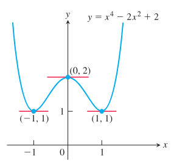
  
图 3.11 例 4 中的曲线及其水平切线。

我们将在第 4 章看到，寻找使函数导数等于零的 $x$ 值，是一个重要且有用的过程。

### 指数函数的导数

我们在第 1.5 节简要回顾了指数函数。把导数定义应用于 $f(x)=a^x$，得到

$$
\begin{aligned}
\frac{d}{dx}(a^x)
&=\lim_{h\to 0}\frac{a^{x+h}-a^x}{h}
&&\text{导数定义}\\
&=\lim_{h\to 0}\frac{a^x a^h-a^x}{h}
&&a^{x+h}=a^x a^h\\
&=\lim_{h\to 0}a^x\frac{a^h-1}{h}
&&\text{提出因子 }a^x\\
&=a^x\lim_{h\to 0}\frac{a^h-1}{h}
&&h\to 0\text{ 时 }a^x\text{ 为常数}\\
&=\left(\lim_{h\to 0}\frac{a^h-1}{h}\right)a^x.
\end{aligned}
\tag{1}
$$

因此我们看到，$a^x$ 的导数是 $a^x$ 的一个常数倍 $L$。常数 $L$ 是一个我们以前从未遇到过的极限。不过请注意，它等于 $f(x)=a^x$ 在 $x=0$ 处的导数：

$$
f'(0)=\lim_{h\to 0}\frac{a^h-a^0}{h}
=\lim_{h\to 0}\frac{a^h-1}{h}
=L.
$$

因此，极限 $L$ 就是 $f(x)=a^x$ 的图像与 $y$ 轴相交处的斜率。在第 7 章中，我们会仔细建立对数函数和指数函数，并证明极限 $L$ 存在且值为 $\ln a$。现在，我们通过作函数

$$
y=\frac{a^h-1}{h}
$$

的图像，并研究它在 $h$ 趋近于 $0$ 时的行为，来考察 $L$ 的取值。

  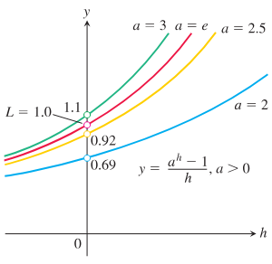
  
图 3.12 当 $a>0$ 时，曲线 $y=\frac{a^h-1}{h}$ 的位置随 $a$ 连续变化。$h\to0$ 时，$y$ 的极限 $L$ 随 $a$ 的不同取值而改变。使 $h\to0$ 时 $L=1$ 的数是位于 $a=2$ 与 $a=3$ 之间的数 $e$。

图 3.12 显示了 $a$ 取四个不同值时 $y=\frac{a^h-1}{h}$ 的图像。当 $a=2$ 时，极限 $L$ 约为 $0.69$；当 $a=2.5$ 时，约为 $0.92$；当 $a=3$ 时，约为 $1.1$。看起来，在 $2.5$ 与 $3$ 之间选取某个数 $a$ 时，$L$ 的值为 $1$。这个数就是

$$
a=e\approx 2.718281828.
$$

选取这个底数后，我们得到第 1.5 节中的自然指数函数 $f(x)=e^x$，并看到它满足性质

$$
f'(0)=\lim_{h\to 0}\frac{e^h-1}{h}=1.
\tag{2}
$$

这是因为它是图像与 $y$ 轴相交时斜率为 $1$ 的指数函数。极限为 $1$ 蕴含了自然指数函数 $e^x$ 与它的导数之间的重要关系：

$$
\begin{aligned}
\frac{d}{dx}(e^x)
&=\left(\lim_{h\to 0}\frac{e^h-1}{h}\right)e^x
&&\text{式 (1) 中取 }a=e\\
&=1\cdot e^x=e^x.
&&\text{式 (2)}
\end{aligned}
$$

因此，自然指数函数是它自己的导函数。

  

    
自然指数函数的导数

    

      $$
      \frac{d}{dx}e^x=e^x.
      $$
    

  

**例 5** 求一条直线的方程，使它与 $y=e^x$ 的图像相切，并且经过原点。

**解：** 由于这条直线经过原点，它的方程形如 $y=mx$，其中 $m$ 是斜率。若它在点 $(a,e^a)$ 处与图像相切，则斜率为

$$
m=\frac{e^a-0}{a-0}.
$$

自然指数函数在 $x=a$ 处的斜率为 $e^a$。因为这两个斜率相同，所以有

$$
e^a=\frac{e^a}{a}.
$$

由此得到 $a=1$ 且 $m=e$，所以切线方程为

$$
y=ex.
$$

见图 3.13。

  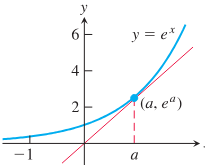
  
图 3.13 过原点的直线在 $a=1$ 时与 $y=e^x$ 的图像相切（例 5）。

我们可能会问，除了自然指数函数之外，是否还有别的函数也是它自己的导函数。答案是：满足性质 $f'(x)=f(x)$ 的函数，只能是自然指数函数的常数倍，即 $f(x)=ce^x$，其中 $c$ 为任意常数。我们将在第 7.2 节证明这个事实。由常数倍法则也可看出，确实有

$$
\frac{d}{dx}(ce^x)=c\frac{d}{dx}(e^x)=ce^x.
$$

### 积与商

虽然两个函数之和的导数等于它们导数的和，但两个函数乘积的导数并不等于它们导数的乘积。例如，

$$
\frac{d}{dx}(x\cdot x)=\frac{d}{dx}(x^2)=2x,
$$

而

$$
\frac{d}{dx}(x)\cdot\frac{d}{dx}(x)=1\cdot 1=1.
$$

两个函数乘积的导数是两个乘积的和，下面我们来说明。

  

    
导数的乘积法则

    
若 $u$ 和 $y$ 在 $x$ 处可导，则它们的乘积 $uy$ 也在 $x$ 处可导，并且

    

      $$
      \frac{d}{dx}(uy)=u\frac{dy}{dx}+y\frac{du}{dx}.
      $$
    

  

乘积 $uy$ 的导数等于 $u$ 乘以 $y$ 的导数，加上 $y$ 乘以 $u$ 的导数。用撇号记号表示为

$$
(uy)'=uy'+yu'.
$$

用函数记号表示为

$$
\frac{d}{dx}\bigl[f(x)g(x)\bigr]=f(x)g'(x)+g(x)f'(x).
$$

**例 6** 求下列函数的导数：

$$
\text{(a) }y=\frac{1}{x}(x^2+e^x)\qquad
\text{(b) }y=e^{2x}.
$$

**解：**

(a) 令 $u=\dfrac{1}{x}$，$y=x^2+e^x$，应用乘积法则：

$$
\begin{aligned}
\frac{d}{dx}\left[\frac{1}{x}(x^2+e^x)\right]
&=\frac{1}{x}(2x+e^x)+(x^2+e^x)\left(-\frac{1}{x^2}\right)\\
&=2+\frac{e^x}{x}-1-\frac{e^x}{x^2}\\
&=1+\frac{(x-1)e^x}{x^2}.
\end{aligned}
$$

(b)

$$
\begin{aligned}
\frac{d}{dx}(e^{2x})
&=\frac{d}{dx}(e^x\cdot e^x)\\
&=e^x\frac{d}{dx}(e^x)+e^x\frac{d}{dx}(e^x)\\
&=2e^x\cdot e^x\\
&=2e^{2x}.
\end{aligned}
$$

**例 7** 求 $y=(x^2+1)(x^3+3)$ 的导数。

**解：**

(a) 令 $u=x^2+1$，$y=x^3+3$，由乘积法则得

$$
\begin{aligned}
\frac{d}{dx}\bigl[(x^2+1)(x^3+3)\bigr]
&=(x^2+1)(3x^2)+(x^3+3)(2x)\\
&=3x^4+3x^2+2x^4+6x\\
&=5x^4+3x^2+6x.
\end{aligned}
$$

(b) 这个特定乘积也可以先把原式展开，再对所得多项式求导：

$$
y=(x^2+1)(x^3+3)=x^5+x^3+3x^2+3.
$$

因此

$$
\frac{dy}{dx}=5x^4+3x^2+6x,
$$

这与第一次计算的结果一致。

**乘积法则的证明**

$$
\frac{d}{dx}(uv)
=\lim_{h\to 0}\frac{u(x+h)v(x+h)-u(x)v(x)}{h}.
$$

为了把这个分式改写成含有 $u$ 与 $v$ 的差商的等价形式，在分子中减去并加上 $u(x+h)v(x)$：

$$
\begin{aligned}
\frac{d}{dx}(uv)
&=\lim_{h\to 0}
\frac{u(x+h)v(x+h)-u(x+h)v(x)+u(x+h)v(x)-u(x)v(x)}{h}\\
&=\lim_{h\to 0}\left[
u(x+h)\frac{v(x+h)-v(x)}{h}
+v(x)\frac{u(x+h)-u(x)}{h}
\right]\\
&=\lim_{h\to 0}u(x+h)\cdot
\lim_{h\to 0}\frac{v(x+h)-v(x)}{h}
+v(x)\cdot\lim_{h\to 0}\frac{u(x+h)-u(x)}{h}.
\end{aligned}
$$

当 $h\to 0$ 时，$u(x+h)\to u(x)$，因为 $u$ 在 $x$ 处可导，从而在 $x$ 处连续。两个差商分别趋于 $v$ 在 $x$ 处的导数和 $u$ 在 $x$ 处的导数。因此

$$
\frac{d}{dx}(uv)=u\frac{dv}{dx}+v\frac{du}{dx}.
$$

两个函数商的导数由商法则给出。

  

    
导数的商法则

    
若 $u$ 和 $v$ 都是 $x$ 的可导函数，且 $v\ne 0$，则在 $v\ne 0$ 的每一点，

    

      $$
      \frac{d}{dx}\left(\frac{u}{v}\right)
      =\frac{v\frac{du}{dx}-u\frac{dv}{dx}}{v^2}.
      $$
    

  

**例 8** 求下列函数的导数：

$$
\text{(a) }y=\frac{t^2-1}{t^3+1}\qquad
\text{(b) }y=e^{-x}.
$$

**解：**

(a) 令 $u=t^2-1$，$y=t^3+1$，应用商法则：

$$
\begin{aligned}
\frac{dy}{dt}
&=\frac{(t^3+1)\cdot 2t-(t^2-1)\cdot 3t^2}{(t^3+1)^2}\\
&=\frac{2t^4+2t-3t^4+3t^2}{(t^3+1)^2}\\
&=\frac{-t^4+3t^2+2t}{(t^3+1)^2}.
\end{aligned}
$$

(b)

$$
\begin{aligned}
\frac{d}{dx}(e^{-x})
&=\frac{d}{dx}\left(\frac{1}{e^x}\right)\\
&=\frac{e^x\cdot 0-1\cdot e^x}{(e^x)^2}\\
&=-\frac{1}{e^x}\\
&=-e^{-x}.
\end{aligned}
$$

**商法则的证明**

$$
\begin{aligned}
\frac{d}{dx}\left(\frac{u}{v}\right)
&=\lim_{h\to 0}
\frac{\frac{u(x+h)}{v(x+h)}-\frac{u(x)}{v(x)}}{h}\\
&=\lim_{h\to 0}
\frac{v(x)u(x+h)-u(x)v(x+h)}{h\,v(x+h)v(x)}.
\end{aligned}
$$

为了把最后一个分式改写成含有 $u$ 与 $v$ 的差商的形式，在分子中减去并加上 $v(x)u(x)$：

$$
\begin{aligned}
\frac{d}{dx}\left(\frac{u}{v}\right)
&=\lim_{h\to 0}
\frac{v(x)u(x+h)-v(x)u(x)+v(x)u(x)-u(x)v(x+h)}
{h\,v(x+h)v(x)}\\
&=\lim_{h\to 0}
\frac{
v(x)\frac{u(x+h)-u(x)}{h}
-u(x)\frac{v(x+h)-v(x)}{h}}
{v(x+h)v(x)}.
\end{aligned}
$$

现在对分子和分母取极限，就得到商法则。

在求解一个求导问题时，选择使用哪些法则，会影响你需要做多少计算。下面是一个例子。

**例 9** 求

$$
y=\frac{(x-1)(x^2-2x)}{x^4}
$$

的导数。

**解：** 这里如果使用商法则，会得到一个含有许多项的复杂表达式。相反，我们先用一些代数运算来化简这个表达式。先展开分子，再除以 $x^4$：

$$
\begin{aligned}
y
&=\frac{(x-1)(x^2-2x)}{x^4}\\
&=\frac{x^3-3x^2+2x}{x^4}\\
&=x^{-1}-3x^{-2}+2x^{-3}.
\end{aligned}
$$

然后使用和法则与幂法则：

$$
\begin{aligned}
\frac{dy}{dx}
&=-x^{-2}-3(-2)x^{-3}+2(-3)x^{-4}\\
&=-\frac{1}{x^2}+\frac{6}{x^3}-\frac{6}{x^4}.
\end{aligned}
$$

### 二阶及高阶导数

若 $y=f(x)$ 是一个可导函数，那么它的导数 $f'(x)$ 也是一个函数。若 $f'$ 也可导，则可以对 $f'$ 求导，得到一个新的关于 $x$ 的函数，记作 $f''$。因此

$$
f''=(f')'.
$$

函数 $f''$ 称为 $f$ 的二阶导数，因为它是一阶导数的导数。它有几种写法：

$$
f''(x)=\frac{d^2y}{dx^2}
=\frac{d}{dx}\left(\frac{dy}{dx}\right)
=\frac{dy'}{dx}
=y''
=D^2(f)(x)
=D_x^2f(x).
$$

符号 $D^2$ 表示求导运算执行两次。若 $y=x^6$，则 $y'=6x^5$，并且

$$
y''=\frac{dy'}{dx}=\frac{d}{dx}(6x^5)=30x^4.
$$

因此

$$
D^2(x^6)=30x^4.
$$

若 $y''$ 可导，则它的导数

$$
y'''=\frac{dy''}{dx}=\frac{d^3y}{dx^3}
$$

是 $y$ 关于 $x$ 的三阶导数。名称会按你所想的方式继续下去；对任意正整数 $n$，

$$
y^{(n)}
=\frac{d}{dx}y^{(n-1)}
=\frac{d^ny}{dx^n}
=D^ny
$$

表示 $y$ 关于 $x$ 的 $n$ 阶导数。

我们可以把二阶导数解释为曲线 $y=f(x)$ 上每一点处切线斜率的变化率。你将在下一章看到，二阶导数揭示了当我们离开切点时，图像相对于切线是向上弯曲还是向下弯曲。在下一节中，我们会用沿直线运动来解释二阶导数和三阶导数。

**例 10** 函数 $y=x^3-3x^2+2$ 的前四阶导数为

$$
\begin{aligned}
\text{一阶导数：}\quad &y'=3x^2-6x,\\
\text{二阶导数：}\quad &y''=6x-6,\\
\text{三阶导数：}\quad &y'''=6,\\
\text{四阶导数：}\quad &y^{(4)}=0.
\end{aligned}
$$

所有多项式函数都有各阶导数。在这个例子中，五阶及更高阶导数全为零。

## 3.4 作为变化率的导数

在第 2.1 节中，我们介绍了平均变化率和瞬时变化率。本节将进一步研究导数的应用，其中导数用来刻画事物变化的速率。很自然地，我们会想到某个量随时间而变化，但其他变量也可以用同样的方式处理。例如，经济学家可能想研究炼钢成本如何随钢产量吨数变化，工程师可能想知道发电机的输出功率如何随温度变化。

### 瞬时变化率

如果把差商 $\bigl(f(x+h)-f(x)\bigr)/h$ 解释为 $f$ 在从 $x$ 到 $x+h$ 的区间上的平均变化率，那么当 $h\to0$ 时，它的极限就可以解释为 $f$ 在点 $x$ 处的变化率。

  

    
定义

    
$f$ 关于 $x$ 在 $x_0$ 处的瞬时变化率是导数

    

      $$
      f'(x_0)=\lim_{h\to 0}\frac{f(x_0+h)-f(x_0)}{h},
      $$
    

    
前提是该极限存在。

  

因此，瞬时变化率是平均变化率的极限。即使 $x$ 不表示时间，习惯上也使用“瞬时”这个词。不过，这个词常常被省略。当我们说“变化率”时，指的就是瞬时变化率。

**例 1** 圆的面积 $A$ 与其直径 $D$ 之间满足方程 $A=\frac{\pi}{4}D^2$。当直径为 $10\text{ m}$ 时，面积相对于直径的变化率是多少？

**解：** 面积相对于直径的变化率为

$$
\frac{dA}{dD}=\frac{\pi}{4}\cdot 2D=\frac{\pi D}{2}.
$$

当 $D=10\text{ m}$ 时，面积相对于直径的变化率为

$$
\frac{\pi}{2}(10)=5\pi\ \text{m}^2/\text{m}\approx 15.71\ \text{m}^2/\text{m}.
$$

### 沿直线运动：位移、速度、速率、加速度与急动度

设一个物体（或把一个物体看成整体质量的物体）沿一条坐标线（$s$ 轴）运动，这条坐标线通常是水平的或竖直的。假设我们知道它在这条直线上的位置 $s$ 是时间 $t$ 的函数：

$$
s=f(t).
$$

在从 $t$ 到 $t+\Delta t$ 的时间间隔内，物体的位移（图 3.14）为

$$
\Delta s=f(t+\Delta t)-f(t),
$$

  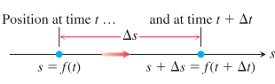
  
图 3.14 沿坐标线运动的物体在时间 $t$ 和稍后的时间 $t+\Delta t$ 的位置。这里的坐标线是水平的。

而物体在这个时间间隔内的平均速度为

$$
v_{\text{av}}
=\frac{\Delta s}{\Delta t}
=\frac{f(t+\Delta t)-f(t)}{\Delta t}.
$$

为了求物体在精确时刻 $t$ 的速度，我们让 $\Delta t$ 缩小到零，取从 $t$ 到 $t+\Delta t$ 的时间间隔上的平均速度的极限。这个极限就是 $f$ 关于 $t$ 的导数。

  

    
定义

    
速度（瞬时速度）是位置关于时间的导数。若物体在时间 $t$ 的位置为 $s=f(t)$，则物体在时间 $t$ 的速度为

    

      $$
      v(t)=\frac{ds}{dt}
      =\lim_{\Delta t\to 0}\frac{f(t+\Delta t)-f(t)}{\Delta t}.
      $$
    

  

除了说明物体沿图 3.14 中的水平直线运动得有多快以外，速度还说明运动的方向。当物体向前运动（$s$ 增大）时，速度为正；当物体向后运动（$s$ 减小）时，速度为负。若坐标线是竖直的，则速度为正表示物体向上运动，速度为负表示物体向下运动。图 3.15 中的蓝色曲线表示直线上位置随时间的变化；它们并不描绘运动路径，运动路径位于竖直的 $s$ 轴上。

如果我们以每小时 $30$ 英里的速度开车去朋友家再返回，速度表在去的路上显示 $30$，但在回来的路上不会显示 $-30$，即使我们离家的距离正在减小。速度表总是显示速率，即速度的绝对值。速率度量的是前进快慢，而不考虑方向。

  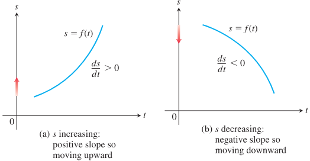
  
图 3.15 对沿直线（竖直轴）运动的 $s=f(t)$，当 $s$ 增加时，$v=\frac{ds}{dt}$ 为正；当 $s$ 减少时，$v=\frac{ds}{dt}$ 为负。

  

    
定义

    
速率是速度的绝对值。

    

      $$
      \text{Speed}=|v(t)|=\left|\frac{ds}{dt}\right|.
      $$
    

  

**例 2** 图 3.16 显示了一个沿水平直线运动的粒子的速度 $v=f'(t)$ 的图像（这不同于图 3.15 那样显示位置函数 $s=f(t)$）。在速度函数的图像中，告诉我们粒子是沿直线向前还是向后运动的，不是曲线的斜率（运动所在的直线没有画出），而是速度的符号。观察图 3.16 可知，粒子在前 $3$ 秒向前运动（速度为正），接下来的 $2$ 秒向后运动（速度为负），静止整整 $1$ 秒，然后又向前运动。第 $1$ 秒内正速度增大，粒子在加速；接下来的 $1$ 秒以恒定速率运动；第 $3$ 秒内速度减小到零，粒子减速。它在 $t=3$ 秒时瞬时停止（速度为零），并在速度开始变为负时改变方向。此时粒子向后运动并逐渐加快，直到 $t=4$ 秒，这时它达到向后运动过程中的最大速率。继续向后运动时，从 $t=4$ 开始，粒子又开始减速，直到 $t=5$ 时最终停止（速度再次为零）。随后粒子保持静止整整 $1$ 秒，然后在 $t=6$ 秒时再次向前运动，并在速度图像所示的最后 $1$ 秒向前运动中加速。

  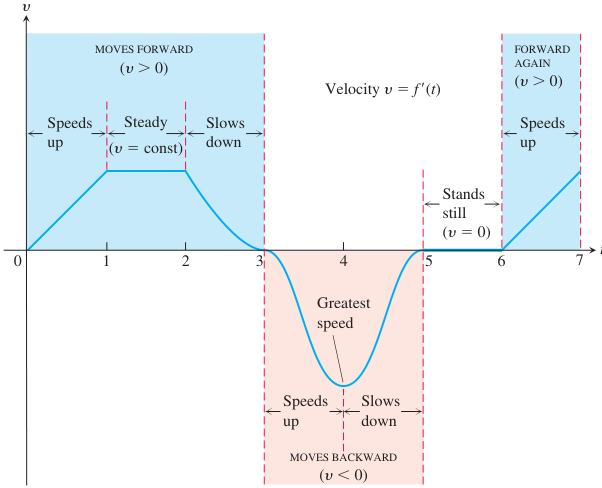
  
图 3.16 例 2 中讨论的沿水平直线运动的粒子的速度图像。

物体速度变化的速率称为物体的加速度。加速度度量物体增加或减少速率的快慢。在第 13 章中，我们将研究平面和空间中的运动，在那里物体的加速度也可能导致方向的改变。

加速度的突然变化称为急动度。当乘坐汽车或公共汽车时感觉颠簸，并不是因为所涉及的加速度一定很大，而是因为加速度的变化很突然。

  

    
定义

    
加速度是速度关于时间的导数。若物体在时间 $t$ 的位置为 $s=f(t)$，则物体在时间 $t$ 的加速度为

    

      $$
      a(t)=\frac{dv}{dt}=\frac{d^2s}{dt^2}.
      $$
    

    
急动度是加速度关于时间的导数：

    

      $$
      j(t)=\frac{da}{dt}=\frac{d^3s}{dt^3}.
      $$
    

  

在地球表面附近，所有物体都以相同的常加速度下落。伽利略的自由落体实验（见第 2.1 节）得到方程

$$
s=\frac{1}{2}gt^2,
$$

其中 $s$ 是下落距离，$g$ 是由地球引力产生的加速度。这个方程在真空中成立；在下落最初几秒、空气阻力影响还不显著时，它也能很好地模拟密实重物（例如岩石或钢制工具）的下落。

$s=\frac{1}{2}gt^2$ 中 $g$ 的值取决于测量 $t$ 和 $s$ 所使用的单位。当 $t$ 以秒为单位时（通常如此），在海平面处测得的 $g$ 在英制单位中约为 $32\text{ ft/sec}^2$，在公制单位中为 $9.8\text{ m/sec}^2$。（这些重力常数取决于到地球质心的距离，例如在珠穆朗玛峰顶会稍小一些。）与重力常加速度（$g=32\text{ ft/sec}^2$）相伴的急动度为零：

$$
j=\frac{d}{dt}(g)=0.
$$

物体在自由落体过程中不会表现出急动。

**例 3** 图 3.17 显示一个重球从静止开始，在 $t=0$ 秒释放后的自由落体。

**(a)** 前 $3$ 秒内球下落多少米？

**(b)** 当 $t=3$ 时，它的速度、速率和加速度各是多少？

  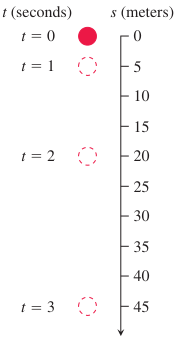
  
图 3.17 一个重球从静止开始下落（例 3）。

**解：**

**(a)** 公制自由落体方程为 $s=4.9t^2$。在前 $3$ 秒内，球下落

$$
s(3)=4.9(3)^2=44.1\text{ m}.
$$

**(b)** 在任意时刻 $t$，速度是位置的导数：

$$
v(t)=s'(t)=\frac{d}{dt}(4.9t^2)=9.8t.
$$

当 $t=3$ 时，速度为 $v(3)=29.4\text{ m/sec}$，方向向下（$s$ 增大的方向）。$t=3$ 时的速率为

$$
\text{speed}=|v(3)|=29.4\text{ m/sec}.
$$

任意时刻 $t$ 的加速度为

$$
a(t)=v'(t)=s''(t)=9.8\text{ m/sec}^2.
$$

在 $t=3$ 时，加速度为 $9.8\text{ m/sec}^2$。

**例 4** 一次炸药爆炸把一块重岩石以 $160\text{ ft/sec}$（约 $109\text{ mph}$）的初速度竖直向上抛出（图 3.18a）。爆炸后 $t$ 秒，岩石达到的高度为 $s=160t-16t^2$ 英尺。**(a)** 岩石能升到多高？**(b)** 岩石在上升途中离地 $256\text{ ft}$ 时的速度和速率是多少？在下降途中呢？**(c)** 爆炸后岩石飞行过程中任意时刻 $t$ 的加速度是多少？**(d)** 岩石何时再次落到地面？

  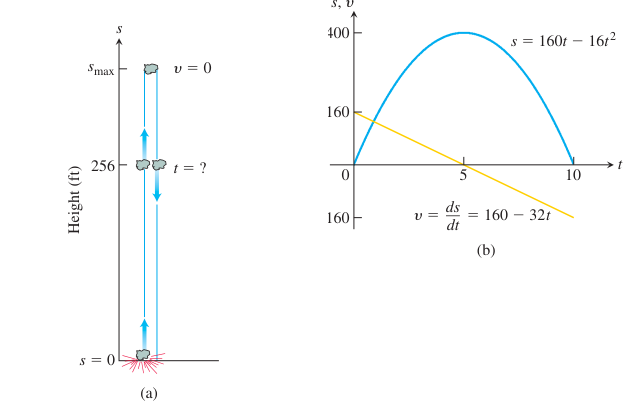
  
图 3.18 (a) 例 4 中的岩石。(b) $s$ 和 $v$ 关于时间的图像；当 $v=\frac{ds}{dt}=0$ 时，$s$ 最大。$s$ 的图像不是岩石的运动路径，而是高度随时间变化的图像。该图像的斜率就是岩石的速度，这里把速度画成了一条直线。

**解：**

**(a)** 在我们选取的坐标系中，$s$ 表示从地面向上量得的高度，因此上升途中速度为正，下降途中速度为负。岩石处在最高点的瞬间，是整个飞行过程中速度为 $0$ 的唯一瞬间。为了求最大高度，我们只需先求 $v=0$ 的时刻，再在这个时刻计算 $s$。

岩石运动过程中任意时刻 $t$ 的速度为

$$
v=\frac{ds}{dt}
=\frac{d}{dt}(160t-16t^2)
=160-32t\ \text{ft/sec}.
$$

速度为零当且仅当

$$
160-32t=0,
\qquad\text{即}\qquad
t=5\text{ sec}.
$$

岩石在 $t=5$ 秒时的高度为

$$
s_{\max}=s(5)=160(5)-16(5)^2=800-400=400\text{ ft}.
$$

见图 3.18b。

**(b)** 为了求岩石在上升途中和下降途中离地 $256\text{ ft}$ 时的速度，我们先求满足

$$
s(t)=160t-16t^2=256
$$

的两个 $t$ 值。解这个方程，写成

$$
\begin{aligned}
16t^2-160t+256&=0,\\
16(t^2-10t+16)&=0,\\
(t-2)(t-8)&=0,
\end{aligned}
$$

所以

$$
t=2\text{ sec},\qquad t=8\text{ sec}.
$$

爆炸后 $2$ 秒，岩石离地 $256\text{ ft}$；爆炸后 $8$ 秒，岩石再次离地 $256\text{ ft}$。岩石在这两个时刻的速度为

$$
\begin{aligned}
v(2)&=160-32(2)=160-64=96\text{ ft/sec},\\
v(8)&=160-32(8)=160-256=-96\text{ ft/sec}.
\end{aligned}
$$

在这两个时刻，岩石的速率都是 $96\text{ ft/sec}$。由于 $v(2)>0$，岩石在 $t=2$ 秒时向上运动（$s$ 增大）；由于 $v(8)<0$，岩石在 $t=8$ 秒时向下运动（$s$ 减小）。

**(c)** 爆炸后飞行过程中任意时刻，岩石的加速度是常数

$$
a=\frac{dv}{dt}
=\frac{d}{dt}(160-32t)
=-32\text{ ft/sec}^2.
$$

加速度始终向下，是重力作用在岩石上的结果。岩石上升时减速；岩石下落时加速。

**(d)** 岩石落到地面时对应满足 $s=0$ 的正时间 $t$。方程

$$
160t-16t^2=0
$$

可因式分解为

$$
16t(10-t)=0,
$$

因此解为 $t=0$ 和 $t=10$。在 $t=0$ 时，爆炸发生，岩石被向上抛出；$10$ 秒后，它回到地面。

### 经济学中的导数

工程师用速度和加速度这些术语来指描述运动的函数的导数。经济学家也有一套专门用于变化率和导数的词汇。他们把这些量称为边际量。

在制造活动中，生产成本 $c(x)$ 是关于 $x$ 的函数，其中 $x$ 是生产的单位数。生产的边际成本就是成本相对于生产水平的变化率，因此它是 $\frac{dc}{dx}$。

假设 $c(x)$ 表示一周生产 $x$ 吨钢所需的美元数。每周生产 $x+h$ 吨会花费更多；成本差除以 $h$，就是每多生产一吨的平均成本：

$$
\frac{c(x+h)-c(x)}{h}
=\text{额外生产的 }h\text{ 吨钢中每吨的平均成本}.
$$

当 $h\to 0$ 时，这个比值的极限就是当前周产量为 $x$ 吨时，多生产钢的边际成本（图 3.19）：

$$
\frac{dc}{dx}
=\lim_{h\to 0}\frac{c(x+h)-c(x)}{h}
=\text{生产的边际成本}.
$$

  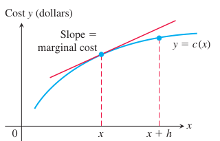
  
图 3.19 每周钢产量：$c(x)$ 是每周生产 $x$ 吨钢的成本。额外生产 $h$ 吨的成本为 $c(x+h)-c(x)$。

有时，生产的边际成本也被宽泛地定义为多生产一个单位所需的额外成本：

$$
\frac{\Delta c}{\Delta x}
=\frac{c(x+1)-c(x)}{1},
$$

这个值可用 $x$ 处的 $\frac{dc}{dx}$ 来近似。如果 $c$ 的图像在 $x$ 附近斜率变化不快，这种近似是可以接受的。此时差商会接近它的极限 $\frac{dc}{dx}$，而当 $\Delta x=1$ 时，这个极限就是切线的升高量（图 3.20）。这种近似在 $x$ 较大时效果最好。

  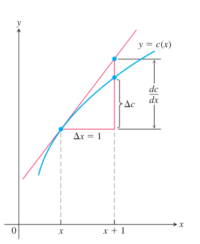
  
图 3.20 边际成本 $\frac{dc}{dx}$ 近似等于多生产 $\Delta x=1$ 个单位时的额外成本 $\Delta c$。

经济学家常用三次多项式

$$
c(x)=\alpha x^3+\beta x^2+\gamma x+\delta
$$

表示总成本函数，其中 $\delta$ 表示固定成本，例如租金、供暖费、设备资本化成本和管理成本。其他项表示可变成本，例如原材料、税费和劳动力成本。固定成本与生产的单位数量无关，而可变成本取决于生产数量。三次多项式通常足以描述现实数量区间内的成本行为。

**例 5** 假设当生产 $8$ 到 $30$ 个散热器时，生产 $x$ 个散热器的成本为

$$
c(x)=x^3-6x^2+15x
$$

美元，并且销售 $x$ 个散热器所得的美元收益为

$$
r(x)=x^3-3x^2+12x.
$$

你的车间目前每天生产 $10$ 个散热器。每天多生产一个散热器大约会增加多少成本？如果每天销售 $11$ 个散热器，估计收益会增加多少？

**解：** 当生产 $10$ 个散热器时，每天多生产一个散热器的成本约为 $c'(10)$：

$$
c'(x)=\frac{d}{dx}(x^3-6x^2+15x)=3x^2-12x+15,
$$

$$
c'(10)=3(100)-12(10)+15=195.
$$

额外成本约为 $195$ 美元。边际收益为

$$
r'(x)=\frac{d}{dx}(x^3-3x^2+12x)=3x^2-6x+12.
$$

边际收益函数估计的是多销售一个单位会带来的收益增加量。如果你目前每天销售 $10$ 个散热器，那么当销售量增加到每天 $11$ 个时，预期收益大约会增加

$$
r'(10)=3(100)-6(10)+12=252
$$

美元。

**例 6** 为了对边际率的语言有一点感觉，可以考虑边际税率。如果你的边际所得税率为 $28\%$，而你的收入增加了 $1000$ 美元，那么你可以预期要多缴 $280$ 美元的税。这并不意味着你要把全部收入的 $28\%$ 用来缴税。它只是表示，在你当前的收入水平 $I$ 下，税额 $T$ 相对于收入的增长率为

$$
\frac{dT}{dI}=0.28.
$$

你每多赚 $1$ 美元，就要从中缴纳 $0.28$ 美元的税。当然，如果你的收入增加很多，你可能会进入更高的税级，边际税率也会随之提高。

### 对变化的敏感性

当 $x$ 的一个小变化会导致函数 $f(x)$ 的值发生较大变化时，我们说该函数对 $x$ 的变化相对敏感。导数 $f'(x)$ 是这种敏感性的一个量度。

**例 7** 遗传数据与对变化的敏感性

奥地利修士格雷戈尔·约翰·孟德尔（Gregor Johann Mendel，1822--1884）用豌豆和其他植物进行研究，为杂交现象提供了第一个科学解释。他的详细记录表明，如果 $p$（介于 $0$ 和 $1$ 之间的数）是豌豆中光滑表皮基因（显性）的频率，而 $1-p$ 是豌豆中皱缩表皮基因的频率，那么下一代中光滑表皮豌豆所占的比例为

$$
y=2p(1-p)+p^2=2p-p^2.
$$

图 3.21a 中 $y$ 关于 $p$ 的图像表明，当 $p$ 较小时，$y$ 的值对 $p$ 的变化比 $p$ 较大时更敏感。事实上，这一点也由图 3.21b 中的导数图像得到证实：当 $p$ 接近 $0$ 时，$\frac{dy}{dp}$ 接近 $2$；当 $p$ 接近 $1$ 时，$\frac{dy}{dp}$ 接近 $0$。它在遗传学上的含义是：在皱缩表皮豌豆频率很高的种群中，引入少量更多的光滑表皮基因，对后代会产生更显著的影响；而在光滑表皮豌豆比例已经很高的种群中，同样的增加所产生的影响则较小。

  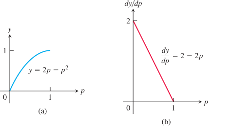
  
图 3.21 (a) $y=2p-p^2$ 的图像，描述下一代中光滑表皮豌豆的比例。(b) $\frac{dy}{dp}$ 的图像（例 7）。

## 3.5 三角函数的导数

自然界中的许多现象都近似呈周期性（电磁场、心律、潮汐、天气）。正弦函数和余弦函数的导数在描述周期性变化时起着关键作用。本节说明如何对六个基本三角函数求导。

### 正弦函数的导数

为了计算 $f(x)=\sin x$ 的导数（其中 $x$ 以弧度为单位），我们把第 2.4 节例 5a 和定理 7 中的极限，与正弦函数的和角公式结合起来：

$$
\sin(x+h)=\sin x\cos h+\cos x\sin h.
$$

如果 $f(x)=\sin x$，则

$$
\begin{aligned}
f'(x)
&=\lim_{h\to 0}\frac{f(x+h)-f(x)}{h} && \text{导数定义}\\
&=\lim_{h\to 0}\frac{\sin(x+h)-\sin x}{h}\\
&=\lim_{h\to 0}\frac{(\sin x\cos h+\cos x\sin h)-\sin x}{h} && \text{正弦和角公式}\\
&=\lim_{h\to 0}\frac{\sin x(\cos h-1)+\cos x\sin h}{h}\\
&=\lim_{h\to 0}\left(\sin x\cdot\frac{\cos h-1}{h}\right)
 +\lim_{h\to 0}\left(\cos x\cdot\frac{\sin h}{h}\right)\\
&=\sin x\cdot\lim_{h\to 0}\frac{\cos h-1}{h}
 +\cos x\cdot\lim_{h\to 0}\frac{\sin h}{h}\\
&=\sin x\cdot 0+\cos x\cdot 1 && \text{第 2.4 节例 5a 和定理 7}\\
&=\cos x.
\end{aligned}
$$

因此，正弦函数的导数是余弦函数：

  

    
正弦函数的导数

    
正弦函数的导数是余弦函数：

    

      $$
      \frac{d}{dx}(\sin x)=\cos x.
      $$
    

  

**例 1** 我们求一些含有正弦函数并涉及差、积和商的函数的导数。

**(a)** $y=x^2-\sin x$：

$$
\frac{dy}{dx}
=2x-\frac{d}{dx}(\sin x)
\qquad \text{差法则}
$$

$$
=2x-\cos x.
$$

**(b)** $y=e^x\sin x$：

$$
\begin{aligned}
\frac{dy}{dx}
&=e^x\frac{d}{dx}(\sin x)+\frac{d}{dx}(e^x)\sin x
&& \text{积法则}\\
&=e^x\cos x+e^x\sin x\\
&=e^x(\cos x+\sin x).
\end{aligned}
$$

**(c)** $y=\frac{\sin x}{x}$：

$$
\begin{aligned}
\frac{dy}{dx}
&=\frac{x\cdot\frac{d}{dx}(\sin x)-\sin x\cdot 1}{x^2}
&& \text{商法则}\\
&=\frac{x\cos x-\sin x}{x^2}.
\end{aligned}
$$

### 余弦函数的导数

借助余弦函数的和角公式

$$
\cos(x+h)=\cos x\cos h-\sin x\sin h,
$$

我们可以计算差商的极限：

$$
\begin{aligned}
\frac{d}{dx}(\cos x)
&=\lim_{h\to 0}\frac{\cos(x+h)-\cos x}{h}
&& \text{导数定义}\\
&=\lim_{h\to 0}\frac{(\cos x\cos h-\sin x\sin h)-\cos x}{h}
&& \text{余弦和角公式}\\
&=\lim_{h\to 0}\frac{\cos x(\cos h-1)-\sin x\sin h}{h}\\
&=\lim_{h\to 0}\cos x\cdot\frac{\cos h-1}{h}
-\lim_{h\to 0}\sin x\cdot\frac{\sin h}{h}\\
&=\cos x\cdot\lim_{h\to 0}\frac{\cos h-1}{h}
-\sin x\cdot\lim_{h\to 0}\frac{\sin h}{h}\\
&=\cos x\cdot 0-\sin x\cdot 1
&& \text{第 2.4 节例 5a 和定理 7}\\
&=-\sin x.
\end{aligned}
$$

余弦函数的导数是正弦函数的相反数：

  

    
余弦函数的导数

    
余弦函数的导数是正弦函数的相反数：

    

      $$
      \frac{d}{dx}(\cos x)=-\sin x.
      $$
    

  

图 3.22 以类似第 3.2 节图 3.6 中作导函数图像的方式，展示了如何直观理解这一结果。

  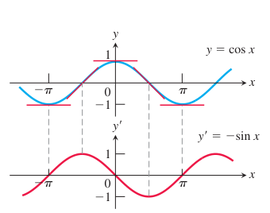
  
图 3.22 曲线 $y'=-\sin x$ 是曲线 $y=\cos x$ 的切线斜率图像。

**例 2** 我们求一些余弦函数与其他函数组合后的导数。

**(a)** $y=5e^x+\cos x$：

$$
\begin{aligned}
\frac{dy}{dx}
&=\frac{d}{dx}(5e^x)+\frac{d}{dx}(\cos x)
&& \text{和法则}\\
&=5e^x-\sin x.
\end{aligned}
$$

**(b)** $y=\sin x\cos x$：

$$
\begin{aligned}
\frac{dy}{dx}
&=\sin x\frac{d}{dx}(\cos x)+\cos x\frac{d}{dx}(\sin x)
&& \text{积法则}\\
&=\sin x(-\sin x)+\cos x(\cos x)\\
&=\cos^2 x-\sin^2 x.
\end{aligned}
$$

**(c)** $y=\frac{\cos x}{1-\sin x}$：

$$
\begin{aligned}
\frac{dy}{dx}
&=\frac{(1-\sin x)\frac{d}{dx}(\cos x)-\cos x\frac{d}{dx}(1-\sin x)}
{(1-\sin x)^2}
&& \text{商法则}\\
&=\frac{(1-\sin x)(-\sin x)-\cos x(0-\cos x)}
{(1-\sin x)^2}\\
&=\frac{1-\sin x}{(1-\sin x)^2}
&& \sin^2 x+\cos^2 x=1\\
&=\frac{1}{1-\sin x}.
\end{aligned}
$$

### 简谐运动

弹簧末端的物体或重物在没有阻力的情况下自由上下振动，是简谐运动的一个例子。这种运动是周期性的，并且会无限重复，因此我们用三角函数来表示它。下一个例子描述的是没有摩擦等阻碍运动的力存在的情形。

**例 3** 一个挂在弹簧上的重物（图 3.23）被向下拉伸到超过静止位置 $5$ 个单位处，并在 $t=0$ 时释放，使它上下振动。以后任意时刻 $t$ 的位置为 $s=5\cos t$。求它在时刻 $t$ 的速度和加速度。

  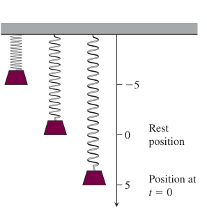
  
图 3.23 挂在竖直弹簧上的重物被位移后，在静止位置上下振动（例 3）。

**解：** 我们有

$$
\begin{array}{rl}
\text{位置：} & s=5\cos t,\\[0.35em]
\text{速度：} & v=\dfrac{ds}{dt}=\dfrac{d}{dt}(5\cos t)=-5\sin t,\\[0.7em]
\text{加速度：} & a=\dfrac{dv}{dt}=\dfrac{d}{dt}(-5\sin t)=-5\cos t.
\end{array}
$$

注意，从这些方程中我们可以得到许多信息：

1. 随着时间推移，重物在 $s$ 轴上 $s=-5$ 与 $s=5$ 之间上下运动。运动的振幅为 $5$。运动的周期为 $2\pi$，即余弦函数的周期。

2. 速度 $v=-5\sin t$ 在 $\cos t=0$ 时达到最大绝对值 $5$，如图 3.24 所示。因此，重物的速率 $|v|=5|\sin t|$ 在 $\cos t=0$ 时最大，也就是在 $s=0$（静止位置）时最大。当 $\sin t=0$ 时，重物的速率为零。这发生在 $s=5\cos t=\pm 5$ 时，即运动区间的端点处。

  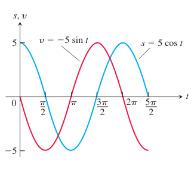
  
图 3.24 例 3 中重物的位置和速度图像。

3. 重物受到弹簧和重力的共同作用。当重物低于静止位置时，合力把它向上拉；当重物高于静止位置时，合力把它向下拉。重物的加速度总是与其位移的相反数成正比。弹簧的这一性质称为胡克定律，将在第 6.5 节进一步研究。

4. 加速度 $a=-5\cos t$ 只在静止位置处为零，此时 $\cos t=0$，重力和弹簧力相互平衡。当重物在其他任何位置时，这两个力不相等，加速度不为零。加速度的大小在离静止位置最远的点处最大，此时 $\cos t=\pm 1$。

**例 4** 例 3 中简谐运动对应的急动度为

$$
j=\frac{da}{dt}
=\frac{d}{dt}(-5\cos t)
=5\sin t.
$$

当 $\sin t=\pm 1$ 时，急动度的大小最大。这并不发生在位移达到极值的位置，而是发生在静止位置；在那里，加速度改变方向并改变符号。

### 其他基本三角函数的导数

因为 $\sin x$ 和 $\cos x$ 都是 $x$ 的可导函数，所以相关函数 $\tan x=\frac{\sin x}{\cos x}$、$\cot x=\frac{\cos x}{\sin x}$、$\sec x=\frac{1}{\cos x}$ 和 $\csc x=\frac{1}{\sin x}$ 在其有定义的每个 $x$ 值处都是可导的。它们的导数由商法则计算得到，如下列公式所示。注意余函数导数公式中的负号。

  

    
其他三角函数的导数

    

      $$
      \begin{aligned}
      \frac{d}{dx}(\tan x)&=\sec^2 x,\\
      \frac{d}{dx}(\cot x)&=-\csc^2 x,\\
      \frac{d}{dx}(\sec x)&=\sec x\tan x,\\
      \frac{d}{dx}(\csc x)&=-\csc x\cot x.
      \end{aligned}
      $$
    

  

为了展示一个典型计算，我们求正切函数的导数。其他推导留作习题 60。

**例 5** 求 $\frac{d}{dx}(\tan x)$。

**解：** 我们用商法则来计算：

$$
\begin{aligned}
\frac{d}{dx}(\tan x)
&=\frac{d}{dx}\left(\frac{\sin x}{\cos x}\right)\\
&=\frac{\cos x\frac{d}{dx}(\sin x)-\sin x\frac{d}{dx}(\cos x)}{\cos^2 x}
&& \text{商法则}\\
&=\frac{\cos x\cos x-\sin x(-\sin x)}{\cos^2 x}\\
&=\frac{\cos^2 x+\sin^2 x}{\cos^2 x}\\
&=\frac{1}{\cos^2 x}\\
&=\sec^2 x.
\end{aligned}
$$

**例 6** 若 $y=\sec x$，求 $y''$。

**解：** 求二阶导数会用到三角函数导数的组合：

$$
\begin{aligned}
y&=\sec x,\\
y'&=\sec x\tan x
&& \text{正割函数的求导法则}\\
y''
&=\frac{d}{dx}(\sec x\tan x)\\
&=\sec x\frac{d}{dx}(\tan x)+\tan x\frac{d}{dx}(\sec x)
&& \text{乘积法则}\\
&=\sec x(\sec^2 x)+\tan x(\sec x\tan x)
&& \text{三角函数求导法则}\\
&=\sec^3 x+\sec x\tan^2 x.
\end{aligned}
$$

三角函数在其整个定义域内可导这一事实，也给出了它们在定义域中每一点连续的另一个证明（第 3.2 节定理 1）。因此，对于三角函数的代数组合和复合函数，我们可以用直接代入来计算极限。

**例 7** 只要没有除以零这种代数上无定义的情形，就可以用直接代入计算极限。

$$
\begin{aligned}
\lim_{x\to 0}\sqrt{2+\sec x}\,\cos(\pi-\tan x)
&=\sqrt{2+\sec 0}\,\cos(\pi-\tan 0)\\
&=\sqrt{2+1}\,\cos(\pi-0)\\
&=\sqrt3(-1)\\
&=-\sqrt3.
\end{aligned}
$$

## 3.6 链式法则

怎样求 $F(x)=\sin(x^2-4)$ 的导数？这个函数是两个我们已经知道如何求导的函数 $y=f(u)=\sin u$ 和 $u=g(x)=x^2-4$ 的复合函数 $f\circ g$。链式法则给出的答案是：导数等于 $f$ 和 $g$ 的导数的乘积。本节将建立这一法则。

### 复合函数的导数

函数 $y=\frac{3}{2}x=\frac{1}{2}(3x)$ 是函数 $y=\frac{1}{2}u$ 和 $u=3x$ 的复合。我们有

$$
\frac{dy}{dx}=\frac{3}{2},\qquad
\frac{dy}{du}=\frac{1}{2},\qquad
\frac{du}{dx}=3.
$$

因为 $\frac{3}{2}=\frac{1}{2}\cdot 3$，所以在这个例子中

$$
\frac{dy}{dx}=\frac{dy}{du}\cdot\frac{du}{dx}.
$$

如果把导数看作变化率，我们的直觉也会认为这个关系是合理的。如果 $y=f(u)$ 的变化速度是 $u$ 的一半，而 $u=g(x)$ 的变化速度是 $x$ 的三倍，那么我们预期 $y$ 相对于 $x$ 的变化速度为 $\frac{3}{2}$ 倍。这种效果很像多级齿轮传动（图 3.25）。下面再看一个例子。

  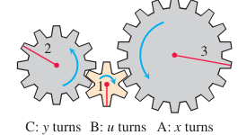
  
图 3.25 当齿轮 A 转 $x$ 圈时，齿轮 B 转 $u$ 圈，齿轮 C 转 $y$ 圈。通过比较周长或数齿数可知，$y=u/2$（C 对 B 的每一圈转半圈），而 $u=3x$（B 对 A 的每一圈转三圈），所以 $y=3x/2$。因此，$\frac{dy}{dx}=\frac{3}{2}=\left(\frac{1}{2}\right)(3)=\frac{dy}{du}\frac{du}{dx}$。

**例 1** 函数

$$
y=(3x^2+1)^2
$$

是 $y=f(u)=u^2$ 和 $u=g(x)=3x^2+1$ 的复合。计算导数可得

$$
\begin{aligned}
\frac{dy}{du}\cdot\frac{du}{dx}
&=2u\cdot 6x\\
&=2(3x^2+1)\cdot 6x && \text{代入 }u\\
&=36x^3+12x.
\end{aligned}
$$

如果先展开 $(3x^2+1)^2=9x^4+6x^2+1$，再求导，也得到同样的结果：

$$
\frac{dy}{dx}
=\frac{d}{dx}(9x^4+6x^2+1)
=36x^3+12x.
$$

复合函数 $f(g(x))$ 在 $x$ 处的导数，是 $f$ 在 $g(x)$ 处的导数乘以 $g$ 在 $x$ 处的导数。这就是链式法则（图 3.26）。

  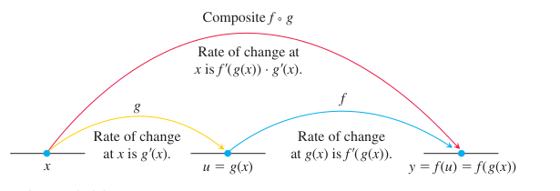
  
图 3.26 变化率相乘：$f\circ g$ 在 $x$ 处的导数，是 $f$ 在 $g(x)$ 处的导数乘以 $g$ 在 $x$ 处的导数。

  

    
定理 2——链式法则

    
若 $f(u)$ 在点 $u=g(x)$ 处可导，且 $g(x)$ 在 $x$ 处可导，则复合函数 $(f\circ g)(x)=f(g(x))$ 在 $x$ 处可导，并且

    

      $$
      (f\circ g)'(x)=f'(g(x))\cdot g'(x).
      $$
    

    
用莱布尼茨记号表示，若 $y=f(u)$ 且 $u=g(x)$，则

    

      $$
      \frac{dy}{dx}=\frac{dy}{du}\cdot\frac{du}{dx},
      $$
    

    
其中 $\frac{dy}{du}$ 在 $u=g(x)$ 处取值。

  

**链式法则一种情形的证明** 设 $\Delta u$ 是当 $x$ 改变量为 $\Delta x$ 时 $u$ 的改变量，因此

$$
\Delta u=g(x+\Delta x)-g(x).
$$

于是 $y$ 的相应改变量为

$$
\Delta y=f(u+\Delta u)-f(u).
$$

如果 $\Delta u\ne 0$，可以把商 $\Delta y/\Delta x$ 写成乘积

$$
\frac{\Delta y}{\Delta x}
=\frac{\Delta y}{\Delta u}\cdot\frac{\Delta u}{\Delta x}. \tag{1}
$$

令 $\Delta x\to 0$，得

$$
\begin{aligned}
\frac{dy}{dx}
&=\lim_{\Delta x\to 0}\frac{\Delta y}{\Delta x}\\
&=\lim_{\Delta x\to 0}\frac{\Delta y}{\Delta u}\cdot\frac{\Delta u}{\Delta x}\\
&=\lim_{\Delta x\to 0}\frac{\Delta y}{\Delta u}\cdot
\lim_{\Delta x\to 0}\frac{\Delta u}{\Delta x}\\
&=\lim_{\Delta u\to 0}\frac{\Delta y}{\Delta u}\cdot
\lim_{\Delta x\to 0}\frac{\Delta u}{\Delta x}\\
&=\frac{dy}{du}\cdot\frac{du}{dx}.
\end{aligned}
$$

这里用到 $\Delta x\to 0$ 时 $\Delta u\to 0$，因为 $g$ 连续。不过这个论证有一个问题：如果函数 $g(x)$ 在 $x$ 附近剧烈振荡，那么即使 $\Delta x\ne 0$，也可能有 $\Delta u=0$，此时上式中约去 $\Delta u$ 就不合法。完整证明需要另一种避免这一问题的方法，我们将在第 3.11 节给出。

**例 2** 一个物体沿 $x$ 轴运动，其在任意时刻 $t\ge 0$ 的位置为 $x(t)=\cos(t^2+1)$。求该物体的速度作为 $t$ 的函数。

**解：** 我们知道速度是 $\frac{dx}{dt}$。在这里，$x$ 是一个复合函数：$x=\cos u$，$u=t^2+1$。我们有

$$
\frac{dx}{du}=-\sin u,\qquad
\frac{du}{dt}=2t.
$$

由链式法则，

$$
\begin{aligned}
\frac{dx}{dt}
&=\frac{dx}{du}\cdot\frac{du}{dt}\\
&=-\sin u\cdot 2t\\
&=-\sin(t^2+1)\cdot 2t\\
&=-2t\sin(t^2+1).
\end{aligned}
$$

### “外层—内层”法则

莱布尼茨记号的一个困难是，它没有明确说明链式法则中的导数应当在哪里取值。因此，有时用函数记号来理解链式法则会更有帮助。如果 $y=f(g(x))$，则

$$
\frac{dy}{dx}=f'(g(x))\cdot g'(x).
$$

用语言来说，就是先对“外层”函数 $f$ 求导，并在保持“内层”函数 $g(x)$ 不变的情况下取值；然后再乘以内层函数的导数。

**链式法则的几种写法**

$$
\begin{aligned}
(f\circ g)'(x)&=f'(g(x))\cdot g'(x),\\
\frac{dy}{dx}&=\frac{dy}{du}\cdot\frac{du}{dx},\\
\frac{dy}{dx}&=f'(g(x))\cdot g'(x),\\
\frac{d}{dx}f(u)&=f'(u)\frac{du}{dx}.
\end{aligned}
$$

**例 3** 求 $\sin(x^2+e^x)$ 关于 $x$ 的导数。

**解：** 直接应用链式法则，得到

$$
\frac{d}{dx}\sin(x^2+e^x)
=\cos(x^2+e^x)\cdot(2x+e^x).
$$

**例 4** 求 $y=e^{\cos x}$ 的导数。

**解：** 这里内层函数是 $u=g(x)=\cos x$，外层函数是指数函数 $f(x)=e^x$。应用链式法则，得到

$$
\begin{aligned}
\frac{dy}{dx}
&=\frac{d}{dx}\left(e^{\cos x}\right)\\
&=e^{\cos x}\frac{d}{dx}(\cos x)\\
&=e^{\cos x}(-\sin x)\\
&=-e^{\cos x}\sin x.
\end{aligned}
$$

推广例 4 可知，链式法则给出公式

$$
\frac{d}{dx}e^u=e^u\frac{du}{dx}.
$$

例如，对任意常数 $k$，

$$
\frac{d}{dx}(e^{kx})=e^{kx}\frac{d}{dx}(kx)=ke^{kx},
$$

并且

$$
\frac{d}{dx}(e^{x^2})=e^{x^2}\frac{d}{dx}(x^2)=2xe^{x^2}.
$$

### 反复使用链式法则

有时，为了求导，我们需要使用链式法则两次或更多次。

**例 5** 求 $g(t)=\tan(5-\sin 2t)$ 的导数。

**解：** 注意这里正切函数作用于 $5-\sin 2t$，而正弦函数作用于 $2t$，后者本身又是 $t$ 的函数。因此，由链式法则，

$$
\begin{aligned}
g'(t)
&=\frac{d}{dt}\bigl(\tan(5-\sin 2t)\bigr)\\
&=\sec^2(5-\sin 2t)\cdot\frac{d}{dt}(5-\sin 2t)
&& \text{对 }u=5-\sin 2t\text{ 使用 }\frac{d}{du}(\tan u)\\
&=\sec^2(5-\sin 2t)\cdot
\left(0-\cos 2t\cdot\frac{d}{dt}(2t)\right)
&& \text{对 }u=2t\text{ 使用 }\frac{d}{du}(5-\sin u)\\
&=\sec^2(5-\sin 2t)\cdot(-\cos 2t)\cdot 2\\
&=-2(\cos 2t)\sec^2(5-\sin 2t).
\end{aligned}
$$

### 函数幂的链式法则

如果 $f$ 是 $u$ 的可导函数，且 $u$ 是 $x$ 的可导函数，那么把 $y=f(u)$ 代入链式法则公式

$$
\frac{dy}{dx}=\frac{dy}{du}\cdot\frac{du}{dx}
$$

得到

$$
\frac{d}{dx}f(u)=f'(u)\frac{du}{dx}.
$$

若 $n$ 是任意实数，且 $f$ 是幂函数 $f(u)=u^n$，则幂法则告诉我们 $f'(u)=nu^{n-1}$。如果 $u$ 是 $x$ 的可导函数，那么可以用链式法则把它推广为幂链式法则：

$$
\frac{d}{dx}(u^n)=nu^{n-1}\frac{du}{dx}.
$$

同时

$$
\frac{d}{du}(u^n)=nu^{n-1}.
$$

**例 6** 幂链式法则使“表达式的幂”的求导变得更简单。

**(a)**

$$
\begin{aligned}
\frac{d}{dx}(5x^3-x^4)^7
&=7(5x^3-x^4)^6\frac{d}{dx}(5x^3-x^4)
&& \text{幂链式法则，}u=5x^3-x^4,\ n=7\\
&=7(5x^3-x^4)^6(5\cdot 3x^2-4x^3)\\
&=7(5x^3-x^4)^6(15x^2-4x^3).
\end{aligned}
$$

**(b)**

$$
\begin{aligned}
\frac{d}{dx}\left(\frac{1}{3x-2}\right)
&=\frac{d}{dx}(3x-2)^{-1}\\
&=-1(3x-2)^{-2}\frac{d}{dx}(3x-2)
&& \text{幂链式法则，}u=3x-2,\ n=-1\\
&=-1(3x-2)^{-2}(3)\\
&=-\frac{3}{(3x-2)^2}.
\end{aligned}
$$

在 (b) 中，我们也可以用商法则求导。

**(c)**

$$
\begin{aligned}
\frac{d}{dx}(\sin^5 x)
&=5\sin^4 x\cdot\frac{d}{dx}\sin x
&& \text{幂链式法则，}u=\sin x,\ n=5,\\
&&& \text{因为 }\sin^n x\text{ 表示 }(\sin x)^n,\ n\ne -1\\
&=5\sin^4 x\cos x.
\end{aligned}
$$

**(d)**

$$
\begin{aligned}
\frac{d}{dx}\left(e^{\sqrt{3x+1}}\right)
&=e^{\sqrt{3x+1}}\cdot\frac{d}{dx}\left(\sqrt{3x+1}\right)\\
&=e^{\sqrt{3x+1}}\cdot\frac{1}{2}(3x+1)^{-1/2}\cdot 3
&& \text{幂链式法则，}u=3x+1,\ n=\frac12\\
&=\frac{3}{2\sqrt{3x+1}}e^{\sqrt{3x+1}}.
\end{aligned}
$$

**例 7** 在第 3.2 节中，我们看到绝对值函数 $y=|x|$ 在 $x=0$ 处不可导。不过，这个函数在所有其他实数处都是可导的，现在说明如下。由于 $|x|=\sqrt{x^2}$，可推出公式

$$
\begin{aligned}
\frac{d}{dx}(|x|)
&=\frac{d}{dx}\sqrt{x^2}\\
&=\frac{1}{2\sqrt{x^2}}\cdot\frac{d}{dx}(x^2)
&& \text{幂链式法则，}u=x^2,\ n=\frac12,\ x\ne 0\\
&=\frac{1}{2|x|}\cdot 2x
&& \sqrt{x^2}=|x|\\
&=\frac{x}{|x|},\qquad x\ne 0.
\end{aligned}
$$

**绝对值函数的导数**

$$
\begin{aligned}
\frac{d}{dx}(|x|)
&=\frac{x}{|x|},\quad x\ne 0\\
&=
\begin{cases}
1, & x>0,\\
-1, & x<0.
\end{cases}
\end{aligned}
$$

**例 8** 证明曲线 $y=\frac{1}{(1-2x)^3}$ 的每一条切线的斜率都是正的。

**解：** 求导：

$$
\begin{aligned}
\frac{dy}{dx}
&=\frac{d}{dx}(1-2x)^{-3}\\
&=-3(1-2x)^{-4}\cdot\frac{d}{dx}(1-2x)
&& \text{幂链式法则，}u=1-2x,\ n=-3\\
&=-3(1-2x)^{-4}\cdot(-2)\\
&=\frac{6}{(1-2x)^4}.
\end{aligned}
$$

在曲线上任一点 $(x,y)$ 处，坐标 $x\ne \frac12$，切线斜率为

$$
\frac{dy}{dx}=\frac{6}{(1-2x)^4},
$$

它是两个正数的商。

**例 9** $\sin x$ 和 $\cos x$ 的导数公式都是在假定 $x$ 用弧度而不是角度度量的情况下得到的。链式法则让我们对二者的差别有了新的认识。因为 $180^\circ=\pi$ 弧度，所以 $x^\circ=\frac{\pi x}{180}$ 弧度，其中 $x^\circ$ 表示用角度度量的角的大小。由链式法则，

$$
\frac{d}{dx}\sin(x^\circ)
=\frac{d}{dx}\sin\left(\frac{\pi x}{180}\right)
=\frac{\pi}{180}\cos\left(\frac{\pi x}{180}\right)
=\frac{\pi}{180}\cos(x^\circ).
$$

见图 3.27。类似地，$\cos(x^\circ)$ 的导数是 $-\frac{\pi}{180}\sin(x^\circ)$。因子 $\frac{\pi}{180}$ 会随着反复求导不断累积，这显示了在计算中使用弧度制的一个优点。

  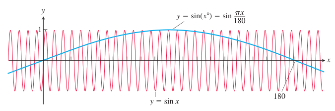
  
图 3.27 函数 $\sin(x^\circ)$ 的振荡频率只有 $\sin x$ 的 $\pi/180$ 倍。它在 $x=0$ 处的最大斜率为 $\pi/180$（例 9）。

## 3.7 隐函数求导

到目前为止，我们处理的大多数函数都由形如 $y=f(x)$ 的方程描述，其中 $y$ 被明确地表示为自变量 $x$ 的函数。我们已经学会了这类函数的求导法则。另一种情况是，我们会遇到像

$$
x^3+y^3-9xy=0,\qquad y^2-x=0,\qquad \text{或}\qquad x^2+y^2-25=0
$$

这样的方程（见图 3.28、图 3.29 和图 3.30）。这些方程定义了变量 $x$ 与 $y$ 之间的**隐式关系**。在某些情况下，我们可以把这样的方程解成 $y$ 关于 $x$ 的显函数（甚至多个函数）。当我们不能把方程 $F(x,y)=0$ 改写成 $y=f(x)$ 的形式并按通常方式求导时，仍然可能通过**隐函数求导**求出 $dy/dx$。本节介绍这一技术。

  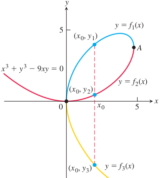
  
图 3.28 曲线 $x^3+y^3-9xy=0$ 不是任何一个 $x$ 的函数图像。不过，这条曲线可以分成若干段，每一段都是 $x$ 的函数图像。这条特殊曲线称为叶形线，其历史可追溯到 1638 年的笛卡尔。

### 隐式定义的函数

我们先从一些熟悉的方程开始，它们可以解出 $y$ 作为 $x$ 的函数，从而用通常方法计算 $dy/dx$。然后我们对方程进行隐函数求导，并比较两种方法得到的导数。在这些例题和练习中，始终假定给定方程把 $y$ 隐式地确定为 $x$ 的可导函数，使得 $dy/dx$ 存在。

**例 1** 求 $y^2=x$ 时的 $dy/dx$。

**解：** 方程 $y^2=x$ 定义了两个我们实际上可以求出的 $x$ 的可导函数，即

$$
y_1=\sqrt{x},\qquad y_2=-\sqrt{x}.
$$

对于 $x>0$，我们知道如何求这两个函数的导数：

$$
\frac{dy_1}{dx}=\frac{1}{2\sqrt{x}},
\qquad
\frac{dy_2}{dx}=-\frac{1}{2\sqrt{x}}.
$$

  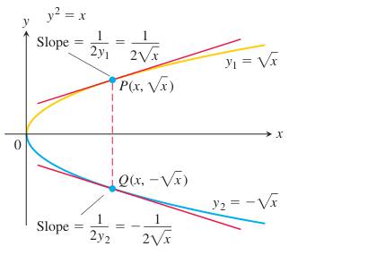
  
图 3.29 方程 $y^2-x=0$，通常写作 $y^2=x$，在区间 $x>0$ 上定义了两个可导函数。例 1 说明如何不解出 $y$ 而求这些函数的导数。

但是，如果我们只知道方程 $y^2=x$ 在 $x>0$ 时定义了一个或多个可导函数，而不知道这些函数的具体形式，仍然能求出 $dy/dx$ 吗？

答案是可以。为了求 $dy/dx$，我们只需对方程 $y^2=x$ 两边关于 $x$ 求导，并把 $y=f(x)$ 看成 $x$ 的可导函数：

$$
\begin{aligned}
y^2&=x,\\
2y\frac{dy}{dx}&=1,\\
\frac{dy}{dx}&=\frac{1}{2y}.
\end{aligned}
$$

其中第一步对 $y^2$ 求导时用到了链式法则：

$$
\frac{d}{dx}\left(y^2\right)
=\frac{d}{dx}\left([f(x)]^2\right)
=2f(x)f'(x)
=2y\frac{dy}{dx}.
$$

这一条公式给出了我们对两个显式解算出的导数：

$$
\frac{dy_1}{dx}=\frac{1}{2y_1}=\frac{1}{2\sqrt{x}},
\qquad
\frac{dy_2}{dx}=\frac{1}{2y_2}
=\frac{1}{2(-\sqrt{x})}
=-\frac{1}{2\sqrt{x}}.
$$

**例 2** 求圆 $x^2+y^2=25$ 在点 $(3,-4)$ 处的斜率。

**解：** 这个圆不是单个 $x$ 的函数图像，而是两个可导函数图像的合并：

$$
y_1=\sqrt{25-x^2},\qquad y_2=-\sqrt{25-x^2}.
$$

  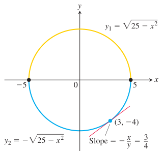
  
图 3.30 圆由两个函数图像合并而成。$y_2$ 的图像是下半圆，并经过 $(3,-4)$。

点 $(3,-4)$ 在 $y_2$ 的图像上，所以可以用幂链式法则直接计算该点处的斜率：

$$
\begin{aligned}
\left.\frac{dy_2}{dx}\right|_{x=3}
&=
-\left.\frac{-2x}{2\sqrt{25-x^2}}\right|_{x=3}\\
&=
-\frac{-6}{2\sqrt{25-9}}
=\frac{3}{4}.
\end{aligned}
$$

更简单的做法是对圆的方程隐式求导：

$$
\begin{aligned}
\frac{d}{dx}\left(x^2\right)+\frac{d}{dx}\left(y^2\right)&=\frac{d}{dx}(25),\\
2x+2y\frac{dy}{dx}&=0,\\
\frac{dy}{dx}&=-\frac{x}{y}.
\end{aligned}
$$

因此，点 $(3,-4)$ 处的斜率为

$$
\left.-\frac{x}{y}\right|_{(3,-4)}
=-\frac{3}{-4}
=\frac{3}{4}.
$$

注意，直接求出的 $dy_2/dx$ 的斜率公式只适用于 $x$ 轴下方的点；而公式 $dy/dx=-x/y$ 适用于圆上所有有斜率的点，也就是所有 $(x,y)$ 且 $y\ne 0$ 的点。还要注意，导数公式同时含有两个变量 $x$ 和 $y$，而不只是自变量 $x$。

为了计算其他隐式定义函数的导数，我们按照例 1 和例 2 的方法进行。把 $y$ 看成 $x$ 的可导隐函数，并用通常的求导法则对定义方程两边求导。

  

    
隐函数求导

    <ol style="margin: 0; padding-left: 1.3em;">
      <li>对方程两边关于 $x$ 求导，同时把 $y$ 看成 $x$ 的可导函数。</li>
      <li>把含有 $dy/dx$ 的项收集到方程一边，并解出 $dy/dx$。</li>
    </ol>
  

**例 3** 若 $y^2=x^2+\sin xy$，求 $dy/dx$（图 3.31）。

**解：** 我们对方程进行隐函数求导：

$$
\begin{aligned}
y^2&=x^2+\sin xy,\\
\frac{d}{dx}\left(y^2\right)
&=\frac{d}{dx}\left(x^2\right)+\frac{d}{dx}(\sin xy),\\
2y\frac{dy}{dx}
&=2x+(\cos xy)\frac{d}{dx}(xy),\\
2y\frac{dy}{dx}
&=2x+(\cos xy)\left(y+x\frac{dy}{dx}\right),\\
2y\frac{dy}{dx}-(\cos xy)\left(x\frac{dy}{dx}\right)
&=2x+(\cos xy)y,\\
(2y-x\cos xy)\frac{dy}{dx}
&=2x+y\cos xy,\\
\frac{dy}{dx}
&=\frac{2x+y\cos xy}{2y-x\cos xy}.
\end{aligned}
$$

  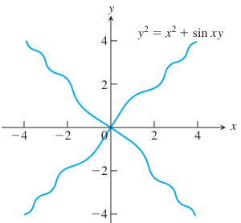
  
图 3.31 例 3 中方程的图像。

注意，只要隐式定义的曲线在某点有斜率，这个 $dy/dx$ 公式就适用。再一次，导数同时含有两个变量 $x$ 和 $y$，而不只是自变量 $x$。

### 高阶导数

隐函数求导也可以用来求高阶导数。

**例 4** 若 $2x^3-3y^2=8$，求 $d^2y/dx^2$。

**解：** 首先，对方程两边关于 $x$ 求导，以求出 $y'=dy/dx$：

$$
\begin{aligned}
\frac{d}{dx}\left(2x^3-3y^2\right)&=\frac{d}{dx}(8),\\
6x^2-6yy'&=0,\\
y'&=\frac{x^2}{y},\qquad y\ne 0.
\end{aligned}
$$

现在用商法则求 $y''$：

$$
\begin{aligned}
y''
&=\frac{d}{dx}\left(\frac{x^2}{y}\right)\\
&=\frac{2xy-x^2y'}{y^2}\\
&=\frac{2x}{y}-\frac{x^2}{y^2}y'.
\end{aligned}
$$

最后，将 $y'=x^2/y$ 代入，使 $y''$ 用 $x$ 和 $y$ 表示：

$$
y''
=\frac{2x}{y}-\frac{x^2}{y^2}\left(\frac{x^2}{y}\right)
=\frac{2x}{y}-\frac{x^4}{y^3},
\qquad y\ne 0.
$$

### 透镜、切线和法线

在描述光进入透镜时如何改变方向的折射定律中，重要的角是光线与透镜在入射点处垂线之间形成的角（图 3.32 中的角 $A$ 和角 $B$）。这条直线称为入射点处透镜表面的**法线**。在图 3.32 这样的透镜剖面图中，法线就是垂直于入射点处剖面曲线切线的直线，也称为与切线正交的直线。

  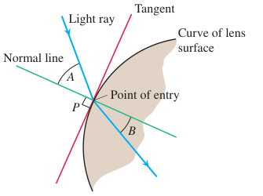
  
图 3.32 透镜的剖面，显示光线穿过透镜表面时的弯折（折射）。

**例 5** 说明点 $(2,4)$ 在曲线 $x^3+y^3-9xy=0$ 上。然后求该点处曲线的切线和法线（图 3.33）。

**解：** 点 $(2,4)$ 在曲线上，因为它的坐标满足给定方程：

$$
2^3+4^3-9(2)(4)=8+64-72=0.
$$

为了求曲线在 $(2,4)$ 处的斜率，我们先用隐函数求导求出 $dy/dx$ 的公式：

$$
\begin{aligned}
x^3+y^3-9xy&=0,\\
\frac{d}{dx}\left(x^3\right)+\frac{d}{dx}\left(y^3\right)
-\frac{d}{dx}(9xy)&=\frac{d}{dx}(0),\\
3x^2+3y^2\frac{dy}{dx}
-9\left(x\frac{dy}{dx}+y\frac{dx}{dx}\right)&=0,\\
(3y^2-9x)\frac{dy}{dx}+3x^2-9y&=0,\\
3(y^2-3x)\frac{dy}{dx}&=9y-3x^2,\\
\frac{dy}{dx}&=\frac{3y-x^2}{y^2-3x}.
\end{aligned}
$$

接着在 $(x,y)=(2,4)$ 处计算导数：

$$
\left.\frac{dy}{dx}\right|_{(2,4)}
=\left.\frac{3y-x^2}{y^2-3x}\right|_{(2,4)}
=\frac{3(4)-2^2}{4^2-3(2)}
=\frac{8}{10}
=\frac{4}{5}.
$$

经过 $(2,4)$ 且斜率为 $4/5$ 的切线为

$$
\begin{aligned}
y&=4+\frac{4}{5}(x-2),\\
y&=\frac{4}{5}x+\frac{12}{5}.
\end{aligned}
$$

曲线在 $(2,4)$ 处的法线垂直于这里的切线，因此它是经过 $(2,4)$、斜率为 $-5/4$ 的直线：

$$
\begin{aligned}
y&=4-\frac{5}{4}(x-2),\\
y&=-\frac{5}{4}x+\frac{13}{2}.
\end{aligned}
$$

  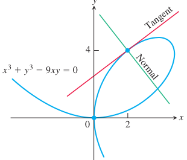
  
图 3.33 例 5 说明如何求笛卡尔叶形线在 $(2,4)$ 处的切线和法线方程。

## 3.8 反函数与对数函数的导数

在第 1.6 节中，我们看到函数的反函数会撤销或反转该函数的作用。那里我们把自然对数函数 $f^{-1}(x)=\ln x$ 定义为自然指数函数 $f(x)=e^x$ 的反函数。这是数学和科学中最重要的函数与反函数配对之一。我们在第 3.3 节学会了如何求指数函数的导数。本节要学习可导函数的反函数求导法则，并应用该法则求自然对数函数的导数。

### 可导函数反函数的导数

在第 1.6 节例 3 中，我们算出函数 $f(x)=(1/2)x+1$ 的反函数为 $f^{-1}(x)=2x-2$。图 3.34 再次给出了这两个函数的图像。如果计算它们的导数，就有

$$
\frac{d}{dx}f(x)
=\frac{d}{dx}\left(\frac{1}{2}x+1\right)
=\frac{1}{2},
$$

$$
\frac{d}{dx}f^{-1}(x)
=\frac{d}{dx}(2x-2)
=2.
$$

两个导数互为倒数，因此一条直线的斜率是其反函数直线斜率的倒数（见图 3.34）。这并不是一个特例。把任意一条既非水平也非竖直的直线关于直线 $y=x$ 反射，总会使直线的斜率取倒数。如果原直线的斜率为 $m\ne 0$，反射后的直线斜率为 $1/m$。

  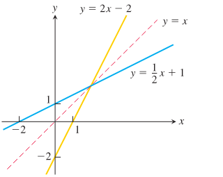
  
图 3.34 把一条直线及其反函数画在同一坐标系中，可以看出两个图像关于直线 $y=x$ 对称。它们的斜率互为倒数。

函数 $f$ 与 $f^{-1}$ 的斜率互为倒数这一关系也适用于其他函数，但必须小心比较对应点处的斜率。如果 $y=f(x)$ 在点 $(a,f(a))$ 处的斜率为 $f'(a)$，且 $f'(a)\ne 0$，那么 $y=f^{-1}(x)$ 在点 $(f(a),a)$ 处的斜率为倒数 $1/f'(a)$（图 3.35）。若令 $b=f(a)$，则

$$
(f^{-1})'(b)=\frac{1}{f'(a)}
=\frac{1}{f'(f^{-1}(b))}.
$$

  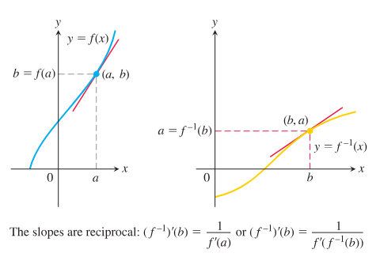
  
图 3.35 反函数的图像在对应点处具有互为倒数的斜率。

如果 $y=f(x)$ 在 $(a,f(a))$ 处有水平切线，那么反函数 $f^{-1}$ 在 $(f(a),a)$ 处有竖直切线，而这种无穷斜率意味着 $f^{-1}$ 在 $f(a)$ 处不可导。定理 3 给出了 $f^{-1}$ 在其定义域（也就是 $f$ 的值域）内可导的条件。

  

    
定理 3：反函数求导法则

    
若函数 $f$ 的定义域是区间 $I$，并且 $f'(x)$ 在 $I$ 上存在且从不为零，则 $f^{-1}$ 在其定义域（即 $f$ 的值域）的每一点都可导。$f^{-1}$ 定义域中一点 $b$ 处的 $(f^{-1})'$ 的值，是 $f'$ 在点 $a=f^{-1}(b)$ 处的值的倒数：

    

      $$
      (f^{-1})'(b)=\frac{1}{f'(f^{-1}(b))}. \tag{1}
      $$
    

    
或者

    

      $$
      \left.\frac{d f^{-1}}{dx}\right|_{x=b}
      =
      \frac{1}{
      \left.\dfrac{df}{dx}\right|_{x=f^{-1}(b)}
      }.
      $$
    

  

定理 3 包含两个断言。第一个断言说明 $f^{-1}$ 在什么条件下可导；第二个断言给出 $f^{-1}$ 的导数存在时的公式。这里略去第一个断言的证明，第二个断言可按如下方式证明：

$$
\begin{aligned}
f(f^{-1}(x))&=x
&&\text{反函数关系}\\
\frac{d}{dx}f(f^{-1}(x))&=1
&&\text{两边求导}\\
f'(f^{-1}(x))\cdot\frac{d}{dx}f^{-1}(x)&=1
&&\text{链式法则}\\
\frac{d}{dx}f^{-1}(x)
&=\frac{1}{f'(f^{-1}(x))}.
&&\text{解出导数}
\end{aligned}
$$

**例 1** 函数 $f(x)=x^2,\ x>0$ 及其反函数 $f^{-1}(x)=\sqrt{x}$ 的导数分别为 $f'(x)=2x$ 和 $(f^{-1})'(x)=1/(2\sqrt{x})$。我们验证定理 3 给出的 $f^{-1}(x)$ 的导数公式与此相同：

$$
\begin{aligned}
(f^{-1})'(x)
&=\frac{1}{f'(f^{-1}(x))}\\
&=\frac{1}{2(f^{-1}(x))}
&&\text{把 }f'(x)=2x\text{ 中的 }x\text{ 替换为 }f^{-1}(x)\\
&=\frac{1}{2\sqrt{x}}.
\end{aligned}
$$

定理 3 给出的导数与平方根函数的已知导数一致。

再在一个具体点考察定理 3。取 $x=2$（即数 $a$），则 $f(2)=4$（即值 $b$）。定理 3 说，$f$ 在 $2$ 处的导数 $f'(2)=4$，与 $f^{-1}$ 在 $f(2)$ 处的导数 $(f^{-1})'(4)$ 互为倒数。它断言

$$
(f^{-1})'(4)
=\frac{1}{f'(f^{-1}(4))}
=\frac{1}{f'(2)}
=\left.\frac{1}{2x}\right|_{x=2}
=\frac{1}{4}.
$$

见图 3.36。

  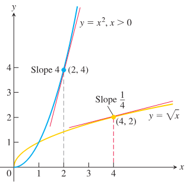
  
图 3.36 $f^{-1}(x)=\sqrt{x}$ 在点 $(4,2)$ 处的导数，是 $f(x)=x^2$ 在 $(2,4)$ 处导数的倒数（例 1）。

本章后面我们会用例 1 中说明的步骤来计算许多反函数的导数公式。公式 (1) 有时使我们能够在不知道 $f^{-1}$ 公式的情况下，求出 $df^{-1}/dx$ 的具体数值。

**例 2** 设 $f(x)=x^3-2,\ x>0$。不求出 $f^{-1}(x)$ 的公式，求 $df^{-1}/dx$ 在 $x=6=f(2)$ 处的值。

**解：** 我们应用定理 3 求 $f^{-1}$ 在 $x=6$ 处的导数值：

$$
\begin{aligned}
\left.\frac{df}{dx}\right|_{x=2}
&=\left.3x^2\right|_{x=2}
=12,\\
\left.\frac{df^{-1}}{dx}\right|_{x=f(2)}
&=
\frac{1}{
\left.\dfrac{df}{dx}\right|_{x=2}
}
=\frac{1}{12}.
\end{aligned}
$$

见图 3.37。

  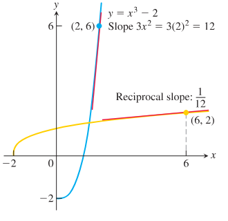
  
图 3.37 $f(x)=x^3-2$ 在 $x=2$ 处的导数告诉我们 $f^{-1}$ 在 $x=6$ 处的导数（例 2）。

### 自然对数函数的导数

由于我们知道指数函数 $f(x)=e^x$ 处处可导，因此可以应用定理 3 来求它的反函数 $f^{-1}(x)=\ln x$ 的导数：

$$
\begin{aligned}
(f^{-1})'(x)
&=\frac{1}{f'(f^{-1}(x))}
&&\text{定理 3}\\
&=\frac{1}{e^{f^{-1}(x)}}
&&f'(u)=e^u\\
&=\frac{1}{e^{\ln x}}
&&x>0\\
&=\frac{1}{x}.
&&\text{反函数关系}
\end{aligned}
$$

**另一种推导** 不直接应用定理 3，也可以用隐函数求导求 $y=\ln x$ 的导数，如下：

$$
\begin{aligned}
y&=\ln x,\qquad x>0,\\
e^y&=x
&&\text{反函数关系}\\
\frac{d}{dx}(e^y)&=\frac{d}{dx}(x)
&&\text{隐式求导}\\
e^y\frac{dy}{dx}&=1
&&\text{链式法则}\\
\frac{dy}{dx}&=\frac{1}{e^y}
=\frac{1}{x}.
&&e^y=x
\end{aligned}
$$

无论采用哪种推导方式，$y=\ln x$ 关于 $x$ 的导数都是

$$
\frac{d}{dx}(\ln x)=\frac{1}{x},\qquad x>0.
$$

链式法则把这个公式推广到正函数 $u(x)$：

  

    

      $$
      \frac{d}{dx}\ln u=\frac{1}{u}\frac{du}{dx},\qquad u>0. \tag{2}
      $$
    

  

**例 3** 我们用公式 (2) 求导。

**(a)**

$$
\frac{d}{dx}\ln 2x
=\frac{1}{2x}\frac{d}{dx}(2x)
=\frac{1}{2x}(2)
=\frac{1}{x},
\qquad x>0.
$$

**(b)** 公式 (2) 中取 $u=x^2+3$，得到

$$
\frac{d}{dx}\ln(x^2+3)
=\frac{1}{x^2+3}\cdot\frac{d}{dx}(x^2+3)
=\frac{1}{x^2+3}\cdot 2x
=\frac{2x}{x^2+3}.
$$

**(c)** 公式 (2) 中取 $u=|x|$，给出一个重要导数：

$$
\begin{aligned}
\frac{d}{dx}\ln|x|
&=\frac{d}{du}\ln u\cdot\frac{du}{dx},
\qquad u=|x|,\ x\ne 0\\
&=\frac{1}{u}\cdot\frac{x}{|x|},
\qquad \frac{d}{dx}(|x|)=\frac{x}{|x|}\\
&=\frac{1}{|x|}\cdot\frac{x}{|x|}\\
&=\frac{x}{x^2}\\
&=\frac{1}{x}.
\end{aligned}
$$

所以，$1/x$ 是 $\ln x$ 在定义域 $x>0$ 上的导数，也是 $\ln(-x)$ 在定义域 $x<0$ 上的导数。

$$
\frac{d}{dx}\ln|x|=\frac{1}{x},\qquad x\ne 0.
$$

从例 3a 可见，函数 $y=\ln 2x$ 与函数 $y=\ln x$ 有相同的导数。对于任意常数 $b$，只要 $bx>0$，这对 $y=\ln bx$ 也成立：

$$
\frac{d}{dx}\ln bx
=\frac{1}{bx}\cdot\frac{d}{dx}(bx)
=\frac{1}{bx}(b)
=\frac{1}{x}. \tag{3}
$$

**例 4** 一条斜率为 $m$ 的直线经过原点，并且与 $y=\ln x$ 的图像相切。$m$ 的值是多少？

**解：** 假设切点发生在未知点 $x=a>0$ 处。那么我们知道点 $(a,\ln a)$ 在图像上，并且该点处切线的斜率为 $m=1/a$（图 3.38）。由于切线经过原点，它的斜率也是

$$
m=\frac{\ln a-0}{a-0}=\frac{\ln a}{a}.
$$

令这两个 $m$ 的表达式相等，得到

$$
\begin{aligned}
\frac{\ln a}{a}&=\frac{1}{a},\\
\ln a&=1,\\
e^{\ln a}&=e^1,\\
a&=e,\\
m&=\frac{1}{e}.
\end{aligned}
$$

  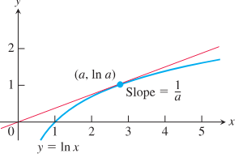
  
图 3.38 切线在某点 $(a,\ln a)$ 处与曲线相交，曲线在该处的斜率为 $1/a$（例 4）。

### $a^u$ 和 $\log_a u$ 的导数

我们从第 1.6 节见过的方程开始：

$$
a^x=e^{\ln(a^x)}=e^{x\ln a},\qquad a>0.
$$

于是

$$
\begin{aligned}
\frac{d}{dx}a^x
&=\frac{d}{dx}e^{x\ln a}\\
&=e^{x\ln a}\cdot\frac{d}{dx}(x\ln a)
&&\frac{d}{dx}e^u=e^u\frac{du}{dx}\\
&=a^x\ln a.
\end{aligned}
$$

也就是说，若 $a>0$，则 $a^x$ 可导，并且

$$
\frac{d}{dx}a^x=a^x\ln a. \tag{4}
$$

这个方程说明了为什么 $e^x$ 是微积分中首选的指数函数。若 $a=e$，则 $\ln a=1$，$a^x$ 的导数化简为

$$
\frac{d}{dx}e^x=e^x\ln e=e^x.
$$

由链式法则，我们得到一般指数函数 $a^u$ 的导数的更一般形式。

  

    
若 $a>0$，且 $u$ 是 $x$ 的可导函数，则 $a^u$ 是 $x$ 的可导函数，并且

    

      $$
      \frac{d}{dx}a^u=a^u\ln a\,\frac{du}{dx}. \tag{5}
      $$
    

  

**例 5** 下面是一些一般指数函数的导数。

**(a)**

$$
\frac{d}{dx}3^x=3^x\ln 3
\qquad \text{公式 (5)，其中 }a=3,\ u=x.
$$

**(b)**

$$
\frac{d}{dx}3^{-x}
=3^{-x}(\ln 3)\frac{d}{dx}(-x)
=-3^{-x}\ln 3
\qquad \text{公式 (5)，其中 }a=3,\ u=-x.
$$

**(c)**

$$
\frac{d}{dx}3^{\sin x}
=3^{\sin x}(\ln 3)\frac{d}{dx}(\sin x)
=3^{\sin x}(\ln 3)\cos x,
\qquad u=\sin x.
$$

在第 3.3 节中，我们考察了不同底数 $a$ 的指数函数 $f(x)=a^x$ 的导数 $f'(0)$。数 $f'(0)$ 是极限 $\lim_{h\to 0}(a^h-1)/h$，给出 $a^x$ 的图像在点 $(0,1)$ 穿过 $y$ 轴时的斜率。现在由公式 (4) 可知，这个斜率的值为

$$
\lim_{h\to 0}\frac{a^h-1}{h}=\ln a. \tag{6}
$$

特别地，当 $a=e$ 时，我们得到

$$
\lim_{h\to 0}\frac{e^h-1}{h}=\ln e=1.
$$

不过，我们还没有完全说明这些极限确实存在。虽然在推导指数函数和对数函数导数时给出的论证都是正确的，但它们确实假定了这些极限存在。在第 7 章中，我们将给出对数函数和指数函数理论的另一种展开，它会完整说明这两个极限确实存在，并且具有上面推导出的值。

为了求任意底数的 $\log_a u$ 的导数（$a>0,\ a\ne 1$），我们从对数的换底公式（第 1.6 节复习过）开始，把 $\log_a u$ 用自然对数表示。先对

$$
\log_a x=\frac{\ln x}{\ln a}
$$

求导，得到

$$
\begin{aligned}
\frac{d}{dx}\log_a x
&=\frac{d}{dx}\left(\frac{\ln x}{\ln a}\right)\\
&=\frac{1}{\ln a}\cdot\frac{d}{dx}\ln x
&&\ln a\text{ 是常数}\\
&=\frac{1}{\ln a}\cdot\frac{1}{x}\\
&=\frac{1}{x\ln a}.
\end{aligned}
$$

如果 $u$ 是 $x$ 的可导函数且 $u>0$，链式法则给出更一般的公式。

  

    
若 $a>0$ 且 $a\ne 1$，则

    

      $$
      \frac{d}{dx}\log_a u
      =\frac{1}{u\ln a}\frac{du}{dx}. \tag{7}
      $$
    

  

### 对数求导法

对于由乘积、商和幂组成的正函数，如果先对等式两边取自然对数，再求导，往往能更快求出导数。这样做使我们能够先用对数法则化简公式，再进行求导。这个过程称为**对数求导法**，下一例给出说明。

**例 6** 若

$$
y=\frac{(x^2+1)(x+3)^{1/2}}{x-1},
\qquad x>1,
$$

求 $dy/dx$。

**解：** 我们对等式两边取自然对数，并用第 1.6 节定理 1 中的对数代数性质化简：

$$
\begin{aligned}
\ln y
&=\ln\frac{(x^2+1)(x+3)^{1/2}}{x-1}\\
&=\ln\left((x^2+1)(x+3)^{1/2}\right)-\ln(x-1)
&&\text{法则 2}\\
&=\ln(x^2+1)+\ln(x+3)^{1/2}-\ln(x-1)
&&\text{法则 1}\\
&=\ln(x^2+1)+\frac{1}{2}\ln(x+3)-\ln(x-1).
&&\text{法则 4}
\end{aligned}
$$

接着对两边关于 $x$ 求导，左边用公式 (2)：

$$
\frac{1}{y}\frac{dy}{dx}
=\frac{1}{x^2+1}\cdot 2x
+\frac{1}{2}\cdot\frac{1}{x+3}
-\frac{1}{x-1}.
$$

然后解出 $dy/dx$：

$$
\frac{dy}{dx}
=y\left(
\frac{2x}{x^2+1}
+\frac{1}{2x+6}
-\frac{1}{x-1}
\right).
$$

最后，代回 $y$：

$$
\frac{dy}{dx}
=
\frac{(x^2+1)(x+3)^{1/2}}{x-1}
\left(
\frac{2x}{x^2+1}
+\frac{1}{2x+6}
-\frac{1}{x-1}
\right).
$$

### 无理指数与幂法则（一般形式）

一般指数函数的定义使我们能够把任意正数提升到任意实数幂 $n$，无论 $n$ 是有理数还是无理数。也就是说，可以对任意指数 $n$ 定义幂函数 $y=x^n$。

  

    
定义

    
对于任意 $x>0$ 和任意实数 $n$，定义

    

      $$
      x^n=e^{n\ln x}.
      $$
    

  

由于对数函数和指数函数互为反函数，这个定义给出

$$
\ln x^n=n\ln x,\qquad \text{对所有实数 }n.
$$

也就是说，对任意幂取自然对数的规则适用于所有实指数 $n$，而不仅仅适用于有理指数。幂函数的定义还使我们能够建立第 3.3 节中所述任意实数幂 $n$ 的幂法则导数公式。

  

    
导数的幂法则（一般形式）

    
对于 $x>0$ 和任意实数 $n$，

    

      $$
      \frac{d}{dx}x^n=nx^{n-1}.
      $$
    

    
若 $x\le 0$，则只要导数、$x^n$ 和 $x^{n-1}$ 都存在，公式仍然成立。

  

**证明** 对 $x^n$ 关于 $x$ 求导：

$$
\begin{aligned}
\frac{d}{dx}x^n
&=\frac{d}{dx}e^{n\ln x}
&&\text{$x^n$ 的定义，$x>0$}\\
&=e^{n\ln x}\cdot\frac{d}{dx}(n\ln x)
&&e^u\text{ 的链式法则}\\
&=x^n\cdot\frac{n}{x}
&&\text{$x^n$ 的定义和 $\ln x$ 的导数}\\
&=nx^{n-1}.
&&x^n\cdot x^{-1}=x^{n-1}
\end{aligned}
$$

简言之，只要 $x>0$，

$$
\frac{d}{dx}x^n=nx^{n-1}.
$$

当 $x<0$ 时，如果 $y=x^n$、$y'$ 和 $x^{n-1}$ 都存在，则

$$
\ln |y|=\ln |x|^n=n\ln |x|.
$$

用隐函数求导并假定 $y'$ 存在，有

$$
\frac{y'}{y}=\frac{n}{x}.
$$

解出导数，

$$
y'=\frac{ny}{x}=\frac{nx^n}{x}=nx^{n-1}.
$$

可以直接由导数定义证明，当 $x=0$ 且 $n\ge 1$ 时，导数等于 $0$（见练习 99）。这就完成了幂法则一般形式对所有 $x$ 值的证明。

**例 7** 求 $f(x)=x^x,\ x>0$ 的导数。

**解：** 注意到 $f(x)=x^x=e^{x\ln x}$，所以求导得

$$
\begin{aligned}
f'(x)
&=\frac{d}{dx}\left(e^{x\ln x}\right)\\
&=e^{x\ln x}\frac{d}{dx}(x\ln x)
&&\frac{d}{dx}e^u,\ u=x\ln x\\
&=e^{x\ln x}\left(\ln x+x\cdot\frac{1}{x}\right)\\
&=x^x(\ln x+1),
\qquad x>0.
\end{aligned}
$$

也可以用对数求导法求 $y=x^x$ 的导数，这时假定 $y'$ 存在。

### 数 $e$ 的一个极限表示

在第 1.5 节中，我们把 $e$ 定义为使指数函数 $y=a^x$ 在穿过 $y$ 轴点 $(0,1)$ 时斜率为 $1$ 的底数。因此，$e$ 是满足

$$
\lim_{h\to 0}\frac{e^h-1}{h}=\ln e=1
$$

的常数。这里的斜率等于公式 (6) 中的 $\ln e$。下面证明 $e$ 可以写成一个特定极限。

  

    
定理 4：数 $e$ 的极限表示

    
数 $e$ 可以表示为极限

    

      $$
      e=\lim_{x\to 0}(1+x)^{1/x}.
      $$
    

  

**证明** 若 $f(x)=\ln x$，则 $f'(x)=1/x$，所以 $f'(1)=1$。另一方面，由导数定义，

$$
\begin{aligned}
f'(1)
&=\lim_{h\to 0}\frac{f(1+h)-f(1)}{h}\\
&=\lim_{x\to 0}\frac{\ln(1+x)-\ln 1}{x}\\
&=\lim_{x\to 0}\frac{1}{x}\ln(1+x)\\
&=\lim_{x\to 0}\ln(1+x)^{1/x}\\
&=\ln\left[\lim_{x\to 0}(1+x)^{1/x}\right].
\end{aligned}
$$

这里用到了 $\ln 1=0$，以及 $\ln$ 的连续性（第 2 章定理 10）。

  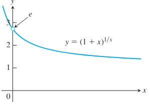
  
图 3.39 当 $x\to 0$ 时，数 $e$ 是这里所画函数的极限。

由于 $f'(1)=1$，我们有

$$
\ln\left[\lim_{x\to 0}(1+x)^{1/x}\right]=1.
$$

因此，两边取指数，得到

$$
\lim_{x\to 0}(1+x)^{1/x}=e.
$$

见图 3.39。用很小的 $x$ 代入定理 4 中的极限，可以得到 $e$ 的近似值。精确到 15 位小数，

$$
e\approx 2.718281828459045.
$$

## 3.9 反三角函数

我们在第 1.6 节介绍过六个基本反三角函数，但重点放在反正弦和反余弦函数上。这里我们完成对六个反三角函数的研究：它们如何定义、作图、求值，以及如何计算它们的导数。

### $\tan x$、$\cot x$、$\sec x$ 和 $\csc x$ 的反函数

这四个基本反三角函数的图像再次列在图 3.40 中。我们通过把受限三角函数的图像（如第 1.6 节所讨论）关于直线 $y=x$ 反射，得到这些图像。下面更仔细地看反正切、反余切、反正割和反余割函数。

  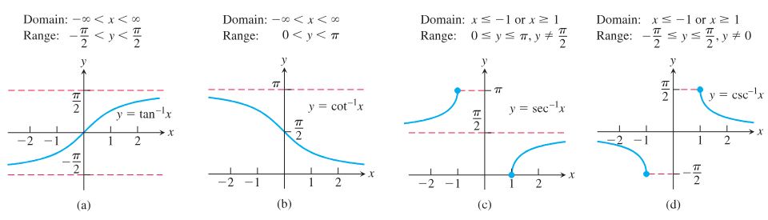
  
图 3.40 反正切、反余切、反正割和反余割函数的图像。

$x$ 的反正切是一个弧度角，它的正切值为 $x$。$x$ 的反余切是一个余切值为 $x$ 的角，依此类推。这些角属于正切、余切、正割和余割函数的受限定义域。

  

    
定义

    

      $$
      y=\tan^{-1}x
      $$
      是区间 $(-\pi/2,\pi/2)$ 中满足 $\tan y=x$ 的数。
    

    

      $$
      y=\cot^{-1}x
      $$
      是区间 $(0,\pi)$ 中满足 $\cot y=x$ 的数。
    

    

      $$
      y=\sec^{-1}x
      $$
      是区间 $[0,\pi/2)\cup(\pi/2,\pi]$ 中满足 $\sec y=x$ 的数。
    

    

      $$
      y=\csc^{-1}x
      $$
      是区间 $[-\pi/2,0)\cup(0,\pi/2]$ 中满足 $\csc y=x$ 的数。
    

  

我们使用开区间或半开区间，是为了避开正切、余切、正割和余割函数无定义的值（见图 3.40）。

$y=\tan^{-1}x$ 的图像关于原点对称，因为它是图像 $x=\tan y$ 的一个分支，而 $x=\tan y$ 关于原点对称（图 3.40a）。从代数上说，这意味着

$$
\tan^{-1}(-x)=-\tan^{-1}x;
$$

反正切函数是奇函数。$y=\cot^{-1}x$ 的图像没有这种对称性（图 3.40b）。从图 3.40a 可见，反正切函数的图像有两条水平渐近线：一条是 $y=\pi/2$，另一条是 $y=-\pi/2$。

受限形式的 $\sec x$ 和 $\csc x$ 的反函数选为图 3.40c 和图 3.40d 中所画的函数。

**注意** 对于负的 $x$ 值，如何定义 $\sec^{-1}x$ 并没有统一约定。我们选择第二象限中介于 $\pi/2$ 和 $\pi$ 之间的角。这个选择使得 $\sec^{-1}x=\cos^{-1}(1/x)$。它也使 $\sec^{-1}x$ 在其定义域的每个区间上都是增函数。有些表把 $x<0$ 时的 $\sec^{-1}x$ 取在 $[-\pi,-\pi/2)$ 中，有些教材把它取在 $[\pi,3\pi/2)$ 中（图 3.41）。这些选择能简化导数公式（我们的公式需要绝对值符号），但不能满足计算公式 $\sec^{-1}x=\cos^{-1}(1/x)$。由此应用第 1.6 节公式 (5)，可以推出恒等式

$$
\sec^{-1}x=\cos^{-1}\left(\frac{1}{x}\right)
=\frac{\pi}{2}-\sin^{-1}\left(\frac{1}{x}\right). \tag{1}
$$

  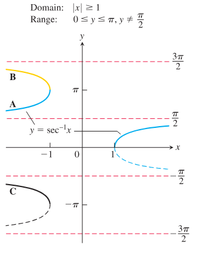
  
图 3.41 对 $y=\sec^{-1}x$ 的左支有几种合乎逻辑的选择。采用选择 A 时，$\sec^{-1}x=\cos^{-1}(1/x)$，这是许多计算器使用的一个有用恒等式。

**例 1** 附图给出了 $\tan^{-1}x$ 的两个取值。

  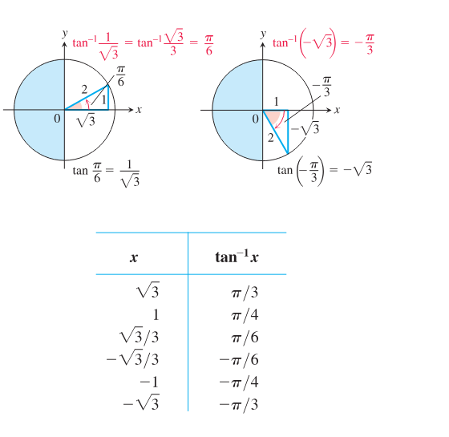

$$
\begin{array}{c|c}
x & \tan^{-1}x\\ \hline
\sqrt{3} & \pi/3\\
1 & \pi/4\\
\sqrt{3}/3 & \pi/6\\
-\sqrt{3}/3 & -\pi/6\\
-1 & -\pi/4\\
-\sqrt{3} & -\pi/3
\end{array}
$$

这些角来自第一象限和第四象限，因为 $\tan^{-1}x$ 的值域是 $(-\pi/2,\pi/2)$。

### $y=\sin^{-1}u$ 的导数

我们知道，函数 $x=\sin y$ 在区间 $-\pi/2<y<\pi/2$ 上可导，并且它的导数余弦在该区间内为正。因此，第 3.8 节定理 3 保证反函数 $y=\sin^{-1}x$ 在区间 $-1<x<1$ 上处处可导。我们不能期望它在 $x=1$ 或 $x=-1$ 处可导，因为图像在这些点处的切线是竖直的（见图 3.42）。

  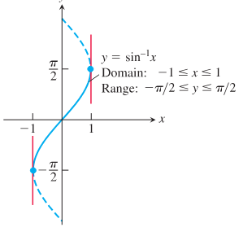
  
图 3.42 $y=\sin^{-1}x$ 的图像在 $x=-1$ 和 $x=1$ 处有竖直切线。

我们用定理 3 求 $y=\sin^{-1}x$ 的导数，其中 $f(x)=\sin x$，$f^{-1}(x)=\sin^{-1}x$：

$$
\begin{aligned}
(f^{-1})'(x)
&=\frac{1}{f'(f^{-1}(x))}
&&\text{定理 3}\\
&=\frac{1}{\cos(\sin^{-1}x)}
&&f'(u)=\cos u\\
&=\frac{1}{\sqrt{1-\sin^2(\sin^{-1}x)}}
&&\cos u=\sqrt{1-\sin^2u}\\
&=\frac{1}{\sqrt{1-x^2}}.
&&\sin(\sin^{-1}x)=x
\end{aligned}
$$

如果 $u$ 是 $x$ 的可导函数，且 $|u|<1$，则应用链式法则得到一般公式：

  

    

      $$
      \frac{d}{dx}\left(\sin^{-1}u\right)
      =
      \frac{1}{\sqrt{1-u^2}}\frac{du}{dx},
      \qquad |u|<1.
      $$
    

  

**例 2** 用链式法则，计算导数：

$$
\frac{d}{dx}\left(\sin^{-1}x^2\right)
=
\frac{1}{\sqrt{1-(x^2)^2}}\cdot\frac{d}{dx}(x^2)
=
\frac{2x}{\sqrt{1-x^4}}.
$$

### $y=\tan^{-1}u$ 的导数

我们用定理 3 求 $y=\tan^{-1}x$ 的导数，其中 $f(x)=\tan x$，$f^{-1}(x)=\tan^{-1}x$。定理 3 可以应用，因为 $\tan x$ 的导数在 $-\pi/2<x<\pi/2$ 上为正：

$$
\begin{aligned}
(f^{-1})'(x)
&=\frac{1}{f'(f^{-1}(x))}
&&\text{定理 3}\\
&=\frac{1}{\sec^2(\tan^{-1}x)}
&&f'(u)=\sec^2u\\
&=\frac{1}{1+\tan^2(\tan^{-1}x)}
&&\sec^2u=1+\tan^2u\\
&=\frac{1}{1+x^2}.
&&\tan(\tan^{-1}x)=x
\end{aligned}
$$

这个导数对所有实数都有定义。如果 $u$ 是 $x$ 的可导函数，我们得到链式法则形式：

  

    

      $$
      \frac{d}{dx}\left(\tan^{-1}u\right)
      =
      \frac{1}{1+u^2}\frac{du}{dx}.
      $$
    

  

### $y=\sec^{-1}u$ 的导数

由于 $\sec x$ 的导数在 $0<x<\pi/2$ 和 $\pi/2<x<\pi$ 上为正，定理 3 说明反函数 $y=\sec^{-1}x$ 可导。我们不直接应用定理 3 中的公式，而是用隐函数求导和链式法则来求 $y=\sec^{-1}x,\ |x|>1$ 的导数：

$$
\begin{aligned}
y&=\sec^{-1}x,\\
\sec y&=x
&&\text{反函数关系}\\
\frac{d}{dx}(\sec y)&=\frac{d}{dx}x
&&\text{两边求导}\\
\sec y\tan y\frac{dy}{dx}&=1
&&\text{链式法则}\\
\frac{dy}{dx}&=\frac{1}{\sec y\tan y}.
\end{aligned}
$$

由于 $|x|>1$，$y$ 位于 $(0,\pi/2)\cup(\pi/2,\pi)$ 中，并且 $\sec y\tan y\ne 0$。为了把结果表示为 $x$，我们使用关系

$$
\sec y=x
\qquad\text{和}\qquad
\tan y=\pm\sqrt{\sec^2y-1}
=\pm\sqrt{x^2-1},
$$

得到

$$
\frac{dy}{dx}=\pm\frac{1}{x\sqrt{x^2-1}}.
$$

如何处理这个 $\pm$ 号？看一眼图 3.43 就知道，$y=\sec^{-1}x$ 的图像斜率始终为正。因此

$$
\frac{d}{dx}\sec^{-1}x=
\begin{cases}
\dfrac{1}{x\sqrt{x^2-1}}, & x>1,\\[0.8em]
-\dfrac{1}{x\sqrt{x^2-1}}, & x<-1.
\end{cases}
$$

用绝对值符号可以把它写成一个表达式，消除 “$\pm$” 的歧义：

$$
\frac{d}{dx}\sec^{-1}x
=
\frac{1}{|x|\sqrt{x^2-1}}.
$$

  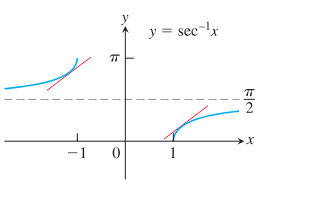
  
图 3.43 对 $x<-1$ 和 $x>1$，曲线 $y=\sec^{-1}x$ 的斜率都是正的。

如果 $u$ 是 $x$ 的可导函数，且 $|u|>1$，则有公式

  

    

      $$
      \frac{d}{dx}\left(\sec^{-1}u\right)
      =
      \frac{1}{|u|\sqrt{u^2-1}}\frac{du}{dx},
      \qquad |u|>1.
      $$
    

  

**例 3** 用链式法则和反正割函数的导数，求得

$$
\begin{aligned}
\frac{d}{dx}\sec^{-1}(5x^4)
&=
\frac{1}{|5x^4|\sqrt{(5x^4)^2-1}}
\frac{d}{dx}(5x^4)\\
&=
\frac{1}{5x^4\sqrt{25x^8-1}}(20x^3),
\qquad 5x^4>1>0\\
&=
\frac{4}{x\sqrt{25x^8-1}}.
\end{aligned}
$$

### 其他三个反三角函数的导数

我们可以用相同技术求出其他三个反三角函数，即反余弦、反余切和反余割的导数；但借助下面的恒等式，有一种更简单的方法。

  

    
反函数与反余函数恒等式

    

      $$
      \cos^{-1}x=\frac{\pi}{2}-\sin^{-1}x
      $$
      $$
      \cot^{-1}x=\frac{\pi}{2}-\tan^{-1}x
      $$
      $$
      \csc^{-1}x=\frac{\pi}{2}-\sec^{-1}x
      $$
    

  

这些恒等式中的第一个我们在第 1.6 节公式 (5) 中见过。其他恒等式可以用类似方法推出。容易看出，反余函数的导数是相应反函数导数的相反数。例如，$\cos^{-1}x$ 的导数计算如下：

$$
\begin{aligned}
\frac{d}{dx}\left(\cos^{-1}x\right)
&=
\frac{d}{dx}\left(\frac{\pi}{2}-\sin^{-1}x\right)
&&\text{恒等式}\\
&=
-\frac{d}{dx}\left(\sin^{-1}x\right)\\
&=
-\frac{1}{\sqrt{1-x^2}}.
&&\text{反正弦的导数}
\end{aligned}
$$

反三角函数的导数汇总在表 3.1 中。

  

    
表 3.1 反三角函数的导数

    

      $$
      \begin{array}{rcll}
      1.\quad \dfrac{d(\sin^{-1}u)}{dx}
      &=& \dfrac{1}{\sqrt{1-u^2}}\dfrac{du}{dx},
      & |u|<1,\\[0.9em]
      2.\quad \dfrac{d(\cos^{-1}u)}{dx}
      &=& -\dfrac{1}{\sqrt{1-u^2}}\dfrac{du}{dx},
      & |u|<1,\\[0.9em]
      3.\quad \dfrac{d(\tan^{-1}u)}{dx}
      &=& \dfrac{1}{1+u^2}\dfrac{du}{dx},&\\[0.9em]
      4.\quad \dfrac{d(\cot^{-1}u)}{dx}
      &=& -\dfrac{1}{1+u^2}\dfrac{du}{dx},&\\[0.9em]
      5.\quad \dfrac{d(\sec^{-1}u)}{dx}
      &=& \dfrac{1}{|u|\sqrt{u^2-1}}\dfrac{du}{dx},
      & |u|>1,\\[0.9em]
      6.\quad \dfrac{d(\csc^{-1}u)}{dx}
      &=& -\dfrac{1}{|u|\sqrt{u^2-1}}\dfrac{du}{dx},
      & |u|>1.
      \end{array}
      $$
    

  

## 3.10 相关变化率

本节讨论这样一类问题：当某个相关变量（或者几个相关变量）的变化率已知时，要求另一个变量的变化率。由其他已知变化率求一个变化率的问题称为**相关变化率问题**。

### 相关变化率方程

假设我们正在给一个球形气球充气。气球的体积和半径都随时间增大。若在某一时刻气球的体积为 $V$，半径为 $r$，则

$$
V=\frac{4}{3}\pi r^3.
$$

用链式法则对等式两边关于 $t$ 求导，得到一个联系 $V$ 和 $r$ 的变化率的方程：

$$
\frac{dV}{dt}
=
\frac{dV}{dr}\frac{dr}{dt}
=
4\pi r^2\frac{dr}{dt}.
$$

因此，如果在某一给定时刻我们知道气球的半径 $r$ 以及体积增大的速率 $dV/dt$，就可以由最后这个方程解出 $dr/dt$，从而求出该时刻半径增大的速度。注意，直接测量体积的增大速率（也就是空气被泵入气球的速率）比测量半径的增大量容易。相关变化率方程使我们能够由 $dV/dt$ 计算 $dr/dt$。

在相关变化率问题中，联系各变量的关键常常是画一幅图，显示它们之间的几何关系。下面的例子说明了这一点。

**例 1** 水以 $9\ \text{ft}^3/\text{min}$ 的速率流入一个圆锥形水箱。水箱尖端朝下，高 $10\ \text{ft}$，底面半径为 $5\ \text{ft}$。当水深为 $6\ \text{ft}$ 时，水面上升得多快？

**解** 图 3.44 显示了一个部分注水的圆锥形水箱。题中的变量为

  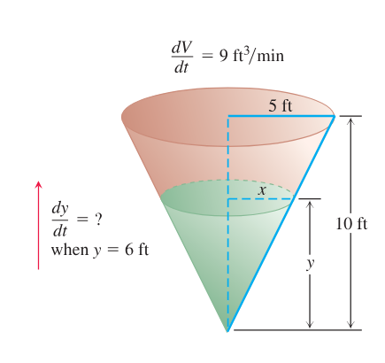
  
图 3.44 圆锥形水箱的几何关系以及水箱注水速率，决定了水面上升得多快（例 1）。

$$
\begin{aligned}
V&=\text{时刻 }t\text{（min）水箱中水的体积（ft}^3\text{）},\\
x&=\text{时刻 }t\text{ 水面半径（ft）},\\
y&=\text{时刻 }t\text{ 水深（ft）}.
\end{aligned}
$$

我们假设 $V$、$x$ 和 $y$ 都是 $t$ 的可导函数。常量是水箱的尺寸。题目要求在

$$
y=6\ \text{ft}
\qquad\text{且}\qquad
\frac{dV}{dt}=9\ \text{ft}^3/\text{min}
$$

时求 $dy/dt$。

水形成一个圆锥，其体积为

$$
V=\frac{1}{3}\pi x^2y.
$$

这个方程除了 $V$ 和 $y$ 外还含有 $x$。由于题目没有给出所求时刻关于 $x$ 和 $dx/dt$ 的信息，我们需要消去 $x$。图 3.44 中的相似三角形给出了把 $x$ 表示成 $y$ 的方法：

$$
\frac{x}{y}=\frac{5}{10}
\qquad\text{或}\qquad
x=\frac{y}{2}.
$$

因此

$$
V=\frac{1}{3}\pi\left(\frac{y}{2}\right)^2y
=
\frac{\pi}{12}y^3,
$$

从而导数为

$$
\frac{dV}{dt}
=
\frac{\pi}{12}\cdot 3y^2\frac{dy}{dt}
=
\frac{\pi}{4}y^2\frac{dy}{dt}.
$$

最后，用 $y=6$ 和 $dV/dt=9$ 解出 $dy/dt$：

$$
9=\frac{\pi}{4}(6)^2\frac{dy}{dt},
\qquad
\frac{dy}{dt}=\frac{1}{\pi}\approx 0.32.
$$

在所求时刻，水面约以 $0.32\ \text{ft}/\text{min}$ 的速率上升。

  

    
相关变化率问题策略

    <ol style="margin-bottom: 0;">
      <li>画图，并命名变量和常量。用 $t$ 表示时间。假设所有变量都是 $t$ 的可导函数。</li>
      <li>写出数值信息（用你所选的符号表示）。</li>
      <li>写出要求的量（通常是一个用导数表示的变化率）。</li>
      <li>写出联系变量的方程。可能需要把两个或多个方程合并，得到一个方程，把你要求的变化率所对应的变量同已知变化率所对应的变量联系起来。</li>
      <li>对 $t$ 求导。然后把所求变化率表示成已知变化率和已知变量值的形式。</li>
      <li>求值。用已知值求出未知变化率。</li>
    </ol>
  

**例 2** 一个热气球从平地竖直上升，距起飞点 $150\ \text{m}$ 的测距仪正在跟踪它。当测距仪的仰角为 $\pi/4$ 时，该角以 $0.14\ \text{rad}/\text{min}$ 的速率增大。此时热气球上升得多快？

**解** 我们按六个策略步骤回答这个问题。

1. 画图，并命名变量和常量（图 3.45）。图中的变量为

  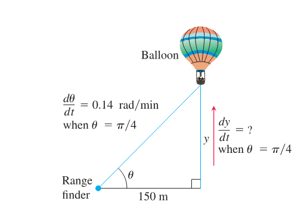
  
图 3.45 热气球高度的变化率与测距仪和地面所成角的变化率有关（例 2）。

$$
\begin{aligned}
\theta&=\text{测距仪与地面所成角的弧度数},\\
y&=\text{热气球离地面的高度（m）}.
\end{aligned}
$$

令 $t$ 表示时间，单位为分钟，并假设 $\theta$ 和 $y$ 都是 $t$ 的可导函数。图中唯一的常量是测距仪到起飞点的距离（$150\ \text{m}$）。没有必要给它另设符号。

2. 写出额外的数值信息：

$$
\frac{d\theta}{dt}=0.14\ \text{rad}/\text{min}
\qquad\text{当}\qquad
\theta=\frac{\pi}{4}.
$$

3. 写出要求的量。我们要求 $\theta=\pi/4$ 时的 $dy/dt$。

4. 写出联系变量 $y$ 和 $\theta$ 的方程：

$$
\frac{y}{150}=\tan\theta
\qquad\text{或}\qquad
y=150\tan\theta.
$$

5. 用链式法则对 $t$ 求导。所得结果说明 $dy/dt$（我们要求的量）如何与 $d\theta/dt$（已知量）相联系：

$$
\frac{dy}{dt}
=
150(\sec^2\theta)\frac{d\theta}{dt}.
$$

6. 代入 $\theta=\pi/4$ 和 $d\theta/dt=0.14$，求 $dy/dt$：

$$
\frac{dy}{dt}
=
150(\sqrt{2})^2(0.14)
=
42,
\qquad
\sec\frac{\pi}{4}=\sqrt{2}.
$$

在所求时刻，热气球以 $42\ \text{m}/\text{min}$ 的速率上升。

**例 3** 一辆警车从北面接近一个直角路口，正在追逐一辆已经转过弯、现在正向东直行的超速汽车。当警车在路口北侧 $0.6\ \text{mi}$ 处、汽车在路口东侧 $0.8\ \text{mi}$ 处时，警察用雷达测得他们与汽车之间的距离正以 $20\ \text{mph}$ 的速率增加。若测量瞬间警车以 $60\ \text{mph}$ 行驶，汽车的速度是多少？

  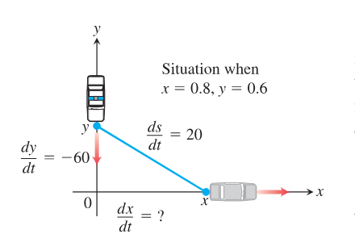
  
图 3.46 汽车的速度与警车的速度以及两车之间距离 $s$ 的变化率有关（例 3）。

**解** 我们在坐标平面中表示汽车和警车，用正 $x$ 轴表示向东的公路，用正 $y$ 轴表示向南的公路（图 3.46）。令 $t$ 表示时间，并设

$$
\begin{aligned}
x&=\text{时刻 }t\text{ 汽车的位置},\\
y&=\text{时刻 }t\text{ 警车的位置},\\
s&=\text{时刻 }t\text{ 汽车与警车之间的距离}.
\end{aligned}
$$

我们假设 $x$、$y$ 和 $s$ 都是 $t$ 的可导函数。要求在

$$
x=0.8\ \text{mi},\qquad
y=0.6\ \text{mi},\qquad
\frac{dy}{dt}=-60\ \text{mph},\qquad
\frac{ds}{dt}=20\ \text{mph}
$$

时的 $dx/dt$。注意，$dy/dt$ 为负，是因为 $y$ 正在减小。

对汽车和警车之间的距离方程

$$
s^2=x^2+y^2
$$

求导（也可以使用 $s=\sqrt{x^2+y^2}$），得到

$$
\begin{aligned}
2s\frac{ds}{dt}
&=
2x\frac{dx}{dt}+2y\frac{dy}{dt},\\
\frac{ds}{dt}
&=
\frac{1}{s}\left(x\frac{dx}{dt}+y\frac{dy}{dt}\right)\\
&=
\frac{1}{\sqrt{x^2+y^2}}
\left(x\frac{dx}{dt}+y\frac{dy}{dt}\right).
\end{aligned}
$$

最后，代入 $x=0.8$、$y=0.6$、$dy/dt=-60$、$ds/dt=20$，并解出 $dx/dt$：

$$
\begin{aligned}
20
&=
\frac{1}{\sqrt{(0.8)^2+(0.6)^2}}
\left(0.8\frac{dx}{dt}+(0.6)(-60)\right),\\
\frac{dx}{dt}
&=
\frac{20\sqrt{(0.8)^2+(0.6)^2}+(0.6)(60)}{0.8}
=70.
\end{aligned}
$$

在所求时刻，汽车的速度是 $70\ \text{mph}$。

**例 4** 粒子 $P$ 以恒定速率沿一个半径为 $10\ \text{m}$、圆心在原点的圆顺时针运动。粒子的初始位置是 $y$ 轴上的点 $(0,10)$，最终目的地是 $x$ 轴上的点 $(10,0)$。粒子一开始运动后，过 $P$ 点的切线与 $x$ 轴交于点 $Q$（它也随时间运动）。如果粒子从起点到终点需要 $30\ \text{sec}$，当点 $Q$ 距圆心 $20\ \text{m}$ 时，点 $Q$ 沿 $x$ 轴运动得多快？

  
  
图 3.47 粒子 $P$ 沿圆顺时针运动（例 4）。

**解** 我们把这个情形画在以原点为圆心的坐标平面中（见图 3.47）。令 $t$ 表示时间，并令 $\theta$ 表示从 $x$ 轴到连接原点和 $P$ 的半径所成的角。由于粒子从起点到终点用 $30\ \text{sec}$，它沿圆以恒定速率运动，在 $1/2\ \text{min}$ 内转过 $\pi/2$ 弧度，即 $\pi\ \text{rad}/\text{min}$。换句话说，当 $t$ 以分钟计时，

$$
\frac{d\theta}{dt}=-\pi.
$$

负号出现，是因为 $\theta$ 随时间减小。

设 $x(t)$ 为时刻 $t$ 点 $Q$ 到原点的距离。我们要求

$$
x=20\ \text{m}
\qquad\text{且}\qquad
\frac{d\theta}{dt}=-\pi\ \text{rad}/\text{min}
$$

时的 $dx/dt$。

为了联系变量 $x$ 和 $\theta$，由图 3.47 可见

$$
x\cos\theta=10,
\qquad\text{或}\qquad
x=10\sec\theta.
$$

对最后这个方程求导，得到

$$
\frac{dx}{dt}
=
10\sec\theta\tan\theta\frac{d\theta}{dt}
=
-10\pi\sec\theta\tan\theta.
$$

注意，$dx/dt$ 为负，是因为 $x$ 正在减小（$Q$ 正向原点运动）。当 $x=20$ 时，$\cos\theta=1/2$，且 $\sec\theta=2$。另外，

$$
\tan\theta=\sqrt{\sec^2\theta-1}=\sqrt{3}.
$$

因此

$$
\frac{dx}{dt}
=
(-10\pi)(2)(\sqrt{3})
=
-20\sqrt{3}\pi.
$$

在所求时刻，点 $Q$ 正以 $20\sqrt{3}\pi\approx 109\ \text{m}/\text{min}$ 的速率向原点运动。

**例 5** 一架喷气客机在海平面上方 $12{,}000\ \text{ft}$ 的恒定高度飞行，正接近太平洋上的一个岛屿。飞机进入位于岛上的雷达站的直接视线范围内，雷达显示海平面与视线之间的初始角为 $30^\circ$。为了使飞机保持在雷达的直接视线内，雷达以 $2/3\ \text{deg}/\text{sec}$ 的速率向上（逆时针）转动。雷达仪器第一次探测到飞机时，飞机正以多快的速度（英里每小时）接近岛屿？

  
  
图 3.48 喷气客机 $A$ 以恒定高度飞向雷达站 $R$（例 5）。

**解** 在坐标平面中表示飞机 $A$ 和雷达站 $R$，用正 $x$ 轴表示海平面上从 $R$ 到 $A$ 的水平距离，用正 $y$ 轴表示海平面以上的垂直高度。令 $t$ 表示时间，并注意到 $y=12{,}000$ 是常量。一般情形和视线角 $\theta$ 如图 3.48 所示。我们要求在 $\theta=\pi/6\ \text{rad}$ 且 $d\theta/dt=2/3\ \text{deg}/\text{sec}$ 时的 $dx/dt$。

由图 3.48 可见

$$
\frac{12{,}000}{x}=\tan\theta
\qquad\text{或}\qquad
x=12{,}000\cot\theta.
$$

若用英里而不是英尺作为距离单位，最后这个方程变为

$$
x=\frac{12{,}000}{5280}\cot\theta.
$$

对 $t$ 求导，得到

$$
\frac{dx}{dt}
=
-\frac{1200}{528}\csc^2\theta\frac{d\theta}{dt}.
$$

当 $\theta=\pi/6$ 时，$\sin^2\theta=1/4$，所以 $\csc^2\theta=4$。把 $d\theta/dt=2/3\ \text{deg}/\text{sec}$ 转换为弧度每小时，得到

$$
\frac{d\theta}{dt}
=
\frac{2}{3}\left(\frac{\pi}{180}\right)(3600)\ \text{rad}/\text{hr}.
$$

其中 $1\ \text{hr}=3600\ \text{sec}$，$1\ \text{deg}=\pi/180\ \text{rad}$。代入 $dx/dt$ 的方程，得到

$$
\frac{dx}{dt}
=
\left(-\frac{1200}{528}\right)(4)\left(\frac{2}{3}\right)
\left(\frac{\pi}{180}\right)(3600)
\approx -380.
$$

负号出现，是因为距离 $x$ 正在减小，所以雷达第一次探测到飞机时，飞机正以约 $380\ \text{mi}/\text{hr}$ 的速率接近岛屿。

**例 6** 图 3.49a 显示一根绳子绕过滑轮 $P$，一端系着重物 $W$。另一端由工人手中的点 $M$ 握住，离地面 $5\ \text{ft}$。设滑轮离地面 $25\ \text{ft}$，绳长 $45\ \text{ft}$，工人正以 $4\ \text{ft}/\text{sec}$ 的速率迅速远离竖直线 $PW$。当工人的手离 $PW$ 为 $21\ \text{ft}$ 时，重物上升得多快？

  
  
图 3.49 工人在 $M$ 处向右走，绳子绕过滑轮 $P$，把重物 $W$ 向上拉（例 6）。

**解** 令 $OM$ 表示任意时刻从滑轮正下方点 $O$ 到工人手中点 $M$ 的水平线段，其长度为 $x\ \text{ft}$（图 3.49）。令 $h$ 为重物 $W$ 在 $O$ 上方的高度，令 $z$ 表示从滑轮 $P$ 到工人手中点的绳长。已知 $dx/dt=4$，我们要求 $x=21$ 时的 $dh/dt$。注意，$P$ 在 $O$ 上方的高度为 $20\ \text{ft}$，因为 $O$ 离地面 $5\ \text{ft}$。我们假设 $O$ 处为直角。

任意时刻 $t$，有如下关系（见图 3.49b）：

$$
\begin{aligned}
20-h+z&=45
&&\text{绳长总长为 }45\ \text{ft},\\
20^2+x^2&=z^2
&&\text{点 }O\text{ 处为直角}.
\end{aligned}
$$

由第一个方程解得 $z=25+h$，代入第二个方程，得到

$$
20^2+x^2=(25+h)^2. \tag{1}
$$

对两边关于 $t$ 求导，得到

$$
2x\frac{dx}{dt}
=
2(25+h)\frac{dh}{dt},
$$

并由此解出 $dh/dt$：

$$
\frac{dh}{dt}
=
\frac{x}{25+h}\frac{dx}{dt}. \tag{2}
$$

由于 $dx/dt$ 已知，只需在 $x=21$ 时求出 $25+h$。由方程 (1)，

$$
20^2+21^2=(25+h)^2,
$$

所以

$$
(25+h)^2=841,
\qquad\text{或}\qquad
25+h=29.
$$

现在由方程 (2) 得

$$
\frac{dh}{dt}
=
\frac{21}{29}\cdot 4
=
\frac{84}{29}
\approx 2.9\ \text{ft}/\text{sec}.
$$

这就是当 $x=21\ \text{ft}$ 时重物上升的速率。

## 3.11 线性化与微分

有时候，我们可以用较简单的函数来近似复杂函数，这些简单函数能给出特定应用所需的精度，而且更容易处理。本节讨论的近似函数称为**线性化**，它们以切线为基础。其他近似函数（如多项式）将在第 10 章讨论。

我们引入新的变量 $dx$ 和 $dy$，称为**微分**，并用一种方式定义它们，使得莱布尼茨记号 $dy/dx$ 对导数而言成为真正的比值。我们用 $dy$ 估计测量误差，这随后也为链式法则（第 3.6 节）提供一个严密证明。

### 线性化

从图 3.50 可以看到，曲线 $y=x^2$ 的切线在切点附近贴近曲线。在切点两侧的一小段区间内，切线上的 $y$ 值给出了曲线上 $y$ 值的良好近似。我们可以通过在切点处放大这两个图像，或者查看 $f(x)$ 与其切线在切点横坐标附近的差值表，来观察这种现象。这种现象不只对抛物线成立；每一条可导曲线在局部都表现得像它的切线。

  
  
图 3.50 在函数可导的一点附近，图像放得越大，图像越平，也越像它的切线。

一般地，如果 $f$ 可导，则曲线 $y=f(x)$ 在点 $x=a$ 处的切线（图 3.51）经过点 $(a,f(a))$，所以它的点斜式方程为

$$
y=f(a)+f'(a)(x-a).
$$

因此，这条切线是线性函数

$$
L(x)=f(a)+f'(a)(x-a)
$$

的图像。只要从切点移开时，这条直线仍然贴近 $f$ 的图像，$L(x)$ 就给出 $f(x)$ 的良好近似。

  
  
图 3.51 曲线 $y=f(x)$ 在 $x=a$ 处的切线是直线 $L(x)=f(a)+f'(a)(x-a)$。

  

    
定义

    
若 $f$ 在 $x=a$ 处可导，则近似函数

    

      $$
      L(x)=f(a)+f'(a)(x-a).
      $$
    

    
称为 $f$ 在 $a$ 处的<strong>线性化</strong>。用 $L$ 近似 $f$ 的近似式

    

      $$
      f(x)\approx L(x)
      $$
    

    
称为 $f$ 在 $a$ 处的<strong>标准线性近似</strong>。点 $x=a$ 称为近似的<strong>中心</strong>。

  

**例 1** 求 $f(x)=\sqrt{1+x}$ 在 $x=0$ 处的线性化（图 3.52）。

  
  
图 3.52 $y=\sqrt{1+x}$ 的图像及其在 $x=0$ 和 $x=3$ 处的线性化。图 3.53 显示 $y$ 轴上 $1$ 附近小窗口的放大图。

  
  
图 3.53 图 3.52 中小窗口的放大图。

**解** 因为

$$
f'(x)=\frac{1}{2}(1+x)^{-1/2},
$$

所以 $f(0)=1$，$f'(0)=1/2$，从而线性化为

$$
L(x)=f(a)+f'(a)(x-a)
=
1+\frac{1}{2}(x-0)
=
1+\frac{x}{2}.
$$

见图 3.53。

下表显示例 1 中近似式 $\sqrt{1+x}\approx 1+(x/2)$ 对 $0$ 附近一些 $x$ 值的精确程度。当我们远离零时，精确度会降低。例如，当 $x=2$ 时，线性化给出 $2$ 作为 $\sqrt{3}$ 的近似值，它甚至连一位小数都不准确。

$$
\begin{array}{c|c|c}
\text{近似} & \text{真值} & |\text{真值}-\text{近似}|\\ \hline
\sqrt{1.2}\approx 1+\dfrac{0.2}{2}=1.10
&1.095445&0.004555<10^{-2}\\[0.8em]
\sqrt{1.05}\approx 1+\dfrac{0.05}{2}=1.025
&1.024695&0.000305<10^{-3}\\[0.8em]
\sqrt{1.005}\approx 1+\dfrac{0.005}{2}=1.00250
&1.002497&0.000003<10^{-5}
\end{array}
$$

不要被前面的计算误导，以为凡是用线性化做的事都最好交给计算器。实际中，我们不会用线性化去求某一个特定平方根。线性化的用处在于：它能在整个数值区间上用较简单的公式替换复杂公式。如果必须处理 $x$ 接近 $0$ 时的 $\sqrt{1+x}$，并且能够容忍其中的小误差，我们就可以改用 $1+(x/2)$。当然，这时还需要知道误差有多大。我们将在第 10 章进一步考察误差估计。

线性近似通常离开其中心后会失去精度。正如图 3.52 所暗示的，近似式 $\sqrt{1+x}\approx 1+(x/2)$ 在 $x=3$ 附近可能过于粗糙，不够有用。在那里，我们需要 $x=3$ 处的线性化。

**例 2** 求 $f(x)=\sqrt{1+x}$ 在 $x=3$ 处的线性化。

**解** 我们在 $a=3$ 处计算定义 $L(x)$ 的方程。由于 $f(3)=2$，并且

$$
f'(3)
=
\left.\frac{1}{2}(1+x)^{-1/2}\right|_{x=3}
=
\frac{1}{4},
$$

所以

$$
L(x)
=
2+\frac{1}{4}(x-3)
=
\frac{5}{4}+\frac{x}{4}.
$$

当 $x=3.2$ 时，例 2 中的线性化给出

$$
\sqrt{1+x}
=
\sqrt{1+3.2}
\approx
\frac{5}{4}+\frac{3.2}{4}
=
1.250+0.800
=
2.050,
$$

它与真值 $\sqrt{4.2}\approx 2.04939$ 相差不到千分之一。例 1 中的线性化给出

$$
\sqrt{1+x}
=
\sqrt{1+3.2}
\approx
1+\frac{3.2}{2}
=
1+1.6
=
2.6,
$$

结果误差超过 $25\%$。

**例 3** 求 $f(x)=\cos x$ 在 $x=\pi/2$ 处的线性化（图 3.54）。

  
  
图 3.54 $f(x)=\cos x$ 的图像及其在 $x=\pi/2$ 处的线性化。在 $x=\pi/2$ 附近，$\cos x\approx -x+(\pi/2)$（例 3）。

**解** 因为 $f(\pi/2)=\cos(\pi/2)=0$，$f'(x)=-\sin x$，且 $f'(\pi/2)=-\sin(\pi/2)=-1$，所以在 $a=\pi/2$ 处的线性化为

$$
\begin{aligned}
L(x)
&=
f(a)+f'(a)(x-a)\\
&=
0+(-1)\left(x-\frac{\pi}{2}\right)\\
&=
-x+\frac{\pi}{2}.
\end{aligned}
$$

根式和幂的一个重要线性近似是

$$
(1+x)^k\approx 1+kx
\qquad
(x\text{ 接近 }0;\ k\text{ 为任意数})
$$

（练习 15）。这个近似对足够接近零的 $x$ 值有效，应用广泛。例如，当 $x$ 很小时，

$$
\sqrt{1+x}\approx 1+\frac{1}{2}x
\qquad
k=\frac{1}{2},
$$

$$
\frac{1}{1-x}
=(1-x)^{-1}
\approx
1+(-1)(-x)
=
1+x
\qquad
k=-1;\ \text{用 }-x\text{ 替换 }x,
$$

$$
\sqrt[3]{1+5x^4}
=(1+5x^4)^{1/3}
\approx
1+\frac{1}{3}(5x^4)
=
1+\frac{5}{3}x^4
\qquad
k=\frac{1}{3};\ \text{用 }5x^4\text{ 替换 }x,
$$

$$
\frac{1}{\sqrt{1-x^2}}
=(1-x^2)^{-1/2}
\approx
1+\left(-\frac{1}{2}\right)(-x^2)
=
1+\frac{1}{2}x^2
\qquad
k=-\frac{1}{2};\ \text{用 }-x^2\text{ 替换 }x.
$$

**当 $x$ 接近 $0$ 时的近似**

$$
\sqrt{1+x}\approx 1+\frac{x}{2},
\qquad
\frac{1}{1-x}\approx 1+x,
\qquad
\frac{1}{\sqrt{1-x^2}}\approx 1+\frac{x^2}{2}.
$$

### 微分

我们有时用莱布尼茨记号 $dy/dx$ 表示 $y$ 关于 $x$ 的导数。与外观不同，它并不是一个比值。现在我们引入两个新变量 $dx$ 和 $dy$，使得只要它们的比值存在，就等于导数。

  

    
定义

    
设 $y=f(x)$ 是可导函数。微分 $dx$ 是一个自变量。微分 $dy$ 为

    

      $$
      dy=f'(x)\,dx.
      $$
    

  

与自变量 $dx$ 不同，变量 $dy$ 总是因变量。它同时依赖于 $x$ 和 $dx$。如果给定 $dx$ 的一个具体值，并且 $x$ 是函数 $f$ 定义域中的一个特定数，那么这些值就决定了 $dy$ 的数值。变量 $dx$ 常常取为 $\Delta x$，即 $x$ 的变化量。

**例 4** **(a)** 若 $y=x^5+37x$，求 $dy$。**(b)** 当 $x=1$ 且 $dx=0.2$ 时，求 $dy$ 的值。

**解**

$$
\text{(a) }\quad dy=(5x^4+37)\,dx.
$$

$$
\text{(b) }\quad
dy=(5\cdot 1^4+37)0.2=8.4.
$$

微分的几何意义见图 3.55。令 $x=a$，并取 $dx=\Delta x$。$y=f(x)$ 的相应变化量为

$$
\Delta y=f(a+dx)-f(a).
$$

切线 $L$ 的相应变化量为

$$
\begin{aligned}
\Delta L
&=
L(a+dx)-L(a)\\
&=
f(a)+f'(a)\bigl[(a+dx)-a\bigr]-f(a)\\
&=
f'(a)\,dx.
\end{aligned}
$$

  
  
图 3.55 从几何上看，当 $x=a$ 改变量为 $dx=\Delta x$ 时，微分 $dy$ 是 $f$ 的线性化中的变化量 $\Delta L$。

也就是说，当 $x=a$ 且 $dx=\Delta x$ 时，$f$ 的线性化的变化量正好是微分 $dy$ 的值。因此，$dy$ 表示当 $x$ 改变量为 $dx=\Delta x$ 时，切线上升或下降的量。

如果 $dx\ne 0$，那么微分 $dy$ 与微分 $dx$ 的商等于导数 $f'(x)$，因为

$$
dy\div dx
=
\frac{f'(x)\,dx}{dx}
=
f'(x)
=
\frac{dy}{dx}.
$$

我们有时写

$$
df=f'(x)\,dx
$$

来代替 $dy=f'(x)\,dx$，并称 $df$ 为 $f$ 的微分。例如，若 $f(x)=3x^2-6$，则

$$
df=d(3x^2-6)=6x\,dx.
$$

每个求导公式，例如

$$
\frac{d(u+v)}{dx}
=
\frac{du}{dx}+\frac{dv}{dx}
\qquad\text{或}\qquad
\frac{d(\sin u)}{dx}
=
\cos u\frac{du}{dx},
$$

都有对应的微分形式：

$$
d(u+v)=du+dv
\qquad\text{或}\qquad
d(\sin u)=\cos u\,du.
$$

**例 5** 我们可以用链式法则和其他求导法则求函数的微分。

$$
\text{(a) }\quad
d(\tan 2x)
=
\sec^2(2x)\,d(2x)
=
2\sec^2 2x\,dx.
$$

$$
\begin{aligned}
\text{(b) }\quad
d\left(\frac{x}{x+1}\right)
&=
\frac{(x+1)\,dx-x\,d(x+1)}{(x+1)^2}\\
&=
\frac{x\,dx+dx-x\,dx}{(x+1)^2}\\
&=
\frac{dx}{(x+1)^2}.
\end{aligned}
$$

### 用微分估计

假设我们知道可导函数 $f(x)$ 在点 $a$ 处的值，并想估计当移动到附近点 $a+dx$ 时，这个值会改变多少。如果 $dx=\Delta x$ 很小，那么从图 3.55 可以看出，$\Delta y$ 近似等于微分 $dy$。由于

$$
f(a+dx)=f(a)+\Delta y,
\qquad
\Delta x=dx,
$$

微分近似给出

$$
f(a+dx)\approx f(a)+dy
\qquad
\text{当 }dx=\Delta x.
$$

因此，当 $f(a)$ 已知、$dx$ 很小且 $dy=f'(a)\,dx$ 时，可以用近似式 $\Delta y\approx dy$ 来估计 $f(a+dx)$。

**例 6** 圆的半径 $r$ 从 $a=10\ \text{m}$ 增加到 $10.1\ \text{m}$（图 3.56）。用 $dA$ 估计圆面积 $A$ 的增加量。估计扩大后圆的面积，并与直接计算得到的真实面积比较。

  
  
图 3.56 当 $dr$ 与 $a$ 相比很小时，微分 $dA$ 给出估计 $A(a+dr)=\pi a^2+dA$（例 6）。

**解** 因为 $A=\pi r^2$，所以估计增加量为

$$
dA
=
A'(a)\,dr
=
2\pi a\,dr
=
2\pi(10)(0.1)
=
2\pi\ \text{m}^2.
$$

因此，由于 $A(r+\Delta r)\approx A(r)+dA$，有

$$
A(10+0.1)
\approx
A(10)+2\pi
=
\pi(10)^2+2\pi
=
102\pi.
$$

半径为 $10.1\ \text{m}$ 的圆面积约为 $102\pi\ \text{m}^2$。真实面积为

$$
A(10.1)=\pi(10.1)^2=102.01\pi\ \text{m}^2.
$$

我们估计中的误差是 $0.01\pi\ \text{m}^2$，也就是差值 $\Delta A-dA$。

**例 7** 用微分估计

$$
\text{(a) }7.97^{1/3}
\qquad
\text{(b) }\sin\left(\frac{\pi}{6}+0.01\right).
$$

**解**

**(a)** 与立方根函数 $y=x^{1/3}$ 相联系的微分为

$$
dy=\frac{1}{3x^{2/3}}\,dx.
$$

取 $a=8$，这是 $7.97$ 附近最接近且容易计算 $f(a)$ 和 $f'(a)$ 的数。为了使 $a+dx=7.97$，取 $dx=-0.03$。用微分近似得到

$$
\begin{aligned}
f(7.97)
&=
f(a+dx)
\approx
f(a)+dy\\
&=
8^{1/3}
+
\frac{1}{3(8)^{2/3}}(-0.03)\\
&=
2+\frac{1}{12}(-0.03)
=
1.9975.
\end{aligned}
$$

这给出了真值 $7.97^{1/3}$ 的一个近似；其真值精确到 $6$ 位小数为 $1.997497$。

**(b)** 与 $y=\sin x$ 相联系的微分为

$$
dy=\cos x\,dx.
$$

为了估计 $\sin(\pi/6+0.01)$，取 $a=\pi/6$，$dx=0.01$。于是

$$
\begin{aligned}
f\left(\frac{\pi}{6}+0.01\right)
&=
f(a+dx)
\approx
f(a)+dy\\
&=
\sin\frac{\pi}{6}
+
\left(\cos\frac{\pi}{6}\right)(0.01)\\
&=
\frac{1}{2}
+
\frac{\sqrt{3}}{2}(0.01)
\approx
0.5087.
\end{aligned}
$$

作为比较，$\sin(\pi/6+0.01)$ 的真值精确到 $6$ 位小数为 $0.508635$。

例 7(b) 中的方法被一些计算器和计算机算法用来给出三角函数值。这些算法存储 $0$ 到 $\pi/4$ 之间的大量正弦和余弦值。存储值之间的数值用例 7(b) 中的微分方法计算。区间 $[0,\pi/4]$ 外的数值，则用三角恒等式从该区间中的数值计算。

### 微分近似中的误差

设 $f(x)$ 在 $x=a$ 处可导，并设 $dx=\Delta x$ 是 $x$ 的一个增量。当 $x$ 从 $a$ 变到 $a+\Delta x$ 时，我们有两种方式描述 $f$ 的变化：

$$
\text{真实变化：}\quad
\Delta f=f(a+\Delta x)-f(a),
$$

$$
\text{微分估计：}\quad
df=f'(a)\Delta x.
$$

$df$ 对 $\Delta f$ 的近似有多好？我们用 $\Delta f$ 减去 $df$ 来度量近似误差：

$$
\begin{aligned}
\text{近似误差}
&=
\Delta f-df\\
&=
\Delta f-f'(a)\Delta x\\
&=
f(a+\Delta x)-f(a)-f'(a)\Delta x\\
&=
\left(
\frac{f(a+\Delta x)-f(a)}{\Delta x}
-
f'(a)
\right)\Delta x\\
&=
\varepsilon\,\Delta x.
\end{aligned}
$$

这里把括号中的部分记为 $\varepsilon$。当 $\Delta x\to 0$ 时，差商

$$
\frac{f(a+\Delta x)-f(a)}{\Delta x}
$$

趋于 $f'(a)$（回想 $f'(a)$ 的定义），所以括号中的量会变得很小（这就是我们把它记为 $\varepsilon$ 的原因）。事实上，当 $\Delta x\to 0$ 时，$\varepsilon\to 0$。当 $\Delta x$ 很小时，近似误差 $\varepsilon\Delta x$ 还要更小。

$$
\Delta f=f'(a)\Delta x+\varepsilon\Delta x.
$$

虽然我们不知道误差的确切大小，但它是两个小量 $\varepsilon\cdot\Delta x$ 的乘积，并且这两个量在 $\Delta x\to 0$ 时都趋于零。对许多常见函数而言，只要 $\Delta x$ 很小，误差还会更小。

例如，在例 6 中我们求得

$$
\Delta A
=
\pi(10.1)^2-\pi(10)^2
=
(102.01-100)\pi
=
(2\pi+0.01\pi)\ \text{m}^2,
$$

其中 $2\pi$ 是 $dA$，$0.01\pi$ 是误差。所以近似误差为

$$
\Delta A-dA
=
\varepsilon\Delta r
=
0.01\pi,
$$

并且

$$
\varepsilon
=
\frac{0.01\pi}{\Delta r}
=
\frac{0.01\pi}{0.1}
=
0.1\pi\ \text{m}.
$$

  

    
$y=f(x)$ 在 $x=a$ 附近的变化

    
若 $y=f(x)$ 在 $x=a$ 处可导，并且 $x$ 从 $a$ 变到 $a+\Delta x$，则 $f$ 的变化量 $\Delta y$ 为

    

      $$
      \Delta y=f'(a)\Delta x+\varepsilon\Delta x, \tag{1}
      $$
    

    
其中当 $\Delta x\to 0$ 时，$\varepsilon\to 0$。

  

### 链式法则的证明

公式 (1) 使我们能够正确证明链式法则。目标是说明：如果 $f(u)$ 是 $u$ 的可导函数，且 $u=g(x)$ 是 $x$ 的可导函数，那么复合函数 $y=f(g(x))$ 是 $x$ 的可导函数。

因为函数可导当且仅当它在定义域中每一点都有导数，所以只需证明：只要 $g$ 在 $x_0$ 处可导，且 $f$ 在 $g(x_0)$ 处可导，那么复合函数在 $x_0$ 处可导，并且复合函数的导数满足

$$
\left.\frac{dy}{dx}\right|_{x=x_0}
=
f'(g(x_0))\,g'(x_0).
$$

令 $\Delta x$ 是 $x$ 的一个增量，令 $\Delta u$ 和 $\Delta y$ 分别是 $u$ 和 $y$ 的相应增量。应用公式 (1)，有

$$
\Delta u
=
g'(x_0)\Delta x+\varepsilon_1\Delta x
=
\bigl(g'(x_0)+\varepsilon_1\bigr)\Delta x,
$$

其中当 $\Delta x\to 0$ 时，$\varepsilon_1\to 0$。类似地，

$$
\Delta y
=
f'(u_0)\Delta u+\varepsilon_2\Delta u
=
\bigl(f'(u_0)+\varepsilon_2\bigr)\Delta u,
$$

其中当 $\Delta u\to 0$ 时，$\varepsilon_2\to 0$。还要注意，当 $\Delta x\to 0$ 时，$\Delta u\to 0$。

把 $\Delta u$ 和 $\Delta y$ 的方程合并，得到

$$
\Delta y
=
\bigl(f'(u_0)+\varepsilon_2\bigr)
\bigl(g'(x_0)+\varepsilon_1\bigr)\Delta x,
$$

所以

$$
\frac{\Delta y}{\Delta x}
=
f'(u_0)g'(x_0)
+
\varepsilon_2g'(x_0)
+
f'(u_0)\varepsilon_1
+
\varepsilon_2\varepsilon_1.
$$

由于当 $\Delta x\to 0$ 时，$\varepsilon_1$ 和 $\varepsilon_2$ 都趋于零，右端最后三项在极限中消失，留下

$$
\left.\frac{dy}{dx}\right|_{x=x_0}
=
\lim_{\Delta x\to 0}\frac{\Delta y}{\Delta x}
=
f'(u_0)g'(x_0)
=
f'(g(x_0))\,g'(x_0).
$$

### 对变化的敏感性

方程 $df=f'(x)\,dx$ 说明，在不同的 $x$ 值处，$f$ 的输出对输入变化有多敏感。$x$ 处 $f'$ 的值越大，给定变化 $dx$ 的影响就越大。当我们从 $a$ 移到邻近点 $a+dx$ 时，可以用三种方式描述 $f$ 的变化：

$$
\begin{array}{c|c|c}
&\text{真实值}&\text{估计值}\\ \hline
\text{绝对变化}&\Delta f=f(a+dx)-f(a)&df=f'(a)\,dx\\[0.5em]
\text{相对变化}&\dfrac{\Delta f}{f(a)}&\dfrac{df}{f(a)}\\[0.9em]
\text{百分比变化}&\dfrac{\Delta f}{f(a)}\cdot 100&\dfrac{df}{f(a)}\cdot 100
\end{array}
$$

**例 8** 你想用方程 $s=16t^2$ 计算井的深度，方法是测量你丢下的一块重石头溅入下面水中所需的时间。若测量时间有 $0.1\ \text{sec}$ 的误差，你的计算对这个误差有多敏感？

**解** 方程

$$
ds=32t\,dt
$$

中 $ds$ 的大小取决于 $t$ 的大小。如果 $t=2\ \text{sec}$，由 $dt=0.1$ 引起的变化约为

$$
ds=32(2)(0.1)=6.4\ \text{ft}.
$$

三秒后，当 $t=5\ \text{sec}$ 时，相同的 $dt$ 引起的变化为

$$
ds=32(5)(0.1)=16\ \text{ft}.
$$

对于固定的时间测量误差，当石头溅入水中所需时间更长时，用 $ds$ 估计深度所产生的误差更大。也就是说，对较大的 $t$ 值，估计对误差影响更敏感。

**例 9** 牛顿第二定律

$$
F=\frac{d}{dt}(mv)=m\frac{dv}{dt}=ma
$$

是在质量为常量的假设下陈述的，但我们知道这并不严格成立，因为物体的质量会随速度增加。在爱因斯坦修正后的公式中，质量的值为

$$
m=\frac{m_0}{\sqrt{1-v^2/c^2}},
$$

其中“静止质量” $m_0$ 表示物体不运动时的质量，$c$ 是光速，约为 $300{,}000\ \text{km}/\text{sec}$。用近似式

$$
\frac{1}{\sqrt{1-x^2}}\approx 1+\frac{1}{2}x^2 \tag{2}
$$

估计由增加的速度 $v$ 引起的质量增加量 $\Delta m$。

**解** 当 $v$ 与 $c$ 相比很小时，$v^2/c^2$ 接近零，可以安全地用近似式

$$
\frac{1}{\sqrt{1-v^2/c^2}}
\approx
1+\frac{1}{2}\left(\frac{v^2}{c^2}\right)
$$

（公式 (2)，其中 $x=v/c$）得到

$$
\begin{aligned}
m
&=
\frac{m_0}{\sqrt{1-v^2/c^2}}\\
&\approx
m_0\left[
1+\frac{1}{2}\left(\frac{v^2}{c^2}\right)
\right]\\
&=
m_0+\frac{1}{2}m_0v^2\left(\frac{1}{c^2}\right).
\end{aligned}
$$

也就是说，

$$
m\approx
m_0+\frac{1}{2}m_0v^2\left(\frac{1}{c^2}\right). \tag{3}
$$

公式 (3) 表示由增加的速度 $v$ 引起的质量增加。

### 把质量转换为能量

例 9 中推导出的公式 (3) 有一个重要解释。在牛顿物理学中，$(1/2)m_0v^2$ 是物体的动能（KE）。如果把公式 (3) 改写为

$$
(m-m_0)c^2
\approx
\frac{1}{2}m_0v^2,
$$

就看到

$$
\begin{aligned}
(m-m_0)c^2
&\approx
\frac{1}{2}m_0v^2\\
&=
\frac{1}{2}m_0v^2-\frac{1}{2}m_0(0)^2\\
&=
\Delta(\text{KE}),
\end{aligned}
$$

或者

$$
(\Delta m)c^2\approx \Delta(\text{KE}).
$$

因此，从速度 $0$ 变到速度 $v$ 时，动能的变化量 $\Delta(\text{KE})$ 近似等于 $(\Delta m)c^2$，即质量的变化量乘以光速的平方。用 $c\approx 3\times 10^8\ \text{m}/\text{sec}$ 可知，很小的质量变化也能产生很大的能量变化。
