<!--
来源：Thomas' Calculus，Chapter 4: Applications of Derivatives，PDF 页 237-312（印刷页 223-298）。
整理规范：依据 PDF转Markdown校对要求.md。
说明：本文件为第 4 章正文中文整理稿，不含 Exercises 4.1-4.8、章末复习题、练习题及附加高级练习。
-->

# 第4章 导数的应用

概述 导数最重要的应用之一，是作为寻找问题最优（最好）解的工具。最优化问题在数学、物理科学与工程、商业与经济学、生物学与医学中都大量出现。例如，在给定球内能内接的最大体积圆柱，其高和直径是多少？从给定直径的圆柱形原木中能切出的最坚固矩形木梁尺寸是多少？根据生产成本和销售收入，制造商应生产多少件产品才能使利润最大？咳嗽时，气管收缩到什么程度会使空气以最大速度排出？血液流经分支血管时，能使摩擦造成的能量损失最小的分支角是多少？本章使用导数来求函数的极值、判断并分析图像形状，以及用数值方法求解方程。我们还将引入从导数恢复函数的思想。这些应用中许多问题的关键是中值定理，它为积分学铺平道路。

## 4.1 函数的极值

本节说明如何从函数的导数出发，定位并识别函数的极端（最大或最小）值。一旦能够做到这一点，就可以求解多种最优化问题（见第 4.6 节）。我们考虑的函数定义域是区间或若干互不相交区间的并。

  

    
定义

    
设 $f$ 是定义域为 $D$ 的函数。如果对 $D$ 中所有 $x$ 都有 $f(x)\le f(c)$，则称 $f$ 在 $D$ 中点 $c$ 处有绝对最大值；如果对 $D$ 中所有 $x$ 都有 $f(x)\ge f(c)$，则称 $f$ 在 $D$ 中点 $c$ 处有绝对最小值。最大值和最小值称为函数 $f$ 的极值。绝对最大值和绝对最小值也称为全局最大值和全局最小值。

  

例如，在闭区间 $[-\pi/2,\pi/2]$ 上，函数 $f(x)=\cos x$ 取得绝对最大值 1（一次）和绝对最小值 0（两次）。在同一区间上，函数 $g(x)=\sin x$ 取得最大值 1 和最小值 $-1$（图 4.1）。函数即使有相同的定义规则或公式，也可能因定义域不同而具有不同的极值（最大值或最小值）。下面的例子说明了这一点。

  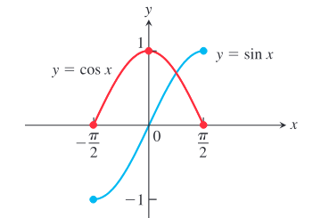
  
图 4.1 正弦函数和余弦函数在区间 $[-\pi/2,\pi/2]$ 上的绝对极值。这些值可能依赖于函数的定义域。

**例 1** 图 4.2 中可以看出下列函数在各自定义域上的绝对极值。每个函数都有相同的定义方程 $y=x^2$，但定义域不同。注意，如果定义域无界，或没有包含端点，函数可能没有最大值或最小值。

| 函数规则 | 定义域 $D$ | $D$ 上的绝对极值 |
|---|---|---|
| (a) $y=x^2$ | $(-\infty,\infty)$ | 没有绝对最大值；在 $x=0$ 处有绝对最小值 0 |
| (b) $y=x^2$ | $[0,2]$ | 在 $x=2$ 处有绝对最大值 4；在 $x=0$ 处有绝对最小值 0 |
| (c) $y=x^2$ | $(0,2]$ | 在 $x=2$ 处有绝对最大值 4；没有绝对最小值 |
| (d) $y=x^2$ | $(0,2)$ | 没有绝对极值 |

  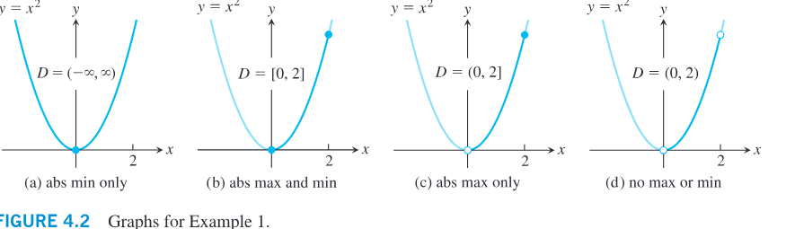
  
图 4.2 例 1 中各函数的图像。

下面的定理断言，如果函数在有限闭区间上连续，那么它在该区间上有绝对最大值和绝对最小值。我们在作函数图像时会寻找这些极值。

  

    
定理 1——极值定理

    
如果 $f$ 在闭区间 $[a,b]$ 上连续，那么 $f$ 在 $[a,b]$ 上同时取得绝对最大值 $M$ 和绝对最小值 $m$。也就是说，存在 $[a,b]$ 中的数 $x_1$ 和 $x_2$，使得 $f(x_1)=m,\ f(x_2)=M$，并且对 $[a,b]$ 中任意其他 $x$，有
      $$
      m\le f(x)\le M.
      $$
    

  

极值定理的证明需要对实数系统有详细了解（见附录 7），这里不作证明。图 4.3 展示了连续函数在闭区间 $[a,b]$ 上取得绝对极值的若干可能位置。正如我们在函数 $y=\cos x$ 中看到的，绝对最小值（或绝对最大值）可能在区间中两个或多个不同点处出现。定理 1 中区间必须闭且有限、函数必须连续的要求，都是关键条件。没有这些条件，定理结论可能不成立。例 1 说明，如果区间不是既闭又有限，绝对极值可能不存在。指数函数 $y=e^x$ 在 $(-\infty,\infty)$ 上说明，在无限区间上两个极值都可能不存在。图 4.4 表明，连续性条件不能省略。

  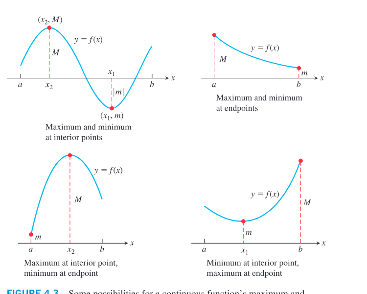
  
图 4.3 连续函数在闭区间 $[a,b]$ 上取得最大值和最小值的若干可能位置。

  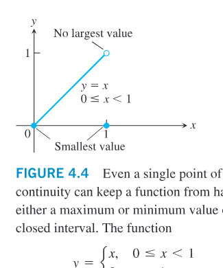
  
图 4.4 即使只有一个间断点，也可能使函数在闭区间上没有最大值或最小值。

### 局部（相对）极值

图 4.5 中，函数在其定义域 $[a,b]$ 上有五个点取得极值。函数的绝对最小值发生在 $a$ 处，尽管在 $e$ 处函数值小于附近任何其他点的函数值。曲线在 $c$ 附近左升右降，使得 $f(c)$ 是局部最大值。函数在 $d$ 处取得绝对最大值。现在定义局部极值的含义。

如果 $f$ 的定义域是闭区间 $[a,b]$，并且对某个半开区间 $[a,a+\delta)$ 中所有 $x$ 都有 $f(x)\le f(a)$，其中 $\delta>0$，则 $f$ 在端点 $x=a$ 处有局部最大值。类似地，如果 $x=c$ 是内部点，并且对某个开区间 $(c-\delta,c+\delta)$ 中所有 $x$ 都有 $f(x)\le f(c)$，其中 $\delta>0$，则 $f$ 在 $x=c$ 处有局部最大值；如果对某个半开区间 $(b-\delta,b]$ 中所有 $x$ 都有 $f(x)\le f(b)$，其中 $\delta>0$，则 $f$ 在端点 $x=b$ 处有局部最大值。局部最小值的定义把不等号反向。在图 4.5 中，函数 $f$ 在 $c$ 和 $d$ 处有局部最大值，在 $a,e,b$ 处有局部最小值。局部极值也称为相对极值。有些函数甚至在有限区间上可以有无穷多个局部极值。一个例子是区间 $(0,1]$ 上的函数 $f(x)=\sin(1/x)$。（我们在图 2.40 中画过这个函数。）

  

    
定义

    
如果对定义域 $D$ 中、位于某个含 $c$ 的开区间内的所有 $x$，都有 $f(x)\le f(c)$，则函数 $f$ 在其定义域 $D$ 中点 $c$ 处有局部最大值。

    
如果对定义域 $D$ 中、位于某个含 $c$ 的开区间内的所有 $x$，都有 $f(x)\ge f(c)$，则函数 $f$ 在其定义域 $D$ 中点 $c$ 处有局部最小值。

  

绝对最大值也是局部最大值。作为整体上的最大值，它也必定是其邻近区域中的最大值。因此，如果存在绝对最大值，那么所有局部最大值的列表会自动包含它。类似地，如果存在绝对最小值，那么所有局部最小值的列表会包含它。

  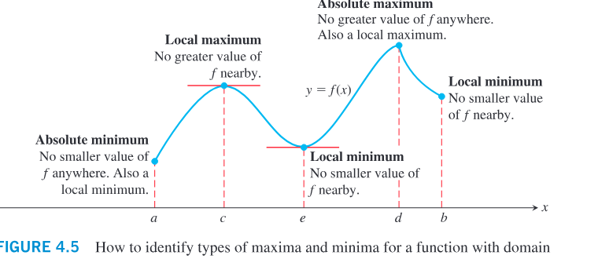
  
图 4.5 在定义域 $a\le x\le b$ 上识别函数最大值和最小值的类型。

### 求极值

下一个定理解释了为什么我们通常只需考察少数几个值，就能找到函数的极值。

  

    
定理 2——局部极值的一阶导数定理

    
如果 $f$ 在其定义域的内部点 $c$ 处有局部最大值或局部最小值，并且 $f'$ 在 $c$ 处有定义，那么
      $$
      f'(c)=0.
      $$
    

  

**证明** 为了证明 $f'(c)$ 在局部极值点处为零，我们先说明 $f'(c)$ 不可能为正，再说明它不可能为负。唯一既非正又非负的数是零，所以 $f'(c)$ 必须为零。

首先，假设 $f$ 在 $x=c$ 处有局部最大值（图 4.6），于是当 $x$ 足够接近 $c$ 时，有 $f(x)-f(c)\le 0$。由于 $c$ 是 $f$ 定义域的内部点，$f'(c)$ 由双侧极限

$$
\lim_{x\to c}\frac{f(x)-f(c)}{x-c}
$$

定义。这意味着当 $x=c$ 时，右极限和左极限都存在并等于 $f'(c)$。分别考察这两个极限，得到

$$
f'(c)=\lim_{x\to c^+}\frac{f(x)-f(c)}{x-c}\le 0,
\tag{1}
$$

因为 $(x-c)>0$ 且 $f(x)\le f(c)$。类似地，

$$
f'(c)=\lim_{x\to c^-}\frac{f(x)-f(c)}{x-c}\ge 0,
\tag{2}
$$

因为 $(x-c)<0$ 且 $f(x)\le f(c)$。式 (1) 和式 (2) 合在一起推出 $f'(c)=0$。这证明了局部最大值情形。对于局部最小值，只需使用 $f(x)\ge f(c)$，这会反转式 (1) 和式 (2) 中的不等号。

  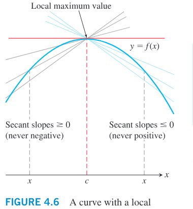
  
图 4.6 有局部最大值的曲线。在 $c$ 处，割线斜率的左右极限分别来自非正数和非负数，因而斜率为零。

定理 2 说明，在函数有局部极值且导数存在的内部点处，函数的一阶导数总是零。如果回想我们考虑的所有定义域都是区间或若干互不相交区间的并，那么函数 $f$ 可能取得极值（局部或全局）的地方只有：

1. $f'=0$ 的内部点；
2. $f'$ 不存在的内部点；
3. $f$ 定义域的端点。

下面的定义帮助我们概括这些结果。

  

    
定义

    
函数 $f$ 定义域中的一个内部点，如果在该点 $f'$ 为零或不存在，就称为 $f$ 的一个临界点。

  

因此，函数可能取得极值的定义域点只有临界点和端点。不过要注意不要误解这句话。函数可能在 $x=c$ 处有临界点，却没有局部极值。例如，函数 $y=x^3$ 和 $y=x^{1/3}$ 都在原点有临界点，但二者在原点都没有局部极值。相反，每个函数在原点都有拐点（见图 4.7）。我们将在第 4.4 节定义并研究拐点。

  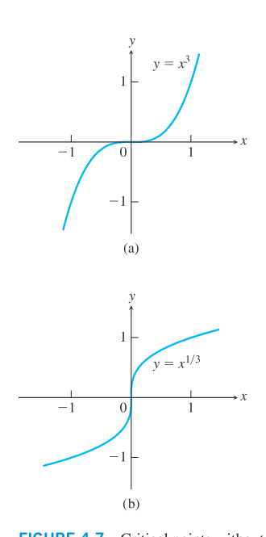
  
图 4.7 没有极值的临界点。(a) $y'=3x^2$ 在 $x=0$ 处为零，但 $y=x^3$ 没有极值；(b) $y'=(1/3)x^{-2/3}$ 在 $x=0$ 处不存在，但 $y=x^{1/3}$ 没有极值。

多数要求求极值的问题，都是要求在闭且有限的区间上求连续函数的绝对极值。定理 1 保证这样的值存在；定理 2 告诉我们它们只会在临界点和端点取得。通常可以直接列出这些点，计算相应函数值，从而找出最大值和最小值，以及它们出现的位置。当然，如果区间不是闭的或不是有限的（例如 $a<x<b$ 或 $a<x<\infty$），我们已经看到绝对极值不一定存在。如果绝对最大值或最小值确实存在，它一定发生在临界点，或发生在区间所包含的右端点或左端点。

  

    
如何求有限闭区间上连续函数 $f$ 的绝对极值

    
1. 在所有临界点和端点处计算 $f$ 的值。

    
2. 取这些值中的最大者和最小者。

  

**例 2** 求 $f(x)=x^2$ 在 $[-2,1]$ 上的绝对最大值和绝对最小值。

**解** 函数在整个定义域上可导，所以唯一临界点是 $f'(x)=2x=0$ 的地方，即 $x=0$。需要检查 $x=0$ 和端点 $x=-2,\ x=1$ 处的函数值：

$$
\text{临界点值：}\quad f(0)=0
$$

$$
\text{端点值：}\quad f(-2)=4,\qquad f(1)=1.
$$

函数在 $x=-2$ 处有绝对最大值 4，在 $x=0$ 处有绝对最小值 0。

**例 3** 求 $f(x)=10x(2-\ln x)$ 在区间 $[1,e^2]$ 上的绝对最大值和绝对最小值。

**解** 图 4.8 暗示 $f$ 的绝对最大值在 $x=3$ 附近，绝对最小值 0 在 $x=e^2$ 处。让我们验证这个观察。我们在临界点和端点处计算函数值，并取所得值中的最大者和最小者。

一阶导数为

$$
f'(x)=10(2-\ln x)-10x\left(\frac{1}{x}\right)=10(1-\ln x).
$$

定义域 $[1,e^2]$ 中唯一临界点是 $x=e$，此时 $\ln x=1$。在这个临界点和端点处，$f$ 的值为

$$
\text{临界点值：}\quad f(e)=10e
$$

$$
\text{端点值：}\quad f(1)=10(2-\ln 1)=20,\qquad f(e^2)=10e^2(2-2\ln e)=0.
$$

由这个列表可见，函数的绝对最大值是 $10e\approx 27.2$，发生在内部临界点 $x=e$ 处。绝对最小值是 0，发生在右端点 $x=e^2$ 处。

  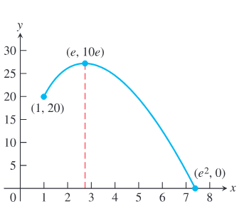
  
图 4.8 函数 $f(x)=10x(2-\ln x)$ 在 $[1,e^2]$ 上的极值出现在 $x=e$ 和 $x=e^2$ 处。

**例 4** 求 $f(x)=x^{2/3}$ 在区间 $[-2,3]$ 上的绝对最大值和绝对最小值。

**解** 我们在临界点和端点处计算函数值，并取所得值中的最大者和最小者。一阶导数

$$
f'(x)=\frac{2}{3}x^{-1/3}=\frac{2}{3\sqrt[3]{x}}
$$

没有零点，但在内部点 $x=0$ 处不存在。在这个临界点和端点处，$f$ 的值为

$$
\text{临界点值：}\quad f(0)=0
$$

$$
\text{端点值：}\quad f(-2)=(-2)^{2/3}=\sqrt[3]{4},\qquad f(3)=3^{2/3}=\sqrt[3]{9}.
$$

由这个列表可见，函数的绝对最大值是 $\sqrt[3]{9}\approx 2.08$，发生在右端点 $x=3$ 处。绝对最小值是 0，发生在内部点 $x=0$ 处，在那里图像有一个尖点（图 4.9）。

  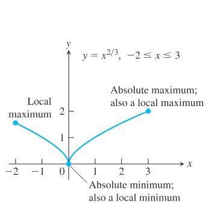
  
图 4.9 函数 $f(x)=x^{2/3}$ 在 $[-2,3]$ 上的极值出现在 $x=0$ 和 $x=3$ 处。

## 4.2 中值定理

我们知道常数函数的导数为零，但是否可能存在一个更复杂的函数，它的导数处处为零？如果两个函数在一个区间上有相同的导数，那么这两个函数有什么关系？本节通过应用中值定理来回答这些以及其他问题。首先引入一个特殊情形，称为 Rolle 定理，它将用于证明中值定理。

### Rolle 定理

正如图像所暗示的，如果一个可导函数在两个不同点穿过同一条水平线，那么在这两点之间至少有一点，图像的切线是水平的，导数为零（图 4.10）。现在陈述并证明这一结果。

  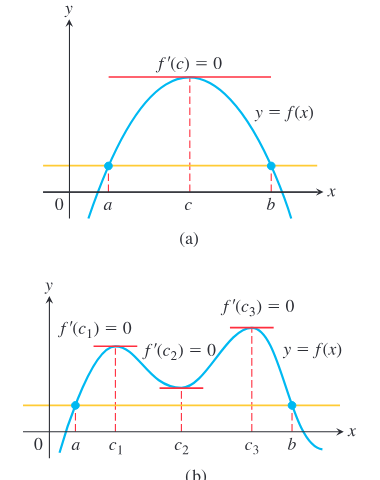
  
图 4.10 罗尔定理说明，一条可导曲线如果在两点穿过同一条水平线，则两点之间至少有一条水平切线；可能只有一条，也可能有多条。

  

    
定理 3——Rolle 定理

    
设 $f$ 在 $[a,b]$ 上连续，并且在 $(a,b)$ 上可导。如果 $f(a)=f(b)$，那么在 $(a,b)$ 中至少存在一个数 $c$，使得
      $$
      f'(c)=0.
      $$
    

  

**证明** 由于 $f$ 在 $[a,b]$ 上连续，极值定理保证 $f$ 在 $[a,b]$ 上取得绝对最大值和绝对最小值。如果这两个值相等，那么 $f$ 在 $[a,b]$ 上为常数，所以对 $(a,b)$ 中任意 $c$ 都有 $f'(c)=0$。

如果绝对最大值和绝对最小值不相等，那么二者中至少有一个不同于端点处的共同值 $f(a)=f(b)$。因此，这个极值必须在内部点 $c$ 处取得。由于 $f$ 在 $(a,b)$ 上可导，定理 2 给出 $f'(c)=0$。

### 中值定理

Rolle 定理是下面定理的特殊情形。中值定理说，在连接曲线两端点的割线斜率，与曲线在某个内部点处切线斜率相等。也就是说，至少有一个内部点 $c$，其瞬时变化率等于区间上的平均变化率。

  

    
定理 4——中值定理

    
设 $f$ 在 $[a,b]$ 上连续，并且在 $(a,b)$ 上可导。那么在 $(a,b)$ 中至少存在一个数 $c$，使得
      $$
      \frac{f(b)-f(a)}{b-a}=f'(c).
      $$
      或等价地，
      $$
      f(b)-f(a)=f'(c)(b-a).
      $$
    

  

  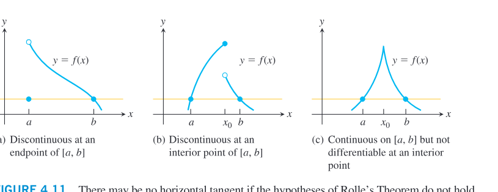
  
图 4.11 如果罗尔定理的假设不成立，图像可能没有水平切线。

**证明** 我们把中值定理化为 Rolle 定理。设 $L(x)$ 是过点 $(a,f(a))$ 和 $(b,f(b))$ 的割线的方程：

$$
L(x)=f(a)+\frac{f(b)-f(a)}{b-a}(x-a).
$$

考虑函数

$$
g(x)=f(x)-L(x).
$$

函数 $g$ 在 $[a,b]$ 上连续，并在 $(a,b)$ 上可导，而且

$$
g(a)=f(a)-L(a)=0,\qquad g(b)=f(b)-L(b)=0.
$$

由 Rolle 定理，在 $(a,b)$ 中存在一点 $c$，使得 $g'(c)=0$。但

$$
g'(x)=f'(x)-\frac{f(b)-f(a)}{b-a}.
$$

因此

$$
0=g'(c)=f'(c)-\frac{f(b)-f(a)}{b-a},
$$

从而

$$
f'(c)=\frac{f(b)-f(a)}{b-a}.
$$

这证明了中值定理。

**例 1** 说明函数 $f(x)=x^2$ 在区间 $[0,2]$ 上满足中值定理的结论，并求满足结论的点 $c$。

**解** 函数 $f$ 在 $[0,2]$ 上连续，并在 $(0,2)$ 上可导。割线斜率为

$$
\frac{f(2)-f(0)}{2-0}=\frac{4-0}{2}=2.
$$

由于 $f'(x)=2x$，令 $2x=2$ 得 $x=1$。因此 $c=1$。

### 中值定理的推论

在本节开头，我们问过：什么样的函数在一个区间上导数为零？中值定理的第一个推论给出答案：只有常数函数。

  

    
推论 1

    
如果在开区间 $(a,b)$ 的每一点 $x$ 处都有 $f'(x)=0$，那么对 $(a,b)$ 中所有 $x$，有
      $$
      f(x)=C,
      $$
      其中 $C$ 是常数。
    

  

**证明** 要证明 $f$ 在区间 $(a,b)$ 上取常值，只需证明如果 $x_1,x_2$ 是 $(a,b)$ 中任意两点且 $x_1<x_2$，那么 $f(x_1)=f(x_2)$。现在 $f$ 在 $[x_1,x_2]$ 上满足中值定理的假设：它在每一点可导，因此也在每一点连续。所以存在 $x_1$ 与 $x_2$ 之间的某点 $c$，使得

$$
\frac{f(x_2)-f(x_1)}{x_2-x_1}=f'(c).
$$

由于在整个 $(a,b)$ 上 $f'=0$，上式依次推出

$$
\frac{f(x_2)-f(x_1)}{x_2-x_1}=0,\qquad f(x_2)-f(x_1)=0,\qquad f(x_1)=f(x_2).
$$

本节开头还问过：如果两个函数在一个区间上有相同的导数，那么它们之间有什么关系？下一个推论告诉我们，它们在该区间上的函数值只差一个常数。

  

    
推论 2

    
如果在开区间 $(a,b)$ 中每一点 $x$ 处都有 $f'(x)=g'(x)$，那么存在常数 $C$，使得对 $(a,b)$ 中所有 $x$，
      $$
      f(x)=g(x)+C.
      $$
      也就是说，$f-g$ 在 $(a,b)$ 上是常数函数。
    

  

**证明** 在每一点 $x\in(a,b)$ 处，差函数 $h=f-g$ 的导数为

$$
h'(x)=f'(x)-g'(x)=0.
$$

因此，由推论 1，$h(x)=C$ 在 $(a,b)$ 上成立。也就是说，$f(x)-g(x)=C$，所以 $f(x)=g(x)+C$。

推论 1 和推论 2 在开区间 $(a,b)$ 不是有限区间时也成立。也就是说，如果区间是 $(a,\infty)$、$(-\infty,b)$ 或 $(-\infty,\infty)$，它们仍成立。推论 2 在第 4.8 节讨论反导数时会起重要作用。例如，它告诉我们，由于 $f(x)=x^2$ 在 $(-\infty,\infty)$ 上的导数是 $2x$，所以在 $(-\infty,\infty)$ 上任何其他导数为 $2x$ 的函数都必须具有形式 $x^2+C$，其中 $C$ 是某个常数。

## 4.3 单调函数与一阶导数检验

在描绘可导函数的图像时，知道函数在哪些区间上递增（从左向右上升）、在哪些区间上递减（从左向右下降）很有用。本节给出判断递增与递减的检验方法，并说明如何用函数的临界点来判断是否存在局部极值。

### 递增函数与递减函数

作为中值定理的另一个推论，我们可以证明：导数为正的函数递增，导数为负的函数递减。一个函数如果在某个区间上递增或递减，就称它在该区间上是单调的。

  

    
推论 3

    
设 $f$ 在 $[a,b]$ 上连续，并在 $(a,b)$ 上可导。

    
如果在 $(a,b)$ 中每一点 $x$ 都有 $f'(x)>0$，那么 $f$ 在 $[a,b]$ 上递增。

    
如果在 $(a,b)$ 中每一点 $x$ 都有 $f'(x)<0$，那么 $f$ 在 $[a,b]$ 上递减。

  

**证明** 令 $x_1$ 和 $x_2$ 是 $[a,b]$ 中任意两点，且 $x_1<x_2$。把中值定理应用于 $f$ 在 $[x_1,x_2]$ 上，可知存在介于 $x_1$ 和 $x_2$ 之间的 $c$，使得

$$
f(x_2)-f(x_1)=f'(c)(x_2-x_1).
$$

由于 $x_2-x_1>0$，右边的符号与 $f'(c)$ 的符号相同。因此，如果 $f'$ 在 $(a,b)$ 上为正，则 $f(x_2)>f(x_1)$；如果 $f'$ 在 $(a,b)$ 上为负，则 $f(x_2)<f(x_1)$。

推论 3 告诉我们，对任意 $b>0$，函数 $f(x)=\sqrt{x}$ 在区间 $[0,b]$ 上递增，因为 $f'(x)=1/(2\sqrt{x})$ 在 $(0,b)$ 上为正。虽然导数在 $x=0$ 处不存在，推论 3 仍然适用。这个推论对无限区间也成立，所以 $f(x)=\sqrt{x}$ 在 $[0,\infty)$ 上递增。

要寻找函数 $f$ 的递增、递减区间，通常先找出 $f$ 的全部临界点。若 $a<b$ 是两个临界点，并且 $f'$ 在 $(a,b)$ 上连续且从不为零，那么由中间值定理，$f'$ 在 $(a,b)$ 上必须恒正或恒负。我们只需在该区间中选一个方便的点 $c$，计算 $f'(c)$ 的符号，就能判断整个区间上 $f'$ 的符号。

**例 1** 求 $f(x)=x^3-12x-5$ 的临界点，并确定 $f$ 递增、递减的开区间。

**解** 函数 $f$ 处处连续且可导。其一阶导数为

$$
f'(x)=3x^2-12=3(x^2-4)=3(x+2)(x-2).
$$

因此临界点为 $x=-2$ 和 $x=2$。它们把定义域分成互不重叠的开区间 $(-\infty,-2)$、$(-2,2)$ 和 $(2,\infty)$，在每个区间上 $f'$ 不是正就是负。选取各区间中的测试点，得到下表。

| 区间 | 代入 $f'$ | $f'$ 的符号 | $f$ 的行为 |
|---|---:|:---:|---|
| $-\infty<x<-2$ | $f'(-3)=15$ | $+$ | 递增 |
| $-2<x<2$ | $f'(0)=-12$ | $-$ | 递减 |
| $2<x<\infty$ | $f'(3)=15$ | $+$ | 递增 |

我们在汇总表中用严格不等式，是因为这里列出的是开区间。由推论 3，也可以把端点包含进结论中：例 1 中的函数在 $-\infty<x\le -2$ 上递增，在 $-2\le x\le 2$ 上递减，在 $2\le x<\infty$ 上递增。我们不说一个函数“在某一点递增”或“在某一点递减”。

### 局部极值的一阶导数检验

在局部最小值点处，$f'$ 在该点左侧立即为负、右侧立即为正（若该点是端点，则只需考虑一侧）。也就是说，函数在最小值左侧递减，在右侧递增。类似地，在局部最大值点处，$f'$ 在该点左侧立即为正、右侧立即为负。因此，在局部极值点处，$f'(x)$ 的符号会发生改变。

  

    
局部极值的一阶导数检验

    
设 $c$ 是连续函数 $f$ 的临界点，并且 $f$ 在包含 $c$ 的某个区间内除可能在 $c$ 处外处处可导。当从左向右穿过这个区间时：

    
1. 如果 $f'$ 在 $c$ 处由负变正，那么 $f$ 在 $c$ 处有局部最小值；

    
2. 如果 $f'$ 在 $c$ 处由正变负，那么 $f$ 在 $c$ 处有局部最大值；

    
3. 如果 $f'$ 在 $c$ 处不改变符号，也就是说 $f'$ 在 $c$ 两侧都为正或都为负，那么 $f$ 在 $c$ 处没有局部极值。

  

端点处的局部极值检验类似，但根据 $f'$ 的符号只需考虑一侧。

**一阶导数检验的证明（第 1 部分）** 由于 $f'$ 的符号在 $c$ 处由负变正，所以存在数 $a,b$，使得 $a<c<b$，并且 $f'<0$ 在 $(a,c)$ 上成立、$f'>0$ 在 $(c,b)$ 上成立。若 $x\in(a,c)$，则 $f(c)<f(x)$，因为 $f'<0$ 意味着 $f$ 在 $[a,c]$ 上递减。若 $x\in(c,b)$，则 $f(c)<f(x)$，因为 $f'>0$ 意味着 $f$ 在 $[c,b]$ 上递增。因此，对每个 $x\in(a,b)$，都有 $f(x)\ge f(c)$。按照定义，$f$ 在 $c$ 处有局部最小值。第 2、3 部分可类似证明。

**例 2** 求

$$
f(x)=x^{1/3}(x-4)=x^{4/3}-4x^{1/3}
$$

的临界点。确定 $f$ 递增、递减的开区间，并求函数的局部极值和绝对极值。

**解** 函数 $f$ 是两个连续函数 $x^{1/3}$ 和 $x-4$ 的乘积，所以对所有 $x$ 连续。一阶导数为

$$
f'(x)=\frac{d}{dx}\left(x^{4/3}-4x^{1/3}\right)
=\frac{4}{3}x^{1/3}-\frac{4}{3}x^{-2/3}
=\frac{4}{3}x^{-2/3}(x-1)
=\frac{4(x-1)}{3x^{2/3}}.
$$

导数在 $x=1$ 处为零，在 $x=0$ 处不存在。定义域没有端点，所以临界点 $x=0$ 与 $x=1$ 是函数可能取得极值的唯一位置。临界点把 $x$ 轴分为若干开区间，$f'$ 在每个区间上为正或为负。其符号和函数行为如下。

| 区间 | $f'$ 的符号 | $f$ 的行为 |
|---|:---:|---|
| $x<0$ | $-$ | 递减 |
| $0<x<1$ | $-$ | 递减 |
| $x>1$ | $+$ | 递增 |

由推论 3，$f$ 在 $(-\infty,0)$ 上递减，在 $(0,1)$ 上递减，在 $(1,\infty)$ 上递增。一阶导数检验告诉我们，$x=0$ 处没有极值（$f'$ 不变号），而 $x=1$ 处有局部最小值（$f'$ 由负变正）。局部最小值为

$$
f(1)=1^{1/3}(1-4)=-3.
$$

这也是绝对最小值，因为 $f$ 在 $(-\infty,1)$ 上递减、在 $(1,\infty)$ 上递增。还要注意

$$
\lim_{x\to 0} f'(x)=-\infty,
$$

所以 $f$ 的图像在原点有一条竖直切线。

**例 3** 求

$$
f(x)=(x^2-3)e^x
$$

的局部极值。

**解** 因为 $e^x$ 对所有 $x$ 都为正，所以 $f'$ 的符号只由二次因子决定：

$$
f'(x)=2xe^x+(x^2-3)e^x=(x^2+2x-3)e^x=(x+3)(x-1)e^x.
$$

临界点为 $x=-3$ 和 $x=1$。符号表为

| 区间 | $f'$ 的符号 | $f$ 的行为 |
|---|:---:|---|
| $x<-3$ | $+$ | 递增 |
| $-3<x<1$ | $-$ | 递减 |
| $1<x$ | $+$ | 递增 |

所以 $f$ 在 $x=-3$ 处有局部最大值，在 $x=1$ 处有局部最小值。函数值为

$$
f(-3)=6e^{-3}\approx 0.299,\qquad f(1)=-2e\approx -5.437.
$$

因为当 $|x|>\sqrt{3}$ 时 $f(x)>0$，所以 $x=1$ 处的局部最小值也是绝对最小值。函数没有绝对最大值。

## 4.4 凹性与曲线描绘

我们已经看到，一阶导数告诉我们函数在哪里递增、在哪里递减，以及临界点处是否出现局部最大值或局部最小值。本节说明二阶导数如何提供图像弯曲或转向的信息。把一阶导数、二阶导数、对称性以及渐近行为结合起来，就能较准确地描绘函数图像，并揭示函数的关键特征。

### 凹性

以曲线 $y=x^3$ 为例，它在 $x$ 增加时整体上升，但在 $(-\infty,0)$ 与 $(0,\infty)$ 上弯曲方式不同。从左侧沿曲线接近原点时，曲线向右转并落在其切线下方，切线斜率递减；从原点向右沿曲线离开时，曲线向左转并升到其切线上方，切线斜率递增。这种转向或弯曲行为定义了曲线的凹性。

  

    
定义

    
可导函数 $y=f(x)$ 的图像在开区间 $I$ 上称为向上凹，如果 $f'$ 在 $I$ 上递增。

    
可导函数 $y=f(x)$ 的图像在开区间 $I$ 上称为向下凹，如果 $f'$ 在 $I$ 上递减。

  

如果 $y=f(x)$ 二阶可导，我们在表示二阶导数时会交替使用 $f''$ 和 $y''$。

**例 1**

(a) 曲线 $y=x^3$ 在 $(-\infty,0)$ 上向下凹，因为 $y''=6x<0$；在 $(0,\infty)$ 上向上凹，因为 $y''=6x>0$。

(b) 曲线 $y=x^2$ 在 $(-\infty,\infty)$ 上向上凹，因为其二阶导数 $y''=2$ 始终为正。

**例 2** 判断 $y=3+\sin x$ 在 $[0,2\pi]$ 上的凹性。

**解** 函数的一阶导数为 $y'=\cos x$，二阶导数为 $y''=-\sin x$。在 $(0,\pi)$ 上，$y''=-\sin x<0$，所以图像向下凹；在 $(\pi,2\pi)$ 上，$y''=-\sin x>0$，所以图像向上凹。

### 拐点

例 2 中曲线 $y=3+\sin x$ 在点 $(\pi,3)$ 处改变凹性。由于一阶导数 $y'=\cos x$ 对所有 $x$ 存在，所以曲线在点 $(\pi,3)$ 处有斜率为 $-1$ 的切线。这个点称为曲线的拐点。注意，图像在这一点穿过它的切线，而且二阶导数 $y''=-\sin x$ 在 $x=\pi$ 处等于 0。

  

    
定义

    
如果函数图像在点 $(c,f(c))$ 处有切线，并且凹性在该点发生改变，那么点 $(c,f(c))$ 称为一个拐点。

  

在拐点 $(c,f(c))$ 处，或者 $f''(c)=0$，或者 $f''(c)$ 不存在。

  

    
凹性的二阶导数检验

    
设 $y=f(x)$ 在区间 $I$ 上二阶可导。

    
1. 如果 $f''>0$ 在 $I$ 上成立，那么 $f$ 在 $I$ 上的图像向上凹。

    
2. 如果 $f''<0$ 在 $I$ 上成立，那么 $f$ 在 $I$ 上的图像向下凹。

  

我们观察到，$f(x)=3+\sin x$ 的二阶导数在拐点 $(\pi,3)$ 处为零。一般来说，如果二阶导数在拐点 $(c,f(c))$ 处存在，那么 $f''(c)=0$。当 $f''$ 在含 $c$ 的区间上连续时，这一点可由中间值定理立即推出，因为穿过该区间时二阶导数会改变符号。即使不假设连续，只要二阶导数存在，结论仍然成立，不过证明需要更高级的论证。由于拐点处必须有切线，所以要么 $f'(c)$ 存在（且有限），要么图像在该点有竖直切线。若是竖直切线，一阶导数和二阶导数都不存在。

**例 3** 函数 $f(x)=x^{5/3}$ 的图像在原点有水平切线，因为

$$
f'(x)=\frac{5}{3}x^{2/3}
$$

在 $x=0$ 处为零。然而

$$
f''(x)=\frac{d}{dx}\left(\frac{5}{3}x^{2/3}\right)=\frac{10}{9}x^{-1/3}
$$

在 $x=0$ 处不存在。尽管如此，当 $x<0$ 时 $f''(x)<0$，当 $x>0$ 时 $f''(x)>0$，所以二阶导数在 $x=0$ 处变号，原点是一个拐点。

**例 4** 曲线 $y=x^4$ 在 $x=0$ 处没有拐点。虽然二阶导数 $y''=12x^2$ 在该点为零，但它不改变符号。

**例 5** 曲线 $y=x^{1/3}$ 在原点有拐点，因为二阶导数

$$
y''=\frac{d^2}{dx^2}\left(x^{1/3}\right)
=\frac{d}{dx}\left(\frac{1}{3}x^{-2/3}\right)
=-\frac{2}{9}x^{-5/3}
$$

在 $x<0$ 时为正，在 $x>0$ 时为负。然而 $y'=\frac{1}{3}x^{-2/3}$ 和 $y''$ 在 $x=0$ 处都不存在，图像在那里有竖直切线。

**注意** 第 4.1 节例 4 中的函数 $f(x)=x^{2/3}$ 在 $x=0$ 处没有二阶导数，也没有拐点，因为那里没有凹性改变。结合上面的例 5 可见：当二阶导数在 $x=c$ 处不存在时，拐点可能存在，也可能不存在。因此，在一阶导数或二阶导数不存在的点解释函数行为时必须谨慎。这样的点处，图像可能有竖直切线、角点、尖点或各种间断。

研究物体沿直线运动时，我们常常关心其加速度（位置函数的二阶导数）何时为正、何时为负。位置函数图像上的拐点揭示了加速度改变符号的位置。

**例 6** 一个质点沿水平坐标轴运动（向右为正方向），位置函数为

$$
s(t)=2t^3-14t^2+22t-5,\qquad t\ge 0.
$$

求速度和加速度，并描述质点的运动。

**解** 速度为

$$
v(t)=s'(t)=6t^2-28t+22=2(t-1)(3t-11),
$$

加速度为

$$
a(t)=v'(t)=s''(t)=12t-28=4(3t-7).
$$

当 $s(t)$ 递增时，质点向右运动；当 $s(t)$ 递减时，质点向左运动。注意，一阶导数 $v=s'$ 在临界点 $t=1$ 和 $t=11/3$ 处为零。于是质点在时间区间 $[0,1)$ 和 $(11/3,\infty)$ 内向右运动，在 $(1,11/3)$ 内向左运动，并在 $t=1$ 和 $t=11/3$ 时瞬时静止。加速度

$$
a(t)=s''(t)=4(3t-7)
$$

在 $t=7/3$ 时为零。

| 区间 | $v=s'$ 的符号 | $s$ 的行为 | 质点运动 |
|---|:---:|---|---|
| $0<t<1$ | $+$ | 递增 | 向右 |
| $1<t<11/3$ | $-$ | 递减 | 向左 |
| $11/3<t$ | $+$ | 递增 | 向右 |

| 区间 | $a=s''$ 的符号 | $s$ 的图像 |
|---|:---:|---|
| $0<t<7/3$ | $-$ | 向下凹 |
| $7/3<t$ | $+$ | 向上凹 |

质点开始向右运动并减速，然后在 $t=1$ 处反向向左运动。到 $t=7/3$ 时，加速度改变符号；之后仍向左运动但速度大小减小。到 $t=11/3$ 时质点再次瞬时静止，然后向右运动并加速。

  

    
定理 5——局部极值的二阶导数检验

    
设 $f''$ 在包含 $x=c$ 的开区间上连续。

    
1. 如果 $f'(c)=0$ 且 $f''(c)<0$，那么 $f$ 在 $x=c$ 处有局部最大值。

    
2. 如果 $f'(c)=0$ 且 $f''(c)>0$，那么 $f$ 在 $x=c$ 处有局部最小值。

    
3. 如果 $f'(c)=0$ 且 $f''(c)=0$，那么检验失效。函数 $f$ 可能有局部最大值、局部最小值，也可能二者都没有。

  

**证明** 如果 $f''(c)<0$，那么由于 $f''$ 连续，存在一个包含 $c$ 的小区间，在该区间内 $f''<0$。因此 $f'$ 在该区间上递减。又因为 $f'(c)=0$，所以 $f'$ 在 $c$ 左侧为正、在 $c$ 右侧为负。由一阶导数检验，$f$ 在 $c$ 处有局部最大值。第 2 部分可类似证明。第 3 部分说明的是：当 $f''(c)=0$ 时，仅凭二阶导数检验不能判断；例如 $x^4$、$-x^4$ 与 $x^3$ 在原点分别给出局部最小值、局部最大值和没有局部极值。

**例 7** 描绘

$$
f(x)=x^4-4x^3+10
$$

的图像。

**解** 先计算导数：

$$
f'(x)=4x^3-12x^2=4x^2(x-3),
$$

所以临界点为 $x=0$ 和 $x=3$。一阶导数符号表为

| 区间 | $f'$ 的符号 | $f$ 的行为 |
|---|:---:|---|
| $x<0$ | $-$ | 递减 |
| $0<x<3$ | $-$ | 递减 |
| $3<x$ | $+$ | 递增 |

于是 $x=0$ 处没有极值，$x=3$ 处有局部最小值。再求二阶导数：

$$
f''(x)=12x^2-24x=12x(x-2).
$$

二阶导数在 $x=0$ 和 $x=2$ 处为零，其符号表为

| 区间 | $f''$ 的符号 | 凹性 |
|---|:---:|---|
| $x<0$ | $+$ | 向上凹 |
| $0<x<2$ | $-$ | 向下凹 |
| $2<x$ | $+$ | 向上凹 |

因此图像在 $x=0$ 和 $x=2$ 处有拐点。一般形状是：先递减且向上凹，经过 $x=0$ 后仍递减但向下凹，经过 $x=2$ 后仍递减但向上凹，到 $x=3$ 处达到局部最小值，之后递增并向上凹。

例 7 中的步骤给出了一套描绘函数主要特征的流程。

### 描绘 $y=f(x)$ 图像的步骤

1. 确定 $f$ 的定义域以及曲线可能具有的对称性。
2. 求导数 $y'$ 和 $y''$。
3. 找出 $f$ 的临界点（如果有），并识别函数在每个临界点处的行为。
4. 找出曲线在哪里递增、在哪里递减。
5. 找出拐点（如果有），并确定曲线的凹性。
6. 确定可能存在的渐近线。
7. 标出关键点，例如截距以及步骤 3-5 中找到的点，并连同存在的渐近线一起描绘曲线。

**例 8** 描绘

$$
f(x)=\frac{(x+1)^2}{1+x^2}
$$

的图像。

**解** 函数的定义域为 $(-\infty,\infty)$，图像关于坐标轴或原点都没有对称性。$x$ 截距为 $x=-1$，$y$ 截距为 $y=1$。

求导得

$$
f'(x)=\frac{2(1-x^2)}{(1+x^2)^2},
$$

所以临界点为 $x=-1$ 和 $x=1$。继续求导得

$$
f''(x)=\frac{4x(x^2-3)}{(1+x^2)^3}.
$$

在 $x=-1$ 处，$f''(-1)>0$，所以有局部最小值；在 $x=1$ 处，$f''(1)<0$，所以有局部最大值。函数在 $(-\infty,-1)$ 上递减，在 $(-1,1)$ 上递增，在 $(1,\infty)$ 上递减。

由于 $f''$ 的分母恒正，二阶导数在 $x=-\sqrt{3},0,\sqrt{3}$ 处为零，并且在这些点处变号。因此它们都是拐点。曲线在 $(-\infty,-\sqrt{3})$ 上向下凹，在 $(-\sqrt{3},0)$ 上向上凹，在 $(0,\sqrt{3})$ 上向下凹，在 $(\sqrt{3},\infty)$ 上向上凹。

把分子展开并将分子、分母都除以 $x^2$，可得

$$
f(x)=\frac{x^2+2x+1}{1+x^2}
=\frac{1+(2/x)+(1/x^2)}{(1/x^2)+1}.
$$

因此当 $x\to\infty$ 时 $f(x)\to 1^+$，当 $x\to-\infty$ 时 $f(x)\to 1^-$，直线 $y=1$ 是水平渐近线。函数没有竖直渐近线，且值域为 $0\le y\le 2$。

**例 9** 描绘

$$
f(x)=\frac{x^2+4}{2x}
$$

的图像。

**解** 定义域为所有非零实数。没有截距，因为 $x$ 和 $f(x)$ 都不能为零。由于 $f(-x)=-f(x)$，函数为奇函数，图像关于原点对称。为便于求导，将函数写成

$$
f(x)=\frac{x}{2}+\frac{2}{x}.
$$

于是

$$
f'(x)=\frac12-\frac{2}{x^2}
=\frac{x^2-4}{2x^2},
\qquad
f''(x)=\frac{4}{x^3}.
$$

临界点为 $x=\pm2$。由于 $f''(-2)<0$、$f''(2)>0$，二阶导数检验说明：$x=-2$ 处有局部最大值 $f(-2)=-2$，$x=2$ 处有局部最小值 $f(2)=2$。

函数在 $(-\infty,-2)$ 上递增，在 $(-2,0)$ 上递减，在 $(0,2)$ 上递减，在 $(2,\infty)$ 上递增。没有拐点，因为 $x<0$ 时 $f''(x)<0$，$x>0$ 时 $f''(x)>0$，而 $x=0$ 不在定义域中；在定义域内，$f''$ 处处存在且从不为零。图像在 $(-\infty,0)$ 上向下凹，在 $(0,\infty)$ 上向上凹。

由

$$
f(x)=\frac{x}{2}+\frac{2}{x}
$$

可见，当 $x\to 0^+$ 时 $f(x)\to+\infty$，当 $x\to 0^-$ 时 $f(x)\to-\infty$，所以 $y$ 轴是竖直渐近线。又当 $x\to\pm\infty$ 时，图像接近直线 $y=x/2$，所以 $y=x/2$ 是斜渐近线。

**例 10** 描绘

$$
f(x)=e^{2/x}
$$

的图像。

**解** 定义域为 $(-\infty,0)\cup(0,\infty)$，图像关于坐标轴或原点都没有对称性。导数为

$$
f'(x)=e^{2/x}\left(-\frac{2}{x^2}\right)
=-\frac{2e^{2/x}}{x^2},
$$

以及

$$
f''(x)=\frac{4e^{2/x}(1+x)}{x^4}.
$$

两个导数在函数定义域上处处存在。由于 $e^{2/x}$ 和 $x^2$ 对所有 $x\ne0$ 都为正，所以 $f'<0$ 在整个定义域上成立，图像处处递减。二阶导数在 $x=-1$ 处为零；又因 $e^{2/x}>0$ 且 $x^4>0$，当 $x<-1$ 时 $f''<0$，当 $x>-1$ 且 $x\ne0$ 时 $f''>0$。因此点 $(-1,e^{-2})$ 是拐点。曲线在 $(-\infty,-1)$ 上向下凹，在 $(-1,0)$ 与 $(0,\infty)$ 上向上凹。

当 $x\to0^-$ 时，$f(x)\to0$；当 $x\to0^+$ 时，$f(x)\to\infty$，所以 $x=0$ 是竖直渐近线。当 $x\to-\infty$ 或 $x\to\infty$ 时，$2/x\to0$，于是

$$
\lim_{x\to-\infty}f(x)=\lim_{x\to\infty}f(x)=e^0=1.
$$

因此 $y=1$ 是水平渐近线。函数没有绝对极值，因为它从不取值 0，也没有绝对最大值。

### 从导数判断函数图像行为

从例 7-10 可以看到，通过研究二阶可导函数 $y=f(x)$ 的一阶导数，可以知道图像在哪里上升、在哪里下降，以及局部极值在哪里。再对 $y'$ 求导，可以了解图像在递增、递减区间上如何弯曲，从而确定图像形状。导数不能告诉我们图像在 $xy$ 平面中的具体位置；如第 4.2 节所示，要定位图像，还需要知道函数在某一点的值。渐近线信息则通过极限获得。

## 4.5 不定式与洛必达法则

约翰（约翰）·伯努利发现了一条用导数计算极限的法则，适用于分子和分母都趋于零或都趋于无穷的分式。这条法则今天称为洛必达法则，以法国贵族 Guillaume de l'Hôpital 命名；他写了第一本微分学入门教材，法则也首次在那里以印刷形式出现。含超越函数的极限常常需要用到这条法则。

### 不定式 $0/0$

如果连续函数 $f(x)$ 和 $g(x)$ 在 $x=a$ 处都为零，那么

$$
\lim_{x\to a}\frac{f(x)}{g(x)}
$$

不能通过直接代入 $x=a$ 求出。代入会产生 $0/0$，这是没有意义的表达式，不能被当作数值计算。我们用 $0/0$ 表示一种称为不定式的表达式。其他没有固定意义的表达式也常出现，例如 $\infty/\infty$、$\infty\cdot0$、$\infty-\infty$、$0^0$ 和 $1^\infty$，它们也称为不定式。

有时，由不定式产生的极限可以通过约分、重排或其他代数变形求出；第 2 章中我们已经这样做过。求

$$
\lim_{x\to0}\frac{\sin x}{x}
$$

曾需要第 2.4 节中的详细分析。另一方面，导数定义中的极限

$$
f'(a)=\lim_{x\to a}\frac{f(x)-f(a)}{x-a}
$$

在直接代入 $x=a$ 时也产生 $0/0$，但它恰恰是我们成功用来计算导数的极限。洛必达法则让我们利用求导的成果，去计算那些本来会导致不定式的极限。

  

    
定理 6——洛必达法则

    
设 $f(a)=g(a)=0$，$f$ 与 $g$ 在含 $a$ 的开区间 $I$ 上可导，并且当 $x\ne a$ 时 $g'(x)\ne0$。如果右侧极限存在，则
      $$
      \lim_{x\to a}\frac{f(x)}{g(x)}
      =
      \lim_{x\to a}\frac{f'(x)}{g'(x)}.
      $$
    

  

本节末尾给出定理 6 的证明。

**例 1** 下列极限都含有 $0/0$ 不定式，所以可以应用洛必达法则。有些情形需要反复应用。

(a)

$$
\lim_{x\to0}\frac{3x-\sin x}{x}
=\lim_{x\to0}\frac{3-\cos x}{1}=2.
$$

(b)

$$
\lim_{x\to0}\frac{\sqrt{1+x}-1}{x}
=\lim_{x\to0}\frac{1/(2\sqrt{1+x})}{1}
=\frac12.
$$

(c)

$$
\lim_{x\to0}\frac{\sqrt{1+x}-1-x/2}{x^2}.
$$

第一次应用洛必达法则后仍为 $0/0$：

$$
\lim_{x\to0}
\frac{(1/2)(1+x)^{-1/2}-1/2}{2x}.
$$

再次应用洛必达法则，得到

$$
\lim_{x\to0}\frac{-(1/4)(1+x)^{-3/2}}{2}
=-\frac18.
$$

(d)

$$
\lim_{x\to0}\frac{x-\sin x}{x^3}.
$$

连续三次应用洛必达法则：

$$
\lim_{x\to0}\frac{x-\sin x}{x^3}
=\lim_{x\to0}\frac{1-\cos x}{3x^2}
=\lim_{x\to0}\frac{\sin x}{6x}
=\lim_{x\to0}\frac{\cos x}{6}
=\frac16.
$$

**注意** 对 $\frac{f}{g}$ 应用洛必达法则时，分子和分母分别求导，使用的是 $\frac{f'}{g'}$，不是 $\left(\frac{f}{g}\right)'$。

### 使用洛必达法则

要求

$$
\lim_{x\to a}\frac{f(x)}{g(x)}
$$

时，只要在 $x=a$ 处仍得到 $0/0$ 形式，就继续分别对 $f$ 和 $g$ 求导。一旦分子或分母的导数在 $x=a$ 处有一个不再趋于零，就停止求导。若分子或分母有有限非零极限，洛必达法则不适用。

**例 2** 小心正确使用洛必达法则：

$$
\lim_{x\to0}\frac{1-\cos x}{x+x^2}
\overset{0/0}{=}
\lim_{x\to0}\frac{\sin x}{1+2x}.
$$

此时右侧极限不再是不定式，而是 $0/1=0$，所以原极限为 0。若继续错误地应用洛必达法则，会得到

$$
\lim_{x\to0}\frac{\cos x}{2}=\frac12,
$$

这不是原极限。

洛必达法则也适用于单侧极限。

**例 3** 下列单侧极限不同：

$$
\lim_{x\to0^+}\frac{\sin x}{x^2}
=\lim_{x\to0^+}\frac{\cos x}{2x}
=\infty,
$$

因为 $x>0$ 时分母为正；而

$$
\lim_{x\to0^-}\frac{\sin x}{x^2}
=\lim_{x\to0^-}\frac{\cos x}{2x}
=-\infty,
$$

因为 $x<0$ 时分母为负。

### 不定式 $\infty/\infty$、$\infty\cdot0$、$\infty-\infty$

当直接代入产生 $\infty/\infty$、$\infty\cdot0$ 或 $\infty-\infty$ 时，通常先把极限转化成 $0/0$ 或 $\infty/\infty$ 形式。更高等的微积分理论证明，洛必达法则不仅适用于 $0/0$，也适用于 $\infty/\infty$。若当 $x\to a$ 时 $f(x)\to\pm\infty$ 且 $g(x)\to\pm\infty$，并且右侧极限存在，则

$$
\lim_{x\to a}\frac{f(x)}{g(x)}
=
\lim_{x\to a}\frac{f'(x)}{g'(x)}.
$$

这里的 $a$ 可以是有限数，也可以是无穷远；$x\to a$ 也可以替换为单侧极限。

**例 4** 求下列 $\infty/\infty$ 形式的极限。

(a)

$$
\lim_{x\to\pi/2}\frac{\sec x}{1+\tan x}.
$$

在 $x=\pi/2$ 附近要考察单侧极限。左侧极限为

$$
\lim_{x\to(\pi/2)^-}\frac{\sec x}{1+\tan x}
\overset{\infty/\infty}{=}
\lim_{x\to(\pi/2)^-}\frac{\sec x\tan x}{\sec^2 x}
=\lim_{x\to(\pi/2)^-}\sin x=1.
$$

右侧极限同样为 1，因此双侧极限为 1。

(b)

$$
\lim_{x\to\infty}\frac{\ln x}{2\sqrt{x}}
=\lim_{x\to\infty}\frac{1/x}{1/\sqrt{x}}
=\lim_{x\to\infty}\frac{1}{\sqrt{x}}=0.
$$

(c)

$$
\lim_{x\to\infty}\frac{e^x}{x^2}
=\lim_{x\to\infty}\frac{e^x}{2x}
=\lim_{x\to\infty}\frac{e^x}{2}
=\infty.
$$

**例 5** 求下列 $\infty\cdot0$ 形式的极限。

(a)

$$
\lim_{x\to\infty}x\sin\frac1x.
$$

令 $h=1/x$，当 $x\to\infty$ 时 $h\to0^+$，于是

$$
\lim_{x\to\infty}x\sin\frac1x
=\lim_{h\to0^+}\frac{\sin h}{h}=1.
$$

(b)

$$
\lim_{x\to0^+}\sqrt{x}\ln x.
$$

把乘积改写为商：

$$
\lim_{x\to0^+}\sqrt{x}\ln x
=\lim_{x\to0^+}\frac{\ln x}{1/\sqrt{x}}
\overset{-\infty/\infty}{=}
\lim_{x\to0^+}\frac{1/x}{-(1/2)x^{-3/2}}
=\lim_{x\to0^+}(-2\sqrt{x})=0.
$$

**例 6** 求下列 $\infty-\infty$ 形式的极限：

$$
\lim_{x\to0}\left(\frac1{\sin x}-\frac1x\right).
$$

先通分：

$$
\frac1{\sin x}-\frac1x=\frac{x-\sin x}{x\sin x}.
$$

于是

$$
\lim_{x\to0}\left(\frac1{\sin x}-\frac1x\right)
=\lim_{x\to0}\frac{x-\sin x}{x\sin x}
\overset{0/0}{=}
\lim_{x\to0}\frac{1-\cos x}{\sin x+x\cos x}.
$$

右侧仍为 $0/0$，再应用一次洛必达法则：

$$
\lim_{x\to0}\frac{\sin x}{2\cos x-x\sin x}
=\frac02=0.
$$

### 不定幂

导致 $1^\infty$、$0^0$ 和 $\infty^0$ 的极限，有时可以先取函数的对数来处理。我们用洛必达法则求对数表达式的极限，再取指数回到原函数。这个步骤由指数函数的连续性和第 2.5 节定理 10 保证；单侧极限也同样适用。若

$$
\lim_{x\to a}\ln f(x)=L,
$$

则

$$
\lim_{x\to a}f(x)
=\lim_{x\to a}e^{\ln f(x)}
=e^L.
$$

**例 7** 用洛必达法则说明

$$
\lim_{x\to0^+}(1+x)^{1/x}=e.
$$

**解** 该极限导致 $1^\infty$ 形式。令 $f(x)=(1+x)^{1/x}$，求

$$
\lim_{x\to0^+}\ln f(x).
$$

由于

$$
\ln f(x)=\ln(1+x)^{1/x}=\frac{\ln(1+x)}{x},
$$

洛必达法则给出

$$
\lim_{x\to0^+}\ln f(x)
=\lim_{x\to0^+}\frac{\ln(1+x)}{x}
=\lim_{x\to0^+}\frac{1/(1+x)}{1}=1.
$$

因此

$$
\lim_{x\to0^+}(1+x)^{1/x}
=\lim_{x\to0^+}e^{\ln f(x)}
=e^1=e.
$$

**例 8** 求

$$
\lim_{x\to\infty}x^{1/x}.
$$

**解** 该极限导致 $\infty^0$ 形式。令 $f(x)=x^{1/x}$，则

$$
\ln f(x)=\frac{\ln x}{x}.
$$

洛必达法则给出

$$
\lim_{x\to\infty}\ln f(x)
=\lim_{x\to\infty}\frac{\ln x}{x}
=\lim_{x\to\infty}\frac{1/x}{1}=0.
$$

所以

$$
\lim_{x\to\infty}x^{1/x}
=e^0=1.
$$

### 洛必达法则的证明

证明洛必达法则前，先看一个能提供几何直观的特殊情形。设 $f(x)$ 和 $g(x)$ 有连续导数，满足 $f(a)=g(a)=0$ 且 $g'(a)\ne0$。在 $x=a$ 附近，线性化

$$
y=f'(a)(x-a),\qquad y=g'(a)(x-a)
$$

给出函数的良好近似。因此

$$
f(x)=f'(a)(x-a)+P_1(x-a),\qquad
g(x)=g'(a)(x-a)+P_2(x-a),
$$

其中 $P_1\to0$、$P_2\to0$（当 $x\to a$）。于是

$$
\lim_{x\to a}\frac{f(x)}{g(x)}
=
\lim_{x\to a}\frac{f'(a)+P_1}{g'(a)+P_2}
=\frac{f'(a)}{g'(a)}
=\lim_{x\to a}\frac{f'(x)}{g'(x)}.
$$

一般证明基于柯西中值定理。

  

    
定理 7——柯西中值定理

    
设函数 $f$ 和 $g$ 在 $[a,b]$ 上连续，在 $(a,b)$ 上可导，并且 $g'(x)\ne0$ 在整个 $(a,b)$ 上成立。那么存在 $(a,b)$ 中的数 $c$，使得
      $$
      \frac{f'(c)}{g'(c)}
      =
      \frac{f(b)-f(a)}{g(b)-g(a)}.
      $$
    

  

当 $g(x)=x$ 时，定理 7 就是普通的中值定理。证明先用中值定理说明 $g(a)\ne g(b)$；否则会有某个 $c$ 使 $g'(c)=0$，与假设矛盾。再对函数

$$
F(x)=f(x)-f(a)-\frac{f(b)-f(a)}{g(b)-g(a)}[g(x)-g(a)]
$$

应用罗尔定理。因为 $F(a)=F(b)=0$，存在 $c\in(a,b)$ 使 $F'(c)=0$，整理即得

$$
\frac{f'(c)}{g'(c)}
=
\frac{f(b)-f(a)}{g(b)-g(a)}.
$$

现在证明洛必达法则。先证明 $x\to a^+$ 的情形；$x\to a^-$ 只需把区间换成 $[x,a]$。若 $x>a$，由柯西中值定理作用于 $[a,x]$，存在介于 $a$ 与 $x$ 之间的 $c$，使得

$$
\frac{f'(c)}{g'(c)}
=
\frac{f(x)-f(a)}{g(x)-g(a)}.
$$

由于 $f(a)=g(a)=0$，得到

$$
\frac{f'(c)}{g'(c)}=\frac{f(x)}{g(x)}.
$$

当 $x\to a^+$ 时，$c\to a^+$，于是

$$
\lim_{x\to a^+}\frac{f(x)}{g(x)}
=
\lim_{c\to a^+}\frac{f'(c)}{g'(c)}
=
\lim_{x\to a^+}\frac{f'(x)}{g'(x)}.
$$

## 4.6 应用优化

固定周长的矩形怎样取尺寸才能面积最大？给定体积的圆柱形罐头怎样取尺寸才能最省材料？一次生产多少件商品才能获得最大利润？这些问题都在询问某个函数的最好值，也就是最优值。本节用导数解决数学、物理、经济和商业中的多种优化问题。

### 解决应用优化问题的步骤

1. 读题。反复阅读直到理解问题：已知什么？要优化的未知量是什么？
2. 画图。标出可能与问题有关的各个部分。
3. 引入变量。把图中和题目中的每个关系写成方程或代数表达式，并确定未知变量。
4. 写出未知量的方程。尽可能把未知量表示成一个变量的函数，或表示成两个未知量的两个方程。这一步可能需要较多代数变形。
5. 检验未知量定义域中的临界点和端点。利用你对函数图像形状的了解，用一阶导数和二阶导数识别并分类临界点。

**例 1** 用一张 $12\text{ in.}\times12\text{ in.}$ 的马口铁片制作一个无盖盒子：从四角剪去全等的小正方形，再把四边折起。为了使盒子容量最大，应剪去边长多大的小正方形？

**解** 设每个角上剪去的小正方形边长为 $x$ 英寸。盒子的体积为

$$
V(x)=x(12-2x)^2=144x-48x^2+4x^3.
$$

因为铁片边长为 12 英寸，所以 $0\le x\le6$。求导得

$$
\frac{dV}{dx}=144-96x+12x^2=12(2-x)(6-x).
$$

导数的零点为 $x=2$ 和 $x=6$，其中只有 $x=2$ 是定义域内部的临界点；$x=6$ 是端点。比较临界点和端点处的函数值：

$$
V(2)=128,\qquad V(0)=0,\qquad V(6)=0.
$$

最大体积为 $128\text{ in.}^3$，应剪去边长为 $2\text{ in.}$ 的小正方形。

**例 2** 设计一个容量为 1 升、形状为直圆柱的罐头。什么尺寸最省材料？

**解** 若半径 $r$ 和高 $h$ 以厘米计，则体积约束为

$$
\pi r^2h=1000
$$

（因为 $1\text{ liter}=1000\text{ cm}^3$）。罐头表面积为

$$
A=2\pi r^2+2\pi rh.
$$

这里把“最省材料”解释为：忽略材料厚度和制造浪费，使满足体积约束的表面积最小。由体积方程解出

$$
h=\frac{1000}{\pi r^2},
$$

代入表面积得

$$
A=2\pi r^2+2\pi r\left(\frac{1000}{\pi r^2}\right)
=2\pi r^2+\frac{2000}{r},\qquad r>0.
$$

求导：

$$
\frac{dA}{dr}=4\pi r-\frac{2000}{r^2}.
$$

令其为零，得到

$$
4\pi r^3=2000,\qquad
r=\sqrt[3]{\frac{500}{\pi}}\approx5.42.
$$

二阶导数

$$
\frac{d^2A}{dr^2}=4\pi+\frac{4000}{r^3}
$$

在定义域中始终为正，所以该临界点给出绝对最小值。相应的高度为

$$
h=\frac{1000}{\pi r^2}=2\sqrt[3]{\frac{500}{\pi}}=2r.
$$

因此最省材料的 1 升罐头满足 $h=2r$，约为 $r=5.42\text{ cm}$、$h=10.84\text{ cm}$。

### 数学与物理中的例子

**例 3** 在半径为 2 的半圆内内接一个矩形。该矩形的最大面积是多少？尺寸是多少？

**解** 把半圆和矩形放入坐标平面，令矩形右上角坐标为

$$
\left(x,\sqrt{4-x^2}\right).
$$

矩形的长、高和面积分别为

$$
\text{长}=2x,\qquad
\text{高}=\sqrt{4-x^2},\qquad
A(x)=2x\sqrt{4-x^2}.
$$

其中 $0\le x\le2$。求导：

$$
\frac{dA}{dx}
=-\frac{2x^2}{\sqrt{4-x^2}}+2\sqrt{4-x^2}.
$$

令导数为零：

$$
-2x^2+2(4-x^2)=0,\qquad
8-4x^2=0,\qquad
x=\sqrt2.
$$

比较端点和临界点：

$$
A(\sqrt2)=2\sqrt2\sqrt2=4,\qquad
A(0)=0,\qquad A(2)=0.
$$

最大面积为 4，此时矩形高为 $\sqrt2$，长为 $2\sqrt2$。

**例 4** 光在不同介质中的传播速度不同，通常在较稠密介质中较慢。费马光学原理说：光从一点到另一点时，会沿使传播时间最短的路径前进。设光从介质 1 中的点 $A$ 到介质 2 中的点 $B$，在两种介质中的速度分别为 $c_1$ 和 $c_2$。描述光线的路径。

**解** 假设分界线为 $x$ 轴，光线从 $A$ 到分界点 $P$，再从 $P$ 到 $B$。在均匀介质中，速度恒定，“最短时间”意味着“最短路径”，所以每段路径都是直线。若图中相关距离为 $a,b,d$，并用 $x$ 表示分界点的位置，则总时间为

$$
t=\frac{\sqrt{a^2+x^2}}{c_1}
+\frac{\sqrt{b^2+(d-x)^2}}{c_2},
\qquad 0\le x\le d.
$$

求导：

$$
\frac{dt}{dx}
=
\frac{x}{c_1\sqrt{a^2+x^2}}
-
\frac{d-x}{c_2\sqrt{b^2+(d-x)^2}}.
$$

若 $\theta_1$ 和 $\theta_2$ 分别为入射角和折射角，则

$$
\frac{dt}{dx}
=
\frac{\sin\theta_1}{c_1}
-
\frac{\sin\theta_2}{c_2}.
$$

在使时间最小的点，$dt/dx=0$，于是

$$
\frac{\sin\theta_1}{c_1}
=
\frac{\sin\theta_2}{c_2}.
$$

这个方程称为斯涅尔定律或折射定律，是光学理论中的重要原理，它描述了光线实际遵循的路径。

### 经济学中的例子

设

$$
r(x)=\text{销售 }x\text{ 件商品所得收入},
$$

$$
c(x)=\text{生产 }x\text{ 件商品的成本},
$$

$$
p(x)=r(x)-c(x)=\text{生产并销售 }x\text{ 件商品所得利润}.
$$

虽然在许多应用中 $x$ 通常是整数，但可以把这些函数定义在非零实数上并假设它们可导，从而研究其行为。经济学中把收入、成本和利润函数的导数 $r'(x)$、$c'(x)$ 和 $p'(x)$ 分别称为边际收入、边际成本和边际利润。

如果 $p(x)=r(x)-c(x)$ 在某个生产区间中有最大值，并且最大值发生在临界点，那么

$$
p'(x)=r'(x)-c'(x)=0,
$$

所以

$$
r'(x)=c'(x).
$$

用经济学语言说：在获得最大利润的生产水平上，边际收入等于边际成本。

**例 5** 设

$$
r(x)=9x,\qquad c(x)=x^3-6x^2+15x,
$$

其中 $x$ 表示生产的 MP3 播放器数量（单位：百万台）。是否存在使利润最大的生产水平？若存在，它是多少？

**解** 有

$$
r'(x)=9,\qquad c'(x)=3x^2-12x+15.
$$

令边际成本等于边际收入：

$$
3x^2-12x+15=9,
$$

即

$$
3x^2-12x+6=0.
$$

两个解为

$$
x_1=2-\sqrt2\approx0.586,\qquad
x_2=2+\sqrt2\approx3.414.
$$

利润函数为 $p(x)=r(x)-c(x)$，其二阶导数为

$$
p''(x)=-c''(x)=6(2-x).
$$

在 $x=2+\sqrt2$ 处，$p''(x)<0$，所以利润有局部最大值；在 $x=2-\sqrt2$ 处，$p''(x)>0$，对应最大亏损。最大利润发生在约生产 $3.414$ 百万台时。

**例 6** 一位木匠每天用桃花心木制作 5 张书桌。每次送来一批木料的运费为 5000 美元；储存木料的费用为每天每单位 10 美元，其中一个单位是制作 1 张书桌所需的木料。为了使两次送货之间生产周期中的平均日成本最小，每次应订购多少木料？多久送一次？

**解** 若每隔 $x$ 天送货一次，则每次必须订购 $5x$ 单位木料。平均库存量约为送货量的一半，即 $5x/2$。每个周期的送货与储存成本约为

$$
\text{每周期成本}
=5000+\left(\frac{5x}{2}\right)x(10).
$$

除以周期天数 $x$，得到平均日成本

$$
c(x)=\frac{5000}{x}+25x,\qquad x>0.
$$

当 $x\to0$ 或 $x\to\infty$ 时，平均日成本都会变大，所以预期存在最小值。求导：

$$
c'(x)=-\frac{5000}{x^2}+25.
$$

令其为零得

$$
x=\sqrt{200}\approx14.14.
$$

二阶导数

$$
c''(x)=\frac{10000}{x^3}>0
$$

在定义域中恒正，因此绝对最小值发生在 $x=\sqrt{200}\approx14.14$ 天。木匠应约每 14 天订购一次，每次订购 $5(14)=70$ 单位桃花心木。

**数学应用提示** 每当你在最大化或最小化一个单变量函数时，都建议先在适合该问题的定义域上画出图像。图像能在计算前提供洞察，并为理解答案提供直观背景。

## 4.7 牛顿法

本节研究一种数值方法，称为牛顿法或牛顿-拉弗森法，用来近似求解方程 $f(x)=0$。本质上，它使用图像 $y=f(x)$ 在零点附近的切线来估计解。使 $f$ 为零的 $x$ 值称为函数 $f$ 的根，也就是方程 $f(x)=0$ 的解。

### 牛顿法的过程

牛顿法的目标是产生一个逐步接近方程 $f(x)=0$ 解的近似序列。先选取序列的第一个数 $x_0$。在有利条件下，该方法会一步步靠近 $f$ 的图像与 $x$ 轴的交点。每一步中，它用某个线性化的零点来近似 $f$ 的零点。

初始估计 $x_0$ 可以通过作图得到，也可以凭经验猜测。然后取曲线 $y=f(x)$ 在点 $(x_0,f(x_0))$ 处的切线，并把这条切线与 $x$ 轴的交点记为 $x_1$。通常，$x_1$ 比 $x_0$ 更接近所求解。再取曲线在 $(x_1,f(x_1))$ 处的切线，其与 $x$ 轴的交点为下一个近似 $x_2$。如此继续，直到足够接近根为止。

给定近似 $x_n$，曲线在点 $(x_n,f(x_n))$ 处的切线方程为

$$
y=f(x_n)+f'(x_n)(x-x_n).
$$

令 $y=0$，可求出切线与 $x$ 轴的交点：

$$
0=f(x_n)+f'(x_n)(x-x_n),
$$

所以

如果 $f'(x_n)\ne 0$，牛顿法给出的递推公式为

$$
x_{n+1}=x_n-\frac{f(x_n)}{f'(x_n)}.
$$

  

    
牛顿法

    
1. 猜测方程 $f(x)=0$ 的一个初始近似。作图 $y=f(x)$ 可能有帮助。

    
2. 用第一个近似得到第二个，用第二个得到第三个，依此类推。若 $f'(x_n)\ne0$，使用公式
      $$
      x_{n+1}=x_n-\frac{f(x_n)}{f'(x_n)}.
      $$
    

  

### 应用牛顿法

牛顿法的应用通常包含大量数值计算，因此很适合交给计算器或计算机完成。不过，即使手算很繁琐，它仍然是求方程解的强大方法。

**例 1** 求方程

$$
f(x)=x^2-2=0
$$

的正根。

**解** 对 $f(x)=x^2-2$，有 $f'(x)=2x$。牛顿法公式变为

$$
x_{n+1}
=x_n-\frac{x_n^2-2}{2x_n}
=\frac{x_n}{2}+\frac1{x_n}.
$$

取初始值 $x_0=1$，得到下表结果（$\sqrt2$ 到五位小数为 $1.41421$）。

| 近似 | 误差 | 正确数字个数 |
|---|---:|---:|
| $x_0=1$ | $-0.41421$ | 1 |
| $x_1=1.5$ | $0.08579$ | 1 |
| $x_2=1.41667$ | $0.00246$ | 3 |
| $x_3=1.41422$ | $0.00001$ | 5 |

牛顿法是大多数软件用于求根的方法，因为它收敛得非常快。如果例 1 表中的计算保留 13 位小数而不是 5 位，那么再做一步就能给出超过 10 位小数的 $\sqrt2$。

**例 2** 求曲线

$$
y=x^3-x
$$

与水平直线 $y=1$ 相交点的 $x$ 坐标。

**解** 交点满足

$$
x^3-x=1,
$$

即

$$
f(x)=x^3-x-1=0.
$$

因为 $f(1)=-1$、$f(2)=5$，由中间值定理可知 $(1,2)$ 中有根。对

$$
f(x)=x^3-x-1,\qquad f'(x)=3x^2-1
$$

从 $x_0=1$ 开始应用牛顿法，得到表 4.1。

表 4.1 对 $f(x)=x^3-x-1$ 使用牛顿法且 $x_0=1$ 的结果

| $n$ | $x_n$ | $f(x_n)$ | $f'(x_n)$ | $x_{n+1}=x_n-\dfrac{f(x_n)}{f'(x_n)}$ |
|---:|---:|---:|---:|---:|
| 0 | 1 | -1 | 2 | 1.5 |
| 1 | 1.5 | 0.875 | 5.75 | 1.347826087 |
| 2 | 1.347826087 | 0.100682173 | 4.449905482 | 1.325200399 |
| 3 | 1.325200399 | 0.002058362 | 4.268468292 | 1.324718174 |
| 4 | 1.324718174 | 0.000000924 | 4.264634722 | 1.324717957 |
| 5 | 1.324717957 | $-1.8672\times10^{-13}$ | 4.264632999 | 1.324717957 |

当 $n=5$ 时，得到 $x_6=x_5=1.324717957$。若 $x_{n+1}=x_n$，牛顿法公式说明 $f(x_n)=0$。因此，方程的解到九位小数为

$$
x=1.324717957.
$$

在例 2 中，也可以从离 $x$ 轴较远的 $x_0=3$ 开始。切线仍会把近似值带到更接近根的位置；继续迭代，七步后也能得到同一个九位小数解。

### 近似值的收敛

第 10 章会精确定义牛顿法近似 $x_n$ 的收敛。直观地说，随着近似次数 $n$ 增大，$x_n$ 会任意接近所需根 $r$。实际中，牛顿法通常收敛得很快，但不能保证总是如此。

检验收敛的一种方法是先画函数图像，估计一个好的初始值 $x_0$。可以通过计算 $|f(x_n)|$ 来检查是否接近函数零点，并通过计算 $|x_n-x_{n+1}|$ 来检查近似值是否趋于稳定。

牛顿法并不总是收敛。例如，若函数图像使得从 $x_0=r-h$ 出发会得到 $x_1=r+h$，而下一步又回到 $x_0$，那么近似值会在两个点之间来回跳动，无论迭代多少次都不会更接近根。

即使牛顿法收敛，它也可能收敛到并非你想要的那个根。如果初始点离目标根太远，切线可能把迭代带向另一个根。因此使用牛顿法时应结合图像、函数值和实际背景判断结果。

## 4.8 反导数

我们已经学习了如何求函数的导数，以及如何使用导数解决各种问题。然而，许多其他问题要求我们从已知导数（已知变化率）恢复原函数。例如，物理定律告诉我们从某个初始高度下落物体的加速度，我们可以用它来计算物体任意时刻的速度和高度。更一般地，从函数 $f$ 出发，我们想找到一个函数 $F$，使得 $F$ 的导数是 $f$。如果这样的函数 $F$ 存在，就称它为 $f$ 的一个反导数。下一章中我们将看到，反导数是连接微积分两个主要部分——导数与定积分——的纽带。

### 求反导数

  

    
定义

    
如果在区间 $I$ 上对所有 $x$ 都有
      $$
      F'(x)=f(x),
      $$
      则称函数 $F$ 是 $f$ 在区间 $I$ 上的一个反导数。
    

  

从导数 $f(x)$ 恢复函数 $F(x)$ 的过程称为反微分。我们用大写字母如 $F$ 表示函数 $f$ 的一个反导数，用 $G$ 表示函数 $g$ 的一个反导数，依此类推。

**例 1** 求下列每个函数的一个反导数。

$$
\text{(a) }f(x)=2x\qquad
\text{(b) }g(x)=\cos x\qquad
\text{(c) }h(x)=\frac{1}{x}+2e^{2x}
$$

**解** 这里需要反向思考：我们知道什么函数的导数等于给定函数？

$$
\text{(a) }F(x)=x^2\qquad
\text{(b) }G(x)=\sin x\qquad
\text{(c) }H(x)=\ln|x|+e^{2x}.
$$

每个答案都可以通过求导来检查。$F(x)=x^2$ 的导数是 $2x$；$G(x)=\sin x$ 的导数是 $\cos x$；$H(x)=\ln|x|+e^{2x}$ 的导数是 $(1/x)+2e^{2x}$。

函数 $F(x)=x^2$ 并不是唯一一个导数为 $2x$ 的函数。函数 $x^2+1$ 也有相同导数。对任意常数 $C$，$x^2+C$ 也有相同导数。还有别的吗？第 4.2 节中值定理的推论 2 给出答案：一个函数的任意两个反导数只差一个常数。因此，函数 $x^2+C$，其中 $C$ 是任意常数，构成 $f(x)=2x$ 的所有反导数。更一般地，有下面结果。

  

    
定理 8

    
如果 $F$ 是 $f$ 在区间 $I$ 上的一个反导数，那么 $f$ 在 $I$ 上最一般的反导数为
      $$
      F(x)+C,
      $$
      其中 $C$ 是任意常数。
    

  

因此，$f$ 在 $I$ 上最一般的反导数是一族函数 $F(x)+C$，它们的图像彼此为竖直平移。通过给 $C$ 指定一个具体值，可以从这一族中选出一个特定反导数。下面的例子说明如何进行这样的指定。

**例 2** 求 $f(x)=3x^2$ 的一个反导数，使其满足 $F(1)=-1$。

**解** 因为 $x^3$ 的导数是 $3x^2$，所以一般反导数

$$
F(x)=x^3+C
$$

给出了 $f(x)$ 的所有反导数。条件 $F(1)=-1$ 决定 $C$ 的具体值。把 $x=1$ 代入 $F(x)=x^3+C$，得到

$$
F(1)=(1)^3+C=1+C.
$$

由于 $F(1)=-1$，解方程 $1+C=-1$ 得 $C=-2$。所以满足 $F(1)=-1$ 的反导数是

$$
F(x)=x^3-2.
$$

注意，这个 $C$ 的取值从曲线族 $y=x^3+C$ 中选出了经过平面中给定点 $(1,-1)$ 的那一条曲线（图 4.53）。

  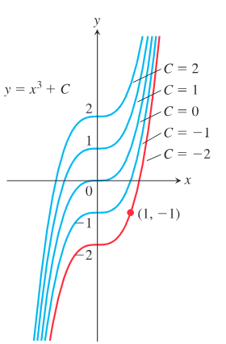
  
图 4.53 曲线 $y=x^3+C$ 充满坐标平面而互不重叠。例 2 中确定了经过点 $(1,-1)$ 的曲线 $y=x^3-2$。

通过反向使用各种求导法则，可以得到反导公式和法则。在每种情形中，表示给定函数所有反导数的一般表达式中都有一个任意常数 $C$。表 4.2 给出了若干重要函数的反导公式。这些法则很容易通过对一般反导公式求导并得到左侧函数来验证。例如，无论常数 $C$ 或 $k\ne 0$ 取何值，$(\tan kx)/k+C$ 的导数都是 $\sec^2 kx$，这就确立了公式 4 作为 $\sec^2 kx$ 最一般反导数的正确性。

表 4.2 反导公式，$k$ 为非零常数

| 编号 | 函数 | 一般反导数 |
|---:|---|---|
| 1 | $x^n$ | $\dfrac{1}{n+1}x^{n+1}+C,\ n\ne -1$ |
| 2 | $\sin kx$ | $-\dfrac{1}{k}\cos kx+C$ |
| 3 | $\cos kx$ | $\dfrac{1}{k}\sin kx+C$ |
| 4 | $\sec^2 kx$ | $\dfrac{1}{k}\tan kx+C$ |
| 5 | $\csc^2 kx$ | $-\dfrac{1}{k}\cot kx+C$ |
| 6 | $\sec kx\tan kx$ | $\dfrac{1}{k}\sec kx+C$ |
| 7 | $\csc kx\cot kx$ | $-\dfrac{1}{k}\csc kx+C$ |
| 8 | $e^{kx}$ | $\dfrac{1}{k}e^{kx}+C$ |
| 9 | $\dfrac{1}{x}$ | $\ln|x|+C,\ x\ne 0$ |
| 10 | $\dfrac{1}{\sqrt{1-k^2x^2}}$ | $\dfrac{1}{k}\sin^{-1}kx+C$ |
| 11 | $\dfrac{1}{1+k^2x^2}$ | $\dfrac{1}{k}\tan^{-1}kx+C$ |
| 12 | $\dfrac{1}{x\sqrt{k^2x^2-1}}$ | $\sec^{-1}kx+C,\ kx>1$ |
| 13 | $a^{kx}$ | $\dfrac{1}{k\ln a}a^{kx}+C,\ a>0,\ a\ne 1$ |

**例 3** 求下列每个函数的一般反导数。

$$
\text{(a) }f(x)=x^5\qquad
\text{(b) }g(x)=\frac{1}{\sqrt{x}}\qquad
\text{(c) }h(x)=\sin 2x
$$

$$
\text{(d) }i(x)=\cos\frac{x}{2}\qquad
\text{(e) }j(x)=e^{-3x}\qquad
\text{(f) }k(x)=2^x
$$

**解** 每种情形都可以使用表 4.2 中的一个公式。

$$
\begin{aligned}
\text{(a) }\quad &F(x)=\frac{x^6}{6}+C
&&\text{公式 1，}n=5\\
\text{(b) }\quad &g(x)=x^{-1/2},\quad
G(x)=\frac{x^{1/2}}{1/2}+C=2\sqrt{x}+C
&&\text{公式 1，}n=-\frac12\\
\text{(c) }\quad &H(x)=-\frac{\cos 2x}{2}+C
&&\text{公式 2，}k=2\\
\text{(d) }\quad &I(x)=\frac{\sin(x/2)}{1/2}+C=2\sin\frac{x}{2}+C
&&\text{公式 3，}k=\frac12\\
\text{(e) }\quad &J(x)=-\frac13 e^{-3x}+C
&&\text{公式 8，}k=-3\\
\text{(f) }\quad &K(x)=\left(\frac{1}{\ln 2}\right)2^x+C
&&\text{公式 13，}a=2,\ k=1
\end{aligned}
$$

其他求导法则也导向相应的反导法则。我们可以把反导数相加、相减，并乘以常数。

表 4.3 反导数线性法则

| 函数 | 一般反导数 |
|---|---|
| 1. 常数倍法则：$k f(x)$ | $kF(x)+C,\ k$ 为常数 |
| 2. 负号法则：$-f(x)$ | $-F(x)+C$ |
| 3. 和或差法则：$f(x)\pm g(x)$ | $F(x)\pm G(x)+C$ |

表 4.3 中的公式可以通过对反导数求导并验证结果与原函数一致来证明。公式 2 是公式 1 中 $k=-1$ 的特殊情形。

**例 4** 求 $f(x)=\dfrac{3}{\sqrt{x}}+\sin 2x$ 的一般反导数。

**解** 对例 3 中的函数 $g$ 和 $h$，有

$$
f(x)=3g(x)+h(x).
$$

由例 3(b)，$G(x)=2\sqrt{x}$ 是 $g(x)$ 的一个反导数，所以由反导数的常数倍法则，

$$
3G(x)=3\cdot 2\sqrt{x}=6\sqrt{x}
$$

是 $3g(x)=3/\sqrt{x}$ 的一个反导数。同样，由例 3(c)，$H(x)=-(1/2)\cos 2x$ 是 $h(x)=\sin 2x$ 的一个反导数。由反导数的和法则，得到

$$
F(x)=3G(x)+H(x)+C=6\sqrt{x}-\frac12\cos 2x+C
$$

是 $f(x)$ 的一般反导公式，其中 $C$ 是任意常数。

### 初值问题与微分方程

反导数在数学及其应用中有若干重要作用。寻找反导数的方法和技术是微积分的重要部分，我们将在第 8 章继续讨论。求函数 $f(x)$ 的一个反导数，等同于寻找满足方程

$$
\frac{dy}{dx}=f(x)
$$

的函数 $y(x)$。这称为微分方程，因为它是一个包含被求导的未知函数 $y$ 的方程。要求解它，我们需要一个满足该方程的函数 $y(x)$。这个函数通过取 $f(x)$ 的反导数来找到。由反微分过程产生的任意常数，可以通过指定一个初始条件来确定：

$$
y(x_0)=y_0.
$$

这个条件表示当 $x=x_0$ 时，函数 $y(x)$ 取值 $y_0$。微分方程与初始条件的组合称为初值问题。这类问题在科学的所有分支中都起着重要作用。

函数 $f(x)$ 的最一般反导数 $F(x)+C$（例如例 2 中的 $x^3+C$）给出微分方程 $dy/dx=f(x)$ 的通解 $y=F(x)+C$。通解给出这个方程的所有解（无限多个，每个 $C$ 值对应一个）。我们通过寻找通解来求解微分方程。然后，通过找出满足初始条件 $y(x_0)=y_0$ 的特解来求解初值问题。在例 2 中，函数 $y=x^3-2$ 是微分方程 $dy/dx=3x^2$ 在初始条件 $y(1)=-1$ 下的特解。

### 反导数与运动

我们已经看到，物体的位置函数的导数给出速度，速度函数的导数给出加速度。如果知道物体的加速度，就可以通过求反导数恢复速度，再从速度的反导数恢复其位置函数。这个过程在第 4.2 节作为推论 2 的一个应用已经使用过。现在我们有了反导数这一术语和概念框架，就从微分方程的角度重新考察这个问题。

**例 5** 一个热气球以 $12\ \text{ft/sec}$ 的速度上升。当它离地 $80\ \text{ft}$ 时，一个包裹从气球上掉落。包裹落地需要多长时间？

**解** 令 $v(t)$ 表示包裹在时刻 $t$ 的速度，令 $s(t)$ 表示它离地的高度。地球表面附近的重力加速度为 $32\ \text{ft/sec}^2$。假设没有其他力作用在落下的包裹上，我们有

$$
\frac{dv}{dt}=-32.
$$

这里取负号，是因为重力作用方向是 $s$ 减小的方向。这就得到下列初值问题（图 4.54）：

$$
\text{微分方程：}\quad \frac{dv}{dt}=-32
\qquad
\text{初始条件：}\quad v(0)=12.
$$

  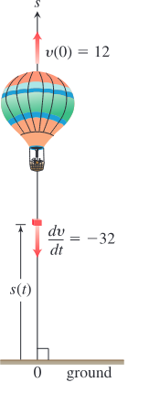
  
图 4.54 从上升热气球中落下的包裹（例 5）。

这是包裹运动的数学模型。我们求解这个初值问题，以得到包裹的速度。

1. **求解微分方程：** $-32$ 的一般反导公式为

$$
v=-32t+C.
$$

找到微分方程的通解后，使用初始条件找出解决本问题的特解。

2. **求 $C$：**

$$
12=-32(0)+C
$$

初始条件为 $v(0)=12$，所以 $C=12$。初值问题的解为

$$
v=-32t+12.
$$

由于速度是高度的导数，而包裹在 $t=0$ 落下时离地高度为 $80\ \text{ft}$，现在得到第二个初值问题：

$$
\text{微分方程：}\quad \frac{ds}{dt}=-32t+12
\qquad
\text{初始条件：}\quad s(0)=80.
$$

这里是把前一个方程中的 $v$ 设为 $ds/dt$。我们求解这个初值问题，得到高度关于 $t$ 的函数。

1. **求解微分方程：** 求 $-32t+12$ 的一般反导数，得

$$
s=-16t^2+12t+C.
$$

2. **求 $C$：**

$$
80=-16(0)^2+12(0)+C
$$

初始条件为 $s(0)=80$，所以 $C=80$。包裹在时刻 $t$ 的离地高度为

$$
s=-16t^2+12t+80.
$$

**使用解：** 为求包裹落地所需时间，令 $s=0$ 并解 $t$：

$$
-16t^2+12t+80=0,
$$

即

$$
-4t^2+3t+20=0.
$$

由二次公式，

$$
t=\frac{-3\pm\sqrt{329}}{-8},
$$

所以

$$
t\approx -1.89,\qquad t\approx 2.64.
$$

包裹在从气球上落下约 $2.64\ \text{sec}$ 后落地。（负根没有物理意义。）

### 不定积分

一个特殊符号用来表示函数 $f$ 的所有反导数的集合。

  

    
定义

    
函数 $f$ 的所有反导数的集合称为 $f$ 关于 $x$ 的不定积分，记为
      $$
      \int f(x)\,dx.
      $$
    

    
符号 $\int$ 是积分号。函数 $f$ 是积分的被积函数，$x$ 是积分变量。

  

在刚定义的记号中，积分号后面的被积函数总是跟着一个微分，用来指出积分变量。关于为什么这一点重要，我们将在第 5 章中进一步说明。

使用这个记号，例 1 的解可以重写为

$$
\int 2x\,dx=x^2+C,\qquad
\int \cos x\,dx=\sin x+C,
$$

以及

$$
\int\left(\frac{1}{x}+2e^{2x}\right)\,dx=\ln|x|+e^{2x}+C.
$$

这个记号与反导数的主要应用有关，而这种应用将在第 5 章中探讨。反导数在计算某些无限和极限时起关键作用，这是第 5 章中心结果——微积分基本定理——所描述的一个出人意料且非常有用的作用。

**例 6** 计算

$$
\int (x^2-2x+5)\,dx.
$$

**解** 如果认出 $(x^3/3)-x^2+5x$ 是 $x^2-2x+5$ 的一个反导数，就可以把积分计算为

$$
\int (x^2-2x+5)\,dx=\frac{x^3}{3}-x^2+5x+C.
$$

如果不能立刻认出反导数，可以用和、差、常数倍法则逐项生成：

$$
\begin{aligned}
\int (x^2-2x+5)\,dx
&=\int x^2\,dx-\int 2x\,dx+\int 5\,dx\\
&=\int x^2\,dx-2\int x\,dx+5\int 1\,dx\\
&=\left(\frac{x^3}{3}+C_1\right)-2\left(\frac{x^2}{2}+C_2\right)+5(x+C_3)\\
&=\frac{x^3}{3}+C_1-x^2-2C_2+5x+5C_3.
\end{aligned}
$$

这个公式比需要的更复杂。如果把 $C_1$、$-2C_2$ 和 $5C_3$ 合并为一个任意常数

$$
C=C_1-2C_2+5C_3,
$$

公式化简为

$$
\frac{x^3}{3}-x^2+5x+C,
$$

并且仍给出了所有可能的反导数。因此，即使选择逐项积分，也建议直接写到最终形式：

$$
\int (x^2-2x+5)\,dx
=\int x^2\,dx-\int 2x\,dx+\int 5\,dx
=\frac{x^3}{3}-x^2+5x+C.
$$

对每一部分，求出能找到的最简单反导数，并在最后加上任意积分常数。
