# 第5章 积分

概述 古典几何的重要成就是给出三角形、球、圆锥等规则图形的面积和体积公式。本章发展一种更普遍的方法，用来计算许多不规则图形的面积、体积以及其他由累积效应产生的量。这种方法称为积分。定积分不仅用于面积和体积，还用于弧长、概率、平均值、能量消耗、物体重量、流体压力、位移和总路程等问题。

与导数一样，定积分也由极限产生。不过导数关注“局部变化率”，积分关注“许多小贡献的累积”。基本思想是：把所研究的量分成很多小块，分别近似计算每一小块的贡献，再把这些贡献相加。当分割越来越细、小块越来越多时，这些有限和的极限就是定积分。通过研究图像下方面积的变化率，我们将看到定积分与反导数之间的深刻联系，这就是微积分基本定理。

## 5.1 面积与有限和估计

建立定积分的基础，是用有限和构造适当的近似值。本节考察这种构造过程的三个例子：求图像下方的面积、求运动物体经过的距离，以及求函数的平均值。虽然我们还需要精确定义平面中一般区域的面积，或者函数在闭区间上的平均值是什么意思，但我们已经对这些概念有直观认识。因此，本节先用有限和来近似这些量，并观察当求和过程中的项越来越多时会发生什么。在后续各节中，我们将考察当项数趋于无穷时这些和的极限，这将导向对这里所近似的量的精确定义。

### 面积

假设我们要找阴影区域 $R$ 的面积。区域 $R$ 位于 $x$ 轴上方、图像 $y=1-x^2$ 下方，并介于竖直直线 $x=0$ 和 $x=1$ 之间（图 5.1）。遗憾的是，对于像区域 $R$ 这样边界为曲线的一般图形，并没有简单的几何公式可以计算其面积。那么，我们怎样才能求出 $R$ 的面积呢？

  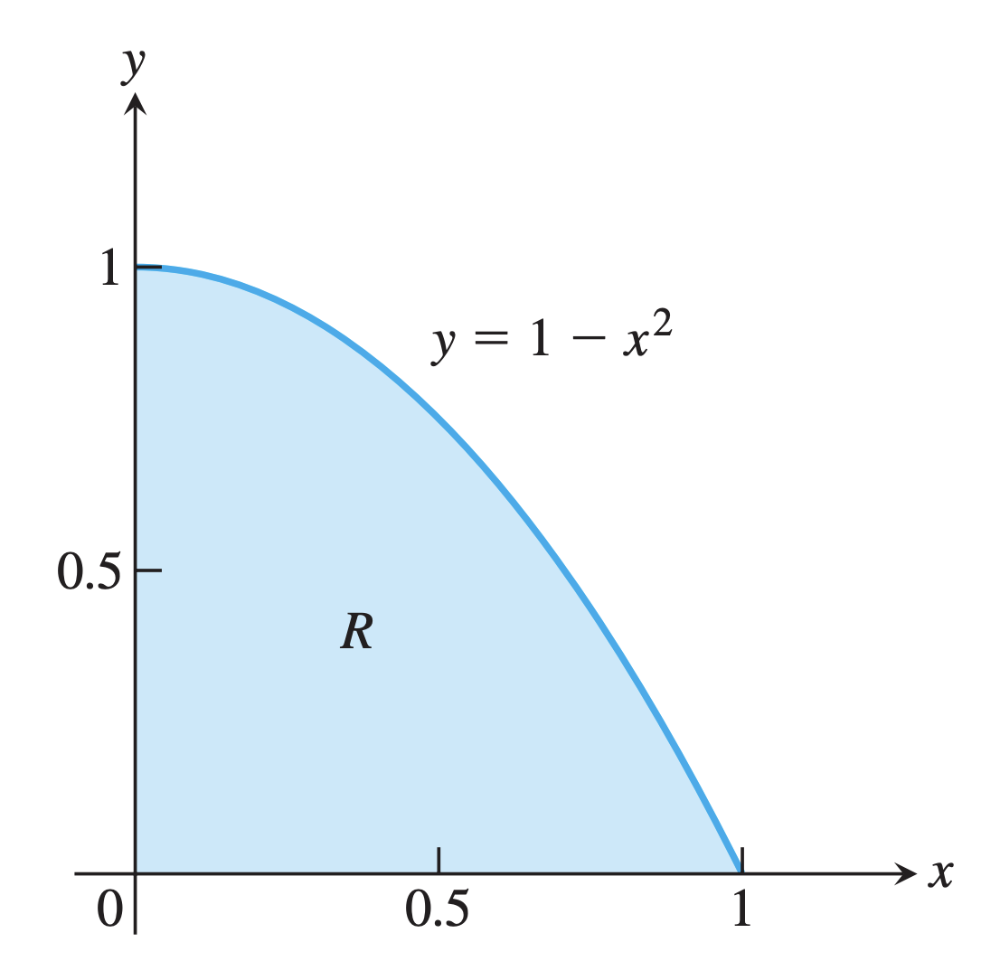
  
图 5.1 区域 $R$ 的面积不能由简单公式求得。

虽然我们还没有确定 $R$ 的精确面积的方法，但可以用一种简单方式近似它。图 5.2a 显示了两个合在一起包含区域 $R$ 的矩形。每个矩形的宽都是 $1/2$，从左到右高度分别为 $1$ 和 $3/4$。每个矩形的高是在相应小区间上函数 $f$ 的最大值。因为函数 $f$ 递减，所以这个高度就是构成矩形底边的小区间在 $[0,1]$ 中的左端点处的函数值。两个矩形的总面积近似区域 $R$ 的面积 $A$：

$$
A\approx 1\cdot\frac{1}{2}+\frac{3}{4}\cdot\frac{1}{2}
=\frac{7}{8}=0.875.
$$

  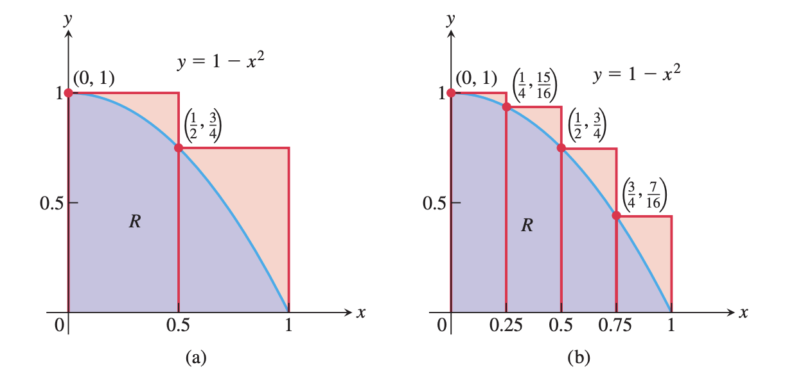
  
图 5.2 (a) 用两个包含 $R$ 的矩形得到 $R$ 面积的上估计。(b) 四个矩形给出更好的上估计。两个估计都比真实面积大，浅红色部分表示超出的面积。

这个估计值大于真实面积 $A$，因为两个矩形包含了 $R$。我们说 $0.875$ 是一个上和，因为它把每个矩形的高取为该矩形底边区间内某点 $x$ 处 $f(x)$ 的最大（最高）值。在图 5.2b 中，我们用四个更薄的矩形改进估计，每个矩形宽 $1/4$，合在一起包含区域 $R$。这四个矩形给出近似值

$$
A\approx 1\cdot\frac{1}{4}
+\frac{15}{16}\cdot\frac{1}{4}
+\frac{3}{4}\cdot\frac{1}{4}
+\frac{7}{16}\cdot\frac{1}{4}
=\frac{25}{32}=0.78125,
$$

这个值仍然大于 $A$，因为这四个矩形包含了 $R$。

现在假设我们像图 5.3a 那样，改用四个包含在区域 $R$ 内部的矩形来估计面积。每个矩形的宽仍为 $1/4$，但矩形更矮，并完全位于 $f$ 的图像下方。函数 $f(x)=1-x^2$ 在 $[0,1]$ 上递减，所以这些矩形的高度由构成其底边的小区间右端点处的函数值给出。第四个矩形高度为零，因此不贡献面积。把这些矩形的高度取为每个底边小区间中 $f(x)$ 的最小值并求和，得到面积的下和近似：

$$
A\approx \frac{15}{16}\cdot\frac{1}{4}
+\frac{3}{4}\cdot\frac{1}{4}
+\frac{7}{16}\cdot\frac{1}{4}
+0\cdot\frac{1}{4}
=\frac{17}{32}=0.53125.
$$

  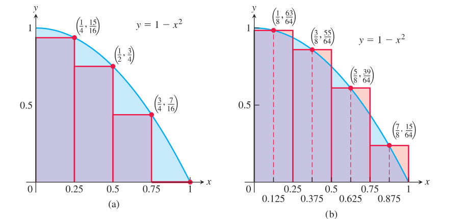
  
图 5.3 (a) 包含在 $R$ 中的矩形给出面积估计，它比真实值小，浅蓝色部分表示少算的面积。(b) 中点法使用高度等于 $y=f(x)$ 在底边中点处函数值的矩形。由于浅红色的多算面积与浅蓝色的少算面积大致抵消，这个估计看起来更接近真实面积。

这个估计值小于面积 $A$，因为所有矩形都位于区域 $R$ 内部。$A$ 的真实值位于这些下和与上和之间：

$$
0.53125<A<0.78125.
$$

通过同时考虑下和与上和近似，我们不仅得到面积估计，还得到这些估计可能误差大小的一个界，因为真实面积位于它们之间。这里误差不会大于差值

$$
0.78125-0.53125=0.25.
$$

另一种估计可以使用高度等于底边中点处 $f$ 的函数值的矩形（图 5.3b）。这种面积估计方法称为中点法。中点法给出的估计值位于下和与上和之间，但它究竟高估还低估真实面积，并不那么明显。仍用四个宽为 $1/4$ 的矩形，中点法给出区域 $R$ 的面积估计

$$
A\approx \frac{63}{64}\cdot\frac{1}{4}
+\frac{55}{64}\cdot\frac{1}{4}
+\frac{39}{64}\cdot\frac{1}{4}
+\frac{15}{64}\cdot\frac{1}{4}
=\frac{172}{64}\cdot\frac{1}{4}
=0.671875.
$$

在我们计算的每一个和中，函数 $f$ 所定义的区间 $[a,b]$ 都被分成了 $n$ 个等宽（也称等长）的小区间，宽度为

$$
\Delta x=\frac{b-a}{n},
$$

并且在每个小区间中对 $f$ 取值：第一个小区间中取 $c_1$，第二个小区间中取 $c_2$，依此类推。这些有限和都具有形式

$$
f(c_1)\Delta x+f(c_2)\Delta x+f(c_3)\Delta x+\cdots+f(c_n)\Delta x.
$$

取越来越多的矩形，并使每个矩形比以前更薄时，这些有限和似乎给出了区域 $R$ 真实面积越来越好的近似。

图 5.4a 显示了用 16 个等宽矩形对 $R$ 的面积作下和近似。这些矩形面积之和为 $0.634765625$，看起来接近真实面积，但由于矩形位于 $R$ 内部，它仍然偏小。

图 5.4b 显示了用 16 个等宽矩形作上和近似。这些矩形面积之和为 $0.697265625$，由于这些矩形合在一起包含 $R$，它比真实面积略大。用 16 个矩形的中点法给出总面积近似 $0.6669921875$，但这个估计比真实面积大还是小，并不能立刻看出来。

  

    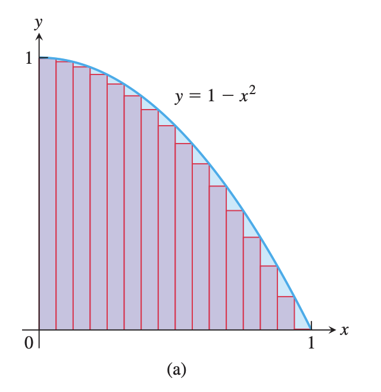
    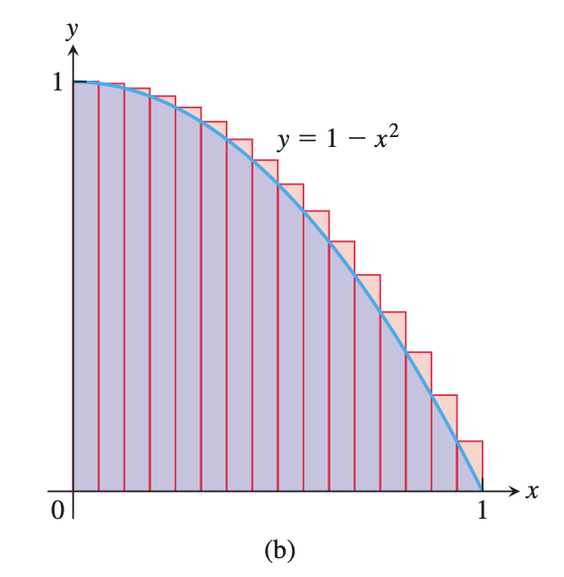
  

  
图 5.4 (a) 用 16 个等宽矩形、$\Delta x=1/16$ 得到的下和。(b) 用 16 个矩形得到的上和。

**例 1** 表 5.1 显示了用最多 1000 个矩形对 $R$ 的面积作上和、下和近似时得到的值。在第 5.2 节中，我们将看到如何在每个矩形底边宽度趋于零、矩形个数趋于无穷时取极限，从而得到像 $R$ 这样的区域面积的精确值。利用那里发展的技术，我们将能够证明 $R$ 的面积恰好为 $2/3$。

  
表 5.1　区域 $R$ 面积的有限近似

  

  <table style="display: table; width: auto; min-width: 600px; margin: 0; border-collapse: collapse; font-variant-numeric: tabular-nums;">
    <thead>
      <tr style="background-color: #f3f3f3; border-bottom: 1px solid #777;">
        <th style="padding: 0.6em 1em; text-align: center; font-weight: 600;">小区间个数</th>
        <th style="padding: 0.6em 1em; text-align: center; font-weight: 600;">下和</th>
        <th style="padding: 0.6em 1em; text-align: center; font-weight: 600;">中点和</th>
        <th style="padding: 0.6em 1em; text-align: center; font-weight: 600;">上和</th>
      </tr>
    </thead>
    <tbody>
      <tr style="border-bottom: 1px solid #ddd;">
        <td style="padding: 0.5em 1em; text-align: center;">2</td>
        <td style="padding: 0.5em 1em; text-align: right;">0.375</td>
        <td style="padding: 0.5em 1em; text-align: right;">0.6875</td>
        <td style="padding: 0.5em 1em; text-align: right;">0.875</td>
      </tr>
      <tr style="border-bottom: 1px solid #ddd;">
        <td style="padding: 0.5em 1em; text-align: center;">4</td>
        <td style="padding: 0.5em 1em; text-align: right;">0.53125</td>
        <td style="padding: 0.5em 1em; text-align: right;">0.671875</td>
        <td style="padding: 0.5em 1em; text-align: right;">0.78125</td>
      </tr>
      <tr style="border-bottom: 1px solid #ddd;">
        <td style="padding: 0.5em 1em; text-align: center;">16</td>
        <td style="padding: 0.5em 1em; text-align: right;">0.634765625</td>
        <td style="padding: 0.5em 1em; text-align: right;">0.6669921875</td>
        <td style="padding: 0.5em 1em; text-align: right;">0.697265625</td>
      </tr>
      <tr style="border-bottom: 1px solid #ddd;">
        <td style="padding: 0.5em 1em; text-align: center;">50</td>
        <td style="padding: 0.5em 1em; text-align: right;">0.6566</td>
        <td style="padding: 0.5em 1em; text-align: right;">0.6667</td>
        <td style="padding: 0.5em 1em; text-align: right;">0.6766</td>
      </tr>
      <tr style="border-bottom: 1px solid #ddd;">
        <td style="padding: 0.5em 1em; text-align: center;">100</td>
        <td style="padding: 0.5em 1em; text-align: right;">0.66165</td>
        <td style="padding: 0.5em 1em; text-align: right;">0.666675</td>
        <td style="padding: 0.5em 1em; text-align: right;">0.67165</td>
      </tr>
      <tr>
        <td style="padding: 0.5em 1em; text-align: center;">1000</td>
        <td style="padding: 0.5em 1em; text-align: right;">0.6661665</td>
        <td style="padding: 0.5em 1em; text-align: right;">0.66666675</td>
        <td style="padding: 0.5em 1em; text-align: right;">0.6671665</td>
      </tr>
    </tbody>
  </table>
  

### 行驶距离

假设我们知道一辆汽车沿公路行驶且不改变方向时的速度函数 $v(t)$，并想知道它在 $t=a$ 与 $t=b$ 之间行驶了多远。汽车的位置函数 $s(t)$ 的导数是 $v(t)$。如果我们能找到 $v(t)$ 的一个反导数 $F(t)$，就可以通过令 $s(t)=F(t)+C$ 得到汽车的位置函数 $s(t)$。于是，行驶距离可由位置的变化求得：

$$
s(b)-s(a)=F(b)-F(a).
$$

如果速度函数只由汽车速度表在不同时刻的读数给出，那么我们没有可用来得到速度的反导函数的公式。在这种情况下该怎么办呢？

当我们不知道速度函数 $v(t)$ 的反导数时，可以用类似前面面积估计的方法，用有限和来近似行驶距离。把区间 $[a,b]$ 分成较短的时间区间，在每个区间上把速度看作相当接近常数。于是我们用通常的距离公式近似每个时间小区间上的行驶距离：

$$
\text{距离}=\text{速度}\times\text{时间},
$$

然后把 $[a,b]$ 上各个结果相加。

假设被分割的时间区间由若干等长小区间组成，每个小区间长度为 $\Delta t$。在第一个小区间中取一个数 $t_1$。如果 $\Delta t$ 很小，使得在持续时间为 $\Delta t$ 的短时间区间内速度几乎不变，那么第一个时间区间中行驶的距离约为 $v(t_1)\Delta t$。如果 $t_2$ 是第二个区间中的一个数，那么第二个时间区间中行驶的距离约为 $v(t_2)\Delta t$。所有时间区间中行驶距离的和为

$$
D\approx v(t_1)\Delta t+v(t_2)\Delta t+\cdots+v(t_n)\Delta t,
$$

其中 $n$ 是小区间总数。

**例 2** 竖直向上发射的抛射体，其速度函数（单位为米每秒）是 $f(t)=160-9.8t$。用刚才描述的求和技术估计抛射体在前 3 秒上升了多远。这些和与精确值 $435.9$ 米有多接近？

**解** 我们考察不同区间个数和不同取值点所得到的结果。注意 $f(t)$ 递减，所以选择左端点得到上和估计；选择右端点得到下和估计。

(a) 三个长度为 1 的小区间，在左端点处对 $f$ 取值，得到上和。

在 $t=0,1,2$ 处对 $f$ 取值，有

$$
\begin{aligned}
D&\approx f(t_1)\Delta t+f(t_2)\Delta t+f(t_3)\Delta t\\
&=[160-9.8(0)](1)+[160-9.8(1)](1)+[160-9.8(2)](1)\\
&=450.6.
\end{aligned}
$$

(b) 三个长度为 1 的小区间，在右端点处对 $f$ 取值，得到下和。

在 $t=1,2,3$ 处对 $f$ 取值，有

$$
\begin{aligned}
D&\approx f(t_1)\Delta t+f(t_2)\Delta t+f(t_3)\Delta t\\
&=[160-9.8(1)](1)+[160-9.8(2)](1)+[160-9.8(3)](1)\\
&=421.2.
\end{aligned}
$$

(c) 取六个长度为 $1/2$ 的小区间，左端点给出的上和为 $D\approx 443.25$，右端点给出的下和为 $D\approx 428.55$。这些六区间估计比三区间估计更接近一些。随着小区间变短，结果会改进。

从表 5.2 可以看出，左端点上和从上方趋近真实值 $435.9$，而右端点下和从下方趋近它。真实值位于这些上和与下和之间。最接近的表项中的误差大小为 $0.23$，这是真实值的一个很小百分比：

$$
\begin{aligned}
\text{误差大小}
&=|\text{真实值}-\text{计算值}|\\
&=|435.9-435.67|=0.23.
\end{aligned}
$$

$$
\text{误差百分比}=\frac{0.23}{435.9}\approx 0.05\%.
$$

由表中最后几项作出结论，说抛射体在飞行的前 3 秒上升了约 $436\ \text{m}$，是合理的。

  
表 5.2　行驶距离估计

  

  <table style="display: table; width: auto; min-width: 600px; margin: 0; border-collapse: collapse; font-variant-numeric: tabular-nums;">
    <thead>
      <tr style="background-color: #f3f3f3; border-bottom: 1px solid #777;">
        <th style="padding: 0.6em 1em; text-align: center; font-weight: 600;">小区间个数</th>
        <th style="padding: 0.6em 1em; text-align: center; font-weight: 600;">每个小区间长度</th>
        <th style="padding: 0.6em 1em; text-align: center; font-weight: 600;">上和</th>
        <th style="padding: 0.6em 1em; text-align: center; font-weight: 600;">下和</th>
      </tr>
    </thead>
    <tbody>
      <tr style="border-bottom: 1px solid #ddd;">
        <td style="padding: 0.5em 1em; text-align: center;">3</td>
        <td style="padding: 0.5em 1em; text-align: center;">1</td>
        <td style="padding: 0.5em 1em; text-align: right;">450.6</td>
        <td style="padding: 0.5em 1em; text-align: right;">421.2</td>
      </tr>
      <tr style="border-bottom: 1px solid #ddd;">
        <td style="padding: 0.5em 1em; text-align: center;">6</td>
        <td style="padding: 0.5em 1em; text-align: center;">$1/2$</td>
        <td style="padding: 0.5em 1em; text-align: right;">443.25</td>
        <td style="padding: 0.5em 1em; text-align: right;">428.55</td>
      </tr>
      <tr style="border-bottom: 1px solid #ddd;">
        <td style="padding: 0.5em 1em; text-align: center;">12</td>
        <td style="padding: 0.5em 1em; text-align: center;">$1/4$</td>
        <td style="padding: 0.5em 1em; text-align: right;">439.58</td>
        <td style="padding: 0.5em 1em; text-align: right;">432.23</td>
      </tr>
      <tr style="border-bottom: 1px solid #ddd;">
        <td style="padding: 0.5em 1em; text-align: center;">24</td>
        <td style="padding: 0.5em 1em; text-align: center;">$1/8$</td>
        <td style="padding: 0.5em 1em; text-align: right;">437.74</td>
        <td style="padding: 0.5em 1em; text-align: right;">434.06</td>
      </tr>
      <tr style="border-bottom: 1px solid #ddd;">
        <td style="padding: 0.5em 1em; text-align: center;">48</td>
        <td style="padding: 0.5em 1em; text-align: center;">$1/16$</td>
        <td style="padding: 0.5em 1em; text-align: right;">436.82</td>
        <td style="padding: 0.5em 1em; text-align: right;">434.98</td>
      </tr>
      <tr style="border-bottom: 1px solid #ddd;">
        <td style="padding: 0.5em 1em; text-align: center;">96</td>
        <td style="padding: 0.5em 1em; text-align: center;">$1/32$</td>
        <td style="padding: 0.5em 1em; text-align: right;">436.36</td>
        <td style="padding: 0.5em 1em; text-align: right;">435.44</td>
      </tr>
      <tr>
        <td style="padding: 0.5em 1em; text-align: center;">192</td>
        <td style="padding: 0.5em 1em; text-align: center;">$1/64$</td>
        <td style="padding: 0.5em 1em; text-align: right;">436.13</td>
        <td style="padding: 0.5em 1em; text-align: right;">435.67</td>
      </tr>
    </tbody>
  </table>
  

### 位移与行驶距离

如果具有位置函数 $s(t)$ 的物体沿坐标直线运动而不改变方向，那么我们可以像例 2 那样，把小区间上经过的距离相加，计算从 $t=a$ 到 $t=b$ 的总路程。如果物体在运动过程中一次或多次反向，那么要找总路程，就需要使用物体的速率 $|v(t)|$，即它的速度函数 $v(t)$ 的绝对值。若像例 2 那样使用速度本身，则得到的是物体位移 $s(b)-s(a)$ 的估计，即初始位置与最终位置之差。

为了看出为什么在求和过程中使用速度函数会给出位移的估计，把时间区间 $[a,b]$ 划分成足够小的等长小区间 $\Delta t$，使得物体从时刻 $t_{k-1}$ 到 $t_k$ 的速度变化不大。于是 $v(t_k)$ 给出整个小区间上速度的一个良好近似。因此，物体位置坐标的变化，也就是它在这个时间区间中的位移，约为

$$
v(t_k)\Delta t.
$$

如果 $v(t_k)$ 为正，这个变化为正；如果 $v(t_k)$ 为负，这个变化为负。

无论哪种情形，物体在该小区间中经过的距离都约为

$$
|v(t_k)|\Delta t.
$$

整个时间区间上经过的总路程近似为和

$$
|v(t_1)|\Delta t+|v(t_2)|\Delta t+\cdots+|v(t_n)|\Delta t.
$$

我们将在第 5.4 节再次讨论这些思想。

  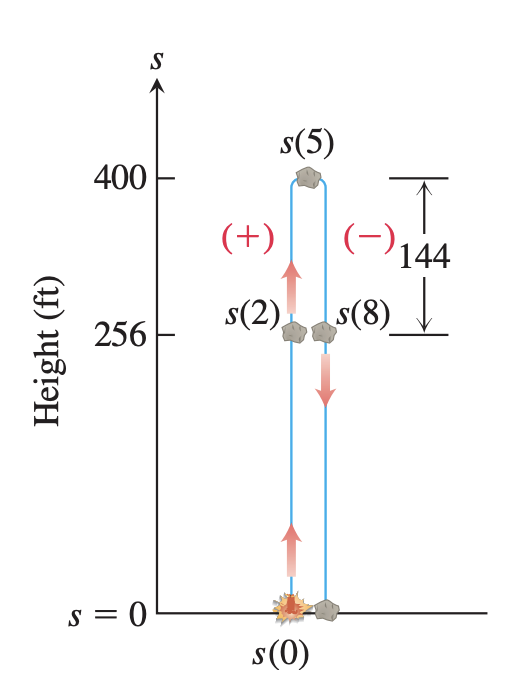
  
图 5.5 例 3 中的石块。高度 $s=256\ \text{ft}$ 在 $t=2$ 和 $t=8\ \text{sec}$ 时达到。到 $t=8$ 时，石块已从最大高度下落 $144\ \text{ft}$。

**例 3** 在第 3.4 节例 4 中，我们分析了一块重石被炸药爆炸竖直向上抛出的运动。在那个例子中，我们发现石块在运动过程中任意时刻的速度（单位为英尺每秒）由函数 $v(t)=160-32t$ 给出。爆炸后 2 秒，石块离地 $256\ \text{ft}$；随后继续上升，在爆炸后 5 秒达到最大高度 $400\ \text{ft}$；然后又落回到离地 $256\ \text{ft}$ 的高度，这发生在爆炸后 $t=8\ \text{sec}$。（见图 5.5。）

如果我们采用类似例 2 的步骤，在时间区间 $[0,8]$ 上的求和过程中使用速度函数 $v(t)$，将得到石块在 $t=8$ 时离地 $256\ \text{ft}$ 高度的估计。向上的正运动（从 $256\ \text{ft}$ 高度到最大高度给出 $144\ \text{ft}$ 的正距离变化）被向下的负运动（从最大高度又回到 $256\ \text{ft}$ 给出 $144\ \text{ft}$ 的负变化）抵消，所以由速度函数估计的是位移或离地高度。

另一方面，如果在求和过程中使用绝对值 $|v(t)|$，我们将得到石块经过的总路程的估计：达到的最大高度 $400\ \text{ft}$，加上它从最大高度落回、在 $t=8\ \text{sec}$ 再次达到 $256\ \text{ft}$ 高度时额外下落的 $144\ \text{ft}$。也就是说，在时间区间 $[0,8]$ 上的求和过程中使用速度函数的绝对值，我们得到的是 $544\ \text{ft}$ 的估计，这是石块在 8 秒中上升和下降经过的总路程。由于速度函数变号造成的距离变化不会相互抵消，所以当我们使用速度函数的绝对值（即石块的速率）时，估计的是经过的距离，而不是位移。

为了说明上述讨论，把区间 $[0,8]$ 分成十六个长度为 $\Delta t=1/2$ 的小区间，并在计算中取每个小区间的右端点。表 5.3 显示了这些端点处速度函数的值。

  
表 5.3　速度函数

  

  <table style="display: table; width: auto; min-width: 500px; margin: 0; border-collapse: collapse; font-variant-numeric: tabular-nums;">
    <thead>
      <tr style="background-color: #f3f3f3; border-bottom: 1px solid #777;">
        <th style="padding: 0.6em 1.5em; text-align: center; font-weight: 600;">$t$</th>
        <th style="padding: 0.6em 1.5em; text-align: center; font-weight: 600;">$v(t)$</th>
        <th style="padding: 0.6em 1.5em; text-align: center; font-weight: 600;">$t$</th>
        <th style="padding: 0.6em 1.5em; text-align: center; font-weight: 600;">$v(t)$</th>
      </tr>
    </thead>
    <tbody>
      <tr style="border-bottom: 1px solid #ddd;">
        <td style="padding: 0.5em 1.5em; text-align: right;">0</td>
        <td style="padding: 0.5em 1.5em; text-align: right;">160</td>
        <td style="padding: 0.5em 1.5em; text-align: right;">4.5</td>
        <td style="padding: 0.5em 1.5em; text-align: right;">16</td>
      </tr>
      <tr style="border-bottom: 1px solid #ddd;">
        <td style="padding: 0.5em 1.5em; text-align: right;">0.5</td>
        <td style="padding: 0.5em 1.5em; text-align: right;">144</td>
        <td style="padding: 0.5em 1.5em; text-align: right;">5.0</td>
        <td style="padding: 0.5em 1.5em; text-align: right;">0</td>
      </tr>
      <tr style="border-bottom: 1px solid #ddd;">
        <td style="padding: 0.5em 1.5em; text-align: right;">1.0</td>
        <td style="padding: 0.5em 1.5em; text-align: right;">128</td>
        <td style="padding: 0.5em 1.5em; text-align: right;">5.5</td>
        <td style="padding: 0.5em 1.5em; text-align: right;">$-16$</td>
      </tr>
      <tr style="border-bottom: 1px solid #ddd;">
        <td style="padding: 0.5em 1.5em; text-align: right;">1.5</td>
        <td style="padding: 0.5em 1.5em; text-align: right;">112</td>
        <td style="padding: 0.5em 1.5em; text-align: right;">6.0</td>
        <td style="padding: 0.5em 1.5em; text-align: right;">$-32$</td>
      </tr>
      <tr style="border-bottom: 1px solid #ddd;">
        <td style="padding: 0.5em 1.5em; text-align: right;">2.0</td>
        <td style="padding: 0.5em 1.5em; text-align: right;">96</td>
        <td style="padding: 0.5em 1.5em; text-align: right;">6.5</td>
        <td style="padding: 0.5em 1.5em; text-align: right;">$-48$</td>
      </tr>
      <tr style="border-bottom: 1px solid #ddd;">
        <td style="padding: 0.5em 1.5em; text-align: right;">2.5</td>
        <td style="padding: 0.5em 1.5em; text-align: right;">80</td>
        <td style="padding: 0.5em 1.5em; text-align: right;">7.0</td>
        <td style="padding: 0.5em 1.5em; text-align: right;">$-64$</td>
      </tr>
      <tr style="border-bottom: 1px solid #ddd;">
        <td style="padding: 0.5em 1.5em; text-align: right;">3.0</td>
        <td style="padding: 0.5em 1.5em; text-align: right;">64</td>
        <td style="padding: 0.5em 1.5em; text-align: right;">7.5</td>
        <td style="padding: 0.5em 1.5em; text-align: right;">$-80$</td>
      </tr>
      <tr style="border-bottom: 1px solid #ddd;">
        <td style="padding: 0.5em 1.5em; text-align: right;">3.5</td>
        <td style="padding: 0.5em 1.5em; text-align: right;">48</td>
        <td style="padding: 0.5em 1.5em; text-align: right;">8.0</td>
        <td style="padding: 0.5em 1.5em; text-align: right;">$-96$</td>
      </tr>
      <tr>
        <td style="padding: 0.5em 1.5em; text-align: right;">4.0</td>
        <td style="padding: 0.5em 1.5em; text-align: right;">32</td>
        <td style="padding: 0.5em 1.5em;"></td>
        <td style="padding: 0.5em 1.5em;"></td>
      </tr>
    </tbody>
  </table>
  

在求和过程中使用 $v(t)$，我们估计 $t=8$ 时的位移：

$$
(144+128+112+96+80+64+48+32+16+0-16-32-48-64-80-96)\cdot\frac{1}{2}=192.
$$

$$
\text{误差大小}=256-192=64.
$$

在求和过程中使用 $|v(t)|$，我们估计时间区间 $[0,8]$ 上经过的总路程：

$$
(144+128+112+96+80+64+48+32+16+0+16+32+48+64+80+96)\cdot\frac{1}{2}=528.
$$

$$
\text{误差大小}=544-528=16.
$$

如果在计算中把 $[0,8]$ 分成越来越多的小区间，对高度 $256\ \text{ft}$ 和 $544\ \text{ft}$ 的估计会改进，并如表 5.4 所示趋近它们。

  
表 5.4　石块竖直上抛时在时间区间 $[0,8]$ 上的运动估计

  

  <table style="display: table; width: auto; min-width: 600px; margin: 0; border-collapse: collapse; font-variant-numeric: tabular-nums;">
    <thead>
      <tr style="background-color: #f3f3f3; border-bottom: 1px solid #777;">
        <th style="padding: 0.6em 1em; text-align: center; font-weight: 600;">小区间个数</th>
        <th style="padding: 0.6em 1em; text-align: center; font-weight: 600;">每个小区间长度</th>
        <th style="padding: 0.6em 1em; text-align: center; font-weight: 600;">位移</th>
        <th style="padding: 0.6em 1em; text-align: center; font-weight: 600;">总路程</th>
      </tr>
    </thead>
    <tbody>
      <tr style="border-bottom: 1px solid #ddd;">
        <td style="padding: 0.5em 1em; text-align: center;">16</td>
        <td style="padding: 0.5em 1em; text-align: center;">$1/2$</td>
        <td style="padding: 0.5em 1em; text-align: right;">192.0</td>
        <td style="padding: 0.5em 1em; text-align: right;">528.0</td>
      </tr>
      <tr style="border-bottom: 1px solid #ddd;">
        <td style="padding: 0.5em 1em; text-align: center;">32</td>
        <td style="padding: 0.5em 1em; text-align: center;">$1/4$</td>
        <td style="padding: 0.5em 1em; text-align: right;">224.0</td>
        <td style="padding: 0.5em 1em; text-align: right;">536.0</td>
      </tr>
      <tr style="border-bottom: 1px solid #ddd;">
        <td style="padding: 0.5em 1em; text-align: center;">64</td>
        <td style="padding: 0.5em 1em; text-align: center;">$1/8$</td>
        <td style="padding: 0.5em 1em; text-align: right;">240.0</td>
        <td style="padding: 0.5em 1em; text-align: right;">540.0</td>
      </tr>
      <tr style="border-bottom: 1px solid #ddd;">
        <td style="padding: 0.5em 1em; text-align: center;">128</td>
        <td style="padding: 0.5em 1em; text-align: center;">$1/16$</td>
        <td style="padding: 0.5em 1em; text-align: right;">248.0</td>
        <td style="padding: 0.5em 1em; text-align: right;">542.0</td>
      </tr>
      <tr style="border-bottom: 1px solid #ddd;">
        <td style="padding: 0.5em 1em; text-align: center;">256</td>
        <td style="padding: 0.5em 1em; text-align: center;">$1/32$</td>
        <td style="padding: 0.5em 1em; text-align: right;">252.0</td>
        <td style="padding: 0.5em 1em; text-align: right;">543.0</td>
      </tr>
      <tr>
        <td style="padding: 0.5em 1em; text-align: center;">512</td>
        <td style="padding: 0.5em 1em; text-align: center;">$1/64$</td>
        <td style="padding: 0.5em 1em; text-align: right;">254.0</td>
        <td style="padding: 0.5em 1em; text-align: right;">543.5</td>
      </tr>
    </tbody>
  </table>
  

### 非负连续函数的平均值

一组 $n$ 个数 $x_1,x_2,\ldots,x_n$ 的平均值，是把它们相加再除以 $n$。但是，连续函数 $f$ 在区间 $[a,b]$ 上的平均值是什么？这样的函数可以取无穷多个值。例如，城镇中某个地点的温度是一个每天上下变化的连续函数。说这个城镇一天中的平均温度是 73 度，这是什么意思？

当函数为常数时，这个问题容易回答。在区间 $[a,b]$ 上取常值 $c$ 的函数，其平均值为 $c$。当 $c$ 为正时，它在 $[a,b]$ 上的图像给出一个高为 $c$ 的矩形。于是函数的平均值可以从几何上解释为这个矩形面积除以它的宽 $b-a$（图 5.6a）。

如果我们想求一个非常值函数的平均值，例如图 5.6b 中的函数 $g$，该怎么办？我们可以把这幅图像想成一张水在水箱中晃动时水面高度的快照，水箱的两侧壁在 $x=a$ 和 $x=b$。当水运动时，每一点上方的水高会变化，但平均高度保持不变。为了得到水的平均高度，我们让水静止下来，直到水面水平且高度为常数。所得高度 $c$ 等于 $g$ 的图像下方面积除以 $b-a$。这引导我们把非负函数在区间 $[a,b]$ 上的平均值定义为其图像下方面积除以 $b-a$。为了使这个定义有效，我们需要精确理解图像下方面积的含义。这将在第 5.3 节得到；目前我们先看一个例子。

  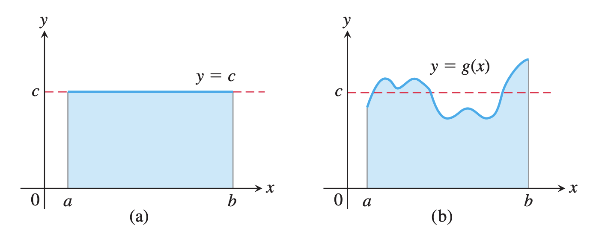
  
图 5.6 (a) $[a,b]$ 上 $f(x)=c$ 的平均值，是矩形面积除以 $b-a$。(b) $[a,b]$ 上 $g(x)$ 的平均值，是其图像下方面积除以 $b-a$。

**例 4** 估计函数 $f(x)=\sin x$ 在区间 $[0,\pi]$ 上的平均值。

**解** 从图 5.7 中 $0$ 到 $\pi$ 之间的 $\sin x$ 图像可以看出，它的平均高度位于 0 与 1 之间。为了求平均值，我们需要计算图像下方的面积 $A$，再把这个面积除以区间长度 $\pi-0=\pi$。

  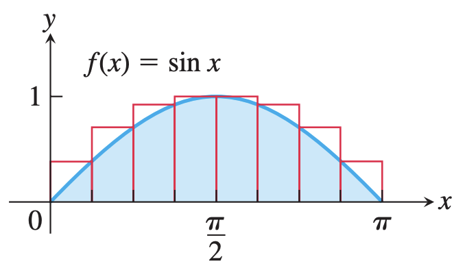
  
图 5.7 用八个矩形近似 $0$ 到 $\pi$ 之间 $f(x)=\sin x$ 下方的面积，以计算 $[0,\pi]$ 上 $\sin x$ 的平均值（例 4）。

我们没有简单方法确定这个面积，所以用有限和近似它。为了得到一个上和近似，我们把八个等宽矩形的面积相加，每个宽为 $\pi/8$，这些矩形合在一起包含 $[0,\pi]$ 上位于 $y=\sin x$ 图像下方、$x$ 轴上方的区域。矩形的高度取为每个小区间上 $\sin x$ 的最大值。在某个特定小区间上，这个最大值可能出现在左端点、右端点，或它们之间的某处。我们在这个点处计算 $\sin x$，得到上和中矩形的高。于是矩形面积之和估计总面积（图 5.7）：

$$
\begin{aligned}
A&\approx \left(\sin\frac{\pi}{8}+\sin\frac{\pi}{4}+\sin\frac{3\pi}{8}
+\sin\frac{\pi}{2}+\sin\frac{\pi}{2}
+\sin\frac{5\pi}{8}+\sin\frac{3\pi}{4}+\sin\frac{7\pi}{8}\right)\cdot\frac{\pi}{8}\\
&\approx (.38+.71+.92+1+1+.92+.71+.38)\cdot\frac{\pi}{8}\\
&=(6.02)\cdot\frac{\pi}{8}\approx 2.364.
\end{aligned}
$$

为了估计 $\sin x$ 在 $[0,\pi]$ 上的平均值，我们把估计面积除以区间长度 $\pi$，得到近似值

$$
\frac{2.364}{\pi}\approx 0.753.
$$

因为我们使用上和来近似面积，这个估计大于 $\sin x$ 在 $[0,\pi]$ 上的实际平均值。如果使用越来越多的矩形，并让每个矩形越来越薄，就会越来越接近真实平均值，如表 5.5 所示。利用第 5.3 节涵盖的技术，我们将证明真实平均值是 $2/\pi\approx 0.63662$。

  
表 5.5　$0\le x\le\pi$ 上 $\sin x$ 的平均值

  

  <table style="display: table; width: auto; min-width: 420px; margin: 0; border-collapse: collapse; font-variant-numeric: tabular-nums;">
    <thead>
      <tr style="background-color: #f3f3f3; border-bottom: 1px solid #777;">
        <th style="padding: 0.6em 1.5em; text-align: center; font-weight: 600;">小区间个数</th>
        <th style="padding: 0.6em 1.5em; text-align: center; font-weight: 600;">上和估计</th>
      </tr>
    </thead>
    <tbody>
      <tr style="border-bottom: 1px solid #ddd;">
        <td style="padding: 0.5em 1.5em; text-align: center;">8</td>
        <td style="padding: 0.5em 1.5em; text-align: right;">0.75342</td>
      </tr>
      <tr style="border-bottom: 1px solid #ddd;">
        <td style="padding: 0.5em 1.5em; text-align: center;">16</td>
        <td style="padding: 0.5em 1.5em; text-align: right;">0.69707</td>
      </tr>
      <tr style="border-bottom: 1px solid #ddd;">
        <td style="padding: 0.5em 1.5em; text-align: center;">32</td>
        <td style="padding: 0.5em 1.5em; text-align: right;">0.65212</td>
      </tr>
      <tr style="border-bottom: 1px solid #ddd;">
        <td style="padding: 0.5em 1.5em; text-align: center;">50</td>
        <td style="padding: 0.5em 1.5em; text-align: right;">0.64657</td>
      </tr>
      <tr style="border-bottom: 1px solid #ddd;">
        <td style="padding: 0.5em 1.5em; text-align: center;">100</td>
        <td style="padding: 0.5em 1.5em; text-align: right;">0.64161</td>
      </tr>
      <tr>
        <td style="padding: 0.5em 1.5em; text-align: center;">1000</td>
        <td style="padding: 0.5em 1.5em; text-align: right;">0.63712</td>
      </tr>
    </tbody>
  </table>
  

和前面一样，我们也完全可以使用位于 $y=\sin x$ 图像下方的矩形并计算下和近似，或者使用中点法。在第 5.3 节中，我们将看到，只要所有矩形都足够薄，在每一种情形下，近似值都会接近真实面积。

### 总结

正函数图像下方的面积、始终沿同一方向运动的物体所经过的路程，以及非负函数在某个区间上的平均值，都可以用按照同一种方法构造的有限和来近似。首先，把所考察的区间分成若干小区间，并在每个小区间内把相应的函数 $f$ 近似看作常函数。然后，在每个小区间内选取一点，用该点处的函数值乘以小区间的宽度，再把所得乘积相加。如果区间 $[a,b]$ 被分成 $n$ 个等宽小区间

$$
\Delta x=\frac{b-a}{n},
$$

并且 $f(c_k)$ 是 $f$ 在第 $k$ 个小区间中所选点 $c_k$ 处的值，那么这一过程给出如下形式的有限和：

$$
f(c_1)\Delta x+f(c_2)\Delta x+f(c_3)\Delta x+\cdots+f(c_n)\Delta x.
$$

在后面的几节中，我们将引入简洁表示这些和的记号，并研究当区间划分越来越细时它们的极限。

## 5.2 Sigma 记号与有限和的极限

在第 5.1 节用有限和作估计时，我们遇到了含有许多项的和（例如表 5.1 中多达 1000 项）。本节引入一种更方便的记号，用来表示项数很多的和。在描述这种记号并列出它的若干性质之后，我们考察当项数趋于无穷时，有限和近似会发生什么。

### 有限和与 Sigma 记号

Sigma 记号使我们能够把含有许多项的和写成紧凑形式：

$$
\sum_{k=1}^{n}a_k=a_1+a_2+a_3+\cdots+a_{n-1}+a_n.
$$

希腊字母 $\Sigma$（大写 sigma，对应英文字母 S）表示“求和”。求和指标 $k$ 告诉我们求和从哪里开始（$\Sigma$ 符号下方的数）以及在哪里结束（$\Sigma$ 上方的数）。任何字母都可以用来表示指标，但通常使用 $i,j,k$。

在 $\sum_{k=1}^n a_k$ 中，$k=1$ 表示指标 $k$ 从 $k=1$ 开始，$n$ 表示指标 $k$ 到 $k=n$ 结束，$a_k$ 是第 $k$ 项的公式。

因此我们可以写成

$$
1^2+2^2+3^2+4^2+5^2+6^2+7^2+8^2+9^2+10^2+11^2
=\sum_{k=1}^{11}k^2,
$$

以及

$$
f(1)+f(2)+f(3)+\cdots+f(100)=\sum_{i=1}^{100}f(i).
$$

求和下限不必是 1；它可以是任意整数。

**例 1**

  

  <table style="display: table; width: auto; min-width: 760px; margin: 0; border-collapse: collapse; font-variant-numeric: tabular-nums;">
    <thead>
      <tr style="background-color: #f3f3f3; border-bottom: 1px solid #777;">
        <th style="padding: 0.65em 1em; text-align: center; font-weight: 600;">Sigma 记号中的和</th>
        <th style="padding: 0.65em 1em; text-align: center; font-weight: 600;">展开为每个 $k$ 值对应的一项</th>
        <th style="padding: 0.65em 1em; text-align: center; font-weight: 600;">和的值</th>
      </tr>
    </thead>
    <tbody>
      <tr style="border-bottom: 1px solid #ddd;">
        <td style="padding: 0.65em 1em; text-align: center;">$\displaystyle \sum_{k=1}^{5}k$</td>
        <td style="padding: 0.65em 1em; text-align: center;">$1+2+3+4+5$</td>
        <td style="padding: 0.65em 1em; text-align: center;">$15$</td>
      </tr>
      <tr style="border-bottom: 1px solid #ddd;">
        <td style="padding: 0.65em 1em; text-align: center;">$\displaystyle \sum_{k=1}^{3}(-1)^k k$</td>
        <td style="padding: 0.65em 1em; text-align: center;">$(-1)^1(1)+(-1)^2(2)+(-1)^3(3)$</td>
        <td style="padding: 0.65em 1em; text-align: center;">$-1+2-3=-2$</td>
      </tr>
      <tr style="border-bottom: 1px solid #ddd;">
        <td style="padding: 0.65em 1em; text-align: center;">$\displaystyle \sum_{k=1}^{2}\frac{k}{k+1}$</td>
        <td style="padding: 0.65em 1em; text-align: center;">$\displaystyle \frac{1}{1+1}+\frac{2}{2+1}$</td>
        <td style="padding: 0.65em 1em; text-align: center;">$\displaystyle \frac{1}{2}+\frac{2}{3}=\frac{7}{6}$</td>
      </tr>
      <tr>
        <td style="padding: 0.65em 1em; text-align: center;">$\displaystyle \sum_{k=4}^{5}\frac{k^2}{k-1}$</td>
        <td style="padding: 0.65em 1em; text-align: center;">$\displaystyle \frac{4^2}{4-1}+\frac{5^2}{5-1}$</td>
        <td style="padding: 0.65em 1em; text-align: center;">$\displaystyle \frac{16}{3}+\frac{25}{4}=\frac{139}{12}$</td>
      </tr>
    </tbody>
  </table>
  

**例 2** 把和 $1+3+5+7+9$ 表示为 Sigma 记号。

**解** 生成各项的公式会随着求和下限改变而改变，但生成的项保持不变。通常从 $k=0$ 或 $k=1$ 开始最简单，不过我们可以从任意整数开始。

从 $k=0$ 开始：

$$
1+3+5+7+9=\sum_{k=0}^{4}(2k+1).
$$

从 $k=1$ 开始：

$$
1+3+5+7+9=\sum_{k=1}^{5}(2k-1).
$$

从 $k=2$ 开始：

$$
1+3+5+7+9=\sum_{k=2}^{6}(2k-3).
$$

从 $k=-3$ 开始：

$$
1+3+5+7+9=\sum_{k=-3}^{1}(2k+7).
$$

当我们有像

$$
\sum_{k=1}^{3}(k+k^2)
$$

这样的和时，可以重新排列它的项：

$$
\begin{aligned}
\sum_{k=1}^{3}(k+k^2)
&=(1+1^2)+(2+2^2)+(3+3^2)\\
&=(1+2+3)+(1^2+2^2+3^2)\qquad \text{（重新分组）}\\
&=\sum_{k=1}^{3}k+\sum_{k=1}^{3}k^2.
\end{aligned}
$$

这说明了有限和的一条一般法则：

$$
\sum_{k=1}^{n}(a_k+b_k)=\sum_{k=1}^{n}a_k+\sum_{k=1}^{n}b_k.
$$

下面给出四条这样的法则。它们成立的证明可以用数学归纳法得到（见附录 2）。

  

    
有限和的代数法则

    

      
1. 和法则：

      $$
      \sum_{k=1}^{n}(a_k+b_k)=\sum_{k=1}^{n}a_k+\sum_{k=1}^{n}b_k
      $$
      
2. 差法则：

      $$
      \sum_{k=1}^{n}(a_k-b_k)=\sum_{k=1}^{n}a_k-\sum_{k=1}^{n}b_k
      $$
      
3. 常数倍法则：

      $$
      \sum_{k=1}^{n}ca_k=c\cdot\sum_{k=1}^{n}a_k\qquad \text{（任意数 }c\text{）}
      $$
      
4. 常值法则：

      $$
      \sum_{k=1}^{n}c=n\cdot c\qquad \text{（}c\text{ 是任意常数值）}
      $$
    

  

**例 3** 我们演示代数法则的使用。

$$
\begin{array}{clll}
\text{(a)}
& \displaystyle\sum_{k=1}^{n}(3k-k^2)
& \displaystyle=3\sum_{k=1}^{n}k-\sum_{k=1}^{n}k^2
& \text{差法则和常数倍法则}
\\[0.9em]
\text{(b)}
& \displaystyle\sum_{k=1}^{n}(-a_k)
& \displaystyle=\sum_{k=1}^{n}(-1)\cdot a_k
=-1\cdot\sum_{k=1}^{n}a_k
=-\sum_{k=1}^{n}a_k
& \text{常数倍法则}
\\[0.9em]
\text{(c)}
& \displaystyle\sum_{k=1}^{3}(k+4)
& \displaystyle=\sum_{k=1}^{3}k+\sum_{k=1}^{3}4
& \text{和法则}
\\[0.4em]
&
& =(1+2+3)+(3\cdot4)
& \text{常值法则}
\\[0.4em]
&
& =6+12=18.
&
\\[0.9em]
\text{(d)}
& \displaystyle\sum_{k=1}^{n}\frac{1}{n}
& \displaystyle=n\cdot\frac{1}{n}=1
& \text{常值法则（}\,1/n\text{ 是常数）}
\end{array}
$$

多年来，人们发现了各种有限和值的公式。其中最著名的是前 $n$ 个整数之和的公式，以及前 $n$ 个整数的平方和与立方和公式。据说，德国数学家卡尔·弗里德里希·高斯（Carl Friedrich Gauss，1777-1855）在 8 岁时就发现了前一个公式。

**例 4** 说明前 $n$ 个整数之和为

$$
\sum_{k=1}^{n}k=\frac{n(n+1)}{2}.
$$

**解** 这个公式告诉我们，前 4 个整数之和为

$$
\frac{(4)(5)}{2}=10.
$$

直接相加验证了这个预言：

$$
1+2+3+4=10.
$$

为了在一般情形中证明这个公式，我们把和中的项写两次，一次按正向，一次按反向：

$$
\begin{array}{ccccccccc}
1&+&2&+&3&+\cdots+&n\\
n&+&(n-1)&+&(n-2)&+\cdots+&1
\end{array}
$$

如果把第一列中的两项相加，得到 $1+n=n+1$。类似地，把第二列中的两项相加，得到 $2+(n-1)=n+1$。任意一列中的两项之和都是 $n+1$。把 $n$ 列相加，就得到 $n$ 项，每项等于 $n+1$，总计为 $n(n+1)$。由于这是所求量的两倍，所以前 $n$ 个整数之和是 $(n)(n+1)/2$。

前 $n$ 个整数的平方和与立方和公式可以用数学归纳法证明（见附录 2）。这里列出它们。

  

    

      $$
      \text{前 }n\text{ 个平方数：}\qquad
      \sum_{k=1}^{n}k^2=\frac{n(n+1)(2n+1)}{6}
      $$
      $$
      \text{前 }n\text{ 个立方数：}\qquad
      \sum_{k=1}^{n}k^3=\left(\frac{n(n+1)}{2}\right)^2
      $$
    

  

### 有限和的极限

第 5.1 节中考察的有限和近似，在项数增加且小区间宽度（长度）变窄时变得更准确。下一个例子说明，当小区间宽度趋于零且小区间个数趋于无穷时，怎样计算一个极限值。

**例 5** 用等宽矩形对区域 $R$ 的面积作下和近似，其中 $R$ 位于图像 $y=1-x^2$ 下方、$x$ 轴上区间 $[0,1]$ 上方。求当矩形宽度趋于零且矩形个数趋于无穷时，这些下和近似的极限值。（见图 5.4a。）

**解** 我们用 $n$ 个等宽矩形计算一个下和近似，宽度为 $\Delta x=(1-0)/n$，然后观察当 $n\to\infty$ 时会发生什么。首先把 $[0,1]$ 分成 $n$ 个等宽小区间：

$$
\left[0,\frac{1}{n}\right],\ 
\left[\frac{1}{n},\frac{2}{n}\right],\ \ldots,\ 
\left[\frac{n-1}{n},\frac{n}{n}\right].
$$

每个小区间宽为 $1/n$。函数 $1-x^2$ 在 $[0,1]$ 上递减，并且它在一个小区间中的最小值出现在该小区间的右端点。因此，下和由这样的矩形构成：在小区间 $[(k-1)/n,k/n]$ 上，矩形高度为

$$
f\left(\frac{k}{n}\right)=1-\left(\frac{k}{n}\right)^2,
$$

于是得到和

$$
\left[f\left(\frac{1}{n}\right)\right]\left(\frac{1}{n}\right)
+\left[f\left(\frac{2}{n}\right)\right]\left(\frac{1}{n}\right)
+\cdots
+\left[f\left(\frac{k}{n}\right)\right]\left(\frac{1}{n}\right)
+\cdots
+\left[f\left(\frac{n}{n}\right)\right]\left(\frac{1}{n}\right).
$$

把它写成 Sigma 记号并化简：

$$
\begin{aligned}
\sum_{k=1}^{n}f\left(\frac{k}{n}\right)\left(\frac{1}{n}\right)
&=\sum_{k=1}^{n}\left(1-\left(\frac{k}{n}\right)^2\right)\left(\frac{1}{n}\right)\\
&=\sum_{k=1}^{n}\left(\frac{1}{n}-\frac{k^2}{n^3}\right)\\
&=\sum_{k=1}^{n}\frac{1}{n}-\sum_{k=1}^{n}\frac{k^2}{n^3}
\qquad \text{差法则}\\
&=n\cdot\frac{1}{n}-\frac{1}{n^3}\sum_{k=1}^{n}k^2
\qquad \text{常值法则和常数倍法则}\\
&=1-\left(\frac{1}{n^3}\right)\frac{n(n+1)(2n+1)}{6}
\qquad \text{前 }n\text{ 个平方数之和}\\
&=1-\frac{2n^3+3n^2+n}{6n^3}
\qquad \text{分子展开}.
\end{aligned}
$$

我们得到了一个对任意 $n$ 都成立的下和表达式。令 $n\to\infty$，可以看出当小区间个数增加且小区间宽度趋于零时，下和收敛：

$$
\lim_{n\to\infty}\left(1-\frac{2n^3+3n^2+n}{6n^3}\right)
=1-\frac{2}{6}
=\frac{2}{3}.
$$

下和近似收敛到 $2/3$。类似的计算表明，上和近似也收敛到 $2/3$。任意有限和近似

$$
\sum_{k=1}^{n}f(c_k)\left(\frac{1}{n}\right)
$$

也都收敛到同一个值 $2/3$。这是因为可以证明任意有限和近似都被夹在下和近似与上和近似之间。由于这个原因，我们被引导着把区域 $R$ 的面积定义为这个极限值。在第 5.3 节中，我们将在一般情形下研究这类有限近似的极限。

### 黎曼和

有限近似的极限理论由德国数学家格奥尔格·弗里德里希·伯恩哈德·黎曼（Georg Friedrich Bernhard Riemann，1826-1866）严格化。现在我们引入黎曼和的概念，它是下一节研究定积分理论的基础。

  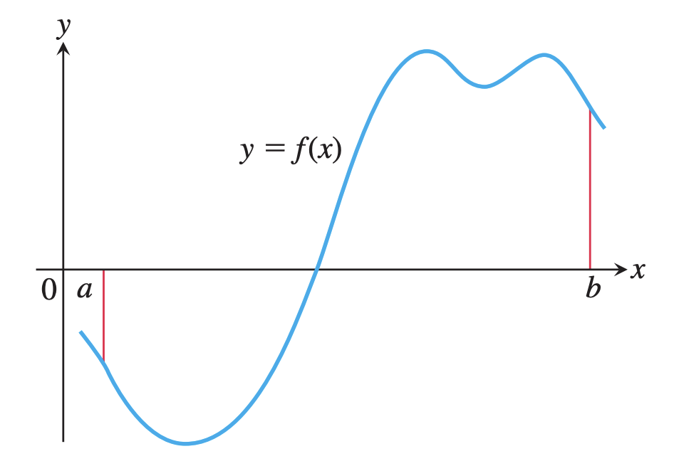
  
图 5.8 闭区间 $[a,b]$ 上典型的连续函数 $y=f(x)$。

我们从定义在闭区间 $[a,b]$ 上的任意有界函数 $f$ 开始。像图 5.8 中所画的函数一样，$f$ 可以取负值，也可以取正值。我们把区间 $[a,b]$ 分成若干小区间，这些小区间不必等宽（或等长），并用与第 5.1 节有限近似相同的方式形成和。为此，我们在 $a$ 与 $b$ 之间选取 $n-1$ 个点 $\{x_1,x_2,x_3,\ldots,x_{n-1}\}$，满足

$$
a<x_1<x_2<\cdots<x_{n-1}<b.
$$

为了使记号一致，把 $a$ 记为 $x_0$，把 $b$ 记为 $x_n$，于是

$$
a=x_0<x_1<x_2<\cdots<x_{n-1}<x_n=b.
$$

集合

$$
P=\{x_0,x_1,x_2,\ldots,x_{n-1},x_n\}
$$

称为 $[a,b]$ 的一个分割。分割 $P$ 把 $[a,b]$ 分成 $n$ 个闭小区间：

$$
[x_0,x_1],\ [x_1,x_2],\ \ldots,\ [x_{n-1},x_n].
$$

这些小区间中的第一个是 $[x_0,x_1]$，第二个是 $[x_1,x_2]$，而 $P$ 的第 $k$ 个小区间是 $[x_{k-1},x_k]$，其中 $k$ 是 1 到 $n$ 之间的整数。

第一个小区间 $[x_0,x_1]$ 的宽度记为 $\Delta x_1$，第二个小区间 $[x_1,x_2]$ 的宽度记为 $\Delta x_2$，第 $k$ 个小区间的宽度为

$$
\Delta x_k=x_k-x_{k-1}.
$$

如果所有 $n$ 个小区间等宽，则公共宽度 $\Delta x$ 等于 $(b-a)/n$。

在每个小区间中选择某个点。第 $k$ 个小区间 $[x_{k-1},x_k]$ 中选出的点称为 $c_k$。然后在每个小区间上立起一个竖直矩形，从 $x$ 轴延伸到曲线上的点 $(c_k,f(c_k))$。这些矩形可以位于 $x$ 轴上方或下方，这取决于 $f(c_k)$ 是正还是负；如果 $f(c_k)=0$，矩形就在 $x$ 轴上（图 5.9）。

  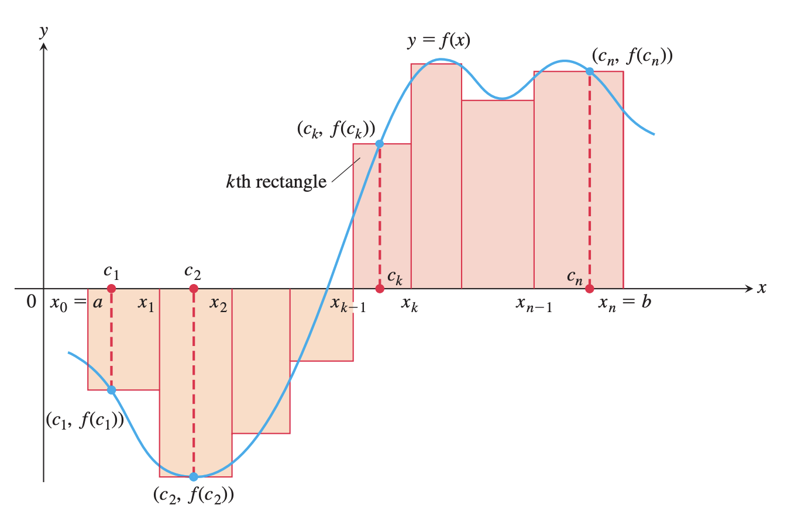
  
图 5.9 这些矩形近似函数 $y=f(x)$ 的图像与 $x$ 轴之间的区域。图 5.8 被放大，以突出 $[a,b]$ 的分割以及产生这些矩形的点 $c_k$ 的选择。

在每个小区间上，形成乘积 $f(c_k)\Delta x_k$。这个乘积是正、负还是零，取决于 $f(c_k)$ 的符号。当 $f(c_k)>0$ 时，乘积 $f(c_k)\Delta x_k$ 是一个高为 $f(c_k)$、宽为 $\Delta x_k$ 的矩形的面积。当 $f(c_k)<0$ 时，乘积 $f(c_k)\Delta x_k$ 是一个负数，是一个宽为 $\Delta x_k$、从 $x$ 轴向下延伸到负数 $f(c_k)$ 的矩形面积的相反数。最后把所有这些乘积相加，得到

$$
S_P=\sum_{k=1}^{n}f(c_k)\Delta x_k.
$$

和 $S_P$ 称为 $f$ 在区间 $[a,b]$ 上的一个黎曼和。有许多这样的和，它们取决于我们选择的分割 $P$，也取决于各个小区间中点 $c_k$ 的选择。例如，我们可以选取 $n$ 个都具有相等宽度

$$
\Delta x=\frac{b-a}{n}
$$

的小区间来分割 $[a,b]$，然后在形成黎曼和时把 $c_k$ 取为每个小区间的右端点（正如例 5 中所做的那样）。这种选择导向黎曼和公式

$$
S_n=\sum_{k=1}^{n}f\left(a+\frac{k(b-a)}{n}\right)\cdot\left(\frac{b-a}{n}\right).
$$

如果改为把 $c_k$ 选为每个小区间的左端点或中点，也可以得到类似公式。在所有小区间都等宽 $\Delta x=(b-a)/n$ 的情形下，只要增加小区间个数 $n$，就能使它们变薄。当一个分割含有不同宽度的小区间时，可以通过控制最宽（最长）小区间的宽度，保证所有小区间都很薄。我们把分割 $P$ 的范数，记作 $\|P\|$，定义为所有小区间宽度中的最大者。如果 $\|P\|$ 是一个小数，那么分割 $P$ 中所有小区间的宽度都很小。下面看一个说明这些思想的例子。

**例 6** 集合 $P=\{0,0.2,0.6,1,1.5,2\}$ 是 $[0,2]$ 的一个分割。$P$ 有五个小区间：

$$
[0,0.2],\ [0.2,0.6],\ [0.6,1],\ [1,1.5],\ [1.5,2].
$$

这些小区间的长度为 $\Delta x_1=0.2,\ \Delta x_2=0.4,\ \Delta x_3=0.4,\ \Delta x_4=0.5,\ \Delta x_5=0.5$。最长的小区间长度是 $0.5$，所以这个分割的范数是 $\|P\|=0.5$。在这个例子中，有两个小区间具有这个长度。

  

    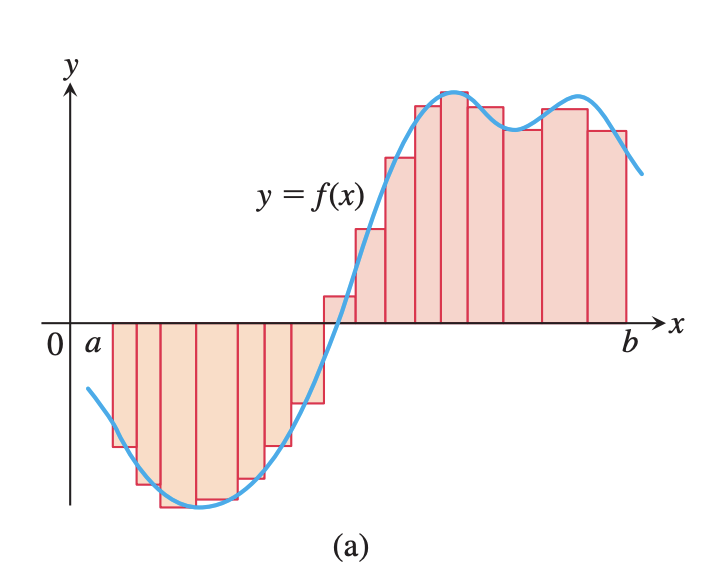
    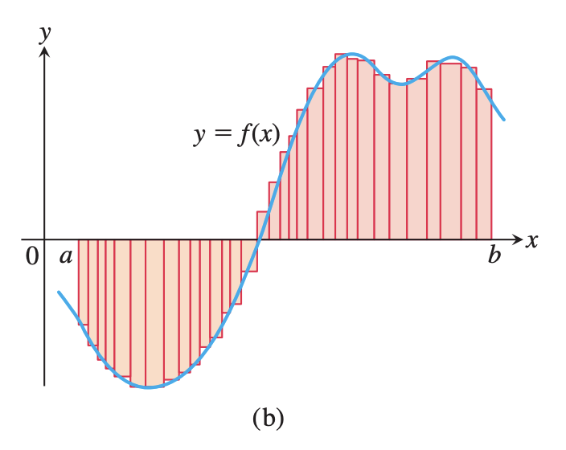
  

  
图 5.10 图 5.9 中的曲线配上来自 $[a,b]$ 更细分割的矩形。更细的分割产生底边更薄的矩形集合，它们越来越准确地近似 $f$ 的图像与 $x$ 轴之间的区域。

与闭区间 $[a,b]$ 的一个分割相关联的任何黎曼和，都定义了一组矩形，用来近似连续函数 $f$ 的图像与 $x$ 轴之间的区域。范数趋于零的分割会得到一组组矩形，它们以越来越高的精度近似这个区域，如图 5.10 所示。下一节中我们将看到，如果函数 $f$ 在闭区间 $[a,b]$ 上连续，那么无论怎样选择分割 $P$ 以及其小区间中的点 $c_k$ 来构造黎曼和，当由分割范数控制的小区间宽度趋于零时，都会趋近同一个极限值。

## 5.3 定积分

黎曼和的极限总是在分割的范数趋于零、同时小区间的数目趋于无穷时取得的。

莱布尼茨引入了一种记号，使定积分看起来像有限和的推广。有限和

$$
S_n=\sum_{k=1}^{n}f(c_k)\Delta x_k
$$

随着 $\|P\|\to0$，变成一个“无限和”。求和号 $\sum$ 换成积分号 $\int$（它源自表示“和”的字母 $S$ 的拉长形式）；$f(c_k)$ 变为 $f(x)$，因为取样点会遍布整个区间；小区间宽度 $\Delta x_k$ 变为微分 $dx$。因此，数 $I$ 的定积分记号是

$$
\int_a^b f(x)\,dx.
$$

读作“$f$ 从 $a$ 到 $b$ 关于 $x$ 的积分”，有时也读作“$f$ 从 $a$ 到 $b$ 的积分”。其中，$f(x)$ 是**被积函数**，$x$ 是**积分变量**，$a$ 是**积分下限**，$b$ 是**积分上限**。计算这个积分时，得到的结果是一个数。

当上述极限存在时，我们说 $f$ 在 $[a,b]$ 上**可积**。若把区间分成 $n$ 个等宽小区间，$\Delta x=(b-a)/n$，则

$$
S_n=\sum_{k=1}^{n}f(c_k)\frac{b-a}{n},
\qquad
\int_a^b f(x)\,dx
=\lim_{n\to\infty}\sum_{k=1}^{n}f(c_k)\frac{b-a}{n}.
$$

若每次都取右端点 $c_k=a+k(b-a)/n$，就得到计算定积分时常用的显式公式

$$
\int_a^b f(x)\,dx
=\lim_{n\to\infty}\sum_{k=1}^{n}
f\!\left(a+\frac{k(b-a)}{n}\right)\frac{b-a}{n}
\tag{1}
$$

只要分割的范数趋于零，其他取样点也能给出相同极限。定积分的值也不依赖积分变量所用的字母，例如

$$
\int_a^b f(x)\,dx
=\int_a^b f(u)\,du
=\int_a^b f(t)\,dt.
$$

积分变量只是一个占位符，称为**哑变量**。

### 可积函数与不可积函数

并非闭区间 $[a,b]$ 上每个有界函数都可积。要使黎曼和无论怎样选取取样点都收敛到同一个极限，函数的取值不能在每个小区间内发生过分剧烈的振荡。函数若连续，便不会出现这种问题；即使存在有限个跳跃不连续点，函数仍然可积。

> **定理 1　连续函数的可积性**
>
> 若函数 $f$ 在闭区间 $[a,b]$ 上连续，则定积分 $\int_a^b f(x)\,dx$ 存在，且 $f$ 在 $[a,b]$ 上可积。

这一结论背后的思想是：连续函数在闭区间上有最大值和最小值。对任意分割 $P$，在每个小区间上分别取最大值与最小值，就得到上和与下和。随着分割范数趋于零，上和与下和会趋于同一个极限；所有黎曼和都夹在二者之间，因此也趋于这一极限。有限个跳跃不连续点不会改变这个结论。

**例 1　不可积函数**　定义

$$
f(x)=
\begin{cases}
1, & x\text{ 为有理数},\\
0, & x\text{ 为无理数}.
\end{cases}
$$

这个函数在 $[0,1]$ 上没有黎曼积分。任意两个数之间既有有理数也有无理数，所以每个小区间都可以选择使 $f(c_k)=1$ 的取样点，也可以选择使 $f(c_k)=0$ 的取样点。前一种选法的黎曼和恒为

$$
\sum_{k=1}^{n}1\cdot\Delta x_k=1,
$$

后一种选法的黎曼和恒为

$$
\sum_{k=1}^{n}0\cdot\Delta x_k=0.
$$

由于两类黎曼和给出不同极限，定积分不存在。

### 定积分的性质

当 $b<a$ 时，定义

$$
\int_a^b f(x)\,dx=-\int_b^a f(x)\,dx;
$$

当积分上下限相同时，定义

$$
\int_a^a f(x)\,dx=0.
$$

这些定义使积分的运算规律在端点顺序改变时仍保持一致。

> **定理 2　定积分的性质**
>
> 若 $f$ 与 $g$ 在区间 $[a,b]$ 上可积，则它们的定积分满足表 5.6 中的运算规律。

  <table style="display: table; width: auto; min-width: 760px; margin: 0; border-collapse: collapse;">
    <caption style="caption-side: top; text-align: center; font-weight: 600; padding-bottom: 0.55em;">表 5.6　定积分满足的运算规律</caption>
    <thead>
      <tr style="border-bottom: 1.5px solid #444;">
        <th style="padding: 0.5em 0.8em; text-align: center;">序号</th>
        <th style="padding: 0.5em 0.8em; text-align: center;">规律</th>
        <th style="padding: 0.5em 0.8em; text-align: center;">公式</th>
      </tr>
    </thead>
    <tbody>
      <tr><td style="padding: 0.45em 0.8em; text-align:center;">1</td><td style="padding: 0.45em 0.8em;">积分次序</td><td style="padding: 0.45em 0.8em;">$\displaystyle\int_b^a f(x)\,dx=-\int_a^b f(x)\,dx$</td></tr>
      <tr style="background:#f7f7f7;"><td style="padding: 0.45em 0.8em; text-align:center;">2</td><td style="padding: 0.45em 0.8em;">零宽区间</td><td style="padding: 0.45em 0.8em;">$\displaystyle\int_a^a f(x)\,dx=0$</td></tr>
      <tr><td style="padding: 0.45em 0.8em; text-align:center;">3</td><td style="padding: 0.45em 0.8em;">常数倍</td><td style="padding: 0.45em 0.8em;">$\displaystyle\int_a^b kf(x)\,dx=k\int_a^b f(x)\,dx$</td></tr>
      <tr style="background:#f7f7f7;"><td style="padding: 0.45em 0.8em; text-align:center;">4</td><td style="padding: 0.45em 0.8em;">和与差</td><td style="padding: 0.45em 0.8em;">$\displaystyle\int_a^b[f(x)\pm g(x)]\,dx=\int_a^b f(x)\,dx\pm\int_a^b g(x)\,dx$</td></tr>
      <tr><td style="padding: 0.45em 0.8em; text-align:center;">5</td><td style="padding: 0.45em 0.8em;">可加性</td><td style="padding: 0.45em 0.8em;">$\displaystyle\int_a^b f(x)\,dx+\int_b^c f(x)\,dx=\int_a^c f(x)\,dx$</td></tr>
      <tr style="background:#f7f7f7;"><td style="padding: 0.45em 0.8em; text-align:center;">6</td><td style="padding: 0.45em 0.8em;">最大值—最小值不等式</td><td style="padding: 0.45em 0.8em;">$\displaystyle \min f\,(b-a)\le\int_a^b f(x)\,dx\le\max f\,(b-a)$</td></tr>
      <tr><td style="padding: 0.45em 0.8em; text-align:center;">7</td><td style="padding: 0.45em 0.8em;">控制性</td><td style="padding: 0.45em 0.8em;">若 $f(x)\ge g(x)$，则 $\displaystyle\int_a^b f(x)\,dx\ge\int_a^b g(x)\,dx$；特别地，若 $f\ge0$，则 $\displaystyle\int_a^b f(x)\,dx\ge0$。</td></tr>
    </tbody>
  </table>

  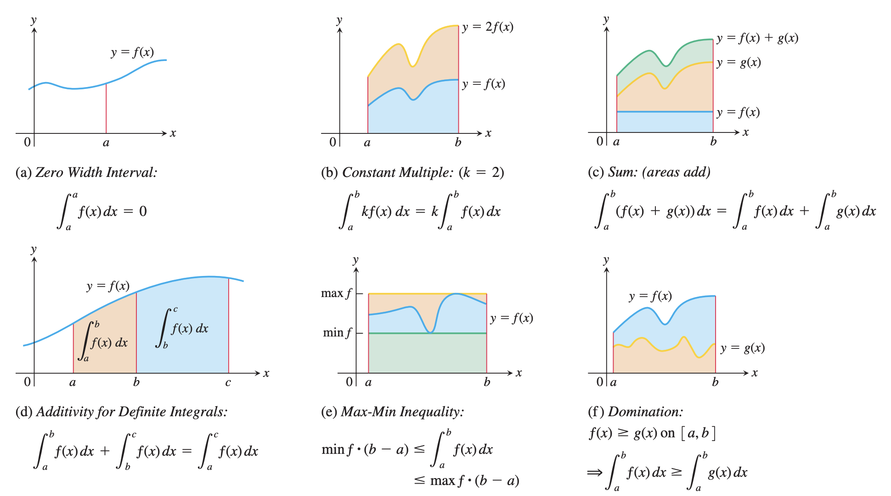
  
图 5.11　表 5.6 中性质 2～7 的几何解释。

**性质 6 的证明。** 性质 6 说明，$f$ 在 $[a,b]$ 上的积分不会小于 $f$ 的最小值与区间长度的乘积，也不会大于 $f$ 的最大值与区间长度的乘积。原因是：对于 $[a,b]$ 的任意一个分割以及取样点 $c_k$ 的任意一种选取，都有

$$
\begin{alignedat}{2}
\min f\,(b-a)
&=\min f\cdot\sum_{k=1}^{n}\Delta x_k
&\qquad &\sum_{k=1}^{n}\Delta x_k=b-a\\
&=\sum_{k=1}^{n}\min f\cdot\Delta x_k
&&\text{常数倍法则}\\
&\le\sum_{k=1}^{n}f(c_k)\Delta x_k
&&\min f\le f(c_k)\\
&\le\sum_{k=1}^{n}\max f\cdot\Delta x_k
&&f(c_k)\le\max f\\
&=\max f\cdot\sum_{k=1}^{n}\Delta x_k
&&\text{常数倍法则}\\
&=\max f\,(b-a).
\end{alignedat}
$$

简言之，$f$ 在 $[a,b]$ 上的所有黎曼和都满足不等式

$$
\min f\,(b-a)
\le\sum_{k=1}^{n}f(c_k)\Delta x_k
\le\max f\,(b-a).
$$

因此，它们的极限——也就是定积分——同样满足这个不等式。

**例 2　运用积分性质**　设

$$
\int_{-1}^{1}f(x)\,dx=5,\qquad
\int_{1}^{4}f(x)\,dx=-2,\qquad
\int_{-1}^{1}h(x)\,dx=7.
$$

则

$$
\begin{aligned}
\int_4^1 f(x)\,dx&=-\int_1^4f(x)\,dx=2,\\
\int_{-1}^{1}[2f(x)+3h(x)]\,dx
&=2\int_{-1}^{1}f(x)\,dx+3\int_{-1}^{1}h(x)\,dx=31,\\
\int_{-1}^{4}f(x)\,dx
&=\int_{-1}^{1}f(x)\,dx+\int_{1}^{4}f(x)\,dx=3.
\end{aligned}
$$

**例 3　用最大值—最小值不等式估计积分**　证明

$$
\int_0^1\sqrt{1+\cos x}\,dx\le\sqrt2.
$$

在 $[0,1]$ 上，$\sqrt{1+\cos x}$ 的最大值为 $\sqrt{1+1}=\sqrt2$。由性质 6，

$$
\int_0^1\sqrt{1+\cos x}\,dx
\le\sqrt2(1-0)=\sqrt2.
$$

### 非负函数图像下方的面积

现在回到本章开头提出的问题：怎样定义曲边区域的面积。第 5.1 节用矩形面积的有限和——上和、下和与中点和——逼近非负连续函数图像下方的面积；它们都是按特定方式构造的黎曼和。定理 1 保证，当分割的范数趋于零时，所有这些黎曼和都趋于同一个定积分。因此，可以用定积分严格定义面积。

**定义　非负函数图像下方的面积**

若 $y=f(x)$ 在闭区间 $[a,b]$ 上非负且可积，则曲线 $y=f(x)$ 在 $[a,b]$ 上方的面积为

$$
A=\int_a^b f(x)\,dx.
$$

这是第一次对边界为任意连续函数图像的区域面积给出严格定义。先看直线下方的简单情形，并验证这个新定义与原有的几何面积公式一致。

  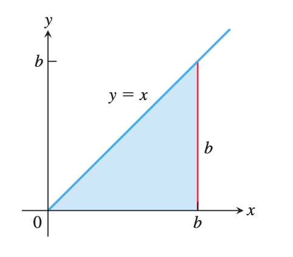
  
图 5.12　例 4 中的区域是一个三角形。

**例 4**　计算 $\int_0^b x\,dx$，并求 $b>0$ 时曲线 $y=x$ 在区间 $[0,b]$ 上方的面积 $A$。

**解（a）用黎曼和。** 把 $[0,b]$ 等分为 $n$ 个小区间，$\Delta x=b/n$，在第 $k$ 个小区间取右端点 $c_k=kb/n$。于是

$$
\begin{aligned}
\sum_{k=1}^{n}f(c_k)\Delta x
&=\sum_{k=1}^{n}\frac{kb}{n}\cdot\frac{b}{n}
=\frac{b^2}{n^2}\sum_{k=1}^{n}k\\
&=\frac{b^2}{n^2}\cdot\frac{n(n+1)}2
=\frac{b^2}{2}\left(1+\frac1n\right).
\end{aligned}
$$

令 $n\to\infty$，得到

$$
\int_0^b x\,dx=\frac{b^2}{2}.
$$

**解（b）用几何面积。** 图 5.12 中区域是底为 $b$、高为 $b$ 的三角形，因此

$$
A=\frac12 b\cdot b=\frac{b^2}{2}.
$$

由于非负函数的面积等于定积分，两种方法给出相同结果。

例 4 可以推广到任意 $0<a<b$：

$$
\begin{aligned}
\int_a^b x\,dx
&=\int_a^0x\,dx+\int_0^b x\,dx\\
&=-\int_0^a x\,dx+\int_0^b x\,dx
=-\frac{a^2}{2}+\frac{b^2}{2}.
\end{aligned}
$$

因此

$$
\int_a^b x\,dx=\frac{b^2}{2}-\frac{a^2}{2},\qquad a<b.
\tag{2}
$$

  

    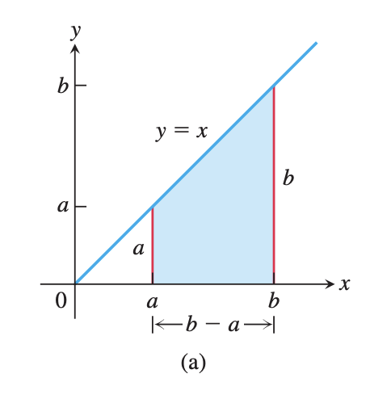
    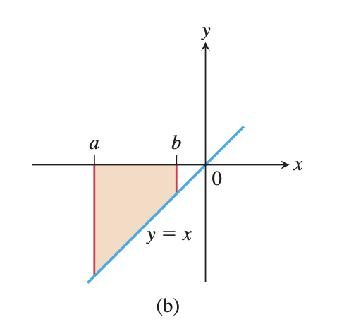
    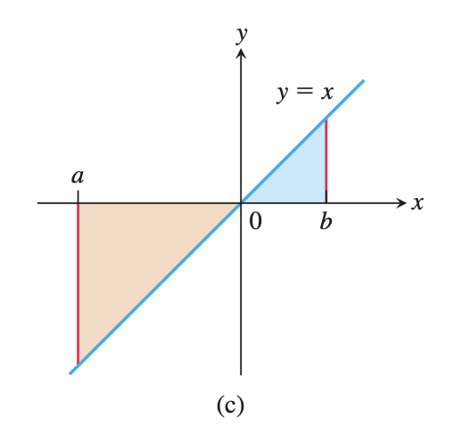
  

  
图 5.13　(a) 梯形面积为 $(b^2-a^2)/2$；(b) 当 $a<b<0$ 时，定积分是相应面积的负值；(c) 当 $a<0<b$ 时，定积分等于蓝色区域面积减去棕色区域面积。

公式（2）在 $a,b$ 都为负数时仍成立，不过定积分为负，表示直线 $y=x$ 位于 $x$ 轴下方；当 $a<0<b$ 时，它表示轴上方与轴下方两个带符号面积之差。用类似的黎曼和计算还可得到

$$
\int_a^b c\,dx=c(b-a),\qquad c\text{ 为任意常数},
\tag{3}
$$

以及

$$
\int_a^b x^2\,dx=\frac{b^3}{3}-\frac{a^3}{3},\qquad a<b.
\tag{4}
$$

### 再论连续函数的平均值

第 5.1 节非正式地把非负连续函数 $f$ 在 $[a,b]$ 上的平均值定义为图像下方面积除以区间长度 $b-a$。用积分记号就是

$$
\text{平均值}=\frac1{b-a}\int_a^b f(x)\,dx.
$$

这个公式也可以从算术平均数得到。把 $[a,b]$ 等分成 $n$ 个宽为 $\Delta x=(b-a)/n$ 的小区间，并在每个小区间中取一点 $c_k$（图 5.14），则这 $n$ 个函数值的平均数是

$$
\begin{aligned}
\frac{f(c_1)+f(c_2)+\cdots+f(c_n)}{n}
&=\frac1n\sum_{k=1}^{n}f(c_k)\\
&=\frac{\Delta x}{b-a}\sum_{k=1}^{n}f(c_k)
=\frac1{b-a}\sum_{k=1}^{n}f(c_k)\Delta x.
\end{aligned}
$$

  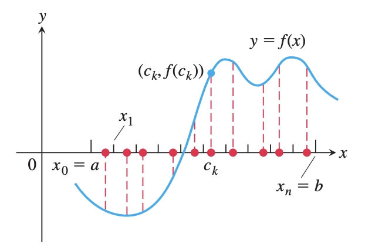
  
图 5.14　区间 $[a,b]$ 上的一组函数值样本。

当样本数量增加且分割范数趋于零时，这个平均数趋于 $(1/(b-a))\int_a^b f(x)\,dx$。这两个观点给出如下定义。

**定义　函数的平均值**

若 $f$ 在 $[a,b]$ 上可积，则它在 $[a,b]$ 上的平均值（也称均值）为

$$
\operatorname{av}(f)=\frac1{b-a}\int_a^b f(x)\,dx.
$$

**例 5**　求 $f(x)=\sqrt{4-x^2}$ 在 $[-2,2]$ 上的平均值。

**解。** $f$ 的图像是半径为 $2$、圆心在原点的上半圆。半圆面积为

$$
\frac12\pi r^2=\frac12\pi(2)^2=2\pi,
$$

所以

$$
\int_{-2}^{2}\sqrt{4-x^2}\,dx=2\pi.
$$

因此

$$
\operatorname{av}(f)
=\frac1{2-(-2)}\int_{-2}^{2}\sqrt{4-x^2}\,dx
=\frac14(2\pi)=\frac\pi2.
$$

  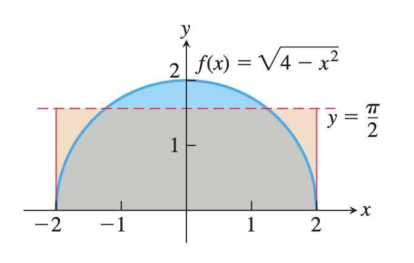
  
图 5.15　$f(x)=\sqrt{4-x^2}$ 在 $[-2,2]$ 上的平均值是 $\pi/2$。高为 $\pi/2$、底为 $4$ 的矩形与上半圆面积相等。

## 5.4 微积分基本定理

本节介绍积分学的中心定理——微积分基本定理。它把积分与微分联系起来，使我们可以通过被积函数的一个反导数来计算定积分，而不必像第 5.3 节那样直接求黎曼和的极限。莱布尼茨和牛顿正是利用了这种联系，开创了积分学，并推动了随后两个世纪的科学革命。

在得到基本定理之前，先给出定积分的中值定理。随后还会看到：一个量在某区间上的净变化，等于它的变化率在该区间上的积分。

### 定积分的中值定理

上一节把连续函数 $f$ 在 $[a,b]$ 上的平均值定义为

$$
\frac1{b-a}\int_a^b f(x)\,dx.
$$

定积分中值定理断言：这个平均值至少会被函数取到一次。几何上，它说存在 $c\in[a,b]$，使高为 $f(c)$、底为 $b-a$ 的矩形，其面积与 $f$ 从 $a$ 到 $b$ 的图像下方面积相同。

  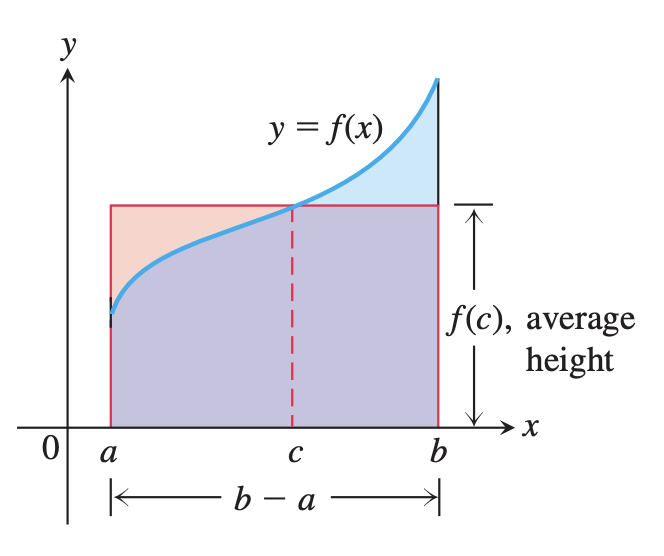
  
图 5.16　在定积分中值定理中，$f(c)$ 是 $f$ 在 $[a,b]$ 上的平均高度。若 $f\ge0$，图中矩形与曲线下方区域面积相等：$f(c)(b-a)=\int_a^b f(x)\,dx$。

**定理 3　定积分的中值定理**

若 $f$ 在 $[a,b]$ 上连续，则存在某个 $c\in[a,b]$，使

$$
f(c)=\frac1{b-a}\int_a^b f(x)\,dx.
$$

**证明** 将最大值—最小值不等式的两边同除以 $b-a$，得到

$$
\min f\le\frac1{b-a}\int_a^b f(x)\,dx\le\max f.
$$

因为 $f$ 连续，介值定理保证 $f$ 会取得 $\min f$ 与 $\max f$ 之间的每个值，所以它必在某个 $c\in[a,b]$ 处取得这个平均值。

连续性在这里不可缺少。不连续函数可能不会取得自己的平均值，如图 5.17 所示。

  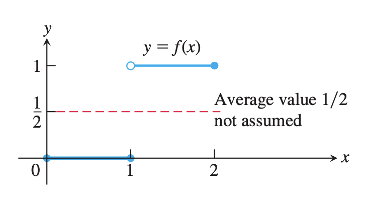
  
图 5.17　不连续函数未必取得它的平均值。

**例 1**　设 $f$ 在 $[a,b]$ 上连续，$a\ne b$，并且

$$
\int_a^b f(x)\,dx=0.
$$

证明 $f$ 在 $[a,b]$ 上至少有一个零点。

**解** $f$ 的平均值为

$$
\operatorname{av}(f)=\frac1{b-a}\int_a^b f(x)\,dx=0.
$$

由定积分中值定理，存在 $c\in[a,b]$ 使 $f(c)=0$。

### 微积分基本定理第一部分

直接通过黎曼和的极限来计算定积分通常很困难。现在发展一种以反导数为基础的强大方法，它把微积分的两条主线结合起来：一条是通过有限和的极限得到定积分，另一条是导数与反导数。

若 $f$ 在有限区间 $I$ 上可积，固定 $a\in I$，则对每个 $x\in I$ 定义

$$
F(x)=\int_a^x f(t)\,dt.
\tag{1}
$$

这里 $t$ 是积分中的哑变量，$x$ 是函数 $F$ 的自变量。若 $f\ge0$ 且 $x>a$，$F(x)$ 就是从 $a$ 到 $x$ 的曲线下方面积。

  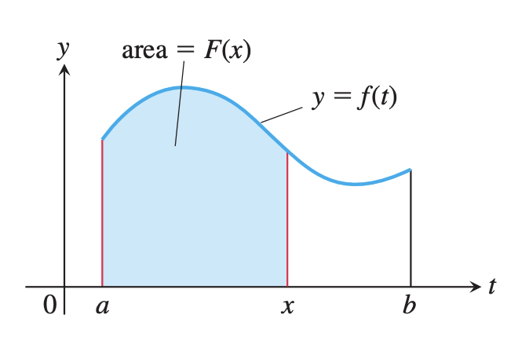
  
图 5.18　当 $f$ 非负且 $x>a$ 时，式（1）定义的 $F(x)$ 是曲线下从 $a$ 到 $x$ 的面积。

基本定理断言：若 $f$ 连续，则 $F$ 可导，而且其导数恰好是 $f$ 本身。先从几何上理解这一点。对 $h>0$，

$$
F(x+h)-F(x)=\int_x^{x+h}f(t)\,dt.
$$

当 $h$ 很小时，这一小条区域近似为高 $f(x)$、宽 $h$ 的矩形，所以

$$
F(x+h)-F(x)\approx hf(x).
$$

两边除以 $h$ 并令 $h\to0$，就应有 $F'(x)=f(x)$。

  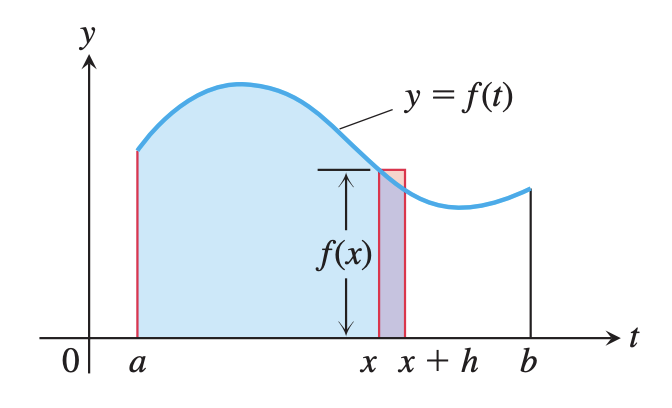
  
图 5.19　$F(x+h)-F(x)$ 是从 $x$ 到 $x+h$ 的面积；差商近似等于图中窄矩形的高度 $f(x)$。

  

    
定理 4　微积分基本定理，第一部分

    
若 $f$ 在 $[a,b]$ 上连续，则由

    

      $$
      F(x)=\int_a^x f(t)\,dt
      $$
    

    
定义的函数在 $[a,b]$ 上连续、在 $(a,b)$ 上可导，并且

    

      $$
      F'(x)=\frac{d}{dx}\int_a^x f(t)\,dt=f(x).
      \tag{2}
      $$
    

  

在证明定理 4 之前，先通过几个例子理解它的含义。请注意，在每个例子中，自变量都出现在某个积分限中，有时还以复合函数的形式出现。

**例 2**　利用微积分基本定理求 $dy/dx$：

$$
\begin{aligned}
&\text{(a)}\quad y=\int_a^x(t^3+1)\,dt,
&&\text{(b)}\quad y=\int_x^5 3t\sin t\,dt,\\[6pt]
&\text{(c)}\quad y=\int_1^{x^2}\cos t\,dt,
&&\text{(d)}\quad y=\int_{1+3x^2}^{4}\frac{1}{2+e^t}\,dt.
\end{aligned}
$$

**解** 对自变量 $x$ 求导。

  
(a)

  

    $$
    \begin{aligned}
    \frac{dy}{dx}
    &=\frac{d}{dx}\int_a^x(t^3+1)\,dt
    =x^3+1
    &&\text{式（2），其中 }f(t)=t^3+1.
    \end{aligned}
    $$
  

  
(b)

  

    $$
    \begin{aligned}
    \frac{dy}{dx}
    &=\frac{d}{dx}\int_x^5 3t\sin t\,dt\\
    &=\frac{d}{dx}\left(-\int_5^x3t\sin t\,dt\right)
    &&\text{表 5.6，性质 1}\\
    &=-\frac{d}{dx}\int_5^x3t\sin t\,dt\\
    &=-3x\sin x
    &&\text{式（2），其中 }f(t)=3t\sin t.
    \end{aligned}
    $$
  

  
(c)

  

    
积分上限不是 $x$，而是 $x^2$。这使 $y$ 成为下面两个函数的复合：

    

      $$
      y=\int_1^u\cos t\,dt,
      \qquad u=x^2.
      $$
    

    
因此，求 $dy/dx$ 时需要使用链式法则：

    $$
    \begin{aligned}
    \frac{dy}{dx}
    &=\frac{dy}{du}\frac{du}{dx}\\
    &=\left(\frac{d}{du}\int_1^u\cos t\,dt\right)\frac{du}{dx}\\
    &=\cos u\,\frac{du}{dx}\\
    &=\cos(x^2)\cdot2x\\
    &=2x\cos(x^2).
    \end{aligned}
    $$
  

  
(d)

  

    
先利用积分次序性质交换积分上下限，再对复合上限 $1+3x^2$ 使用链式法则：

    $$
    \begin{aligned}
    \frac{dy}{dx}
    &=\frac{d}{dx}\int_{1+3x^2}^{4}\frac{1}{2+e^t}\,dt\\
    &=\frac{d}{dx}\left(-\int_4^{1+3x^2}\frac{1}{2+e^t}\,dt\right)
    &&\text{性质 1}\\
    &=-\frac{d}{dx}\int_4^{1+3x^2}\frac{1}{2+e^t}\,dt\\
    &=-\frac{1}{2+e^{1+3x^2}}\frac{d}{dx}(1+3x^2)
    &&\text{式（2）与链式法则}\\
    &=-\frac{6x}{2+e^{1+3x^2}}.
    \end{aligned}
    $$
  

**定理 4 第一部分的证明。** 对内部点 $x$，由定积分的可加性，

$$
\begin{aligned}
\frac{F(x+h)-F(x)}h
&=\frac1h\left[\int_a^{x+h}f(t)\,dt-\int_a^x f(t)\,dt\right]\\
&=\frac1h\int_x^{x+h}f(t)\,dt.
\end{aligned}
\tag{3}
$$

由定积分中值定理，在 $x$ 与 $x+h$ 之间存在一点 $c$，使

$$
\int_x^{x+h}f(t)\,dt=f(c)h.
\tag{4}
$$

代入（3）得

$$
\frac{F(x+h)-F(x)}h=f(c).
$$

当 $h\to0$ 时，$c\to x$；又因 $f$ 连续，$f(c)\to f(x)$。因此

$$
F'(x)=\lim_{h\to0}\frac{F(x+h)-F(x)}h=f(x).
\tag{5}
$$

在端点处采用单侧极限，同样可证明 $F$ 在闭区间上连续。

### 微积分基本定理第二部分（求值定理）

第一部分说明，由积分定义的函数是被积函数的一个反导数。第二部分则把这个事实转化为实际计算定积分的方法。

  

    
定理 4（续）　微积分基本定理，第二部分

    
若 $f$ 在 $[a,b]$ 上连续，且 $F$ 是 $f$ 在 $[a,b]$ 上的任意一个反导数，则

    

      $$
      \int_a^b f(x)\,dx=F(b)-F(a).
      $$
    

  

**证明。** 令

$$
G(x)=\int_a^x f(t)\,dt.
$$

由基本定理第一部分，$G'(x)=f(x)$。若 $F$ 也是 $f$ 的反导数，则 $F$ 与 $G$ 只相差一个常数：$F(x)=G(x)+C$。因此

$$
F(b)-F(a)=[G(b)+C]-[G(a)+C]
=\int_a^b f(t)\,dt-\int_a^a f(t)\,dt
=\int_a^b f(t)\,dt.
$$

求值定理把计算分成两步：先找 $f$ 的一个反导数 $F$，再算 $F(b)-F(a)$。常用记号是

$$
\int_a^b f(x)\,dx
=\left.F(x)\right|_a^b
=\bigl[F(x)\bigr]_a^b
=F(b)-F(a).
$$

**例 3　用求值定理计算定积分**

$$
\begin{aligned}
\text{(a)}\quad
\int_0^\pi\cos x\,dx
&=[\sin x]_0^\pi=0,\\[4pt]
\text{(b)}\quad
\int_{-\pi/4}^{0}\sec x\tan x\,dx
&=[\sec x]_{-\pi/4}^{0}=1-\sqrt2,\\[4pt]
\text{(c)}\quad
\int_1^4\left(\frac32\sqrt{x}-\frac4{x^2}\right)dx
&=\left[x^{3/2}+\frac4x\right]_1^4=4,\\[4pt]
\text{(d)}\quad
\int_0^1\frac{dx}{x+1}
&=[\ln(x+1)]_0^1=\ln2,\\[4pt]
\text{(e)}\quad
\int_0^1\frac{dx}{x^2+1}
&=[\tan^{-1}x]_0^1=\frac\pi4.
\end{aligned}
$$

### 变化率的积分

可以把基本定理第二部分解释为：若 $F$ 是 $f$ 的任意一个反导数，那么 $f=F'$，于是

$$
\int_a^b F'(x)\,dx=F(b)-F(a).
$$

左边是 $F$ 的变化率在区间上的积分，右边是 $F$ 从 $a$ 到 $b$ 的净变化。

  

    
定理 5　净变化定理

    
可微函数 $F$ 在 $[a,b]$ 上的净变化，等于其变化率的积分：

    

      $$
      F(b)-F(a)=\int_a^b F'(x)\,dx.
      \tag{6}
      $$
    

  

**例 4　净变化定理的解释。**

- 若 $C(x)$ 是生产 $x$ 个单位产品的成本，则 $C'(x)$ 是边际成本，而

  $$
  \int_{x_1}^{x_2}C'(x)\,dx=C(x_2)-C(x_1)
  $$

  是产量由 $x_1$ 增加到 $x_2$ 时的成本变化。

- 若物体沿坐标轴运动，位置为 $s(t)$，速度为 $v(t)=s'(t)$，则

  $$
  \int_a^b v(t)\,dt=s(b)-s(a)
  $$

  是位移。若要计算总路程，则必须积分速率 $|v(t)|$：

  $$
  \text{总路程}=\int_a^b|v(t)|\,dt.
  $$

把净变化公式改写为

$$
F(b)=F(a)+\int_a^bF'(x)\,dx,
$$

就得到“最终值＝初始值＋净变化”。这一形式适用于人口、液体体积、成本和温度等各种累积量。

**例 5　石块的运动。** 一块石头以初速度 $160\ \text{ft}/\text{s}$ 竖直向上抛出，其速度为

$$
v(t)=160-32t,
$$

其中 $t$ 以秒计，速度单位为英尺每秒。求 $0\le t\le8$ 时的位移和总路程。

**解（a）位移。**

$$
\begin{aligned}
\int_0^8v(t)\,dt
&=\int_0^8(160-32t)\,dt\\
&=[160t-16t^2]_0^8=256.
\end{aligned}
$$

因此 8 秒后的位移为 $256$ 英尺。

**解（b）总路程。** 速度在 $t=5$ 时变号：在 $[0,5]$ 上为正，在 $[5,8]$ 上为负。因此

$$
\begin{aligned}
\int_0^8|v(t)|\,dt
&=\int_0^5(160-32t)\,dt-\int_5^8(160-32t)\,dt\\
&=[160t-16t^2]_0^5-[160t-16t^2]_5^8\\
&=400-(-144)=544.
\end{aligned}
$$

总路程为 $544$ 英尺：石块先上升 $400$ 英尺，再下降 $144$ 英尺。

### 积分与微分的关系

微积分基本定理说明，积分与微分互为逆过程。第一部分可写为

$$
\frac{d}{dx}\int_a^x f(t)\,dt=f(x),
$$

即先积分再微分会回到原函数。另一方面，把式（6）中的 $b$ 换成 $x$，得到

$$
\int_a^x F'(t)\,dt=F(x)-F(a),
$$

即先微分再积分会恢复原函数，只差一个积分常数。基本定理还告诉我们，每个连续函数都有反导数；实际上，$\int_a^x f(t)\,dt$ 本身就是一个反导数。因此微分方程

$$
\frac{dy}{dx}=f(x)
$$

总有解 $y=F(x)+C$，其中 $F$ 是 $f$ 的任意一个反导数。

### 总面积

面积总是非负的。黎曼和中的项 $f(c_k)\Delta x_k$ 在 $f(c_k)>0$ 时表示矩形面积，在 $f(c_k)<0$ 时却是矩形面积的负值。因此，函数既取正值又取负值时，定积分给出的是带符号面积之和，而不是总面积。

  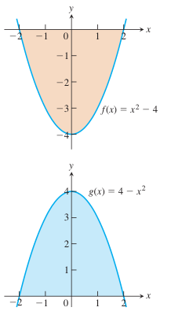
  
图 5.20　两个图像与 $x$ 轴围成的面积相同，但它们在 $[-2,2]$ 上的定积分符号相反。

**例 6**　图 5.20 给出 $f(x)=x^2-4$ 及其关于 $x$ 轴的对称图像 $g(x)=4-x^2$。分别求它们在 $[-2,2]$ 上的定积分，以及图像与 $x$ 轴之间的面积。

**解。**

$$
\int_{-2}^{2}f(x)\,dx
=\left[\frac{x^3}{3}-4x\right]_{-2}^{2}
=-\frac{32}{3},
$$

而

$$
\int_{-2}^{2}g(x)\,dx
=\left[4x-\frac{x^3}{3}\right]_{-2}^{2}
=\frac{32}{3}.
$$

两种情形的几何面积都是 $32/3$ 平方单位。$f$ 的定积分为负，但面积仍是正数。

当 $f$ 在区间内既取正值又取负值时，应在函数的零点处分割区间，使每个小区间内函数不变号；分别积分后，将各积分的绝对值相加。这样可避免正、负带符号面积彼此抵消。

  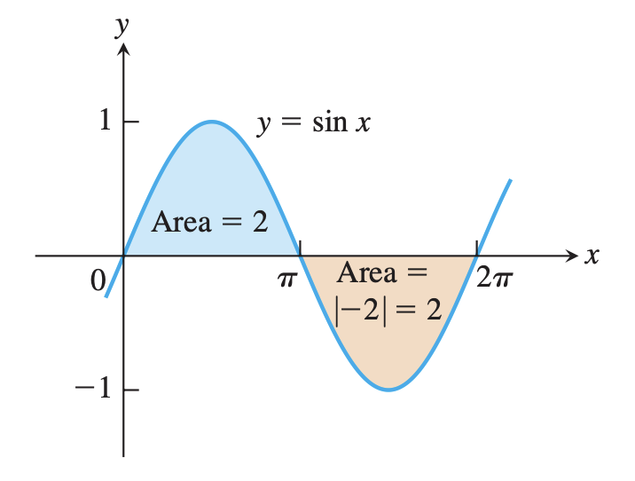
  
图 5.21　$0\le x\le2\pi$ 上，$y=\sin x$ 与 $x$ 轴之间的总面积是两个积分绝对值之和。

**例 7**　求 $f(x)=\sin x$ 在 $[0,2\pi]$ 上的定积分，以及图像与 $x$ 轴之间的总面积。

**解（a）定积分。**

$$
\int_0^{2\pi}\sin x\,dx
=[-\cos x]_0^{2\pi}=0.
$$

积分为零，是因为图像在 $x$ 轴上方和下方的部分恰好相互抵消。

**解（b）总面积。** 在 $[0,\pi]$ 上 $\sin x\ge0$，在 $[\pi,2\pi]$ 上 $\sin x\le0$：

$$
\int_0^\pi\sin x\,dx=2,
\qquad
\int_\pi^{2\pi}\sin x\,dx=-2.
$$

所以总面积为

$$
|2|+|-2|=4.
$$

  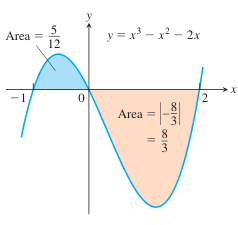
  
图 5.22　曲线 $y=x^3-x^2-2x$ 与 $x$ 轴之间的区域。

**例 8**　求 $x$ 轴与曲线

$$
f(x)=x^3-x^2-2x,\qquad -1\le x\le2
$$

所围成区域的面积。

**解。** 先求零点：

$$
f(x)=x(x^2-x-2)=x(x+1)(x-2),
$$

所以零点为 $-1,0,2$。它们把区间分成 $[-1,0]$ 与 $[0,2]$；$f$ 在前者非负，在后者非正。分别积分：

$$
\int_{-1}^{0}(x^3-x^2-2x)\,dx
=\left[\frac{x^4}{4}-\frac{x^3}{3}-x^2\right]_{-1}^{0}
=\frac5{12},
$$

$$
\int_{0}^{2}(x^3-x^2-2x)\,dx
=\left[\frac{x^4}{4}-\frac{x^3}{3}-x^2\right]_{0}^{2}
=-\frac83.
$$

故总面积为

$$
\frac5{12}+\left|-\frac83\right|=\frac{37}{12}.
$$

## 5.5 不定积分与换元法

微积分基本定理说明，如果能找到连续函数的一个反导数，就可以直接计算它的定积分。在第 4.8 节中，我们把函数 $f$ 关于 $x$ 的不定积分定义为 $f$ 的全体反导数，记作 $\int f(x)\,dx$。由于 $f$ 的任意两个反导数只相差一个常数，不定积分记号表示：对 $f$ 的任意一个反导数 $F$，有

$$
\int f(x)\,dx=F(x)+C,
$$

其中 $C$ 是任意常数。

微积分基本定理中反导数与定积分之间的联系，现在解释了这个记号：

$$
\int_a^b f(x)\,dx=F(b)-F(a)=\bigl[F(x)+C\bigr]_a^b
=\left[\int f(x)\,dx\right]_a^b
$$

求函数 $f$ 的不定积分时，要记住它总是包含任意常数 $C$。

我们必须仔细区分定积分与不定积分。定积分 $\int_a^b f(x)\,dx$ 是一个数。不定积分 $\int f(x)\,dx$ 是一个函数加上任意常数 $C$。

到目前为止，我们只能找到那些明显可识别为导数的函数的反导数。在本节中，我们开始发展更一般的技术，用来求那些不容易直接看成某个导数的函数的反导数。

### 换元：反向使用链式法则

如果 $u$ 是 $x$ 的可导函数，且 $n$ 是不同于 $-1$ 的任意数，那么链式法则告诉我们

$$
\frac{d}{dx}\left(\frac{u^{n+1}}{n+1}\right)=u^n\frac{du}{dx}.
$$

从另一个角度看，同一个等式说明，$\frac{u^{n+1}}{n+1}$ 是函数 $u^n(du/dx)$ 的一个反导数。因此，

$$
\int u^n\frac{du}{dx}\,dx=\frac{u^{n+1}}{n+1}+C \tag{1}
$$

式 (1) 中的积分等于更简单的积分

$$
\int u^n\,du=\frac{u^{n+1}}{n+1}+C
$$

这提示我们，在计算积分时，可以用更简单的表达式 $du$ 来代替 $(du/dx)\,dx$。莱布尼茨是微积分的创始人之一，他洞察到这种替换确实可以进行，由此得到计算积分的换元法。正如微分中那样，在计算积分时我们有

$$
du=\frac{du}{dx}\,dx.
$$

**例 1** 求积分 $\int (x^3+x)^5(3x^2+1)\,dx$。

**解：** 令 $u=x^3+x$。于是

$$
du=\frac{du}{dx}\,dx=(3x^2+1)\,dx,
$$

所以由换元法，

  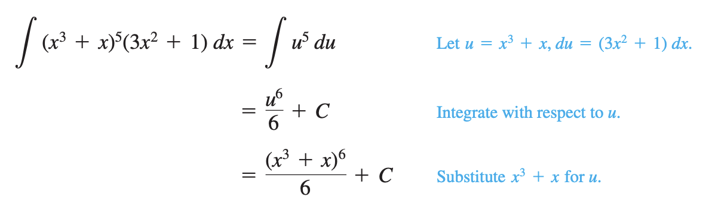

**例 2** 求 $\int \sqrt{2x+1}\,dx$。

**解：** 这个积分不符合 $\int u^n\,du$ 的形式，其中 $u=2x+1$ 且 $n=1/2$，因为

$$
du=\frac{du}{dx}\,dx=2\,dx
$$

并不恰好是 $dx$。积分中缺少常数因子 $2$。不过，我们可以在积分号后引入这个因子，同时在积分号前乘以补偿因子 $1/2$。因此写成

  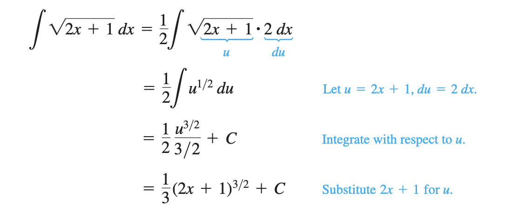

例 1 和例 2 中的换元，是下面一般法则的实例。

  

    
定理 6——换元法则

    
若 $u=g(x)$ 是可导函数，其值域是区间 $I$，且 $f$ 在 $I$ 上连续，则

    

$$
\int f(g(x))g'(x)\,dx=\int f(u)\,du.
$$
    

  

**证明** 由链式法则，只要 $F$ 是 $f$ 的一个反导数，$F(g(x))$ 就是 $f(g(x))\cdot g'(x)$ 的一个反导数：

  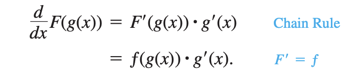

如果作换元 $u=g(x)$，则

  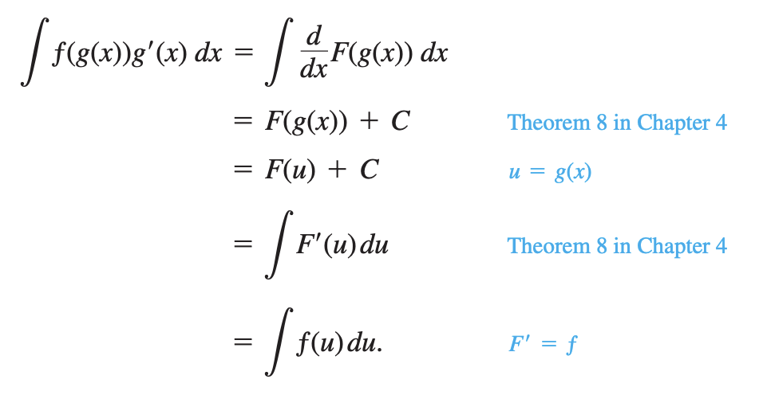

变量 $u$ 在换元法则中的使用是传统做法（有时称为 $u$-换元），但也可以使用任意字母，例如 $y,t,\theta$ 等。若定理 6 的条件满足，该法则提供了一种计算形如 $\int f(g(x))g'(x)\,dx$ 的积分的方法。主要困难在于决定积分式中哪个含 $x$ 的表达式应当被替换。下面的例子会给出一些有用的思路。

**用换元法计算 $\int f(g(x))g'(x)\,dx$**

1. 令 $u=g(x)$，并令 $du=(du/dx)\,dx=g'(x)\,dx$，从而得到 $\int f(u)\,du$。
2. 关于 $u$ 积分。
3. 用 $g(x)$ 替换 $u$。

**例 3** 求 $\int \sec^2(5x+1)\cdot 5\,dx$。

**解：** 我们令 $u=5x+1$，$du=5\,dx$。于是

  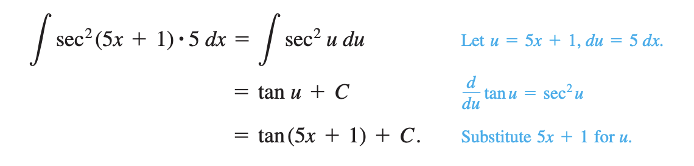

**例 4** 求 $\int \cos(7\theta+3)\,d\theta$。

**解：** 令 $u=7\theta+3$，于是 $du=7\,d\theta$。积分中的 $d\theta$ 项缺少常数因子 $7$。我们可以像例 2 那样，通过同时乘以和除以 $7$ 来补偿。于是

  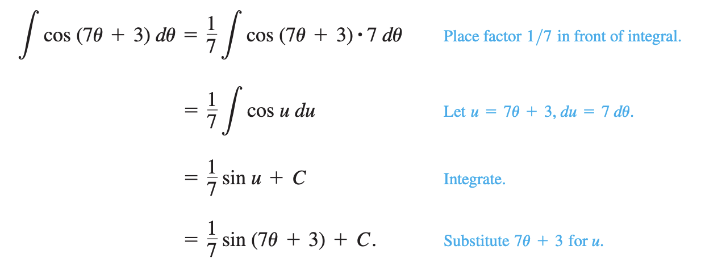

这个问题还有另一种处理方法。仍然令 $u=7\theta+3$，$du=7\,d\theta$，再解出 $d\theta$，得到 $d\theta=(1/7)\,du$。于是积分变为

  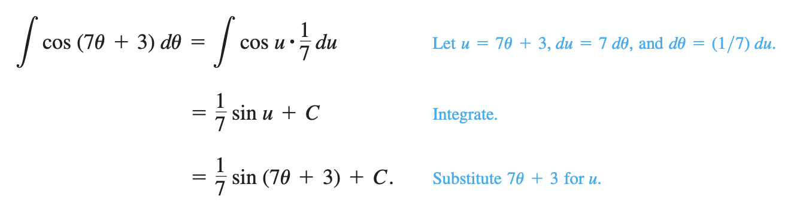

**例 5** 有时我们会观察到：积分式中出现的 $x$ 的某个幂，比某个待积分函数的自变量中出现的 $x$ 的幂低一次。这一观察会立即提示我们，尝试用较高次的 $x$ 幂作换元。下面的积分就属于这种情形。

  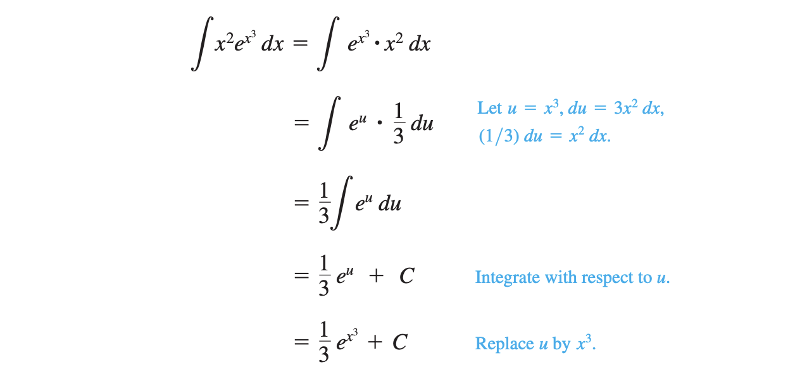

当我们尝试换元 $u=g(x)$ 时，积分式中可能会多出一个因子 $x$。在这种情况下，可能可以从方程 $u=g(x)$ 中把 $x$ 解成 $u$ 的表达式。用该表达式替换这个多出的因子 $x$，就可能得到一个可以计算的积分。下面是这种情形的一个例子。

**例 6** 计算 $\int x\sqrt{2x+1}\,dx$。

**解：** 例 2 中的积分提示我们作换元 $u=2x+1$，并有 $du=2\,dx$。于是

$$
\sqrt{2x+1}\,dx=\frac{1}{2}\sqrt{u}\,du.
$$

不过，在本题中，积分式还含有一个额外因子 $x$，它乘在 $\sqrt{2x+1}$ 上。为处理这一点，我们从换元方程 $u=2x+1$ 得到 $x=(u-1)/2$，于是

$$
x\sqrt{2x+1}\,dx=\frac{1}{2}(u-1)\cdot\frac{1}{2}\sqrt{u}\,du.
$$

现在积分变为

  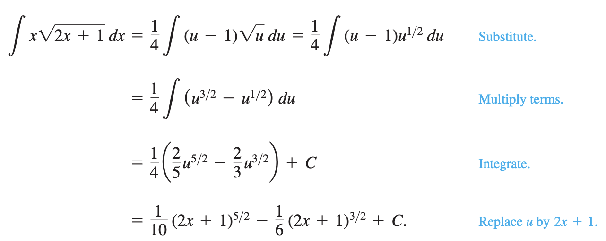

**例 7** 有时我们可以利用三角恒等式，把不知道如何计算的积分转化为可以用换元法计算的积分。

  

    
(a)

    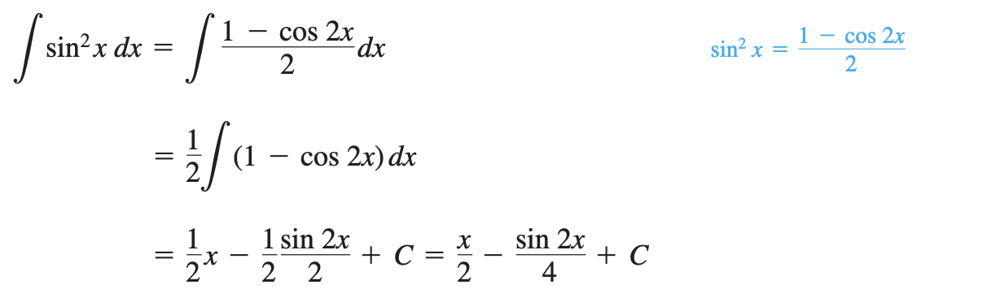
  

  

    
(b)

    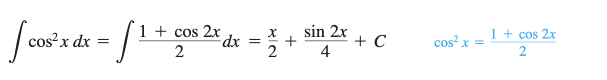
  

  

    
(c)

    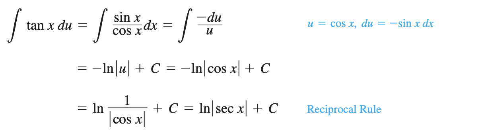
  

**例 8** 在应用换元法之前，积分式可能需要先作一些代数变形。本例给出两个积分，它们都通过把被积函数乘以一个等于 $1$ 的代数式，从而得到合适的换元。

  

    
(a)

    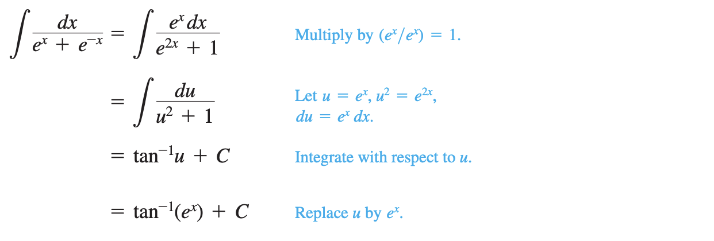
  

  

    
(b)

    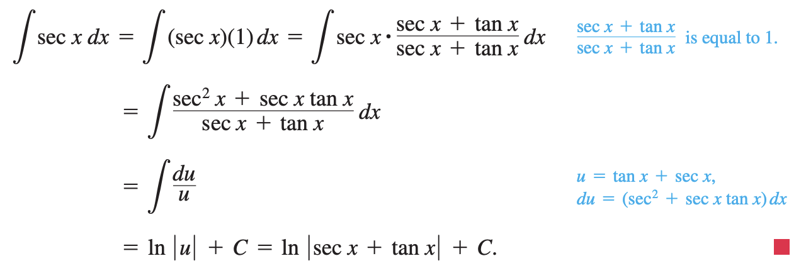
  

$\cot x$ 和 $\csc x$ 的积分可以用类似于例 7(c) 和例 8(b) 的方法求出。这里汇总这四个基本三角函数的积分结果。

**正切、余切、正割和余割函数的积分**

$$
\begin{aligned}
\int \tan x\,dx&=\ln|\sec x|+C,\\
\int \sec x\,dx&=\ln|\sec x+\tan x|+C,\\
\int \cot x\,dx&=\ln|\sin x|+C,\\
\int \csc x\,dx&=-\ln|\csc x+\cot x|+C.
\end{aligned}
$$

### 尝试不同的换元

换元法的成功取决于找到一种换元，把我们不能直接计算的积分变成可以计算的积分。找到合适的换元会随着练习和经验而变得容易。如果第一次换元失败，就尝试另一个换元，可能还要结合对被积函数的代数化简或三角化简。第 8 章将研究若干更复杂的换元。

**例 9** 计算 $\int \frac{2z\,dz}{\sqrt[3]{z^2+1}}$。

**解：** 我们可以把积分换元法当作一种探索工具来使用：先对被积函数中最麻烦的部分作换元，看看结果如何。对于这里的积分，我们可以尝试 $u=z^2+1$，甚至也可以更大胆地令 $u$ 为整个立方根。下面分别展示两种做法，两种换元都成功。

**方法 1：** 令 $u=z^2+1$。

  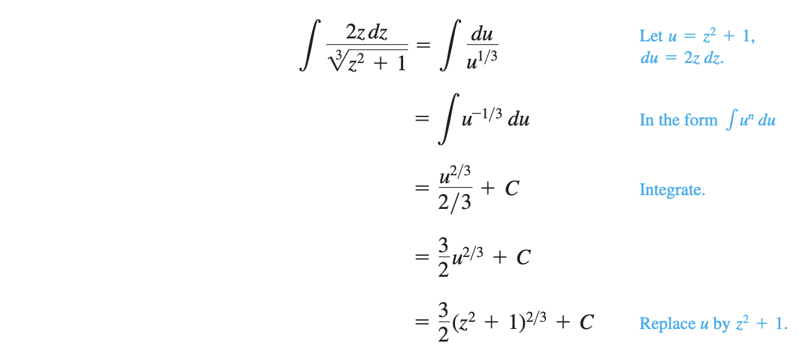

**方法 2：** 改令 $u=\sqrt[3]{z^2+1}$。

  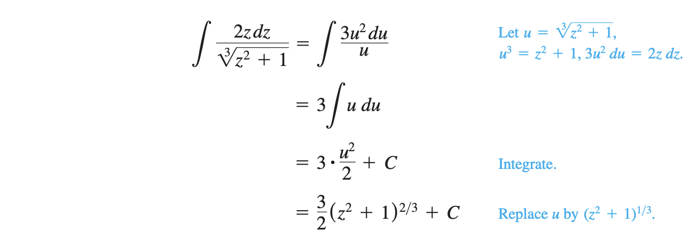

## 5.6 定积分换元与曲线之间的面积

用换元法计算定积分有两种途径。一种是先用换元法求出反导数，再利用定积分求值定理计算；另一种则把换元过程直接推广到定积分，同时改变积分上下限。本节还将把这一新公式用于计算两条曲线之间的面积。

### 换元公式

下面的公式说明：通过换元改变积分变量时，积分上下限应当怎样随之改变。

  

    
定理 7　定积分中的换元

    
若 $g'$ 在区间 $[a,b]$ 上连续，并且 $f$ 在 $g(x)=u$ 的值域上连续，则

    

      $$
      \int_a^b f(g(x))g'(x)\,dx
      =\int_{g(a)}^{g(b)}f(u)\,du.
      $$
    

  

**证明。** 设 $F$ 是 $f$ 的任意一个反导数。

  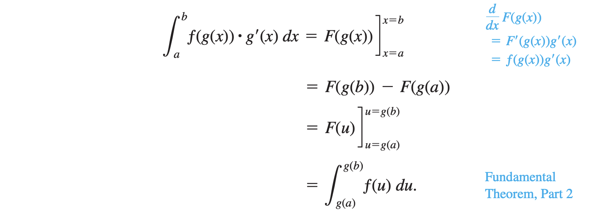

应用这个公式时，仍作与相应不定积分完全相同的换元 $u=g(x)$、$du=g'(x)\,dx$。不同之处在于：变换后的积分要从 $g(a)$（即 $x=a$ 时的 $u$ 值）积到 $g(b)$（即 $x=b$ 时的 $u$ 值）。

**例 1**　计算

$$
\int_{-1}^{1}3x^2\sqrt{x^3+1}\,dx.
$$

**解** 有两种方法。

**方法 1：改变积分限。**

  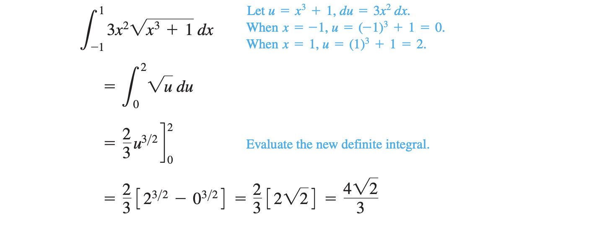

**方法 2：先作为不定积分换元。**

  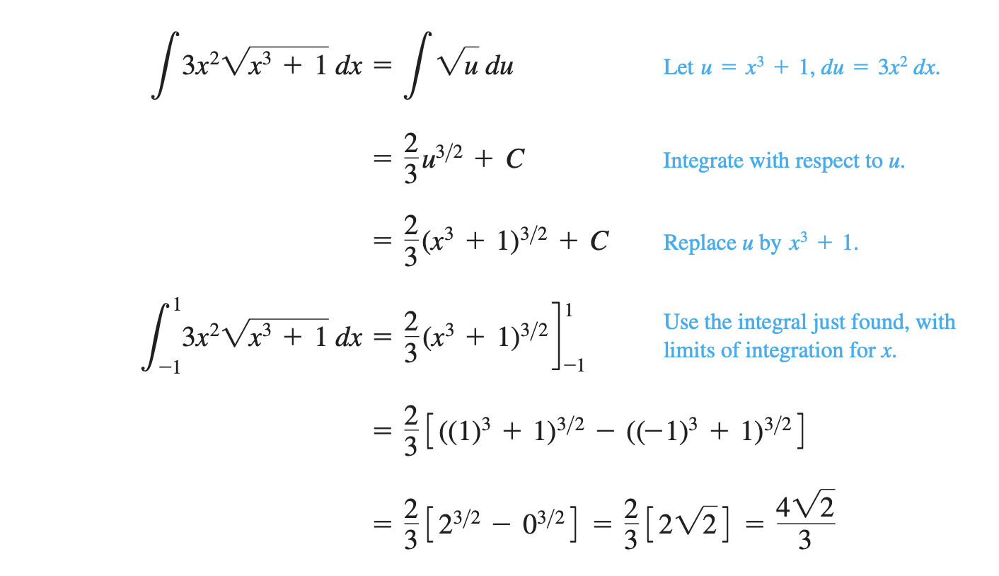

在这个例子中，直接改变积分限的第一种方法较简便，但并非总是如此。通常应当掌握两种方法，并根据具体积分选择较方便的一种。

**例 2**　使用改变积分限的方法。

  

    
(a)

    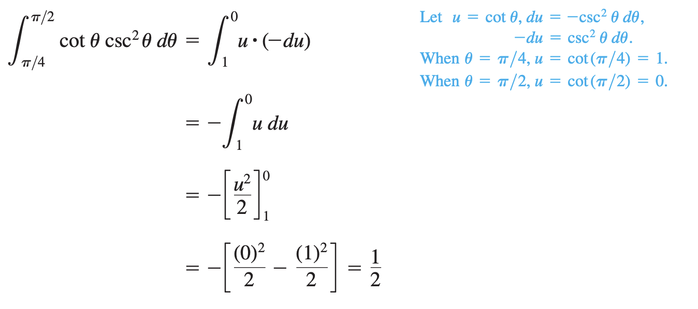
  

  

    
(b)

    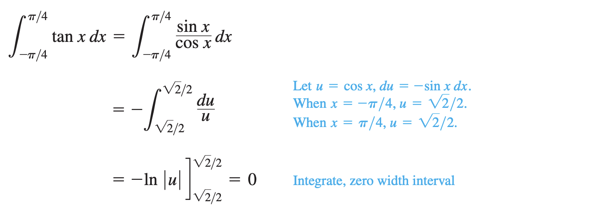
  

### 对称函数的定积分

定理 7 的换元公式能够简化偶函数与奇函数在对称区间 $[-a,a]$ 上的定积分计算。

  

    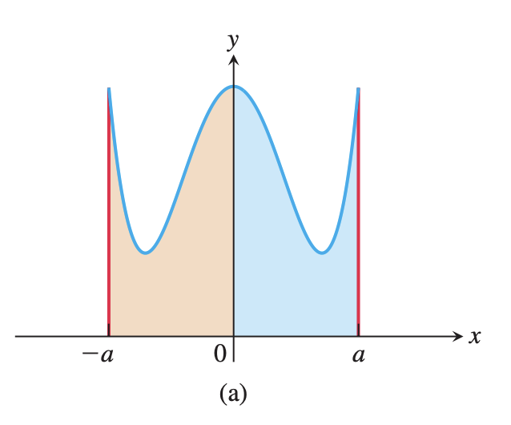
    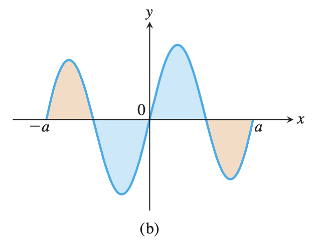
  

  
图 5.23　(a) 偶函数从 $-a$ 到 $a$ 的积分，是从 $0$ 到 $a$ 的积分的两倍；(b) 奇函数从 $-a$ 到 $a$ 的积分等于 $0$。

  

    
定理 8　对称区间上的定积分

    
设 $f$ 在对称区间 $[-a,a]$ 上连续。

    

      
(a)

      
若 $f$ 为偶函数，则 $\displaystyle\int_{-a}^{a}f(x)\,dx=2\int_0^a f(x)\,dx$。

      
(b)

      
若 $f$ 为奇函数，则 $\displaystyle\int_{-a}^{a}f(x)\,dx=0$。

    

  

**(a) 的证明**

  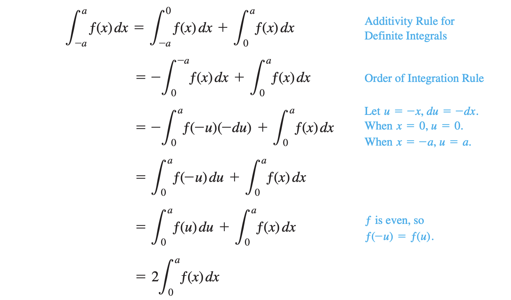

其中使用了偶函数性质 $f(-u)=f(u)$。奇函数情形的证明完全类似。即使把“连续”放宽为“可积”，定理 8 的结论仍成立。

**例 3**　计算

$$
\int_{-2}^{2}(x^4-4x^2+6)\,dx.
$$

**解。** $f(x)=x^4-4x^2+6$ 满足 $f(-x)=f(x)$，所以它在对称区间 $[-2,2]$ 上为偶函数。于是

$$
\begin{aligned}
\int_{-2}^{2}(x^4-4x^2+6)\,dx
&=2\int_0^2(x^4-4x^2+6)\,dx\\
&=2\left[\frac{x^5}{5}-\frac43x^3+6x\right]_0^2\\
&=2\left(\frac{32}{5}-\frac{32}{3}+12\right)
=\frac{232}{15}.
\end{aligned}
$$

### 曲线之间的面积

设一个区域的上边界为 $y=f(x)$，下边界为 $y=g(x)$，左右边界分别为 $x=a$ 与 $x=b$（图 5.24）。这个区域有时碰巧具有能够用初等几何求面积的形状；但若 $f$、$g$ 是任意连续函数，通常就要用积分求面积。

  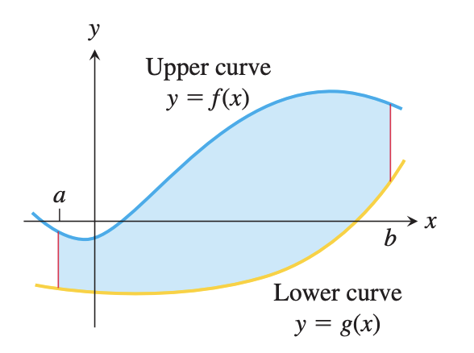
  
图 5.24　曲线 $y=f(x)$、$y=g(x)$ 与直线 $x=a$、$x=b$ 之间的区域。

为了确定应当使用怎样的积分，先根据区间 $[a,b]$ 的分割 $P=\{x_0,x_1,\ldots,x_n\}$，用 $n$ 个竖直矩形近似该区域（图 5.25）。第 $k$ 个矩形如图 5.26 所示，它的面积为

$$
\Delta A_k=\text{高}\times\text{宽}
=[f(c_k)-g(c_k)]\Delta x_k.
$$

  

    

      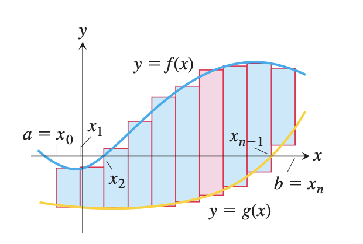
      
图 5.25　用垂直于 $x$ 轴的矩形近似区域。

    

    

      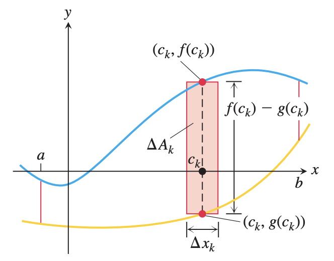
      
图 5.26　第 $k$ 个矩形的高为 $f(c_k)-g(c_k)$，宽为 $\Delta x_k$。

    

  

把这 $n$ 个矩形的面积相加，得到黎曼和

$$
A\approx\sum_{k=1}^{n}\Delta A_k
=\sum_{k=1}^{n}[f(c_k)-g(c_k)]\Delta x_k.
$$

由于 $f$ 与 $g$ 连续，当 $\|P\|\to0$ 时，右边趋于相应的定积分。因此

$$
A=\lim_{\|P\|\to0}\sum_{k=1}^{n}[f(c_k)-g(c_k)]\Delta x_k
=\int_a^b[f(x)-g(x)]\,dx.
$$

  

    
定义　两条曲线之间的面积

    
若 $f$ 与 $g$ 连续，并且在整个 $[a,b]$ 上都有 $f(x)\ge g(x)$，则曲线 $y=f(x)$ 与 $y=g(x)$ 从 $a$ 到 $b$ 之间的区域面积为

    

      $$
      A=\int_a^b[f(x)-g(x)]\,dx.
      $$
    

  

应用这个定义时，先画出曲线通常很有帮助。图像能显示哪一条是上方曲线 $f$、哪一条是下方曲线 $g$；若积分限没有给出，图像也能帮助确定积分限。此时可能需要解方程 $f(x)=g(x)$ 找到交点，再对 $f-g$ 积分。

**例 4**　求下列区域的面积：上边界为 $y=2e^{-x}+x$，下边界为 $y=\tfrac12e^x$，左边界为 $x=0$，右边界为 $x=1$。

  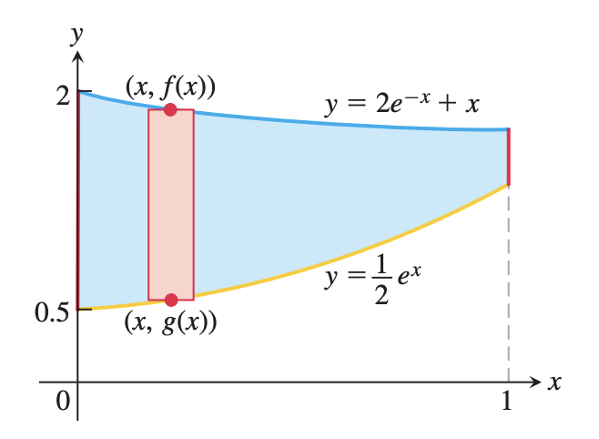
  
图 5.27　例 4 的区域及一个典型的近似矩形。

**解。** 图 5.27 给出了两条曲线、所求区域以及一个典型的近似矩形。在 $0\le x\le1$ 上，两条曲线之间的面积为

$$
\begin{aligned}
A
&=\int_0^1\left[(2e^{-x}+x)-\frac12e^x\right]dx\\
&=\left[-2e^{-x}+\frac12x^2-\frac12e^x\right]_0^1\\
&=3-\frac2e-\frac e2
\approx0.9051.
\end{aligned}
$$

**例 5**　求抛物线 $y=2-x^2$ 与直线 $y=-x$ 所围区域的面积。

  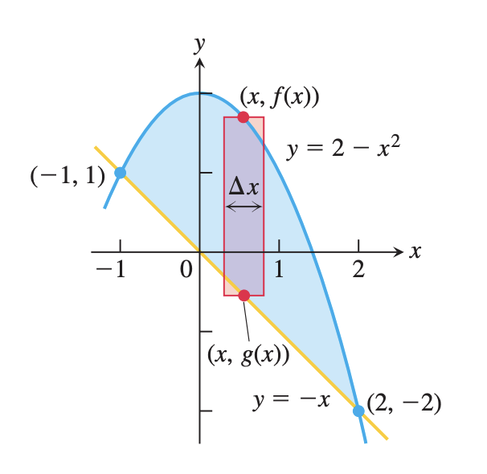
  
图 5.28　例 5 的区域及一个典型的近似矩形。

**解** 先画出两条曲线，如图 5.28 所示。积分限可由 $y=2-x^2$ 与 $y=-x$ 的交点确定。联立两式：

$$
\begin{aligned}
2-x^2&=-x,\\
x^2-x-2&=0,\\
(x+1)(x-2)&=0,
\end{aligned}
$$

所以交点的横坐标为 $x=-1$ 与 $x=2$。在这一区间内，抛物线位于直线上方，因此

$$
\begin{aligned}
A
&=\int_{-1}^{2}[(2-x^2)-(-x)]\,dx\\
&=\int_{-1}^{2}(2+x-x^2)\,dx\\
&=\left[2x+\frac{x^2}{2}-\frac{x^3}{3}\right]_{-1}^{2}\\
&=\left(4+\frac42-\frac83\right)
-\left(-2+\frac12+\frac13\right)
=\frac92.
\end{aligned}
$$

若区域的某条边界在一个或多个点处改变公式，就要在这些点把区域分成若干子区域，并在每个子区域上分别使用曲线间面积公式。

**例 6**　求第一象限内由 $y=\sqrt{x}$ 从上方围住、由 $x$ 轴和直线 $y=x-2$ 从下方围住的区域面积。

  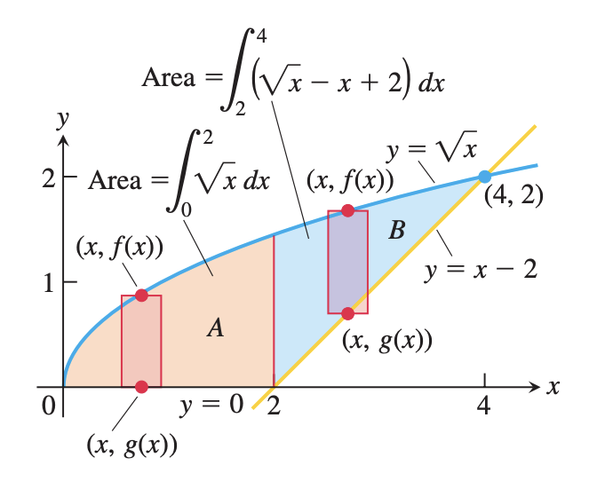
  
图 5.29　当边界曲线的公式发生改变时，面积积分要相应拆成若干积分。

**解** 图 5.29 表明，上边界始终是 $f(x)=\sqrt{x}$。下边界在 $0\le x\le2$ 上为 $g(x)=0$，在 $2\le x\le4$ 上为 $g(x)=x-2$；两个公式在 $x=2$ 处给出相同值。因此在 $x=2$ 处分成子区域 $A$ 与 $B$。

区域 $A$ 的积分限是 $a=0$、$b=2$。区域 $B$ 的左端点是 $a=2$。为了求它的右端点，联立 $y=\sqrt{x}$ 与 $y=x-2$。两边平方，得到

$$
x=(x-2)^2=x^2-4x+4,
$$

整理并因式分解：

$$
\begin{aligned}
x^2-5x+4&=0,\\
(x-1)(x-4)&=0,\\
x&=1,\ 4.
\end{aligned}
$$

其中只有 $x=4$ 满足原方程 $\sqrt{x}=x-2$；$x=1$ 是平方引入的增根，所以区域 $B$ 的右端点是 $b=4$。

两个子区间上的“上方函数减下方函数”分别为

$$
\begin{aligned}
0\le x\le2:&\qquad f(x)-g(x)=\sqrt{x}-0=\sqrt{x},\\
2\le x\le4:&\qquad f(x)-g(x)=\sqrt{x}-(x-2)=\sqrt{x}-x+2.
\end{aligned}
$$

把子区域 $A$ 与 $B$ 的面积相加：

$$
\begin{aligned}
\text{总面积}
&=\int_0^2\sqrt{x}\,dx
+\int_2^4(\sqrt{x}-x+2)\,dx\\
&=\left[\frac23x^{3/2}\right]_0^2
+\left[\frac23x^{3/2}-\frac{x^2}{2}+2x\right]_2^4\\
&=\frac23(2)^{3/2}-0
+\left(\frac23(4)^{3/2}-8+8\right)
-\left(\frac23(2)^{3/2}-2+4\right)\\
&=\frac23(8)-2
=\frac{10}{3}.
\end{aligned}
$$

### 关于 $y$ 的积分

若区域的边界曲线用 $y$ 的函数表示更方便，近似矩形应取为水平矩形，而不是竖直矩形；基本公式中的 $x$ 也相应换成 $y$。下面三种区域都使用“右边界减左边界”作为水平矩形的长度。

  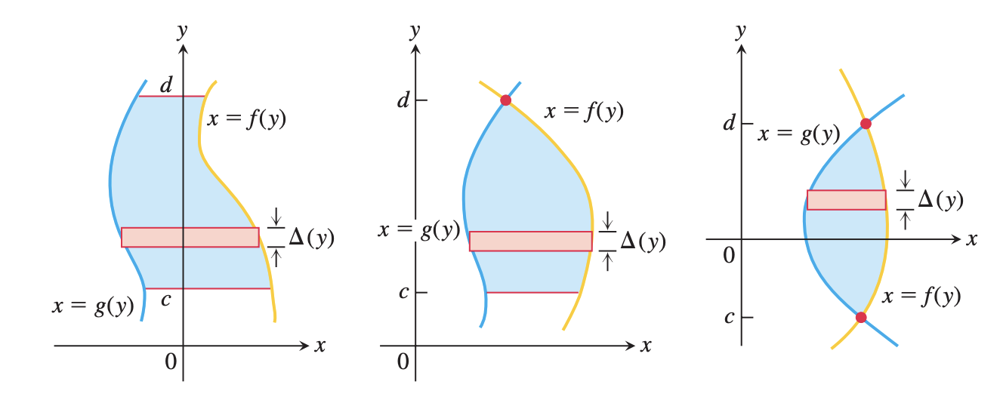

若右边界为 $x=f(y)$，左边界为 $x=g(y)$，且 $c\le y\le d$，则

$$
A=\int_c^d[f(y)-g(y)]\,dy.
$$

这里 $f$ 始终表示右边界，$g$ 表示左边界，所以 $f(y)-g(y)$ 非负。

**例 7**　改为关于 $y$ 积分，求例 6 中区域的面积。

  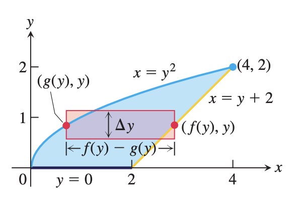
  
图 5.30　若关于 $x$ 积分，需要两个积分；若关于 $y$ 积分，只需要一个积分。

**解** 先画出区域，并根据 $y$ 值区间的分割画一个典型的水平矩形，如图 5.30 所示。区域的右边界是直线

$$
x=y+2,
$$

所以 $f(y)=y+2$；左边界由 $y=\sqrt{x}$ 改写为

$$
x=y^2,
$$

所以 $g(y)=y^2$。积分下限是 $y=0$。为了求上限，联立 $x=y+2$ 与 $x=y^2$：

$$
\begin{aligned}
y+2&=y^2,\\
y^2-y-2&=0,\\
(y+1)(y-2)&=0,\\
y&=-1,\ 2.
\end{aligned}
$$

$y=-1$ 对应 $x$ 轴下方的交点，因此本区域的上限为 $y=2$。面积为

$$
\begin{aligned}
A
&=\int_0^2[(y+2)-y^2]\,dy\\
&=\int_0^2(2+y-y^2)\,dy\\
&=\left[2y+\frac{y^2}{2}-\frac{y^3}{3}\right]_0^2\\
&=4+\frac42-\frac83
=\frac{10}{3}.
\end{aligned}
$$

这个结果与例 6 相同，但计算量更小。

还可以把积分与初等几何结合起来进一步简化。由图 5.31，所求面积等于 $0\le x\le4$ 上曲线 $y=\sqrt{x}$ 下方的面积，减去底和高都为 $2$ 的等腰三角形面积：

  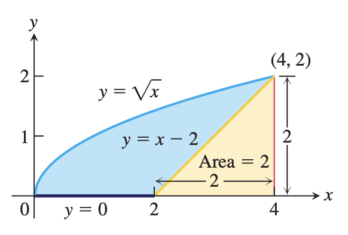
  
图 5.31　蓝色区域面积等于曲线 $y=\sqrt{x}$ 下方的面积减去三角形面积。

$$
\begin{aligned}
\text{面积}
&=\int_0^4\sqrt{x}\,dx-\frac12(2)(2)\\
&=\left.\frac23x^{3/2}\right|_0^4-2\\
&=\frac23(8)-0-2
=\frac{10}{3}.
\end{aligned}
$$
