<!--
来源：Thomas' Calculus，Chapter 7: Integrals and Transcendental Functions，PDF 页 434-465（印刷页 420-451）。
整理规范：依据 PDF转Markdown校对要求.md。
说明：本文件为第 7 章正文中文整理稿，不含 Exercises 7.1-7.4 及章末练习。
-->

# 第7章 积分与超越函数

概述 到目前为止，我们对对数函数和指数函数的处理相当非正式，主要借助直觉和图像来说明它们的意义，并解释它们的一些性质。在本章中，我们用严格的解析方法给出这些函数的定义和性质，并研究大量有它们参与的应用问题。我们还将引入双曲函数及其反函数，以及它们在积分和悬链线中的应用。和三角函数一样，所有这些函数都属于超越函数。

## 7.1 定义为积分的对数

在第 1 章中，我们把自然对数函数 $\ln x$ 引入为指数函数 $e^x$ 的反函数。函数 $e^x$ 是一般指数函数族 $a^x,\ a>0$ 中的那个函数，它的图像穿过 $y$ 轴时斜率为 1。不过，当时我们是根据它在有理数 $x$ 处的图像来直观地介绍函数 $a^x$ 的。

本节中，我们从完全不同的角度重新建立对数函数和指数函数的理论。这里我们用解析方式定义这些函数，并重新得到它们的行为。首先，我们用微积分基本定理把自然对数函数 $\ln x$ 定义为一个积分。随后很快发展它的性质，包括前面见过的代数性质、几何性质和解析性质。接着，我们把函数 $e^x$ 引入为 $\ln x$ 的反函数，并建立它前面出现过的性质。把 $\ln x$ 定义为一个积分，再把 $e^x$ 定义为它的反函数，是一种间接的方法。它一开始也许显得奇怪，但它给出了一个优美而有力的途径，用来获得并验证对数函数和指数函数的关键性质。

### 自然对数函数的定义

正数 $x$ 的自然对数写作 $\ln x$，它是一个积分的值。这个积分来自我们在第 5 章得到的早期结果。

  

    
定义

    

      自然对数是由下式给出的函数：
      $$
      \ln x=\int_1^x\frac{1}{t}\,dt,\qquad x>0.
      $$
    

  

这个函数在 $x\le 0$ 时没有定义。由定积分的零宽区间法则，我们还得到

$$
\ln 1=\int_1^1\frac{1}{t}\,dt=0.
$$

  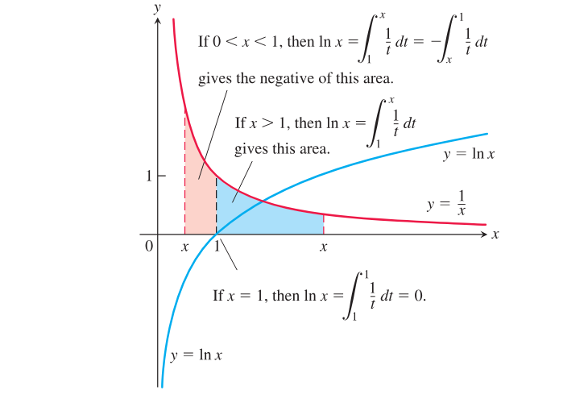
  
图 7.1 $y=\ln x$ 的图像及其与函数 $y=1/x,\ x>0$ 的关系。当 $x$ 从 1 向右移动时，对数图像升到 $x$ 轴上方；当 $x$ 从 1 向左移动时，它落到轴的下方。

注意，图 7.1 中我们画出的是 $y=1/x$ 的图像，但在积分中使用的是 $y=1/t$。如果处处使用 $x$，就会写成

$$
\ln x=\int_1^x\frac{1}{x}\,dx,
$$

其中 $x$ 同时表示两种不同的东西。因此，我们把积分变量改为 $t$。

利用矩形来获得第 5.1 节中那样的面积有限近似，我们可以近似函数 $\ln x$ 的值。表 7.1 给出若干数值。在 $x=2$ 和 $x=3$ 之间有一个重要的数，它的自然对数等于 1。这个数现在定义如下；它存在，是因为 $\ln x$ 是连续函数，因而在区间 $[2,3]$ 上满足介值定理。

  

    
定义

    

      数 $e$ 是自然对数定义域中满足下式的数：
      $$
      \ln(e)=\int_1^e\frac{1}{t}\,dt=1.
      $$
    

  

从几何上解释，数 $e$ 对应于 $x$ 轴上的点，使得曲线 $y=1/t$ 下方、区间 $[1,e]$ 上方的面积等于单位正方形的面积。也就是说，在图 7.1 中，当 $x=e$ 时，蓝色阴影区域的面积为 1 平方单位。后面我们还会看到，这正是我们以前遇到的同一个数 $e\approx 2.718281828$。

**表 7.1 $\ln x$ 的典型两位小数值**

| $x$ | $\ln x$ |
| --- | --- |
| $0$ | 未定义 |
| $0.05$ | $-3.00$ |
| $0.5$ | $-0.69$ |
| $1$ | $0$ |
| $2$ | $0.69$ |
| $3$ | $1.10$ |
| $4$ | $1.39$ |
| $10$ | $2.30$ |

### $y=\ln x$ 的导数

由微积分基本定理第一部分（第 5.4 节），

$$
\frac{d}{dx}\ln x=\frac{d}{dx}\int_1^x\frac{1}{t}\,dt=\frac{1}{x}.
$$

对每个正数 $x$，我们有

$$
\frac{d}{dx}\ln x=\frac{1}{x}. \tag{1}
$$

因此，函数 $y=\ln x$ 是初值问题 $dy/dx=1/x,\ x>0,\ y(1)=0$ 的一个解。注意，它的导数总为正。

如果 $u$ 是 $x$ 的可微函数，且取值为正，使得 $\ln u$ 有定义，那么由链式法则得到

$$
\frac{d}{dx}\ln u=\frac{1}{u}\frac{du}{dx},\qquad u>0. \tag{2}
$$

$\ln|x|$ 的导数可以像第 3.8 节例 3(c) 那样求出，得到

$$
\frac{d}{dx}\ln|x|=\frac{1}{x},\qquad x\ne 0. \tag{3}
$$

另外，如果 $b$ 是常数且 $bx>0$，式 (2) 给出

$$
\frac{d}{dx}\ln bx=\frac{1}{bx}\frac{d}{dx}(bx)=\frac{1}{bx}(b)=\frac{1}{x}.
$$

### $\ln x$ 的图像和值域

导数 $d(\ln x)/dx=1/x$ 在 $x>0$ 时为正，所以 $\ln x$ 是 $x$ 的增函数。二阶导数 $-1/x^2$ 为负，所以 $\ln x$ 的图像向下凹（见图 7.2a）。

  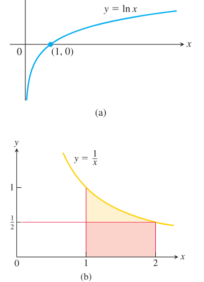
  
图 7.2 (a) 自然对数的图像。(b) 高为 $y=1/2$ 的矩形位于区间 $1\le x\le 2$ 上的曲线 $y=1/x$ 下方。

函数 $\ln x$ 具有下列熟悉的代数性质，我们在第 1.6 节中陈述过它们。在第 4.2 节中，我们说明这些性质是均值定理推论 2 的结果，因此这些推导仍然适用。

$$
\begin{array}{ll}
1.\ \ln bx=\ln b+\ln x, & 2.\ \ln\dfrac{b}{x}=\ln b-\ln x,\\[0.8em]
3.\ \ln\dfrac{1}{x}=-\ln x, & 4.\ \ln x^r=r\ln x,\quad r\text{ 为有理数}.
\end{array}
$$

我们可以通过考虑曲线 $y=1/x$ 下方、区间 $[1,2]$ 上方的面积来估计 $\ln 2$ 的值。在图 7.2(b) 中，区间 $[1,2]$ 上高为 $1/2$ 的矩形位于图像下方。因此曲线下方的面积，也就是 $\ln 2$，大于矩形面积 $1/2$。所以 $\ln 2>1/2$。由此可得

$$
\ln(2^n)=n\ln 2>n\left(\frac{1}{2}\right)=\frac{n}{2}.
$$

这个结果表明，当 $n\to\infty$ 时，$\ln(2^n)\to\infty$。因为 $\ln x$ 是增函数，所以

$$
\lim_{x\to\infty}\ln x=\infty.
$$

我们还得到

$$
\lim_{x\to 0^+}\ln x
=\lim_{t\to\infty}\ln\left(\frac{1}{t}\right)
=\lim_{t\to\infty}(-\ln t)
=-\infty.
$$

我们只在 $x>0$ 时定义了 $\ln x$，所以 $\ln x$ 的定义域是正实数集。上面的讨论和介值定理表明，它的值域是整个实数轴，从而给出图 7.2(a) 中熟悉的 $y=\ln x$ 图像。

### 积分 $\int (1/u)\,du$

式 (3) 导出下面的积分公式。如果 $u$ 是一个永不为零的可微函数，那么

$$
\int\frac{1}{u}\,du=\ln|u|+C. \tag{4}
$$

式 (4) 适用于 $1/u$ 的定义域中的任意区间，即 $u\ne 0$ 的点上。它说明某一类形式的积分会产生对数。如果 $u=f(x)$，则 $du=f'(x)\,dx$，并且只要 $f(x)$ 是永不为零的可微函数，就有

$$
\int \frac{f'(x)}{f(x)}\,dx=\ln|f(x)|+C.
$$

**例 1** 这里我们识别一个 $\displaystyle \frac{du}{u}$ 形式的积分。

**(a)** 

$$
\int\frac{2x}{x^2+1}\,dx
=\int\frac{du}{u}
=\ln|u|+C
=\ln(x^2+1)+C,
$$

其中 $u=x^2+1$，$du=2x\,dx$。由于 $x^2+1>0$，绝对值符号可以省去。

**(b)** 

$$
\int\tan x\,dx
=\int\frac{\sin x}{\cos x}\,dx
=-\int\frac{du}{u}
=-\ln|u|+C
=-\ln|\cos x|+C,
$$

其中 $u=\cos x$，$du=-\sin x\,dx$。这个结果也常写作

$$
\int\tan x\,dx=\ln|\sec x|+C.
$$

**(c)** 

$$
\int\frac{dx}{x\ln x}
=\int\frac{du}{u}
=\ln|u|+C
=\ln|\ln x|+C,
$$

其中 $u=\ln x$，$du=dx/x$。这个公式在 $x>0$ 且 $x\ne 1$ 的区间上成立。

### 自然指数函数

函数 $y=\ln x$ 是严格递增的，并且它把区间 $(0,\infty)$ 映到整个实数轴上。因此它有反函数。这个反函数记为 $\ln^{-1}x$，也记为 $\exp x$。图 7.3 显示了 $y=\ln x$ 与它的反函数的图像。

  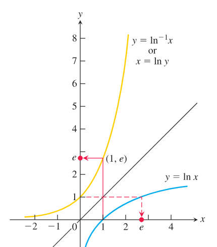
  
图 7.3 $y=\ln x$ 与 $y=\ln^{-1}x=\exp x$ 的图像。数 $e$ 是 $\ln^{-1}1=\exp(1)$。

函数 $\ln^{-1}x$ 也记为 $\exp x$。现在我们说明 $\ln^{-1}x=\exp x$ 是以 $e$ 为底的指数函数。

数 $e$ 被定义为满足方程 $\ln(e)=1$ 的数，所以 $e=\exp(1)$。我们可以用代数方式把 $e$ 升到有理幂 $r$：

$$
e^2=e\cdot e,\qquad e^{-2}=\frac{1}{e^2},\qquad e^{1/2}=\sqrt e,\qquad e^{2/3}=\sqrt[3]{e^2},
$$

等等。由于 $e$ 为正，$e^r$ 也为正。因此 $e^r$ 有对数。取对数得到，对有理数 $r$，

$$
\ln e^r=r\ln e=r\cdot 1=r.
$$

于是把函数 $\ln^{-1}$ 作用在方程 $\ln e^r=r$ 两边，得到

$$
e^r=\exp r,\qquad r\text{ 为有理数}. \tag{5}
$$

我们还没有找到一种方法为无理数 $x$ 处的 $e^x$ 赋予精确意义。但是 $\ln^{-1}x$ 对任何 $x$ 都有意义，无论 $x$ 是有理数还是无理数。因此式 (5) 给出了一种方法，把 $e^x$ 的定义扩展到无理数 $x$。函数 $\exp x$ 对所有 $x$ 都有定义，所以我们用它给每一点处的 $e^x$ 赋值。

  

    
定义

    
对每个实数 $x$，我们把自然指数函数定义为 $e^x=\exp x$。

  

这是我们第一次给无理幂上的数的乘方以精确意义。通常指数函数写作 $e^x$ 而不是 $\exp x$。因为 $\ln x$ 和 $e^x$ 互为反函数，所以

  

    
$e^x$ 与 $\ln x$ 的反函数方程

    

      $$
      e^{\ln x}=x\quad (x>0),\qquad \ln(e^x)=x\quad (\text{所有 }x).
      $$
    

  

### $e^x$ 的导数和积分

指数函数可微，因为它是一个导数处处不为零的可微函数的反函数。我们利用第 3.8 节定理 3 以及 $\ln x$ 的导数来计算它的导数。设

$$
f(x)=\ln x,\qquad y=e^x=\ln^{-1}x=f^{-1}(x).
$$

则

$$
\begin{aligned}
\frac{dy}{dx}
&=\frac{d}{dx}(e^x)
=\frac{d}{dx}\ln^{-1}x \\
&=\frac{d}{dx}f^{-1}(x)
=\frac{1}{f'(f^{-1}(x))}
=\frac{1}{f'(e^x)}
=\frac{1}{1/e^x}
=e^x.
\end{aligned}
$$

也就是说，对 $y=e^x$，我们发现 $dy/dx=e^x$，因此自然指数函数 $e^x$ 是它自己的导数，正如第 3.3 节中所说。下一节我们会看到，具有这种性质的函数只有 $e^x$ 的常数倍。链式法则照常把这个导数结果推广为更一般的形式。如果 $u$ 是 $x$ 的任意可微函数，则

$$
\frac{d}{dx}e^u=e^u\frac{du}{dx}. \tag{6}
$$

由于 $e^x>0$，它的导数也处处为正，所以它在所有 $x$ 上都是递增且连续的函数，并且

$$
\lim_{x\to-\infty}e^x=0,\qquad \lim_{x\to\infty}e^x=\infty.
$$

因此 $x$ 轴（$y=0$）是图像 $y=e^x$ 的水平渐近线（见图 7.3）。

式 (6) 也给出 $e^u$ 的不定积分：

$$
\int e^u\,du=e^u+C.
$$

如果 $f(x)=e^x$，则由式 (6)，$f'(0)=e^0=1$。也就是说，指数函数 $e^x$ 在 $x=0$ 穿过 $y$ 轴时斜率为 1。这与第 3.3 节中我们对自然指数函数的说法一致。

### 指数法则

虽然 $e^x$ 是以看似绕远的方式定义为 $\ln x$ 的反函数，但它服从代数中熟悉的指数法则。定理 1 表明，这些法则是 $\ln x$ 与 $e^x$ 的定义的结果。我们在第 4.2 节证明过这些法则；由于证明基于 $\ln x$ 与 $e^x$ 的反函数关系，所以在这里仍然有效。

  

    
定理 1  指数法则

    

      如果 $x_1$、$x_2$ 是任意实数，则
      $$
      e^{x_1}e^{x_2}=e^{x_1+x_2},\qquad
      \frac{e^{x_1}}{e^{x_2}}=e^{x_1-x_2},\qquad
      (e^{x_1})^{x_2}=e^{x_1x_2}.
      $$
    

  

### 一般指数函数与幂函数

如果 $a>0$，我们把以 $a$ 为底的指数函数定义为

$$
a^x=e^{x\ln a}.
$$

当 $a=e$ 时，这个定义给出 $a^x=e^{x\ln e}=e^x$。类似地，一般幂函数 $f(x)=x^r$ 定义为

$$
x^r=e^{r\ln x},\qquad x>0,
$$

其中 $r$ 可以是任意实数，有理或无理。

定理 1 对 $a^x$ 也有效。例如，

$$
a^{x_1}a^{x_2}
=e^{x_1\ln a}e^{x_2\ln a}
=e^{(x_1+x_2)\ln a}
=a^{x_1+x_2}.
$$

由定义和链式法则，我们得到

$$
\frac{d}{dx}a^x=\frac{d}{dx}e^{x\ln a}=e^{x\ln a}\ln a=a^x\ln a,
$$

以及

$$
\int a^x\,dx=\frac{a^x}{\ln a}+C,\qquad a>0,\ a\ne 1.
$$

一般幂函数的导数也从这个定义推出：

$$
\frac{d}{dx}x^r
=\frac{d}{dx}e^{r\ln x}
=e^{r\ln x}\frac{r}{x}
=x^r\frac{r}{x}
=rx^{r-1}.
$$

这给出了幂法则对任意实数 $r$ 的证明。

### 一般对数函数

函数 $a^x$ 的图像可以把 $y=\log_a x$ 的图像关于 $45^\circ$ 直线 $y=x$ 反射得到（图 7.4）。当 $a=e$ 时，$\log_e x$ 是 $e^x$ 的反函数，也就是 $\ln x$。由于 $\log_a x$ 与 $a^x$ 互为反函数，把它们按任一顺序复合都会得到恒等函数。

  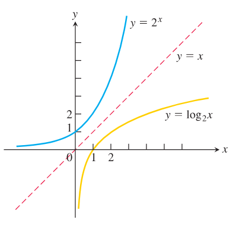
  
图 7.4 $2^x$ 及其反函数 $\log_2 x$ 的图像。

  

    
$a^x$ 与 $\log_a x$ 的反函数方程

    

      $$
      a^{\log_a x}=x\quad (x>0),\qquad \log_a(a^x)=x\quad (\text{所有 }x).
      $$
    

  

如第 1.6 节所述，函数 $\log_a x$ 只是 $\ln x$ 的一个数值倍数。我们可由下面的推导看出这一点：

$$
\begin{aligned}
y&=\log_a x && \text{定义 } y,\\
a^y&=x && \text{等价方程},\\
\ln a^y&=\ln x && \text{两边取自然对数},\\
y\ln a&=\ln x && \text{自然对数法则 4},\\
y&=\frac{\ln x}{\ln a} && \text{解出 }y,\\
\log_a x&=\frac{\ln x}{\ln a} && \text{代回 }y.
\end{aligned}
$$

于是很容易看出 $\log_a x$ 满足的运算法则与 $\ln x$ 的法则相同。这些法则列在表 7.2 中，可通过把自然对数函数的相应法则除以 $\ln a$ 来证明。例如，

$$
\begin{aligned}
\ln xy&=\ln x+\ln y,\\
\frac{\ln xy}{\ln a}&=\frac{\ln x}{\ln a}+\frac{\ln y}{\ln a},\\
\log_a xy&=\log_a x+\log_a y.
\end{aligned}
$$

**表 7.2 以 $a$ 为底的对数法则**

对任意 $x>0$ 和 $y>0$，

$$
\begin{array}{ll}
1.\ \text{乘积法则：} & \log_a xy=\log_a x+\log_a y,\\[0.5em]
2.\ \text{商法则：} & \log_a\dfrac{x}{y}=\log_a x-\log_a y,\\[0.8em]
3.\ \text{倒数法则：} & \log_a\dfrac{1}{y}=-\log_a y,\\[0.8em]
4.\ \text{幂法则：} & \log_a x^y=y\log_a x.
\end{array}
$$

### 涉及 $\log_a x$ 的导数和积分

为了求涉及以 $a$ 为底的对数的导数或积分，我们把它们转化为自然对数。如果 $u$ 是 $x$ 的正值可微函数，则

$$
\frac{d}{dx}(\log_a u)
=\frac{d}{dx}\left(\frac{\ln u}{\ln a}\right)
=\frac{1}{\ln a}\frac{d}{dx}(\ln u)
=\frac{1}{\ln a}\cdot\frac{1}{u}\frac{du}{dx}.
$$

因此

$$
\frac{d}{dx}(\log_a u)=\frac{1}{\ln a}\cdot\frac{1}{u}\frac{du}{dx}.
$$

**例 2** 我们说明导数和积分结果。

**(a)**

$$
\frac{d}{dx}\log_{10}(3x+1)
=\frac{1}{\ln 10}\cdot\frac{1}{3x+1}\frac{d}{dx}(3x+1)
=\frac{3}{(\ln 10)(3x+1)}.
$$

**(b)**

$$
\int \frac{dx}{x\log_2 x}
=\int \frac{(\ln 2)\,dx}{x\ln x}
=\ln 2\int\frac{du}{u}
=\ln 2\,\ln|\ln x|+C,
$$

其中 $u=\ln x$。

## 7.2 指数变化和可分离微分方程

指数函数会随着自变量的变化而非常迅速地增加或减少。它们描述许多自然和工业情境中的增长或衰减。以这些函数为基础的模型种类很多，这部分解释了它们的重要性。我们现在考察导致这种指数变化的基本比例假设。

### 指数变化

在给许多现实世界情境建模时，一个量 $y$ 会以与它在给定时刻 $t$ 的大小成正比的速率增加或减少。这类量的例子包括一个群体的规模、正在衰变的放射性材料的量，以及热物体与其周围介质之间的温度差。这样的量称为经历指数变化。

如果把时刻 $t=0$ 时存在的量记为 $y_0$，那么可以通过解下面的初值问题，把 $y$ 表示为 $t$ 的函数：

$$
\text{微分方程：}\qquad \frac{dy}{dt}=ky \tag{1a}
$$

$$
\text{初始条件：}\qquad y=y_0\quad \text{当 }t=0. \tag{1b}
$$

如果 $y$ 为正且在增加，那么 $k$ 为正；我们用式 (1a) 表示增长率与已经积累的量成正比。如果 $y$ 为正且在减少，那么 $k$ 为负；我们用式 (1a) 表示衰减率与仍然剩下的量成正比。

如果 $y_0=0$，我们立即看出常数函数 $y=0$ 是式 (1a) 的一个解。为了求非零解，我们用 $y$ 除式 (1a)：

$$
\frac{1}{y}\frac{dy}{dt}=k,\qquad y\ne 0.
$$

$$
\int\frac{1}{y}\frac{dy}{dt}\,dt=\int k\,dt
$$

$$
\ln|y|=kt+C
$$

$$
|y|=e^{kt+C}
$$

$$
|y|=e^C e^{kt}
$$

$$
y=\pm e^C e^{kt}
$$

$$
y=Ae^{kt}.
$$

通过允许 $A$ 除了所有可能的 $\pm e^C$ 之外还取值 $0$，我们可以把解 $y=0$ 也包括在公式中。

我们通过在 $y=y_0$ 且 $t=0$ 时解出 $A$，来求初值问题中的 $A$：

$$
y_0=Ae^{k\cdot 0}=A.
$$

  

    

      初值问题
      $$
      \frac{dy}{dt}=ky,\qquad y(0)=y_0
      $$
      的解为
      $$
      y=y_0e^{kt}. \tag{2}
      $$
    

  

按这种方式变化的量，在 $k>0$ 时称为经历指数增长，在 $k<0$ 时称为经历指数衰减。数 $k$ 称为这种变化的速率常数（见图 7.5）。

  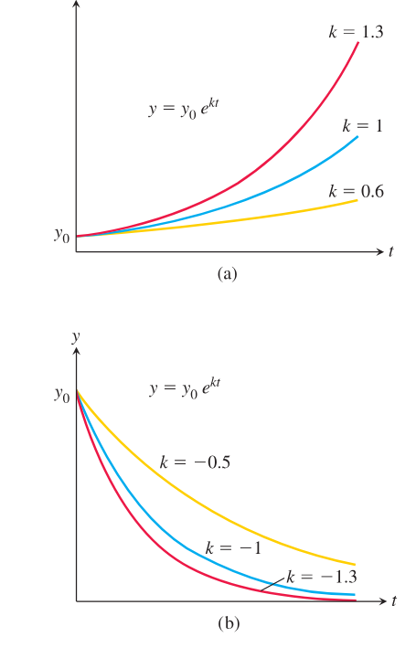
  
图 7.5 (a) 指数增长和 (b) 指数衰减的图像。随着 $|k|$ 增大，增长（$k>0$）或衰减（$k<0$）加剧。

式 (2) 的推导还表明，唯一以自身为导数的函数（也就是 $k=1$）是指数函数的常数倍。

在给出指数变化的若干例子之前，我们先考察用于推导它的过程。

### 可分离微分方程

指数变化由形如 $dy/dx=ky$ 的微分方程建模，其中 $k$ 是某个非零常数。更一般地，假设我们有如下形式的微分方程：

$$
\frac{dy}{dx}=f(x,y), \tag{3}
$$

其中 $f$ 是自变量和因变量二者的函数。方程的一个解，是在某个 $x$ 值区间（也许无限）上定义的可微函数 $y=y(x)$，使得在该区间上有

$$
\frac{d}{dx}y(x)=f(x,y(x)).
$$

也就是说，当把 $y(x)$ 及其导数 $y'(x)$ 代入微分方程时，得到的方程对解区间中的所有 $x$ 都为真。通解是包含所有可能解的一个解，并且它总含有一个任意常数。

如果 $f$ 可以表示为一个 $x$ 的函数与一个 $y$ 的函数的乘积，则式 (3) 是可分离的。微分方程于是具有形式

$$
\frac{dy}{dx}=g(x)H(y),
$$

其中 $g$ 是 $x$ 的函数，$H$ 是 $y$ 的函数。当我们把这个方程改写成

$$
\frac{dy}{dx}=\frac{g(x)}{h(y)},\qquad H(y)=\frac{1}{h(y)}
$$

时，它的微分形式允许我们把所有含 $y$ 的项和 $dy$ 收集到一边，把所有含 $x$ 的项和 $dx$ 收集到另一边：

$$
h(y)\,dy=g(x)\,dx.
$$

现在我们只需对方程两边积分：

$$
\int h(y)\,dy=\int g(x)\,dx. \tag{4}
$$

完成积分后，我们得到把 $y$ 作为 $x$ 的隐函数定义的解。

式 (4) 中可以直接对两边积分的理由，基于代换法则（第 5.5 节）：

$$
\begin{aligned}
\int h(y)\,dy
&=\int h(y(x))\frac{dy}{dx}\,dx\\
&=\int h(y(x))\frac{g(x)}{h(y(x))}\,dx\\
&=\int g(x)\,dx.
\end{aligned}
$$

**例 1** 解微分方程

$$
\frac{dy}{dx}=(1+y)e^x,\qquad y>-1.
$$

**解：** 因为当 $y>-1$ 时 $1+y$ 永不为零，所以可以通过分离变量来解这个方程。

$$
\frac{dy}{dx}=(1+y)e^x
$$

$$
dy=(1+y)e^x\,dx
$$

把 $dy/dx$ 看作微分的商，并在两边乘以 $dx$。

$$
\frac{dy}{1+y}=e^x\,dx
$$

除以 $1+y$。

$$
\int\frac{dy}{1+y}=\int e^x\,dx
$$

对两边积分。

$$
\ln(1+y)=e^x+C
$$

$C$ 表示积分常数合并后的结果。最后一个方程给出 $y$ 作为 $x$ 的隐函数。

**例 2** 解方程

$$
y(x+1)\frac{dy}{dx}=x(y^2+1).
$$

**解：** 我们改写成微分形式，分离变量并积分：

$$
y(x+1)\,dy=x(y^2+1)\,dx
$$

$$
\frac{y\,dy}{y^2+1}=\frac{x\,dx}{x+1},\qquad x\ne -1
$$

$$
\int\frac{y\,dy}{1+y^2}=\int\left(1-\frac{1}{x+1}\right)\,dx
$$

这里把 $x$ 除以 $x+1$。于是

$$
\frac12\ln(1+y^2)=x-\ln|x+1|+C.
$$

最后这个方程给出 $y$ 作为 $x$ 的隐函数的解。

初值问题

$$
\frac{dy}{dt}=ky,\qquad y(0)=y_0
$$

包含一个可分离微分方程，而解 $y=y_0e^{kt}$ 表示指数变化。现在我们给出这类变化的若干例子。

### 无限制人口增长

严格地说，一个群体中个体的数量（例如人、植物、动物或细菌）是时间的不连续函数，因为它取离散值。然而，当个体数量变得足够大时，群体可以用连续函数近似。在许多情形下，近似函数可微也是合理的假设，使得我们可以用微积分来建模并预测群体规模。

如果我们假设繁殖个体的比例保持不变，并假设生育率为常数，那么在任意时刻 $t$，出生率与现有个体数 $y(t)$ 成正比。我们再假设该群体的死亡率稳定，并且与 $y(t)$ 成正比。如果进一步忽略迁出和迁入，那么增长率 $dy/dt$ 就是出生率减去死亡率，也就是在这些假设下两个比例量的差。换句话说，$dy/dt=ky$，所以 $y=y_0e^{kt}$，其中 $y_0$ 是时刻 $t=0$ 的群体规模。和所有类型的增长一样，周围环境可能施加限制，但这里我们不讨论这些限制。（我们将在第 9.4 节处理一个施加这种限制的模型。）当 $k$ 为正时，比例关系 $dy/dt=ky$ 建模无限制人口增长（见图 7.6）。

  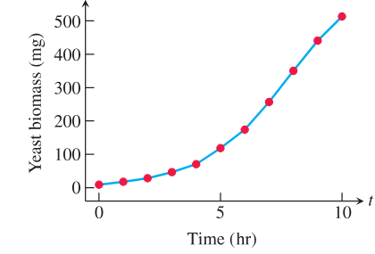
  
图 7.6 根据表 7.3 的数据得到的酵母种群在 10 小时内的增长图。

**表 7.3 酵母种群**

| 时间（小时） | 酵母生物量（mg） |
| --- | --- |
| $0$ | $9.6$ |
| $1$ | $18.3$ |
| $2$ | $29.0$ |
| $3$ | $47.2$ |
| $4$ | $71.1$ |
| $5$ | $119.1$ |
| $6$ | $174.6$ |
| $7$ | $257.3$ |
| $8$ | $350.7$ |
| $9$ | $441.0$ |
| $10$ | $513.3$ |

**例 3** 某实验中一个酵母培养物的生物量最初为 29 克。30 分钟后质量为 37 克。假设无限制人口增长方程在质量低于 100 克时能很好地描述酵母的增长，那么质量从初值翻倍需要多长时间？

**解：** 设 $y(t)$ 为 $t$ 分钟后的酵母生物量。我们使用无限制人口增长的指数增长模型 $dy/dt=ky$，其解为 $y=y_0e^{kt}$。

我们有 $y_0=y(0)=29$。又已知

$$
y(30)=29e^{k(30)}=37.
$$

解这个方程求 $k$，得

$$
e^{k(30)}=\frac{37}{29}
$$

$$
30k=\ln\left(\frac{37}{29}\right)
$$

$$
k=\frac{1}{30}\ln\left(\frac{37}{29}\right)\approx 0.008118.
$$

于是 $t$ 分钟后酵母质量（克）由方程给出：

$$
y=29e^{(0.008118)t}.
$$

为了解题，我们求使 $y(t)=58$ 的时间 $t$，这正是初始量的两倍。

$$
29e^{(0.008118)t}=58
$$

$$
(0.008118)t=\ln\left(\frac{58}{29}\right)
$$

$$
t=\frac{\ln 2}{0.008118}\approx 85.38
$$

酵母种群大约需要 85 分钟翻倍。

下一个例子中，我们建模给定人群中感染某种疾病、而这种疾病正在从人群中被消除的人数。这里比例常数 $k$ 为负，模型描述感染个体数的指数衰减。

**例 4** 一个描述疾病在得到适当治疗时怎样消失的模型假设，感染人数变化的速率 $dy/dt$ 与感染人数 $y$ 成正比。治愈人数与感染疾病的人数 $y$ 成正比。假设在任意给定年份中，某种疾病的病例数减少 $20\%$。如果今天有 $10,000$ 个病例，要把病例数减少到 $1000$ 需要多少年？

**解：** 我们使用方程 $y=y_0e^{kt}$。需要求三件事：$y_0$ 的值、$k$ 的值，以及当 $y=1000$ 时的时间 $t$。

$y_0$ 的值。我们可以自由选择从哪里开始计时。如果从今天开始计时，那么当 $t=0$ 时 $y=10,000$，所以 $y_0=10,000$。我们的方程现在是

$$
y=10,000e^{kt}. \tag{5}
$$

$k$ 的值。当 $t=1$ 年时，病例数将是现在的 $80\%$，即 $8000$。因此

$$
8000=10,000e^{k(1)}
$$

式 (5) 中 $t=1$ 且 $y=8000$。

$$
e^k=0.8
$$

$$
\ln(e^k)=\ln 0.8
$$

两边取对数，所以

$$
k=\ln 0.8<0.
$$

这里 $\ln 0.8\approx -0.223$。

在任意给定时刻 $t$，

$$
y=10,000e^{(\ln 0.8)t}. \tag{6}
$$

使 $y=1000$ 的 $t$ 的值。我们在式 (6) 中令 $y=1000$ 并解 $t$：

$$
1000=10,000e^{(\ln 0.8)t}
$$

$$
e^{(\ln 0.8)t}=0.1
$$

$$
(\ln 0.8)t=\ln 0.1
$$

两边取对数，得到

$$
t=\frac{\ln 0.1}{\ln 0.8}\approx 10.32\text{ 年}.
$$

把病例数减少到 $1000$ 需要略多于 10 年（见图 7.7）。

  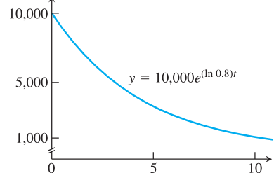
  
图 7.7 感染某种疾病的人数图像表现为指数衰减（例 4）。

### 放射性

有些原子不稳定，会自发地发出质量或辐射。这个过程称为放射性衰变，原子会自发经历这种过程的元素称为放射性元素。有时，一个原子在这种放射性过程中发出一部分质量后，剩余部分会重新形成某种新元素的原子。例如，放射性碳-14 衰变为氮；镭经过若干中间放射性步骤衰变为铅。

实验表明，在任意给定时刻，放射性元素衰变的速率（以单位时间内改变的原子核数来衡量）近似与现存放射性原子核的数量成正比。因此，放射性元素的衰变由方程 $dy/dt=-ky,\ k>0$ 描述。按惯例使用 $-k$ 且 $k>0$，是为了强调 $y$ 在减少。如果 $y_0$ 是时刻零存在的放射性原子核数，那么任意较后时刻 $t$ 仍然存在的数量为

$$
y=y_0e^{-kt},\qquad k>0.
$$

旁注：对氡-222 气体，$t$ 以天计量，$k=0.18$。对镭-226，$t$ 以年计量，$k=4.3\times 10^{-4}$；它曾被涂在钟表表盘上，使它们在夜间发光，这是一种危险的做法。

在第 1.6 节中，我们把放射性元素的半衰期定义为样品中现存放射性原子核衰变掉一半所需的时间。一个有趣的事实是，半衰期是一个常数，它不依赖样品中最初存在的放射性原子核数，而只依赖放射性物质本身。我们发现半衰期由下式给出：

$$
\text{半衰期}=\frac{\ln 2}{k}. \tag{7}
$$

例如，氡-222 的半衰期为

$$
\text{半衰期}=\frac{\ln 2}{0.18}\approx 3.9\text{ 天}.
$$

**例 5** 放射性元素的衰变有时可用于测定地球过去事件的年代。在活的生物体中，放射性碳，即碳-14，与普通碳的比值在该生物一生中保持相当稳定，近似等于当时该生物所处大气中的比值。然而，在生物死亡后，不再摄入新的碳，生物遗骸中碳-14 的比例会随着碳-14 衰变而减少。

做碳-14 年代测定的科学家通常使用 $5730$ 年作为它的半衰期。求一个样本的年代，其中原来存在的放射性原子核有 $10\%$ 已经衰变。

旁注：碳-14 年代测定使用 $5730$ 年的半衰期。

**解：** 我们使用衰变方程 $y=y_0e^{-kt}$。需要求两件事：$k$ 的值，以及当 $y$ 为 $0.9y_0$ 时的 $t$ 值（$90\%$ 的放射性原子核仍然存在）。也就是说，求满足 $y_0e^{-kt}=0.9y_0$，即 $e^{-kt}=0.9$ 的 $t$。

$k$ 的值。我们使用半衰期公式 (7)：

$$
k=\frac{\ln 2}{\text{半衰期}}=\frac{\ln 2}{5730}\quad (\text{约为 }1.2\times 10^{-4}).
$$

使 $e^{-kt}=0.9$ 的 $t$ 的值。

$$
e^{-kt}=0.9
$$

$$
e^{-(\ln 2/5730)t}=0.9
$$

$$
-\frac{\ln 2}{5730}t=\ln 0.9
$$

两边取对数，所以

$$
t=-\frac{5730\ln 0.9}{\ln 2}\approx 871\text{ 年}.
$$

这个样本大约有 871 年。

### 热传递：牛顿冷却定律

留在锡杯中的热汤会冷却到周围空气的温度。浸入一大桶水中的热银棒会冷却到周围水的温度。在这类情形中，物体温度在任意给定时刻的变化率，大致与它的温度和周围介质温度之间的差成正比。这个观察称为牛顿冷却定律，尽管它也适用于升温。

如果 $H$ 是物体在时刻 $t$ 的温度，$H_S$ 是恒定的周围温度，那么微分方程为

$$
\frac{dH}{dt}=-k(H-H_S). \tag{8}
$$

如果用 $y$ 代替 $(H-H_S)$，那么

$$
\begin{aligned}
\frac{dy}{dt}
&=\frac{d}{dt}(H-H_S)\\
&=\frac{dH}{dt}-\frac{d}{dt}(H_S)\\
&=\frac{dH}{dt}-0 && H_S\text{ 是常数}\\
&=\frac{dH}{dt}\\
&=-k(H-H_S) && \text{式 }(8)\\
&=-ky && H-H_S=y.
\end{aligned}
$$

现在我们知道 $dy/dt=-ky$ 的解是 $y=y_0e^{-kt}$，其中 $y(0)=y_0$。把 $(H-H_S)$ 代入 $y$，这说明

$$
H-H_S=(H_0-H_S)e^{-kt}, \tag{9}
$$

其中 $H_0$ 是 $t=0$ 时的温度。这个方程就是牛顿冷却定律的解。

**例 6** 一个 $98^\circ\mathrm{C}$ 的熟鸡蛋被放入 $18^\circ\mathrm{C}$ 的水槽中。5 分钟后，鸡蛋温度为 $38^\circ\mathrm{C}$。假设水没有明显变热，鸡蛋还需要多久才能达到 $20^\circ\mathrm{C}$？

**解：** 我们求鸡蛋从 $98^\circ\mathrm{C}$ 冷却到 $20^\circ\mathrm{C}$ 总共需要多长时间，再减去已经过去的 5 分钟。使用式 (9)，取 $H_S=18$、$H_0=98$，鸡蛋放入水槽后 $t$ 分钟时的温度为

$$
H=18+(98-18)e^{-kt}=18+80e^{-kt}.
$$

为了求 $k$，我们使用 $t=5$ 时 $H=38$ 这一信息：

$$
38=18+80e^{-5k}
$$

$$
e^{-5k}=\frac14
$$

$$
-5k=\ln\frac14=-\ln 4
$$

$$
k=\frac15\ln 4=0.2\ln 4\quad(\text{约为 }0.28).
$$

鸡蛋在时刻 $t$ 的温度为

$$
H=18+80e^{-(0.2\ln 4)t}.
$$

现在求 $H=20$ 时的时间 $t$：

$$
20=18+80e^{-(0.2\ln 4)t}
$$

$$
80e^{-(0.2\ln 4)t}=2
$$

$$
e^{-(0.2\ln 4)t}=\frac{1}{40}
$$

$$
-(0.2\ln 4)t=\ln\frac{1}{40}=-\ln 40
$$

$$
t=\frac{\ln 40}{0.2\ln 4}\approx 13\text{ 分钟}.
$$

鸡蛋放入水中冷却后大约 13 分钟会达到 $20^\circ\mathrm{C}$。由于达到 $38^\circ\mathrm{C}$ 已经花了 5 分钟，所以还需要大约 8 分钟才能达到 $20^\circ\mathrm{C}$。

## 7.3 双曲函数

双曲函数由指数函数组合而成。它们在微积分中的地位类似于三角函数：有简单的导数和积分公式，满足一组有用恒等式，并且在几何和物理问题中自然出现。它们的名字来自与双曲线的关系，类似于三角函数与圆的关系。

### 六个基本双曲函数

六个基本双曲函数定义如下。

**表 7.4 六个基本双曲函数**

$$
\begin{array}{lll}
\sinh x=\dfrac{e^x-e^{-x}}{2},&
\cosh x=\dfrac{e^x+e^{-x}}{2},&
\tanh x=\dfrac{\sinh x}{\cosh x}=\dfrac{e^x-e^{-x}}{e^x+e^{-x}},\\[1em]
\coth x=\dfrac{\cosh x}{\sinh x}=\dfrac{e^x+e^{-x}}{e^x-e^{-x}},&
\operatorname{sech} x=\dfrac{1}{\cosh x}=\dfrac{2}{e^x+e^{-x}},&
\operatorname{csch} x=\dfrac{1}{\sinh x}=\dfrac{2}{e^x-e^{-x}}.
\end{array}
$$

函数 $\sinh x$ 读作“hyperbolic sine of $x$”，$\cosh x$ 读作“hyperbolic cosine of $x$”，其余类似。由定义可知，$\sinh x$ 是奇函数，$\cosh x$ 是偶函数；$\cosh x$ 对所有 $x$ 都为正。

利用指数函数的代数性质，可以直接验证这些函数满足表 7.5 中的恒等式。

**表 7.5 双曲函数恒等式**

$$
\begin{array}{ll}
\cosh^2x-\sinh^2x=1, & \sinh 2x=2\sinh x\cosh x,\\[0.5em]
\cosh 2x=\cosh^2x+\sinh^2x, & \cosh^2x=\dfrac{\cosh 2x+1}{2},\\[1em]
\sinh^2x=\dfrac{\cosh 2x-1}{2}, & \tanh^2x=1-\operatorname{sech}^2x,\\[1em]
\coth^2x=1+\operatorname{csch}^2x.&
\end{array}
$$

其他恒等式可类似得到：把双曲函数的定义代入，再用代数化简。像许多标准函数一样，双曲函数及其反函数很容易用计算器求值，计算器往往有专门按键。

对任意实数 $u$，点 $(\cos u,\sin u)$ 位于单位圆 $x^2+y^2=1$ 上。因此三角函数有时称为圆函数。由于表 7.5 中第一个恒等式在把 $u$ 代入 $x$ 后给出 $\cosh^2u-\sinh^2u=1$，坐标为 $(\cosh u,\sinh u)$ 的点位于双曲线 $x^2-y^2=1$ 的右支上。双曲函数的名称正是由此而来。

双曲函数有助于求积分，我们将在第 8 章看到这一点。它们在科学和工程中也很重要。双曲余弦描述了悬挂在两个等高点之间并自由下垂的电缆或金属线的形状。圣路易斯拱门的形状是倒置的双曲余弦。双曲正切出现在恒定水深上运动的海浪速度公式中，而反双曲正切描述了狭义相对论中相对速度按爱因斯坦定律相加的方式。

### 双曲函数的导数和积分

从定义出发求导，得到下表中的公式。

**表 7.6 双曲函数的导数**

$$
\begin{array}{lll}
\dfrac{d}{dx}\sinh x=\cosh x,&
\dfrac{d}{dx}\cosh x=\sinh x,&
\dfrac{d}{dx}\tanh x=\operatorname{sech}^2x,\\[1em]
\dfrac{d}{dx}\coth x=-\operatorname{csch}^2x,&
\dfrac{d}{dx}\operatorname{sech}x=-\operatorname{sech}x\tanh x,&
\dfrac{d}{dx}\operatorname{csch}x=-\operatorname{csch}x\coth x.
\end{array}
$$

相应的积分公式为：

**表 7.7 双曲函数的积分公式**

$$
\begin{array}{lll}
\int\sinh x\,dx=\cosh x+C,&
\int\cosh x\,dx=\sinh x+C,&
\int\operatorname{sech}^2x\,dx=\tanh x+C,\\[1em]
\int\operatorname{csch}^2x\,dx=-\coth x+C,&
\int\operatorname{sech}x\tanh x\,dx=-\operatorname{sech}x+C,&
\int\operatorname{csch}x\coth x\,dx=-\operatorname{csch}x+C.
\end{array}
$$

**例 1** 我们说明导数和积分公式。

**(a)** 

$$
\frac{d}{dt}\tanh\sqrt{1+t^2}
=\operatorname{sech}^2\sqrt{1+t^2}\cdot\frac{d}{dt}\sqrt{1+t^2}
=\frac{t}{\sqrt{1+t^2}}\operatorname{sech}^2\sqrt{1+t^2}.
$$

**(b)**

$$
\int\coth 5x\,dx
=\int\frac{\cosh 5x}{\sinh 5x}\,dx
=\frac15\int\frac{du}{u}
=\frac15\ln|u|+C
=\frac15\ln|\sinh 5x|+C,
$$

其中 $u=\sinh 5x$，$du=5\cosh 5x\,dx$。

**(c)**

$$
\begin{aligned}
\int_0^1\sinh^2x\,dx
&=\int_0^1\frac{\cosh 2x-1}{2}\,dx\\
&=\frac12\left[\frac{\sinh 2x}{2}-x\right]_0^1\\
&=\frac{\sinh 2}{4}-\frac12\\
&\approx 0.40672.
\end{aligned}
$$

**(d)**

$$
\begin{aligned}
\int_0^{\ln 2}4e^x\sinh x\,dx
&=\int_0^{\ln 2}4e^x\frac{e^x-e^{-x}}{2}\,dx\\
&=\int_0^{\ln 2}(2e^{2x}-2)\,dx\\
&=\left[e^{2x}-2x\right]_0^{\ln 2}\\
&=(e^{2\ln 2}-2\ln 2)-(1-0)\\
&=4-2\ln 2-1\\
&\approx 1.6137.
\end{aligned}
$$

### 反双曲函数

双曲正弦函数在整个实数轴上是一一对应的，因此有反函数，记为

$$
y=\sinh^{-1}x.
$$

对每个 $-\infty<x<\infty$ 的 $x$，$y=\sinh^{-1}x$ 是双曲正弦等于 $x$ 的数。图 7.8(a) 显示了 $y=\sinh x$ 与 $y=\sinh^{-1}x$ 的图像。

函数 $y=\cosh x$ 不是一一对应的，因为它的图像不能通过水平线检验。不过，把它限制在 $x\ge 0$ 上后，函数 $y=\cosh x,\ x\ge 0$ 是一一对应的，因此有反函数，记为

$$
y=\cosh^{-1}x.
$$

对每个 $x\ge 1$，$y=\cosh^{-1}x$ 是区间 $0\le y<\infty$ 中双曲余弦等于 $x$ 的数。图 7.8(b) 显示了 $y=\cosh x,\ x\ge 0$ 与 $y=\cosh^{-1}x$ 的图像。

与 $y=\cosh x$ 类似，函数 $y=\operatorname{sech}x=1/\cosh x$ 不是一一对应的，但把它限制在非负 $x$ 上后有反函数，记为

$$
y=\operatorname{sech}^{-1}x.
$$

对每个区间 $(0,1]$ 中的 $x$，$y=\operatorname{sech}^{-1}x$ 是非负的、双曲正割等于 $x$ 的数。图 7.8(c) 显示了 $y=\operatorname{sech}x,\ x\ge 0$ 与 $y=\operatorname{sech}^{-1}x$ 的图像。

  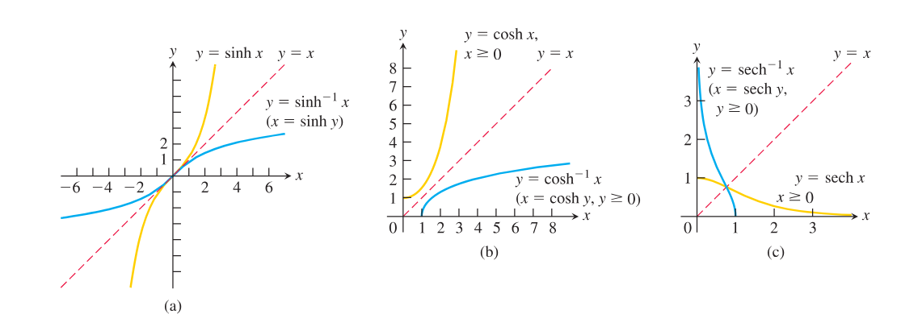
  
图 7.8 反双曲正弦、余弦和正割函数的图像。注意它们关于直线 $y=x$ 的对称性。

双曲正切、余切和余割在各自的定义域上一一对应，因此有反函数，记为

$$
y=\tanh^{-1}x,\qquad y=\coth^{-1}x,\qquad y=\operatorname{csch}^{-1}x.
$$

这些函数的图像见图 7.9。

  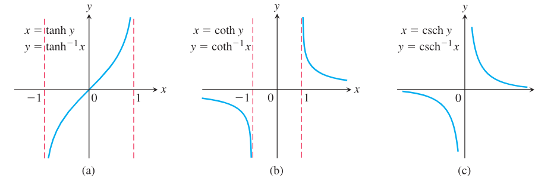
  
图 7.9 反双曲正切、余切和余割函数的图像。

### 有用恒等式

我们使用表 7.8 中的恒等式，在只给出 $\cosh^{-1}x$、$\sinh^{-1}x$ 和 $\tanh^{-1}x$ 的计算器上计算 $\operatorname{sech}^{-1}x$、$\operatorname{csch}^{-1}x$ 和 $\coth^{-1}x$ 的值。这些恒等式是定义的直接结果。例如，如果 $0<x\le 1$，那么

$$
\operatorname{sech}\left(\cosh^{-1}\frac{1}{x}\right)
=\frac{1}{\cosh\left(\cosh^{-1}\frac{1}{x}\right)}
=\frac{1}{1/x}=x.
$$

我们还知道 $\operatorname{sech}(\operatorname{sech}^{-1}x)=x$，所以由于双曲正割在 $(0,1]$ 上一一对应，有

**表 7.8 反双曲函数的恒等式**

$$
\operatorname{sech}^{-1}x=\cosh^{-1}\frac{1}{x},\qquad
\operatorname{csch}^{-1}x=\sinh^{-1}\frac{1}{x},\qquad
\coth^{-1}x=\tanh^{-1}\frac{1}{x}.
$$

### 反双曲函数的导数

反双曲函数的重要用途之一，是给出表 7.9 中导数公式的反向积分。

**表 7.9 反双曲函数的导数**

如果 $u$ 是 $x$ 的可微函数，则

$$
\begin{array}{ll}
\dfrac{d}{dx}\sinh^{-1}u=\dfrac{1}{\sqrt{u^2+1}}\dfrac{du}{dx}, &
\dfrac{d}{dx}\cosh^{-1}u=\dfrac{1}{\sqrt{u^2-1}}\dfrac{du}{dx},\quad u>1,\\[1em]
\dfrac{d}{dx}\tanh^{-1}u=\dfrac{1}{1-u^2}\dfrac{du}{dx},\quad |u|<1, &
\dfrac{d}{dx}\coth^{-1}u=\dfrac{1}{1-u^2}\dfrac{du}{dx},\quad |u|>1,\\[1em]
\dfrac{d}{dx}\operatorname{sech}^{-1}u=-\dfrac{1}{u\sqrt{1-u^2}}\dfrac{du}{dx},\quad 0<u<1, &
\dfrac{d}{dx}\operatorname{csch}^{-1}u=-\dfrac{1}{|u|\sqrt{1+u^2}}\dfrac{du}{dx},\quad u\ne 0.
\end{array}
$$

**例 2** 证明：如果 $u$ 是 $x$ 的可微函数且 $u>1$，则

$$
\frac{d}{dx}\cosh^{-1}u=\frac{1}{\sqrt{u^2-1}}\frac{du}{dx}.
$$

**解：** 先对 $y=\cosh^{-1}x$（$x>1$）求导。应用第 3.8 节定理 3，取 $f(x)=\cosh x$，$f^{-1}(x)=\cosh^{-1}x$。因为在 $0<x$ 上 $\cosh x$ 的导数为正，所以可以应用该定理：

$$
\begin{aligned}
(f^{-1})'(x)
&=\frac{1}{f'(f^{-1}(x))}
=\frac{1}{\sinh(\cosh^{-1}x)}.
\end{aligned}
$$

设 $u=\cosh^{-1}x$，则 $\cosh u=x$。由恒等式 $\cosh^2u-\sinh^2u=1$，

$$
\sinh u=\sqrt{\cosh^2u-1}=\sqrt{x^2-1},
$$

其中 $u>0$，所以取正平方根。因此

$$
\frac{d}{dx}\cosh^{-1}x=\frac{1}{\sqrt{x^2-1}}.
$$

链式法则给出最终结果：

$$
\frac{d}{dx}\cosh^{-1}u=\frac{1}{\sqrt{u^2-1}}\frac{du}{dx}.
$$

通过适当代换，表 7.9 中的导数公式导出表 7.10 中的积分公式。表 7.10 中的每个公式都可以通过对右边表达式求导来验证。

**表 7.10 导向反双曲函数的积分**

$$
\begin{array}{ll}
\displaystyle \int\frac{du}{\sqrt{u^2+a^2}}
=\sinh^{-1}\frac{u}{a}+C, & a>0,\\[1em]
\displaystyle \int\frac{du}{\sqrt{u^2-a^2}}
=\cosh^{-1}\frac{|u|}{a}+C, & |u|>a>0,\\[1em]
\displaystyle \int\frac{du}{a^2-u^2}
=\frac{1}{a}\tanh^{-1}\frac{u}{a}+C, & |u|<a,\\[1em]
\displaystyle \int\frac{du}{a^2-u^2}
=\frac{1}{a}\coth^{-1}\frac{u}{a}+C, & |u|>a,\\[1em]
\displaystyle \int\frac{du}{u\sqrt{a^2-u^2}}
=-\frac{1}{a}\operatorname{sech}^{-1}\frac{|u|}{a}+C, & 0<|u|<a,\\[1em]
\displaystyle \int\frac{du}{u\sqrt{u^2+a^2}}
=-\frac{1}{a}\operatorname{csch}^{-1}\frac{|u|}{a}+C, & u\ne 0.
\end{array}
$$

**例 3** 计算

$$
\int_0^1\frac{2\,dx}{\sqrt{3+4x^2}}.
$$

**解：** 不定积分为

$$
\int\frac{2\,dx}{\sqrt{3+4x^2}}
=\int\frac{du}{\sqrt{a^2+u^2}},
$$

其中 $u=2x$，$du=2\,dx$，$a=\sqrt3$。由表 7.10，

$$
\int\frac{2\,dx}{\sqrt{3+4x^2}}
=\sinh^{-1}\left(\frac{2x}{\sqrt3}\right)+C.
$$

因此

$$
\begin{aligned}
\int_0^1\frac{2\,dx}{\sqrt{3+4x^2}}
&=\left[\sinh^{-1}\left(\frac{2x}{\sqrt3}\right)\right]_0^1\\
&=\sinh^{-1}\left(\frac{2}{\sqrt3}\right)-\sinh^{-1}(0)\\
&\approx 0.98665.
\end{aligned}
$$

## 7.4 相对增长率

在数学、计算机科学和工程中，比较函数在 $x$ 变大时的增长速率常常很重要。在这些比较中，指数函数因增长非常快而重要，对数函数因增长非常慢而重要。本节引入用于描述这类比较结果的小 $o$ 和大 $O$ 记号。我们把注意力限制在当 $x\to\infty$ 时最终变为并保持为正的函数上。

### 函数的增长率

你可能已经注意到，像 $2^x$ 和 $e^x$ 这样的指数函数，当 $x$ 变大时，似乎比多项式函数和有理函数增长得更快。这些指数函数当然比 $x$ 本身增长更快；从图 7.10 中可以看到，当 $x$ 增大时，$2^x$ 超过 $x^2$。事实上，当 $x\to\infty$ 时，函数 $2^x$ 和 $e^x$ 比 $x$ 的任意幂增长都快，甚至比 $x^{1,000,000}$ 增长还快（习题 19）。相反，像 $y=\log_2x$ 和 $y=\ln x$ 这样的对数函数，当 $x\to\infty$ 时比 $x$ 的任意正幂增长都慢（习题 21）。

  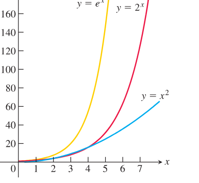
  
图 7.10 $e^x$、$2^x$ 和 $x^2$ 的图像。

为了感受 $y=e^x$ 的值随着 $x$ 增大增长得有多快，可以想象在一块大黑板上画这个函数，坐标轴以厘米为单位。$x=1$ cm 时，图像在 $x$ 轴上方 $e^1\approx 3$ cm。$x=6$ cm 时，图像在 $e^6\approx 403$ cm $\approx 4$ m 的高度（如果还没碰到天花板，差不多已经要碰到了）。$x=10$ cm 时，图像在 $e^{10}\approx 22,026$ cm $\approx 220$ m 的高度，高过大多数建筑。$x=24$ cm 时，图像已经超过到月球距离的一半；从原点起 $x=43$ cm 时，图像高得足以超过太阳最近的恒星邻居，即红矮星比邻星。相反，如果坐标轴以厘米为单位，你必须沿 $x$ 轴走出将近 5 光年，才能找到 $y=\ln x$ 的图像达到 $y=43$ cm 的点。见图 7.11。

  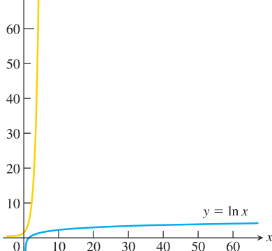
  
图 7.11 $e^x$ 和 $\ln x$ 图像的按比例绘图。

指数函数、多项式函数和对数函数之间的重要比较，可以通过定义一个函数 $f(x)$ 在 $x\to\infty$ 时比另一个函数 $g(x)$ 增长更快的含义来精确化。

  

    
定义

    

      设 $f(x)$ 和 $g(x)$ 在充分大的 $x$ 上为正。
        
      1. 如果
      $$
      \lim_{x\to\infty}\frac{f(x)}{g(x)}=\infty,
      $$
      或等价地
      $$
      \lim_{x\to\infty}\frac{g(x)}{f(x)}=0,
      $$
      则称当 $x\to\infty$ 时，$f$ 比 $g$ 增长更快。我们也说，当 $x\to\infty$ 时，$g$ 比 $f$ 增长更慢。
        
      2. 如果
      $$
      \lim_{x\to\infty}\frac{f(x)}{g(x)}=L,
      $$
      其中 $L$ 有限且为正，则称当 $x\to\infty$ 时，$f$ 与 $g$ 以相同速率增长。
    

  

根据这些定义，$y=2x$ 并不比 $y=x$ 增长更快。这两个函数以相同速率增长，因为

$$
\lim_{x\to\infty}\frac{2x}{x}=\lim_{x\to\infty}2=2,
$$

这是一个有限正极限。这个说法偏离日常用语的原因是，我们希望“$f$ 比 $g$ 增长更快”意味着在大的 $x$ 值处，与 $f$ 相比，$g$ 可以忽略。

**例 1** 比较若干常见函数的增长率。

**(a)** 当 $x\to\infty$ 时，$e^x$ 比 $x^2$ 增长更快，因为两次使用洛必达法则得到

$$
\lim_{x\to\infty}\frac{e^x}{x^2}
=\lim_{x\to\infty}\frac{e^x}{2x}
=\lim_{x\to\infty}\frac{e^x}{2}
=\infty.
$$

**(b)** 当 $x\to\infty$ 时，$3^x$ 比 $2^x$ 增长更快，因为

$$
\lim_{x\to\infty}\frac{3^x}{2^x}
=\lim_{x\to\infty}\left(\frac32\right)^x
=\infty.
$$

**(c)** 当 $x\to\infty$ 时，$x^2$ 比 $\ln x$ 增长更快，因为由洛必达法则

$$
\lim_{x\to\infty}\frac{x^2}{\ln x}
=\lim_{x\to\infty}\frac{2x}{1/x}
=\lim_{x\to\infty}2x^2
=\infty.
$$

**(d)** 当 $x\to\infty$ 时，对于任意正整数 $n$，$\ln x$ 比 $x^{1/n}$ 增长更慢，因为由洛必达法则

$$
\lim_{x\to\infty}\frac{\ln x}{x^{1/n}}
=\lim_{x\to\infty}\frac{1/x}{(1/n)x^{(1/n)-1}}
=\lim_{x\to\infty}\frac{n}{x^{1/n}}
=0.
$$

**(e)** 如 (b) 部分所暗示的那样，当 $x\to\infty$ 时，不同底数的指数函数永远不会以相同速率增长。如果 $a>b>0$，则 $a^x$ 比 $b^x$ 增长更快。因为 $a/b>1$，

$$
\lim_{x\to\infty}\frac{a^x}{b^x}
=\lim_{x\to\infty}\left(\frac{a}{b}\right)^x
=\infty.
$$

**(f)** 与指数函数相反，不同底数 $a>1$ 与 $b>1$ 的对数函数，当 $x\to\infty$ 时总是以相同速率增长：

$$
\lim_{x\to\infty}\frac{\log_a x}{\log_b x}
=\lim_{x\to\infty}\frac{\ln x/\ln a}{\ln x/\ln b}
=\frac{\ln b}{\ln a}.
$$

这个极限比值总是有限且非零。

如果当 $x\to\infty$ 时 $f$ 与 $g$ 以相同速率增长，并且 $g$ 与 $h$ 以相同速率增长，那么 $f$ 与 $h$ 也以相同速率增长。原因是

$$
\lim_{x\to\infty}\frac{f}{g}=L_1,\qquad
\lim_{x\to\infty}\frac{g}{h}=L_2
$$

合起来推出

$$
\lim_{x\to\infty}\frac{f}{h}
=\lim_{x\to\infty}\frac{f}{g}\cdot\frac{g}{h}
=L_1L_2.
$$

如果 $L_1$ 和 $L_2$ 有限且非零，那么 $L_1L_2$ 也是如此。

**例 2** 说明 $\sqrt{x^2+5}$ 和 $(2\sqrt{x}-1)^2$ 都与 $x$ 以相同速率增长。

**解：** 我们通过说明它们都与函数 $g(x)=x$ 以相同速率增长来证明：

$$
\lim_{x\to\infty}\frac{\sqrt{x^2+5}}{x}
=\lim_{x\to\infty}\sqrt{1+\frac{5}{x^2}}
=1,
$$

并且

$$
\lim_{x\to\infty}\frac{(2\sqrt{x}-1)^2}{x}
=\lim_{x\to\infty}\left(\frac{2\sqrt{x}-1}{\sqrt{x}}\right)^2
=\lim_{x\to\infty}\left(2-\frac{1}{\sqrt{x}}\right)^2
=4.
$$

两个极限都是有限正数，所以这两个函数都与 $x$ 以相同速率增长，因此彼此也以相同速率增长。

### 阶与 $O$ 记号

小 $o$ 和大 $O$ 记号是一百年前由数论学家发明的，现在在数学分析和计算机科学中都很常见。注意，说当 $x\to\infty$ 时 $f=o(g)$，就是另一种说法：当 $x\to\infty$ 时 $f$ 比 $g$ 增长更慢。

  

    
定义

    

      如果
      $$
      \lim_{x\to\infty}\frac{f(x)}{g(x)}=0,
      $$
      则称当 $x\to\infty$ 时，函数 $f$ 的阶小于 $g$。我们写作 $f=o(g)$，读作“$f$ is little-oh of $g$”。
    

  

**例 3** 这里使用小 $o$ 记号。

**(a)** 当 $x\to\infty$ 时，$\ln x=o(x)$，因为

$$
\lim_{x\to\infty}\frac{\ln x}{x}=0.
$$

**(b)** 当 $x\to\infty$ 时，$x^2=o(e^x)$，因为

$$
\lim_{x\to\infty}\frac{x^2}{e^x}=0.
$$

**(c)** 对任意正整数 $n$，当 $x\to\infty$ 时，$x^n=o(e^x)$。指数函数最终比任意幂函数增长得更快。

大 $O$ 记号则用于表示一个函数的大小最终受另一个函数常数倍控制。

  

    
定义

    

      设 $f(x)$ 和 $g(x)$ 在充分大的 $x$ 上为正。如果存在正整数 $M$，使得当 $x$ 充分大时
      $$
      \frac{f(x)}{g(x)}\le M,
      $$
      则称当 $x\to\infty$ 时，$f$ 至多为 $g$ 的阶。我们写作 $f=O(g)$，读作“$f$ is big-oh of $g$”。
    

  

**例 4** 这里使用大 $O$ 记号。

**(a)** 当 $x\to\infty$ 时，$x+\sin x=O(x)$，因为当 $x$ 充分大时，

$$
\frac{x+\sin x}{x}\le 2.
$$

**(b)** 当 $x\to\infty$ 时，$e^x+x^2=O(e^x)$，因为

$$
\frac{e^x+x^2}{e^x}\to 1.
$$

**(c)** 当 $x\to\infty$ 时，$x=O(e^x)$，因为

$$
\frac{x}{e^x}\to 0.
$$

如果再看一遍定义，就会发现，对充分大的 $x$ 为正的函数，$f=o(g)$ 蕴含 $f=O(g)$。另外，如果 $f$ 和 $g$ 以相同速率增长，那么 $f=O(g)$ 且 $g=O(f)$。

### 顺序搜索与二分搜索

算法效率的差异，即使这些算法设计来完成相同任务，也可能非常大。这些差异通常用大 $O$ 记号描述。下面是一个例子。

《韦氏国际词典》列出大约 $26,000$ 个以字母 $a$ 开头的单词。查找一个单词，或者判断它不在其中的一种方法，是逐个读过这个列表，直到找到该词或确定它不在表中为止。这种方法称为顺序搜索，它没有特别利用列表中字母顺序排列这一事实。你一定会得到答案，但可能需要 $26,000$ 步。

另一种寻找该词或确定它不在表中的方法，是直接跳到列表的中间（差几个词也无妨）。如果没有找到该词，就到包含它的那一半列表的中间去，并舍弃不包含它的那一半。（你知道它在哪一半，因为列表按字母顺序排列。）这种方法称为二分搜索，一步就大约排除 $13,000$ 个词。如果第二次仍没有找到，就跳到包含它的那一半的中间。继续这样做，直到找到该词，或者把列表对半分割了太多次以至于没有词剩下。为了找到这个词或知道它不在表中，最多需要分多少次？最多 15 次，因为

$$
\frac{26,000}{2^{15}}<1.
$$

这当然胜过可能的 $26,000$ 步。

对于长度为 $n$ 的列表，顺序搜索算法需要大约 $n$ 阶的步数来找到一个词或确定它不在列表中。二分搜索，即第二种算法，需要大约 $\log_2 n$ 阶的步数。原因是，如果 $2^{m-1}<n\le 2^m$，那么 $m-1<\log_2n\le m$，而把列表缩小到一个词所需的二分次数至多为 $m=\lceil\log_2n\rceil$，也就是 $\log_2n$ 的上取整。

大 $O$ 记号提供了一种紧凑方式来表达这些内容。有序列表中顺序搜索的步数是 $O(n)$；二分搜索的步数是 $O(\log_2n)$。在我们的例子中，两者差别很大（$26,000$ 对 $15$），并且当 $n\to\infty$ 时，由于 $n$ 比 $\log_2n$ 增长更快，这种差别只会增大。

### 小结

第 7.1 节中自然对数函数 $\ln x$ 的积分定义，是精确获得任意底数 $a>0$ 的指数函数 $a^x$ 和对数函数 $\log_a x$ 的关键。$\ln x$ 的可微性和递增性使我们能够通过第 3 章中的反函数定理定义它的可微反函数，也就是自然指数函数 $e^x$。随后，所有指数法则、对数法则、导数公式和积分公式都从这些定义中推出。第 7.2 节用指数函数求解变化率与现有量成正比的问题，并把方法扩展到可分离微分方程。第 7.3 节介绍双曲函数和反双曲函数，它们为积分和应用提供了新的工具。第 7.4 节则用极限、大 $O$ 和小 $o$ 记号比较函数的相对增长率。
