<!--
来源：Thomas' Calculus，Chapter 8: Techniques of Integration，PDF 第 470–541 页（印刷页 456–527）。
整理规范：PDF转Markdown校对要求.md。仅收录章节正文，不含各节及章末习题。
-->

# 第8章 积分技巧

**概述** 微积分基本定理告诉我们，一旦知道被积函数的一个原函数，就能计算定积分。然而，求原函数（或不定积分）并不像求导数那样直接。我们需要发展一些技巧来帮助计算。不过，也应当注意，并非总能找到用初等函数表示的原函数。

本章研究若干重要技巧，用来求特定类型函数的积分，例如三角函数、某些函数的乘积以及有理函数。由于并非总能求出原函数，我们还将介绍计算定积分的一些数值方法。最后，把定积分的概念推广到反常积分，并应用它们计算概率。

## 8.1 使用基本积分公式

表 8.1 汇总了迄今研究过的许多函数的不定积分形式，换元法可以帮助我们利用这个表，计算含有这些基本函数的较复杂函数的积分。本节把第 5 章研究的换元法则与代数方法、三角恒等式结合起来，以便使用表 8.1。本书书末给出了更广泛的积分表，第 8.6 节将讨论它的使用。

有时必须改写积分，使它与表 8.1 中的某个标准形式相匹配。此前我们已经用过这种做法，下面再举一个例子。

**例 1** 计算积分

$$
\int_3^5\frac{2x-3}{\sqrt{x^2-3x+1}}\,dx.
$$

**解** 改写积分，并应用第 5.6 节中的定积分换元法则，得到

$$
\begin{aligned}
\int_3^5\frac{2x-3}{\sqrt{x^2-3x+1}}\,dx
&=\int_1^{11}\frac{du}{\sqrt{u}}\\
&=\int_1^{11}u^{-1/2}\,du\\
&=\left.2\sqrt{u}\right|_1^{11}=2(\sqrt{11}-1)\approx4.63.
\end{aligned}
$$

这里 $u=x^2-3x+1$，$du=(2x-3)\,dx$；当 $x=3$ 时 $u=1$，当 $x=5$ 时 $u=11$。最后一步使用表 8.1 的公式 2。

**例 2** 用配方法计算 $\displaystyle\int\frac{dx}{\sqrt{8x-x^2}}$。

**解** 配方以简化分母：

$$
\begin{aligned}
8x-x^2&=-(x^2-8x)=-(x^2-8x+16-16)\\
&=-(x^2-8x+16)+16=16-(x-4)^2.
\end{aligned}
$$

于是

$$
\begin{aligned}
\int\frac{dx}{\sqrt{8x-x^2}}
&=\int\frac{dx}{\sqrt{16-(x-4)^2}}\\
&=\int\frac{du}{\sqrt{a^2-u^2}}
&&a=4,\ u=x-4,\ du=dx\\
&=\sin^{-1}\left(\frac{u}{a}\right)+C
&&\text{表 8.1，公式 18}\\
&=\sin^{-1}\left(\frac{x-4}{4}\right)+C.
\end{aligned}
$$

  

    
表 8.1 基本积分公式

    

$$
\begin{aligned}
1.\quad&\int k\,dx=kx+C&&\text{（任意常数 }k\text{）}\\
2.\quad&\int x^n\,dx=\frac{x^{n+1}}{n+1}+C&&n\ne-1\\
3.\quad&\int\frac{dx}{x}=\ln|x|+C\\
4.\quad&\int e^x\,dx=e^x+C\\
5.\quad&\int a^x\,dx=\frac{a^x}{\ln a}+C&&a>0,\ a\ne1\\
6.\quad&\int\sin x\,dx=-\cos x+C\\
7.\quad&\int\cos x\,dx=\sin x+C\\
8.\quad&\int\sec^2x\,dx=\tan x+C\\
9.\quad&\int\csc^2x\,dx=-\cot x+C\\
10.\quad&\int\sec x\tan x\,dx=\sec x+C\\
11.\quad&\int\csc x\cot x\,dx=-\csc x+C\\
12.\quad&\int\tan x\,dx=\ln|\sec x|+C\\
13.\quad&\int\cot x\,dx=\ln|\sin x|+C\\
14.\quad&\int\sec x\,dx=\ln|\sec x+\tan x|+C\\
15.\quad&\int\csc x\,dx=-\ln|\csc x+\cot x|+C\\
16.\quad&\int\sinh x\,dx=\cosh x+C\\
17.\quad&\int\cosh x\,dx=\sinh x+C\\
18.\quad&\int\frac{dx}{\sqrt{a^2-x^2}}=\sin^{-1}\left(\frac{x}{a}\right)+C\\
19.\quad&\int\frac{dx}{a^2+x^2}=\frac{1}{a}\tan^{-1}\left(\frac{x}{a}\right)+C\\
20.\quad&\int\frac{dx}{x\sqrt{x^2-a^2}}=\frac{1}{a}\sec^{-1}\left|\frac{x}{a}\right|+C\\
21.\quad&\int\frac{dx}{\sqrt{a^2+x^2}}=\sinh^{-1}\left(\frac{x}{a}\right)+C&&a>0\\
22.\quad&\int\frac{dx}{\sqrt{x^2-a^2}}=\cosh^{-1}\left(\frac{x}{a}\right)+C&&x>a>0.
\end{aligned}
$$
    

  

> [!note] 双曲函数中的 $\mathrm h$ 是什么意思？为什么公式 16、17 成立？
>
> $\sinh x$ 和 $\cosh x$ 中的 $\mathrm h$ 不是系数，也不是一个单独的变量，而是函数名称的一部分。字母 $\mathrm h$ 来自英文 **hyperbolic（双曲的）**，因此 $\sinh x$ 和 $\cosh x$ 应当分别作为一个整体读作“双曲正弦”和“双曲余弦”，不能理解成 $\sin x\cdot h$ 和 $\cos x\cdot h$。
>
> 双曲正弦和双曲余弦定义为
>
> $$
> \sinh x=\frac{e^x-e^{-x}}{2},
> \qquad
> \cosh x=\frac{e^x+e^{-x}}{2}.
> $$
>
> 根据这两个定义求导，可以得到
>
> $$
> \frac{\mathrm d}{\mathrm dx}\cosh x
> =\frac{e^x-e^{-x}}{2}
> =\sinh x,
> \qquad
> \frac{\mathrm d}{\mathrm dx}\sinh x
> =\frac{e^x+e^{-x}}{2}
> =\cosh x.
> $$
>
> 积分是求导的逆运算，所以
>
> $$
> \int\sinh x\,\mathrm dx=\cosh x+C,
> \qquad
> \int\cosh x\,\mathrm dx=\sinh x+C.
> $$
>
> 它们之所以叫“双曲”函数，是因为满足 $\cosh^2x-\sinh^2x=1$，与双曲线方程 $X^2-Y^2=1$ 相对应。

**例 3** 计算积分 $\displaystyle\int(\cos x\sin2x+\sin x\cos2x)\,dx$。

**解** 利用正弦加法公式，把被积函数换成等价的三角表达式，再作简单的换元：

> 正弦加法公式：$\sin(\alpha+\beta)=\sin\alpha\cos\beta+\cos\alpha\sin\beta$。

$$
\begin{aligned}
\int(\cos x\sin2x+\sin x\cos2x)\,dx
&=\int\sin(x+2x)\,dx\\
&=\int\sin3x\,dx\\
&=\int\frac{1}{3}\sin u\,du&&u=3x,\ du=3\,dx\\
&=-\frac{1}{3}\cos3x+C.&&\text{表 8.1，公式 6}
\end{aligned}
$$

第 5.5 节中，我们给正割函数乘上一个恒等于 1 的分式，再对所得等价表达式积分，从而求出了它的不定积分。在其他情形下也可以使用同样的做法，如下例所示。

**例 4** 求 $\displaystyle\int_0^{\pi/4}\frac{dx}{1-\sin x}$。

**解** 给被积函数的分子、分母同时乘以 $1+\sin x$，这只是乘以数 1 的一种形式。这样就把积分转化成可以计算的形式：

$$
\begin{aligned}
\int_0^{\pi/4}\frac{dx}{1-\sin x}
&=\int_0^{\pi/4}\frac{1}{1-\sin x}\cdot\frac{1+\sin x}{1+\sin x}\,dx\\
&=\int_0^{\pi/4}\frac{1+\sin x}{1-\sin^2x}\,dx\\
&=\int_0^{\pi/4}\frac{1+\sin x}{\cos^2x}\,dx\\
&=\int_0^{\pi/4}(\sec^2x+\sec x\tan x)\,dx\\
&=\left[\tan x+\sec x\right]_0^{\pi/4}\\
&=(1+\sqrt{2})-(0+1)=\sqrt{2}.
\end{aligned}
$$

积分时使用了表 8.1 的公式 8 和 10。

**例 5** 计算 $\displaystyle\int\frac{3x^2-7x}{3x+2}\,dx$。

**解** 分子的次数高于分母的次数，所以被积函数是假分式。为求积分，先作多项式长除法，得到一个商与一个真分式余项之和：

> **假分式**的分子次数大于或等于分母次数；**真分式**的分子次数小于分母次数。

$$
\begin{aligned}
3x^2-7x&=(3x^2+2x)-9x,\\
-9x&=(-9x-6)+6,\\
\frac{3x^2-7x}{3x+2}&=x-3+\frac{6}{3x+2}.
\end{aligned}
$$

因此，

$$
\int\frac{3x^2-7x}{3x+2}\,dx
=\int\left(x-3+\frac{6}{3x+2}\right)dx
=\frac{x^2}{2}-3x+2\ln|3x+2|+C.
$$

像例 5 那样用长除法化简假分式，并不总能得到可直接积分的表达式。第 8.5 节将讨论遇到这种情形时该怎么办。

**例 6** 计算 $\displaystyle\int\frac{3x+2}{\sqrt{1-x^2}}\,dx$。

**解** 先拆开被积函数，得到

$$
\int\frac{3x+2}{\sqrt{1-x^2}}\,dx
=3\int\frac{x\,dx}{\sqrt{1-x^2}}+2\int\frac{dx}{\sqrt{1-x^2}}.
$$

在第一个新积分中，令 $u=1-x^2$，$du=-2x\,dx$，于是 $x\,dx=-\frac{1}{2}\,du$。因此

$$
\begin{aligned}
3\int\frac{x\,dx}{\sqrt{1-x^2}}
&=3\int\frac{(-1/2)\,du}{\sqrt{u}}
=-\frac{3}{2}\int u^{-1/2}\,du\\
&=-\frac{3}{2}\cdot\frac{u^{1/2}}{1/2}+C_1
=-3\sqrt{1-x^2}+C_1.
\end{aligned}
$$

第二个新积分是标准形式：

$$
2\int\frac{dx}{\sqrt{1-x^2}}=2\sin^{-1}x+C_2.
\qquad\text{表 8.1，公式 18}
$$

合并结果，并将 $C_1+C_2$ 重新记为 $C$，得到

$$
\int\frac{3x+2}{\sqrt{1-x^2}}\,dx=-3\sqrt{1-x^2}+2\sin^{-1}x+C.
$$

应该对被积函数的哪一部分换元，并不总是这样清楚。有时只能尝试；如果都行不通，就改用另一种方法。接下来几节将介绍一些新方法，但下面这个例子仍可用换元法解决。

**例 7** 计算 $\displaystyle\int\frac{dx}{(1+\sqrt{x})^3}$。

**解** 我们可以尝试对 $\sqrt{x}$ 换元，但很快会发现被积函数中缺少导数因子 $1/\sqrt{x}$，所以这种换元没有帮助。另一种可能是对 $1+\sqrt{x}$ 换元，结果表明这确实行得通：

$$
\begin{aligned}
\int\frac{dx}{(1+\sqrt{x})^3}
&=\int\frac{2(u-1)\,du}{u^3}\\
&=\int\left(\frac{2}{u^2}-\frac{2}{u^3}\right)du\\
&=-\frac{2}{u}+\frac{1}{u^2}+C\\
&=\frac{1-2u}{u^2}+C\\
&=\frac{1-2(1+\sqrt{x})}{(1+\sqrt{x})^2}+C\\
&=C-\frac{1+2\sqrt{x}}{(1+\sqrt{x})^2}.
\end{aligned}
$$

这里 $u=1+\sqrt{x}$，$du=\frac{1}{2\sqrt{x}}\,dx$，因而 $dx=2\sqrt{x}\,du=2(u-1)\,du$。

计算定积分时，被积函数的某种性质可能有助于求出结果。

**例 8** 计算 $\displaystyle\int_{-\pi/2}^{\pi/2}x^3\cos x\,dx$。

**解** 在这里，看不出哪种换元或代数变形会有帮助。但是，积分区间 $[-\pi/2,\pi/2]$ 关于原点对称。此外，因子 $x^3$ 是奇函数，$\cos x$ 是偶函数，因此它们的乘积是奇函数。所以，由第 5.6 节的定理 8，

$$
\int_{-\pi/2}^{\pi/2}x^3\cos x\,dx=0.
$$

## 8.2 分部积分法

分部积分法是一种简化形如 $\displaystyle\int f(x)g(x)\,dx$ 的积分的技巧。当 $f$ 容易反复求导、$g$ 容易反复积分时，这种方法很有用。例如，积分

$$
\int x\cos x\,dx\qquad\text{和}\qquad\int x^2e^x\,dx
$$

就具有这种性质，因为 $f(x)=x$ 或 $f(x)=x^2$ 反复求导后会变成零，而 $g(x)=\cos x$ 或 $g(x)=e^x$ 都容易反复积分。分部积分法也适用于

$$
\int\ln x\,dx\qquad\text{和}\qquad\int e^x\cos x\,dx
$$

这样的积分。第一种情形中，$f(x)=\ln x$ 容易求导，$g(x)=1$ 容易积分得到 $x$。第二种情形中，被积函数的每一部分在反复求导或积分后都会再次出现。

### 乘积法则的积分形式

若 $f$ 和 $g$ 是 $x$ 的可微函数，则乘积法则给出

$$
\frac{d}{dx}[f(x)g(x)]=f'(x)g(x)+f(x)g'(x).
$$

用不定积分表示，这个等式变成

$$
\int\frac{d}{dx}[f(x)g(x)]\,dx
=\int[f'(x)g(x)+f(x)g'(x)]\,dx,
$$

也就是

$$
\int\frac{d}{dx}[f(x)g(x)]\,dx
=\int f'(x)g(x)\,dx+\int f(x)g'(x)\,dx.
$$

将最后一个等式移项，得到

$$
\int f(x)g'(x)\,dx
=\int\frac{d}{dx}[f(x)g(x)]\,dx-\int f'(x)g(x)\,dx,
$$

由此得到分部积分公式

  

    

      $$
      \int f(x)g'(x)\,dx=f(x)g(x)-\int f'(x)g(x)\,dx.\tag{1}
      $$
    

  

有时把公式写成微分形式更容易记忆。令 $u=f(x)$，$v=g(x)$，则 $du=f'(x)\,dx$，$dv=g'(x)\,dx$。利用换元法则，分部积分公式成为

  

    
分部积分公式

    

      $$
      \int u\,dv=uv-\int v\,du.\tag{2}
      $$
    

  

这个公式用第二个积分 $\int v\,du$ 来表示第一个积分 $\int u\,dv$。如果恰当选择 $u$ 和 $v$，第二个积分可能比第一个容易求。应用公式时，$u$ 和 $dv$ 可能有多种选择。下面的例子说明这种技巧。为避免出错，我们总是先列出所选的 $u$ 和 $dv$，再列出算得的 $du$ 和 $v$，最后应用公式 (2)。

**例 1** 求 $\displaystyle\int x\cos x\,dx$。

**解** 使用公式 $\int u\,dv=uv-\int v\,du$，其中

$$
\begin{aligned}
u&=x,&dv&=\cos x\,dx,\\
du&=dx,&v&=\sin x.
\end{aligned}
$$

这里 $v=\sin x$ 是 $\cos x$ 最简单的原函数。于是

$$
\int x\cos x\,dx=x\sin x-\int\sin x\,dx=x\sin x+\cos x+C.
$$

例 1 中，$u$ 和 $dv$ 显然有四种选择：

1. 令 $u=1$，$dv=x\cos x\,dx$。
2. 令 $u=x$，$dv=\cos x\,dx$。
3. 令 $u=x\cos x$，$dv=dx$。
4. 令 $u=\cos x$，$dv=x\,dx$。

例 1 用的是选择 2。其他三种选择会导致我们还不知道如何计算的积分。例如，选择 3 给出 $du=(\cos x-x\sin x)\,dx$，从而产生积分

$$
\int(x\cos x-x^2\sin x)\,dx.
$$

分部积分的目标是把一个不知如何求的积分 $\int u\,dv$ 转化为一个能够求出的积分 $\int v\,du$。一般先选择 $dv$，把被积表达式中容易积分的部分（包括 $dx$）尽量多地归入 $dv$，剩下的部分就是 $u$。从 $dv$ 求 $v$ 时，任意一个原函数都可以，我们通常选最简单的。$v$ 中不必带任意积分常数，因为它在公式 (2) 右边会相消。

**例 2** 求 $\displaystyle\int\ln x\,dx$。

**解** 由于 $\int\ln x\,dx$ 可以写为 $\int\ln x\cdot1\,dx$，我们使用公式 $\int u\,dv=uv-\int v\,du$，其中

$$
\begin{aligned}
u&=\ln x&&\text{（求导后变简单）},&dv&=dx&&\text{（容易积分）},\\
du&=\frac{1}{x}\,dx,&&&v&=x&&\text{（最简单的原函数）}.
\end{aligned}
$$

由公式 (2)，

$$
\int\ln x\,dx=x\ln x-\int x\cdot\frac{1}{x}\,dx
=x\ln x-\int dx=x\ln x-x+C.
$$

有时必须不止一次地使用分部积分。

**例 3** 计算 $\displaystyle\int x^2e^x\,dx$。

**解** 取 $u=x^2$，$dv=e^x\,dx$，$du=2x\,dx$，$v=e^x$，得到

$$
\int x^2e^x\,dx=x^2e^x-2\int xe^x\,dx.
$$

由于 $x$ 的指数降低了 1，新积分比原积分简单。为计算右边的积分，再次分部积分，取 $u=x$，$dv=e^x\,dx$，于是 $du=dx$，$v=e^x$，并且

$$
\int xe^x\,dx=xe^x-\int e^x\,dx=xe^x-e^x+C.
$$

利用这个结果，得到

$$
\begin{aligned}
\int x^2e^x\,dx&=x^2e^x-2\int xe^x\,dx\\
&=x^2e^x-2xe^x+2e^x+C,
\end{aligned}
$$

其中，代入右侧积分的表达式后，重新记了积分常数。

例 3 的技巧适用于任意积分 $\int x^ne^x\,dx$，其中 $n$ 是正整数，因为对 $x^n$ 反复求导最终会得到零，而 $e^x$ 容易积分。

下例这样的积分会出现在电气工程中。计算时需作两次分部积分，然后解出未知积分。

**例 4** 计算 $\displaystyle\int e^x\cos x\,dx$。

**解** 令 $u=e^x$，$dv=\cos x\,dx$，则 $du=e^x\,dx$，$v=\sin x$，于是

$$
\int e^x\cos x\,dx=e^x\sin x-\int e^x\sin x\,dx.
$$

第二个积分与第一个类似，只是 $\cos x$ 换成了 $\sin x$。为计算它，再次分部积分，取 $u=e^x$，$dv=\sin x\,dx$，$v=-\cos x$，$du=e^x\,dx$。于是

$$
\begin{aligned}
\int e^x\cos x\,dx
&=e^x\sin x-\left(-e^x\cos x-\int(-\cos x)(e^x\,dx)\right)\\
&=e^x\sin x+e^x\cos x-\int e^x\cos x\,dx.
\end{aligned}
$$

未知积分现在出现在等式两边。两边同时加上这个积分，再补上积分常数，得到

$$
2\int e^x\cos x\,dx=e^x\sin x+e^x\cos x+C_1.
$$

两边除以 2，并重新记积分常数，得到

$$
\int e^x\cos x\,dx=\frac{e^x\sin x+e^x\cos x}{2}+C.
$$

**例 5** 求一个公式，将 $\displaystyle\int\cos^nx\,dx$ 表示为余弦的较低次幂的积分。

**解** 将 $\cos^nx$ 看成 $\cos^{n-1}x\cdot\cos x$。令 $u=\cos^{n-1}x$，$dv=\cos x\,dx$，则 $du=(n-1)\cos^{n-2}x(-\sin x\,dx)$，$v=\sin x$。分部积分给出

$$
\begin{aligned}
\int\cos^nx\,dx
&=\cos^{n-1}x\sin x+(n-1)\int\sin^2x\cos^{n-2}x\,dx\\
&=\cos^{n-1}x\sin x+(n-1)\int(1-\cos^2x)\cos^{n-2}x\,dx\\
&=\cos^{n-1}x\sin x+(n-1)\int\cos^{n-2}x\,dx
-(n-1)\int\cos^nx\,dx.
\end{aligned}
$$

在等式两边加上 $(n-1)\int\cos^nx\,dx$，得到

$$
n\int\cos^nx\,dx=\cos^{n-1}x\sin x+(n-1)\int\cos^{n-2}x\,dx.
$$

再除以 $n$，最终得到

$$
\int\cos^nx\,dx=\frac{\cos^{n-1}x\sin x}{n}
+\frac{n-1}{n}\int\cos^{n-2}x\,dx.
$$

例 5 得到的公式称为**递推公式**，因为它把含某函数幂的积分替换为同一形式但幂次较低的积分。当 $n$ 是正整数时，可以反复应用公式，直到剩余积分容易计算为止。例如，例 5 的结果告诉我们

$$
\begin{aligned}
\int\cos^3x\,dx
&=\frac{\cos^2x\sin x}{3}+\frac{2}{3}\int\cos x\,dx\\
&=\frac{1}{3}\cos^2x\sin x+\frac{2}{3}\sin x+C.
\end{aligned}
$$

### 用分部积分法计算定积分

公式 (1) 的分部积分公式可以与微积分基本定理第二部分结合，用来计算定积分。假设 $f'$ 和 $g'$ 在区间 $[a,b]$ 上都连续，由微积分基本定理第二部分得到

  

    
定积分的分部积分公式

    

      $$
      \int_a^b f(x)g'(x)\,dx=\left.f(x)g(x)\right|_a^b-\int_a^b f'(x)g(x)\,dx.\tag{3}
      $$
    

  

**例 6** 求曲线 $y=xe^{-x}$ 与 $x$ 轴在 $x=0$ 到 $x=4$ 之间所围区域的面积。

**解** 所求区域在图 8.1 中用阴影表示，其面积为 $\int_0^4xe^{-x}\,dx$。

  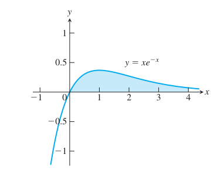
  
图 8.1 例 6 中的区域。

令 $u=x$，$dv=e^{-x}\,dx$，$v=-e^{-x}$，$du=dx$。则

$$
\begin{aligned}
\int_0^4xe^{-x}\,dx
&=\left.-xe^{-x}\right|_0^4-\int_0^4(-e^{-x})\,dx\\
&=[-4e^{-4}-(-0e^{-0})]+\int_0^4e^{-x}\,dx\\
&=-4e^{-4}-\left.e^{-x}\right|_0^4\\
&=-4e^{-4}-(e^{-4}-e^{-0})=1-5e^{-4}\approx0.91.
\end{aligned}
$$

### 表格积分法可以简化反复的分部积分

我们已经看到，形如 $\int f(x)g(x)\,dx$ 的积分，如果 $f$ 反复求导会变为零，而 $g$ 容易反复积分，就很适合用分部积分法。但是，如果需要重复许多次，符号和计算会很繁琐；也可能因为在反复分部积分时所作的选择，最后又回到原来要求的积分。在这样的情况下，有一种很好的计算组织方式，既能避免这些问题，又能简化计算，称为**表格积分法**。下面的例子说明这一方法。

**例 7** 计算 $\displaystyle\int x^2e^x\,dx$。

**解** 取 $f(x)=x^2$，$g(x)=e^x$。对 $f(x)$ 连续求导，直到结果为零；同时对 $g(x)$ 连续求原函数。这里 $e^x$ 的原函数仍是 $e^x$：

  <table style="display: inline-table; min-width: 38em; border-collapse: collapse; border: 1px solid #00a6df; text-align: center; vertical-align: middle;">
    <thead>
      <tr style="background-color: rgba(0, 166, 223, 0.12); color: #008fd3;">
        <th style="border: 1px solid #00a6df; padding: 0.55em 1em; font-weight: 700;">步骤</th>
        <th style="border: 1px solid #00a6df; padding: 0.55em 1em; font-weight: 700;">$f(x)=x^2$ 连续求导</th>
        <th style="border: 1px solid #00a6df; padding: 0.55em 1em; font-weight: 700;">$g(x)=e^x$ 连续积分</th>
        <th style="border: 1px solid #00a6df; padding: 0.55em 1em; font-weight: 700;">本步符号</th>
      </tr>
    </thead>
    <tbody>
      <tr>
        <td style="border: 1px solid #00a6df; padding: 0.5em 1em;">0</td>
        <td style="border: 1px solid #00a6df; padding: 0.5em 1em;">$x^2$</td>
        <td style="border: 1px solid #00a6df; padding: 0.5em 1em;">$e^x$</td>
        <td style="border: 1px solid #00a6df; padding: 0.5em 1em; color: #00875a; font-weight: 700;">$+$</td>
      </tr>
      <tr style="background-color: rgba(0, 166, 223, 0.04);">
        <td style="border: 1px solid #00a6df; padding: 0.5em 1em;">1</td>
        <td style="border: 1px solid #00a6df; padding: 0.5em 1em;">$2x$</td>
        <td style="border: 1px solid #00a6df; padding: 0.5em 1em;">$e^x$</td>
        <td style="border: 1px solid #00a6df; padding: 0.5em 1em; color: #c0392b; font-weight: 700;">$-$</td>
      </tr>
      <tr>
        <td style="border: 1px solid #00a6df; padding: 0.5em 1em;">2</td>
        <td style="border: 1px solid #00a6df; padding: 0.5em 1em;">$2$</td>
        <td style="border: 1px solid #00a6df; padding: 0.5em 1em;">$e^x$</td>
        <td style="border: 1px solid #00a6df; padding: 0.5em 1em; color: #00875a; font-weight: 700;">$+$</td>
      </tr>
      <tr style="background-color: rgba(0, 166, 223, 0.04);">
        <td style="border: 1px solid #00a6df; padding: 0.5em 1em;">3</td>
        <td style="border: 1px solid #00a6df; padding: 0.5em 1em;">$0$</td>
        <td style="border: 1px solid #00a6df; padding: 0.5em 1em;">$e^x$</td>
        <td style="border: 1px solid #00a6df; padding: 0.5em 1em; color: #666; font-weight: 600;">停止</td>
      </tr>
    </tbody>
  </table>

计算时，每一项取左列当前的导数，乘以右列**再积分一次**所得的函数，并依次使用 $+,-,+$ 号。因此三个乘积分别是

$$
+\,x^2\cdot e^x,\qquad
-\,2x\cdot e^x,\qquad
+\,2\cdot e^x.
$$

将这三个乘积相加，并补上积分常数，得到

$$
\int x^2e^x\,dx=x^2e^x-2xe^x+2e^x+C.
$$

这与例 3 的结果相同。

**例 8** 设在 $[-\pi,0)$ 上 $f(x)=1$，在 $[0,\pi]$ 上 $f(x)=x^3$，其中 $n$ 是正整数，求积分 $\displaystyle\frac{1}{\pi}\int_{-\pi}^{\pi}f(x)\cos nx\,dx$。

**解** 此积分为

$$
\begin{aligned}
\frac{1}{\pi}\int_{-\pi}^{\pi}f(x)\cos nx\,dx
&=\frac{1}{\pi}\int_{-\pi}^0\cos nx\,dx
+\frac{1}{\pi}\int_0^{\pi}x^3\cos nx\,dx\\
&=\left.\frac{1}{n\pi}\sin nx\right|_{-\pi}^0
+\frac{1}{\pi}\int_0^{\pi}x^3\cos nx\,dx\\
&=\frac{1}{\pi}\int_0^{\pi}x^3\cos nx\,dx.
\end{aligned}
$$

用表格积分法求原函数：

$$
\begin{array}{ccl}
f(x)\text{ 及其各阶导数}&&g(x)\text{ 及其各次积分}\\
x^3&\overset{+}{\searrow}&\cos nx\\
3x^2&\overset{-}{\searrow}&\frac{1}{n}\sin nx\\
6x&\overset{+}{\searrow}&-\frac{1}{n^2}\cos nx\\
6&\overset{-}{\searrow}&-\frac{1}{n^3}\sin nx\\
0&&\frac{1}{n^4}\cos nx
\end{array}
$$

因此

$$
\begin{aligned}
\frac{1}{\pi}\int_0^{\pi}x^3\cos nx\,dx
&=\frac{1}{\pi}\left[\frac{x^3}{n}\sin nx+\frac{3x^2}{n^2}\cos nx
-\frac{6x}{n^3}\sin nx-\frac{6}{n^4}\cos nx\right]_0^{\pi}\\
&=\frac{1}{\pi}\left(\frac{3\pi^2\cos n\pi}{n^2}-\frac{6\cos n\pi}{n^4}+\frac{6}{n^4}\right)\\
&=\frac{3}{\pi}\left(\frac{\pi^2n^2(-1)^n+2(-1)^{n+1}+2}{n^4}\right),
\end{aligned}
$$

其中使用了 $\cos n\pi=(-1)^n$。例 8 这样的积分经常出现在电气工程中。

## 8.3 三角积分

三角积分涉及六个基本三角函数的代数组合。原则上，我们总可以用正弦和余弦表示这类积分，但使用其他函数往往更简单，例如

$$
\int\sec^2x\,dx=\tan x+C.
$$

一般的思路是利用恒等式，把待求积分转化为更容易处理的积分。

### 正弦与余弦的幂的乘积

先考虑形如 $\displaystyle\int\sin^mx\cos^nx\,dx$ 的积分，其中 $m$、$n$ 是非负整数（正整数或零）。按照 $m$、$n$ 的奇偶性，适当的换元可以分成三种情形。

  

    
<b>情形 1</b> 若 $m$ 为奇数，将 $m$ 写成 $2k+1$，并利用恒等式 $\sin^2x=1-\cos^2x$，得到

    

      $$
      \sin^mx=\sin^{2k+1}x=(\sin^2x)^k\sin x=(1-\cos^2x)^k\sin x.\tag{1}
      $$
    

    
然后把单独的 $\sin x$ 与积分中的 $dx$ 合并，将 $\sin x\,dx$ 换成 $-d(\cos x)$。

    
<b>情形 2</b> 若积分 $\int\sin^mx\cos^nx\,dx$ 中 $m$ 为偶数而 $n$ 为奇数，将 $n$ 写成 $2k+1$，并利用恒等式 $\cos^2x=1-\sin^2x$，得到

    

      $$
      \cos^nx=\cos^{2k+1}x=(\cos^2x)^k\cos x=(1-\sin^2x)^k\cos x.
      $$
    

    
然后把单独的 $\cos x$ 与 $dx$ 合并，将 $\cos x\,dx$ 换成 $d(\sin x)$。

    
<b>情形 3</b> 若积分 $\int\sin^mx\cos^nx\,dx$ 中 $m$ 和 $n$ 都是偶数，代入

    

      $$
      \sin^2x=\frac{1-\cos2x}{2},\qquad\cos^2x=\frac{1+\cos2x}{2},\tag{2}
      $$
    

    
将被积函数化为含 $\cos2x$ 的较低次幂的表达式。

  

下面分别举例说明每一种情形。

**例 1** 计算 $\displaystyle\int\sin^3x\cos^2x\,dx$。

**解** 这是情形 1 的例子。

$$
\begin{aligned}
\int\sin^3x\cos^2x\,dx
&=\int\sin^2x\cos^2x\sin x\,dx&&m\text{ 是奇数}\\
&=\int(1-\cos^2x)\cos^2x[-d(\cos x)]&&\sin x\,dx=-d(\cos x)\\
&=\int(1-u^2)u^2(-du)&&u=\cos x\\
&=\int(u^4-u^2)\,du&&\text{展开乘积}\\
&=\frac{u^5}{5}-\frac{u^3}{3}+C
=\frac{\cos^5x}{5}-\frac{\cos^3x}{3}+C.
\end{aligned}
$$

**例 2** 计算 $\displaystyle\int\cos^5x\,dx$。

**解** 这是情形 2 的例子，其中 $m=0$ 是偶数，$n=5$ 是奇数。

$$
\begin{aligned}
\int\cos^5x\,dx
&=\int\cos^4x\cos x\,dx=\int(1-\sin^2x)^2\,d(\sin x)\\
&=\int(1-u^2)^2\,du&&u=\sin x\\
&=\int(1-2u^2+u^4)\,du&&\text{展开 }(1-u^2)^2\\
&=u-\frac{2}{3}u^3+\frac{1}{5}u^5+C\\
&=\sin x-\frac{2}{3}\sin^3x+\frac{1}{5}\sin^5x+C.
\end{aligned}
$$

第一步使用了 $\cos x\,dx=d(\sin x)$。

**例 3** 计算 $\displaystyle\int\sin^2x\cos^4x\,dx$。

**解** 这是情形 3 的例子。

$$
\begin{aligned}
\int\sin^2x\cos^4x\,dx
&=\int\left(\frac{1-\cos2x}{2}\right)
\left(\frac{1+\cos2x}{2}\right)^2dx&&m,n\text{ 均为偶数}\\
&=\frac{1}{8}\int(1-\cos2x)(1+2\cos2x+\cos^22x)\,dx\\
&=\frac{1}{8}\int(1+\cos2x-\cos^22x-\cos^32x)\,dx\\
&=\frac{1}{8}\left[x+\frac{1}{2}\sin2x-\int(\cos^22x+\cos^32x)\,dx\right].
\end{aligned}
$$

对于含 $\cos^22x$ 的项，使用

$$
\int\cos^22x\,dx=\frac{1}{2}\int(1+\cos4x)\,dx
=\frac{1}{2}\left(x+\frac{1}{4}\sin4x\right).
$$

这里暂时省略积分常数，直到最后结果中再加上。对于 $\cos^32x$ 项，有

$$
\begin{aligned}
\int\cos^32x\,dx
&=\int(1-\sin^22x)\cos2x\,dx\\
&=\frac{1}{2}\int(1-u^2)\,du
=\frac{1}{2}\left(\sin2x-\frac{1}{3}\sin^32x\right),
\end{aligned}
$$

其中 $u=\sin2x$，$du=2\cos2x\,dx$，并且再次省略了 $C$。合并各项并化简，得到

$$
\int\sin^2x\cos^4x\,dx
=\frac{1}{16}\left(x-\frac{1}{4}\sin4x+\frac{1}{3}\sin^32x\right)+C.
$$

### 消去平方根

下例利用恒等式 $\cos^2u=(1+\cos2u)/2$ 消去平方根。

**例 4** 计算 $\displaystyle\int_0^{\pi/4}\sqrt{1+\cos4x}\,dx$。

**解** 为消去平方根，使用恒等式

$$
\cos^2u=\frac{1+\cos2u}{2},\qquad\text{即}\qquad1+\cos2u=2\cos^2u.
$$

取 $u=2x$，得到 $1+\cos4x=2\cos^22x$。因此，

$$
\begin{aligned}
\int_0^{\pi/4}\sqrt{1+\cos4x}\,dx
&=\int_0^{\pi/4}\sqrt{2\cos^22x}\,dx
=\int_0^{\pi/4}\sqrt{2}\sqrt{\cos^22x}\,dx\\
&=\sqrt{2}\int_0^{\pi/4}|\cos2x|\,dx
=\sqrt{2}\int_0^{\pi/4}\cos2x\,dx\\
&=\sqrt{2}\left[\frac{\sin2x}{2}\right]_0^{\pi/4}
=\frac{\sqrt{2}}{2}[1-0]=\frac{\sqrt{2}}{2}.
\end{aligned}
$$

去掉绝对值的依据是在 $[0,\pi/4]$ 上 $\cos2x\ge0$。

### $\tan x$ 与 $\sec x$ 的幂的积分

我们已经知道怎样求正切、正割及其平方的积分。对于更高次幂，利用恒等式 $\tan^2x=\sec^2x-1$ 和 $\sec^2x=\tan^2x+1$，必要时使用分部积分，把高次幂降为低次幂。

**例 5** 计算 $\displaystyle\int\tan^4x\,dx$。

**解**

$$
\begin{aligned}
\int\tan^4x\,dx
&=\int\tan^2x\cdot\tan^2x\,dx
=\int\tan^2x(\sec^2x-1)\,dx\\
&=\int\tan^2x\sec^2x\,dx-\int\tan^2x\,dx\\
&=\int\tan^2x\sec^2x\,dx-\int(\sec^2x-1)\,dx\\
&=\int\tan^2x\sec^2x\,dx-\int\sec^2x\,dx+\int dx.
\end{aligned}
$$

第一个积分中令 $u=\tan x$，$du=\sec^2x\,dx$，得到 $\int u^2\,du=\frac{1}{3}u^3+C_1$。其余积分都是标准形式，所以

$$
\int\tan^4x\,dx=\frac{1}{3}\tan^3x-\tan x+x+C.
$$

**例 6** 计算 $\displaystyle\int\sec^3x\,dx$。

**解** 分部积分，取 $u=\sec x$，$dv=\sec^2x\,dx$，$v=\tan x$，$du=\sec x\tan x\,dx$。于是

$$
\begin{aligned}
\int\sec^3x\,dx
&=\sec x\tan x-\int(\tan x)(\sec x\tan x\,dx)\\
&=\sec x\tan x-\int(\sec^2x-1)\sec x\,dx
&&\tan^2x=\sec^2x-1\\
&=\sec x\tan x+\int\sec x\,dx-\int\sec^3x\,dx.
\end{aligned}
$$

合并两个正割三次方的积分，得到

$$
2\int\sec^3x\,dx=\sec x\tan x+\int\sec x\,dx,
$$

因而

$$
\int\sec^3x\,dx=\frac{1}{2}\sec x\tan x+\frac{1}{2}\ln|\sec x+\tan x|+C.
$$

**例 7** 计算 $\displaystyle\int\tan^4x\sec^4x\,dx$。

**解**

$$
\begin{aligned}
\int\tan^4x\sec^4x\,dx
&=\int\tan^4x(1+\tan^2x)\sec^2x\,dx&&\sec^2x=1+\tan^2x\\
&=\int(\tan^4x+\tan^6x)\sec^2x\,dx\\
&=\int\tan^4x\sec^2x\,dx+\int\tan^6x\sec^2x\,dx\\
&=\int u^4\,du+\int u^6\,du
=\frac{u^5}{5}+\frac{u^7}{7}+C\\
&=\frac{\tan^5x}{5}+\frac{\tan^7x}{7}+C,
\end{aligned}
$$

其中 $u=\tan x$，$du=\sec^2x\,dx$。

### 正弦与余弦的乘积

积分

$$
\int\sin mx\sin nx\,dx,\qquad
\int\sin mx\cos nx\,dx,\qquad
\int\cos mx\cos nx\,dx
$$

出现在许多涉及周期函数的应用中。可以用分部积分计算这些积分，但每一种都要作两次分部积分。使用下列恒等式更简单：

$$
\sin mx\sin nx=\frac{1}{2}[\cos(m-n)x-\cos(m+n)x],\tag{3}
$$

$$
\sin mx\cos nx=\frac{1}{2}[\sin(m-n)x+\sin(m+n)x],\tag{4}
$$

$$
\cos mx\cos nx=\frac{1}{2}[\cos(m-n)x+\cos(m+n)x].\tag{5}
$$

这些恒等式来自正弦和余弦的和角公式（第 1.3 节）。变换后所得函数的原函数很容易求出。

**例 8** 计算 $\displaystyle\int\sin3x\cos5x\,dx$。

**解** 在公式 (4) 中取 $m=3$，$n=5$，得到

$$
\begin{aligned}
\int\sin3x\cos5x\,dx
&=\frac{1}{2}\int[\sin(-2x)+\sin8x]\,dx\\
&=\frac{1}{2}\int(\sin8x-\sin2x)\,dx\\
&=-\frac{\cos8x}{16}+\frac{\cos2x}{4}+C.
\end{aligned}
$$

## 8.4 三角换元

将积分变量替换为三角函数，就得到三角换元。最常用的换元是 $x=a\tan\theta$、$x=a\sin\theta$ 和 $x=a\sec\theta$。它们能有效地把含 $\sqrt{a^2+x^2}$、$\sqrt{a^2-x^2}$ 和 $\sqrt{x^2-a^2}$ 的积分转化为可直接计算的积分，因为这些换元来自图 8.2 中的参考直角三角形。

  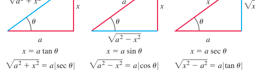
  
图 8.2 三种基本换元的参考三角形，各图标出了相应换元中边长 $x$ 和 $a$ 所在的位置。

取 $x=a\tan\theta$ 时，

$$
a^2+x^2=a^2+a^2\tan^2\theta=a^2(1+\tan^2\theta)=a^2\sec^2\theta.
$$

取 $x=a\sin\theta$ 时，

$$
a^2-x^2=a^2-a^2\sin^2\theta=a^2(1-\sin^2\theta)=a^2\cos^2\theta.
$$

取 $x=a\sec\theta$ 时，

$$
x^2-a^2=a^2\sec^2\theta-a^2=a^2(\sec^2\theta-1)=a^2\tan^2\theta.
$$

积分时所用的换元应当可逆，以便在积分后换回原变量。例如，若 $x=a\tan\theta$，希望积分后能够令 $\theta=\tan^{-1}(x/a)$。若 $x=a\sin\theta$，希望完成计算后能够令 $\theta=\sin^{-1}(x/a)$；对 $x=a\sec\theta$ 也是如此。

由第 1.6 节可知，这些换元中的函数只有在选定的 $\theta$ 范围内才有反函数（图 8.3）。为了可逆，

$$
\begin{aligned}
x=a\tan\theta&\quad\text{要求}\quad\theta=\tan^{-1}\left(\frac{x}{a}\right),
&&-\frac{\pi}{2}<\theta<\frac{\pi}{2},\\
x=a\sin\theta&\quad\text{要求}\quad\theta=\sin^{-1}\left(\frac{x}{a}\right),
&&-\frac{\pi}{2}\le\theta\le\frac{\pi}{2},\\
x=a\sec\theta&\quad\text{要求}\quad\theta=\sec^{-1}\left(\frac{x}{a}\right),
&&\begin{cases}
0\le\theta<\frac{\pi}{2},&x/a\ge1,\\
\frac{\pi}{2}<\theta\le\pi,&x/a\le-1.
\end{cases}
\end{aligned}
$$

  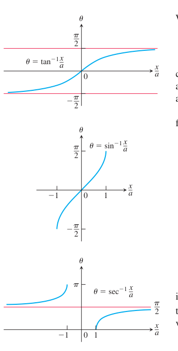
  
图 8.3 将 $x/a$ 的反正切、反正弦和反正割看作 $x/a$ 的函数所画出的图像。

为简化使用 $x=a\sec\theta$ 时的计算，我们只在 $x/a\ge1$ 的积分中使用它。这使 $\theta$ 落在 $[0,\pi/2)$ 内，从而 $\tan\theta\ge0$。只要 $a>0$，便有 $\sqrt{x^2-a^2}=\sqrt{a^2\tan^2\theta}=|a\tan\theta|=a\tan\theta$，不再含绝对值。

  

    
三角换元的步骤

    
1. 写出对 $x$ 的换元，计算微分 $dx$，并说明换元中选定的 $\theta$ 的取值范围。

    
2. 将三角表达式和算得的微分代入被积表达式，再用代数方法化简。

    
3. 计算三角积分，并记住为了使换元可逆而对角 $\theta$ 所作的限制。

    
4. 画适当的参考三角形，在积分结果中作反向换元，换回原变量 $x$。

  

**例 1** 计算 $\displaystyle\int\frac{dx}{\sqrt{4+x^2}}$。

**解** 令

$$
x=2\tan\theta,\qquad dx=2\sec^2\theta\,d\theta,\qquad
-\frac{\pi}{2}<\theta<\frac{\pi}{2},
$$

则 $4+x^2=4+4\tan^2\theta=4(1+\tan^2\theta)=4\sec^2\theta$。于是

$$
\begin{aligned}
\int\frac{dx}{\sqrt{4+x^2}}
&=\int\frac{2\sec^2\theta\,d\theta}{\sqrt{4\sec^2\theta}}
=\int\frac{\sec^2\theta\,d\theta}{|\sec\theta|}
&&\sqrt{\sec^2\theta}=|\sec\theta|\\
&=\int\sec\theta\,d\theta
&&-\pi/2<\theta<\pi/2\text{ 时 }\sec\theta>0\\
&=\ln|\sec\theta+\tan\theta|+C\\
&=\ln\left|\frac{\sqrt{4+x^2}}{2}+\frac{x}{2}\right|+C.
&&\text{由图 8.4}
\end{aligned}
$$

注意我们怎样把 $\ln|\sec\theta+\tan\theta|$ 表示成 $x$ 的函数：对原换元 $x=2\tan\theta$ 画出参考三角形（图 8.4），再从三角形读出各个比值。

  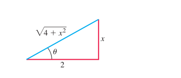
  
图 8.4 $x=2\tan\theta$ 的参考三角形（例 1）：$\tan\theta=x/2$，$\sec\theta=\sqrt{4+x^2}/2$。

**例 2** 这里求反双曲正弦函数的自然对数表达式。按与例 1 相同的步骤，可得

$$
\begin{aligned}
\int\frac{dx}{\sqrt{a^2+x^2}}
&=\int\sec\theta\,d\theta&&x=a\tan\theta,\ dx=a\sec^2\theta\,d\theta\\
&=\ln|\sec\theta+\tan\theta|+C\\
&=\ln\left|\frac{\sqrt{a^2+x^2}}{a}+\frac{x}{a}\right|+C.
&&\text{图 8.2}
\end{aligned}
$$

由表 7.9，$\sinh^{-1}(x/a)$ 也是 $1/\sqrt{a^2+x^2}$ 的原函数，因此这两个原函数只差一个常数，即

$$
\sinh^{-1}\frac{x}{a}=\ln\left|\frac{\sqrt{a^2+x^2}}{a}+\frac{x}{a}\right|+C.
$$

在此等式中令 $x=0$，得到 $0=\ln|1|+C$，所以 $C=0$。由于 $\sqrt{a^2+x^2}>|x|$，可得

  

    

      $$
      \sinh^{-1}\frac{x}{a}=\ln\left(\frac{\sqrt{a^2+x^2}}{a}+\frac{x}{a}\right).
      $$
    

  

（另见第 7.3 节习题 76。）

**例 3** 计算 $\displaystyle\int\frac{x^2\,dx}{\sqrt{9-x^2}}$。

**解** 令

$$
x=3\sin\theta,\qquad dx=3\cos\theta\,d\theta,\qquad
-\frac{\pi}{2}<\theta<\frac{\pi}{2},
$$

则 $9-x^2=9-9\sin^2\theta=9(1-\sin^2\theta)=9\cos^2\theta$。于是

$$
\begin{aligned}
\int\frac{x^2\,dx}{\sqrt{9-x^2}}
&=\int\frac{9\sin^2\theta\cdot3\cos\theta\,d\theta}{|3\cos\theta|}\\
&=9\int\sin^2\theta\,d\theta
&&-\pi/2<\theta<\pi/2\text{ 时 }\cos\theta>0\\
&=9\int\frac{1-\cos2\theta}{2}\,d\theta\\
&=\frac{9}{2}\left(\theta-\frac{\sin2\theta}{2}\right)+C\\
&=\frac{9}{2}(\theta-\sin\theta\cos\theta)+C
&&\sin2\theta=2\sin\theta\cos\theta\\
&=\frac{9}{2}\left(\sin^{-1}\frac{x}{3}-\frac{x}{3}\cdot\frac{\sqrt{9-x^2}}{3}\right)+C
&&\text{由图 8.5}\\
&=\frac{9}{2}\sin^{-1}\frac{x}{3}-\frac{x}{2}\sqrt{9-x^2}+C.
\end{aligned}
$$

  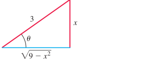
  
图 8.5 $x=3\sin\theta$ 的参考三角形（例 3）：$\sin\theta=x/3$，$\cos\theta=\sqrt{9-x^2}/3$。

**例 4** 计算 $\displaystyle\int\frac{dx}{\sqrt{25x^2-4}}$，其中 $x>\frac{2}{5}$。

**解** 先将根式改写为

$$
\sqrt{25x^2-4}=\sqrt{25\left(x^2-\frac{4}{25}\right)}
=5\sqrt{x^2-\left(\frac{2}{5}\right)^2},
$$

使根号内的表达式具有 $x^2-a^2$ 的形式。然后作换元

$$
x=\frac{2}{5}\sec\theta,\qquad
dx=\frac{2}{5}\sec\theta\tan\theta\,d\theta,\qquad0<\theta<\frac{\pi}{2}.
$$

于是

$$
\begin{aligned}
x^2-\left(\frac{2}{5}\right)^2
&=\frac{4}{25}\sec^2\theta-\frac{4}{25}
=\frac{4}{25}(\sec^2\theta-1)=\frac{4}{25}\tan^2\theta,\\
\sqrt{x^2-\left(\frac{2}{5}\right)^2}
&=\frac{2}{5}|\tan\theta|=\frac{2}{5}\tan\theta.
\end{aligned}
$$

最后一步使用了 $0<\theta<\pi/2$ 时 $\tan\theta>0$。代入后，有

$$
\begin{aligned}
\int\frac{dx}{\sqrt{25x^2-4}}
&=\int\frac{dx}{5\sqrt{x^2-4/25}}\\
&=\int\frac{(2/5)\sec\theta\tan\theta\,d\theta}{5\cdot(2/5)\tan\theta}\\
&=\frac{1}{5}\int\sec\theta\,d\theta
=\frac{1}{5}\ln|\sec\theta+\tan\theta|+C\\
&=\frac{1}{5}\ln\left|\frac{5x}{2}+\frac{\sqrt{25x^2-4}}{2}\right|+C.
&&\text{由图 8.6}
\end{aligned}
$$

  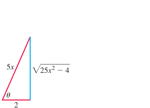
  
图 8.6 若 $x=(2/5)\sec\theta$，$0<\theta<\pi/2$，则 $\theta=\sec^{-1}(5x/2)$，并且可以从这个直角三角形读出 $\theta$ 的其他三角函数值（例 4）。

## 8.5 用部分分式法积分有理函数

本节说明如何把有理函数（两个多项式的商）表示为若干较简单分式之和，这些称为**部分分式**的分式很容易积分。例如，有理函数 $(5x-3)/(x^2-2x-3)$ 可以改写为

$$
\frac{5x-3}{x^2-2x-3}=\frac{2}{x+1}+\frac{3}{x-3}.
$$

把右边各分式通分到公分母 $(x+1)(x-3)$，即可用代数方法验证这个等式。将有理函数写成这种和的技巧在其他场合也很有用，例如利用某些变换法求解微分方程时。要对上式左边的有理函数 $(5x-3)/(x^2-2x-3)$ 积分，只需将右边各分式的积分相加：

$$
\begin{aligned}
\int\frac{5x-3}{(x+1)(x-3)}\,dx
&=\int\frac{2}{x+1}\,dx+\int\frac{3}{x-3}\,dx\\
&=2\ln|x+1|+3\ln|x-3|+C.
\end{aligned}
$$

把有理函数改写为较简单分式之和的方法称为**部分分式法**。在上例中，这个方法就是求常数 $A$ 和 $B$，使得

$$
\frac{5x-3}{x^2-2x-3}=\frac{A}{x+1}+\frac{B}{x-3}.\tag{1}
$$

（暂且假设还不知道 $A=2$ 和 $B=3$ 可以满足要求。）称 $A/(x+1)$ 和 $B/(x-3)$ 为部分分式，是因为它们的分母只是原分母 $x^2-2x-3$ 的一部分。在找到合适的数值之前，称 $A$ 和 $B$ 为**待定系数**。

为求 $A$ 和 $B$，先在公式 (1) 中去分母，并按 $x$ 的幂合并同类项，得到

$$
5x-3=A(x-3)+B(x+1)=(A+B)x-3A+B.
$$

这成为关于 $x$ 的恒等式，当且仅当两边 $x$ 的同次幂的系数相等：$A+B=5$，$-3A+B=-3$。联立求解，得到 $A=2$，$B=3$。

### 方法的一般说明

能否把有理函数 $f(x)/g(x)$ 写成部分分式之和，取决于两点：

- $f(x)$ 的次数必须小于 $g(x)$ 的次数，也就是说必须是真分式。否则，用 $g(x)$ 除 $f(x)$，再处理余项。本节例 3 说明这种情形。
- 必须知道 $g(x)$ 的因式。理论上，任何实系数多项式都可以写成实一次因式和实二次因式的乘积，但实际上这些因式可能很难求出。

下面说明在已知 $g$ 的因式时，怎样求真分式 $f(x)/g(x)$ 的部分分式。如果一个二次多项式（或因式）不能写成两个实系数一次因式的乘积，就称它**不可约**。也就是说，这个多项式没有实根。

  

    
$f(x)/g(x)$ 为真分式时的部分分式法

    
1. 设 $x-r$ 是 $g(x)$ 的一个一次因式，$(x-r)^m$ 是能够整除 $g(x)$ 的 $x-r$ 的最高次幂。对这个因式配上以下 $m$ 个部分分式之和：

    

      $$
      \frac{A_1}{x-r}+\frac{A_2}{(x-r)^2}+\cdots+\frac{A_m}{(x-r)^m}.
      $$
    

    
对 $g(x)$ 的每个不同的一次因式都这样做。

    
2. 设 $x^2+px+q$ 是 $g(x)$ 的一个不可约二次因式，因而它没有实根。设 $(x^2+px+q)^n$ 是能够整除 $g(x)$ 的这个因式的最高次幂。对它配上以下 $n$ 个部分分式之和：

    

      $$
      \frac{B_1x+C_1}{x^2+px+q}+\frac{B_2x+C_2}{(x^2+px+q)^2}
      +\cdots+\frac{B_nx+C_n}{(x^2+px+q)^n}.
      $$
    

    
对 $g(x)$ 的每个不同的二次因式都这样做。

    
3. 令原分式 $f(x)/g(x)$ 等于所有这些部分分式之和。去分母，并按 $x$ 的降幂排列各项。

    
4. 令 $x$ 的对应次幂的系数相等，求解所得方程组，确定待定系数。

  

**例 1** 用部分分式法计算 $\displaystyle\int\frac{x^2+4x+1}{(x-1)(x+1)(x+3)}\,dx$。

**解** 部分分式分解的形式为

$$
\frac{x^2+4x+1}{(x-1)(x+1)(x+3)}=\frac{A}{x-1}+\frac{B}{x+1}+\frac{C}{x+3}.
$$

为求待定系数 $A$、$B$、$C$，去分母，得到

$$
\begin{aligned}
x^2+4x+1
&=A(x+1)(x+3)+B(x-1)(x+3)+C(x-1)(x+1)\\
&=A(x^2+4x+3)+B(x^2+2x-3)+C(x^2-1)\\
&=(A+B+C)x^2+(4A+2B)x+(3A-3B-C).
\end{aligned}
$$

两边的多项式恒等，比较 $x$ 的同次幂系数，得到

$$
\begin{aligned}
x^2\text{ 的系数：}\quad&A+B+C=1,\\
x^1\text{ 的系数：}\quad&4A+2B=4,\\
x^0\text{ 的系数：}\quad&3A-3B-C=1.
\end{aligned}
$$

求解这种关于 $A$、$B$、$C$ 的线性方程组有多种方法，包括消元法或使用计算器、计算机。无论用什么方法，解都是 $A=3/4$、$B=1/2$、$C=-1/4$。因此

$$
\begin{aligned}
\int\frac{x^2+4x+1}{(x-1)(x+1)(x+3)}\,dx
&=\int\left[\frac{3}{4}\frac{1}{x-1}+\frac{1}{2}\frac{1}{x+1}-\frac{1}{4}\frac{1}{x+3}\right]dx\\
&=\frac{3}{4}\ln|x-1|+\frac{1}{2}\ln|x+1|-\frac{1}{4}\ln|x+3|+K,
\end{aligned}
$$

其中用 $K$ 表示任意积分常数，以免与记为 $C$ 的待定系数混淆。

**例 2** 用部分分式法计算 $\displaystyle\int\frac{6x+7}{(x+2)^2}\,dx$。

**解** 先将被积函数表示为含待定系数的部分分式之和：

$$
\frac{6x+7}{(x+2)^2}=\frac{A}{x+2}+\frac{B}{(x+2)^2}.
$$

两边乘以 $(x+2)^2$，得到 $6x+7=A(x+2)+B=Ax+(2A+B)$。比较对应次幂系数，有 $A=6$，$2A+B=12+B=7$，即 $A=6$，$B=-5$。因此

$$
\begin{aligned}
\int\frac{6x+7}{(x+2)^2}\,dx
&=\int\left(\frac{6}{x+2}-\frac{5}{(x+2)^2}\right)dx\\
&=6\int\frac{dx}{x+2}-5\int(x+2)^{-2}\,dx\\
&=6\ln|x+2|+5(x+2)^{-1}+C.
\end{aligned}
$$

下例说明如何处理 $f(x)/g(x)$ 为假分式的情形，其中 $f$ 的次数大于 $g$ 的次数。

**例 3** 用部分分式法计算 $\displaystyle\int\frac{2x^3-4x^2-x-3}{x^2-2x-3}\,dx$。

**解** 先用分母除分子，得到一个多项式与真分式之和。长除法的商为 $2x$，减去乘积 $2x(x^2-2x-3)=2x^3-4x^2-6x$ 后，余式为 $5x-3$。因此

$$
\frac{2x^3-4x^2-x-3}{x^2-2x-3}=2x+\frac{5x-3}{x^2-2x-3}.
$$

本节开头的例子已经求出右边分式的部分分式分解，所以

$$
\begin{aligned}
\int\frac{2x^3-4x^2-x-3}{x^2-2x-3}\,dx
&=\int2x\,dx+\int\frac{5x-3}{x^2-2x-3}\,dx\\
&=\int2x\,dx+\int\frac{2}{x+1}\,dx+\int\frac{3}{x-3}\,dx\\
&=x^2+2\ln|x+1|+3\ln|x-3|+C.
\end{aligned}
$$

**例 4** 用部分分式法计算 $\displaystyle\int\frac{-2x+4}{(x^2+1)(x-1)^2}\,dx$。

**解** 分母既有不可约二次因式，又有重复的一次因式，所以写成

$$
\frac{-2x+4}{(x^2+1)(x-1)^2}
=\frac{Ax+B}{x^2+1}+\frac{C}{x-1}+\frac{D}{(x-1)^2}.\tag{2}
$$

去分母，得到

$$
\begin{aligned}
-2x+4&=(Ax+B)(x-1)^2+C(x-1)(x^2+1)+D(x^2+1)\\
&=(A+C)x^3+(-2A+B-C+D)x^2\\
&\quad +(A-2B+C)x+(B-C+D).
\end{aligned}
$$

比较同类项的系数，得到

$$
\begin{aligned}
x^3\text{ 的系数：}\quad&0=A+C,\\
x^2\text{ 的系数：}\quad&0=-2A+B-C+D,\\
x^1\text{ 的系数：}\quad&-2=A-2B+C,\\
x^0\text{ 的系数：}\quad&4=B-C+D.
\end{aligned}
$$

联立求 $A$、$B$、$C$、$D$：

$$
\begin{aligned}
-4&=-2A,\quad A=2&&\text{第二式减第四式}\\
C&=-A=-2&&\text{由第一式}\\
B&=(A+C+2)/2=1&&\text{由第三式及 }C=-A\\
D&=4-B+C=1.&&\text{由第四式}
\end{aligned}
$$

代入公式 (2)，得到

$$
\frac{-2x+4}{(x^2+1)(x-1)^2}
=\frac{2x+1}{x^2+1}-\frac{2}{x-1}+\frac{1}{(x-1)^2}.
$$

最后，利用上面的展开式积分：

$$
\begin{aligned}
\int\frac{-2x+4}{(x^2+1)(x-1)^2}\,dx
&=\int\left(\frac{2x+1}{x^2+1}-\frac{2}{x-1}+\frac{1}{(x-1)^2}\right)dx\\
&=\int\left(\frac{2x}{x^2+1}+\frac{1}{x^2+1}-\frac{2}{x-1}+\frac{1}{(x-1)^2}\right)dx\\
&=\ln(x^2+1)+\tan^{-1}x-2\ln|x-1|-\frac{1}{x-1}+C.
\end{aligned}
$$

**例 5** 用部分分式法计算 $\displaystyle\int\frac{dx}{x(x^2+1)^2}$。

**解** 部分分式分解的形式是

$$
\frac{1}{x(x^2+1)^2}=\frac{A}{x}+\frac{Bx+C}{x^2+1}+\frac{Dx+E}{(x^2+1)^2}.
$$

乘以 $x(x^2+1)^2$，得到

$$
\begin{aligned}
1&=A(x^2+1)^2+(Bx+C)x(x^2+1)+(Dx+E)x\\
&=A(x^4+2x^2+1)+B(x^4+x^2)+C(x^3+x)+Dx^2+Ex\\
&=(A+B)x^4+Cx^3+(2A+B+D)x^2+(C+E)x+A.
\end{aligned}
$$

比较系数，得到方程组 $A+B=0$，$C=0$，$2A+B+D=0$，$C+E=0$，$A=1$。解得 $A=1$、$B=-1$、$C=0$、$D=-1$、$E=0$。因此

$$
\begin{aligned}
\int\frac{dx}{x(x^2+1)^2}
&=\int\left[\frac{1}{x}+\frac{-x}{x^2+1}+\frac{-x}{(x^2+1)^2}\right]dx\\
&=\int\frac{dx}{x}-\int\frac{x\,dx}{x^2+1}-\int\frac{x\,dx}{(x^2+1)^2}\\
&=\int\frac{dx}{x}-\frac{1}{2}\int\frac{du}{u}-\frac{1}{2}\int\frac{du}{u^2}
&&u=x^2+1,\ du=2x\,dx\\
&=\ln|x|-\frac{1}{2}\ln|u|+\frac{1}{2u}+K\\
&=\ln|x|-\frac{1}{2}\ln(x^2+1)+\frac{1}{2(x^2+1)}+K\\
&=\ln\frac{|x|}{\sqrt{x^2+1}}+\frac{1}{2(x^2+1)}+K.
\end{aligned}
$$

### 用于一次因式的海维赛德“遮盖法”

当多项式 $f(x)$ 的次数低于 $g(x)$ 的次数，而且 $g(x)=(x-r_1)(x-r_2)\cdots(x-r_n)$ 是 $n$ 个不同的一次因式的乘积、每个因式的幂次均为 1 时，有一种快速展开 $f(x)/g(x)$ 的部分分式的方法。

**历史人物简介** 奥利弗·海维赛德（Oliver Heaviside，1850–1925）。

**例 6** 求部分分式展开式

$$
\frac{x^2+1}{(x-1)(x-2)(x-3)}=\frac{A}{x-1}+\frac{B}{x-2}+\frac{C}{x-3}\tag{3}
$$

中的 $A$、$B$、$C$。

**解** 在公式 (3) 两边乘以 $x-1$，得到

$$
\frac{x^2+1}{(x-2)(x-3)}=A+\frac{B(x-1)}{x-2}+\frac{C(x-1)}{x-3}.
$$

令 $x=1$，所得等式给出 $A$ 的值：$\frac{1^2+1}{(1-2)(1-3)}=A+0+0$，所以 $A=1$。

因此，$A$ 就是在原分式

$$
\frac{x^2+1}{(x-1)(x-2)(x-3)}\tag{4}
$$

的分母中遮住因式 $x-1$，再把其余部分中的 $x$ 换成 1 所得到的数：

$$
A=\frac{1^2+1}{(1-2)(1-3)}=\frac{2}{(-1)(-2)}=1.
$$

类似地，在表达式 (4) 中遮住 $x-2$，再令其余部分中 $x=2$，就得到公式 (3) 中的 $B$：

$$
B=\frac{2^2+1}{(2-1)(2-3)}=\frac{5}{(1)(-1)}=-5.
$$

最后，在表达式 (4) 中遮住 $x-3$，再令其余部分中 $x=3$，得到

$$
C=\frac{3^2+1}{(3-1)(3-2)}=\frac{10}{(2)(1)}=5.
$$

  

    
海维赛德法

    
1. 将商写成 $g(x)$ 已因式分解的形式：

    

      $$
      \frac{f(x)}{g(x)}=\frac{f(x)}{(x-r_1)(x-r_2)\cdots(x-r_n)}.
      $$
    

    
2. 依次遮住 $g(x)$ 的一个因式 $x-r_i$，每次把所有未遮住的 $x$ 换成数 $r_i$。这样，对每个根 $r_i$ 都得到一个数 $A_i$：

    

      $$
      \begin{aligned}
      A_1&=\frac{f(r_1)}{(r_1-r_2)\cdots(r_1-r_n)},\\
      A_2&=\frac{f(r_2)}{(r_2-r_1)(r_2-r_3)\cdots(r_2-r_n)},\\
      &\ \vdots\\
      A_n&=\frac{f(r_n)}{(r_n-r_1)(r_n-r_2)\cdots(r_n-r_{n-1})}.
      \end{aligned}
      $$
    

    
3. 将 $f(x)/g(x)$ 的部分分式展开式写为

    

      $$
      \frac{f(x)}{g(x)}=\frac{A_1}{x-r_1}+\frac{A_2}{x-r_2}+\cdots+\frac{A_n}{x-r_n}.
      $$
    

  

**例 7** 用海维赛德法计算 $\displaystyle\int\frac{x+4}{x^3+3x^2-10x}\,dx$。

**解** $f(x)=x+4$ 的次数低于三次多项式 $g(x)=x^3+3x^2-10x$ 的次数。将 $g(x)$ 因式分解，得到

$$
\frac{x+4}{x^3+3x^2-10x}=\frac{x+4}{x(x-2)(x+5)}.
$$

$g(x)$ 的根是 $r_1=0$、$r_2=2$、$r_3=-5$。分别遮住 $x$、$x-2$、$x+5$，得到

$$
\begin{aligned}
A_1&=\frac{0+4}{(0-2)(0+5)}=\frac{4}{(-2)(5)}=-\frac{2}{5},\\
A_2&=\frac{2+4}{2(2+5)}=\frac{6}{(2)(7)}=\frac{3}{7},\\
A_3&=\frac{-5+4}{(-5)(-5-2)}=\frac{-1}{(-5)(-7)}=-\frac{1}{35}.
\end{aligned}
$$

因此

$$
\frac{x+4}{x(x-2)(x+5)}=-\frac{2}{5x}+\frac{3}{7(x-2)}-\frac{1}{35(x+5)},
$$

并且

$$
\int\frac{x+4}{x(x-2)(x+5)}\,dx
=-\frac{2}{5}\ln|x|+\frac{3}{7}\ln|x-2|-\frac{1}{35}\ln|x+5|+C.
$$

### 确定系数的其他方法

确定部分分式中常数的另一种方法是求导，如下例所示。还有一种方法是给 $x$ 指定一些选定的数值。

**例 8** 通过去分母、对所得等式求导并代入 $x=-1$，求等式

$$
\frac{x-1}{(x+1)^3}=\frac{A}{x+1}+\frac{B}{(x+1)^2}+\frac{C}{(x+1)^3}
$$

中的 $A$、$B$、$C$。

**解** 先去分母：$x-1=A(x+1)^2+B(x+1)+C$。代入 $x=-1$，得到 $C=-2$。然后两边对 $x$ 求导，得到 $1=2A(x+1)+B$。代入 $x=-1$，得到 $B=1$。再次求导，得到 $0=2A$，所以 $A=0$。因此

$$
\frac{x-1}{(x+1)^3}=\frac{1}{(x+1)^2}-\frac{2}{(x+1)^3}.
$$

在一些问题中，给 $x$ 指定 $0,\pm1,\pm2$ 等较小的数值，得到关于 $A$、$B$、$C$ 的方程，可以比其他方法更快。

**例 9** 通过给 $x$ 指定数值，求表达式

$$
\frac{x^2+1}{(x-1)(x-2)(x-3)}=\frac{A}{x-1}+\frac{B}{x-2}+\frac{C}{x-3}
$$

中的 $A$、$B$、$C$。

**解** 去分母，得到

$$
x^2+1=A(x-2)(x-3)+B(x-1)(x-3)+C(x-1)(x-2).
$$

然后依次令 $x=1,2,3$，求 $A$、$B$、$C$：

$$
\begin{aligned}
x=1:\quad&1^2+1=A(-1)(-2)+B(0)+C(0),&2&=2A,&A&=1,\\
x=2:\quad&2^2+1=A(0)+B(1)(-1)+C(0),&5&=-B,&B&=-5,\\
x=3:\quad&3^2+1=A(0)+B(0)+C(2)(1),&10&=2C,&C&=5.
\end{aligned}
$$

结论为

$$
\frac{x^2+1}{(x-1)(x-2)(x-3)}=\frac{1}{x-1}-\frac{5}{x-2}+\frac{5}{x-3}.
$$

## 8.6 积分表

本节讨论如何使用积分表计算积分。

### 积分表

本书书末、索引之后提供了简明积分表。（《CRC 数学用表》等汇编中有更详细的表，包含数千个积分。）积分公式用常数 $a,b,c,m,n$ 等表示。这些常数通常可以取任意实数，不一定是整数。偶尔对其取值有限制时，会在公式旁注明。例如，公式 21 要求 $n\ne-1$，公式 27 要求 $n\ne-2$。

这些公式还假定常数不取导致除以零或对负数开偶次方的值。例如，公式 24 假定 $a\ne0$，公式 29a 和 29b 只有在 $b$ 为正数时才能使用。

**例 1** 求 $\displaystyle\int x(2x+5)^{-1}\,dx$。

**解** 使用书末的公式 24（不能用要求 $n\ne-1$ 的公式 22）：

$$
\int x(ax+b)^{-1}\,dx=\frac{x}{a}-\frac{b}{a^2}\ln|ax+b|+C.
$$

取 $a=2$、$b=5$，得到

$$
\int x(2x+5)^{-1}\,dx=\frac{x}{2}-\frac{5}{4}\ln|2x+5|+C.
$$

**例 2** 求 $\displaystyle\int\frac{dx}{x\sqrt{2x-4}}$。

**解** 使用公式 29b：

$$
\int\frac{dx}{x\sqrt{ax-b}}
=\frac{2}{\sqrt{b}}\tan^{-1}\sqrt{\frac{ax-b}{b}}+C.
$$

取 $a=2$、$b=4$，得到

$$
\int\frac{dx}{x\sqrt{2x-4}}
=\frac{2}{\sqrt{4}}\tan^{-1}\sqrt{\frac{2x-4}{4}}+C
=\tan^{-1}\sqrt{\frac{x-2}{2}}+C.
$$

**例 3** 求 $\displaystyle\int x\sin^{-1}x\,dx$。

**解** 先使用公式 106：

$$
\int x^n\sin^{-1}(ax)\,dx
=\frac{x^{n+1}}{n+1}\sin^{-1}(ax)
-\frac{a}{n+1}\int\frac{x^{n+1}\,dx}{\sqrt{1-a^2x^2}},\qquad n\ne-1.
$$

取 $n=1$、$a=1$，得到

$$
\int x\sin^{-1}x\,dx=\frac{x^2}{2}\sin^{-1}x-\frac{1}{2}\int\frac{x^2\,dx}{\sqrt{1-x^2}}.
$$

然后使用公式 49 求右边的积分：

$$
\int\frac{x^2}{\sqrt{a^2-x^2}}\,dx
=\frac{a^2}{2}\sin^{-1}\left(\frac{x}{a}\right)-\frac{1}{2}x\sqrt{a^2-x^2}+C.
$$

取 $a=1$，得到

$$
\int\frac{x^2\,dx}{\sqrt{1-x^2}}=\frac{1}{2}\sin^{-1}x-\frac{1}{2}x\sqrt{1-x^2}+C.
$$

合并结果，得到

$$
\begin{aligned}
\int x\sin^{-1}x\,dx
&=\frac{x^2}{2}\sin^{-1}x-\frac{1}{2}\left(\frac{1}{2}\sin^{-1}x-\frac{1}{2}x\sqrt{1-x^2}+C\right)\\
&=\left(\frac{x^2}{2}-\frac{1}{4}\right)\sin^{-1}x+\frac{1}{4}x\sqrt{1-x^2}+C'.
\end{aligned}
$$

### 递推公式

反复分部积分所需的时间，有时可以通过使用下列递推公式缩短：

$$
\int\tan^nx\,dx=\frac{1}{n-1}\tan^{n-1}x-\int\tan^{n-2}x\,dx,\tag{1}
$$

$$
\int(\ln x)^n\,dx=x(\ln x)^n-n\int(\ln x)^{n-1}\,dx,\tag{2}
$$

$$
\int\sin^nx\cos^mx\,dx
=-\frac{\sin^{n-1}x\cos^{m+1}x}{m+n}
+\frac{n-1}{m+n}\int\sin^{n-2}x\cos^mx\,dx,\qquad n\ne-m.\tag{3}
$$

反复应用这样的公式，最终可以把原积分化成幂次足够低、能够直接计算的积分。下例说明这一过程。

**例 4** 求 $\displaystyle\int\tan^5x\,dx$。

**解** 在公式 (1) 中取 $n=5$，得到

$$
\int\tan^5x\,dx=\frac{1}{4}\tan^4x-\int\tan^3x\,dx.
$$

再在公式 (1) 中取 $n=3$，计算余下的积分：

$$
\int\tan^3x\,dx=\frac{1}{2}\tan^2x-\int\tan x\,dx
=\frac{1}{2}\tan^2x+\ln|\cos x|+C.
$$

合并结果，得到

$$
\int\tan^5x\,dx=\frac{1}{4}\tan^4x-\frac{1}{2}\tan^2x-\ln|\cos x|+C'.
$$

正如这些公式的形式所暗示的，递推公式可以利用分部积分导出。（见第 8.2 节例 5。）

### 非初等积分

能够通过符号运算求原函数的计算机和计算器的发展，使人们重新关注哪些原函数能表示为初等函数（即我们一直研究的函数）的有限组合，哪些不能。没有初等原函数的函数的积分称为**非初等积分**。这类积分有时可以用无穷级数（第 10 章）表示，或者用数值方法（第 8.7 节）近似计算。例如，衡量随机误差概率的误差函数

$$
\operatorname{erf}(x)=\frac{2}{\sqrt{\pi}}\int_0^xe^{-t^2}\,dt,
$$

以及工程和物理中出现的积分

$$
\int\sin x^2\,dx\qquad\text{和}\qquad\int\sqrt{1+x^4}\,dx.
$$

这些积分以及其他一些积分，如

$$
\begin{gathered}
\int\frac{e^x}{x}\,dx,\qquad
\int e^{e^x}\,dx,\qquad
\int\frac{1}{\ln x}\,dx,\\
\int\ln(\ln x)\,dx,\qquad
\int\frac{\sin x}{x}\,dx,\qquad
\int\sqrt{1-k^2\sin^2x}\,dx,\quad0<k<1,
\end{gathered}
$$

看起来很简单，令人忍不住想试着算一算。然而可以证明，它们无法表示为初等函数的有限组合。通过换元能化成这些形式的积分也一样。由于这些被积函数连续，根据微积分基本定理第一部分，它们都有原函数，但都不是初等函数。本章要求计算的积分具有初等原函数，不过在其他工作中，你可能遇到非初等积分。

## 8.7 数值积分

某些函数，如 $\sin(x^2)$、$1/\ln x$ 和 $\sqrt{1+x^4}$，其原函数没有初等公式。当无法为待积分函数 $f$ 找到可用的原函数时，可以划分积分区间，在每个子区间上用一个紧密拟合的多项式替代 $f$，分别积分后相加，从而近似 $f$ 的定积分。这是**数值积分**的一个例子。本节研究两种这样的方法：**梯形法则**和**辛普森法则**。叙述时假定 $f$ 为正，但实际只要求它在积分区间 $[a,b]$ 上连续。

### 梯形近似

用梯形法则求定积分，是用梯形而非矩形来近似曲线与 $x$ 轴之间的区域，如图 8.7 所示。图中的分点 $x_0,x_1,x_2,\ldots,x_n$ 不一定要等距，但等距时得到的公式较简单。因此假定每个子区间的长度为 $\Delta x=(b-a)/n$。

  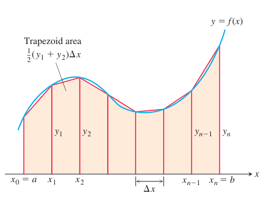
  
图 8.7 梯形法则用线段近似曲线 $y=f(x)$ 的短小部分。为近似 $f$ 从 $a$ 到 $b$ 的积分，把线段端点连到 $x$ 轴，所得各梯形的面积相加。

长度 $\Delta x=(b-a)/n$ 称为**步长**或**网格宽度**。第 $i$ 个子区间上方的梯形面积为

$$
\Delta x\left(\frac{y_{i-1}+y_i}{2}\right)=\frac{\Delta x}{2}(y_{i-1}+y_i),
$$

其中 $y_{i-1}=f(x_{i-1})$，$y_i=f(x_i)$（见图 8.7）。将所有梯形面积相加，就近似得到曲线 $y=f(x)$ 下方、$x$ 轴上方的面积：

$$
\begin{aligned}
T&=\frac{1}{2}(y_0+y_1)\Delta x+\frac{1}{2}(y_1+y_2)\Delta x+\cdots\\
&\quad+\frac{1}{2}(y_{n-2}+y_{n-1})\Delta x+\frac{1}{2}(y_{n-1}+y_n)\Delta x\\
&=\Delta x\left(\frac{1}{2}y_0+y_1+y_2+\cdots+y_{n-1}+\frac{1}{2}y_n\right)\\
&=\frac{\Delta x}{2}(y_0+2y_1+2y_2+\cdots+2y_{n-1}+y_n),
\end{aligned}
$$

其中 $y_0=f(a)$、$y_1=f(x_1)$、$\ldots$、$y_{n-1}=f(x_{n-1})$、$y_n=f(b)$。梯形法则就是说：用 $T$ 估计 $f$ 从 $a$ 到 $b$ 的积分。

  

    
梯形法则

    
为近似 $\int_a^bf(x)\,dx$，使用

    

      $$
      T=\frac{\Delta x}{2}(y_0+2y_1+2y_2+\cdots+2y_{n-1}+y_n).
      $$
    

    
各 $y$ 是 $f$ 在分点 $x_0=a$、$x_1=a+\Delta x$、$x_2=a+2\Delta x$、$\ldots$、$x_{n-1}=a+(n-1)\Delta x$、$x_n=b$ 处的值，其中 $\Delta x=(b-a)/n$。

  

**例 1** 用 $n=4$ 的梯形法则估计 $\displaystyle\int_1^2x^2\,dx$，并将估计值与精确值比较。

**解** 将 $[1,2]$ 划分为四个等长子区间（图 8.8），再计算 $y=x^2$ 在各分点处的值（表 8.2）。

  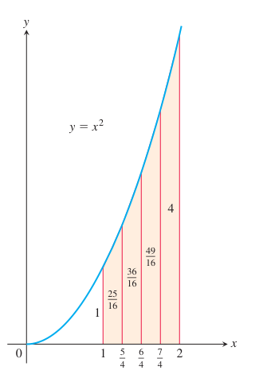
  
图 8.8 从 $x=1$ 到 $x=2$，$y=x^2$ 图像下面积的梯形近似略微偏大（例 1）。

**表 8.2**

| $x$ | $y=x^2$ |
|---|---|
| $1$ | $1$ |
| $5/4$ | $25/16$ |
| $6/4$ | $36/16$ |
| $7/4$ | $49/16$ |
| $2$ | $4$ |

把这些 $y$ 值、$n=4$ 和 $\Delta x=(2-1)/4=1/4$ 代入梯形法则，得到

$$
\begin{aligned}
T&=\frac{\Delta x}{2}(y_0+2y_1+2y_2+2y_3+y_4)\\
&=\frac{1}{8}\left(1+2\left(\frac{25}{16}\right)+2\left(\frac{36}{16}\right)+2\left(\frac{49}{16}\right)+4\right)\\
&=\frac{75}{32}=2.34375.
\end{aligned}
$$

抛物线向上凹，所以近似线段在曲线上方，每个梯形的面积都比相应曲线下方窄条的面积略大。积分的精确值是

$$
\int_1^2x^2\,dx=\left.\frac{x^3}{3}\right|_1^2=\frac{8}{3}-\frac{1}{3}=\frac{7}{3}.
$$

$T$ 比积分真值 $7/3$ 大约高估了百分之零点五。相对误差为 $(2.34375-7/3)/(7/3)\approx0.00446$，即 $0.446\%$。

### 辛普森法则：用抛物线近似

近似连续函数定积分的另一种法则，是用抛物线代替构成梯形的直线段。与前面一样，将 $[a,b]$ 分成 $n$ 个等长子区间，长度为 $h=\Delta x=(b-a)/n$，但这次要求 $n$ 为偶数。在每对相邻子区间上，用一条抛物线近似曲线 $y=f(x)\ge0$，如图 8.9。典型的抛物线经过曲线上三个相邻点 $(x_{i-1},y_{i-1})$、$(x_i,y_i)$ 和 $(x_{i+1},y_{i+1})$。

  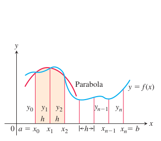
  
图 8.9 辛普森法则用抛物线近似曲线的短小部分。

计算经过三个相邻点的抛物线下方阴影区域的面积。为简化计算，先考虑 $x_0=-h$、$x_1=0$、$x_2=h$ 的情形（图 8.10），其中 $h=\Delta x=(b-a)/n$。将 $y$ 轴左右平移不会改变抛物线下方的面积。抛物线方程具有 $y=Ax^2+Bx+C$ 的形式，所以从 $x=-h$ 到 $x=h$ 的面积为

$$
\begin{aligned}
A_p&=\int_{-h}^h(Ax^2+Bx+C)\,dx\\
&=\left[\frac{Ax^3}{3}+\frac{Bx^2}{2}+Cx\right]_{-h}^h\\
&=\frac{2Ah^3}{3}+2Ch=\frac{h}{3}(2Ah^2+6C).
\end{aligned}
$$

  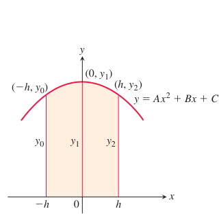
  
图 8.10 从 $-h$ 到 $h$ 积分，得到阴影面积为 $\frac{h}{3}(y_0+4y_1+y_2)$。

曲线经过 $(-h,y_0)$、$(0,y_1)$ 和 $(h,y_2)$，所以还有 $y_0=Ah^2-Bh+C$、$y_1=C$、$y_2=Ah^2+Bh+C$，由此得到

$$
C=y_1,\qquad Ah^2-Bh=y_0-y_1,\qquad Ah^2+Bh=y_2-y_1,
$$

以及 $2Ah^2=y_0+y_2-2y_1$。因此，用纵坐标 $y_0,y_1,y_2$ 表示面积 $A_p$，得到

$$
A_p=\frac{h}{3}(2Ah^2+6C)
=\frac{h}{3}[(y_0+y_2-2y_1)+6y_1]
=\frac{h}{3}(y_0+4y_1+y_2).
$$

将抛物线水平平移到图 8.9 中的阴影位置，不改变其下方面积。因此，图 8.9 中经过 $(x_0,y_0)$、$(x_1,y_1)$ 和 $(x_2,y_2)$ 的抛物线下方面积仍为 $\frac{h}{3}(y_0+4y_1+y_2)$。类似地，经过 $(x_2,y_2)$、$(x_3,y_3)$ 和 $(x_4,y_4)$ 的抛物线下方面积为 $\frac{h}{3}(y_2+4y_3+y_4)$。

计算所有抛物线下方的面积并相加，得到近似式

$$
\begin{aligned}
\int_a^bf(x)\,dx
&\approx\frac{h}{3}(y_0+4y_1+y_2)+\frac{h}{3}(y_2+4y_3+y_4)+\cdots\\
&\quad+\frac{h}{3}(y_{n-2}+4y_{n-1}+y_n)\\
&=\frac{h}{3}(y_0+4y_1+2y_2+4y_3+2y_4+\cdots+2y_{n-2}+4y_{n-1}+y_n).
\end{aligned}
$$

这个结果称为**辛普森法则**。函数不必像推导时假定的那样为正，但子区间数 $n$ 必须是偶数，因为每段抛物线弧要占用两个子区间。

**历史人物简介** 托马斯·辛普森（Thomas Simpson，1720–1761）。

  

    
辛普森法则

    
为近似 $\int_a^bf(x)\,dx$，使用

    

      $$
      S=\frac{\Delta x}{3}(y_0+4y_1+2y_2+4y_3+\cdots+2y_{n-2}+4y_{n-1}+y_n).
      $$
    

    
各 $y$ 是 $f$ 在分点 $x_0=a$、$x_1=a+\Delta x$、$x_2=a+2\Delta x$、$\ldots$、$x_{n-1}=a+(n-1)\Delta x$、$x_n=b$ 处的值。$n$ 为偶数，且 $\Delta x=(b-a)/n$。

  

注意上述法则中系数的排列规律：$1,4,2,4,2,4,2,\ldots,4,1$。

**例 2** 用 $n=4$ 的辛普森法则近似 $\displaystyle\int_0^25x^4\,dx$。

**解** 将 $[0,2]$ 分为四个子区间，并计算 $y=5x^4$ 在分点处的值（表 8.3）。然后用 $n=4$、$\Delta x=1/2$ 的辛普森法则：

**表 8.3**

| $x$ | $y=5x^4$ |
|---|---|
| $0$ | $0$ |
| $1/2$ | $5/16$ |
| $1$ | $5$ |
| $3/2$ | $405/16$ |
| $2$ | $80$ |

$$
\begin{aligned}
S&=\frac{\Delta x}{3}(y_0+4y_1+2y_2+4y_3+y_4)\\
&=\frac{1}{6}\left(0+4\left(\frac{5}{16}\right)+2(5)+4\left(\frac{405}{16}\right)+80\right)\\
&=32\frac{1}{12}.
\end{aligned}
$$

这个估计值与精确值 32 仅相差 $1/12$，百分误差不到 $0.3\%$，而这里只用了四个子区间。

### 误差分析

每次使用近似方法时，都会遇到近似值究竟有多准确的问题。下面的定理给出使用梯形法则和辛普森法则时估计误差的公式。误差是法则给出的近似值与定积分 $\int_a^bf(x)\,dx$ 的实际值之间的差。

  

    
定理 1——梯形法则和辛普森法则的误差估计

    
若 $f''$ 连续，$M$ 是 $[a,b]$ 上 $|f''|$ 的任意一个上界，则用 $n$ 步梯形近似计算 $f$ 从 $a$ 到 $b$ 的积分时，误差 $E_T$ 满足

    

      $$
      |E_T|\le\frac{M(b-a)^3}{12n^2}.\qquad\text{梯形法则}
      $$
    

    
若 $f^{(4)}$ 连续，$M$ 是 $[a,b]$ 上 $|f^{(4)}|$ 的任意一个上界，则用 $n$ 步辛普森近似计算 $f$ 从 $a$ 到 $b$ 的积分时，误差 $E_S$ 满足

    

      $$
      |E_S|\le\frac{M(b-a)^5}{180n^4}.\qquad\text{辛普森法则}
      $$
    

  

为说明定理 1 对梯形法则为何成立，从高等微积分的一个结果出发：若 $f''$ 在 $[a,b]$ 上连续，则对 $a$ 与 $b$ 之间的某个数 $c$，有

$$
\int_a^bf(x)\,dx=T-\frac{b-a}{12}f''(c)(\Delta x)^2.
$$

因此，当 $\Delta x$ 趋于零时，按

$$
E_T=-\frac{b-a}{12}f''(c)(\Delta x)^2
$$

定义的误差以 $\Delta x$ 的平方的速度趋于零。不等式

$$
|E_T|\le\frac{b-a}{12}\max|f''(x)|(\Delta x)^2
$$

给出误差大小的上界，其中最大值是在 $[a,b]$ 上取的。实际中通常无法求出 $\max|f''(x)|$ 的精确值，只能估计它的上界，即“最坏情况”的值。若 $M$ 是 $[a,b]$ 上 $|f''(x)|$ 的任意上界，即该区间内 $|f''(x)|\le M$，则

$$
|E_T|\le\frac{b-a}{12}M(\Delta x)^2.
$$

用 $(b-a)/n$ 替换 $\Delta x$，得到 $|E_T|\le M(b-a)^3/(12n^2)$。

为估计辛普森法则的误差，从高等微积分的另一结果出发：若四阶导数 $f^{(4)}$ 连续，则对 $a$ 与 $b$ 之间的某点 $c$，

$$
\int_a^bf(x)\,dx=S-\frac{b-a}{180}f^{(4)}(c)(\Delta x)^4.
$$

所以，当 $\Delta x$ 趋于零时，误差

$$
E_S=-\frac{b-a}{180}f^{(4)}(c)(\Delta x)^4
$$

以 $\Delta x$ 的四次方的速度趋于零。（这有助于解释为何辛普森法则通常比梯形法则给出更好的结果。）不等式

$$
|E_S|\le\frac{b-a}{180}\max|f^{(4)}(x)|(\Delta x)^4
$$

给出误差大小的上界，其中最大值在 $[a,b]$ 上取。与梯形法则误差公式中的 $\max|f''|$ 一样，通常无法找到 $\max|f^{(4)}(x)|$ 的精确值，必须用其上界替代。若 $M$ 是 $[a,b]$ 上 $|f^{(4)}|$ 的任意上界，则

$$
|E_S|\le\frac{b-a}{180}M(\Delta x)^4.
$$

在上式中用 $(b-a)/n$ 替换 $\Delta x$，得到 $|E_S|\le M(b-a)^5/(180n^4)$。

**例 3** 求用 $n=4$ 的辛普森法则估计 $\displaystyle\int_0^25x^4\,dx$ 时的误差上界（例 2）。

**解** 先求 $f(x)=5x^4$ 的四阶导数的绝对值在 $0\le x\le2$ 上的上界 $M$。由于四阶导数是常数 $f^{(4)}(x)=120$，取 $M=120$。由 $b-a=2$、$n=4$，辛普森法则误差估计给出

$$
|E_S|\le\frac{M(b-a)^5}{180n^4}=\frac{120(2)^5}{180\cdot4^4}=\frac{1}{12}.
$$

这个估计与例 2 的结果一致。

如果给定误差容限，定理 1 也可用于估计梯形法则或辛普森法则所需的子区间数。

**例 4** 估计用辛普森法则近似例 3 中的积分、并使误差绝对值小于 $10^{-4}$ 时所需的最少子区间数。

**解** 由定理 1 的不等式，如果选择子区间数 $n$ 使 $M(b-a)^5/(180n^4)<10^{-4}$，则辛普森法则的误差就满足要求 $|E_S|<10^{-4}$。

由例 3，$M=120$、$b-a=2$，所以要求

$$
\frac{120(2)^5}{180n^4}<\frac{1}{10^4},\qquad\text{等价于}\qquad
n^4>\frac{64\cdot10^4}{3}.
$$

因此 $n>10(64/3)^{1/4}\approx21.5$。辛普森法则要求 $n$ 是偶数，所以估计达到误差容限所需的最少子区间数为 $n=22$。

**例 5** 正如第 7 章所见，$\ln2$ 的值可以由积分 $\ln2=\int_1^2(1/x)\,dx$ 计算。

表 8.4 给出不同 $n$ 值下，近似 $\int_1^2(1/x)\,dx$ 的 $T$ 值和 $S$ 值。注意辛普森法则相对于梯形法则的显著改进。

**表 8.4 $\ln2=\int_1^2(1/x)\,dx$ 的梯形近似 $T_n$ 和辛普森近似 $S_n$**

| $n$ | $T_n$ | $|\text{误差}|$ 小于…… | $S_n$ | $|\text{误差}|$ 小于…… |
|---|---|---|---|---|
| 10 | 0.6937714032 | 0.0006242227 | 0.6931502307 | 0.0000030502 |
| 20 | 0.6933033818 | 0.0001562013 | 0.6931473747 | 0.0000001942 |
| 30 | 0.6932166154 | 0.0000694349 | 0.6931472190 | 0.0000000385 |
| 40 | 0.6931862400 | 0.0000390595 | 0.6931471927 | 0.0000000122 |
| 50 | 0.6931721793 | 0.0000249988 | 0.6931471856 | 0.0000000050 |
| 100 | 0.6931534305 | 0.0000062500 | 0.6931471809 | 0.0000000004 |

尤其要注意，当 $n$ 加倍（从而 $h=\Delta x$ 减半）时，$T$ 的误差约除以 $2^2$，而 $S$ 的误差约除以 $2^4$。

当 $\Delta x=(2-1)/n$ 变得很小时，这种效果非常显著。$n=50$ 的辛普森近似四舍五入后精确到小数点后七位；$n=100$ 时则符合到小数点后九位，即十亿分之一！

若 $f(x)$ 是次数小于 4 的多项式，四阶导数为零，且

$$
E_S=-\frac{b-a}{180}f^{(4)}(c)(\Delta x)^4
=-\frac{b-a}{180}(0)(\Delta x)^4=0.
$$

因此，用辛普森法则近似 $f$ 的任何积分都没有误差。换言之，如果 $f$ 是常数、一次函数、二次或三次多项式，无论划分多少个子区间，辛普森法则都给出积分的精确值。类似地，若 $f$ 是常数或一次函数，其二阶导数为零，并且

$$
E_T=-\frac{b-a}{12}f''(c)(\Delta x)^2
=-\frac{b-a}{12}(0)(\Delta x)^2=0.
$$

因此，梯形法则也给出 $f$ 的任何积分的精确值。这并不意外，因为此时梯形与图像完全吻合。

尽管理论上减小步长 $\Delta x$ 会减小辛普森近似和梯形近似的误差，实际中却未必如此。当 $\Delta x$ 很小，例如 $10^{-8}$，计算 $S$ 和 $T$ 所需运算中的计算机或计算器舍入误差可能累积到使上述误差公式不再反映实际情况的程度。将 $\Delta x$ 缩到某个大小以下，反而可能使结果更差。如果使用本节法则时遇到舍入误差问题，应参考数值分析教材中的更精细方法。

**例 6** 某镇要排干并填平一片受污染的小沼泽（图 8.11）。沼泽平均深 5 英尺。排水后，大约需要多少立方码泥土来填平？

  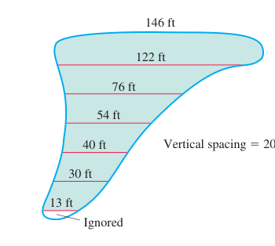
  
图 8.11 例 6 中沼泽的尺寸。测线间距为 20 英尺。

**解** 先估计表面积，再乘以 5，得到沼泽体积。为估计面积，使用辛普森法则，取 $\Delta x=20$ 英尺，各 $y$ 为图 8.11 中横跨沼泽的实测距离：

$$
\begin{aligned}
S&=\frac{\Delta x}{3}(y_0+4y_1+2y_2+4y_3+2y_4+4y_5+y_6)\\
&=\frac{20}{3}(146+488+152+216+80+120+13)=8100.
\end{aligned}
$$

体积约为 $(8100)(5)=40\,500$ 立方英尺，即 1500 立方码。

## 8.8 反常积分

到目前为止，定积分必须满足两个条件。第一，积分区间 $[a,b]$ 必须有限；第二，被积函数在该区间上的值域必须有界。实际中，可能遇到不满足其中一个或两个条件的问题。曲线 $y=(\ln x)/x^2$ 下方从 $x=1$ 到 $x=\infty$ 的面积积分，就是积分区间无限的例子（图 8.12a）。曲线 $y=1/\sqrt{x}$ 下方从 $x=0$ 到 $x=1$ 的面积积分，就是被积函数值域无界的例子（图 8.12b）。这两类积分都称为**反常积分**，并通过极限计算。第 8.9 节将看到，反常积分在概率中起重要作用。它们也可用于第 10 章中研究某些无穷级数的收敛性。

  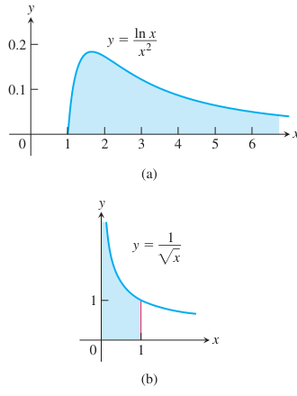
  
图 8.12 这些无限延伸的曲线下方的面积是有限的吗？我们将看到，两条曲线的答案都是肯定的。

### 无穷积分限

考虑第一象限中曲线 $y=e^{-x/2}$ 下方、向右无界的无限区域（图 8.13a）。你可能认为它的面积无限，但我们会看到面积值有限。按以下方式赋予它面积值：先求右边界为 $x=b$ 的那部分区域的面积 $A(b)$（图 8.13b）：

$$
A(b)=\int_0^be^{-x/2}\,dx=\left.-2e^{-x/2}\right|_0^b=-2e^{-b/2}+2.
$$

再求 $b\to\infty$ 时 $A(b)$ 的极限：

$$
\lim_{b\to\infty}A(b)=\lim_{b\to\infty}(-2e^{-b/2}+2)=2.
$$

赋予曲线下方从 0 到 $\infty$ 的面积值为

$$
\int_0^\infty e^{-x/2}\,dx=\lim_{b\to\infty}\int_0^be^{-x/2}\,dx=2.
$$

  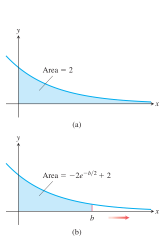
  
图 8.13 (a) 第一象限中曲线 $y=e^{-x/2}$ 下方的面积。(b) 该面积是第一类反常积分。

  

    
定义

    
具有无穷积分限的积分称为<b>第一类反常积分</b>。

    
1. 若 $f(x)$ 在 $[a,\infty)$ 上连续，则

    

      $$
      \int_a^\infty f(x)\,dx=\lim_{b\to\infty}\int_a^bf(x)\,dx.
      $$
    

    
2. 若 $f(x)$ 在 $(-\infty,b]$ 上连续，则

    

      $$
      \int_{-\infty}^bf(x)\,dx=\lim_{a\to-\infty}\int_a^bf(x)\,dx.
      $$
    

    
3. 若 $f(x)$ 在 $(-\infty,\infty)$ 上连续，则

    

      $$
      \int_{-\infty}^\infty f(x)\,dx
      =\int_{-\infty}^cf(x)\,dx+\int_c^\infty f(x)\,dx,
      $$
    

    
其中 $c$ 为任意实数。

    
在每一种情形中，若相应极限为有限值，就称反常积分<b>收敛</b>，极限就是反常积分的值；若极限不存在，就称反常积分<b>发散</b>。

  

可以证明，定义第 3 项中 $c$ 的选择不影响结果。可以选取任意方便的 $c$，计算 $\int_{-\infty}^\infty f(x)\,dx$，或判断其收敛、发散。

如果 $f\ge0$ 在积分区间上成立，上述定义中的积分都可解释为面积。例如，图 8.13 的反常积分就解释为面积，其有限值为 2。若 $f\ge0$ 而反常积分发散，则称曲线下方的面积为无限大。

**例 1** 曲线 $y=(\ln x)/x^2$ 下方从 $x=1$ 到 $x=\infty$ 的面积有限吗？若有限，其值是多少？

**解** 求曲线下方从 $x=1$ 到 $x=b$ 的面积，并考察 $b\to\infty$ 时的极限。若极限有限，就把它作为曲线下方的面积（图 8.14）。从 1 到 $b$ 的面积为

$$
\begin{aligned}
\int_1^b\frac{\ln x}{x^2}\,dx
&=\left[(\ln x)\left(-\frac{1}{x}\right)\right]_1^b
-\int_1^b\left(-\frac{1}{x}\right)\left(\frac{1}{x}\right)dx\\
&=-\frac{\ln b}{b}-\left[\frac{1}{x}\right]_1^b
=-\frac{\ln b}{b}-\frac{1}{b}+1.
\end{aligned}
$$

这里分部积分取 $u=\ln x$、$dv=dx/x^2$、$du=dx/x$、$v=-1/x$。

  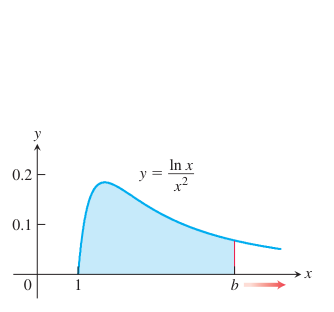
  
图 8.14 这条曲线下方的面积是一个反常积分（例 1）。

当 $b\to\infty$ 时，面积的极限为

$$
\begin{aligned}
\int_1^\infty\frac{\ln x}{x^2}\,dx
&=\lim_{b\to\infty}\int_1^b\frac{\ln x}{x^2}\,dx\\
&=\lim_{b\to\infty}\left[-\frac{\ln b}{b}-\frac{1}{b}+1\right]\\
&=-\left[\lim_{b\to\infty}\frac{\ln b}{b}\right]-0+1\\
&=-\left[\lim_{b\to\infty}\frac{1/b}{1}\right]+1=0+1=1.
&&\text{洛必达法则}
\end{aligned}
$$

因此，反常积分收敛，面积的有限值为 1。

**例 2** 计算 $\displaystyle\int_{-\infty}^\infty\frac{dx}{1+x^2}$。

**解** 根据定义第 3 项，可以选择 $c=0$，写成

$$
\int_{-\infty}^\infty\frac{dx}{1+x^2}
=\int_{-\infty}^0\frac{dx}{1+x^2}+\int_0^\infty\frac{dx}{1+x^2}.
$$

分别计算右边两个反常积分：

$$
\begin{aligned}
\int_{-\infty}^0\frac{dx}{1+x^2}
&=\lim_{a\to-\infty}\int_a^0\frac{dx}{1+x^2}
=\lim_{a\to-\infty}\left.\tan^{-1}x\right|_a^0\\
&=\lim_{a\to-\infty}(\tan^{-1}0-\tan^{-1}a)
=0-\left(-\frac{\pi}{2}\right)=\frac{\pi}{2},\\
\int_0^\infty\frac{dx}{1+x^2}
&=\lim_{b\to\infty}\int_0^b\frac{dx}{1+x^2}
=\lim_{b\to\infty}\left.\tan^{-1}x\right|_0^b\\
&=\lim_{b\to\infty}(\tan^{-1}b-\tan^{-1}0)
=\frac{\pi}{2}-0=\frac{\pi}{2}.
\end{aligned}
$$

所以 $\int_{-\infty}^\infty dx/(1+x^2)=\pi/2+\pi/2=\pi$。由于 $1/(1+x^2)>0$，这个反常积分可以解释为曲线下方、$x$ 轴上方的有限面积（图 8.15）。

  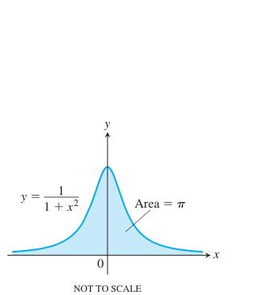
  
图 8.15 这条曲线下方的面积有限（例 2）。图形未按比例绘制。

**历史人物简介** 勒热讷·狄利克雷（Lejeune Dirichlet，1805–1859）。

### 积分 $\displaystyle\int_1^\infty\frac{dx}{x^p}$

对于被积函数形如 $y=1/x^p$ 的反常积分，函数 $y=1/x$ 是收敛与发散的分界。下例表明，$p>1$ 时积分收敛，$p\le1$ 时积分发散。

**例 3** $p$ 取什么值时积分 $\displaystyle\int_1^\infty dx/x^p$ 收敛？收敛时其值是多少？

**解** 若 $p\ne1$，则

$$
\int_1^b\frac{dx}{x^p}
=\left.\frac{x^{-p+1}}{-p+1}\right|_1^b
=\frac{1}{1-p}(b^{-p+1}-1)
=\frac{1}{1-p}\left(\frac{1}{b^{p-1}}-1\right).
$$

因此

$$
\begin{aligned}
\int_1^\infty\frac{dx}{x^p}
&=\lim_{b\to\infty}\int_1^b\frac{dx}{x^p}\\
&=\lim_{b\to\infty}\left[\frac{1}{1-p}\left(\frac{1}{b^{p-1}}-1\right)\right]
=\begin{cases}\frac{1}{p-1},&p>1,\\+\infty,&p<1,\end{cases}
\end{aligned}
$$

因为 $\lim_{b\to\infty}1/b^{p-1}=0$（$p>1$）或 $+\infty$（$p<1$）。因此，$p>1$ 时积分收敛于 $1/(p-1)$，$p<1$ 时发散。

若 $p=1$，积分也发散：

$$
\begin{aligned}
\int_1^\infty\frac{dx}{x^p}
&=\int_1^\infty\frac{dx}{x}
=\lim_{b\to\infty}\int_1^b\frac{dx}{x}\\
&=\lim_{b\to\infty}\left.\ln x\right|_1^b
=\lim_{b\to\infty}(\ln b-\ln1)=+\infty.
\end{aligned}
$$

### 具有竖直渐近线的被积函数

另一类反常积分出现在被积函数于积分端点或内部某点具有竖直渐近线，即无穷间断点时。若 $f$ 在积分区间上为正，仍可将反常积分解释为两积分限之间、$f$ 的图像下方和 $x$ 轴上方的面积。

考虑第一象限中曲线 $y=1/\sqrt{x}$ 下方从 $x=0$ 到 $x=1$ 的区域（图 8.12b）。先求从 $a$ 到 1 的部分面积（图 8.16）：

$$
\int_a^1\frac{dx}{\sqrt{x}}=\left.2\sqrt{x}\right|_a^1=2-2\sqrt{a}.
$$

  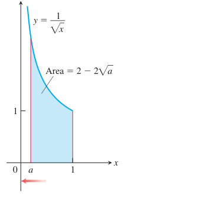
  
图 8.16 这条曲线下方的面积是第二类反常积分的例子。

再求 $a\to0^+$ 时的面积极限：

$$
\lim_{a\to0^+}\int_a^1\frac{dx}{\sqrt{x}}
=\lim_{a\to0^+}(2-2\sqrt{a})=2.
$$

因此，曲线下方从 0 到 1 的面积有限，定义为

$$
\int_0^1\frac{dx}{\sqrt{x}}=\lim_{a\to0^+}\int_a^1\frac{dx}{\sqrt{x}}=2.
$$

  

    
定义

    
函数在积分区间的某点趋于无穷时，其积分称为<b>第二类反常积分</b>。

    
1. 若 $f(x)$ 在 $(a,b]$ 上连续，在 $a$ 处间断，则

    

      $$
      \int_a^bf(x)\,dx=\lim_{c\to a^+}\int_c^bf(x)\,dx.
      $$
    

    
2. 若 $f(x)$ 在 $[a,b)$ 上连续，在 $b$ 处间断，则

    

      $$
      \int_a^bf(x)\,dx=\lim_{c\to b^-}\int_a^cf(x)\,dx.
      $$
    

    
3. 若 $f(x)$ 在 $c$ 处间断，其中 $a<c<b$，而在 $[a,c)\cup(c,b]$ 上连续，则

    

      $$
      \int_a^bf(x)\,dx=\int_a^cf(x)\,dx+\int_c^bf(x)\,dx.
      $$
    

    
在每一种情形中，若相应极限有限，就称反常积分<b>收敛</b>，该极限是反常积分的值；若极限不存在，则积分<b>发散</b>。

  

定义第 3 项中，只有右边两个积分都收敛时，左边的积分才收敛；否则发散。

**例 4** 研究 $\displaystyle\int_0^1\frac{1}{1-x}\,dx$ 的收敛性。

**解** 被积函数 $f(x)=1/(1-x)$ 在 $[0,1)$ 上连续，但在 $x=1$ 处间断，并在 $x\to1^-$ 时趋于无穷（图 8.17）。计算

$$
\begin{aligned}
\lim_{b\to1^-}\int_0^b\frac{1}{1-x}\,dx
&=\lim_{b\to1^-}\left[-\ln|1-x|\right]_0^b\\
&=\lim_{b\to1^-}[-\ln(1-b)+0]=+\infty.
\end{aligned}
$$

极限为无穷，所以积分发散。

  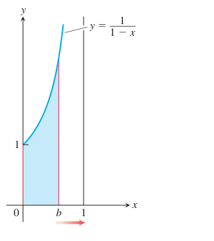
  
图 8.17 在 $[0,1)$ 上曲线下方、$x$ 轴上方的面积不是一个有限实数（例 4）。

**例 5** 计算 $\displaystyle\int_0^3\frac{dx}{(x-1)^{2/3}}$。

**解** 被积函数在 $x=1$ 处有竖直渐近线，在 $[0,1)$ 和 $(1,3]$ 上连续（图 8.18）。因此，由定义第 3 项，

$$
\int_0^3\frac{dx}{(x-1)^{2/3}}
=\int_0^1\frac{dx}{(x-1)^{2/3}}+\int_1^3\frac{dx}{(x-1)^{2/3}}.
$$

分别计算右边的反常积分：

$$
\begin{aligned}
\int_0^1\frac{dx}{(x-1)^{2/3}}
&=\lim_{b\to1^-}\int_0^b\frac{dx}{(x-1)^{2/3}}\\
&=\lim_{b\to1^-}\left.3(x-1)^{1/3}\right|_0^b\\
&=\lim_{b\to1^-}[3(b-1)^{1/3}+3]=3,\\
\int_1^3\frac{dx}{(x-1)^{2/3}}
&=\lim_{c\to1^+}\int_c^3\frac{dx}{(x-1)^{2/3}}\\
&=\lim_{c\to1^+}\left.3(x-1)^{1/3}\right|_c^3\\
&=\lim_{c\to1^+}[3(3-1)^{1/3}-3(c-1)^{1/3}]=3\sqrt[3]{2}.
\end{aligned}
$$

结论为 $\int_0^3 dx/(x-1)^{2/3}=3+3\sqrt[3]{2}$。

  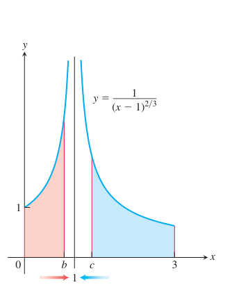
  
图 8.18 例 5 表明，这条曲线下方的面积存在，因而是一个实数。

### 收敛与发散的判别法

无法直接计算反常积分时，可以尝试判断它收敛还是发散。若发散，问题就结束了；若收敛，可以用数值方法近似其值。主要判别法是**直接比较判别法**和**极限比较判别法**。

**例 6** 积分 $\displaystyle\int_1^\infty e^{-x^2}\,dx$ 收敛吗？

**解** 按定义，

$$
\int_1^\infty e^{-x^2}\,dx=\lim_{b\to\infty}\int_1^be^{-x^2}\,dx.
$$

不能直接计算这个积分，因为它是非初等积分。但可以证明 $b\to\infty$ 时其极限有限。$\int_1^be^{-x^2}\,dx$ 是 $b$ 的递增函数，因此 $b\to\infty$ 时，它或者趋于无穷，或者有有限极限。它不会趋于无穷：对每个 $x\ge1$，有 $e^{-x^2}\le e^{-x}$（图 8.19），所以

$$
\int_1^be^{-x^2}\,dx\le\int_1^be^{-x}\,dx=-e^{-b}+e^{-1}<e^{-1}\approx0.36788.
$$

因此，$\int_1^\infty e^{-x^2}\,dx=\lim_{b\to\infty}\int_1^be^{-x^2}\,dx$ 收敛于某个确定的有限值。除了知道它为正且小于 0.37，我们并不知道其精确值。这里依赖了附录 6 所讨论的实数完备性。

  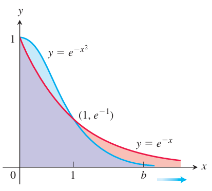
  
图 8.19 当 $x>1$ 时，$e^{-x^2}$ 的图像位于 $e^{-x}$ 的图像下方（例 6）。

例 6 对 $e^{-x^2}$ 与 $e^{-x}$ 的比较，是以下判别法的特例。

  

    
定理 2——直接比较判别法

    
设 $f$ 和 $g$ 在 $[a,\infty)$ 上连续，且对所有 $x\ge a$，有 $0\le f(x)\le g(x)$。则：

    
1. 若 $\int_a^\infty g(x)\,dx$ 收敛，则 $\int_a^\infty f(x)\,dx$ 收敛。

    
2. 若 $\int_a^\infty f(x)\,dx$ 发散，则 $\int_a^\infty g(x)\,dx$ 发散。

  

**证明** 建立定理 2 的推理与例 6 类似。若 $x\ge a$ 时 $0\le f(x)\le g(x)$，则由第 5.3 节定理 2 的法则 7，

$$
\int_a^bf(x)\,dx\le\int_a^bg(x)\,dx,\qquad b>a.
$$

由此，像例 6 那样可得：若 $\int_a^\infty g(x)\,dx$ 收敛，则 $\int_a^\infty f(x)\,dx$ 收敛。取逆否命题便得：若 $\int_a^\infty f(x)\,dx$ 发散，则 $\int_a^\infty g(x)\,dx$ 发散。

虽然定理是对第一类反常积分叙述的，但类似结果对第二类反常积分也成立。

**例 7** 下面的例子说明如何使用定理 2。

(a) $\displaystyle\int_1^\infty\frac{\sin^2x}{x^2}\,dx$ 收敛，因为在 $[1,\infty)$ 上 $0\le\sin^2x/x^2\le1/x^2$，而由例 3，$\int_1^\infty(1/x^2)\,dx$ 收敛。

(b) $\displaystyle\int_1^\infty\frac{1}{\sqrt{x^2-0.1}}\,dx$ 发散，因为在 $[1,\infty)$ 上 $1/\sqrt{x^2-0.1}\ge1/x$，而由例 3，$\int_1^\infty(1/x)\,dx$ 发散。

(c) $\displaystyle\int_0^{\pi/2}\frac{\cos x}{\sqrt{x}}\,dx$ 收敛，因为在积分区间内 $0\le\cos x/\sqrt{x}\le1/\sqrt{x}$，而

$$
\begin{aligned}
\int_0^{\pi/2}\frac{dx}{\sqrt{x}}
&=\lim_{a\to0^+}\int_a^{\pi/2}\frac{dx}{\sqrt{x}}\\
&=\lim_{a\to0^+}\left.\sqrt{4x}\right|_a^{\pi/2}&&2\sqrt{x}=\sqrt{4x}\\
&=\lim_{a\to0^+}(\sqrt{2\pi}-\sqrt{4a})=\sqrt{2\pi}
\end{aligned}
$$

收敛。

  

    
定理 3——极限比较判别法

    
若正函数 $f$ 和 $g$ 在 $[a,\infty)$ 上连续，且

    

      $$
      \lim_{x\to\infty}\frac{f(x)}{g(x)}=L,\qquad0<L<\infty,
      $$
    

    
则 $\int_a^\infty f(x)\,dx$ 与 $\int_a^\infty g(x)\,dx$ 同时收敛或同时发散。

  

这里省略定理 3 的证明。

两个函数从 $a$ 到 $\infty$ 的反常积分都收敛，并不意味着它们的积分值相同，如下例所示。

**例 8** 通过与 $\displaystyle\int_1^\infty(1/x^2)\,dx$ 比较，证明 $\displaystyle\int_1^\infty dx/(1+x^2)$ 收敛，并求出、比较这两个积分的值。

**解** 函数 $f(x)=1/x^2$ 和 $g(x)=1/(1+x^2)$ 在 $[1,\infty)$ 上为正且连续。此外，

$$
\begin{aligned}
\lim_{x\to\infty}\frac{f(x)}{g(x)}
&=\lim_{x\to\infty}\frac{1/x^2}{1/(1+x^2)}
=\lim_{x\to\infty}\frac{1+x^2}{x^2}\\
&=\lim_{x\to\infty}\left(\frac{1}{x^2}+1\right)=0+1=1,
\end{aligned}
$$

是正的有限极限（图 8.20）。因此，由 $\int_1^\infty dx/x^2$ 收敛，得到 $\int_1^\infty dx/(1+x^2)$ 收敛。但是，两个积分收敛于不同的值：由例 3，

$$
\int_1^\infty\frac{dx}{x^2}=\frac{1}{2-1}=1,
$$

而

$$
\begin{aligned}
\int_1^\infty\frac{dx}{1+x^2}
&=\lim_{b\to\infty}\int_1^b\frac{dx}{1+x^2}\\
&=\lim_{b\to\infty}[\tan^{-1}b-\tan^{-1}1]
=\frac{\pi}{2}-\frac{\pi}{4}=\frac{\pi}{4}.
\end{aligned}
$$

  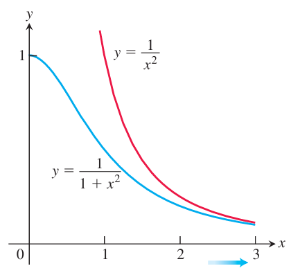
  
图 8.20 例 8 中的函数。

**例 9** 研究 $\displaystyle\int_1^\infty\frac{1-e^{-x}}{x}\,dx$ 的收敛性。

**解** 被积函数提示我们比较 $f(x)=(1-e^{-x})/x$ 和 $g(x)=1/x$。但是不能使用直接比较判别法，因为 $f(x)\le g(x)$，而 $g(x)$ 的积分发散。另一方面，使用极限比较判别法，有

$$
\lim_{x\to\infty}\frac{f(x)}{g(x)}
=\lim_{x\to\infty}\left(\frac{1-e^{-x}}{x}\right)\left(\frac{x}{1}\right)
=\lim_{x\to\infty}(1-e^{-x})=1,
$$

为正的有限极限。因此，由 $\int_1^\infty dx/x$ 发散，得到 $\int_1^\infty(1-e^{-x})/x\,dx$ 发散。表 8.5 给出该反常积分的近似过程。注意，当 $b\to\infty$ 时，这些值看来没有趋向任何固定的极限值。

**表 8.5**

  <table style="display: inline-table; min-width: 30em; border-collapse: collapse; border: 1px solid #a8a8a8; text-align: center; vertical-align: middle;">
    <thead>
      <tr>
        <th style="border: 1px solid #a8a8a8; padding: 0.6em 1.2em; font-weight: 700;">$b$</th>
        <th style="border: 1px solid #a8a8a8; padding: 0.6em 1.5em; font-weight: 700;">$\displaystyle\int_1^b\frac{1-e^{-x}}{x}\,\mathrm dx$</th>
      </tr>
    </thead>
    <tbody>
      <tr><td style="border: 1px solid #a8a8a8; padding: 0.5em 1.2em;">2</td><td style="border: 1px solid #a8a8a8; padding: 0.5em 1.5em;">0.5226637569</td></tr>
      <tr><td style="border: 1px solid #a8a8a8; padding: 0.5em 1.2em;">5</td><td style="border: 1px solid #a8a8a8; padding: 0.5em 1.5em;">1.3912002736</td></tr>
      <tr><td style="border: 1px solid #a8a8a8; padding: 0.5em 1.2em;">10</td><td style="border: 1px solid #a8a8a8; padding: 0.5em 1.5em;">2.0832053156</td></tr>
      <tr><td style="border: 1px solid #a8a8a8; padding: 0.5em 1.2em;">100</td><td style="border: 1px solid #a8a8a8; padding: 0.5em 1.5em;">4.3857862516</td></tr>
      <tr><td style="border: 1px solid #a8a8a8; padding: 0.5em 1.2em;">1000</td><td style="border: 1px solid #a8a8a8; padding: 0.5em 1.5em;">6.6883713446</td></tr>
      <tr><td style="border: 1px solid #a8a8a8; padding: 0.5em 1.2em;">10000</td><td style="border: 1px solid #a8a8a8; padding: 0.5em 1.5em;">8.9909564376</td></tr>
      <tr><td style="border: 1px solid #a8a8a8; padding: 0.5em 1.2em;">100000</td><td style="border: 1px solid #a8a8a8; padding: 0.5em 1.5em;">11.2935415306</td></tr>
    </tbody>
  </table>

## 8.9 概率

有些事件的结果，例如重石从高处落下，可以建立模型，从而高度准确地预测将发生什么。另一方面，许多事件有不止一种可能结果，而哪种会出现是不确定的。抛一枚硬币会得到正面或反面，两种结果等可能，但事先不知道会是哪一种。从一个很大的人群中随机选出一个人称重，此人的体重有很多可能值，不能确定是否在 180 至 190 磅之间。我们被告知，在未来一百年内，加利福尼亚某个主要人口聚居区附近发生里氏 6.0 级或更大地震的可能性很高，但并非确定。有多种可能结果的事件本质上具有概率性，建模时，为某个特定结果出现的可能性赋予一个概率。本节说明微积分如何在概率模型的预测中起核心作用。

### 随机变量

先讨论几个熟悉的不确定事件，其全部可能结果的集合都是有限的。

**例 1**

(a) 抛一枚硬币一次，有两个可能结果 $\{H,T\}$，其中 $H$ 表示正面朝上，$T$ 表示反面朝上。抛三次硬币，并考虑正反面出现的顺序，则有八种可能结果：$\{HHH,HHT,HTH,THH,HTT,THT,TTH,TTT\}$。

(b) 掷一枚六面骰子一次，可能结果的集合为 $\{1,2,3,4,5,6\}$，代表骰子的六个面。

(c) 从一副 52 张的扑克牌中随机抽两张，第一张有 52 种可能，第二张有 51 种可能。由于牌的顺序不重要，总共有 $(52\cdot51)/2=1326$ 种可能结果。

通常把一个事件所有可能结果组成的集合称为**样本空间**。对于不确定事件，我们通常关心哪些结果比其他结果更可能出现，以及可能性大多少。抛三次硬币时，是出现两个正面更可能，还是出现一个正面更可能？要回答这些问题，需要一种量化结果的方法。

  

    
定义

    
<b>随机变量</b>是一个函数 $X$，它给样本空间中的每个结果赋予一个数值。

  

只取有限多个值的随机变量称为**离散随机变量**。**连续随机变量**可以在整个区间内取值，并与一个分布函数相联系，稍后将作说明。

**例 2**

(a) 抛三次硬币，可能结果为 $\{HHH,HHT,HTH,THH,HTT,THT,TTH,TTT\}$。定义随机变量 $X$ 为出现正面的次数，则 $X(HHT)=2$、$X(THT)=1$，等等。$X$ 只能取 $0,1,2,3$，所以是离散随机变量。

(b) 转动一个用钉子固定在原点的箭头，它最终可以指向任意方向。定义随机变量 $X$ 为从 $x$ 轴正向逆时针量到箭头的弧度角。此时 $X$ 是连续随机变量，可以取区间 $[0,2\pi)$ 内的任意值。

(c) 从给定人群中随机选出的一个人的体重，是连续随机变量 $W$。随机选出的一个人的胆固醇水平，以及银行队列中一个人等待服务的时间，也都是连续随机变量。

(d) 某年大学入学 ACT 全国考试成绩由离散随机变量 $S$ 描述，它取 1 至 36 之间的整数。如果结果数目很大，或者出于统计分析的原因，考试成绩这样的离散随机变量经常被建模为连续随机变量（例 13）。

(e) 掷一对骰子，定义随机变量 $X$ 为两个朝上面的点数之和。这个和只能取 2 至 12 的整数，所以 $X$ 是离散随机变量。

(f) 一家轮胎公司生产中型轿车轮胎，保证使用 30 000 英里，但一些会提前失效，另一些能超过 30 000 英里很多。轮胎以英里计的寿命由连续随机变量 $L$ 描述。

### 概率分布

**概率分布**描述随机变量的概率行为。我们主要关心与连续随机变量相关的概率分布，但为了获得直观认识，先考虑一个离散随机变量的分布。

假设抛三次硬币，每次正面 $H$、反面 $T$ 等可能。定义离散随机变量 $X$，将每种结果映射为其中正面出现的次数：

  <table style="display: inline-table; min-width: 46em; border-collapse: collapse; border: 1px solid #a8a8a8; text-align: center; vertical-align: middle;">
    <thead>
      <tr>
        <th style="border: 1px solid #a8a8a8; padding: 0.55em 0.85em; font-weight: 700;">抛掷结果</th>
        <th style="border: 1px solid #a8a8a8; padding: 0.55em 0.85em;">HHH</th>
        <th style="border: 1px solid #a8a8a8; padding: 0.55em 0.85em;">HHT</th>
        <th style="border: 1px solid #a8a8a8; padding: 0.55em 0.85em;">HTH</th>
        <th style="border: 1px solid #a8a8a8; padding: 0.55em 0.85em;">HTT</th>
        <th style="border: 1px solid #a8a8a8; padding: 0.55em 0.85em;">THH</th>
        <th style="border: 1px solid #a8a8a8; padding: 0.55em 0.85em;">THT</th>
        <th style="border: 1px solid #a8a8a8; padding: 0.55em 0.85em;">TTH</th>
        <th style="border: 1px solid #a8a8a8; padding: 0.55em 0.85em;">TTT</th>
      </tr>
    </thead>
    <tbody>
      <tr>
        <th style="border: 1px solid #a8a8a8; padding: 0.55em 0.85em; font-weight: 700;">正面数 $X$</th>
        <td style="border: 1px solid #a8a8a8; padding: 0.55em 0.85em;">3</td>
        <td style="border: 1px solid #a8a8a8; padding: 0.55em 0.85em;">2</td>
        <td style="border: 1px solid #a8a8a8; padding: 0.55em 0.85em;">2</td>
        <td style="border: 1px solid #a8a8a8; padding: 0.55em 0.85em;">1</td>
        <td style="border: 1px solid #a8a8a8; padding: 0.55em 0.85em;">2</td>
        <td style="border: 1px solid #a8a8a8; padding: 0.55em 0.85em;">1</td>
        <td style="border: 1px solid #a8a8a8; padding: 0.55em 0.85em;">1</td>
        <td style="border: 1px solid #a8a8a8; padding: 0.55em 0.85em;">0</td>
      </tr>
    </tbody>
  </table>

接着统计 $X$ 的每个特定值出现的频数或次数。八种结果等可能，因此用每个值的频数除以结果总数，可以求出随机变量 $X$ 的概率。结果如下：

  <table style="display: inline-table; min-width: 32em; border-collapse: collapse; border: 1px solid #a8a8a8; text-align: center; vertical-align: middle;">
    <thead>
      <tr>
        <th style="border: 1px solid #a8a8a8; padding: 0.55em 1.1em; font-weight: 700;">$X$ 的值</th>
        <th style="border: 1px solid #a8a8a8; padding: 0.55em 1.1em;">0</th>
        <th style="border: 1px solid #a8a8a8; padding: 0.55em 1.1em;">1</th>
        <th style="border: 1px solid #a8a8a8; padding: 0.55em 1.1em;">2</th>
        <th style="border: 1px solid #a8a8a8; padding: 0.55em 1.1em;">3</th>
      </tr>
    </thead>
    <tbody>
      <tr>
        <th style="border: 1px solid #a8a8a8; padding: 0.55em 1.1em; font-weight: 700;">频数</th>
        <td style="border: 1px solid #a8a8a8; padding: 0.55em 1.1em;">1</td>
        <td style="border: 1px solid #a8a8a8; padding: 0.55em 1.1em;">3</td>
        <td style="border: 1px solid #a8a8a8; padding: 0.55em 1.1em;">3</td>
        <td style="border: 1px solid #a8a8a8; padding: 0.55em 1.1em;">1</td>
      </tr>
      <tr>
        <th style="border: 1px solid #a8a8a8; padding: 0.55em 1.1em; font-weight: 700;">$P(X)$</th>
        <td style="border: 1px solid #a8a8a8; padding: 0.55em 1.1em;">$\dfrac{1}{8}$</td>
        <td style="border: 1px solid #a8a8a8; padding: 0.55em 1.1em;">$\dfrac{3}{8}$</td>
        <td style="border: 1px solid #a8a8a8; padding: 0.55em 1.1em;">$\dfrac{3}{8}$</td>
        <td style="border: 1px solid #a8a8a8; padding: 0.55em 1.1em;">$\dfrac{1}{8}$</td>
      </tr>
    </tbody>
  </table>

图 8.21 用离散随机变量 $X$ 的概率条形图展示这些信息。用 $x$ 轴上长度为 1 的区间表示 $X$ 的各个值，因此每个条形的面积就是对应结果的概率。例如，三次抛掷恰好出现两个正面的概率，是 $X=2$ 所对应条形的面积，即 $3/8$。类似地，出现至少两个正面的概率，是 $X=2$ 和 $X=3$ 两个条形面积之和，即 $4/8$。出现零个或三个正面的概率为 $1/8+1/8=1/4$，等等。注意，全部条形面积之和为 1，也就是 $X$ 的所有概率之和。

  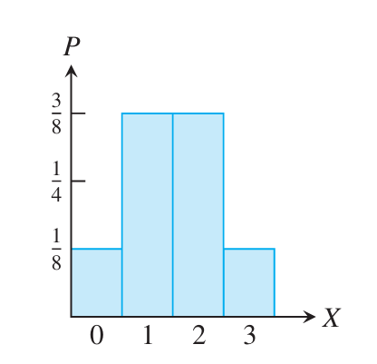
  
图 8.21 抛一枚均匀硬币三次时，随机变量 $X$ 的概率条形图。

对于连续随机变量，即使结果等可能，也不能简单地数出样本空间中的结果个数，或者导致 $X$ 取某特定值的结果频数。实际上，$X$ 取任意一个特定值的概率为零。有意义的问题是：随机变量的值落在某个指定区间内的概率是多少？

我们用一个函数来记录所需的 $X$ 的概率信息，其图像的作用类似于图 8.21 的条形图。也就是说，在随机变量的取值范围上取一个非负函数 $f$，使其图像下方的总面积为 1。随机变量 $X$ 的值落在指定区间 $[c,d]$ 内的概率，就是该区间上 $f$ 图像下方的面积。以下定义假定连续随机变量 $X$ 可以取任意实数，但也足够一般，能够包含取值范围长度有限的随机变量。

  

    
定义

    
连续随机变量的<b>概率密度函数</b>是定义在 $(-\infty,\infty)$ 上、具有以下性质的函数 $f$：

    
1. 除了可能有限多个点外，$f$ 连续。

    
2. $f$ 非负，即 $f\ge0$。

    

      $$
      3.\quad\int_{-\infty}^\infty f(x)\,dx=1.
      $$
    

    
若 $X$ 是概率密度函数为 $f$ 的连续随机变量，则 $X$ 的值落在 $X=c$ 与 $X=d$ 之间的概率为面积积分

    

      $$
      P(c\le X\le d)=\int_c^df(X)\,dX.
      $$
    

  

注意，连续随机变量 $X$ 取特定实数值 $c$ 的概率是 $P(X=c)=\int_c^cf(X)\,dX=0$，与前面的说法一致。$f$ 的图像在 $[c,d]$ 上的面积只是总面积的一部分，所以概率 $P(c\le X\le d)$ 总在 0 与 1 之间。图 8.22 展示了一个概率密度函数。

  

    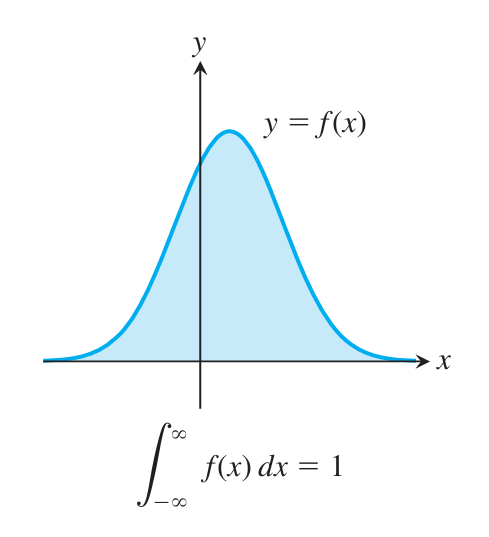
    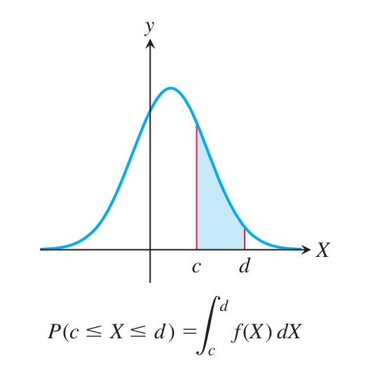
  

  
图 8.22　连续随机变量 $X$ 的概率密度函数：曲线下的总面积为 1，区间 $[c,d]$ 下的面积为 $P(c\le X\le d)$。

随机变量 $X$ 的概率密度函数类似于变密度细线的密度函数。要求细线某一段的质量，就在相应区间上对线密度积分；要求随机变量在某区间内取值的概率，就在该区间上对概率密度函数积分。

**例 3** 设 $0\le x<\infty$ 时 $f(x)=2e^{-2x}$，所有负数 $x$ 处 $f(x)=0$。

(a) 验证 $f$ 是概率密度函数。

(b) 一辆汽车经过偏僻道路上某地点前的等待时间 $T$（单位：小时）由概率密度函数 $f$ 描述。求在该地点搭便车的人一小时内看到汽车的概率 $P(T\le1)$。

(c) 求汽车恰好一小时后经过该地点的概率 $P(T=1)$。

**解** (a) $f$ 除 $x=0$ 外处处连续，并且处处非负。此外，

$$
\int_{-\infty}^\infty f(x)\,dx
=\int_0^\infty2e^{-2x}\,dx
=\lim_{b\to\infty}\int_0^b2e^{-2x}\,dx
=\lim_{b\to\infty}(1-e^{-2b})=1.
$$

所以全部条件满足，证明了 $f$ 是概率密度函数。

(b) 等待时间在零至一小时之间的概率，由概率密度函数在 $[0,1]$ 上的积分给出：

$$
P(T\le1)=\int_0^12e^{-2T}\,dT=\left.-e^{-2T}\right|_0^1=1-e^{-2}\approx0.865.
$$

这个结果可以解释为：如果有 100 人在该处搭便车，预计约 87 人能在一小时内看到汽车。

(c) 所求概率是积分 $\int_1^1f(T)\,dT$，等于零。这意味着，如果足够精确地测量汽车经过前的时间，精确等于一小时的概率为零；可能非常接近，但不是精确的一小时。

可以将定义推广到有限区间。若 $f$ 在 $[a,b]$ 上非负、至多有有限多个间断点，并将其在 $[a,b]$ 外定义为 0，得到定义在 $(-\infty,\infty)$ 上的延拓 $F$；若 $F$ 满足概率密度函数的定义，就称 $f$ 为 $[a,b]$ 上的概率密度函数。这意味着 $\int_a^bf(x)\,dx=1$。对于 $(a,b)$、$(a,b]$ 和 $[a,b)$ 也可作类似定义。

**例 4** 证明 $f(x)=\frac{4}{27}x^2(3-x)$ 是区间 $[0,3]$ 上的概率密度函数。

**解** 函数 $f$ 在 $[0,3]$ 上连续且非负。此外，

$$
\int_0^3\frac{4}{27}x^2(3-x)\,dx
=\frac{4}{27}\left[x^3-\frac{1}{4}x^4\right]_0^3
=\frac{4}{27}\left(27-\frac{81}{4}\right)=1.
$$

所以 $f$ 是 $[0,3]$ 上的概率密度函数。

### 指数递减分布

例 3 中的分布称为**指数递减概率密度函数**。这类概率密度函数总具有形式

$$
f(x)=\begin{cases}0,&x<0,\\ce^{-cx},&x\ge0.\end{cases}
$$

（见习题 23。）指数密度函数可用来建立模型，描述灯泡、放射性粒子、牙冠和许多电子元件寿命等随机变量。它们也可模拟某特定事件发生前的时间，例如传粉者到达花朵前的时间、公交车到站时间、人们加入队列的时间间隔、服务台两次来电的等待时间，甚至通话本身的长度。图 8.23 给出了指数密度函数的图像。

  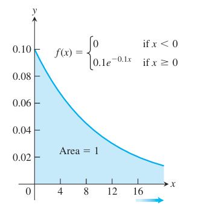
  
图 8.23 一个指数递减概率密度函数。

具有指数分布的随机变量具有**无记忆性**。若将 $X$ 看作某物体的寿命，则在已存活 $t$ 小时的条件下，它至少存活到 $s+t$ 小时的概率，与最初至少存活 $s$ 小时的概率相同。例如，放射性粒子的当前年龄 $t$ 不改变它至少再存活长度为 $s$ 的一段时间的概率。有时即使违反无记忆性，仍使用指数分布作为模型，因为它给出的合理近似足以满足预期用途。例如，预测某患者人工髋关节或人工心脏瓣膜的寿命时可能就是如此。下面给出指数分布的一个应用。

**例 5** 一家电子公司用指数密度函数

$$
f(T)=\begin{cases}0,&T<0,\\0.1e^{-0.1T},&T\ge0\end{cases}
$$

模拟所制造芯片的寿命 $T$（单位：年）。使用这个模型：

(a) 求芯片寿命超过两年的概率 $P(T>2)$。

(b) 求芯片在第五年失效的概率 $P(4\le T\le5)$。

(c) 向客户发货 1000 个芯片，预计多少个会在三年内失效？

**解** (a) 芯片寿命至少两年的概率为

$$
\begin{aligned}
P(T>2)&=\int_2^\infty0.1e^{-0.1T}\,dT
=\lim_{b\to\infty}\int_2^b0.1e^{-0.1T}\,dT\\
&=\lim_{b\to\infty}[e^{-0.2}-e^{-0.1b}]=e^{-0.2}\approx0.819.
\end{aligned}
$$

即约 $82\%$ 的芯片寿命超过两年。

(b) 所求概率为

$$
P(4\le T\le5)=\int_4^50.1e^{-0.1T}\,dT
=\left.-e^{-0.1T}\right|_4^5=e^{-0.4}-e^{-0.5}\approx0.064,
$$

意味着约 $6\%$ 的芯片在第五年失效。

(c) 需要求概率

$$
P(0\le T\le3)=\int_0^30.1e^{-0.1T}\,dT
=\left.-e^{-0.1T}\right|_0^3=1-e^{-0.3}\approx0.259.
$$

预计 1000 个芯片中约 259 个在三年内失效。

### 期望值、均值与中位数

假设牧场上一头肉牛以磅计的体重是连续随机变量 $W$，概率密度函数为 $f(W)$，牧场主能以 $g(W)$ 美元出售这头牛。随机选一头牛，牧场主预计能收入多少？

为回答这个问题，考虑宽度为 $\Delta W_i$ 的小区间 $[W_i,W_{i+1}]$，注意牛的体重落在该区间内的概率为

$$
\int_{W_i}^{W_{i+1}}f(W)\,dW\approx f(W_i)\Delta W_i.
$$

该区间内一头牛的收入约为 $g(W_i)$。于是黎曼和 $\sum g(W_i)f(W_i)\Delta W_i$ 近似牧场主出售一头牛所得的金额。假定牛的体重有最大值，所以 $f$ 在某有限区间 $[0,b]$ 外为零。当各子区间宽度趋于零时，取黎曼和极限，得到积分

$$
\int_{-\infty}^\infty g(W)f(W)\,dW.
$$

这个积分估计牧场主出售一头典型肉牛可预期获得的收入，称为函数 $g$ 的**期望值**。

随机变量 $X$ 的某些函数的期望值，在概率统计中具有特殊重要性。其中最重要的之一是函数 $g(X)=X$ 的期望值。

  

    
定义

    
概率密度函数为 $f$ 的连续随机变量 $X$ 的<b>期望值</b>或<b>均值</b>是数

    

      $$
      \mu=E(X)=\int_{-\infty}^\infty Xf(X)\,dX.
      $$
    

  

期望值 $E(X)$ 可以看作随机变量 $X$ 的加权平均，每个 $X$ 值的权重为 $f(X)$。均值也可以解释为随机变量 $X$ 的长期平均值，是衡量随机变量 $X$ 中心位置的一种指标。

**例 6** 求具有指数概率密度函数

$$
f(X)=\begin{cases}0,&X<0,\\ce^{-cX},&X\ge0\end{cases}
$$

的随机变量 $X$ 的均值。

**解** 由定义，

$$
\begin{aligned}
\mu&=\int_{-\infty}^\infty Xf(X)\,dX=\int_0^\infty Xce^{-cX}\,dX\\
&=\lim_{b\to\infty}\int_0^bXce^{-cX}\,dX\\
&=\lim_{b\to\infty}\left(\left.-Xe^{-cX}\right|_0^b+\int_0^be^{-cX}\,dX\right)\\
&=\lim_{b\to\infty}\left(-be^{-cb}-\frac{1}{c}e^{-cb}+\frac{1}{c}\right)=\frac{1}{c}.
\end{aligned}
$$

对第一项使用洛必达法则。于是均值为 $\mu=1/c$。

由例 6 的结果，只要知道具有指数密度函数的随机变量 $X$ 的均值或期望 $\mu$，就能写出完整的密度公式。

  

    
均值为 $\mu$ 的随机变量 $X$ 的指数密度函数

    

      $$
      f(X)=\begin{cases}0,&X<0,\\\mu^{-1}e^{-X/\mu},&X\ge0.\end{cases}
      $$
    

  

**例 7** 假设例 5 中芯片失效前的时间 $T$ 改用均值为八年的指数密度函数建模，求芯片在五年内失效的概率。

**解** 均值 $\mu=8$ 的指数密度函数为

$$
f(T)=\begin{cases}0,&T<0,\\\frac{1}{8}e^{-T/8},&T\ge0.\end{cases}
$$

于是五年内失效的概率为定积分

$$
P(0\le T\le5)=\int_0^50.125e^{-0.125T}\,dT
=\left.-e^{-0.125T}\right|_0^5=1-e^{-0.625}\approx0.465,
$$

所以预计约 $47\%$ 的芯片在五年内失效。

**例 8** 求例 4 中概率密度函数对应的随机变量 $X$ 的期望值。

**解** 期望值为

$$
\begin{aligned}
\mu=E(X)&=\int_0^3\frac{4}{27}X^3(3-X)\,dX\\
&=\frac{4}{27}\left[\frac{3}{4}X^4-\frac{1}{5}X^5\right]_0^3
=\frac{4}{27}\left(\frac{243}{4}-\frac{243}{5}\right)=1.8.
\end{aligned}
$$

从图 8.24 可以看出，这个期望值是合理的，因为概率密度函数下方的区域看起来在竖直线 $X=1.8$ 两侧平衡。也就是说，由该区域构成的薄板的形心横坐标是 $X=1.8$。

  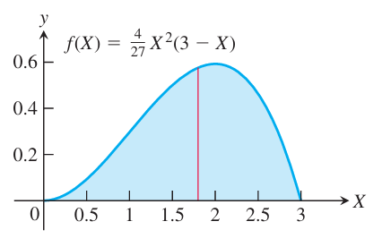
  
图 8.24 具有这个概率密度函数的随机变量的期望值为 $\mu=1.8$（例 8）。

还有其他方法可以衡量具有给定概率密度函数的随机变量的中心位置。

  

    
定义

    
概率密度函数为 $f$ 的连续随机变量 $X$ 的<b>中位数</b>是满足下式的数 $m$：

    

      $$
      \int_{-\infty}^mf(X)\,dX=\frac{1}{2},\qquad
      \int_m^\infty f(X)\,dX=\frac{1}{2}.
      $$
    

  

中位数的定义意味着，随机变量 $X$ 小于 $m$ 和大于 $m$ 的可能性相等。

**例 9** 求具有指数概率密度函数

$$
f(X)=\begin{cases}0,&X<0,\\ce^{-cX},&X\ge0\end{cases}
$$

的随机变量 $X$ 的中位数。

**解** 中位数 $m$ 必须满足

$$
\frac{1}{2}=\int_0^mce^{-cX}\,dX=\left.-e^{-cX}\right|_0^m=1-e^{-cm}.
$$

从而 $e^{-cm}=1/2$，即 $m=(1/c)\ln2$。此外，

$$
\begin{aligned}
\frac{1}{2}&=\lim_{b\to\infty}\int_m^bce^{-cX}\,dX
=\lim_{b\to\infty}\left.-e^{-cX}\right|_m^b\\
&=\lim_{b\to\infty}(e^{-cm}-e^{-cb})=e^{-cm},
\end{aligned}
$$

给出同样的 $m$。由于 $1/c$ 是指数分布随机变量 $X$ 的均值 $\mu$，所以中位数为 $m=\mu\ln2$。均值与中位数不同，是因为概率密度函数是偏斜的，并向右延伸。

### 方差与标准差

均值 $\mu$ 完全相同但分布不同的随机变量，其行为可能非常不同（图 8.25）。随机变量 $X$ 的**方差**衡量 $X$ 的值相对于均值的分散程度，我们用 $(X-\mu)^2$ 的期望值度量这种离散性。由于方差衡量的是与均值之差的平方的期望，所以通常改用它的平方根。

  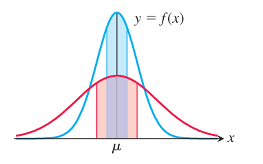
  
图 8.25 均值相同的概率密度函数，相对于均值可以有不同的分散程度。两条曲线下方蓝色和红色区域的面积相等。

  

    
定义

    
概率密度函数为 $f$ 的随机变量 $X$ 的<b>方差</b>是 $(X-\mu)^2$ 的期望值：

    

      $$
      \operatorname{Var}(X)=\int_{-\infty}^\infty(X-\mu)^2f(X)\,dX.
      $$
    

    
$X$ 的<b>标准差</b>为

    

      $$
      \sigma_X=\sqrt{\operatorname{Var}(X)}
      =\sqrt{\int_{-\infty}^\infty(X-\mu)^2f(X)\,dX}.
      $$
    

  

**例 10** 求例 5 中随机变量 $T$ 的标准差，并求 $T$ 落在均值上下一个标准差范围内的概率。

**解** 概率密度函数是指数密度函数，由例 6，其均值 $\mu=10$。先计算方差积分，再求标准差：

$$
\begin{aligned}
\int_{-\infty}^\infty(T-\mu)^2f(T)\,dT
&=\int_0^\infty(T-10)^2(0.1e^{-0.1T})\,dT\\
&=\lim_{b\to\infty}\int_0^b(T-10)^2(0.1e^{-0.1T})\,dT\\
&=\lim_{b\to\infty}\left[(-(T-10)^2-20(T-10))e^{-0.1T}\right]_0^b\\
&\quad+\lim_{b\to\infty}\int_0^b20e^{-0.1T}\,dT\\
&=[0+(-10)^2+20(-10)]-20\lim_{b\to\infty}\left.10e^{-0.1T}\right|_0^b\\
&=-100-200\lim_{b\to\infty}(e^{-0.1b}-1)=100.
\end{aligned}
$$

其中使用了分部积分。标准差是方差的平方根，所以 $\sigma=10.0$。

为求 $T$ 落在均值上下一个标准差内的概率，计算 $P(\mu-\sigma\le T\le\mu+\sigma)$。本例中，

$$
P(10-10\le T\le10+10)=\int_0^{20}0.1e^{-0.1T}\,dT
=\left.-e^{-0.1T}\right|_0^{20}=1-e^{-2}\approx0.865.
$$

这意味着约 $87\%$ 的芯片会在二十年内失效。

### 均匀分布

均匀分布很简单，却经常出现在应用中。它在区间 $[a,b]$ 上的概率密度函数是

$$
f(x)=\frac{1}{b-a},\qquad a\le x\le b.
$$

如果样本空间中的每个结果等可能，随机变量 $X$ 就具有均匀分布。由于 $f$ 在 $[a,b]$ 上为常数，均匀分布的随机变量落在一个固定长度子区间内的可能性，与落在任何其他同长度子区间内的可能性相同。$X$ 取值落在 $[a,b]$ 的某子区间内的概率，等于该子区间长度除以 $b-a$。

**例 11** 一个固定的箭头绕原点旋转，随机变量 $X$ 是箭头与 $x$ 轴正向的夹角，以弧度计并取值于 $[0,2\pi)$。假设箭头指向任何方向的概率相同，求概率密度函数，以及箭头最终指向北与东之间的概率。

**解** 用均匀分布建立模型：$0\le x<2\pi$ 时 $f(x)=1/(2\pi)$，其他地方 $f(x)=0$。箭头最终指向北与东之间的概率为

$$
P\left(0\le X\le\frac{\pi}{2}\right)
=\int_0^{\pi/2}\frac{1}{2\pi}\,dx=\frac{1}{4}.
$$

### 正态分布

大量应用使用**正态分布**，其概率密度函数定义为

$$
f(x)=\frac{1}{\sigma\sqrt{2\pi}}e^{-(x-\mu)^2/(2\sigma^2)}.
$$

可以证明，具有此概率密度函数的随机变量 $X$ 的均值为 $\mu$，标准差为 $\sigma$。应用中，$\mu$ 和 $\sigma$ 的值常由大量数据估计。函数图像如图 8.26，由于其形状，有时称为**钟形曲线**。曲线关于均值对称，所以 $X$ 的中位数等于均值。实践中常观察到许多随机变量近似服从正态分布，例如男性身高、某地区年降雨量、个人血压、血液中的血清胆固醇水平、某成人群体的脑重量，以及某群体的向日葵种子在给定时期内的生长量。

  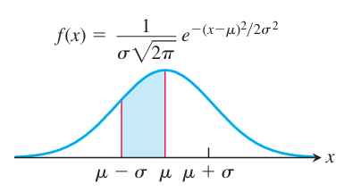
  
图 8.26 均值为 $\mu$、标准差为 $\sigma$ 的正态概率密度函数。

正态概率密度函数没有可以用熟悉函数表示的原函数。不过，固定 $\mu$ 和 $\sigma$ 后，可以用数值积分方法计算涉及正态概率密度函数的积分。通常用计算机或计算器的数值积分功能估计这些值。计算表明，对任意正态分布，随机变量 $X$ 落在均值上下 $k=1,2,3,4$ 个标准差范围内的概率分别为

$$
\begin{aligned}
P(\mu-\sigma<X<\mu+\sigma)&\approx0.68269,\\
P(\mu-2\sigma<X<\mu+2\sigma)&\approx0.95450,\\
P(\mu-3\sigma<X<\mu+3\sigma)&\approx0.99730,\\
P(\mu-4\sigma<X<\mu+4\sigma)&\approx0.99994.
\end{aligned}
$$

例如，这意味着随机变量 $X$ 约有 $95\%$ 的机会落在均值上下两个标准差内，约有 $68\%$ 的机会落在均值上下一个标准差内（图 8.27）。

  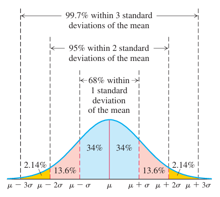
  
图 8.27 正态分布在各标准差范围内的概率。

**例 12** 血压是总体健康状况的重要指标。一项对 14 至 70 岁健康人群的医学研究，用均值 119.7 mm Hg、标准差 10.9 mm Hg 的正态分布模拟收缩压。

(a) 按这个模型，有多少比例的人收缩压在 140 至 160 mm Hg 之间，即原书所述美国心脏协会规定的 1 期高血压范围？

(b) 有多少比例的人血压在 160 至 180 mm Hg 之间，即原书所述美国心脏协会规定的 2 期高血压范围？

(c) 有多少比例的人血压在原书所述美国心脏协会规定的正常范围 90–120 内？

**解** (a) 由于无法求出原函数，使用计算机计算 $\mu=119.7$、$\sigma=10.9$ 的正态概率密度函数的概率积分：

$$
P(140\le X\le160)=\int_{140}^{160}\frac{1}{10.9\sqrt{2\pi}}
e^{-(X-119.7)^2/[2(10.9)^2]}\,dX\approx0.03117.
$$

这意味着所研究年龄范围的人群中，约 $3\%$ 有 1 期高血压。

(b) 再次用计算机计算血压在 160 至 180 mm Hg 之间的概率：

$$
P(160\le X\le180)=\int_{160}^{180}\frac{1}{10.9\sqrt{2\pi}}
e^{-(X-119.7)^2/[2(10.9)^2]}\,dX\approx0.00011.
$$

结论是约 $0.011\%$ 的人群有 2 期高血压。

(c) 血压落在正常范围内的概率为

$$
P(90\le X\le120)=\int_{90}^{120}\frac{1}{10.9\sqrt{2\pi}}
e^{-(X-119.7)^2/[2(10.9)^2]}\,dX\approx0.50776.
$$

即约 $51\%$ 的人群具有正常收缩压。

许多全国性考试用正态分布进行标准化。下例说明如何用连续随机变量的正态分布，模拟考试分数这一离散随机变量。

**例 13** ACT 是高中生申请许多学院和大学时参加的标准化考试，测试英语、数学和科学方面的知识、技能与熟练程度，分数范围为 $[1,36]$。2009 年近 150 万高中生参加了考试，各学科综合平均分为 $\mu=21.1$，标准差为 $\sigma=5.1$。

(a) 有多少比例的考生 ACT 分数在 18 至 24 之间？

(b) 考得 27 分的学生处于什么排名？

(c) 若要进入考生总成绩的前 $8\%$，至少需要多少整数分？

**解** (a) 用计算机计算 $\mu=21.1$、$\sigma=5.1$ 的正态概率密度函数的积分：

$$
P(18\le X\le24)=\int_{18}^{24}\frac{1}{5.1\sqrt{2\pi}}
e^{-(X-21.1)^2/[2(5.1)^2]}\,dX\approx0.44355.
$$

这意味着约 $44\%$ 的考生成绩在 18 至 24 分之间。

(b) 再次用计算机求考生成绩低于 27 分的概率：

$$
P(1\le X<27)=\int_1^{27}\frac{1}{5.1\sqrt{2\pi}}
e^{-(X-21.1)^2/[2(5.1)^2]}\,dX\approx0.87630.
$$

约 $88\%$ 的学生低于 27 分，因此该学生位于前 $12\%$。

(c) 先看成绩高于 28 分的人数比例：

$$
P(28<X\le36)=\int_{28}^{36}\frac{1}{5.1\sqrt{2\pi}}
e^{-(X-21.1)^2/[2(5.1)^2]}\,dX\approx0.0863.
$$

这超过 $8\%$，所以再看下一个整数分数：

$$
P(29<X\le36)=\int_{29}^{36}\frac{1}{5.1\sqrt{2\pi}}
e^{-(X-21.1)^2/[2(5.1)^2]}\,dX\approx0.0595.
$$

因此，要进入前 $8\%$，最低整数分数为 29 分（实际进入约前 $6\%$）。

$X$ 的正态分布最简单的形式出现在均值为零、标准差为 1 时。均值 $\mu=0$、标准差 $\sigma=1$ 的**标准正态概率密度函数**是

$$
f(X)=\frac{1}{\sqrt{2\pi}}e^{-X^2/2}.
$$

注意，换元 $z=(X-\mu)/\sigma$ 给出等价积分

$$
\int_a^b\frac{1}{\sigma\sqrt{2\pi}}e^{-[(X-\mu)/\sigma]^2/2}\,dX
=\int_\alpha^\beta\frac{1}{\sqrt{2\pi}}e^{-z^2/2}\,dz,
$$

其中 $\alpha=(a-\mu)/\sigma$，$\beta=(b-\mu)/\sigma$。因此，可以把随机变量的值换成“$z$ 值”，将正态分布标准化，再用右边的积分计算原来均值为 $\mu$、标准差为 $\sigma$ 的正态随机变量的概率。在正态分布中，约 $95.5\%$ 的总体落在均值上下两个标准差内，所以随机变量 $X$ 转换成 $z$ 值后，有超过 $95\%$ 的机会落在 $[-2,2]$ 内。
