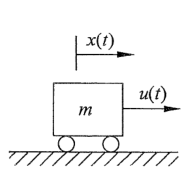
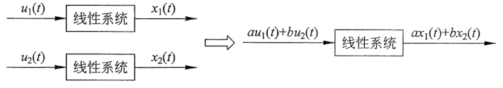
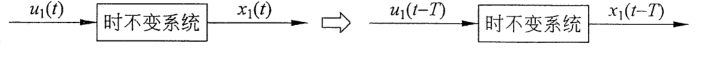
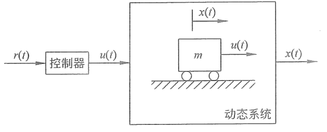
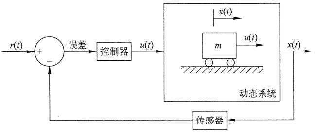

# 第1章 绪论

自动控制是现代社会不可缺少的组成部分，我们生活在被自动控制系统包围的环境中。坐在家里，新风系统会自动调节室内温度与湿度，人们喝着刚从冰箱里拿出来的冰凉可口却不结冰的饮料，坐在全自动的按摩椅上，享受着人造卫星从千里之外传送过来的球赛直播信号。与此同时，扫地机器人正在毫无怨言地打扫着房间的每一个角落。走在路上，行驶中的每一辆汽车都装配有全自动的发动机冷却系统，这套系统保障了车辆不管是在严寒的阿拉斯加还是在酷热潮湿的东南亚都可以正常运行。智能交通灯会根据路口车辆和行人的流量调整红绿灯的切换时间，最大限度地减少路上的拥堵。在智能工厂中，一台机器人正在使用视觉引导系统和精密的运动控制伺服系统将相机模组精确地组装到手机基板上，它在以人类无法达到的精度与速度重复着此项工作。在它身后有成百上千的机器人在没有人员监督的流水线上井然有序地工作着，或是装配，或是打包，或是检测。大规模的自动化控制系统为我们带来了价格低廉且优质的商品。在快递分拣中心会看到日夜不停运转的传送带、自动引导运输车和时刻闪烁的扫码器，自动化仓库控制系统在努力地保障着每一件包裹按时流向它的终点。相比于几十年前，这些自动控制的应用让我们现在的生活变得更加便利、更加美好。

在这些科技感十足的应用背后是不断发展的控制理论。控制理论本身是一门充满美感的学科，它作为一门单独的学科诞生于 20 世纪中叶。自诞生以来，这门学科就始终致力于将数学理论应用在现实生活当中。在过去的几十年中，控制理论已经发展成为一门综合性很强的学科，它涵盖了应用数学、机械电子、计算机技术和信号处理以及电气工程等。而且，每当有新的数学理论或者新的科技突破，都会很快地应用到自动控制相关的领域当中。例如近年来高速发展的智能机器人控制、无人飞行器控制和无人驾驶等，都得益于计算机硬件的快速发展、人工智能（AI）、云计算以及神经网络算法的应用和发展。自动控制领域始终是高新技术的一块重要试验地。而且控制理论的思想也已经扩展到了很多非工程领域，例如视频网站的推送算法、生物医学系统和经济系统等，在其中都可以找到控制算法的影子。

## 1.1 动态系统

控制理论的研究对象是动态系统（Dynamic System）。动态系统是指状态随时间变化的系统，其特点为系统的状态变量（State Variable）是时间的函数。如图 1.1.1 所示，在光滑的平面上对一辆质量为 $m$ 的小车施加一个随时间变化的外力 $u(t)$，这便构成了一个动态系统。其中，小车的位移 $x(t)$ 是此系统的状态变量，它是时间的函数。它随时间的变化率是其对时间 $t$ 的导数 $\frac{\mathrm{d}x(t)}{\mathrm{d}t}$，这也代表了小车的速度。而速度随时间的变化率为 $\frac{\mathrm{d}^2x(t)}{\mathrm{d}t^2}$，代表小车的加速度。根据牛顿第二定律，得到

$$
u(t)=m\frac{\mathrm{d}^2x(t)}{\mathrm{d}t^2} \tag{1.1.1}
$$

  
  
图 1.1.1　动态系统举例

在这个动态系统中，将外力 $u(t)$ 定义为系统的输入（Input），将小车位移 $x(t)$ 定义为系统的输出（Output）。式（1.1.1）说明给定的系统输入（即作用在小车上的外力 $u(t)$）将通过影响小车的加速度和小车的速度，最终影响系统的输出（小车的位移 $x(t)$）。

在本书中，若无特别说明，研究的动态系统特指线性时不变系统（Linear Time Invariant System）。其中，线性指系统的输入与输出是线性映射的，符合叠加原理（Superposition Principle）。如图 1.1.2 所示，如果一个线性系统在输入 $u_1(t)$ 的作用下，输出是 $x_1(t)$；在输入 $u_2(t)$ 的作用下，输出是 $x_2(t)$。那么当输入为 $au_1(t)+bu_2(t)$（其中 $a$ 和 $b$ 是常数）时，系统的输出等于 $ax_1(t)+bx_2(t)$。

  
  
图 1.1.2　线性系统性质

时不变性是指如果系统的输入信号延迟了时间 $T$，那么系统的输出也会延迟时间 $T$。如图 1.1.3 所示，系统在输入 $u_1(t)$ 作用下的输出是 $x_1(t)$。那么在延迟 $T$ 之后的输入 $u_1(t-T)$ 作用下，系统的输出是 $x_1(t-T)$。一般情况下，时不变系统的数学表达式中都是常数系数（系数不是时间的函数）。

  
  
图 1.1.3　时不变系统性质

线性时不变系统必须同时满足上面两个性质。请判断下面几例是否为线性时不变系统：

$$
\text{(1) }a\frac{\mathrm{d}^2x(t)}{\mathrm{d}t^2}+b\frac{\mathrm{d}x(t)}{\mathrm{d}t}+c(t)x(t)=u(t)
$$

该系统为线性时变系统，因为参数 $c(t)$ 随时间变化。

> [!note]- 为什么是线性时变系统？
> **1. 线性**
>
> 假设输入 $u_1(t)$、$u_2(t)$ 分别产生输出 $x_1(t)$、$x_2(t)$：
>
> $$a\ddot{x}_1(t)+b\dot{x}_1(t)+c(t)x_1(t)=u_1(t),$$
>
> $$a\ddot{x}_2(t)+b\dot{x}_2(t)+c(t)x_2(t)=u_2(t).$$
>
> 将第一式乘以常数 $\alpha$，第二式乘以常数 $\beta$，再将两式相加，可得
>
> $$a\frac{\mathrm d^2(\alpha x_1+\beta x_2)}{\mathrm dt^2}+b\frac{\mathrm d(\alpha x_1+\beta x_2)}{\mathrm dt}+c(t)(\alpha x_1+\beta x_2)=\alpha u_1+\beta u_2.$$
>
> 因此，输入 $\alpha u_1(t)+\beta u_2(t)$ 对应的输出为 $\alpha x_1(t)+\beta x_2(t)$，系统满足叠加原理，所以是线性系统。$c(t)$ 虽然随时间变化，但它只与 $x(t)$ 相乘，并不破坏线性。
>
> **2. 时变性**
>
> 假设输入 $u_1(t)$ 对应输出 $x_1(t)$：
>
> $$a\ddot{x}_1(t)+b\dot{x}_1(t)+c(t)x_1(t)=u_1(t).$$
>
> 将这个关系整体延迟 $T$，即将 $t$ 换成 $t-T$：
>
> $$a\ddot{x}_1(t-T)+b\dot{x}_1(t-T)+c(t-T)x_1(t-T)=u_1(t-T). \tag{A}$$
>
> 如果系统时不变，那么当输入延迟为 $u_1(t-T)$ 时，输出应为 $x_1(t-T)$。但将延迟后的输入和输出代入当前系统方程，得到
>
> $$a\ddot{x}_1(t-T)+b\dot{x}_1(t-T)+c(t)x_1(t-T)=u_1(t-T). \tag{B}$$
>
> 式 $(A)$ 中的系数是 $c(t-T)$，式 $(B)$ 中的系数却是 $c(t)$。通常 $c(t-T)\ne c(t)$，所以 $x_1(t-T)$ 通常不是输入 $u_1(t-T)$ 所对应的输出。这说明系统的运动规律会随时间改变，因此它是时变系统。
>
> 综上，该系统是 $\boxed{\text{线性时变系统}}$。

$$
\text{(2) }a\frac{\mathrm{d}^2x(t)}{\mathrm{d}t^2}+b\frac{\mathrm{d}x(t)}{\mathrm{d}t}+\sin x(t)=u(t)
$$

该系统为非线性时不变系统，其中非线性项为 $\sin x(t)$，而 $\sin x_1(t)+\sin x_2(t)\ne\sin\bigl(x_1(t)+x_2(t)\bigr)$。

$$
\text{(3) }a\frac{\mathrm{d}^2x(t)}{\mathrm{d}t^2}+b\frac{\mathrm{d}x(t)}{\mathrm{d}t}+cx(t)=u(t)
$$

该系统为线性时不变系统。

  

    需要说明的是，从严格意义上讲，时不变系统是不存在的，因为“人不能两次踏进同一条河流”，但在大部分工程情况下，在系统分析的时间区间内，参数是恒定的或者是缓慢变化的。对于非线性的系统，一般可以做线性化处理（参考附录 A）。不可以近似为线性时不变的系统不在本书的讨论范围之内。
  

## 1.2 控制系统

通过研究动态系统的数学模型和系统表现，可以得到在给定输入 $u(t)$ 作用下的系统响应（Response，即系统在输入 $u(t)$ 作用下的输出 $x(t)$）。当掌握了动态系统输入与输出的关系之后，就可以设计控制器来调节动态系统的输入，使得系统的输出按照预期的目标响应。

一般而言，控制系统（Control System）由控制器（Controller）和动态系统组成。在图 1.2.1 所描述的控制系统中，其被控对象是图 1.1.1 中的动态系统。控制器会根据参考值（Reference）$r(t)$ 来决定控制量，即动态系统的输入 $u(t)$。这种简单的控制方式称为开环（Open Loop）控制。当系统的全部信息可知且准确时，开环控制可以完美地达成控制目标。在本例中，如果式（1.1.1）准确无误，那么就可以根据参考目标 $r(t)$ 设计作用在小车上的控制量 $u(t)$，使得小车的实际位移 $x(t)$ 与 $r(t)$ 保持一致。但如果系统的输入输出模型不够准确，或者系统存在扰动，例如在上述例子中，如果有物体掉落在小车内使其质量发生改变，那么基于式（1.1.1）的开环控制器将无法提供准确的控制量 $u(t)$，也就无法保障系统输出与目标值 $r(t)$ 一致。在实际应用场景中，扰动无处不在，而且完美的数学模型几乎是不存在的，因此开环控制大多只能应用在简单的、对精度要求不高的场景中，例如传统的电风扇，打开开关之后就会一直转，不用去关心被吹物体的温度。

  
  
图 1.2.1　开环控制系统

如果希望精确地控制系统，则需要使用闭环（Closed Loop）控制系统，如图 1.2.2 所示，它与开环控制的最大区别是，在闭环控制中会测量系统的输出，并将其反馈（Feedback）到输入端与参考值进行比较。参考值与实际系统输出的差称为误差（Error），控制器将根据误差调整控制量。闭环控制系统可以实现高精度的控制，同时补偿由于外界扰动及系统建模不准确而引起的偏差。例如，空调系统会根据室内的实际测量温度调节出风口的风速和温度；智能手机会根据外界光强自动调节屏幕的亮度，这些都是闭环控制的例子。本书的重点就是分析闭环控制系统并设计控制器。

  
  
图 1.2.2　闭环控制系统

  

本书视频内容介绍请扫描二维码。
