# 第7章 基于传递函数的控制器设计（1）——比例积分控制

前 6 章详细地介绍了动态系统的数学建模方法、一阶和二阶系统的时域响应，以及系统的稳定性分析，这些内容都是为控制器的设计在打基础。本章与第 8 章将重点分析基于传递函数的控制器设计。本章的学习目标为：

- 掌握闭环控制系统的控制器设计流程与思路。
- 理解比例控制算法及其局限性。
- 理解终值定理并掌握如何运用它去分析控制系统的稳态误差。
- 理解积分控制算法及其参数对系统的作用，并了解其局限性。
- 了解如何使用饱和函数处理含约束的系统。

## 7.1 引子——燃烧卡路里

在第 2 章例 2.1.1 中，我们分析了体重变化与热量输入的关系，并建立了体重变化系统的动态微分方程，即

$$
7000\frac{\mathrm{d}m}{\mathrm{d}t}+10\alpha m=E_i-E_a-\alpha(6.25h-5a+S). \tag{7.1.1}
$$

其中，$m(t)$ 是体重；$\alpha$ 是劳动强度系数，始终大于零；$E_i$ 是热量摄入，来源于饮食；$E_a$ 是额外的运动消耗；$h$ 是身高；$a$ 是年龄；$S$ 是一个和性别相关的调整系数，其中，男性：$S=5$；女性：$S=-161$。为进一步简化式（7.1.1），令 $6.25h-5a+S=C$（$C$ 是常数），因为一个人成年之后的身高和性别一般都是不变的，而年龄的变化也比较缓慢。此时式（7.1.1）可以化简为

$$
7000\frac{\mathrm{d}m(t)}{\mathrm{d}t}+10\alpha m(t)=E_i-E_a-\alpha C. \tag{7.1.2}
$$

将式（7.1.2）中人体体重变化考虑为一个动态系统，定义其输入是 $u(t)=E_i-E_a$。它代表了每日的净热量输入（即饮食中的热量摄入减去额外运动的消耗）。系统的输出是体重 $x(t)=m(t)$。此外，引入 $d(t)=-\alpha C$，代表系统的扰动量（Disturbance），在本例中是常数。此时式（7.1.2）可以写成

$$
7000\frac{\mathrm{d}x(t)}{\mathrm{d}t}+10\alpha x(t)=u(t)+d(t). \tag{7.1.3}
$$

对式（7.1.3）等号两边进行拉普拉斯变换，可得

$$
\begin{aligned}
7000(sX(s)-x_0)+10\alpha X(s)&=U(s)+D(s)\\
\Rightarrow\quad(7000s+10\alpha)X(s)&=U(s)+D(s)+7000x_0.
\end{aligned} \tag{7.1.4}
$$

其中，$x_0=x(0)$，是输出 $x(t)$ 初始状态时的值，也就是初始体重。调整后可以得到动态系统的传递函数，即

$$
G(s)=\frac{X(s)}{U(s)+D(s)+7000x_0}=\frac{1}{7000s+10\alpha}. \tag{7.1.5}
$$

其对应的系统框图如图 7.1.1 所示。

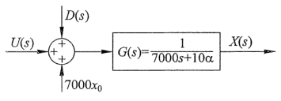
图 7.1.1　体重系统框图

这是一个典型的一阶系统，根据第 4 章的分析，其中 $U(s)$ 和 $D(s)$ 是以阶跃形式作用在系统上，初始状态 $7000x_0$ 则是以冲激方式作用在系统上。通过传递函数极点分析系统的稳定性，令式（7.1.5）分母为 0，得到 $G(s)$ 的特征方程为

$$
7000s+10\alpha=0\quad\Rightarrow\quad s_p=-\frac{\alpha}{700}<0. \tag{7.1.6}
$$

式（7.1.6）说明传递函数的极点在复平面的左半部分，根据第 6 章的分析，系统是渐近稳定的，同时满足 BIBO 稳定。因此，当输入 $U(s)+D(s)+7000x_0$ 有界的时候，输出也一定有界。

选取三个典型大学男生的情况作为案例分析。如表 7.1.1 所示，他们三人的初始体重都是 70kg，身高都是 175cm，年龄都是 20 岁。因为他们都是学生，日常的作息就是上课和学习，并没有大体力劳动，所以劳动强度系数选取 $\alpha=1.3$。案例 1 和案例 3 中的两位每天都会摄入 2500kCal。这体现了大多数大学生的每日饮食标准：包含 400g 米饭、2 个鸡蛋、3 份炒菜、1 个苹果、1 瓶可乐和 5 个烤串。案例 2 中的同学不吃烤串也不喝可乐，所以他的摄入比其他两个人每天少 400kCal，是 2100kCal。最后，案例 1 和案例 2 都是宅男，他们每天不运动，只靠基础消耗。但是案例 3 每天会慢跑 1 小时，额外消耗 500kCal。

<table border="1" style="border-collapse:collapse;margin:1em auto;text-align:center"><caption>表 7.1.1　体重系统案例分析</caption><thead><tr><th>编号</th><th>性别 $S=5$</th><th>初始体重 $x(0)/\mathrm{kg}$</th><th>身高 $h/\mathrm{cm}$</th><th>年龄 $a$</th><th>热量摄入 $E_i/\mathrm{kCal}$</th><th>劳动强度系数 $\alpha$</th><th>额外热量消耗 $E_a/\mathrm{kCal}$</th></tr></thead><tbody><tr><td>案例 1</td><td>男</td><td>70</td><td>175</td><td>20</td><td>2500</td><td>1.3</td><td>0</td></tr><tr><td>案例 2</td><td>男</td><td>70</td><td>175</td><td>20</td><td>2100</td><td>1.3</td><td>0</td></tr><tr><td>案例 3</td><td>男</td><td>70</td><td>175</td><td>20</td><td>2500</td><td>1.3</td><td>500</td></tr></tbody></table>

在上述条件下，他们三个人的体重随时间的变化如图 7.1.2 所示。案例 1 作为一个宅男，他每天吃 2500kCal，没有额外的运动，在初始状态时他的热量摄入大于热量的输出（基础代谢），所以热量会在其体内累加，体重便会从 70kg 开始上升。而随着体重的增加，他的基础代谢在不断地升高，最终有一天达到了热量摄入与支出的平衡，体重达到了稳定的 92.4kg。再来看案例 2，虽然他也是个宅男，但他与案例 1 不同，他不喝可乐也不吃烤串。所以随着时间的增加，他的体重反而会下降，最后稳定在 61.7kg 左右。我相信在大家身边都有比较胖和比较瘦的宅男，这是因为他们的饮食习惯不同而造成的。最后看案例 3，他的饮食习惯和案例 1 相同，什么都吃，但是他每天会运动 1 小时。随着时间的增加，他的体重最终会稳定在 54kg 左右，这是一个非常适合跑马拉松的体重。

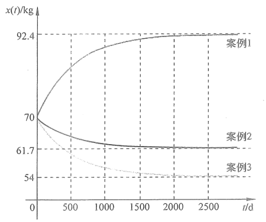
图 7.1.2　案例分析

下面请思考一个问题，案例 1 的宅男在放飞自我一段时间之后想要减肥，想要将体重从 90kg 降到 65kg，他应该如何来调整饮食与运动？如何去建立一个闭环控制系统来解决这个问题，将是我们在下面几节中去深入讨论的话题。

需要说明的是，图 7.1.2 中的横轴显示了这是一个长期的过程（2500 天），所以在这个过程中，年龄实际上发生了变化（增加了 6 年多），因此基础代谢部分实际上是变化的（这是一个“时变”系统）。但是，这个变化对系统的影响并不是很大，所以为了方便分析，本章内容将忽略年龄变化的影响，仍将系统考虑为“时不变”系统。

比例积分控制——系统建模内容请扫描此二维码观看。

## 7.2 比例控制

7.1 节的末尾提出了一个具体的控制问题：如何通过调整饮食和运动帮助案例 1 的同学重新回到健康的体重（从 90kg 降到 65kg）。要解决这个问题，首先需要构建一个闭环反馈控制系统，如图 7.2.1 所示，引入参考值 $r(t)$，即目标体重，在此例中它是一个常数，即 $r(t)=r=65\mathrm{kg}$。其所对应的拉普拉斯变换为 $R(s)=r/s$。参考值与输出之间的差距定义为误差 $e(t)=r(t)-x(t)$，其对应的拉普拉斯变换为 $E(s)=R(s)-X(s)$。$C(s)$ 是控制器，包含了我们需要设计的控制算法。误差信号通过控制器之后形成控制量，即原动态系统的输入 $U(s)=E(s)C(s)$。

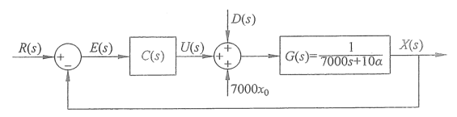
图 7.2.1　体重闭环控制系统框图

人们在控制体重时会很自然地想到一种策略：当体重大于目标值的时候，那就多运动，少吃饭，而且超重得越多，就越要多运动，越要少吃饭。反之亦然。这种简单粗暴的策略被称为比例控制（Proportional Controller），即系统的控制量与误差成正比，令

$$u(t)=K_{\mathrm P}e(t). \tag{7.2.1a}$$

其中，$K_{\mathrm P}>0$，称为比例增益（Proportional Gain）。其拉普拉斯变换为

$$U(s)=K_{\mathrm P}E(s). \tag{7.2.1b}$$

使用比例控制的系统框图如图 7.2.2 所示。

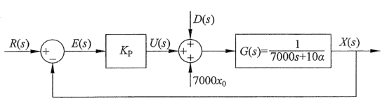
图 7.2.2　体重系统比例控制器闭环框图

此时，系统的输出可以表达为

$$
\begin{aligned}
X(s)&=\frac{U(s)+D(s)+7000x_0}{7000s+10\alpha}
=\frac{E(s)K_{\mathrm P}+D(s)+7000x_0}{7000s+10\alpha}\\
&=\frac{(R(s)-X(s))K_{\mathrm P}+D(s)+7000x_0}{7000s+10\alpha}\\
\Rightarrow\quad X(s)&=\frac{K_{\mathrm P}R(s)+D(s)+7000x_0}{7000s+10\alpha+K_{\mathrm P}}.
\end{aligned} \tag{7.2.2}
$$

根据前面的定义，$d(t)=-\alpha C$，可得 $D(s)=-\alpha C/s$。又已知 $R(s)=r/s$，式（7.2.2）变为

$$
X(s)=\frac{K_{\mathrm P}\dfrac{r}{s}-\dfrac{\alpha C}{s}+7000x_0}{7000s+10\alpha+K_{\mathrm P}}
=\frac{K_{\mathrm P}r-\alpha C+7000x_0s}{s(7000s+10\alpha+K_{\mathrm P})}. \tag{7.2.3}
$$

根据式（7.2.3），$X(s)$ 有两个极点，分别为 $s_{p1}=0$ 和 $s_{p2}=-(K_{\mathrm P}+10\alpha)/7000$。其中，$s_{p1}$ 是输入 $U(s)$ 和扰动 $D(s)$ 的极点，$s_{p2}$ 是闭环传递函数的极点。对式（7.2.3）进行分式分解，可得

$$
X(s)=\left(\frac{K_{\mathrm P}r-\alpha C}{K_{\mathrm P}+10\alpha}\right)\frac1s+
\left(x_0-\frac{K_{\mathrm P}r-\alpha C}{K_{\mathrm P}+10\alpha}\right)
\frac1{s+\dfrac{K_{\mathrm P}+10\alpha}{7000}}. \tag{7.2.4}
$$

对式（7.2.4）进行拉普拉斯逆变换，得到

$$
\begin{aligned}
x(t)=\mathcal L^{-1}[X(s)]
&=\frac{K_{\mathrm P}r-\alpha C}{K_{\mathrm P}+10\alpha}e^{0t}
+\left(x_0-\frac{K_{\mathrm P}r-\alpha C}{K_{\mathrm P}+10\alpha}\right)e^{-\frac{K_{\mathrm P}+10\alpha}{7000}t}\\
&=\frac{K_{\mathrm P}r-\alpha C}{K_{\mathrm P}+10\alpha}
+\left(x_0-\frac{K_{\mathrm P}r-\alpha C}{K_{\mathrm P}+10\alpha}\right)e^{-\frac{K_{\mathrm P}+10\alpha}{7000}t}.
\end{aligned} \tag{7.2.5}
$$

在式（7.2.5）中，输出 $x(t)$ 的稳定性与传递函数的极点 $s_{p2}=-(K_{\mathrm P}+10\alpha)/7000$ 相关。在本例中，$K_{\mathrm P}>0$，因此 $s_{p2}<0$。说明随着时间的增加，$e^{-\frac{K_{\mathrm P}+10\alpha}{7000}t}$ 项将趋于 0。因此，可以通过式（7.2.5）得到系统输出的终值，即

$$
x(\infty)=\lim_{t\to\infty}x(t)=\frac{K_{\mathrm P}r-\alpha C}{K_{\mathrm P}+10\alpha}. \tag{7.2.6}
$$

图 7.2.3（a）呈现了在不同 $K_{\mathrm P}$ 下系统输出 $x(t)$ 随时间的变化（其中，初始体重 $x_0=90\mathrm{kg}$，目标体重 $r=65\mathrm{kg}$，其余条件参考表 7.1.1 案例 1）。式（7.2.6）和图 7.2.3（a）说明比例增益 $K_{\mathrm P}$ 越大，系统的终值 $x(\infty)$ 越接近于参考值 $r$。图 7.2.3（b）显示了不同 $K_{\mathrm P}$ 下的系统控制量 $u(t)$ 随时间的变化。

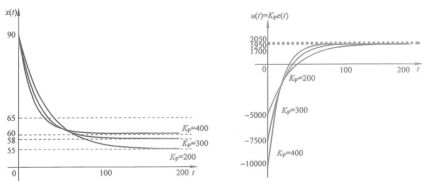
图 7.2.3　不同比例增益情况下系统的输出与控制量随时间的变化

系统误差的终值称为稳态误差（Steady State Error），根据式（7.2.6），得到

$$
e_{\mathrm{ss}}=e(\infty)=r-x(\infty)=r-\frac{K_{\mathrm P}r-\alpha C}{K_{\mathrm P}+10\alpha}
=\frac{10\alpha r-\alpha C}{K_{\mathrm P}+10\alpha}. \tag{7.2.7}
$$

> 原书式（7.2.7）末项的分子写为 $10\alpha r-\alpha C$。按前一项及式（7.2.6）直接通分，结果应为 $10\alpha r+\alpha C$；这里保留原式并提示这处符号不一致。

所以 $K_{\mathrm P}$ 越大，稳态误差 $e_{\mathrm{ss}}$ 就越小，这和图 7.2.3（a）所示的现象一致（$K_{\mathrm P}$ 越大，输出的终值 $x(\infty)$ 越靠近参考值）。当 $K_{\mathrm P}\to\infty$ 时，$e_{\mathrm{ss}}=0$。但是在实际情况中，$K_{\mathrm P}$ 不可能无限地增大，例如本例中每天的热量摄入和运动都是有限的。这就决定了比例控制的局限性，它无法消除稳态误差。我们需要引入新的手段和方法来解决这个问题。

另外，请读者观察图 7.2.3（b），会发现 $K_{\mathrm P}$ 越大时，控制量输入的变化幅度就越大，这是因为控制量与误差成正比。同时，$K_{\mathrm P}$ 越大，系统的响应越快。读者可以参考 4.2.3 节中关于一阶系统的时间常数概念进行分析，这里不再赘述。另外需要注意的是，图 7.2.3 显示的只是一个理论结果，在实际情况中并不可行，在 7.4 节中会讨论这一现象。

## 7.3 比例积分控制器

在 7.2 节的最后讨论了比例控制的局限性，说明只依靠比例控制无法消除稳态误差。本节将引入新的控制手段来解决这一问题。

### 7.3.1 终值定理

根据式（7.2.6）计算得出系统输出的终值，根据式（7.2.7）得到了稳态误差。请读者重新审视从式（7.2.3）到式（7.2.7）的推导过程，它用到了分式分解法和拉普拉斯逆变换，整个过程比较复杂，尤其是针对高阶的系统，计算量会非常大。为了快速得到系统的稳态值，本节将引入终值定理（Final Value Theorem，FVT）。这一定理将时间趋于无穷时的时域表达与复数域之间联系起来。它的定义如下：如果 $\lim_{t\to\infty}x(t)$ 存在，且 $X(s)=\mathcal L[x(t)]$，那么

$$
\lim_{t\to\infty}x(t)=\lim_{s\to0}sX(s). \tag{7.3.1}
$$

请读者注意使用终值定理的前提条件，那就是要求 $\lim_{t\to\infty}x(t)$ 存在。从控制系统的角度来看，即要求 $x(t)$ 最终稳定在一个值上。

对式（7.2.3）使用终值定理，可以得到系统输出的终值，即

$$
\begin{aligned}
\lim_{t\to\infty}x(t)
&=\lim_{s\to0}sX(s)
=\lim_{s\to0}s\frac{K_{\mathrm P}r-\alpha C+7000x_0s}{s(7000s+10\alpha+K_{\mathrm P})}\\
&=\lim_{s\to0}\frac{K_{\mathrm P}r-\alpha C+7000x_0s}{7000s+10\alpha+K_{\mathrm P}}
=\frac{K_{\mathrm P}r-\alpha C}{K_{\mathrm P}+10\alpha}.
\end{aligned} \tag{7.3.2}
$$

式（7.3.2）的结果和式（7.2.6）的结果一致，但求解过程要方便很多。更重要的是，这个定理不仅简化了求解的中间步骤，也为我们设计控制器消除稳态误差提供了思路。

### 7.3.2 积分控制

本节将利用终值定理来辅助设计控制器以消除系统的稳态误差。为了简化分析，我们先将体重控制的案例暂时放一下，从一个一般性例子着手分析。考虑一个零初始条件且不含扰动的一阶系统，其系统框图如图 7.3.1 所示，其中 $a>0$。控制的目标是令系统的输出 $x(t)$ 等于参考值 $r(t)=r$（常数）。

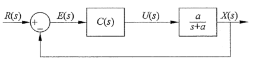
图 7.3.1　一阶闭环控制系统框图

根据图 7.3.1，系统输出 $X(s)$ 可以表达为

$$
\begin{aligned}
X(s)&=U(s)\frac{a}{s+a}=E(s)C(s)\frac{a}{s+a}
=(R(s)-X(s))C(s)\frac{a}{s+a}\\
\Rightarrow\quad X(s)&=\frac{aR(s)C(s)}{s+a+aC(s)}
=\frac{a\dfrac rs C(s)}{s+a+aC(s)}.
\end{aligned} \tag{7.3.3}
$$

其中，$R(s)=r/s$，是常数参考值的拉普拉斯变换。当使用比例控制器时，$C(s)=K_{\mathrm P}$，代入式（7.3.3）可得

$$
X(s)=\frac{a\dfrac rs K_{\mathrm P}}{s+a+aK_{\mathrm P}}
=\frac{arK_{\mathrm P}}{s(s+a+aK_{\mathrm P})}. \tag{7.3.4}
$$

对式（7.3.4）使用终值定理，可得

$$
\begin{aligned}
\lim_{t\to\infty}x(t)
&=\lim_{s\to0}sX(s)
=\lim_{s\to0}s\frac{arK_{\mathrm P}}{s(s+a+aK_{\mathrm P})}\\
&=\lim_{s\to0}\frac{arK_{\mathrm P}}{s+a+aK_{\mathrm P}}
=\frac{arK_{\mathrm P}}{a+aK_{\mathrm P}}
=\frac{rK_{\mathrm P}}{1+K_{\mathrm P}}.
\end{aligned} \tag{7.3.5}
$$

其稳态误差为

$$
e_{\mathrm{ss}}=r-\lim_{t\to\infty}x(t)
=r-\frac{rK_{\mathrm P}}{1+K_{\mathrm P}}
=\frac{r}{1+K_{\mathrm P}}. \tag{7.3.6}
$$

此外，也可以直接根据图 7.3.1 得到误差的拉普拉斯变换为

$$
E(s)=R(s)-E(s)C(s)\frac{a}{s+a}
\quad\Rightarrow\quad E(s)=\frac{(s+a)R(s)}{s+a+aC(s)}. \tag{7.3.7}
$$

将 $R(s)=r/s$ 和 $C(s)=K_{\mathrm P}$ 代入式（7.3.7），得到

$$
E(s)=\frac{(s+a)\dfrac rs}{s+a+aK_{\mathrm P}}
=\frac{(s+a)r}{s(s+a+aK_{\mathrm P})}. \tag{7.3.8}
$$

对式（7.3.8）直接使用终值定理，得到

$$
\begin{aligned}
e_{\mathrm{ss}}&=\lim_{t\to\infty}e(t)=\lim_{s\to0}sE(s)
=\lim_{s\to0}s\frac{(s+a)r}{s(s+a+aK_{\mathrm P})}\\
&=\lim_{s\to0}\frac{(s+a)r}{s+a+aK_{\mathrm P}}
=\frac{ar}{a+aK_{\mathrm P}}=\frac{r}{1+K_{\mathrm P}}.
\end{aligned} \tag{7.3.9}
$$

式（7.3.9）与式（7.3.6）的结果一致。

式（7.3.9）说明，单纯依靠比例控制无法消除系统的稳态误差。因此需要设计不同的 $C(s)$，将 $R(s)=r/s$ 代入式（7.3.7）并使用终值定理，可得

$$
\begin{aligned}
e_{\mathrm{ss}}
&=\lim_{t\to\infty}e(t)=\lim_{s\to0}sE(s)
=\lim_{s\to0}s\frac{(s+a)R(s)}{s+a+aC(s)}\\
&=\lim_{s\to0}\frac{(s+a)r}{s+a+aC(s)}
=\frac{ar}{a+a\lim_{s\to0}C(s)}
=\frac{r}{1+\lim_{s\to0}C(s)}.
\end{aligned} \tag{7.3.10}
$$

根据式（7.3.10），如果希望消除稳态误差（即令 $e_{\mathrm{ss}}=0$），则 $r/(1+\lim_{s\to0}C(s))$ 的分母要无穷大，即 $\lim_{s\to0}C(s)=\infty$。为此，一个很自然的做法就是令 $C(s)=1/s$。在使用中令 $C(s)=K_{\mathrm I}/s$，其中，$K_{\mathrm I}$ 被称为积分增益（Integral Gain），可以根据不同的要求进行调节。此时，系统控制量的拉普拉斯变换为

$$
U(s)=C(s)E(s)=\frac{K_{\mathrm I}}sE(s). \tag{7.3.11a}
$$

其对应的时域表达为

$$
u(t)=K_{\mathrm I}\int_0^t e(\tau)\,\mathrm d\tau. \tag{7.3.11b}
$$

以上就是积分控制器的动机与推导过程，使用积分控制可以有效地消除稳态误差。将 $C(s)=K_{\mathrm I}/s$ 代入式（7.3.3）中，得到

$$
\begin{aligned}
X(s)&=\frac{a\dfrac rs C(s)}{s+a+aC(s)}
=\frac{a\dfrac rs\dfrac{K_{\mathrm I}}s}{s+a+a\dfrac{K_{\mathrm I}}s}
=\frac rs\frac{aK_{\mathrm I}}{s^2+as+aK_{\mathrm I}}\\
\Rightarrow\quad(s^2+as+aK_{\mathrm I})X(s)&=\frac{aK_{\mathrm I}r}{s}.
\end{aligned} \tag{7.3.12}
$$

对式（7.3.12）等号两边进行拉普拉斯逆变换，可得

$$
\begin{aligned}
\mathcal L^{-1}[(s^2+as+aK_{\mathrm I})X(s)]
&=\mathcal L^{-1}\left[\frac{aK_{\mathrm I}r}{s}\right]\\
\Rightarrow\quad\frac{\mathrm d^2x(t)}{\mathrm dt^2}
+a\frac{\mathrm dx(t)}{\mathrm dt}+aK_{\mathrm I}x(t)&=aK_{\mathrm I}r.
\end{aligned} \tag{7.3.13}
$$

式（7.3.13）说明在引入积分控制器之后，原始的一阶系统变成了二阶系统，式（7.3.13）对应了二阶系统的阶跃响应。类比第 5 章中二阶系统的一般形式，得到此二阶系统的阻尼比 $\zeta$ 和固有频率 $\omega_n$ 为

$$
\begin{cases}2\zeta\omega_n=a,\\\omega_n^2=aK_{\mathrm I}\end{cases}
\quad\Rightarrow\quad
\begin{cases}\displaystyle\zeta=\frac{a}{2\sqrt{aK_{\mathrm I}}},\\[4pt]
\displaystyle\omega_n=\sqrt{aK_{\mathrm I}}.\end{cases} \tag{7.3.14}
$$

正如 5.4.1 节所介绍的，此时的控制器设计就像是在设计一个“看不见”的弹簧质量阻尼系统，通过改变控制参数来调节此系统的固有频率和阻尼比。

例如，将式（7.3.14）代入式（5.4.3）中，可以得到上升时间为

$$
T_r=\frac{\pi-\varphi}{\omega_n\sqrt{1-\zeta^2}}
=\frac{\pi-\varphi}{\sqrt{aK_{\mathrm I}}\sqrt{1-\dfrac{a}{4K_{\mathrm I}}}}
=\frac{\pi-\varphi}{\sqrt{aK_{\mathrm I}-\dfrac{a^2}{4}}}. \tag{7.3.15a}
$$

式（7.3.15a）说明 $K_{\mathrm I}$ 的增加将导致 $T_r$ 的下降，加快系统的响应速度。将式（7.3.14）代入式（5.4.7）中，得到最大超调量为

$$
M_p=e^{-\frac{\zeta\pi}{\sqrt{1-\zeta^2}}}
=e^{-\frac{a\pi}{\sqrt{4aK_{\mathrm I}-a^2}}}. \tag{7.3.15b}
$$

式（7.3.15b）说明随着 $K_{\mathrm I}$ 的增加，超调量 $M_p$ 也将增加。图 7.3.2 表示了不同的 $K_{\mathrm I}$ 对系统输出的影响（在此实验中选取 $G(s)=1/(s+1)$，参考值 $r(t)=1$），可见积分控制很好地消除了稳态误差。

同时，图 7.3.2 与式（7.3.15）的结果说明了积分控制器设计中调参时的矛盾：在使用积分控制时，提高积分增益 $K_{\mathrm I}$ 可以加快系统的响应速度，但与此同时，超调量也会增加。

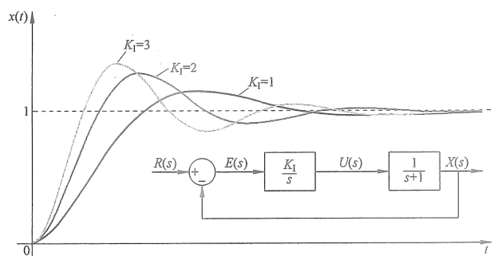
图 7.3.2　积分增益对系统输出的影响

请读者思考一个问题，如果目标参考值不是一个常数，而是随时间增加的斜坡函数 $r(t)=rt$，其对应的拉普拉斯变换是 $R(s)=r/s^2$。那么它的稳态误差会是多少？如果想要消除它的稳态误差，应该使用什么样的控制器？请读者根据本节积分器设计思路自行推导，有兴趣的读者可以参考其他书籍有关系统类型的内容进行对比。

比例积分控制——PI 控制器内容请扫描此二维码观看。

### 7.3.3 比例积分控制

7.3.2 节说明，使用积分控制可以消除一阶系统的稳态误差。现在使用积分控制来调节体重，将 $C(s)=K_{\mathrm I}/s$ 代入图 7.2.1 中，得到新的系统框图，如图 7.3.3 所示。

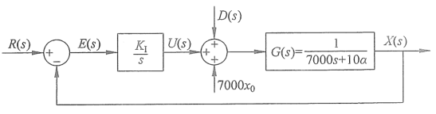
图 7.3.3　体重系统积分控制框图

当选择 $K_{\mathrm I}=1$ 时，系统输出 $x(t)$ 随时间的变化如图 7.3.4 所示。

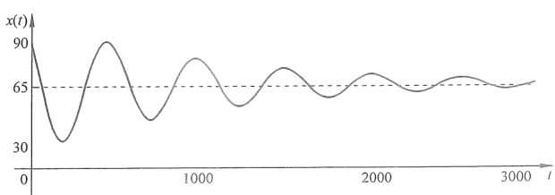
图 7.3.4　积分控制器下系统的输出随时间的变化

图 7.3.4 说明，在积分控制器的帮助下（正如我们所设计的），系统的输出最终会收敛于参考值 $r=65\mathrm{kg}$，即使系统存在着扰动，积分控制器依然成功地消除了稳态误差。比较图 7.3.4 和图 7.2.3（a），会发现两个显著的区别。第一，使用积分控制器后，系统的输出存在振动和超调量。这是因为积分控制器的引入使得原来的一阶系统变成了二阶系统。第二，在观察横轴时可以发现，积分控制下的系统响应速度要远远慢于比例控制。从直观上理解，积分控制需要误差的累加，而累加则需要时间，因此反应相对“迟钝”。

综上所述，比例控制可以使系统快速地响应，而积分控制可以消除稳态误差，如果将二者结合起来，便可以兼顾两种控制器的优点，即比例积分控制。这是在工业界中应用最为广泛的控制方法。其控制器的拉普拉斯变换为 $C(s)=K_{\mathrm P}+K_{\mathrm I}/s$，系统的控制量可以写成

$$
U(s)=K_{\mathrm P}E(s)+\frac{K_{\mathrm I}}sE(s). \tag{7.3.16a}
$$

其对应的时域表达为

$$
u(t)=K_{\mathrm P}e(t)+K_{\mathrm I}\int_0^t e(\tau)\,\mathrm d\tau. \tag{7.3.16b}
$$

在使用比例积分控制器后，体重控制的系统框图如图 7.3.5 所示。

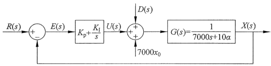
图 7.3.5　体重系统比例积分控制器闭环框图

选取 $K_{\mathrm P}=200$，$K_{\mathrm I}=1$ 时，系统输出 $x(t)$ 随时间的变化如图 7.3.6（a）所示，控制量 $u(t)$ 随时间的变化如图 7.3.6（b）所示。可以发现，比例积分控制很好地将系统稳定在参考值上。而且相较于积分控制，其响应速度有了很大的改善。读者可以自己搭建这样的一个系统并调整不同的比例积分增益（$K_{\mathrm P}$ 和 $K_{\mathrm I}$），观察系统的响应。在实际工程中，参数的调节是很重要的工作，很大程度上依靠经验，但也有一些小技巧，本书的重点是将控制器的原理介绍清楚，故不涉及调参的部分，有兴趣的读者可以参考其他资料。

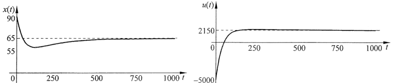
（a）系统输出 $x(t)$ 随时间的变化；（b）系统控制量 $u(t)=K_{\mathrm P}e(t)+K_{\mathrm I}\int_0^t e(\tau)\,\mathrm d\tau$ 随时间的变化 图 7.3.6　比例积分控制下系统的输出与控制量随时间的变化

比例积分控制——PI 控制器应用内容请扫描此二维码观看。

## 7.4 含有限制条件的控制器设计

很遗憾，前面几节推导出的控制器在现实生活中都无法实现，以最后的比例积分控制器为例：根据图 7.3.6（b），在初始条件下，控制量高达 $u(t)=-5000\mathrm{kCal}$。请读者回想一下控制量 $u(t)$ 的物理意义，它是原体重动态系统的输入，在 7.1 节中定义 $u(t)=E_i-E_a$。它代表了净热量输入（食物热量摄入减去额外运动消耗）。因此 $-5000\mathrm{kCal}$ 就意味着要不吃不喝的同时慢跑至少 10 小时。这当然不是一个长久的方法，如果真有人这样做的话，恐怕连一天都坚持不了。

在实际工程应用中，控制量在很多情况下都是有限制条件（约束）的，例如在自动巡航系统中的发动机转速和扭矩，空调系统中的最大出风量等，它们都有工作上限。体重控制系统的限制是每日的净热量输入应当在一个人可以承受的范围内。处理这类带约束的问题有很多的方法，这里介绍一个最简单的方式，在图 7.3.5 的框图中加入一个饱和函数（Saturation Function）来限制 $U(s)$ 幅度，如图 7.4.1 所示。

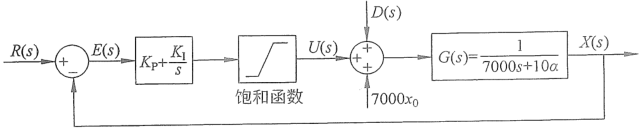
图 7.4.1　含有限制的比例积分控制系统框图

饱和函数的定义为

$$
u(t)=\begin{cases}
u_{\max},&u(t)>u_{\max},\\
u(t),&u_{\max}\geq u(t)\geq u_{\min},\\
u_{\min},&u(t)<u_{\min}.
\end{cases} \tag{7.4.1}
$$

使用中根据具体情况设置输入的最大值 $u_{\max}$ 和最小值 $u_{\min}$。

在本例中，即使在减肥的状态下，一个二十几岁的男生也要保证每天最低 1800kCal 的饮食摄入量，同时他可以保证每天健身 1.5 小时，消耗约 800kCal。这样的运动饮食已经属于比较极限的情况，需要强大的毅力才有可能坚持。如此算下来，每日净热量输入的最低值 $u_{\min}=E_i-E_a=1000\mathrm{kCal}$。而他每天可以吃 5000kCal 且不运动，所以 $u_{\max}=5000\mathrm{kCal}$。将上面的限制条件代入之后，得到新的系统的输出 $x(t)$ 与输入 $u(t)$ 随时间的变化，如图 7.4.2 所示。在加入饱和函数后，在开始的很长一段时间里，每日的净热量输入都维持在最低值 $u_{\min}=1000\mathrm{kCal}$，直到体重降到目标值以下再开始慢慢恢复饮食，直到平衡在 65kg。比较图 7.4.2（a）和图 7.3.6（a），会发现加了饱和函数之后体重下降的速率明显减慢了，这也从侧面说明了减重是一个长期的工作，不可能一蹴而就，需要长久的坚持与毅力。而当成功之后，后面的维持就相对简单了，在本例中，当达到目标体重之后，只需要将净摄入控制在 2150kCal（例如摄入 2500kCal，然后再通过运动消耗 350kCal）就可以维持了。

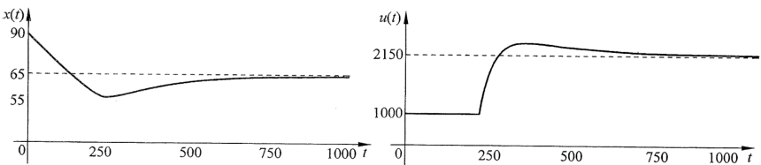
（a）系统输出 $x(t)$ 随时间的变化；（b）系统控制量 $u(t)$ 随时间的变化 图 7.4.2　含有限制的比例积分控制系统的输出与控制量随时间的变化

需要注意的是，体重的控制是一门非常综合的科学，体重除了与脂肪相关之外，还要考虑肌肉比例、身体的健康状态、睡眠质量、心情因素等。并且每日的饮食除了热量之外，也要考虑脂肪、碳水化合物、蛋白质等其他的营养元素。体重的变化也不是一个简单的线性方程，它因人而异，和遗传基因也息息相关。本章的例子只是简单地考虑了热量与脂肪燃烧的变化，不过这个模型虽然不够精确，但仍然为我们平时的饮食运动提供了粗略的指导意见，各位读者可以根据自己的情况建立动态模型并进行分析，作为日常体重管理的辅助工具。

## 7.5 本章要点总结

- **比例控制：**
  - 系统的输入与误差成正比，即 $u(t)=K_{\mathrm P}e(t)$。
  - 比例控制简单易行，系统响应速度快，但是无法消除稳态误差。
- **终值定理：**
  - 如果 $\lim_{t\to\infty}x(t)$ 存在，那么 $\lim_{t\to\infty}x(t)=\lim_{s\to0}sX(s)$。
- **积分控制：**
  - 系统的输入与误差的积分成正比，即 $u(t)=K_{\mathrm I}\int_0^t e(\tau)\,\mathrm d\tau$。
  - 积分控制可以改善稳态误差，但是会引入振动且响应迟缓。
- **比例积分控制：**
  - 将比例控制与积分控制相结合，$u(t)=K_{\mathrm P}e(t)+K_{\mathrm I}\int_0^t e(\tau)\,\mathrm d\tau$。
  - 既可以改善稳态误差，又可以改善积分控制的响应速度。
- **含有限制条件的控制器设计：**
  - 某些控制系统存在物理限制，可以使用一个饱和函数来限制系统的输入幅度。
