# 第3章 动态系统建模——状态空间方程

本章将介绍使用状态空间方程（State Space Model）描述系统数学模型的方法。状态空间方程是现代控制理论的基础，它以矩阵的形式表达系统状态变量、输入及输出之间的关系。它可以描述和处理多输入多输出（Multiple Input Multiple Output，MIMO）的系统。目前流行的一些算法，如模型预测控制、卡尔曼滤波器及最优化控制，都是在状态空间方程的表达形式基础上发展而来的。

本章的学习目标为：

- 掌握使用状态空间方程建立动态系统数学模型的流程。
- 理解状态空间方程与传递函数的关系。
- 掌握使用矩阵的特征值与特征向量解耦动态系统的方法。
- 掌握一维与二维相平面、相轨迹的绘制方法。
- 熟练使用相平面、相轨迹的方法分析动态系统平衡点的类型。
- 理解动态系统平衡点类型与状态矩阵特征值之间的关系。

## 3.1 状态空间方程

### 3.1.1 状态空间方程表达式

从一个例子入手分析，如图 3.1.1（a）所示的弹簧质量阻尼系统，在 2.1.2 节中曾经分析过，它的动态微分方程为

$$
m\frac{\mathrm{d}^2x(t)}{\mathrm{d}t^2}+b\frac{\mathrm{d}x(t)}{\mathrm{d}t}+kx(t)=f(t). \tag{3.1.1}
$$

其中，$x(t)$ 是位移，方向向右；$m$ 是质量；$b$ 是阻尼系数；$k$ 是弹簧系数；$f(t)$ 是外力。

  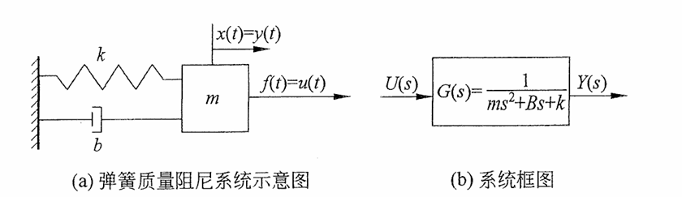
  
图 3.1.1　弹簧质量阻尼系统与框图

令此系统的输入等于外力，即 $u(t)=f(t)$，系统的输出等于位移，即 $y(t)=x(t)$。第 2 章介绍了经典控制理论中使用传递函数描述系统的方法。对式（3.1.1）等号两边分别进行拉普拉斯变换，并将 $u(t)=f(t)$、$y(t)=x(t)$ 代入，同时假设零初始条件 $x(0)=\left.\frac{\mathrm{d}x(t)}{\mathrm{d}t}\right|_{t=0}=0$，可以得到系统的传递函数为

$$
G(s)=\frac{Y(s)}{U(s)}=\frac{1}{ms^2+bs+k}. \tag{3.1.2}
$$

式（3.1.2）所对应的系统框图如图 3.1.1（b）所示。

对于同样的系统，在现代控制理论中则会使用状态空间方程的表达方式。状态空间方程是一个集合，它包含了系统的输入、输出及状态变量，并把它们用一系列的一阶微分方程表达出来。对于本例中的二阶系统，为了将其写成状态空间方程，需要选取合适的状态变量（State Variables），才能使二阶系统转化为一系列的一阶系统。根据这个要求，选取两个状态变量 $z_1(t)$ 和 $z_2(t)$，其中

$$
z_1(t)=x(t), \tag{3.1.3}
$$

$$
z_2(t)=\frac{\mathrm{d}z_1(t)}{\mathrm{d}t}=\frac{\mathrm{d}x(t)}{\mathrm{d}t}. \tag{3.1.4}
$$

根据式（3.1.4），取 $z_2(t)$ 对时间的导数，并将式（3.1.1）和 $u(t)=f(t)$ 代入其中，可得

$$
\begin{aligned}
\frac{\mathrm{d}z_2(t)}{\mathrm{d}t}
&=\frac{\mathrm{d}^2x(t)}{\mathrm{d}t^2}
=\frac{1}{m}\left(f(t)-b\frac{\mathrm{d}x(t)}{\mathrm{d}t}-kx(t)\right)\\
&=\frac{1}{m}u(t)-\frac{b}{m}z_2(t)-\frac{k}{m}z_1(t).
\end{aligned} \tag{3.1.5}
$$

现在将式（3.1.3）和式（3.1.5）写成紧凑的矩阵表达形式，可得

$$
\frac{\mathrm{d}}{\mathrm{d}t}
\begin{bmatrix}z_1(t)\\z_2(t)\end{bmatrix}
=
\begin{bmatrix}0&1\\-\dfrac{k}{m}&-\dfrac{b}{m}\end{bmatrix}
\begin{bmatrix}z_1(t)\\z_2(t)\end{bmatrix}
+
\begin{bmatrix}0\\\dfrac{1}{m}\end{bmatrix}u(t). \tag{3.1.6}
$$

而系统的输出 $y(t)=x(t)$ 也可以写成矩阵形式，即

$$
y(t)=\begin{bmatrix}1&0\end{bmatrix}
\begin{bmatrix}z_1(t)\\z_2(t)\end{bmatrix}+[0]u(t). \tag{3.1.7}
$$

式（3.1.6）和式（3.1.7）是图 3.1.1 中弹簧质量阻尼系统的状态空间方程。上述形式可推广并得到状态空间方程的一般形式：

$$
\frac{\mathrm{d}z(t)}{\mathrm{d}t}=Az(t)+Bu(t), \tag{3.1.8a}
$$

$$
y(t)=Cz(t)+Du(t). \tag{3.1.8b}
$$

其中：

- $z(t)$ 是状态变量，是一个 $n$ 维向量，$z(t)=[z_1(t),z_2(t),\ldots,z_n(t)]^{\mathrm T}$；
- $y(t)$ 是系统输出，是一个 $m$ 维向量，$y(t)=[y_1(t),y_2(t),\ldots,y_m(t)]^{\mathrm T}$；
- $u(t)$ 是系统输入，是一个 $p$ 维向量，$u(t)=[u_1(t),u_2(t),\ldots,u_p(t)]^{\mathrm T}$。

这说明，当使用状态空间方程来描述系统时，有 $n$ 个状态变量、$m$ 个输出和 $p$ 个输入。它可以表达多状态、多输出、多输入的系统。其中，矩阵 $A$ 是 $n\times n$ 矩阵，表示系统状态变量之间的关系，称为状态矩阵或者系统矩阵；矩阵 $B$ 是 $n\times p$ 矩阵，表示输入对状态变量的影响，称为输入矩阵或者控制矩阵；矩阵 $C$ 是 $m\times n$ 矩阵，表示系统的输出与系统状态变量之间的关系，称为输出矩阵；矩阵 $D$ 是 $m\times p$ 矩阵，表示系统的输入直接作用在系统输出的部分，称为直接传递矩阵。状态空间方程符号说明见表 3.1.1。

**表 3.1.1　状态空间方程符号说明**

  
  <table class="state-space-symbol-table" style="display: inline-table; margin: 0; border-collapse: collapse; text-align: center; white-space: nowrap; border: 1px solid #00a6df;">
    <thead>
      <tr><th style="border: 1px solid var(--background-modifier-border); padding: 0.4em 0.8em;">符号</th><th style="border: 1px solid var(--background-modifier-border); padding: 0.4em 0.8em;">名称</th><th style="border: 1px solid var(--background-modifier-border); padding: 0.4em 0.8em;">维度</th></tr>
    </thead>
    <tbody>
      <tr><td style="border: 1px solid var(--background-modifier-border); padding: 0.4em 0.8em;">$z(t)$</td><td style="border: 1px solid var(--background-modifier-border); padding: 0.4em 0.8em;">状态变量</td><td style="border: 1px solid var(--background-modifier-border); padding: 0.4em 0.8em;">$n\times1$</td></tr>
      <tr><td style="border: 1px solid var(--background-modifier-border); padding: 0.4em 0.8em;">$y(t)$</td><td style="border: 1px solid var(--background-modifier-border); padding: 0.4em 0.8em;">系统输出</td><td style="border: 1px solid var(--background-modifier-border); padding: 0.4em 0.8em;">$m\times1$</td></tr>
      <tr><td style="border: 1px solid var(--background-modifier-border); padding: 0.4em 0.8em;">$u(t)$</td><td style="border: 1px solid var(--background-modifier-border); padding: 0.4em 0.8em;">系统输入</td><td style="border: 1px solid var(--background-modifier-border); padding: 0.4em 0.8em;">$p\times1$</td></tr>
      <tr><td style="border: 1px solid var(--background-modifier-border); padding: 0.4em 0.8em;">$A$</td><td style="border: 1px solid var(--background-modifier-border); padding: 0.4em 0.8em;">状态矩阵</td><td style="border: 1px solid var(--background-modifier-border); padding: 0.4em 0.8em;">$n\times n$</td></tr>
      <tr><td style="border: 1px solid var(--background-modifier-border); padding: 0.4em 0.8em;">$B$</td><td style="border: 1px solid var(--background-modifier-border); padding: 0.4em 0.8em;">输入矩阵</td><td style="border: 1px solid var(--background-modifier-border); padding: 0.4em 0.8em;">$n\times p$</td></tr>
      <tr><td style="border: 1px solid var(--background-modifier-border); padding: 0.4em 0.8em;">$C$</td><td style="border: 1px solid var(--background-modifier-border); padding: 0.4em 0.8em;">输出矩阵</td><td style="border: 1px solid var(--background-modifier-border); padding: 0.4em 0.8em;">$m\times n$</td></tr>
      <tr><td style="border: 1px solid var(--background-modifier-border); padding: 0.4em 0.8em;">$D$</td><td style="border: 1px solid var(--background-modifier-border); padding: 0.4em 0.8em;">直接传递矩阵</td><td style="border: 1px solid var(--background-modifier-border); padding: 0.4em 0.8em;">$m\times p$</td></tr>
    </tbody>
  </table>

以上述弹簧质量阻尼系统为例，参考式（3.1.6）和式（3.1.7），其状态变量 $z(t)=[z_1(t),z_2(t)]^{\mathrm T}$ 是 $n=2$ 维向量；输出 $y(t)=x(t)$ 是 $m=1$ 维向量；输入 $u(t)=f(t)$ 是 $p=1$ 维向量。因此，对应矩阵为

$$
A=\begin{bmatrix}0&1\\-\dfrac{k}{m}&-\dfrac{b}{m}\end{bmatrix},\quad
B=\begin{bmatrix}0\\\dfrac{1}{m}\end{bmatrix},\quad
C=\begin{bmatrix}1&0\end{bmatrix},\quad D=[0].
$$

其中，状态矩阵 $A$ 是一个 $n\times n=2\times2$ 的矩阵；输入矩阵 $B$ 是一个 $n\times p=2\times1$ 的矩阵；输出矩阵 $C$ 是一个 $m\times n=1\times2$ 的矩阵；直接传递矩阵 $D$ 是一个 $m\times p=1\times1$ 的矩阵。

因为它只有一个输入和一个输出，所以本系统属于单输入单输出（Single Input Single Output，SISO）系统。

下面请看一个多输入多输出（Multiple Inputs Multiple Outputs，MIMO）系统的例子。根据图 3.1.2 所示的电路网络，列出其状态空间方程表达式。其中，系统有两个输入 $u(t)=[e_1(t),e_2(t)]^{\mathrm T}$ 和两个输出 $y(t)=[i_1(t),e_{R_3}(t)]^{\mathrm T}$。

  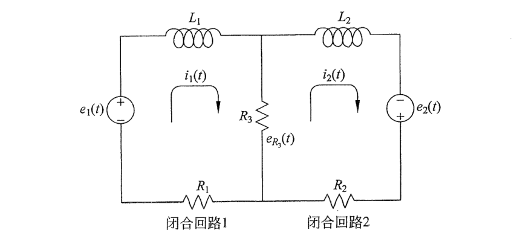
  
图 3.1.2　多输入多输出电路系统

若要建立上述系统的状态空间方程，首先要掌握它的动态微分方程。这个系统可以考虑成两个闭合回路，在每一个闭合回路里面使用基尔霍夫电压定律，可以得到

$$
L_1\frac{\mathrm{d}i_1(t)}{\mathrm{d}t}+i_1(t)R_1+e_{R_3}(t)=e_1(t), \tag{3.1.9a}
$$

$$
L_2\frac{\mathrm{d}i_2(t)}{\mathrm{d}t}+i_2(t)R_2-e_{R_3}(t)=e_2(t), \tag{3.1.9b}
$$

其中

$$
e_{R_3}(t)=[i_1(t)-i_2(t)]R_3. \tag{3.1.9c}
$$

将式（3.1.9c）代入式（3.1.9a）和式（3.1.9b），整理得到

$$
L_1\frac{\mathrm{d}i_1(t)}{\mathrm{d}t}+i_1(t)(R_1+R_3)-i_2(t)R_3=e_1(t), \tag{3.1.9d}
$$

$$
L_2\frac{\mathrm{d}i_2(t)}{\mathrm{d}t}+i_2(t)(R_2+R_3)-i_1(t)R_3=e_2(t). \tag{3.1.9e}
$$

选取状态变量 $z(t)=[z_1(t),z_2(t)]^{\mathrm T}$，其中

$$
z_1(t)=i_1(t), \tag{3.1.10a}
$$

$$
z_2(t)=i_2(t). \tag{3.1.10b}
$$

将式（3.1.10a）、式（3.1.10b）代入式（3.1.9d）和式（3.1.9e），调整后可得

$$
\frac{\mathrm{d}z_1(t)}{\mathrm{d}t}
=-\frac{R_1+R_3}{L_1}z_1(t)+\frac{R_3}{L_1}z_2(t)+\frac{1}{L_1}e_1(t), \tag{3.1.11a}
$$

$$
\frac{\mathrm{d}z_2(t)}{\mathrm{d}t}
=\frac{R_3}{L_2}z_1(t)-\frac{R_2+R_3}{L_2}z_2(t)+\frac{1}{L_2}e_2(t). \tag{3.1.11b}
$$

将式（3.1.11a）、式（3.1.11b）写成紧凑的矩阵形式，得到

$$
\frac{\mathrm{d}}{\mathrm{d}t}\begin{bmatrix}z_1(t)\\z_2(t)\end{bmatrix}
=\begin{bmatrix}
-\dfrac{R_1+R_3}{L_1}&\dfrac{R_3}{L_1}\\
\dfrac{R_3}{L_2}&-\dfrac{R_2+R_3}{L_2}
\end{bmatrix}\begin{bmatrix}z_1(t)\\z_2(t)\end{bmatrix}
+\begin{bmatrix}\dfrac{1}{L_1}&0\\0&\dfrac{1}{L_2}\end{bmatrix}
\begin{bmatrix}e_1(t)\\e_2(t)\end{bmatrix}. \tag{3.1.12}
$$

系统输出 $y(t)=[i_1(t),e_{R_3}(t)]^{\mathrm T}$ 可以表达为

$$
y(t)=\begin{bmatrix}i_1(t)\\e_{R_3}(t)\end{bmatrix}
=\begin{bmatrix}1&0\\R_3&-R_3\end{bmatrix}
\begin{bmatrix}z_1(t)\\z_2(t)\end{bmatrix}
+\begin{bmatrix}0&0\\0&0\end{bmatrix}
\begin{bmatrix}e_1(t)\\e_2(t)\end{bmatrix}. \tag{3.1.13}
$$

将式（3.1.12）和式（3.1.13）写成一般形式，可以得到系统的状态空间方程，即式（3.1.8a）和式（3.1.8b）。其中，$z(t)=[i_1(t),i_2(t)]^{\mathrm T}$，$y(t)=[i_1(t),e_{R_3}(t)]^{\mathrm T}$，$u(t)=[e_1(t),e_2(t)]^{\mathrm T}$，并且

$$
\begin{aligned}
A&=\begin{bmatrix}
-\dfrac{R_1+R_3}{L_1}&\dfrac{R_3}{L_1}\\
\dfrac{R_3}{L_2}&-\dfrac{R_2+R_3}{L_2}
\end{bmatrix},&
B&=\begin{bmatrix}\dfrac{1}{L_1}&0\\0&\dfrac{1}{L_2}\end{bmatrix},\\
C&=\begin{bmatrix}1&0\\R_3&-R_3\end{bmatrix},&
D&=\begin{bmatrix}0&0\\0&0\end{bmatrix}.
\end{aligned}
$$

### 3.1.2 状态空间方程与传递函数的关系

如 3.1.1 节所分析的，一个单输入单输出系统可以写成式（3.1.2）的传递函数形式和式（3.1.8a）、式（3.1.8b）的状态空间方程表达式，下面我们来讨论这两种形式之间的联系。

对式（3.1.8a）、式（3.1.8b）两边进行拉普拉斯变换：

$$
\mathcal{L}\left[\frac{\mathrm{d}z(t)}{\mathrm{d}t}\right]
=\mathcal{L}[Az(t)+Bu(t)], \tag{3.1.14a}
$$

$$
\mathcal{L}[y(t)]=\mathcal{L}[Cz(t)+Du(t)]. \tag{3.1.14b}
$$

考虑零初始状态，$z_1(0)=z_2(0)=0$，式（3.1.14a）、式（3.1.14b）可以整理为

$$
sZ(s)=AZ(s)+BU(s), \tag{3.1.15a}
$$

$$
Y(s)=CZ(s)+DU(s). \tag{3.1.15b}
$$

其中，$Z(s)=\mathcal{L}[z(t)]$，$Y(s)=\mathcal{L}[y(t)]$，$U(s)=\mathcal{L}[u(t)]$。调整式（3.1.15a）可得

$$
Z(s)=(sI-A)^{-1}BU(s), \tag{3.1.16}
$$

其中，$(sI-A)^{-1}$ 是 $(sI-A)$ 的逆矩阵；$I$ 是 $n\times n$ 单位矩阵，即

$$
I_{n\times n}=
\begin{bmatrix}
1&0&\cdots&0\\
0&1&\cdots&0\\
\vdots&\vdots&\ddots&\vdots\\
0&0&\cdots&1
\end{bmatrix}.
$$

将式（3.1.16）代入式（3.1.15b）中并调整，可得

$$
Y(s)=\left[C(sI-A)^{-1}B+D\right]U(s). \tag{3.1.17}
$$

因此，系统的传递函数可以表达为

$$
G(s)=\frac{Y(s)}{U(s)}=C(sI-A)^{-1}B+D. \tag{3.1.18}
$$

考虑图 3.1.1 的弹簧质量阻尼系统，其中 $D=0$。根据矩阵求逆公式 $(sI-A)^{-1}=\frac{(sI-A)^*}{|sI-A|}$，代入式（3.1.18）可得

$$
G(s)=\frac{Y(s)}{U(s)}=\frac{C(sI-A)^*B}{|sI-A|}. \tag{3.1.19}
$$

其中，$(sI-A)^*$ 是 $(sI-A)$ 的伴随矩阵，$|sI-A|$ 是 $(sI-A)$ 的行列式。

观察式（3.1.19），如果令 $G(s)$ 的分母部分为零，即 $|sI-A|=0$，得出的 $s$ 值有两个含义：第一，从传递函数的角度考虑，它是传递函数的极点；第二，从状态矩阵的角度考虑，它是矩阵 $A$ 的特征值（令 $|sI-A|=0$ 是求矩阵 $A$ 特征值的公式，见 3.2.1 节）。在 2.3 节中曾经介绍过，通过分析传递函数极点可以判断系统的表现。而当把系统写成状态空间方程之后，状态矩阵 $A$ 的特征值即为其相对应的传递函数 $G(s)$ 的极点。因此，通过分析矩阵 $A$ 的特征值也可以判断系统的表现。

  

状态空间方程系统建模内容请扫描此二维码观看。

## 3.2 相平面数学基础

式（3.1.8a）、式（3.1.8b）是状态空间方程的一般表达式，求解矩阵形式的微分方程可以掌握系统状态变量随时间的变化。式（3.1.8a）的解为

$$
z(t)=e^{A(t-t_0)}z(t_0)+\int_{t_0}^{t}e^{A(t-\tau)}Bu(\tau)\,\mathrm{d}\tau. \tag{3.2.1}
$$

关于求解过程本书不做详细推导，只给出结论作为参考，有兴趣的读者可以参考其他书籍。观察式（3.2.1）可以发现，$z(t)$ 由两部分组成，第一部分只和系统的初始条件 $z(t_0)$ 相关，而第二部分是一个卷积，与系统的输入相关。式（3.2.1）包含了卷积，而且指数部分还出现矩阵，因此增加了分析求解的难度和复杂程度。在第 2 章中引入了拉普拉斯变换和传递函数来绕开求解微分方程和卷积，从而简化了系统的分析。而对于状态空间方程，使用相平面与相轨迹的方法可以快速有效地分析系统。在讲解这一数学工具之前，首先回顾线性代数中的一个重要概念——矩阵的特征值与特征向量。

### 3.2.1 矩阵的特征值与特征向量

在线性代数中，对于一个给定的方阵 $A$，它的特征向量经过矩阵 $A$ 线性变换的作用之后，得到的新向量仍然与原来的保持在同一条直线上，但其长度或方向也许会改变，即

$$
Av=\lambda v. \tag{3.2.2}
$$

其中，$v$ 是矩阵 $A$ 的特征向量；$\lambda$ 为标量，即特征向量的长度在矩阵 $A$ 线性变换下缩放的比例，称为矩阵 $A$ 对应于特征向量 $v$ 的特征值。

首先来看线性变换，假设有一个二维矩阵 $A$ 与一个向量 $v_a$，其中

$$
A=\begin{bmatrix}1&1\\4&-2\end{bmatrix},\qquad
v_a=\begin{bmatrix}1\\2\end{bmatrix}. \tag{3.2.3}
$$

则

$$
Av_a=\begin{bmatrix}1&1\\4&-2\end{bmatrix}
\begin{bmatrix}1\\2\end{bmatrix}
=\begin{bmatrix}3\\0\end{bmatrix}. \tag{3.2.4}
$$

从 $v_a$ 到 $Av_a$ 的过程称为线性变换。变换后的向量长度和方向均发生改变，不再与原向量共线。

再考虑 $v_b=[1,1]^{\mathrm T}$：

$$
Av_b=\begin{bmatrix}1&1\\4&-2\end{bmatrix}
\begin{bmatrix}1\\1\end{bmatrix}
=\begin{bmatrix}2\\2\end{bmatrix}
=2\begin{bmatrix}1\\1\end{bmatrix}=\lambda v_b. \tag{3.2.5}
$$

式（3.2.5）说明，通过矩阵 $A$ 线性变换后，$Av_b=\lambda v_b=2v_b$。如图 3.2.1（b）所示，经过变换后的新向量与原向量在一条直线上，但是长度发生了改变。根据定义，$v_b$ 是矩阵 $A$ 的特征向量，缩放比例 $\lambda=2$ 则是矩阵 $A$ 对应于特征向量 $v_b$ 的特征值。

  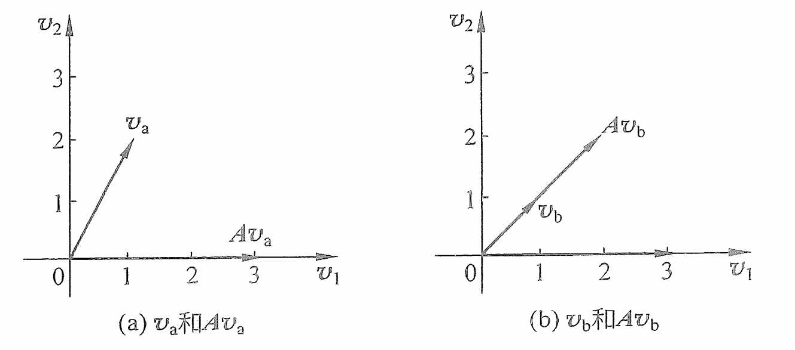
  
图 3.2.1　向量的线性变换

根据式（3.2.2），可得

$$
Av-\lambda v=0
\quad\Rightarrow\quad
(A-\lambda I)v=0. \tag{3.2.6}
$$

其中，$I$ 为单位矩阵，维度与 $A$ 相同。根据矩阵理论，如果式（3.2.6）有非零解，则矩阵 $(A-\lambda I)$ 的行列式必须为零，即

$$
|A-\lambda I|=0. \tag{3.2.7}
$$

将矩阵 $A$ 代入：

$$
\begin{vmatrix}1-\lambda&1\\4&-2-\lambda\end{vmatrix}=0, \tag{3.2.8a}
$$

$$
(1-\lambda)(-2-\lambda)-4=0
\quad\Rightarrow\quad
\lambda^2+\lambda-6=0. \tag{3.2.8b}
$$

式（3.2.8b）称为矩阵 $A$ 的特征方程（Characteristic Equation），其两个特征值为

$$
\lambda_1=2,\qquad \lambda_2=-3. \tag{3.2.9}
$$

当 $\lambda_1=2$ 时，令 $v_1=[v_{11},v_{12}]^{\mathrm T}$，代入式（3.2.6）：

$$
\begin{aligned}
(A-\lambda_1I)v_1
&=\begin{bmatrix}-1&1\\4&-4\end{bmatrix}
\begin{bmatrix}v_{11}\\v_{12}\end{bmatrix}=0\\
&\Rightarrow v_{11}=v_{12}.
\end{aligned} \tag{3.2.10}
$$

式（3.2.10）说明特征向量 $v_1$ 存在于 $v_{11}=v_{12}$ 这一条直线上。可以任意取其中的一组，例如选取 $v_{11}=v_{12}=1$，那么矩阵 $A$ 对应于特征值 $\lambda_1=2$ 的特征向量为

$$
v_1=\begin{bmatrix}1\\1\end{bmatrix}. \tag{3.2.11}
$$

$v_1$ 通过矩阵 $A$ 的线性变换后得到 $Av_1=[2,2]^{\mathrm T}=2v_1$，如图 3.2.1（b）所示。

同理，可以计算 $v_2$，即特征值 $\lambda_2=-3$ 时的特征向量。根据式（3.2.6），可得

$$
\begin{aligned}
(A-\lambda_2I)v_2
&=\begin{bmatrix}1+3&1\\4&-2+3\end{bmatrix}
\begin{bmatrix}v_{21}\\v_{22}\end{bmatrix}=0\\
&\Rightarrow
\begin{cases}
4v_{21}+v_{22}=0,\\
4v_{21}+v_{22}=0
\end{cases}
\Rightarrow v_{21}=-\frac14v_{22}.
\end{aligned} \tag{3.2.12}
$$

取 $v_{21}=0.5$、$v_{22}=-2$，得到

$$
v_2=\begin{bmatrix}0.5\\-2\end{bmatrix}. \tag{3.2.13}
$$

此时 $Av_2=[-1.5,6]^{\mathrm T}=-3v_2$。

### 3.2.2 特征值与特征向量的应用——线性方程组解耦

特征值与特征向量的一个重要应用是将矩阵转化成对角矩阵，从而达到解耦（Decouple）的效果。解耦即解除耦合，而耦合是指一个系统里面的两个或以上的状态变量存在相互影响、相互关联的作用。考虑一个包含两个状态变量的系统，它的微分方程组为

$$
\begin{cases}
\dfrac{\mathrm{d}z_1(t)}{\mathrm{d}t}=z_1(t)+z_2(t),\\[6pt]
\dfrac{\mathrm{d}z_2(t)}{\mathrm{d}t}=4z_1(t)-2z_2(t).
\end{cases} \tag{3.2.14}
$$

式（3.2.14）说明，系统状态变量 $z_1(t)$ 的变化率 $\frac{\mathrm{d}z_1(t)}{\mathrm{d}t}$ 除了与自身相关之外，还与 $z_2(t)$ 相关；而 $z_2(t)$ 的变化率 $\frac{\mathrm{d}z_2(t)}{\mathrm{d}t}$ 同时是 $z_2(t)$ 和 $z_1(t)$ 的函数，这样的两个状态变量就是耦合的。对于耦合系统，分析单个状态变量的变化需要同时考虑两个变量，这是不容易做到的。将上述系统写成紧凑的状态空间方程，得到

$$
\frac{\mathrm{d}z(t)}{\mathrm{d}t}=Az(t),\qquad
A=\begin{bmatrix}1&1\\4&-2\end{bmatrix}. \tag{3.2.15}
$$

若要解耦这个系统，首先需要定义过渡矩阵（Transition Matrix）：

$$
P=[v_1,v_2]=\begin{bmatrix}v_{11}&v_{21}\\v_{12}&v_{22}\end{bmatrix}. \tag{3.2.16}
$$

用 $A$ 左乘 $P$：

$$
AP=A[v_1,v_2]=[Av_1,Av_2]. \tag{3.2.17}
$$

由于 $Av_1=\lambda_1v_1$、$Av_2=\lambda_2v_2$，所以

$$
AP=[\lambda_1v_1,\lambda_2v_2]
=P\begin{bmatrix}\lambda_1&0\\0&\lambda_2\end{bmatrix}=PD. \tag{3.2.18}
$$

其中，$D=\begin{bmatrix}\lambda_1&0\\0&\lambda_2\end{bmatrix}$ 是一个特征值位于对角线上的对角矩阵。现在对式（3.2.18）等号两边同时左乘 $P^{-1}$，可得

$$
P^{-1}AP=D. \tag{3.2.19}
$$

定义一组新的状态变量 $\bar z(t)$，令

$$
z(t)=P\bar z(t). \tag{3.2.20}
$$

代入式（3.2.15）：

$$
P\frac{\mathrm{d}\bar z(t)}{\mathrm{d}t}=AP\bar z(t). \tag{3.2.21}
$$

两边同时左乘 $P^{-1}$：

$$
P^{-1}P\frac{\mathrm{d}\bar z(t)}{\mathrm{d}t}=P^{-1}AP\bar z(t). \tag{3.2.22}
$$

利用 $P^{-1}P=I$ 和 $P^{-1}AP=D$，得到

$$
\frac{\mathrm{d}\bar z(t)}{\mathrm{d}t}
=D\bar z(t)
=\begin{bmatrix}\lambda_1&0\\0&\lambda_2\end{bmatrix}\bar z(t). \tag{3.2.23}
$$

即

$$
\begin{cases}
\dfrac{\mathrm{d}\bar z_1(t)}{\mathrm{d}t}=\lambda_1\bar z_1(t),\\[6pt]
\dfrac{\mathrm{d}\bar z_2(t)}{\mathrm{d}t}=\lambda_2\bar z_2(t).
\end{cases} \tag{3.2.24}
$$

式（3.2.24）说明，新的状态变量 $\bar z_1(t)$ 和 $\bar z_2(t)$ 的变化率只和自身相关，因此通过这样一个变换之后，原来系统中的耦合关系就不再存在。而求解式（3.2.24）则非常容易，根据微分方程的求解公式可得

$$
\begin{cases}
\bar z_1(t)=C_1e^{\lambda_1t},\\
\bar z_2(t)=C_2e^{\lambda_2t},
\end{cases} \tag{3.2.25}
$$

其中，$C_1$ 和 $C_2$ 是常数，与初始条件有关。我们之前已经计算过矩阵 $A$ 的特征值（参考式（3.2.9））及特征向量（参考式（3.2.11）和式（3.2.13）），代入式（3.2.25）可得

$$
\begin{cases}
\bar z_1(t)=C_1e^{2t},\\
\bar z_2(t)=C_2e^{-3t}.
\end{cases} \tag{3.2.26}
$$

根据式（3.2.20），原状态变量为

$$
\begin{aligned}
z(t)=P\bar z(t)
&=\begin{bmatrix}1&0.5\\1&-2\end{bmatrix}
\begin{bmatrix}C_1e^{2t}\\C_2e^{-3t}\end{bmatrix}\\
&=\begin{bmatrix}C_1e^{2t}+0.5C_2e^{-3t}\\C_1e^{2t}-2C_2e^{-3t}\end{bmatrix}.
\end{aligned} \tag{3.2.27}
$$

请读者观察式（3.2.27），会发现状态矩阵 $A$ 的特征值 $\lambda_1=2$ 和 $\lambda_2=-3$ 出现在指数部分，它们将决定 $z(t)$ 随时间的变化趋势。例如，$z_1(t)=C_1e^{2t}+0.5C_2e^{-3t}$ 的第一项 $C_1e^{2t}$ 会随着时间的增加趋于无穷大，而第二项 $0.5C_2e^{-3t}$ 则会随着时间的增加趋于零。因此，这两项相加的结果也会随着时间的增加趋于无穷大，$z_2(t)$ 也有同样的表现。综上所述，随着时间的增加，系统的状态变量 $z(t)$ 会趋于无穷。以上解耦的方法也可以推广到更高阶的矩阵当中，这部分推导留给读者自行分析。

讨论过数学基础之后，我们将正式进入相平面与相轨迹的分析中。

## 3.3 相平面与相轨迹分析

相平面与相轨迹（Phase Portrait）使用直观图形分析微分方程，特别是二阶微分方程。相轨迹描述系统状态变量随时间在相平面上的变化轨迹。这一方法也可扩展到更高维系统，并可用于分析非线性系统。

### 3.3.1 一维相轨迹

首先讨论使用图形化分析一阶微分方程的方法。考虑一个一阶微分方程：

$$
\frac{\mathrm{d}z(t)}{\mathrm{d}t}=z^2(t)-1. \tag{3.3.1}
$$

将其在相平面中绘制出来，令横轴为状态变量 $z(t)$，纵轴为 $\frac{\mathrm{d}z(t)}{\mathrm{d}t}$。式（3.3.1）所表达的是一条抛物线，如图 3.3.1 所示。它与横坐标之间存在两个交点，分别定义为 $z_{f1}$ 和 $z_{f2}$。当状态变量 $z(t)$ 位于这两个点时，

$$
\left.\frac{\mathrm{d}z(t)}{\mathrm{d}t}\right|_{z(t)=z_{f1}}
=\left.\frac{\mathrm{d}z(t)}{\mathrm{d}t}\right|_{z(t)=z_{f2}}=0,
$$

说明此刻的 $z(t)$ 将不会随时间发生任何改变。因此，这两个点被称为平衡点（Equilibrium Point 或 Fixed Point）。从动态系统的角度考虑，当状态变量 $z(t)$ 位于平衡点时，动态系统会保持“静止”的状态。

  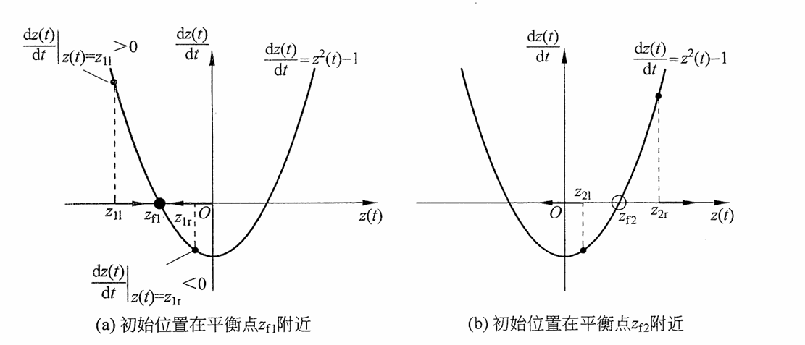
  
图 3.3.1　一维微分方程图形化分析

一旦状态变量偏离平衡点之后，动态系统便会“动”起来，此时我们所关心的是系统能否回到静止的状态（平衡点）。首先看图 3.3.1（a），假设状态变量 $z(t)$ 在 $t=0$ 时位于平衡点 $z_{f1}$ 的左边，即 $z(0)=z_{1l}$。根据图像显示，此时

$$
\left.\frac{\mathrm{d}z(t)}{\mathrm{d}t}\right|_{z(t)=z_{1l}}>0,
$$

这说明随着时间的增加，状态变量 $z(t)$ 也会增加。在图中，$z(t)$ 将沿着向右的轨迹移动。而在它移动的过程中，$\frac{\mathrm{d}z(t)}{\mathrm{d}t}$ 始终保持为正值，因此 $z(t)$ 就会一直增加并保持向右移动，直到 $z(t)=z_{f1}$ 时才会停下来，此时

$$
\left.\frac{\mathrm{d}z(t)}{\mathrm{d}t}\right|_{z(t)=z_{f1}}=0.
$$

同理，如果 $t=0$ 时 $z(0)$ 在 $z_{f1}$ 的右边，即 $z(0)=z_{1r}$，此时

$$
\left.\frac{\mathrm{d}z(t)}{\mathrm{d}t}\right|_{z(t)=z_{1r}}<0,
$$

$z(t)$ 则会随着时间的增加而向左移动（随着时间的增加而减小），直到平衡点 $z_{f1}$ 为止。以上分析说明，当系统的状态变量 $z(t)$ 小范围偏离平衡点 $z_{f1}$ 后，会自动回到平衡点 $z_{f1}$。因此，$z_{f1}$ 被称为稳定平衡点。

用同样的方法分析另一个平衡点 $z_{f2}$，请读者根据图 3.3.1（b）自行推导，可以发现，无论 $z(t)$ 的初始位置在 $z_{f2}$ 的左边还是右边，它的变化趋势都将会远离 $z_{f2}$。因此，$z_{f2}$ 被称为系统的不稳定平衡点，即状态变量偏离 $z_{f2}$ 之后，就无法再自动地回到 $z_{f2}$ 这个平衡点上。需要注意的是，根据图 3.3.1，只有当初始位置 $z(0)$ 在 $z_{f2}$ 左边，即 $z(0)<z_{f2}$ 时，状态变量才可以回到平衡点 $z_{f1}$。因此，$z_{f1}$ 是一个局部（Local）稳定的平衡点。

使用此方法来分析如下非线性微分方程。

#### 例 3.3.1　Logistic 人口繁殖模型

利用相平面与相轨迹分析 Logistic 人口繁殖模型，它的微分方程为

$$
\frac{\mathrm{d}P(t)}{\mathrm{d}t}=rP(t)\left(1-\frac{P(t)}{K}\right). \tag{3.3.2}
$$

其中，$P(t)$ 是人口数，$r$ 是人口的自然增长率（$r>0$），$K$ 是环境承载力。

解：式（3.3.2）可以写成

$$
\frac{\mathrm{d}P(t)}{\mathrm{d}t}=rP(t)-\frac{r}{K}P^2(t). \tag{3.3.3}
$$

因为式（3.3.3）存在 $P^2(t)$ 项，所以它是一个非线性的系统，求解微分方程相较于线性系统会更加困难，使用相平面可以简化分析并直观地理解系统的特征。首先来寻找系统的平衡点，令 $\frac{\mathrm{d}P(t)}{\mathrm{d}t}=0$，可得

$$
0=rP(t)-\frac{r}{K}P^2(t)
\quad\Rightarrow\quad
\begin{cases}P_{f1}=0,\\P_{f2}=K.
\end{cases} \tag{3.3.4}
$$

上面两个平衡点的位置很容易通过物理意义来理解。首先，$P_{f1}=0$ 说明这是个无人区，人口自然不会凭空产生出来。而当 $P_{f2}=K$ 时，说明人口数达到了环境的承载力，将在此位置保持平衡。

将式（3.3.3）分成两部分，即 $rP(t)$ 和 $\frac{r}{K}P^2(t)$，并把这两条曲线在相平面中绘制出来。由于人口数量为负数没有意义，所以图中只包含了正数部分。横轴为人口数 $P(t)$，纵轴为人口变化率 $\frac{\mathrm{d}P(t)}{\mathrm{d}t}$。

  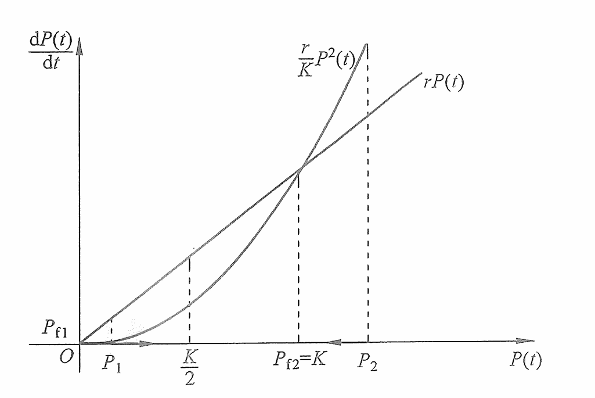
  
图 3.3.2　例 3.3.1 相轨迹分析

首先分析平衡点 $P_{f1}=0$。如图 3.3.2 所示，当有少量人口迁移到此地时（此时假设初始状态为 $P(0)=P_1$），$\left.\frac{\mathrm{d}P(t)}{\mathrm{d}t}\right|_{P(t)=P_1}>0$，因此随着时间的增加，人口将正增长，$P(t)$ 将沿着正方向轨迹移动并将远离平衡点 $P_{f1}$，所以 $P_{f1}$ 是一个不稳定平衡点。这说明一个地方一旦开始出现生命，就会生生不息。

同时可以发现，随着 $P(t)$ 不断向正方向移动，$rP(t)$ 与 $\frac{r}{K}P^2(t)$ 之间的差距会越来越大，直到 $P(t)=\frac{K}{2}$ 时达到最大的差值。这说明当人口数 $P(t)<\frac{K}{2}$ 时，人口的增长率在不断地升高，人口加速增长。而当 $P(t)>\frac{K}{2}$ 以后，增长速度就会减缓，直到达到环境的承载力，即另一个平衡点 $P_{f2}=K$ 时为止。

考虑另一种情况，如果突然间有大量的人口涌入这个地方（此时初始状态为 $P(0)=P_2$），$\left.\frac{\mathrm{d}P(t)}{\mathrm{d}t}\right|_{P(t)=P_2}<0$，人口将负增长，$P(t)$ 将沿着负方向移动。同时可以发现，初始状态下涌入的人越多，负增长的速率就越快；随着人口的下降，负增长的速率也会下降，直到达到环境的承载力，即平衡点 $P_{f2}=K$ 为止。所以 $P_{f2}$ 是一个稳定的平衡点。

图 3.3.3 显示了从 $P_1$ 和 $P_2$ 开始时人口随时间的变化。它呈现出了与上面分析一致的结果。当初始位置从 $P_1$ 开始时，人口的增速会越来越快，直到 $\frac{K}{2}$ 后增速开始下降，并达到承载力。而一旦人口超过承载能力 $K$ 以后，将会迅速负增长以达到平衡点。

  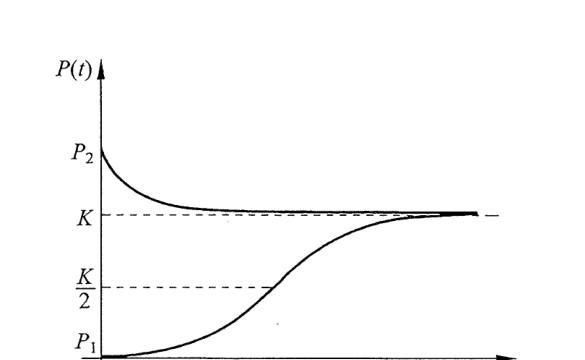
  
图 3.3.3　例 3.3.1 人口随时间的变化趋势图

如图 3.3.3 所示，在此模型条件下，人口从 $P_1$ 增长到 $K$ 的速度要远远慢于人口从 $P_2$ 下降到 $K$ 的速度。这是因为一个人从出生到成熟需要十几年的时间，繁衍一代人则需要二三十年的周期。然而，一场战争、一场瘟疫或一场自然灾害却可以在短时间内毁灭大量的人口，甚至造成深远的断代影响。

人类是世界上最伟大的物种，自从诞生在这个地球以来就开始了对自然界的征服之旅，仅仅用了很短的时间就站到了食物链的顶端，从此不断地繁衍、进化，变得文明。与此同时，人类的生存环境也在被自身的活动不断地改变着。上述人口模型比较简单且参数较少，它并没有考虑到人口的年龄结构、迁徙、疾病、科技发展，或是政策因素的影响。但即便如此，这个简单的数学模型仍然揭示了人类活动和环境承载力之间的关系，并阐述了一个重要的道理：在发展的同时需要对自然法则存一份敬畏之心。尊重自然，尊重科学，人类的文明才能够更加繁荣地发展下去。

### 3.3.2 二维相平面与相轨迹——简化形式

考虑一个二维系统，在没有输入的情况下，它的状态空间方程为

$$
\frac{\mathrm{d}}{\mathrm{d}t}
\begin{bmatrix}z_1(t)\\z_2(t)\end{bmatrix}
=A\begin{bmatrix}z_1(t)\\z_2(t)\end{bmatrix}
=\begin{bmatrix}a_{11}&a_{12}\\a_{21}&a_{22}\end{bmatrix}
\begin{bmatrix}z_1(t)\\z_2(t)\end{bmatrix}. \tag{3.3.5}
$$

求式（3.3.5）的平衡点，可令 $\frac{\mathrm{d}}{\mathrm{d}t}[z_1(t),z_2(t)]^{\mathrm T}=0$，得到

$$
\begin{cases}
0=a_{11}z_1(t)+a_{12}z_2(t),\\
0=a_{21}z_1(t)+a_{22}z_2(t)
\end{cases}
\quad\Rightarrow\quad
\begin{cases}z_{1f}=0,\\z_{2f}=0.
\end{cases} \tag{3.3.6}
$$

首先分析简化矩阵，假设 $a_{12}=a_{21}=0$。此时式（3.3.5）可以化简为

$$
\frac{\mathrm{d}}{\mathrm{d}t}
\begin{bmatrix}z_1(t)\\z_2(t)\end{bmatrix}
=\begin{bmatrix}a_{11}&0\\0&a_{22}\end{bmatrix}
\begin{bmatrix}z_1(t)\\z_2(t)\end{bmatrix}, \tag{3.3.7}
$$

即

$$
\begin{cases}
\dfrac{\mathrm{d}z_1(t)}{\mathrm{d}t}=a_{11}z_1(t),\\[6pt]
\dfrac{\mathrm{d}z_2(t)}{\mathrm{d}t}=a_{22}z_2(t).
\end{cases} \tag{3.3.8}
$$

下面根据 $a_{11}$ 和 $a_{22}$ 的符号来进行分类讨论。

**类（1）：$a_{11}>0$ 且 $a_{22}>0$。**

首先分析 $a_{11}=a_{22}>0$ 的情况。从坐标轴上的点入手，假设 $z(t)$ 在 $t=0$ 时位于坐标横轴上，即 $z(0)=[z_1(0),z_2(0)]^{\mathrm T}=[z_1(0),0]^{\mathrm T}$。此时 $z_2(0)=0=z_{2f}$，在平衡点上，所以 $z_2(t)$ 不会随时间改变。如图 3.3.4（a）所示，当初始状态 $z_1(0)=z_{1r}>0$ 时，根据式（3.3.8），

$$
\left.\frac{\mathrm{d}z_1(t)}{\mathrm{d}t}\right|_{z_1(0)=z_{1r}}
=a_{11}z_{1r}>0,
$$

因此 $z_1(t)$ 会随着时间增加而不断地增加，向右移动并远离平衡点。同理，如果初始状态处于平衡点左边，即 $z_1(0)=z_{1l}<0$，那么随着时间的增加，$z_1(t)$ 会不断地减小（向左移动）。读者可以用同样的方法分析在纵轴上 $z_1(0)=z_{1f}=0$ 的情况。如图 3.3.4（a）所示，在纵轴上 $z_2(t)$ 的变化也将是沿着远离平衡点的轨迹移动。

  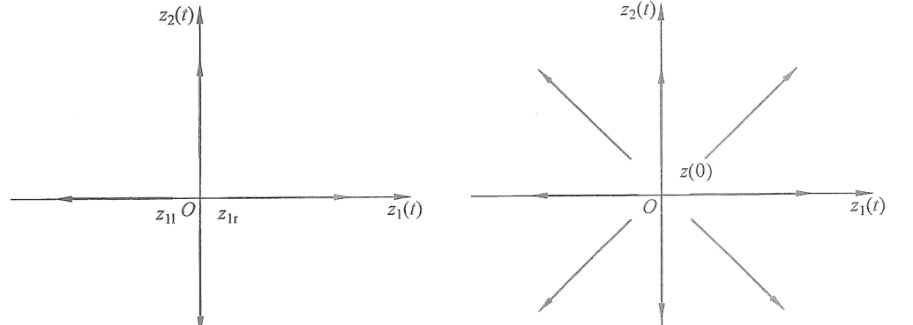
  
图 3.3.4　$a_{11}=a_{22}>0$ 时的相平面分析

把坐标轴上的情况推广到整个相平面上，可以得到图 3.3.4（b）所示的图像。如果初始位置位于第一象限，因为 $\frac{\mathrm{d}z_1(t)}{\mathrm{d}t}>0$ 且 $\frac{\mathrm{d}z_2(t)}{\mathrm{d}t}>0$，所以 $z_1(t)$ 与 $z_2(t)$ 都会增加并远离平衡点。由于 $a_{11}=a_{22}>0$，$z_1(t)$ 和 $z_2(t)$ 的变化速率是一样的，此时的相轨迹便是一条直线。读者可以自行推导在其他象限上的情况。

如果 $a_{11}\ne a_{22}>0$，那么它的相轨迹如图 3.3.5 所示。因为两个变量的变化率不同，所以相轨迹是一条曲线，但仍然是远离平衡点位置的。

  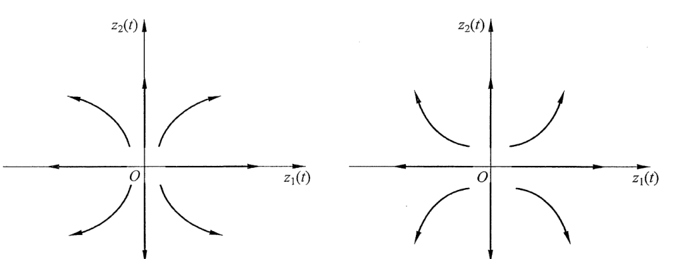
  
图 3.3.5　$a_{11}\ne a_{22}>0$ 时的相平面分析

在这种情况下，平衡点 $z_f$ 称为不稳定节点（Unstable Node）。

**类（2）：$a_{11}>0$ 且 $a_{22}<0$。**

使用与类（1）相似的分析方法，首先分析坐标轴上的点。其中，平衡点 $z_{1f}=0$ 是不稳定平衡点，$z_1(t)$ 会从初始位置向远离平衡点的方向移动。同时，因为 $a_{22}<0$，所以在坐标纵轴上，一个偏离平衡点 $z_{2f}=0$ 的初始状态会向平衡点移动。例如在图 3.3.6（a）中，初始位置为 $z_2(0)>0$，此时

$$
\left.\frac{\mathrm{d}z_2(t)}{\mathrm{d}t}\right|_{z_2(t)=z_2(0)}
=a_{22}z_2(0)<0.
$$

所以 $z_2(t)$ 将随着时间的增加递减，并逐渐靠近平衡点 $z_{2f}=0$。

  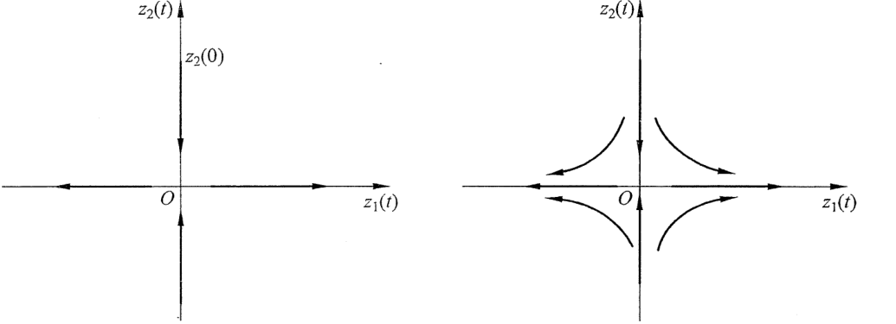
  
图 3.3.6　$a_{11}>0$ 且 $a_{22}<0$ 时的相平面分析

得到坐标轴上的情况之后，便可以推导出整个相平面上的相轨迹，如图 3.3.6（b）所示。相轨迹会沿着横轴远离平衡点 $z_{1f}=0$ 的位置，同时沿着纵轴靠近平衡点 $z_{2f}=0$ 的位置。在此情况下，随着时间 $t$ 趋于无穷，$z_2(t)$ 将收敛于平衡点 $z_{2f}=0$，而 $z_1(t)$ 将趋于正（负）无穷。

当 $a_{11}<0$、$a_{22}>0$ 时与上述分析类似，故不再赘述，读者可以自行推导。在这种情况下，平衡点 $z_f$ 称为鞍点（Saddle），是一个不稳定的点。

**类（3）：$a_{11}<0$ 且 $a_{22}<0$。**

可以使用与类（1）相同的方式分析，故不再赘述。它的相轨迹如图 3.3.7 所示。其中，图 3.3.7（a）显示的情况是 $|a_{11}|=|a_{22}|$，所以 $z_1(t)$ 与 $z_2(t)$ 向平衡点收敛的速度是相同的。而在图 3.3.7（b）中，$|a_{11}|>|a_{22}|$，所以 $z_1(t)$ 的收敛速度会大于 $z_2(t)$ 的收敛速度。

  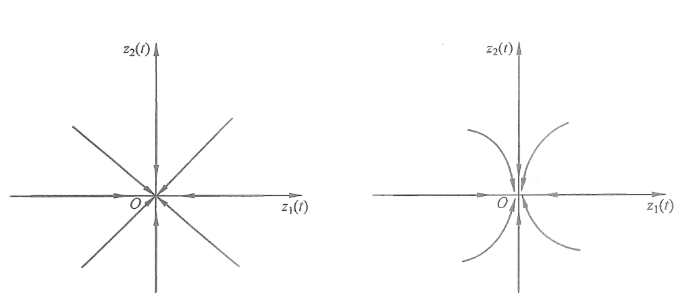
  
图 3.3.7　$a_{11}<0$ 且 $a_{22}<0$ 时的相轨迹分析

在这种情况下，平衡点 $z_f$ 称为稳定节点（Stable Node）。

### 3.3.3 二维相平面与相轨迹——一般形式

掌握了简化形式的二维系统相轨迹后，可以推广到一般形式。首先将式（3.3.5）解耦（对角化），定义一个新的状态变量 $\bar z(t)$，令 $z(t)=P\bar z(t)$。$P$ 是过渡矩阵 $P=[v_1,v_2]$，其中 $v_1$ 和 $v_2$ 是矩阵 $A$ 的特征向量。根据 3.2.2 节中的介绍，可得

$$
\frac{\mathrm{d}}{\mathrm{d}t}
\begin{bmatrix}\bar z_1(t)\\\bar z_2(t)\end{bmatrix}
=\begin{bmatrix}\lambda_1&0\\0&\lambda_2\end{bmatrix}\bar z(t). \tag{3.3.9}
$$

其中，$\lambda_1$ 和 $\lambda_2$ 是矩阵 $A$ 的特征值。式（3.3.9）是一个对角矩阵，分析它的相轨迹可以使用 3.3.2 节的结论。下面通过几个例子深入地讨论一般形式矩阵的相轨迹。

#### 例 3.3.2　分析二阶系统的相轨迹

分析系统 $\frac{\mathrm{d}z(t)}{\mathrm{d}t}=Az(t)$，其中

$$
A=\begin{bmatrix}-3&4\\-2&3\end{bmatrix}.
$$

解：首先求矩阵 $A$ 的特征值，令 $|A-\lambda I|=0$，可得 $\lambda_1=-1$、$\lambda_2=1$，与其相对应的特征向量分别为 $v_1=[2,1]^{\mathrm T}$、$v_2=[1,1]^{\mathrm T}$。令 $z(t)=P\bar z(t)$，其中

$$
P=[v_1,v_2]=\begin{bmatrix}2&1\\1&1\end{bmatrix},
$$

则

$$
\frac{\mathrm{d}}{\mathrm{d}t}
\begin{bmatrix}\bar z_1(t)\\\bar z_2(t)\end{bmatrix}
=\begin{bmatrix}-1&0\\0&1\end{bmatrix}\bar z(t). \tag{3.3.10}
$$

式（3.3.10）所示矩阵的特征值都是实数且符号相反，这种情况和 3.3.2 节中讨论的类（2）是一样的。如前面所分析的，平衡点 $\bar z_f=[0,0]^{\mathrm T}$ 是一个鞍点。它的相轨迹如图 3.3.8（a）所示，$\bar z_1(t)$ 随着时间增加而靠近平衡点，$\bar z_2(t)$ 随着时间增加而远离平衡点。式（3.3.10）中 $\bar z(t)$ 的解为

$$
\bar z(t)=\begin{bmatrix}\bar z_1(t)\\\bar z_2(t)\end{bmatrix}
=\begin{bmatrix}C_1e^{-t}\\C_2e^t\end{bmatrix}. \tag{3.3.11}
$$

原状态变量为

$$
\begin{aligned}
z(t)=P\bar z(t)
&=\begin{bmatrix}2&1\\1&1\end{bmatrix}
\begin{bmatrix}C_1e^{-t}\\C_2e^t\end{bmatrix}\\
&=\begin{bmatrix}2C_1e^{-t}+C_2e^t\\C_1e^{-t}+C_2e^t\end{bmatrix}.
\end{aligned} \tag{3.3.12}
$$

式（3.3.12）说明 $z(t)$ 是 $\bar z(t)$ 通过矩阵 $P$ 的线性变换。在通过这个线性变换之后，相轨迹将从 $\bar z(t)=[\bar z_1(t),\bar z_2(t)]^{\mathrm T}$ 映射到 $z(t)=[z_1(t),z_2(t)]^{\mathrm T}$ 上。如图 3.3.8（b）所示，从直观上看，这个线性变换将 $\bar z_1(t)$ 和 $\bar z_2(t)$ 两个坐标轴沿着图中箭头的方向旋转到 $v_1$ 和 $v_2$ 上，那么相轨迹也会被相应地“拉长”与“压扁”。$z(t)$ 的相轨迹如图 3.3.8（c）所示。

更为重要的是，这个线性变化不会改变平衡点的性质，因此平衡点 $z_f$ 的性质与 $\bar z_f$ 保持一致，是一个鞍点。这也可以通过式（3.3.12）得到验证：例如在某种初始条件下，$C_2=0$，可得 $z(t)=[2C_1e^{-t},C_1e^{-t}]^{\mathrm T}$，说明随着时间的增加，$z_1(t)$ 和 $z_2(t)$ 将沿着 $v_1=[2,1]^{\mathrm T}$ 这条直线向 $[0,0]^{\mathrm T}$ 移动，相对应的指数部分为 $\lambda_1=-1$。同理，当 $C_1=0$ 时，$z(t)=[C_2e^t,C_2e^t]^{\mathrm T}$，这说明随着时间的增加，$z_1(t)$ 和 $z_2(t)$ 将沿着 $v_2=[1,1]^{\mathrm T}$ 这条直线趋于无穷，对应的指数部分为 $\lambda_2=1$。

  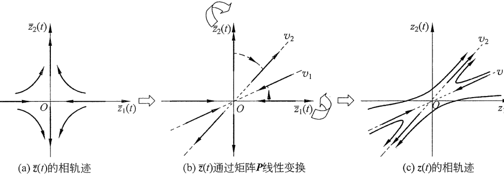
  
图 3.3.8　例 3.3.2 的相轨迹分析

#### 例 3.3.3　分析二阶系统的相轨迹

若

$$
A=\begin{bmatrix}3&-2\\1&0\end{bmatrix},
$$

解：矩阵 $A$ 的特征值为 $\lambda_1=1$、$\lambda_2=2$，因此平衡点 $z_f$ 是一个不稳定节点。相轨迹的分析方法同例 3.3.2，故不再赘述。

#### 例 3.3.4　分析二阶系统的相轨迹

若

$$
A=\begin{bmatrix}-3&2\\-1&0\end{bmatrix},
$$

解：矩阵 $A$ 的特征值为 $\lambda_1=-1$、$\lambda_2=-2$，因此平衡点 $z_f$ 是一个稳定的节点。相轨迹的分析方法同例 3.3.2，故不再赘述。

例 3.3.3 和例 3.3.4 的相轨迹如图 3.3.9 所示，请读者自行推导。

  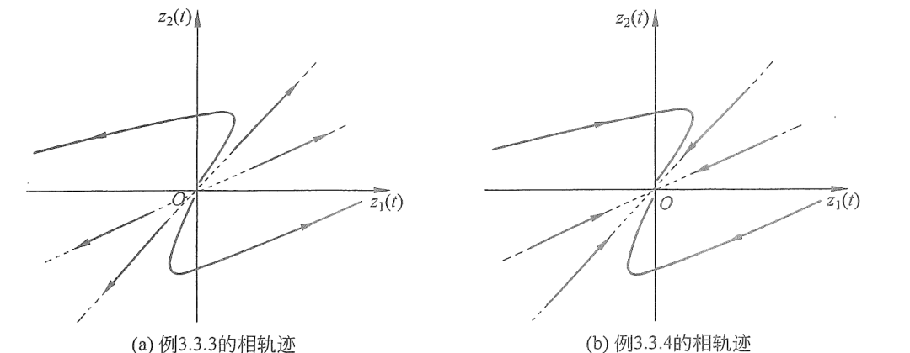
  
图 3.3.9　例 3.3.3 与例 3.3.4 的相轨迹分析

#### 例 3.3.5　分析二阶系统的相轨迹

分析系统，其中

$$
A=\begin{bmatrix}0&4\\-1&0\end{bmatrix}.
$$

解：首先求解矩阵 $A$ 的特征值与特征向量，可得

$$
\lambda_1=2\mathrm{j},\quad \lambda_2=-2\mathrm{j},\qquad
v_1=\begin{bmatrix}2\\\mathrm{j}\end{bmatrix},\quad
v_2=\begin{bmatrix}2\\-\mathrm{j}\end{bmatrix}. \tag{3.3.13}
$$

式（3.3.13）说明矩阵 $A$ 的特征值是一对共轭复数，而且它不存在实数特征向量，特征向量无法在相平面中表达出来。前面例子的处理方法将无法使用，因此需要从解入手分析。首先令 $z(t)=P\bar z(t)$，其中 $P=[v_1,v_2]$，可得

$$
\frac{\mathrm{d}}{\mathrm{d}t}
\begin{bmatrix}\bar z_1(t)\\\bar z_2(t)\end{bmatrix}
=\begin{bmatrix}2\mathrm{j}&0\\0&-2\mathrm{j}\end{bmatrix}\bar z(t), \tag{3.3.14}
$$

其解为

$$
\bar z(t)=\begin{bmatrix}C_1e^{\mathrm{j}2t}\\C_2e^{-\mathrm{j}2t}\end{bmatrix}. \tag{3.3.15}
$$

根据欧拉公式，

$$
\bar z(t)=\begin{bmatrix}
C_1\cos2t+C_1\mathrm{j}\sin2t\\
C_2\cos2t-C_2\mathrm{j}\sin2t
\end{bmatrix}. \tag{3.3.16}
$$

将式（3.3.16）代入 $z(t)=P\bar z(t)$，可得

$$
\begin{aligned}
z(t)
&=\begin{bmatrix}2&2\\\mathrm{j}&-\mathrm{j}\end{bmatrix}
\begin{bmatrix}
C_1\cos2t+C_1\mathrm{j}\sin2t\\
C_2\cos2t-C_2\mathrm{j}\sin2t
\end{bmatrix}\\
&=\begin{bmatrix}
2(C_1+C_2)\cos2t+2(C_1-C_2)\mathrm{j}\sin2t\\
(C_1-C_2)\mathrm{j}\cos2t-(C_1+C_2)\sin2t
\end{bmatrix}.
\end{aligned} \tag{3.3.17}
$$

令 $B_1=C_1+C_2$、$B_2=C_1-C_2$，则式（3.3.17）化简为

$$
z(t)=\begin{bmatrix}z_1(t)\\z_2(t)\end{bmatrix}
=\begin{bmatrix}
2B_1\cos2t+2B_2\mathrm{j}\sin2t\\
B_2\mathrm{j}\cos2t-B_1\sin2t
\end{bmatrix}. \tag{3.3.18}
$$

根据式（3.3.18）可得

$$
\begin{aligned}
\left(\frac{z_1(t)}{2}\right)^2+z_2^2(t)
&=\left(B_1\cos2t+B_2\mathrm{j}\sin2t\right)^2
+\left(B_2\mathrm{j}\cos2t-B_1\sin2t\right)^2\\
&=B_1^2\cos^22t+2B_1B_2\mathrm{j}\cos2t\sin2t-B_2^2\sin^22t\\
&\quad-B_2^2\cos^22t-2B_1B_2\mathrm{j}\cos2t\sin2t+B_1^2\sin^22t\\
&=(B_1^2-B_2^2)\cos^22t+(B_1^2-B_2^2)\sin^22t\\
&=(B_1^2-B_2^2)(\cos^22t+\sin^22t)\\
&=B_1^2-B_2^2.
\end{aligned} \tag{3.3.19}
$$

将 $C_1+C_2=B_1$、$C_1-C_2=B_2$ 代入式（3.3.19），可得

$$
\left(\frac{z_1(t)}{2}\right)^2+z_2^2(t)=4C_1C_2. \tag{3.3.20}
$$

两边同时乘以 $\frac{1}{4C_1C_2}$，整理后可得

$$
\left(\frac{z_1(t)}{4\sqrt{C_1C_2}}\right)^2
+\left(\frac{z_2(t)}{2\sqrt{C_1C_2}}\right)^2=1. \tag{3.3.21}
$$

式（3.3.21）是一个以原点为中心的椭圆方程，这说明 $z_1(t)$ 和 $z_2(t)$ 在相平面中沿着一个椭圆的轨迹运行，如图 3.3.10 所示。在这种情况下，平衡点 $z_f$ 称为中心点（Center），相轨迹会围绕着这个中心点做圆周运动。

判断相轨迹的运动方向，可以以一个在横轴上的点进行分析。例如选择状态 $z(0)=[z_1(0),z_2(0)]^{\mathrm T}=[z_1(0),0]^{\mathrm T}$，如图 3.3.10 所示，选择 $z_1(0)>0$ 的点进行分析。此时根据状态空间方程 $\frac{\mathrm{d}z(t)}{\mathrm{d}t}=\begin{bmatrix}0&4\\-1&0\end{bmatrix}z(t)$，可得 $\left.\frac{\mathrm{d}z_1(t)}{\mathrm{d}t}\right|_{t=0}=0$，所以 $z_1(t)$ 不会随时间改变；而 $\left.\frac{\mathrm{d}z_2(t)}{\mathrm{d}t}\right|_{t=0}=-z_1(0)<0$，所以 $z_2(t)$ 会随着时间的增加而减小。在相轨迹中，$z_2(t)$ 在 $t=0$ 时的移动趋势指向下方，所以相轨迹在图中按照顺时针移动。

图 3.3.10（b）显示了 $z_1(t)$ 和 $z_2(t)$ 随时间的变化。可以发现，$z_1(t)$ 和 $z_2(t)$ 此消彼长，循环往复。如果从能量的角度来分析，它们的总能量取决于初始状态 $z(0)$，不会随着时间发生改变。所以这个系统在稳定与不稳定之间，$z(t)$ 始终有界但始终不为 0。

  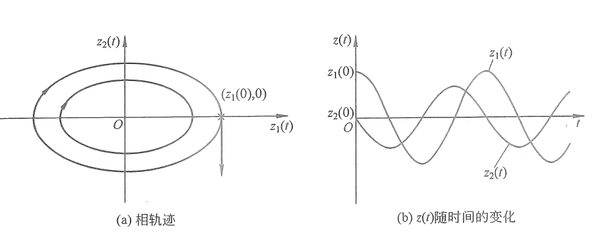
  
图 3.3.10　例 3.3.5 的相轨迹分析

#### 例 3.3.6　分析二阶系统的相轨迹

若

$$
A=\begin{bmatrix}1&-2\\2&1\end{bmatrix},
$$

解：首先求解矩阵 $A$ 的特征值，可得

$$
\lambda_1=1+2\mathrm{j},\qquad \lambda_2=1-2\mathrm{j}. \tag{3.3.22}
$$

矩阵 $A$ 的特征值是共轭的复数，但与例 3.3.5 不同，它包含了实部部分。分析它的解，令 $z(t)=P\bar z(t)$，其中 $P=[v_1,v_2]$，可得

$$
\frac{\mathrm{d}}{\mathrm{d}t}
\begin{bmatrix}\bar z_1(t)\\\bar z_2(t)\end{bmatrix}
=\begin{bmatrix}1+2\mathrm{j}&0\\0&1-2\mathrm{j}\end{bmatrix}\bar z(t), \tag{3.3.23}
$$

其解为

$$
\bar z(t)=e^t\begin{bmatrix}C_1e^{\mathrm{j}2t}\\C_2e^{-\mathrm{j}2t}\end{bmatrix}. \tag{3.3.24}
$$

可以发现，式（3.3.24）和式（3.3.15）的差别在于一个系数 $e^t$，而 $e^t$ 是随着时间的增加而不断增大的。因此其相轨迹如图 3.3.11（a）所示，它与图 3.3.10（a）类似，以原点为中心做圆周运动，但是直径在不断地扩大，形成了一个向外的螺旋线。本例中螺旋线的方向是顺时针的，如例 3.3.5 所分析，可以通过坐标轴上一点进行判断，故不赘述。$z(t)$ 随时间变化的示意图如图 3.3.11（b）所示，会持续地振荡且振幅不断地加强。在这种情况下，平衡点 $z_f$ 称为不稳定焦点（Unstable Spiral）。

  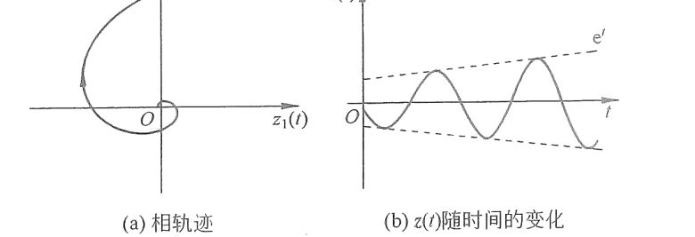
  
图 3.3.11　例 3.3.6 的相轨迹分析

#### 例 3.3.7　分析二阶系统的相轨迹

若

$$
A=\begin{bmatrix}-4&2\\-5&-2\end{bmatrix},
$$

解：求解矩阵 $A$ 的特征值，可得

$$
\lambda_1=-3+3\mathrm{j},\qquad \lambda_2=-3-3\mathrm{j}. \tag{3.3.25}
$$

与例 3.3.6 类似，可以判断出它的平衡点是一个稳定焦点（Stable Spiral）。相轨迹将沿螺旋线指向原点，其所对应的时间函数将振荡衰减，直至为 0。它的相轨迹和时间函数如图 3.3.12 所示。

  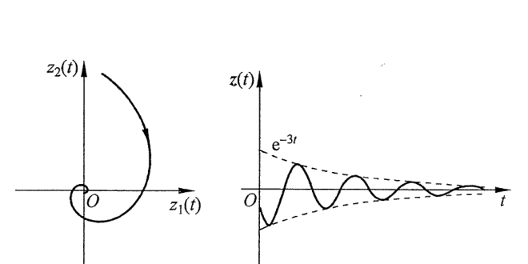
  
图 3.3.12　例 3.3.7 的相轨迹分析

上述例子说明，状态矩阵 $A$ 的特征值将决定平衡点的类型及系统的表现。表 3.3.1 总结了特征值与平衡点类型的关系。通过上述分析和表 3.3.1 可知，状态矩阵 $A$ 的特征值实部部分决定了平衡点的稳定性，而特征值的虚部部分决定了系统是否会有振动。

**表 3.3.1　状态矩阵 $A$ 的特征值与平衡点类型**

  
  <table class="equilibrium-type-table" style="display: inline-table; margin: 0; border-collapse: collapse; text-align: center; white-space: nowrap; border: 1px solid #00a6df;">
    <thead>
      <tr><th style="border: 1px solid var(--background-modifier-border); padding: 0.4em 0.8em;">特征值形式</th><th style="border: 1px solid var(--background-modifier-border); padding: 0.4em 0.8em;">特征值 $\lambda_1$、$\lambda_2$ 分类与说明</th><th style="border: 1px solid var(--background-modifier-border); padding: 0.4em 0.8em;">平衡点类型</th></tr>
    </thead>
    <tbody>
      <tr><td rowspan="3" style="border: 1px solid var(--background-modifier-border); padding: 0.4em 0.8em;">特征值为实数（$\omega=0$）</td><td style="border: 1px solid var(--background-modifier-border); padding: 0.4em 0.8em;">$\lambda_1$ 和 $\lambda_2$ 都为负数</td><td style="border: 1px solid var(--background-modifier-border); padding: 0.4em 0.8em;">稳定节点</td></tr>
      <tr><td style="border: 1px solid var(--background-modifier-border); padding: 0.4em 0.8em;">$\lambda_1$ 和 $\lambda_2$ 一正一负</td><td style="border: 1px solid var(--background-modifier-border); padding: 0.4em 0.8em;">鞍点</td></tr>
      <tr><td style="border: 1px solid var(--background-modifier-border); padding: 0.4em 0.8em;">$\lambda_1$ 和 $\lambda_2$ 都为正数</td><td style="border: 1px solid var(--background-modifier-border); padding: 0.4em 0.8em;">不稳定节点</td></tr>
      <tr><td rowspan="3" style="border: 1px solid var(--background-modifier-border); padding: 0.4em 0.8em;">特征值为复数</td><td style="border: 1px solid var(--background-modifier-border); padding: 0.4em 0.8em;">$\lambda_{1,2}=\pm\mathrm{j}\omega$，特征值为纯虚数</td><td style="border: 1px solid var(--background-modifier-border); padding: 0.4em 0.8em;">中心点</td></tr>
      <tr><td style="border: 1px solid var(--background-modifier-border); padding: 0.4em 0.8em;">$\lambda_{1,2}=\sigma\pm\mathrm{j}\omega$（$\sigma>0$），实部大于 0</td><td style="border: 1px solid var(--background-modifier-border); padding: 0.4em 0.8em;">不稳定焦点</td></tr>
      <tr><td style="border: 1px solid var(--background-modifier-border); padding: 0.4em 0.8em;">$\lambda_{1,2}=\sigma\pm\mathrm{j}\omega$（$\sigma<0$），实部小于 0</td><td style="border: 1px solid var(--background-modifier-border); padding: 0.4em 0.8em;">稳定焦点</td></tr>
    </tbody>
  </table>

正如在 3.2.2 节中所描述的，状态矩阵的特征值就是其对应的传递函数的极点。希望读者可以把这两种描述系统的方法结合起来分析思考。另外，请读者开始思考一个问题：如果设计一个反馈控制器，即系统的输入是状态变量的一个函数，使得状态变量稳定于一个平衡点，那么这个控制器应该满足什么条件？相关分析请见第 10 章。

## 3.4 相平面案例分析——爱情故事

3.3 节详细讨论了使用相轨迹分析状态空间方程平衡点类型的方法。在本节中，将通过一个案例帮助读者加深对这部分内容的理解，希望这个有趣的例子可以引起读者的兴趣与思考。另外，本节将介绍动态系统分析的思路与讨论方法，这种思路和讨论方法可以作为模板使用在论文写作和学术报告中。动态系统的分析可以分为三个步骤：第一步描述系统，即通过语言来描述系统的特性；第二步数学分析，即使用数学工具对系统进行量化解析；第三步结果与讨论，即根据第二步数学分析的结果，进行深层次的思考与讨论。

爱情是永恒的主题，每个人都有自己的故事。康奈尔大学应用数学系教授 Steven Strogatz 在 1988 年首先将爱情模型引入相轨迹分析的教学中。他当时在哈佛大学做博士后，根据课堂的经验引入了这一模型。他选用的是莎翁笔下的著名人物——罗密欧与朱丽叶。之后很多教师都纷纷使用这一概念来引起同学们的兴趣，而每一个教师也会在其中加入自己的思考与分析。

为了使本书读者有更好的代入感，我将选用两个中国人的名字，来自于我的两位朋友：男生叫雨飞，女生叫梦寒，如图 3.4.1 所示。其中，雨飞对梦寒的感情用 $Y(t)$ 来表示，梦寒对雨飞的感情用 $M(t)$ 来表示。$Y(t)$ 与 $M(t)$ 大于零时说明他们是相爱的，小于零时说明他们心有怨恨，等于零时说明他们对对方无感。

  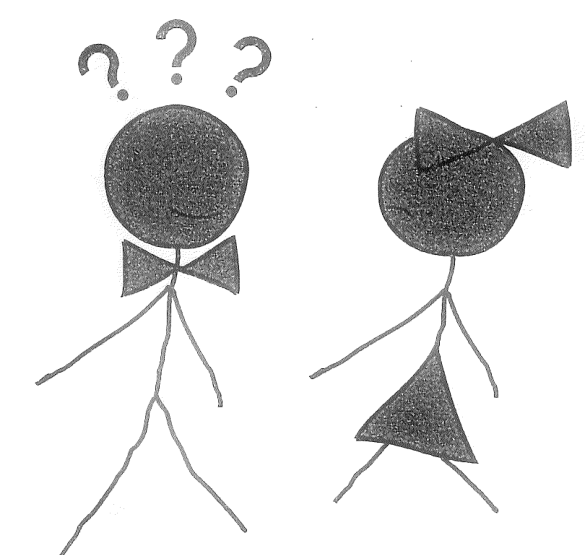
  
图 3.4.1　爱情故事：雨飞和梦寒

分以下几种情况进行讨论。

### 情况（1）

考虑

$$
\frac{\mathrm{d}}{\mathrm{d}t}\begin{bmatrix}Y(t)\\M(t)\end{bmatrix}
=A\begin{bmatrix}Y(t)\\M(t)\end{bmatrix},\qquad
A=\begin{bmatrix}0&a\\-b&0\end{bmatrix},\quad a>0,\ b>0.
$$

**第一步：描述系统。**

从上式可以看出，雨飞是一个耿直男孩。他的表现是：如果你对我好，即 $M(t)>0$，我就会对你产生好感，$\frac{\mathrm{d}Y(t)}{\mathrm{d}t}=aM(t)>0$；如果你讨厌我，即 $M(t)<0$，我也会讨厌你，$\frac{\mathrm{d}Y(t)}{\mathrm{d}t}=aM(t)<0$。他属于“投桃报李”加“以牙还牙”的性格。这种性格过于直来直去，在现实生活中其实不太容易受到欢迎。

而梦寒则是一个多情甚至有些矫情的女孩。当雨飞向她嘘寒问暖时，即 $Y(t)>0$，她爱答不理，你越热情，她就越远离，$\frac{\mathrm{d}M(t)}{\mathrm{d}t}=-bY(t)<0$。而当雨飞开始疏远她时，即 $Y(t)<0$，她又发现了雨飞身上的优点，不可控制地开始爱上他，$\frac{\mathrm{d}M(t)}{\mathrm{d}t}=-bY(t)>0$，即“欲迎还拒”加“若即若离”的性格。当这两种性格遇到一起，就会发生一些奇妙的事情。

**第二步：数学分析。**

首先求系统的平衡点，令 $\frac{\mathrm{d}}{\mathrm{d}t}[Y(t),M(t)]^{\mathrm T}=0$，得到平衡点 $Y_f=M_f=0$。求矩阵 $A$ 的特征值，可得

$$
\lambda_{1,2}=\pm\sqrt{ab}\,\mathrm{j},
$$

根据表 3.3.1，判断出平衡点是一个中心点。它的相轨迹是图 3.4.2 所示的椭圆，参考例 3.3.5。根据初始状态的不同，这个椭圆的大小会有所不同。

  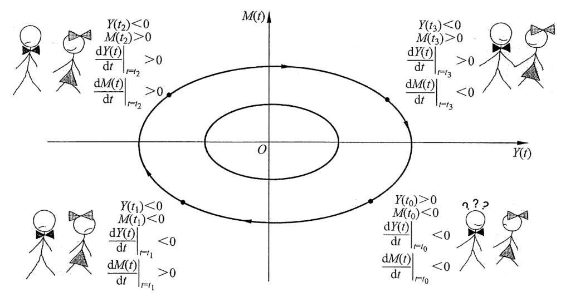
  
图 3.4.2　情况（1）的相轨迹

**第三步：结果与讨论。**

分析图 3.4.2 中的相轨迹，会发现他们之间是一个无限循环、爱恨交织的关系。例如，以第四象限的 $[Y(t_0),M(t_0)]^{\mathrm T}$ 点作为初始条件开始分析。在 $t_0$ 时刻，$Y(t_0)>0$ 代表雨飞深爱着梦寒，而 $M(t_0)<0$ 代表梦寒讨厌雨飞。此时 $\left.\frac{\mathrm{d}Y(t)}{\mathrm{d}t}\right|_{t=t_0}=aM(t_0)<0$，说明因为梦寒讨厌雨飞，所以雨飞对她的热情也在减少当中。

直到过了某个临界点之后，相轨迹来到了第三象限，雨飞开始讨厌梦寒了，$Y(t_1)<0$。而这时 $\left.\frac{\mathrm{d}M(t)}{\mathrm{d}t}\right|_{t=t_1}>0$，说明梦寒对雨飞的态度发生了转变。虽然还是讨厌，但因为雨飞开始不搭理她，她反而想起了雨飞的好，$M(t)$ 开始增加，向正方向移动。

二人的关系继续发展到下一个临界点，进入第二象限。此时的雨飞已经非常讨厌梦寒，而梦寒却开始喜欢上雨飞，即 $M(t_2)>0$。随着梦寒态度变得亲近，雨飞也逐渐发现她的好，$\left.\frac{\mathrm{d}Y(t)}{\mathrm{d}t}\right|_{t=t_2}>0$。沿着这个椭圆继续走，相轨迹进入第一象限，雨飞又开始喜欢梦寒，$Y(t_3)>0$，但梦寒却因为受不了他的热情，逐渐变得冷淡，$\left.\frac{\mathrm{d}M(t)}{\mathrm{d}t}\right|_{t=t_3}<0$。

就这样，他们有四分之一时间是相爱的（第一象限），有四分之一时间是互相看不顺眼的（第三象限），而剩下的二分之一时间是一半火焰、一半海洋（第二、四象限）。这是个不错的关系，也是情侣之间的常态。因为即使在这互不顺眼的四分之一时间内，也充满了对未来的期望和憧憬。

> 那是一场不见不散 
> 终点等时间来宣判 
> 离别不过是换一种方式的陪伴 
> 这一刻让我凝望你的眼 
> ——张磊《一念天堂》

### 情况（2）

考虑

$$
\frac{\mathrm{d}}{\mathrm{d}t}\begin{bmatrix}Y(t)\\M(t)\end{bmatrix}
=A\begin{bmatrix}Y(t)\\M(t)\end{bmatrix},\qquad
A=\begin{bmatrix}-a&b\\b&-a\end{bmatrix},\quad a>0,\ b>0.
$$

**第一步：描述这种情况下的爱情系统。**

以雨飞为例，

$$
\frac{\mathrm{d}Y(t)}{\mathrm{d}t}=-aY(t)+bM(t).
$$

雨飞的感情变化 $\frac{\mathrm{d}Y(t)}{\mathrm{d}t}$ 和梦寒对他的感情 $M(t)$ 是正相关的。如果雨飞感受到的是梦寒的爱，即 $M(t)>0$，那么就会促进雨飞对梦寒感情的增长，$bM(t)>0$；而如果他感受到的是梦寒的恨，即 $M(t)<0$，那么他对梦寒的感情也会受挫，$bM(t)<0$。

同时，雨飞的感情变化 $\frac{\mathrm{d}Y(t)}{\mathrm{d}t}$ 还与他自身对梦寒的感情反相关，因为其中包含了 $-aY(t)$ 这一项。这说明了他很小心，不管是爱或恨都会有所保留、有所克制。因为矩阵 $A$ 是一个对称矩阵，所以梦寒的性格和雨飞是一样的。

**第二步：对这个系统进行数学分析。**

令 $\frac{\mathrm{d}}{\mathrm{d}t}[Y(t),M(t)]^{\mathrm T}=0$，可以得到平衡点 $Y_f=M_f=0$。求矩阵 $A$ 的特征值，可得

$$
\lambda_1=-a+b,\qquad \lambda_2=-a-b, \tag{3.4.1}
$$

对应特征向量为

$$
v_1=[1,1]^{\mathrm T},\qquad v_2=[1,-1]^{\mathrm T}. \tag{3.4.2}
$$

这时需要分情况进行讨论。

#### 情况（2.1）：$a>b$

在这种情况下，他们两个人对于自我的意识要超过对于对方的感情。换言之，他们都很理智，都更倾向于克制自己的情感。根据式（3.4.1），当 $a>b$ 时，$\lambda_1<0$ 且 $\lambda_2<0$，所以平衡点是一个稳定节点。它的相轨迹如图 3.4.3（a）所示，无论是从任何的初始状态开始，随着时间的增加，$Y(t)$ 和 $M(t)$ 都会趋于 0，并最终稳定在 0 点处。

在这种情况下，不管他们曾经爱得有多深，或是恨得有多深，随着时间的增加，雨飞与梦寒终究会成为路人，相忘于江湖，$Y(t)=M(t)=0$。

> 十年之后 
> 我们是朋友，还可以问候，只是那种温柔 
> 再也找不到拥抱的理由 
> 情人最后难免沦为朋友 
> ——陈奕迅《十年》

#### 情况（2.2）：$a<b$

在这种情况下，他们两个人对于对方的感情都超过了对于自我的意识，他们都很感性。根据式（3.4.1），当 $a<b$ 时，$\lambda_1>0$ 且 $\lambda_2<0$，平衡点是个鞍点。它的相轨迹如图 3.4.3（b）所示。可以发现，这将导致两种极端的情况：他们会进入第一象限，彼此的感情不断加深，即 $Y(t)>0$、$M(t)>0$；或是进入第三象限，彼此的怨恨不断加深，即 $Y(t)<0$、$M(t)<0$。而最终的结果与初始状态相关，即他们给对方的第一印象。

  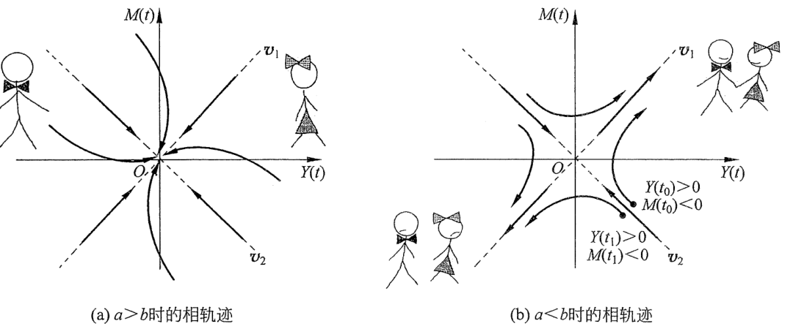
  
图 3.4.3　情况（2）的相轨迹

如果他们初次见面时对对方的感受在图 3.4.3（b）所示第四象限中的 $[Y(t_0),M(t_0)]^{\mathrm T}$ 点，在此时刻，雨飞深爱着梦寒，即 $Y(t_0)>0$，但是梦寒却不喜欢雨飞，即 $M(t_0)<0$。在以后的交往中，梦寒对雨飞的感情逐渐升温，可以看到 $M(t)$ 在相轨迹中向上移动、增加。而雨飞虽然动摇过，$Y(t)$ 在不断减小，但是却仍然一直爱着梦寒，$Y(t)>0$。终于，他们突破了临界点，进入第一象限，两个人开始过上了幸福的生活。

相反，如果他们初次见面时的感受在图 3.4.3（b）所示第四象限中的 $[Y(t_1),M(t_1)]^{\mathrm T}$ 点，这个时候，雨飞爱着梦寒，即 $Y(t_1)>0$，但是梦寒非常讨厌雨飞，即 $M(t_1)<0$。在后面的发展中，虽然梦寒的感情在升温，但是雨飞却先坚持不住了，终于达到临界点并且崩溃，相轨迹进入第三象限，他们最终由爱生恨，变成了仇人。所以，一定要珍惜第一次亮相的机会，不要等到和心上人见面以后才想起来要充实自己或是做身材管理。初始条件将决定最后的结果，要时刻做好准备，给对方留下惊艳的初次印象。

> 假如我年少有为不自卑 
> 懂得什么是珍贵 
> 那些美梦 
> 没给你，我一生有愧 
> ——李荣浩《年少有为》

**第三步：结果与讨论。**

上面的结果说明，当一个人过于理性、过于在乎自我的时候，即 $a>b$，往往就会忽略别人的感受，最终会和心上人变为路人，成为一个孤独的人。而如果对对方投入的情感大于对自我的意识时，即 $a<b$，则会有两种结果：要么共浴爱河，要么因爱生恨。通过这个分析可以得出两个结论：①有很多人愿意一辈子做朋友，却不愿意去打破这个微妙的平衡；②如果不认真的话，那肯定赢不了，但是如果认真的话，那就有可能会输了。

最后要说明的是，希望通过这个例子引起读者的兴趣并加深对相轨迹的理解。但在我看来，请读者朋友们千万不要试图用数学的方式来解决爱情问题。因为生活当中有太多的不确定性，我们无法准确地建立爱情的数学模型。即使有一天，新的技术手段可以准确地预测这些不确定性，我也不愿意这样去做。因为我认为，正是这些不确定性，才让这个世界如此浪漫、如此美丽。

少一些套路，多一点真诚，才是面对爱情和生活最正确的态度。值得一提的是，本例中我的两位朋友最后幸福地生活在了一起。

> 谁画出这天地 
> 又画下我和你 
> 让我们的世界绚丽多彩 
> ——许巍《旅行》

## 3.5 本章要点总结

- **状态空间表达形式：**
  - 用一系列一阶微分方程表达系统的输入、输出及状态变量，其一般形式为

    $$
    \begin{cases}
    \dfrac{\mathrm{d}z(t)}{\mathrm{d}t}=Az(t)+Bu(t),\\[6pt]
    y(t)=Cz(t)+Du(t).
    \end{cases}
    $$

    其中，符号定义与维度见表 3.1.1。

  - 状态矩阵的特征值与其对应的单输入单输出传递函数的极点相同。极点决定系统的表现，因此状态矩阵的特征值是研究重点。

- **相平面与相轨迹分析：**
  - 利用矩阵特征值与特征向量可以将矩阵对角化，从而将系统解耦。
  - 利用图形可以直观分析复杂非线性一阶系统的平衡点。
  - 二阶系统平衡点的性质由状态矩阵的特征值决定，具体见表 3.3.1。

- **动态系统的分析方法：**
  - 第一步，描述系统：通过语言描述系统的特性。
  - 第二步，数学分析：使用数学工具对系统进行解析。
  - 第三步，结果与讨论：根据分析结果进行更深层次的思考与讨论。
