# 第9章 频率响应与分析

本章将讨论频率响应，它通过线性时不变系统对正弦输入的稳态响应来分析系统性能。其结论被广泛地应用在控制理论和信号处理中。本章将详细推导系统频率响应的特性，分析典型系统的频率响应并讨论其应用。本章的学习目标为：

- 掌握线性时不变系统的频率响应推导过程和结论。
- 掌握一阶系统与二阶系统的频率响应特性。
- 理解伯德图的含义。
- 掌握典型系统的伯德图。
- 理解使用伯德图与频率响应特性设计滤波器与控制器的基本原理。

## 9.1 引子——百万调音师

在阅读本节的时候，读者可以打开自己电脑上或手机上的音乐播放器，选一首喜欢的曲子作为背景音乐。同时你可以在播放器的设置中打开“均衡器”（Equalizer）这一选项，如图 9.1.1 所示。通过它可以调节音乐中不同声部的振幅。一般会有几个默认的选项，如古典、摇滚、流行、民谣等，当然也可以手动调节以满足不同播音设备的要求。图 9.1.1 中横坐标部分所显示的 32、64、125、……代表频率，单位是 Hz；纵坐标代表强度（振幅）。通过调节均衡器，可以达到“低音沉、中音准、高音甜”的通透音响效果。

  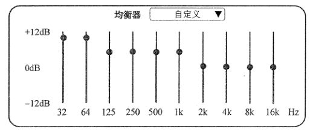
  
图 9.1.1　音频均衡器举例

有兴趣的读者如果去了解一下现代电影配乐团队中的人员配置，就会发现电影配乐是工业化的产物。调音师和录音师都是由“工程师”来承担的。一首作品可以成功，除了台前的作曲家、演奏家、歌唱家之外，背后也有大量的技术人员通过科学技术来保障音乐最终呈现出的品质。

音乐的本质是传播媒介的振动，不同频率叠加在一起便产生了美妙的乐章。例如，鼓声会集中在低频部分（32～125 Hz），人声在 500～2000 Hz。一些乐器、高音和清晰的对白则出现在更高的频率上。本章将从控制理论的角度入手，探讨均衡器背后的数学原理，并以此为例讲解系统的频率响应。

## 9.2 频率特性推导

如图 9.2.1 所示，当正弦输入 $u(t)$ 通过一个线性时不变系统之后，在稳定的状态下，系统的输出 $x(t)$ 也是正弦函数。而且 $x(t)$ 的频率与 $u(t)$ 相同，但是振幅和相位发生了改变。下面将详细推导这一性质，并求解振幅与相位的变化规律。

  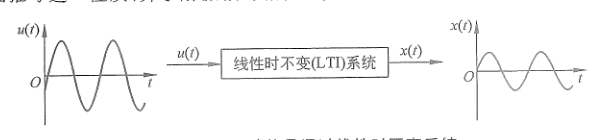
  
图 9.2.1　正弦信号通过线性时不变系统

首先从正弦输入的一般形式入手，它可以表达为

$$
u(t)=A\sin(\omega_i t)+B\cos(\omega_i t). \tag{9.2.1}
$$

其中，$\omega_i$ 是输入频率（下标 $i$ 代表 Input），$A$ 和 $B$ 是两个常数。如果将 $A$ 和 $B$ 作为三角形的两个直角边，可以得到图 9.2.2 中的几何关系，定义输入相位为

$$
\varphi_i=\arctan\frac{B}{A}. \tag{9.2.2a}
$$

输入振幅为

$$
M_i=\sqrt{A^2+B^2}. \tag{9.2.2b}
$$

  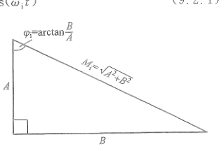
  
图 9.2.2　正弦函数输入的几何表达

调整式（9.2.1），可得

$$
\begin{aligned}
u(t)
&=\sqrt{A^2+B^2}\left(
\frac{A}{\sqrt{A^2+B^2}}\sin(\omega_i t)
+\frac{B}{\sqrt{A^2+B^2}}\cos(\omega_i t)
\right)\\
&=\sqrt{A^2+B^2}\left(\cos\varphi_i\sin(\omega_i t)+\sin\varphi_i\cos(\omega_i t)\right)\\
&=M_i\sin(\omega_i t+\varphi_i).
\end{aligned} \tag{9.2.3}
$$

式（9.2.3）中，正弦输入的振幅为 $M_i$，频率为 $\omega_i$，相位为 $\varphi_i$。考虑将其施加到一个线性时不变系统 $G(s)$ 中，如图 9.2.3 所示。

  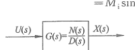
  
图 9.2.3　频率响应框图

根据式（9.2.1），正弦输入的拉普拉斯变换 $U(s)$ 为

$$
\begin{aligned}
U(s)&=\mathcal L[u(t)]=\mathcal L[A\sin(\omega_i t)+B\cos(\omega_i t)]\\
&=\mathcal L[A\sin(\omega_i t)]+\mathcal L[B\cos(\omega_i t)]\\
&=\frac{A\omega_i}{s^2+\omega_i^2}+\frac{Bs}{s^2+\omega_i^2}
=\frac{A\omega_i+Bs}{s^2+\omega_i^2}
=\frac{A\omega_i+Bs}{(s+\mathrm j\omega_i)(s-\mathrm j\omega_i)}.
\end{aligned} \tag{9.2.4}
$$

传递函数 $G(s)$ 可以表达为

$$
G(s)=\frac{N(s)}{D(s)}
=\frac{(s-s_{z1})(s-s_{z2})\cdots(s-s_{zm})}
{(s-s_{p1})(s-s_{p2})\cdots(s-s_{pn})},\qquad n>m. \tag{9.2.5}
$$

其中，$N(s)$ 和 $D(s)$ 代表传递函数 $G(s)$ 的分子和分母多项式。$s_{z1},s_{z2},\ldots,s_{zm}$ 说明传递函数共含有 $m$ 个零点；$s_{p1},s_{p2},\ldots,s_{pn}$ 表示传递函数共含有 $n$ 个极点。此时系统的输出为

$$
X(s)=U(s)G(s)
=\frac{A\omega_i+Bs}{(s+\mathrm j\omega_i)(s-\mathrm j\omega_i)}\frac{N(s)}{D(s)}. \tag{9.2.6a}
$$

对其使用分式分解法可得

$$
\begin{aligned}
X(s)
&=\frac{A\omega_i+Bs}{(s+\mathrm j\omega_i)(s-\mathrm j\omega_i)}
\frac{N(s)}{(s-s_{p1})(s-s_{p2})\cdots(s-s_{pn})}\\
&=\frac{K_1}{s+\mathrm j\omega_i}+\frac{K_2}{s-\mathrm j\omega_i}
+\frac{C_1}{s-s_{p1}}+\frac{C_2}{s-s_{p2}}+\cdots+\frac{C_n}{s-s_{pn}}.
\end{aligned} \tag{9.2.6b}
$$

对式（9.2.6b）进行拉普拉斯逆变换，可得

$$
\begin{aligned}
x(t)&=\mathcal L^{-1}[X(s)]\\
&=K_1e^{-\mathrm j\omega_i t}+K_2e^{\mathrm j\omega_i t}
+C_1e^{s_{p1}t}+C_2e^{s_{p2}t}+\cdots+C_ne^{s_{pn}t}.
\end{aligned} \tag{9.2.7}
$$

根据前面几章的分析，当传递函数 $G(s)$ 的极点 $s_{p1},s_{p2},\ldots,s_{pn}$ 的实部都小于 0 时，$C_1e^{s_{p1}t},C_2e^{s_{p2}t},\ldots,C_ne^{s_{pn}t}$ 会随着时间 $t$ 的增加而趋于 0。也只有在这种情况下，系统的频率响应分析才有意义，否则系统的输出将无穷大。此时，系统的稳态输出为

$$
x_{ss}(t)=K_1e^{-\mathrm j\omega_i t}+K_2e^{\mathrm j\omega_i t}. \tag{9.2.8}
$$

下面求 $K_1$ 和 $K_2$。根据式（9.2.6b），得到

$$
\begin{aligned}
(A\omega_i+Bs)N(s)
&=K_1(s-\mathrm j\omega_i)D(s)+K_2(s+\mathrm j\omega_i)D(s)\\
&\quad+C_1(s+\mathrm j\omega_i)(s-\mathrm j\omega_i)(s-s_{p2})\cdots(s-s_{pn})\\
&\quad+C_2(s+\mathrm j\omega_i)(s-\mathrm j\omega_i)(s-s_{p1})(s-s_{p3})\cdots(s-s_{pn})\\
&\quad+\cdots+C_n(s-\mathrm j\omega_i)(s+\mathrm j\omega_i)(s-s_{p1})\cdots(s-s_{p(n-1)}).
\end{aligned} \tag{9.2.9}
$$

将 $s=-\mathrm j\omega_i$ 代入式（9.2.9），得到

$$
\begin{aligned}
(A\omega_i+B(-\mathrm j\omega_i))N(-\mathrm j\omega_i)
&=K_1(-\mathrm j\omega_i-\mathrm j\omega_i)D(-\mathrm j\omega_i)\\
\Rightarrow\quad
K_1&=\frac{A\omega_i+B(-\mathrm j\omega_i)}{-2\mathrm j\omega_i}
\frac{N(-\mathrm j\omega_i)}{D(-\mathrm j\omega_i)}
=\frac{B+A\mathrm j}{2}G(-\mathrm j\omega_i).
\end{aligned} \tag{9.2.10}
$$

将 $s=\mathrm j\omega_i$ 代入式（9.2.9），得到

$$
\begin{aligned}
(A\omega_i+B(\mathrm j\omega_i))N(\mathrm j\omega_i)
&=K_2(\mathrm j\omega_i+\mathrm j\omega_i)D(\mathrm j\omega_i)\\
\Rightarrow\quad
K_2&=\frac{A\omega_i+B(\mathrm j\omega_i)}{2\mathrm j\omega_i}
\frac{N(\mathrm j\omega_i)}{D(\mathrm j\omega_i)}
=\frac{B-A\mathrm j}{2}G(\mathrm j\omega_i).
\end{aligned} \tag{9.2.11}
$$

其中，$G(\mathrm j\omega_i)$ 是一个复数，可以写成指数形式，即

$$
G(\mathrm j\omega_i)=\lvert G(\mathrm j\omega_i)\rvert e^{\mathrm j\angle G(\mathrm j\omega_i)}. \tag{9.2.12}
$$

  

    传递函数 $G(s)$ 是输出与输入的拉普拉斯变换的比值。当 $s=\mathrm j\omega_i$ 的时候，拉普拉斯变换变成了傅里叶变换。实信号函数的傅里叶变换属于埃尔米特函数（Hermitian Function），符合共轭对称（有兴趣的读者可以参考附录 B）。
  

根据上述结论，$G(-\mathrm j\omega_i)$ 与 $G(\mathrm j\omega_i)$ 共轭，$G(\mathrm j\omega_i)$ 和 $G(-\mathrm j\omega_i)$ 的示意图如图 9.2.4 所示，它们的模相同，相位相反，得到

$$
G(-\mathrm j\omega_i)
=\lvert G(-\mathrm j\omega_i)\rvert e^{\mathrm j\angle G(-\mathrm j\omega_i)}
=\lvert G(\mathrm j\omega_i)\rvert e^{-\mathrm j\angle G(\mathrm j\omega_i)}. \tag{9.2.13a}
$$

将式（9.2.12）和式（9.2.13a）分别代入式（9.2.10）和式（9.2.11），可得

$$
K_1=\frac{B+A\mathrm j}{2}G(-\mathrm j\omega_i)
=\frac{B+A\mathrm j}{2}\lvert G(\mathrm j\omega_i)\rvert e^{-\mathrm j\angle G(\mathrm j\omega_i)}, \tag{9.2.13b}
$$

$$
K_2=\frac{B-A\mathrm j}{2}G(\mathrm j\omega_i)
=\frac{B-A\mathrm j}{2}\lvert G(\mathrm j\omega_i)\rvert e^{\mathrm j\angle G(\mathrm j\omega_i)}. \tag{9.2.13c}
$$

  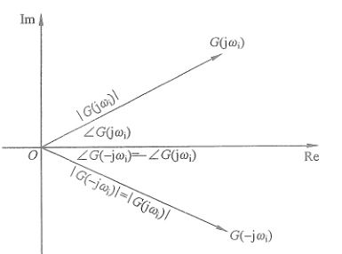
  
图 9.2.4　$G(\mathrm j\omega_i)$ 和 $G(-\mathrm j\omega_i)$ 的示意图

将式（9.2.13b）和式（9.2.13c）代入式（9.2.8），得到

$$
\begin{aligned}
x_{ss}(t)
&=K_1e^{-\mathrm j\omega_i t}+K_2e^{\mathrm j\omega_i t}\\
&=\frac{B+A\mathrm j}{2}\lvert G(\mathrm j\omega_i)\rvert
e^{-\mathrm j\angle G(\mathrm j\omega_i)}e^{-\mathrm j\omega_i t}
+\frac{B-A\mathrm j}{2}\lvert G(\mathrm j\omega_i)\rvert
e^{\mathrm j\angle G(\mathrm j\omega_i)}e^{\mathrm j\omega_i t}\\
&=\frac{1}{2}\lvert G(\mathrm j\omega_i)\rvert
\left[(B+A\mathrm j)e^{\mathrm j(-\angle G(\mathrm j\omega_i)-\omega_i t)}
+(B-A\mathrm j)e^{\mathrm j(\angle G(\mathrm j\omega_i)+\omega_i t)}\right].
\end{aligned} \tag{9.2.14}
$$

根据欧拉公式 $\cos\varphi+\mathrm j\sin\varphi=e^{\mathrm j\varphi}$，可得

$$
\begin{aligned}
e^{\mathrm j(-\angle G(\mathrm j\omega_i)-\omega_i t)}
&=\cos(-\angle G(\mathrm j\omega_i)-\omega_i t)
+\mathrm j\sin(-\angle G(\mathrm j\omega_i)-\omega_i t)\\
&=\cos(\angle G(\mathrm j\omega_i)+\omega_i t)
-\mathrm j\sin(\angle G(\mathrm j\omega_i)+\omega_i t),
\end{aligned} \tag{9.2.15a}
$$

$$
e^{\mathrm j(\angle G(\mathrm j\omega_i)+\omega_i t)}
=\cos(\angle G(\mathrm j\omega_i)+\omega_i t)
+\mathrm j\sin(\angle G(\mathrm j\omega_i)+\omega_i t). \tag{9.2.15b}
$$

将式（9.2.15a）和式（9.2.15b）代入式（9.2.14），整理后可得

$$
\begin{aligned}
x_{ss}(t)
&=\frac{1}{2}\lvert G(\mathrm j\omega_i)\rvert
\left[2B\cos(\angle G(\mathrm j\omega_i)+\omega_i t)
+2A\sin(\angle G(\mathrm j\omega_i)+\omega_i t)\right]\\
&=\lvert G(\mathrm j\omega_i)\rvert\sqrt{A^2+B^2}
\left[
\frac{B}{\sqrt{A^2+B^2}}\cos(\angle G(\mathrm j\omega_i)+\omega_i t)
+\frac{A}{\sqrt{A^2+B^2}}\sin(\angle G(\mathrm j\omega_i)+\omega_i t)
\right].
\end{aligned} \tag{9.2.16}
$$

将式（9.2.3）代入式（9.2.16），可得

$$
x_{ss}(t)=\lvert G(\mathrm j\omega_i)\rvert M_i
\sin(\angle G(\mathrm j\omega_i)+\omega_i t+\varphi_i). \tag{9.2.17}
$$

定义稳态输出为

$$
x_{ss}(t)=M_o\sin(\omega_i t+\varphi_o),\qquad
\frac{M_o}{M_i}=\lvert G(\mathrm j\omega_i)\rvert,\qquad
\varphi_o=\angle G(\mathrm j\omega_i)+\varphi_i. \tag{9.2.18}
$$

$M_o,\varphi_o$ 代表输出（下标 $o$ 为 Output）的振幅与相位。对比式（9.2.18）和式（9.2.3），会发现在经过了上面一系列复杂的运算后得出了一个简单的结论：

  

    当正弦输入 $u(t)=M_i\sin(\omega_i t+\varphi_i)$ 通过线性时不变系统 $G(s)$ 后，输出的稳态值 $x_{ss}(t)$ 与输入保持同样的频率 $\omega_i$，但振幅变化了 $\lvert G(\mathrm j\omega_i)\rvert$ 倍（振幅响应），相位移动了 $\angle G(\mathrm j\omega_i)$（相位响应）。这是系统频率响应中最重要的结论。
  

以积分器为例，其框图如图 9.2.5（a）所示，传递函数为 $G(s)=\frac{1}{s}$，可得

$$
G(\mathrm j\omega_i)=\frac{1}{\mathrm j\omega_i}
=-\frac{1}{\omega_i}\mathrm j. \tag{9.2.19}
$$

$G(\mathrm j\omega_i)$ 在复平面中的表达如图 9.2.5（b）所示。根据图形可以得到 $\lvert G(\mathrm j\omega_i)\rvert=\frac{1}{\omega_i}$，$\angle G(\mathrm j\omega_i)=-\frac{\pi}{2}$。使用式（9.2.18），当输入 $u(t)=M_i\sin(\omega_i t+\varphi_i)$ 时，系统的稳态输出为

$$
x_{ss}(t)=\frac{1}{\omega_i}M_i
\sin\left(\omega_i t+\varphi_i-\frac{\pi}{2}\right). \tag{9.2.20}
$$

  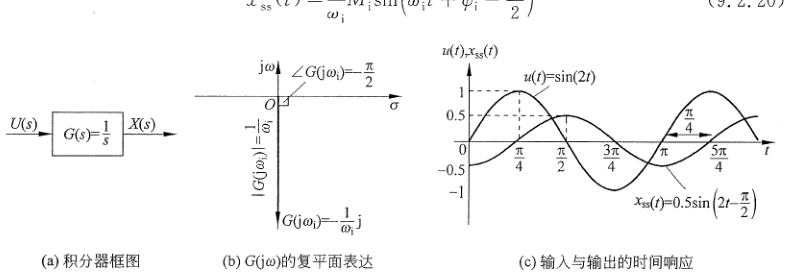
  
（a）积分器框图；（b）$G(\mathrm j\omega_i)$ 的复平面表达；（c）输入与输出的时间响应 图 9.2.5　积分器频率响应

式（9.2.20）表明，输入 $u(t)$ 通过积分器之后振幅缩小到原来的 $\frac{1}{\omega_i}$，且输入的频率越高，输出的振幅就越小，所以从信号处理的角度来看，积分器是低通滤波器（Low Pass Filter）。其相位则有 $-\frac{\pi}{2}$ 的偏移。例如系统输入为 $u(t)=\sin(2t)$，根据式（9.2.20），可以得到稳态输出为

$$
x_{ss}(t)=0.5\sin\left(2t-\frac{\pi}{2}\right). \tag{9.2.21}
$$

输出与输入的图形如图 9.2.5（c）所示。同样，也可以通过对 $u(t)$ 进行积分来验证，得到

$$
\int\sin(2t)\,\mathrm dt
=-0.5\cos(2t)
=0.5\sin\left(2t-\frac{\pi}{2}\right). \tag{9.2.22}
$$

它与式（9.2.21）得出的结果一致。

## 9.3 一阶系统的频率响应

如图 9.3.1（a）所示，一阶系统的传递函数为 $G(s)=\frac{a}{s+a}$，其中，$a>0$ 时系统稳定。

  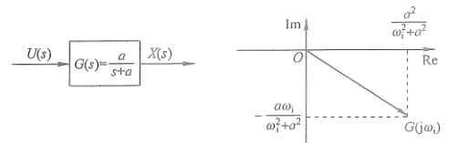
  
（a）一阶系统框图；（b）一阶系统 $G(\mathrm j\omega_i)$ 的复平面表达 图 9.3.1　一阶系统框图和其 $G(\mathrm j\omega_i)$ 的复平面表达

为分析其频率响应，先计算 $G(\mathrm j\omega_i)$，得到

$$
\begin{aligned}
G(\mathrm j\omega_i)
&=\frac{a}{\mathrm j\omega_i+a}
=\frac{a(a-\mathrm j\omega_i)}{(\mathrm j\omega_i+a)(a-\mathrm j\omega_i)}\\
&=\frac{a^2-a\omega_i\mathrm j}{\omega_i^2+a^2}
=\frac{a^2}{\omega_i^2+a^2}
-\frac{a\omega_i}{\omega_i^2+a^2}\mathrm j.
\end{aligned} \tag{9.3.1}
$$

在式（9.3.1）中，$G(\mathrm j\omega_i)$ 的实部部分为 $\frac{a^2}{\omega_i^2+a^2}$，虚部部分为 $-\frac{a\omega_i}{\omega_i^2+a^2}$。其在复平面中的表达如图 9.3.1（b）所示。根据三角几何关系，可得

$$
\begin{aligned}
\lvert G(\mathrm j\omega_i)\rvert
&=\sqrt{\left(\frac{a^2}{\omega_i^2+a^2}\right)^2
+\left(-\frac{a\omega_i}{\omega_i^2+a^2}\right)^2}\\
&=\sqrt{\frac{a^2}{\omega_i^2+a^2}}
=\sqrt{\frac{1}{\left(\frac{\omega_i}{a}\right)^2+1}}.
\end{aligned} \tag{9.3.2a}
$$

$$
\angle G(\mathrm j\omega_i)
=\arctan\frac{-\dfrac{a\omega_i}{\omega_i^2+a^2}}
{\dfrac{a^2}{\omega_i^2+a^2}}
=-\arctan\frac{\omega_i}{a}. \tag{9.3.2b}
$$

分析式（9.3.2a），可得：

1. 当 $\omega_i=0$ 时，$\lvert G(\mathrm j0)\rvert=\sqrt{\frac{1}{(0/a)^2+1}}=1$。
2. 随着 $\omega_i$ 的增加，$\lvert G(\mathrm j\omega_i)\rvert$ 会不断地降低。
3. 当 $\omega_i=a$ 时，$\lvert G(\mathrm ja)\rvert=\sqrt{\frac{1}{(a/a)^2+1}}=\sqrt{\frac{1}{1+1}}=0.707$。
4. 当 $\omega_i\to\infty$ 时，$\frac{\omega_i}{a}\to\infty$，此时

   $$
   \lim_{\omega_i\to\infty}\lvert G(\mathrm j\omega_i)\rvert
   =\lim_{\omega_i\to\infty}\sqrt{\frac{1}{\left(\frac{\omega_i}{a}\right)^2+1}}=0.
   $$

同理，分析式（9.3.2b），可得：

1. 当 $\omega_i=0$ 时，$\angle G(\mathrm j0)=-\arctan\frac{0}{a}=0$。
2. 随着 $\omega_i$ 的增加，$\angle G(\mathrm j\omega_i)$ 会不断地降低。
3. 当 $\omega_i=a$ 时，$\angle G(\mathrm j\omega_i)=-\arctan\frac{\omega_i}{a}=-\frac{\pi}{4}$。
4. 当 $\omega_i\to\infty$、$\frac{\omega_i}{a}\to\infty$ 时，$\angle G(\mathrm j\omega_i)=\lim_{\omega_i\to\infty}\left(-\arctan\frac{\omega_i}{a}\right)=-\frac{\pi}{2}$。

根据上述分析，当 $G(s)=\frac{a}{s+a}$ 时，$\lvert G(\mathrm j\omega_i)\rvert$ 和 $\angle G(\mathrm j\omega_i)$ 随 $\omega_i$ 的变化示意图如图 9.3.2 所示。

  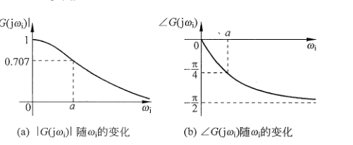
  
（a）$\lvert G(\mathrm j\omega_i)\rvert$ 随 $\omega_i$ 的变化；（b）$\angle G(\mathrm j\omega_i)$ 随 $\omega_i$ 的变化 图 9.3.2　$G(s)=\frac{a}{s+a}$ 的频率响应

从信号处理的角度来分析，观察图 9.3.2（a）可以发现，$G(s)=\frac{a}{s+a}$ 是一个低通滤波器。其中，$a$ 被称为截止频率（Cut-off Frequency）。当输入信号频率 $\omega_i<a$ 时，振幅大部分会被保留下来；而当 $\omega_i>a$ 时，振幅就会被缩小，而且 $\omega_i$ 越大，输出的振幅就越小。正是因为这个性质，在实际应用中，一阶系统常常被用来降噪。一般情况下，噪声信号与信息信号相比多为高频率、小振幅的信号。如图 9.3.3 所示，有效信号是频率 $\omega_i=1$ 的正弦信号 $\sin t$。在使用传感器采集数据的时候，同时还采集到了高频噪声，因此得到的输入信号就有很多“毛刺”。将其输入到一个低通滤波器 $G(s)=\frac{a}{s+a}=\frac{1}{s+1}$ 之后，原始的正弦信号被保留下来，大部分的高频噪声则被过滤掉了，因此得到了一条光滑的曲线。另外，因为 $G(s)$ 截止频率 $a=1$，所以当输入频率为 $\omega_i=1$ 时，输出的振幅是原来的 0.707 倍，$\lvert G(\mathrm j\omega_i)\rvert=0.707$。

  

    在信号处理学科中，$G(s)=\frac{1}{s+1}$ 被称为一阶巴特沃思滤波器（Butterworth Filter）。有兴趣的读者可以参考相关资料。
  

  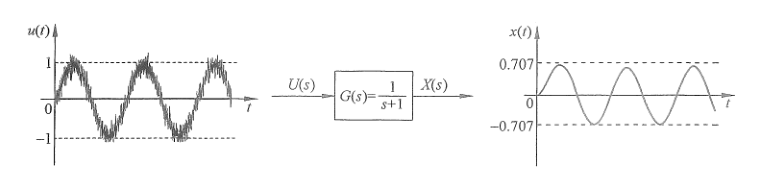
  
图 9.3.3　通过一阶系统处理信号过滤高频噪声

下面请读者回忆前面几个章节中出现过的一阶系统的例子：第 2 章所介绍的电阻电容电路，第 4 章中介绍的密室内体温变化的问题以及第 7 章中的体重变化的例子。它们都是一阶系统，都存在低通滤波器的特性。以体重系统为例，一个人在短时间内的暴饮暴食，或者大量的运动并不会及时地体现在体重的变化上，而是需要一段时间的延迟才会有反应。体温变化也是如此，如果将室内的空调迅速反复地打开、关上，再打开、再关上。这种高速且剧烈的输入变化并不会体现在室内人体体温的变化上。如果去归纳上述例子的共同点，会发现一阶系统都包含一个“容器”，在电路系统中是电容，在体温变化系统中是密室内的大量导热介质（空气），在体重变化系统中则是人体自身所堆积的脂肪。

  

    从直观的角度来理解，这些“容器”提供了缓冲，给系统的响应带来了延迟，从而抵消了输入的高速变化带来的影响。当把这个理论运用到日常生活中时，可以得出以下结论：  
    我们需要不断地积累经验，充实自己，不然就会随波逐流，会对外界环境的变化非常敏感，反应剧烈而不得章法。只有通过不断地积累，曾经沧海，才能在变化莫测的横流当中处乱不惊。
  

本节的最后请读者思考，如果一个传递函数 $G(s)$，它的振幅变化为

$$
\lvert G(\mathrm j\omega_i)\rvert
=\sqrt{\frac{1}{\left(\frac{a}{\omega_i}\right)^2+1}}, \tag{9.3.3}
$$

使用同样的方法分析，可以得出其所对应的是一个高通滤波器（High Pass Filter），读者可以自己倒推出它的传递函数，这里直接给出结果：$G(s)=\frac{s}{s+a}$，其中 $a>0$。

## 9.4 二阶系统的频率响应

本节将分析二阶系统的频率响应。如图 9.4.1 所示，二阶系统的传递函数

$$
G(s)=\frac{\omega_n^2}{s^2+2\zeta\omega_ns+\omega_n^2},
$$

其中，$\omega_n$ 是其固有频率，$\zeta$ 是阻尼比。

  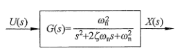
  
图 9.4.1　二阶系统框图

为分析其频率响应，先计算 $G(\mathrm j\omega_i)$，得到

$$
G(\mathrm j\omega_i)
=\frac{\omega_n^2}{(\mathrm j\omega_i)^2+2\zeta\omega_n(\mathrm j\omega_i)+\omega_n^2}
=\frac{1}{-\dfrac{\omega_i^2}{\omega_n^2}+2\zeta\dfrac{\omega_i}{\omega_n}\mathrm j+1}. \tag{9.4.1}
$$

为简化运算，令 $\frac{\omega_i}{\omega_n}=\Omega$，可得

$$
\begin{aligned}
G(\mathrm j\omega_i)
&=\frac{1}{-\Omega^2+2\zeta\Omega\mathrm j+1}\\
&=\frac{-\Omega^2-2\zeta\Omega\mathrm j+1}
{(-\Omega^2+2\zeta\Omega\mathrm j+1)(-\Omega^2-2\zeta\Omega\mathrm j+1)}\\
&=\frac{1-\Omega^2-2\zeta\Omega\mathrm j}{(1-\Omega^2)^2+4\zeta^2\Omega^2}\\
&=\frac{1-\Omega^2}{(1-\Omega^2)^2+4\zeta^2\Omega^2}
-\frac{2\zeta\Omega}{(1-\Omega^2)^2+4\zeta^2\Omega^2}\mathrm j.
\end{aligned} \tag{9.4.2}
$$

它的实部部分为 $\frac{1-\Omega^2}{(1-\Omega^2)^2+4\zeta^2\Omega^2}$，虚部部分为 $-\frac{2\zeta\Omega}{(1-\Omega^2)^2+4\zeta^2\Omega^2}$。可得

$$
\begin{aligned}
\lvert G(\mathrm j\omega_i)\rvert
&=\sqrt{
\left(\frac{1-\Omega^2}{(1-\Omega^2)^2+4\zeta^2\Omega^2}\right)^2
+\left(-\frac{2\zeta\Omega}{(1-\Omega^2)^2+4\zeta^2\Omega^2}\right)^2}\\
&=\sqrt{\frac{1}{(1-\Omega^2)^2+4\zeta^2\Omega^2}}.
\end{aligned} \tag{9.4.3a}
$$

$$
\angle G(\mathrm j\omega_i)
=\arctan\frac{-\dfrac{2\zeta\Omega}{(1-\Omega^2)^2+4\zeta^2\Omega^2}}
{\dfrac{1-\Omega^2}{(1-\Omega^2)^2+4\zeta^2\Omega^2}}
=-\arctan\frac{2\zeta\Omega}{1-\Omega^2}. \tag{9.4.3b}
$$

分析式（9.4.3a）可以发现：

1. 当 $\omega_i=0$ 时，$\Omega=0$，$\lvert G(\mathrm j0)\rvert=\sqrt{\frac{1}{(1-0)^2+4\zeta^2\times0}}=1$。
2. 当 $\omega_i=\omega_n$ 时，$\Omega=1$，$\lvert G(\mathrm j\omega_n)\rvert=\sqrt{\frac{1}{(1-1^2)^2+4\zeta^2}}=\frac{1}{2\zeta}$。在这种情况下，如果 $\zeta<0.5$，$\lvert G(\mathrm j\omega_n)\rvert>1$，输出的振幅就会被加强；如果 $\zeta>0.5$，$\lvert G(\mathrm j\omega_n)\rvert<1$，输出的振幅则会被减弱。当 $\zeta=0$ 时（无阻尼系统），$\lvert G(\mathrm j\omega_n)\rvert\to\infty$。
3. 当 $\omega_i\to\infty$ 时，$\Omega\to\infty$，此时

   $$
   \lim_{\omega_i\to\infty}\lvert G(\mathrm j\omega_i)\rvert
   =\lim_{\Omega\to\infty}\sqrt{\frac{1}{(1-\Omega^2)^2+4\zeta^2\Omega^2}}=0.
   $$

根据上面三点可以判断出，$\zeta$ 在某些条件下，当输入频率 $\omega_i$ 从 0 到 $\infty$ 变化时，输出的振幅 $\lvert G(\mathrm j\omega_i)\rvert$ 会呈现先增后减的趋势。求 $\lvert G(\mathrm j\omega_i)\rvert$ 的极值，令式（9.4.3a）的分母部分对 $\Omega$ 求导等于 0，得到

$$
\begin{aligned}
\frac{\mathrm d\left((1-\Omega^2)^2+4\zeta^2\Omega^2\right)}{\mathrm d\Omega}&=0\\
\Rightarrow\quad2(1-\Omega^2)(-2\Omega)+8\zeta^2\Omega&=0\\
\Rightarrow\quad-1+\Omega^2+2\zeta^2&=0\\
\Rightarrow\quad\Omega&=\pm\sqrt{1-2\zeta^2}.
\end{aligned} \tag{9.4.4}
$$

因为 $\Omega>0$，所以取 $\Omega=\sqrt{1-2\zeta^2}=\frac{\omega_i}{\omega_n}$。同时因为 $\Omega$ 为正实数，所以只有在阻尼比 $\zeta<\sqrt{0.5}$ 时，式（9.4.4）才有意义，$\lvert G(\mathrm j\omega_i)\rvert$ 才会表现出先增后减的性质。定义 $\lvert G(\mathrm j\omega_i)\rvert$ 最大值时的输入频率为 $\omega_R=\omega_n\sqrt{1-2\zeta^2}$，称为共振频率（Resonant Frequency）（此时 $\Omega=\frac{\omega_i}{\omega_n}=\sqrt{1-2\zeta^2}$）。同时可以发现，当阻尼比 $\zeta$ 很小的时候，共振频率约等于系统的固有频率，即 $\omega_R\approx\omega_n$。

不同阻尼比条件下的二阶系统频率响应如图 9.4.2 所示（目前请读者主要关注图形的示意，暂时忽略横轴与纵轴的单位），可见，如果阻尼比 $\zeta$ 较小，当外界输入的频率 $\omega_i$ 在共振频率 $\omega_R$ 附近时，系统输出会表现出强烈的振幅响应，这个现象称为共振。

  

    从系统稳定性的角度考虑，当 $\zeta=0$ 时，二阶系统的传递函数为 $G(s)=\frac{\omega_n^2}{s^2+\omega_n^2}$，它的极点在虚轴上，$s_p=\pm\mathrm j\omega_n$。根据第 6 章的分析，该动态系统符合临界稳定但不满足 BIBO 稳定，此时一个有界的正弦输入，例如 $u(t)=\sin(\omega_n t)$，也会导致其振幅响应 $\lvert G(\mathrm j\omega_n)\rvert\to\infty$。
  

  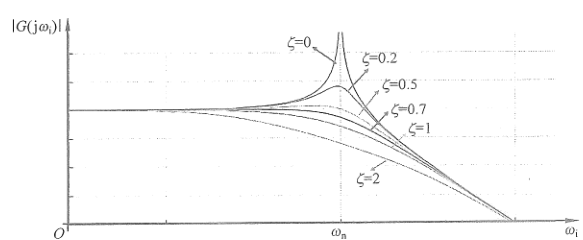
  
图 9.4.2　二阶系统的振幅频率响应

日常生活中会经常见到共振现象，例如，小提琴就是通过共振的箱体放大琴弦本身振动的音量。曾经位于美国华盛顿州的塔科马海峡大桥也是因为结构共振的缺陷，在建成 4 个月之后就被并不剧烈的风吹垮了。再如我们日常乘坐公交车的时候，总会在某些时刻、某些位置感受到强烈的振动，这是因为发动机的振动与车体本身结构固有频率在某一时刻非常相似。

如果把上述分析类比到生活中，可以得出一个结论：

  

    劝人说话，感同身受是很难的一件事情，有的人会被物质刺激，有的人会被颜值刺激，有的人会被精神刺激，有的人则是佛系。要找到对方的“固有频率”，并使用近似的“输入频率”与之交流，才可能产生共鸣。这就是为什么和有的人在一起会感觉非常舒服，和另一些人就会比较尬。这都是内心中的频率在起作用。
  

请注意，我写上面这段话以及 9.3 节中的类比的目的，是希望以通俗易懂的语言加深读者对频率响应知识的理解，而不是试图用数学的方法来解释心理学或者哲学的问题。虽然这样的做法现在非常流行，但在我看来，这样的尝试很容易掉进“披着科学外衣的伪科学”的陷阱中。例如针对 9.3 节一阶系统的频率响应，使用同样的论据，换一种说法，就能得到截然相反的论点：

  

    过去的经验会成为你的包袱，所以总是跟不上时代的变化，需要做的是抛开这些包袱，解放思想，这样就可以在瞬息万变的环境中追风逐电，披荆斩棘。
  

相信读者也已经发现，上面的论证采用了迷惑性的技巧，即使用一个科学的或者数学的原理“有选择性”地从某个角度去解释社会学的、心理学的或者是哲学的论点，让这个论点“看上去”有了科学的支撑。但是这种论证往往是禁不起仔细推敲的。所以希望读者再次看到类似观点的时候要多一些思考，这也是本书一直强调的思辨精神。而且在我看来，其实不管选择哪条路都没有错，但是，我们要对自己的选择负责。

关于二阶系统的相位 $\angle G(\mathrm j\omega_i)$ 随输入频率 $\omega_i$ 的变化，读者可以自行推导，这里不再赘述。

## 9.5 伯德图

本节将介绍一种最为广泛应用的频率响应绘图方法——伯德图（Bode Plot）。它是对数频率特性曲线，是以发明人荷兰裔美国工程师 Hendrik Wade Bode 命名的。因为它的一些优秀的性质，在实际中应用非常广泛。当今，使用电脑软件只需要几行代码就可以快速准确地绘制伯德图，因此在本书中，重点将放在理解伯德图背后的含义及其应用上。

### 9.5.1 伯德图的含义与性质

图 9.5.1 所示的伯德图由上下两部分组成：上半部分是输出的振幅响应 $\lvert G(\mathrm j\omega_i)\rvert$ 随输入频率 $\omega_i$ 的变化，称为幅频图（Magnitude Plot），下半部分是输出的相位响应 $\angle G(\mathrm j\omega_i)$ 随输入频率 $\omega_i$ 的变化，称为相频图（Phase Plot）。

  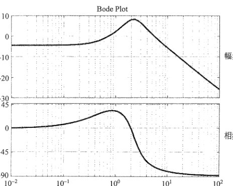
  
图 9.5.1　伯德图示例

理解伯德图的含义，第一步是明确其横纵坐标轴的单位和意义。首先分析幅频图，其纵轴坐标是 $20\log\lvert G(\mathrm j\omega_i)\rvert$，单位是 dB，即分贝（Decibel）。各位读者对这个单位应该不陌生，在生活中分贝被用来描述噪声。例如，50 dB 是日常交流的声音强度，80 dB 是闹市区的声音强度，二者之间差了 20 dB，而它们的功率相差了 100 倍。分贝最开始出现时被用来描述电话线路信号的丢失。Decibel 这个单词中的“deci”代表 $1/10$，“bel”指的是 Alexander Bell——那位拥有电话专利的科学家。

分贝体现的是能量比值的概念，其定义为

$$
L_{\mathrm{dB}}=10\log\frac{P_m}{P_r}. \tag{9.5.1}
$$

其中，$\log$ 是以 10 为底的对数运算，$P_m$ 是测量功率（Measurement Power），$P_r$ 是参考功率（Reference Power）。$L_{\mathrm{dB}}$ 代表测量功率与参考功率的比值取对数再乘以 10，单位是 dB。例如，当 $P_m=P_r$ 时（测量功率等于参考功率），其结果为 $L_{\mathrm{dB}}=10\log1=0\,\mathrm{dB}$。式（9.5.1）中取对数可以将很大的数量级用较小的数位表达，从而达到简化记录的效果。例如，测量功率是参考功率的 $\frac{P_m}{P_r}=2.5\times10^{12}$ 倍，当使用式（9.5.1）时得到 $10\log(2.5\times10^{12})\approx124\,\mathrm{dB}$。

另外，在图 9.5.1 中，幅频图的纵轴是 $20\log\lvert G(\mathrm j\omega_i)\rvert$，而在式（9.5.1）中分贝的定义是 $10\log\frac{P_m}{P_r}$，这是因为在频率响应中分析的是输出振幅 $M_o$ 与输入振幅 $M_i$ 之间的比值 $\frac{M_o}{M_i}$，而在式（9.5.1）中考虑的是功率之间的比值，而功率与振幅的平方成比例。因此使用振幅比时，式（9.5.1）变成

$$
L_{\mathrm{dB}}
=10\log\frac{P_m}{P_r}
=10\log\left(\frac{M_o}{M_i}\right)^2
=20\log\frac{M_o}{M_i}
=20\log\lvert G(\mathrm j\omega_i)\rvert. \tag{9.5.2}
$$

式（9.5.2）解释了伯德图中纵轴的由来，当 $M_o=M_i$ 时，输出与输入的振幅相同，在伯德图中就是 0 dB。当 $M_o=10M_i$ 时，输出振幅是输入振幅的 10 倍，幅频图就显示 20 dB。而当 $M_o=0.1M_i$ 时，幅频图则显示 $-20$ dB。幅频图的横轴是输入频率 $\omega_i$，按照对数来分度（10 倍分度）。

相较于幅频图，相频图就很容易理解，它的横轴与幅频图是一样的，纵轴以度为单位。

伯德图的一个重要性质来自对数的运算法则，即

$$
20\log MN=20\log M+20\log N. \tag{9.5.3}
$$

这个性质可以很好地运用在串联系统（控制或者滤波）中，如图 9.5.2 所示。其输入与输出的关系为

$$
\frac{X(s)}{U(s)}=G_1(s)G_2(s). \tag{9.5.4}
$$

  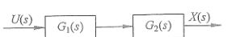
  
图 9.5.2　串联系统

分析其频率响应，需要将 $s=\mathrm j\omega_i$ 代入 $G_1(s)G_2(s)$，根据复数的性质，可得

$$
\lvert G_1(\mathrm j\omega_i)G_2(\mathrm j\omega_i)\rvert
=\lvert G_1(\mathrm j\omega_i)\rvert\lvert G_2(\mathrm j\omega_i)\rvert. \tag{9.5.5}
$$

在经过对数运算之后，式（9.5.5）可以写成

$$
20\log\lvert G_1(\mathrm j\omega_i)G_2(\mathrm j\omega_i)\rvert
=20\log\lvert G_1(\mathrm j\omega_i)\rvert
+20\log\lvert G_2(\mathrm j\omega_i)\rvert. \tag{9.5.6a}
$$

相位为

$$
\angle G_1(\mathrm j\omega_i)G_2(\mathrm j\omega_i)
=\angle G_1(\mathrm j\omega_i)+\angle G_2(\mathrm j\omega_i). \tag{9.5.6b}
$$

式（9.5.6）说明串联系统的伯德图等于其子系统伯德图的叠加。因此，如果我们掌握了一些典型系统的伯德图，就可以分析复杂的串联系统了。同时，它也为滤波器的设计提供了思路。

### 9.5.2 典型系统的频率响应

本节将讨论典型系统的频率响应及其伯德图，在掌握这些典型系统的频率响应后，可以将它们串联组合以分析复杂的系统。

#### 例 9.5.1　积分器，$G(s)=\frac{1}{s}$

参考 9.2 节末尾处对积分器频率响应的计算，其中：$\lvert G(\mathrm j\omega_i)\rvert=\frac{1}{\omega_i}$，$\angle G(\mathrm j\omega_i)=-\frac{\pi}{2}=-90^\circ$。可得

$$
20\log\lvert G(\mathrm j\omega_i)\rvert
=20\log\frac{1}{\omega_i}
=-20\log\omega_i\,\mathrm{dB}. \tag{9.5.7}
$$

式（9.5.7）说明其幅频图的斜率为 $-20\,\mathrm{dB/dec}$，其中 dec 代表十倍（decade）。输入频率 $\omega_i$ 每增加十倍，伯德图中幅频曲线就会下降 20 dB。当输入频率 $\omega_i=1$ 时，$20\log\lvert G(\mathrm j\omega_i)\rvert=0\,\mathrm{dB}$。同时，它的相位 $\angle G(\mathrm j\omega_i)$ 始终为 $-90^\circ$。其伯德图如图 9.5.3 所示，它说明当输入频率 $\omega_i<1$ 时，$20\log\lvert G(\mathrm j\omega_i)\rvert>0$，即 $\lvert G(\mathrm j\omega_i)\rvert>1$，所以 $M_o=\lvert G(\mathrm j\omega_i)\rvert M_i>M_i$，输出的振幅大于输入的振幅，同时输入的频率越低，输出的振幅就越大。反之亦然。所以积分器是一个低通滤波器。从能量的角度考虑，当输入频率较低时，输出振幅的增加需要额外的能量来源。所以积分器无法通过被动元器件实现，需要额外供能。

  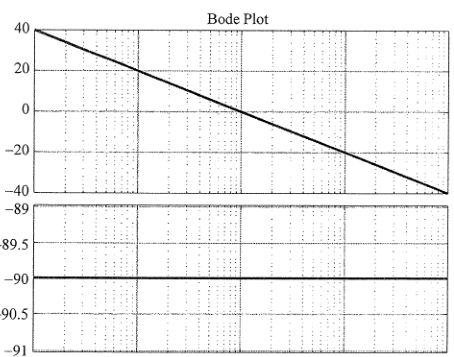
  
图 9.5.3　$G(s)=\frac{1}{s}$ 的伯德图

#### 例 9.5.2　一阶系统，$G(s)=\frac{1}{\frac{1}{a}s+1}$，其中 $a>0$

参考式（9.3.2），得到其频率响应，其中：

$$
\lvert G(\mathrm j\omega_i)\rvert
=\sqrt{\frac{1}{\left(\frac{\omega_i}{a}\right)^2+1}},qquad
\angle G(\mathrm j\omega_i)=-\arctan\frac{\omega_i}{a}.
$$

可得：

1. 当 $\omega_i=0$ 时，$\lvert G(\mathrm j0)\rvert=1\Rightarrow20\log\lvert G(\mathrm j\omega_i)\rvert=0\,\mathrm{dB}$，$\angle G(\mathrm j\omega_i)=0^\circ$。
2. 在截止频率 $\omega_i=a$ 时，$\lvert G(\mathrm j\omega_i)\rvert=\sqrt{\frac{1}{1+1}}=0.707\Rightarrow20\log\lvert G(\mathrm j\omega_i)\rvert=-3\,\mathrm{dB}$，$\angle G(\mathrm j\omega_i)=-45^\circ$。
3. 当 $\omega_i\gg a$ 时，$\lvert G(\mathrm j\omega_i)\rvert\approx\frac{a}{\omega_i}\Rightarrow20\log\lvert G(\mathrm j\omega_i)\rvert=-20\log\omega_i\,\mathrm{dB}$，$\angle G(\mathrm j\omega_i)=-90^\circ$。这说明一阶系统在高频区域的频率响应与积分系统一样，幅频图的斜率都是 $-20\,\mathrm{dB/dec}$，相频图是 $-90^\circ$。

根据上述三点，得出一阶系统伯德图的渐近线，如图 9.5.4 所示。其幅频响应由两条渐近线组成，在低频段是从 0 开始的一条直线，在高频段则是斜率为 $-20\,\mathrm{dB/dec}$ 的直线。同时，幅频响应会经过 $(a,-3\,\mathrm{dB})$ 点。相频图也是两条渐近线，分别是 $0^\circ$ 和 $-90^\circ$。同时，相频图经过 $(a,-45^\circ)$ 点。其伯德图曲线如图 9.5.4 所示（此图假设 $1<a<10$）。

  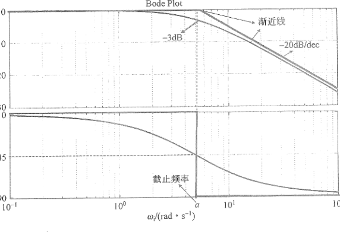
  
图 9.5.4　$G(s)=\frac{a}{s+a}$ 的伯德图

#### 例 9.5.3　比例微分（PD）系统，$G(s)=\frac{1}{a}s+1$，其中 $a>0$

其伯德图如图 9.5.5 所示，读者可以按照例 9.5.2 的方法分析它的渐近线以及在不同频率段上的斜率。图 9.5.5 描述了一个高通滤波器，当输入频率 $\omega_i>1$ 时，输出振幅会被放大，而且输入的频率越高，输出的振幅就越大。

  

    从能量的角度分析，当使用 PD 控制器的时候需要额外的能量来源。同时，PD 控制器对高频噪声会非常敏感（放大高频噪声），这就解释了 8.4.2 节中所描述的 PD 控制器的两个缺陷。
  

  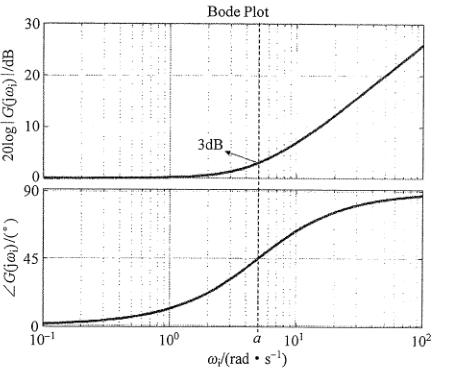
  
图 9.5.5　$G(s)=\frac{1}{a}s+1$ 的伯德图

#### 例 9.5.4　比例控制系统，$G(s)=K$，其中 $K>0$

其幅频图是 $20\log\lvert G(\mathrm j\omega_i)\rvert=20\log K$，当 $K>1$ 时为正，当 $K<1$ 时为负。相频图 $\angle G(\mathrm j\omega_i)=0^\circ$。因此，比例控制只会放大（缩小）振幅，而不会引起延迟。伯德图略。

#### 例 9.5.5　超前补偿器，$G(s)=\frac{s+1}{s+10}$

绘制其伯德图，可以直接将 $s=\mathrm j\omega_i$ 代入 $G(s)$ 后进行分析。另一方面，可以利用伯德图和复数运算的性质，将其分解成几个典型的串联的子系统，各自分析之后叠加在一起。$G(s)$ 可以分解为

$$
\begin{aligned}
G(s)&=\frac{s+1}{s+10}
=\frac{s+1}{10\left(\frac{1}{10}s+1\right)}\\
&=\left(\frac{1}{10}\right)(s+1)
\left(\frac{1}{\frac{1}{10}s+1}\right)
=G_1(s)G_2(s)G_3(s).
\end{aligned} \tag{9.5.8}
$$

其中，$G_1(s)=\frac{1}{10}$ 是比例控制系统，$G_2(s)=s+1$ 是比例微分系统，$G_3(s)=\left(\frac{1}{\frac{1}{10}s+1}\right)$ 是一阶系统。在前面几例中分析过上述三个子系统的伯德图，它们各自对应的渐近线如图 9.5.6 上半部分所示。根据伯德图的性质，将子系统的渐近线叠加在一起就形成了 $G(s)$ 频率响应的伯德图渐近线，如图 9.5.6 下半部分所示。实际伯德图曲线如图 9.5.7 所示。

  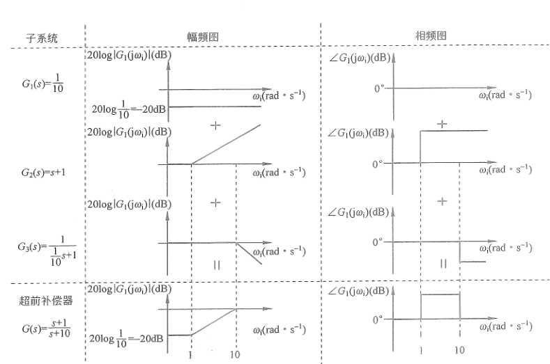
  
图 9.5.6　$G(s)=\frac{s+1}{s+10}$ 的伯德图渐近线叠加示意图

  

    比较图 9.5.7 和图 9.5.5 可知，超前补偿器与比例微分系统不同，它并不会无限地放大高频信号，这是因为极点的加入平滑了高频部分的幅频曲线，同时它不需要额外的能量来源。另外，通过其相频图中可知相位响应为正，因此命名为超前补偿器。
  

  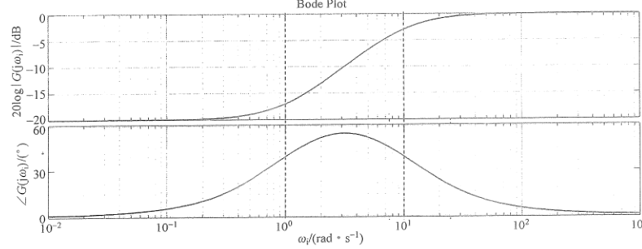
  
图 9.5.7　$G(s)=\frac{s+1}{s+10}$ 的伯德图

#### 例 9.5.6　滞后补偿器，$G(s)=\frac{0.1s+1}{s+1}$

可以使用例 9.5.5 的方法进行分析，故不再赘述。其伯德图如图 9.5.8 所示，其相位滞后，所以命名为滞后补偿器。与此同时，比较图 9.5.8 和图 9.5.3 可以发现滞后补偿器与积分器不同，它平滑了低频部分的幅频曲线，因此不需要额外的能量来源。

  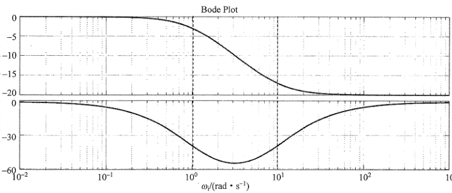
  
图 9.5.8　$G(s)=\frac{0.1s+1}{s+1}$ 的伯德图

  

    掌握典型系统的频率响应有助我们理解控制器的特性。其中，积分器和滞后补偿器的相位响应都滞后于输入，正因为如此，使用这两种控制器会关注“过去”时的积累，因此有助于消除系统的稳态误差。而 PD 控制器和超前补偿器则相反，它们的相位响应都要比输入提前，使用这两种控制器会提前做出预测，提高系统的响应速度。请读者对照第 7 章、第 8 章内容分析思考。
  

伯德图内容请扫描此二维码观看。

### 9.5.3 调音台的设计

通过以上几个小节的介绍，我们掌握了几种典型系统的伯德图及其伯德图在串联系统中的使用方法。读者可以使用同样的方法分析其他的系统，例如二阶系统，或者更高阶的系统，并结合绘图软件进行对比学习，加深理解。同时，也可以在学习信号处理相关课程时对比本章内容。

当我们将例 9.5.5 逆向使用时，便可以设计本章开始时提出的调音台的问题。将图 9.1.1 抽象成一个伯德图之后再将其分解成几个部分，选择合适的截止频率，就可以得到一系列的传递函数，如图 9.5.9 所示，将这些传递函数相乘就可以得到所需要的调音器了。值得注意的是，9.5.2 节中所举例子都是一阶的，其最大的伯德图斜率为 $\pm20\,\mathrm{dB/dec}$，在调音台设计中往往需要更大的斜率，因此需要更高阶的传递函数（滤波器）。读者不妨自己动手做一下这个滤波器，并使用软件进行测试。

  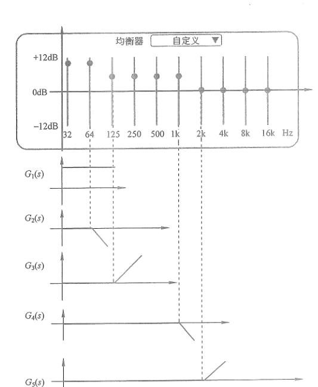
  
图 9.5.9　调音台生成示意图

## 9.6 本章要点总结

- **线性时不变系统的频率响应：**

  - 当一个正弦信号通过线性时不变系统后，在稳定状态下，系统的输出和输入的信号频率相同，但振幅和相位发生了变化。
  - 稳态输出为 $x_{ss}(t)=M_o\sin(\omega_i t+\varphi_o)$，其中，$\frac{M_o}{M_i}=\lvert G(\mathrm j\omega_i)\rvert$，$\varphi_o=\angle G(\mathrm j\omega_i)+\varphi_i$。
  - 研究线性时不变系统的频率响应需要从 $G(\mathrm j\omega_i)$ 入手，寻找它的振幅响应 $\lvert G(\mathrm j\omega_i)\rvert$ 与相位响应 $\angle G(\mathrm j\omega_i)$。

- **一阶系统的频率响应：**

  - 一阶系统从信号处理的角度看是一个低通滤波器，输入频率越高，输出振幅越小，反之亦然。
  - 一阶系统可以用来消除高频信号噪声。
  - 一阶系统含有“容器”（积分）性质，系统输出对输入有延迟响应。

- **二阶系统的频率响应：**

  - 二阶系统的阻尼比会影响系统的频率响应，阻尼比越大，频率响应越迟缓。
  - 当输入频率接近系统固有频率的时候，会产生共振现象，输出的振幅会被增强。

- **伯德图：**

  - 伯德图是一种对数频率特性曲线，具有良好的性质。
  - 一个复杂系统可以拆解为多个子系统进行分析，并将频率响应的结果叠加。
  - 使用伯德图可以设计滤波器。
