# 第2章 动态系统建模——传递函数

动态系统的分析和数学建模是分析系统及设计控制器的基础。本章将讨论经典控制理论的建模方法，即采用拉普拉斯变换和传递函数来描述系统。本章的学习目标为：

- 掌握线性时不变系统中输入与输出之间的卷积关系。
- 掌握建立动态系统微分方程的方法与流程，熟悉典型系统的微分方程。
- 理解在经典控制理论中引入拉普拉斯变换的意义和优点。
- 掌握拉普拉斯变换及其逆变换。
- 理解传递函数的概念和意义，掌握使用传递函数描述动态系统与控制系统的方法。

## 2.1 卷积与微分方程

### 2.1.1 卷积

研究动态系统的输入与输出之间的关系可以帮助我们了解动态系统的本质。对于线性时不变系统而言，其输入与输出之间是卷积（Convolution）关系，即系统的输入会对未来一段时间之内的系统输出产生影响。做一个直观的比喻，向平静的水中扔一颗石子，水面会产生涟漪。如果在第一次涟漪消失之前，向水中的同一位置再扔一颗石子，那么这两次产生的涟漪便会叠加在一起。在这个例子中，扔石子这个动作是系统的输入，产生的涟漪是系统的输出。因此，某个时刻的涟漪是前面几次石子入水后叠加的效果。这个叠加用数学语言表示即为卷积，下面将通过一个例子推导卷积的公式，一步步揭开卷积的面纱，从而了解动态系统的本质。

考虑一个在日常生活中最常见到的线性欠阻尼弹簧，如图 2.1.1（a）所示，弹簧力与压缩程度成正比（线性），而且不管在什么时间去压缩或者拉伸这个弹簧，它的动态特性都不变（时不变），因此这是一个线性时不变系统。定义系统的输出为弹簧位移 $x(t)$，向上为正方向，系统的输入为外力 $u(t)$。在没有外力的作用下，弹簧会静止在其平衡位置。如果对弹簧施加一个短暂的向上外力 $u(t)$，如图 2.1.1（b）所示，弹簧的位移 $x(t)$ 会不断地振动并衰减，最终回到平衡位置。

> [!note]- 什么是线性欠阻尼？
>
> **线性**描述的是系统中力与运动状态之间的关系。在弹簧的弹性限度内，弹簧力满足胡克定律 $f_k=-kx$，与位移 $x$ 成正比；若阻尼力满足 $f_b=-b\dot{x}$，它也与速度成正比。因此，系统满足叠加原理：输入放大若干倍，响应也相应放大若干倍；多个输入共同作用时，总响应等于各输入单独作用所产生响应的叠加。
>
> **阻尼**是阻碍系统运动并消耗其机械能的作用，通常来自摩擦、空气阻力、液体黏滞阻力或专门设置的阻尼器。在常用的黏性阻尼模型中，阻尼力写成 $f_b=-b\dot{x}$：$b$ 是阻尼系数，$\dot{x}$ 是运动速度，负号表示阻尼力的方向始终与运动方向相反。阻尼会使振动幅度随时间减小；阻尼越大，振动衰减通常越快。
>
> **欠阻尼**描述的是阻尼大小不足以阻止系统振荡的状态。以质量—弹簧—阻尼系统 $m\ddot{x}+b\dot{x}+kx=0$ 为例，当 $b^2<4mk$ 时，系统受到扰动后会越过平衡位置并来回振荡；由于阻尼不断消耗能量，振幅会逐渐减小，最终回到平衡位置。
>
> 因此，“线性”说明系统是否满足比例与叠加关系，“阻尼”表示抑制运动和耗散能量的作用，“欠阻尼”则说明阻尼较小，系统受到扰动后仍会产生逐渐衰减的振荡。

下面请读者思考一个问题，当系统的输入 $u(t)$ 连续不间断地作用在弹簧上时（如图 2.1.1（c）所示），弹簧的位移 $x(t)$ 将如何变化？

  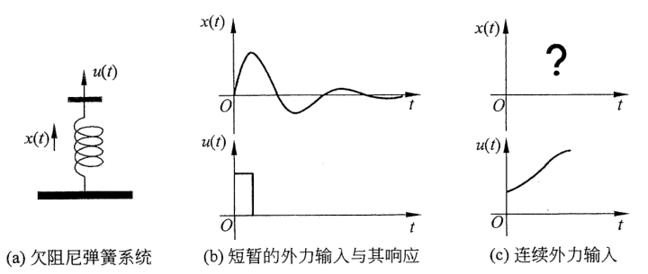
  
图 2.1.1　欠阻尼弹簧系统的输入输出响应

这并不是一个很容易回答的问题，为了便于研究，首先将 $u(t)$ 近似地划分为三个离散型的输入 $u_0(t)$、$u_1(t)$ 和 $u_2(t)$，如图 2.1.2（a）所示的三个小区域块，其中每一块的宽度为 $\Delta T$。

  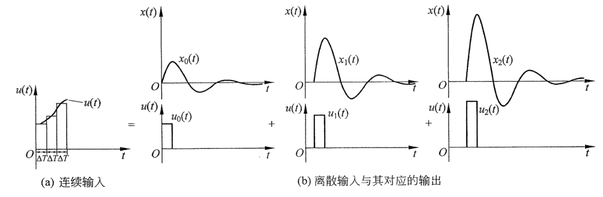
  
图 2.1.2　弹簧系统连续输入离散化及其响应

当这三个离散的输入分别作用在系统上时，其对应的输出是 $x_0(t)$、$x_1(t)$ 和 $x_2(t)$。因为这是一个线性时不变系统，所以三个输出的形状相同，它们之间只存在延迟和幅度上的差别，如图 2.1.2（b）所示。当这三个离散的输入接连作用在系统上时，系统的输出为

$$
x(t)=x_0(t)+x_1(t)+x_2(t) \tag{2.1.1}
$$

图 2.1.3 所示的虚线部分显示了这三个输出叠加后的系统输出结果。

  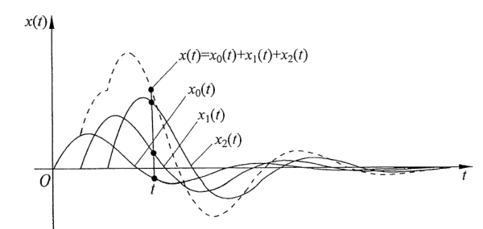
  
图 2.1.3　$x_0(t)$、$x_1(t)$、$x_2(t)$ 和 $x(t)$ 随时间的变化

上述例子直观地描述了离散系统输出叠加的概念。若要使用数学方法对其进行深入剖析，首先要得到 $u_0(t)$、$u_1(t)$ 和 $u_2(t)$ 以及 $x_0(t)$、$x_1(t)$ 和 $x_2(t)$ 的表达式，掌握这些信息后便可以将其从离散形式推广到连续形式，得到 $u(t)$ 与 $x(t)$ 的关系。

为了找到输入 $u_0(t)$、$u_1(t)$ 和 $u_2(t)$ 的数学表达式，需要引入单位冲激函数（Unit Impulse），又称狄拉克函数（Dirac Delta），其定义为

$$
\begin{cases}
\delta(t)=0, & t\ne 0,\\[4pt]
\displaystyle\int_{-\infty}^{\infty}\delta(t)\,\mathrm{d}t=1.
\end{cases} \tag{2.1.2}
$$

式（2.1.2）所描述的单位冲激函数是一个宽度为 0、面积为 1 的函数，这是一个纯数学函数，无法在现实生活中找到，但我们可以通过一个辅助函数来理解它。如图 2.1.4（a）所示的单位脉冲方波 $\delta_{\Delta}(t)$，它的宽度为 $\Delta T$，长度为 $\frac{1}{\Delta T}$，面积为 $\Delta T\times\frac{1}{\Delta T}=1$，可以理解为它包含了 1 个单位面积的能量。想象从右边将这个方框压扁，但面积保持不变。当宽度 $\Delta T$ 不断缩小时，长度 $\frac{1}{\Delta T}$ 会不断变长，直到宽度为 0 时，$\lim_{\Delta T\to0}\delta_{\Delta}(t)=\delta(t)$。

> [!note]- $\delta_{\Delta}(t)$ 和 $\delta(t)$ 分别是什么？
>
> 可以把二者理解为“有限宽度的窄脉冲”和“理想化的瞬时脉冲”。
>
> **1. $\delta_{\Delta}(t)$ 是有限宽度的矩形脉冲**
>
> $$\delta_{\Delta}(t)=\begin{cases}\dfrac{1}{\Delta T}, & 0\le t<\Delta T,\\[4pt]0, & \text{其他时刻}。\end{cases}$$
>
> 它的宽度是 $\Delta T$，高度是 $\frac{1}{\Delta T}$，面积始终等于
>
> $$\frac{1}{\Delta T}\times\Delta T=1$$
>
> 例如，$\Delta T=1$ 时高度为 $1$；$\Delta T=0.1$ 时高度为 $10$；$\Delta T=0.01$ 时高度为 $100$。因此，$\Delta T$ 越小，矩形脉冲越窄、越高，但它包含的总作用量始终为 $1$。下标 $\Delta$ 不是求导符号，只是用来表示这个脉冲的形状依赖于宽度 $\Delta T$。
>
> **2. $\delta(t)$ 是理想的单位冲激**
>
> $\delta(t)$ 称为狄拉克 $\delta$ 函数或单位冲激函数。它表示一个作用时间无限短、作用强度无限集中、总作用量等于 $1$ 的理想瞬时输入。可以把它想象成一次持续时间趋近于零的敲击：敲击时间越来越短，瞬时作用力越来越大，但“作用力与持续时间的乘积”保持不变。
>
> $\delta(t)$ 不是普通函数。如果一个普通函数只在单独一个点上取有限值、在其他地方均为零，那么它的积分必然为零；但单位冲激却要满足
>
> $$\delta(t)=0\quad(t\ne0),\qquad\int_{-\infty}^{\infty}\delta(t)\,\mathrm{d}t=1$$
>
> 因此，不能简单地把 $\delta(0)$ 当成一个普通的无穷大函数值。$\delta(t)$ 是一种广义函数，主要通过它在积分中的作用来定义。
>
> **3. 二者是什么关系？**
>
> $$\lim_{\Delta T\to0}\delta_{\Delta}(t)=\delta(t)$$
>
> 这表示：当 $\Delta T$ 越来越小时，普通矩形脉冲 $\delta_{\Delta}(t)$ 的作用时间越来越短、强度越来越大，而面积始终保持为 $1$，所以它的积分作用越来越接近理想冲激 $\delta(t)$。更准确地说，对于任意在 $t=0$ 附近连续的函数 $f(t)$，都有
>
> $$\lim_{\Delta T\to0}\int_{-\infty}^{\infty}f(t)\delta_{\Delta}(t)\,\mathrm{d}t=f(0)$$
>
> 这称为单位冲激函数的筛选性质。所以，原文中的“直到宽度为 0”应理解为“当宽度趋近于 0”，不能把 $\Delta T=0$ 直接代入 $\frac{1}{\Delta T}$；这里的极限也不是普通函数在每一点上的数值极限，而是积分作用效果的极限。

  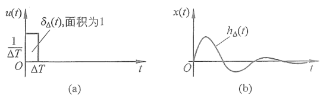
  
图 2.1.4　单位脉冲方波及其响应

当 $\delta_{\Delta}(t)$ 作用在上述弹簧系统上时，系统对其响应如图 2.1.4（b）所示，定义为 $h_{\Delta}(t)$。根据线性时不变系统的性质，如果系统的输入是 $A\delta_{\Delta}(t-T)$（它代表 $A$ 倍单位面积的 $\delta_{\Delta}(t)$ 在延迟了 $T$ 之后作用到系统中），则系统的输出是 $Ah_{\Delta}(t-T)$。

如图 2.1.5 所示，$u_0(t)$、$u_1(t)$ 和 $u_2(t)$ 中分别包含的面积为 $A_0$、$A_1$ 和 $A_2$。以 $A_2$ 为例，它的高是连续函数 $u(t)$ 在 $2\Delta T$ 时刻的值 $u(2\Delta T)$，宽是 $\Delta T$，可得

$$
A_2=u(2\Delta T)\Delta T \tag{2.1.3}
$$

同时，$u_2(t)$ 作用在系统的时间延迟了 $2\Delta T$，因此

$$
u_2(t)=u(2\Delta T)\Delta T\delta_{\Delta}(t-2\Delta T) \tag{2.1.4}
$$

  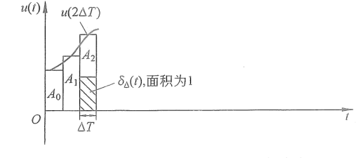
  
图 2.1.5　单位冲激函数和冲激响应

动态系统对于式（2.1.4）的响应为

$$
x_2(t)=u(2\Delta T)\Delta T h_{\Delta}(t-2\Delta T) \tag{2.1.5}
$$

式（2.1.5）说明 $x_2(t)$ 是扩大了 $A_2=u(2\Delta T)\Delta T$ 倍且延迟了 $2\Delta T$ 的响应 $h_{\Delta}(t)$。

同理，可以得到 $u_0(t)$ 和 $u_1(t)$ 及其对应的输出，分别为

$$
\begin{cases}
u_0(t)=u(0)\Delta T\delta_{\Delta}(t),\\
u_1(t)=u(\Delta T)\Delta T\delta_{\Delta}(t-\Delta T),
\end{cases} \tag{2.1.6}
$$

$$
\begin{cases}
x_0(t)=u(0)\Delta T h_{\Delta}(t),\\
x_1(t)=u(\Delta T)\Delta T h_{\Delta}(t-\Delta T).
\end{cases} \tag{2.1.7}
$$

将式（2.1.5）和式（2.1.7）代入式（2.1.1），得到

$$
x(t)=u(0)\Delta T h_{\Delta}(t)+u(\Delta T)\Delta T h_{\Delta}(t-\Delta T)+u(2\Delta T)\Delta T h_{\Delta}(t-2\Delta T),
$$

即

$$
x(t)=\sum_{i=0}^{2}u(i\Delta T)\Delta T h_{\Delta}(t-i\Delta T). \tag{2.1.8}
$$

现在将图 2.1.2（a）中的划分间隔 $\Delta T$ 缩小，将其划成 $(n+1)$ 个小区域块，则式（2.1.8）可以写成

$$
x(t)=\sum_{i=0}^{n}u(i\Delta T)\Delta T h_{\Delta}(t-i\Delta T). \tag{2.1.9}
$$

式（2.1.9）是卷积的离散表达形式。令 $\Delta T\to0$，便可以得到卷积的连续表达形式。根据积分的定义，可得

$$
\begin{aligned}
x(t)&=\lim_{\Delta T\to0}\sum_{i=0}^{n}u(i\Delta T)\Delta T h_{\Delta}(t-i\Delta T)\\
&=\int_0^t u(\tau)h(t-\tau)\,\mathrm{d}\tau=u(t)*h(t).
\end{aligned} \tag{2.1.10}
$$

> **这里的 $u(t)*h(t)$ 不是积分计算结果，而是命名方式。**
>
> 符号 $*$ 表示卷积运算。按照卷积的定义，积分 $\int_0^t u(\tau)h(t-\tau)\,\mathrm{d}\tau$ 被记作 $(u*h)(t)$，书中简写为 $u(t)*h(t)$。因此，式中的最后一个等号是在用卷积符号为这个积分命名，并不是把积分进一步计算成了普通乘积。由于此处没有给出 $u(t)$ 和 $h(t)$ 的具体表达式，所以还不能求出更具体的函数结果。

其中，$h(t)$ 是系统对于冲激函数 $\delta(t)$ 的冲激响应（Impulse Response）。式（2.1.10）可以用框图表示，如图 2.1.6 所示。

  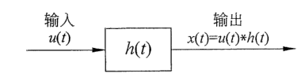
  
图 2.1.6　动态系统输入与输出的卷积关系

通过式（2.1.10）和图 2.1.6 可以得出，冲激响应 $h(t)$ 包含了线性时不变系统的全部特性。

  

    关于这个性质，读者可以尝试做一个有趣的实验。首先寻找一个空旷的地方，例如操场或者礼堂。然后扎破一个气球或者用力拍手，要保证时间很短但能量很大，这样就制造了一个冲激输入。然后用麦克风录制下这个声音，得到这个地方的冲激响应。之后，可以把其他的声音和这个冲激响应做卷积运算，就可以模拟这个地方的混响了。有很多的公司都会在音乐厅最好的位置采集素材，合成到唱片当中，由此创造出一种身临其境的感觉。
  

  

卷积的应用视频请扫描此二维码观看。

### 2.1.2 常见动态系统微分方程举例

使用微分方程可以直接描述动态系统输入与输出之间的卷积关系。建立系统的微分方程，首先要分析系统的物理特性并列出方程组，之后消去中间的变量并将其写成标准形式。本节将讨论几个常见的动态系统并建立其微分方程。

#### 例 2.1.1　体重变化

先来看一个很多人感兴趣的例子——体重控制。人类体重的变化与热量吸收及消耗相关。每日的饮食会带来热量摄入；同时，每天的呼吸、日常工作或者运动则会消耗热量。

根据热量的摄入与消耗，一个人体重变化的微分方程可以粗略表达为

$$
\frac{\mathrm{d}m}{\mathrm{d}t}=\frac{E_i-E_e}{7000}. \tag{2.1.11}
$$

其中，$m$ 表示体重；$E_i$ 表示热量摄入，国际单位是 kJ。而一般情况下，与饮食、运动相关的热量常用单位是 kCal，即一千卡路里。热量的消耗用 $E_e$ 来表示。因此，每日的净热量摄入等于 $E_i-E_e$，如图 2.1.7 所示。而净热量和体重的关系大概是 $7000\text{ kCal}\approx1\text{ kg}$ 脂肪。可以认为，身体燃烧掉 7000 kCal 可以消耗 1 kg 脂肪。同理，摄入 7000 kCal 则会增加 1 kg 脂肪。

  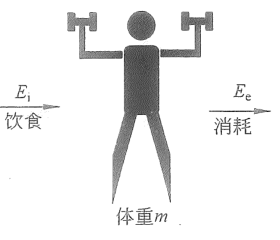
  
图 2.1.7　体重与热量

在式（2.1.11）中，热量摄入 $E_i$ 来自饮食，属于相对独立的一个变量。而消耗 $E_e$ 可以分为两部分，即

$$
E_e=E_a+\alpha P. \tag{2.1.12}
$$

其中，$E_a$ 是每日额外的运动消耗，如健身消耗；而 $\alpha P$ 表示日常消耗，$\alpha$ 是一个对应于不同劳动强度的系数，例如轻体力劳动者的 $\alpha=1.3$，中体力劳动者的 $\alpha=1.5$，重体力劳动者大概的 $\alpha=1.9$。$P$ 是基础代谢率（Basal Metabolic Rate，BMR），有过健身经验的读者对这个名词应该不陌生。它的计算很复杂且因人而异。为简化运算，可以选用 Mifflin-St Jeor 公式来估算它，误差在 5% 左右，其表达式为

$$
P=10m+6.25h-5a+S. \tag{2.1.13}
$$

其中，$h$ 表示身高，单位是 cm；$a$ 表示年龄；$S$ 是一个调整系数，它和性别相关（其中，男性：$S=5$；女性：$S=-161$）。

通过式（2.1.13）可以得出，一个人的体重（$m$）越大，身高（$h$）越高，基础代谢率就会越高，因为大块头需要更多的能量来维持身体运行。而随着年龄（$a$）的增长，基础代谢率会逐渐下降，这也是人在年龄大了之后会更加不容易管控身材和体重的原因。另外，在同样的身高体重状态下，男性的基础代谢率大约要比女性高 166 kCal，所以女性想要保持体型会比男性更加困难。

将式（2.1.12）和式（2.1.13）代入式（2.1.11）中并调整，可得

$$
7000\frac{\mathrm{d}m}{\mathrm{d}t}+10\alpha m=E_i-E_a-\alpha(6.25h-5a+S). \tag{2.1.14}
$$

这是关于体重的一阶微分方程。式（2.1.14）表明身材管理也可以通过数学公式来分析。本书会在第 7 章中继续分析这个模型，并揭秘科学控制体重的方法。

> [!note]- 为什么这是一阶微分方程？
>
> 微分方程的“阶数”由方程中出现的**最高阶导数**决定。式（2.1.14）中，未知函数是随时间变化的体重 $m(t)$，方程里只出现了它的一阶导数 $\frac{\mathrm{d}m}{\mathrm{d}t}$，表示体重随时间的变化速度；$m$ 本身没有经过求导，不会提高方程的阶数。由于方程中没有 $\frac{\mathrm{d}^2m}{\mathrm{d}t^2}$ 或更高阶导数，因此它是关于体重 $m(t)$ 的一阶微分方程。

#### 例 2.1.2　电路系统

图 2.1.8 所示为典型的电路网络系统，包含了电源 $e(t)$、电感 $L$、电容 $C$ 和电阻 $R$。对于电路系统的数学建模，可以使用基尔霍夫电压定律（Kirchhoff's Voltage Law）：沿着闭合回路的所有电动势的代数和等于所有电压降的代数和。

  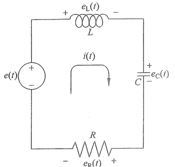
  
图 2.1.8　电阻电感电容电路

具体步骤为沿着电流的参考方向（方向可以任意选定，此例中选择顺时针方向），给每一个元器件上的电压标明正负号，在元器件内，电流从正极向负极流动，如图 2.1.8 所示。根据各个元器件特性，它们的电压分别为

$$
\left.
\begin{aligned}
\text{电感电压：}\quad&e_L(t)=L\frac{\mathrm{d}i(t)}{\mathrm{d}t},\\
\text{电容电压：}\quad&e_C(t)=\frac{1}{C}\int_0^t i(t)\,\mathrm{d}t,\\
\text{电阻电压：}\quad&e_R(t)=i(t)R.
\end{aligned}
\right\} \tag{2.1.15}
$$

> [!note]- 电感、电容和电阻的电压公式分别是什么意思？
>
> 可以先把**电压**理解成推动电流流动的“动力”，把**电流** $i(t)$ 理解成电荷流动的快慢。电阻、电容和电感对电流的反应方式不同，所以它们两端的电压也由不同的量决定。
>
> **1. 电阻：$e_R(t)=i(t)R$**
>
> 电阻会直接阻碍电流，可以类比成一段狭窄的水管：要让水流得越快，就需要越大的压力差。公式表示，在电阻 $R$ 不变时，电流 $i(t)$ 越大，维持该电流所需的电压 $e_R(t)$ 就越大。电阻的反应是即时的，当前电压只由当前电流决定。
>
> **2. 电容：$e_C(t)=\frac{1}{C}\int_0^t i(\tau)\,\mathrm{d}\tau$**
>
> 电容可以暂时储存电荷，可以类比成一个储水容器：电流相当于流入容器的水流量，电流随时间的累积量就是已经存入的电荷。存入的电荷越多，电容两端的电压就越高。$C$ 表示电容储存电荷的能力；$C$ 越大，存入相同电荷后产生的电压越小。该公式假设电容在 $t=0$ 时没有预先储存电荷；若存在初始电压，还需要在右侧加上 $e_C(0)$。
>
> **3. 电感：$e_L(t)=L\frac{\mathrm{d}i(t)}{\mathrm{d}t}$**
>
> 电感会阻碍电流发生变化，可以类比成具有惯性的重物：让重物保持匀速运动不需要继续加速，但要迅速改变它的速度，就需要较大的力。同样，电流保持不变时，$\frac{\mathrm{d}i}{\mathrm{d}t}=0$，理想电感两端的电压为 0；电流变化得越快，所需的电压就越大。$L$ 表示电感阻碍电流变化的能力，$L$ 越大，同样的电流变化速度需要越大的电压。
>
> 简单地说：**电阻关注“现在有多大电流”，电容关注“过去累计流过多少电流”，电感关注“电流现在变化得有多快”。**

以上三项电压与参考电流的方向一致，所以取正号。而电源电压 $e(t)$ 与参考电流方向相反，所以取负号。根据基尔霍夫电压定律，可得

$$
e_L(t)+e_C(t)+e_R(t)-e(t)=0. \tag{2.1.16}
$$

将式（2.1.15）代入式（2.1.16），可得

$$
L\frac{\mathrm{d}i(t)}{\mathrm{d}t}+\frac{1}{C}\int_0^t i(t)\,\mathrm{d}t+i(t)R-e(t)=0. \tag{2.1.17}
$$

等式两边同时对时间 $t$ 求导，可以消除积分项 $\frac{1}{C}\int_0^t i(t)\,\mathrm{d}t$，调整 $e(t)$ 的位置，可得

$$
\frac{\mathrm{d}e(t)}{\mathrm{d}t}=L\frac{\mathrm{d}^2i(t)}{\mathrm{d}t^2}+R\frac{\mathrm{d}i(t)}{\mathrm{d}t}+\frac{1}{C}i(t). \tag{2.1.18}
$$

式（2.1.18）描述了电流 $i(t)$ 与电压 $e(t)$ 之间的关系，它是一个关于电流的二阶微分方程。

#### 例 2.1.3　弹簧质量阻尼系统

弹簧质量阻尼系统在工程中有很广泛的应用，绝大部分与振动相关的系统都可以简化成图 2.1.9（a）的模式，如果把它竖起来就是四分之一个汽车悬挂系统。

  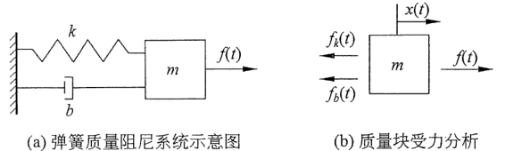
  
图 2.1.9　弹簧质量阻尼系统

对这一系统进行数学建模，首先要对质量块进行受力分析，如图 2.1.9（b）所示，令 $x(t)$ 表示质量块的位移并设向右为正方向，$x(t)=0$ 时代表了弹簧的自由状态，不压缩也不拉伸。它受到外力 $f(t)$、弹簧力 $f_k(t)$ 以及阻尼力 $f_b(t)$ 的共同作用。根据胡克定律，弹簧力为

$$
f_k(t)=-kx(t). \tag{2.1.19}
$$

其中，$k$ 表示弹簧的弹性系数。弹簧力和位移成正比，因为其方向与位移 $x(t)$ 相反，所以取负号。

阻尼力为

$$
f_b(t)=-b\frac{\mathrm{d}x(t)}{\mathrm{d}t}. \tag{2.1.20}
$$

其中，$b$ 表示阻尼系数。式（2.1.20）说明阻尼力与物体的移动速度（位移对时间的一次导数）成正比且方向与移动方向相反。

  

    读者可以通过一个小实验感受阻尼力与速度的关系：接一盆水，然后将手放入水中滑动，你会发现滑动速度越快，感受到的阻力就会越大。反之，缓慢地将手从水中拂过，则不会感受到很大的阻力。
  

根据牛顿第二定律，$m\frac{\mathrm{d}^2x(t)}{\mathrm{d}t^2}=f(t)-f_k(t)-f_b(t)$，将式（2.1.19）和式（2.1.20）代入并整理即可得到位移的二阶微分方程，即

$$
m\frac{\mathrm{d}^2x(t)}{\mathrm{d}t^2}+b\frac{\mathrm{d}x(t)}{\mathrm{d}t}+kx(t)=f(t). \tag{2.1.21}
$$

式（2.1.21）是振动系统的基本形式。这个例子会多次出现在本书后面章节的分析当中。

## 2.2 拉普拉斯变换

本节将介绍拉普拉斯变换（Laplace Transform），它是经典控制理论中重要的数学工具。拉普拉斯变换广泛地应用于工程分析当中。它可以把一个时域上的函数 $f(t)$ 转换成一个复数域上的函数 $F(s)$，从而简化系统分析的难度。

> [!note]- 什么是时域和复数域？
>
> **时域**是直接以时间 $t$ 为自变量来观察信号或系统响应的表示方式。例如，$f(t)$ 可以表示某个物体在不同时刻的位置、速度，或者电路中随时间变化的电压。时域图像的横轴通常是时间，纵轴是该时刻对应的物理量，因此它直接回答“系统在每个时刻的状态是什么”。
>
> **复数域**是以复变量 $s$ 为自变量来描述同一个信号的另一种表示方式。拉普拉斯变换把 $f(t)$ 转换为 $F(s)$，其中 $s=\sigma+\mathrm{j}\omega$：实部 $\sigma$ 与指数增长或衰减有关，虚部 $\omega$ 与振荡频率有关。因此，$F(s)$ 可以帮助我们观察信号中不同衰减速度和振荡频率的成分。
>
> 复数域不是另一个真实的物理空间，而是一种数学表示方法。同一个系统可以在时域中写成微分方程，也可以经过拉普拉斯变换后在复数域中写成代数方程。例如，在零初始条件下，一阶导数 $\frac{\mathrm{d}f(t)}{\mathrm{d}t}$ 会转换为 $sF(s)$。这样，时域中的求导和积分运算就可以转化为复数域中的乘法和除法，从而使系统分析与方程求解更加方便。
>
> 简单地说：**时域关注“系统怎样随时间变化”，复数域关注“哪些增长、衰减和振荡成分共同构成了这种变化”。**

### 2.2.1 拉普拉斯变换的定义

以图 2.2.1（a）所示的电路系统为例，电流的动态微分方程为

$$
e(t)=L\frac{\mathrm{d}i(t)}{\mathrm{d}t}+Ri(t). \tag{2.2.1}
$$

其中，$e(t)$ 表示电压，$i(t)$ 表示电流，$L$ 表示电感，$R$ 表示电阻。

  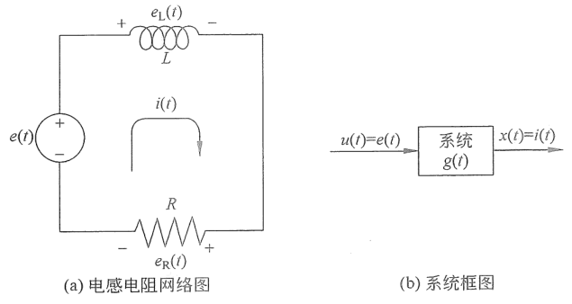
  
图 2.2.1　电感电阻系统

定义此动态系统的输入为电压 $u(t)=e(t)$，输出为电流 $x(t)=i(t)$，则式（2.2.1）可以写成

$$
u(t)=L\frac{\mathrm{d}x(t)}{\mathrm{d}t}+Rx(t). \tag{2.2.2}
$$

式（2.2.2）可以用图 2.2.1（b）所示的框图描述。其中，在系统的输入与输出中间有一个转化过程，设为 $g(t)$。$g(t)$ 就是系统的单位冲激响应 $h(t)$（$g(t)=h(t)$）。系统的输入 $u(t)$、输出 $x(t)$ 与 $g(t)$ 之间是卷积运算的关系，即

$$
x(t)=u(t)*g(t)=\int_0^t u(\tau)g(t-\tau)\,\mathrm{d}\tau. \tag{2.2.3}
$$

若要分析系统的输出 $x(t)$，就需要分析卷积 $u(t)*g(t)$，或者求解微分方程。观察式（2.2.2）和式（2.2.3），直接求解它们的过程会非常复杂，尤其是处理复杂系统的时候。正是因为如此，在经典控制理论当中，一个强大的数学工具被引入进行辅助分析，这个数学工具就是拉普拉斯变换。通过拉普拉斯变换，系统的微分方程将转化为代数方程，卷积运算则会变为乘法运算。现在，让我们暂时抛开上面的例子，先来讨论拉普拉斯变换的定义，等到 2.3 节再重新分析此例。

对一个函数 $f(t)$ 做拉普拉斯变换，可以将其从时域（$t$）转换到复数域（$s$），它的定义为

$$
\mathcal{L}[f(t)]=F(s)=\int_0^{\infty}f(t)e^{-st}\,\mathrm{d}t. \tag{2.2.4}
$$

其中，$s=\sigma+\mathrm{j}\omega$，是一个复数。

  

    式（2.2.4）中积分下限从 0 开始。从控制工程的角度来讲，不需要去研究时间 0 点以前的事情，而是把这部分留给哲学家。考虑一个特例，当 $\sigma=0$ 的时候，拉普拉斯变换变成了 $F(s)=F(\mathrm{j}\omega)=\int_0^{\infty}f(t)e^{-\mathrm{j}\omega t}\,\mathrm{d}t$。这是函数 $f(t)$ 的傅里叶变换。因此，傅里叶变换是拉普拉斯变换的一种特殊情况。关于傅里叶级数和傅里叶变换的推导，读者可以参考附录 B。
  

下面请看几个拉普拉斯变换的例子。

#### 例 2.2.1　$\mathcal{L}[e^{-at}]=\frac{1}{s+a}$

证：

$$
\begin{aligned}
\mathcal{L}[e^{-at}]&=\int_0^{\infty}e^{-at}e^{-st}\,\mathrm{d}t=\int_0^{\infty}e^{-(a+s)t}\,\mathrm{d}t\\
&=-\left.\frac{1}{s+a}e^{-(a+s)t}\right|_0^{\infty}\\
&=-\frac{1}{s+a}\lim_{t\to\infty}\left(e^{-(a+s)t}\right)-\left(-\frac{1}{s+a}e^0\right)\\
&=\frac{1}{s+a}.
\end{aligned} \tag{2.2.5}
$$

#### 例 2.2.2　$\mathcal{L}[af(t)+bg(t)]=aF(s)+bG(s)$，其中，$a$、$b$ 为常数

证：根据拉普拉斯变换的定义，可得

$$
\begin{aligned}
\mathcal{L}[af(t)+bg(t)]
&=\int_0^{\infty}[af(t)+bg(t)]e^{-st}\,\mathrm{d}t\\
&=\int_0^{\infty}\left[af(t)e^{-st}+bg(t)e^{-st}\right]\,\mathrm{d}t\\
&=a\int_0^{\infty}f(t)e^{-st}\,\mathrm{d}t
+b\int_0^{\infty}g(t)e^{-st}\,\mathrm{d}t\\
&=aF(s)+bG(s).
\end{aligned}
$$

推导中利用了积分的线性性质：和的积分等于积分之和，并且常数因子可以移到积分号外。因此，输入函数的线性组合 $af(t)+bg(t)$ 经过拉普拉斯变换后，仍然是相应变换结果的线性组合 $aF(s)+bG(s)$。这就是拉普拉斯变换的线性叠加性质，说明拉普拉斯变换是线性变换。

#### 例 2.2.3　$\mathcal{L}[\sin at]=\frac{a}{s^2+a^2}$

证：根据欧拉公式

$$
e^{\mathrm{j}at}=\cos at+\mathrm{j}\sin at \tag{2.2.6a}
$$

$$
e^{-\mathrm{j}at}=\cos at-\mathrm{j}\sin at \tag{2.2.6b}
$$

式（2.2.6a）减式（2.2.6b），得到

$$
\begin{aligned}
e^{\mathrm{j}at}-e^{-\mathrm{j}at}&=2\mathrm{j}\sin at\\
\Rightarrow\quad\sin at&=\frac{e^{\mathrm{j}at}-e^{-\mathrm{j}at}}{2\mathrm{j}}.
\end{aligned} \tag{2.2.7}
$$

根据例 2.2.2 的线性叠加性质，与例 2.2.1 所求指数函数的拉普拉斯变换，可得

$$
\begin{aligned}
\mathcal{L}[\sin at]
&=\mathcal{L}\left[\frac{e^{\mathrm{j}at}-e^{-\mathrm{j}at}}{2\mathrm{j}}\right]\\
&=\frac{1}{2\mathrm{j}}\left(\mathcal{L}[e^{\mathrm{j}at}]-\mathcal{L}[e^{-\mathrm{j}at}]\right)\\
&=\frac{1}{2\mathrm{j}}\left(\frac{1}{s-a\mathrm{j}}-\frac{1}{s+a\mathrm{j}}\right)\\
&=\frac{1}{2\mathrm{j}}\left(\frac{s+a\mathrm{j}}{s^2+a^2}-\frac{s-a\mathrm{j}}{s^2+a^2}\right)\\
&=\frac{1}{2\mathrm{j}}\left(\frac{2a\mathrm{j}}{s^2+a^2}\right)\\
&=\frac{a}{s^2+a^2}.
\end{aligned} \tag{2.2.8}
$$

> [!note]- 这里的 $\mathrm{j}$ 是数学中的复数单位 $\mathrm{i}$ 吗？
>
> 是的。这里的 $\mathrm{j}$ 与数学中常用的虚数单位 $\mathrm{i}$ 完全相同，均满足 $\mathrm{j}=\sqrt{-1}$ 和 $\mathrm{j}^2=-1$。
>
> 在数学中，欧拉公式通常写成 $e^{\mathrm{i}\theta}=\cos\theta+\mathrm{i}\sin\theta$。但在电气工程、电子工程和控制工程中，字母 $i$ 经常用来表示电流，例如 $i(t)$。为了避免把虚数单位与电流混淆，工程领域通常改用 $\mathrm{j}$ 表示虚数单位，因此欧拉公式写成 $e^{\mathrm{j}\theta}=\cos\theta+\mathrm{j}\sin\theta$。两种写法的数学含义完全相同。
>
> 在本章中，$i(t)$ 表示随时间变化的电流，$\mathrm{j}$ 表示虚数单位，而 $s=\sigma+\mathrm{j}\omega$ 表示复变量。

#### 例 2.2.4　$\mathcal{L}\left[\frac{\mathrm{d}f(t)}{\mathrm{d}t}\right]=sF(s)-f(0)$

证：

$$
\begin{aligned}
\mathcal{L}\left[\frac{\mathrm{d}f(t)}{\mathrm{d}t}\right]
&=\int_0^{\infty}\frac{\mathrm{d}f(t)}{\mathrm{d}t}e^{-st}\,\mathrm{d}t\\
&=\left.f(t)e^{-st}\right|_0^{\infty}-\int_0^{\infty}f(t)(-se^{-st})\,\mathrm{d}t\\
&=\lim_{t\to\infty}f(t)e^{-st}-f(0)e^0+s\int_0^{\infty}f(t)e^{-st}\,\mathrm{d}t\\
&=sF(s)-f(0).
\end{aligned} \tag{2.2.9}
$$

> [!note]- 例 2.2.4 中是怎样使用分部积分公式的？
>
> 分部积分公式为 $\int_a^b p\,\mathrm{d}q=\left.pq\right|_a^b-\int_a^b q\,\mathrm{d}p$。对于 $\int_0^{\infty}\frac{\mathrm{d}f(t)}{\mathrm{d}t}e^{-st}\,\mathrm{d}t$，令 $p=e^{-st}$，$\mathrm{d}q=\frac{\mathrm{d}f(t)}{\mathrm{d}t}\,\mathrm{d}t$，则 $\mathrm{d}p=-se^{-st}\,\mathrm{d}t$，$q=f(t)$。
>
> 将它们代入分部积分公式，得到
>
> $$\int_0^{\infty}\frac{\mathrm{d}f(t)}{\mathrm{d}t}e^{-st}\,\mathrm{d}t=\left.f(t)e^{-st}\right|_0^{\infty}-\int_0^{\infty}f(t)(-se^{-st})\,\mathrm{d}t$$
>
> 第二个积分中的负号来自分部积分公式，而 $-se^{-st}$ 来自对 $e^{-st}$ 求导，所以两个负号相消：$-\int_0^{\infty}f(t)(-se^{-st})\,\mathrm{d}t=s\int_0^{\infty}f(t)e^{-st}\,\mathrm{d}t=sF(s)$。
>
> 常用的充分条件是：$f(t)$ 和 $f'(t)$ 在 $t\ge0$ 上分段连续，且 $f(t)$ 为指数阶 $a$，即存在常数 $M,a,T$，使 $t>T$ 时有 $|f(t)|\le Me^{at}$。当 $\operatorname{Re}(s)>a$（若 $s$ 为实数，则为 $s>a$）时，$F(s)=\mathcal{L}[f(t)]$ 收敛，并且
>
> $$
> |f(t)e^{-st}|\le Me^{-(\operatorname{Re}(s)-a)t}\xrightarrow[t\to\infty]{}0.
> $$
>
> 因此，边界项表示 $\left.f(t)e^{-st}\right|_0^{\infty}=\lim_{t\to\infty}f(t)e^{-st}-f(0)e^0$，在上述收敛域内第一项趋于 $0$；又因为 $e^0=1$，所以边界项等于 $-f(0)$。两部分合并后便得到 $\mathcal{L}\left[\frac{\mathrm{d}f(t)}{\mathrm{d}t}\right]=sF(s)-f(0)$。

其中，$f(0)$ 是函数的初始条件（Initial Condition）。

#### 例 2.2.5　$\mathcal{L}[f(t)*g(t)]=F(s)G(s)$

证：

$$
\begin{aligned}
\mathcal{L}[f(t)*g(t)]
&=\int_0^{\infty}f(t)*g(t)e^{-st}\,\mathrm{d}t\\
&=\int_0^{\infty}\int_0^t f(\tau)g(t-\tau)\,\mathrm{d}\tau\,e^{-st}\,\mathrm{d}t.
\end{aligned} \tag{2.2.10a}
$$

> [!note]- 为什么可以展开为二重积分？
>
> 这里的 $*$ 表示**卷积**，不是普通乘法。按卷积的定义，
>
> $$
> f(t)*g(t)=\int_0^t f(\tau)g(t-\tau)\,\mathrm{d}\tau.
> $$
>
> 因此，在拉普拉斯变换的定义
>
> $$
> \mathcal{L}[f*g]=\int_0^\infty (f*g)(t)e^{-st}\,\mathrm{d}t
> $$
>
> 中，将 $(f*g)(t)$ 用上面的卷积积分代入，就得到
>
> $$
> \int_0^\infty\left[\int_0^t f(\tau)g(t-\tau)\,\mathrm{d}\tau\right]e^{-st}\,\mathrm{d}t.
> $$
>
> 外层积分的变量是 $t$，内层积分的变量是 $\tau$，所以它是二重积分；积分区域为 $0\leq\tau\leq t<\infty$。只要相关积分绝对收敛，便可依据 Fubini 定理交换积分顺序，得到后面的式（2.2.10b）。

这是一个二重积分，可以通过交换积分顺序与上下限的方式来进行化简。交换之后，式（2.2.10a）可以写成

$$
\int_0^{\infty}\int_0^t f(\tau)g(t-\tau)\,\mathrm{d}\tau\,e^{-st}\,\mathrm{d}t
=\int_0^{\infty}\int_{\tau}^{\infty}f(\tau)g(t-\tau)e^{-st}\,\mathrm{d}t\,\mathrm{d}\tau. \tag{2.2.10b}
$$

对式（2.2.10b）里面的积分 $\int_{\tau}^{\infty}f(\tau)g(t-\tau)e^{-st}\,\mathrm{d}t$ 项使用换元法，令 $t-\tau=u$，可得

$$
\begin{aligned}
t&=u+\tau,\\
\Rightarrow\quad \mathrm{d}t&=\mathrm{d}u+\mathrm{d}\tau=\mathrm{d}u,\\
\Rightarrow\quad\int_{\tau}^{\infty}f(\tau)g(t-\tau)e^{-st}\,\mathrm{d}t
&=\int_0^{\infty}f(\tau)g(u)e^{-s(u+\tau)}\,\mathrm{d}u.
\end{aligned} \tag{2.2.11}
$$

将式（2.2.11）代入式（2.2.10b），得到

$$
\begin{aligned}
\int_0^{\infty}\int_{\tau}^{\infty}f(\tau)g(t-\tau)e^{-st}\,\mathrm{d}t\,\mathrm{d}\tau
&=\int_0^{\infty}\int_0^{\infty}f(\tau)g(u)e^{-s(u+\tau)}\,\mathrm{d}u\,\mathrm{d}\tau\\
&=\int_0^{\infty}f(\tau)e^{-s\tau}\,\mathrm{d}\tau\int_0^{\infty}g(u)e^{-su}\,\mathrm{d}u\\
&=F(s)G(s).
\end{aligned} \tag{2.2.12}
$$

式（2.2.12）说明通过拉普拉斯变换后，复杂的卷积运算变成了简单的乘法运算。

表 2.2.1 列出了常见的拉普拉斯变换公式。

**表 2.2.1　常见的拉普拉斯变换公式**

  
  <table class="laplace-transform-table" style="display: inline-table; margin: 0; border-collapse: collapse; text-align: center; white-space: nowrap; border: 1px solid #00a6df;">
    <thead>
      <tr>
        <th style="border: 1px solid var(--background-modifier-border); padding: 0.45em 0.8em;">原函数 $f(t)=\mathcal{L}^{-1}[F(s)]$</th>
        <th style="border: 1px solid var(--background-modifier-border); padding: 0.45em 0.8em;">拉普拉斯变换 $F(s)=\mathcal{L}[f(t)]$</th>
        <th style="border: 1px solid var(--background-modifier-border); padding: 0.45em 0.8em;">收敛域</th>
      </tr>
    </thead>
    <tbody>
      <tr><td style="border: 1px solid var(--background-modifier-border); padding: 0.4em 0.8em;">$\delta(t)$</td><td style="border: 1px solid var(--background-modifier-border); padding: 0.4em 0.8em;">$1$</td><td style="border: 1px solid var(--background-modifier-border); padding: 0.4em 0.8em;">$\infty>s>-\infty$</td></tr>
      <tr><td style="border: 1px solid var(--background-modifier-border); padding: 0.4em 0.8em;">$1$</td><td style="border: 1px solid var(--background-modifier-border); padding: 0.4em 0.8em;">$\frac{1}{s}$</td><td style="border: 1px solid var(--background-modifier-border); padding: 0.4em 0.8em;">$s>0$</td></tr>
      <tr><td style="border: 1px solid var(--background-modifier-border); padding: 0.4em 0.8em;">$e^{-at}$</td><td style="border: 1px solid var(--background-modifier-border); padding: 0.4em 0.8em;">$\frac{1}{s+a}$</td><td style="border: 1px solid var(--background-modifier-border); padding: 0.4em 0.8em;">$s>-a$</td></tr>
      <tr><td style="border: 1px solid var(--background-modifier-border); padding: 0.4em 0.8em;">$\sin(at)$</td><td style="border: 1px solid var(--background-modifier-border); padding: 0.4em 0.8em;">$\frac{a}{s^2+a^2}$</td><td style="border: 1px solid var(--background-modifier-border); padding: 0.4em 0.8em;">$s>0$</td></tr>
      <tr><td style="border: 1px solid var(--background-modifier-border); padding: 0.4em 0.8em;">$\cos(at)$</td><td style="border: 1px solid var(--background-modifier-border); padding: 0.4em 0.8em;">$\frac{s}{s^2+a^2}$</td><td style="border: 1px solid var(--background-modifier-border); padding: 0.4em 0.8em;">$s>0$</td></tr>
      <tr><td style="border: 1px solid var(--background-modifier-border); padding: 0.4em 0.8em;">$\sinh(at)$</td><td style="border: 1px solid var(--background-modifier-border); padding: 0.4em 0.8em;">$\frac{a}{s^2-a^2}$</td><td style="border: 1px solid var(--background-modifier-border); padding: 0.4em 0.8em;">$s>\lvert a\rvert$</td></tr>
      <tr><td style="border: 1px solid var(--background-modifier-border); padding: 0.4em 0.8em;">$\cosh(at)$</td><td style="border: 1px solid var(--background-modifier-border); padding: 0.4em 0.8em;">$\frac{s}{s^2-a^2}$</td><td style="border: 1px solid var(--background-modifier-border); padding: 0.4em 0.8em;">$s>\lvert a\rvert$</td></tr>
      <tr><td style="border: 1px solid var(--background-modifier-border); padding: 0.4em 0.8em;">$e^{at}\sin(bt)$</td><td style="border: 1px solid var(--background-modifier-border); padding: 0.4em 0.8em;">$\frac{b}{(s-a)^2+b^2}$</td><td style="border: 1px solid var(--background-modifier-border); padding: 0.4em 0.8em;">$s>a$</td></tr>
      <tr><td style="border: 1px solid var(--background-modifier-border); padding: 0.4em 0.8em;">$e^{at}\cos(bt)$</td><td style="border: 1px solid var(--background-modifier-border); padding: 0.4em 0.8em;">$\frac{s-a}{(s-a)^2+b^2}$</td><td style="border: 1px solid var(--background-modifier-border); padding: 0.4em 0.8em;">$s>a$</td></tr>
      <tr><td style="border: 1px solid var(--background-modifier-border); padding: 0.4em 0.8em;">$e^{at}\sinh(bt)$</td><td style="border: 1px solid var(--background-modifier-border); padding: 0.4em 0.8em;">$\frac{b}{(s-a)^2-b^2}$</td><td style="border: 1px solid var(--background-modifier-border); padding: 0.4em 0.8em;">$s-a>\lvert b\rvert$</td></tr>
      <tr><td style="border: 1px solid var(--background-modifier-border); padding: 0.4em 0.8em;">$e^{at}\cosh(bt)$</td><td style="border: 1px solid var(--background-modifier-border); padding: 0.4em 0.8em;">$\frac{s-a}{(s-a)^2-b^2}$</td><td style="border: 1px solid var(--background-modifier-border); padding: 0.4em 0.8em;">$s-a>\lvert b\rvert$</td></tr>
    </tbody>
  </table>

> [!note]- 为什么 $\mathcal{L}[\delta(t)]=1$？
>
> 前文已经说明，单位冲激 $\delta(t)$ 可以理解为单位面积矩形脉冲 $\delta_{\Delta}(t)$ 在宽度 $\Delta T\to0$ 时的极限。虽然脉冲越来越窄、越来越高，但它的面积始终为 $1$。因此，当它与一个在 $t=0$ 附近连续的函数 $\varphi(t)$ 相乘并积分时，只有 $t=0$ 附近的函数值会被保留下来。
>
> $$
> \begin{aligned}
> \int_0^\infty\delta(t)\varphi(t)\,\mathrm{d}t
> &=\lim_{\Delta T\to0^+}\frac{1}{\Delta T}
> \int_0^{\Delta T}\varphi(t)\,\mathrm{d}t\\
> &=\varphi(0).
> \end{aligned}
> $$
>
> 等式右侧是 $\varphi(t)$ 在区间 $[0,\Delta T]$ 上的平均值。当 $\Delta T\to0^+$ 时，这个区间收缩到 $t=0$，由于 $\varphi(t)$ 在该点连续，它的区间平均值便趋近于 $\varphi(0)$。这就是单位冲激函数的筛选性质。
>
> 根据式（2.2.4），函数 $f(t)$ 的拉普拉斯变换定义为
>
> $$
> \mathcal{L}[f(t)]=F(s)=\int_0^\infty f(t)e^{-st}\,\mathrm{d}t.
> $$
>
> 对单位冲激函数，令 $f(t)=\delta(t)$。此时与 $\delta(t)$ 相乘的连续函数是 $\varphi(t)=e^{-st}$。把它代入拉普拉斯变换的定义，并利用筛选性质，得到
>
> $$
> \begin{aligned}
> \mathcal{L}[\delta(t)]
> &=\int_0^\infty\delta(t)e^{-st}\,\mathrm{d}t\\
> &=e^{-s\cdot0}\\
> &=1.
> \end{aligned}
> $$
>
> 所以，$\delta(t)$ 并不是在积分中取一个所谓的“无穷大函数值”，而是像一个总权重为 $1$、只在 $t=0$ 取样的理想取样器，从 $e^{-st}$ 中取出 $t=0$ 时的值 $e^0=1$。无论复变量 $s$ 取何值，结果始终为有限常数 $1$，所以其收敛域为整个 $s$ 平面。这里采用控制工程中常用的单边拉普拉斯变换约定，即积分区间 $[0,\infty)$ 包含位于 $t=0$ 的完整单位冲激。

### 2.2.2 拉普拉斯变换的收敛域

重新分析例 2.2.1，$\mathcal{L}[e^{-at}]=\int_0^{\infty}e^{-at}e^{-st}\,\mathrm{d}t=\frac{1}{s+a}$。在求它的拉普拉斯变换时，需要假设这个积分是收敛的。

可以举一个反例，例如选取 $s=-2a$，且 $a>0$，这时积分可写成

$$
F(s)=\mathcal{L}[e^{-at}]=\int_0^{+\infty}e^{-at}e^{-(-2a)t}\,\mathrm{d}t=\int_0^{\infty}e^{at}\,\mathrm{d}t. \tag{2.2.13}
$$

当 $a>0$ 时，$e^{at}$ 随着时间的增加会趋于无穷。显然，式（2.2.13）的积分不存在（无穷大）。所以求它的拉普拉斯变换，就需要对变量 $s$ 加一个限制条件。而这个限制条件称为拉普拉斯变换的收敛域（Region of Convergence，ROC）。

将 $s=\sigma+\mathrm{j}\omega$ 代入式（2.2.13），得到

$$
F(s)=\int_0^{+\infty}e^{-at}e^{-(\sigma+\mathrm{j}\omega)t}\,\mathrm{d}t
=\int_0^{+\infty}e^{-(a+\sigma)t}e^{-\mathrm{j}\omega t}\,\mathrm{d}t. \tag{2.2.14}
$$

式（2.2.14）中的积分由两部分相乘而得，首先看 $e^{-\mathrm{j}\omega t}$ 这一项，它是一个复数。根据欧拉公式，$e^{-\mathrm{j}\omega t}=\cos\omega t-\mathrm{j}\sin\omega t$。$e^{-\mathrm{j}\omega t}$ 在复平面中的表达如图 2.2.2 所示，随着 $t$ 的增加，它在复平面上会沿着一个圆做逆时针运动，而它的幅值 $\lvert e^{-\mathrm{j}\omega t}\rvert$ 是恒定不变的：$\lvert e^{-\mathrm{j}\omega t}\rvert=\cos^2\omega t+\sin^2\omega t=1$。所以，用它乘以 $e^{-(a+\sigma)t}$ 这一项并不会对积分的收敛产生影响。这也很好理解，根据欧拉公式，$e^{-\mathrm{j}\omega t}$ 仅仅引入了正弦和余弦函数（引入了振动），而振动会有正有负，不会在单一的方向增加或者减少。因此，分析积分是否收敛需要看式（2.2.14）和积分前面的一项，即 $e^{-(a+\sigma)t}$。若要求这部分收敛，显而易见，$e$ 的指数部分要小于 0，即

$$
-(a+\sigma)<0\Rightarrow\sigma>-a. \tag{2.2.15}
$$

  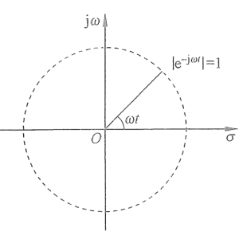
  
图 2.2.2　$e^{-\mathrm{j}\omega t}$ 的复平面表达

所以，$\sigma>-a$ 是 $\mathcal{L}[e^{-at}]=\frac{1}{s+a}$ 的收敛域。其他常见拉普拉斯变换的收敛域请参考表 2.2.1。

### 2.2.3 拉普拉斯逆变换

本节将介绍拉普拉斯的逆变换（Inverse Laplace Transform），它是反向使用拉普拉斯变换，将 $F(s)$ 变回时域函数 $f(t)$，即

$$
f(t)=\mathcal{L}^{-1}[F(s)]. \tag{2.2.16}
$$

请看下面的例子。

#### 例 2.2.6　已知 $F(s)=\frac{-s+5}{s^2+5s+4}$，求 $f(t)$

解：

$$
F(s)=\frac{-s+5}{s^2+5s+4}=\frac{-s+5}{(s+4)(s+1)}=\frac{A}{s+4}+\frac{B}{s+1}. \tag{2.2.17}
$$

此时可以用分式分解法求解 $A$ 和 $B$。根据式（2.2.17）可得

$$
A(s+1)+B(s+4)=-s+5. \tag{2.2.18}
$$

令 $s=-1$，可得

$$
\begin{aligned}
B(-1+4)&=1+5\\
\Rightarrow B&=2.
\end{aligned} \tag{2.2.19}
$$

令 $s=-4$，可得

$$
\begin{aligned}
-3A&=9\\
\Rightarrow A&=-3.
\end{aligned} \tag{2.2.20}
$$

所以

$$
F(s)=\frac{-3}{s+4}+\frac{2}{s+1}. \tag{2.2.21}
$$

根据例 2.2.1：$\mathcal{L}^{-1}\left[\frac{1}{s+a}\right]=e^{-at}$，可得

$$
f(t)=\mathcal{L}^{-1}[F(s)]=\mathcal{L}^{-1}\left[\frac{-3}{s+4}+\frac{2}{s+1}\right]=-3e^{-4t}+2e^{-t}. \tag{2.2.22}
$$

在式（2.2.21）中，如果令 $F(s)$ 的分母部分等于 0，即

$$
\begin{cases}
s+4=0,\\
s+1=0,
\end{cases}
$$

> [!note]- 什么是极点？为什么要求分母等于 0？
>
> 为什么要令分母等于 0？从拉普拉斯变换的定义看，$e^{-at}$ 的变换是 $\mathcal L[e^{-at}]=\int_0^\infty e^{-at}e^{-st}\,\mathrm dt=\int_0^\infty e^{-(s+a)t}\,\mathrm dt=\frac{1}{s+a}$（在 $\operatorname{Re}(s+a)>0$ 时成立）。若取实数 $s=-a+\varepsilon$，其中 $\varepsilon>0$，被积函数就变成 $e^{-\varepsilon t}$：$\varepsilon$ 越小，它衰减得越慢，曲线下的面积 $\frac{1}{\varepsilon}$ 越大；当 $\varepsilon=0$ 时，被积函数恒为 1，积分不再收敛。这就是分母 $s+a$ 趋于 0 时变换值变大的原因。使分母为 0 的 $s=-a$ 称为**极点**；它标记了 $F(s)$ 的这一特殊位置，并通过 $\mathcal L^{-1}\!\left[\frac{1}{s+a}\right]=e^{-at}$ 指出对应的时域指数项。这里趋于无穷的是变换后的 $F(s)$，**不是** $e^{-at}$ 在某个时刻的函数值；$a>0$ 时这个指数项随时间衰减，$a<0$ 时则随时间增长。
>
> 式（2.2.21）中，$\frac{-3}{s+4}$ 的极点是 $-4$，对应 $-3e^{-4t}$；$\frac{2}{s+1}$ 的极点是 $-1$，对应 $2e^{-t}$。两项都会衰减到 0。求极点是为了看出这些时间变化成分；计算本题的逆变换时，直接使用变换公式即可。若原式的分子和分母有公共因子，应先约去公共因子，再判断极点。

可以得到 $s$ 的两个解：

$$
\begin{cases}
s_1=-4,\\
s_2=-1.
\end{cases}
$$

再去对比式（2.2.22）可以发现，$s_1$ 与 $s_2$ 出现在了时间函数 $f(t)$ 的指数部分。因为它们两个都是负值，对应的两个指数项都会随着时间 $t$ 的增加而衰减，最终 $f(t)$ 趋于 0。而一旦存在未被抵消的正实数极点及其非零系数，对应的指数项就会随着时间的增加而发散。

#### 例 2.2.7　已知 $F(s)=\frac{4s+8}{s^2+2s+5}$，求 $f(t)$

解：

$$
\begin{aligned}
F(s)&=\frac{4s+8}{s^2+2s+5}=\frac{4s+8}{(s+1+2\mathrm{j})(s+1-2\mathrm{j})}\\
&=\frac{A}{s+1+2\mathrm{j}}+\frac{B}{s+1-2\mathrm{j}}.
\end{aligned} \tag{2.2.23}
$$

利用分式分解法可得

$$
\begin{cases}
A=\mathrm{j}+2,\\
B=-\mathrm{j}+2.
\end{cases} \tag{2.2.24}
$$

可以得到

$$
\begin{aligned}
f(t)&=\mathcal{L}^{-1}[F(s)]=(\mathrm{j}+2)e^{(-1-2\mathrm{j})t}+(-\mathrm{j}+2)e^{(-1+2\mathrm{j})t}\\
&=e^{-t}\left(\mathrm{j}e^{-2\mathrm{j}t}+2e^{-2\mathrm{j}t}-\mathrm{j}e^{2\mathrm{j}t}+2e^{2\mathrm{j}t}\right)\\
&=e^{-t}\left(\mathrm{j}(e^{-2\mathrm{j}t}-e^{2\mathrm{j}t})+2(e^{-2\mathrm{j}t}+e^{2\mathrm{j}t})\right)\\
&=e^{-t}(2\sin2t+4\cos2t).
\end{aligned} \tag{2.2.25}
$$

在例 2.2.7 中，$F(s)$ 分母部分为零时，得到：$s_1=-1-2\mathrm{j}$ 和 $s_2=-1+2\mathrm{j}$ 出现在了 $f(t)$ 的指数部分。因为它们是复数，根据欧拉公式，复数将引入正弦（余弦）函数，带来了振动。这说明，当一个函数 $f(t)$ 经过拉普拉斯变换之后，如果 $F(s)$ 分母部分的根存在虚部，那么 $f(t)$ 就会存在振动。例 2.2.6 和例 2.2.7 说明，通过分析 $F(s)$ 的根可以了解原函数 $f(t)$ 的时间表现。

## 2.3 传递函数和系统设计

### 2.3.1 传递函数

本节将介绍传递函数（Transfer Function），它是经典控制理论的基础。系统的传递函数 $G(s)$ 的定义是：在零初始条件下，系统输出的拉普拉斯变换与系统输入的拉普拉斯变换之间的比值，即

$$
G(s)=\frac{X(s)}{U(s)}. \tag{2.3.1}
$$

> [!note]- 什么是零初始条件？
>
> 零初始条件是指：在输入开始作用的时刻，系统中各个能够储存能量或反映历史状态的变量，其初始值均为零。也可以说，在输入作用之前，系统处于初始静止状态，不会依靠原有状态自行产生输出。
>
> 例如，对机械系统而言，通常要求初始位移和初始速度为零；对电路而言，通常要求电容的初始电压和电感的初始电流为零。这里的“零”一般是相对于选定平衡点的偏差为零，并不一定表示物理量的绝对值为零。例如，以 $25\,{}^\circ\mathrm{C}$ 为平衡温度时，系统初始温度为 $25\,{}^\circ\mathrm{C}$，其初始温度偏差就是零。
>
> 以一阶系统为例：
>
> $$
> \frac{\mathrm{d}x(t)}{\mathrm{d}t}+ax(t)=bu(t).
> $$
>
> 对等式两边进行拉普拉斯变换，得到
>
> $$
> sX(s)-x(0)+aX(s)=bU(s),
> $$
>
> 因而
>
> $$
> X(s)=\underbrace{\frac{b}{s+a}U(s)}_{\text{输入产生的响应}}
> +\underbrace{\frac{x(0)}{s+a}}_{\text{初始状态产生的响应}}.
> $$
>
> 当 $x(0)=0$ 时，初始状态产生的响应消失，输出完全由输入产生，于是
>
> $$
> G(s)=\frac{X(s)}{U(s)}=\frac{b}{s+a}.
> $$
>
> 如果初始条件不为零，即使 $u(t)=0$，系统也可能因为原先储存的能量而产生输出。这时 $X(s)$ 同时包含输入响应和初始状态响应，直接计算 $X(s)/U(s)$ 就不能单独描述系统的输入—输出关系。因此，定义传递函数时必须规定零初始条件。非零初始条件将在 2.4 节中进一步讨论。

式（2.3.1）所示系统可以用框图表示，如图 2.3.1 所示，其中，$U(s)G(s)=X(s)$。

  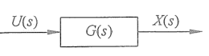
  
图 2.3.1　动态系统框图

根据表 2.2.1，单位冲激函数 $\delta(t)$ 的拉普拉斯变换 $\mathcal{L}[\delta(t)]=1$，系统对其响应为

$$
X(s)=\mathcal{L}[\delta(t)]G(s)=G(s). \tag{2.3.2}
$$

式（2.3.2）说明，当单位冲激函数作用在线性时不变系统上时，其输出（即系统的单位冲激响应）等于传递函数本身。

  

    式（2.3.2）从另一个角度验证了 2.1.1 节中提出的重要概念：单位冲激响应可以完全地定义线性时不变系统。同时，根据例 2.2.5，卷积运算通过拉普拉斯变换成为乘法运算，这也符合式（2.3.1）所表达出来的输入与输出之间的乘积关系。希望读者可以把这几部分内容结合起来理解，从不同的角度理解线性时不变系统的特性。
  

经过拉普拉斯变换后，卷积关系的系统输入与输出 $x(t)=u(t)*h(t)$ 被简化为乘积关系 $X(s)=U(s)G(s)$，这将在很大程度上简化系统分析的复杂程度。回到图 2.2.1 的例子，首先对式（2.2.2）左右两边进行拉普拉斯变换，得到

$$
\begin{aligned}
\mathcal{L}[u(t)]&=\mathcal{L}\left[L\frac{\mathrm{d}x(t)}{\mathrm{d}t}+Rx(t)\right]\\
\Rightarrow U(s)&=L(sX(s)-x(0))+RX(s).
\end{aligned} \tag{2.3.3a}
$$

> [!note]- 式（2.3.3a）是怎样得到的？
>
> 式（2.3.3a）来自前面的时域微分方程
>
> $$
> u(t)=L\frac{\mathrm{d}x(t)}{\mathrm{d}t}+Rx(t).
> $$
>
> 首先对等式两边同时进行拉普拉斯变换：
>
> $$
> \mathcal{L}[u(t)]
> =\mathcal{L}\left[L\frac{\mathrm{d}x(t)}{\mathrm{d}t}+Rx(t)\right].
> $$
>
> 根据拉普拉斯变换的线性性质，常数 $L$ 和 $R$ 可以移到变换符号外，因此
>
> $$
> \mathcal{L}[u(t)]
> =L\mathcal{L}\left[\frac{\mathrm{d}x(t)}{\mathrm{d}t}\right]
> +R\mathcal{L}[x(t)].
> $$
>
> 再利用
>
> $$
> \mathcal{L}[u(t)]=U(s),\qquad
> \mathcal{L}[x(t)]=X(s),
> $$
>
> 以及导数的拉普拉斯变换公式
>
> $$
> \mathcal{L}\left[\frac{\mathrm{d}x(t)}{\mathrm{d}t}\right]
> =sX(s)-x(0),
> $$
>
> 便得到
>
> $$
> U(s)=L\bigl[sX(s)-x(0)\bigr]+RX(s).
> $$
>
> 其中，$-x(0)$ 来自对导数的拉普拉斯变换进行分部积分时产生的下限项。若采用零初始条件 $x(0)=0$，该项消失，时域中的求导运算便转化为复数域中的乘法 $sX(s)$。

其中，$L$ 是电感，$R$ 是电阻，它们都是正数。考虑零初始状态，即系统输出 $x(t)$ 的初始状态为 $x(0)=0$，式（2.3.3a）可写成

$$
U(s)=LsX(s)+RX(s)=(Ls+R)X(s). \tag{2.3.3b}
$$

其传递函数为

$$
G(s)=\frac{X(s)}{U(s)}=\frac{1}{Ls+R}. \tag{2.3.4}
$$

当一个常数输入 $u(t)=C$ 作用在系统上时，其拉普拉斯变换为

$$
U(s)=\mathcal{L}[u(t)]=\mathcal{L}[C]=\mathcal{L}[Ce^{-0t}]=C\frac{1}{s+0}=C\frac{1}{s}. \tag{2.3.5}
$$

将式（2.3.5）代入式（2.3.4）中，可以得到系统输出的拉普拉斯变换为

$$
X(s)=U(s)G(s)=C\left(\frac{1}{s}\right)\left(\frac{1}{Ls+R}\right)=\frac{C}{L}\frac{1}{s\left(s+\frac{R}{L}\right)}. \tag{2.3.6}
$$

若要分析这一系统输出的时间函数 $x(t)$ 的表现，可以采用 2.2.3 节中的方法求解其拉普拉斯逆变换。式（2.3.6）可以写为

$$
X(s)=\frac{C}{L}\frac{1}{s\left(s+\frac{R}{L}\right)}=\frac{C}{L}\left(\frac{A}{s}+\frac{B}{s+\frac{R}{L}}\right). \tag{2.3.7}
$$

利用分式分解法可得 $A=\frac{L}{R}$，$B=-\frac{L}{R}$，代入式（2.3.7）中，得到

$$
X(s)=\frac{C}{L}\left(\frac{\frac{L}{R}}{s}-\frac{\frac{L}{R}}{s+\frac{R}{L}}\right)=\frac{C}{R}\left(\frac{1}{s}-\frac{1}{s+\frac{R}{L}}\right). \tag{2.3.8}
$$

对式（2.3.8）两边进行拉普拉斯逆变换，便可以得到系统的输出，即

$$
x(t)=\mathcal{L}^{-1}[X(s)]=\frac{C}{R}\left(e^{0t}-e^{-\frac{R}{L}t}\right)=\frac{C}{R}-\frac{C}{R}e^{-\frac{R}{L}t}. \tag{2.3.9}
$$

$x(t)$ 随时间的变化如图 2.3.2 所示。从图中可以得出，系统的输出将从 0 开始，随着时间的增加而无限地接近一个定值 $\frac{C}{R}$。

  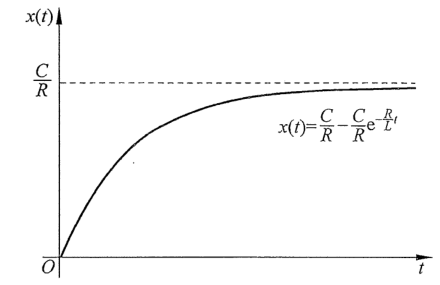
  
图 2.3.2　系统输出 $x(t)=\frac{C}{R}-\frac{C}{R}e^{-\frac{R}{L}t}$ 随时间变化

式（2.3.9）中，$x(t)$ 由两项相减组合而成，分别是 $\frac{C}{R}e^{0t}$ 和 $\frac{C}{R}e^{-\frac{R}{L}t}$，第一项中 $e$ 的指数部分系数是 0，因此 $\frac{C}{R}e^{0t}$ 等于常数 $\frac{C}{R}$；而第二项中指数部分系数为 $-\frac{R}{L}<0$，表明项 $\frac{C}{R}e^{-\frac{R}{L}t}$ 会随着时间的增加而不断地衰减，直到为 0。所以，系统输出 $x(t)$ 是有界限的，并且随着时间的增加而趋向于常数 $\frac{C}{R}$。在式（2.3.6）中，当系统输出 $X(s)$ 的分母部分等于 0 时，可以得到

$$
s\left(s+\frac{R}{L}\right)=0\Rightarrow
\begin{cases}
s_{p1}=0,\\
s_{p2}=-\frac{R}{L}.
\end{cases} \tag{2.3.10}
$$

  

    $s_{p1}$ 和 $s_{p2}$ 被称为系统输出的极点（Poles），其中，$s_{p1}$ 是输入 $U(s)=C\frac{1}{s}$ 引入的极点。$s_{p2}=-\frac{R}{L}$ 则是传递函数的极点，这是动态系统自身的极点，体现了动态系统的特性，它可以直接通过传递函数的特征方程（Characteristic Equation），即令 $G(s)$ 的分母部分为 0（$Ls+R=0$）得到。
  

在此例中，$s_{p1}=0$，而 $s_{p2}=-\frac{R}{L}<0$，所以输出 $x(t)$ 将会趋于一个常数。以上的分析说明，在得到系统的传递函数之后，便可以通过简单的代数计算得到系统输出的极点，并以此为依据快速判断系统的表现。也就是说，在得到式（2.3.6）之后就可以判断系统的表现了，这省去了大量的中间过程，并且避免了求解微分方程和卷积的麻烦。

### 2.3.2 控制系统传递函数

在掌握了动态系统的传递函数 $G(s)$ 之后，便可以着手设计控制器来调节该动态系统的输出响应。如图 2.3.3 所示的开环控制系统（Open Loop Control System）：其中 $R(s)$ 是参考值（Reference）或目标值，$C(s)$ 是控制器，原动态系统的传递函数 $G(s)$ 被称为控制系统的开环传递函数（Open Loop Transfer Function）。控制量是 $U(s)$，也就是原动态系统的输入。控制系统的输出等于原动态系统的输出 $X(s)$。

  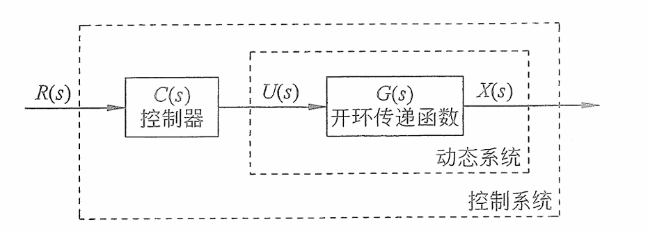
  
图 2.3.3　开环控制系统框图

控制系统本质上也是一个动态系统，从参考值 $R(s)$（它同时也是该控制系统的输入，又称参考输入）到系统输出 $X(s)$ 是串联的结构，即

$$
X(s)=U(s)G(s)=R(s)C(s)G(s). \tag{2.3.11}
$$

其中，控制量 $U(s)=R(s)C(s)$，说明系统的输出 $X(s)$ 对控制量 $U(s)$ 没有影响，这也是开环系统的特点。

若将输出 $X(s)$ 反馈到输入端，则可以形成一个闭环控制系统，如图 2.3.4 所示。其中，参考值与输出之间的差称为误差（Error），$E(s)=R(s)-X(s)$，其对应的时间函数是 $e(t)=r(t)-x(t)$，控制器 $C(s)$ 将根据误差决定控制量 $U(s)$。

  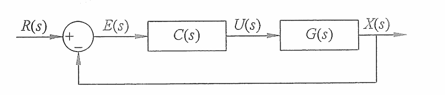
  
图 2.3.4　闭环控制系统框图

根据传递函数的代数性质，可得

$$
X(s)=U(s)G(s)=E(s)C(s)G(s). \tag{2.3.12}
$$

将 $E(s)=R(s)-X(s)$ 代入式（2.3.12）中，可得

$$
\begin{aligned}
X(s)&=(R(s)-X(s))C(s)G(s)\\
\Rightarrow (1+C(s)G(s))X(s)&=C(s)G(s)R(s)\\
\Rightarrow X(s)&=\frac{C(s)G(s)R(s)}{1+C(s)G(s)}.
\end{aligned} \tag{2.3.13}
$$

定义控制系统的闭环传递函数（Closed Loop Transfer Function）为

$$
G_{\mathrm{cl}}(s)=\frac{X(s)}{R(s)}=\frac{C(s)G(s)}{1+C(s)G(s)}. \tag{2.3.14}
$$

由此可以得到一个简化后的闭环控制系统框图，如图 2.3.5 所示。

  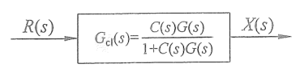
  
图 2.3.5　简化后的闭环控制系统框图

图 2.3.5 所描述的控制系统输入是参考输入 $R(s)$，输出是 $X(s)$。

  

传递函数系统建模内容请扫描此二维码观看。

## 2.4 非零初始状态下的传递函数

在传递函数的定义中有一个先决条件，即零初始条件。但在实际情况中，往往需要处理非零初始状态的系统。本节将对此内容进行简单的探讨，考虑一个一阶微分方程：

$$
\frac{\mathrm{d}x(t)}{\mathrm{d}t}+ax(t)=u(t). \tag{2.4.1}
$$

对式（2.4.1）两边进行拉普拉斯变换，根据例 2.2.4，可得

$$
\begin{aligned}
\mathcal{L}\left[\frac{\mathrm{d}x(t)}{\mathrm{d}t}+ax(t)\right]&=\mathcal{L}[u(t)]\\
sX(s)-x(0)+aX(s)&=U(s).
\end{aligned} \tag{2.4.2}
$$

在零初始条件下（$x(0)=0$），式（2.4.2）可写成 $sX(s)+aX(s)=U(s)$，系统的传递函数是

$$
G(s)=\frac{X(s)}{U(s)}=\frac{1}{s+a}. \tag{2.4.3}
$$

而当 $x(0)\ne0$ 时，式（2.4.2）可以写成

$$
sX(s)+aX(s)=U(s)+x(0). \tag{2.4.4}
$$

此时定义新的系统输入：$U_1(s)=U(s)+x(0)$，代入式（2.4.4）中，得到

$$
G(s)=\frac{X(s)}{U_1(s)}=\frac{1}{s+a}. \tag{2.4.5}
$$

式（2.4.3）和式（2.4.5）的系统框图如图 2.4.1 所示。可见这两个系统的传递函数是相同的，其中非零初始条件系统多出一个输入，而这个输入的拉普拉斯变换等于其初始条件 $x(0)$。对它进行拉普拉斯逆变换可以得到其原函数，即

$$
\mathcal{L}^{-1}[x(0)]=x(0)\delta(t). \tag{2.4.6}
$$

  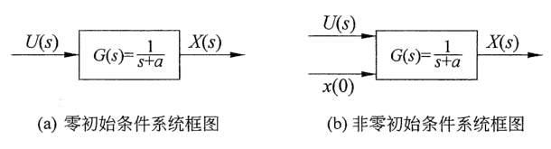
  
图 2.4.1　零初始条件和非零初始条件系统框图

其中，$\delta(t)$ 是单位冲激函数，在 2.1.1 节介绍过，可以把它理解为在很短的时间内释放出的一个单位的能量。将它乘以一个系数 $x(0)$，则相当于在一瞬间对系统施加了 $x(0)$ 个单位的能量（系统的输出也将叠加 $x(0)h(t)$）。因为这个能量是瞬间的，并不持续，所以它不会影响到系统的稳定性分析与特征分析。高阶系统的非零初始条件的分析则比较复杂，但是其理念与一阶系统相同，系统的初始状态可以理解为瞬时间赋予系统的“能量”。

## 2.5 本章要点总结

- **卷积与微分方程：**

  - 线性时不变系统的输出与输入之间是卷积的关系。
  - 单位冲激响应可以完整地描述线性时不变系统。
  - 微分方程可以直接描述系统输入与输出之间的卷积关系。

- **拉普拉斯变换：**

  - 拉普拉斯变换是线性变换，符合叠加原理。
  - 卷积的拉普拉斯变换是乘法运算，这是重要的性质，它可以简化系统的分析。
  - 利用拉普拉斯逆变换可以方便地求解微分方程。

- **传递函数：**

  - 传递函数的定义：在零初始条件下，系统输出的拉普拉斯变换与系统输入的拉普拉斯变换之间的比值。
  - 传递函数的极点：令系统的传递函数分母等于 0 时的 $s$ 值。它将决定系统的表现。
  - 非零初始状态：在时间零点赋予系统“能量”，使得系统达到初始状态。
