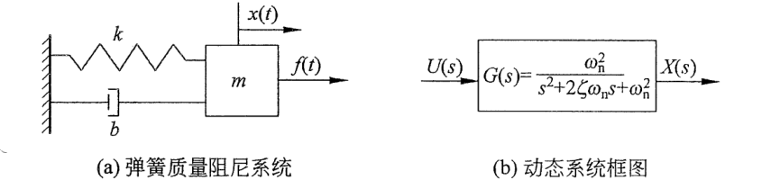
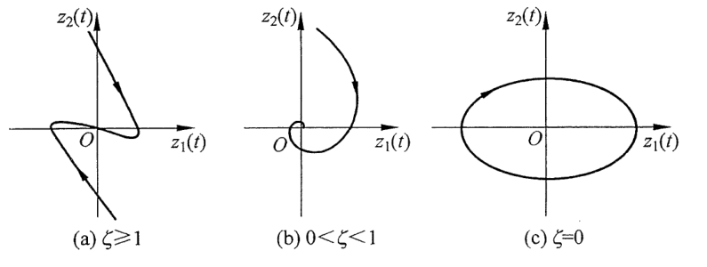
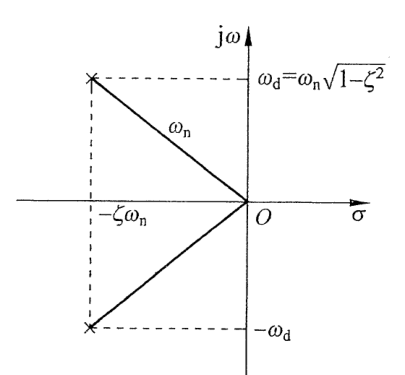
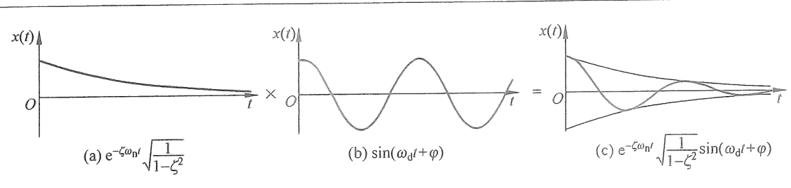
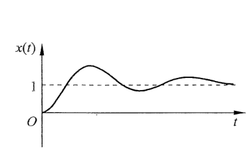
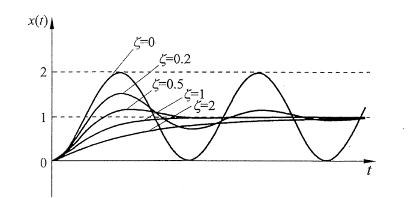
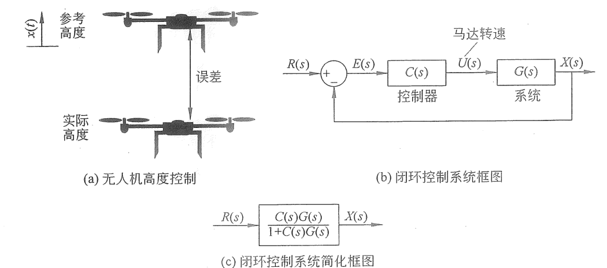
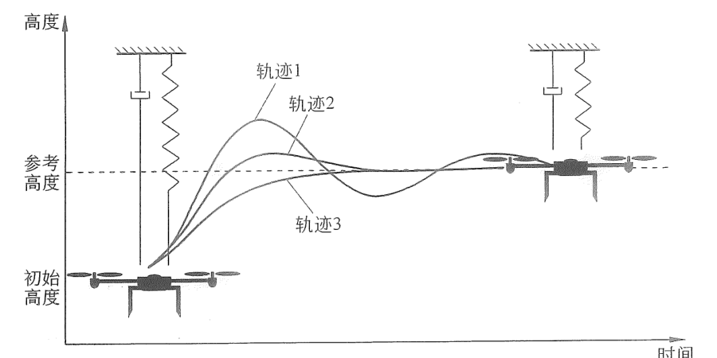
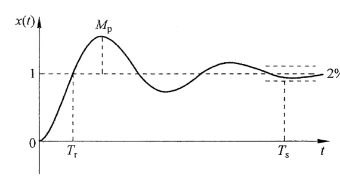
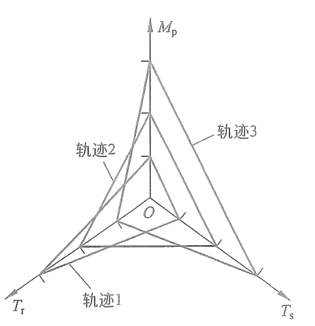

# 第5章 二阶系统的时域响应分析

二阶系统被广泛地运用于控制工程的实践中，尤其是与力学相关的控制，如自动驾驶、无人机控制、电机控制、机器人控制等。同时，很多的高阶系统都可以近似为二阶系统。所以详细讨论和分析二阶系统有很重要的实际意义。

本章的学习目标为：

- 掌握二阶系统的一般形式及其参数的含义。
- 掌握使用传递函数和状态空间方程的方法分析二阶系统的时域响应。
- 熟悉二阶系统性能指标的含义和推导方法。
- 理解科学评价动态系统性能的流程与方法。

## 5.1 二阶系统的一般形式——传递函数和状态空间方程

从一个典型的二阶系统例子入手，一个弹簧质量阻尼系统如图 5.1.1（a）所示。其对应的微分方程为

$$
m\frac{\mathrm d^2x(t)}{\mathrm dt^2}
+b\frac{\mathrm dx(t)}{\mathrm dt}
+kx(t)=f(t). \tag{5.1.1a}
$$

调整可得

$$
\frac{\mathrm d^2x(t)}{\mathrm dt^2}
+\frac{b}{m}\frac{\mathrm dx(t)}{\mathrm dt}
+\frac{k}{m}x(t)=\frac{1}{m}f(t). \tag{5.1.1b}
$$

定义：

- 固有频率或者自然频率（Natural Frequency）：$\displaystyle\omega_n=\sqrt{\frac{k}{m}}$。
- 阻尼比（Damping Ratio）：$\displaystyle\zeta=\frac{b}{2\sqrt{km}}$。

代入式（5.1.1b），可得

$$
\frac{\mathrm d^2x(t)}{\mathrm dt^2}
+2\zeta\omega_n\frac{\mathrm dx(t)}{\mathrm dt}
+\omega_n^2x(t)=\frac{1}{m}f(t). \tag{5.1.1c}
$$

为了简化计算，使系统单位化，定义系统的输入 $\displaystyle u(t)=\frac{f(t)}{m\omega_n^2}$。代入式（5.1.1c），可得

$$
\frac{\mathrm d^2x(t)}{\mathrm dt^2}
+2\zeta\omega_n\frac{\mathrm dx(t)}{\mathrm dt}
+\omega_n^2x(t)=\omega_n^2u(t). \tag{5.1.2}
$$

在本章中只讨论 $m>0$、$k>0$、$b>0$ 的情况，因此 $\omega_n>0$ 且 $\zeta>0$。其他例外情况读者可以根据本章的方法去处理。

考虑零初始状态，对式（5.1.2）等号两边进行拉普拉斯变换并整理，可以得到一般形式二阶系统的传递函数，即

$$
G(s)=\frac{X(s)}{U(s)}
=\frac{\omega_n^2}{s^2+2\zeta\omega_ns+\omega_n^2}. \tag{5.1.3}
$$

系统的框图如图 5.1.1（b）所示。

  
  
图 5.1.1　弹簧质量阻尼系统与其传递函数

如果使用状态空间方程的表达形式，可以设系统的状态变量为

$$
\boldsymbol z(t)=[z_1(t),z_2(t)]^{\mathrm T}
=\left[x(t),\frac{\mathrm dx(t)}{\mathrm dt}\right]^{\mathrm T}.
$$

得到

$$
\frac{\mathrm dz_1(t)}{\mathrm dt}=z_2(t), \tag{5.1.4a}
$$

$$
\frac{\mathrm dz_2(t)}{\mathrm dt}
=\frac{\mathrm d^2z_1(t)}{\mathrm dt^2}
=-2\zeta\omega_nz_2(t)-\omega_n^2z_1(t)+\omega_n^2u(t). \tag{5.1.4b}
$$

将其写成紧凑的矩阵形式，得到

$$
\frac{\mathrm d\boldsymbol z(t)}{\mathrm dt}
=A\boldsymbol z(t)+B u(t),
$$

其中

$$
A=
\begin{bmatrix}
0&1\\
-\omega_n^2&-2\zeta\omega_n
\end{bmatrix},
\qquad
B=
\begin{bmatrix}
0\\
\omega_n^2
\end{bmatrix}. \tag{5.1.5}
$$

## 5.2 二阶系统对初始状态的响应

首先分析二阶系统对初始状态的响应，即考虑无输入的情况，$u(t)=0$。试想如果在时间 $t=0$ 的时刻，质量块的位置 $x(0)\ne0$ 或者速度 $\left.\frac{\mathrm dx(t)}{\mathrm dt}\right|_{t=0}\ne0$，系统将如何运行？在 4.2.2 节中曾经分析过，使用相轨迹可以直观清晰地定性分析系统对初始条件的响应，因此本节将从此角度入手进行分析。当系统的输入 $u(t)=0$ 时，式（5.1.5）可写成

$$
\frac{\mathrm d\boldsymbol z(t)}{\mathrm dt}
=A\boldsymbol z(t),
\qquad
A=
\begin{bmatrix}
0&1\\
-\omega_n^2&-2\zeta\omega_n
\end{bmatrix}. \tag{5.2.1}
$$

求这个系统的平衡点，令 $\frac{\mathrm d\boldsymbol z(t)}{\mathrm dt}=0$，可得

$$
\left\{
\begin{aligned}
0&=z_{2f},\\
0&=-\omega_n^2z_{1f}-2\zeta\omega_nz_{2f}
\end{aligned}
\right.
\quad\Rightarrow\quad
\left\{
\begin{aligned}
z_{1f}&=0,\\
z_{2f}&=0.
\end{aligned}
\right. \tag{5.2.2}
$$

分析平衡点的性质，首先要得到状态矩阵 $A$ 的特征值，令 $|A-\lambda I|=0$，得到

$$
\begin{vmatrix}
-\lambda&1\\
-\omega_n^2&-2\zeta\omega_n-\lambda
\end{vmatrix}
=\lambda^2+2\zeta\omega_n\lambda+\omega_n^2=0. \tag{5.2.3a}
$$

求解特征值，得到

$$
\left\{
\begin{aligned}
\lambda_1&=-\zeta\omega_n+\omega_n\sqrt{\zeta^2-1},\\
\lambda_2&=-\zeta\omega_n-\omega_n\sqrt{\zeta^2-1}.
\end{aligned}
\right. \tag{5.2.3b}
$$

  

    特征值 $\lambda$ 对应了式（5.1.3）中的传递函数 $G(s)$ 的极点。
  

下面来分类讨论不同的参数对特征值 $\lambda_1$ 和 $\lambda_2$ 的影响以及特征值将如何影响系统的表现。

**类（1）：$\zeta\ge1$。**

此时

$$
\zeta>\sqrt{\zeta^2-1}\ge0
\quad\Rightarrow\quad
\left\{
\begin{aligned}
\lambda_1&=-\zeta\omega_n+\omega_n\sqrt{\zeta^2-1}<0,\\
\lambda_2&=-\zeta\omega_n-\omega_n\sqrt{\zeta^2-1}<0.
\end{aligned}
\right. \tag{5.2.4}
$$

特征值 $\lambda_1$ 与 $\lambda_2$ 都为实数且都小于 0。根据表 3.3.1，平衡点 $\boldsymbol z_f=[0,0]^{\mathrm T}$ 是一个稳定的节点。它的相轨迹如图 5.2.1（a）所示。不管初始位置从何处开始，都会随着时间的增加而趋于 0。

其中，当 $\zeta>1$ 时的系统称为过阻尼系统（Overdamped System），当 $\zeta=1$ 时的系统称为临界阻尼系统（Critically Damped System）。过阻尼和临界阻尼的区别在于它们的收敛速度不同，其中临界阻尼的系统收敛更快。本节重点在于定性分析，这两种系统的细微差别将在 5.3 节定量分析中详细阐释。

**类（2）：$0<\zeta<1$。**

此时

$$
\sqrt{\zeta^2-1}=\sqrt{1-\zeta^2}\,\mathrm j
\quad\Rightarrow\quad
\left\{
\begin{aligned}
\lambda_1&=-\zeta\omega_n+\omega_n\sqrt{1-\zeta^2}\,\mathrm j,\\
\lambda_2&=-\zeta\omega_n-\omega_n\sqrt{1-\zeta^2}\,\mathrm j.
\end{aligned}
\right. \tag{5.2.5}
$$

特征值 $\lambda_1$ 和 $\lambda_2$ 是两个复数，而且它们的实部都是 $-\zeta\omega_n<0$。根据表 3.3.1，平衡点 $\boldsymbol z_f=[0,0]^{\mathrm T}$ 是一个稳定的焦点，它的相轨迹如图 5.2.1（b）所示。这是一个边振荡边衰减的系统，系统的状态变量将随着时间的增加而趋于平衡点。这也是我们日常生活中最常见的弹簧系统，无论它被压缩或者拉伸，当它从初始位置被释放后，就会不断地振动且振幅逐渐减小并最终停下来。这种系统称为欠阻尼系统（Underdamped System）。

**类（3）：$\zeta=0$。**

此时

$$
\left\{
\begin{aligned}
\lambda_1&=\omega_n\mathrm j,\\
\lambda_2&=-\omega_n\mathrm j.
\end{aligned}
\right. \tag{5.2.6}
$$

状态矩阵的特征值是一对共轭纯虚数。根据表 3.3.1，平衡点 $\boldsymbol z_f=[0,0]^{\mathrm T}$ 是一个中心点。其相轨迹会围绕着这个中心点做圆周运动，如图 5.2.1（c）所示。此时两个状态变量，即质量块的位移与速度会不断地振动，循环往复。从物理意义上来理解它，$\zeta=0$ 代表了式（5.1.1）中 $b=0$，即系统的阻尼为零。没有阻尼的时候系统的总能量就不会消耗，所以一旦对这个系统施加一个初始状态（给予其初始的能量），它就会不断地振动下去。这种系统称为无阻尼系统（Undamped System）。

  
  
图 5.2.1　二阶系统对初始状态响应的相轨迹

## 5.3 二阶系统的单位阶跃响应

在 5.2 节中，我们采用相轨迹的方法定性讨论了二阶系统对初始状态的响应。本节将采用传递函数的方法定量分析二阶系统的单位阶跃响应。读者在阅读过程中可以将这两节中所介绍的方法结合起来思考，例如用传递函数的方法去求解初始状态问题，或者用相轨迹的方法求解阶跃响应，相信读者会对这部分内容有更深刻的理解。

当系统的输入为单位阶跃函数时，输入的拉普拉斯变换为 $U(s)=\frac1s$，将其代入式（5.1.3），可得

$$
X(s)=G(s)U(s)
=\frac{\omega_n^2}{s^2+2\zeta\omega_ns+\omega_n^2}\times\frac1s. \tag{5.3.1}
$$

令式（5.3.1）的分母等于 0，可以求出三个极点，分别为

$$
\left\{
\begin{aligned}
s_{p1}&=0,\\
s_{p2}&=-\zeta\omega_n+\omega_n\sqrt{\zeta^2-1},\\
s_{p3}&=-\zeta\omega_n-\omega_n\sqrt{\zeta^2-1}.
\end{aligned}
\right. \tag{5.3.2}
$$

通过 5.2 节的介绍，不同的 $\zeta$ 值将对应不同的系统表现，本节将详细推导其中一个最为复杂的情况，即欠阻尼系统 $0<\zeta<1$，并分析它的系统响应。当 $0<\zeta<1$ 时，式（5.3.2）变为

$$
\left\{
\begin{aligned}
s_{p1}&=0,\\
s_{p2}&=-\zeta\omega_n+\omega_n\sqrt{1-\zeta^2}\,\mathrm j,\\
s_{p3}&=-\zeta\omega_n-\omega_n\sqrt{1-\zeta^2}\,\mathrm j.
\end{aligned}
\right. \tag{5.3.3}
$$

其中，$s_{p1}$ 来自输入，$s_{p2}$ 和 $s_{p3}$ 则是系统传递函数的极点。将式（5.3.3）代入式（5.3.1），并设三个待定系数分别为 $A$、$B$ 和 $C$，可得

$$
\begin{aligned}
X(s)
&=\frac{\omega_n^2}{s(s^2+2\zeta\omega_ns+\omega_n^2)}
=\frac{A}{s-s_{p1}}+\frac{B}{s-s_{p2}}+\frac{C}{s-s_{p3}}\\
&=\frac{A(s-s_{p2})(s-s_{p3})+B(s-s_{p1})(s-s_{p3})+C(s-s_{p1})(s-s_{p2})}
{(s-s_{p1})(s-s_{p2})(s-s_{p3})}.
\end{aligned} \tag{5.3.4}
$$

比较等式两侧的分子，可得

$$
\omega_n^2
=A(s-s_{p2})(s-s_{p3})
+B(s-s_{p1})(s-s_{p3})
+C(s-s_{p1})(s-s_{p2}). \tag{5.3.5}
$$

利用分式分解法求 $A$、$B$ 和 $C$。

令 $s=s_{p1}=0$，可得

$$
\begin{aligned}
\omega_n^2
&=A(0-s_{p2})(0-s_{p3})\\
&=A\bigl(\zeta\omega_n-\omega_n\sqrt{1-\zeta^2}\,\mathrm j\bigr)
\bigl(\zeta\omega_n+\omega_n\sqrt{1-\zeta^2}\,\mathrm j\bigr)
=A\omega_n^2\\
&\Rightarrow A=1.
\end{aligned} \tag{5.3.6a}
$$

令 $s=s_{p2}=-\zeta\omega_n+\omega_n\sqrt{1-\zeta^2}\,\mathrm j$，可得

$$
\begin{aligned}
\omega_n^2
&=B\bigl(-\zeta\omega_n+\omega_n\sqrt{1-\zeta^2}\,\mathrm j-s_{p1}\bigr)
\bigl(-\zeta\omega_n+\omega_n\sqrt{1-\zeta^2}\,\mathrm j-s_{p3}\bigr)\\
&=B\bigl(-\zeta\omega_n+\omega_n\sqrt{1-\zeta^2}\,\mathrm j-0\bigr)
\left[-\zeta\omega_n+\omega_n\sqrt{1-\zeta^2}\,\mathrm j
-\bigl(-\zeta\omega_n-\omega_n\sqrt{1-\zeta^2}\,\mathrm j\bigr)\right]\\
&=B\bigl(-\zeta\omega_n+\omega_n\sqrt{1-\zeta^2}\,\mathrm j\bigr)
\bigl(2\omega_n\sqrt{1-\zeta^2}\,\mathrm j\bigr)\\
&=B\left[-2\zeta\omega_n^2\sqrt{1-\zeta^2}\,\mathrm j-2\omega_n^2(1-\zeta^2)\right]\\
&=B(-2\omega_n^2)\left(\zeta\sqrt{1-\zeta^2}\,\mathrm j+1-\zeta^2\right),
\end{aligned}
$$

所以

$$
\begin{aligned}
B
&=-\frac12\frac{1}{\zeta\sqrt{1-\zeta^2}\,\mathrm j+1-\zeta^2}\\
&=-\frac12
\frac{1-\zeta^2-\zeta\sqrt{1-\zeta^2}\,\mathrm j}
{(1-\zeta^2)^2+\zeta^2(1-\zeta^2)}\\
&=-\frac12
\frac{1-\zeta^2-\zeta\sqrt{1-\zeta^2}\,\mathrm j}{1-\zeta^2}\\
&=-\frac12\left(1-\frac{\zeta}{\sqrt{1-\zeta^2}}\,\mathrm j\right).
\end{aligned} \tag{5.3.6b}
$$

同理，令 $s=s_{p3}$，可得

$$
C=-\frac12\left(1+\frac{\zeta}{\sqrt{1-\zeta^2}}\,\mathrm j\right). \tag{5.3.6c}
$$

可知 $C$ 与 $B$ 是共轭关系。将式（5.3.6a）、式（5.3.6b）、式（5.3.6c）代入式（5.3.4）中可得

$$
X(s)=\frac{1}{s-s_{p1}}
-\frac12\left(1-\frac{\zeta}{\sqrt{1-\zeta^2}}\,\mathrm j\right)\frac{1}{s-s_{p2}}
-\frac12\left(1+\frac{\zeta}{\sqrt{1-\zeta^2}}\,\mathrm j\right)\frac{1}{s-s_{p3}}. \tag{5.3.7}
$$

对式（5.3.7）等号两边进行拉普拉斯逆变换，可得

$$
\begin{aligned}
x(t)&=\mathcal L^{-1}[X(s)]\\
&=e^{s_{p1}t}
-\frac12\left(1-\frac{\zeta}{\sqrt{1-\zeta^2}}\,\mathrm j\right)e^{s_{p2}t}
-\frac12\left(1+\frac{\zeta}{\sqrt{1-\zeta^2}}\,\mathrm j\right)e^{s_{p3}t}.
\end{aligned} \tag{5.3.8}
$$

将式（5.3.3）代入式（5.3.8），可得

$$
\begin{aligned}
x(t)
&=e^{0t}
-\frac12\left(1-\frac{\zeta}{\sqrt{1-\zeta^2}}\,\mathrm j\right)
e^{(-\zeta\omega_n+\omega_n\sqrt{1-\zeta^2}\,\mathrm j)t}\\
&\quad-\frac12\left(1+\frac{\zeta}{\sqrt{1-\zeta^2}}\,\mathrm j\right)
e^{(-\zeta\omega_n-\omega_n\sqrt{1-\zeta^2}\,\mathrm j)t}\\
&=1-e^{-\zeta\omega_nt}\left[
\frac12\left(1-\frac{\zeta}{\sqrt{1-\zeta^2}}\,\mathrm j\right)e^{\omega_n\sqrt{1-\zeta^2}\,\mathrm jt}
+\frac12\left(1+\frac{\zeta}{\sqrt{1-\zeta^2}}\,\mathrm j\right)e^{-\omega_n\sqrt{1-\zeta^2}\,\mathrm jt}
\right].
\end{aligned} \tag{5.3.9}
$$

定义一个新的参数 $\omega_d=\omega_n\sqrt{1-\zeta^2}$，称其为阻尼固有频率（Damped Natural Frequency）。可以通过复平面图形辅助理解这一参数，将式（5.3.3）中 $G(s)$ 的两个共轭极点 $s_{p2}$ 和 $s_{p3}$ 在图 5.3.1 中的复平面上绘制出来，可以发现它们的横坐标为 $-\zeta\omega_n$，纵坐标分别为 $\pm\omega_n\sqrt{1-\zeta^2}$，即阻尼固有频率。根据三角关系，它们的模（即长度）等于系统的固有频率 $\omega_n$。

  
  
图 5.3.1　极点、固有频率与阻尼固有频率的关系

此时，式（5.3.9）可以化简为

$$
\begin{aligned}
x(t)
&=1-e^{-\zeta\omega_nt}\left[
\frac12\left(1-\frac{\zeta}{\sqrt{1-\zeta^2}}\,\mathrm j\right)e^{\omega_d\mathrm jt}
+\frac12\left(1+\frac{\zeta}{\sqrt{1-\zeta^2}}\,\mathrm j\right)e^{-\omega_d\mathrm jt}
\right]\\
&=1-e^{-\zeta\omega_nt}\left[
\frac12\left(e^{\omega_d\mathrm jt}+e^{-\omega_d\mathrm jt}\right)
+\frac12\frac{\zeta}{\sqrt{1-\zeta^2}}\,\mathrm j
\left(-e^{\omega_d\mathrm jt}+e^{-\omega_d\mathrm jt}\right)
\right].
\end{aligned} \tag{5.3.10a}
$$

根据欧拉公式，$e^{\omega_d\mathrm jt}=\cos\omega_dt+\mathrm j\sin\omega_dt$，$e^{-\omega_d\mathrm jt}=\cos\omega_dt-\mathrm j\sin\omega_dt$，可得

$$
\frac12\left(e^{\omega_d\mathrm jt}+e^{-\omega_d\mathrm jt}\right)=\cos\omega_dt, \tag{5.3.10b}
$$

$$
\frac{1}{2\mathrm j}\left(e^{\omega_d\mathrm jt}-e^{-\omega_d\mathrm jt}\right)=\sin\omega_dt. \tag{5.3.10c}
$$

代入式（5.3.10a），化简后得到

$$
x(t)=1-e^{-\zeta\omega_nt}\left[
\cos\omega_dt+\frac{\zeta}{\sqrt{1-\zeta^2}}\sin\omega_dt
\right]. \tag{5.3.11a}
$$

令 $\displaystyle\varphi=\arctan\frac{\sqrt{1-\zeta^2}}{\zeta}$，可得

$$
\begin{aligned}
\cos\omega_dt+\frac{\zeta}{\sqrt{1-\zeta^2}}\sin\omega_dt
&=\sqrt{1^2+\left(\frac{\zeta}{\sqrt{1-\zeta^2}}\right)^2}
\sin(\omega_dt+\varphi)\\
&=\sqrt{\frac{1}{1-\zeta^2}}\sin(\omega_dt+\varphi).
\end{aligned} \tag{5.3.11b}
$$

代入式（5.3.11a），可得

$$
x(t)=1-e^{-\zeta\omega_nt}\sqrt{\frac{1}{1-\zeta^2}}\sin(\omega_dt+\varphi). \tag{5.3.12}
$$

式（5.3.12）为二阶欠阻尼系统单位阶跃响应的时间函数，它由两部分相减而成。其中“1”来自系统输入（极点为 $s_{p1}=0$），因此输出包含一个常数。后半部分的 $e^{-\zeta\omega_nt}\sqrt{\frac{1}{1-\zeta^2}}\sin(\omega_dt+\varphi)$ 是两项相乘，其中 $e^{-\zeta\omega_nt}\sqrt{\frac{1}{1-\zeta^2}}$ 项会随着时间的增加而递减并趋于 0，如图 5.3.2（a）所示。

而 $\sin(\omega_dt+\varphi)$ 则是周期为 $\frac{2\pi}{\omega_d}$、初相位为 $\varphi$ 的三角函数，如图 5.3.2（b）所示。这两部分相乘之后就形成了图 5.3.2（c）中振荡且递减的曲线。

  

    同时，式（5.3.12）说明 $x(t)$ 的收敛速度是由指数部分 $-\zeta\omega_n$ 决定的，它同时也是传递函数极点 $s_{p2,3}$ 的实部。周期是由 $\omega_d$ 决定的，而 $\omega_d=\omega_n\sqrt{1-\zeta^2}$ 则是传递函数极点 $s_{p2,3}$ 的虚部。这再一次验证了传递函数极点对系统输出的影响。
  

  
  
图 5.3.2　$e^{-\zeta\omega_nt}\sqrt{\frac{1}{1-\zeta^2}}\sin(\omega_dt+\varphi)$ 的图像组成

而 $x(t)$ 的图像就是用“1”减去图 5.3.2（c）的图像，其结果如图 5.3.3 所示。

  
  
图 5.3.3　欠阻尼二阶系统的单位阶跃响应

读者可以用同样的方法去推导过阻尼、临界阻尼和无阻尼的情况。这里不再赘述，只给出结果如下。

无阻尼情况（当 $\zeta=0$ 时）：

$$
x(t)=1-\cos\omega_nt. \tag{5.3.13}
$$

临界阻尼情况（当 $\zeta=1$ 时）：

$$
x(t)=1-e^{-\omega_nt}(1+\omega_nt). \tag{5.3.14}
$$

过阻尼情况（当 $\zeta>1$ 时）：

$$
\begin{aligned}
x(t)=1
&-\frac{1}{2\sqrt{\zeta^2-1}\left(\zeta-\sqrt{\zeta^2-1}\right)}
e^{\left(-\zeta\omega_n+\omega_n\sqrt{\zeta^2-1}\right)t}\\
&+\frac{1}{2\sqrt{\zeta^2-1}\left(\zeta+\sqrt{\zeta^2-1}\right)}
e^{\left(-\zeta\omega_n-\omega_n\sqrt{\zeta^2-1}\right)t}.
\end{aligned} \tag{5.3.15}
$$

图 5.3.4 显示了在不同阻尼比下，二阶系统的单位阶跃响应曲线。可见阻尼比 $\zeta$ 是二阶系统中的一个重要参数，它决定了系统的响应速度和振荡的激烈程度等。

  
  
图 5.3.4　不同阻尼比下二阶系统的阶跃响应

  

二阶系统的时域响应内容请扫描此二维码观看。

## 5.4 二阶系统性能指标分析

本节将介绍二阶系统的一些重要的性能指标及分析方法。这些参数不仅可以运用在分析二阶系统的动态表现上，也可以用在定量评估控制器中。此外，本节将通过一个案例为读者梳理科学分析动态系统的方法。

### 5.4.1 二阶系统的重要性能指标

考虑一个实际的控制器设计案例，设想你作为一个项目经理负责开发一个无人机项目。目标是设计一套算法自动控制无人机的高度，工程设计团队开发了一套反馈控制系统，如图 5.4.1 所示。控制框图如图 5.4.1（b）所示，其中 $R(s)$ 是参考值，$E(s)$ 是误差。$C(s)$ 是控制器，其包含的控制算法会根据无人机的实际高度 $X(s)$ 与参考（目标）高度 $R(s)$ 的差值（误差 $E(s)$）来决定控制量，即马达的转速 $U(s)$。根据框图化简原理，图 5.4.1（b）可以化简为图 5.4.1（c）。简化后的框图（控制系统）输入是参考值 $R(s)$，输出是高度的拉普拉斯变换 $X(s)$。闭环控制系统的传递函数是 $\frac{C(s)G(s)}{1+C(s)G(s)}$。

  
  
图 5.4.1　控制器设计二阶系统例子

在实际工程应用中，大部分关于运动控制的系统，简化后的闭环传递函数都会呈现出二阶系统的表现，即可以近似认为图 5.4.1（c）中的

$$
\frac{C(s)G(s)}{1+C(s)G(s)}
=\frac{\omega_n^2}{s^2+2\zeta\omega_ns+\omega_n^2}.
$$

  

    从直观理解，控制系统设计相当于将无人机挂在了一个“看不见”的弹簧阻尼系统上面，如图 5.4.2 所示，而控制器的设计过程就是设计这个弹簧阻尼系统的固有频率和阻尼比。
  

根据设定，“你”的角色是产品经理，因此你的关注点不在控制器的设计上，而是如何评估控制系统（有关“看不见”的弹簧阻尼系统设计请参考 7.3.2 节）。现在假设算法工程师提供了三种方案，经过测试后无人机都可以从初始高度达到目标高度，但它们的运行轨迹不同，如图 5.4.2 所示的三条轨迹。作为项目经理，请问你会如何评价这三种算法，又会选择哪一种呢？读者可以记录下你现在的选择，与本章最后的分析与结果进行比较。

  
  
图 5.4.2　无人机高度控制

各位读者在今后的科研或者工作中，会经常遇到类似的系统分析的问题。为了得到令人信服的评估结果，需要一些量化的指标。下面将列出三个指标参数来描述二阶系统的性能，其他指标都可以通过这三个指标推导出来。图 5.4.3 是一个典型的欠阻尼二阶系统的单位阶跃响应，以它为例，定义如下性能指标。

  
  
图 5.4.3　二阶系统的单位阶跃响应性能指标

（1）**上升时间（Rise Time）$T_r$：**是指系统第一次到达稳定点的时间，有的系统达不到稳定状态，就取稳定值的 $90\%$。这一参数体现了系统的反应速度。

（2）**最大超调量（Maximum Overshoot）$M_p$：**系统输出的最大值（峰值）减去稳态值，再乘以 $100\%$，即 $\displaystyle M_p=\frac{x_{\max}-x(\infty)}{x(\infty)}\times100\%$，这个指标说明了系统有多大的“矫枉过正”的倾向。

（3）**稳定时间（Settling Time）$T_s$：**又称调节时间，是指系统进入稳态的误差范围内的时间。一般就是最终状态的 $2\%$ 以内。

在实际工程中，以上三个指标都是可以通过实验测得的。如果系统的传递函数已知，就可以直接计算这三个指标。其中：

**（1）上升时间 $T_r$。**

根据定义，当 $t=T_r$ 时，$x(T_r)=1$。将其代入式（5.3.12），可得

$$
\begin{aligned}
1&=1-e^{-\zeta\omega_nT_r}\sqrt{\frac{1}{1-\zeta^2}}\sin(\omega_dT_r+\varphi)\\
\Rightarrow 0&=e^{-\zeta\omega_nT_r}\sqrt{\frac{1}{1-\zeta^2}}\sin(\omega_dT_r+\varphi).
\end{aligned} \tag{5.4.1}
$$

式（5.4.1）等号右边的前面一项 $e^{-\zeta\omega_nT_r}\sqrt{\frac{1}{1-\zeta^2}}\ne0$，所以等式成立时，$\sin(\omega_dT_r+\varphi)=0$，得到

$$
\omega_dT_r+\varphi=k\pi,
\qquad k=1,2,3,\ldots \tag{5.4.2a}
$$

可得

$$
T_r=\frac{k\pi-\varphi}{\omega_d},
\qquad k=1,2,3,\ldots \tag{5.4.2b}
$$

因为上升时间是第一次到达稳定点的时间，所以取 $k=1$，即

$$
T_r=\frac{\pi-\varphi}{\omega_d}
=\frac{\pi-\varphi}{\omega_n\sqrt{1-\zeta^2}}. \tag{5.4.3}
$$

式（5.4.3）说明固有频率 $\omega_n$ 越大，则上升时间 $T_r$ 越小，系统的响应就越快。同时，阻尼比 $\zeta$ 越大，上升时间 $T_r$ 越大。思考一下固有频率的物理定义，$\omega_n=\sqrt{\frac{k}{m}}$ 是弹簧系数与质量的比值。当 $\omega_n$ 增大时，弹簧系数与质量的比值就增大，此时相当于用一个强力弹簧去拉一个小质量的物体，它的响应速度自然就会很快。而阻尼力则相反，阻尼增大会减缓物体的移动速度，这是因为阻尼力与速度方向相反且大小与速度成正比。

**（2）最大超调量 $M_p$。**

若求解最大超调量，首先要找到系统的峰值时间（Peak Time）$T_p$。即 $x(T_p)=x_{\max}$，在此时刻，有

$$
\begin{aligned}
\left.\frac{\mathrm dx(t)}{\mathrm dt}\right|_{t=T_p}
&=0\\
\Rightarrow\left.
\left[
\zeta\omega_n\sqrt{\frac{1}{1-\zeta^2}}e^{-\zeta\omega_nt}\sin(\omega_dt+\varphi)
-e^{-\zeta\omega_nt}\sqrt{\frac{1}{1-\zeta^2}}\omega_d\cos(\omega_dt+\varphi)
\right]\right|_{t=T_p}
&=0.
\end{aligned} \tag{5.4.4a}
$$

可得

$$
e^{-\zeta\omega_nT_p}\sqrt{\frac{1}{1-\zeta^2}}
\left[\zeta\omega_n\sin(\omega_dT_p+\varphi)
-\omega_d\cos(\omega_dT_p+\varphi)\right]=0. \tag{5.4.4b}
$$

式（5.4.4b）中的第一项 $e^{-\zeta\omega_nT_p}\sqrt{\frac{1}{1-\zeta^2}}\ne0$，所以等式成立时，$\zeta\omega_n\sin(\omega_dT_p+\varphi)-\omega_d\cos(\omega_dT_p+\varphi)=0$，得到

$$
\begin{aligned}
\zeta\omega_n\sin(\omega_dT_p+\varphi)
&=\omega_d\cos(\omega_dT_p+\varphi)\\
\Rightarrow\tan(\omega_dT_p+\varphi)
&=\frac{\omega_d}{\zeta\omega_n}
=\frac{\sqrt{1-\zeta^2}}{\zeta}.
\end{aligned} \tag{5.4.4c}
$$

根据式（5.3.11）的定义，$\frac{\sqrt{1-\zeta^2}}{\zeta}=\tan(\varphi)$，所以 $\tan(\omega_dT_p+\varphi)=\tan(\varphi)$，即

$$
\omega_dT_p=k\pi,
\qquad k=1,2,3,\ldots \tag{5.4.4d}
$$

因为最大超调量出现在第一次的峰值，所以 $k=1$，可得

$$
T_p=\frac{\pi}{\omega_d}
=\frac{\pi}{\omega_n\sqrt{1-\zeta^2}}. \tag{5.4.5}
$$

对比式（5.4.3）和式（5.4.5）可以发现，$T_p$ 与 $T_r$ 的性质相同，因为它们都反映了系统的反应速度。将式（5.4.5）代入式（5.4.1）中，可得

$$
\begin{aligned}
x(T_p)
&=1-e^{-\frac{\zeta\pi}{\sqrt{1-\zeta^2}}}
\sqrt{\frac{1}{1-\zeta^2}}\sin(\pi+\varphi)\\
&=1+e^{-\frac{\zeta\pi}{\sqrt{1-\zeta^2}}}
\sqrt{\frac{1}{1-\zeta^2}}\sin(\varphi).
\end{aligned} \tag{5.4.6a}
$$

因为 $\frac{\sqrt{1-\zeta^2}}{\zeta}=\tan(\varphi)$，所以 $\sin(\varphi)=\sqrt{1-\zeta^2}$，代入式（5.4.6a），可得

$$
x(T_p)=1+e^{-\frac{\zeta\pi}{\sqrt{1-\zeta^2}}}. \tag{5.4.6b}
$$

将式（5.4.6b）代入最大超调量的定义中，可得

$$
M_p
=\frac{1+e^{-\frac{\zeta\pi}{\sqrt{1-\zeta^2}}}-1}{1}\times100\%
=e^{-\frac{\zeta\pi}{\sqrt{1-\zeta^2}}}\times100\%. \tag{5.4.7}
$$

式（5.4.7）说明最大超调量只与阻尼比 $\zeta$ 相关。$\zeta$ 越大，$M_p$ 就越小。从物理角度来理解，阻尼比的定义为 $\zeta=\frac{b}{2\sqrt{km}}$。当阻尼比越大时，阻尼 $b$ 在系统中产生的影响相较于弹簧系数 $k$ 与质量 $m$ 就越大，因此系统的“弹性”就会降低，超调就会减小。在无阻尼状态 $\zeta=0$ 时，系统的“弹性”最大，$M_p=100\%$，即最大会超调 1 倍（参考图 5.3.4）。

**（3）稳定时间 $T_s$。**

这个指标一般是通过实验测试得到的，也可以采用估算的办法得到。根据其定义，可得

$$
x(T_s)=1-e^{-\zeta\omega_nT_s}\sqrt{\frac{1}{1-\zeta^2}}\sin(\omega_dT_s+\varphi)=0.98. \tag{5.4.8}
$$

考虑在稳态时振动部分的最大值，即 $\sin(\omega_dT_s+\varphi)=1$，式（5.4.8）变为

$$
e^{-\zeta\omega_nT_s}\sqrt{\frac{1}{1-\zeta^2}}=0.02
\quad\Rightarrow\quad
T_s=\frac{4}{\zeta\omega_n}. \tag{5.4.9}
$$

式（5.4.9）说明稳定时间与 $\zeta\omega_n$ 成反比，根据式（5.2.3b），$\zeta\omega_n$ 是传递函数系统极点的实部，将决定系统的收敛速度（参考图 5.3.2）。

### 5.4.2 二阶系统的性能分析

5.4.1 节中介绍了三个重要的二阶系统性能指标，本节将讨论它们在实际案例分析中的应用。重新思考本节提出的无人机案例，面对图 5.4.2 中的三条轨迹，可以使用上述性能指标来进行比较。在分析之前，还需要做一步工作，为评价这三种算法制定一个规则，并在此规则下为这三种算法排名和打分（1 分、2 分或 3 分）。我们将使用一种非常简单的打分方式，具体规则如下。

指标（1）是上升时间 $T_r$：上升时间越短说明系统的反应速度越快。因此对这个指标评价时，越短得分越高。在图 5.4.2 中，轨迹 1 的响应速度最快，它最先上升到参考高度，所以得 3 分。紧接着是轨迹 2 和 3，分别得 2 分和 1 分。

指标（2）是最大超调量 $M_p$：当无人机改变高度的时候，我们当然希望它可以一步到位，而不是先超过再回来的“矫枉过正”的运行轨迹。所以没有超调量的轨迹 3 得 3 分，而轨迹 1 则在这项评比中垫底得 1 分。

指标（3）是稳定时间 $T_s$：这个指标也是越短分数越高。可以看到轨迹 3 最好得 3 分，轨迹 1 最差只得 1 分。

将上面的评分总结到表 5.4.1 中并用一个雷达图表示，如图 5.4.4 所示。

**表 5.4.1　系统的性能指标与评分**

  
  <table class="second-order-score-table" style="display: inline-table; margin: 0; border-collapse: collapse; text-align: center; white-space: nowrap; border: 1px solid #00a6df;">
    <thead>
      <tr><th rowspan="2" style="border: 1px solid var(--background-modifier-border); padding: 0.45em 1.2em;">轨迹</th><th colspan="3" style="border: 1px solid var(--background-modifier-border); padding: 0.45em 1.2em;">性能指标得分</th></tr>
      <tr><th style="border: 1px solid var(--background-modifier-border); padding: 0.45em 1.2em;">$T_r$</th><th style="border: 1px solid var(--background-modifier-border); padding: 0.45em 1.2em;">$M_p$</th><th style="border: 1px solid var(--background-modifier-border); padding: 0.45em 1.2em;">$T_s$</th></tr>
    </thead>
    <tbody>
      <tr><td style="border: 1px solid var(--background-modifier-border); padding: 0.4em 1.2em;">轨迹 1</td><td style="border: 1px solid var(--background-modifier-border); padding: 0.4em 1.2em;">3</td><td style="border: 1px solid var(--background-modifier-border); padding: 0.4em 1.2em;">1</td><td style="border: 1px solid var(--background-modifier-border); padding: 0.4em 1.2em;">1</td></tr>
      <tr><td style="border: 1px solid var(--background-modifier-border); padding: 0.4em 1.2em;">轨迹 2</td><td style="border: 1px solid var(--background-modifier-border); padding: 0.4em 1.2em;">2</td><td style="border: 1px solid var(--background-modifier-border); padding: 0.4em 1.2em;">2</td><td style="border: 1px solid var(--background-modifier-border); padding: 0.4em 1.2em;">2</td></tr>
      <tr><td style="border: 1px solid var(--background-modifier-border); padding: 0.4em 1.2em;">轨迹 3</td><td style="border: 1px solid var(--background-modifier-border); padding: 0.4em 1.2em;">1</td><td style="border: 1px solid var(--background-modifier-border); padding: 0.4em 1.2em;">3</td><td style="border: 1px solid var(--background-modifier-border); padding: 0.4em 1.2em;">3</td></tr>
    </tbody>
  </table>

读者如果是游戏玩家的话，就不会对图 5.4.4 感到陌生，这种雷达图被大量地使用在游戏中展示角色的各项能力。当然，根据打分的规则，这个三角形越大就越好，说明它在各项评比中都得到了高分。但是在现实生活中，各项指标都优秀的系统几乎是不存在的，尤其是在引入更多的指标（如控制器的成本、输入能量的成本等）之后。正如在本例中，你会发现每一条轨迹都各有优势和不足。

  
  
图 5.4.4　性能指标雷达图

请进一步考虑以下两种应用场景：

（1）这套算法将应用到灯光秀场中的一组编队飞行无人机中，整个编队非常紧密，每一架无人机之间的距离很近。

（2）这套算法将应用在勘探无人机上。它将进入一个能见度很差、有很多未知障碍的区域。

针对第（1）种情况，超调量是需要重点考虑的部分，因为没有人希望在编队表演中无人机之间发生任何的碰撞。因此要选择轨迹 3，即使它的反应速度是最慢的，但是因为它没有超调，至少在运行中不会进入其他无人机的区域内。而对于第（2）种情况，无人机的反应速度就成为了首选要素。轨迹 1 在此情况下可能是最佳的，因为它可以在有限的反应时间内迅速地离开当前区域，快速避开在勘探路上突然出现的障碍物。

读者可以将上述例子类比到自己开车的场景中，在正常行驶的情况下变换车道时，大部分人都会使用轨迹 3 这样慢慢地过去，不会冲到别的车道上。而当前面突然有紧急状况出现的时候，往往下意识就会选择轨迹 1，先脱离危险之后再慢慢回到正常行驶的车道上。因此，这几种算法本身没有“对错”，只有适合与不适合。此时作为项目经理的你，是否会改变你最初的选择呢？

  

    希望上述案例可以给读者一些启示，引发一些思考。这种思辨（Critical Thinking）的精神也是本书希望传递给各位读者的。我们有很多同学都习惯于被动地灌输知识与思想。从小到大的考试也总是有一个标准答案。这在小学与中学阶段的基础知识学习中是可行的。但在大学或者更高等的教育阶段，思辨精神的培养就显得尤为重要了。在现实生活中和在科研工作中分析问题处理问题的时候，往往是没有标准答案的，不存在绝对的正确与错误。从不同的角度入手，立足于不同的观点，站在不同的位置上，都会得到不一样的答案。评判的标准也绝对不是单一的，很多时候都需要综合考虑。所以，希望读者朋友们可以把这种思辨的精神运用到日常生活和工作中，做一个有独立思考精神的人。
  

## 5.5 本章要点总结

- **二阶系统的一般表达形式：**
  - 微分方程：$\displaystyle\frac{\mathrm d^2x(t)}{\mathrm dt^2}+2\zeta\omega_n\frac{\mathrm dx(t)}{\mathrm dt}+\omega_n^2x(t)=\omega_n^2u(t)$。
  - 传递函数：$\displaystyle G(s)=\frac{X(s)}{U(s)}=\frac{\omega_n^2}{s^2+2\zeta\omega_ns+\omega_n^2}$。
  - 零输入状态空间方程表达：$\displaystyle\frac{\mathrm d\boldsymbol z(t)}{\mathrm dt}=A\boldsymbol z(t)$，$\displaystyle A=\begin{bmatrix}0&1\\-\omega_n^2&-2\zeta\omega_n\end{bmatrix}$。

- **二阶系统对初始状态的响应：**
  - 特征方程：$\lambda^2+2\zeta\omega_n\lambda+\omega_n^2=0$。
  - 特征方程的解：$\displaystyle\lambda_1=-\zeta\omega_n+\omega_n\sqrt{\zeta^2-1}$，$\displaystyle\lambda_2=-\zeta\omega_n-\omega_n\sqrt{\zeta^2-1}$。
  - 可采用相轨迹的方法分情况讨论分析。

- **二阶系统的单位阶跃响应：**
  - 系统输出的三个极点：$s_{p1}=0$，$s_{p2}=-\zeta\omega_n+\omega_n\sqrt{\zeta^2-1}$，$s_{p3}=-\zeta\omega_n-\omega_n\sqrt{\zeta^2-1}$。其中 $s_{p1}$ 来自输入，$s_{p2}$ 和 $s_{p3}$ 是传递函数的极点。
  - 欠阻尼系统（$0<\zeta<1$）：$\displaystyle x(t)=1-e^{-\zeta\omega_nt}\left[\cos\omega_dt+\frac{\zeta}{\sqrt{1-\zeta^2}}\sin\omega_dt\right]$。
  - 无阻尼系统（$\zeta=0$）：$x(t)=1-\cos\omega_nt$。
  - 临界阻尼系统（$\zeta=1$）：$x(t)=1-e^{-\omega_nt}(1+\omega_nt)$。
  - 过阻尼系统（$\zeta>1$）：

    $$
    \begin{aligned}
    x(t)=1
    &-\frac{1}{2\sqrt{\zeta^2-1}\left(\zeta-\sqrt{\zeta^2-1}\right)}
    e^{\left(-\zeta\omega_n+\omega_n\sqrt{\zeta^2-1}\right)t}\\
    &+\frac{1}{2\sqrt{\zeta^2-1}\left(\zeta+\sqrt{\zeta^2-1}\right)}
    e^{\left(-\zeta\omega_n-\omega_n\sqrt{\zeta^2-1}\right)t}.
    \end{aligned}
    $$

- **二阶系统性能指标：**
  - 上升时间：系统第一次到达稳定点的时间，体现了系统的反应速度。
  - 最大超调量：系统输出的最大值（峰值）减去稳态值，再乘以 $100\%$。
  - 稳定时间：系统进入稳态的误差范围内的时间，一般就是最终状态的 $2\%$ 以内。
