# 第8章 基于传递函数的控制器设计（2）——根轨迹法

本章将继续讨论基于传递函数的控制器设计，将引入一个新的图解的方法——根轨迹法（Root Locus）。根轨迹法中的“根”指的是闭环控制系统特征方程的根，即闭环传递函数的极点。“轨迹”则是指极点在复平面中位置的变化规律。在本章开始之前我想说明的是，现在手绘根轨迹的技巧和方法已经不那么重要了，因为使用计算机软件只需要一两行代码就可以得到系统的根轨迹。所以，目前学习这部分内容不应该死记硬背一些手绘根轨迹的技巧，而是将重点放在理解根变化规律背后的逻辑，以此为基础来指导控制器的设计。本章的学习目标为：

- 熟悉根轨迹的研究方法和研究目标。
- 了解手绘根轨迹的基本规则。
- 掌握根轨迹的几何性质。
- 掌握使用根轨迹法设计控制器/补偿器的流程。
- 理解比例微分控制、超前补偿器与滞后补偿器的工作原理和性质。

## 8.1 根轨迹的研究目标与方法

图 8.1.1（a）所示的是一个标准的单位反馈闭环控制系统框图。其中含有一个增益 $K$，系统的开环传递函数是 $G(s)$，其对应的简化后的闭环控制系统框图如图 8.1.1（b）所示（这是一个比例控制系统），闭环传递函数是 $G_{\mathrm{cl}}(s)=KG(s)/(1+KG(s))$。根轨迹（Root Locus）研究的是当比例增益 $K$ 从 0 到 $+\infty$ 变化的时候，闭环控制系统传递函数特征方程的根（闭环传递函数的极点，即 $1+KG(s)=0$ 时的 $s$ 值）在复平面中位置的变化规律。

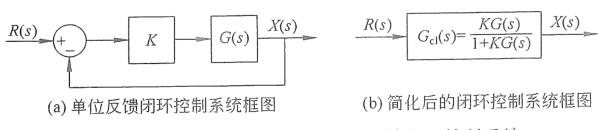
（a）单位反馈闭环控制系统框图；（b）简化后的闭环控制系统框图 图 8.1.1　根轨迹研究对象：单位反馈闭环控制系统

根轨迹研究的目标是闭环传递函数 $G_{\mathrm{cl}}(s)$ 极点的变化规律，而它的研究方法则是通过分析系统的开环传递函数 $G(s)$ 实现的。因此在使用根轨迹分析系统的时候，首先需要将控制系统转化为图 8.1.1 所示的标准形式后再进行处理。

请看下面的两个例子。

**例 8.1.1**　已知系统的闭环传递函数 $G_{\mathrm{cl}}(s)=\dfrac{Ks}{s^3+3s^2+Ks+1}$，将其转化为单位反馈形式并求其开环传递函数 $G(s)$。

**解：**单位反馈系统闭环传递函数的标准形式为

$$G_{\mathrm{cl}}(s)=\frac{KG(s)}{1+KG(s)}. \tag{8.1.1a}$$

将 $G_{\mathrm{cl}}(s)=\dfrac{Ks}{s^3+3s^2+Ks+1}$ 代入式（8.1.1a），可得

$$
\begin{aligned}
\frac{Ks}{s^3+3s^2+Ks+1}&=\frac{KG(s)}{1+KG(s)}\\
Ks(1+KG(s))&=(s^3+3s^2+Ks+1)KG(s)\\
Ks&=(s^3+3s^2+1)KG(s)\\
\Rightarrow\quad G(s)&=\frac{s}{s^3+3s^2+1}.
\end{aligned}\tag{8.1.1b}
$$

若要研究 $G_{\mathrm{cl}}(s)=1/(s^3+3s^2+Ks+1)$ 的极点随 $K$ 的变化，就要从 $G(s)=s/(s^3+3s^2+1)$ 入手分析。系统的简化框图与单位反馈闭环控制系统框图如图 8.1.2 所示。

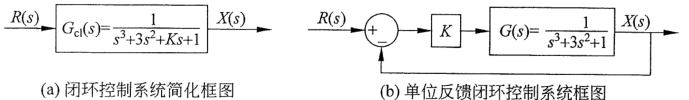
（a）闭环控制系统简化框图；（b）单位反馈闭环控制系统框图 图 8.1.2　例 8.1.1 图示

**例 8.1.2**　将图 8.1.3 所示的非单位反馈闭环控制系统转化为单位反馈闭环控制系统。

**解：**根据传递函数的代数性质，可得

$$
\begin{aligned}
X(s)&=(R(s)-H(s)X(s))KG(s)\\
\Rightarrow (1+H(s)KG(s))X(s)&=R(s)KG(s)\\
\Rightarrow X(s)&=\frac{R(s)KG(s)}{1+H(s)KG(s)}.
\end{aligned}\tag{8.1.2}
$$

其对应的单位反馈闭环控制系统框图如图 8.1.4 所示，因此需要通过 $G(s)H(s)$ 进行根轨迹分析。

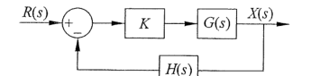
图 8.1.3　非单位反馈闭环控制系统框图

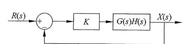
图 8.1.4　$X(s)=\dfrac{R(s)KG(s)}{1+H(s)KG(s)}$ 所对应的单位反馈闭环控制系统框图

## 8.2 根轨迹绘制的基本规则

8.1 节介绍了根轨迹的研究目标与研究方法，即通过分析开环传递函数 $G(s)$ 来分析闭环传递函数 $G_{\mathrm{cl}}(s)$ 特征方程的根（极点）随增益 $K$ 的变化规律。开环传递函数 $G(s)$ 可以写成

$$G(s)=\frac{N(s)}{D(s)}=\frac{(s-s_{z1})(s-s_{z2})\cdots(s-s_{zm})}{(s-s_{p1})(s-s_{p2})\cdots(s-s_{pn})}. \tag{8.2.1}$$

其中，$D(s)$ 和 $N(s)$ 表示开环传递函数 $G(s)$ 的分母和分子多项式。$s_{z1},s_{z2},\ldots,s_{zm}$ 表示 $G(s)$ 共含有 $m$ 个零点，在复平面中用“○”来表示。$s_{p1},s_{p2},\ldots,s_{pn}$ 表示 $G(s)$ 共含有 $n$ 个极点，极点在复平面中用“×”来表示。

下面介绍根轨迹的 6 个基本规则，为帮助读者理解，每一个规则都配有一个例子。

**规则 1：**如果 $n>m$，根轨迹在复平面上共有 $n$ 条分支。如果 $m>n$，根轨迹在复平面上共有 $m$ 条分支。

**例 8.2.1**　系统开环传递函数 $G(s)=\dfrac{s+2}{s^3+3s^2+1}$，判断其根轨迹分支数。

**解：**$G(s)$ 的分母是三阶的，有 $n=3$ 个极点。分子是一阶的，有 $m=1$ 个零点。因此 $n>m$，根据规则 1，根轨迹共有 $n=3$ 条分支。

**规则 2：**当 $n=m$ 时，随着 $K$ 从 0 增加到 $+\infty$，根轨迹从开环传递函数 $G(s)$ 的极点向零点移动。

求闭环传递函数 $G_{\mathrm{cl}}(s)$ 特征方程的根，令 $1+KG(s)=0$，代入 $G(s)=N(s)/D(s)$，得到

$$1+K\frac{N(s)}{D(s)}=0\quad\Rightarrow\quad D(s)+KN(s)=0. \tag{8.2.2}$$

观察式（8.2.2），当 $K=0$ 时，$D(s)=0$，此时的 $s$ 值是 $G(s)$ 的极点。而当 $K\to+\infty$ 时，$N(s)\to0$，此时的 $s$ 值是 $G(s)$ 的零点。所以当 $K$ 从 0 增加到 $+\infty$ 时，闭环传递函数的根轨迹将从 $G(s)$ 的极点向 $G(s)$ 的零点移动。

**例 8.2.2**　系统开环传递函数 $G(s)=\dfrac{s+1}{s+2}$，绘制闭环传递函数 $G_{\mathrm{cl}}(s)$ 的根轨迹。

**解：**$G(s)$ 的分母和分子多项式都是一阶的，有 $n=1$ 个极点 $s_{p1}=-2$ 和 $m=1$ 个零点 $s_{z1}=-1$。根据规则 1，根轨迹只有 $n=1$ 条分支。根据规则 2，根轨迹如图 8.2.1 所示，随着 $K$ 的增加，从极点 $s_{p1}=-2$ 向零点 $s_{z1}=-1$ 移动。

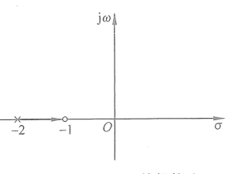
图 8.2.1　例 8.2.2 的根轨迹

**规则 3：**实轴上的根轨迹位于从右向左数第奇数个极点/零点的左边。

**例 8.2.3**　系统开环传递函数 $G(s)=\dfrac{(s+2)(s+4)}{(s+1)(s+3)}$，绘制闭环传递函数 $G_{\mathrm{cl}}(s)$ 的根轨迹。

**解：**$G(s)$ 有 $n=2$ 个极点，分别是 $s_{p1}=-1$ 和 $s_{p2}=-3$。有 $m=2$ 个零点，分别是 $s_{z1}=-2$ 和 $s_{z2}=-4$。根据规则 1，根轨迹有 $n=2$ 条分支。根据规则 2，根轨迹应该从 $G(s)$ 的极点移动到 $G(s)$ 的零点。此时的问题是根轨迹应该如何移动，是从 $s_{p1}$ 到 $s_{z1}$ 还是从 $s_{p1}$ 到 $s_{z2}$？这就需要使用规则 3。

首先将开环传递函数 $G(s)$ 的极点和零点都标在复平面上，并且从右向左将它们编号，如图 8.2.2（a）所示。右数第一个极点 $s_{p1}=-1$ 是奇数点，根据规则 3，根轨迹存在于它左边的实轴上，根据规则 2，其指向零点 $s_{z1}=-2$。

零点 $s_{z1}=-2$ 是在实轴上的从右边数的第二个点，是偶数点，根据规则 3，它左边的实轴上没有根轨迹。同理，从右数第三个点 $s_{p2}=-3$ 的左边实轴上也存在一条根轨迹。综上所述，其根轨迹如图 8.2.2（b）所示。

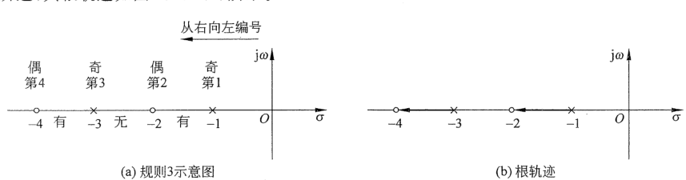
（a）规则 3 示意图；（b）根轨迹 图 8.2.2　例 8.2.3 的说明与根轨迹

**规则 4：**若复数根存在，则一定是共轭的，所以根轨迹相对于实轴对称。

**例 8.2.4**　系统开环传递函数 $G(s)=\dfrac{s^2+4}{s^2+2s+2}$，绘制闭环传递函数 $G_{\mathrm{cl}}(s)$ 的根轨迹。

**解：**$G(s)$ 有 $n=2$ 个极点 $s_{p1}=-1+\mathrm j$ 和 $s_{p2}=-1-\mathrm j$。有 $m=2$ 个零点 $s_{z1}=2\mathrm j$ 和 $s_{z2}=-2\mathrm j$。根据规则 1、规则 2 和规则 4，根轨迹有 $n=2$ 条对称于实轴的分支，其运行轨迹从极点指向零点，如图 8.2.3 所示。

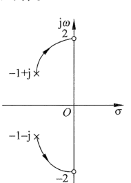
图 8.2.3　例 8.2.4 的根轨迹

**规则 5：**如果 $n>m$，则有 $(n-m)$ 条分支从极点指向无穷。如果 $n<m$，则有 $(m-n)$ 条分支从无穷指向零点。

**例 8.2.5a**　系统开环传递函数 $G(s)=\dfrac{s+2}{(s+1)(s+3)}$，绘制闭环传递函数 $G_{\mathrm{cl}}(s)$ 的根轨迹。

**解：**$G(s)$ 有 $n=2$ 个极点 $s_{p1}=-1$ 和 $s_{p2}=-3$。有 $m=1$ 个零点 $s_{z1}=-2$。根据规则 1，根轨迹有 $n=2$ 条分支。根据规则 2 和规则 3，其中的一条分支从极点 $s_{p1}=-1$ 指向零点 $s_{z1}=-2$。因为 $G(s)$ 的极点数多于零点数，即 $n>m$，根据规则 5，将会有 $n-m=1$ 条根轨迹的分支从 $s_{p2}=-3$ 指向无穷。$s_{p2}=-3$ 是从右边数在实轴上的第三个极点/零点（奇数点），根据规则 3，根轨迹一定在其左边的实轴上，因此这一条分支将从极点 $s_{p2}=-3$ 指向负无穷。其根轨迹如图 8.2.4（a）所示。

**例 8.2.5b**　系统开环传递函数 $G(s)=s+2$，绘制闭环传递函数 $G_{\mathrm{cl}}(s)$ 的根轨迹。

**解：**$G(s)$ 没有极点，$n=0$。只有 $m=1$ 个零点 $s_{z1}=-2$。根据规则 5，有一条根轨迹从无穷指向零点。根据规则 3，根轨迹在零点 $s_{z1}=-2$ 的左边实轴上。综上所述，其根轨迹如图 8.2.4（b）所示。

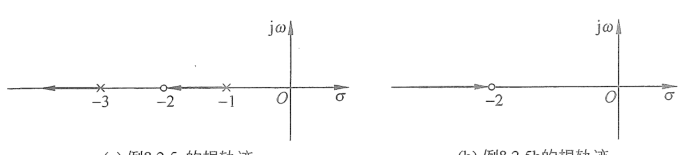
（a）例 8.2.5a 的根轨迹；（b）例 8.2.5b 的根轨迹 图 8.2.4　例 8.2.5 的根轨迹

**规则 6：**根轨迹沿着渐近线移动，渐近线与实轴的交点为

$$\sigma_a=\frac{\sum s_{pn}-\sum s_{zm}}{n-m}. \tag{8.2.3a}$$

渐近线与实轴的夹角为

$$
\theta=\frac{2q+1}{n-m}\pi,\qquad
q=\begin{cases}0,1,\ldots,n-m-1,&n>m,\\0,1,\ldots,m-n-1,&n<m.\end{cases} \tag{8.2.3b}
$$

**例 8.2.6**　系统开环传递函数 $G(s)=\dfrac{1}{(s+1)(s+2)}$，绘制闭环传递函数 $G_{\mathrm{cl}}(s)$ 的根轨迹。

**解：**$G(s)$ 有 $n=2$ 个极点 $s_{p1}=-1$ 和 $s_{p2}=-2$，$m=0$ 个零点。根据规则 5，将有 $n-m=2$ 条根轨迹分支从 $G(s)$ 的两个极点分别指向无穷。根据规则 3，根轨迹在实轴上存在于这两个极点之间。这意味着两条根轨迹分支将分别从两个极点出发，沿着实轴相向而行，汇聚后沿着一定的渐近线向无穷移动。通过规则 6，可以得到渐近线与实轴的交点为

$$\sigma_a=\frac{-1-2-0}{2-0}=-1.5. \tag{8.2.4a}$$

渐近线与实轴的夹角为

$$
\theta=\frac{2q+1}{2-0}\pi,\quad q=0,1
\quad\Rightarrow\quad
\begin{cases}\theta_1=\dfrac12\pi,\\\theta_2=\dfrac32\pi=-\dfrac12\pi.\end{cases} \tag{8.2.4b}
$$

根据式（8.2.4a）和式（8.2.4b），得到渐近线的位置与方向，如图 8.2.5 所示。其根轨迹将沿着渐近线指向无穷。

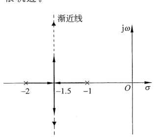
图 8.2.5　例 8.2.6 的根轨迹

最后，使用上述 6 个规则分析一个综合的例子。

**例 8.2.7**　系统开环传递函数 $G(s)=\dfrac{s+1}{s(s+2)(s+3)(s+4)}$，绘制闭环传递函数 $G_{\mathrm{cl}}(s)$ 的根轨迹。

**解：**$G(s)$ 有 $n=4$ 个极点 $s_{p1}=0$、$s_{p2}=-2$、$s_{p3}=-3$ 和 $s_{p4}=-4$。有 $m=1$ 个零点 $s_{z1}=-1$。根据规则 1，根轨迹一共有 $n=4$ 条分支。

首先将所有极点/零点标注在复平面上并从右向左编号，如图 8.2.6 所示。根据规则 2 和规则 3，$s_{p1}=0$ 与 $s_{z1}=-1$ 之间有一条根轨迹，并且由极点 $s_{p1}=0$ 指向 $s_{z1}=-1$。$s_{p2}=-2$ 与 $s_{p3}=-3$ 之间的实轴上也存在根轨迹。另外，在 $s_{p4}=-4$ 的左边实轴上也存在一条根轨迹。

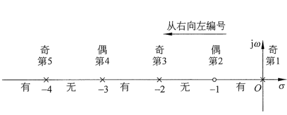
图 8.2.6　例 8.2.7 的极点/零点分布与根轨迹分布

根据规则 5，将有 $n-m=3$ 条根轨迹指向无穷。利用规则 6 计算其渐近线，可得渐近线与实轴的交点为

$$\sigma_a=\frac{0-2-3-4-(-1)}{4-1}=-\frac83. \tag{8.2.5a}$$

渐近线与实轴的夹角为

$$
\theta=\frac{2q+1}{4-1}\pi,\quad q=0,1,2
\Rightarrow
\begin{cases}\theta_1=\dfrac13\pi,\\\theta_2=\pi,\\\theta_3=\dfrac53\pi=-\dfrac13\pi.\end{cases} \tag{8.2.5b}
$$

其中，与实轴夹角为 $\theta_2=\pi$ 的渐近线是从 $s_{p4}=-4$ 沿着实轴指向负无穷的根轨迹分支。而另外两条渐近线与实轴的交点在 $\sigma_a=-8/3$，夹角 $\theta_{1,3}=\pm\pi/3$。这意味着将有两条根轨迹分支从 $s_{p2}=-2$ 和 $s_{p3}=-3$ 出发，沿着实轴相向而行，汇聚后再沿着渐近线移动，指向无穷。其根轨迹及渐近线如图 8.2.7 所示。

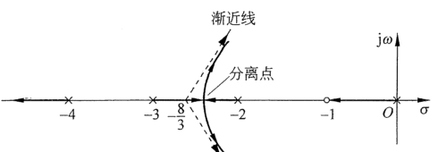
图 8.2.7　例 8.2.7 的根轨迹

根据规则 4，从 $s_{p2,3}$ 出发的两条根轨迹分支汇聚后将同时离开实轴。离开实轴的这个点称为分离点（Breakaway Point）。通过下面的例子介绍分离点的计算方法。

**例 8.2.8**　使用根轨迹的方法验证二阶系统（如图 8.2.8 所示）中的阻尼比 $\zeta$ 对系统的作用（其中，$\omega_n>0$）。

**解：**将图 8.2.8 中的动态系统传递函数考虑为一个控制系统的闭环传递函数，并令 $K=\zeta$，得到

$$G_{\mathrm{cl}}(s)=\frac{2K\omega_ns}{s^2+2K\omega_ns+\omega_n^2}. \tag{8.2.6}$$

为分析其根轨迹，需要找到 $G_{\mathrm{cl}}(s)$ 所对应的开环系统传递函数。根据例 8.1.1，将闭环传递函数标准形式 $G_{\mathrm{cl}}(s)=KG(s)/(1+KG(s))$ 代入式（8.2.6），得到

$$
\begin{aligned}
\frac{KG(s)}{1+KG(s)}&=\frac{2K\omega_ns}{s^2+2K\omega_ns+\omega_n^2}\\
2K\omega_ns(1+KG(s))&=(s^2+2K\omega_ns+\omega_n^2)KG(s)\\
2K\omega_ns&=(s^2+\omega_n^2)KG(s)\\
\Rightarrow G(s)&=\frac{2\omega_ns}{s^2+\omega_n^2}.
\end{aligned}\tag{8.2.7}
$$

其对应的单位反馈闭环控制系统框图如图 8.2.9 所示。

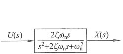
图 8.2.8　二阶系统框图

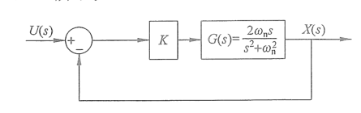
图 8.2.9　二阶系统转化单位反馈闭环控制系统框图

分析其根轨迹，$G(s)$ 有 $n=2$ 个极点 $s_{p1}=\mathrm j\omega_n$ 和 $s_{p2}=-\mathrm j\omega_n$，有 $m=1$ 个零点 $s_{z1}=0$。根据规则 1，根轨迹共有 $n=2$ 条分支。根据规则 2 和规则 5，将有 $n-m=1$ 条根轨迹分支从极点指向零点，另一条从极点指向无穷。根据规则 3，零点 $s_{z1}=0$ 的左边实轴上存在根轨迹。根据规则 4，根轨迹关于实轴对称。综上所述，它的根轨迹如图 8.2.10 所示，两条分支分别从两个极点开始，呈对称形状向实轴移动，汇聚在实轴上某一点之后一条指向零点，另一条指向负无穷。下面来分析计算汇合点（Break-in Point）的位置。

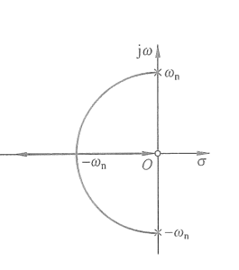
图 8.2.10　开环传递函数为 $G(s)=\dfrac{2\omega_ns}{s^2+\omega_n^2}$ 的根轨迹

根据式（8.2.6），当闭环传递函数分母为 0 时，可得 $s^2+2K\omega_ns+\omega_n^2=0$，即

$$K=-\frac{s^2+\omega_n^2}{2\omega_ns}. \tag{8.2.8}$$

在式（8.2.8）中，可以认为 $K$ 是以 $s$ 为自变量的函数，其中，$s=\sigma+\mathrm j\omega$ 是一个复数。当 $s$ 位于实轴时（$\mathrm j\omega=0$），$K$ 就是以 $\sigma$ 为自变量的一个函数。式（8.2.8）可以写成

$$K(\sigma)=-\frac{\sigma^2+\omega_n^2}{2\omega_n\sigma}. \tag{8.2.9}$$

求 $K(\sigma)$ 的极值，令

$$\frac{\mathrm dK(\sigma)}{\mathrm d\sigma}=0. \tag{8.2.10}$$

满足式（8.2.10）的 $\sigma$ 就是汇合点，这是因为此时 $\sigma$ 代表了 $s$ 在实轴上的极限位置。将式（8.2.9）代入式（8.2.10），可得

$$
\frac{\mathrm d\left(-\dfrac{\sigma^2+\omega_n^2}{2\omega_n\sigma}\right)}{\mathrm d\sigma}=0
\quad\Rightarrow\quad \sigma=\pm\omega_n. \tag{8.2.11a}
$$

根据图 8.2.10，汇合点在虚轴的左边，所以取 $\sigma=-\omega_n$。将其代入式（8.2.9），可得

$$K(\sigma=-\omega_n)=-\frac{(-\omega_n)^2+\omega_n^2}{2\omega_n(-\omega_n)}=1. \tag{8.2.11b}$$

式（8.2.11b）说明实轴上的汇合点位置在 $\sigma=-\omega_n$ 上，此时 $K=1$。根据前面的定义，$K$ 就是二阶系统的阻尼比，即 $K=\zeta$。如图 8.2.10 所示，当 $K=\zeta=0$ 时，闭环传递函数有两个纯虚数根，对应无阻尼二阶系统。当 $1>K=\zeta>0$ 时，闭环传递函数有两个共轭的复数根，对应于欠阻尼系统。当 $K=1$ 时，对应于临界阻尼系统。当 $K=\zeta>1$ 时，闭环传递函数有两个实根，对应于过阻尼系统。

通过上述例子，我们将二阶系统的时域响应（第 5 章）、系统稳定性分析（第 6 章）及本章的根轨迹分析结合起来，请读者将上述分析与图 6.2.2 及图 5.3.4 进行比较思考。

分离点的计算方法和分析与汇合点一样，故不再赘述。值得注意的是，在分析分离/汇合点时，关注的重点应该放在 $K$ 的取值上，即 $K$ 等于多少的时候闭环传递函数的极点会进入（离开）实轴。当闭环传递函数的极点存在共轭复数根的时候，系统将会产生振动。在掌握了分离/汇合点的信息后，就可以调节增益避免或利用系统的振动。

根轨迹内容请扫描此二维码观看。

## 8.3 根轨迹的几何性质

本节将讨论根轨迹的几何性质，首先来复习复数的三种表达形式。

（1）代数形式：$z=\sigma+\mathrm j\omega$，其中，$\mathrm j=\sqrt{-1}$，是虚数单位；$\sigma$ 是复数的实部；$\omega$ 是复数的虚部。

（2）向量形式（如图 8.3.1 所示）：通过复数的复角 $\varphi$（相位）和模 $M$（绝对值）来表达。根据三角形的几何关系，其中 $\varphi=\angle z=\arctan(\omega/\sigma)$，$M=|z|=\sqrt{\sigma^2+\omega^2}$，$\varphi$ 以逆时针方向为正。

（3）指数形式：由图 8.3.1 的几何关系可得 $\sigma=M\cos\varphi$，$\omega=M\sin\varphi$。所以 $z=\sigma+\mathrm j\omega=M(\cos\varphi+\mathrm j\sin\varphi)$。根据欧拉公式（Euler's Formula）：$\cos\varphi+\mathrm j\sin\varphi=e^{\mathrm j\varphi}$，可得 $z=Me^{\mathrm j\varphi}$。

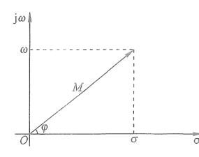
图 8.3.1　复数的三种表达形式

根据上述定义，两个复数 $z_1=\sigma_1+\mathrm j\omega_1=M_1e^{\mathrm j\varphi_1}$ 和 $z_2=\sigma_2+\mathrm j\omega_2=M_2e^{\mathrm j\varphi_2}$ 相乘得到

$$z_1z_2=M_1M_2e^{\mathrm j(\varphi_1+\varphi_2)}. \tag{8.3.1a}$$

它们的比值为

$$\frac{z_1}{z_2}=\frac{M_1}{M_2}e^{\mathrm j(\varphi_1-\varphi_2)}. \tag{8.3.1b}$$

根据式（8.3.1），当 $s=\sigma+\mathrm j\omega$ 时，传递函数 $G(s)=N(s)/D(s)$ 的模为

$$M=|G(s=\sigma+\mathrm j\omega)|=\left.\frac{\prod|\text{零点到 }s\text{ 的距离}|}{\prod|\text{极点到 }s\text{ 的距离}|}\right|_{s=\sigma+\mathrm j\omega}. \tag{8.3.2a}$$

复角为

$$\varphi=\angle G(s=\sigma+\mathrm j\omega)=\left.\left(\sum\text{零点到 }s\text{ 的夹角}-\sum\text{极点到 }s\text{ 的夹角}\right)\right|_{s=\sigma+\mathrm j\omega}. \tag{8.3.2b}$$

为了进一步理解式（8.3.2），请参考以下例子。

**例 8.3.1**　求当 $s=-1+\sqrt3\mathrm j$ 时传递函数 $G(s)=\dfrac{s+2}{s(s+1)}$ 的值。

**解：方法一：**直接将 $s=-1+\sqrt3\mathrm j$ 代入，可得

$$G(s=-1+\sqrt3\mathrm j)=\frac{-1+\sqrt3\mathrm j+2}{(-1+\sqrt3\mathrm j)(-1+\sqrt3\mathrm j+1)}=-\frac12-\frac{\sqrt3}{6}\mathrm j. \tag{8.3.3a}$$

它在复平面上的表达如图 8.3.2（a）所示，其模为

$$M=|G(s)|=\sqrt{\left(-\frac12\right)^2+\left(-\frac{\sqrt3}{6}\right)^2}=\frac{\sqrt3}{3}. \tag{8.3.3b}$$

复角为

$$\varphi=-\frac56\pi. \tag{8.3.3c}$$

将其写成指数形式为

$$G(s=-1+\sqrt3\mathrm j)=Me^{\mathrm j\varphi}=\frac{\sqrt3}{3}e^{-\frac56\pi\mathrm j}. \tag{8.3.3d}$$

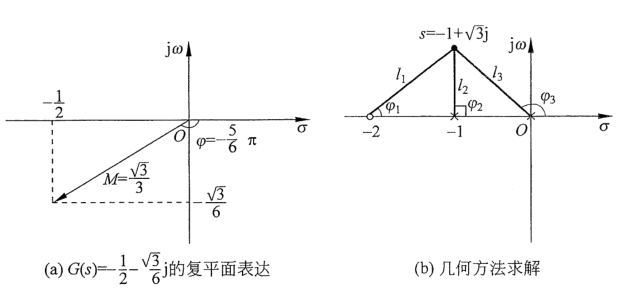
（a）$G(s)=-\dfrac12-\dfrac{\sqrt3}{6}\mathrm j$ 的复平面表达；（b）几何方法求解 图 8.3.2　例 8.3.1 图示

**方法二：**使用几何方法和式（8.3.2），首先将 $G(s)$ 的极点 $s_{p1}=0$、$s_{p2}=-1$ 和零点 $s_{z1}=-2$ 及 $s=-1+\sqrt3\mathrm j$ 标记在图 8.3.2（b）中，之后将极点/零点与该点连接起来。根据几何关系，可得 $l_1=2$、$l_2=\sqrt3$、$l_3=2$、$\varphi_1=\pi/3$、$\varphi_2=\pi/2$、$\varphi_3=2\pi/3$。代入式（8.3.2），可得

$$M=|G(s)|=\frac{l_1}{l_2l_3}=\frac{2}{\sqrt3\times2}=\frac{\sqrt3}{3}, \tag{8.3.4a}$$

$$\varphi=\varphi_1-\varphi_2-\varphi_3=\frac\pi3-\frac\pi2-\frac{2\pi}{3}=-\frac{5\pi}{6}. \tag{8.3.4b}$$

将其写成指数形式，与式（8.3.3d）所得结果一致。

以上性质可以用来判断给定值 $s=\sigma+\mathrm j\omega$ 是否为 $G_{\mathrm{cl}}(s)$ 的根（极点），这对增益调节及控制器的设计非常重要。令闭环传递函数 $G_{\mathrm{cl}}(s)=KG(s)/(1+KG(s))$ 的分母等于 0，可以得到它的特征方程的根（极点），即

$$1+KG(s)=0\quad\Rightarrow\quad KG(s)=-1. \tag{8.3.5}$$

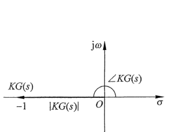
图 8.3.3　$KG(s)=-1$ 复平面表达

根据图示的几何关系，可得

$$|KG(s)|=1, \tag{8.3.6a}$$

$$\angle KG(s)=-(2q+1)\pi,\qquad q=\pm0,\pm1,\pm2,\ldots. \tag{8.3.6b}$$

因为增益 $K$ 是一个常数，因此不会改变复数 $KG(s)$ 的复角，所以式（8.3.6b）可以写成

$$\angle G(s)=-(2q+1)\pi,\qquad q=\pm0,\pm1,\pm2,\ldots. \tag{8.3.7}$$

式（8.3.7）将被用来判断给定值 $s=\sigma+\mathrm j\omega$ 是否在 $G_{\mathrm{cl}}(s)$ 的根轨迹上，请看下面的例子。

**例 8.3.2**　系统开环传递函数 $G(s)=\dfrac1{(s+1)(s+3)}$，利用根轨迹的几何性质判断 $s_1=-2-\mathrm j$ 和 $s_2=-3+2\sqrt3\mathrm j$ 是否在闭环传递函数 $G_{\mathrm{cl}}(s)$ 的根轨迹上。

**解：**首先将 $G(s)$ 的极点 $s_{p1}=-1$、$s_{p2}=-3$ 以及给定点标记在图 8.3.4 中，之后将极点与给定点连接起来。

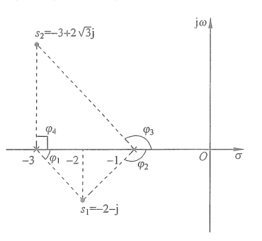
图 8.3.4　例 8.3.2 图示

如图 8.3.4 所示，根据几何性质可得 $\varphi_1=-\pi/4$、$\varphi_2=-3\pi/4$、$\varphi_3=2\pi/3$、$\varphi_4=\pi/2$。

判断 $s_1=-2-\mathrm j$ 点，代入式（8.3.4b），得到

$$\angle G(s_1)=0-(\varphi_1+\varphi_2)=\frac\pi4+\frac{3\pi}{4}=\pi. \tag{8.3.8}$$

满足式（8.3.7），因此 $s_1=-2-\mathrm j$ 在 $G_{\mathrm{cl}}(s)$ 的根轨迹上。

判断 $s_2=-3+2\sqrt3\mathrm j$ 点，代入式（8.3.4b），得到

$$\angle G(s_2)=0-(\varphi_3+\varphi_4)=-\left(\frac{2\pi}{3}+\frac\pi2\right)=-\frac{7\pi}{6}. \tag{8.3.9}$$

不满足式（8.3.7），因此 $s_2=-3+2\sqrt3\mathrm j$ 不在 $G_{\mathrm{cl}}(s)$ 的根轨迹上。这意味着无论增益 $K$ 如何调节，$G_{\mathrm{cl}}(s)$ 的极点都无法位于 $s_2$ 上。但我们可以设计控制器改变 $G_{\mathrm{cl}}(s)$ 的根轨迹，使它包含给定的 $s_2$，请看 8.4 节分析。

## 8.4 基于根轨迹的控制器设计

本节将利用根轨迹的几何性质设计控制器［在根轨迹理论中称为补偿器（Compensator）］，通过增加开环传递函数 $G(s)$ 的零点/极点来改变闭环传递函数 $G_{\mathrm{cl}}(s)$ 的根轨迹，从而改变系统的动态响应。

### 8.4.1 比例微分控制

将例 8.3.2 中所描述的系统表达为单位反馈控制系统的标准形式，如图 8.4.1 所示，它同时也是一个比例控制系统。

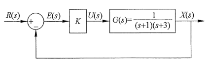
图 8.4.1　比例控制的系统框图

绘制闭环传递函数 $G_{\mathrm{cl}}(s)$ 的根轨迹，$G(s)=1/[(s+1)(s+3)]$ 有 $n=2$ 个极点，分别是 $s_{p1}=-1$ 和 $s_{p2}=-3$，有 $m=0$ 个零点。根据规则 5，根轨迹有 $n-m=2$ 条分支指向无穷。根据规则 6，其渐近线与实轴的交点为

$$\sigma_a=\frac{\sum s_{pn}-\sum s_{zm}}{n-m}=\frac{-1-3}{2-0}=-2, \tag{8.4.1a}$$

夹角为

$$
\theta=\frac{2q+1}{n-m}\pi=\frac{2q+1}{2-0}\pi,\quad q=0,1
\Rightarrow
\begin{cases}\theta_1=\dfrac12\pi,\\\theta_2=\dfrac32\pi=-\dfrac12\pi.\end{cases} \tag{8.4.1b}
$$

其根轨迹如图 8.4.2（a）所示，如例 8.3.2 所分析的，$s=-2-\mathrm j$ 在其根轨迹上。

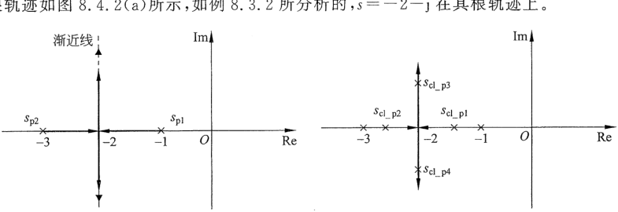
（a）$G(s)=1/[(s+1)(s+3)]$ 的根轨迹；（b）闭环传递函数极点 图 8.4.2　系统的根轨迹及闭环传递函数极点分布

进一步分析系统的时间响应，当增益 $K$ 比较小的时候，闭环传递函数有两个小于零的实数极点。例如当 $K=0.5$ 时，闭环传递函数所对应的两个实数根为 $s_{\mathrm{cl\_p1}}=-1.29$ 和 $s_{\mathrm{cl\_p2}}=-2.71$［如图 8.4.2（b）所示，可以通过 $1+KG(s)=0$ 求解］。当单位阶跃 $r(t)=1$（拉普拉斯变换为 $R(s)=1/s$）作用在系统上时，其输出 $x(t)$ 为

$$x(t)=1+C_1e^{s_{\mathrm{cl\_p1}}t}+C_2e^{s_{\mathrm{cl\_p2}}t}=1+C_1e^{-1.29t}+C_2e^{-2.71t}. \tag{8.4.2}$$

其中，$C_1$ 和 $C_2$ 是两个常数，读者可以自行计算（参考第 5 章），然而这里我们并不需要 $C_1$ 和 $C_2$ 的精确数据就可以分析系统。式（8.4.2）由三部分相加而成，其中，1 是一个常数，来自参考输入 $R(s)=1/s$，而另外两项都会随着时间的增加趋于 0。同时，因为 $|s_{\mathrm{cl\_p1}}|<|s_{\mathrm{cl\_p2}}|$，所以 $C_1e^{-1.29t}$ 的收敛速度要慢于 $C_2e^{-2.71t}$。因此，它们相加后的结果 $x(t)$ 的收敛速度是由 $C_1e^{-1.29t}$ 决定的，所以 $s_{\mathrm{cl\_p1}}=-1.29$ 称为主导极点（Dominant Pole），主导极点更靠近虚轴。

随着 $K$ 的增加，$G_{\mathrm{cl}}(s)$ 的根轨迹将离开实轴向无穷移动。当 $K=2$ 时，$G_{\mathrm{cl}}(s)$ 的两个极点分别为 $s_{\mathrm{cl\_p3,4}}=-2\pm\mathrm j$，如图 8.4.2（b）所示。此时若对其施加一个单位阶跃，系统的输出为

$$x(t)=1+C_3e^{-2t}\sin(\omega t+\varphi). \tag{8.4.3}$$

$C_3$ 和 $\varphi$ 的计算留给读者自己完成（参考第 5 章）。

式（8.4.2）和式（8.4.3）说明输出 $x(t)$ 的收敛速度与闭环传递函数极点的实部相关（这一结论在第 4 章、第 5 章和第 6 章中反复出现过）。根据图 8.4.2，无论如何增大 $K$ 值，$G_{\mathrm{cl}}(s)$ 极点的实部最小值 $\sigma_{\min}=-2$，这意味着系统最快沿着 $e^{-2t}$ 这条渐近线收敛。因此，若要改变系统的响应速度，就需要改变其根轨迹。这可以通过串联控制器/补偿器来实现。若可以将闭环传递函数的极点置于 $s=-3\pm2\sqrt3\mathrm j$ 上，那么系统的响应就会沿着渐近线 $e^{-3t}$ 收敛。

在例 8.3.2 中，我们利用根轨迹的几何性质证明了 $s=-3+2\sqrt3\mathrm j$ 不在 $G_{\mathrm{cl}}(s)$ 的根轨迹上，因为

$$\angle G(s=-3+2\sqrt3\mathrm j)=-\left(\frac{2\pi}{3}+\frac\pi2\right)=-\frac{7\pi}{6}, \tag{8.4.4}$$

不满足式（8.3.7）。若要满足式（8.3.7），需要在式（8.4.4）中补充 $+\pi/6$，最简单的做法是为开环传递函数 $G(s)$ 增加一个零点，令其到 $s=-3+2\sqrt3\mathrm j$ 的夹角为 $\pi/6$。根据几何关系可以求得此零点位置为 $s_{z1}=-9$，如图 8.4.3 所示。此时总复角为 $\pi/6-(2\pi/3+\pi/2)=-\pi$，满足式（8.3.7）。

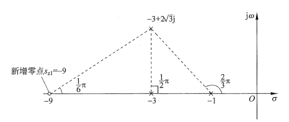
图 8.4.3　增加一个零点 $s_{z1}=-9$ 使得 $s=-3+2\sqrt3\mathrm j$ 在 $G_{\mathrm{cl}}(s)$ 的根轨迹上

此新增加的控制器对应的传递函数为 $C(s)=s+9$，它被串联在原控制系统中，如图 8.4.4 所示。此时，控制量 $U(s)$ 为

$$U(s)=E(s)KC(s)=K(sE(s)+9E(s)), \tag{8.4.5a}$$

所对应的时域表达为

$$u(t)=K\left(\frac{\mathrm de(t)}{\mathrm dt}+9e(t)\right). \tag{8.4.5b}$$

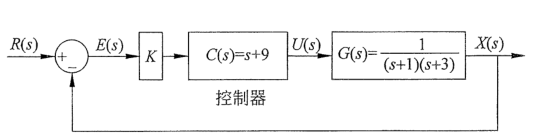
图 8.4.4　加入控制器 $C(s)$ 后的系统框图

式（8.4.5b）描述了一个比例微分（Proportional Derivative，PD）控制器。加入控制器后，控制系统的开环传递函数为 $C(s)G(s)$。闭环传递函数 $G_{\mathrm{cl}}(s)=KC(s)G(s)/(1+KC(s)G(s))$ 的根轨迹如图 8.4.5 所示。正如我们所设计的，根轨迹过目标点 $s=-3\pm2\sqrt3\mathrm j$。同时，图 8.4.5 说明随着 $K$ 的增加，$G_{\mathrm{cl}}(s)$ 的极点会继续向左移动，其收敛速度仍有提高的空间。

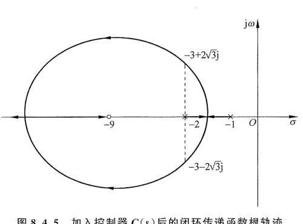
图 8.4.5　加入控制器 $C(s)$ 后的闭环传递函数根轨迹

### 8.4.2 超前补偿器

使用 PD 控制可以提高系统的响应速度，从物理意义角度考虑，微分项与误差的变化率 $\mathrm de(t)/\mathrm dt$ 成正比，因此可以“预测”误差的变化趋势并提前做出反应。需要说明的是，PD 控制具有两个明显的缺陷：第一，PD 控制器需要额外的能量来源，无法通过被动元件实现；第二，PD 控制器会放大高频噪声。以上两点的详细说明参考 9.5 节。

引入超前补偿器（Lead Compensator）可以避免 PD 控制的缺陷，其表达为

$$C(s)=\frac{s-s_{zc}}{s-s_{pc}}. \tag{8.4.6}$$

其中，$s_{pc}<s_{zc}<0$。超前补偿器的设计思路是同时为系统增加一个极点和一个零点，且零点的位置比极点更加靠近虚轴。针对 8.4.1 节的例子，新增的这一对极点/零点如图 8.4.6 所示，只需要保障 $\varphi_z-\varphi_p=\pi/6$，便可以满足式（8.3.7）中 $\varphi_z-(\varphi_p+2\pi/3+\pi/2)=-\pi$ 的条件。加入超前补偿器后的系统框图如图 8.4.7（a）所示。

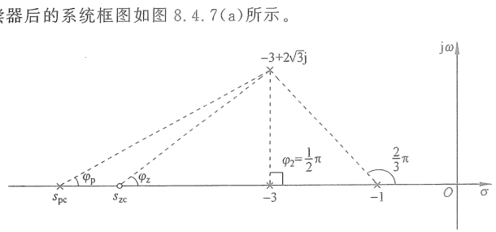
图 8.4.6　超前补偿器的设计思路

根据图 8.4.6，在使用超前补偿器后，闭环传递函数的根轨迹必然存在着一条分支从新增加的极点 $s_{pc}$ 指向零点 $s_{zc}$，而另外两条根轨迹将从原开环传递函数极点 $s_{p1}=-1$ 和 $s_{p2}=-3$ 出发，在实轴相会并沿着渐近线指向无穷。其渐近线与实轴的交点为

$$\sigma_a=\frac{-1-3+s_{pc}-s_{zc}}{3-1}=-2+\frac{s_{pc}-s_{zc}}2<-2, \tag{8.4.7a}$$

夹角为

$$\theta=\frac{2q+1}{3-1}\pi,\quad q=0,1
\Rightarrow\begin{cases}\theta_1=\dfrac12\pi,\\\theta_2=-\dfrac12\pi.\end{cases} \tag{8.4.7b}$$

其根轨迹如图 8.4.7（b）所示。比较图 8.4.7（b）和图 8.4.2（a），可以发现渐近线与实轴的交点在超前补偿器的作用下被“拉向远离虚轴的方向”，因此提高了系统的响应速度。

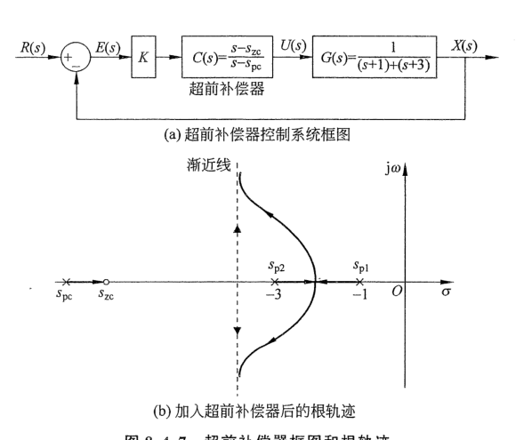
（a）超前补偿器控制系统框图；（b）加入超前补偿器后的根轨迹 图 8.4.7　超前补偿器框图和根轨迹

超前补偿器内容请扫描此二维码观看。

### 8.4.3 滞后补偿器

一个含有补偿器的反馈闭环控制系统标准形式如图 8.4.8 所示。其误差 $E(s)$ 可以表达为

$$E(s)=R(s)-X(s)=R(s)-E(s)C(s)KG(s)\quad\Rightarrow\quad E(s)=\frac{R(s)}{1+C(s)KG(s)}. \tag{8.4.8}$$

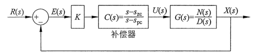
图 8.4.8　含有补偿器的反馈闭环控制系统

在参考值 $r(t)=1$（单位阶跃，其拉普拉斯变换为 $R(s)=1/s$）的作用下，将 $C(s)=(s-s_{zc})/(s-s_{pc})$ 和 $G(s)=N(s)/D(s)$ 代入式（8.4.8），可得

$$E(s)=\frac{\dfrac1s}{1+\dfrac{s-s_{zc}}{s-s_{pc}}K\dfrac{N(s)}{D(s)}}. \tag{8.4.9}$$

对式（8.4.9）使用终值定理，得到

$$
\begin{aligned}
e_{\mathrm{ss}}&=\lim_{t\to\infty}e(t)=\lim_{s\to0}sE(s)\\
&=\frac{1}{1+\dfrac{-s_{zc}}{-s_{pc}}K\dfrac{N(0)}{D(0)}}
=\frac{D(0)}{D(0)+KN(0)\dfrac{s_{zc}}{s_{pc}}}.
\end{aligned}\tag{8.4.10}
$$

式（8.4.10）说明 $s_{zc}/s_{pc}$ 越大，$e_{\mathrm{ss}}$ 就越小。因此设计补偿器 $C(s)$ 中的 $s_{zc}<s_{pc}<0$，便可以达到缩小稳态误差的目标。此时，补偿器的极点 $s_{pc}$ 在复平面上的位置比零点 $s_{zc}$ 更靠近虚轴，这与 8.4.2 节介绍的超前补偿器相反，称为滞后补偿器（Lag Compensator）（在 9.5.2 节将说明超前和滞后的命名原因）。

分析式（8.4.10），可发现当 $s_{zc}/s_{pc}\to\infty$ 时，$e_{\mathrm{ss}}=0$。此时，$s_{pc}=0\Rightarrow C(s)=(s-s_{zc})/s=1-s_{zc}/s$，这便是 7.3 节中所介绍的比例积分控制器。

考虑控制系统的开环传递函数为 $G(s)=1/[(s+1)(s+3)]$，在不使用补偿器的情况下（即 $C(s)=1$ 时），计算 $K=2$ 时图 8.4.8 所示系统的稳态误差，可得

$$e_{\mathrm{ss}}=\frac{1}{1+KG(0)}=\frac{1}{1+2\times\dfrac13}=0.6. \tag{8.4.11}$$

若要缩小 $e_{\mathrm{ss}}$，可以为系统串联一个滞后补偿器。将 $G(s)=1/[(s+1)(s+3)]$ 代入式（8.4.10），可得

$$e_{\mathrm{ss}}=\frac{3}{3+2\dfrac{s_{zc}}{s_{pc}}}. \tag{8.4.12}$$

当选择 $s_{zc}/s_{pc}=5$ 时，系统的稳态误差将缩小到 $e_{\mathrm{ss}}=3/13=0.23$。此时可以有不同的选择，例如：$C_1(s)=(s+5)/(s+1)$，其中 $s_{zc}=-5$、$s_{pc}=-1$；或者 $C_2(s)=(s+0.5)/(s+0.1)$，其中 $s_{zc}=-0.5$、$s_{pc}=-0.1$。这两种选择都可以将稳态误差缩小到 0.23。它们各自所对应的控制系统框图与根轨迹如图 8.4.9 所示。

在实践中，一般会选择 $C_2(s)=(s+0.5)/(s+0.1)$。虽然这两个补偿器新增加的极点与零点都是相差了 5 倍，但是 $C_2(s)$ 中的极点/零点距离虚轴更近。对比图 8.4.9（b）与图 8.4.2，可以发现它和原系统的根轨迹图非常相似（仅仅增加了一条从 $s_{pc}=-0.1$ 指向 $s_{zc}=-0.5$ 的分支）。而使用了 $C_1(s)=(s+5)/(s+1)$ 后，根轨迹形状发生了较大的改变。

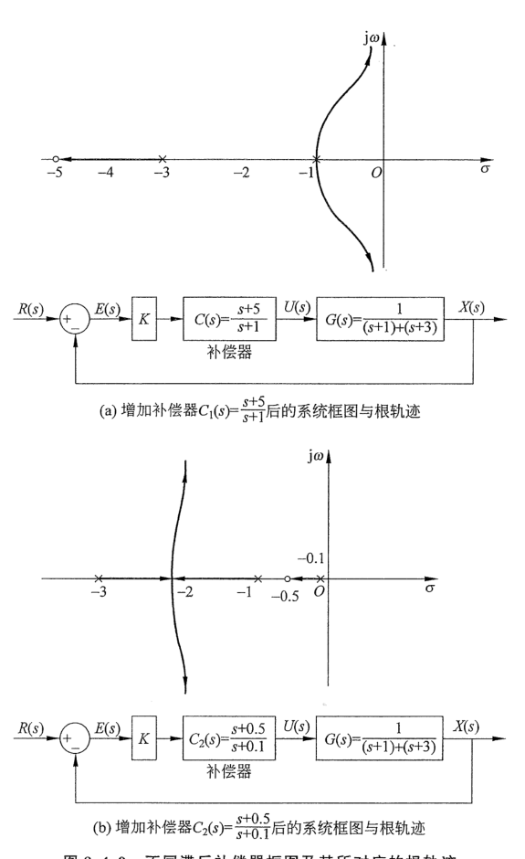
（a）增加补偿器 $C_1(s)=(s+5)/(s+1)$ 后的系统框图与根轨迹；（b）增加补偿器 $C_2(s)=(s+0.5)/(s+0.1)$ 后的系统框图与根轨迹 图 8.4.9　不同滞后补偿器框图及其所对应的根轨迹

图 8.4.10 显示了在单位阶跃输入作用下，不使用补偿器、使用补偿器 $C_1(s)$ 及使用补偿器 $C_2(s)$ 下的系统输出 $x(t)$ 随时间的变化。当使用滞后补偿器之后，系统输出 $x(t)$ 的稳态误差从 0.6 下降至 0.23。同时可以看出，使用 $C_2(s)$ 的系统输出在开始阶段的表现与原系统保持一致，之后补偿器会“慢慢”地修正稳态误差。而使用了 $C_1(s)$ 的系统输出则有完全不同的表现。

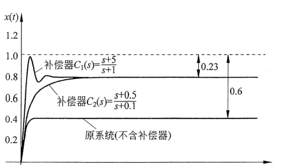
图 8.4.10　不同滞后补偿器所对应的系统输出

滞后补偿器内容请扫描此二维码观看。

## 8.5 比例积分微分（PID）控制器

本书的 7.3 节介绍了比例积分控制器，8.4.1 节介绍了比例微分控制。将它们二者结合在一起就形成了控制领域中著名的比例积分微分（PID）控制器。PID 控制器是非常符合人类直觉的控制方法。它的发现来自对水手掌舵的观察，人们发现水手在控制船舶时不只是依赖目前的误差，也会考虑过去的误差以及误差的变化趋势。相信各位读者在生活中会不自觉地使用到这种控制方法来做事情。如图 8.5.1 所示，在浴缸中放洗澡水的时候，通过控制一个旋钮来控制出水口的温度，从而控制浴缸里面水的温度。

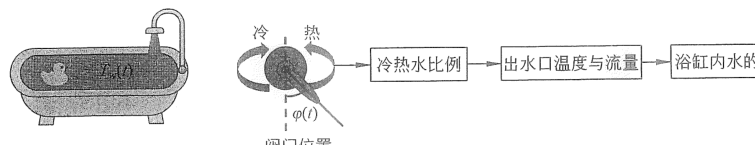
图 8.5.1　PID 控制举例——浴缸水温控制

控制系统的控制量是旋钮的角度 $u(t)=\varphi(t)$，系统的输出为浴缸中的水温 $x(t)=T_w(t)$。控制的目标则是把水温稳定到一个舒服的温度，即参考值 $r(t)$。参考值减去实际水温得到误差 $e(t)$，$e(t)=r(t)-x(t)$。图 8.5.1 说明控制量与输出之间存在着很多的中间过程，包含了复杂的物理变化：旋钮改变阀门的位置，从而改变冷热水的比例，而冷热水的比例决定了出水口的温度与流量，新注入浴缸的水与浴缸内已有的水混合之后才是最终的输出。如果对这一过程进行数学建模，就要包含动力学和热力学的模型。请读者思考一下自己在洗澡的时候，是否考虑过这些中间过程？我相信是没有的，相反，我们会通过一种直观的控制方式来完成水温的调节，即

$$u(t)=u_{mathrm P}(t)+u_{mathrm I}(t)+u_{mathrm D}(t)=K_{mathrm P}e(t)+K_{mathrm I}\int e(t)\,\mathrm dt+K_{mathrm D}\frac{\mathrm de(t)}{\mathrm dt}. \tag{8.5.1}$$

式（8.5.1）意味着，在调节旋钮控制水温的时候会综合考虑“当前”的误差（比例控制 $u_{mathrm P}(t)=K_{mathrm P}e(t)$）、“过去”误差的积累（积分控制 $u_{mathrm I}(t)=K_{mathrm I}\int e(t)\,\mathrm dt$），以及“未来”误差的变化趋势（微分控制 $u_{mathrm D}(t)=K_{mathrm D}\mathrm de(t)/\mathrm dt$）。在 7.3.3 节中，我们详细分析了比例积分控制如何降低甚至消除系统的稳态误差，在 8.4.1 节中则论证了使用比例微分控制可以提高系统的响应速度。因此，式（8.5.1）所示的比例积分微分（PID）控制器将兼具两者的优点，既可以提高系统的响应速度，也可以消除稳态误差。更为关键的是，即使不清楚动态系统的内部结构以及输入和输出的关系（例如上述的例子中，没有人清楚地知道旋钮与水温的关系），大部分情况下，我们依然可以使用 PID 控制系统达到满意的结果。

式（8.5.1）所对应的拉普拉斯变换为

$$U(s)=\left(K_{mathrm P}+K_{mathrm I}\frac1s+K_{mathrm D}s\right)E(s). \tag{8.5.2}$$

其系统框图如图 8.5.2 所示。

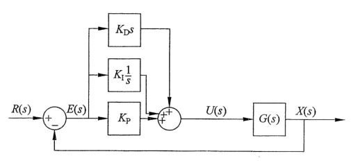
图 8.5.2　PID 控制框图

## 8.6 本章要点总结

- **根轨迹的研究对象与定义：**
  - 根轨迹的应用与研究要满足图 8.1.1 中的单位反馈闭环控制系统图标准形式。
  - 根轨迹的研究方法是通过研究开环传递函数 $G(s)$ 的极点和零点来判断闭环传递函数 $G_{\mathrm{cl}}(s)$ 特征方程根（极点）随增益 $K$ 的变化趋势。
- **根轨迹绘制的基本规则：**
  - 根轨迹有 6 个基本规则：
    - 规则 1：如果 $n>m$，则根轨迹在复平面上共有 $n$ 条分支；如果 $m>n$，则根轨迹在复平面上共有 $m$ 条分支。
    - 规则 2：当 $n=m$ 时，随着 $K$ 从 0 增加到正无穷，根轨迹从 $G(s)$ 的极点向零点移动。
    - 规则 3：实轴上的根轨迹存在于从右向左数第奇数个极点/零点的左边。
    - 规则 4：若复数根存在，则一定是共轭的，所以根轨迹是相对于实轴对称的。这一点可以参考第 6 章。
    - 规则 5：如果 $n>m$，则有 $(n-m)$ 条分支从极点指向无穷；如果 $n<m$，则有 $(m-n)$ 条分支从无穷指向零点。
    - 规则 6：根轨迹沿着渐近线移动，渐近线与实轴的交点为 $\sigma_a=(\sum s_{pn}-\sum s_{zm})/(n-m)$；渐近线与实轴的夹角为 $\theta=(2q+1)\pi/(n-m)$。
- **根轨迹的几何性质：**
  - 在根轨迹上的点，需要满足 $|KG(s)|=1$。
  - $\angle G(s)=-(2q+1)\pi$，$q=\pm0,\pm1,\pm2,\ldots$。
- **补偿器设计：**
  - 超前补偿器：$C(s)=\dfrac{s-s_{zc}}{s-s_{pc}}$（$s_{pc}<s_{zc}<0$），可以提高系统的响应速度。
  - 滞后补偿器：$C(s)=\dfrac{s-s_{zc}}{s-s_{pc}}$（$s_{zc}<s_{pc}<0$），可以改善系统的稳态误差。
- **比例积分微分控制器：**
  - 时域表达：$u(t)=u_{mathrm P}(t)+u_{mathrm I}(t)+u_{mathrm D}(t)=K_{mathrm P}e(t)+K_{mathrm I}\int e(t)\,\mathrm dt+K_{mathrm D}\dfrac{\mathrm de(t)}{\mathrm dt}$。
  - 传递函数表达：$U(s)=\left(K_{mathrm P}+K_{mathrm I}\dfrac1s+K_{mathrm D}s\right)E(s)$。
  - 兼具比例微分控制与比例积分控制的优点，是直观的控制方法。
