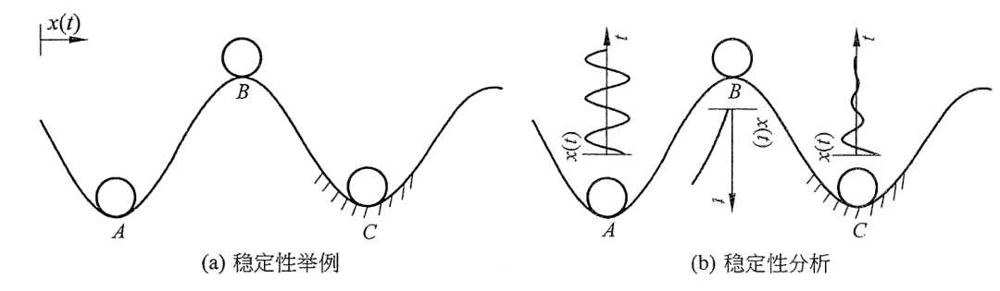
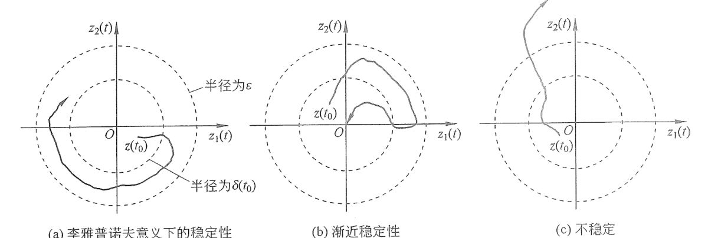
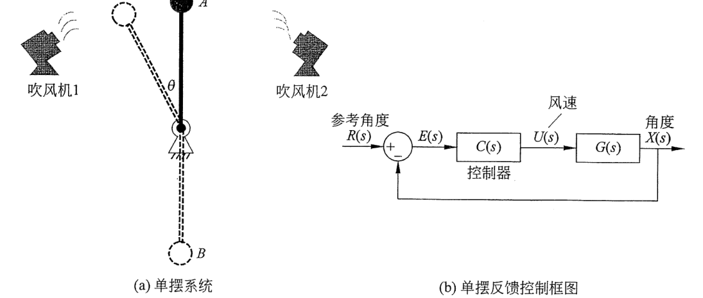
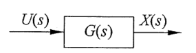
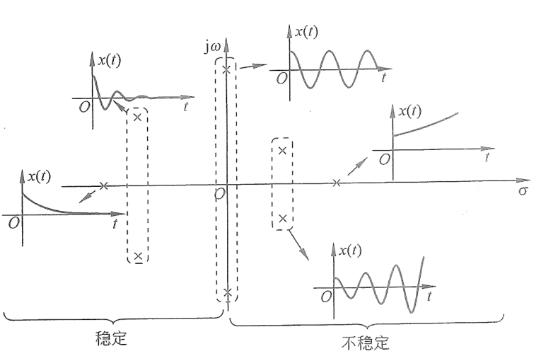
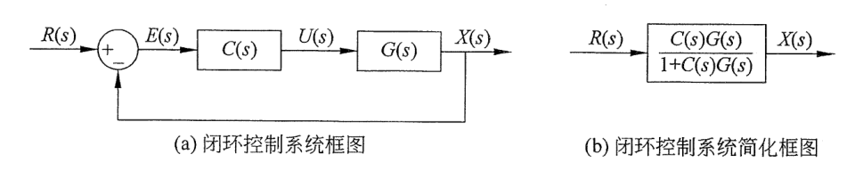

# 第6章 稳定性

本章将讨论自动控制理论中最重要的概念——稳定性（Stability）。稳定性是控制系统的基础，如果系统不稳定，其他的性能则无从说起。误差分析、性能分析和最优化分析等只有使用在稳定系统上才有意义。在前面的章节中，已经或多或少地涉及了一些稳定性的概念，本章中将以更加严谨的数学语言介绍并讨论稳定性的概念。

本章的学习目标为：

- 掌握李雅普诺夫意义下的稳定性、渐近稳定及输入输出稳定的定义。
- 掌握经典控制理论中通过传递函数的极点判断稳定性的方法。
- 掌握使用状态空间方程判定系统稳定性的方法。

## 6.1 系统稳定性的定义

### 6.1.1 稳定性的直观理解

对于稳定性而言，相信各位读者在日常生活中都会有自己的见解，例如保持收支平衡是一种稳定，保持工作与生活平衡是一种稳定，保持饮食与运动平衡也是一种稳定，稳定就是要保持平衡。如图 6.1.1（a）所示，假设在一条轨道上选取三个位置 $A$、$B$ 和 $C$。其中 $A$ 点和 $C$ 点的区别在于，$A$ 点是光滑的轨道而 $C$ 点则带有摩擦。如果时间零点 $t=0$ 时刻，在 $A$、$B$、$C$ 这三个位置上分别放置一个小球，它们都是可以保持静止不动的。用数学语言来表示就是 $\left.\frac{\mathrm dx(t)}{\mathrm dt}\right|_{t=0}=0$，其中 $x(t)$ 是小球的位移，定义向右为正方向，此刻 $x(t)$ 对时间的导数为 0，说明未来它不会随时间变化。根据第 3 章的介绍，$A$、$B$ 和 $C$ 都是这个小球系统的平衡点。

下面考虑当小球偏离了平衡点后发生的情况。如图 6.1.1（b）所示，首先看 $A$ 点，如果小球的初始位置偏离了平衡点 $A$，它的运动轨迹会是一条正弦曲线，始终围绕 $A$ 点左右循环往复运动，其幅度不会增加也不会减小。其次看 $B$ 点，假设小球的初始位置在 $B$ 点左边一点，释放之后它就会随着时间的增加远离 $B$ 点，如果没有外力的介入，它将无法再回到 $B$ 点。最后看 $C$ 点，它和 $A$ 点类似，但是因为存在着摩擦，能量会有所损耗，所以它的运动幅度会越摆越小，最终回到 $C$ 点。

  
  
图 6.1.1　小球轨道稳定性分析

以图 6.1.1（b）为例，可以给稳定性做一个不严谨的定义，对于在轨道上的小球：

（1）平衡点 $A$ 是临界稳定的。说它稳定，是因为小球在它附近运动时始终有界；说它不稳定，是因为小球一直在运动，而不会停在平衡点 $A$ 上。

（2）平衡点 $B$ 是不稳定的。一旦小球偏离平衡点 $B$ 后，就不会再回来了。

（3）平衡点 $C$ 是稳定的，因为小球随着时间的增加最终会回到平衡点。

### 6.1.2 稳定性的定义

6.1.1 节从直观上解释了稳定性的含义，下面将介绍严谨的数学定义。在 1892 年，俄国数学家亚历山大·李雅普诺夫（Aleksandr Lyapunov）在其博士论文《运动稳定性的一般问题》中提出了稳定性的科学概念。本书将选用这个概念来定义系统的稳定性，它是一个通用的概念，既可以运用在线性系统中，也可以运用到非线性的系统分析中。

首先介绍平衡点的定义，考虑一个无输入的状态空间方程表达式，即

$$
\frac{\mathrm d\boldsymbol z(t)}{\mathrm dt}=f(\boldsymbol z(t)). \tag{6.1.1}
$$

式（6.1.1）中的 $f(\boldsymbol z(t))$ 可以是线性的，也可以是非线性的，它是一个通用的表达式。其中，$\boldsymbol z(t)$ 是系统的状态变量。定义 $\boldsymbol z_f$ 是系统的平衡点，如果在 $t=t_0$ 时刻状态变量的初始值 $\boldsymbol z(t_0)=\boldsymbol z_f$，那么

$$
\boldsymbol z(t)=\boldsymbol z_f,
\qquad \forall t\ge t_0. \tag{6.1.2a}
$$

其中，$\forall$ 代表“对于任意，或对所有（for all）”。式（6.1.2a）说明当系统初始状态处于平衡点时，状态变量将不会随时间发生改变，例如图 6.1.1 中小球在初始状态时处于 $A$、$B$、$C$ 三个位置。同时，根据式（6.1.1），有

$$
\boldsymbol z(t)=\boldsymbol z_f
\quad\Rightarrow\quad
\frac{\mathrm d\boldsymbol z(t)}{\mathrm dt}=0
\quad\Rightarrow\quad
f(\boldsymbol z_f)=0,
\qquad \forall t\ge t_0. \tag{6.1.2b}
$$

在接下来的分析中，我们将假设系统的平衡点在 $\boldsymbol z_f=\boldsymbol 0$ 位置，或者可以转换到零点位置，这个假设不会影响系统的一般性。定义两个重要的稳定性概念：

**（1）李雅普诺夫意义下的稳定性（Stability in the Sense of Lyapunov）：**

如果平衡点 $\boldsymbol z_f=\boldsymbol 0$ 满足

$$
\forall t_0, \forall\varepsilon>0,
\ \exists\delta(t_0,\varepsilon):
\ \|\boldsymbol z(t_0)\|<\delta(t_0,\varepsilon)
\Rightarrow
\forall t\ge t_0,
\ \|\boldsymbol z(t)\|<\varepsilon, \tag{6.1.3}
$$

则它被称为在李雅普诺夫意义下是稳定的。式（6.1.3）中，$\varepsilon$ 是一个任意给定的实数，$\exists$ 代表存在，$\|\cdot\|$ 代表欧几里得范数（2 范数），例如，对于一个 $n$ 维向量 $\boldsymbol z(t)=[z_1(t),z_2(t),\cdots,z_n(t)]^{\mathrm T}$，其欧几里得范数

$$
\|\boldsymbol z(t)\|
=\sqrt{z_1^2(t)+z_2^2(t)+\cdots+z_n^2(t)}.
$$

**（2）渐近稳定性（Asymptotic Stability）：**

在李雅普诺夫意义下的稳定性的基础上，如果平衡点 $\boldsymbol z_f=\boldsymbol 0$ 满足

$$
\exists\delta(t_0)>0:
\ \|\boldsymbol z(t_0)\|<\delta(t_0)
\Rightarrow
\lim_{t\to\infty}\|\boldsymbol z(t)\|=\boldsymbol z_f=0, \tag{6.1.4}
$$

则被称为渐近稳定。

如果平衡点不符合上面两种条件，则不稳定。

上述两个定义单纯从数学的角度比较晦涩难懂。为帮助读者理解，下面以一个二阶系统为例通过其相图来解释。假设一个二阶系统的状态变量为 $\boldsymbol z(t)=[z_1(t),z_2(t)]^{\mathrm T}$，将 $z_1(t)$ 作为横轴，$z_2(t)$ 作为纵轴在平面中表达出来。此时，它的欧几里得范数 $\|\boldsymbol z(t)\|=\sqrt{z_1^2(t)+z_2^2(t)}$ 等于点 $[z_1(t),z_2(t)]^{\mathrm T}$ 到原点的距离。其稳定性定义解释如图 6.1.2 所示的三条轨迹。

  
  
图 6.1.2　二阶系统稳定性的图形表达

在图 6.1.2 中，小圆的半径是 $\delta(t_0)$，在稳定性的定义中，系统的初始状态都位于小圆里面，即式（6.1.3）和式（6.1.4）中的 $\|\boldsymbol z(t_0)\|<\delta(t_0)$。之后系统的状态变量会随时间发生改变。其中：

在图 6.1.2（a）中，$\boldsymbol z(t)$ 的运动轨迹始终在大圆（半径为 $\varepsilon$）内移动，满足式（6.1.3）中的 $\|\boldsymbol z(t)\|<\varepsilon$，因此它符合李雅普诺夫意义下的稳定性，这也说明李雅普诺夫意义下的稳定性是“界限”的概念。

在图 6.1.2（b）中，随着时间的增加，状态变量最终收敛于平衡点 $\boldsymbol z_f=\boldsymbol 0$（$\lim_{t\to\infty}\|\boldsymbol z(t)\|=0$），根据式（6.1.4），平衡点是渐近稳定的，它是比李雅普诺夫意义下的稳定性更加严格的一种稳定性。

图 6.1.2（c）的轨迹最终超出了大圆之外，即 $\|\boldsymbol z(t)\|>\varepsilon$，所以它是不稳定的。

参数 $\delta(t_0)$ 和 $\varepsilon$ 的物理意义可以这样来理解：$\varepsilon$ 是一个稳定性的指标，如果状态变量始终在 $\varepsilon$ 以内，那么平衡点就符合李雅普诺夫意义下的稳定。$\delta(t_0)$ 则是平衡点稳定的前提条件，或者说是稳定所能承受的最大干扰，也可以理解为收敛域。以图 6.1.1 为例，点 $A$ 是一个李雅普诺夫意义下的稳定点，因为在小的扰动条件下它始终会在 $A$ 点附近的范围内运动。但如果扰动过大，例如把小球放到了 $B$ 点的右边，那它将无法自动回到 $A$ 点附近摆动。

根据上述分析，如果 $\delta(t_0)$ 可以任意选择（选择无限大），那么就可以推断出平衡点是全局稳定（Global Stability），因为不管系统的初始状态在任何位置，它都可以最终收敛到一个范围之内（渐近稳定时收敛于 0）。反之，如果 $\delta(t_0)$ 的选择是有条件的，则平衡点是局部稳定（Local Stability）。

### 6.1.3 稳定性的研究对象

在分析系统的稳定性时，一定要明确分析的对象。在 6.1.2 节中，稳定性的定义是针对平衡点的。而一个动态系统的平衡点可能有很多个，例如一个单摆系统，如图 6.1.3（a）所示。在没有外力的作用下，这个动态系统有两个平衡点，分别是直上（$A$ 点）和直下（$B$ 点）。其中，垂直向下的 $B$ 点本身是一个渐近稳定的平衡点，当小球小范围偏离 $B$ 点的时候，它会自己摆回来并最终停在 $B$ 点。而 $A$ 点则不同，小球可以稳定地停在 $A$ 点（无速度），但是它一旦偏离 $A$ 点，在没有外力的作用下，就将远离 $A$ 点。因此，如果希望将 $A$ 点也改变为渐近稳定点，就需要引入外力，例如在单摆的两边各加入一个吹风机。吹风机的风力强度由小球偏离 $A$ 点的距离决定。这样就形成了一个反馈控制系统，其框图如图 6.1.3（b）所示。控制器 $C(s)$ 设计的目标就是将 $A$ 点转化成为一个稳定的平衡点。除此之外，我们甚至可以设计出合适的控制器，使得小球稳定在 $C$ 点这样一个倾斜的位置。此时的控制器设计需要达成两个目标：第一，使 $C$ 点成为系统的平衡点；第二，使 $C$ 点成为一个渐近稳定的平衡点。

  
  
图 6.1.3　单摆的平衡性与控制

## 6.2 稳定性与传递函数

6.1 节介绍了稳定性的定义及稳定性的研究对象，本节将探讨稳定性与传递函数的关系。

  
  
图 6.2.1　动态系统框图

如图 6.2.1 所示的动态系统，其输入 $U(s)$ 与输出 $X(s)$ 的关系为

$$
X(s)=U(s)G(s), \tag{6.2.1}
$$

其中，$G(s)$ 为系统的传递函数。

在经典控制理论体系中，会通过分析系统的单位冲激响应来判断稳定性，即令系统的输入 $u(t)=\delta(t)$，这是因为其拉普拉斯变换 $\mathcal L[\delta(t)]=1$，不会引入极点/零点，这相当于分析传递函数本身的特性。此时，输出的拉普拉斯变换为

$$
X(s)=U(s)G(s)=\mathcal L[\delta(t)]G(s)=G(s), \tag{6.2.2a}
$$

即传递函数本身。式（6.2.2a）可以写成

$$
\begin{aligned}
X(s)=G(s)
=\frac{(s-s_{z1})(s-s_{z2})\cdots(s-s_{zm})}
{\bigl((s-s_{p1})(s-s_{p2})\cdots(s-s_{pq})\bigr)
\bigl((s-\sigma_1\pm\mathrm j\omega_1)(s-\sigma_2\pm\mathrm j\omega_2)\cdots(s-\sigma_r\pm\mathrm j\omega_r)\bigr)}.
\end{aligned} \tag{6.2.2b}
$$

式（6.2.2b）说明传递函数 $G(s)$ 包含 $m$ 个零点，分别是 $s_{z1},s_{z2},\cdots,s_{zm}$。包含 $q$ 个实数根极点，分别是 $s_{p1},s_{p2},\cdots,s_{pq}$。包含 $r$ 对共轭复数根极点，分别是 $\sigma_1\pm\mathrm j\omega_1,\sigma_2\pm\mathrm j\omega_2,\cdots,\sigma_r\pm\mathrm j\omega_r$。

对式（6.2.2b）使用分式分解法并进行拉普拉斯逆变换，可得

$$
x(t)=\sum_{i=1}^{q}A_i e^{s_{pi}t}
+\sum_{k=1}^{r}B_k e^{\sigma_kt}\sin(\omega_kt+\varphi_k), \tag{6.2.3}
$$

其中，$A_i$、$B_k$ 和 $\varphi_k$ 由初始条件来决定。

通过式（6.2.3）可以得出以下结论：

- 传递函数极点的实数部分（$s_{pi}$ 与 $\sigma_k$）将决定系统输出 $x(t)$ 的稳定性：
  - 当所有的 $s_{pi}<0$ 且所有的 $\sigma_k<0$ 时，$x(t)$ 将会随着时间的增加而不断衰减并趋于 0，满足渐近稳定。
  - 如果有任何一个或以上的 $s_{pi}$ 或 $\sigma_k$ 大于 0，$x(t)$ 将会随着时间的增加而发散。因此系统是不稳定的。
  - 如果存在着 $s_{pi}$ 和 $\sigma_k$ 等于 0 的情况，$x(t)$ 会随着时间的增加趋于常数或者保持在一个范围内振荡（有界）。这种情况下，系统符合李雅普诺夫意义下的稳定性。
- 如果传递函数极点存在着虚数部分 $\omega_k$，则系统会产生振荡。振荡部分 $\sin(\omega_kt+\varphi_k)$ 在式（6.2.3）中与指数部分相乘，并不会影响系统的稳定性。

以上的结论可以用图 6.2.2 表示，图中“$\times$”代表极点在复平面中的位置。请注意，在经典控制理论中，稳定特指渐近稳定。李雅普诺夫意义下的稳定（即极点在虚轴上的情况）会被称为临界稳定或者不稳定。在这样的定义下，从经典控制理论的角度来看，式（6.2.1）所描述的动态系统稳定的条件是：传递函数的极点均在复平面的左半部分。

  
  
图 6.2.2　传递函数极点在复平面的位置与稳定性的关系

此外，当系统的单位冲激响应满足渐近稳定条件时，针对每一个有界的输入 $u(t)$，系统的输出 $x(t)$ 也都会有界，不会发散到无限大。这种性质被称为有界输入有界输出稳定（BIBO Stable，Bounded Input Bounded Output Stable）。如果一个系统不满足 BIBO 稳定，就意味着一个有限的输入可能会导致无穷幅度的输出，这很有可能会对系统造成破坏性的影响。

  

    BIBO 稳定严格要求系统单位冲激响应要满足渐近稳定。如果系统的传递函数存在虚轴上的极点（临界稳定），则不符合 BIBO 稳定，因为有限的输入也有可能令系统产生共振，使得输出的振幅无限大（参考 9.4 节）。
  

将动态系统稳定性的结论拓展到控制系统中，有助于明确控制器的设计目标，考虑图 6.2.3（a）所示的闭环控制系统，根据 2.3.2 节中所介绍的框图化简方法，得到图 6.2.3（b），其中参考值 $R(s)$ 与输出 $X(s)$ 之间的关系为

$$
X(s)=R(s)\frac{C(s)G(s)}{1+C(s)G(s)}=R(s)G_{\mathrm{cl}}(s). \tag{6.2.4}
$$

其中，$\displaystyle G_{\mathrm{cl}}(s)=\frac{C(s)G(s)}{1+C(s)G(s)}$ 代表了闭环传递函数。此时可以将此闭环控制系统考虑为一个新的动态系统，输入是参考值 $R(s)$，输出是 $X(s)$。

  
  
图 6.2.3　闭环控制系统

通过前面的分析，此时控制器设计的首要目标，就是通过设计 $C(s)$ 使得闭环传递函数 $\displaystyle G_{\mathrm{cl}}(s)=\frac{C(s)G(s)}{1+C(s)G(s)}$ 的极点均在复平面的左半部分，因为只有这样才可以保障系统输出 $x(t)$ 的单位冲激响应是渐近稳定的，也就是保障当参考输入 $R(s)$ 有界的时候，输出 $X(s)$ 也始终有界（BIBO 稳定）。只有在稳定的基础上，才有可能进一步地改进算法来调节系统的响应速度与最终的误差。

## 6.3 稳定性与状态空间方程

6.2 节讨论了经典控制理论中使用传递函数的极点来判断系统稳定性的方法。本节将分析稳定性与状态空间方程的关系。使用状态空间方程描述线性时不变系统的一般表达式为

$$
\frac{\mathrm d\boldsymbol z(t)}{\mathrm dt}
=A\boldsymbol z(t)+B\boldsymbol u(t), \tag{6.3.1a}
$$

$$
\boldsymbol y(t)=C\boldsymbol z(t)+D\boldsymbol u(t). \tag{6.3.1b}
$$

其中，$\boldsymbol z(t)$ 是状态变量，$\boldsymbol y(t)$ 是系统的输出，$\boldsymbol u(t)$ 是系统的输入，矩阵 $A$ 是状态矩阵，矩阵 $B$ 是输入矩阵，矩阵 $C$ 是输出矩阵，矩阵 $D$ 是直接传递矩阵。

如式（6.3.1b）所示，系统的输出 $\boldsymbol y(t)$ 是状态变量 $\boldsymbol z(t)$ 与输入 $\boldsymbol u(t)$ 的线性组合，如果系统的状态变量和输入都有界，那么系统的输出也是有界的（符合李雅普诺夫意义下的稳定性）。所以在讨论稳定性的时候，可以直接分析式（6.3.1a）。

首先考虑零输入状态，即 $\boldsymbol u(t)=0$。在 3.3 节中详细分析了状态矩阵 $A$ 的特征值与平衡点类型之间的关系，这一结论可以直接和系统的稳定性结合起来。回顾 3.3.3 节二维系统相轨迹并对照 6.1.2 节中稳定性的定义，如果 $A$ 是一个二维矩阵，那么其特征值与稳定性的关系见表 6.3.1。

**表 6.3.1　状态矩阵 $A$ 的特征值与稳定性**

  
  <table class="stability-eigenvalue-table" style="display: inline-table; margin: 0; border-collapse: collapse; text-align: center; white-space: nowrap; border: 1px solid #00a6df;">
    <thead>
      <tr><th style="border: 1px solid var(--background-modifier-border); padding: 0.45em 0.8em;">$\lambda_{1,2}=\sigma\pm\omega\mathrm j$</th><th colspan="2" style="border: 1px solid var(--background-modifier-border); padding: 0.45em 0.8em;">特征值 $\lambda_1,\lambda_2$ 分类与说明</th><th style="border: 1px solid var(--background-modifier-border); padding: 0.45em 0.8em;">平衡点类型</th><th style="border: 1px solid var(--background-modifier-border); padding: 0.45em 0.8em;">稳定性分析</th></tr>
    </thead>
    <tbody>
      <tr><td rowspan="3" style="border: 1px solid var(--background-modifier-border); padding: 0.4em 0.8em;">特征值为实数 （$\omega=0$）</td><td style="border: 1px solid var(--background-modifier-border); padding: 0.4em 0.8em;">$\lambda_1\lambda_2>0$ 且 $\lambda_1+\lambda_2<0$</td><td style="border: 1px solid var(--background-modifier-border); padding: 0.4em 0.8em;">$\lambda_1$ 和 $\lambda_2$ 都为负数</td><td style="border: 1px solid var(--background-modifier-border); padding: 0.4em 0.8em;">稳定节点</td><td style="border: 1px solid var(--background-modifier-border); padding: 0.4em 0.8em;">渐近稳定</td></tr>
      <tr><td style="border: 1px solid var(--background-modifier-border); padding: 0.4em 0.8em;">$\lambda_1\lambda_2<0$</td><td style="border: 1px solid var(--background-modifier-border); padding: 0.4em 0.8em;">$\lambda_1$ 和 $\lambda_2$ 一正一负</td><td style="border: 1px solid var(--background-modifier-border); padding: 0.4em 0.8em;">鞍点</td><td style="border: 1px solid var(--background-modifier-border); padding: 0.4em 0.8em;">不稳定</td></tr>
      <tr><td style="border: 1px solid var(--background-modifier-border); padding: 0.4em 0.8em;">$\lambda_1\lambda_2>0$ 且 $\lambda_1+\lambda_2>0$</td><td style="border: 1px solid var(--background-modifier-border); padding: 0.4em 0.8em;">$\lambda_1$ 和 $\lambda_2$ 都为正数</td><td style="border: 1px solid var(--background-modifier-border); padding: 0.4em 0.8em;">不稳定节点</td><td style="border: 1px solid var(--background-modifier-border); padding: 0.4em 0.8em;">不稳定</td></tr>
      <tr><td rowspan="3" style="border: 1px solid var(--background-modifier-border); padding: 0.4em 0.8em;">特征值为复数 （$\omega\ne0$）</td><td style="border: 1px solid var(--background-modifier-border); padding: 0.4em 0.8em;">$\lambda_{1,2}=\pm\omega\mathrm j$</td><td style="border: 1px solid var(--background-modifier-border); padding: 0.4em 0.8em;">特征值为纯虚数</td><td style="border: 1px solid var(--background-modifier-border); padding: 0.4em 0.8em;">中心点</td><td style="border: 1px solid var(--background-modifier-border); padding: 0.4em 0.8em;">李雅普诺夫意义下的稳定</td></tr>
      <tr><td style="border: 1px solid var(--background-modifier-border); padding: 0.4em 0.8em;">$\lambda_{1,2}=\sigma\pm\omega\mathrm j$（$\sigma>0$）</td><td style="border: 1px solid var(--background-modifier-border); padding: 0.4em 0.8em;">实部大于 0</td><td style="border: 1px solid var(--background-modifier-border); padding: 0.4em 0.8em;">不稳定焦点</td><td style="border: 1px solid var(--background-modifier-border); padding: 0.4em 0.8em;">不稳定</td></tr>
      <tr><td style="border: 1px solid var(--background-modifier-border); padding: 0.4em 0.8em;">$\lambda_{1,2}=\sigma\pm\omega\mathrm j$（$\sigma<0$）</td><td style="border: 1px solid var(--background-modifier-border); padding: 0.4em 0.8em;">实部小于 0</td><td style="border: 1px solid var(--background-modifier-border); padding: 0.4em 0.8em;">稳定焦点</td><td style="border: 1px solid var(--background-modifier-border); padding: 0.4em 0.8em;">渐近稳定</td></tr>
    </tbody>
  </table>

上述分析方法可以推广到更高维度的状态矩阵中。对于 $n$ 维向量 $\boldsymbol z(t)$，首先令 $\boldsymbol z(t)=P\bar{\boldsymbol z}(t)$，其中，$P$ 是过渡矩阵，由矩阵 $A$ 的特征向量组成。可得

$$
\frac{\mathrm d\bar{\boldsymbol z}(t)}{\mathrm dt}
=
\begin{bmatrix}
\lambda_1&\cdots&0\\
\vdots&\ddots&\vdots\\
0&\cdots&\lambda_n
\end{bmatrix}
\bar{\boldsymbol z}(t). \tag{6.3.2}
$$

其中，$\lambda_i$ 代表 $A$ 的特征值，由式（6.3.2）可得

$$
\left\{
\begin{aligned}
\bar z_1(t)&=C_1e^{\lambda_1t},\\
&\ \vdots\\
\bar z_n(t)&=C_ne^{\lambda_nt}.
\end{aligned}
\right. \tag{6.3.3}
$$

关于式（6.3.2）和式（6.3.3）的详细推导，请参考 3.2.2 节。原向量 $\boldsymbol z(t)$ 是 $\bar{\boldsymbol z}(t)$ 的线性组合，所以它的收敛或发散与 $\bar{\boldsymbol z}(t)$ 一致。因此，我们可以将二维状态变量平衡点稳定判定方法沿用到更高维度的情况下，得到关于状态空间方程稳定性的两个结论：

考虑零输入系统的状态空间方程为 $\frac{\mathrm d\boldsymbol z(t)}{\mathrm dt}=A\boldsymbol z(t)$：

- 如果 $A$ 的特征值的实部都不大于 0，它的平衡点将符合李雅普诺夫意义下的稳定性。
- 如果 $A$ 的特征值的实部都小于 0，它的平衡点将符合渐近稳定性。

上述结论为系统的控制器设计提供了思路。在闭环控制系统中，输入 $\boldsymbol u(t)$ 是状态变量的一个函数，例如 $\boldsymbol u(t)=-K\boldsymbol z(t)$，其中矩阵 $K$ 是控制矩阵。式（6.3.1a）可以写成

$$
\frac{\mathrm d\boldsymbol z(t)}{\mathrm dt}
=A\boldsymbol z(t)-BK\boldsymbol z(t)
=(A-BK)\boldsymbol z(t)
=A_{\mathrm{cl}}\boldsymbol z(t). \tag{6.3.4}
$$

其中，$A_{\mathrm{cl}}=A-BK$，代表闭环控制系统的状态矩阵。根据上述分析，如果希望得到一个渐近稳定的系统，则需要设计合适的控制矩阵 $K$，使得 $A_{\mathrm{cl}}$ 的特征值实部都为负数。

## 6.4 本章要点总结

- **稳定性的定义：**
  - 李雅普诺夫意义下的稳定性：随着时间的增加，系统的状态变量始终在平衡点附近移动（有界）。
  - 渐近稳定性：随着时间的增加，系统的状态变量会最终收敛于平衡点。

- **稳定性与传递函数：**
  - 在研究系统稳定性的时候考虑单位冲激响应，即传递函数本身。
  - 系统稳定的条件是系统的闭环传递函数的极点均在复平面的左半部分（实部小于 0）。此时系统满足有界输入有界输出稳定。

- **稳定性与状态空间方程：**
  - 状态矩阵的特征值的实部决定了系统的稳定性：
    - 当实部都不大于 0 时，系统符合李雅普诺夫意义下的稳定性。
    - 当实部都小于 0 时，系统符合渐近稳定性。
