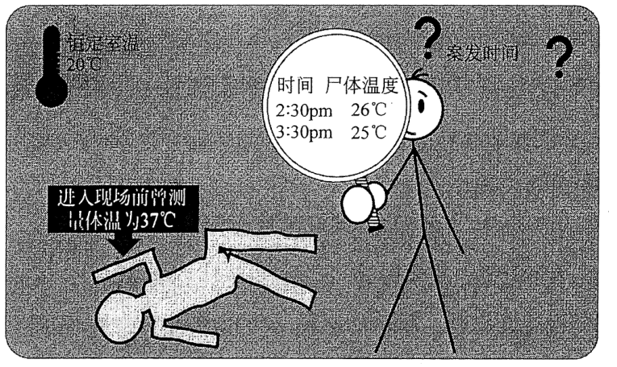
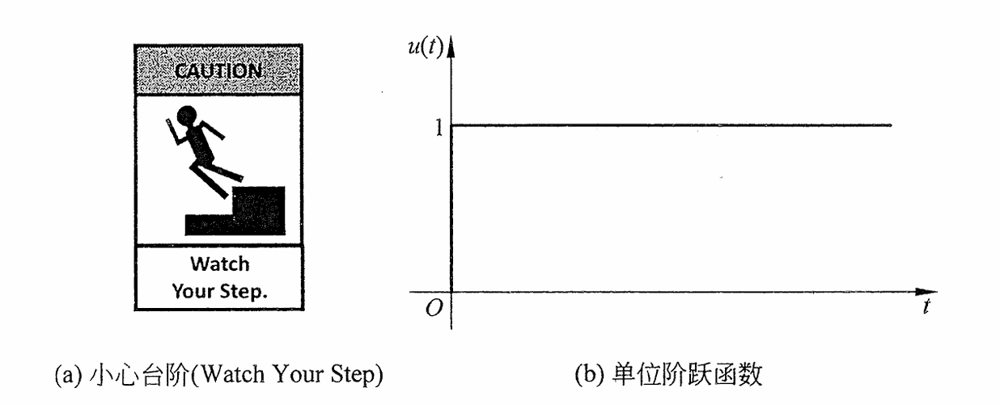
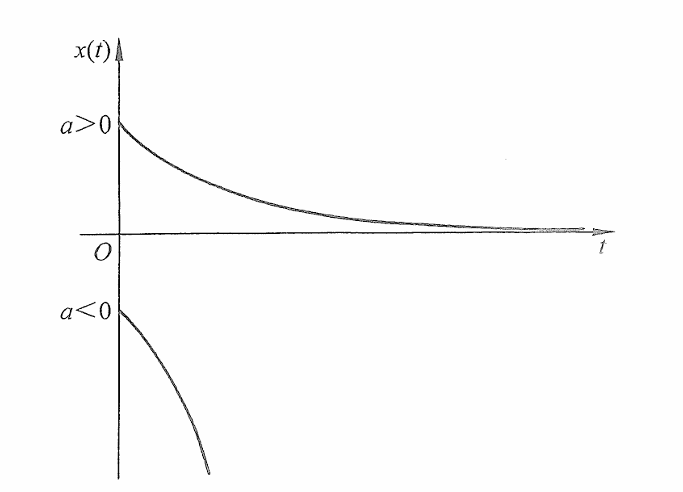
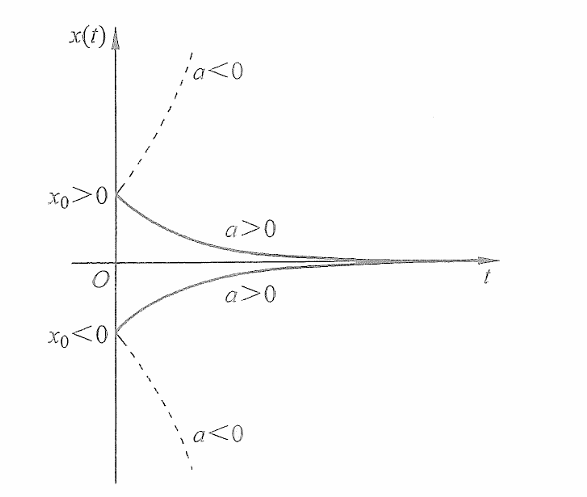
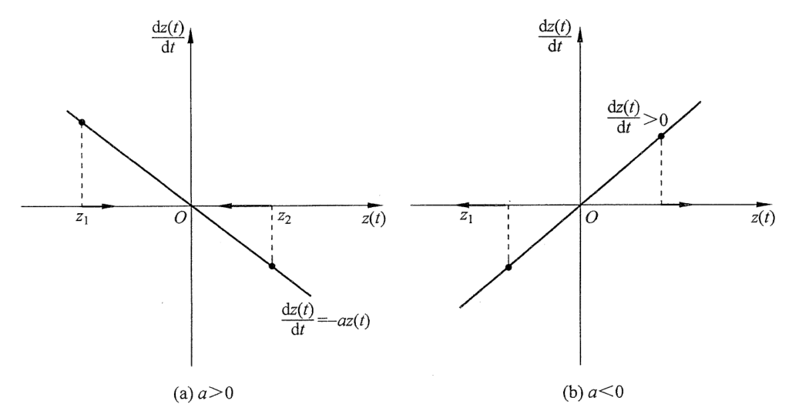
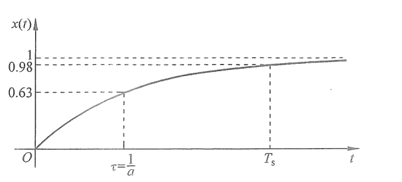
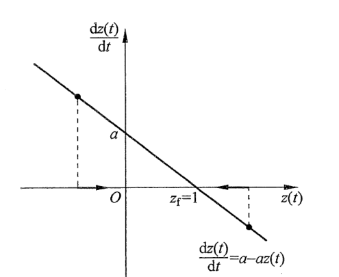
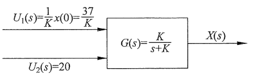
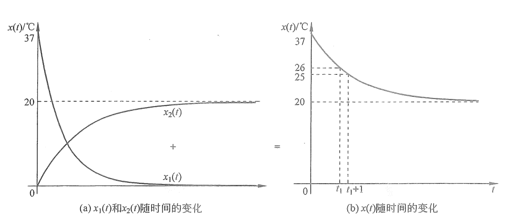

# 第4章 一阶系统的时域响应分析

使用一阶微分方程描述的动态系统被称为一阶系统。本章将使用传递函数和状态空间方程来分析一阶系统的时域响应与性能特征。

本章的学习目标为：

- 了解典型系统输入信号的含义和数学表达式，包括单位冲激输入和单位阶跃输入。
- 掌握使用传递函数和状态空间方程的方法分析一阶系统的时域响应，并体会两种方式各自的优势。
- 掌握一阶系统性能指标的推导方法和意义。
- 了解一阶动态系统的应用。

## 4.1 引子——案发时间是几点

请读者试想以下的场景（如图 4.1.1 所示）：你是一名侦探，应邀去调查一起密室杀人案件。基于职业习惯，你在进入房间的时候看了一眼手表，记录下此刻的时间是下午 2:30。死者正躺在密室的地板上，你拿出温度枪，测得此刻尸体的温度是 $26\,^{\circ}\mathrm C$。你开始对房间展开调查并寻找蛛丝马迹。这是一个密闭的空间，有一套完善的空调系统可以将室温准确地保持在 $20\,^{\circ}\mathrm C$。空调控制器也没有被动过的痕迹，因此可以断定尸体一直保存在 $20\,^{\circ}\mathrm C$ 的环境下。

调查取证用了 1 小时的时间，在收集完所有物证之后时钟指向下午 3:30。此时再次测量尸体的温度，已经降低到了 $25\,^{\circ}\mathrm C$。你了解到死者进入现场之前曾经测量过体温，是标准的 $37\,^{\circ}\mathrm C$。此时，你思考了一下，在本子上演算并得出结论：本案案发时间是……（答案将在 4.3 节揭晓。）

  
  
图 4.1.1　案发时间是几点？

在现实生活中，法医判断案发时间是一门综合性很强的技术，需要收集多方因素进行分析演算才能得到精确的结果。上述的例子属于理想状态（密室且恒温），因此可以使用简单的牛顿冷却定律进行分析。牛顿冷却定律的动态微分方程是

$$
\frac{\mathrm{d}T(t)}{\mathrm{d}t}=-K[T(t)-C(t)]. \tag{4.1.1}
$$

其中，$T(t)$ 是物体温度，$C(t)$ 是环境温度，$K$ 是导热系数。式（4.1.1）是一个一阶微分方程，所以其对应的系统是一阶动态系统。设系统的输入 $u(t)$ 是环境温度，即 $u(t)=C(t)$；系统的输出是物体温度，即 $x(t)=T(t)$。将上述定义代入式（4.1.1）并进行调整，可得

$$
\frac{\mathrm{d}x(t)}{\mathrm{d}t}+Kx(t)=Ku(t). \tag{4.1.2}
$$

对式（4.1.2）等号两边分别进行拉普拉斯变换，得到

$$
sX(s)-x(0)+KX(s)=KU(s). \tag{4.1.3}
$$

其中，$x(0)$ 是系统的初始条件，在本例中则是初始体温，即 $x(0)=37\,^{\circ}\mathrm C$。式（4.1.3）可以写为

$$
(s+K)X(s)=K\left[\frac{1}{K}x(0)+U(s)\right]. \tag{4.1.4}
$$

> 方括号中的 $\frac{x(0)}{K}+U(s)$ 是**等效输入**，不是原来的物理输入。原来的输入仍是环境温度 $u(t)=C(t)$，其拉普拉斯变换为 $U(s)$。对式（4.1.3）移项后，右边成为 $x(0)+KU(s)$；把 $K$ 提出来，便得到 $K[\frac{x(0)}{K}+U(s)]$。这样可以把非零初始温度 $x(0)$ 当作一个额外输入，与环境温度输入一起计算输出。因为 $\mathcal L[\delta(t)]=1$，$\frac{x(0)}{K}$ 在时域中对应 $\frac{x(0)}{K}\delta(t)$，即初始时刻的一次等效冲激，而不是房间温度持续增加了 $\frac{x(0)}{K}$。

系统的传递函数为

$$
G(s)=\frac{X(s)}{\dfrac{1}{K}x(0)+U(s)}=\frac{K}{s+K}. \tag{4.1.5}
$$

式（4.1.5）说明系统的输入由两部分相加而成。定义 $U_1(s)=\frac{1}{K}x(0)$、$U_2(s)=U(s)$，得到

$$
G(s)=\frac{X(s)}{U_1(s)+U_2(s)}=\frac{K}{s+K}. \tag{4.1.6}
$$

根据线性时不变系统的叠加性质，系统的输出则是对应于这两个输入响应（定义为 $X_1(s)$ 和 $X_2(s)$）的和，即

$$
X(s)=X_1(s)+X_2(s). \tag{4.1.7}
$$

在本例中，这两个输入分别是冲激输入 $U_1(s)$ 和阶跃输入 $U_2(s)$，所对应的响应则是冲激响应和阶跃响应。我们暂时从这个密室走出来，首先来分析一阶系统的时域响应。等到掌握了这些基本知识之后，再回到密室揭秘案发时间。

## 4.2 一阶系统的时域响应

### 4.2.1 典型一阶系统和典型系统输入信号

典型一阶系统的微分方程为

$$
\frac{\mathrm{d}x(t)}{\mathrm{d}t}+ax(t)=au(t), \tag{4.2.1}
$$

其中，$a$ 是一个常数。考虑零初始条件 $x(0)=u(0)=0$，对式（4.2.1）等号两边进行拉普拉斯变换，可得

$$
sX(s)+aX(s)=aU(s). \tag{4.2.2}
$$

调整后可以得到系统的传递函数为

$$
G(s)=\frac{X(s)}{U(s)}=\frac{a}{s+a}. \tag{4.2.3}
$$

$G(s)$ 的极点是 $s_p=-a$。

下面介绍两个典型的系统输入信号。

**单位冲激函数**（见 2.1.1 节），定义为

$$
\begin{cases}
\delta(t)=0, & t\ne0,\\[4pt]
\displaystyle\int_{-\infty}^{\infty}\delta(t)\,\mathrm{d}t=1.
\end{cases} \tag{4.2.4}
$$

其拉普拉斯变换为

$$
\mathcal{L}[\delta(t)]
=\int_0^{\infty}\delta(t)e^{-st}\,\mathrm{d}t
=e^{-s\cdot0}=1. \tag{4.2.5}
$$

**单位阶跃函数（Unit Step）：** 读者可以在英语国家的一些公共场所看到“小心台阶”（Watch Your Step）的警示牌，如图 4.2.1（a）所示。“阶跃”（Step）可以理解为一个台阶。“单位”阶跃是指幅度为 1 的阶跃函数，如图 4.2.1（b）所示。它的数学表达式为

$$
u(t)=
\begin{cases}
1, & t\ge0,\\
0, & t<0.
\end{cases} \tag{4.2.6}
$$

其对应的拉普拉斯变换为

$$
\mathcal{L}[1]=\mathcal{L}[e^{-0t}]
=\frac{1}{s+0}=\frac{1}{s}. \tag{4.2.7}
$$

  
  
图 4.2.1　单位阶跃函数理解与图示

### 4.2.2 一阶系统单位冲激响应

当系统的输入为单位冲激函数时，$u(t)=\delta(t)$，$U(s)=1$。代入式（4.2.3），可得

$$
X(s)=U(s)G(s)=1\times\frac{a}{s+a}=\frac{a}{s+a}. \tag{4.2.8}
$$

对式（4.2.8）等号两边进行拉普拉斯逆变换，可得

$$
x(t)=\mathcal{L}^{-1}[X(s)]
=\mathcal{L}^{-1}\left[\frac{a}{s+a}\right]
=ae^{-at}. \tag{4.2.9}
$$

图 4.2.2 显示了一阶系统在不同 $a$ 值下的单位冲激响应。可知当单位冲激输入作用在一阶系统时，系统的输出 $x(t)$ 将从 $a$ 开始变化。

  
  
图 4.2.2　一阶系统的单位冲激响应

  

    从系统输出的极点角度来看，当 $a>0$ 时，$X(s)$ 的极点 $s_p=-a<0$，因此 $x(t)$ 将递减并收敛于 0。另一方面，当 $a<0$ 时，$X(s)$ 的极点 $s_p=-a>0$，$x(t)$ 则会趋于负无穷。同时，因为 $X(s)$ 是单位冲激响应，所以 $X(s)=G(s)$，输出的极点也是传递函数的极点。
  

现在假设式（4.2.1）中的系统输入为 $u(t)=0$，但是系统的初始条件 $x(0)=x_0\ne0$。那么式（4.2.1）和式（4.2.2）分别变为

$$
\frac{\mathrm{d}x(t)}{\mathrm{d}t}+ax(t)=0, \tag{4.2.10}
$$

$$
sX(s)-x_0+aX(s)=0. \tag{4.2.11}
$$

调整式（4.2.11），得到

$$
X(s)=\frac{x_0}{s+a}. \tag{4.2.12a}
$$

对式（4.2.12a）等号两边进行拉普拉斯逆变换，得到

$$
x(t)=\mathcal{L}^{-1}[X(s)]
=\mathcal{L}^{-1}\left[\frac{x_0}{s+a}\right]
=x_0e^{-at}. \tag{4.2.12b}
$$

$x(t)$ 随时间的变化如图 4.2.3 所示。比较式（4.2.12b）和式（4.2.9），会发现它们之间只有系数部分的不同。因此，它的初始输出状态是 $x_0$。$x(t)$ 随时间收敛或者发散取决于 $a$ 的符号：当 $a>0$ 时，不管初始输出 $x_0$ 的符号是什么，系统的输出 $x(t)$ 都会随时间的增加趋于 0；当 $a<0$ 时，不同符号的初始输出 $x_0$ 会导致 $x(t)$ 随时间的增加向着正无穷或者负无穷变化。

  
  
图 4.2.3　一阶系统对初始条件的响应

  

    通过以上分析可知，一阶系统对初始条件的响应就是系统的冲激响应，冲激的强度使得系统的初始输出达到 $x_0$。单位冲激响应发散或收敛与传递函数的极点相关。
  

上述分析使用了传递函数的方法，下面我们换一种思路，使用相轨迹的方法对同样的一阶系统进行分析。考虑式（4.2.10）的零输入，即 $u(t)=0$ 的情况，定义系统的状态变量为系统的输出，即 $z(t)=x(t)$。此时，式（4.2.10）可以写为

$$
\frac{\mathrm{d}z(t)}{\mathrm{d}t}=-az(t). \tag{4.2.13}
$$

令 $\frac{\mathrm{d}z(t)}{\mathrm{d}t}=0$，可以得到它的平衡点 $z_f=0$。图 4.2.4 显示了不同 $a$ 值时式（4.2.13）的相轨迹。以 $a>0$ 的情况为例，相轨迹如图 4.2.4（a）所示。当系统的初始条件在平衡点 $z_f$ 的左侧，即 $z(0)=z_1$ 时，$\left.\frac{\mathrm{d}z(t)}{\mathrm{d}t}\right|_{z(t)=z_1}>0$，因此 $z(t)$ 将随着时间的增加而不断增大，其移动轨迹向右直到平衡点为止。同时，随着 $z(t)$ 向平衡点不断地靠近，它的变化速率 $\frac{\mathrm{d}z(t)}{\mathrm{d}t}$ 会不断地减小。

同理，当初始条件在平衡点右侧，即 $z(0)=z_2$ 时，$z(t)$ 将随着时间的增加而不断减小，移动轨迹向左直到平衡点。因此，平衡点 $z_f=0$ 是一个稳定的平衡点。读者可以自己分析 $a<0$ 时的情况并和图 4.2.4（b）进行对比，在这种条件下，平衡点 $z_f=0$ 是一个不稳定的平衡点。以上通过相轨迹分析的结果和图 4.2.3 所示的结果一致。

  
  
图 4.2.4　一阶系统零输入的相轨迹图（冲激响应）

### 4.2.3 一阶系统单位阶跃响应

当系统的输入为单位阶跃函数时，其拉普拉斯变换是 $U(s)=\frac{1}{s}$。代入式（4.2.3），可得

$$
X(s)=U(s)G(s)
=\frac{1}{s}\times\frac{a}{s+a}
=\frac{a}{s(s+a)}. \tag{4.2.14}
$$

对式（4.2.14）等号两边进行拉普拉斯逆变换，得到

$$
\begin{aligned}
x(t)&=\mathcal{L}^{-1}[X(s)]
=\mathcal{L}^{-1}\left[\frac{a}{s(s+a)}\right]\\
&=\mathcal{L}^{-1}\left[\frac{1}{s}-\frac{1}{s+a}\right]
=e^{0t}-e^{-at}=1-e^{-at}.
\end{aligned} \tag{4.2.15}
$$

根据式（4.2.15），当 $a<0$ 时，$x(t)$ 将趋于负无穷（图略）。当 $a>0$ 时，$x(t)$ 的图像如图 4.2.5 所示。从 0 开始，$x(t)$ 随着时间的增加而不断地增加，直到达到稳定值 1。通过分析式（4.2.14）的极点也可以得到一致的结论。$X(s)$ 有两个极点，其中 $s_{p1}=0$ 来自系统输入 $U(s)=\frac{1}{s}$，另一个极点 $s_{p2}=-a$ 是系统传递函数 $G(s)$ 的极点。

  
  
图 4.2.5　一阶系统单位阶跃响应

下面介绍两个一阶系统的重要性能指标。

1. **时间常数（Time Constant）：**

   $$
   \tau=\frac{1}{a},
   $$

   此时

   $$
   x(\tau)=1-e^{-a\frac{1}{a}}=1-e^{-1}\approx0.63.
   $$

   这个参数反映了系统的响应速度。$a$ 越大，$\tau$ 越小，系统的反应速度越快。

2. **调节时间或者稳定时间（Settling Time）：**

   $$
   T_s=4\tau=\frac{4}{a},
   $$

   此时 $x(T_s)\approx0.98$。它表示系统输出与终值之间的差距达到 $2\%$ 以内时所需要的时间。在工程中，可以理解为对系统施加一个阶跃输入后，系统需要 $T_s$ 的时间达到稳定状态。

  

    在具体工程案例中，可以通过实验的方法来确定一阶系统的参数。例如针对 4.1 节的牛顿冷却系统，传递函数为 $G(s)=\frac{K}{s+K}$，就可以通过实验的方法测得其冷却系数 $K$。
      
    假设以下场景：将一杯初始状态为 $x(0)=0\,^{\circ}\mathrm C$ 的水在 $t=0$ 时刻放入一个环境温度为 $20\,^{\circ}\mathrm C$ 的空间中，此时的输入即为阶跃输入，$u(t)=\begin{cases}20,&t\ge0,\\0,&t<0.\end{cases}$ 测得这个水的温度经过 5 小时之后达到了 $19.6\,^{\circ}\mathrm C$，为最终稳态值 $20\,^{\circ}\mathrm C$ 的 $98\%$。因此可以得到这杯水在这一空间中的时间常数为 $\tau=\frac{5}{4}=1.25$，其所对应的冷却系数 $K=\frac{1}{1.25}=0.8$。
  

使用相轨迹的方法可以得到同样的结论。设系统的状态变量为系统输出 $z(t)=x(t)$，式（4.2.1）可以写成

$$
\frac{\mathrm{d}z(t)}{\mathrm{d}t}+az(t)=au(t). \tag{4.2.16}
$$

当对其施加单位阶跃输入时，$u(t)=1$，式（4.2.16）可以整理为

$$
\frac{\mathrm{d}z(t)}{\mathrm{d}t}=a-az(t). \tag{4.2.17}
$$

令 $\frac{\mathrm{d}z(t)}{\mathrm{d}t}=0$，可以得到其平衡点位置 $z_f=1$。当 $a>0$ 时，其对应的相轨迹如图 4.2.6 所示，可以得出平衡点 $z_f$ 是一个稳定平衡点，无论初始状态在其左边还是右边，都将回到平衡位置。读者可以自己推导当 $a<0$ 时的情况。

  

    通过以上分析可以发现，使用传递函数和相轨迹得出的结论是一致的。其中，传递函数和拉普拉斯变换可以方便地得到一阶系统的时域响应解析式，而通过相轨迹可以直观、快速地分析一阶系统对初始条件的响应。
  

  
  
图 4.2.6　一阶系统单位阶跃响应的相轨迹

  

一阶系统的时域响应内容请扫描此二维码观看。

## 4.3 案发时间揭秘

在 4.2 节中，我们充分讨论了一阶系统的冲激响应和阶跃响应。现在回到本章开始的案例，揭秘案发的时间。式（4.1.5）所对应的系统框图如图 4.3.1 所示。

  
  
图 4.3.1　系统框图

系统的输入分为两部分：其中 $U_1(s)=\frac{37}{K}$ 是冲激输入，$U_2(s)=\begin{cases}20,&t\ge0,\\0,&t<0\end{cases}$ 是阶跃输入。因此，系统的输出是对这两部分输入响应的和，即冲激响应加阶跃响应。

根据式（4.2.12b），输出 $x_1(t)=x_0e^{-Kt}=37e^{-Kt}$。根据式（4.2.15），$x_2(t)=20(1-e^{-Kt})$，它是 20 倍的单位阶跃响应。$x_1(t)$ 与 $x_2(t)$ 如图 4.3.2（a）所示。叠加后的响应为

$$
\begin{aligned}
x(t)&=x_1(t)+x_2(t)\\
&=37e^{-Kt}+20(1-e^{-Kt})\\
&=20+17e^{-Kt}.
\end{aligned} \tag{4.3.1}
$$

$x(t)$ 随时间的变化如图 4.3.2（b）所示。

此时将两个已知条件代入式（4.3.1）：下午 2:30 时体温为 $26\,^{\circ}\mathrm C$，下午 3:30 时体温为 $25\,^{\circ}\mathrm C$。设下午 2:30 时已经距离死亡时间过去了 $t_1$ 小时，可得

$$
\begin{cases}
26=20+17e^{-Kt_1},\\
25=20+17e^{-K(t_1+1)}.
\end{cases} \tag{4.3.2}
$$

  
  
图 4.3.2　式（4.3.1）的输出响应

求解式（4.3.2）所示方程组，得到

$$
\begin{cases}
K=0.182,\\
t_1=5.72.
\end{cases} \tag{4.3.3}
$$

式（4.3.3）说明在下午 2:30 的时候，距离死亡时间已经过去了 5.72 小时（5 小时 43 分钟），所以案发时间大概是上午 8:47。

## 4.4 本章要点总结

- **一阶系统的表达形式：**
  - 微分方程：$\frac{\mathrm{d}x(t)}{\mathrm{d}t}+ax(t)=au(t)$。
  - 传递函数：$G(s)=\frac{X(s)}{U(s)}=\frac{a}{s+a}$。
  - 传递函数极点：$s_p=-a$。

- **一阶系统的单位冲激响应：**
  - 单位冲激函数：$\delta(t)=0$（$t\ne0$），且 $\int_{-\infty}^{\infty}\delta(t)\,\mathrm{d}t=1$。
  - 系统输出的拉普拉斯变换：$X(s)=\frac{a}{s+a}$。
  - 冲激响应的时域表达：$x(t)=ae^{-at}$。
  - 当 $a>0$ 时，$s_p<0$，系统收敛于 0；当 $a<0$ 时，$s_p>0$，系统趋于负无穷。
  - 系统对初始条件的响应即冲激响应。

- **一阶系统的单位阶跃响应：**
  - 单位阶跃函数：$u(t)=\begin{cases}1,&t\ge0,\\0,&t<0.\end{cases}$
  - 系统输出的拉普拉斯变换：$X(s)=\frac{a}{s(s+a)}$。
  - 阶跃响应的时域表达：$x(t)=1-e^{-at}$。
  - 当 $a>0$ 时，$s_p<0$，系统收敛于 1；当 $a<0$ 时，$s_p>0$，系统趋于负无穷。
  - 时间常数 $\tau=\frac{1}{a}$，此时系统输出达到终值的 $63\%$。
  - 调节时间 $T_s=4\tau=\frac{4}{a}$，此时系统输出达到终值的 $98\%$。
  - 使用相轨迹法可以直观明了地分析系统对于不同初始条件的响应。
