# 第 2 章　求解线性方程组

## 2.1 向量与线性方程

  

    <ol style="margin:0; padding-left:1.6em;">
      <li style="margin:0.35em 0;">$Ax=b$ 的列图像：$A$ 的 $n$ 个列向量的一个组合产生向量 $b$。</li>
      <li style="margin:0.35em 0;">这是向量方程 $Ax=x_1a_1+\cdots+x_na_n=b$，其中 $A$ 的各列为 $a_1,a_2,\ldots,a_n$。</li>
      <li style="margin:0.35em 0;">当 $b=0$ 时，$A$ 的各列的组合 $Ax$ 等于零；一种可能是 $x=(0,\ldots,0)$。</li>
      <li style="margin:0.35em 0;">$Ax=b$ 的行图像：由 $m$ 行得到的 $m$ 个方程给出 $m$ 个平面，它们在 $x$ 处相交。</li>
      <li style="margin:0.35em 0;">每个平面的方程由点积给出：$(\text{第 1 行})\mathbin{\boldsymbol\cdot}x=b_1,\ldots,(\text{第 }m\text{ 行})\mathbin{\boldsymbol\cdot}x=b_m$。</li>
      <li style="margin:0.35em 0;">当 $b=0$ 时，所有平面 $(\text{第 }i\text{ 行})\mathbin{\boldsymbol\cdot}x=0$ 都经过中心点 $x=(0,0,\ldots,0)$。</li>
    </ol>
  

线性代数的中心问题是求解方程组。这些方程是线性的，也就是说，未知量只与数相乘；其中不会出现 $x$ 与 $y$ 相乘的项。我们的第一个线性方程组很小，但它将把我们带到很远的地方：

$$
\begin{aligned}
x-2y&=1,\\
3x+2y&=11.
\end{aligned}
\tag{1}
$$

这里有两个方程和两个未知数。

我们先逐行考察。第一个方程 $x-2y=1$ 在 $xy$ 平面内给出一条直线。点 $(1,0)$ 位于这条直线上，因为它满足该方程；点 $(3,1)$ 也在直线上，因为 $3-2=1$。如果选择 $x=101$，便得到 $y=50$。这条直线的斜率为 $1/2$，因为当 $x$ 增加 $2$ 时，$y$ 增加 $1$。不过，斜率在微积分中很重要，而这里研究的是线性代数。

图 2.1 画出了第一条直线 $x-2y=1$。“行图像”中的第二条直线来自第二个方程 $3x+2y=11$。两条直线显然在点 $(3,1)$ 相交。该点同时位于两条直线上，因此同时满足两个方程。

  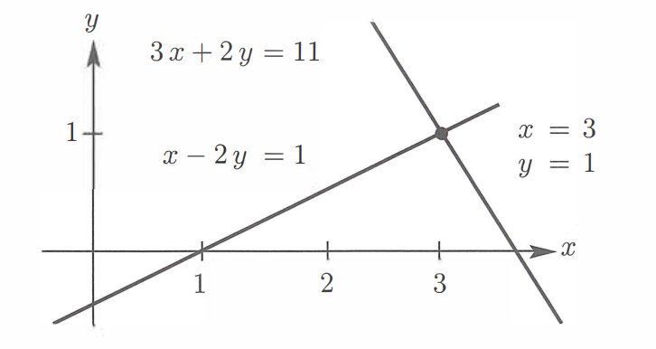
  
图 2.1　行图像：两条直线的交点 $(3,1)$ 同时满足两个方程。

**行图像**显示两条直线相交于唯一一点，这个交点就是方程组的解。

现在转向列图像。我们要把同一个线性方程组看成一个“向量方程”。将原方程组按列而不是按行分开，得到

$$
x\begin{bmatrix}1\\3\end{bmatrix}
+y\begin{bmatrix}-2\\2\end{bmatrix}
=\begin{bmatrix}1\\11\end{bmatrix}.
\tag{2}
$$

左边有两个列向量。问题是找到这两个向量的一个组合，使它等于右边的向量。也就是把第一列乘以 $x$，把第二列乘以 $y$，再将两者相加。取 $x=3$、$y=1$，就得到

$$
3\begin{bmatrix}1\\3\end{bmatrix}
+1\begin{bmatrix}-2\\2\end{bmatrix}
=\begin{bmatrix}1\\11\end{bmatrix}.
$$

图 2.2 是两个未知数、两个方程的“列图像”。图的第一部分画出两个单独的列向量，以及第一列乘以 $3$ 的结果。用一个标量（一个数）乘向量，是线性代数的两个基本运算之一。如果向量 $v$ 的分量为 $v_1,v_2$，那么 $cv$ 的分量为 $cv_1,cv_2$。

另一个基本运算是向量加法。我们分别把第一分量和第二分量相加，得到向量和 $(1,11)$，这正是所需的向量 $b$。图 2.2 的右侧画出了这个加法：两个黑色向量沿平行四边形相加，对角线就是线性方程组右端的向量 $b=(1,11)$。

  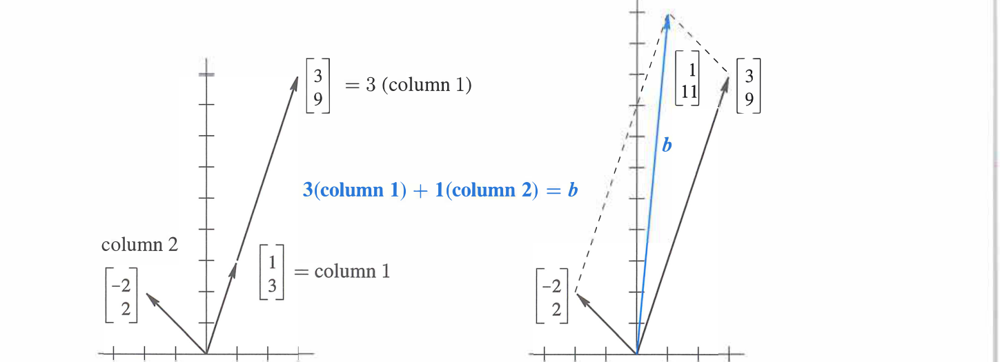
  
图 2.2　列图像：列向量的一个线性组合产生右端向量 $(1,11)$。

再说一次：向量方程左边是各列的一个线性组合，问题是找到正确的系数 $x=3$ 和 $y=1$。这里把标量乘法和向量加法合并成了一步：先分别乘以 $3$ 和 $1$，然后相加。

$$
3\begin{bmatrix}1\\3\end{bmatrix}
+1\begin{bmatrix}-2\\2\end{bmatrix}
=\begin{bmatrix}1\\11\end{bmatrix}.
$$

当然，这个解与行图像中的解完全相同。起初，两条相交直线的图像可能更加熟悉，你也许会更喜欢行图像——但很可能只会喜欢一天。作者更倾向于组合列向量，因为在四维空间中考虑四个向量的组合，要比想象四个超平面如何相交于一点容易得多，哪怕只想象一个超平面也已经很困难。

方程左侧的系数构成 $2\times2$ 矩阵

$$
A=\begin{bmatrix}1&-2\\3&2\end{bmatrix}.
$$

在线性代数中，从行和列两个方向观察同一个矩阵非常典型。矩阵的行给出行图像，列给出列图像。数字相同、方程相同，但图像不同。我们把这些方程合并成矩阵方程

$$
Ax=b,
$$

其中

$$
\begin{bmatrix}1&-2\\3&2\end{bmatrix}
\begin{bmatrix}x\\y\end{bmatrix}
=\begin{bmatrix}1\\11\end{bmatrix}.
$$

行图像处理 $A$ 的两行；列图像组合 $A$ 的两列。数 $x=3$、$y=1$ 放入向量 $x$ 中。矩阵与向量的乘法既可以理解为各行与 $x$ 的点积，也可以理解为各列的线性组合。

### 本章路线图

本章将求解任意规模的 $n$ 个未知数、$n$ 个方程。这里不会一开始就全速前进，因为小型方程组可以提供例子和图像，帮助我们获得完整理解。只要矩阵乘法与求逆这两个概念最终变得清楚，你也可以更快地阅读。它们将是理解可逆矩阵的关键。

下面四步概括了本章随后要讲解的内容。用矩阵理解消元法可以分成四步：

1. 消元通过一系列矩阵步骤 $E_{ij}$，把 $A$ 化为上三角矩阵 $U$。
2. 通过回代，从下到上求解三角方程组。
3. 用矩阵语言表示，$A$ 被分解成 $LU=(\text{下三角矩阵})(\text{上三角矩阵})$。
4. 当 $A$ 可逆时，消元能够成功，但过程中可能需要交换行。

计算科学中使用最广泛的算法之一正是执行这些步骤，MATLAB 将它称为 `lu`。更快捷的写法是反斜杠命令 `x = A\b`。不过，线性代数并不限于方阵和可逆矩阵。对于 $m\times n$ 矩阵，$Ax=0$ 可能有许多解，这些解将构成一个向量空间；$A$ 的秩将给出这个空间的维数。这些内容会在第 3 章出现，我们不急于到达那里，但最终必须到达。

### 三个未知数的三个方程

现在未知数为 $x,y,z$，并有三个线性方程：

$$
\begin{aligned}
x+2y+3z&=6,\\
2x+5y+2z&=4,\\
6x-3y+z&=2.
\end{aligned}
\tag{3}
$$

我们寻找同时满足三个方程的 $x,y,z$。所需的数可能存在，也可能不存在；对这个方程组，它们确实存在。当未知数的数量与方程数量相同——这里是 $3=3$——通常会有唯一解。

在求解前，先用两种方式观察它：

- **行图像：** 三个平面相交于一点。
- **列图像：** 三个列向量组合成 $b=(6,4,2)^T$。

在行图像中，每个方程都在三维空间中给出一个平面。图 2.3 中的第一个平面来自 $x+2y+3z=6$，它在 $(6,0,0)$、$(0,3,0)$ 和 $(0,0,2)$ 处与三条坐标轴相交。这三个点都满足方程，并确定了整个平面。

向量 $(0,0,0)$ 不满足 $x+2y+3z=6$，因此这个平面不经过原点。平面 $x+2y+3z=0$ 经过原点，并且与它平行。当右端从 $0$ 变为 $6$ 时，平面平行地离开原点。

第二个平面由 $2x+5y+2z=4$ 给出，它与第一个平面交于一条直线 $L$。三个未知数中的两个方程通常给出一条解直线，但如果两个方程分别为 $x+2y+3z=6$ 和 $x+2y+3z=0$，则不会如此。

第三个方程给出第三个平面，它在唯一一点切过直线 $L$。该点位于三个平面上，并同时满足三个方程。画出这个三重交点比想象它更困难。列图像则会立刻显示为什么 $z=2$。

  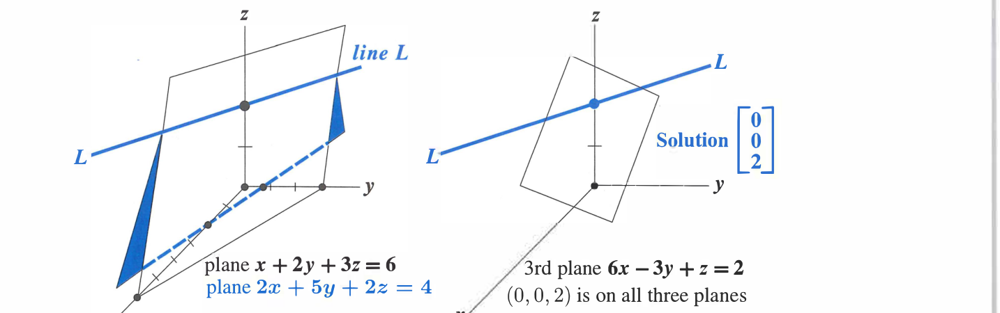
  
图 2.3　行图像：两个平面交于直线 $L$，第三个平面再与 $L$ 交于一点。

这些方程的列形式为

$$
x\begin{bmatrix}1\\2\\6\end{bmatrix}
+y\begin{bmatrix}2\\5\\-3\end{bmatrix}
+z\begin{bmatrix}3\\2\\1\end{bmatrix}
=\begin{bmatrix}6\\4\\2\end{bmatrix}.
\tag{4}
$$

未知数 $x,y,z$ 是组合的系数。我们要用它们分别乘三个列向量，产生 $b=(6,4,2)^T$。图 2.4 给出了列图像。这三个列向量的线性组合能够产生任意向量 $b$；产生当前 $b$ 的组合恰好是第三列的 $2$ 倍。因此系数是 $x=0,y=0,z=2$。行图像中的三个平面也相交于同一个解点 $(0,0,2)$。

  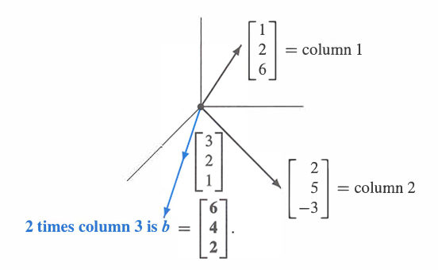
  
图 2.4　列图像：用权重 $(x,y,z)=(0,0,2)$ 组合三个列向量。

### 方程的矩阵形式

行图像中有三行，列图像中有三列，此外还有右端向量。这三行三列包含九个数，它们构成 $3\times3$ 系数矩阵

$$
A=\begin{bmatrix}
1&2&3\\
2&5&2\\
6&-3&1
\end{bmatrix}.
$$

大写字母 $A$ 代表这个方形数组中的全部九个系数。字母 $b$ 表示分量为 $6,4,2$ 的列向量；未知量 $x$ 也表示列向量，它的分量是 $x,y,z$。按行写得到方程组（3），按列写得到向量方程（4），按矩阵写则为

$$
\underbrace{\begin{bmatrix}
1&2&3\\
2&5&2\\
6&-3&1
\end{bmatrix}}_{A}
\underbrace{\begin{bmatrix}x\\y\\z\end{bmatrix}}_{x}
=
\underbrace{\begin{bmatrix}6\\4\\2\end{bmatrix}}_{b}.
\tag{5}
$$

“$A$ 乘以 $x$”究竟是什么意思？可以按行相乘，也可以按列相乘；无论哪种方式，$Ax=b$ 都必须正确表示原来的三个方程，而且两种方式都进行同样的九次数值乘法。

按行相乘时，$Ax$ 来自每一行与列向量 $x$ 的点积：

$$
Ax=
\begin{bmatrix}
(\text{第 1 行})\mathbin{\boldsymbol\cdot}x\\
(\text{第 2 行})\mathbin{\boldsymbol\cdot}x\\
(\text{第 3 行})\mathbin{\boldsymbol\cdot}x
\end{bmatrix}.
\tag{6}
$$

按列相乘时，$Ax$ 是列向量的组合：

$$
Ax=x(\text{第 1 列})+y(\text{第 2 列})+z(\text{第 3 列}).
\tag{7}
$$

代入解 $x=(0,0,2)^T$，两种乘法都得到 $b$。第一行与 $x$ 的点积为 $(1,2,3)\boldsymbol\cdot(0,0,2)=6$，另两行的点积为 $4$ 和 $2$。本书将重点把 $Ax$ 理解为 $A$ 的各列的组合。

**例 1**　设

$$
A=\begin{bmatrix}1&0&0\\1&0&0\\1&0&0\end{bmatrix},
\qquad
I=\begin{bmatrix}1&0&0\\0&1&0\\0&0&1\end{bmatrix},
\qquad
x=\begin{bmatrix}4\\5\\6\end{bmatrix}.
$$

如果从行的角度看，$(1,0,0)$ 与 $(4,5,6)$ 的点积是 $4$；如果从列的角度看，线性组合 $Ax$ 是第一列 $(1,1,1)^T$ 的 $4$ 倍，因为 $A$ 的第二列和第三列都是零向量。

矩阵 $I$ 很特殊，它在主对角线上有三个 $1$，其余位置为 $0$。无论它乘以什么向量，该向量都不改变。这相当于数的乘法中乘以 $1$：

$$
Ix=x.
$$

这个特殊矩阵就是 $3\times3$ 单位矩阵。

### 矩阵记号

$2\times2$ 矩阵的第一行包含 $a_{11},a_{12}$，第二行包含 $a_{21},a_{22}$。第一个下标给出行号，第二个下标给出列号，因此 $a_{ij}$ 表示第 $i$ 行第 $j$ 列的元素。在键盘输入中，常写成 `A(i,j)`；例如 $a_{57}=A(5,7)$ 位于第 5 行第 7 列。

$$
\begin{bmatrix}a_{11}&a_{12}\\a_{21}&a_{22}\end{bmatrix}
=
\begin{bmatrix}A(1,1)&A(1,2)\\A(2,1)&A(2,2)\end{bmatrix}.
$$

对于 $m\times n$ 矩阵，行指标 $i$ 从 $1$ 到 $m$，列指标 $j$ 从 $1$ 到 $n$，共有 $mn$ 个元素 $a_{ij}=A(i,j)$。$n$ 阶方阵有 $n^2$ 个元素。

### 关键思想回顾

  

    <ol style="margin:0; padding-left:1.6em;">
      <li style="margin:0.35em 0;">向量的基本运算是标量乘法 $cv$ 和向量加法 $v+w$。</li>
      <li style="margin:0.35em 0;">把两种运算结合起来，就得到线性组合 $cv+dw$。</li>
      <li style="margin:0.35em 0;">矩阵与向量的乘积 $Ax$ 可以逐行用点积计算，但必须把 $Ax$ 理解为 $A$ 的各列的组合。</li>
      <li style="margin:0.35em 0;">列图像：$Ax=b$ 要求找到一个列向量组合来产生 $b$。</li>
      <li style="margin:0.35em 0;">行图像：$Ax=b$ 中的每个方程给出一条直线（$n=2$）、一个平面（$n=3$）或一个超平面（$n>3$）。如果解存在，它们在一个或多个解处相交。</li>
    </ol>
  

### Worked Examples

**2.1 A**　描述下列三个方程 $Ax=b$ 的列图像，并通过仔细观察列向量而不是使用消元法求解：

$$
\begin{aligned}
x+3y+2z&=-3,\\
2x+2y+2z&=-2,\\
3x+5y+6z&=-5,
\end{aligned}
\qquad
\begin{bmatrix}1&3&2\\2&2&2\\3&5&6\end{bmatrix}
\begin{bmatrix}x\\y\\z\end{bmatrix}
=\begin{bmatrix}-3\\-2\\-5\end{bmatrix}.
$$

**解**　列图像要求从 $A$ 的三列中找到一个线性组合来产生 $b$。这里 $b$ 恰好等于第二列的相反数，因此

$$
x=0,\qquad y=-1,\qquad z=0.
$$

要说明 $(0,-1,0)$ 是唯一解，还需要知道“$A$ 可逆”“各列线性无关”以及“行列式不为零”。这些概念尚未定义，但检验方法来自消元：我们需要三个非零主元，而这个矩阵确实有三个非零主元。

如果右端改为 $b=(4,4,8)^T$，它等于前两列之和。于是正确组合为 $x=1,y=1,z=0$，解变为 $(1,1,0)$。

**2.1 B**　下列方程组没有解。行图像中的三个平面不相交于一点；三列的任何组合都不能产生 $b$。怎样证明这一点？

$$
\begin{aligned}
x+3y+5z&=4\\
x+2y-3z&=5\\
2x+5y+2z&=8
\end{aligned}
$$

把“方程 1 + 方程 2 - 方程 3”相加，得到 $0=1$，因此方程组不可能有解。也可以说，向量 $(1,1,-1)^T$ 与 $A$ 的三列都正交，却不与 $b$ 正交。

1. 三个平面中是否有任意两个互相平行？哪些平面与 $x+3y+5z=4$ 平行？
2. 分别用 $y=(1,1,-1)^T$ 与 $A$ 的每一列以及 $b$ 做点积。这些点积怎样说明不存在等于 $b$ 的列组合？
3. 找出三个不同的右端向量 $b^*,b^{**},b^{***}$，使方程组存在解。

**解**

1. 尽管三个平面不相交于一点，但其中任意两个都不平行。要得到与 $x+3y+5z=4$ 平行的平面，只需改变右端的 $4$。平面 $x+3y+5z=0$ 经过原点。把整个方程乘任意非零常数仍表示同一平面，例如 $2x+6y+10z=8$。
2. $A$ 的每一列与 $y=(1,1,-1)^T$ 的点积都是零，但 $y\boldsymbol\cdot b=(1,1,-1)\boldsymbol\cdot(4,5,8)=1$。因此 $Ax=b$ 会导出 $0=1$，所以没有解。
3. 当 $b$ 是列向量的组合时就有解。以下三种选择分别具有解 $x^*=(1,0,0)^T$、$x^{**}=(1,1,1)^T$ 和 $x^{***}=(0,0,0)^T$：

$$
b^*=\begin{bmatrix}1\\1\\2\end{bmatrix}
\quad(\text{第一列}),
\qquad
b^{**}=\begin{bmatrix}9\\0\\9\end{bmatrix}
\quad(\text{三列之和}),
\qquad
b^{***}=\begin{bmatrix}0\\0\\0\end{bmatrix}.
$$

## 2.2 消元思想

  

    <ol style="margin:0; padding-left:1.6em;">
      <li style="margin:0.35em 0;">当 $m=n=3$ 时，$Ax=b$ 包含三个方程和三个未知数 $x_1,x_2,x_3$。</li>
      <li style="margin:0.35em 0;">前两个方程为 $a_{11}x_1+\cdots=b_1$ 和 $a_{21}x_1+\cdots=b_2$。</li>
      <li style="margin:0.35em 0;">将第一个方程乘以 $a_{21}/a_{11}$ 后从第二个方程中减去，便消去了 $x_1$。</li>
      <li style="margin:0.35em 0;">左上角元素 $a_{11}$ 是第一个“主元”，比值 $a_{21}/a_{11}$ 是第一个“乘数”。</li>
      <li style="margin:0.35em 0;">对每个剩余方程 $i$，减去第一个方程的 $a_{i1}/a_{11}$ 倍，从而消去 $x_1$。</li>
      <li style="margin:0.35em 0;">此时最后 $n-1$ 个方程只包含 $n-1$ 个未知数 $x_2,\ldots,x_n$。重复同一过程消去 $x_2$。</li>
      <li style="margin:0.35em 0;">如果主元位置出现零，消元就会中断；交换两个方程有时能够挽救消元过程。</li>
    </ol>
  

本章介绍一种系统求解线性方程组的方法，称为**消元法**。在前面的 $2\times2$ 例子中可以立刻看到它。消元前，两个方程中都出现 $x$ 和 $y$；消元后，第一个未知数 $x$ 从第二个方程中消失：

  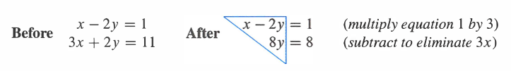

新方程 $8y=8$ 立即给出 $y=1$。把 $y=1$ 代回第一式，得到 $x-2=1$，所以 $x=3$。完整解为 $(x,y)=(3,1)$。

消元产生了一个上三角方程组，这正是我们的目标。非零系数 $1,-2,8$ 构成一个三角形。三角方程组从下向上求解：先求 $y=1$，再求 $x=3$。这个快速过程称为**回代**；任意规模的上三角方程组都在消元得到三角形后用它求解。

重要的是，原方程组与新方程组具有相同的解 $(3,1)$。图 2.5 把两个方程组都表示为一对直线；消元后直线仍然在同一点相交，因为每一步都使用了等价的正确方程。

  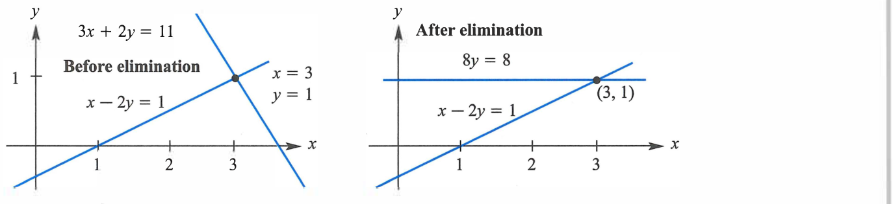
  
图 2.5　消去 $x$ 后第二条直线变成水平线，$8y=8$ 给出 $y=1$。

从第一对直线到第二对直线，是把第一个方程的 $3$ 倍从第二个方程中减去。这是本章的基本操作：

> 为了从方程 2 中消去 $x$，从方程 2 中减去方程 1 的适当倍数。

第一个方程的 $3$ 倍为 $3x-6y=3$，从 $3x+2y=11$ 中减去它，右端变为 $8$，左端的 $3x$ 被消去，剩下 $2y-(-6y)=8y$。方程组成为三角形。

乘数 $\ell=3$ 是怎样得到的？第一个方程中的 $x$ 系数为 $1$，所以第一个主元是 $1$；第二个方程中的 $x$ 系数为 $3$，于是乘数为 $3/1=3$。

如果把第一式改写为 $4x-8y=4$，它仍表示同一条直线，但第一个主元变为 $4$。此时正确乘数为 $\ell=3/4$：用待消去的系数 $3$ 除以主元 $4$。

  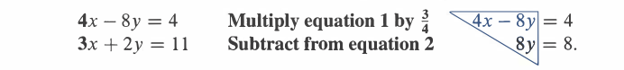

最后仍有 $y=1$，回代得到 $4x-8=4$，所以 $x=3$。数字变了，但直线和解没有变。

新第二个方程以第二个主元 $8$ 开始。如果还有第三个方程，就会用它消去第三个方程中的 $y$。求解 $n$ 个方程时，我们希望得到 $n$ 个主元；这些主元位于消元后上三角矩阵的对角线上。

即便是 $2\times2$ 方程组，消元也可能失效。理解无法得到完整主元集合时发生的情形，就能理解整个消元过程。

### 消元的失效

通常，消元会产生带我们到达解的主元，但也可能失败：某一步可能要求除以零，这是不允许的，过程必须停止。有时可以调整后继续，有时则不可避免地失败。例 1 以 $0y=8$ 结束，因而无解；例 2 以 $0y=0$ 结束，因而解太多；例 3 通过交换方程成功继续。

**例 1　永久失效：无解**

$$
\begin{aligned}
x-2y&=1,\\
3x-6y&=11
\end{aligned}
\quad\xrightarrow{\ R_2-3R_1\ }\quad
\begin{aligned}
x-2y&=1,\\
0y&=8.
\end{aligned}
$$

$0y=8$ 没有解。通常会用第二个主元除右端的 $8$，但这里不存在第二个主元，零绝不能作为主元。如果方程组无解，消元会通过 $0=8$ 这类矛盾方程发现这一事实。

行图像中，两条直线平行且永不相交；解必须同时位于两条直线上，所以不存在解。列图像中，两列 $(1,3)^T$ 和 $(-2,-6)^T$ 方向相同，它们的所有组合都位于同一直线上；右端 $(1,11)^T$ 却在另一个方向，因此不可能由这两列组合得到。

  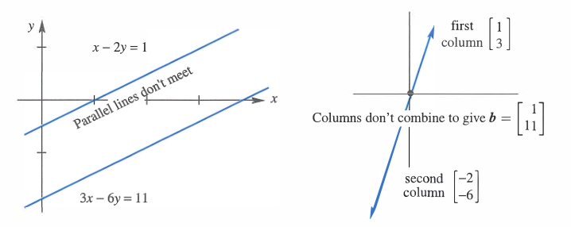
  
图 2.6　例 1 的行图像与列图像：方程组无解。

**例 2　失效：无穷多解**　把右端从 $(1,11)^T$ 改为 $(1,3)^T$：

$$
\begin{aligned}
x-2y&=1,\\
3x-6y&=3
\end{aligned}
\quad\xrightarrow{\ R_2-3R_1\ }\quad
\begin{aligned}
x-2y&=1,\\
0y&=0.
\end{aligned}
$$

每个 $y$ 都满足 $0y=0$。实际上只剩一个独立方程 $x-2y=1$。未知数 $y$ 是“自由的”，任意选择 $y$ 后，$x$ 由 $x=1+2y$ 决定。

行图像中，原来平行的两条直线现在重合，直线上的每一点都满足两个方程。列图像中，$b=(1,3)^T$ 就是第一列，可以取 $x=1,y=0$；也可以取 $x=0,y=-1/2$，因为第二列的 $-1/2$ 倍等于 $b$。行图像中的每个解也都是列图像中的解。

  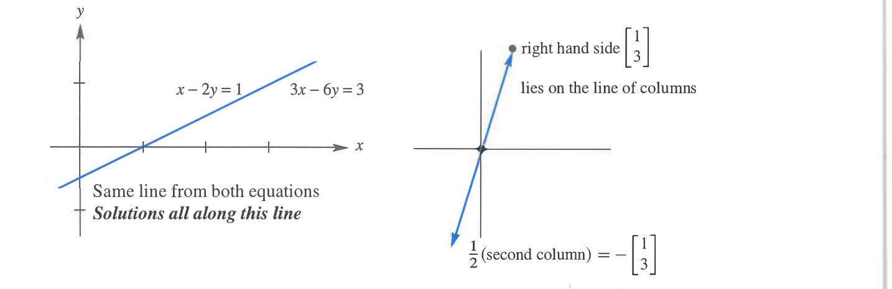
  
图 2.7　例 2 的行图像与列图像：方程组有无穷多解。

对于 $n$ 个方程，失效意味着没有得到 $n$ 个主元。消元最终会得到 $0\ne0$（无解）或 $0=0$（多解）。成功意味着得到 $n$ 个主元，但为了得到它们，有时必须交换方程。

**例 3　主元位置为零，但交换方程后消元成功**　交换两行后得到两个主元：

$$
\begin{aligned}
0x+2y&=4,\\
3x-2y&=5
\end{aligned}
\quad\xrightarrow{\text{交换两式}}\quad
\begin{aligned}
3x-2y&=5,\\
2y&=4.
\end{aligned}
$$

新方程组已经是三角形。回代先给出 $y=2$，再由第一式得到 $x=3$。行图像是两条相交直线，列向量方向不同；主元 $3$ 和 $2$ 也完全正常，只是需要一次行交换。

例 1 和例 2 是奇异的，因为不存在第二个主元；例 3 是非奇异的，因为它有完整的主元集合和唯一解。奇异方程组可能无解，也可能有无穷多解。主元必须非零，因为消元要除以它们。

> **奇异矩阵**
>
> 对于 $n\times n$ 方阵 $A$，如果消元不能得到完整的 $n$ 个非零主元，就称 $A$ 为奇异矩阵；如果能够得到 $n$ 个非零主元，就称 $A$ 为非奇异矩阵。等价地，奇异矩阵不可逆，非奇异矩阵可逆。本节先通过消元现象引入这个术语，本书在第 2 章第 2.5 节“逆矩阵”的“奇异与可逆”部分给出系统判定和证明。

### 三个未知数的三个方程

要理解高斯消元，必须超越 $2\times2$ 方程组。$3\times3$ 已足以看出模式。考虑专门选取的方程组，使所有消元步骤只出现整数：

$$
\begin{aligned}
2x+4y-2z&=2,\\
4x+9y-3z&=8,\\
-2x-3y+7z&=10.
\end{aligned}
\tag{1}
$$

第一个主元是左上角的 $2$。要消去它下面的 $4$，第一个乘数为 $\ell_{21}=4/2=2$。

**步骤 1**　从方程 2 中减去方程 1 的 $2$ 倍，得到 $y+z=4$。

还要用同一个主元消去方程 3 中的 $-2x$。直接做法是把方程 1 加到方程 3，但本书统一使用“减法”规则。乘数为 $\ell_{31}=-2/2=-1$，减去一个方程的 $-1$ 倍就等于加上该方程。

**步骤 2**　从方程 3 中减去方程 1 的 $-1$ 倍，得到 $y+5z=12$。

新的两个方程只含 $y,z$，第二个主元是 $1$：

$$
\begin{aligned}
y+z&=4,\\
y+5z&=12.
\end{aligned}
$$

**步骤 3**　从新方程 3 中减去新方程 2，乘数为 $1/1=1$，得到 $4z=8$。

原方程组 $Ax=b$ 已转化为上三角方程组 $Ux=c$：

$$
\begin{aligned}
2x+4y-2z&=2,\\
y+z&=4,\\
4z&=8.
\end{aligned}
\tag{2}
$$

从 $A$ 到 $U$ 的向前消元已经完成。$U$ 的对角线上出现主元 $2,1,4$；后两个主元隐藏在原方程组中，是消元把它们显现出来。回代十分迅速：$4z=8$ 给出 $z=2$，$y+z=4$ 给出 $y=2$，第一式给出 $x=-1$。因此

$$
(x,y,z)=(-1,2,2).
$$

行图像中的三个平面都经过这个解点。原来的平面是倾斜的，而消元后的最后一个平面 $4z=8$ 是水平的。列图像则表示用系数 $-1,2,2$ 组合 $A$ 的三列来产生 $b$：

$$
-1\begin{bmatrix}2\\4\\-2\end{bmatrix}
+2\begin{bmatrix}4\\9\\-3\end{bmatrix}
+2\begin{bmatrix}-2\\-3\\7\end{bmatrix}
=\begin{bmatrix}2\\8\\10\end{bmatrix}.
\tag{3}
$$

这些 $x,y,z$ 同时也是三角方程组 $Ux=c$ 中各列的系数。

### 从 $A$ 消元到 $U$

对于 $4\times4$ 或一般 $n\times n$ 问题，只要高斯消元能够成功，过程都相同：

- 第 1 列：用第一个方程在第一个主元下方制造零；
- 第 2 列：用新的第二个方程在第二个主元下方制造零；
- 第 3 列到第 $n$ 列：继续这个过程，找到全部 $n$ 个主元和上三角矩阵 $U$。

向前消元的结果是上三角方程组。如果存在完整的 $n$ 个非零主元，它就是非奇异的。

最后再看一个完整例子：

$$
\begin{aligned}
x+y+z&=6,\\
x+2y+2z&=9,\\
x+2y+3z&=10
\end{aligned}
\quad\xrightarrow{\text{向前消元}}\quad
\begin{aligned}
x+y+z&=6,\\
y+z&=3,\\
z&=1.
\end{aligned}
$$

全部乘数和主元都是 $1$。回代给出 $(x,y,z)=(3,2,1)$。三个平面都经过这个解点；$A$ 的三列以系数 $3,2,1$ 组合成 $b=(6,9,10)^T$，三角系统则是 $Ux=c=(6,3,1)^T$。

### 关键思想回顾

  

    <ol style="margin:0; padding-left:1.6em;">
      <li style="margin:0.35em 0;">线性方程组 $Ax=b$ 经过消元后成为上三角方程组 $Ux=c$。</li>
      <li style="margin:0.35em 0;">从方程 $i$ 中减去方程 $j$ 的 $\ell_{ij}$ 倍，使位置 $(i,j)$ 的元素变为零。</li>
      <li style="margin:0.35em 0;">乘数 $\ell_{ij}=(\text{第 }i\text{ 行待消去的元素})/(\text{第 }j\text{ 行主元})$；主元不能为零。</li>
      <li style="margin:0.35em 0;">如果主元位置为零，而它下方存在非零元素，就交换两行。</li>
      <li style="margin:0.35em 0;">上三角方程组 $Ux=c$ 用回代求解，从最下面开始。</li>
      <li style="margin:0.35em 0;">如果消元永久失效，$Ax=b$ 或者无解，或者有无穷多解。</li>
    </ol>
  

### Worked Examples

**2.2 A**　对矩阵

$$
A=\begin{bmatrix}1&1&0\\1&2&1\\0&1&2\end{bmatrix}
$$

进行消元。第一、第二主元是什么？第一步的乘数 $\ell_{21}$ 是多少？把第 $(2,2)$ 个元素 $2$ 改成什么数会迫使我们交换第 2、3 行？为什么 $\ell_{31}=0$？如果把右下角 $a_{33}=2$ 改为 $1$，为什么消元会失败？

**解**　第一个主元是 $1$，乘数 $\ell_{21}=1$。从第 2 行减去第 1 行后，第二个主元也为 $1$。如果原来的中间元素是 $1$ 而不是 $2$，第二个主元就会为零，需要交换第 2、3 行。

$a_{31}=0$，所以 $\ell_{31}=0$；一行开头本来就是零，就不需要消元。这个 $A$ 是带状矩阵，带外元素在消元过程中保持为零。最后一个主元也为 $1$。如果把原来的 $a_{33}=2$ 降为 $1$，消元后第三个主元将变为零，于是消元失败。

**2.2 B**　假设 $A$ 已经是三角矩阵（上三角或下三角），在哪里可以直接看到它的主元？什么时候 $Ax=b$ 对每个 $b$ 都恰好有一个解？

**解**　三角矩阵的主元已经位于主对角线上。当全部对角元素非零时，消元成功。上三角矩阵使用回代；下三角矩阵则从上到下前代。

**2.2 C**　用消元得到上三角矩阵 $U$，再回代求解，或者解释为什么不可能求解。必要时交换方程。两个系统的唯一区别是最后一个方程中的 $x$ 与 $-x$：

$$
\begin{array}{ll}
\text{成功：}&
\begin{cases}
x+y+z=7,\\
x+y-z=5,\\
x-y+z=3;
\end{cases}
\\[12pt]
\text{失败：}&
\begin{cases}
x+y+z=7,\\
x+y-z=5,\\
-x-y+z=3.
\end{cases}
\end{array}
$$

**解**　对第一个系统，从方程 2 和 3 中减去方程 1。位置 $(2,2)$ 变为零，因此交换方程 2、3：

$$
\begin{aligned}
x+y+z&=7,\\
-2y&=-4,\\
-2z&=-2.
\end{aligned}
$$

回代得到 $z=1,y=2,x=4$，主元为 $1,-2,-2$。

对第二个系统，从方程 2 中减去方程 1，并把方程 1 加到方程 3，得到

$$
\begin{aligned}
x+y+z&=7,\\
-2z&=-2,\\
2z&=10.
\end{aligned}
$$

第 2 列没有主元；继续消元得到 $0z=8$，所以三个平面不相交。平面 1 与平面 2 交于一条直线，平面 1 与平面 3 交于另一条平行直线，因此无解。

如果把原第三个方程右端的 $3$ 改为 $-5$，消元将得到 $0=0$，方程组有无穷多解。此时 $z=1$，第一式给出 $x+y=6$；因为第 2 列没有主元，$y$ 是自由变量，$x=6-y$。

## 2.3 用矩阵进行消元

  

    <ol style="margin:0; padding-left:1.6em;">
      <li style="margin:0.35em 0;">第一步用矩阵 $E_{21}$ 乘方程 $Ax=b$，得到 $E_{21}Ax=E_{21}b$。</li>
      <li style="margin:0.35em 0;">矩阵 $E_{21}A$ 的第 2 行第 1 列为零，因为方程 2 中的 $x_1$ 已被消去。</li>
      <li style="margin:0.35em 0;">$E_{21}$ 等于单位矩阵减去位于第 2 行第 1 列的乘数 $a_{21}/a_{11}$。</li>
      <li style="margin:0.35em 0;">矩阵乘矩阵可以看成 $n$ 次矩阵乘向量：$EA=[Ea_1\ \cdots\ Ea_n]$。</li>
      <li style="margin:0.35em 0;">右端也必须乘以 $E$，因此 $E$ 实际上乘增广矩阵 $[A\ b]=[a_1\ \cdots\ a_n\ b]$。</li>
      <li style="margin:0.35em 0;">消元依次用 $E_{21},E_{31},\ldots,E_{n1}$，再用 $E_{32},E_{42},\ldots,E_{n2}$，如此继续。</li>
      <li style="margin:0.35em 0;">交换行使用的不是 $E_{ij}$，而是 $P_{ij}$；从 $I$ 交换第 $i,j$ 行即可得到 $P_{ij}$。</li>
    </ol>
  

本节给出矩阵乘法的第一批例子。很自然，我们从含有大量零的矩阵开始。目标是理解矩阵会“做事情”：$E$ 作用于向量 $b$ 或矩阵 $A$，产生新的向量 $Eb$ 或新的矩阵 $EA$。

最先出现的是消元矩阵，它们执行消元步骤：把方程 $j$ 乘以 $\ell_{ij}$，再从方程 $i$ 中减去，从而消去方程 $i$ 中的 $x_j$。主对角线下每个需要消去的非零元素都对应一个简单矩阵 $E_{ij}$。

后续章节不会逐个写出所有 $E_{ij}$，因为数量太多。它们可以合并成一个总矩阵 $E$，一次完成全部消元。更整洁的做法是把它们的逆矩阵按正确顺序合并为

$$
L=E^{-1}.
$$

接下来的目标是：

1. 看清每一步怎样成为一次矩阵乘法；
2. 把所有 $E_{ij}$ 合并为总消元矩阵 $E$；
3. 看清每个 $E_{ij}$ 怎样由 $E_{ij}^{-1}$ 撤销；
4. 按正确顺序把全部逆矩阵合并为 $L$。

$L$ 的特殊之处在于所有乘数 $\ell_{ij}$ 都会准确落入对应位置。在执行从 $A$ 到 $U$ 的向前消元时，这些数在 $E$ 中混合在一起；而在撤销消元、从 $U$ 返回 $A$ 的 $L$ 中，它们排列得非常整齐。求逆会颠倒步骤以及矩阵 $E_{ij}^{-1}$ 的顺序，从而避免混乱。

### 矩阵乘向量与 $Ax=b$

上一节的 $3\times3$ 例子可写成

$$
\begin{bmatrix}
2&4&-2\\
4&9&-3\\
-2&-3&7
\end{bmatrix}
\begin{bmatrix}x_1\\x_2\\x_3\end{bmatrix}
=
\begin{bmatrix}2\\8\\10\end{bmatrix}.
\tag{1}
$$

左边九个系数进入矩阵 $A$。这个矩阵不是简单地写在 $x$ 旁边，它是在乘 $x$；“$A$ 乘 $x$”的规则正是为了产生原来的三个方程。

<blockquote style="margin:1em 0; padding:0.7em 1em; border-left:3px solid #aaa; color:inherit;">
  
这里所说的三个方程是：

  

    $$
    \begin{aligned}
    2x_1+4x_2-2x_3&=2,\\
    4x_1+9x_2-3x_3&=8,\\
    -2x_1-3x_2+7x_3&=10.
    \end{aligned}
    $$
  

</blockquote>

矩阵与向量相乘，结果仍是一个向量。把上面的方程组写成系数矩阵时，每个方程的系数占一行，所以矩阵 $A$ 有三行；每一行依次记录 $x_1,x_2,x_3$ 的系数，所以矩阵 $A$ 有三列。因此，$A$ 是一个三行三列的 $3\times3$ 方阵。未知向量 $x=(x_1,x_2,x_3)^T$ 则把三个未知数排成一列。一般地，若方程组有 $m$ 个方程和 $n$ 个未知数，系数矩阵就是 $m\times n$ 矩阵；只有当 $m=n$ 时，它才是方阵。

$Ax=b$ 同时表示方程的行形式和列形式。列形式为

$$
Ax=x_1\begin{bmatrix}2\\4\\-2\end{bmatrix}
+x_2\begin{bmatrix}4\\9\\-3\end{bmatrix}
+x_3\begin{bmatrix}-2\\-3\\7\end{bmatrix}.
\tag{2}
$$

$Ax$ 是 $A$ 的列向量的组合。要计算 $Ax$ 的每个分量，则使用矩阵乘法的行形式：第 $i$ 个分量是第 $i$ 行与 $x$ 的点积

$$
(Ax)_i=(\text{第 }i\text{ 行})\boldsymbol\cdot x
=a_{i1}x_1+a_{i2}x_2+\cdots+a_{in}x_n
=\sum_{j=1}^{n}a_{ij}x_j.
$$

求和符号 $\sum$ 指示我们从 $j=1$ 加到 $j=n$。矩阵元素 $a_{ij}=A(i,j)$ 位于第 $i$ 行、第 $j$ 列；矩阵使用“元素”一词，向量则使用“分量”。

**例 1**　设一个 $2\times2$ 矩阵 $A$ 的第 $i$ 行、第 $j$ 列元素由

$$
a_{ij}=2i+j
$$

给出。依次取 $i,j=1,2$，可得

$$
a_{11}=3,\qquad a_{12}=4,\qquad
a_{21}=5,\qquad a_{22}=6,
$$

所以

$$
A=\begin{bmatrix}3&4\\5&6\end{bmatrix}.
$$

取 $x=(2,1)^T$。按照“$A$ 的每一行与 $x$ 做点积”的规则，

$$
\begin{bmatrix}3&4\\5&6\end{bmatrix}
\begin{bmatrix}2\\1\end{bmatrix}
=
\begin{bmatrix}3\cdot2+4\cdot1\\5\cdot2+6\cdot1\end{bmatrix}
=\begin{bmatrix}10\\16\end{bmatrix}.
$$

第一行与 $x$ 的点积给出 $Ax$ 的第一个分量，第二行与 $x$ 的点积给出第二个分量。这个例子既说明了 $a_{ij}$ 的下标含义，也说明了矩阵乘向量时如何逐行计算。爱因斯坦求和约定甚至省略 $\sum$，重复指标 $j$ 自动表示求和；本书仍明确写出 $\sum$。

### 一个消元步骤的矩阵形式

这里继续使用本节开头公式（1）中的三元方程组。三个方程是

$$
\begin{aligned}
\text{方程 1：}&\quad 2x_1+4x_2-2x_3=2,\\
\text{方程 2：}&\quad 4x_1+9x_2-3x_3=8,\\
\text{方程 3：}&\quad -2x_1-3x_2+7x_3=10.
\end{aligned}
$$

方程 2 中 $x_1$ 的系数是 $4$，方程 1 中 $x_1$ 的系数是主元 $2$，所以消元乘数为 $4/2=2$。从方程 2 中减去方程 1 的 $2$ 倍：

$$
\begin{aligned}
&(4x_1+9x_2-3x_3)-2(2x_1+4x_2-2x_3)\\
&\qquad=x_2+x_3,\\[3pt]
&8-2\cdot2=4.
\end{aligned}
$$

因此，消元后的第二个方程是 $x_2+x_3=4$。原方程组中三个等号右侧的常数依次为 $2,8,10$，把它们从上到下排成一列，就得到右端向量 $b$。这次行操作只改变方程 2：它的右端由 $8$ 变为 $8-2\cdot2=4$；方程 1 和方程 3 没有改变，所以它们右端的 $2$ 和 $10$ 也保持不变。于是

$$
b=\begin{bmatrix}2\\8\\10\end{bmatrix}
\quad\longrightarrow\quad
b_{\text{new}}=\begin{bmatrix}2\\4\\10\end{bmatrix}.
$$

同一行操作可以通过消元矩阵 $E_{21}$ 乘 $b$ 完成：

$$
E_{21}=
\begin{bmatrix}
1&0&0\\
-2&1&0\\
0&0&1
\end{bmatrix},
\qquad
E_{21}\begin{bmatrix}2\\8\\10\end{bmatrix}
=\begin{bmatrix}2\\4\\10\end{bmatrix}.
$$

第 1、3 行来自单位矩阵，所以不改变第 1、3 个分量；新的第二分量是 $b_2-2b_1=4$。

一般地，从单位矩阵 $I$ 开始，把位置 $(i,j)$ 的零改成 $-\ell$，就得到初等矩阵或消元矩阵 $E_{ij}$。它从第 $i$ 行中减去第 $j$ 行的 $\ell$ 倍。

**例 2**　$E_{31}$ 在位置 $(3,1)$ 上有 $-\ell$：

$$
E_{31}=\begin{bmatrix}1&0&0\\0&1&0\\-\ell&0&1\end{bmatrix}.
$$

取 $\ell=4$ 时，它从向量的第三分量中减去第一分量的 $4$ 倍。例如第三分量由 $9$ 变为 $9-4=5$。

对 $Ax=b$ 的左边也必须乘同一个 $E$。$E_{31}$ 的目的，是把矩阵 $A$ 的位置 $(3,1)$ 变为零。从 $A$ 开始，依次应用 $E_{21},E_{31},\ldots$，在主元下方制造零，最终得到上三角矩阵 $U$。

消元过程中向量 $x$ 保持不变，也就是解不变；发生改变的是系数矩阵和右端。从 $Ax=b$ 出发，两边乘以 $E$ 得

$$
EAx=Eb.
$$

### 矩阵乘法

现在把同一消元操作应用于上述三元方程组的系数矩阵 $A$：从 $A$ 的第 2 行中减去第 1 行的 $2$ 倍，得到

$$
\begin{bmatrix}1&0&0\\-2&1&0\\0&0&1\end{bmatrix}
\begin{bmatrix}2&4&-2\\4&9&-3\\-2&-3&7\end{bmatrix}
=
\begin{bmatrix}2&4&-2\\0&1&1\\-2&-3&7\end{bmatrix}.
\tag{3}
$$

第 1、3 行没有改变，第 2 行减去了第 1 行的 $2$ 倍。矩阵乘法与消元完全一致，新方程组为 $EAx=Eb$。

从 $Ax=b$ 开始，两边乘 $E$ 得 $E(Ax)=Eb$；矩阵乘法又允许写成 $(EA)x=Eb$。二者相同，因此通常省略括号，直接写成 $EAx$。更一般地，$EAC$ 可以先计算 $AC$，也可以先计算 $EA$：

$$
A(BC)=(AB)C.
$$

这就是结合律。与数不同，矩阵乘法通常不满足交换律：

$$
AB\ne BA.
$$

$E$ 从左侧乘 $A$ 时作用于行；从右侧乘时作用于列。例如这里的 $AE$ 会从第 1 列中减去第 2 列的 $2$ 倍，而不是执行原来的行操作。

若矩阵 $B$ 的列为 $b_1,b_2,b_3$，矩阵乘法可以逐列进行：

$$
EB=E\begin{bmatrix}b_1&b_2&b_3\end{bmatrix}
=\begin{bmatrix}Eb_1&Eb_2&Eb_3\end{bmatrix}.
\tag{4}
$$

这一要求从列的角度描述矩阵乘法，而消元则作用在行上；矩阵乘法的精妙之处在于行、列和整个矩阵三种观察方式都得到正确结果。

### 用于行交换的矩阵 $P_{ij}$

从第 $i$ 行中减去第 $j$ 行的倍数使用 $E_{ij}$；交换两行则使用置换矩阵 $P_{ij}$。当主元位置为零而下方存在非零元素时，通过交换两行可以把非零元素移到主元位置。

交换第 2、3 行的矩阵，是把单位矩阵 $I$ 的第 2、3 行交换：

$$
P_{23}=\begin{bmatrix}1&0&0\\0&0&1\\0&1&0\end{bmatrix}.
$$

$P_{23}$ 乘列向量时交换其第 2、3 个分量；乘矩阵时交换矩阵的第 2、3 行。一般地，$P_{ij}$ 是交换了第 $i,j$ 行的单位矩阵。通常消元不需要行交换，但当主元位置为零时，$P_{ij}$ 可以把下方非零元素移上来。

### 增广矩阵

消元对 $A$ 和 $b$ 执行完全相同的行操作，因此可以把 $b$ 作为附加的一列，形成增广矩阵

$$
[A\ b]=
\left[
\begin{array}{ccc|c}
2&4&-2&2\\
4&9&-3&8\\
-2&-3&7&10
\end{array}
\right]
$$

消元作用于这个矩阵的整行。左边和右边同时乘 $E_{21}$，从第 2 行中减去第 1 行的 $2$ 倍：

$$
E_{21}[A\ b]
=
\left[
\begin{array}{ccc|c}
2&4&-2&2\\
0&1&1&4\\
-2&-3&7&10
\end{array}
\right]
=[E_{21}A\ E_{21}b]
$$

新第二行是 $(0,1,1,4)$，代表方程 $x_2+x_3=4$。从行的角度，每一行 $E$ 都作用于 $[A\ b]$，产生 $[EA\ Eb]$ 的一行；从列的角度，$E$ 分别作用于 $[A\ b]$ 的每一列。

矩阵不是静止的数组，它们执行操作：$A$ 作用于 $x$ 产生 $b$，$E$ 作用于 $A$ 产生 $EA$。整个消元过程是一系列行操作，也就是一系列矩阵乘法。完成所有向前消元步骤后，主元下方的元素都变为零，所得矩阵是上三角矩阵，记作 $U$；字母 $U$ 来自英文 *upper triangular*：

$$
A\longrightarrow E_{21}A
\longrightarrow E_{31}E_{21}A
\longrightarrow E_{32}E_{31}E_{21}A=U.
$$

因此，$U=E_{32}E_{31}E_{21}A$ 是由 $A$ 消元得到的结果，并不是另一个预先给定的矩阵。右端始终包含在增广矩阵中，最终得到上三角方程组 $Ux=c$。

### 关键思想回顾

  

    <ol style="margin:0; padding-left:1.6em;">
      <li style="margin:0.35em 0;">$Ax=x_1(\text{第 1 列})+\cdots+x_n(\text{第 }n\text{ 列})$，并且 $(Ax)_i=\sum_{j=1}^na_{ij}x_j$。</li>
      <li style="margin:0.35em 0;">单位矩阵记为 $I$，使用乘数 $\ell_{ij}$ 的消元矩阵记为 $E_{ij}$，交换矩阵记为 $P_{ij}$。</li>
      <li style="margin:0.35em 0;">用 $E_{21}$ 乘 $Ax=b$，就是从方程 2 中减去方程 1 的 $\ell_{21}$ 倍；$E_{21}$ 的位置 $(2,1)$ 为 $-\ell_{21}$。</li>
      <li style="margin:0.35em 0;">对增广矩阵 $[A\ b]$，同一步骤得到 $[E_{21}A\ E_{21}b]$。</li>
      <li style="margin:0.35em 0;">当 $A$ 乘任意矩阵 $B$ 时，它分别乘 $B$ 的每一列。</li>
    </ol>
  

### Worked Examples

**2.3 A**　什么 $3\times3$ 矩阵 $E_{21}$ 能从第 2 行中减去第 1 行的 $4$ 倍？什么矩阵 $P_{32}$ 能交换第 2、3 行？如果把它们从右侧乘 $A$，$AE_{21}$ 与 $AP_{32}$ 分别执行什么操作？

**解**　对单位矩阵执行相应操作，得到

$$
E_{21}=\begin{bmatrix}1&0&0\\-4&1&0\\0&0&1\end{bmatrix},
\qquad
P_{32}=\begin{bmatrix}1&0&0\\0&0&1\\0&1&0\end{bmatrix}.
$$

从右侧乘 $E_{21}$ 会从第 1 列中减去第 2 列的 $4$ 倍；从右侧乘 $P_{32}$ 会交换第 2、3 列。

**2.3 B**　写出下列方程组的增广矩阵，先应用 $E_{21}$，再应用 $P_{32}$，得到三角方程组并回代求解。什么组合矩阵 $P_{32}E_{21}$ 能一次完成两步？

$$
\begin{aligned}
x+2y+2z&=1,\\
4x+8y+9z&=3,\\
3y+2z&=1.
\end{aligned}
$$

**解**

$$
[A\ b]=
\left[\begin{array}{ccc|c}1&2&2&1\\4&8&9&3\\0&3&2&1\end{array}\right],
$$

$$
E_{21}[A\ b]=
\left[\begin{array}{ccc|c}1&2&2&1\\0&0&1&-1\\0&3&2&1\end{array}\right],
$$

$$
P_{32}E_{21}[A\ b]=
\left[\begin{array}{ccc|c}1&2&2&1\\0&3&2&1\\0&0&1&-1\end{array}\right].
$$

回代得到 $z=-1,y=1,x=1$。一次完成两步的矩阵为

$$
P_{32}E_{21}
=\begin{bmatrix}1&0&0\\0&0&1\\-4&1&0\end{bmatrix}.
$$

**2.3 C**　用两种方法计算下列矩阵乘积：先用 $A$ 的行乘 $B$ 的列；再用 $A$ 的列乘 $B$ 的行。第二种方法产生两个相加的矩阵。一共需要多少次普通数值乘法？

$$
AB=
\begin{bmatrix}3&4\\1&5\\2&0\end{bmatrix}
\begin{bmatrix}2&4\\1&1\end{bmatrix}.
$$

**解**　行乘列得到

$$
AB=\begin{bmatrix}10&16\\7&9\\4&8\end{bmatrix}.
$$

需要六个点积，每个点积含两次乘法，共 $3\cdot2\cdot2=12$ 次普通乘法。按列乘行则为

$$
AB=
\begin{bmatrix}3\\1\\2\end{bmatrix}
\begin{bmatrix}2&4\end{bmatrix}
+
\begin{bmatrix}4\\5\\0\end{bmatrix}
\begin{bmatrix}1&1\end{bmatrix}
=
\begin{bmatrix}6&12\\2&4\\4&8\end{bmatrix}
+
\begin{bmatrix}4&4\\5&5\\0&0\end{bmatrix}
=
\begin{bmatrix}10&16\\7&9\\4&8\end{bmatrix}.
$$

## 2.4 矩阵运算规则

  

    <ol style="margin:0; padding-left:1.6em;">
      <li style="margin:0.35em 0;">有 $n$ 列的矩阵 $A$ 可以乘有 $n$ 行的矩阵 $B$：$A_{m\times n}B_{n\times p}=C_{m\times p}$。</li>
      <li style="margin:0.35em 0;">$AB=C$ 的每个元素都是点积：$c_{ij}=(A\text{ 的第 }i\text{ 行})\boldsymbol\cdot(B\text{ 的第 }j\text{ 列})$。</li>
      <li style="margin:0.35em 0;">这个规则保证 $(AB)C=A(BC)$，并且 $(AB)x=A(Bx)$。</li>
      <li style="margin:0.35em 0;">还可以用三种方式计算 $AB$：$A$ 乘 $B$ 的各列、$A$ 的各行乘 $B$、$A$ 的各列乘 $B$ 的各行。</li>
      <li style="margin:0.35em 0;">通常 $AB\ne BA$，多数矩阵 $A$ 与 $B$ 不交换。</li>
      <li style="margin:0.35em 0;">矩阵可按块相乘：若 $A=[A_1\ A_2]$、$B=[B_1^T\ B_2^T]^T$，则 $AB=A_1B_1+A_2B_2$。</li>
    </ol>
  

矩阵是由数或“元素”组成的矩形数组。$A$ 有 $m$ 行、$n$ 列时，称为 $m\times n$ 矩阵。形状相同的矩阵可以相加，也可以乘任意常数 $c$。矩阵加法和向量加法完全一样，逐个元素进行；列向量也可以看成只有一列的矩阵。矩阵 $-A$ 是 $A$ 乘以 $-1$，而 $A+(-A)$ 是全部元素都为零的零矩阵。

第 $i$ 行第 $j$ 列的元素记为 $a_{ij}$ 或 $A(i,j)$。第一行是 $a_{11},a_{12},\ldots,a_{1n}$；左下角为 $a_{m1}$，右下角为 $a_{mn}$。行指标 $i$ 从 $1$ 到 $m$，列指标 $j$ 从 $1$ 到 $n$。

矩阵加法很简单，真正重要的问题是矩阵乘法：什么时候可以计算 $AB$，乘积又是什么？如果 $A$ 有 $n$ 列，$B$ 必须有 $n$ 行。两个 $3\times2$ 矩阵不能相乘；但 $3\times2$ 的 $A$ 可以乘 $2\times1$、$2\times2$ 或 $2\times20$ 的 $B$。

矩阵乘法必须遵守基本规律

$$
(AB)C=A(BC).
\tag{1}
$$

括号可以安全移动，这一结合律是线性代数的基础。

若 $A$ 为 $m\times n$，$B$ 为 $n\times p$，则

$$
(m\times n)(n\times p)=(m\times p).
$$

乘积 $AB$ 有与 $A$ 相同的行数、与 $B$ 相同的列数。$1\times n$ 行向量乘 $n\times1$ 列向量是极端情形，结果是 $1\times1$ 的单个数，即点积。

### 第一种方法：行乘列

$AB$ 的位置 $(i,j)$ 是 $A$ 的第 $i$ 行与 $B$ 的第 $j$ 列的点积：

$$
(AB)_{ij}=\sum_{k=1}^{n}a_{ik}b_{kj}.
$$

图 2.8 从 $4\times5$ 矩阵 $A$ 中选取第 2 行，从 $5\times6$ 矩阵 $B$ 中选取第 3 列；二者的点积进入 $AB$ 的第 2 行第 3 列。乘积 $AB$ 为 $4\times6$。

  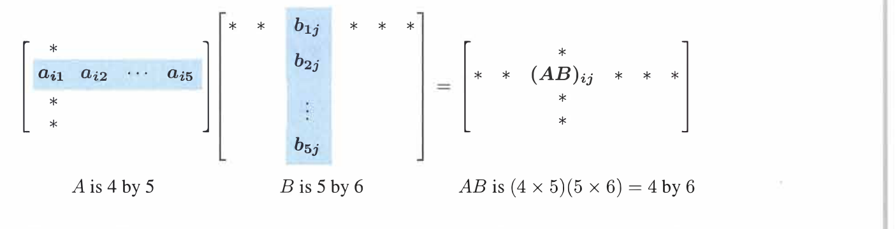
  
图 2.8　当 $i=2,j=3$ 时，$(AB)_{23}$ 等于第 2 行与第 3 列的点积。

**例 1**　两个方阵能够相乘，当且仅当它们阶数相同。例如两个 $2\times2$ 矩阵的乘积包含四个点积，每个点积进行两次普通乘法，共需 $2^3=8$ 次乘法。

一般地，两个 $n\times n$ 矩阵相乘，结果仍为 $n\times n$，其中有 $n^2$ 个点积，每个点积需要 $n$ 次乘法，因此常规算法需要 $n^3$ 次普通乘法。当 $n=100$ 时，需要一百万次乘法。

人们曾以为 $2\times2$ 矩阵相乘绝对需要 $8$ 次乘法，后来发现可以用 $7$ 次乘法配合更多加法完成。把大型矩阵分成 $2\times2$ 块后，这个思想也降低了大矩阵乘法的指数；理论上次数可降到约 $n^{2.376}$。不过这些算法较复杂，科学计算通常仍使用常规的 $n^3$ 方法。

**例 2**　若 $A$ 是 $1\times3$ 行向量、$B$ 是 $3\times1$ 列向量，则 $AB$ 为 $1\times1$ 的点积；反过来，$BA$ 是一个完整的 $3\times3$ 矩阵。行乘列称为内积，列乘行称为外积：

$$
(1\times n)(n\times1)=(1\times1),
\qquad
(n\times1)(1\times n)=(n\times n).
$$

### 第二、第三种方法：按列与按行

从整体看，$A$ 分别乘 $B$ 的每一列，结果分别成为 $AB$ 的各列。因此 $AB$ 的每一列都是 $A$ 的列向量的一个组合：

$$
A\begin{bmatrix}b_1&b_2&\cdots&b_p\end{bmatrix}
=\begin{bmatrix}Ab_1&Ab_2&\cdots&Ab_p\end{bmatrix}.
$$

行图像则相反：$A$ 的每一行乘整个矩阵 $B$，所得结果成为 $AB$ 的一行。因此 $AB$ 的每一行都是 $B$ 的各行的组合。

对于 $AB=(m\times n)(n\times p)$，共有 $mp$ 个点积，每个点积执行 $n$ 次乘加，因此需要 $mnp$ 次普通乘法：

$$
AB=(m\times n)(n\times p)=(m\times p).
\tag{2}
$$

### 第四种方法：列乘行

第四种方法非常重要，却常被忽视。用 $A$ 的第 $1$ 到第 $n$ 列分别乘 $B$ 的第 $1$ 到第 $n$ 行，然后把所得矩阵相加：

$$
AB=\sum_{k=1}^{n}(A\text{ 的第 }k\text{ 列})(B\text{ 的第 }k\text{ 行}).
$$

对于 $2\times2$ 矩阵，若

$$
A=\begin{bmatrix}a&b\\c&d\end{bmatrix},
\qquad
B=\begin{bmatrix}E&F\\G&H\end{bmatrix},
$$

则

$$
AB=
\begin{bmatrix}a\\c\end{bmatrix}\begin{bmatrix}E&F\end{bmatrix}
+\begin{bmatrix}b\\d\end{bmatrix}\begin{bmatrix}G&H\end{bmatrix}
=
\begin{bmatrix}aE+bG&aF+bH\\cE+dG&cF+dH\end{bmatrix}.
\tag{3}
$$

每个“列乘行”得到一个矩阵，而不是一个数；把 $k=1,\ldots,n$ 的这些 $m\times p$ 矩阵相加，就得到 $AB$。普通乘法总数仍为 $mnp$，只是计算次序不同。

### 矩阵运算律

矩阵遵守以下加法运算律：

$$
\begin{aligned}
A+B&=B+A,\\
c(A+B)&=cA+cB,\\
A+(B+C)&=(A+B)+C.
\end{aligned}
$$

乘法满足分配律和结合律，但通常不满足交换律：

$$
\begin{aligned}
AB&\ne BA,\\
A(B+C)&=AB+AC,\\
(A+B)C&=AC+BC,\\
A(BC)&=(AB)C.
\end{aligned}
$$

当 $A,B$ 不是方阵时，$AB$ 和 $BA$ 甚至可能形状不同。方阵也通常不交换。不过 $AI=IA=A$；所有方阵都与单位矩阵 $I$ 以及 $cI$ 交换，并且只有 $cI$ 能与所有同阶矩阵交换。

$A(B+C)=AB+AC$ 可以逐列证明，第一列就是 $A(b+c)=Ab+Ac$，这正是线性。结合律 $A(BC)=(AB)C$ 的直接证明较繁琐，却极其重要。

当 $A=B=C$ 为同一个方阵时，$AA^2=A^2A=A^3$。矩阵幂与数的幂遵循相同指数律：

$$
A^p=\underbrace{AA\cdots A}_{p\text{ 个因子}},
\qquad
A^3A^4=A^7,
\qquad
(A^3)^4=A^{12}.
$$

只要 $A$ 存在逆矩阵，指数为零或负数时这些规则仍成立。$A^0=I$，$A^{-1}$ 是 $A$ 的逆矩阵。除零以外的每个数都有倒数；但并非每个矩阵都有逆矩阵。判断 $A$ 何时可逆是线性代数的中心问题之一，第 2.5 节将开始回答。

### 分块矩阵与分块乘法

矩阵可以切分为较小的矩阵块。这种分块经常自然出现。例如，一个 $4\times6$ 矩阵可分成六个 $2\times2$ 单位矩阵块：

$$
A=\begin{bmatrix}I&I&I\\I&I&I\end{bmatrix}.
$$

增广矩阵 $[A\ b]$ 也是分块矩阵，其中两块大小不同。只要各块的形状允许相乘，就可以像数一样进行分块乘法，但必须保持 $A$ 块在 $B$ 块前面的顺序。

若列切分与行切分相匹配，

$$
\begin{bmatrix}A_{11}&A_{12}\\A_{21}&A_{22}\end{bmatrix}
\begin{bmatrix}B_{11}&B_{12}\\B_{21}&B_{22}\end{bmatrix}
=
\begin{bmatrix}
A_{11}B_{11}+A_{12}B_{21}&A_{11}B_{12}+A_{12}B_{22}\\
A_{21}B_{11}+A_{22}B_{21}&A_{21}B_{12}+A_{22}B_{22}
\end{bmatrix}.
\tag{4}
$$

把 $A$ 的各列视为块、把 $B$ 的各行视为块，分块乘法就成为前面的第四种方法：列乘行之和。

**例 3**　对于

$$
A=\begin{bmatrix}1&4\\1&5\end{bmatrix},
\qquad
B=\begin{bmatrix}3&2\\1&0\end{bmatrix},
$$

常规的行乘列给出四个点积，共八次普通乘法；列乘行则给出两个完整矩阵，两种方法的普通乘法数量相同，结果均为

$$
AB=\begin{bmatrix}7&2\\8&2\end{bmatrix}.
\tag{5}
$$

**例 4　分块消元**　假设 $A$ 的第一列为 $(1,3,4)^T$。要把主元 $1$ 下方的 $3,4$ 化为零，可以分别使用 $E_{21}$ 和 $E_{31}$；也可以用一个矩阵同时完成：

$$
E=\begin{bmatrix}1&0&0\\-3&1&0\\-4&0&1\end{bmatrix}.
$$

更一般地，设矩阵分为四块

$$
\begin{bmatrix}A&B\\C&D\end{bmatrix}.
$$

把第一块行 $[A\ B]$ 乘以 $CA^{-1}$ 后从第二块行中减去，就能消去 $C$：

$$
\begin{bmatrix}I&0\\-CA^{-1}&I\end{bmatrix}
\begin{bmatrix}A&B\\C&D\end{bmatrix}
=
\begin{bmatrix}A&B\\0&D-CA^{-1}B\end{bmatrix}.
$$

这里的块主元是 $A$，最后的块

$$
S=D-CA^{-1}B
$$

称为 **Schur 补**。它与普通消元中的 $d-cb/a$ 完全对应。

### 关键思想回顾

  

    <ol style="margin:0; padding-left:1.6em;">
      <li style="margin:0.35em 0;">$AB$ 的位置 $(i,j)$ 是 $A$ 的第 $i$ 行与 $B$ 的第 $j$ 列的点积。</li>
      <li style="margin:0.35em 0;">$m\times n$ 矩阵乘 $n\times p$ 矩阵需要 $mnp$ 次普通乘法。</li>
      <li style="margin:0.35em 0;">$A(BC)=(AB)C$，这一结合律非常重要。</li>
      <li style="margin:0.35em 0;">$AB$ 也是 $n$ 个矩阵之和：$A$ 的第 $j$ 列乘 $B$ 的第 $j$ 行。</li>
      <li style="margin:0.35em 0;">只要矩阵块的形状正确匹配，就可以进行分块乘法。</li>
      <li style="margin:0.35em 0;">分块消元产生 Schur 补 $D-CA^{-1}B$。</li>
    </ol>
  

### Worked Examples

**2.4 A**　一个图或网络有 $n$ 个节点，它的邻接矩阵 $S$ 为 $n\times n$。当节点 $i,j$ 之间存在边时，$s_{ij}=1$，否则为零。对于下图，

  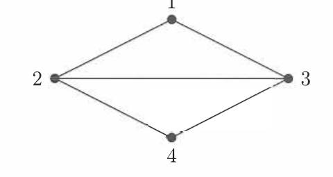

$$
S=\begin{bmatrix}
0&1&1&0\\
1&0&1&1\\
1&1&0&1\\
0&1&1&0
\end{bmatrix}.
$$

无向图的邻接矩阵是对称矩阵，因为边可以沿两个方向通过。$S^2$ 有一个有用解释：$(S^2)_{ij}$ 等于节点 $i$ 到节点 $j$ 的长度为 $2$ 的游走数。例如节点 2 到节点 3 有两条：经过节点 1 或节点 4；节点 1 回到节点 1 也有两条：$1-2-1$ 和 $1-3-1$。

$$
S^2=\begin{bmatrix}2&1&1&2\\1&3&2&1\\1&2&3&1\\2&1&1&2\end{bmatrix},
\qquad
S^3=\begin{bmatrix}2&5&5&2\\5&4&5&5\\5&5&4&5\\2&5&5&2\end{bmatrix}.
$$

节点 1 到节点 2 有 $5$ 条长度为 $3$ 的游走。为什么 $S^N$ 会统计任意节点对之间的 $N$ 步游走？先看

$$
(S^2)_{ij}=s_{i1}s_{1j}+s_{i2}s_{2j}+s_{i3}s_{3j}+s_{i4}s_{4j}.
\tag{7}
$$

如果存在两步路径 $i\to1\to j$，第一项为 $(1)(1)=1$；若这不是一条路径，则至少缺少一条边，乘积为零。因此 $(S^2)_{ij}$ 正在把所有两步路径 $i\to k\to j$ 对应的 $1$ 相加。类似地，$S^{N-1}S$ 统计 $N$ 步路径：先从 $i$ 用 $N-1$ 步到 $k$，再从 $k$ 用一步到 $j$。矩阵乘法正适合统计网络上的路径。

**2.4 B**　设

$$
A=\begin{bmatrix}p&0\\q&r\end{bmatrix},
\qquad
B=\begin{bmatrix}1&1\\0&1\end{bmatrix},
\qquad
C=\begin{bmatrix}0&z\\0&0\end{bmatrix}.
$$

什么时候 $AB=BA$？什么时候 $BC=CB$？什么时候 $A(BC)=(AB)C$？如果 $p,q,r,1,z$ 改成 $4\times4$ 矩阵块，答案是否改变？

**解**　$A(BC)$ 总是等于 $(AB)C$，所以括号可以省略，但矩阵顺序不能改变。一般有

$$
AB=\begin{bmatrix}p&p\\q&q+r\end{bmatrix},
\qquad
BA=\begin{bmatrix}p+q&r\\q&r\end{bmatrix},
$$

因此通常 $AB\ne BA$。但这里恰好

$$
BC=CB=\begin{bmatrix}0&z\\0&0\end{bmatrix}.
$$

$B$ 与 $C$ 恰好交换，部分原因是 $B$ 的对角块是单位矩阵。当 $p,q,r,z$ 为 $4\times4$ 块且数 $1$ 改为 $I$ 时，上述乘积仍然成立，答案不变。

## 2.5 逆矩阵

  

    <ol style="margin:0; padding-left:1.6em;">
      <li style="margin:0.35em 0;">如果方阵 $A$ 有逆矩阵，则 $A^{-1}A=I$ 且 $AA^{-1}=I$。</li>
      <li style="margin:0.35em 0;">检验可逆性的算法是消元：$A$ 必须有 $n$ 个非零主元。</li>
      <li style="margin:0.35em 0;">检验可逆性的代数条件是行列式：$\det A$ 不能为零。</li>
      <li style="margin:0.35em 0;">检验可逆性的方程是 $Ax=0$：它必须只有零解 $x=0$。</li>
      <li style="margin:0.35em 0;">若同阶矩阵 $A,B$ 都可逆，则 $AB$ 也可逆，并且 $(AB)^{-1}=B^{-1}A^{-1}$。</li>
      <li style="margin:0.35em 0;">$AA^{-1}=I$ 是关于 $A^{-1}$ 的 $n$ 个列的 $n$ 个方程。Gauss–Jordan 法把 $[A\ I]$ 消元为 $[I\ A^{-1}]$。</li>
      <li style="margin:0.35em 0;">本书最后一页列出了方阵可逆的 14 个等价条件。</li>
    </ol>
  

设 $A$ 是方阵。我们寻找同阶的逆矩阵 $A^{-1}$，使 $A^{-1}A=I$。无论 $A$ 做了什么，$A^{-1}$ 都将其撤销；乘积是单位矩阵，因此

$$
A^{-1}Ax=x.
$$

但 $A^{-1}$ 不一定存在。矩阵最常做的事情是乘一个向量 $x$。在 $Ax=b$ 两边乘 $A^{-1}$ 得

$$
A^{-1}Ax=A^{-1}b,
\qquad
x=A^{-1}b.
$$

$A^{-1}A$ 类似于先乘一个非零数再除以该数，但矩阵的情况更复杂，也更有趣。

  

    
定义　可逆矩阵

    
如果存在矩阵 $A^{-1}$，使

    
$$A^{-1}A=I\qquad\text{且}\qquad AA^{-1}=I,$$

    
则称矩阵 $A$ 可逆，$A^{-1}$ 称为 $A$ 的逆矩阵。

  

并非所有矩阵都有逆矩阵。面对一个方阵，首先要问的就是它是否可逆；这并不意味着必须立刻计算 $A^{-1}$，事实上大多数问题根本不会显式计算它。

**说明 1**　逆矩阵存在，当且仅当消元产生 $n$ 个主元，过程中允许交换行。消元可以不显式使用 $A^{-1}$，直接求解 $Ax=b$。

**说明 2**　矩阵 $A$ 不可能有两个不同的逆。若 $BA=I$ 且 $AC=I$，利用结合律可得

$$
B(AC)=(BA)C
\quad\Longrightarrow\quad
BI=IC
\quad\Longrightarrow\quad
B=C.
\tag{2}
$$

因此，左逆 $B$ 与右逆 $C$ 必须是同一个矩阵。

**说明 3**　若 $A$ 可逆，则 $Ax=b$ 的唯一解为 $x=A^{-1}b$。

**说明 4**　如果存在非零向量 $x$ 使 $Ax=0$，则 $A$ 不可逆，因为任何矩阵都不能把零向量恢复为非零的 $x$。反过来，若 $A$ 可逆，$Ax=0$ 只能有零解

$$
x=A^{-1}0=0.
$$

**说明 5**　$2\times2$ 矩阵可逆，当且仅当 $ad-bc\ne0$：

$$
\begin{bmatrix}a&b\\c&d\end{bmatrix}^{-1}
=\frac{1}{ad-bc}
\begin{bmatrix}d&-b\\-c&a\end{bmatrix}.
\tag{3}
$$

$ad-bc$ 是 $A$ 的行列式。一般矩阵在行列式非零时可逆，但消元通常在正式引入行列式前就能通过主元作出判断。

**说明 6**　对角矩阵在全部对角元素非零时可逆，其逆矩阵只需把每个对角元素替换为倒数。

**例 1**　矩阵

$$
A=\begin{bmatrix}1&2\\2&4\end{bmatrix}
$$

不可逆。说明 5 中 $ad-bc=4-4=0$；说明 4 中 $Ax=0$ 有非零解 $x=(2,-1)^T$；消元也不能产生说明 1 要求的两个主元，因为第二行将变成零行。

### 乘积 $AB$ 的逆矩阵

两个非零数的和可能不可逆，例如 $3+(-3)=0$；但它们的乘积仍非零且可逆。对矩阵而言，也很难仅由 $A,B$ 的可逆性判断 $A+B$，但如果同阶方阵 $A,B$ 都可逆，那么 $AB$ 可逆，且逆矩阵以相反顺序出现：

$$
(AB)^{-1}=B^{-1}A^{-1}.
\tag{4}
$$

验证时，

$$
(AB)(B^{-1}A^{-1})
=A(BB^{-1})A^{-1}
=AA^{-1}=I.
$$

同样，$(B^{-1}A^{-1})(AB)=I$。逆运算按相反顺序进行是数学中的基本规律，也符合常识：先穿袜子再穿鞋，脱下时必须先脱鞋。三个或更多矩阵也一样：

$$
(ABC)^{-1}=C^{-1}B^{-1}A^{-1}.
\tag{5}
$$

**例 2　消元矩阵的逆**　若 $E$ 从第 2 行中减去第 1 行的 $5$ 倍，则 $E^{-1}$ 把第 1 行的 $5$ 倍加回第 2 行：

$$
E=\begin{bmatrix}1&0&0\\-5&1&0\\0&0&1\end{bmatrix},
\qquad
E^{-1}=\begin{bmatrix}1&0&0\\5&1&0\\0&0&1\end{bmatrix}.
$$

$EE^{-1}=E^{-1}E=I$。对于方阵，只要一侧存在逆，另一侧也自动成立。

**例 3**　设 $F$ 从第 3 行中减去第 2 行的 $4$ 倍：

$$
F=\begin{bmatrix}1&0&0\\0&1&0\\0&-4&1\end{bmatrix},
\qquad
F^{-1}=\begin{bmatrix}1&0&0\\0&1&0\\0&4&1\end{bmatrix}.
$$

先做 $E$ 再做 $F$ 的总矩阵是 $FE$，其逆为 $E^{-1}F^{-1}$。$FE$ 中出现了 $20$，而逆矩阵中没有。原因是按 $FE$ 的顺序，$E$ 先改变第 2 行，随后 $F$ 使用这个已经受第 1 行影响的新第 2 行去改变第 3 行，于是第 3 行间接受到第 1 行的影响。逆序 $E^{-1}F^{-1}$ 中，$F^{-1}$ 先改变第 3 行，随后 $E^{-1}$ 只改变第 2 行，第 3 行不会再次改变。因此消元乘数能整齐地落在下三角矩阵 $L$ 中，这也是下一节选择 $A=LU$ 的原因。

### 用 Gauss–Jordan 消元计算 $A^{-1}$

当 $A$ 可逆时，公式 $x=A^{-1}b$ 从理论上给出了方程 $Ax=b$ 的解。不过，如果只需要求解一个方程组，通常不必先求出整个逆矩阵；直接对 $Ax=b$ 做消元，计算量更少。如果目标就是求 $A^{-1}$，同样的消元过程也能直接构造它。下面的 Gauss–Jordan 方法将说明具体做法。

Gauss–Jordan 思想是求解

$$
AA^{-1}=I.
$$

若 $A^{-1}$ 的列为 $x_1,x_2,x_3$，则

$$
Ax_1=e_1\qquad Ax_2=e_2\qquad Ax_3=e_3,
$$

其中 $e_1,e_2,e_3$ 是单位矩阵 $I$ 的三列。Gauss–Jordan 法把这三个方程同时求解，从增广矩阵 $[A\ I]$ 开始。

考虑三对角矩阵

> **三对角矩阵**
>
> 三对角矩阵是一种方阵，只有主对角线、主对角线上方紧邻的一条对角线和主对角线下方紧邻的一条对角线可以出现非零元素，其余位置均为零。一般地，当 $|i-j|>1$ 时有 $a_{ij}=0$。当前矩阵 $K$ 的主对角线为 $(2,2,2)$，相邻的上、下两条对角线均为 $(-1,-1)$，因此 $K$ 是三对角矩阵。三对角矩阵属于带状矩阵的一种；本书此前在第 2 章第 2.2 节的 Worked Example 2.2 A 中通过消元例题介绍过带状结构。

$$
K=\begin{bmatrix}2&-1&0\\-1&2&-1\\0&-1&2\end{bmatrix}
$$

从增广矩阵 $[K\ I]$ 开始：

$$
\left[
\begin{array}{ccc|ccc}
2&-1&0&1&0&0\\
-1&2&-1&0&1&0\\
0&-1&2&0&0&1
\end{array}
\right].
$$

**第一步：消去第一个主元 $2$ 下方的 $-1$。** 执行 $R_2\leftarrow R_2+\frac12R_1$：

$$
\left[
\begin{array}{ccc|ccc}
2&-1&0&1&0&0\\
0&\frac32&-1&\frac12&1&0\\
0&-1&2&0&0&1
\end{array}
\right].
$$

**第二步：消去第二个主元 $3/2$ 下方的 $-1$。** 执行 $R_3\leftarrow R_3+\frac23R_2$：

$$
\left[
\begin{array}{ccc|ccc}
2&-1&0&1&0&0\\
0&\frac32&-1&\frac12&1&0\\
0&0&\frac43&\frac13&\frac23&1
\end{array}
\right].
$$

此时左半边已经是上三角矩阵 $U$，三个主元依次为 $2,3/2,4/3$。普通高斯消元会在这里停止向前消元，再通过回代求解；Gauss–Jordan 消元则继续向上制造零。

**第三步：消去第三个主元 $4/3$ 上方的 $-1$。** 执行 $R_2\leftarrow R_2+\frac34R_3$：

$$
\left[
\begin{array}{ccc|ccc}
2&-1&0&1&0&0\\
0&\frac32&0&\frac34&\frac32&\frac34\\
0&0&\frac43&\frac13&\frac23&1
\end{array}
\right].
$$

**第四步：消去第二个主元 $3/2$ 上方的 $-1$。** 执行 $R_1\leftarrow R_1+\frac23R_2$：

$$
\left[
\begin{array}{ccc|ccc}
2&0&0&\frac32&1&\frac12\\
0&\frac32&0&\frac34&\frac32&\frac34\\
0&0&\frac43&\frac13&\frac23&1
\end{array}
\right].
$$

现在左半边是对角矩阵。最后分别用各行除以该行的主元，也就是执行

$$
R_1\leftarrow\frac12R_1,
\qquad
R_2\leftarrow\frac23R_2,
\qquad
R_3\leftarrow\frac34R_3,
$$

得到

$$
\left[
\begin{array}{ccc|ccc}
1&0&0&\frac34&\frac12&\frac14\\
0&1&0&\frac12&1&\frac12\\
0&0&1&\frac14&\frac12&\frac34
\end{array}
\right]
=[I\ K^{-1}].
$$

因此

$$
K^{-1}=\frac14
\begin{bmatrix}3&2&1\\2&4&2\\1&2&3\end{bmatrix}.
\tag{8}
$$

对任意可逆矩阵，整个过程可概括为

$$
[A\ I]\xrightarrow{\text{Gauss--Jordan}}[I\ A^{-1}].
$$

消元步骤在把 $A$ 变成 $I$ 的同时构造出逆矩阵。大型矩阵通常不值得显式求逆，但小矩阵的逆可能很有用。关于 $K^{-1}$ 有三点值得注意：

1. $K$ 关于主对角线对称，$K^{-1}$ 也对称。
2. $K$ 是三对角带状矩阵，但 $K^{-1}$ 是没有零元素的稠密矩阵；带状矩阵的逆通常是稠密的，这也是不常显式计算逆矩阵的另一个原因。
3. 主元乘积为 $2(3/2)(4/3)=4$，这就是 $K$ 的行列式。$K^{-1}$ 中出现除以 $4$，说明可逆矩阵的行列式不能为零。

  

    
例 4

从

$$
A=\begin{bmatrix}2&3\\4&7\end{bmatrix}
$$

开始进行 Gauss–Jordan 消元：

$$
\left[\begin{array}{cc|cc}2&3&1&0\\4&7&0&1\end{array}\right]
$$

先执行 $R_2\leftarrow R_2-2R_1$：

$$
\left[\begin{array}{cc|cc}2&3&1&0\\0&1&-2&1\end{array}\right]
$$

再执行 $R_1\leftarrow R_1-3R_2$：

$$
\left[\begin{array}{cc|cc}2&0&7&-3\\0&1&-2&1\end{array}\right]
$$

最后执行 $R_1\leftarrow\frac{1}{2}R_1$，把第一个主元化为 $1$：

$$
\left[\begin{array}{cc|cc}1&0&\frac{7}{2}&-\frac{3}{2}\\0&1&-2&1\end{array}\right].
$$

因此

$$
A^{-1}=\begin{bmatrix}\frac{7}{2}&-\frac{3}{2}\\-2&1\end{bmatrix}.
$$

  

  

    
例 5

本例说明一个结构性质：若 $A$ 是可逆的上三角矩阵，则它的逆矩阵 $A^{-1}$ 仍是上三角矩阵。

把 $A^{-1}$ 和单位矩阵 $I$ 按列写成

$$
A^{-1}=\begin{bmatrix}x_1&x_2&\cdots&x_n\end{bmatrix},
\qquad
I=\begin{bmatrix}e_1&e_2&\cdots&e_n\end{bmatrix}.
$$

由 $AA^{-1}=I$ 可知，$A^{-1}$ 的第 $j$ 列 $x_j$ 是三角方程组

$$
Ax_j=e_j
$$

的解。单位矩阵的第 $j$ 列 $e_j$ 在第 $j$ 个位置下方有 $n-j$ 个零。由于 $A$ 是上三角矩阵，从最后一个方程开始回代时，这些零会依次使 $x_j$ 的最后 $n-j$ 个分量也等于零。因此，$A^{-1}$ 的第 $j$ 列在主对角线下方全为零。对每一列都成立，所以 $A^{-1}$ 仍是上三角矩阵。

  

求逆操作要求 $A$ 可逆，原因可以直接从行操作看出。设全部行操作合起来相当于左乘矩阵 $E$。如果消元能把增广矩阵的左半边 $A$ 化为 $I$，就有

$$
EA=I.
$$

这说明 $E=A^{-1}$，所以 $A$ 必须可逆。反过来，如果 $A$ 奇异，消元过程中一定会缺少至少一个主元，左半边会出现零行，不可能化成含有 $n$ 个主元的单位矩阵 $I$。此时对 $[A\ I]$ 继续操作，也不可能在右半边得到 $A^{-1}$。

Gauss–Jordan 法还显示了为什么“先求逆矩阵，再计算 $A^{-1}b$”通常比直接求解 $Ax=b$ 更费计算。两种方法都要先处理系数矩阵 $A$，把主元下方的元素消成零。对于稠密的 $n\times n$ 矩阵，这一向前消元过程大约需要

$$
\frac{n^3}{3}
$$

次乘法和减法。若只求一个解，随后对一个右端向量做回代只需要约 $n^2/2$ 次运算；与 $n^3/3$ 相比，这是较低阶的计算量。

求 $A^{-1}$ 则不同。逆矩阵有 $n$ 列，相当于同时求解

$$
Ax_1=e_1,\quad Ax_2=e_2,\quad\ldots,\quad Ax_n=e_n.
$$

消元步骤虽然可以共用，不需要把整个过程独立重复 $n$ 次，但每一步都必须同时更新右侧的 $n$ 列，并继续消去主元上方的元素。Gauss–Jordan 法的总计算量因此约为 $n^3$ 次乘法和减法，大约是直接求解一个方程组所需 $n^3/3$ 的三倍。得到 $A^{-1}$ 后还要再计算一次矩阵向量乘法 $A^{-1}b$。

因此，如果只需要某个给定右端 $b$ 的解，直接对 $Ax=b$ 消元更合适；只有确实需要逆矩阵本身时，才有必要完整计算 $A^{-1}$。

### 奇异与可逆

方阵 $A$ 存在逆矩阵，当且仅当它有完整的 $n$ 个主元，过程中允许行交换。Gauss–Jordan 消元给出证明：

1. 有 $n$ 个主元时，消元能求解所有 $Ax_i=e_i$。这些 $x_i$ 组成 $A^{-1}$，于是 $AA^{-1}=I$。
2. 消元本身是由 $E$、$P$ 以及除以主元的对角矩阵连续左乘组成的。它们的乘积 $C$ 满足 $CA=I$，给出左逆；而左逆与右逆相同。

反过来，如果 $AC=I$，那么 $A$ 必须有 $n$ 个主元：若主元不足，消元后的 $MA$ 将有零行；但 $MAC=M$，零行乘 $C$ 会迫使可逆矩阵 $M$ 自己出现零行，这是不可能的。

因此消元给出了完整判据：

  

    
方阵 $A$ 恰好在拥有 $n$ 个主元时可逆，Gauss–Jordan 法能够求出它的逆。并且

    
$$AC=I\quad\Longrightarrow\quad CA=I\quad\text{且}\quad C=A^{-1}.$$

  

**例 6**　若 $L$ 是对角线上全为 $1$ 的下三角矩阵，则 $L^{-1}$ 也是这种下三角矩阵。一般地，三角矩阵可逆，当且仅当全部对角元素非零。

例如

$$
L=\begin{bmatrix}1&0&0\\3&1&0\\4&5&1\end{bmatrix},
\qquad
L^{-1}=\begin{bmatrix}1&0&0\\-3&1&0\\11&-5&1\end{bmatrix}.
$$

$L^{-1}$ 中的 $11$ 来自 $3\cdot5-4$。逆矩阵仍为下三角，并且对角线仍为 $1$。

### 识别可逆矩阵

通常判断矩阵是否可逆需要消元并找到完整的非零主元集合。但有些矩阵可以立即判断：若主对角线上的每个 $a_{ii}$ 都严格大于该行其他元素绝对值之和，则矩阵严格对角占优：

$$
|a_{ii}|>\sum_{j\ne i}|a_{ij}|.
\tag{11}
$$

严格对角占优矩阵一定可逆。例如

$$
A=\begin{bmatrix}3&1&1\\1&3&1\\1&1&3\end{bmatrix},
\quad
B=\begin{bmatrix}2&1&1\\1&2&1\\1&1&3\end{bmatrix},
\quad
C=\begin{bmatrix}1&1&1\\1&1&1\\1&1&3\end{bmatrix}.
$$

$A$ 对角占优，因为 $3>1+1$；$B$ 不严格对角占优，但仍可逆；$C$ 是奇异矩阵。

证明如下。任取非零向量 $x$，设绝对值最大的分量为 $|x_i|$。如果 $Ax=0$，第 $i$ 行必须满足

$$
a_{i1}x_1+\cdots+a_{ii}x_i+\cdots+a_{in}x_n=0.
$$

但

$$
\sum_{j\ne i}|a_{ij}x_j|
\le\sum_{j\ne i}|a_{ij}|\,|x_i|
<|a_{ii}|\,|x_i|.
$$

对角项的绝对值大于其他项绝对值之和，所以这些项不可能相加为零。因此 $Ax=0$ 只能有零解，$A$ 可逆。

### 关键思想回顾

  

    <ol style="margin:0; padding-left:1.6em;">
      <li style="margin:0.35em 0;">逆矩阵满足 $AA^{-1}=I$ 和 $A^{-1}A=I$。</li>
      <li style="margin:0.35em 0;">$A$ 可逆，当且仅当它有 $n$ 个主元，允许行交换。</li>
      <li style="margin:0.35em 0;">若非零向量 $x$ 满足 $Ax=0$，则 $A$ 没有逆矩阵。</li>
      <li style="margin:0.35em 0;">乘积的逆按相反顺序排列：$(AB)^{-1}=B^{-1}A^{-1}$，$(ABC)^{-1}=C^{-1}B^{-1}A^{-1}$。</li>
      <li style="margin:0.35em 0;">Gauss–Jordan 法求解 $AA^{-1}=I$ 以得到 $A^{-1}$ 的 $n$ 列，把 $[A\ I]$ 行化简为 $[I\ A^{-1}]$。</li>
      <li style="margin:0.35em 0;">严格对角占优矩阵可逆，每个 $|a_{ii}|$ 都占优于该行其余部分。</li>
    </ol>
  

### Worked Examples

**2.5 A**　三角差分矩阵 $A$ 的逆是三角求和矩阵 $S$：

$$
A=\begin{bmatrix}1&0&0\\-1&1&0\\0&-1&1\end{bmatrix},
\qquad
A^{-1}=S=\begin{bmatrix}1&0&0\\1&1&0\\1&1&1\end{bmatrix}.
$$

Gauss–Jordan 法把 $[A\ I]$ 变为 $[I\ A^{-1}]$。如果把 $a_{13}$ 改成 $-1$，$A$ 的每一行之和都为零，方程 $Ax=0$ 将有非零解 $x=(1,1,1)^T$；这是新矩阵不可逆的明确信号。

**2.5 B**　下列六个矩阵中三个可逆、三个奇异。可逆时求逆；奇异时从零行列式、主元不足或 $Ax=0$ 有非零解说明原因：

$$
\begin{gathered}
A=\begin{bmatrix}4&3\\8&6\end{bmatrix},
\quad B=\begin{bmatrix}4&3\\8&7\end{bmatrix},
\quad C=\begin{bmatrix}6&6\\6&0\end{bmatrix},
\quad D=\begin{bmatrix}6&6\\6&6\end{bmatrix},\\[6pt]
S=\begin{bmatrix}1&0&0\\1&1&0\\1&1&1\end{bmatrix},
\qquad
E=\begin{bmatrix}1&1&1\\1&1&0\\1&1&1\end{bmatrix}.
\end{gathered}
$$

**解**

$$
B^{-1}=\frac14\begin{bmatrix}7&-3\\-8&4\end{bmatrix},
\qquad
C^{-1}=\frac1{36}\begin{bmatrix}0&6\\6&-6\end{bmatrix},
\qquad
S^{-1}=\begin{bmatrix}1&0&0\\-1&1&0\\0&-1&1\end{bmatrix}.
$$

$A$ 不可逆，因为 $\det A=4\cdot6-3\cdot8=0$。$D$ 只有一个主元，从第二行减去第一行得到零行。$E$ 有两个相同行，并且第二列减第一列为零；等价地，$Ex=0$ 有非零解 $x=(-1,1,0)^T$。事实上，零行列式、主元不足和存在非零零空间向量这三个理由对 $A,D,E$ 中的每一个都成立。

**2.5 C**　用 Gauss–Jordan 法求下列三角 Pascal 矩阵的逆：

$$
L=\begin{bmatrix}
1&0&0&0\\
1&1&0&0\\
1&2&1&0\\
1&3&3&1
\end{bmatrix}.
$$

Pascal 三角形中，每个元素与它左边的元素相加得到下一行的对应元素；下一行将是 $1,4,6,4,1$。对 $[L\ I]$ 消元，先减去第一行，再用乘数 $2,3$ 消去第二个主元下方元素，最后从新第 4 行中减去新第 3 行的 $3$ 倍，得到

$$
L^{-1}=\begin{bmatrix}
1&0&0&0\\
-1&1&0&0\\
1&-2&1&0\\
-1&3&-3&1
\end{bmatrix}.
$$

全部主元都为 $1$，所以无需再用主元除行。$L^{-1}$ 看起来与 $L$ 相同，只是奇数编号的次对角线带负号；这个“交替对角线”模式会延续到任意阶 Pascal 矩阵。

## 2.6 消元等于分解：$A=LU$

  

    <ol style="margin:0; padding-left:1.6em;">
      <li style="margin:0.35em 0;">每个消元步骤 $E_{ij}$ 由 $L_{ij}=E_{ij}^{-1}$ 撤销；主对角线外的 $-\ell_{ij}$ 变为 $+\ell_{ij}$。</li>
      <li style="margin:0.35em 0;">没有行交换时，整个向前消元过程由下三角矩阵 $L$ 撤销。</li>
      <li style="margin:0.35em 0;">乘积矩阵 $L$ 仍为下三角矩阵，每个乘数 $\ell_{ij}$ 位于第 $i$ 行第 $j$ 列。</li>
      <li style="margin:0.35em 0;">原矩阵由 $U$ 恢复为 $A=LU=(\text{下三角})(\text{上三角})$。</li>
      <li style="margin:0.35em 0;">对 $Ax=b$ 消元得到 $Ux=c$，再用回代求解。</li>
      <li style="margin:0.35em 0;">求解一个三角方程组需要约 $n^2/2$ 次乘减；消元得到 $U$ 需要约 $n^3/3$ 次乘减。</li>
    </ol>
  

学生常说数学课程太理论化，但这一节几乎完全是实践性的。目标是以最有用的形式描述高斯消元。仔细观察就会发现，线性代数的许多关键思想本质上都是矩阵分解：原矩阵 $A$ 被写成两个或三个特殊矩阵的乘积。由消元得到的第一个分解，也是实际计算中最重要的分解，就是

$$
A=LU.
$$

两个因子 $L,U$ 都是三角矩阵。我们已经认识 $U$：它是对角线上放置主元的上三角矩阵。消元把 $A$ 变成 $U$；反向撤销这些步骤则由下三角矩阵 $L$ 完成。$L$ 的元素正是乘数 $\ell_{ij}$，这些乘数曾用来把主元行 $j$ 的倍数从第 $i$ 行中减去。

先看 $2\times2$ 例子：

$$
A=\begin{bmatrix}2&1\\6&8\end{bmatrix}.
$$

要消去 $6$，从第 2 行中减去第 1 行的 $3$ 倍。向前步骤为

$$
E_{21}A=
\begin{bmatrix}1&0\\-3&1\end{bmatrix}
\begin{bmatrix}2&1\\6&8\end{bmatrix}
=
\begin{bmatrix}2&1\\0&5\end{bmatrix}=U.
$$

从 $U$ 返回 $A$ 使用逆矩阵，把第 1 行的 $3$ 倍加回第 2 行：

$$
E_{21}^{-1}U=
\begin{bmatrix}1&0\\3&1\end{bmatrix}
\begin{bmatrix}2&1\\0&5\end{bmatrix}
=
\begin{bmatrix}2&1\\6&8\end{bmatrix}=A.
$$

把 $E_{21}^{-1}$ 记为 $L$，第二行就是分解 $LU=A$。

对于 $3\times3$ 矩阵，向前消元依次左乘 $E_{21},E_{31},E_{32}$：

$$
E_{32}E_{31}E_{21}A=U.
$$

把这些矩阵移到等式另一边时，逆矩阵按相反顺序出现：

$$
A=E_{21}^{-1}E_{31}^{-1}E_{32}^{-1}U=LU.
$$

每个 $E_{ij}^{-1}$ 都是下三角矩阵，在位置 $(i,j)$ 上放 $+\ell_{ij}$，主对角线为 $1$。它们的乘积仍是下三角矩阵 $L$。

消元没有行交换时，$A=LU$ 具有以下结构：上三角矩阵 $U$ 的对角线上是主元；下三角矩阵 $L$ 的对角线上全为 $1$，消元乘数 $\ell_{ij}$ 位于其下方。

**例 1**　对

$$
A=\begin{bmatrix}2&1&0\\1&2&1\\0&1&2\end{bmatrix},
$$

从第 2 行中减去第 1 行的 $1/2$ 倍，最后从第 3 行中减去新第 2 行的 $2/3$ 倍。因此

$$
L=\begin{bmatrix}1&0&0\\\frac12&1&0\\0&\frac23&1\end{bmatrix},
\qquad
U=\begin{bmatrix}2&1&0\\0&\frac32&1\\0&0&\frac43\end{bmatrix},
\qquad
A=LU.
$$

位置 $(3,1)$ 的乘数为零，因为 $A$ 的位置 $(3,1)$ 本来就是零，不需要操作。

**例 2**　把 $A$ 的左上角从 $2$ 改为 $1$，得到

$$
B=\begin{bmatrix}1&1&0\\1&2&1\\0&1&2\end{bmatrix}.
$$

全部主元和乘数都变成 $1$：

$$
B=
\underbrace{\begin{bmatrix}1&0&0\\1&1&0\\0&1&1\end{bmatrix}}_{L}
\underbrace{\begin{bmatrix}1&1&0\\0&1&1\\0&0&1\end{bmatrix}}_{U}.
$$

同样模式会延续到更高阶三对角矩阵。

这些例子揭示了实践中十分重要的零元素规律：

- 若 $A$ 的某行以若干零开头，$L$ 的对应行也以这些零开头；
- 若 $A$ 的某列以若干零开头，$U$ 的对应列也以这些零开头；
- 但矩阵中间的零通常会在消元向前推进时被“填充”为非零数。

为什么 $L$ 中的乘数会原封不动地进入正确位置？关键在于从下面各行减去的主元行不是 $A$ 的原始行，而是已经形成且以后不再改变的 $U$ 的行。例如计算 $U$ 的第 3 行时，

$$
U_3=A_3-\ell_{31}U_1-\ell_{32}U_2.
\tag{1}
$$

改写为

$$
A_3=\ell_{31}U_1+\ell_{32}U_2+U_3.
\tag{2}
$$

这正是 $A=LU$ 的第 3 行，因为 $L$ 的第 3 行是 $[\ell_{31}\ \ell_{32}\ 1]$。任意规模的矩阵都遵循同一模式。

### 更均衡的 $LDU$ 分解

$A=LU$ 在形式上不对称：$U$ 的对角线上是主元，而 $L$ 的对角线上是 $1$。把主元抽取到对角矩阵 $D$ 中，并用每个主元除 $U$ 的对应行，就得到对角线全为 $1$ 的新上三角矩阵。于是

$$
A=LU=LDU.
$$

在 $LDU$ 记号中，通常默认最后的 $U$ 对角线全为 $1$。例如

$$
\begin{bmatrix}2&8\\6&29\end{bmatrix}
=
\begin{bmatrix}1&0\\3&1\end{bmatrix}
\begin{bmatrix}2&8\\0&5\end{bmatrix}
=
\begin{bmatrix}1&0\\3&1\end{bmatrix}
\begin{bmatrix}2&0\\0&5\end{bmatrix}
\begin{bmatrix}1&4\\0&1\end{bmatrix}.
\tag{3}
$$

主元 $2,5$ 进入 $D$，$U$ 的两行分别除以它们，乘数 $3$ 仍留在 $L$ 中。

### 一个方阵系统等于两个三角系统

$L$ 保存了高斯消元的全部记忆：它记录在消去下方各行时，主元行所乘的系数。$L,U$ 完全由左侧矩阵 $A$ 决定；一旦给出右端 $b$，便用它们分两步求解：

1. **Factor：**只对左侧矩阵 $A$ 消元，得到 $A=LU$；
2. **Solve：**先前代求解 $Lc=b$，再回代求解 $Ux=c$。

过去我们把 $A,b$ 放在增广矩阵中同时处理，这完全正确；但计算机程序通常把两侧分开，把消元信息存入 $L,U$，以后可用于任意多个不同右端。

为什么这样得到的 $x$ 正确？把 $Ux=c$ 左乘 $L$：

$$
LUx=Lc
\quad\Longrightarrow\quad
Ax=b.
\tag{4}
$$

**例 3**　方程组

$$
\begin{aligned}
u+2v&=5,\\
4u+9v&=21
\end{aligned}
$$

从第二式减去第一式的 $4$ 倍，得到 $v=1$。因此

$$
A=\begin{bmatrix}1&2\\4&9\end{bmatrix}
=
\underbrace{\begin{bmatrix}1&0\\4&1\end{bmatrix}}_L
\underbrace{\begin{bmatrix}1&2\\0&1\end{bmatrix}}_U.
$$

右端按同一乘数从 $(5,21)^T$ 变为 $c=(5,1)^T$。前代系统 $Lc=b$ 给出 $c$，回代系统 $Ux=c$ 给出 $(u,v)=(3,1)$。

### 消元的计算量

消元第一阶段在第一个主元下方制造零，每个新元素需要一次乘法和一次减法，约为 $n^2$ 次；第二阶段处理规模 $n-1$ 的矩阵，约为 $(n-1)^2$ 次；以后依次减小。因此从 $A$ 得到 $U$ 的乘法次数近似为

$$
n^2+(n-1)^2+\cdots+2^2+1^2
=\frac{n(n+1)(2n+1)}6
\approx\frac{n^3}{3}.
$$

所以，对 $A$ 的消元约需 $n^3/3$ 次乘法和 $n^3/3$ 次减法。

处理右端要便宜得多。向前消元需 $(n-1)+(n-2)+\cdots+1$ 步，回代需 $1+2+\cdots+n$ 步，总计恰好为

$$
[(n-1)+\cdots+1]+[1+\cdots+(n-1)+n]=n^2.
\tag{5}
$$

因此每个右端大约需要 $n^2$ 次乘法和 $n^2$ 次减法。昂贵部分是一次性的 Factor；之后每个新右端只需较便宜的 Solve。

若带状矩阵在主对角线上下只有 $w$ 条非零对角线，带外零元素会在消元中保持为零。此时

$$
\begin{array}{c|c|c}
&\text{稠密矩阵}&\text{带宽为 }w\text{ 的带状矩阵}\\ \hline
A\to U&n^3/3&nw^2\\
\text{Solve}&n^2&2nw
\end{array}
$$

三对角矩阵的 $w=1$，计算非常快，因此不应存储带外的零。专业程序还会在每列选择绝对值最大的可用主元进行行交换，以减少舍入误差。MATLAB 的反斜杠命令 `x=A\b` 把 Factor 与 Solve 合并起来。

根据 $n^3$ 规律，矩阵阶数加倍时，计算时间约乘 $8$；阶数扩大十倍，时间约乘 $1000$。不过实际大型矩阵多为稀疏矩阵，含有大量零，此时 $A=LU$ 会快得多。

### 关键思想回顾

  

    <ol style="margin:0; padding-left:1.6em;">
      <li style="margin:0.35em 0;">没有行交换时，高斯消元把 $A$ 分解为 $LU$。</li>
      <li style="margin:0.35em 0;">下三角矩阵 $L$ 保存从 $A$ 到 $U$ 时乘主元行的乘数 $\ell_{ij}$；乘积 $LU$ 把这些行加回去并恢复 $A$。</li>
      <li style="margin:0.35em 0;">对右端先前代求解 $Lc=b$，再回代求解 $Ux=c$。</li>
      <li style="margin:0.35em 0;">Factor：左侧约需 $(n^3-n)/3$ 次乘法和减法。</li>
      <li style="margin:0.35em 0;">Solve：每个右端约需 $n^2$ 次乘法和减法。</li>
      <li style="margin:0.35em 0;">对带状矩阵，把 $n^3/3$ 降为 $nw^2$，把 $n^2$ 降为 $2wn$。</li>
    </ol>
  

### Worked Examples

**2.6 A**　下三角 Pascal 矩阵 $L$ 包含著名的 Pascal 三角形。对称 Pascal 矩阵 $P$ 可分解为三角 Pascal 矩阵 $L,U$ 的乘积：

$$
P=\begin{bmatrix}
1&1&1&1\\
1&2&3&4\\
1&3&6&10\\
1&4&10&20
\end{bmatrix}
=
\underbrace{\begin{bmatrix}
1&0&0&0\\
1&1&0&0\\
1&2&1&0\\
1&3&3&1
\end{bmatrix}}_L
\underbrace{\begin{bmatrix}
1&1&1&1\\
0&1&2&3\\
0&0&1&3\\
0&0&0&1
\end{bmatrix}}_U.
$$

可以直接计算 $LU$，但更好的办法是从对称矩阵 $P$ 出发进行消元得到 $U$，消元乘数则准确进入 $L$。$U$ 的每个主元都是 $1$，而且这里 $U=L^T$。相同模式延续到 $5\times5$ Pascal 矩阵。

MATLAB 的 `lu(pascal(4))` 会在每列选取最大的主元，因此不一定返回这里的 $L,U$；不进行行交换的 Cholesky 分解则能利用对称性。Pascal 矩阵还具有许多其他重要性质。

**2.6 B**　求解

$$
Px=b=\begin{bmatrix}1\\0\\0\\0\end{bmatrix}.
$$

该右端是单位矩阵的第一列，所以 $x$ 将是 $P^{-1}$ 的第一列。已知 $P=LU$，先解 $Lc=b$：

$$
\begin{aligned}
c_1&=1,\\
c_1+c_2&=0,\\
c_1+2c_2+c_3&=0,\\
c_1+3c_2+3c_3+c_4&=0,
\end{aligned}
$$

得到

$$
c=(1,-1,1,-1)^T.
$$

再从下到上解 $Ux=c$：

$$
\begin{aligned}
x_1+x_2+x_3+x_4&=1,\\
x_2+2x_3+3x_4&=-1,\\
x_3+3x_4&=1,\\
x_4&=-1,
\end{aligned}
$$

得到

$$
x=(4,-6,4,-1)^T.
$$

这个向量表现出明显模式，也可以用 `inv(pascal(4))` 检查。

## 2.7 转置与置换

  

    <ol style="margin:0; padding-left:1.6em;">
      <li style="margin:0.35em 0;">$Ax$、$AB$ 和 $A^{-1}$ 的转置分别为 $x^TA^T$、$B^TA^T$ 和 $(A^T)^{-1}$。</li>
      <li style="margin:0.35em 0;">点积或内积为 $x\boldsymbol\cdot y=x^Ty$，其形状为 $(1\times n)(n\times1)=(1\times1)$；外积 $xy^T$ 是 $(n\times1)(1\times n)$，得到 $n\times n$ 矩阵。</li>
      <li style="margin:0.35em 0;">转置背后的思想是 $(Ax)\boldsymbol\cdot y=x\boldsymbol\cdot(A^Ty)$，因为 $(Ax)^Ty=x^TA^Ty=x^T(A^Ty)$。</li>
      <li style="margin:0.35em 0;">对称矩阵满足 $S^T=S$；任意 $A$ 的乘积 $A^TA$ 总是对称矩阵。</li>
      <li style="margin:0.35em 0;">正交矩阵满足 $Q^T=Q^{-1}$，其列向量是相互正交的单位向量。</li>
      <li style="margin:0.35em 0;">置换矩阵 $P$ 的各行是单位矩阵 $I$ 的各行按某种次序排列，共有 $n!$ 种不同次序。</li>
      <li style="margin:0.35em 0;">$Px$ 把 $x_1,x_2,\ldots,x_n$ 按相应的新次序排列，并且 $P^T=P^{-1}$。</li>
    </ol>
  

还需要介绍一种矩阵，它比逆矩阵简单得多：矩阵 $A$ 的**转置**，记为 $A^T$。$A^T$ 的列就是 $A$ 的行。若 $A$ 是 $m\times n$ 矩阵，则 $A^T$ 是 $n\times m$ 矩阵。可以把 $A$ 的各行写成 $A^T$ 的各列，或者把 $A$ 的各列写成 $A^T$ 的各行；这相当于沿主对角线翻转矩阵。

$$
(A^T)_{ij}=A_{ji}.
$$

下三角矩阵的转置是上三角矩阵，而下三角矩阵的逆仍是下三角矩阵。再次转置会回到原矩阵：

$$
(A^T)^T=A.
$$

MATLAB 用撇号表示转置。`[1 2 3]` 是行向量，`[1 2 3]'` 是列向量。转置矩阵满足

$$
(A+B)^T=A^T+B^T.
\tag{1}
$$

更重要的是乘积与逆矩阵的转置：

$$
(AB)^T=B^TA^T,
\tag{2}
$$

$$
(A^{-1})^T=(A^T)^{-1}.
\tag{3}
$$

注意乘积的顺序反转。要理解 $(AB)^T=B^TA^T$，先把 $B$ 看成一个向量 $x$：

$$
(Ax)^T=x^TA^T.
$$

$Ax$ 组合 $A$ 的各列，而 $x^TA^T$ 以同样系数组合 $A^T$ 的各行；它们是相同向量的相同组合，只是在 $A$ 中为列、在 $A^T$ 中为行。

若 $B=[x_1\ x_2\ \cdots]$，则 $AB$ 的列为 $Ax_1,Ax_2,\ldots$。转置后，这些列成为行：

$$
(AB)^T=
\begin{bmatrix}
x_1^TA^T\\
x_2^TA^T\\
\vdots
\end{bmatrix}
=B^TA^T.
\tag{4}
$$

例如

$$
A=\begin{bmatrix}1&0\\1&1\end{bmatrix},
\qquad
B=\begin{bmatrix}5&0\\4&1\end{bmatrix},
$$

则

$$
AB=\begin{bmatrix}5&0\\9&1\end{bmatrix},
\qquad
B^TA^T=\begin{bmatrix}5&9\\0&1\end{bmatrix}=(AB)^T.
$$

逆序规则延伸到任意多个因子：

$$
(ABC)^T=C^TB^TA^T.
$$

若 $A=LDU$，则 $A^T=U^TD^TL^T$，其中对角矩阵满足 $D^T=D$。

对 $A^{-1}A=I$ 两边转置，得到

$$
A^T(A^{-1})^T=I.
\tag{5}
$$

类似地，由 $AA^{-1}=I$ 得 $(A^{-1})^TA^T=I$。因此可以先求逆再转置，也可以先转置再求逆；$A^T$ 可逆当且仅当 $A$ 可逆。

**例 1**　若

$$
A=\begin{bmatrix}1&0\\6&1\end{bmatrix},
\qquad
A^{-1}=\begin{bmatrix}1&0\\-6&1\end{bmatrix},
$$

则

$$
A^T=\begin{bmatrix}1&6\\0&1\end{bmatrix},
\qquad
(A^{-1})^T=(A^T)^{-1}
=\begin{bmatrix}1&-6\\0&1\end{bmatrix}.
$$

### 内积的含义

向量 $x,y$ 的点积是各分量乘积之和。现在可以不用点号，直接写成矩阵形式：

$$
\begin{array}{lll}
\text{内积：}&x^Ty&(1\times n)(n\times1)=1\times1,\\[3pt]
\text{外积：}&xy^T&(n\times1)(1\times n)=n\times n.
\end{array}
$$

$x^Ty$ 是一个数，$xy^T$ 是一个矩阵。在不同应用中，内积具有直接含义：

$$
\begin{aligned}
\text{功}&=(\text{位移})^T(\text{力})=x^Tf,\\
\text{热损失}&=(\text{电压降})^T(\text{电流})=e^Ty,\\
\text{收入}&=(\text{数量})^T(\text{价格})=q^Tp.
\end{aligned}
$$

转置与内积之间更深的联系，是 $A^T$ 恰好使下式对任意 $x,y$ 成立：

$$
(Ax)^Ty=x^T(A^Ty).
$$

即“$Ax$ 与 $y$ 的内积”等于“$x$ 与 $A^Ty$ 的内积”。例如差分矩阵

$$
A=\begin{bmatrix}-1&1&0\\0&-1&1\end{bmatrix}
$$

把 $x$ 变成 $(x_2-x_1,x_3-x_2)^T$。与 $y=(y_1,y_2)^T$ 做内积为

$$
(x_2-x_1)y_1+(x_3-x_2)y_2
=x_1(-y_1)+x_2(y_1-y_2)+x_3y_2,
$$

因此

$$
A^Ty=\begin{bmatrix}-y_1\\y_1-y_2\\y_2\end{bmatrix},
\qquad
A^T=\begin{bmatrix}-1&0\\1&-1\\0&1\end{bmatrix}.
$$

### 对称矩阵

对称矩阵在转置后保持不变。

  

    
定义　对称矩阵

    
若 $S^T=S$，则称 $S$ 为对称矩阵；等价地，$s_{ji}=s_{ij}$。

  

例如

$$
S=\begin{bmatrix}1&2\\2&5\end{bmatrix}=S^T,
\qquad
D=\begin{bmatrix}1&0\\0&10\end{bmatrix}=D^T.
$$

可逆对称矩阵的逆仍然对称：

$$
(S^{-1})^T=(S^T)^{-1}=S^{-1}.
$$

### 对称乘积 $A^TA$、$AA^T$ 与 $LDL^T$

任取矩阵 $A$，它可以是长方形。乘积 $S=A^TA$ 自动成为方形对称矩阵，因为

$$
(A^TA)^T=A^T(A^T)^T=A^TA.
\tag{6}
$$

$A^TA$ 的位置 $(i,j)$ 是 $A$ 的第 $i$ 列与第 $j$ 列的点积；位置 $(j,i)$ 是同一个点积，次序颠倒而值不变。$AA^T$ 也对称，但通常与 $A^TA$ 不同；若 $A$ 为 $m\times n$，则 $A^TA$ 为 $n\times n$，$AA^T$ 为 $m\times m$。许多从长方形矩阵出发的科学问题最终都会遇到这两个矩阵，例如最小二乘问题。

**例 2**　设

$$
A=\begin{bmatrix}-1&1&0\\0&-1&1\end{bmatrix},
\qquad
A^T=\begin{bmatrix}-1&0\\1&-1\\0&1\end{bmatrix}.
$$

则

$$
AA^T=\begin{bmatrix}2&-1\\-1&2\end{bmatrix},
\qquad
A^TA=\begin{bmatrix}1&-1&0\\-1&2&-1\\0&-1&1\end{bmatrix}.
$$

二者都对称，且对角元素为正；即使 $m=n$，通常仍有 $A^TA\ne AA^T$。

对称性还能使消元工作量减半。$U$ 本身通常不对称，对称性体现在三重乘积中。若 $S=S^T$ 且消元不需要行交换，则 $LDU$ 中的 $U$ 正好是 $L^T$：

$$
S=LDL^T.
$$

例如

$$
\begin{bmatrix}1&2\\2&7\end{bmatrix}
=
\begin{bmatrix}1&0\\2&1\end{bmatrix}
\begin{bmatrix}1&0\\0&3\end{bmatrix}
\begin{bmatrix}1&2\\0&1\end{bmatrix}.
$$

$LDL^T$ 的转置仍是它自己。由于 $U=L^T$，消元和存储工作量几乎减半：乘法次数从约 $n^3/3$ 降到 $n^3/6$，只需保存 $L,D$。

### 置换矩阵

置换矩阵 $P$ 的每行和每列恰好有一个 $1$，其余元素为零。$P^T$ 仍是置换矩阵。所有置换矩阵都可以从单位矩阵 $I$ 重新排列行得到。

  

    
定义　置换矩阵

    
置换矩阵 $P$ 是把单位矩阵 $I$ 的各行按任意顺序排列得到的矩阵。

  

**例 3**　共有 $3!=6$ 个 $3\times3$ 置换矩阵。一般地，$n$ 阶置换矩阵共有

$$
n!=1\cdot2\cdots n
$$

个，因此 4 阶有 24 个，5 阶有 120 个。2 阶只有

$$
I=\begin{bmatrix}1&0\\0&1\end{bmatrix},
\qquad
P=\begin{bmatrix}0&1\\1&0\end{bmatrix}.
$$

置换矩阵的逆仍是置换矩阵。单次行交换是自身的逆；多个行交换的逆按相反顺序执行。更重要的是

$$
P^{-1}=P^T.
$$

这是因为 $PP^T=I$：$P$ 的每一行与自身点积为 $1$，与其他行点积为零。也可以把 $P$ 看成若干行交换矩阵的乘积；每个行交换矩阵都是自身的转置和逆，整个乘积的转置与逆都按相反顺序排列。

### 带行交换的分解 $PA=LU$

没有行交换时，消元给出 $A=LU$。如果主元位置为零，就必须使用置换矩阵 $P_{ij}$。把全部行交换合并成一个置换矩阵 $P$，便得到适用于每个可逆矩阵的分解。

有两种组织方式：

1. 提前完成全部行交换，使 $PA$ 的行顺序适合不再交换地消元，得到 $PA=LU$；
2. 把行交换保留在消元矩阵之间，得到另一种形式 $A=L_1P_1U_1$。

计算中主要使用第一种：

$$
PA=LU.
$$

最重要的简单情形仍是 $P=I$，即无需交换的 $A=LU$。只要 $A$ 可逆，总能找到一个置换矩阵 $P$，把 $A$ 的行排列到能够得到完整主元集合的顺序。

MATLAB 用 `[L,U,P]=lu(A)` 计算这个分解。实际程序通常不只是寻找第一个非零主元，而是在当前列向下寻找绝对值最大的可用元素，这称为**部分选主元**，能减少舍入误差。因此即使代数上并非必须，$P$ 中也可能包含行交换。

置换的符号记录行交换次数的奇偶性：偶数次交换符号为 $+1$，奇数次为 $-1$；它也是 $P$ 的行列式。理解置换的原理很重要，但实际工作可以让计算机完成。

### 关键思想回顾

  

    <ol style="margin:0; padding-left:1.6em;">
      <li style="margin:0.35em 0;">转置把 $A$ 的各行变为 $A^T$ 的各列，并且 $(A^T)_{ij}=A_{ji}$。</li>
      <li style="margin:0.35em 0;">$(AB)^T=B^TA^T$，$(A^{-1})^T=(A^T)^{-1}$。</li>
      <li style="margin:0.35em 0;">点积为 $x\boldsymbol\cdot y=x^Ty$，并且 $(Ax)^Ty=x^T(A^Ty)$。</li>
      <li style="margin:0.35em 0;">若 $S$ 对称，则其 $LDU$ 分解也对称：$S=LDL^T$。</li>
      <li style="margin:0.35em 0;">置换矩阵每行每列各有一个 $1$，并且 $P^T=P^{-1}$。</li>
      <li style="margin:0.35em 0;">$n$ 阶置换矩阵共有 $n!$ 个，其中一半为偶置换，一半为奇置换。</li>
      <li style="margin:0.35em 0;">若 $A$ 可逆，则存在置换矩阵 $P$ 重新排列其行，使 $PA=LU$。</li>
    </ol>
  

### Worked Examples

**2.7 A**　对称矩阵 $S$ 左乘置换矩阵 $P$ 后会失去对称性：

$$
P=\begin{bmatrix}0&1&0\\0&0&1\\1&0&0\end{bmatrix},
\qquad
S=\begin{bmatrix}1&4&5\\4&2&6\\5&6&3\end{bmatrix},
\qquad
PS=\begin{bmatrix}4&2&6\\5&6&3\\1&4&5\end{bmatrix}.
$$

对 $PS$ 的列应用什么置换 $Q$ 可以恢复 $PSQ$ 的对称性？数字 $1,2,3$ 必须回到主对角线上，但次序不一定相同。

**解**　为把 $2$ 放回对角线，$PS$ 的第 2 列必须移到第 1 列；含 $3$ 的第 3 列移到第 2 列；含 $1$ 的第 1 列移到第 3 列。因此

$$
Q=\begin{bmatrix}0&0&1\\1&0&0\\0&1&0\end{bmatrix}=P^T=P^{-1},
$$

并且

$$
PSQ=\begin{bmatrix}2&6&4\\6&3&5\\4&5&1\end{bmatrix}
$$

是对称矩阵。一般地，$PSP^T$ 的转置仍为 $PSP^T$，所以它必然对称。若 $D$ 是对角矩阵，$PDP^T$ 也仍为对角矩阵；行和对应列被移动到相同位置。

**2.7 B**　求上面矩阵 $S$ 的对称分解 $S=LDL^T$。

**解**　正常消元得到

$$
S=\begin{bmatrix}1&4&5\\4&2&6\\5&6&3\end{bmatrix}
\longrightarrow
\begin{bmatrix}1&4&5\\0&-14&-14\\0&-14&-22\end{bmatrix}
\longrightarrow
\begin{bmatrix}1&4&5\\0&-14&-14\\0&0&-8\end{bmatrix}=U.
$$

乘数为 $\ell_{21}=4,\ell_{31}=5,\ell_{32}=1$，主元 $1,-14,-8$ 进入 $D$：

$$
S=
\underbrace{\begin{bmatrix}1&0&0\\4&1&0\\5&1&1\end{bmatrix}}_L
\underbrace{\begin{bmatrix}1&0&0\\0&-14&0\\0&0&-8\end{bmatrix}}_D
\underbrace{\begin{bmatrix}1&4&5\\0&1&1\\0&0&1\end{bmatrix}}_{L^T}.
$$

$S$ 有三个主元，所以可逆；$S^{-1}=(L^T)^{-1}D^{-1}L^{-1}$ 仍然对称。$S$ 的行列式是主元乘积 $(1)(-14)(-8)=112$。

**2.7 C**　对于长方形矩阵 $A$，下列鞍点矩阵是重要的对称矩阵：

$$
S=\begin{bmatrix}I&A\\A^T&0\end{bmatrix}=S^T.
$$

用分块消元求 $S=LDL^T$，并检验其可逆性。

**解**　第一个块主元是 $I$。从第二块行中减去第一块行的 $A^T$ 倍：

$$
\begin{bmatrix}I&0\\-A^T&I\end{bmatrix}
\begin{bmatrix}I&A\\A^T&0\end{bmatrix}
=
\begin{bmatrix}I&A\\0&-A^TA\end{bmatrix}.
$$

因此

$$
S=
\underbrace{\begin{bmatrix}I&0\\A^T&I\end{bmatrix}}_L
\underbrace{\begin{bmatrix}I&0\\0&-A^TA\end{bmatrix}}_D
\underbrace{\begin{bmatrix}I&A\\0&I\end{bmatrix}}_{L^T}.
$$

$L$ 的对角块为 $I$，必然可逆；中间矩阵可逆当且仅当 $A^TA$ 可逆。因此

$$
S\text{ 可逆}
\quad\Longleftrightarrow\quad
A^TA\text{ 可逆}
\quad\Longleftrightarrow\quad
Ax\ne0\text{ 对所有 }x\ne0.
$$

第 4.2 节将进一步说明：$A^TA$ 可逆，当且仅当 $A$ 的列向量线性无关。若存在 $x\ne0$ 使 $Ax=0$，则也有 $A^TAx=0$。
