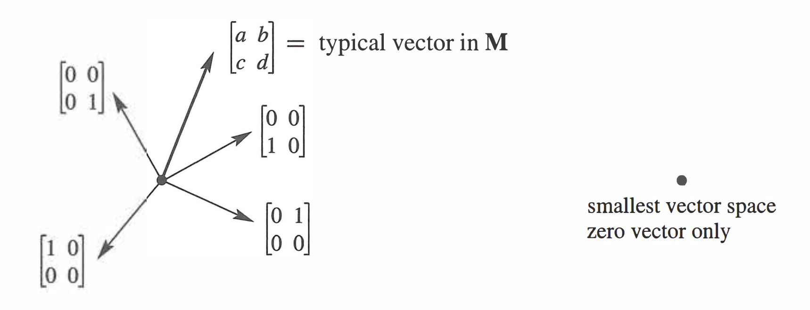
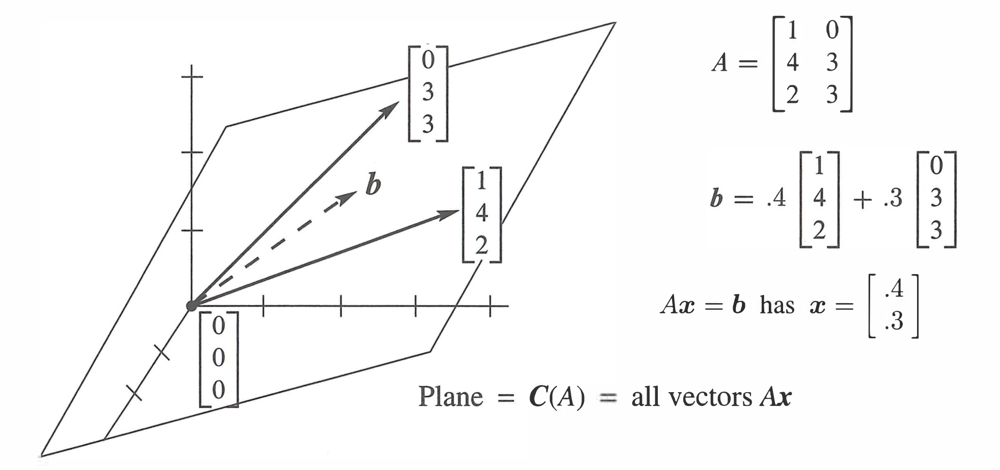
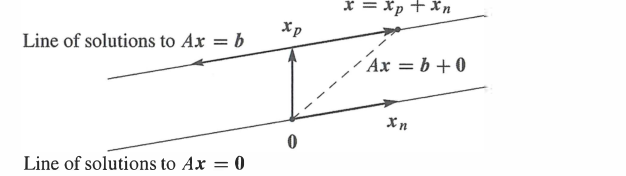
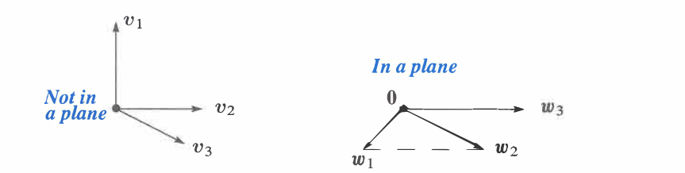
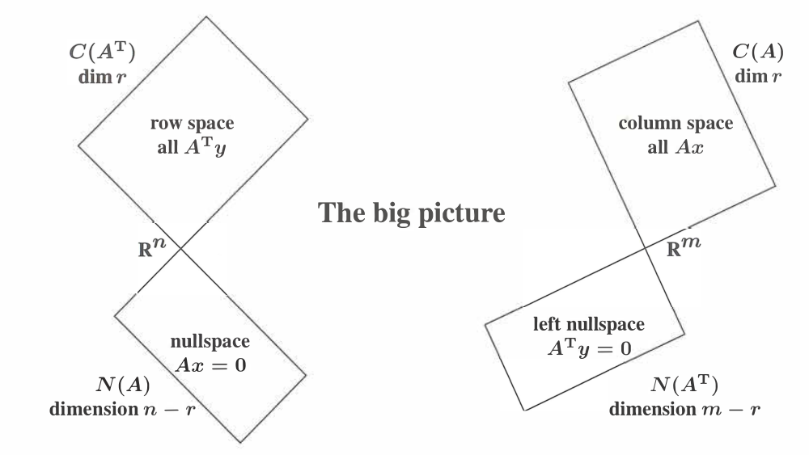

# 第 3 章 向量空间与子空间

<!-- 来源：Gilbert Strang, Introduction to Linear Algebra, 5th ed., Chapter 3, pp. 123-193。按原书结构整理；不含 Problem Set 与 Challenge Problems。 -->

## 3.1 向量空间

  

    <ol style="margin:0; padding-left:1.6em;">
      <li style="margin:0.35em 0;">标准的 $n$ 维空间 $\mathbb{R}^n$ 包含所有具有 $n$ 个实数分量的列向量。</li>
      <li style="margin:0.35em 0;">如果 $v,w$ 属于向量空间 $S$，那么每个线性组合 $cv+dw$ 都必须仍在 $S$ 中。</li>
      <li style="margin:0.35em 0;">$S$ 中的“向量”也可以是矩阵或关于 $x$ 的函数。只含 $x=0$ 的单点空间记作 $Z$。</li>
      <li style="margin:0.35em 0;">$\mathbb{R}^n$ 的子空间，是位于 $\mathbb{R}^n$ 内部的向量空间。例如，$\mathbb{R}^2$ 中的直线 $y=3x$。</li>
      <li style="margin:0.35em 0;">$A$ 的列空间包含 $A$ 的各列的一切线性组合，它是 $\mathbb{R}^m$ 的一个子空间。</li>
      <li style="margin:0.35em 0;">列空间包含所有向量 $Ax$。因此，$Ax=b$ 可解的条件是 $b\in C(A)$。</li>
    </ol>
  

初学矩阵时，计算似乎只是对许多数字进行运算。现在，我们要从向量的角度重新理解这些计算：矩阵与向量的乘积 $Ax$，是矩阵 $A$ 的各列按照 $x$ 的分量组成的线性组合；矩阵乘积 $AB$ 的每一列，也都是 $A$ 的各列的线性组合。本章将认识提升到第三个层次：不再只研究单个数或单个向量，而是研究由许多向量组成的“空间”。只有理解向量空间及其子空间，才能完整理解方程 $Ax=b$ 的含义和可解条件。

> **符号说明**
>
> 设 $A=[\,a_1\ a_2\ \cdots\ a_n\,]$ 是一个 $m\times n$ 矩阵，$a_1,\ldots,a_n$ 是它的列向量。若 $x=(x_1,\ldots,x_n)^T$，那么 $Ax=x_1a_1+x_2a_2+\cdots+x_na_n$。因此，$Ax$ 是一个向量，表示用 $x_1,\ldots,x_n$ 作为系数对 $A$ 的各列进行线性组合。
>
> 若 $B=[\,b_1\ b_2\ \cdots\ b_p\,]$，则 $AB=[\,Ab_1\ Ab_2\ \cdots\ Ab_p\,]$。这说明 $AB$ 的第 $j$ 列是 $Ab_j$；而 $Ab_j$ 又是 $A$ 的各列的一次线性组合。这里的 $A$、$B$ 都是矩阵，$x$ 和每个 $b_j$ 都是列向量。

由于本章研究得更深入，它可能显得稍难一些，这是很自然的。我们将进入计算内部，寻找其中的数学结构。本章最后将得到“线性代数基本定理”。

首先考察线性代数中最基本的一类向量空间：$\mathbb{R}^1,\mathbb{R}^2,\mathbb{R}^3,\ldots$。这里的符号 $\mathbb{R}^n$ 不是指某一个向量，而是指由一整类向量组成的集合，其正式定义如下。

  

    
定义　空间 $\mathbb{R}^n$

    
空间 $\mathbb{R}^n$ 由所有具有 $n$ 个分量的实列向量 $v$ 组成。

  

$\mathbb{R}$ 表示各分量都是实数，上标 $n$ 表示每个向量含有 $n$ 个分量。因此，$\mathbb{R}^1$ 可以表示为一条数轴，$\mathbb{R}^2$ 可以表示为 $xy$ 平面，$\mathbb{R}^3$ 可以表示为通常的三维空间。相应地，$\mathbb{R}^5$ 由所有具有五个实数分量的列向量组成，所以称为五维空间。五维空间难以直接画出，但其中的向量仍可通过五个分量进行计算。

若向量的各分量是复数，则相应空间记作 $\mathbb{C}^n$。向量通常写成列，也可以在一行中用圆括号和逗号简写。例如：

$$
\begin{bmatrix}1\\1\end{bmatrix}\in\mathbb{R}^2,
\qquad
(1,1,0,1,1)\in\mathbb{R}^5,
\qquad
\begin{bmatrix}1+i\\1-i\end{bmatrix}\in\mathbb{C}^2.
$$

在这些例子中，$(1,1,0,1,1)$ 是五分量实向量，属于 $\mathbb{R}^5$；而 $(1+i,1-i)^T$ 的分量是复数，因此属于 $\mathbb{C}^2$。

向量空间中有两种基本运算：**向量加法**和**标量乘法**。设

$$
u=(u_1,\ldots,u_n),
\qquad
v=(v_1,\ldots,v_n)
$$

都属于 $\mathbb R^n$。相加时，将两个向量的对应分量相加：

$$
u+v=(u_1+v_1,\ldots,u_n+v_n).
$$

用实数 $c$ 乘向量 $v$ 时，将 $v$ 的每个分量都乘以 $c$：

$$
cv=(cv_1,\ldots,cv_n).
$$

这里的实数 $c$ 称为**标量**。例如，若 $v=(1,0,0,1)\in\mathbb R^4$，则

$$
2v=(2,0,0,2)\in\mathbb R^4.
$$

> **封闭性**　在 $\mathbb R^n$ 中，向量相加或乘以实数后，结果仍属于 $\mathbb R^n$。因此，对任意 $u,v\in\mathbb R^n$ 和任意实数 $c,d$，向量 $cu+dv$ 仍属于 $\mathbb R^n$。$cu+dv$ 称为 $u$ 和 $v$ 的一个**线性组合**。

前面介绍的封闭性还不足以完整定义向量空间。一个**实向量空间**首先是一个对象的集合，并规定了向量加法和实数数乘；这两种运算的结果必须仍在该集合中。此外，它们还必须满足向量空间的八条公理。$\mathbb R^n$ 中熟悉的交换律 $u+v=v+u$、分配律 $c(u+v)=cu+cv$ 和零向量性质 $0+v=v$，都是这些公理的具体例子。

向量空间的八条公理

对空间中的任意向量 $u,v,w$ 和任意实数 $c,d$，要求：

1. $u+v=v+u$；
2. $(u+v)+w=u+(v+w)$；
3. 存在零向量 $0$，使 $v+0=v$；
4. 对每个 $v$，存在 $-v$，使 $v+(-v)=0$；
5. $1v=v$；
6. $(cd)v=c(dv)$；
7. $c(u+v)=cu+cv$；
8. $(c+d)v=cv+dv$。

“向量”不一定是列向量；只要对象之间的加法和实数数乘满足上述要求，它们也能组成向量空间。下面是 $\mathbb{R}^n$ 以外的三个例子：

- $M$：所有实 $2\times2$ 矩阵组成的向量空间；
- $F$：所有实函数 $f(x)$ 组成的向量空间；
- $Z$：只含一个零向量的向量空间。

在 $M$ 中，矩阵本身被看作“向量”：两个 $2\times2$ 矩阵相加仍是 $2\times2$ 矩阵，实数乘矩阵后也仍属于 $M$。在 $F$ 中，函数被看作“向量”，运算按点定义为 $(f+g)(x)=f(x)+g(x)$ 和 $(cf)(x)=c f(x)$。在 $Z$ 中只有一个对象 $0$，所以只能进行 $0+0=0$ 和 $c0=0$。三种空间都对加法和数乘封闭，并满足八条公理。

每个向量空间都有自己的零向量：$M$ 中是零矩阵，$F$ 中是恒为零的零函数，$Z$ 中则是其唯一的向量 $0$。

函数空间 $F$ 包含所有实函数，因此需要无限多个基函数才能描述，称为无限维空间。它的一个较小子空间是 $P_n$，其中包含所有次数不超过 $n$ 的多项式

$$
a_0+a_1x+\cdots+a_nx^n.
$$

多项式 $1,x,\ldots,x^n$ 可以生成 $P_n$，所以在第 3.4 节正式定义“基”和“维数”后，将得到 $\dim P_n=n+1$。类似地，$M$ 的维数为 $4$，因为一个 $2\times2$ 矩阵由四个独立位置决定。

$Z$ 是最小的向量空间：它不是没有向量，而是恰好含有一个向量——零向量。它的维数为 $0$。因此不把它写成 $\mathbb R^0$，以免把“零维”误解为“集合中没有任何向量”。这里对维数的描述是提前说明；维数的正式定义将在第 3.4 节给出。

  
  
图 3.1 “四维”矩阵空间 $M$ 与只含零向量的“零维”空间 $Z$。

### 子空间

在不同场合，我们会把矩阵和函数也看成向量。不过，最常用的仍是普通列向量。它们具有 $n$ 个分量，但我们所研究的向量集合未必包含所有具有 $n$ 个分量的向量。$\mathbb{R}^n$ 内部存在许多重要的向量空间，它们称为 $\mathbb{R}^n$ 的**子空间**。

从通常的三维空间 $\mathbb{R}^3$ 开始，选取一个经过原点 $(0,0,0)$ 的平面。这个平面本身就是一个向量空间：平面内两个向量之和仍在平面内；用 $2$ 或 $-5$ 乘平面内的向量，结果仍在平面内。

三维空间中的这个平面并不是 $\mathbb{R}^2$，即使它看上去很像 $\mathbb{R}^2$。平面中的向量具有三个分量，属于 $\mathbb{R}^3$。这个平面是 $\mathbb{R}^3$ 内部的向量空间。这说明了线性代数中最基本的思想之一：经过 $(0,0,0)$ 的平面是整个向量空间 $\mathbb{R}^3$ 的一个子空间。

  

    
定义　子空间

    
向量空间的一个子空间，是一个包含零向量的向量集合，并满足：若 $v,w$ 属于该子空间，$c$ 是任意标量，则

    
(i) $v+w$ 属于该子空间；　(ii) $cv$ 属于该子空间。

  

换句话说，这个向量集合对于加法 $v+w$ 和数乘 $cv$ 是“封闭”的；这些运算不会使结果离开子空间。我们也可以做减法，因为 $-w$ 在子空间中，$v+(-w)=v-w$ 也在其中。简言之，子空间必须包含其中向量的一切线性组合。

这些运算沿用所在大空间的规则，因此八条向量空间公理会自动成立。判断一个集合是否为子空间时，只需检查它是否包含所有线性组合。

根据子空间的定义，可以先得到一个必要条件：**每个子空间都必须包含零向量。** 若 $v$ 属于某个子空间，在数乘封闭性中取 $c=0$，便有 $0v=0$ 仍属于该子空间。因此，$\mathbb R^3$ 中不经过原点 $(0,0,0)$ 的直线或平面一定不是子空间。

反过来，完整的过原点直线确实是子空间：直线上的向量相加后仍在该直线上，乘以任意实数后也不会离开直线。完整的过原点平面同样满足这两个封闭条件。再加上整个 $\mathbb R^3$ 和只含零向量的空间 $Z$，就得到 $\mathbb R^3$ 中子空间的四种可能类型：

- (L) 任意经过 $(0,0,0)$ 的直线；
- (P) 任意经过 $(0,0,0)$ 的平面；
- ($\mathbb{R}^3$) 整个空间；
- ($Z$) 只含向量 $(0,0,0)$ 的零空间。

这里强调的是**完整的**直线或平面。一个集合即使包含原点，也不一定是子空间；它还必须对向量加法和任意实数数乘封闭。如果只取直线、平面或整个空间的一部分，封闭性通常会被破坏。下面用 $\mathbb R^2$ 中的两个集合说明这种情况。

  

    
例 1

    
只保留两个分量均为正数或零的向量 $(x,y)$，得到第一象限及其边界。向量 $(2,3)$ 属于这个集合，但用标量 $-1$ 乘它后得到 $(-1)(2,3)=(-2,-3)$，结果不再属于这个集合。因此，该集合不满足上面“子空间”定义中的条件 (ii)（对标量乘法封闭），所以不是 $\mathbb R^2$ 的子空间。

  

  

    
例 2

    
再加入两个分量均为负数的向量，得到第一、第三象限及其边界。这个集合满足上面“子空间”定义中的条件 (ii)（对标量乘法封闭）：乘以正数时向量留在原象限，乘以负数时向量转到相对象限，乘以零时得到原点。但是，它不满足条件 (i)（对向量加法封闭）。例如

    
$v=(2,3),\qquad w=(-3,-2),\qquad v+w=(-1,1)$

    
所得向量位于这两个四分之一平面之外。因此，两个四分之一平面合在一起仍不是子空间。

  

条件 (i) 和 (ii) 分别涉及向量加法与标量乘法，也可以合并为一条规则：

> 包含 $v$ 和 $w$ 的子空间，必须包含它们的一切线性组合 $cv+dw$。

  

    
例 3

    
在所有 $2\times2$ 矩阵组成的向量空间 $M$ 中，下列集合都是子空间：

    
$U=\left\{\begin{bmatrix}a&b\\0&d\end{bmatrix}\right\}\quad\text{（所有上三角矩阵）}$

    
$D=\left\{\begin{bmatrix}a&0\\0&d\end{bmatrix}\right\}\quad\text{（所有对角矩阵）}$

    
$U$ 中任意两个矩阵相加仍在 $U$ 中；两个对角矩阵之和仍为对角矩阵。在这里，$D$ 还是 $U$ 的子空间。当 $a,b,d$ 全为零时得到零矩阵，所以零矩阵属于这些子空间。

    
单位矩阵的所有倍数也组成一个子空间。两个单位矩阵倍数的线性组合仍是单位矩阵的倍数。矩阵 $cI$ 在 $M,U,D$ 内部形成一条“矩阵直线”。但单独一个单位矩阵 $I$ 并不构成子空间，单独一个矩阵能够构成子空间的情形只有零矩阵。

  

### $A$ 的列空间

现在把子空间的概念用于矩阵方程 $Ax=b$。设 $A$ 的列为 $a_1,\ldots,a_n$，则对任意 $x=(x_1,\ldots,x_n)^T$，都有

$$
Ax=x_1a_1+\cdots+x_na_n.
$$

因此，每个乘积 $Ax$ 都是 $A$ 的列向量的线性组合。反过来，任意这样的线性组合都能通过适当选择 $x_1,\ldots,x_n$ 写成 $Ax$。当 $x$ 取遍 $\mathbb R^n$ 时，所有可能的输出 $Ax$ 组成一个向量集合；这个集合称为 $A$ 的**列空间**，记作 $C(A)$。

  

    
定义　列空间

    
列空间由矩阵各列的一切线性组合组成。这些组合就是所有可能的向量 $Ax$，它们充满列空间 $C(A)$。

  

这样，方程 $Ax=b$ 的可解性就有了直接的空间解释：求解方程，就是判断给定向量 $b$ 能否由 $A$ 的各列线性组合得到。如果能得到，则相应的组合系数构成一个解 $x$；如果不能得到，则方程无解。换句话说，问题的关键是 $b$ 是否属于 $C(A)$。

  

    方程组 $Ax=b$ 可解，当且仅当 $b$ 属于 $A$ 的列空间。
  

设 $A$ 是 $m\times n$ 矩阵。它的列有 $m$ 个分量，而不是 $n$ 个，所以各列属于 $\mathbb{R}^m$。因此，$A$ 的列空间是 $\mathbb{R}^m$ 的子空间，而不是 $\mathbb{R}^n$ 的子空间。所有列组合 $Ax$ 满足子空间条件：两个列组合相加或乘以标量后，仍然是各列的线性组合。

  

    
例 4

    
考虑 $3\times2$ 矩阵

    
$A=\begin{bmatrix}1&0\\4&3\\2&3\end{bmatrix}$

    
矩阵与向量相乘得到

    
$\displaystyle Ax=\begin{bmatrix}1&0\\4&3\\2&3\end{bmatrix}\begin{bmatrix}x_1\\x_2\end{bmatrix}$

    
$\displaystyle {}=x_1\begin{bmatrix}1\\4\\2\end{bmatrix}+x_2\begin{bmatrix}0\\3\\3\end{bmatrix}$

    
这两个列向量互不成比例，因而线性无关。当 $x_1,x_2$ 取遍所有实数时，上式中的线性组合恰好生成 $\mathbb R^3$ 中一个经过原点的二维平面；这个平面就是 $A$ 的列空间 $C(A)$。图 3.2 展示了该平面以及其中一个向量 $b=Ax$。

    

      
      
图 3.2　矩阵 $A$ 的两个列向量在 $\mathbb R^3$ 中张成列空间 $C(A)$。

    

    
因此，方程 $Ax=b$ 可解，当且仅当 $b$ 位于该平面上；平面外的 $b$ 不能由两列线性组合得到，方程无解。取 $(x_1,x_2)=(1,0)$ 得到 $A$ 的第一列，取 $(0,1)$ 得到第二列，取 $(0,0)$ 得到零向量。其余取值则生成平面中的其他向量。

  

**记号**　矩阵 $A$ 的列空间记作 $C(A)$。它可能等于整个 $\mathbb R^m$，也可能只是 $\mathbb R^m$ 中的一个较小子空间，具体取决于 $A$ 的列能够生成哪些向量。

列空间是“张成”这一概念的一个特殊情形。更一般地，设

$$
S=\{v_1,v_2,\ldots,v_N\}
$$

是向量空间 $V$ 中的一组向量。把这些向量的所有线性组合收集起来，得到

$$
\operatorname{span}(S)
=\left\{c_1v_1+c_2v_2+\cdots+c_Nv_N:
c_1,\ldots,c_N\in\mathbb R\right\}.
$$

这个集合称为 $S$ 的**张成空间**。虽然原来的向量集合 $S$ 通常不是子空间，但 $\operatorname{span}(S)$ 一定是子空间，因为它包含零向量，并且对向量加法和标量乘法封闭。

$\operatorname{span}(S)$ 也是包含 $S$ 的最小子空间：任何包含 $v_1,\ldots,v_N$ 的子空间，都必须同时包含它们的全部线性组合，因此必然包含 $\operatorname{span}(S)$。

这个定义包含两个重要的特殊情形：

- 若 $S$ 是矩阵 $A$ 的全部列组成的集合，则 $\operatorname{span}(S)=C(A)$。因此称“$A$ 的各列张成其列空间”。
- 若 $S=\{v\}$ 只含一个非零向量，则 $\operatorname{span}(S)=\{cv:c\in\mathbb R\}$，即经过原点并沿 $v$ 方向延伸的直线。

**例 5**　描述下列矩阵的列空间，它们都是 $\mathbb{R}^2$ 的子空间：

$$
I=\begin{bmatrix}1&0\\0&1\end{bmatrix},
\qquad
A=\begin{bmatrix}1&2\\2&4\end{bmatrix},
\qquad
B=\begin{bmatrix}1&2&3\\0&0&4\end{bmatrix}.
$$

**解**　$I$ 的列空间是整个 $\mathbb{R}^2$，因为每个向量都能表示为 $I$ 的两列的线性组合，即 $C(I)=\mathbb{R}^2$。

$A$ 的列空间只是一条直线。第二列 $(2,4)^T$ 是第一列 $(1,2)^T$ 的倍数，因此列空间包含所有形如 $(c,2c)^T$ 的向量。只有当 $b$ 位于这条直线上时，$Ax=b$ 才可解。

三列矩阵 $B$ 的列空间是整个 $\mathbb{R}^2$，每个 $b$ 都能够得到。例如

$$
\begin{bmatrix}5\\4\end{bmatrix}
=\begin{bmatrix}2\\0\end{bmatrix}
+\begin{bmatrix}3\\4\end{bmatrix}
=2\begin{bmatrix}1\\0\end{bmatrix}
+\begin{bmatrix}3\\4\end{bmatrix}.
$$

所以对应的 $x$ 可以是 $(0,1,1)^T$，也可以是 $(2,0,1)^T$。$B$ 与 $I$ 具有相同的列空间，任何 $b$ 都允许；但 $B$ 的未知向量 $x$ 有更多分量，因此同一个 $b$ 可能由更多不同的列组合得到。

下一节将建立向量空间 $N(A)$，用来描述 $Ax=0$ 的全部解。本节建立的列空间 $C(A)$，则描述所有可以达到的右端 $b$。

### 关键思想回顾

1. $\mathbb{R}^n$ 包含所有具有 $n$ 个实数分量的列向量。
2. $M$（$2\times2$ 矩阵）、$F$（函数）和 $Z$（只含零向量）都是向量空间。
3. 包含 $v,w$ 的子空间必须包含它们的一切线性组合 $cv+dw$。
4. $A$ 的列的一切线性组合构成列空间 $C(A)$，即这些列张成列空间。
5. $Ax=b$ 有解，当且仅当 $b$ 属于 $A$ 的列空间。

$$
C(A)=\text{各列的一切线性组合}=\text{所有向量 }Ax.
$$

### Worked Examples

**3.1 A**　给定三个不同的向量 $b_1,b_2,b_3$。构造一个矩阵 $A$，使 $Ax=b_1$ 和 $Ax=b_2$ 可解，而 $Ax=b_3$ 不可解。如何判断这种构造是否可能？怎样构造 $A$？

**解**　我们需要 $b_1,b_2$ 属于 $A$ 的列空间。最快的办法是直接把 $b_1,b_2$ 作为 $A$ 的两列：

$$
A=\begin{bmatrix}b_1&b_2\end{bmatrix}.
$$

于是 $Ax=b_1$ 和 $Ax=b_2$ 的解分别为 $x=(1,0)^T$ 和 $x=(0,1)^T$。

同时，我们不希望 $Ax=b_3$ 可解，所以不能再扩大列空间。问题归结为

$$
Ax=\begin{bmatrix}b_1&b_2\end{bmatrix}
\begin{bmatrix}x_1\\x_2\end{bmatrix}=b_3
$$

是否可解，也就是 $b_3$ 是否为 $b_1,b_2$ 的线性组合。如果不是，这个 $A$ 就满足要求；如果是，就不可能构造这样的 $A$。因为任何包含 $b_1,b_2$ 的列空间都必须包含它们的一切线性组合，从而必然包含 $b_3$。

**3.1 B**　对下面每个向量空间 $V$，描述它的一个子空间 $S$，再描述 $S$ 的一个子空间 $SS$：

$$
\begin{aligned}
V_1&=\operatorname{span}\{(1,1,0,0),(1,1,1,0),(1,1,1,1)\},\\
V_2&=\{v:u\cdot v=0\},\qquad u=(1,2,1),\\
V_3&=\text{所有对称 }2\times2\text{ 矩阵},\\
V_4&=\left\{y:\frac{d^4y}{dx^4}=0\right\}.
\end{aligned}
$$

并用两种方式描述每个 $V$：“由……的一切线性组合组成”和“由……方程的全部解组成”。

**解**　在 $V_1$ 中，前两个向量的一切线性组合可作为子空间 $S$；第一个向量的所有倍数 $(c,c,0,0)$ 可作为 $S$ 的子空间 $SS$。

$V_2$ 的一个子空间 $S$ 是经过 $(1,-1,1)$ 的直线，因为该向量与 $u$ 垂直。$x=(0,0,0)$ 位于 $S$ 中，它的所有倍数只给出最小的子空间 $SS=Z$。

所有对角矩阵构成 $V_3$ 的一个子空间 $S$；所有 $cI$ 构成对角矩阵空间的一个子空间 $SS$。

$V_4$ 包含所有三次多项式 $y=a+bx+cx^2+dx^3$。所有二次多项式可作为子空间 $S$，所有一次多项式可作为 $SS$，常数函数还可组成更小的子空间。四种情形中都可以取 $S=V$，也可以取 $SS=Z$。

每个空间的两种描述为

$$
\begin{aligned}
V_1&=\text{给定三个向量的全部线性组合}
    =\{v:v_1-v_2=0\},\\
V_2&=\operatorname{span}\{(1,0,-1),(1,-1,1)\}
    =\{v:u\cdot v=0\},\\
V_3&=\operatorname{span}\left\{
\begin{bmatrix}1&0\\0&0\end{bmatrix},
\begin{bmatrix}0&1\\1&0\end{bmatrix},
\begin{bmatrix}0&0\\0&1\end{bmatrix}\right\}
    =\left\{\begin{bmatrix}a&b\\c&d\end{bmatrix}:b=c\right\},\\
V_4&=\operatorname{span}\{1,x,x^2,x^3\}
    =\left\{y:\frac{d^4y}{dx^4}=0\right\}.
\end{aligned}
$$

## 3.2 $A$ 的零空间：求解 $Ax=0$ 与 $Rx=0$

  

    <ol style="margin:0; padding-left:1.6em;">
      <li style="margin:0.35em 0;">$\mathbb{R}^n$ 中的零空间 $N(A)$ 包含 $Ax=0$ 的全部解 $x$，其中包括 $x=0$。</li>
      <li style="margin:0.35em 0;">从 $A$ 消元到 $U$ 再到 $R$ 不改变零空间：$N(A)=N(U)=N(R)$。</li>
      <li style="margin:0.35em 0;">简化行阶梯形 $R=\operatorname{rref}(A)$ 的每个主元都是 $1$，且主元上方和下方都是零。</li>
      <li style="margin:0.35em 0;">如果 $R$ 的第 $j$ 列是自由列，即没有主元，那么 $Ax=0$ 有一个令 $x_j=1$ 的“特殊解”。</li>
      <li style="margin:0.35em 0;">主元数等于 $R$ 的非零行数，也等于秩 $r$；共有 $n-r$ 个自由列。</li>
      <li style="margin:0.35em 0;">每个满足 $m<n$ 的矩阵都有非零的零空间向量，即 $Ax=0$ 有非零解。</li>
    </ol>
  

本节研究由 $Ax=0$ 的全部解组成的子空间。$m\times n$ 矩阵 $A$ 可以是方阵，也可以是长方形矩阵，右端固定为 $b=0$。显然总有解 $x=0$。如果 $A$ 可逆，这是唯一解；如果 $A$ 不可逆，还会有非零解。每个解 $x$ 都属于 $A$ 的零空间，消元将找出全部解并揭示这个重要子空间。

  

    
定义　零空间

    
$A$ 的零空间 $N(A)$ 由方程 $Ax=0$ 的全部解组成。这些解向量 $x$ 位于 $\mathbb{R}^n$ 中。

  

解向量确实构成子空间。若 $x,y\in N(A)$，则 $Ax=0,Ay=0$，矩阵乘法规则给出

$$
A(x+y)=Ax+Ay=0,
\qquad
A(cx)=cAx=0.
$$

所以 $x+y$ 和 $cx$ 仍属于 $N(A)$。解向量有 $n$ 个分量，因此 $N(A)$ 是 $\mathbb{R}^n$ 的子空间；与之不同，列空间 $C(A)$ 是 $\mathbb{R}^m$ 的子空间。

**例 1**　描述奇异矩阵

$$
A=\begin{bmatrix}1&2\\3&6\end{bmatrix}
$$

的零空间。

**解**　方程 $Ax=0$ 为

$$
\begin{aligned}
x_1+2x_2&=0,\\
3x_1+6x_2&=0.
\end{aligned}
$$

第二个方程是第一个方程的 $3$ 倍，实际上只有一个独立方程。在行图像中，两式表示同一条直线 $x_1+2x_2=0$，这条直线就是 $N(A)$。

要有效描述全部解，可以先选直线上的一个“特殊解”，其余点都是它的倍数。令自由变量 $x_2=1$，由方程得到 $x_1=-2$，因此

$$
s=\begin{bmatrix}-2\\1\end{bmatrix},
\qquad
As=0,
\qquad
N(A)=\{cs:c\in\mathbb{R}\}.
$$

描述零空间的最佳办法，就是求出 $Ax=0$ 的特殊解，再取这些特殊解的一切线性组合。

**例 2**　方程 $x+2y+3z=0$ 来自 $1\times3$ 矩阵 $A=[\,1\ 2\ 3\,]$。它的解构成一个平面，平面内所有向量都与 $(1,2,3)$ 垂直，这个平面就是 $N(A)$。

变量 $y,z$ 是自由变量。分别令 $(y,z)=(1,0)$ 和 $(0,1)$，得到两个特殊解

$$
[\,1\ 2\ 3\,]
\begin{bmatrix}x\\y\\z\end{bmatrix}=0,
\qquad
s_1=\begin{bmatrix}-2\\1\\0\end{bmatrix},
\qquad
s_2=\begin{bmatrix}-3\\0\\1\end{bmatrix}.
$$

$s_1,s_2$ 位于平面 $x+2y+3z=0$ 上，平面中每个向量都是它们的线性组合。特殊之处在于，我们把两个自由分量依次选为 $(1,0)$ 和 $(0,1)$；第一个分量 $-2,-3$ 随后由方程确定。

方程 $x+2y+3z=6$ 的解也位于一个平面上，但该平面不是子空间，因为 $x=0$ 仅在右端为零时才是解。第 3.3 节将说明：若 $Ax=b$ 有解，其全部解可由 $Ax=0$ 的零空间平移得到。

本节有两个关键步骤：

1. 把 $A$ 化为简化行阶梯形 $R$；
2. 求出 $Ax=0$ 的特殊解。

### 主元列与自由列

矩阵 $[\,1\ 2\ 3\,]$ 的第一列含有唯一主元，因此 $x$ 的第一个分量不是自由变量。自由分量对应没有主元的列。构造特殊解时，只对自由变量作 $0$ 或 $1$ 的特殊选择。

**例 3**　求下列矩阵的零空间，并求 $Cx=0$ 的两个特殊解：

$$
A=\begin{bmatrix}1&2\\3&8\end{bmatrix},
\qquad
B=\begin{bmatrix}A\\2A\end{bmatrix}
=\begin{bmatrix}1&2\\3&8\\2&4\\6&16\end{bmatrix},
\qquad
C=\begin{bmatrix}A&2A\end{bmatrix}
=\begin{bmatrix}1&2&2&4\\3&8&6&16\end{bmatrix}.
$$

**解**　$Ax=0$ 只有零解，因为

$$
\begin{bmatrix}1&2\\3&8\end{bmatrix}
\begin{bmatrix}x_1\\x_2\end{bmatrix}=0
\quad\longrightarrow\quad
\begin{bmatrix}1&2\\0&2\end{bmatrix}
\begin{bmatrix}x_1\\x_2\end{bmatrix}=0
\quad\longrightarrow\quad x_1=x_2=0.
$$

所以 $N(A)=Z$，没有特殊解，两列都有主元。长矩阵 $B$ 也有相同的零空间；前两个方程已经迫使 $x=0$，额外增加方程只会增加约束，不会扩大零空间。

$C$ 增加的是列而不是行，解向量有四个分量。消元得到

$$
C=\begin{bmatrix}1&2&2&4\\3&8&6&16\end{bmatrix}
\quad\longrightarrow\quad
U=\begin{bmatrix}1&2&2&4\\0&2&0&4\end{bmatrix}.
$$

前两列是主元列，后两列是自由列。依次令 $(x_3,x_4)=(1,0)$ 和 $(0,1)$，由 $Ux=0$ 求出主元变量：

$$
s_1=\begin{bmatrix}-2\\0\\1\\0\end{bmatrix},
\qquad
s_2=\begin{bmatrix}0\\-2\\0\\1\end{bmatrix}.
$$

它们同时满足 $Cs=0$ 和 $Us=0$。消元不改变解，所以 $N(C)=N(U)$。

### 简化行阶梯形 $R$

当 $A$ 是长方形矩阵时，消元不必停在上三角形 $U$。再进行两步可以得到最简洁的矩阵 $R$：

1. 用主元行向上消元，使每个主元上方也为零；
2. 用每个主元除其所在整行，使所有主元都变为 $1$。

这些操作不会改变方程右侧的零向量，因此

$$
N(A)=N(U)=N(R),
\qquad R=\operatorname{rref}(A).
$$

对例 3 的矩阵，

$$
U=\begin{bmatrix}1&2&2&4\\0&2&0&4\end{bmatrix}
\quad\longrightarrow\quad
R=\begin{bmatrix}1&0&2&0\\0&1&0&2\end{bmatrix}.
$$

从第 1 行减去第 2 行，再把第 2 行乘以 $1/2$，即可得到 $R$。自由列 3 等于主元列 1 的 $2$ 倍，所以特殊解 $s_1$ 中出现 $-2$；自由列 4 等于主元列 2 的 $2$ 倍，所以 $s_2=(0,-2,0,1)^T$。从 $Rx=0$ 求特殊解最为直接：把自由列中的数变号，填入对应特殊解的主元位置。

许多矩阵的 $Ax=0$ 只有零解。此时 $N(A)=Z$，没有特殊解，只有“零组合”能使 $A$ 的各列组合成零向量。这个结论看似简单，却极为重要：它说明 $A$ 的各列**线性无关**。所有列都是主元列，没有自由列。第 3.4 节将正式介绍线性无关。

一般地，若 $R$ 有三个主元列和两个自由列，可以写成

$$
R=\begin{bmatrix}
1&0&a&0&c\\
0&1&b&0&d\\
0&0&0&1&e\\
0&0&0&0&0
\end{bmatrix}.
$$

相应的特殊解为

$$
s_1=\begin{bmatrix}-a\\-b\\1\\0\\0\end{bmatrix},
\qquad
s_2=\begin{bmatrix}-c\\-d\\0\\-e\\1\end{bmatrix}.
$$

$R$ 清楚地表明，第 3 列等于 $a$ 倍第 1 列加 $b$ 倍第 2 列；这同样必然适用于消元前的 $A$。零空间为

$$
N(A)=N(R)=\{c_1s_1+c_2s_2:c_1,c_2\in\mathbb{R}\}.
$$

例如，一个 $4\times7$ 的简化行阶梯形矩阵若有三个主元，则有三个主元变量、四个自由变量和四个特殊解。其列属于 $\mathbb{R}^4$；若最后一行全为零，列空间由所有形如 $(b_1,b_2,b_3,0)^T$ 的向量组成。零空间则是 $\mathbb{R}^7$ 的子空间，由四个特殊解的一切线性组合组成。

这得到一个极重要的结论。若 $A$ 的列数多于行数，即 $n>m$，主元数至多为 $m$，所以至少存在一个自由变量。把这个自由变量设为 $1$，就得到 $Ax=0$ 的一个非零特殊解。

  

    若 $Ax=0$ 的未知数多于方程数，即 $n>m$，则必有自由列，因此 $Ax=0$ 必有非零解。
  

矮而宽的矩阵总有非零零空间向量，而且至少有 $n-m$ 个自由变量。零空间的“维数”就是自由变量的个数；第 3.4 节将正式定义并解释维数。

### 矩阵的秩

$m,n$ 给出矩阵的外形尺寸，却不一定反映线性系统的真实规模。像 $0=0$ 这样的方程不应计数；相同行会在消元中消失，若某一行是其他行的线性组合，它也会在 $U$ 和 $R$ 中变成零行。矩阵真正的大小由它的秩给出。

  

    
秩的定义

    
$A$ 的秩是主元的个数，记为 $r$。

  

最终的 $R$ 有 $r$ 个非零行。考虑秩为 $2$ 的矩阵

$$
A=\begin{bmatrix}
1&1&2&4\\
1&2&2&5\\
1&3&2&6
\end{bmatrix}.
$$

前两列方向不同，是主元列。第三列是第一列的 $2$ 倍，第四列是前三列之和，因而都没有主元。自由列与主元列的关系为

$$
\text{列 }3=2(\text{列 }1)+0(\text{列 }2),
\qquad
\text{列 }4=3(\text{列 }1)+1(\text{列 }2),
$$

对应特殊解

$$
s_1=(-2,0,1,0)^T,
\qquad
s_2=(-3,-1,0,1)^T.
$$

自由列中的组合系数在特殊解中以相反符号出现。

### 秩一矩阵

秩一矩阵只有一个主元。消元若在第一列产生零，也会在所有列产生零；每一行都是主元行的倍数，同时每一列也都是主元列的倍数。例如

$$
A=\begin{bmatrix}1&3&10\\2&6&20\\3&9&30\end{bmatrix}
\quad\longrightarrow\quad
R=\begin{bmatrix}1&3&10\\0&0&0\\0&0&0\end{bmatrix}.
$$

列空间是一维的：所有列都在经过 $u=(1,2,3)^T$ 的直线上。把倍数 $1,3,10$ 放进一个行向量 $v^T$，便得到秩一矩阵的特殊形式

$$
A=uv^T
=\begin{bmatrix}1\\2\\3\end{bmatrix}
\begin{bmatrix}1&3&10\end{bmatrix}.
$$

此时 $Ax=0$ 即 $u(v^Tx)=0$，所以 $v^Tx=0$。零空间中的所有 $x$ 都与行空间中的 $v$ 垂直：秩为 $1$ 时，行空间是一条直线，零空间是与它垂直的平面。

**例 4**　当所有行都是一个主元行的倍数时，矩阵的秩为 $1$。例如

$$
\begin{bmatrix}1&3&4\\2&6&8\end{bmatrix},
\qquad
\begin{bmatrix}0&1\\0&3\end{bmatrix},
\qquad
\begin{bmatrix}1\\4\end{bmatrix},
\qquad
\begin{bmatrix}0\\0\end{bmatrix}
$$

中，前三个非零矩阵的简化行阶梯形都只有一个主元；单独的非零列也有秩 $1$。（零列的秩为 $0$。）

秩还可以从更高层次理解：$A,U,R$ 都有 $r$ 个线性无关的行，也有 $r$ 个线性无关的列，即主元列。第 3.4 节将说明“线性无关”的含义。再从向量空间层次看，秩 $r$ 是列空间的维数，也是行空间的维数，而 $n-r$ 是零空间的维数。

### 关键思想回顾

1. 零空间 $N(A)$ 是 $\mathbb{R}^n$ 的子空间，包含 $Ax=0$ 的全部解。
2. 对 $A$ 消元得到含主元列和自由列的简化行阶梯形 $R$。
3. 每个自由列产生一个特殊解：相应自由变量为 $1$，其他自由变量为 $0$。
4. $A$ 的秩 $r$ 是主元个数；在 $R=\operatorname{rref}(A)$ 中所有主元都是 $1$。
5. $Ax=0$ 的全部解，是 $n-r$ 个特殊解的线性组合。
6. 若 $n>m$，$A$ 必有自由列，因此 $Ax=0$ 必有非零解。

### Worked Examples

**3.2 A**　若 $EA=R$ 且 $E$ 可逆，为什么 $A$ 与 $R$ 有相同的零空间？

**解**

$$
Ax=0\quad\Longrightarrow\quad Rx=EAx=E0=0,
$$

反过来，

$$
Rx=0\quad\Longrightarrow\quad Ax=E^{-1}Rx=E^{-1}0=0.
$$

因此 $N(A)=N(R)$。$A$ 与 $R$ 还有相同的行空间和相同的秩。

**3.2 B**　构造一个 $3\times4$ 矩阵 $R$，使 $Rx=0$ 的特殊解为

$$
s_1=\begin{bmatrix}-3\\1\\0\\0\end{bmatrix},
\qquad
s_2=\begin{bmatrix}-2\\0\\-6\\1\end{bmatrix},
$$

主元列为第 1、3 列，自由变量为 $x_2,x_4$。并描述具有同一零空间的所有矩阵 $A$。

**解**　$R$ 在第 1、3 列的主元为 $1$，没有第三个主元，因此第三行全为零。特殊解中的 $-3,0,-2,-6$ 变号后成为两个自由列中的系数：

$$
R=\begin{bmatrix}1&3&0&2\\0&0&1&6\\0&0&0&0\end{bmatrix},
\qquad Rs_1=Rs_2=0.
$$

所有满足要求的矩阵都可写成 $A=ER$，其中行运算矩阵 $E$ 可逆。这些 $3\times4$ 矩阵有两个特殊解。

**3.2 C**　求下列矩阵的简化行阶梯形 $R$ 和秩 $r$，它们取决于 $c$；指出 $A$ 的主元列并求特殊解：

$$
A=\begin{bmatrix}1&2&1\\3&6&3\\4&8&c\end{bmatrix},
\qquad
B=\begin{bmatrix}c&c\\c&c\end{bmatrix}.
$$

**解**　$A$ 的第二行是第一行的 $3$ 倍，第三行减去第一行的 $4$ 倍后，末项为 $c-4$。当 $c\ne4$ 时，主元位于第 1、3 列，秩为 $2$：

$$
R=\begin{bmatrix}1&2&0\\0&0&1\\0&0&0\end{bmatrix},
\qquad s=(-2,1,0)^T.
$$

当 $c=4$ 时，只有第 1 列有主元，秩为 $1$：

$$
R=\begin{bmatrix}1&2&1\\0&0&0\\0&0&0\end{bmatrix},
$$

两个特殊解为 $(-2,1,0)^T$ 和 $(-1,0,1)^T$。

若 $c\ne0$，矩阵 $B$ 的秩为 $1$，$R=\begin{bmatrix}1&1\\0&0\end{bmatrix}$；若 $c=0$，则 $R$ 为零矩阵、秩为 $0$，零空间是整个 $\mathbb{R}^2$。

### 消元：整体图景

当 $A$ 被化为 $R$ 时，消元在向量和子空间层次上同时回答两个问题。它从第一个主元开始，逐列由左向右、逐行由上向下推进。

**问题 1：这一列是否为前面各列的线性组合？** 若该列含有主元，答案是否定的；主元列不依赖于前面的列。若第 4 列没有主元，它就是前面若干列的线性组合。

**问题 2：这一行是否为前面各行的线性组合？** 若该行含有主元，答案是否定的；若某行最终没有主元，它就变成零行，并被移到 $R$ 的底部。

一次消元竟能同时回答这两个问题。向下消元先得到阶梯形 $U$，它指出哪些列是前面各列的组合；从 $U$ 自下而上继续化简得到 $R$，它进一步给出这些组合的具体系数，也就是给出 $Ax=0$ 的特殊解。无论从 $A$ 采用怎样的合法行交换和消元步骤，最终的简化行阶梯形 $R$ 都相同。

$R$ 揭示三个基本子空间的基：

- $A$ 的列空间：选取 $A$ 的主元列；
- $A$ 的行空间：选取 $R$ 的非零行；
- $A$ 的零空间：选取 $Rx=0$（也就是 $Ax=0$）的特殊解。

消元还给出最重要的一个数——秩 $r$。它同时计数主元列和主元行；$n-r$ 则计数自由列和特殊解。若把 $[\,A\ I\,]$ 化为 $[\,R\ E\,]$，矩阵 $E$ 会完整记录从 $A$ 到 $R$ 的消元过程，并满足 $EA=R$。当 $A$ 是可逆方阵时，$R=I$ 且 $E=A^{-1}$。

## 3.3 $Ax=b$ 的完整解

  

    <ol style="margin:0; padding-left:1.6em;">
      <li style="margin:0.35em 0;">$Ax=b$ 的完整解为 $x=x_p+x_n$：一个特解加任意零空间解。</li>
      <li style="margin:0.35em 0;">对增广矩阵 $[\,A\ b\,]$ 消元得到 $[\,R\ d\,]$，于是 $Ax=b$ 等价于 $Rx=d$。</li>
      <li style="margin:0.35em 0;">方程可解的条件是：$R$ 的每个零行在 $d$ 中对应的分量也为零。</li>
      <li style="margin:0.35em 0;">一个最方便的特解 $x_p$，是令全部自由变量为零后求得的解。</li>
      <li style="margin:0.35em 0;">满列秩 $r=n$ 意味着 $N(A)=Z$，没有自由变量。</li>
      <li style="margin:0.35em 0;">满行秩 $r=m$ 意味着 $C(A)=\mathbb{R}^m$，因此每个 $Ax=b$ 都可解。</li>
    </ol>
  

上一节已经完整求解 $Ax=0$。现在右端 $b$ 不再为零，左侧所做的每个行运算也必须作用于右端。把 $b$ 作为附加列，便可统一处理：

$$
[\,A\ b\,]\longrightarrow[\,R\ d\,].
$$

例如，若 $A$ 的第三行等于前两行之和，那么方程相容时也必须有 $b_3=b_1+b_2$。消元后的最后一式就是

$$
0=b_3-b_1-b_2.
$$

只有右侧也为零，方程才可解。这正是 $b$ 属于 $C(A)$ 的条件。

### 一个特解与全部零空间解

当 $Rx=d$ 相容时，先令所有自由变量为零，再由 $d$ 求主元变量，可得到一个方便的特解 $x_p$。另一方面，上一节得到的特殊解张成 $N(A)$，所以全部零空间解记为 $x_n$。完整解是

$$
x=x_p+x_n.
$$

这里的 $x_p$ 不乘任意常数；任意常数只出现在 $x_n$ 中。因为

$$
A(x_p+x_n)=Ax_p+Ax_n=b+0=b.
$$

反过来，任意两个特解之差都在零空间中，因此上式确实给出全部解。

若 $A$ 是可逆方阵，则 $m=n=r$，没有自由变量，$x_n=0$，唯一特解就是 $x_p=A^{-1}b$。

**例 1**　设

$$
A=\begin{bmatrix}1&1\\1&2\\-2&-3\end{bmatrix}.
$$

对 $[\,A\ b\,]$ 消元后，最后一行给出相容条件

$$
b_1+b_2+b_3=0.
$$

这个条件使 $b$ 位于 $A$ 的列空间中。$A$ 的两列都有主元，所以没有自由变量和特殊解；若条件成立，解唯一，若条件不成立，则无解。这是满列秩 $r=n=2$ 的典型情形。

满列秩矩阵具有以下等价特征：所有列都是主元列；没有自由变量或特殊解；$N(A)=Z$；若 $Ax=b$ 有解，则解唯一。此时通常 $m\ge n$，当 $m>n$ 时系统是超定的，可能有一个解，也可能无解。

**例 2**　方程组

$$
\begin{aligned}
x+y+z&=3,\\
x+2y-z&=4
\end{aligned}
$$

有三个未知数、两个方程，并且满行秩 $r=m=2$。两个平面相交于一条直线。消元得到特解和特殊解

$$
x_p=\begin{bmatrix}2\\1\\0\end{bmatrix},
\qquad
s=\begin{bmatrix}-3\\2\\1\end{bmatrix}.
$$

因此完整解为

$$
x=x_p+cs
=\begin{bmatrix}2\\1\\0\end{bmatrix}
+c\begin{bmatrix}-3\\2\\1\end{bmatrix}.
$$

特解给出直线上的一个点，$cs$ 沿零空间方向移动并生成整条解直线。

  
  
图 3.3　完整解 = 一个特解 + 全部零空间解。

满行秩矩阵的每一行都有主元，$R$ 没有零行；对每个 $b$，$Ax=b$ 都有解；$C(A)=\mathbb{R}^m$；零空间有 $n-m$ 个特殊解。当 $m<n$ 时系统欠定，并有无穷多解。

### 由秩决定的四种情形

  

  <table style="display: table; width: auto; min-width: 620px; margin: 0; border-collapse: collapse;">
    <thead><tr style="background-color:#f3f3f3; border-bottom:1px solid #777;"><th style="padding:.6em 1em; text-align:center;">秩的关系</th><th style="padding:.6em 1em; text-align:center;">矩阵形状</th><th style="padding:.6em 1em; text-align:center;">$Ax=b$ 的解</th></tr></thead>
    <tbody>
      <tr style="border-bottom:1px solid #ddd;"><td style="padding:.5em 1em; text-align:center;">$r=m=n$</td><td style="padding:.5em 1em; text-align:center;">方阵且可逆</td><td style="padding:.5em 1em; text-align:center;">恰有一个</td></tr>
      <tr style="border-bottom:1px solid #ddd;"><td style="padding:.5em 1em; text-align:center;">$r=m<n$</td><td style="padding:.5em 1em; text-align:center;">矮而宽</td><td style="padding:.5em 1em; text-align:center;">无穷多个</td></tr>
      <tr style="border-bottom:1px solid #ddd;"><td style="padding:.5em 1em; text-align:center;">$r=n<m$</td><td style="padding:.5em 1em; text-align:center;">高而窄</td><td style="padding:.5em 1em; text-align:center;">零个或一个</td></tr>
      <tr><td style="padding:.5em 1em; text-align:center;">$r<m$ 且 $r<n$</td><td style="padding:.5em 1em; text-align:center;">非满秩</td><td style="padding:.5em 1em; text-align:center;">零个或无穷多个</td></tr>
    </tbody>
  </table>

### 关键思想回顾

1. 秩 $r$ 是主元数，$R$ 有 $m-r$ 个零行。
2. $Ax=b$ 可解，当且仅当最后 $m-r$ 个方程都化为 $0=0$。
3. 可令全部自由变量为零来选择一个特解 $x_p$。
4. 自由变量选定后，主元变量随之确定。
5. 满列秩 $r=n$ 没有自由变量，因此有一个解或无解。
6. 满行秩 $r=m$ 时，若 $m=n$ 有唯一解，若 $m<n$ 有无穷多解。

## 3.4 线性无关、基与维数

  

    <ol style="margin:0; padding-left:1.6em;">
      <li style="margin:0.35em 0;">$A$ 的列线性无关，当且仅当 $Ax=0$ 只有零解，即 $N(A)=Z$。</li>
      <li style="margin:0.35em 0;">向量 $v_1,\ldots,v_k$ 线性无关，当且仅当零组合 $c_1v_1+\cdots+c_kv_k=0$ 迫使所有系数都为零。</li>
      <li style="margin:0.35em 0;">若 $m<n$，则 $m\times n$ 矩阵的列必然线性相关，并且至少有 $n-m$ 个自由变量。</li>
      <li style="margin:0.35em 0;">若 $v_1,\ldots,v_k$ 的所有线性组合填满空间 $S$，就说这些向量张成 $S$。</li>
      <li style="margin:0.35em 0;">空间 $S$ 的一组基，是一组既线性无关又张成 $S$ 的向量。</li>
      <li style="margin:0.35em 0;">空间的维数等于它的任意一组基所含的向量数。</li>
      <li style="margin:0.35em 0;">若 $A$ 是可逆的 $4\times4$ 矩阵，则它的列构成 $\mathbb R^4$ 的一组基，且 $\dim\mathbb R^4=4$。</li>
    </ol>
  

本节讨论子空间真正的“大小”。一个 $m\times n$ 矩阵有 $n$ 个列，但列空间的维数未必是 $n$；真正需要计数的是其中线性无关的列。这个数最终等于矩阵的秩 $r$。

线性无关的概念适用于任意向量空间中的任意向量 $v_1,\ldots,v_n$，不仅适用于列向量。后面还会把矩阵和函数本身当成向量来讨论。全节围绕四个彼此相连的概念展开：线性无关说明没有多余向量；张成说明向量足以产生整个空间；基要求既不多也不少；维数则是任一组基所含向量的个数。

定义　线性无关

向量 $v_1,\ldots,v_n$ 线性无关，是指零组合 $c_1v_1+\cdots+c_nv_n=0$ 只有 $c_1=\cdots=c_n=0$ 这一种选择。

把这些向量作为矩阵 $A$ 的列，定义等价于：$Ax=0$ 只有零解。若存在非零解，向量就线性相关，其中至少一个向量能由其他向量线性表示。主元列线性无关；自由列依赖于前面的主元列。具有 $n$ 个独立列的矩阵满列秩 $r=n$。

严格地说，应当说“一列向量线性无关”，通常也简称“这些向量独立”，但不说“矩阵独立”。若某个向量本身就是零向量，则向量组必然相关，因为仅给这个向量一个非零系数便能得到零组合。

  
  
图 3.4　不在同一平面内的 $v_1,v_2,v_3$ 线性无关；位于同一平面内的 $w_1,w_2,w_3$ 线性相关。

例如，$(1,1)^T$ 与 $(-1,-1)^T$ 线性相关，因为两者位于同一直线上，而且

$$
1\begin{bmatrix}1\\1\end{bmatrix}
+1\begin{bmatrix}-1\\-1\end{bmatrix}=0.
$$

**例 1**　考虑

$$
A=
\begin{bmatrix}
1&0&3\\
2&1&5\\
1&0&3
\end{bmatrix}.
$$

它的列向量线性相关，因为

$$
A\begin{bmatrix}-3\\1\\1\end{bmatrix}=0,
$$

也就是第 $3$ 列等于第 $1$ 列的 $3$ 倍减去第 $2$ 列。消元得到

$$
R=
\begin{bmatrix}
1&0&3\\
0&1&-1\\
0&0&0
\end{bmatrix},
$$

所以秩只有 $r=2$，第 $3$ 列是自由列，$(-3,1,1)^T$ 正是 $Ax=0$ 的特殊解。一般地，$A$ 的列线性无关当且仅当 $r=n$：此时每列都有主元，没有自由变量，零空间中只有 $x=0$。

若 $n>m$，即向量个数多于每个向量的分量数，则这些向量必然相关。因为 $m\times n$ 矩阵至多有 $m$ 个主元，至少留下 $n-m$ 个自由变量，所以 $Ax=0$ 必有非零解。例如，$\mathbb R^5$ 中任意 $7$ 个向量都线性相关。

定义　张成

若一组向量的一切线性组合填满空间 $S$，就说这组向量张成 $S$。

张成并不要求线性无关。$\mathbb{R}^2$ 的标准向量 $(1,0)^T,(0,1)^T$ 张成整个平面；再加入它们的和仍张成同一空间，但新集合已经线性相关。

例如，$(1,0)^T$ 与 $(0,1)^T$ 张成 $\mathbb R^2$；加入 $(1,1)^T$ 后仍张成 $\mathbb R^2$，但三个向量已经相关。相反，$(1,1)^T$ 与 $(-1,-1)^T$ 只张成 $\mathbb R^2$ 中经过原点的一条直线。两个来自 $\mathbb R^3$ 的独立向量通常张成一个平面；三个向量可能张成整个 $\mathbb R^3$，也可能只张成一个平面甚至一条直线。

矩阵的**行空间**是由它的所有行张成的 $\mathbb{R}^n$ 子空间，记作 $C(A^T)$。消元不改变行空间，所以 $A$ 的行空间等于 $R$ 的行空间；$R$ 的非零行给出一组线性无关的生成向量。

**例 5**　设

$$
A=\begin{bmatrix}1&4\\2&7\\3&5\end{bmatrix},
\qquad
A^T=\begin{bmatrix}1&2&3\\4&7&5\end{bmatrix}.
$$

$A$ 的两列位于 $\mathbb R^3$ 中，并张成一个平面，即 $C(A)\subseteq\mathbb R^3$；$A$ 的三行位于 $\mathbb R^2$ 中，并张成整个 $\mathbb R^2$，即 $C(A^T)=\mathbb R^2$。行和列虽然由同一批数构成，却是不同空间中的不同向量。

定义　基

向量空间的一组基必须同时满足两个条件：这些向量线性无关，并且张成整个空间。

$\mathbb{R}^n$ 的标准基是单位矩阵 $I$ 的 $n$ 个列。每个可逆 $n\times n$ 矩阵的列也构成 $\mathbb{R}^n$ 的一组基。对于任意矩阵 $A$，原矩阵 $A$ 的主元列构成 $C(A)$ 的一组基，而 $R$ 的非零行构成行空间的一组基。不能用 $R$ 的主元列代替 $A$ 的主元列来作为 $C(A)$ 的基，因为行运算通常改变列空间。

基使空间中的表示具有唯一性。若同一个向量满足

$$
v=a_1v_1+\cdots+a_nv_n
=b_1v_1+\cdots+b_nv_n,
$$

两式相减得到

$$
(a_1-b_1)v_1+\cdots+(a_n-b_n)v_n=0.
$$

由于基向量线性无关，只能有 $a_i-b_i=0$，所以每个系数都唯一。

**例 6**　单位矩阵 $I_2$ 的两列

$$
i=\begin{bmatrix}1\\0\end{bmatrix},
\qquad
j=\begin{bmatrix}0\\1\end{bmatrix}
$$

构成 $\mathbb R^2$ 的标准基。一般地，$I_n$ 的列构成 $\mathbb R^n$ 的标准基。

**例 7**　每个可逆 $n\times n$ 矩阵的列都是 $\mathbb R^n$ 的一组基。方程 $Ax=0$ 只有零解，所以列向量独立；而对任意 $b$，$Ax=b$ 都有解 $x=A^{-1}b$，所以这些列张成整个 $\mathbb R^n$。反过来，$n$ 个向量构成 $\mathbb R^n$ 的基，当且仅当它们作为列组成的矩阵可逆。

**例 8**　矩阵

$$
A=\begin{bmatrix}2&4\\3&6\end{bmatrix}
\longrightarrow
R=\begin{bmatrix}1&2\\0&0\end{bmatrix}
$$

只有一个主元。$A$ 的第 $1$ 列 $(2,3)^T$ 是 $C(A)$ 的一组基；第 $2$ 列也可单独成为同一列空间的另一组基。$R$ 的非零行 $(1,2)$ 是 $A$ 与 $R$ 的共同**行空间**的一组基。但 $R$ 的主元列 $(1,0)^T$ 只属于 $C(R)$，不属于 $C(A)$，再次说明行运算通常改变列空间。

**例 9**　对秩为 $2$ 的矩阵

$$
R=\begin{bmatrix}
1&2&0&3\\
0&0&1&4\\
0&0&0&0
\end{bmatrix},
$$

第 $1,3$ 列是主元列，它们构成 $C(R)$ 的一组基；第 $2,3$ 列也构成同一空间的另一组基。该列空间是 $\mathbb R^3$ 中的 $xy$ 平面。两个非零行构成行空间的一组基，行空间是 $\mathbb R^4$ 的二维子空间。

给定 $\mathbb R^7$ 中的五个向量，可以把它们作为矩阵的行，消元后取 $R$ 的非零行；也可以把它们作为矩阵的列，消元确定主元位置后回到原矩阵取主元列。两种方法都能得到它们所张成空间的一组基。

定义　维数

一个向量空间的维数，是它任意一组基所含向量的个数。

同一空间的所有基都含有相同数目的向量。$\mathbb{R}^n$ 的维数为 $n$；零空间 $Z$ 的维数为 $0$；$n$ 次以下多项式空间 $P_n$ 的基可取 $1,x,\ldots,x^n$，所以维数为 $n+1$。对秩为 $r$ 的 $m\times n$ 矩阵，

$$
\dim C(A)=r,
\qquad
\dim C(A^T)=r,
\qquad
\dim N(A)=n-r.
$$

为什么同一空间的所有基一定含有同样多的向量？设 $v_1,\ldots,v_m$ 和 $w_1,\ldots,w_n$ 都是同一空间的基，并假设 $n>m$。每个 $w_j$ 都可以由 $v_1,\ldots,v_m$ 线性表示，把这些系数作为列组成一个 $m\times n$ 矩阵 $B$。由于 $n>m$，$Bx=0$ 必有非零解。于是相同的系数会给出

$$
x_1w_1+\cdots+x_nw_n=0,
$$

这与 $w_1,\ldots,w_n$ 线性无关矛盾。因此不可能有 $n>m$；交换两组基同理排除 $m>n$，只能有 $m=n$。

维数可以理解为空间中的“自由度”。例如，由 $(1,5,2)^T$ 张成的直线维数为 $1$；与该直线垂直的平面

$$
x+5y+2z=0
$$

可取 $(-5,1,0)^T$ 和 $(-2,0,1)^T$ 为基，因此维数为 $2$。这个平面也是矩阵 $[\,1\ 5\ 2\,]$ 的零空间，两组基向量正是两个自由变量产生的特殊解。

要注意术语的对象：可以说“矩阵的秩”“空间的维数”和“空间的一组基”，但不说“空间的秩”“基的维数”或“矩阵的基”。矩阵的秩等于其列空间（也等于行空间）的维数。

### 矩阵空间与函数空间中的基

独立、基和维数并不限于列向量。所有 $2\times2$ 实矩阵组成的空间 $M$ 的一组基是

$$
\begin{bmatrix}1&0\\0&0\end{bmatrix},\quad
\begin{bmatrix}0&1\\0&0\end{bmatrix},\quad
\begin{bmatrix}0&0\\1&0\end{bmatrix},\quad
\begin{bmatrix}0&0\\0&1\end{bmatrix}.
$$

任意 $2\times2$ 矩阵都能唯一写成这四个矩阵的线性组合，所以 $\dim M=4$。其中，上三角矩阵空间的维数为 $3$，对角矩阵空间的维数为 $2$，对称矩阵空间的一组基可取第一、第四个矩阵以及第二、第三个矩阵之和，维数为 $3$。

一般地，$n\times n$ 矩阵空间的维数为 $n^2$；上三角矩阵和对称矩阵空间的维数都是 $n(n+1)/2$；对角矩阵空间的维数为 $n$。

函数也可以形成向量空间。例如微分方程

$$
y''=0,qquad y''=-y,qquad y''=y
$$

的解空间分别由

$$
\{x,1\},qquad \{\sin x,\cos x\},
\qquad \{e^x,e^{-x}\}
$$

作为基，因此维数都为 $2$。但 $y''=2$ 的解不构成子空间，因为右端不为零；其完整解是

$$
y=x^2+cx+d,
$$

即一个特解 $x^2$ 加上齐次方程 $y''=0$ 的任意零空间解。这与矩阵方程的 $x=x_p+x_n$ 完全对应。

只含零向量的空间 $Z$ 的维数为 $0$，它的基是空集。零向量不能放进任何基，因为一旦包含零向量，向量组便不再线性无关。

### 关键思想回顾

1. 线性无关意味着零组合的系数只能全为零。
2. 向量组张成一个空间，意味着其线性组合覆盖整个空间。
3. 基既线性无关又张成空间；空间中的每个向量都能由基唯一表示。
4. 空间的维数等于任一组基中的向量数。
5. $A$ 的主元列是列空间的基，$R$ 的非零行是行空间的基，特殊解是零空间的基。

### Worked Examples

**3.4 A**　从 $v_1=(1,2,0)^T$ 和 $v_2=(2,3,0)^T$ 出发。它们线性无关，因此构成其张成空间 $V$ 的一组基。$V$ 是 $\mathbb R^3$ 中的 $xy$ 平面

$$
V=\{(x,y,0)^T:x,y\in\mathbb R\},
$$

所以 $\dim V=2$。只要一个秩为 $2$ 的 $3\times n$ 矩阵的每一列都是 $v_1,v_2$ 的组合，它的列空间就是 $V$；最简单的选择是 $A=[\,v_1\ v_2\,]$。若取 $B=[\,0\ 0\ 1\,]$，则 $N(B)=V$。任取 $v_3=(a,b,c)^T$ 且 $c\ne0$，$v_1,v_2,v_3$ 就构成 $\mathbb R^3$ 的一组基。

**3.4 B**　设 $w_1,w_2,w_3$ 线性无关，并令

$$
v_1=w_1+w_2,qquad
v_2=w_1+2w_2+w_3,qquad
v_3=w_2+cw_3.
$$

写成矩阵形式 $V=WB$，其中

$$
B=\begin{bmatrix}1&1&0\\1&2&1\\0&1&c\end{bmatrix},
\qquad \det B=c-1.
$$

若 $c=1$，则 $v_1-v_2+v_3=0$，所以这些向量相关。若 $c\ne1$，$B$ 可逆；对任意非零 $x$，有 $Bx\ne0$，而 $w_i$ 的独立性又保证 $WBx\ne0$，因此 $Vx\ne0$，$v_1,v_2,v_3$ 线性无关。一般规律是：以可逆换基矩阵组合一组独立向量，仍得到一组独立向量。

**3.4 C**　若 $v_1,\ldots,v_n$ 是 $\mathbb R^n$ 的一组基，且 $A$ 可逆，则 $Av_1,\ldots,Av_n$ 仍是一组基。把 $v_i$ 作为列组成可逆矩阵 $V$，新的向量就是 $AV$ 的列；$A,V$ 都可逆，所以 $AV$ 可逆，其列构成 $\mathbb R^n$ 的一组基。

## 3.5 四个基本子空间的维数

  

    <ol style="margin:0; padding-left:1.6em;">
      <li style="margin:0.35em 0;">列空间 $C(A)$ 和行空间 $C(A^T)$ 的维数都等于矩阵的秩 $r$。</li>
      <li style="margin:0.35em 0;">零空间 $N(A)$ 的维数为 $n-r$，左零空间 $N(A^T)$ 的维数为 $m-r$。</li>
      <li style="margin:0.35em 0;">消元给出行空间和零空间的基；$A$ 与 $R$ 的这两个空间相同。</li>
      <li style="margin:0.35em 0;">消元通常会改变列空间和左零空间，但不会改变它们的维数。</li>
      <li style="margin:0.35em 0;">秩一矩阵可写成 $A=uv^T$；$u$ 是列空间的一组基，$v$ 是行空间的一组基。</li>
    </ol>
  

每个 $m\times n$ 矩阵 $A$ 都产生四个基本子空间：

- 列空间 $C(A)\subseteq\mathbb{R}^m$；
- 零空间 $N(A)\subseteq\mathbb{R}^n$；
- 行空间 $C(A^T)\subseteq\mathbb{R}^n$；
- 左零空间 $N(A^T)\subseteq\mathbb{R}^m$。

“左零空间”来自 $A^Ty=0$，等价地写成 $y^TA=0$，所以向量 $y$ 从左侧乘 $A$ 得到零。

把 $A$ 化为简化行阶梯形 $R$ 后，$R$ 的 $r$ 个主元列指出 $A$ 的列空间基；$R$ 的 $r$ 个非零行给出行空间基；$n-r$ 个自由变量产生零空间基；$R$ 的 $m-r$ 个零行对应左零空间的维数。

  
  
图 3.5　矩阵 $A$ 的四个基本子空间及其维数。

线性代数基本定理，第一部分

若 $A$ 是秩为 $r$ 的 $m\times n$ 矩阵，则四个基本子空间的维数为

$$\dim C(A)=r,\quad \dim N(A)=n-r,\quad \dim C(A^T)=r,\quad \dim N(A^T)=m-r.$$

因此，列空间与行空间的维数相等：独立列的最大数目等于独立行的最大数目，这就是秩定理。$A$ 的每一列有 $m$ 个分量，所以列空间和左零空间位于 $\mathbb{R}^m$，维数相加为 $m$；行空间和零空间位于 $\mathbb{R}^n$，维数相加为 $n$。

**例 1**　若 $A=[\,1\ 2\ 3\,]$，则 $m=1,n=3,r=1$。列空间是 $\mathbb{R}^1$，维数为 $1$；行空间是 $\mathbb{R}^3$ 中由 $(1,2,3)$ 张成的直线，维数为 $1$；零空间是平面 $x_1+2x_2+3x_3=0$，维数为 $2$；左零空间只含零向量，维数为 $0$。

**例 2**　若

$$
A=\begin{bmatrix}1&2&3\\2&4&6\end{bmatrix},
$$

则 $m=2,n=3,r=1$。行空间仍是由 $(1,2,3)$ 张成的直线，零空间仍是平面 $x_1+2x_2+3x_3=0$；列空间是由 $(1,2)^T$ 张成的直线，左零空间是与它垂直的直线。两对维数分别满足 $1+2=3$ 和 $1+1=2$。

### 秩一与秩二矩阵

每个秩一矩阵都可以写成列乘行的形式 $A=uv^T$。其列空间由 $u$ 张成，行空间由 $v^T$ 张成。秩为 $r$ 的矩阵可表示为 $r$ 个秩一矩阵之和：

$$
A=u_1v_1^T+\cdots+u_rv_r^T.
$$

这正是按主元分解矩阵结构的一种方式。

### 关键思想回顾

1. $A$ 的四个基本子空间是 $C(A),N(A),C(A^T),N(A^T)$。
2. 列空间和行空间的维数都是秩 $r$。
3. 零空间的维数为 $n-r$，左零空间的维数为 $m-r$。
4. 原矩阵的主元列给出列空间的基，$R$ 的非零行给出行空间的基。
5. $Ax=0$ 的特殊解给出零空间的基；对 $A^T$ 做同样工作可得到左零空间的基。
6. 四个维数满足 $r+(n-r)=n$ 和 $r+(m-r)=m$。
