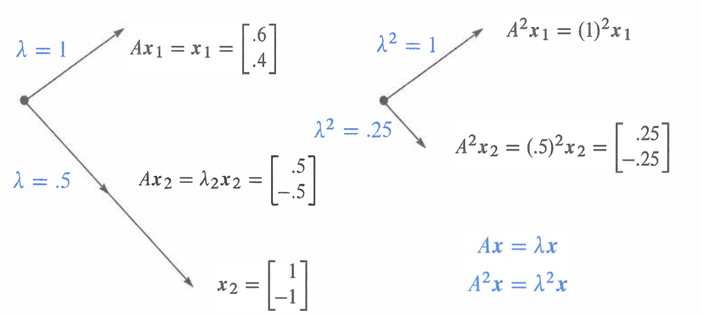
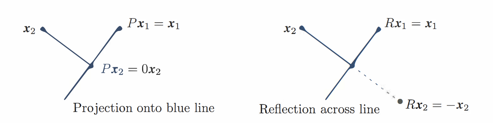
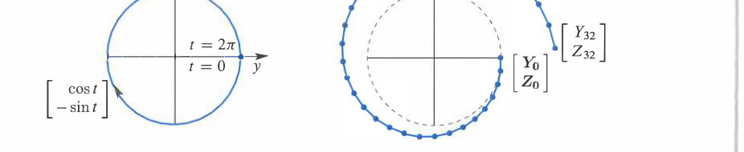
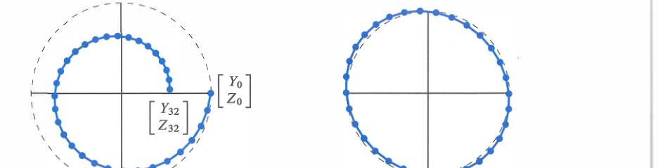
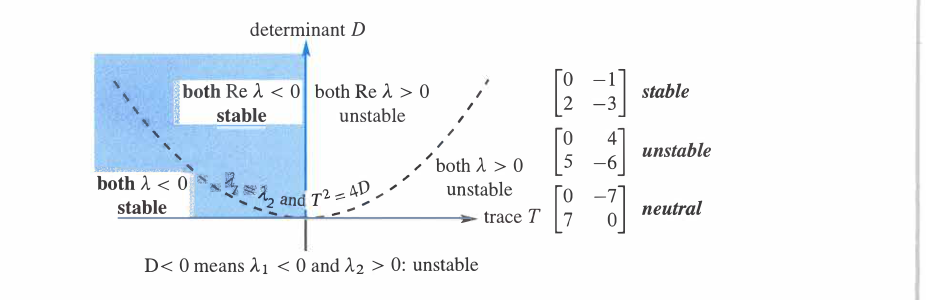
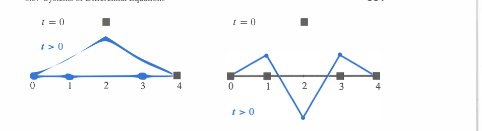
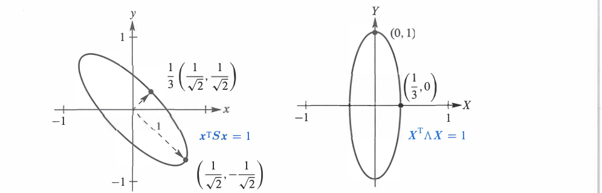

# 第 6 章　特征值与特征向量

## 6.1 特征值简介

  

    <ol style="margin:0; padding-left:1.6em;">
      <li style="margin:0.35em 0;">特征向量 $x$ 与 $Ax$ 位于同一条直线上：$Ax=\lambda x$，其中对应的特征值是 $\lambda$。</li>
      <li style="margin:0.35em 0;">若 $Ax=\lambda x$，则 $A^2x=\lambda^2x$、$A^{-1}x=\lambda^{-1}x$，并且 $(A+cI)x=(\lambda+c)x$；这些矩阵仍具有同一个特征向量 $x$。</li>
      <li style="margin:0.35em 0;">若 $Ax=\lambda x$，则 $(A-\lambda I)x=0$。因此 $A-\lambda I$ 是奇异矩阵，特征值由 $\det(A-\lambda I)=0$ 求得；一个 $n\times n$ 矩阵按代数重数计算共有 $n$ 个特征值。</li>
      <li style="margin:0.35em 0;">可用 $\det A=\lambda_1\lambda_2\cdots\lambda_n$ 和 $a_{11}+a_{22}+\cdots+a_{nn}=\lambda_1+\lambda_2+\cdots+\lambda_n$ 检查计算出的特征值。</li>
      <li style="margin:0.35em 0;">投影矩阵的特征值为 $1$ 和 $0$；反射矩阵的特征值为 $1$ 和 $-1$；旋转矩阵的特征值为 $e^{i\theta}$ 和 $e^{-i\theta}$，它们通常是复数。</li>
    </ol>
  

本章进入线性代数的一个新部分。前半部分讨论的是 $Ax=b$，研究平衡、均衡和稳态；现在，第二部分开始研究**变化**。时间由此进入我们的视野：连续时间对应微分方程

$$
\frac{du}{dt}=Au
$$

而离散的时间步对应差分方程

$$
u_{k+1}=Au_k.
$$

这两类方程**不是**用消元法求解的。这里的关键思想，是避开矩阵 $A$ 带来的全部复杂性。假设解向量 $u(t)$ 始终保持在某个固定向量 $x$ 的方向上，那么我们只需要确定一个随时间变化、用来乘 $x$ 的数。处理一个数要比处理一个向量容易得多。

我们要寻找的正是这样的“特征向量” $x$：用 $A$ 乘它时，它的方向不发生改变。

矩阵的各次幂 $A,A^2,A^3,\ldots$ 为这个思想提供了一个很好的模型。假设我们需要计算第一百次幂 $A^{100}$。对于

$$
A=
\begin{bmatrix}
0.8&0.3\\
0.2&0.7
\end{bmatrix},
$$

它的前几个幂以及第一百次幂为

$$
\begin{aligned}
A&=
\begin{bmatrix}
0.8&0.3\\
0.2&0.7
\end{bmatrix},
&
A^2&=
\begin{bmatrix}
0.70&0.45\\
0.30&0.55
\end{bmatrix},\\[6pt]
A^3&=
\begin{bmatrix}
0.650&0.525\\
0.350&0.475
\end{bmatrix},
&
A^{100}&\approx
\begin{bmatrix}
0.6000&0.6000\\
0.4000&0.4000
\end{bmatrix}.
\end{aligned}
$$

$A^{100}$ 的两列都非常接近特征向量 $(0.6,0.4)^T$。这个结果不是通过连续乘 $100$ 个矩阵得到的，而是利用 $A$ 的特征值求出的。在这个例子中，特征值是 $\lambda=1$ 和 $\lambda=1/2$。特征值为我们提供了一种深入观察矩阵内部结构的新方法。

要解释特征值，首先要解释特征向量。几乎所有向量在乘以 $A$ 后都会改变方向，但有少数特殊向量 $x$ 与 $Ax$ 方向相同，它们就是**特征向量**。当一个特征向量乘以 $A$ 时，所得向量 $Ax$ 是原向量 $x$ 的某个数倍：

$$
Ax=\lambda x,
$$

这个基本方程中的数 $\lambda$ 就是 $A$ 的一个**特征值**。它说明特殊向量 $x$ 在乘以 $A$ 后，是被拉长、缩短、反向，还是保持不变。例如，$\lambda$ 可能等于 $2$、$1/2$、$-1$ 或 $1$。

特征值也可能为零。此时

$$
Ax=0x=0,
$$

说明这个特征向量 $x$ 位于 $A$ 的零空间中。

如果 $A$ 是单位矩阵，那么每个向量都满足 $Ix=x$。因此，每个非零向量都是 $I$ 的特征向量，所有特征值都是 $\lambda=1$。这种情形非常特殊。大多数 $2\times2$ 矩阵有两个特征向量方向和两个特征值。

我们将证明，特征值必须满足

$$
\det(A-\lambda I)=0.
$$

本节将说明如何计算特征向量 $x$ 和特征值 $\lambda$。这部分内容可以较早出现，因为目前只需要会计算 $2\times2$ 矩阵的行列式。下面先用 $\det(A-\lambda I)=0$ 求第一个例子的特征值，之后再在公式（3）中正式推导这个条件。

**例 1**　矩阵

$$
A=\begin{bmatrix}0.8&0.3\\0.2&0.7\end{bmatrix}
$$

有两个特征值 $\lambda=1$ 和 $\lambda=1/2$。观察 $\det(A-\lambda I)$：

$$
\begin{aligned}
\det(A-\lambda I)
&=\det
\begin{bmatrix}
0.8-\lambda&0.3\\
0.2&0.7-\lambda
\end{bmatrix}\\
&=(0.8-\lambda)(0.7-\lambda)-0.06\\
&=\lambda^2-1.5\lambda+0.5\\
&=(\lambda-1)\left(\lambda-\frac12\right).
\end{aligned}
$$

令行列式等于零，得到两个特征值

$$
\lambda_1=1,
\qquad
\lambda_2=\frac12.
$$

在这两个数值下，矩阵 $A-\lambda I$ 都是奇异矩阵。对应的特征向量分别位于 $A-I$ 和 $A-\frac12I$ 的零空间中：

$$
(A-I)x_1=0
\quad\Longleftrightarrow\quad
Ax_1=x_1,
\qquad
x_1=\begin{bmatrix}0.6\\0.4\end{bmatrix},
$$

$$
\left(A-\frac12I\right)x_2=0
\quad\Longleftrightarrow\quad
Ax_2=\frac12x_2,
\qquad
x_2=\begin{bmatrix}1\\-1\end{bmatrix}.
$$

直接相乘可以验证：

$$
\begin{aligned}
Ax_1
&=
\begin{bmatrix}0.8&0.3\\0.2&0.7\end{bmatrix}
\begin{bmatrix}0.6\\0.4\end{bmatrix}
=\begin{bmatrix}0.6\\0.4\end{bmatrix}
=x_1,\\[6pt]
Ax_2
&=
\begin{bmatrix}0.8&0.3\\0.2&0.7\end{bmatrix}
\begin{bmatrix}1\\-1\end{bmatrix}
=\begin{bmatrix}0.5\\-0.5\end{bmatrix}
=\frac12x_2.
\end{aligned}
$$

再次乘以 $A$ 得

$$
A^2x_1=x_1,\qquad A^2x_2=\left(\frac12\right)^2x_2.
$$

一般地，若 $Ax=\lambda x$，则

$$
A^kx=\lambda^kx.
$$

这就是利用特征值计算高次幂的基础。任意向量若能写成 $u_0=c_1x_1+c_2x_2$，那么

$$
A^ku_0=c_1\lambda_1^kx_1+c_2\lambda_2^kx_2.
$$

  
  
图 6.1　特征向量保持方向；矩阵平方后特征向量不变，特征值变为原来的平方。

当 $k$ 很大时，绝对值最大的特征值所对应的方向通常占主导地位。

### 特征方程

由

$$
Ax=\lambda x
$$

可得

$$
(A-\lambda I)x=0.
$$

因为特征向量要求 $x\ne0$，所以 $A-\lambda I$ 必须是奇异矩阵。因此特征值满足

$$
\det(A-\lambda I)=0.
$$

这个方程称为特征方程，多项式 $\det(A-\lambda I)$ 称为特征多项式。求特征值和特征向量通常分为两步：

1. 解 $\det(A-\lambda I)=0$，得到所有特征值；
2. 对每个特征值 $\lambda$，求零空间 $N(A-\lambda I)$，得到相应特征向量。

对于二阶矩阵

$$
A=\begin{bmatrix}a&b\\c&d\end{bmatrix},
$$

特征方程为

$$
\lambda^2-(a+d)\lambda+(ad-bc)=0.
$$

因此

$$
\lambda_1+\lambda_2=\operatorname{tr}(A),\qquad
\lambda_1\lambda_2=\det A.
$$

对任意 $n\times n$ 矩阵，同样有

$$
\sum_{i=1}^n\lambda_i=\operatorname{tr}(A),\qquad
\prod_{i=1}^n\lambda_i=\det A,
$$

其中重复特征值按代数重数计数。

### 特征值的若干变换规律

若 $Ax=\lambda x$，则同一个 $x$ 仍是下列矩阵的特征向量：

$$
\begin{aligned}
A^2x&=\lambda^2x,\\
A^{-1}x&=\lambda^{-1}x\qquad(\lambda\ne0),\\
(A+cI)x&=(\lambda+c)x.
\end{aligned}
$$

所以 $A^2$、$A^{-1}$ 和 $A+cI$ 的特征值分别为 $\lambda^2$、$1/\lambda$ 和 $\lambda+c$。

投影矩阵的特征值是 $1$ 和 $0$；反射矩阵的特征值是 $1$ 和 $-1$。平面旋转矩阵通常没有实特征向量，它的特征值为复数 $e^{i\theta}$ 和 $e^{-i\theta}$。

### Markov 矩阵与长期状态

前面的矩阵

$$
A=\begin{bmatrix}0.8&0.3\\0.2&0.7\end{bmatrix}
$$

每一列元素之和都是 $1$，因此它是一个 Markov 矩阵。其特征值 $1$ 对应稳态方向

$$
x_1=\begin{bmatrix}0.6\\0.4\end{bmatrix}.
$$

另一个特征值是 $1/2$，所以沿 $x_2=(1,-1)^T$ 的分量每经过一步都会减半。若

$$
u_0=c_1x_1+c_2x_2,
$$

则

$$
A^ku_0=c_1x_1+c_2\left(\frac12\right)^kx_2
\longrightarrow c_1x_1.
$$

因此长期状态落在特征值 $1$ 的特征向量方向上。高次幂 $A^k$ 的两列也逐渐趋向同一个稳态向量。

### 投影矩阵

设 $P$ 是投影到某一条直线上的矩阵。直线上的向量在投影后保持不变：

$$
Px=x,
$$

所以该方向的特征值是 $1$。与直线垂直的向量被投影为零：

$$
Px=0,
$$

所以垂直方向的特征值是 $0$。由此也能立即看出

$$
P^2=P:
$$

第二次投影不会再改变第一次投影的结果。

例如

$$
P=\frac12\begin{bmatrix}1&1\\1&1\end{bmatrix}
$$

投影到直线 $y=x$。它的两个特征向量可取

$$
x_1=\begin{bmatrix}1\\1\end{bmatrix},
\qquad
x_2=\begin{bmatrix}1\\-1\end{bmatrix},
$$

相应特征值为 $1$ 和 $0$。任意向量都可以先分解到这两个方向，再分别投影。

### 反射矩阵

若 $P$ 是投影矩阵，则关于投影子空间的反射矩阵是

$$
R=2P-I.
$$

在投影子空间内，$Px=x$，于是 $Rx=x$，特征值为 $1$；在垂直子空间内，$Px=0$，于是 $Rx=-x$，特征值为 $-1$。这也说明单位矩阵的平移不会改变特征向量，只会平移特征值。

  
  
图 6.2　投影矩阵的特征值为 $1,0$；反射矩阵的特征值为 $1,-1$。

### 零特征值与奇异矩阵

零和其他数一样，也可能成为特征值。如果 $A$ 奇异，则存在非零向量 $x$ 满足

$$
Ax=0=0x,
$$

所以 $0$ 是特征值，其特征向量组成 $N(A)$。反之，如果 $A$ 可逆，则 $0$ 不可能是特征值。

例如

$$
A=\begin{bmatrix}1&2\\2&4\end{bmatrix}
$$

的行列式为零。其特征值为 $0$ 和 $5$，对应特征向量可分别取

$$
\begin{bmatrix}2\\-1\end{bmatrix},
\qquad
\begin{bmatrix}1\\2\end{bmatrix}.
$$

### 三角矩阵、迹与行列式

若 $A$ 是三角矩阵，则

$$
\det(A-\lambda I)
=(a_{11}-\lambda)\cdots(a_{nn}-\lambda),
$$

所以特征值就是对角线元素。由特征多项式的最高次项、一次项和常数项可得到

$$
\lambda_1+\cdots+\lambda_n=\operatorname{tr}(A),
\qquad
\lambda_1\cdots\lambda_n=\det A.
$$

这两个等式是检查计算结果最方便的方法，但它们通常不能单独确定全部特征值。

### 虚特征值

逆时针旋转 $90^\circ$ 的矩阵是

$$
Q=\begin{bmatrix}0&-1\\1&0\end{bmatrix}.
$$

它没有实特征向量，因为任何非零实向量都会改变方向。特征方程为

$$
\det(Q-\lambda I)=\lambda^2+1=0,
$$

因此

$$
\lambda_1=i,\qquad\lambda_2=-i.
$$

相应的复特征向量可取 $(1,-i)^T$ 和 $(1,i)^T$。由于 $Q^2=-I$，其特征值平方后也必须等于 $-1$。这是复特征值出现的几何原因。

正交矩阵的特征值满足 $|\lambda|=1$；实反对称矩阵 $A^T=-A$ 的特征值为纯虚数或零；实对称矩阵的特征值则全部为实数。

### $AB$ 与 $A+B$ 的特征值

一般不能把 $A$、$B$ 的特征值直接相乘或相加来得到 $AB$、$A+B$ 的特征值，因为两个矩阵通常没有相同的特征向量。只有当某个非零向量同时满足

$$
Ax=\lambda x,\qquad Bx=\mu x,
$$

才有

$$
ABx=\lambda\mu x,\qquad
(A+B)x=(\lambda+\mu)x.
$$

若两个矩阵拥有同一组 $n$ 个线性无关特征向量，则它们可被同一个矩阵同时对角化，并且必有

$$
AB=BA.
$$

反过来，在适当条件下，可对角化矩阵若满足 $AB=BA$，也可以选取共同的特征向量基。这解释了为什么矩阵不交换时，不能像普通数一样处理它们的谱。

### Worked Example 6.1 A：矩阵及其变换的特征值

设

$$
A=\begin{bmatrix}2&-1\\-1&2\end{bmatrix}.
$$

其特征方程为

$$
\det(A-\lambda I)
=(2-\lambda)^2-1
=(\lambda-1)(\lambda-3)=0.
$$

所以

$$
\lambda_1=1,\qquad \lambda_2=3.
$$

对应的特征向量可取

$$
x_1=\begin{bmatrix}1\\1\end{bmatrix},\qquad
x_2=\begin{bmatrix}1\\-1\end{bmatrix}.
$$

由前面的变换规律：

<table style="border-collapse: collapse; width: auto; min-width: 520px; font-variant-numeric: tabular-nums;">
  <thead><tr style="background:#f3f3f3; border-bottom:1px solid #777;"><th style="padding:0.5em 1em; text-align:center;">矩阵</th><th style="padding:0.5em 1em; text-align:center;">特征值</th><th style="padding:0.5em 1em; text-align:center;">特征向量</th></tr></thead>
  <tbody>
    <tr style="border-bottom:1px solid #ddd;"><td style="padding:0.45em 1em; text-align:center;">$A$</td><td style="padding:0.45em 1em; text-align:center;">$1,3$</td><td style="padding:0.45em 1em; text-align:center;">$x_1,x_2$</td></tr>
    <tr style="border-bottom:1px solid #ddd;"><td style="padding:0.45em 1em; text-align:center;">$A^2$</td><td style="padding:0.45em 1em; text-align:center;">$1,9$</td><td style="padding:0.45em 1em; text-align:center;">$x_1,x_2$</td></tr>
    <tr style="border-bottom:1px solid #ddd;"><td style="padding:0.45em 1em; text-align:center;">$A^{-1}$</td><td style="padding:0.45em 1em; text-align:center;">$1,1/3$</td><td style="padding:0.45em 1em; text-align:center;">$x_1,x_2$</td></tr>
    <tr><td style="padding:0.45em 1em; text-align:center;">$A+4I$</td><td style="padding:0.45em 1em; text-align:center;">$5,7$</td><td style="padding:0.45em 1em; text-align:center;">$x_1,x_2$</td></tr>
  </tbody>
</table>

特征值之和 $1+3=4$ 等于迹，乘积 $1\cdot3=3$ 等于行列式。

### Worked Example 6.1 B：Gershgorin 圆盘

Gershgorin 定理给出特征值的位置估计。对矩阵第 $i$ 行，令

$$
R_i=\sum_{j\ne i}|a_{ij}|.
$$

那么任意特征值 $\lambda$ 至少落在一个圆盘中：

$$
|\lambda-a_{ii}|\le R_i.
$$

圆盘中心是对角元 $a_{ii}$，半径是该行其余元素绝对值之和。特征值可能是复数，因此这些是复平面上的圆盘。

### Worked Example 6.1 C：一个对称三对角矩阵

考虑

$$
S=\begin{bmatrix}
1&-1&0\\
-1&2&-1\\
0&-1&1
\end{bmatrix}.
$$

每一行元素之和为零，因此

$$
x_1=\begin{bmatrix}1\\1\\1\end{bmatrix}
$$

对应特征值 $\lambda_1=0$。特征多项式为

$$
\det(S-\lambda I)
=(1-\lambda)(-\lambda)(3-\lambda),
$$

所以特征值是

$$
0,\quad 1,\quad 3.
$$

对应的特征向量可取

$$
x_1=\begin{bmatrix}1\\1\\1\end{bmatrix},
\qquad
x_2=\begin{bmatrix}1\\0\\-1\end{bmatrix},
\qquad
x_3=\begin{bmatrix}1\\-2\\1\end{bmatrix}.
$$

它们彼此正交。归一化后即可组成正交特征向量矩阵。

## 6.2 矩阵的对角化

若 $A$ 有 $n$ 个线性无关的特征向量 $x_1,\ldots,x_n$，把它们作为列组成矩阵

$$
X=\begin{bmatrix}x_1&\cdots&x_n\end{bmatrix},
$$

并把特征值放入对角矩阵

$$
\Lambda=\operatorname{diag}(\lambda_1,\ldots,\lambda_n),
$$

那么各个方程 $Ax_i=\lambda_i x_i$ 可以合并成

$$
AX=X\Lambda.
$$

由于 $X$ 可逆，得到

$$
X^{-1}AX=\Lambda,\qquad
A=X\Lambda X^{-1}.
$$

这称为矩阵 $A$ 的对角化。矩阵 $X$ 是特征向量矩阵，$\Lambda$ 是特征值矩阵。

### 矩阵幂与差分方程

对角化使矩阵幂变得简单：

$$
A^k=X\Lambda^kX^{-1}.
$$

因为 $\Lambda$ 是对角矩阵，

$$
\Lambda^k=\operatorname{diag}(\lambda_1^k,\ldots,\lambda_n^k).
$$

对于差分方程

$$
u_{k+1}=Au_k,\qquad u_0=c_1x_1+\cdots+c_nx_n,
$$

解为

$$
u_k=A^ku_0
=c_1\lambda_1^kx_1+\cdots+c_n\lambda_n^kx_n.
$$

长期行为取决于特征值的绝对值：

- 若所有 $|\lambda_i|<1$，则 $u_k\to0$；
- 若某个 $|\lambda_i|>1$，其对应分量通常增长；
- 若 $|\lambda_i|=1$，该分量可能保持或振荡。

### 重特征值与特征向量不足

特征值作为特征多项式的根可能重复。某个特征值的代数重数记为 AM，其特征空间维数称为几何重数 GM：

$$
\operatorname{GM}(\lambda)=\dim N(A-\lambda I).
$$

总有

$$
1\le\operatorname{GM}(\lambda)\le\operatorname{AM}(\lambda).
$$

矩阵可对角化，当且仅当每个特征值都提供足够多的线性无关特征向量，使总数达到 $n$。例如

$$
A=\begin{bmatrix}5&1\\0&5\end{bmatrix}
$$

的特征值 $5$ 有代数重数 $2$，但只有一个独立特征向量，所以不能对角化。

### 相似矩阵

若

$$
C=B^{-1}AB,
$$

则称 $A$ 与 $C$ 相似。相似矩阵表示同一个线性变换在不同基下的矩阵，它们有相同的特征值：

$$
\det(C-\lambda I)=\det(A-\lambda I).
$$

对角化正是寻找一个与 $A$ 相似的对角矩阵。

### 为什么 $AX=X\Lambda$

矩阵 $X$ 的列是特征向量，因此从列的角度看，

$$
AX
=A\begin{bmatrix}x_1&\cdots&x_n\end{bmatrix}
=\begin{bmatrix}Ax_1&\cdots&Ax_n\end{bmatrix}.
$$

利用 $Ax_i=\lambda_i x_i$，

$$
AX
=\begin{bmatrix}\lambda_1x_1&\cdots&\lambda_nx_n\end{bmatrix}
=X\Lambda.
$$

右乘对角矩阵 $\Lambda$ 的作用，正是把 $X$ 的第 $i$ 列乘以 $\lambda_i$。这就是对角化公式的来源，而不是一个需要死记的形式。

特征向量可以乘以任意非零常数，所以 $X$ 并不唯一；但第 $i$ 列必须始终与 $\Lambda$ 的第 $i$ 个对角元对应。

### 不同特征值对应的特征向量线性无关

设 $x_1,\ldots,x_j$ 分别对应互不相同的特征值 $\lambda_1,\ldots,\lambda_j$，并假设

$$
c_1x_1+\cdots+c_jx_j=0.
$$

分别用 $A$ 和 $\lambda_jI$ 作用，再相减，可以消去 $x_j$：

$$
c_1(\lambda_1-\lambda_j)x_1+\cdots
+c_{j-1}(\lambda_{j-1}-\lambda_j)x_{j-1}=0.
$$

逐次重复这一过程，最终得到所有 $c_i=0$。所以不同特征值对应的特征向量必定线性无关。由此得到一个重要结论：

> 一个 $n\times n$ 矩阵若有 $n$ 个互不相同的特征值，就一定可以对角化。

特征值重复时，矩阵仍可能可对角化，但必须检查每个重复特征值是否提供足够多的独立特征向量。

### Markov 矩阵的幂

对 6.1 节中的 Markov 矩阵，若

$$
A=X\begin{bmatrix}1&0\\0&1/2\end{bmatrix}X^{-1},
$$

则

$$
A^k
=X\begin{bmatrix}1&0\\0&(1/2)^k\end{bmatrix}X^{-1}.
$$

当 $k\to\infty$ 时，$(1/2)^k\to0$，因此高次幂只保留特征值 $1$ 对应的稳态部分。这比直接连续相乘更清楚地解释了 $A^k$ 的极限。

一般地，

$$
A^k\to0
$$

当且仅当所有特征值都满足 $|\lambda_i|<1$，前提是矩阵具有足够的特征向量；对不可对角化矩阵，相同结论仍成立，但证明要使用 Jordan 形式。

### 相似矩阵具有相同特征值

若 $A=BCB^{-1}$ 且 $Cx=\lambda x$，则

$$
A(Bx)=BCB^{-1}Bx=BCx=\lambda Bx.
$$

所以 $Bx$ 是 $A$ 的特征向量，特征值仍为 $\lambda$。同样也可由行列式证明：

$$
\begin{aligned}
\det(A-\lambda I)
&=\det\!\left(B(C-\lambda I)B^{-1}\right)\\
&=\det(C-\lambda I).
\end{aligned}
$$

相似变换改变坐标基，却不改变线性变换本身，因此迹、行列式和特征值都保持不变。

### Fibonacci 数

Fibonacci 递推式

$$
F_{k+2}=F_{k+1}+F_k
$$

可以写成

$$
\begin{bmatrix}F_{k+2}\\F_{k+1}\end{bmatrix}
=
\begin{bmatrix}1&1\\1&0\end{bmatrix}
\begin{bmatrix}F_{k+1}\\F_k\end{bmatrix}.
$$

令

$$
\phi=\frac{1+\sqrt5}{2},
\qquad
\psi=\frac{1-\sqrt5}{2}.
$$

这两个数是矩阵的特征值。将初始向量分解到相应的特征向量后，得到 Binet 公式

$$
F_k=\frac{\phi^k-\psi^k}{\sqrt5}.
$$

因为 $|\psi|<1$，较大下标的 Fibonacci 数几乎完全由 $\phi^k/\sqrt5$ 决定。这是“最大特征值控制长期行为”的典型例子。

### 矩阵幂的三个步骤

求解 $u_{k+1}=Au_k$ 时，对角化可以理解为三个连续步骤：

1. 用 $c=X^{-1}u_0$ 把初始向量分解为特征向量的线性组合；
2. 用 $\Lambda^k$ 将第 $i$ 个分量乘以 $\lambda_i^k$；
3. 用 $X$ 把各特征方向重新组合成 $u_k$。

因此

$$
u_k=X\Lambda^kX^{-1}u_0
=\sum_{i=1}^nc_i\lambda_i^kx_i.
$$

### 不可对角化矩阵

对于重复特征值，需要区分：

- 代数重数 AM：特征值作为特征多项式根的重复次数；
- 几何重数 GM：特征空间 $N(A-\lambda I)$ 的维数。

矩阵可对角化当且仅当每个特征值都有

$$
\operatorname{GM}(\lambda)=\operatorname{AM}(\lambda).
$$

若 GM 小于 AM，就缺少特征向量。例如

$$
A=\begin{bmatrix}0&1\\0&0\end{bmatrix}
$$

只有特征值 $0$，代数重数为 $2$，但零空间只有一维，所以不能构造可逆的特征向量矩阵 $X$。这种矩阵的高次幂和矩阵指数会出现额外的多项式因子。

### Worked Example 6.2 A：Lucas 数

Lucas 数满足

$$
L_{k+2}=L_{k+1}+L_k,\qquad L_1=1,\qquad L_2=3.
$$

令

$$
u_k=\begin{bmatrix}L_{k+1}\\L_k\end{bmatrix},\qquad
A=\begin{bmatrix}1&1\\1&0\end{bmatrix},
$$

则 $u_{k+1}=Au_k$。矩阵 $A$ 的特征值为

$$
\lambda_1=\frac{1+\sqrt5}{2},\qquad
\lambda_2=\frac{1-\sqrt5}{2}.
$$

将初始向量分解到两个特征向量方向后可得

$$
L_k=\lambda_1^k+\lambda_2^k.
$$

特别地，

$$
L_{100}=\lambda_1^{100}+\lambda_2^{100}.
$$

### Worked Example 6.2 B：$5I-J$ 的谱

设 $J$ 是 $4\times4$ 的全一矩阵，$A=5I-J$。矩阵 $J$ 的秩为 $1$，特征值为 $4,0,0,0$。因此 $A$ 的特征值为

$$
1,5,5,5.
$$

所以

$$
\det A=1\cdot5^3=125.
$$

特征值 $1$ 的特征向量是 $(1,1,1,1)^T$；特征值 $5$ 的特征空间是与它正交的三维子空间。由于 $A$ 对称，可以选取一组正交归一特征向量，使特征向量矩阵成为正交矩阵。

一个方便的选择是归一化 Hadamard 矩阵

$$
X=\frac12
\begin{bmatrix}
1&1&1&1\\
1&-1&1&-1\\
1&1&-1&-1\\
1&-1&-1&1
\end{bmatrix}.
$$

适当调整列顺序后，

$$
X^TAX=\operatorname{diag}(1,5,5,5).
$$

逆矩阵也可直接由谱看出：

$$
A^{-1}=\frac15(I+J).
$$

在全一向量方向上它的特征值为 $1$，在正交补上为 $1/5$，正好是 $A$ 的特征值的倒数。

## 6.3 微分方程组

考虑常系数线性系统

$$
\frac{du}{dt}=Au.
$$

若 $Ax=\lambda x$，尝试

$$
u(t)=e^{\lambda t}x.
$$

则

$$
u'(t)=\lambda e^{\lambda t}x
=e^{\lambda t}Ax
=Au(t).
$$

因此，每一对特征值和特征向量都给出一个纯解 $e^{\lambda t}x$。若 $A$ 有一组特征向量基，则通解为

$$
u(t)=c_1e^{\lambda_1t}x_1+\cdots+c_ne^{\lambda_nt}x_n.
$$

系数由初始条件

$$
u(0)=c_1x_1+\cdots+c_nx_n
$$

确定。

### 一个最简单的二元系统

考虑

$$
\frac{d}{dt}
\begin{bmatrix}y\\z\end{bmatrix}
=
\begin{bmatrix}0&1\\1&0\end{bmatrix}
\begin{bmatrix}y\\z\end{bmatrix}.
$$

这等价于

$$
y'=z,\qquad z'=y.
$$

矩阵的特征值为 $1$ 和 $-1$，特征向量分别为 $(1,1)^T$ 和 $(1,-1)^T$。因此

$$
\begin{bmatrix}y(t)\\z(t)\end{bmatrix}
=c_1e^t\begin{bmatrix}1\\1\end{bmatrix}
+c_2e^{-t}\begin{bmatrix}1\\-1\end{bmatrix}.
$$

组合 $y+z$ 按 $e^t$ 增长，组合 $y-z$ 按 $e^{-t}$ 衰减。直接观察原方程不容易发现这两个独立模态，特征向量却能把耦合系统分离。

### 弹簧、阻尼与二阶系统

质量—弹簧—阻尼系统满足

$$
my''+dy'+ky=0.
$$

代入 $y=e^{\lambda t}$ 得到

$$
m\lambda^2+d\lambda+k=0.
$$

根据判别式 $d^2-4mk$：

- $d^2>4mk$：两个不同的负实根，系统过阻尼；
- $d^2=4mk$：重复实根，系统临界阻尼；
- $d^2<4mk$：一对共轭复根，系统欠阻尼并振荡衰减；
- $d=0$：无阻尼，纯振荡。

把 $u=(y,y')^T$ 代入，可得到同一个特征方程。这说明常系数微分方程中的“特征根”就是相应状态矩阵的特征值。

### 圆周运动与复特征值

无阻尼方程

$$
y''+y=0
$$

对应

$$
u'=
\begin{bmatrix}0&1\\-1&0\end{bmatrix}u.
$$

特征值为 $i$ 和 $-i$。若 $u(0)=(1,0)^T$，则

$$
u(t)=
\begin{bmatrix}\cos t\\-\sin t\end{bmatrix}.
$$

轨迹保持在单位圆上。复指数 $e^{it}$ 与 $e^{-it}$ 的组合产生实函数 $\cos t$ 和 $\sin t$。

若用前向 Euler 法离散化，

$$
u_{n+1}=(I+\Delta t\,A)u_n,
$$

离散更新矩阵的特征值为 $1\pm i\Delta t$，其模长

$$
\sqrt{1+(\Delta t)^2}>1.
$$

因此数值轨迹会逐渐向外螺旋，而不是保持在圆上。这说明连续系统稳定，并不保证任意离散算法也稳定。

  
  
图 6.3　精确解沿圆运动，而前向 Euler 方法的离散轨迹逐步向外螺旋。

后向差分会使轨迹向内螺旋；Leapfrog 方法则能更好地保持圆形轨迹。

  
  
图 6.4　后向差分产生向内螺旋；Leapfrog 方法保持在正确圆周附近。

### 矩阵指数

矩阵指数定义为

$$
e^{At}=I+At+\frac{(At)^2}{2!}+\frac{(At)^3}{3!}+\cdots.
$$

系统的解可以写成

$$
u(t)=e^{At}u(0).
$$

若 $A=X\Lambda X^{-1}$，则

$$
e^{At}=Xe^{\Lambda t}X^{-1},
$$

其中

$$
e^{\Lambda t}
=\operatorname{diag}(e^{\lambda_1t},\ldots,e^{\lambda_nt}).
$$

矩阵指数满足

$$
\frac{d}{dt}e^{At}=Ae^{At}=e^{At}A,
\qquad
e^{A0}=I.
$$

对于同一个矩阵 $A$，

$$
e^{As}e^{At}=e^{A(s+t)}.
$$

但对两个不同矩阵，一般不能写成 $e^Ae^B=e^{A+B}$；只有在 $AB=BA$ 时，这个标量指数法则才成立。

### 稳定性

连续系统 $u'=Au$ 的长期行为由特征值的实部决定：

- 所有 $\operatorname{Re}\lambda_i<0$：$e^{At}\to0$，系统渐近稳定；
- 某个 $\operatorname{Re}\lambda_i>0$：存在指数增长方向，系统不稳定；
- $\operatorname{Re}\lambda_i=0$：需要进一步检查重复根及特征向量是否完整。

复特征值 $\lambda=a\pm ib$ 对应因子

$$
e^{(a\pm ib)t}=e^{at}(\cos bt\pm i\sin bt),
$$

其中 $a$ 控制增长或衰减，$b$ 控制振荡频率。

### 二阶矩阵的稳定判据

对于

$$
A=\begin{bmatrix}a&b\\c&d\end{bmatrix},
$$

特征多项式为

$$
\lambda^2-T\lambda+D,
\qquad
T=\operatorname{tr}(A)=a+d,\quad D=\det A=ad-bc.
$$

两个特征值的实部都为负，当且仅当

$$
T<0,\qquad D>0.
$$

若特征值为实数，$D>0$ 表示它们同号，$T<0$ 决定二者都为负；若特征值为共轭复数，其共同实部为 $T/2$，所以 $T<0$ 同样保证衰减。

当 $D<0$ 时，两个实特征值异号，系统存在一个增长方向和一个衰减方向，是不稳定的鞍点。

  
  
图 6.5　二阶矩阵在 $\operatorname{tr}(A)<0$ 且 $\det(A)>0$ 时稳定。

### 二阶方程转化为一阶系统

二阶方程

$$
y''+by'+cy=0
$$

可令 $u=(y,y')^T$，写成

$$
u'=\begin{bmatrix}0&1\\-c&-b\end{bmatrix}u.
$$

该矩阵的特征方程

$$
\lambda^2+b\lambda+c=0
$$

正是微分方程试探解 $y=e^{\lambda t}$ 所得到的特征方程。

### 重根与不纯解

若微分方程的特征方程有重复根，而状态矩阵又缺少特征向量，单纯的 $e^{\lambda t}x$ 不足以给出全部解。例如

$$
y''-2y'+y=0
$$

有重复根 $\lambda=1$，通解为

$$
y(t)=(c_1+c_2t)e^t.
$$

额外的因子 $t$ 对应不可对角化矩阵中的广义特征向量。若 $N=A-I$ 且 $N^2=0$，则

$$
e^{At}=e^{(I+N)t}
=e^t e^{Nt}
=e^t(I+tN).
$$

矩阵指数把这个“不纯解”自然地包含进来。

### 旋转矩阵的指数

设

$$
A=\begin{bmatrix}0&1\\-1&0\end{bmatrix},
\qquad A^2=-I.
$$

在指数级数中分别收集偶次幂和奇次幂：

$$
\begin{aligned}
e^{At}
&=I+At+\frac{A^2t^2}{2!}+\frac{A^3t^3}{3!}+\cdots\\
&=I\cos t+A\sin t\\
&=\begin{bmatrix}
\cos t&\sin t\\
-\sin t&\cos t
\end{bmatrix}.
\end{aligned}
$$

因此矩阵指数本身就是旋转矩阵。

### Worked Example 6.3 A：二阶常系数方程

求解

$$
y''+4y'+3y=0.
$$

代入 $y=e^{\lambda t}$ 得

$$
\lambda^2+4\lambda+3
=(\lambda+1)(\lambda+3)=0.
$$

所以

$$
y(t)=c_1e^{-t}+c_2e^{-3t}.
$$

改写为一阶系统时，

$$
u'=\begin{bmatrix}0&1\\-3&-4\end{bmatrix}u,
$$

矩阵仍有特征值 $-1,-3$，说明微分方程方法与线性代数方法完全一致。

### Worked Example 6.3 B：热方程与波动方程的离散模型

考虑

$$
A=\begin{bmatrix}
-2&1&0\\
1&-2&1\\
0&1&-2
\end{bmatrix}.
$$

其特征值为

$$
-2,\qquad -2-\sqrt2,\qquad -2+\sqrt2,
$$

全部为负。因此系统 $u'=Au$ 的所有模态都随时间衰减，这是离散热方程的稳定行为。

相应特征向量可取

$$
x_1=\begin{bmatrix}1\\0\\-1\end{bmatrix},
\quad
x_2=\begin{bmatrix}1\\-\sqrt2\\1\end{bmatrix},
\quad
x_3=\begin{bmatrix}1\\\sqrt2\\1\end{bmatrix}.
$$

若

$$
u(0)=\begin{bmatrix}0\\2\sqrt2\\0\end{bmatrix}
=x_3-x_2,
$$

那么热方程的解为

$$
u(t)=e^{(-2+\sqrt2)t}x_3-e^{(-2-\sqrt2)t}x_2.
$$

对于

$$
u''=Au,
$$

每个模态满足 $q''=\lambda q$。因为 $\lambda<0$，其平方根为纯虚数，解表现为振荡，对应离散波动方程。

若再给定 $u'(0)=0$，则波动方程的解为

$$
u(t)
=\cos\!\left(\sqrt{2-\sqrt2}\,t\right)x_3
-\cos\!\left(\sqrt{2+\sqrt2}\,t\right)x_2.
$$

  
  
图 6.6　热从中间位置向外扩散；波动则从中间向两侧传播。

### Worked Example 6.3 C：幂零矩阵与有限矩阵指数

若严格三角矩阵 $A$ 满足 $A^4=0$，则矩阵指数级数在有限项后终止：

$$
e^{At}=I+At+\frac{A^2t^2}{2!}+\frac{A^3t^3}{3!}.
$$

这与逐次积分方程组所得的多项式解一致。对于同一个矩阵 $A$，还有

$$
e^{As}e^{At}=e^{A(s+t)}.
$$

原方程组为

$$
a'=0,\qquad b'=a,\qquad c'=2b,\qquad z'=3c,
$$

即

$$
\frac{d}{dt}
\begin{bmatrix}a\\b\\c\\z\end{bmatrix}
=
\begin{bmatrix}
0&0&0&0\\
1&0&0&0\\
0&2&0&0\\
0&0&3&0
\end{bmatrix}
\begin{bmatrix}a\\b\\c\\z\end{bmatrix}.
$$

逐次积分给出

$$
\begin{aligned}
a(t)&=a(0),\\
b(t)&=ta(0)+b(0),\\
c(t)&=t^2a(0)+2tb(0)+c(0),\\
z(t)&=t^3a(0)+3t^2b(0)+3tc(0)+z(0).
\end{aligned}
$$

这些系数正是有限矩阵指数

$$
e^{At}=I+At+\frac{A^2t^2}{2!}+\frac{A^3t^3}{3!}
$$

中的各项。

## 6.4 对称矩阵

实对称矩阵 $S=S^T$ 具有特别完善的特征结构：

1. 所有特征值都是实数；
2. 不同特征值对应的特征向量彼此正交；
3. 即使存在重复特征值，也总能找到 $n$ 个正交归一特征向量；
4. 因而每个实对称矩阵都可以正交对角化。

把正交归一特征向量作为列组成 $Q$，则 $Q^{-1}=Q^T$，并且

$$
S=Q\Lambda Q^T.
$$

这就是实对称矩阵的谱定理。

### 正交性的证明

设

$$
Sx=\lambda x,\qquad Sy=\mu y,\qquad \lambda\ne\mu.
$$

利用 $S=S^T$，有

$$
x^TSy=(Sx)^Ty.
$$

两边分别等于 $\mu x^Ty$ 和 $\lambda x^Ty$，所以

$$
(\lambda-\mu)x^Ty=0.
$$

由于 $\lambda\ne\mu$，必有

$$
x^Ty=0.
$$

### 特征值为实数

允许特征向量为复向量，并使用共轭转置。若 $S$ 为实对称矩阵且 $Sx=\lambda x$，则

$$
\bar{x}^{\,T}Sx=\lambda\bar{x}^{\,T}x.
$$

左边等于其共轭形式所给出的 $\bar\lambda\bar{x}^{\,T}x$。因为 $\bar{x}^{\,T}x>0$，所以 $\lambda=\bar\lambda$，即 $\lambda$ 为实数。

### 谱分解

若 $q_i$ 是单位特征向量，则

$$
S=\lambda_1q_1q_1^T+\cdots+\lambda_nq_nq_n^T.
$$

每个 $q_iq_i^T$ 都是投影到特征向量方向的秩一投影矩阵。谱分解把对称矩阵拆成若干相互正交的秩一部分。

### 一个基本例子

考虑

$$
S=\begin{bmatrix}1&2\\2&4\end{bmatrix}.
$$

特征方程为

$$
\det(S-\lambda I)=\lambda^2-5\lambda
=\lambda(\lambda-5).
$$

所以特征值为 $0$ 和 $5$。相应特征向量可取

$$
x_1=\begin{bmatrix}2\\-1\end{bmatrix},
\qquad
x_2=\begin{bmatrix}1\\2\end{bmatrix}.
$$

两向量正交。归一化后组成

$$
Q=\frac1{\sqrt5}
\begin{bmatrix}2&1\\-1&2\end{bmatrix},
\qquad
\Lambda=\begin{bmatrix}0&0\\0&5\end{bmatrix},
$$

并有

$$
S=Q\Lambda Q^T.
$$

这一分解可以理解为：先用 $Q^T$ 把坐标旋转到特征向量方向，再用 $\Lambda$ 沿两个主方向分别缩放，最后用 $Q$ 旋转回原坐标。

### 实矩阵中的共轭对

一般实矩阵不一定有实特征值。例如旋转矩阵的特征值为 $i$ 和 $-i$。由于特征多项式具有实系数，非实特征值必成共轭对出现：

$$
\lambda=a+ib
\quad\Longrightarrow\quad
\bar\lambda=a-ib.
$$

相应的特征向量也成共轭对。对称性进一步排除了虚部，所以实对称矩阵的特征值全部为实数。

### 特征值与主元的符号

主元来自消元，特征值来自特征方程，两者通常并不相等。但对实对称矩阵，它们的正负号数量一致：

> $S=S^T$ 的正特征值个数等于正主元个数，负特征值个数等于负主元个数。

这称为惯性定律。若

$$
S=LDL^T,
$$

其中 $D$ 是主元组成的对角矩阵，那么可逆变换 $x=L^{-T}y$ 给出

$$
x^TSx=y^TDy.
$$

因此二次型的正、负方向数由 $D$ 的符号决定；而谱分解

$$
S=Q\Lambda Q^T
$$

又说明相同的正、负方向数由特征值决定。于是 $D$ 和 $\Lambda$ 虽然数值不同，却具有相同的符号模式。

### 重特征值不会造成特征向量不足

对一般矩阵，重复特征值可能只有一个特征向量；对称矩阵不会发生这种情况。若某个特征值重复，可以在对应特征空间中使用 Gram-Schmidt 方法选择一组正交归一基。不同特征空间之间本来就互相正交，因此最终总能得到 $n$ 个正交归一特征向量。

另一种论证使用 Schur 分解：

$$
S=QTQ^T,
$$

其中 $Q$ 正交，$T$ 为上三角矩阵。因为 $S$ 对称，所以

$$
T=Q^TSQ
$$

也必须对称。一个既是上三角又是对称的矩阵只能是对角矩阵，因此 $T=\Lambda$，得到

$$
S=Q\Lambda Q^T.
$$

这说明每个实对称矩阵都可正交对角化，包括具有重复特征值的情形。

### Worked Example 6.4 A：反射矩阵

设

$$
q_1=\begin{bmatrix}\cos\theta\\\sin\theta\end{bmatrix},\qquad
q_2=\begin{bmatrix}-\sin\theta\\\cos\theta\end{bmatrix},
$$

对应特征值分别为 $1$ 和 $-1$。令

$$
Q=\begin{bmatrix}q_1&q_2\end{bmatrix},\qquad
\Lambda=\begin{bmatrix}1&0\\0&-1\end{bmatrix}.
$$

则

$$
\begin{aligned}
A&=Q\Lambda Q^T\\
&=\begin{bmatrix}
\cos2\theta&\sin2\theta\\
\sin2\theta&-\cos2\theta
\end{bmatrix}.
\end{aligned}
$$

这是关于角度为 $\theta$ 的直线的反射。由特征值立即可知

$$
A^T=A,\qquad A^2=I,\qquad A^{-1}=A,\qquad \det A=-1.
$$

### Worked Example 6.4 B：离散正弦与离散余弦

三对角矩阵中的 $(-1,2,-1)$ 模式是二阶导数的离散版本。其特征向量由离散采样的正弦或余弦组成。

对具有固定端点的三阶矩阵

$$
A_3=\begin{bmatrix}
2&-1&0\\
-1&2&-1\\
0&-1&2
\end{bmatrix},
$$

特征值为

$$
2-\sqrt2,\qquad 2,\qquad 2+\sqrt2.
$$

对应的正交特征向量形成离散正弦变换矩阵。改变边界条件后得到的矩阵 $B_4$ 则产生离散余弦向量；离散余弦变换是 JPEG 等图像压缩方法的重要基础。

## 6.5 正定矩阵

正定性把特征值、主元、行列式和能量联系在一起。实对称矩阵 $S$ 正定，当且仅当

$$
x^TSx>0\qquad(x\ne0).
$$

以下条件等价：

1. $S$ 的所有特征值都为正；
2. 消元过程中所有主元都为正；
3. 所有顺序主子式都为正；
4. 对任意 $x\ne0$，二次型 $x^TSx>0$；
5. $S$ 可以写成 $S=A^TA$，其中 $A$ 的列线性无关。

### 二阶情形

设

$$
S=\begin{bmatrix}a&b\\b&c\end{bmatrix}.
$$

它正定当且仅当

$$
a>0,\qquad ac-b^2>0.
$$

第一个条件是第一个主元为正，第二个条件是行列式为正。这也保证两个特征值都为正。

### 配方法与 $LDL^T$ 分解

二次型可以写成

$$
ax^2+2bxy+cy^2
=a\left(x+\frac ba y\right)^2
+\left(c-\frac{b^2}{a}\right)y^2.
$$

两个平方项的系数就是 $LDL^T$ 分解中的主元。正定性要求它们都为正。

### 几何解释

若 $S=Q\Lambda Q^T$ 且 $X=Q^Tx$，则

$$
x^TSx=X^T\Lambda X
=\lambda_1X_1^2+\cdots+\lambda_nX_n^2.
$$

当所有特征值为正时，二维方程

$$
x^TSx=1
$$

表示椭圆。椭圆的主轴沿着 $S$ 的特征向量方向，半轴长度为 $1/\sqrt{\lambda_i}$。

### 半正定矩阵

若

$$
x^TSx\ge0
$$

对所有 $x$ 成立，则 $S$ 是半正定矩阵。此时特征值允许等于零。半正定矩阵可能是奇异矩阵，几何上的椭圆也可能退化。

### 正定性与极小值

对二次函数

$$
f(x)=\frac12x^TSx-b^Tx,
$$

梯度和 Hessian 分别为

$$
\nabla f=Sx-b,\qquad \nabla^2f=S.
$$

若 $S$ 正定，则 $f$ 严格凸，驻点

$$
Sx=b
$$

是唯一的全局极小点。

### 二阶正定判据的推导

对

$$
S=\begin{bmatrix}a&b\\b&c\end{bmatrix},
$$

两个特征值都为正，等价于它们的乘积和总和都为正：

$$
\lambda_1\lambda_2=ac-b^2>0,
\qquad
\lambda_1+\lambda_2=a+c>0.
$$

条件 $a>0$ 与 $ac-b^2>0$ 已经推出 $c>b^2/a\ge0$，从而 $a+c>0$。因此无需显式求特征值，只检查

$$
a>0,\qquad ac-b^2>0
$$

即可。

用消元看得更直接。第一主元为 $a$，第二主元为

$$
c-\frac{b^2}{a}=\frac{ac-b^2}{a}.
$$

两个主元都为正，恰好给出同样的条件。

### 顺序主子式判据

对 $n\times n$ 实对称矩阵，令 $D_k$ 为左上角 $k\times k$ 子矩阵的行列式。矩阵正定当且仅当

$$
D_1>0,\quad D_2>0,\quad\ldots,\quad D_n>0.
$$

这是 Sylvester 判据。因为第 $k$ 个主元等于

$$
d_k=\frac{D_k}{D_{k-1}},
\qquad D_0=1,
$$

所有顺序主子式为正与所有主元为正完全等价。

### $S=A^TA$ 的能量证明

对任意矩阵 $A$，

$$
S=A^TA
$$

总是对称，并且

$$
x^TSx=x^TA^TAx=(Ax)^T(Ax)=\|Ax\|^2\ge0.
$$

所以 $A^TA$ 总是半正定。当 $A$ 的列线性无关时，$Ax=0$ 只可能有零解，于是对所有 $x\ne0$，

$$
\|Ax\|^2>0,
$$

因此 $A^TA$ 正定。这一结论把正定矩阵与最小二乘问题直接联系起来。

### 正定矩阵之和

若 $S$ 和 $T$ 都正定，则对任意 $x\ne0$，

$$
x^T(S+T)x=x^TSx+x^TTx>0.
$$

所以 $S+T$ 仍然正定。直接追踪两个矩阵相加后的主元或特征值并不容易，而能量定义使证明立即完成。

### 一个 $(-1,2,-1)$ 例子

考虑

$$
S=\begin{bmatrix}
2&-1&0\\
-1&2&-1\\
0&-1&2
\end{bmatrix}.
$$

它的顺序主子式为

$$
2,\qquad 3,\qquad 4,
$$

主元为

$$
2,\qquad\frac32,\qquad\frac43,
$$

特征值为

$$
2-\sqrt2,\qquad 2,\qquad 2+\sqrt2.
$$

三套数值都为正，因此三个判据一致地说明 $S$ 正定。它还可以写成某个一阶差分矩阵的 $A^TA$，此时 $x^TSx$ 表示相邻分量差的平方和。

### 半正定矩阵的边界情况

半正定允许能量在某些非零方向上等于零。例如

$$
S=\begin{bmatrix}1&1\\1&1\end{bmatrix}
$$

满足

$$
x^TSx=(x_1+x_2)^2\ge0,
$$

但在 $x=(1,-1)^T$ 方向上等于零。它的特征值为 $2$ 和 $0$，行列式为零，所以它半正定但不正定。

半正定矩阵的判据相较正定情形更微妙：不能只要求消元中出现的主元“非负”，因为零主元可能需要换序或进一步检查。最可靠的定义仍是所有特征值非负，或 $x^TSx\ge0$。

### 椭圆的主轴

考虑

$$
5x^2+8xy+5y^2=1.
$$

对应矩阵

$$
S=\begin{bmatrix}5&4\\4&5\end{bmatrix}
$$

的特征值为 $9$ 和 $1$，单位特征向量为

$$
q_1=\frac1{\sqrt2}\begin{bmatrix}1\\1\end{bmatrix},
\qquad
q_2=\frac1{\sqrt2}\begin{bmatrix}1\\-1\end{bmatrix}.
$$

令 $(X,Y)^T=Q^T(x,y)^T$，原方程化为

$$
9X^2+Y^2=1.
$$

因此椭圆的轴沿两个特征向量方向，半轴长度分别为 $1/3$ 和 $1$。二次型中的交叉项在特征向量坐标下消失。

  
  
图 6.7　倾斜椭圆 $5x^2+8xy+5y^2=1$ 在特征向量坐标下化为 $9X^2+Y^2=1$。

### 二元函数的极小值判据

若 $F(x,y)$ 在驻点满足

$$
F_x=0,\qquad F_y=0,
$$

并且 Hessian

$$
H=
\begin{bmatrix}
F_{xx}&F_{xy}\\
F_{yx}&F_{yy}
\end{bmatrix}
$$

在该点正定，则 $F$ 在该点有严格局部极小值。对于二元函数，这等价于

$$
F_{xx}>0,
\qquad
F_{xx}F_{yy}-F_{xy}^2>0.
$$

正定性保证二阶近似在每个非零方向上都向上弯曲。

### Worked Example 6.5 A：几类矩阵的正定性

- `pascal(6)` 的所有主元均为 $1$，所以它正定；
- `ones(6)` 的特征值为 $6,0,0,0,0,0$，所以它半正定但不正定；
- Hilbert 矩阵 $H=(1/(i+j-1))$ 正定，因为

$$
x^THx
=\int_0^1(x_1+x_2s+\cdots+x_ns^{n-1})^2\,ds>0
$$

对所有非零 $x$ 成立。

### Worked Example 6.5 B：Schur 补

考虑对称分块矩阵

$$
M=\begin{bmatrix}A&B\\B^T&C\end{bmatrix}.
$$

若 $A$ 可逆，对第一块列进行消元会得到 Schur 补

$$
S=C-B^TA^{-1}B.
$$

矩阵 $M$ 正定，当且仅当

$$
A>0,\qquad C-B^TA^{-1}B>0.
$$

这两个块提供了 $M$ 的全部正主元。

### Worked Example 6.5 C：二阶差分矩阵

令

$$
S_n=\begin{bmatrix}
2&-1&&0\\
-1&2&\ddots&\\
&\ddots&\ddots&-1\\
0&&-1&2
\end{bmatrix}.
$$

设步长 $h=1/(n+1)$。其第 $k$ 个特征向量的第 $j$ 个分量为

$$
(x_k)_j=\sin(jk\pi h),\qquad j=1,\ldots,n,
$$

对应特征值为

$$
\lambda_k=2-2\cos(k\pi h)
=4\sin^2\left(\frac{k\pi h}{2}\right)>0.
$$

因此 $S_n$ 正定。这些离散正弦向量来自连续边值问题

$$
-y''=\lambda y,\qquad y(0)=y(1)=0
$$

的特征函数 $\sin(k\pi x)$。

## 本章要点

1. 特征向量满足 $Ax=\lambda x$，矩阵在这些特殊方向上只表现为数乘。
2. 特征值由 $\det(A-\lambda I)=0$ 求得，特征向量来自 $N(A-\lambda I)$。
3. $n$ 个线性无关特征向量组成 $X$，并给出 $A=X\Lambda X^{-1}$。
4. 对角化把矩阵幂、差分方程和微分方程化为互不耦合的标量问题。
5. 实对称矩阵具有实特征值和正交归一特征向量，并可写成 $S=Q\Lambda Q^T$。
6. 对称矩阵正定等价于特征值、主元和顺序主子式全部为正，也等价于 $x^TSx>0$。
