# 第一章 自动控制的一般概念

## 1-1 自动控制的基本原理与方式

### 1. 自动控制技术及其应用

在现代科学技术的众多领域中，自动控制技术起着越来越重要的作用。所谓自动控制，是指在没有人直接参与的情况下，利用外加的设备或装置（控制装置或控制器），使机器、设备或生产过程（统称被控对象）的某个工作状态或参数（被控量）自动地按照预定的规律运行。例如，数控车床按照预定程序自动地切削工件；化学反应炉的温度或压力自动地维持恒定；雷达和计算机组成的导弹发射和制导系统，自动地将导弹引导到敌方目标；无人驾驶飞机按照预定航迹自动升降和飞行；人造卫星准确地进入预定轨道运行并回收等，这一切都是以应用高水平的自动控制技术为前提的。

近几十年来，随着电子计算机技术的发展和应用，在宇宙航行、机器人控制、导弹制导以及核动力等高新技术领域中，自动控制技术更具有特别重要的作用。不仅如此，自动控制技术的应用范围现已扩展到生物、医学、环境、经济管理和其他许多社会生活领域中，自动控制已成为现代社会活动中不可缺少的重要组成部分。

### 2. 自动控制科学

自动控制科学是研究自动控制共同规律的技术科学，它的诞生与发展源于自动控制技术的应用。

最早的自动控制技术的应用，可以追溯到公元前我国古代的自动计时器和漏壶、指南车，而自动控制技术的广泛应用则开始于欧洲工业革命时期。英国人瓦特在改良蒸汽机的同时，应用反馈原理，于 1788 年发明了离心式调速器。当负载或蒸汽供给量发生变化时，离心式调速器能够自动调节进汽阀门的开度，从而控制蒸汽机的转速。1868 年，以离心式调速器为背景，物理学家麦克斯韦尔研究了反馈系统的稳定性问题，发表了论文“论调速器”。随后，源于物理学和数学的自动控制原理开始逐步形成。1892 年，俄国学者李雅普诺夫发表了“论运动稳定性的一般问题”的博士论文，提出了李雅普诺夫稳定性理论。20 世纪 10 年代，PID 控制器出现，并获得广泛应用。1927 年，为了使广泛应用的电子管在其性能发生较大变化的情况下仍能正常工作，反馈放大器正式诞生，从而确立了“反馈”在自动控制技术中的核心地位，并且有关系统稳定性和性能品质分析的大量研究成果也应运而生。

20 世纪 40 年代，是系统和控制思想空前活跃的年代，1945 年贝塔朗菲提出了《系统论》，1948 年维纳提出了著名的《控制论》，至此形成了完整的控制理论体系——以传递函数为基础的经典控制理论，主要研究单输入单输出、线性定常系统的分析和设计问题。

20 世纪 50 年代，人类开始征服太空。1957 年，苏联成功发射了第一颗人造地球卫星，1968 年美国阿波罗飞船成功登上月球。在这些举世瞩目的成功中，自动控制技术起着不可磨灭的作用，也因此催生了 20 世纪 60 年代第二代控制理论——现代控制理论，其中包括以状态为基础的状态空间法、贝尔曼的动态规划法和庞特里亚金的极小值原理，以及卡尔曼滤波器。现代控制理论主要研究具有高性能、高精度和多耦合回路的多变量系统的分析和设计问题。

从 20 世纪 70 年代开始，随着计算机技术的不断发展，出现了许多以计算机控制为代表的自动化技术，如可编程控制器和工业机器人，自动化技术发生了根本性的变化，其相应的自动控制科学研究也出现了许多分支，如自适应控制、混杂控制、模糊控制，以及神经网络控制等。此外，控制论的概念、原理和方法还被用来处理社会、经济、人口和环境等复杂系统的分析与控制，形成了经济控制论和人口控制论等学科分支。目前，控制理论还在继续发展，正朝向以控制论、信息论和仿生学为基础的智能控制理论方向深入。

然而，纵观百余年自动控制科学与技术的发展，反馈控制理论与技术占据了极其重要的地位。

### 3. 反馈控制原理

为了实现各种复杂的控制任务，首先要将被控对象和控制装置按照一定的方式连接起来，组成一个有机总体，这就是自动控制系统。在自动控制系统中，被控对象的输出量（被控量）是要求严格加以控制的物理量，它可以要求保持为某一恒定值，如温度、压力、液位等，也可以要求按照某个给定规律运行，如飞行航迹、记录曲线等；而控制装置则是对被控对象施加控制作用的机构的总体，它可以采用不同的原理和方式对被控对象进行控制，但最基本的一种是基于反馈控制原理组成的反馈控制系统。

在反馈控制系统中，控制装置对被控对象施加的控制作用，是取自被控量的反馈信息，用来不断修正被控量与输入量之间的偏差，从而实现对被控对象进行控制的任务，这就是反馈控制的原理。

其实，人的一切活动都体现出反馈控制的原理，人本身就是一个具有高度复杂控制能力的反馈控制系统。例如，人用手拿取桌上的书，汽车司机操纵方向盘驾驶汽车沿公路平稳行驶等，这些日常生活中习以为常的动作都渗透着反馈控制的深奥原理。下面，通过解剖手从桌上取书的动作过程，透视一下它所包含的反馈控制机理。在这里，书的位置是手运动的指令信息，一般称为输入信号。取书时，首先人要用眼睛连续目测手相对于书的位置，并将这个信息送入大脑（称为位置反馈信息）；然后由大脑判断手与书之间的距离，产生偏差信号，并根据其大小发出控制手臂移动的命令（称为控制作用或操纵量），逐渐使手与书之间的距离（偏差）减小。显然，只要这个偏差存在，上述过程就要反复进行，直到偏差减小为零，手便取到了书。可以看出，大脑控制手取书的过程，是一个利用偏差（手与书之间距离）产生控制作用，并不断使偏差减小直至消除的运动过程；同时，为了取得偏差信号，必须要有手位置的反馈信息，两者结合起来，就构成了反馈控制。显然，反馈控制实质上是一个按偏差进行控制的过程，因此，它也称为按偏差的控制，反馈控制原理就是按偏差控制的原理。

人取物视为一个反馈控制系统时，手是被控对象，手位置是被控量（即系统的输出量），产生控制作用的机构是眼睛、大脑和手臂，统称为控制装置。可以用图 1-1 的系统方块图来展示这个反馈控制系统的基本组成及工作原理。

  
  
图 1-1 人取书的反馈控制系统方块图

通常，把取出的输出量送回到输入端，并与输入信号相比较产生偏差信号的过程，称为反馈。若反馈的信号与输入信号相减，使产生的偏差越来越小，则称为负反馈；反之，则称为正反馈。反馈控制就是采用负反馈并利用偏差进行控制的过程，而且，由于引入了被控量的反馈信息，整个控制过程成为闭合过程，因此反馈控制也称闭环控制。

在工程实践中，为了实现对被控对象的反馈控制，系统中必须配置具有人的眼睛、大脑和手臂类似功能的设备，以便对被控量进行连续地测量、反馈和比较，并按偏差进行控制。这些设备依其功能分别称为测量元件、比较元件和执行元件，并统称为控制装置。

在工业控制中，龙门刨床速度控制系统就是按照反馈控制原理进行工作的。通常，当龙门刨床加工表面不平整的毛坯时，负载会有很大的波动，但为了保证加工精度和表面光洁度，一般不允许刨床速度变化过大，因此必须对速度进行控制。图 1-2 是利用速度反馈对刨床速度进行自动控制的原理图。图中，刨床主电动机 SM 是电枢控制的直流电动机，其电枢电压由晶闸管整流装置 KZ 提供，并通过调节触发器 CF 的控制电压 $u_k$，来改变电动机的电枢电压，从而改变电动机的速度（被控量）。测速发电机 TG 是测量元件，用来测量刨床速度并给出与速度成正比的电压 $u_t$。然后，将 $u_t$ 反馈到输入端并与给定电压 $u_0$ 反向串联便得到偏差电压 $\Delta u=u_0-u_t$。在这里，$u_0$ 是根据刨床工作情况预先设置的速度给定电压，它与反馈电压 $u_t$ 相减便形成偏差电压 $\Delta u$，因此 $u_t$ 称为负反馈电压。

  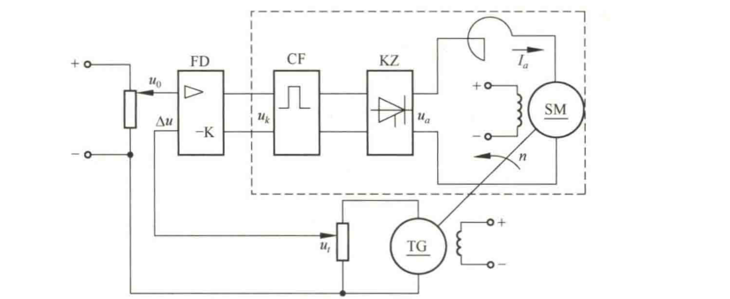
  
图 1-2 龙门刨床速度控制系统原理图

一般，偏差电压比较微弱，需经放大器 FD 放大后才能作为触发器的控制电压。在这个系统中，被控对象是电动机，触发器和整流装置起了执行控制动作的作用，故称为执行元件。现在具体分析一下刨床速度自动控制的过程。当刨床正常工作时，对于某给定电压 $u_0$，电动机必有确定的速度给定值 $n_1$ 相对应，同时亦有相应的测速发电机电压 $u_{t1}$，以及相应的偏差电压 $\Delta u_1$ 和触发器控制电压 $u_{k1}$。如果刨床负载变化，如增加负载，将使速度降低而偏离给定值，同时，测速发电机电压 $u_t$ 将相应减小，偏差电压 $\Delta u$ 将因此增大，触发器控制电压 $u_k$ 也随之增大，从而使晶闸管整流电压 $u_a$ 升高，逐步使速度回升到给定值附近。这个过程可用图 1-3 的一组曲线表明。由图可见，负载 $M$ 在 $t_1$ 时突增为 $M_2$，致使电动机速度由给定值 $n_1$ 急剧下降。但随着 $\Delta u$ 和 $u_a$ 的增大，速度很快回升，$t_2$ 时速度便回升到 $n_2$，它与给定值 $n_1$ 已相差无几了。反之，如果刨床速度因减小负载致使速度上升，则各电压量反向变化，速度回落过程完全一样。

  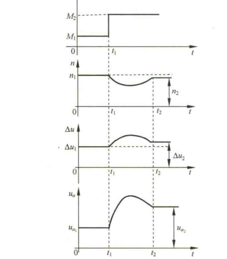
  
图 1-3 龙门刨床速度自动控制过程

另外，如果调整给定电压 $u_0$，便可改变刨床工作速度。因此，采用图 1-2 的自动控制系统，既可以在不同负载下自动维持刨床速度不变，也可以根据需要自动地改变刨床速度，其工作原理都是相同的。它们都是由测量元件（测速发电机）对被控量（速度）进行检测，将被控量反馈至比较电路并与给定值相减而得到偏差电压（速度负反馈），经放大器放大、变换后，执行元件（触发器和晶闸管整流装置）便依据偏差电压的性质对被控量（速度）进行相应调节，从而使偏差消失或减小到允许范围。可见，这是一个由负反馈产生偏差，并利用偏差进行控制直到最后消除偏差的过程，这就是负反馈控制原理，简称反馈控制原理。

应当指出的是，图 1-2 的刨床速度控制系统是一个有静差系统。由图 1-3 的速度控制过程曲线可以看出，速度最终达到的稳态值 $n_2$ 与原给定速度 $n_1$ 之间始终有一个差值存在，这个差值是用来产生一个附加的电动机电枢电压，以补偿因增加负载而引起的速度下降。因此，差值的存在是保证系统正常工作所必需的，一般称为稳态误差。如果从结构上加以改进，这个稳态误差是可以消除的。

图 1-4 是与图 1-2 对应的刨床速度控制系统方块图。在方块图中，被控对象和控制装置的各元部件（硬件）分别用一些方块表示。系统中感兴趣的物理量（信号），如电流、电压、温度、位置、速度、压力等，标志在信号线上，其流向用箭头表示。用进入方块的箭头表示各元部件的输入量，用离开方块的箭头表示其输出量，被控对象的输出量便是系统的输出量，即被控量，一般置于方块图的最右端；系统的输入量，一般置于系统方块图的左端。

  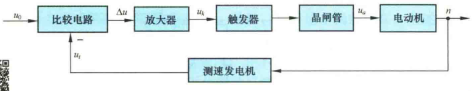
  
图 1-4 龙门刨床速度控制系统方块图

### 4. 反馈控制系统的基本组成

反馈控制系统是由各种结构不同的元部件组成的。从完成“自动控制”这一职能来看，一个系统必然包含被控对象和控制装置两大部分，而控制装置是由具有一定职能的各种基本元件组成的。在不同系统中，结构完全不同的元部件却可以具有相同的职能，因此，将组成系统的元部件按职能分类主要有以下几种：

**测量元件**　其职能是检测被控制的物理量，如果这个物理量是非电量，一般要再转换为电量。例如，测速发电机用于检测电动机轴的速度并转换为电压；电位器、旋转变压器或自整角机用于检测角度并转换为电压；热电偶用于检测温度并转换为电压等。

**给定元件**　其职能是给出与期望的被控量相对应的系统输入量。例如图 1-2 中给出电压 $u_0$ 的电位器。

**比较元件**　其职能是把测量元件检测的被控量实际值与给定元件给出的输入量进行比较，求出它们之间的偏差。常用的比较元件有差动放大器、机械差动装置、电桥电路等。图 1-2 中，由于给定电压 $u_0$ 和反馈电压 $u_t$ 都是直流电压，故只需将它们反向串联便可得到偏差电压。

**放大元件**　其职能是将比较元件给出的偏差信号进行放大，用来推动执行元件去控制被控对象。电压偏差信号可用集成电路、晶闸管等组成的电压放大级和功率放大级加以放大。

**执行元件**　其职能是直接推动被控对象，使其被控量发生变化。用来作为执行元件的有阀、电动机、液压马达等。

**校正元件**　也叫补偿元件，它是结构或参数便于调整的元部件，用串联或反馈的方式连接在系统中，以改善系统的性能。最简单的校正元件是由电阻、电容组成的无源或有源网络，复杂的则用计算机。

一个典型的反馈控制系统基本组成可用图 1-5 所示的方块图表示。图中，“○”代表比较元件，它将测量元件检测到的被控量与输入量进行比较；负号（−）表示两者符号相反，即负反馈；正号（+）表示两者符号相同，即正反馈。信号从输入端沿箭头方向到达输出端的传输通路称前向通路；系统输出量经测量元件反馈到输入端的传输通路称主反馈通路。前向通路与主反馈通路共同构成主回路。此外，还有局部反馈通路以及由它构成的内回路。只包含一个主反馈通路的系统称单回路系统；有两个或两个以上反馈通路的系统称多回路系统。

  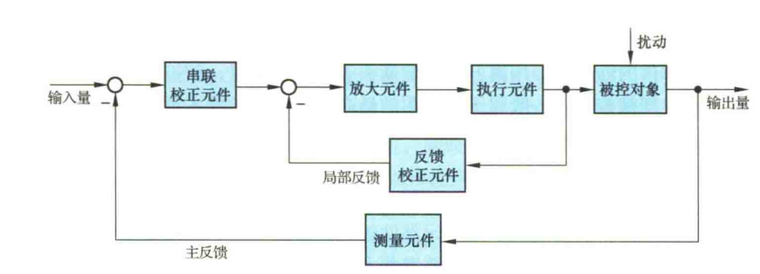
  
图 1-5 反馈控制系统基本组成

通常加到反馈控制系统上的外作用有两种类型，一种是有用输入，一种是扰动。有用输入决定系统被控量的变化规律，如输入量；而扰动是系统不希望有的外作用，它破坏有用输入对系统的控制。在实际系统中，扰动总是不可避免的，而且它可以作用于系统中的任何元部件上，也可能一个系统同时受到几种扰动作用。电源电压的波动，环境温度、压力以及负载的变化，飞行中气流的冲击，航海中的波浪等，都是现实中存在的扰动。在图 1-2 的速度控制系统中，切削工件外形及切削量的变化就是一种扰动，它直接影响电动机的负载转矩，并进而引起刨床速度的变化。

### 5. 自动控制系统基本控制方式

反馈控制是自动控制系统最基本的控制方式，也是应用最广泛的一种控制方式。除此之外，还有开环控制方式和复合控制方式，它们都有其各自的特点和不同的适用场合。近几十年来，以现代数学为基础，引入计算机的新的控制方式也有了很大发展，如最优控制、自适应控制、模糊控制等。

#### （1）反馈控制方式

如前所述，反馈控制方式是按偏差进行控制的，其特点是不论什么原因使被控量偏离期望值而出现偏差时，必定会产生一个相应的控制作用去降低或消除这个偏差，使被控量与期望值趋于一致。可以说，按反馈控制方式组成的反馈控制系统，具有抑制任何内、外扰动对被控量产生影响的能力，有较高的控制精度。但这种系统使用的元件多，结构复杂，特别是系统的性能分析和设计也较麻烦。尽管如此，它仍是一种重要的并被广泛应用的控制方式，自动控制理论主要的研究对象就是用这种控制方式组成的系统。

#### （2）开环控制方式

开环控制方式是指控制装置与被控对象之间只有顺向作用而没有反向联系的控制过程，按这种方式组成的系统称为开环控制系统，其特点是系统的输出量不会对系统的控制作用发生影响。开环控制系统可以按给定量控制方式组成，也可以按扰动控制方式组成。

按给定量控制的开环控制系统，其控制作用直接由系统的输入量产生，给定一个输入量，就有一个输出量与之相对应，控制精度完全取决于所用的元件及校准的精度。在图 1-2 刨床速度控制系统中，若只考虑虚线框内的部件，便可视为按给定量控制的开环控制系统，刨床期望的速度值是事先调节触发器 CF 的控制电压 $u_k$ 确定的。这样，在工作过程中，即使刨床速度偏离期望值，它也不会反过来影响控制电压 $u_k$，因此，这种开环控制方式没有自动修正偏差的能力，抗扰性较差。但由于其结构简单、调整方便、成本低，在精度要求不高或扰动影响较小的情况下，这种控制方式还有一定的实用价值。

目前，用于国民经济各部门的一些自动化装置，如自动售货机、自动洗衣机、产品生产自动线、数控车床以及指挥交通的红绿灯的转换等，一般都是开环控制系统。

按扰动控制的开环控制系统，是利用可测量的扰动量，产生一种补偿作用，以降低或抵消扰动对输出量的影响，这种控制方式也称顺馈控制。例如，在一般的直流速度控制系统中，转速常常随负载的增加而下降，且其转速的下降是由于电枢回路的电压降引起的。如果我们设法将负载引起的电流变化测量出来，并按其大小产生一个附加的控制作用，用以补偿由它引起的转速下降，这样就可以构成按扰动控制的开环控制系统，如图 1-6 所示。可见，这种按扰动控制的开环控制方式是直接从扰动取得信息，并据以改变被控量，因此，其抗扰动性好，控制精度也较高，但它只适用于扰动是可测量的场合。

  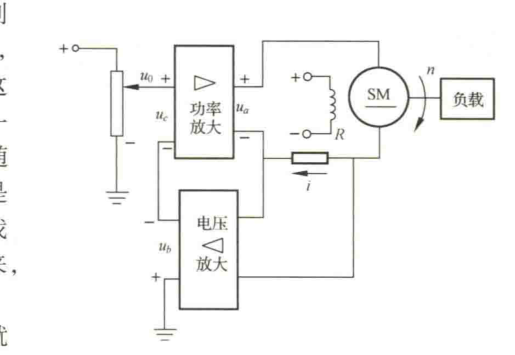
  
图 1-6 按扰动控制的速度控制系统原理图

#### （3）复合控制方式

按扰动控制方式在技术上较按偏差控制方式简单，但它只适用于扰动是可测量的场合，而且一个补偿装置只能补偿一种扰动因素，对其余扰动均不起补偿作用。因此，比较合理的一种控制方式是把按偏差控制与按扰动控制结合起来，对于主要扰动采用适当的补偿装置实现按扰动控制，同时，再组成反馈控制系统实现按偏差控制，以消除其余扰动产生的偏差。这样，系统的主要扰动已被补偿，反馈控制系统就比较容易设计，控制效果也会更好。这种按偏差控制和按扰动控制相结合的控制方式称为复合控制方式。图 1-7 表示一种同时按偏差和扰动控制电动机速度的复合控制系统原理线路图和方块图。

  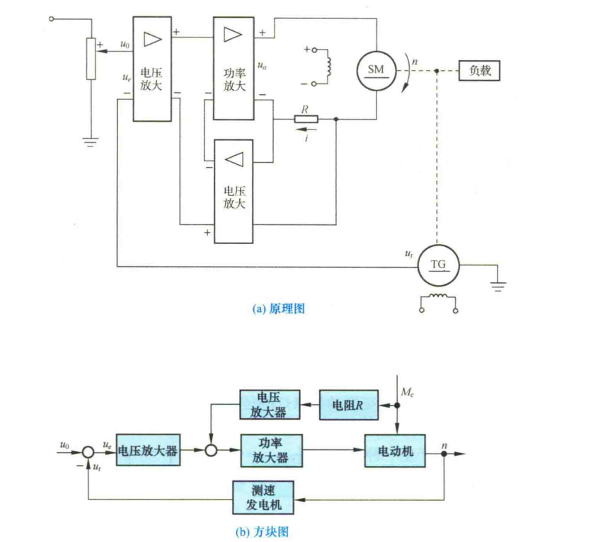
  
图 1-7 电动机速度复合控制系统

## 1-2 自动控制系统示例

### 1. 函数记录仪

函数记录仪是一种通用的自动记录仪，它可以在直角坐标系上自动描绘两个电量的函数关系。同时，记录仪还带有走纸机构，用以描绘一个电量对时间的函数关系。

函数记录仪通常由衰减器、测量元件、放大元件、伺服电动机—测速发电机组、齿轮系及绳轮等组成，采用负反馈控制原理工作，其原理如图 1-8 所示。系统的输入是待记录电压，被控对象是记录笔，其位移即为被控量。系统的任务是控制记录笔位移，在记录纸上描绘出待记录的电压曲线。

  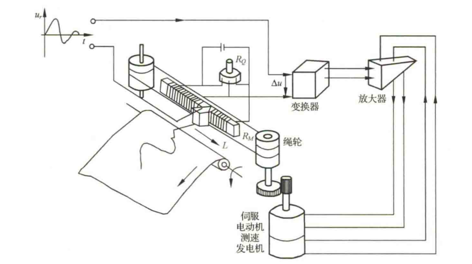
  
图 1-8 函数记录仪原理示意图

在图 1-8 中，测量元件是由电位器 $R_0$ 和 $R_M$ 组成的桥式测量电路，记录笔就固定在电位器 $R_M$ 的滑臂上，因此，测量电路的输出电压 $u_p$ 与记录笔位移成正比。当有慢变的输入电压 $u_r$ 时，在放大元件输入口得到偏差电压 $\Delta u=u_r-u_p$，经放大后驱动伺服电动机，并通过齿轮系及绳轮带动记录笔移动，同时使偏差电压减小。当偏差电压 $\Delta u=0$ 时，电动机停止转动，记录笔也静止不动。此时，$u_p=u_r$，表明记录笔位移与输入电压相对应。如果输入电压随时间连续变化，记录笔便描绘出随时间连续变化的相应曲线。函数记录仪方块图如图 1-9 所示，图中测速发电机反馈与电动机速度成正比的电压，用以增加阻尼，改善系统性能。

  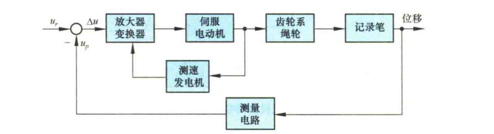
  
图 1-9 函数记录仪方块图

### 2. 飞机—自动驾驶仪系统

飞机自动驾驶仪是一种能保持或改变飞机飞行状态的自动装置。它可以稳定飞行的姿态、高度和航迹；可以操纵飞机爬高、下滑和转弯。飞机与自动驾驶仪组成的自动控制系统称为飞机—自动驾驶仪系统。

如同飞行员操纵飞机一样，自动驾驶仪控制飞机飞行是通过控制飞机的三个操纵面（升降舵、方向舵、副翼）的偏转，改变舵面的空气动力特性，以形成围绕飞机质心的旋转转矩，从而改变飞机的飞行姿态和轨迹。现以比例式自动驾驶仪稳定飞机俯仰角为例，说明其工作原理。图 1-10 为飞机—自动驾驶仪系统稳定俯仰角的原理示意图。图中，垂直陀螺仪作为测量元件用以测量飞机的俯仰角，当飞机以给定俯仰角水平飞行时，陀螺仪电位器没有电压输出。如果飞机受到扰动，使俯仰角向下偏离期望值，陀螺仪电位器输出与俯仰角偏差成正比的信号，经放大器放大后驱动舵机，一方面推动升降舵面向上偏转，产生使飞机抬头的转矩，以减小俯仰角偏差；同时还带动反馈电位器滑臂，输出与舵偏角成正比的电压并反馈到输入端。随着俯仰角偏差的减小，陀螺仪电位器输出信号越来越小，舵偏角也随之减小，直到俯仰角回到期望值，这时，舵面也恢复到原来状态。

  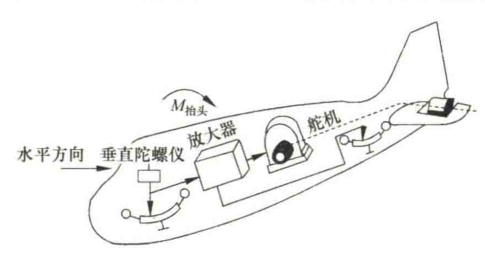
  
图 1-10 飞机—自动驾驶仪系统原理图

图 1-11 是飞机—自动驾驶仪系统稳定俯仰角的系统方块图。图中，飞机是被控对象，俯仰角是被控量，放大器、舵机、垂直陀螺仪、反馈电位器等是控制装置，即自动驾驶仪。输入量是给定的常值俯仰角，控制系统的任务就是在任何扰动（如阵风或气流冲击）作用下，始终保持飞机以给定俯仰角飞行。

  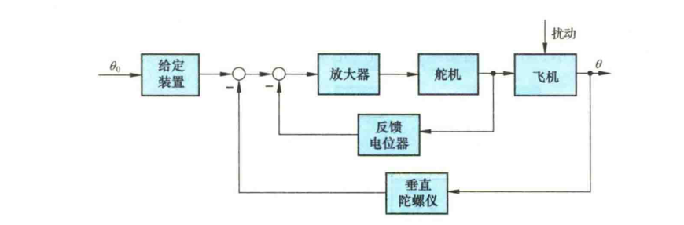
  
图 1-11 飞机俯仰角控制系统方块图

### 3. 电阻炉温度微型计算机控制系统

用于工业生产中炉温控制的微型计算机控制系统，具有精度高、功能强、经济性好、无噪声、显示醒目、读数直观、打印存档方便、操作简单、灵活性和适应性好等一系列优点。用微型计算机控制系统代替模拟式控制系统是今后工业过程控制的发展方向。图 1-12 为某工厂电阻炉温度微型计算机控制系统原理示意图。图中，电阻丝通过晶闸管主电路加热，炉温期望值用计算机键盘预先设置，炉温实际值由热电偶检测，并转换成电压，经放大、滤波后，由 A/D 变换器将模拟量变换为数字量送入计算机，在计算机中与所设置的温度期望值比较后产生偏差信号，计算机便根据预定的控制算法（即控制规律）计算出相应的控制量，再经 D/A 变换器变换成电流，通过触发器控制晶闸管导通角，从而改变电阻丝中电流大小，达到控制炉温的目的。该系统既有精确的温度控制功能，还有实时屏幕显示和打印功能，以及超温、极值和电阻丝、热电偶损坏报警等功能。

  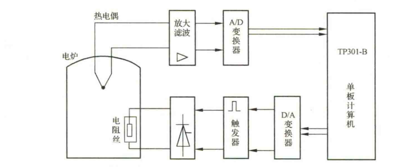
  
图 1-12 电阻炉温度微型计算机控制系统方块图

### 4. 锅炉液位控制系统

锅炉是电厂和化工厂里常见的生产蒸汽的设备。为了保证锅炉正常运行，需要维持锅炉液位为正常标准值。锅炉液位过低，易烧干锅而发生严重事故；锅炉液位过高，则易使蒸汽带水并有溢出危险。因此，必须通过调节器严格控制锅炉液位的高低，以保证锅炉正常安全地运行。常见的锅炉液位控制系统示意图如图 1-13 所示。

  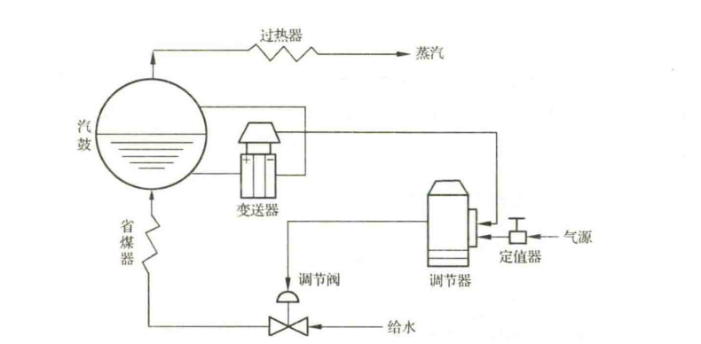
  
图 1-13 锅炉液位控制系统示意图

当蒸汽的耗汽量与锅炉进水量相等时，液位保持为正常标准值。当锅炉的给水量不变，而蒸汽负荷突然增加或减少时，液位就会下降或上升；或者，当蒸汽负荷不变，而给水管道水压发生变化时，引起锅炉液位发生变化。不论出现哪种情况，只要实际液位高度与正常给定液位之间出现了偏差，调节器均应立即进行控制，去开大或关小给水阀门，使液位恢复到给定值。

图 1-14 是锅炉液位控制系统方块图。图中，锅炉为被控对象，其输出为被控参数液位，作用于锅炉上的扰动是指给水压力变化或蒸汽负荷变化等产生的内外扰动；测量变送器为差压变送器，用来测量锅炉液位，并转变为一定的信号输至调节器；调节器是锅炉液位控制系统中的控制器，有电动、气动等形式，在调节器内将测量液位与给定液位进行比较，得出偏差值，然后根据偏差情况按一定的控制律［如比例（P）、比例—积分（PI）、比例—积分—微分（PID）等］发出相应的输出信号去推动调节阀动作；调节阀在控制系统中起执行元件作用，根据控制信号对锅炉的进水量进行调节，阀门的运动取决于阀门的特性，有的阀门与输入信号成正比变化，有的阀门与输入信号呈某种曲线关系变化。大多数调节阀为气动薄膜调节阀，若采用电动调节器，则调节器与气动调节阀之间应有电—气转换器。气动调节阀的气动阀门分为气开与气关两种。气开阀指当调节器输出增加时，阀门开大；气关阀指当调节器输出增加时，阀门反而关小。为了安全生产，蒸汽锅炉的给水调节阀一般采用气关阀，一旦发生断气现象，阀门保持打开位置，以保证汽鼓不被烧干损坏。

  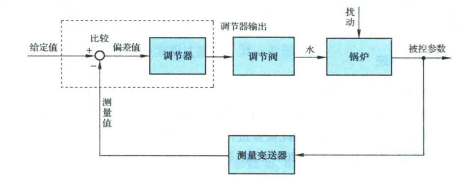
  
图 1-14 锅炉液位控制系统方块图

### 5. 转速控制系统

发动机转速控制系统的原理图如图 1-15 所示，图中展示了发动机瓦特式速度调节器的基本原理。允许进入发动机内的燃料数量，可由希望的发动机转速与实际的发动机转速之差进行调整。

  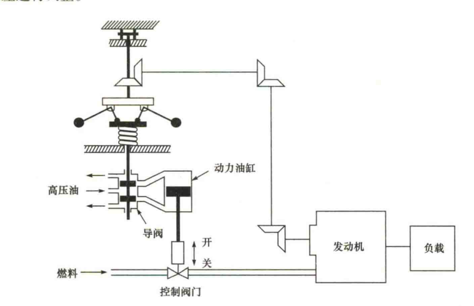
  
图 1-15 转速控制系统原理图

该系统的工作过程陈述如下：转速调节器的调节原理是当发动机工作于希望的转速时，高压油将不进入动力油缸的任何一侧。如果由于扰动，使得实际转速下降到低于希望值，则转速调节器的离心力下降，导致控制阀向下移动，从而对发动机的燃料供应增多，使发动机的转速增大，直至希望的转速时为止。另一方面，如果发动机的转速增大，以至于超过了希望的转速值，则转速调节器的离心力增大，从而导致控制阀向上移动。这样会减少燃料供应，导致发动机的转速减慢，直至希望的转速时为止。

在这个转速控制系统中，被控对象是发动机，而被控变量是发动机的转速。希望转速与实际转速之间的差形成误差信号，作用到对象（发动机）上的控制信号（燃料的数量）为驱动信号，对被控变量起干扰作用的外部输入量称为扰动量。不能预测的负载变化就是一种扰动量。

### 6. 磁盘驱动读取系统

磁盘驱动器广泛用于各类计算机中，是控制工程的一个重要应用实例。考察图 1-16 所示的磁盘驱动器结构示意图可知，磁盘驱动器读取装置的目标是将磁头准确定位，以便正确读取磁盘上磁道的信息，因此需要进行精确控制的变量是安装在滑动簧片上的磁头位置。磁盘旋转速度为 $1800\sim7200\ \mathrm{r/min}$，磁头位置精度要求为 $1\ \mu\mathrm{m}$，且磁头由磁道 $a$ 移动到磁道 $b$ 的时间小于 $50\ \mathrm{ms}$。

  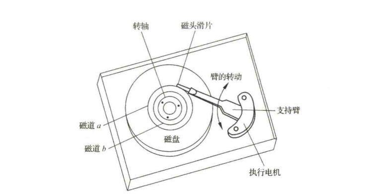
  
图 1-16 磁盘驱动器结构示意图

图 1-17 给出了该系统的初步方案，其闭环系统利用电机驱动磁头臂到达预期的位置。

  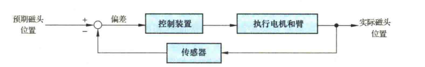
  
图 1-17 磁盘驱动读取系统初步方案

## 1-3 自动控制系统的分类

自动控制系统有多种分类方法。例如，按控制方式可分为开环控制、反馈控制、复合控制等；按元件类型可分为机械系统、电气系统、机电系统、液压系统、气动系统、生物系统等；按系统功用可分为温度控制系统、压力控制系统、位置控制系统等；按系统性能可分为线性系统和非线性系统、连续系统和离散系统、定常系统和时变系统、确定性系统和不确定性系统等；按输入量变化规律又可分为恒值控制系统、随动系统和程序控制系统等。为了全面反映自动控制系统的特点，常常将上述各种分类方法组合应用。

### 1. 线性连续控制系统

这类系统可以用线性微分方程式描述，其一般形式为

$$
\begin{aligned}
a_0\frac{\mathrm{d}^n}{\mathrm{d}t^n}c(t)
&+a_1\frac{\mathrm{d}^{n-1}}{\mathrm{d}t^{n-1}}c(t)
+\cdots+a_{n-1}\frac{\mathrm{d}}{\mathrm{d}t}c(t)+a_nc(t)\\
&=b_0\frac{\mathrm{d}^m}{\mathrm{d}t^m}r(t)
+b_1\frac{\mathrm{d}^{m-1}}{\mathrm{d}t^{m-1}}r(t)
+\cdots+b_{m-1}\frac{\mathrm{d}}{\mathrm{d}t}r(t)+b_mr(t).
\end{aligned}
$$

式中，$c(t)$ 是被控量；$r(t)$ 是系统输入量。系数 $a_0,a_1,\cdots,a_n,b_0,b_1,\cdots,b_m$ 是常数时，称为定常系统；系数 $a_0,a_1,\cdots,a_n,b_0,b_1,\cdots,b_m$ 随时间变化时，称为时变系统。线性定常连续系统按其输入量的变化规律不同又可分为恒值控制系统、随动系统和程序控制系统。

#### （1）恒值控制系统

这类控制系统的输入量是一个常值，要求被控量亦等于一个常值，故又称为调节器。但由于扰动的影响，被控量会偏离输入量而出现偏差，控制系统便根据偏差产生控制作用，以克服扰动的影响，使被控量恢复到给定的常值。因此，恒值控制系统分析、设计的重点是研究各种扰动对被控对象的影响以及抗扰动的措施。在恒值控制系统中，输入量可以随生产条件的变化而改变，但是，输入量一经调整后，被控量就应与调整好的输入量保持一致。图 1-2 刨床速度控制系统就是一种恒值控制系统，其输入量 $u_0$ 是常值。此外，还有温度控制系统、压力控制系统、液位控制系统等。在工业控制中，如果被控量是温度、流量、压力、液位等生产过程参量时，这种控制系统则称为过程控制系统，它们大多数都属于恒值控制系统。

#### （2）随动系统

这类控制系统的输入量是预先未知的随时间任意变化的函数，要求被控量以尽可能小的误差跟随输入量的变化，故又称为跟踪系统。在随动系统中，扰动的影响是次要的，系统分析、设计的重点是研究被控量跟随的快速性和准确性。示例中的函数记录仪便是典型的随动系统。

在随动系统中，如果被控量是机械位置或其导数时，这类系统称之为伺服系统。

#### （3）程序控制系统

这类控制系统的输入量是按预定规律随时间变化的函数，要求被控量迅速、准确地加以复现。机械加工使用的数字程序控制机床便是一例。程序控制系统和随动系统的输入量都是时间函数，不同之处在于前者是已知的时间函数，后者则是未知的任意时间函数，而恒值控制系统也可视为程序控制系统的特例。

### 2. 线性定常离散控制系统

离散系统是指系统的某处或多处的信号为脉冲序列或数码形式，因而信号在时间上是离散的。连续信号经过采样开关的采样就可以转换成离散信号。一般，在离散系统中既有连续的模拟信号，也有离散的数字信号，因此离散系统要用差分方程描述，线性差分方程的一般形式为

$$
\begin{aligned}
a_0c(k+n)+a_1c(k+n-1)+\cdots+a_{n-1}c(k+1)+a_nc(k)\\
=b_0r(k+m)+b_1r(k+m-1)+\cdots+b_{m-1}r(k+1)+b_mr(k).
\end{aligned}
$$

式中，$m<n$，$n$ 为差分方程的次数；$a_0,a_1,\cdots,a_n$ 和 $b_0,b_1,\cdots,b_m$ 为常系数；$r(k)$、$c(k)$ 分别为输入和输出采样序列。

工业计算机控制系统就是典型的离散系统，如示例中的炉温微机控制系统等。

### 3. 非线性控制系统

系统中只要有一个元部件的输入—输出特性是非线性的，这类系统就称为非线性控制系统，这时，要用非线性微分（或差分）方程描述其特性。非线性方程的特点是，系数与变量有关，或者方程中含有变量及其导数的高次幂或乘积项，例如

$$
\ddot{y}(t)+y(t)\dot{y}(t)+y^2(t)=r(t).
$$

严格地说，实际物理系统中都含有程度不同的非线性元部件，如放大器和电磁元件的饱和特性，运动部件的死区、间隙和摩擦特性等。由于非线性方程在数学处理上较困难，目前对不同类型的非线性控制系统的研究还没有统一的方法。但对于非线性程度不太严重的元部件，可采用在一定范围内线性化的方法，从而将非线性控制系统近似为线性控制系统。

## 1-4 对自动控制系统的基本要求

### 1. 基本要求的提法

自动控制理论是研究自动控制共同规律的一门学科。尽管自动控制系统有不同的类型，对每个系统也都有不同的特殊要求，但对于各类系统来说，在已知系统的结构和参数时，我们感兴趣的都是系统在某种典型输入信号下，其被控量变化的全过程。例如，对恒值控制系统是研究扰动作用引起被控量变化的全过程；对随动系统是研究被控量如何克服扰动影响并跟随输入量的变化全过程。但是，对每一类系统被控量变化全过程提出的共同基本要求都是一样的，且可以归结为稳定性、快速性和准确性，即稳、快、准的要求。

#### （1）稳定性

稳定性是保证控制系统正常工作的先决条件。一个稳定的控制系统，其被控量偏离期望值的初始偏差应随时间的增长逐渐减小并趋于零。具体来说，对于稳定的恒值控制系统，被控量因扰动而偏离期望值后，经过一个过渡过程时间，被控量应恢复到原来的期望值状态；对于稳定的随动系统，被控量应能始终跟踪输入量的变化。反之，不稳定的控制系统，其被控量偏离期望值的初始偏差将随时间的增长而发散，因此，不稳定的控制系统无法完成预定的控制任务。

**线性自动控制系统的稳定性是由系统结构和参数决定的，与外界因素无关。** 这是因为控制系统中一般含有储能元件或惯性元件，如绕组的电感、电枢转动惯量、电炉热容量、物体质量等，储能元件的能量不可能突变。因此，当系统受到扰动或有输入量时，控制过程不会立即完成，而是有一定的延缓，这就使得被控量恢复期望值或跟踪输入量有一个时间过程，称为过渡过程。例如，在反馈控制系统中，被控对象的惯性，会使控制动作不能瞬时纠正被控量的偏差；控制装置的惯性则会使偏差信号不能及时完全转化为控制动作。这样，在控制过程中，当被控量已经回到期望值而使偏差为零时，执行机构本应立即停止工作，但由于控制装置的惯性，控制动作仍继续向原来方向进行，致使被控量超过期望值又产生符号相反的偏差，导致执行机构向相反方向动作，以减小这个新的偏差；另一方面，当控制动作已经到位时，又由于被控对象的惯性，偏差并未减小为零，因而执行机构继续向原来方向运动，使被控量又产生符号相反的偏差；如此反复进行，致使被控量在期望值附近来回摆动，过渡过程呈现振荡形式。如果这个振荡过程是逐渐减弱的，系统最后可以达到平衡状态，控制目的得以实现，称之为稳定系统；反之，如果振荡过程逐步增强，系统被控量将失控，则称之为不稳定系统。

#### （2）快速性

为了很好完成控制任务，控制系统仅仅满足稳定性要求是不够的，还必须对其过渡过程的形式和快慢提出要求，一般称为动态性能。例如，对于稳定的高射炮射角随动系统，虽然炮身最终能跟踪目标，但如果目标变动迅速，而炮身跟踪目标所需过渡过程时间过长，就不可能击中目标；用于稳定的飞机自动驾驶仪系统，当飞机受阵风扰动而偏离预定航线时，具有自动使飞机恢复预定航线的能力，但在恢复过程中，如果机身摇晃幅度过大，或恢复速度过快，乘员就会感到不适；函数记录仪记录输入电压时，如果记录笔移动很慢或摆动幅度过大，不仅使记录曲线失真，而且还会损坏记录笔，或使电器元件承受过电压。因此，对控制系统过渡过程的时间（即快速性）和最大振荡幅度（即超调量）一般都有具体要求。

#### （3）准确性

理想情况下，当过渡过程结束后，被控量达到的稳态值（即平衡状态）应与期望值一致。但实际上，由于系统结构、外作用形式以及摩擦、间隙等非线性因素的影响，被控量的稳态值与期望值之间会有误差存在，称为稳态误差。稳态误差是衡量控制系统控制精度的重要标志，在技术指标中一般都有具体要求。

### 2. 典型外作用

在工程实践中，自动控制系统承受的外作用形式多种多样，既有确定性外作用，又有随机性外作用。对不同形式的外作用，系统被控量的变化情况（即响应）各不相同。为了便于用统一的方法研究和比较控制系统的性能，通常选用几种确定性函数作为典型外作用。可选作典型外作用的函数应具备以下条件：

1）这种函数在现场或实验室中容易实现。

2）控制系统在这种函数作用下的性能应代表在实际工作条件下的性能。

3）这种函数的数学表达式简单，便于理论计算。

目前，在控制工程设计中常用的典型外作用函数有阶跃函数、斜坡函数、脉冲函数以及正弦函数等确定性函数，此外，还有伪随机函数。

#### （1）阶跃函数

阶跃函数的数学表达式为

$$
f(t)=
\begin{cases}
0, & t<0,\\
R, & t>0.
\end{cases}
\tag{1-1}
$$

式（1-1）表示一个在 $t=0$ 时出现的幅值为 $R$ 的阶跃变化函数，如图 1-18 所示。在实际系统中，这意味着 $t=0$ 时突然加到系统上的一个幅值不变的外作用。幅值 $R=1$ 的阶跃函数，称单位阶跃函数，用 $1(t)$ 表示，幅值为 $R$ 的阶跃函数便可表示为 $f(t)=R\cdot1(t)$。在任意时刻 $t_0$ 出现的阶跃函数可表示为 $f(t-t_0)=R\cdot1(t-t_0)$。

  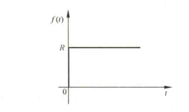
  
图 1-18 阶跃函数特性

阶跃函数是自动控制系统在实际工作条件下经常遇到的一种外作用形式。例如，电源电压突然跳动，负载突然增大或减小，飞机飞行中遇到的常值阵风扰动等，都可视为阶跃函数形式的外作用。在控制系统的分析设计工作中，一般将阶跃函数作用下系统的响应特性作为评价系统动态性能指标的依据。

#### （2）斜坡函数

斜坡函数的数学表达式为

$$
f(t)=
\begin{cases}
0, & t<0,\\
Rt, & t>0.
\end{cases}
\tag{1-2}
$$

式（1-2）表示在 $t=0$ 时刻开始，以恒定速率 $R$ 随时间而变化的函数，如图 1-19 所示。在工程实践中，某些随动系统就常常工作于这种外作用下，如雷达—高射炮防空系统，当雷达跟踪的目标以恒定速率飞行时，便可视为该系统工作于斜坡函数作用之下。

  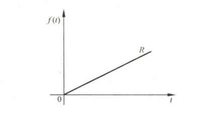
  
图 1-19 斜坡函数特性

#### （3）脉冲函数

脉冲函数定义为

$$
f(t)=\lim_{t_0\to0}\frac{A}{t_0}\bigl[1(t)-1(t-t_0)\bigr].
\tag{1-3}
$$

式中，$\dfrac{A}{t_0}[1(t)-1(t-t_0)]$ 是由两个阶跃函数合成的脉动函数，其面积 $A=(A/t_0)t_0$，如图 1-20（a）所示。当宽度 $t_0$ 趋于零时，脉动函数的极限便是脉冲函数，它是一个宽度为零、幅值为无穷大、面积为 $A$ 的极限脉冲，如图 1-20（b）所示。脉冲函数的强度通常用其面积表示。面积 $A=1$ 的脉冲函数称为单位脉冲函数或 $\delta$ 函数；强度为 $A$ 的脉冲函数可表示为 $f(t)=A\delta(t)$。在 $t_0$ 时刻出现的单位脉冲函数则表示为 $\delta(t-t_0)$。

  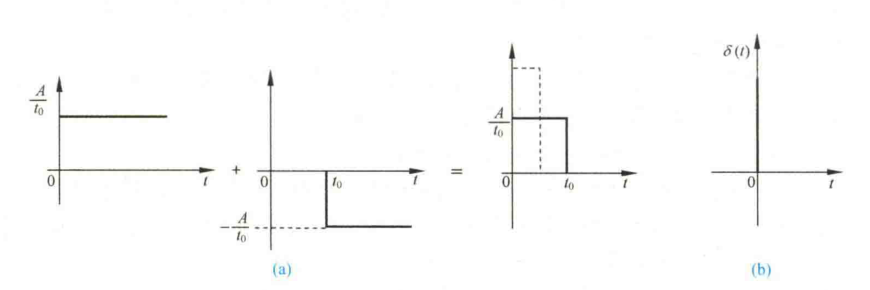
  
图 1-20 脉动函数和脉冲函数特性

必须指出，脉冲函数在现实中是不存在的，只有数学上的定义，但它却是一个重要而有效的数学工具，在自动控制理论研究中也具有重要作用。例如，一个任意形式的外作用，可以分解成不同时刻的一系列脉冲函数之和，这样，通过研究控制系统在脉冲函数作用下的响应特性，便可以了解在任意形式外作用下的响应特性。

#### （4）正弦函数

正弦函数的数学表达式为

$$
f(t)=A\sin(\omega t-\varphi).
\tag{1-4}
$$

式中，$A$ 为正弦函数的振幅；$\omega=2\pi f$ 为正弦函数角频率；$\varphi$ 为初始相角。

正弦函数是控制系统常用的一种典型外作用，很多实际的随动系统就是经常在这种正弦函数外作用下工作的。例如，舰船的消摆系统、稳定平台的随动系统等，就是处于形如正弦函数的波浪下工作的。更为重要的是系统在正弦函数作用下的响应，即频率响应，是自动控制理论中研究控制系统性能的重要依据（详见第五章）。

## 1-5 自动控制系统的分析与设计工具

MATLAB 是一种数值计算型科技应用软件，其全称是 Matrix Laboratory（矩阵实验室）。与 Basic、Fortran、Pascal、C 等编程语言相比，MATLAB 具有编程简单直观、用户界面友善、开放性能强等优点，因此自面世以来，很快就得到了广泛应用。

现今的 MATLAB 拥有了更丰富的数据类型、更友善的用户界面、更加快速精美的可视图形、更广泛的数学和数据分析资源，以及更多的应用开发工具。

这里主要介绍 MATLAB 在控制器设计、仿真和分析方面的功能，即 MATLAB 的控制系统工具箱。在 MATLAB 工具箱中，常用的有如下六个控制类工具箱。

### （1）系统辨识工具箱（system identification toolbox）

该工具箱提供了进行系统模型辨识的工具，其主要功能包括：

1）参数化模型辨识。有 AR、ARX、状态空间和输出误差等模型类辨识工具。

2）非参数化模型辨识。

3）模型验证。对辨识模型进行仿真并将真实输出数据与模型预测数据进行比较，计算响应的残差。

4）递推参数估计。针对各种参数模型，利用递推估计方法获得模型参数。

5）各种模型类的建立和转换。

6）集成多种功能的图形用户界面。以图形交互方式实现模型类的选择和建立，输入输出数据的加载和预处理，以及模型估计。

### （2）控制系统工具箱（control system toolbox）

该工具箱主要处理以传递函数为主要特征的经典控制和以状态空间描述为主要特征的现代控制中的主要问题。对于控制系统，尤其是 LTI 线性定常系统的建模、分析和设计提供了一个完整的解决方案。其主要功能如下：

1）系统建模。建立连续或离散系统的状态空间表达式、传递函数、零—极点增益模型，并实现任意两者之间的转换；通过串联、并联、反馈连接及更一般的框图连接，建立复杂系统的模型；通过多种方式实现连续时间系统的离散化、离散时间系统的连续化及重采样。

2）系统分析。既支持连续和离散系统，也适用于 SISO 和 MIMO 系统。在时域分析方面，对系统的单位脉冲响应、单位阶跃响应、零输入响应及更一般的任意输入响应进行仿真；在频域分析方面，对系统的伯德图、尼科尔斯图、奈奎斯特图进行计算和绘制。

该工具箱还提供了一个框图式操作界面工具——LTI 观测器，可支持十种不同类型的系统响应分析，大大简化系统分析和图形绘制的过程。

3）系统设计。计算系统的各种特性，如可控和可观测 Gramain 矩阵、传递零极点、李雅普诺夫方程、稳定裕度、阻尼系数以及根轨迹的增益选择等；支持系统的可控和可观测标准型实现、最小实现、均衡实现、降阶实现以及输入延时的 Pade 设计；对系统进行极点配置、观测器设计以及 LQ 和 LQG 最优控制等。

另一个框图式操作界面工具——SISO 系统设计工具，可用于单输入单输出反馈控制系统的补偿器校正设计。

### （3）鲁棒控制工具箱（robust control toolbox）

该工具箱提供鲁棒分析和设计的工具有：

1）模型建立和转换工具。建立增广状态方程和传递函数模型，进行多变量系统双线性变换等。

2）鲁棒分析工具。进行特征根轨迹、奇异值、结构奇异值分析等。

3）鲁棒综合工具。进行频率加权 LQG 综合、LQG/LTR、$H_\infty$ 综合、$\mu$ 综合等。

4）鲁棒模型降阶工具。实现均衡降阶、最优 Hankel 范数近似降阶（具有加性误差界）、Schur 均衡截断降阶（具有加性误差界）、Schur 均衡随机截断降阶（具有加性误差界）等。

### （4）模型预测控制工具箱（model predictive control toolbox）

该工具箱提供了一系列函数，用于模型预测控制的分析、设计和仿真。这些函数的主要类型如下：

1）系统模型辨识。通过多变量线性回归方法计算 MISO 脉冲响应模型，由 MISO 脉冲响应模型生成 MIMO 阶跃响应模型，对测量数据尺度化等。

2）模型建立和转换。建立模型预测工具箱使用的 mod 模型，以及状态空间模型与 mod 模型、阶跃响应模型、脉冲响应模型之间的转换。

3）模型预测控制器设计和仿真。有面向阶跃响应模型的预测控制器设计和仿真以及面向 MPC-mod 模型的设计和仿真。

4）系统分析。有计算模型预测控制系统频率响应、极点和奇异值功能。

### （5）模糊逻辑工具箱（fuzzy logic toolbox）

模糊逻辑工具箱具有如下五个方面的功能：

1）易于使用的图形化设计。模糊逻辑工具箱提供了建立和测试模糊逻辑系统的一整套功能函数，包括可视化定义语言变量及其隶属度函数、模糊推理方式选择函数、模糊推理规则编辑函数、对整个模糊推理逻辑系统管理以及交互式观察模糊推理过程和输出结果函数。

2）支持模糊逻辑中的高级技术。自适应神经—模糊推理（adaptive neural-fuzzy inference system，ANFIS），以及用于模式识别的模糊聚类技术。

3）集成的仿真和代码生成。实现与 Simulink 的无缝连接，通过 Real-Time Workshop 2.1 生成 ANSI C 源代码，实现模糊系统的实时应用。

4）独立运行的模糊推理机。完成模糊逻辑系统的设计后，将设计结果以 ASCII 码文件保存；利用模糊推理机，实现模糊系统的独立运行，或者作为其他应用的一部分运行。

### （6）非线性控制设计模块（nonlinear control design blockset）

该工具箱以 Simulink 模块的形式，在交互式模型输入环境下，集成了基于图形界面的非线性系统建模、控制器优化设计和仿真功能。其主要功能和特点如下：

1）控制器参数优化计算。自动将系统的性能指标转化为一个约束优化问题，并调用 MATLAB 优化工具箱的有关函数进行优化计算。

2）图形化交互式用户界面。控制器的优化参数和性能指标约束选择通过图形交互界面输入，控制器的优化过程和结果通过实时性能曲线显示。

3）任意选择优化参数和指标。设计和仿真控制设计模块提供了优化参数选择的对话窗口，用户可以选择其他 Simulink 模块的任意变量作为控制器优化参数；系统性能指标的选择可通过系统时域性能曲线以可视化的方式实现。

4）支持不确定性系统的鲁棒设计。通过设计和仿真控制设计模块，用户可以指定系统模块中变量的不确定性边界，实现满足鲁棒性能指标的非线性控制系统设计。

5）与 Simulink 集成，进行控制系统优化设计和仿真。每个 Simulink 设计框图都可看做一个特殊的 Simulink 模块，可添加到非线性系统的 Simulink 仿真方框图中对与其连接的信号进行约束。

本书附录 B 给出了适用于本书内容的 MATLAB 辅助分析与设计方法。
