# 第二章 控制系统的数学模型

在控制系统的分析和设计中，首先要建立系统的数学模型。控制系统的数学模型是描述系统内部物理量（或变量）之间关系的数学表达式。在静态条件下（即变量各阶导数为零），描述变量之间关系的代数方程叫静态数学模型；描述变量各阶导数之间关系的微分方程叫动态数学模型。如果已知输入量及变量的初始条件，对微分方程求解，就可以得到系统输出量的表达式，并由此对系统进行性能分析。因此，建立控制系统的数学模型是分析和设计控制系统的首要工作。

建立控制系统数学模型的方法有分析法和实验法两种。分析法是对系统各部分的运动机理进行分析，根据它们所依据的物理规律或化学规律分别列写相应的运动方程。例如，电学中有基尔霍夫定律，力学中有牛顿定律，热力学中有热力学定律等。实验法是人为地给系统施加某种测试信号，记录其输出响应，并用适当的数学模型去逼近，这种方法称为系统辨识。近年来，系统辨识已发展成一门独立的分支学科，本章研究用分析法建立系统数学模型。

在自动控制理论中，数学模型有多种形式。时域中常用的数学模型有微分方程、差分方程和状态方程；复数域中有传递函数、结构图；频域中有频率特性等。本章只研究微分方程、传递函数和结构图等数学模型的建立和应用，其余几种数学模型将在以后各章中予以详述。

## 2-1 控制系统的时域数学模型

本节着重研究描述线性、定常、集总参数控制系统的微分方程的建立和求解方法。

### 1. 线性元件的微分方程

现举例说明控制系统中常用的电气元件、力学元件等微分方程的列写。

**例 2-1**　图 2-1 是由电阻 $R$、电感 $L$ 和电容 $C$ 组成的无源网络，试列写以 $u_i(t)$ 为输入量、以 $u_o(t)$ 为输出量的网络微分方程。

<div align="center">
  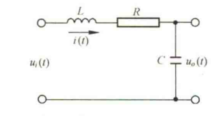
  <div style="font-style: italic; font-size: 0.92em; color: #666; margin-top: 0.35em;">图 2-1　RLC 无源网络</div>
</div>

**解**　设回路电流为 $i(t)$，由基尔霍夫定律可写出回路方程为

$$
L\frac{di(t)}{dt}+Ri(t)+\frac{1}{C}\int_0^t i(t)\,dt=u_i(t),
$$

且

$$
u_o(t)=\frac{1}{C}\int_0^t i(t)\,dt.
$$

消去中间变量 $i(t)$，得到描述网络输入、输出关系的微分方程

$$
LC\frac{d^2u_o(t)}{dt^2}+RC\frac{du_o(t)}{dt}+u_o(t)=u_i(t). \tag{2-1}
$$

显然，这是一个二阶线性微分方程，也就是图 2-1 无源网络的时域数学模型。

**例 2-2**　试列写图 2-2 所示电枢控制直流电动机的微分方程，要求取电枢电压 $u_a(t)$ 为输入量，电动机转速 $\omega_m(t)$ 为输出量。图中 $R_a$、$L_a$ 分别是电枢电路的电阻和电感；$M_c$ 是折合到电动机轴上的总负载转矩。激磁磁通设为常值。

<div align="center">
  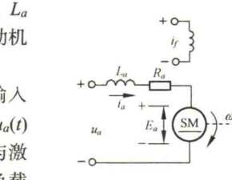
  <div style="font-style: italic; font-size: 0.92em; color: #666; margin-top: 0.35em;">图 2-2　电枢控制直流电动机原理图</div>
</div>

**解**　电枢控制直流电动机的工作实质是将输入的电能转换为机械能，也就是由输入的电枢电压 $u_a(t)$ 在电枢回路中产生电枢电流 $i_a(t)$，再由电流 $i_a(t)$ 与激磁磁通相互作用产生电磁转矩 $M_m(t)$，从而拖动负载运动。因此，直流电动机的运动方程由以下三部分组成。

1）电枢回路电压平衡方程

$$
u_a(t)=L_a\frac{di_a(t)}{dt}+R_ai_a(t)+E_a. \tag{2-2}
$$

式中，$E_a$ 是电枢反电势，它是电枢旋转时产生的反电势，其大小与激磁磁通及转速成正比，方向与电枢电压 $u_a(t)$ 相反，即 $E_a=C_e\omega_m(t)$，$C_e$ 是反电势系数。

2）电磁转矩方程

$$
M_m(t)=C_mi_a(t). \tag{2-3}
$$

式中，$C_m$ 是电动机转矩系数；$M_m(t)$ 是电枢电流产生的电磁转矩。

3）电动机轴上的转矩平衡方程

$$
J_m\frac{d\omega_m(t)}{dt}+f_m\omega_m(t)=M_m(t)-M_c(t). \tag{2-4}
$$

式中，$f_m$ 是电动机和负载折合到电动机轴上的黏性摩擦系数；$J_m$ 是电动机和负载折合到电动机轴上的转动惯量。

由式（2-2）～式（2-4）中消去中间变量 $i_a(t)$、$E_a$ 及 $M_m(t)$，得到

$$
\begin{aligned}
L_aJ_m\frac{d^2\omega_m(t)}{dt^2}
&+(L_af_m+R_aJ_m)\frac{d\omega_m(t)}{dt}
+(R_af_m+C_mC_e)\omega_m(t)\\
&=C_mu_a(t)-L_a\frac{dM_c(t)}{dt}-R_aM_c(t).
\end{aligned} \tag{2-5}
$$

在工程应用中，由于电枢电路电感 $L_a$ 较小，通常忽略不计，因而式（2-5）可简化为

$$
T_m\frac{d\omega_m(t)}{dt}+\omega_m(t)=K_mu_a(t)-K_cM_c(t), \tag{2-6}
$$

式中，

$$
T_m=\frac{R_aJ_m}{R_af_m+C_mC_e},\qquad
K_m=\frac{C_m}{R_af_m+C_mC_e},\qquad
K_c=\frac{R_a}{R_af_m+C_mC_e}.
$$

如果电枢电阻 $R_a$ 和电动机的转动惯量 $J_m$ 都很小，可忽略不计时，式（2-6）还可进一步简化为

$$
C_e\omega_m(t)=u_a(t). \tag{2-7}
$$

这时，电动机的转速 $\omega_m(t)$ 与电枢电压 $u_a(t)$ 成正比，于是电动机可作为测速发电机使用。

**例 2-3**　图 2-3 表示弹簧—质量—阻尼器机械位移系统。试列写质量 $m$ 在外力 $F(t)$ 作用下（其中重力略去不计），位移 $x(t)$ 的运动方程。

<div align="center">
  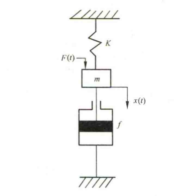
  <div style="font-style: italic; font-size: 0.92em; color: #666; margin-top: 0.35em;">图 2-3　弹簧—质量—阻尼器机械位移系统原理图</div>
</div>

**解**　设质量 $m$ 相对于初始状态的位移、速度和加速度分别为 $x(t)$、$dx(t)/dt$ 和 $d^2x(t)/dt^2$。由牛顿运动定律有

$$
m\frac{d^2x(t)}{dt^2}=F(t)-F_1(t)-F_2(t). \tag{2-8}
$$

式中，$F_1(t)=f\,dx(t)/dt$ 是阻尼器的阻尼力，其方向与运动方向相反，大小与运动速度成比例；$f$ 是阻尼系数；$F_2(t)=Kx(t)$ 是弹簧的弹性力，其方向与运动方向相反，大小与位移成比例，$K$ 是弹性系数。代入式（2-8），整理得

$$
m\frac{d^2x(t)}{dt^2}+f\frac{dx(t)}{dt}+Kx(t)=F(t). \tag{2-9}
$$

**例 2-4**　试列写图 2-4 齿轮系的运动方程。图中齿轮 1 和齿轮 2 的转速、齿数和半径分别用 $\omega_1,Z_1,r_1$ 和 $\omega_2,Z_2,r_2$ 表示；其黏性摩擦系数及转动惯量分别是 $f_1,J_1$ 和 $f_2,J_2$；齿轮 1 和齿轮 2 的原动转矩及负载转矩分别是 $M_m,M_1,M_2,M_c$。

<div align="center">
  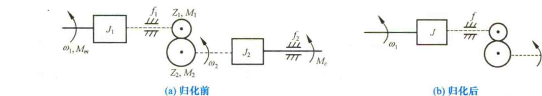
  <div style="font-style: italic; font-size: 0.92em; color: #666; margin-top: 0.35em;">图 2-4　齿轮系原理图</div>
</div>

**解**　控制系统的执行元件与负载之间往往通过齿轮系进行运动传递，以便实现减速和增大力矩。在齿轮传动中，两个啮合齿轮的线速度相同，传送的功率亦相同，因此

$$
M_1\omega_1=M_2\omega_2, \tag{2-10}
$$

$$
\omega_1r_1=\omega_2r_2. \tag{2-11}
$$

又因为齿数与半径成正比，

$$
\frac{r_1}{r_2}=\frac{Z_1}{Z_2}, \tag{2-12}
$$

于是

$$
\omega_2=\frac{Z_1}{Z_2}\omega_1, \tag{2-13}
$$

$$
M_1=\frac{Z_1}{Z_2}M_2. \tag{2-14}
$$

根据力学中定轴转动的动静法，分别写出

$$
J_1\frac{d\omega_1}{dt}+f_1\omega_1+M_1=M_m, \tag{2-15}
$$

$$
J_2\frac{d\omega_2}{dt}+f_2\omega_2+M_c=M_2. \tag{2-16}
$$

消去中间变量，得

$$
J=J_1+\left(\frac{Z_1}{Z_2}\right)^2J_2, \tag{2-17}
$$

$$
f=f_1+\left(\frac{Z_1}{Z_2}\right)^2f_2, \tag{2-18}
$$

$$
M=\frac{Z_1}{Z_2}M_c, \tag{2-19}
$$

$$
M_m=J\frac{d\omega_1}{dt}+f\omega_1+M. \tag{2-20}
$$

故齿轮系微分方程可写成

$$
J\frac{d\omega_1}{dt}+f\omega_1+M=M_m. \tag{2-21}
$$

式中，$J,f,M$ 分别是折合到齿轮 1 的等效转动惯量、等效黏性摩擦系数及等效负载转矩。折算的等效值与齿轮系的速比有关，速比越大，即 $Z_2/Z_1$ 越大，折算的等效值越小。如果齿轮系速比足够大，则后级齿轮及负载的影响便可以不予考虑。

综上所述，列写元件微分方程的步骤可归纳如下：

1. 根据元件的工作原理及其在控制系统中的作用，确定其输入量和输出量。
2. 分析元件工作中所遵循的物理规律或化学规律，列写相应的微分方程。
3. 消去中间变量，得到输出量与输入量之间关系的微分方程，即元件在时域中的数学模型。

一般情况下，应将微分方程写为标准形式，即与输入量有关的项写在方程右端，与输出量有关的项写在方程左端，方程两端变量的导数项均按降幂次序排列。

### 2. 控制系统微分方程的建立

建立控制系统的微分方程时，一般先由系统原理图画出系统方块图，并分别列写组成系统各元件的微分方程；然后消去中间变量，便得到描述系统输出量与输入量之间关系的微分方程。列写系统各元件的微分方程时，一是应注意信号传递的单向性，即前一个元件的输出是后一个元件的输入，一级一级地单向传送；二是应注意前后连接的两个元件中，后级对前级的负载效应，例如无源网络输入阻抗对前级的影响、齿轮系对电动机转动惯量的影响等。

**例 2-5**　试列写图 2-5 所示速度控制系统的微分方程。

<div align="center">
  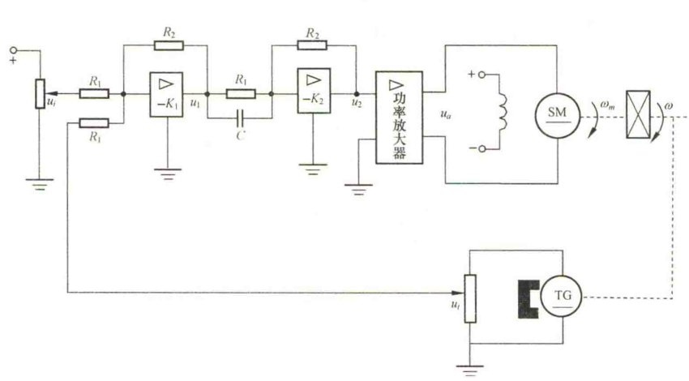
  <div style="font-style: italic; font-size: 0.92em; color: #666; margin-top: 0.35em;">图 2-5　速度控制系统原理图</div>
</div>

**解**　控制系统的被控对象是电动机（带负载），系统的输出量是转速 $\omega$，输入量是 $u_i$。控制系统由给定电位器、运算放大器Ⅰ（含比较作用）、运算放大器Ⅱ（含 RC 校正网络）、功率放大器、直流电动机、测速发电机、减速器等部分组成。现分别列写各元部件的微分方程。

运算放大器Ⅰ：输入量（即给定电压）$u_i$ 与速度反馈电压 $u_t$ 在此合成，产生偏差电压并经放大，即

$$
u_1=K_1(u_i-u_t)=K_1u_e. \tag{2-22}
$$

式中，$K_1=R_2/R_1$ 是运算放大器Ⅰ的放大系数。

运算放大器Ⅱ：考虑 RC 校正网络，$u_2$ 与 $u_1$ 之间的微分方程为

$$
u_2=K_2\left(\tau\frac{du_1}{dt}+u_1\right). \tag{2-23}
$$

式中，$K_2=R_4/R_3$ 是运算放大器Ⅱ的放大系数；$\tau=R_3C$ 是微分时间常数。

功率放大器：本系统采用晶闸管整流装置，它包括触发电路和晶闸管主回路。忽略晶闸管控制电路的时间滞后，其输入、输出方程为

$$
u_a=K_3u_2. \tag{2-24}
$$

式中，$K_3$ 为功率放大系数。

直流电动机：直接引用例 2-2 所求得的式（2-6），即

$$
T_m\frac{d\omega_m}{dt}+\omega_m=K_mu_a-K_cM_c. \tag{2-25}
$$

齿轮系：设齿轮系的速比为 $i$，则电动机转速经齿轮系减速后变为 $\omega$，故有

$$
\omega=\frac{1}{i}\omega_m. \tag{2-26}
$$

测速发电机：测速发电机的输出电压 $u_t$ 与其转速 $\omega$ 成正比，即

$$
u_t=K_t\omega. \tag{2-27}
$$

从上述各方程中消去中间变量 $u_t,u_1,u_2,u_a,\omega_m$，整理后得到控制系统的微分方程

$$
T''\frac{d^2\omega}{dt^2}+T'\frac{d\omega}{dt}+\omega
=K'\tau\frac{du_i}{dt}+K'u_i-K_c'M_c, \tag{2-28}
$$

其中

$$
T''=\frac{iT_m}{i+K_1K_2K_3K_mK_t},\qquad
T'=\frac{i+K_1K_2K_3K_mK_t\tau}{i+K_1K_2K_3K_mK_t},
$$

$$
K'=\frac{K_1K_2K_3K_m}{i+K_1K_2K_3K_mK_t},\qquad
K_c'=\frac{K_c}{i+K_1K_2K_3K_mK_t}.
$$

式（2-28）可用于研究在给定电压 $u_i$ 或负载扰动转矩 $M_c$ 作用时，速度控制系统的动态性能。

从上述各控制系统元件或系统的微分方程可以发现，不同类型的元件或系统可具有形式相同的数学模型。例如，RLC 无源网络和弹簧—质量—阻尼器机械系统的数学模型均是二阶微分方程，我们称这些物理系统为相似系统。相似系统揭示了不同物理现象间的相似关系，便于使用一个简单系统模型去研究与其相似的复杂系统，也为控制系统的计算机数字仿真提供了基础。

### 3. 线性系统的基本特性

用线性微分方程描述的元件或系统，称为线性元件或线性系统。线性系统的重要性质是可以应用叠加原理。叠加原理有两重含义，即系统具有可叠加性和均匀性（或齐次性）。

设有线性微分方程

$$
\frac{d^2c(t)}{dt^2}+\frac{dc(t)}{dt}+c(t)=f(t).
$$

当 $f(t)=f_1(t)$ 时，方程的解为 $c_1(t)$；当 $f(t)=f_2(t)$ 时，其解为 $c_2(t)$。如果 $f(t)=f_1(t)+f_2(t)$，容易验证方程的解为 $c(t)=c_1(t)+c_2(t)$，这就是可叠加性。而当 $f(t)=Af_1(t)$ 时，式中 $A$ 为常数，则方程的解必为 $c(t)=Ac_1(t)$，这就是均匀性。

线性系统的叠加原理表明，两个外作用同时加于系统所产生的总输出，等于各个外作用单独作用时分别产生的输出之和；且外作用的数值增大若干倍时，其输出亦相应增大同样的倍数。因此，对线性系统进行分析和设计时，如果有几个外作用同时加于系统，可以将它们分别处理，依次求出各个外作用单独加入时系统的输出，然后将它们叠加。此外，每个外作用在数值上可只取单位值，从而大大简化线性系统的研究工作。

### 4. 线性定常微分方程的求解

建立控制系统数学模型的目的之一，是为了用数学方法定量研究控制系统的工作特性。当系统微分方程列写出来后，只要给定输入量和初始条件，便可对微分方程求解，并由此了解系统输出量随时间变化的特性。线性定常微分方程的求解方法有经典法和拉普拉斯变换法两种，也可借助电子计算机求解。本小节只研究用拉氏变换法求解微分方程的方法，同时分析微分方程解的组成，为今后引出传递函数概念奠定基础。

**例 2-6**　在例 2-1 中，若已知 $L=1\ \mathrm{H}$，$C=1\ \mathrm{F}$，$R=1\ \Omega$，且电容的初始电压 $u_o(0)=0.1\ \mathrm{V}$，初始电流 $i(0)=0.1\ \mathrm{A}$，电源电压 $u_i(t)=1\ \mathrm{V}$。试求电路突然接通电源时，电容电压 $u_o(t)$ 的变化规律。

**解**　例 2-1 中已求得网络微分方程

$$
LC\frac{d^2u_o(t)}{dt^2}+RC\frac{du_o(t)}{dt}+u_o(t)=u_i(t). \tag{2-29}
$$

令 $U_i(s)=\mathcal L[u_i(t)]$，$U_o(s)=\mathcal L[u_o(t)]$。考虑初始条件，对式（2-29）求拉氏变换并代入已知数据，整理得

$$
U_o(s)=\frac{U_i(s)}{s^2+s+1}+\frac{0.1s+0.2}{s^2+s+1}. \tag{2-30}
$$

由于电路突然接通电源，$u_i(t)$ 可视为阶跃输入，即 $U_i(s)=1/s$。求拉氏反变换，得

$$
\begin{aligned}
u_o(t)
&=\mathcal L^{-1}\!\left[\frac{1}{s(s^2+s+1)}+\frac{0.1s+0.2}{s^2+s+1}\right]\\
&=1+1.15e^{-0.5t}\sin(0.866t-120^\circ)
+0.2e^{-0.5t}\sin(0.866t+30^\circ).
\end{aligned} \tag{2-31}
$$

式（2-31）中，前两项是由网络输入电压产生的输出分量，与初始条件无关，称为零初始条件响应；后一项由初始条件产生，与输入电压无关，称为零输入响应。它们合称网络的单位阶跃响应。

如果输入电压是单位脉冲量 $\delta(t)$，此时 $U_i(s)=1$，网络的输出称为单位脉冲响应：

$$
u_o(t)=\mathcal L^{-1}\!\left[\frac{1}{s^2+s+1}+\frac{0.1s+0.2}{s^2+s+1}\right]. \tag{2-32}
$$

利用拉氏变换的初值定理和终值定理，可以直接从式（2-30）得到 $u_o(0)=0.1\ \mathrm{V}$、$u_o(\infty)=1\ \mathrm{V}$，与式（2-31）的结果一致。

用拉氏变换法求解线性定常微分方程的过程可归结如下：

1. 考虑初始条件，对微分方程中的每一项分别进行拉氏变换，将微分方程转换为变量 $s$ 的代数方程。
2. 由代数方程求出输出量拉氏变换函数的表达式。
3. 对输出量拉氏变换函数求反变换，得到输出量的时域表达式，即所求微分方程的解。

### 5. 非线性微分方程的线性化

严格地说，实际物理元件或系统都是非线性的。例如，弹簧的刚度与其形变有关，电阻、电容、电感等参数值与周围环境及流经它们的电流有关，电动机本身的摩擦、死区等非线性因素也会使其运动方程复杂化。当然，在一定条件下，为了简化数学模型，可以忽略这些影响，将元件视为线性元件。此外，还有一种称为切线法或小偏差法的线性化方法，特别适合于具有连续变化的非线性特性函数，其实质是在一个很小的范围内，用一段直线代替非线性特性。

<div align="center">
  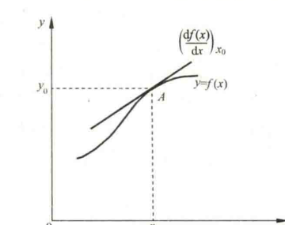
  <div style="font-style: italic; font-size: 0.92em; color: #666; margin-top: 0.35em;">图 2-6　小偏差线性化示意图</div>
</div>

设连续变化的非线性函数为 $y=f(x)$，取某平衡状态 $A$ 为工作点，对应 $y_0=f(x_0)$。将 $f(x)$ 在该点附近展开为泰勒级数，并在 $x-x_0$ 很小时略去高次幂项，得

$$
y-y_0=f(x)-f(x_0)=\left.\frac{df(x)}{dx}\right|_{x_0}(x-x_0).
$$

令 $\Delta y=y-y_0$、$\Delta x=x-x_0$、$K=[df(x)/dx]_{x_0}$，则 $\Delta y=K\Delta x$。略去增量符号，便得 $y=Kx$。

对于有两个自变量 $x_1,x_2$ 的非线性函数 $f(x_1,x_2)$，同理在工作点 $(x_{10},x_{20})$ 附近得到

$$
\Delta y=K_1\Delta x_1+K_2\Delta x_2,
$$

其中 $K_1=(\partial f/\partial x_1)_{x_{10},x_{20}}$、$K_2=(\partial f/\partial x_2)_{x_{10},x_{20}}$。

这种小偏差线性化方法对于控制系统大多数工作状态是可行的。自动控制系统在正常情况下处于稳定工作状态，即平衡状态；一旦被控量偏离期望值，控制系统便开始控制动作以减小或消除偏差，因此被控量的偏差一般不会很大。在建立控制系统数学模型时，通常只研究相对于平衡状态的小偏差运动。

**例 2-7**　设铁心线圈电路如图 2-7（a）所示，其磁通 $\Phi$ 与线圈中电流 $i$ 之间的关系如图 2-7（b）所示。试列写以 $u_i$ 为输入量、$i$ 为输出量的电路微分方程。

<div align="center">
  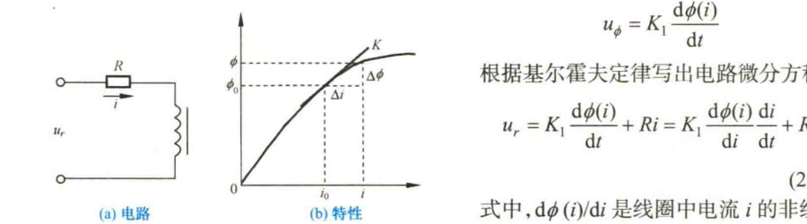
  <div style="font-style: italic; font-size: 0.92em; color: #666; margin-top: 0.35em;">图 2-7　铁心线圈电路及其特性</div>
</div>

**解**　设铁心线圈磁通变化时产生的感应电势为 $u_L=K\,d\Phi(i)/dt$。根据基尔霍夫定律，

$$
u_i=K\frac{d\Phi(i)}{dt}+Ri
=K\frac{d\Phi(i)}{di}\frac{di}{dt}+Ri. \tag{2-33}
$$

由于 $d\Phi(i)/di$ 是电流 $i$ 的非线性函数，式（2-33）是非线性微分方程。若电压和电流只在平衡点 $(u_{i0},i_0)$ 附近作微小变化，将 $\Phi(i)$ 在 $i_0$ 附近展开并略去高阶项，可得增量线性化关系

$$
\Phi(i)=K_1i. \tag{2-34}
$$

代入式（2-33），得

$$
KK_1\frac{di}{dt}+Ri=u_i. \tag{2-35}
$$

式（2-35）便是铁心线圈电路在平衡点附近的增量线性化微分方程；平衡点变动时，$K_1$ 也相应改变。

### 6. 运动的模态

在线性微分方程的解中，输入作用下的特解代表强迫运动，齐次微分方程的通解代表自由运动。若 $n$ 阶微分方程的特征根为 $\lambda_1,\lambda_2,\ldots,\lambda_n$，且无重根，则函数 $e^{\lambda_1t},e^{\lambda_2t},\ldots,e^{\lambda_nt}$ 称为该微分方程所描述运动的模态，也叫振型。齐次微分方程的通解是这些模态的线性组合：

$$
y(t)=c_1e^{\lambda_1t}+c_2e^{\lambda_2t}+\cdots+c_ne^{\lambda_nt}.
$$

若有多重根，模态会具有 $te^{\lambda t},t^2e^{\lambda t},\ldots$ 的形式；若有共轭复根 $\lambda=\sigma\pm j\omega$，则相应模态可写成实函数 $e^{\sigma t}\sin\omega t$ 与 $e^{\sigma t}\cos\omega t$。

在例 2-6 中，特征根为 $-0.5\pm j0.866$，故其共轭复模态可写为 $e^{-0.5t}\sin0.866t$ 与 $e^{-0.5t}\cos0.866t$。由给定初始条件求得的齐次通解，与例 2-6 解中零输入分量 $0.2e^{-0.5t}\sin(0.866t+30^\circ)$ 一致。

## 2-2 控制系统的复数域数学模型

控制系统的微分方程是在时间域描述系统动态性能的数学模型。在给定外作用及初始条件下，求解微分方程可以得到系统的输出响应。这种方法比较直观，特别是借助计算机可以迅速而准确地求得结果。但是，如果系统的结构改变或某个参数变化，就要重新列写并求解微分方程，不便于系统的分析和设计。

用拉氏变换法求解线性系统的微分方程时，可以得到控制系统在复数域中的数学模型——传递函数。传递函数不仅可以表征系统的动态性能，而且可以用来研究系统结构或参数变化对系统性能的影响。经典控制理论中广泛应用的频率法和根轨迹法，就是以传递函数为基础建立起来的，传递函数是经典控制理论中最基本和最重要的概念。

### 1. 传递函数的定义和性质

#### （1）传递函数的定义

线性定常系统的传递函数，定义为零初始条件下，系统输出量的拉氏变换与输入量的拉氏变换之比。

设线性定常系统由下述 $n$ 阶线性常微分方程描述：

$$
\begin{aligned}
a_0\frac{d^nc(t)}{dt^n}+a_1\frac{d^{n-1}c(t)}{dt^{n-1}}+\cdots+a_nc(t)
= {}& b_0\frac{d^mr(t)}{dt^m}\\
&+b_1\frac{d^{m-1}r(t)}{dt^{m-1}}+\cdots+b_mr(t).
\end{aligned} \tag{2-36}
$$

式中，$c(t)$ 是输出量，$r(t)$ 是输入量；$a_i$ 和 $b_j$ 是与系统结构和参数有关的常系数。设输入、输出及其各阶导数在 $t=0$ 时均为零，对式（2-36）求拉氏变换，得到系统传递函数

$$
G(s)=\frac{C(s)}{R(s)}
=\frac{b_0s^m+b_1s^{m-1}+\cdots+b_{m-1}s+b_m}
{a_0s^n+a_1s^{n-1}+\cdots+a_{n-1}s+a_n}
=\frac{M(s)}{N(s)}. \tag{2-37}
$$

**例 2-8**　试求例 2-1 RLC 无源网络的传递函数 $U_o(s)/U_i(s)$。

**解**　在零初始条件下，对式（2-1）求拉氏变换，得到 $(LCs^2+RCs+1)U_o(s)=U_i(s)$，故

$$
G(s)=\frac{U_o(s)}{U_i(s)}=\frac{1}{LCs^2+RCs+1}. \tag{2-38}
$$

#### （2）传递函数的性质

1. 传递函数是复变量 $s$ 的有理真分式函数，具有复变函数的所有性质，且 $m\leq n$，所有系数均为实数。
2. 传递函数只取决于系统或元件的结构和参数，而与输入量的形式无关，也不反映系统内部信息。因此，可用图 2-8 的方框表示具有传递函数 $G(s)$ 的线性系统。
3. 传递函数与微分方程具有相通性。在零初始条件下，将微分方程中的微分算符 $d/dt$ 用复数 $s$ 置换便得到传递函数；反之，将传递函数多项式中的 $s$ 用 $d/dt$ 置换便得到微分方程。
4. 传递函数 $G(s)$ 的拉氏反变换是脉冲响应 $g(t)$。当输入为单位脉冲 $\delta(t)$ 时，$R(s)=1$，故 $g(t)=\mathcal L^{-1}[G(s)]$。

<div align="center">
  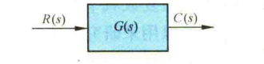
  <div style="font-style: italic; font-size: 0.92em; color: #666; margin-top: 0.35em;">图 2-8　传递函数的图示</div>
</div>

传递函数是在零初始条件下定义的。零初始条件一方面指输入量在 $t\geq0$ 时才作用于系统，因而在 $t=0^-$ 时输入量及其各阶导数均为零；另一方面指输入量加入系统之前，系统处于稳定工作状态，即输出量及其各阶导数在 $t=0$ 时的值也为零。因此，传递函数可以表征控制系统的动态性能，并用来求给定输入下的零初始条件响应。由卷积定理，

$$
c(t)=\mathcal L^{-1}[G(s)R(s)]
=\int_0^t r(\tau)g(t-\tau)\,d\tau
=\int_0^t r(t-\tau)g(\tau)\,d\tau.
$$

**例 2-9**　试求例 2-2 电枢控制直流电动机的传递函数 $\Omega_m(s)/U_a(s)$。

**解**　根据线性系统的叠加原理，可分别求电枢电压 $u_a(t)$ 和负载扰动转矩 $M_c(t)$ 到转速 $\omega_m(t)$ 的传递函数。令 $M_c(t)=0$，由式（2-6）得

$$
G(s)=\frac{\Omega_m(s)}{U_a(s)}=\frac{K_m}{T_ms+1}. \tag{2-39}
$$

令 $u_a(t)=0$，同理得

$$
G_M(s)=\frac{\Omega_m(s)}{M_c(s)}=-\frac{K_c}{T_ms+1}. \tag{2-40}
$$

电枢电压和负载转矩同时作用时，可将两个单独响应叠加。

### 2. 传递函数的零点和极点

传递函数的分子和分母多项式经因式分解后可写为

$$
G(s)=K^*\frac{\prod_{i=1}^{m}(s-z_i)}{\prod_{j=1}^{n}(s-p_j)}. \tag{2-41}
$$

式中，$z_i$ 是传递函数的零点，$p_j$ 是传递函数的极点；它们可以是实数，也可以是复数；$K^*$ 称为传递系数或根轨迹增益。在复平面上通常用“○”表示零点，用“×”表示极点。

传递函数还可写成时间常数形式：

$$
G(s)=K\frac{(\tau_1s+1)(\tau_2^2s^2+2\zeta_2\tau_2s+1)\cdots}
{(T_1s+1)(T_2^2s^2+2\xi_2T_2s+1)\cdots}. \tag{2-42}
$$

一次因子对应实数零、极点，二次因子对应共轭复数零、极点。传递函数的这种表示形式在频率法中使用较多。

### 3. 传递函数的极点和零点对输出的影响

由于传递函数的极点就是微分方程的特征根，因此它们决定了所描述系统自由运动的模态，而且在强迫运动中也会包含这些自由运动模态。传递函数的零点并不形成自由运动模态，但会影响各模态在响应中所占的比重，因而影响响应曲线的形状。

例如，设

$$
G(s)=\frac{6(s+3)}{(s+1)(s+2)}.
$$

其极点为 $-1,-2$，零点为 $-3$，自由运动模态为 $e^{-t},e^{-2t}$。当输入含有常值和 $e^{-5t}$ 模态时，输出既包含输入的模态，也包含由系统极点形成的自由运动模态。

再比较具有相同极点、不同零点的两个传递函数

$$
G_1(s)=\frac{4s+2}{(s+1)(s+2)},\qquad
G_2(s)=\frac{1.5s+2}{(s+1)(s+2)}.
$$

其单位阶跃响应分别为

$$
c_1(t)=1+2e^{-t}-3e^{-2t},\qquad
c_2(t)=1-0.5e^{-t}-0.5e^{-2t}.
$$

尽管两系统的模态相同，但由于零点位置不同，模态所占比重不同，因而响应曲线形状不同，如图 2-9 所示。

<div align="center">
  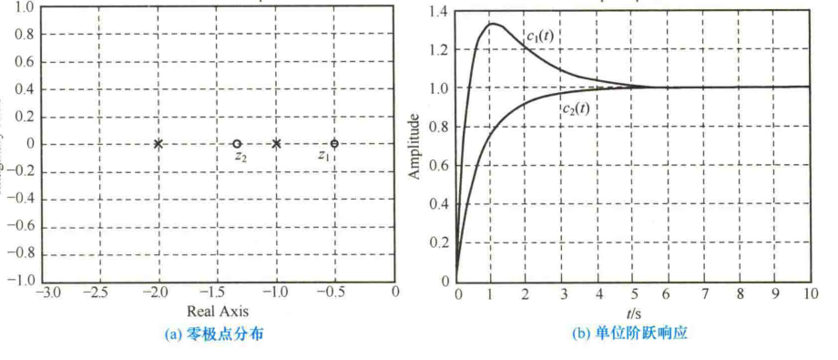
  <div style="font-style: italic; font-size: 0.92em; color: #666; margin-top: 0.35em;">图 2-9　零极点对输出响应的影响（MATLAB）</div>
</div>

### 4. 典型元部件的传递函数

自动控制系统由各种元部件相互连接组成，它们一般是机械的、电子的、液压的、光学的或其他类型的装置。为建立控制系统的数学模型，必须首先了解各种元部件的数学模型及其特性。

#### 电位器

电位器是一种把线位移或角位移变换为电压量的装置。空载时，电刷角位移 $\theta(t)$ 与输出电压 $u(t)$ 的关系为

$$
u(t)=K_1\theta(t), \tag{2-43}
$$

故其传递函数为

$$
G(s)=\frac{U(s)}{\Theta(s)}=K_1. \tag{2-44}
$$

<div align="center">
  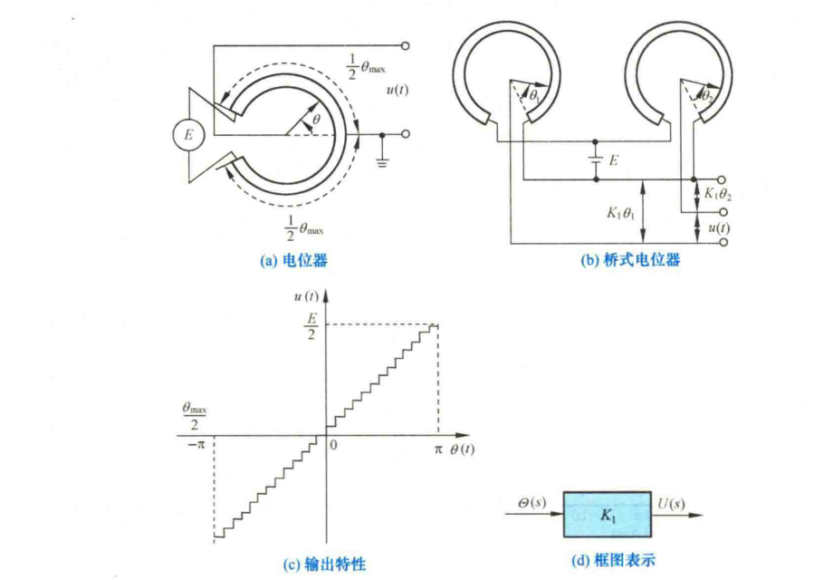
  <div style="font-style: italic; font-size: 0.92em; color: #666; margin-top: 0.35em;">图 2-10　电位器及其特性</div>
</div>

用一对相同电位器组成误差检测器时，其输出电压为 $u(t)=K_1[\theta_1(t)-\theta_2(t)]=K_1\Delta\theta(t)$，故

$$
G(s)=\frac{U(s)}{\Delta\Theta(s)}=K_1. \tag{2-45}
$$

使用电位器时应注意负载效应。若输出端接有负载电阻，输出电压与电刷角位移一般不再保持线性关系；只有负载阻抗足够大时，才能近似将电位器视为线性元件。

<div align="center">
  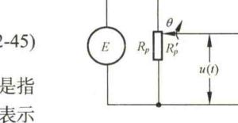
  <div style="font-style: italic; font-size: 0.92em; color: #666; margin-top: 0.35em;">图 2-11　负载效应示意图</div>
</div>

#### 测速发电机

测速发电机用于测量角速度并将其转换为电压量，常用的有直流和交流测速发电机。

<div align="center">
  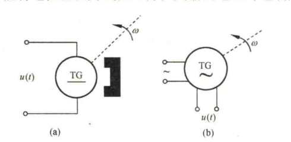
  <div style="font-style: italic; font-size: 0.92em; color: #666; margin-top: 0.35em;">图 2-12　测速发电机示意图</div>
</div>

永磁式直流测速发电机输出电压为

$$
u(t)=K_t\omega(t)=K_t\frac{d\theta(t)}{dt}. \tag{2-46}
$$

因此

$$
G(s)=\frac{U(s)}{\Omega(s)}=K_t, \tag{2-47}
$$

或

$$
G(s)=\frac{U(s)}{\Theta(s)}=K_ts. \tag{2-48}
$$

<div align="center">
  
  <div style="font-style: italic; font-size: 0.92em; color: #666; margin-top: 0.35em;">图 2-13　测速发电机的方框图</div>
</div>

交流测速发电机输出的是与转子角速度成比例的交流电压，其包络线也可用式（2-46）表示，故其传递函数及方框图与直流测速发电机相同。

#### 电枢控制直流伺服电动机

根据式（2-39）和式（2-40），电枢控制直流伺服电动机可用图 2-14 的三种方框图表示。

<div align="center">
  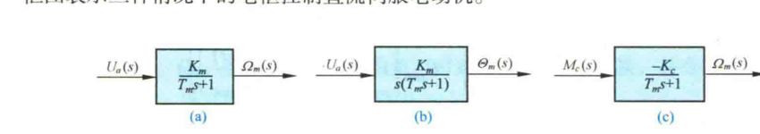
  <div style="font-style: italic; font-size: 0.92em; color: #666; margin-top: 0.35em;">图 2-14　直流伺服电动机方框图</div>
</div>

#### 两相伺服电动机

两相伺服电动机具有重量轻、惯性小、加速特性好的优点，是控制系统中广泛应用的一种小功率交流执行机构。其转矩—速度特性具有负斜率且呈非线性，通常用低速部分的直线作线性近似。

<div align="center">
  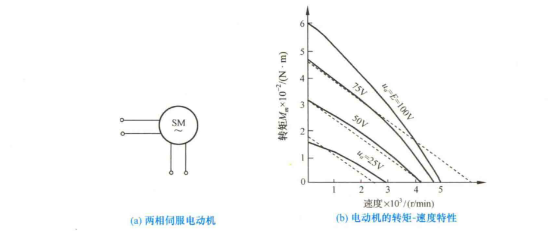
  <div style="font-style: italic; font-size: 0.92em; color: #666; margin-top: 0.35em;">图 2-15　两相伺服电动机及其特性曲线</div>
</div>

线性化后的机械特性可表示为

$$
M_m=-C_a\omega_m+M_s, \tag{2-49}
$$

暂不考虑负载转矩时，转矩平衡方程为

$$
M_m=J_m\frac{d^2\theta_m}{dt^2}+f_m\frac{d\theta_m}{dt}. \tag{2-50}
$$

消去中间变量并求拉氏变换，得

$$
G(s)=\frac{\Theta_m(s)}{U_a(s)}
=\frac{K_m}{s(J_ms+f_m+C_a)}
=\frac{K_m}{s(T_ms+1)}, \tag{2-51}
$$

以及

$$
G(s)=\frac{\Omega_m(s)}{U_a(s)}=\frac{K_m}{T_ms+1}. \tag{2-52}
$$

#### 无源网络

为了改善控制系统的性能，常在系统中引入由电阻、电容和电感组成的无源网络作为校正元件。可以先列写微分方程再求拉氏变换，也可以引用复数阻抗直接列写代数方程。

<div align="center">
  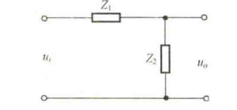
  <div style="font-style: italic; font-size: 0.92em; color: #666; margin-top: 0.35em;">图 2-16　用复数阻抗表示的 RLC 电路</div>
</div>

求无源网络传递函数时，一般假设网络输出端接有无穷大负载阻抗，输入信号源内阻为零，否则应考虑负载效应。图 2-17 表明，两个 RC 网络直接连接时，由于后级对前级的负载效应，总传递函数一般不等于两个网络传递函数的乘积。只有后级输入阻抗足够大、前级输出阻抗趋于零，或两级之间加入隔离放大器时，才可近似按两个方框串联处理。

<div align="center">
  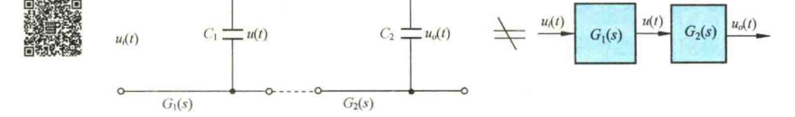
  <div style="font-style: italic; font-size: 0.92em; color: #666; margin-top: 0.35em;">图 2-17　负载效应示例</div>
</div>

#### 单容水槽

设单容水槽如图 2-18 所示，水流通过控制阀不断流入，同时通过负载阀流出。流入量由调节阀开度 $u$ 控制，被调量为水位 $h$。

<div align="center">
  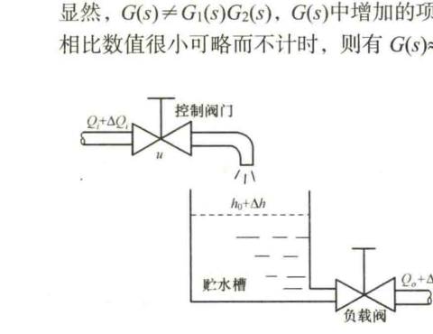
  <div style="font-style: italic; font-size: 0.92em; color: #666; margin-top: 0.35em;">图 2-18　单容水槽原理图</div>
</div>

根据物料平衡关系，

$$
\Delta Q-\Delta Q_o=A\frac{d\Delta h}{dt}. \tag{2-53}
$$

阀前后压差不变时，

$$
\Delta Q=K_u\Delta u. \tag{2-54}
$$

流出量与液位高度的非线性关系在平衡点附近线性化，液阻可表示为

$$
R=\frac{\Delta h}{\Delta Q_o}. \tag{2-55}
$$

代入并整理，得

$$
T\frac{d\Delta h}{dt}+\Delta h=K\Delta u, \tag{2-56}
$$

其中 $T=RA$、$K=K_uR$。因此

$$
G(s)=\frac{\Delta H(s)}{\Delta U(s)}=\frac{K}{Ts+1}. \tag{2-57}
$$

#### 电加热炉

电加热炉是常见的热处理设备，其示意图如图 2-19 所示。根据热平衡关系并在工作点附近对热量与控制电压的非线性关系进行线性化，可得增量微分方程

$$
T\frac{d\Delta T}{dt}+\Delta T=K\Delta u, \tag{2-58}
$$

故传递函数为

$$
G(s)=\frac{\Delta T(s)}{\Delta U(s)}=\frac{K}{Ts+1}. \tag{2-59}
$$

<div align="center">
  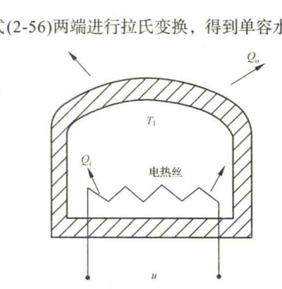
  <div style="font-style: italic; font-size: 0.92em; color: #666; margin-top: 0.35em;">图 2-19　电加热炉原理图</div>
</div>

#### 有纯延迟的单容水槽

若调节阀距水槽有一段较长距离，阀门开度变化所引起的流入量变化需要经过纯延迟时间 $\tau$ 才能影响水位。其微分方程为

$$
T\frac{d\Delta h}{dt}+\Delta h=K\Delta u(t-\tau), \tag{2-60}
$$

相应传递函数为

$$
G(s)=\frac{\Delta H(s)}{\Delta U(s)}=\frac{Ke^{-\tau s}}{Ts+1}. \tag{2-61}
$$

#### 双容水槽

图 2-20 是两个串联单容水槽构成的双容水槽。输入量为调节阀 1 产生的阀门开度变化 $\Delta u$，输出量为第二个水槽的液位增量 $\Delta h_2$。

<div align="center">
  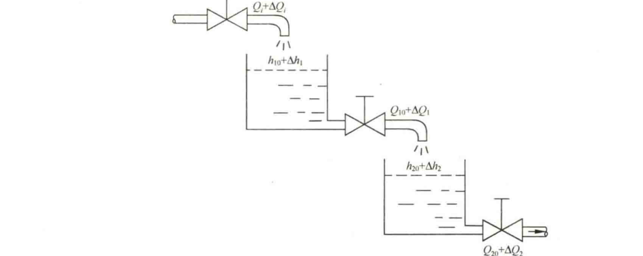
  <div style="font-style: italic; font-size: 0.92em; color: #666; margin-top: 0.35em;">图 2-20　双容水槽原理图</div>
</div>

经平衡点线性化后，有

$$
\Delta Q_1-\Delta Q_2=C_2\frac{d\Delta h_2}{dt}, \tag{2-62}
$$

$$
\Delta Q_1=\frac{\Delta h_1-\Delta h_2}{R_1},\qquad
\Delta Q_2=\frac{\Delta h_2}{R_2}, \tag{2-63}
$$

$$
\Delta Q-\Delta Q_1=C_1\frac{d\Delta h_1}{dt}, \tag{2-64}
$$

$$
\Delta Q=K_u\Delta u. \tag{2-65}
$$

由式（2-62）和式（2-63）得

$$
\Delta h_1=\frac{R_1}{R_2}\Delta h_2+R_1C_2\frac{d\Delta h_2}{dt}, \tag{2-66}
$$

$$
\frac{d\Delta h_1}{dt}=\frac{R_1}{R_2}\frac{d\Delta h_2}{dt}+R_1C_2\frac{d^2\Delta h_2}{dt^2}. \tag{2-67}
$$

整理后，双容水槽的微分方程为

$$
T_1T_2\frac{d^2\Delta h_2}{dt^2}+(T_1+T_2)\frac{d\Delta h_2}{dt}+\Delta h_2=K\Delta u. \tag{2-68}
$$

其传递函数为

$$
G(s)=\frac{\Delta H_2(s)}{\Delta U(s)}
=\frac{K}{T_1T_2s^2+(T_1+T_2)s+1}. \tag{2-69}
$$

若流入水量变化还存在纯延迟，则

$$
G(s)=\frac{Ke^{-\tau s}}{T_1T_2s^2+(T_1+T_2)s+1}. \tag{2-70}
$$

## 2-3 控制系统的结构图与信号流图

控制系统的结构图和信号流图都是描述系统各元部件之间信号传递关系的数学图形，它们表示系统中各变量之间的因果关系以及对各变量所进行的运算，是控制理论中描述复杂系统的一种简便方法。与结构图相比，信号流图符号简单，更便于绘制和应用，特别在系统的计算机模拟仿真研究以及状态空间法分析设计中，信号流图可以直接给出计算机模拟仿真程序和系统的状态方程描述。但是，信号流图只适用于线性系统，而结构图也可用于非线性系统。

### 1. 系统结构图的组成和绘制

控制系统的结构图由许多对信号进行单向运算的方框和信号流向线组成，包含如下四种基本单元：

- **信号线**：带箭头的直线，箭头表示信号流向，线旁标记信号的时间函数或象函数。
- **引出点（或测量点）**：表示信号引出或测量的位置，从同一位置引出的信号在数值和性质方面完全相同。
- **比较点（或综合点）**：表示对两个以上信号进行加减运算，“+”表示相加，“−”表示相减。
- **方框（或环节）**：表示对信号进行的数学变换，方框中写入元部件或系统的传递函数。方框输出等于输入与传递函数的乘积，即 $C(s)=G(s)U(s)$。

<div align="center">
  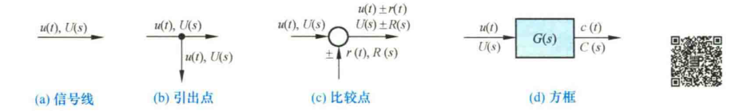
  <div style="font-style: italic; font-size: 0.92em; color: #666; margin-top: 0.35em;">图 2-21　结构图的基本组成单元</div>
</div>

绘制系统结构图时，首先考虑负载效应，分别列写系统各元部件的微分方程或传递函数，并将它们用方框表示；然后根据各元部件的信号流向，用信号线依次连接各方框。结构图实质上是系统原理图与数学方程两者的结合，既补充了原理图所缺少的定量描述，又避免了纯数学的抽象运算。从结构图可以方便地求得系统传递函数，所以结构图也是控制系统的一种数学模型。

结构图中的方框与实际元部件并非一一对应。一个实际元部件可以用一个或几个方框表示；一个方框也可代表几个元部件、一个子系统或一个复杂系统。

**例 2-10**　图 2-22 是一个电压测量装置，也是一个反馈控制系统。$e_1$ 是待测量电压，$e_2$ 是指示的电压测量值。如果 $e_2$ 不同于 $e_1$，就产生误差电压 $e=e_1-e_2$，经调制、放大后驱动两相伺服电动机，并带动测量指针移动，直至 $e_2=e_1$。试绘制该系统的结构图。

<div align="center">
  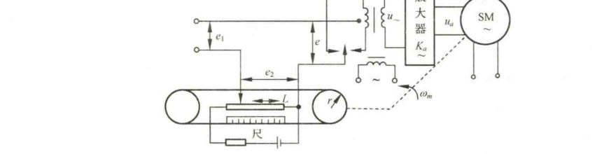
  <div style="font-style: italic; font-size: 0.92em; color: #666; margin-top: 0.35em;">图 2-22　电压测量装置原理图</div>
</div>

**解**　系统由比较电路、机械调制器、放大器、两相伺服电动机及指针机构组成。考虑负载效应，分别列写各元部件方程：

$$
E(s)=E_1(s)-E_2(s),\qquad U_m(s)=E(s),\qquad U_a(s)=K_aE(s),
$$

$$
M_m=-C_a\Omega_m(s)+M_s,\qquad M_s=C_mU_a(s),
$$

$$
M_m=J_ms^2\Theta_m(s)+f_ms\Theta_m(s),qquad
L(s)=r\Theta_m(s),\qquad E_2(s)=K_1L(s).
$$

按照各元部件的信号流向连接方框，得到图 2-23（h）；若两相伺服电动机直接用式（2-51）表示，则可简化为图 2-23（i）。

<div align="center">
  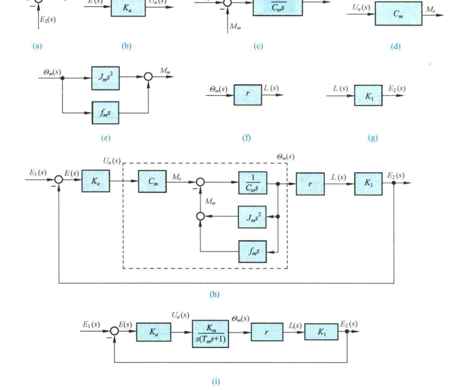
  <div style="font-style: italic; font-size: 0.92em; color: #666; margin-top: 0.35em;">图 2-23　电压测量装置系统结构图</div>
</div>

### 2. 结构图的等效变换和简化

由控制系统结构图通过等效变换可以方便地求取闭环系统传递函数或系统输出响应。复杂结构图中方框间的基本连接方式只有串联、并联和反馈三种。简化时可移动引出点或比较点、交换比较点，并进行方框运算。变换前后必须保持变量关系等效，即前向通路中传递函数的乘积和回路中传递函数的乘积均保持不变。

#### （1）串联方框的简化

<div align="center">
  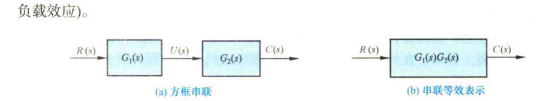
  <div style="font-style: italic; font-size: 0.92em; color: #666; margin-top: 0.35em;">图 2-24　方框串联连接及其简化</div>
</div>

两个方框串联时，

$$
C(s)=G_1(s)G_2(s)R(s)=G(s)R(s), \tag{2-71}
$$

故等效传递函数为 $G(s)=G_1(s)G_2(s)$。这一结论可推广到 $n$ 个串联方框。

#### （2）并联方框的简化

<div align="center">
  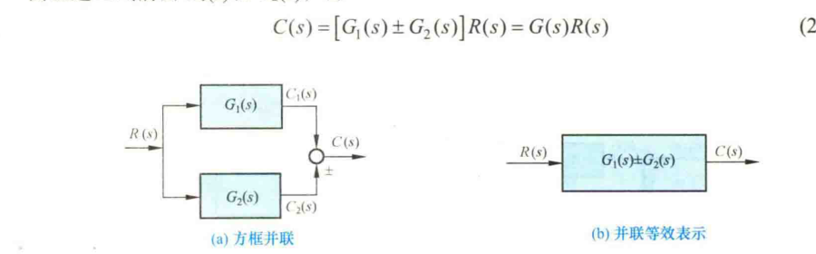
  <div style="font-style: italic; font-size: 0.92em; color: #666; margin-top: 0.35em;">图 2-25　方框并联连接及其简化</div>
</div>

两个方框有相同输入，而总输出是各输出的代数和时，

$$
C(s)=[G_1(s)\pm G_2(s)]R(s)=G(s)R(s), \tag{2-72}
$$

故并联等效传递函数为 $G(s)=G_1(s)\pm G_2(s)$。

#### （3）反馈连接方框的简化

若传递函数为 $G(s)$ 和 $H(s)$ 的两个方框按图 2-26（a）连接，则称为反馈连接。由

$$
C(s)=G(s)E(s),\qquad B(s)=H(s)C(s),\qquad E(s)=R(s)\pm B(s),
$$

消去中间变量，得

$$
C(s)=\frac{G(s)}{1\mp G(s)H(s)}R(s)=\Phi(s)R(s), \tag{2-73}
$$

其中

$$
\Phi(s)=\frac{G(s)}{1\mp G(s)H(s)}. \tag{2-74}
$$

负号对应正反馈，正号对应负反馈。

<div align="center">
  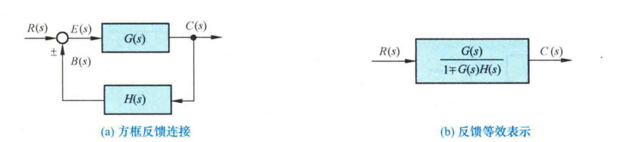
  <div style="font-style: italic; font-size: 0.92em; color: #666; margin-top: 0.35em;">图 2-26　方框的反馈连接及其简化</div>
</div>

#### （4）比较点和引出点的移动

移动比较点或引出点时，必须保持移动前后信号等效；比较点和引出点一般不宜交换。“−”号可以沿信号线越过方框移动，但不能越过比较点和引出点。表 2-1 汇集了结构图等效变换的基本规则。

<div align="center">
  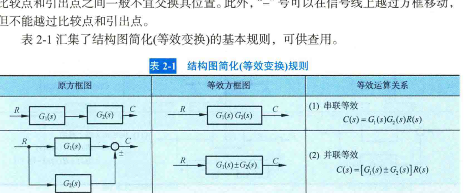
</div>

<div align="center">
  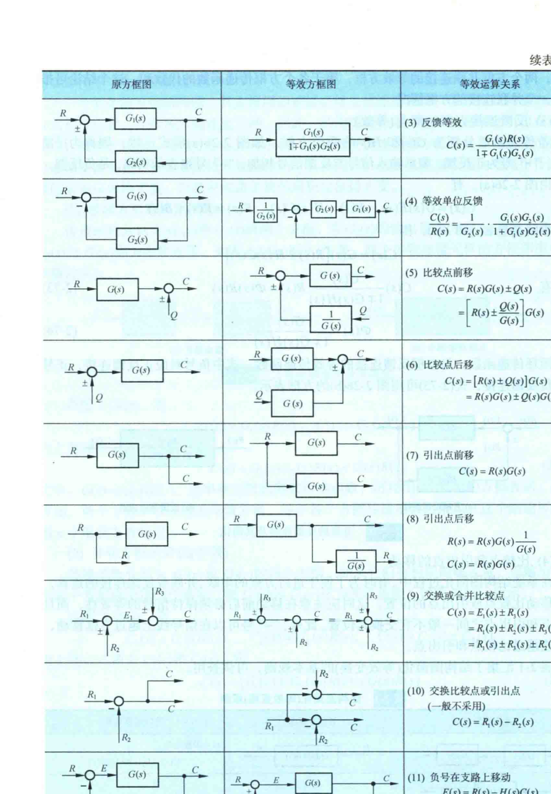
  <div style="font-style: italic; font-size: 0.92em; color: #666; margin-top: 0.35em;">表 2-1　结构图简化（等效变换）规则</div>
</div>

**例 2-11**　试简化图 2-27 系统结构图，并求系统传递函数 $C(s)/R(s)$。

<div align="center">
  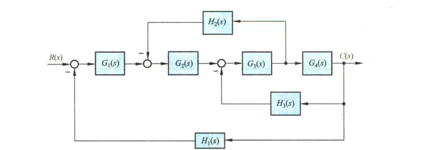
  <div style="font-style: italic; font-size: 0.92em; color: #666; margin-top: 0.35em;">图 2-27　例 2-11 系统结构图</div>
</div>

**解**　先将 $G_3(s)$ 与 $G_4(s)$ 之间的引出点后移到 $G_4(s)$ 输出端；再依次简化内反馈回路，过程如图 2-28 所示。最终得到

$$
\frac{C(s)}{R(s)}=
\frac{G_1G_2G_3G_4}
{1+G_2G_3H_2+G_3G_4H_3+G_1G_2G_3G_4H_1}.
$$

<div align="center">
  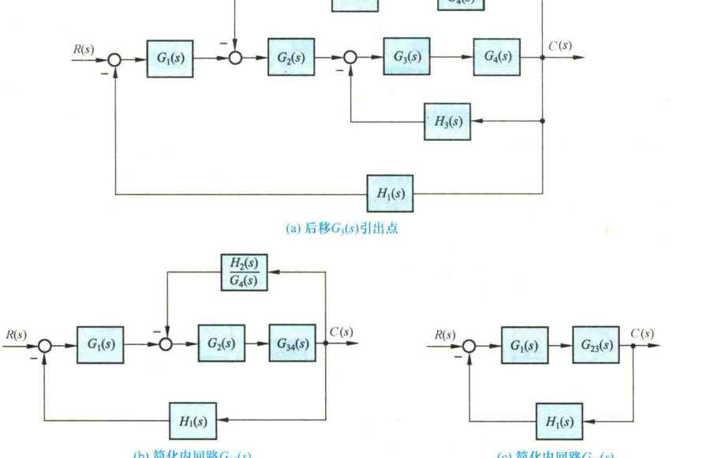
  <div style="font-style: italic; font-size: 0.92em; color: #666; margin-top: 0.35em;">图 2-28　例 2-11 系统结构图简化</div>
</div>

进行等效变换时，必须检查变换前后信号等效。例如，引出点越过 $G_4(s)$ 后，应在相应支路中补入 $1/G_4(s)$；比较点越过 $G_2(s)$ 后，则需在新支路中补入 $G_2(s)$，以保持原输出不变。

**例 2-12**　试简化图 2-29 系统结构图，并求传递函数 $C(s)/R(s)$。

<div align="center">
  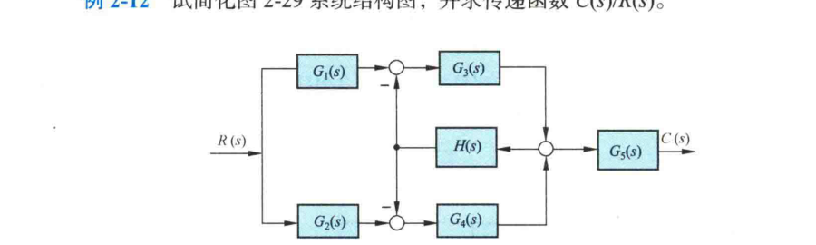
  <div style="font-style: italic; font-size: 0.92em; color: #666; margin-top: 0.35em;">图 2-29　例 2-12 系统结构图</div>
</div>

**解**　先将两个比较点后移，再将 $H(s)$ 后的引出点前移，改画并合并比较点，过程如图 2-30 所示。由串联、并联和反馈规则即可求得系统传递函数。

<div align="center">
  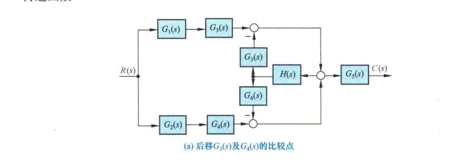
</div>

<div align="center">
  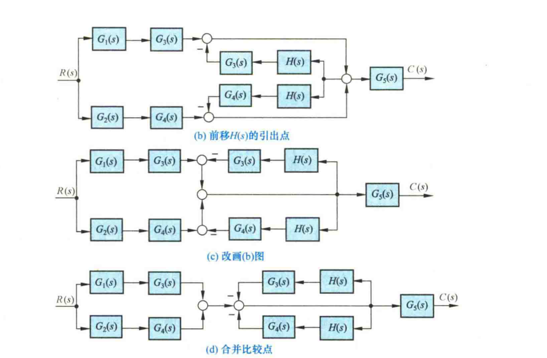
  <div style="font-style: italic; font-size: 0.92em; color: #666; margin-top: 0.35em;">图 2-30　例 2-12 系统结构图简化</div>
</div>

### 3. 信号流图的组成及性质

信号流图起源于梅森利用图示法描述线性代数方程组的方法。它由节点和支路组成：节点代表变量，以小圆圈表示；支路是连接节点的定向线段，用支路增益表示两个变量的因果关系，因而支路相当于乘法器。

<div align="center">
  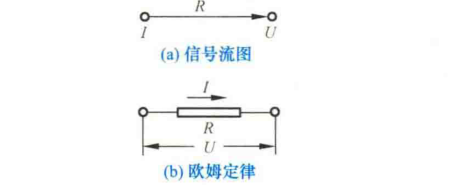
  <div style="font-style: italic; font-size: 0.92em; color: #666; margin-top: 0.35em;">图 2-31　欧姆定律与信号流图</div>
</div>

<div align="center">
  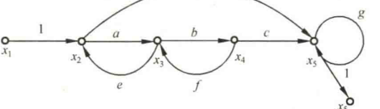
  <div style="font-style: italic; font-size: 0.92em; color: #666; margin-top: 0.35em;">图 2-32　典型的信号流图</div>
</div>

信号流图的基本性质如下：

1. 节点标志系统变量。节点变量等于所有流向该节点的信号的代数和，从同一节点流向各支路的信号均用该节点变量表示。
2. 支路相当于乘法器，信号流经支路时被乘以支路增益。
3. 信号在支路上只能沿箭头单向传递，体现前因后果的因果关系。
4. 对于给定系统，节点变量的设置可以不同，因此信号流图不是唯一的。

常用术语包括：

- **源节点（输入节点）**：只有输出支路而无输入支路。
- **阱节点（输出节点）**：只有输入支路而无输出支路。
- **混合节点**：既有输入支路又有输出支路。
- **前向通路**：信号从输入节点到输出节点传递时，每个节点只通过一次的通路；支路增益的乘积称为前向通路总增益 $p_k$。
- **回路**：起点和终点相同，且每个节点通过不多于一次的闭合通路；其支路增益乘积称为回路增益 $L_a$。
- **不接触回路**：彼此没有公共节点的回路。

### 4. 信号流图的绘制

信号流图可以根据微分方程绘制，也可以从系统结构图按照对应关系得到。

由微分方程绘制时，先通过拉氏变换把方程变成 $s$ 的代数方程；再为每个变量指定节点，按因果关系自左向右排列，并用标明增益的支路连接。

由结构图绘制时，在信号线上用小圆圈标出信号节点，用标有传递函数的定向线段代替方框。图 2-33 给出了转换过程。

<div align="center">
  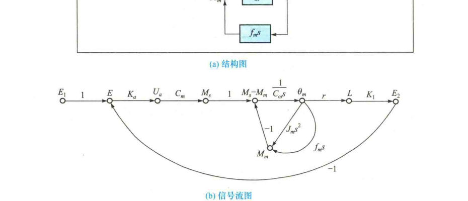
  <div style="font-style: italic; font-size: 0.92em; color: #666; margin-top: 0.35em;">图 2-33　由系统结构图绘制信号流图的过程</div>
</div>

绘制时应尽量精简节点数。支路增益为 1 的相邻节点一般可合并，但源节点和阱节点不能合并。比较点前无引出点时，只需在比较点后设置一个节点；若比较点前有引出点，则引出点和比较点处都要设置节点，如图 2-34 所示。

<div align="center">
  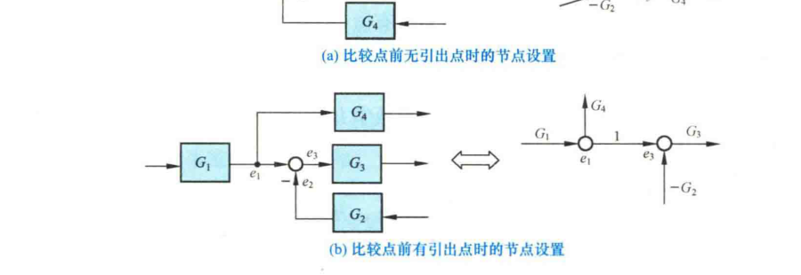
  <div style="font-style: italic; font-size: 0.92em; color: #666; margin-top: 0.35em;">图 2-34　比较点与节点对应关系</div>
</div>

**例 2-13**　试绘制图 2-35 所示系统结构图对应的信号流图。

<div align="center">
  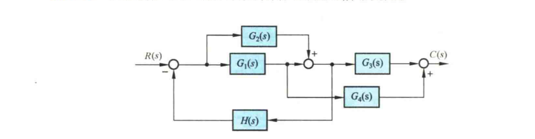
  <div style="font-style: italic; font-size: 0.92em; color: #666; margin-top: 0.35em;">图 2-35　例 2-13 系统的结构图</div>
</div>

**解**　在结构图信号线上用小圆圈标注各变量对应的节点，将各节点按原顺序自左向右排列，再用具有相应增益的支路代替各方框，得到图 2-36（b）的信号流图。

<div align="center">
  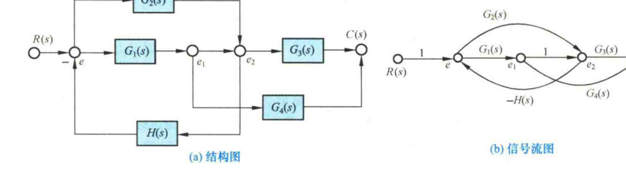
  <div style="font-style: italic; font-size: 0.92em; color: #666; margin-top: 0.35em;">图 2-36　例 2-13 系统的结构图与信号流图</div>
</div>

### 5. 梅森增益公式

从复杂信号流图经过简化可以求出系统传递函数，但过程较为繁琐。控制工程中常用梅森（Mason）增益公式直接求取从源节点到阱节点的传递函数，而不必简化信号流图。由于结构图与信号流图相对应，梅森公式也可直接用于结构图。

图 2-37 的典型信号流图对应一组线性代数方程。按克莱姆法则求解时，其系数行列式可整理为

$$
\Delta=1-dh-gc-fb+fbdh, \tag{2-75}
$$

相应分子行列式为

$$
\Delta_4=abcdU_i+eU_i(1-gc-bf). \tag{2-76}
$$

故

$$
\frac{U_o}{U_i}=\frac{abcd+e(1-gc-bf)}{1-dh-gc-fb+fbdh}. \tag{2-77}
$$

<div align="center">
  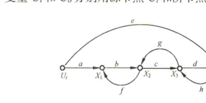
  <div style="font-style: italic; font-size: 0.92em; color: #666; margin-top: 0.35em;">图 2-37　典型信号流图</div>
</div>

传递函数的分母可用信号流图术语写为

$$
\Delta=1-\sum L_a+\sum L_bL_c. \tag{2-78}
$$

分子则由各前向通路总增益及与其不接触的回路决定：

$$
\Delta_k=1-\sum L_i, \tag{2-79}
$$

$$
\sum_{k=1}^{n}p_k\Delta_k. \tag{2-80}
$$

对于图 2-37，式（2-77）可写为

$$
\frac{U_o}{U_i}=\frac{p_1\Delta_1+p_2\Delta_2}{\Delta}. \tag{2-81}
$$

推广到任意复杂信号流图，梅森增益公式为

$$
P=\frac{1}{\Delta}\sum_{k=1}^{n}p_k\Delta_k, \tag{2-82}
$$

其中

$$
\Delta=1-\sum L_a+\sum L_bL_c-\sum L_dL_eL_f+\cdots.
$$

$P$ 是从源节点到阱节点的总增益，$p_k$ 是第 $k$ 条前向通路总增益，$\Delta$ 是流图特征式，$\Delta_k$ 是与第 $k$ 条前向通路对应的余因子式，即从 $\Delta$ 中去掉所有与该前向通路接触的回路增益项后所得的余项式。

**例 2-14**　试用梅森增益公式求例 2-11 系统的传递函数 $C(s)/R(s)$。

<div align="center">
  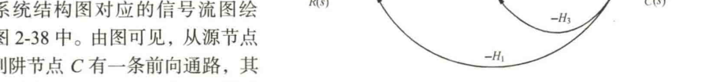
  <div style="font-style: italic; font-size: 0.92em; color: #666; margin-top: 0.35em;">图 2-38　与图 2-27 对应的系统信号流图</div>
</div>

**解**　从源节点 $R$ 到阱节点 $C$ 有一条前向通路，$p_1=G_1G_2G_3G_4$；三个单独回路分别为 $-G_2G_3H_2$、$-G_3G_4H_3$、$-G_1G_2G_3G_4H_1$；没有不接触回路，且前向通路与所有回路接触，故 $\Delta_1=1$。由梅森公式得到的结果与例 2-11 相同。

**例 2-15**　求图 2-39 所示系统的传递函数 $C(s)/R(s)$。

<div align="center">
  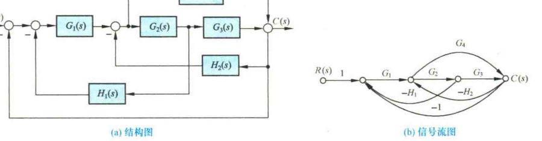
  <div style="font-style: italic; font-size: 0.92em; color: #666; margin-top: 0.35em;">图 2-39　例 2-15 系统结构图和信号流图</div>
</div>

**解**　由源节点 $R$ 到阱节点 $C$ 有两条前向通路 $p_1=G_1G_2G_3$、$p_2=G_1G_4$；有五个单独回路，没有不接触回路，所有回路均与两条前向通路接触，因此 $\Delta_1=\Delta_2=1$。由梅森公式得

$$
\frac{C(s)}{R(s)}=
\frac{G_1G_2G_3+G_1G_4}
{1+G_1G_2H_1+G_2G_3H_2+G_1G_2G_3+G_4H_2+G_1G_4}.
$$

**例 2-16**　试求图 2-40 信号流图的传递函数 $X_4/X_1$ 及 $X_2/X_1$。

<div align="center">
  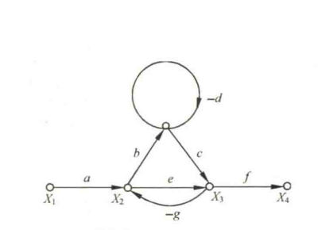
  <div style="font-style: italic; font-size: 0.92em; color: #666; margin-top: 0.35em;">图 2-40　例 2-16 信号流图</div>
</div>

**解**　流图有三个单独回路和两个不接触回路，特征式为

$$
\Delta=1+d+eg+bcg+deg.
$$

从 $X_1$ 到 $X_4$ 有两条前向通路，故

$$
\frac{X_4}{X_1}=\frac{aef(1+d)+abcf}{1+d+eg+bcg+deg}.
$$

从 $X_1$ 到 $X_2$ 只有一条前向通路，故

$$
\frac{X_2}{X_1}=\frac{a(1+d)}{1+d+eg+bcg+deg}.
$$

**例 2-17**　试求图 2-41 信号流图中的传递函数 $C(s)/R(s)$。

<div align="center">
  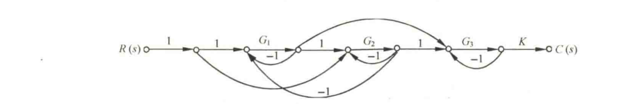
  <div style="font-style: italic; font-size: 0.92em; color: #666; margin-top: 0.35em;">图 2-41　例 2-17 的信号流图</div>
</div>

**解**　流图中有四个单独回路、四组两个互不接触的回路以及一组三个互不接触的回路。求得特征式

$$
\Delta=1+G_1+G_2+G_3+2G_1G_2+G_1G_3+G_2G_3+2G_1G_2G_3.
$$

从 $R$ 到 $C$ 有四条前向通路，代入梅森公式得到

$$
\frac{C(s)}{R(s)}=
\frac{G_1G_2G_3K_1(1+G_1)+G_1G_2K_1(1+G_2)}{\Delta}.
$$

### 6. 闭环系统的传递函数

反馈控制系统的传递函数可由元部件运动方程求得，但由结构图或信号流图求取更为方便。图 2-42 中，$R(s)$ 是有用输入作用，$N(s)$ 是扰动作用，$C(s)$ 是输出信号。除输入和扰动到输出的传递函数外，分析设计中还常使用它们到误差信号 $E(s)$ 的误差传递函数。

<div align="center">
  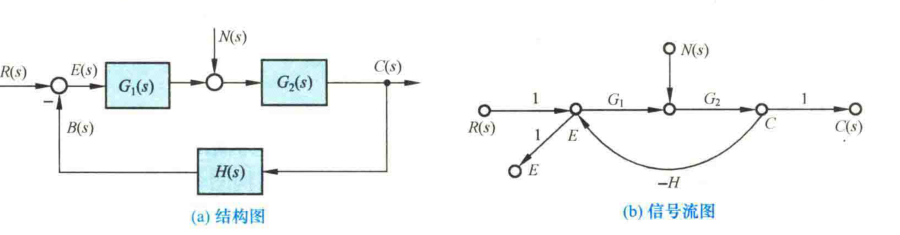
  <div style="font-style: italic; font-size: 0.92em; color: #666; margin-top: 0.35em;">图 2-42　反馈控制系统的典型结构图和信号流图</div>
</div>

#### （1）输入信号作用下的闭环传递函数

令 $N(s)=0$，得到

$$
\Phi(s)=\frac{C(s)}{R(s)}=
\frac{G_1(s)G_2(s)}{1+G_1(s)G_2(s)H(s)}. \tag{2-83}
$$

因此

$$
C(s)=\Phi(s)R(s)=
\frac{G_1(s)G_2(s)}{1+G_1(s)G_2(s)H(s)}R(s). \tag{2-84}
$$

#### （2）扰动作用下的闭环传递函数

令 $R(s)=0$，得到

$$
\Phi_N(s)=\frac{C(s)}{N(s)}=
\frac{G_2(s)}{1+G_1(s)G_2(s)H(s)}. \tag{2-85}
$$

<div align="center">
  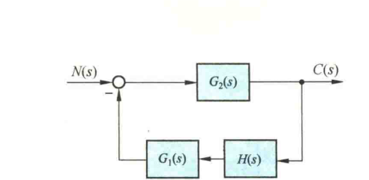
  <div style="font-style: italic; font-size: 0.92em; color: #666; margin-top: 0.35em;">图 2-43　在扰动作用下（$R(s)=0$）的系统结构图</div>
</div>

式（2-85）也可由图 2-42（a）的系统结构图改画为图 2-43 后求得。因此，系统在扰动作用下的输出为

$$
C(s)=\Phi_N(s)N(s)=
\frac{G_2(s)}{1+G_1(s)G_2(s)H(s)}N(s).
$$

当输入信号 $R(s)$ 和扰动作用 $N(s)$ 同时作用时，应用叠加原理，系统输出为

$$
\begin{aligned}
\sum C(s)
&=\Phi(s)R(s)+\Phi_N(s)N(s)\\
&=\frac{G_1(s)G_2(s)R(s)+G_2(s)N(s)}
{1+G_1(s)G_2(s)H(s)}.
\end{aligned}
$$

如果满足 $|G_1(s)G_2(s)H(s)|\gg1$ 和 $|G_1(s)H(s)|\gg1$，则可简化为

$$
\sum C(s)\approx\frac{1}{H(s)}R(s). \tag{2-86}
$$

这表明在一定条件下，系统输出主要取决于反馈通路传递函数和输入信号，既与前向通路传递函数无关，也不受扰动影响。单位反馈时，$C(s)\approx R(s)$。

#### （3）闭环系统的误差传递函数

以误差信号 $E(s)$ 为输出量时，

$$
\Phi_e(s)=\frac{E(s)}{R(s)}=
\frac{1}{1+G_1(s)G_2(s)H(s)}, \tag{2-87}
$$

$$
\Phi_{eN}(s)=\frac{E(s)}{N(s)}=
-\frac{G_2(s)H(s)}{1+G_1(s)G_2(s)H(s)}. \tag{2-88}
$$

对于图 2-42 的典型反馈系统，各种闭环传递函数的分母形式相同，因为它们都是同一个信号流图的特征式 $\Delta=1+G_1(s)G_2(s)H(s)$。其中 $G_1(s)G_2(s)H(s)$ 称为系统的开环传递函数，它等效为主反馈断开时，从输入信号 $R(s)$ 到反馈信号 $B(s)$ 之间的传递函数。对于线性系统，可以分别求各外作用下的输出或误差后再叠加，但不能把各种闭环传递函数本身直接叠加。

## 2-4　控制系统建模实例

**例 2-18**　电力牵引电机控制。

大部分现代列车和调度机车都采用电力牵引电机。牵引电机牵引轨道车辆系统的原理框图如图 2-44（a）所示，其中电枢控制电机采用大功率直流电机，其参数如表 2-2 所示；功率放大器采用差分放大器。要求建立控制系统的数学模型，计算系统的传递函数 $\Omega(s)/\Omega_d(s)$，并适当选择差分放大器的电阻 $R_1$、$R_2$、$R_3$、$R_4$。

<div align="center">
  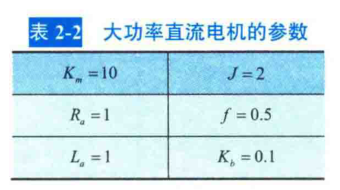
  <div style="font-style: italic; font-size: 0.92em; color: #666; margin-top: 0.35em;">表 2-2　直流电动机参数</div>
</div>

**解**　选择测速发电机，将与电动机转速成比例的电压作为反馈信号，组成图 2-44（b）所示的闭环控制系统。

<div align="center">
  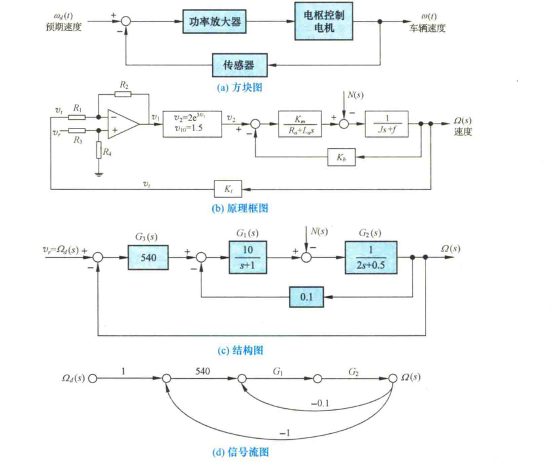
  <div style="font-style: italic; font-size: 0.92em; color: #666; margin-top: 0.35em;">图 2-44　电力牵引电机的速度控制</div>
</div>

功率放大器的非线性输入—输出关系近似为

$$
v_2=2e^{3v_1}=g(v_1).
$$

取正常工作点 $v_{10}=1.5\text{ V}$，在该工作点附近用小偏差线性化方法得

$$
\Delta v_2=\left.\frac{\mathrm{d}g}{\mathrm{d}v_1}\right|_{v_{10}}\Delta v_1
=6e^{3v_{10}}\Delta v_1\approx540\Delta v_1.
$$

以小增量为新的变量，省去“$\Delta$”符号，经拉氏变换后得

$$
V_2(s)=540V_1(s).
$$

对于差分放大器，有

$$
v_1=
\frac{1+R_2/R_1}{1+R_3/R_4}v_r-
\frac{R_2}{R_1}v_t.
$$

通常，希望输入控制电压 $v_r$ 在数值上与预期速度 $\omega_d(t)$ 相等。注意到车辆稳定运行时有 $v_t=K_t\omega_d$，于是

$$
v_1=
\frac{1+R_2/R_1}{1+R_3/R_4}v_r-
\frac{R_2}{R_1}K_tv_r.
$$

其中 $v_1=0$。当 $K_t=0.1$ 时，选择

$$
\frac{1+R_2/R_1}{1+R_3/R_4}
=\frac{R_2}{R_1}K_t=1,
$$

求出

$$
\frac{R_2}{R_1}=10,\qquad
\frac{R_3}{R_4}=10.
$$

系统结构图如图 2-44（c）所示。利用图 2-44（d）给出的信号流图和梅森增益公式，可得系统闭环传递函数

$$
\frac{\Omega(s)}{\Omega_i(s)}=
\frac{540G_1(s)G_2(s)}{1+0.1G_1(s)G_2(s)+540G_1(s)G_2(s)},
$$

式中

$$
G_1(s)=\frac{10}{s+1},\qquad
G_2(s)=\frac{1}{2s+0.5}.
$$

代入并整理，得到

$$
\frac{\Omega(s)}{\Omega_i(s)}=
\frac{2700}{s^2+1.25s+2700.75}.
$$

**例 2-19**　磁盘驱动读取系统（续）。

在图 1-17 的基础上，要求选定执行机构、传感器和控制器，然后建立控制对象和传感器等元部件的数学模型。

<div align="center">
  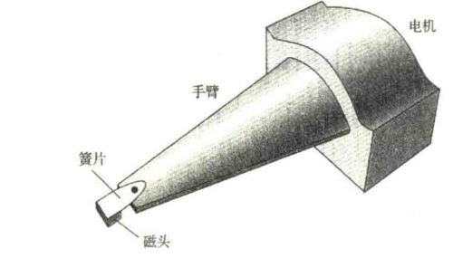
  <div style="font-style: italic; font-size: 0.92em; color: #666; margin-top: 0.35em;">图 2-45　磁头安装示意图</div>
</div>

**解**　磁盘驱动读取系统采用永磁直流电机驱动图 1-16 所示读取手臂的转动。磁头安装在一个与手臂相连的簧片上，磁头读取磁盘上各点处不同的磁通量，并将信号提供给放大器。弹性金属制成的簧片保证磁头以小于 $100\text{ nm}$ 的间隙悬浮于磁盘之上，如图 2-45 所示。

磁盘驱动读取系统框图如图 2-46（a）所示，其中偏差信号是在磁头读取磁盘上预先录制索引磁道时产生的。假定磁头足够精确，取传感器环节的传递函数 $H(s)=1$；放大器增益为 $K_a$；作为足够精确的近似，采用电枢控制直流电机模型来对永磁直流电机建模。由式（2-5），在空载下，令 $C_m=K_m$、$f_m=f$、$J_m=J$、$R_a=R$、$L_a=L$，可得永磁直流电机模型。

<div align="center">
  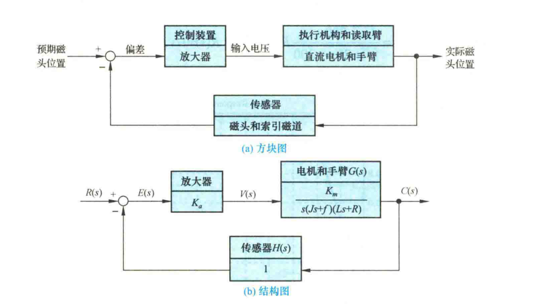
  <div style="font-style: italic; font-size: 0.92em; color: #666; margin-top: 0.35em;">图 2-46　磁盘驱动读取系统</div>
</div>

电动机从输入电压到输出角位移的传递函数为

$$
G(s)=\frac{K_m}{s(Js+f)(Ls+R)}.
$$

取表 2-3 所列的典型参数，得到

<div align="center">
  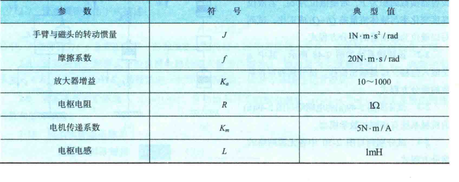
  <div style="font-style: italic; font-size: 0.92em; color: #666; margin-top: 0.35em;">表 2-3　磁盘驱动器直流电动机的典型参数</div>
</div>

$$
G(s)=\frac{5000}{s(s+20)(s+1000)}. \tag{2-89}
$$

也可以将传递函数写成时间常数形式

$$
G(s)=\frac{K_m/(fR)}{s(T_1s+1)(T_2s+1)}, \tag{2-90}
$$

其中

$$
T_1=\frac{J}{f}=50\text{ ms},\qquad
T_2=\frac{L}{R}=1\text{ ms}.
$$

由于电气时间常数 $T_2$ 远小于机械时间常数 $T_1$，可忽略 $T_2$，于是

$$
G(s)\approx\frac{K_m/(fR)}{s(T_1s+1)}
=\frac{0.25}{s(0.05s+1)}
=\frac{5}{s(s+20)}.
$$

系统的闭环传递函数为

$$
\frac{C(s)}{R(s)}=
\frac{K_aG(s)}{1+K_aG(s)}=
\frac{5K_a}{s^2+20s+5K_a}. \tag{2-91}
$$

若取 $K_a=40$，则

$$
\frac{C(s)}{R(s)}=\frac{200}{s^2+20s+200}.
$$

利用 MATLAB 可求得系统的单位阶跃响应，如图 2-47 所示。

```matlab
G = zpk([], [0 -20 -1000], 5000);
Ka = 40;
sys = feedback(Ka*G, 1);
t = 0:0.01:1;
step(sys, t);
grid;
axis([0, 1, 0, 1.2]);
```

<div align="center">
  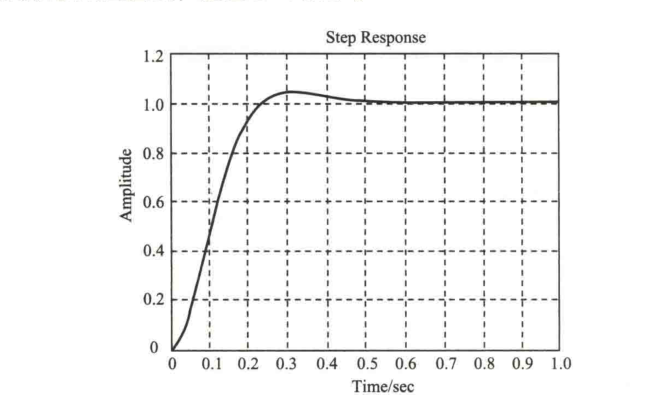
  <div style="font-style: italic; font-size: 0.92em; color: #666; margin-top: 0.35em;">图 2-47　磁盘驱动读取系统的阶跃响应（MATLAB）</div>
</div>
