# 第六章 线性系统的校正方法

根据被控对象及给定的技术指标要求设计自动控制系统，需要进行大量的分析计算。设计中需要考虑的问题是多方面的。既要保证所设计的系统有良好的性能，满足给定技术指标的要求，又要便于加工，经济性好，可靠性高。在设计过程中，既要有理论指导，也要重视实践经验，往往还要配合许多局部和整体的实验。

本章主要研究线性定常控制系统的校正方法。所谓校正，就是在系统中加入一些其参数可以根据需要而改变的机构或装置，使系统整个特性发生变化，从而满足给定的各项性能指标。在这一章中，将主要介绍目前工程实践中常用的三种校正方法，即串联校正、前馈校正和复合校正。

## 6-1 系统的设计与校正问题

当被控对象给定后，按照被控对象的工作条件、被控信号应具有的最大速度和加速度要求等，可以初步选定执行元件的形式、特性和参数。然后，根据测量精度、抗扰能力、被测信号的物理性质、测量过程中的惯性及非线性度等因素，选择合适的测量变送元件。在此基础上，设计增益可调的前置放大器与功率放大器。这些初步选定的元件以及被控对象，构成系统中的不可变部分。设计控制系统的目的，是将构成控制器的各元件与被控对象适当组合起来，使之满足表征控制精度、阻尼程度和响应速度的性能指标要求。如果通过调整放大器增益后仍然不能全面满足设计要求的性能指标，就需要在系统中增加一些参数及特性可按需要改变的校正装置，使系统性能全面满足设计要求。这就是控制系统设计中的校正问题。

### 1. 性能指标

进行控制系统的校正设计，除了应已知系统不可变部分的特性与参数外，还需要已知对系统提出的全部性能指标。性能指标通常是由使用单位或被控对象的设计制造单位提出的。不同的控制系统对性能指标的要求应有不同的侧重。例如，调速系统对平稳性和稳态精度要求较高，而随动系统则侧重于快速性要求。

性能指标的提出，应符合实际系统的需要与可能。一般来说，性能指标不应当比完成给定任务所需要的指标更高。例如，若系统的主要要求是具备较高的稳态工作精度，则不必对系统的动态性能提出不必要的过高要求。实际系统能具备的各种性能指标，会受到组成元部件的固有误差、非线性特性、能源的功率以及机械强度等各种实际物理条件的制约。如果要求控制系统应具备较快的响应速度，则应考虑系统能够提供的最大速度和加速度，以及系统容许的强度极限。除了一般性指标外，具体系统往往还有一些特殊要求，如低速平稳性、对变载荷的适应性等，也必须在系统设计时分别加以考虑。

在控制系统设计中，采用的设计方法一般依据性能指标的形式而定。如果性能指标以单位阶跃响应的峰值时间、调节时间、超调量、阻尼比、稳态误差等时域特征量给出时，一般采用时域法校正；如果性能指标以系统的相角裕度、幅值裕度、谐振峰值、闭环带宽、静态误差系数等频域特征量给出时，一般采用频率法校正。目前，工程技术界多习惯采用频率法，故通常通过近似公式进行两种指标的互换。由本书第五章知，有如下关系成立。

#### （1）二阶系统频域指标与时域指标的关系

谐振峰值

$$
M_r=\frac{1}{2\zeta\sqrt{1-\zeta^2}},\qquad \zeta<0.707
\tag{6-1}
$$

谐振频率

$$
\omega_r=\omega_n\sqrt{1-2\zeta^2},\qquad \zeta<0.707
\tag{6-2}
$$

带宽频率

$$
\omega_b=\omega_n\sqrt{1-2\zeta^2+\sqrt{2-4\zeta^2+4\zeta^4}}
\tag{6-3}
$$

截止频率

$$
\omega_c=\omega_n\sqrt{\sqrt{1+4\zeta^4}-2\zeta^2}
\tag{6-4}
$$

相角裕度

$$
\gamma=\arctan\frac{2\zeta}{\sqrt{\sqrt{1+4\zeta^4}-2\zeta^2}}
\tag{6-5}
$$

超调量

$$
\sigma\%=e^{-\pi\zeta/\sqrt{1-\zeta^2}}\times100\%
\tag{6-6}
$$

调节时间

$$
t_s=\frac{3.5}{\zeta\omega_n}\quad(\Delta=5\%)
\qquad\text{或}\qquad
t_s=\frac{4.4}{\zeta\omega_n}\quad(\Delta=2\%)
\tag{6-7}
$$

#### （2）高阶系统频域指标与时域指标的关系

谐振峰值

$$
M_r\approx\frac{1}{|\sin\gamma|}
\tag{6-8}
$$

超调量

$$
\sigma=0.16+0.4(M_r-1),\qquad 1<M_r<1.8
\tag{6-9}
$$

调节时间

$$
t_s=\frac{K_0\pi}{\omega_c}\quad(\Delta=5\%)
\tag{6-10}
$$

其中

$$
K_0=2+1.5(M_r-1)+2.5(M_r-1)^2,qquad 1<M_r<1.8.
$$

### 2. 系统带宽的确定

性能指标中的带宽频率 $\omega_b$ 的要求，是一项重要的技术指标。无论采用哪种校正方式，都要求校正后的系统既能以所需精度跟踪输入信号，又能抑制噪声扰动信号。在控制系统实际运行中，输入信号一般是低频信号，而噪声信号则一般是高频信号。因此，合理选择控制系统的带宽，在系统设计中是一个很重要的问题。

显然，为了使系统能够准确复现输入信号，要求系统具有较大的带宽；然而从抑制噪声角度来看，又不希望系统的带宽过大。此外，为了使系统具有较高的稳定裕度，希望系统开环对数幅频特性在截止频率 $\omega_c$ 处的斜率为 $-20\ \mathrm{dB/dec}$，但从要求系统具有较强的从噪声中辨识信号的能力来考虑，却又希望 $\omega_c$ 处的斜率小于 $-40\ \mathrm{dB/dec}$。由于不同的开环系统截止频率 $\omega_c$ 对应于不同的闭环系统带宽频率 $\omega_b$，因此在系统设计时，必须选择切合实际的系统带宽。

通常，一个设计良好的实际运行系统，其相角裕度具有 $45^\circ$ 左右的数值。过低于此值，系统的动态性能较差，且对参数变化的适应能力较弱；过高于此值，意味着对整个系统及其组成部件要求较高，因此造成实现上的困难，或因此不满足经济性要求，同时由于稳定程度过好，造成系统动态过程缓慢。要实现 $45^\circ$ 左右的相角裕度要求，开环对数幅频特性在中频区的斜率应为 $-20\ \mathrm{dB/dec}$，同时要求中频区占据一定的频率范围，以保证在系统参数变化时，相角裕度变化不大。过此中频区后，要求系统幅频特性迅速衰减，以削弱噪声对系统的影响。这是选择系统带宽应该考虑的一个方面。另一方面，进入系统输入端的信号，既有输入信号 $r(t)$，又有噪声信号 $n(t)$，如果输入信号的带宽为 $0\sim\omega_M$，噪声信号集中起作用的频带为 $\omega_n\sim\infty$，则控制系统的带宽频率通常取为

$$
\omega_b=(5\sim10)\omega_M
\tag{6-11}
$$

且使 $\omega_c\sim\omega_b$ 处于 $\omega_M\sim\omega_n$ 范围之外，如图 6-1 所示。

<div align="center">
  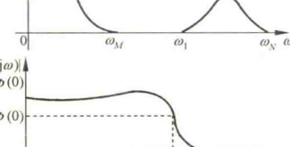
  <div style="font-style: italic; font-size: 0.92em; color: #666; margin-top: 0.35em;">图 6-1 系统带宽的确定</div>
</div>

### 3. 校正方式

按照校正装置在系统中的连接方式，控制系统校正方式可分为串联校正、反馈校正、前馈校正和复合校正四种。

串联校正装置一般接在系统误差测量点之后和放大器之前，串接于系统前向通道之中；反馈校正装置接在系统局部反馈通路之中。串联校正与反馈校正连接方式如图 6-2 所示。

<div align="center">
  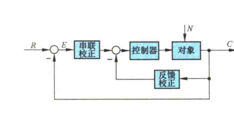
  <div style="font-style: italic; font-size: 0.92em; color: #666; margin-top: 0.35em;">图 6-2 串联校正与反馈校正系统方块图</div>
</div>

前馈校正又称顺馈校正，是在系统主反馈回路之外采用的校正方式。前馈校正装置接在系统给定值（或指令、参考输入信号）之后及主反馈作用点之前的前向通道上，如图 6-3（a）所示，这种校正装置的作用相当于对给定值信号进行整形或滤波后，再送入反馈系统，因此又称为前置滤波器；另一种前馈校正装置接在系统可测扰动作用点与误差测量点之间，对扰动信号进行直接或间接测量，并经变换后接入系统，形成一条附加的对扰动影响进行补偿的通道，如图 6-3（b）所示。前馈校正可以单独作用于开环控制系统，也可以作为反馈控制系统的附加校正而组成复合控制系统。

<div align="center">
  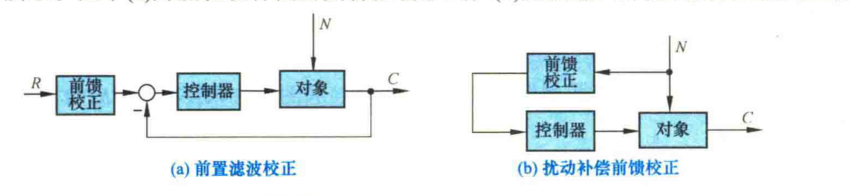
  <div style="font-style: italic; font-size: 0.92em; color: #666; margin-top: 0.35em;">图 6-3 前馈校正系统方块图</div>
</div>

复合校正方式是在反馈控制回路中，加入前馈校正通路，组成一个有机整体，如图 6-4 所示。图中（a）为按扰动补偿的复合控制形式，（b）为按输入补偿的复合控制形式。

<div align="center">
  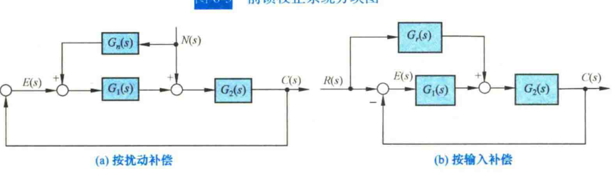
  <div style="font-style: italic; font-size: 0.92em; color: #666; margin-top: 0.35em;">图 6-4 复合校正系统结构图</div>
</div>

在控制系统设计中，常用的校正方式为串联校正、反馈校正和前馈校正。究竟选用哪种校正方式，取决于系统中的信号性质、技术实现的方便性、可供选用的元件、抗扰性要求、经济性要求、环境使用条件以及设计者的经验等因素。

一般来说，串联校正设计比反馈校正设计简单，也比较容易对信号进行各种必要形式的变换。在直流控制系统中，由于传递直流电压信号，适于采用串联校正；在交流载波控制系统中，如果采用串联校正，一般应接在解调器和滤波器之后，否则由于参数变化和载频漂移，校正装置的工作稳定性很差。串联校正装置又分无源和有源两类。无源串联校正装置通常由 RC 无源网络构成，结构简单，成本低廉，但会使信号在变换过程中产生幅值衰减，且其输入阻抗较低，输出阻抗又较高，因此常常需要附加放大器，以补偿其幅值衰减，并进行阻抗匹配。为了避免功率损耗，无源串联校正装置通常安置在前向通路中能量较低的部位上。有源串联校正装置由运算放大器和 RC 网络组成，其参数可以根据需要调整，因此在工业自动化设备中，经常采用由电动（或气动）单元构成的 PID 控制器（或称 PID 调节器），它由比例单元、微分单元和积分单元组合而成，可以实现各种要求的控制规律。

在实际控制系统中，还广泛采用反馈校正装置。一般来说，反馈校正所需元件数目比串联校正少。由于反馈信号通常由系统输出端或放大器输出级供给，信号是从高功率点传向低功率点，所以反馈校正一般无需附加放大器。此外，反馈校正尚可消除系统原有部分参数波动对系统性能的影响。在性能指标要求较高的控制系统设计中，常常兼用串联校正与前馈校正两种方式。

### 4. 基本控制规律

确定校正装置的具体形式时，应先了解校正装置所需提供的控制规律，以便选择相应的元件。包含校正装置在内的控制器，常常采用比例、微分、积分等基本控制规律，或者采用这些基本控制规律的某些组合，如比例—微分、比例—积分、比例—积分—微分等组合控制规律，以实现对被控对象的有效控制。

> **什么是校正装置？**
>
> 校正装置是为了改善控制系统的稳定性、稳态精度或动态响应而加入系统中的附加环节。它按照一定的控制规律对误差信号或其他可测信号进行变换，再将所得信号送入控制系统。校正装置可以采用 P、I、D、PI、PD、PID 控制器，也可以采用超前、滞后等校正网络；在物理上可由阻容网络、运算放大器等电路实现，也可由数字控制器中的算法实现。校正装置通常是控制器的一部分，而不是被控对象或执行元件。

#### （1）比例（P）控制规律

具有比例控制规律的控制器，称为 P 控制器，如图 6-5 所示。其中 $K_p$ 称为 P 控制器增益。

> **什么是具有比例控制规律的控制器？**
>
> 具有比例控制规律的控制器，是指其输出信号 $m(t)$ 始终与输入误差信号 $e(t)$ 成正比的控制器，其数学关系为 $m(t)=K_p e(t)$。其中，$K_p$ 是比例系数，也称控制器增益：误差越大，控制器输出的控制作用越强；误差方向改变时，控制作用的方向也随之改变。P 控制器只按当前误差进行控制，不考虑误差过去的累积情况和未来的变化趋势。

<div align="center">
  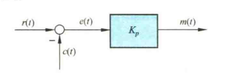
  <div style="font-style: italic; font-size: 0.92em; color: #666; margin-top: 0.35em;">图 6-5 P 控制器框图</div>
</div>

P 控制器实质上是一个具有可调增益的放大器。在信号变换过程中，P 控制器只改变信号的增益而不影响其相位。在串联校正中，加大控制器增益 $K_p$，可以提高系统的开环增益，减小系统稳态误差，从而提高系统的控制精度，但会降低系统的相对稳定性，甚至可能造成闭环系统不稳定。因此，在系统校正设计中，很少单独使用比例控制规律。

> **相关概念说明**
>
> 1. **信号的增益**：增益表示输出信号幅值与输入信号幅值之比。对于 P 控制器，$m(t)=K_p e(t)$，因此其增益就是 $K_p$。例如 $K_p=5$ 时，输入误差为 $1$ 个单位，控制器就输出 $5$ 个单位的控制信号。增大 $K_p$，就是增强控制器对误差的反应强度。
>
> 2. **信号的相位**：相位表示周期信号在时间上的超前或滞后程度。P 控制器的传递函数为常数 $G_c(s)=K_p$；当 $K_p>0$ 时，其相角恒为 $0^\circ$。因此，P 控制器只把信号的幅值放大或缩小，不会使输出信号相对于输入信号产生额外的时间超前或滞后。
>
> 3. **串联校正**：把校正装置串接在系统的前向通路中，使信号依次通过校正装置和被控对象，称为串联校正。若 P 控制器与被控对象串联，则系统的前向传递函数由 $G_0(s)$ 变为 $K_pG_0(s)$。P 控制器因而直接改变整个系统的开环增益。
>
> 4. **开环**：分析反馈控制系统时，可以在反馈回路的某处设想将回路断开。信号沿这个断开的回路传播一周所得的传递函数，称为开环传递函数。例如，单位负反馈系统的前向通路为 $G(s)$ 时，其开环传递函数就是 $G(s)$。这里的“开环”主要是一种分析方式，并不表示实际运行时必须断开反馈。
>
> 5. **稳态误差**：稳态误差是系统经过足够长时间、暂态过程基本消失以后，期望输出与实际输出之间仍然存在的误差，即 $e_{ss}=\lim_{t\to\infty}e(t)$。在许多负反馈系统中，提高开环低频增益可以使反馈修正作用更强，从而减小稳态误差；但能否将误差完全消除，还取决于系统型别和输入信号的形式。
>
> 6. **为什么增大 $K_p$ 会降低相对稳定性，甚至使闭环系统不稳定？** P 控制器本身不增加相位滞后，但被控对象中的惯性、积分和延迟环节会使反馈信号滞后。增大 $K_p$ 后，系统的开环幅值增大，幅值等于 $1$ 的交越频率通常向高频方向移动；而在较高频率处，被控对象往往具有更大的相位滞后。因此，系统的相角裕度和幅值裕度可能减小，动态响应表现为超调量增大、振荡加剧。如果在某一频率处，开环增益不小于 $1$，同时总相位滞后达到 $180^\circ$，原来的负反馈就会等效为正反馈，使扰动不断得到加强，闭环系统因而产生持续振荡甚至发散。需要注意的是，这并不意味着任何系统增大 $K_p$ 都一定失稳，而是说增益可提高的范围受到系统稳定裕度的限制。

#### （2）比例—微分（PD）控制规律

具有比例—微分控制规律的控制器，称为 PD 控制器，其输出 $m(t)$ 与输入 $e(t)$ 的关系为

$$
m(t)=K_pe(t)+K_p\tau\frac{\mathrm{d}e(t)}{\mathrm{d}t}
\tag{6-12}
$$

式中，$K_p$ 为比例系数；$\tau$ 为微分时间常数。$K_p$ 与 $\tau$ 都是可调的参数。PD 控制器如图 6-6 所示。

<div align="center">
  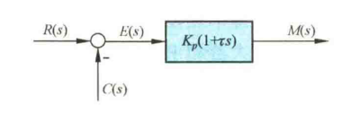
  <div style="font-style: italic; font-size: 0.92em; color: #666; margin-top: 0.35em;">图 6-6 PD 控制器框图</div>
</div>

PD 控制器中的微分控制规律，能反映输入信号的变化趋势，产生有效的早期修正信号，以增加系统的阻尼程度，从而改善系统的稳定性。在串联校正时，可使系统增加一个 $-1/\tau$ 的开环零点，使系统的相角裕度提高，因而有助于系统动态性能的改善。

> **相关概念与原理说明**
>
> 1. **什么是开环零点？** 将反馈回路暂时断开后，沿回路一周得到的传递函数称为开环传递函数。使该传递函数的分子等于零的 $s$ 值称为开环零点。PD 控制器的传递函数为 $G_c(s)=K_p(1+\tau s)=K_p\tau(s+1/\tau)$，因此它与被控对象串联后，会在整个系统的开环传递函数中增加一个位于 $s=-1/\tau$ 的零点。这个零点不一定直接成为闭环零点，但会影响闭环特征方程和闭环极点的位置。
>
> 2. **什么是系统的相角裕度？** 对于开环频率特性 $G(j\omega)$，先找到其幅值等于 $1$（即 $0\ \mathrm{dB}$）时的频率 $\omega_c$，该频率称为截止频率或增益交越频率。此时开环相角距离 $-180^\circ$ 还差多少，就是相角裕度：$\gamma=180^\circ+\angle G(j\omega_c)$。相角裕度表示系统在达到可能形成正反馈的临界相位以前，还能容许多少附加相位滞后。一般而言，相角裕度越大，闭环系统的相对稳定性和阻尼程度越好；相角裕度过小，则系统容易产生较大的超调和振荡。
>
> 3. **什么是系统的动态性能？** 动态性能描述系统从受到输入或扰动开始，到重新达到稳定状态这一过渡过程的表现，通常用上升时间、峰值时间、超调量、调节时间以及振荡程度等指标衡量。它关注的是系统响应得“多快、是否振荡、超调多大”，而稳态性能主要关注过渡过程结束后还剩多少误差。
>
> 4. **为什么原文的结论成立？** PD 控制器在频域中的相位为 $\angle G_c(j\omega)=\arctan(\omega\tau)>0$，因而能够在一定频率范围内提供正的相位超前。将它串联到原系统后，新增零点 $-1/\tau$ 会减小开环系统在截止频率附近的总相位滞后；若参数选择适当，新的截止频率处就会具有更大的相角裕度。相角裕度增大通常意味着主导闭环极点的阻尼比增大、闭环极点远离虚轴，所以阶跃响应的超调量和振荡程度减小，调节过程也往往更快。因此，“增加开环零点 $\rightarrow$ 提供相位超前 $\rightarrow$ 提高相角裕度 $\rightarrow$ 改善动态性能”这一关系成立。需要注意，这一结论以 $K_p$ 和 $\tau$ 选择适当为前提；理想微分还会放大高频噪声，工程中通常采用带高频滤波的实际 PD 环节。

**例 6-1**　设比例—微分控制系统如图 6-7 所示，试分析 PD 控制器对系统性能的影响。

<div align="center">
  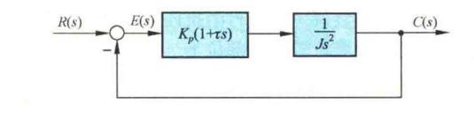
  <div style="font-style: italic; font-size: 0.92em; color: #666; margin-top: 0.35em;">图 6-7 比例—微分控制系统结构图</div>
</div>

**解**　无 PD 控制器时，系统的闭环特征方程为

$$
Js^2+1=0.
$$

显然，系统的阻尼比等于零，其输出 $c(t)$ 具有不衰减的等幅振荡形式，系统处于临界稳定状态，即实际上的不稳定状态。

接入 PD 控制器后，闭环系统特征方程为

$$
Js^2+K_p\tau s+K_p=0.
$$

其阻尼比 $\zeta=\tau\sqrt{K_p}/(2\sqrt{J})>0$，因此闭环系统是稳定的。PD 控制器提高系统的阻尼程度，可通过参数 $K_p$ 及 $\tau$ 来调整。

需要指出，因为微分控制作用只对动态过程起作用，而对稳态过程没有影响，且对系统噪声非常敏感，所以单一的 D 控制器在任何情况下都不宜与被控对象串联起来单独使用。通常，微分控制规律总是与比例控制规律或比例—积分控制规律结合起来，构成组合的 PD 或 PID 控制器，应用于实际的控制系统。

#### （3）积分（I）控制规律

具有积分控制规律的控制器，称为 I 控制器。I 控制器的输出信号 $m(t)$ 与其输入信号 $e(t)$ 的积分成正比，即

$$
m(t)=K_i\int_0^t e(t)\,\mathrm{d}t
\tag{6-13}
$$

其中 $K_i$ 为可调系数。由于 I 控制器的积分作用，当其输入 $e(t)$ 消失后，输出信号 $m(t)$ 有可能是一个不为零的常量。

在串联校正时，采用 I 控制器可以提高系统的型别（无差度），有利于系统稳态性能的提高，但积分控制使系统增加了一个位于原点的开环极点，使信号产生 $90^\circ$ 的相角滞后，于系统的稳定性不利。因此，在控制系统的校正设计中，通常不宜采用单一的 I 控制器。I 控制器如图 6-8 所示。

<div align="center">
  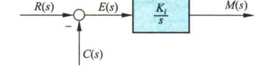
  <div style="font-style: italic; font-size: 0.92em; color: #666; margin-top: 0.35em;">图 6-8 I 控制器框图</div>
</div>

#### （4）比例—积分（PI）控制规律

具有比例—积分控制规律的控制器，称 PI 控制器，其输出信号 $m(t)$ 同时成比例地反映输入信号 $e(t)$ 及其积分，即

$$
m(t)=K_pe(t)+\frac{K_p}{T_i}\int_0^t e(t)\,\mathrm{d}t
\tag{6-14}
$$

式中，$K_p$ 为可调比例系数；$T_i$ 为可调积分时间常数。PI 控制器如图 6-9 所示。

<div align="center">
  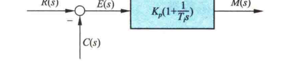
  <div style="font-style: italic; font-size: 0.92em; color: #666; margin-top: 0.35em;">图 6-9 PI 控制器框图</div>
</div>

在串联校正时，PI 控制器相当于在系统中增加了一个位于原点的开环极点，同时也增加了一个位于 $s$ 左半平面的开环零点。位于原点的极点可以提高系统的型别，以消除或减小系统的稳态误差，改善系统的稳态性能；而增加的负实零点则用来减小系统的阻尼程度，缓和 PI 控制器极点对系统稳定性及动态过程产生的不利影响。只要积分时间常数 $T_i$ 足够大，PI 控制器对系统稳定性的不利影响可大为减弱。在控制工程实践中，PI 控制器主要用来改善控制系统的稳态性能。

**例 6-2**　设比例—积分控制系统如图 6-10 所示。其中不可变部分的传递函数为

$$
G_0(s)=\frac{K_0}{s(Ts+1)}.
$$

试分析 PI 控制器对系统稳态性能的改善作用。

<div align="center">
  
  <div style="font-style: italic; font-size: 0.92em; color: #666; margin-top: 0.35em;">图 6-10 比例—积分控制系统结构图</div>
</div>

**解**　由图 6-10 可知，系统不可变部分与 PI 控制器串联后，其开环传递函数为

$$
G(s)=\frac{K_0K_p(T_is+1)}{T_is^2(Ts+1)}.
$$

可见，系统由原来的 I 型提高到含 PI 控制器时的 II 型。若系统的输入信号为斜坡函数 $r(t)=R_0t$，则由表 3-5 可知，在无 PI 控制器时，系统的稳态误差为 $R_0/K_0$；而接入 PI 控制器后，系统的稳态误差为零。表明 I 型系统采用 PI 控制器后，可以消除系统对斜坡输入信号的稳态误差，控制准确度大为改善。

采用 PI 控制器后，系统的特征方程为

$$
T_iTs^3+T_is^2+K_0K_pT_is+K_0K_p=0.
$$

其中，参数 $T_i,T,K_0,K_p$ 都是正数。由劳斯判据可知，调整 PI 控制器的积分时间常数 $T_i$，使之大于系统不可变部分的时间常数 $T$，可以保证闭环系统的稳定性。

#### （5）比例—积分—微分（PID）控制规律

具有比例—积分—微分控制规律的控制器，称 PID 控制器。这种组合具有三种基本规律各自的特点，其运动方程为

$$
m(t)=K_pe(t)+\frac{K_p}{T_i}\int_0^t e(t)\,\mathrm{d}t+K_p\tau\frac{\mathrm{d}e(t)}{\mathrm{d}t}
\tag{6-15}
$$

相应的传递函数是

$$
G_c(s)=K_p\left(1+\frac{1}{T_is}+\tau s\right)
=\frac{K_p}{T_i}\frac{T_i\tau s^2+T_is+1}{s}
\tag{6-16}
$$

PID 控制器如图 6-11 所示。

<div align="center">
  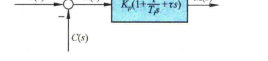
  <div style="font-style: italic; font-size: 0.92em; color: #666; margin-top: 0.35em;">图 6-11 PID 控制器框图</div>
</div>

若 $4\tau/T_i<1$，式（6-16）还可写成

$$
G_c(s)=\frac{K_p}{T_i}\frac{(\tau_1s+1)(\tau_2s+1)}{s}
\tag{6-17}
$$

式中

$$
\tau_1=\frac{T_i}{2}\left(1+\sqrt{1-\frac{4\tau}{T_i}}\right),
\qquad
\tau_2=\frac{T_i}{2}\left(1-\sqrt{1-\frac{4\tau}{T_i}}\right).
$$

由式（6-17）可见，当利用 PID 控制器进行串联校正时，除可使系统的型别提高一级外，还将提供两个负实零点。与 PI 控制器相比，PID 控制器除了同样具有提高系统的稳态性能的优点外，还多提供一个负实零点，从而在提高系统动态性能方面，具有更大的优越性。因此，**在工业过程控制系统中，广泛使用 PID 控制器。PID 控制器各部分参数的选择，在系统现场调试中最后确定。通常，应使 I 部分发生在系统频率特性的低频段，以提高系统的稳态性能；而使 D 部分发生在系统频率特性的中频段，以改善系统的动态性能。**

## 6-2 常用校正装置及其特性

本节集中介绍常用无源及有源校正网络的电路形式、传递函数、对数频率特性及零、极点分布图，以便控制系统校正时使用。

### 1. 无源校正网络

#### （1）无源超前网络

图 6-12 是无源超前网络的电路图及其零、极点分布图。如果输入信号源的内阻为零，且输出端的负载阻抗为无穷大，则超前网络的传递函数可写为

$$
\alpha G_c(s)=\frac{1+\alpha Ts}{1+Ts}
\tag{6-18}
$$

式中

$$
\alpha=\frac{R_1+R_2}{R_2}>1,
\qquad
T=\frac{R_1R_2}{R_1+R_2}C.
$$

通常，$\alpha$ 称为分度系数，$T$ 叫做时间常数。由式（6-18）见，采用无源超前网络［图 6-12（a）］进行串联校正时，整个系统的开环增益要下降为原来的 $1/\alpha$，因此需要提高放大器增益加以补偿。超前网络的零、极点分布图如图 6-12（b）所示。由于 $\alpha>1$，故超前网络的负实零点总是位于其负实极点之右，两者之间的距离由常数 $\alpha$ 决定。改变 $\alpha$ 和 $T$ 的数值，超前网络的零、极点可在 $s$ 平面的负实轴上任意移动。

<div align="center">
  
  <div style="font-style: italic; font-size: 0.92em; color: #666; margin-top: 0.35em;">图 6-12 无源超前网络及其零、极点分布</div>
</div>

根据式（6-18），可以画出无源超前网络 $\alpha G_c(s)$ 的对数频率特性，如图 6-13（a）所示，图中 $20\lg\alpha$ 代表纵坐标值。显然，超前网络对频率在 $1/(\alpha T)$ 至 $1/T$ 之间的输入信号有明显的微分作用，在该频率范围内，输出信号相角比输入信号相角超前，超前网络的名称由此而得。图 6-13（a）表明，在最大超前角频率 $\omega_m$ 处，具有最大超前角 $\varphi_m$，且 $\omega_m$ 正好处于频率 $1/(\alpha T)$ 和 $1/T$ 的几何中心。证明如下：

超前网络式（6-18）的相角为

$$
\varphi_c(\omega)=\arctan\alpha T\omega-\arctan T\omega
=\arctan\frac{(\alpha-1)T\omega}{1+\alpha T^2\omega^2}
\tag{6-19}
$$

将式（6-19）对 $\omega$ 求导并令其为零，得最大超前角频率

$$
\omega_m=\frac{1}{T\sqrt{\alpha}}
\tag{6-20}
$$

将式（6-20）代入式（6-19），得最大超前角

$$
\varphi_m=\arctan\frac{\alpha-1}{2\sqrt{\alpha}}
=\arcsin\frac{\alpha-1}{\alpha+1}
\tag{6-21}
$$

式（6-21）表明：最大超前角 $\varphi_m$ 仅与分度系数 $\alpha$ 有关。$\alpha$ 值选得越大，超前网络的微分效应越强。为了保持较高的系统信噪比，实际选用的 $\alpha$ 值一般不超过 20。此外，由图 6-13（a）可以明显看出 $\omega_m$ 处的对数幅频值

$$
L_c(\omega_m)=20\lg\left|\alpha G_c(j\omega_m)\right|=10\lg\alpha
\tag{6-22}
$$

$\alpha$ 与 $\varphi_m$ 及 $10\lg\alpha$ 的关系曲线如图 6-13（b）所示。

<div align="center">
  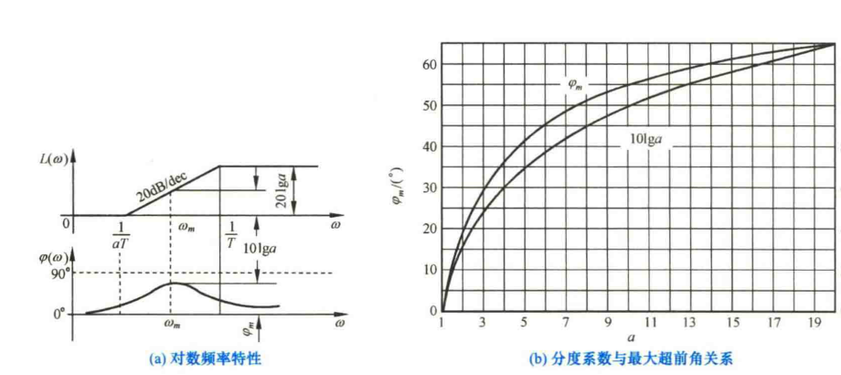
  <div style="font-style: italic; font-size: 0.92em; color: #666; margin-top: 0.35em;">图 6-13 无源超前网络特性</div>
</div>

设 $\omega$ 为频率 $1/(\alpha T)$ 及 $1/T$ 的几何中心，则应有

$$
\lg\omega=\frac{1}{2}\left(\lg\frac{1}{\alpha T}+\lg\frac{1}{T}\right).
$$

解得 $\omega=1/(T\sqrt{\alpha})$，正好与式（6-20）完全相同，故最大超前角频率 $\omega_m$ 确是 $1/(\alpha T)$ 和 $1/T$ 的几何中心。

#### （2）无源滞后网络

无源滞后网络的电路图如图 6-14（a）所示。如果输入信号源的内阻为零，负载阻抗为无穷大，滞后网络的传递函数为

$$
G_c(s)=\frac{1+bTs}{1+Ts}
\tag{6-23}
$$

式中

$$
b=\frac{R_2}{R_1+R_2}<1,
\qquad
T=(R_1+R_2)C.
$$

通常，$b$ 称为滞后网络的分度系数，表示滞后深度。

无源滞后网络的对数频率特性如图 6-14（b）所示。由图可见，滞后网络在频率 $1/T$ 至 $1/(bT)$ 之间呈积分效应，而对数相频特性呈滞后特性。与超前网络类似，最大滞后角 $\varphi_m$ 发生在最大滞后角频率 $\omega_m$ 处，且 $\omega_m$ 正好是 $1/T$ 与 $1/(bT)$ 的几何中心。计算 $\omega_m$ 及 $\varphi_m$ 的公式分别为

$$
\omega_m=\frac{1}{T\sqrt{b}}
\tag{6-24}
$$

$$
\varphi_m=\arcsin\frac{1-b}{1+b}
\tag{6-25}
$$

图 6-14（b）还表明，滞后网络对低频有用信号不产生衰减，而对高频噪声信号有削弱作用，$b$ 值越小，通过网络的噪声电平越低。

<div align="center">
  
  <div style="font-style: italic; font-size: 0.92em; color: #666; margin-top: 0.35em;">图 6-14 无源滞后网络及其特性</div>
</div>

采用无源滞后网络进行串联校正时，主要是利用其高频幅值衰减的特性，以降低系统的开环截止频率，提高系统的相角裕度。因此，力求避免最大滞后角发生在已校正系统开环截止频率 $\omega_c''$ 附近。选择滞后网络参数时，通常使网络的交接频率 $1/(bT)$ 远小于 $\omega_c''$，一般取

$$
\frac{1}{bT}=\frac{\omega_c''}{10}
\tag{6-26}
$$

此时，滞后网络在 $\omega_c''$ 处产生的相角滞后按下式确定：

$$
\varphi_c(\omega_c'')=\arctan bT\omega_c''-\arctan T\omega_c''.
$$

由两角和的三角函数公式，得

$$
\tan\varphi_c(\omega_c'')=
\frac{bT\omega_c''-T\omega_c''}{1+bT^2(\omega_c'')^2}.
$$

代入式（6-26）及 $b<1$ 关系，上式可化简为

$$
\varphi_c(\omega_c'')\approx\arctan[0.1(b-1)]
\tag{6-27}
$$

$b$ 与 $\varphi_c(\omega_c'')$ 和 $20\lg b$ 的关系曲线如图 6-15 所示。为便于使用，图 6-15 曲线画在对数坐标系中。

<div align="center">
  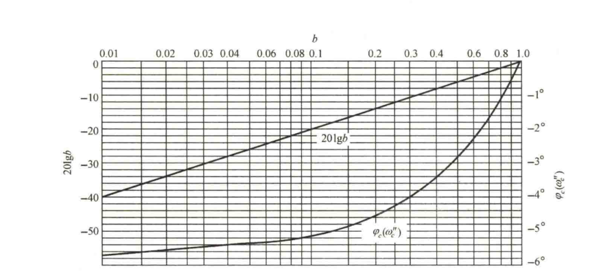
  <div style="font-style: italic; font-size: 0.92em; color: #666; margin-top: 0.35em;">图 6-15 无源滞后网络关系曲线（$1/(bT)=0.1\omega_c''$）</div>
</div>

#### （3）无源滞后—超前网络

无源滞后—超前网络的电路图如图 6-16（a）所示，其传递函数

$$
G_c(s)=\frac{(1+T_as)(1+T_bs)}{T_aT_bs^2+(T_a+T_b+T_{ab})s+1}
\tag{6-28}
$$

式中

$$
T_a=R_1C_1,\qquad T_b=R_2C_2,\qquad T_{ab}=R_1C_2.
$$

令式（6-28）的分母二项式有两个不相等的负实根，则式（6-28）可以写为

$$
G_c(s)=\frac{(1+T_as)(1+T_bs)}{(1+T_1s)(1+T_2s)}
\tag{6-29}
$$

比较式（6-28）及式（6-29），可得

$$
T_1T_2=T_aT_b,\qquad T_1+T_2=T_a+T_b+T_{ab}.
$$

设

$$
T_1>T_a,
\qquad
\frac{T_a}{T_1}=\frac{T_2}{T_b}=\frac{1}{\alpha}.
$$

其中 $\alpha>1$，则有

$$
T_1=\alpha T_a,
\qquad
T_2=\frac{T_b}{\alpha}.
$$

于是，无源滞后—超前网络的传递函数最后可表示为

$$
G_c(s)=\frac{(1+T_as)(1+T_bs)}{(1+\alpha T_as)(1+T_bs/\alpha)}
\tag{6-30}
$$

其中，$(1+T_as)/(1+\alpha T_as)$ 为网络的滞后部分，$(1+T_bs)/(1+T_bs/\alpha)$ 为网络的超前部分。无源滞后—超前网络的对数幅频渐近特性如图 6-16（b）所示，其低频部分和高频部分均起于和终于零分贝水平线。由图可见，只要确定 $\omega_a$、$\omega_b$ 和 $\alpha$，或者确定 $T_a$、$T_b$ 和 $\alpha$ 三个独立变量，图 6-16（b）的形状即可确定。

<div align="center">
  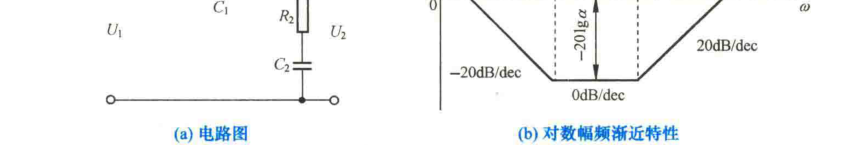
  <div style="font-style: italic; font-size: 0.92em; color: #666; margin-top: 0.35em;">图 6-16 无源滞后—超前网络及其特性</div>
</div>

常用无源校正网络的电路图、传递函数及对数幅频渐近特性，如表 6-1 所示。

<div align="center">
  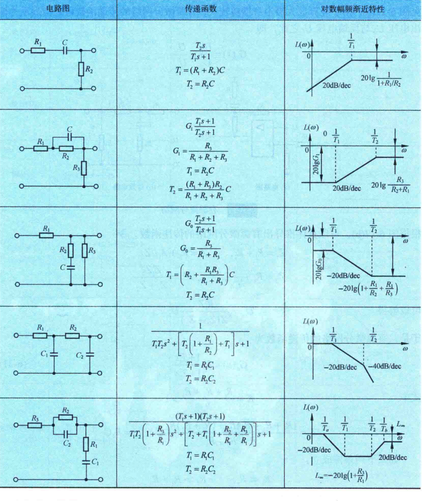
  <div style="font-style: italic; font-size: 0.92em; color: #666; margin-top: 0.35em;">表 6-1 常用无源校正网络</div>
</div>

### 2. 有源校正装置

实际控制系统中广泛采用无源网络进行串联校正，但在放大器级间接入无源校正网络后，由于负载效应问题，有时难以实现希望的控制规律。此外，复杂网络的设计和调整也不方便。因此，有时需要采用有源校正装置，在工业过程控制系统中，尤其如此。常用的有源校正装置，除测速发电机及其与无源网络的组合，以及 PID 控制器外，通常把无源网络接在运算放大器的反馈通路中，形成有源网络，以实现要求的系统控制规律。

有源校正网络有多种形式。图 6-17（a）为同相输入超前（微分）有源网络，其等效电路见图 6-17（b）。由于运算放大器本身增益较大，有源微分网络的传递函数可近似表示为输出电压 $U_o$ 与反馈电压 $U_f$ 之比，即

$$
G_c(s)=\frac{U_o}{U_i}=\frac{U_o}{U_f}.
$$

<div align="center">
  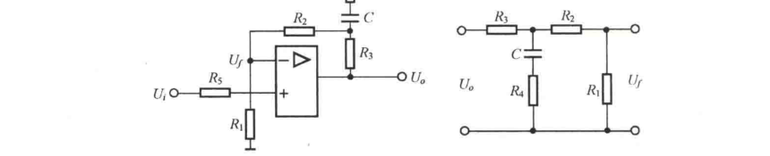
  <div style="font-style: italic; font-size: 0.92em; color: #666; margin-top: 0.35em;">图 6-17 有源微分网络</div>
</div>

根据图 6-17（b），可以具体推导出有源微分网络的传递函数。令

$$
Z_1=R_1+R_2,
\qquad
Z_2=R_4+\frac{1}{Cs},
$$

$$
Z=R_3+Z_1\mathbin{//}Z_2,
\qquad
Z_1\mathbin{//}Z_2=\frac{Z_1Z_2}{Z_1+Z_2}.
$$

可以解得

$$
U_f=\frac{R_1Z_2}{Z(Z_1+Z_2)}U_o.
$$

于是，有源微分网络的传递函数为

$$
G_c(s)=K\frac{1+T_1s}{1+T_2s}
\tag{6-31}
$$

式中

$$
K=\frac{R_1+R_2+R_3}{R_1}>1,
$$

$$
T_1=\frac{(R_1+R_2+R_4)R_3+(R_1+R_2)R_4}{R_1+R_2+R_3}C,
\qquad
T_2=R_4C.
$$

如果下列条件成立：

$$
R_1\ll R_r,
\qquad
R_2\gg R_3>R_4,
$$

其中 $R_r$ 为运算放大器内阻，则近似有

$$
T_1=(R_3+R_4)C>T_2.
$$

故图 6-17（a）必为有源微分网络。

常用有源校正装置示于表 6-2。

<div align="center">
  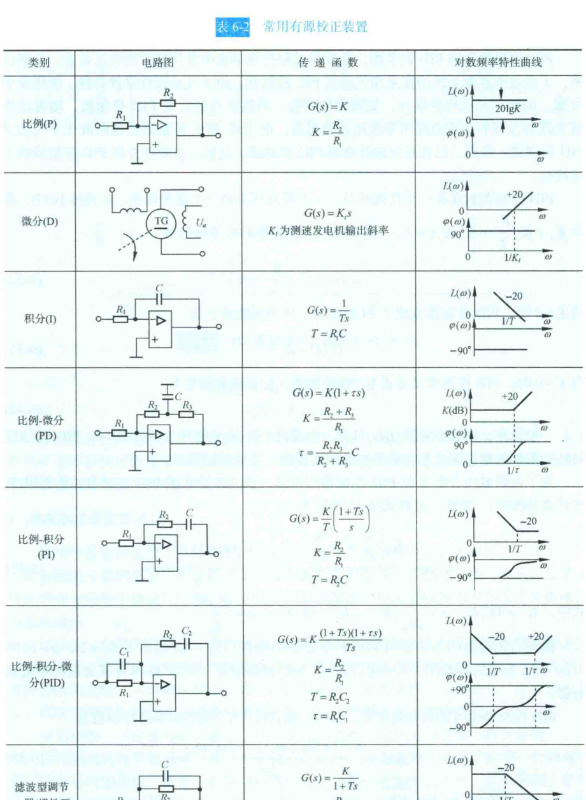
  <div style="font-style: italic; font-size: 0.92em; color: #666; margin-top: 0.35em;">表 6-2 常用有源校正装置</div>
</div>

### 3. PID 控制器

PID 控制器又称 PID 调节器，是工业过程控制系统中常用的有源校正装置。长期以来，工业过程控制系统中多采用气动式 PID 控制器。由于气动组件维修简便，使用安全可靠，因而在某些特殊场合，如爆炸性环境，仍然使用气动式 PID 控制器。随着运算放大器的发展和集成电路可靠性的日益提高，电子式 PID 控制器已逐渐取代了气动式 PID 控制器。目前，已在开发微处理器 PID 控制器。这里，仅简要介绍 PID 控制器的主要特性。

PID 控制器包含有一个比例环节、一个积分环节和一个微分环节。在式（6-16）中，若令 $K_p=K_1$，$K_p/T_i=K_2$，$K_p\tau=K_3$，则 PID 控制器完整的传递函数为

$$
G_c(s)=K_1+\frac{K_2}{s}+K_3s
\tag{6-32}
$$

当 $K_3=0$ 时，PID 控制器变成了 PI 控制器，传递函数则变为

$$
G_c(s)=K_1+\frac{K_2}{s}
\tag{6-33}
$$

当 $K_2=0$ 时，PID 控制器又变成了 PD 控制器，传递函数则变为

$$
G_c(s)=K_1+K_3s
\tag{6-34}
$$

一般说来，当被控对象 $G(s)$ 只有一个或两个极点（或可作二阶近似）时，PID 控制器对减少系统的稳态误差和改善系统的瞬态性能，效果特别明显。

为了在频域内分析含有 PID 控制器的系统，首先需要掌握 PID 控制器的伯德图（对数频率特性图）。为此，可将式（6-32）改写为

$$
G_c(s)=\frac{K_2\left(\dfrac{K_3}{K_2}s^2+\dfrac{K_1}{K_2}s+1\right)}{s}
=\frac{K_2(\tau s+1)\left(\dfrac{\tau}{\alpha}s+1\right)}{s}
\tag{6-35}
$$

式中，$K_1^2>4K_2K_3$；

$$
\tau>\frac{1}{2K_2}\left(K_1-\sqrt{K_1^2-4K_2K_3}\right),
\qquad
\alpha=\frac{K_2\tau^2}{K_3}.
$$

据此可用叠加的方法得到 PID 控制器的伯德图。图 6-18 给出了 $K_2=2$、$\alpha=10$ 时以 $\omega\tau$ 为自变量的伯德图，从中可以看到，PID 控制器是一类以 $K_2$ 为可调变量的带阻滤波器。

PID 控制器也可能含有复零点，这时，由式（6-32）导出的频率特性函数为

$$
G_c(j\omega)=\frac{K_2\left[1+(2\zeta/\omega_n)j\omega-(\omega/\omega_n)^2\right]}{j\omega}
\tag{6-36}
$$

式中

$$
\omega_n=\sqrt{\frac{K_2}{K_3}},
\qquad
\zeta=\frac{1}{2}\sqrt{\frac{K_1^2}{K_2K_3}};
$$

阻尼系数通常为 $0.7<\zeta<0.9$。这种 PID 控制器的伯德图将取决于复零点的 $\zeta$ 值，因此，在绘制式（6-36）的伯德图时，应注意二阶因子的相频特性曲线和幅频特性曲线都会随 $\zeta$ 的变化而变化。

<div align="center">
  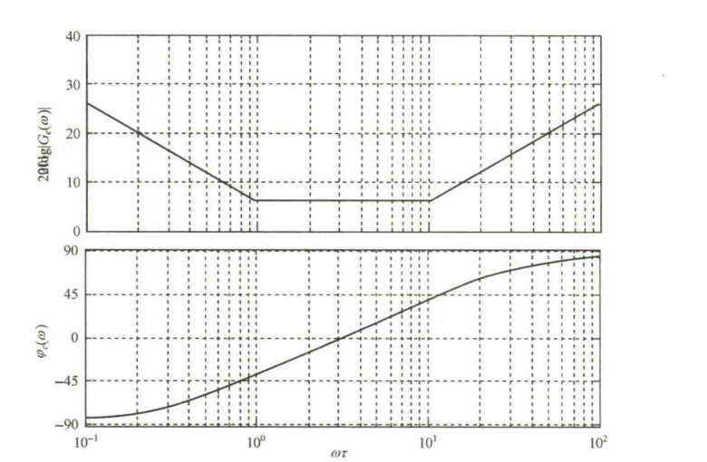
  <div style="font-style: italic; font-size: 0.92em; color: #666; margin-top: 0.35em;">图 6-18 PID 控制器的伯德图（$K_2=2,\ \alpha=10$）</div>
</div>

## 6-3 串联校正

如果系统设计要求满足的性能指标属频域特征量，则通常采用频域校正方法。本节介绍在开环系统对数频率特性基础上，以满足稳态误差、开环系统截止频率和相角裕度等要求为出发点，进行串联校正的方法。

### 1. 频率响应法校正设计

在线性控制系统中，常用的校正装置设计方法有分析法和综合法两种。

分析法又称试探法。用分析法设计校正装置比较直观，在物理上易于实现，但要求设计者有一定的工程设计经验，设计过程带有试探性。目前工程技术界多采用分析法进行系统设计。

综合法又称期望特性法。这种设计方法从闭环系统性能与开环系统特性密切相关这一概念出发，根据规定的性能指标要求确定系统期望的开环特性形状，然后与系统原有开环特性相比较，从而确定校正方式、校正装置的形式和参数。综合法有广泛的理论意义，但希望的校正装置传递函数可能相当复杂，在物理上难以准确实现。

应当指出，不论是分析法或综合法，其设计过程一般仅适用于最小相位系统。

在频域内进行系统设计，是一种间接设计方法，因为设计结果满足的是一些频域指标，而不是时域指标。然而，在频域内进行设计又是一种简便的方法，在伯德图上虽然不能严格定量地给出系统的动态性能，但却能方便地根据频域指标确定校正装置的参数，特别是对已校正系统的高频特性有要求时，采用频域法校正较其他方法更为方便。频域设计的这种简便性，是由于开环系统的频率特性与闭环系统的时间响应有关。一般地说，**开环频率特性的低频段表征了闭环系统的稳态性能；开环频率特性的中频段表征了闭环系统的动态性能；开环频率特性的高频段表征了闭环系统的复杂性和噪声抑制性能。** 因此，用频域法设计控制系统的实质，就是在系统中加入频率特性形状合适的校正装置，使开环系统频率特性形状变成所期望的形状：低频段增益充分大，以保证稳态误差要求；中频段对数幅频特性斜率一般为 $-20\ \mathrm{dB/dec}$，并占据充分宽的频带，以保证具备适当的相角裕度；高频段增益尽快减小，以削弱噪声影响，若系统原有部分高频段已符合该种要求，则校正时可保持高频段形状不变，以简化校正装置的形式。

### 2. 串联超前校正

利用超前网络或 PD 控制器进行串联校正的基本原理，是利用超前网络或 PD 控制器的相角超前特性。只要正确地将超前网络的交接频率 $1/(\alpha T)$ 和 $1/T$ 选在待校正系统截止频率的两旁，并适当选择参数 $\alpha$ 和 $T$，就可以使已校正系统的截止频率和相角裕度满足性能指标的要求，从而改善闭环系统的动态性能。闭环系统的稳态性能要求，可通过选择已校正系统的开环增益来保证。用频域法设计无源超前网络的步骤如下：

1）根据稳态误差要求，确定开环增益 $K$。

2）利用已确定的开环增益，计算待校正系统的相角裕度。

3）根据截止频率 $\omega_c''$ 的要求，计算超前网络参数 $\alpha$ 和 $T$。在本步骤中，关键是选择最大超前角频率等于要求的系统截止频率，即 $\omega_m=\omega_c''$，以保证系统的响应速度，并充分利用网络的相角超前特性。显然，$\omega_m=\omega_c''$ 成立的条件是

$$
-L'(\omega_c'')=L_c(\omega_m)=10\lg\alpha
\tag{6-37}
$$

根据上式不难求出 $\alpha$ 值，然后由

$$
T=\frac{1}{\omega_m\sqrt{\alpha}}
\tag{6-38}
$$

确定 $T$ 值。

4）验算已校正系统的相角裕度 $\gamma''$。由于超前网络的参数是根据满足系统截止频率要求选择的，所以相角裕度是否满足要求，必须验算。验算时，由已知 $\alpha$ 值查图 6-13（b），或由式（6-21）求得 $\varphi_m$ 值，再由已知的 $\omega_c''$ 算出待校正系统在 $\omega_c''$ 时的相角裕度 $\gamma(\omega_c'')$。如果待校正系统为非最小相位系统，则 $\gamma(\omega_c'')$ 由作图法确定。最后，按下式算出

$$
\gamma''=\varphi_m+\gamma(\omega_c'')
\tag{6-39}
$$

当验算结果 $\gamma''$ 不满足指标要求时，需重选 $\omega_m$ 值，一般使 $\omega_m(=\omega_c'')$ 值增大，然后重复以上计算步骤。

一旦完成校正装置设计后，需要进行系统实际调校工作，或者进行 MATLAB 仿真以检查系统的时间响应特性。这时，需将系统建模时省略的部分尽可能加入系统，以保证仿真结果的逼真度。如果由于系统各种固有非线性因素影响，或者由于系统噪声和负载效应等因素的影响，使已校正系统不能满足全部性能指标要求，则需要适当调整校正装置的形式或参数，直到已校正系统满足全部性能指标为止。

**例 6-3**　设控制系统如图 6-19 所示。若要求系统在单位斜坡输入信号作用时，位置输出稳态误差 $e_{ss}(\infty)\leq0.1\ \mathrm{rad}$，开环系统截止频率 $\omega_c''>4.4\ \mathrm{rad/s}$，相角裕度 $\gamma''>45^\circ$，幅值裕度 $h''>10\ \mathrm{dB}$，试设计串联无源超前网络。

<div align="center">
  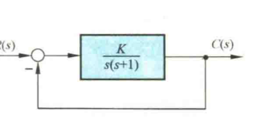
  <div style="font-style: italic; font-size: 0.92em; color: #666; margin-top: 0.35em;">图 6-19 控制系统结构图</div>
</div>

**解**　设计时，首先调整开环增益。因为

$$
e_{ss}(\infty)=\frac{1}{K}\leq0.1,
$$

故取 $K=10\ \mathrm{rad}^{-1}$，则待校正系统开环传递函数

$$
G_0(s)=\frac{10}{s(s+1)}.
$$

上式代表最小相位系统，因此只需画出其对数幅频渐近特性，如图 6-20 中 $L'(\omega)$ 所示。由图得待校正系统的 $\omega_c'=3.1\ \mathrm{rad/s}$，算出待校正系统的相角裕度为

$$
\gamma'=180^\circ-90^\circ-\arctan\omega_c'=17.9^\circ.
$$

而二阶系统的幅值裕度必为 $+\infty\ \mathrm{dB}$。相角裕度小的原因，是因为待校正系统的对数幅频渐近特性中频区的斜率为 $-40\ \mathrm{dB/dec}$。由于截止频率和相角裕度均低于指标要求，故采用串联超前校正是合适的。

<div align="center">
  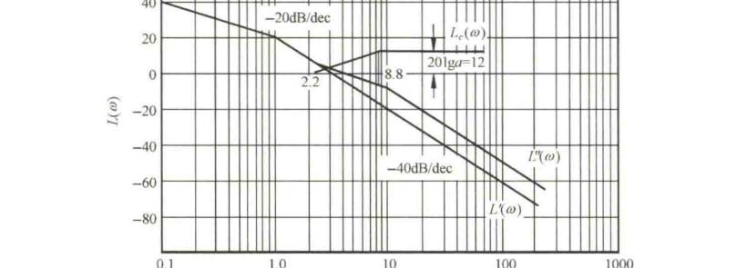
  <div style="font-style: italic; font-size: 0.92em; color: #666; margin-top: 0.35em;">图 6-20 例 6-3 系统开环对数幅频渐近特性</div>
</div>

下面计算超前网络参数。试选 $\omega_m=\omega_c''=4.4\ \mathrm{rad/s}$，由图 6-20 查得 $L'(\omega_c'')=-6\ \mathrm{dB}$，于是算得 $\alpha=4$，$T=0.114\ \mathrm{s}$。因此，超前网络传递函数为

$$
\alpha G_c(s)=\frac{1+0.456s}{1+0.114s}.
$$

为了补偿无源超前网络产生的增益衰减，放大器的增益需提高 4 倍，否则不能保证稳态误差要求。

超前网络参数确定后，已校正系统的开环传递函数为

$$
\alpha G_c(s)G_0(s)=\frac{10(1+0.456s)}{s(1+0.114s)(1+s)}.
$$

其对数幅频渐近特性如图 6-20 中 $L''(\omega)$ 所示。显然，已校正系统 $\omega_c''=4.4\ \mathrm{rad/s}$，算得待校正系统的 $\gamma(\omega_c'')=12.8^\circ$，而由式（6-21）算出的 $\varphi_m=36.9^\circ$，故已校正系统的相角裕度

$$
\gamma''=\varphi_m+\gamma(\omega_c'')=49.7^\circ>45^\circ.
$$

已校正系统的幅值裕度仍为 $+\infty\ \mathrm{dB}$，因为其对数相频特性不可能以有限值与 $-180^\circ$ 线相交。此时，全部性能指标均已满足。

例 6-3 亦可采用带惯性的 PD 控制器作为校正装置，它兼有直流放大器的功能。感兴趣的读者，不妨一试。

例 6-3 表明：系统经串联校正后，中频区斜率变为 $-20\ \mathrm{dB/dec}$，并占据 $6.6\ \mathrm{rad/s}$ 的频带范围，从而系统相角裕度增大，动态过程超调量下降。因此，在实际运行的控制系统中，其中频区斜率大多具有 $-20\ \mathrm{dB/dec}$ 的斜率。由例可见，串联超前校正可使开环系统截止频率增大，从而闭环系统带宽也增大，使响应速度加快。

应当指出，在有些情况下采用串联超前校正是无效的，它受以下两个因素的限制：

1）闭环带宽要求。若待校正系统不稳定，为了得到规定的相角裕度，需要超前网络提供很大的相角超前量。这样，超前网络的 $\alpha$ 值必须选得很大，从而造成已校正系统带宽过大，使得通过系统的高频噪声电平很高，很可能使系统失控。

2）在截止频率附近相角迅速减小的待校正系统，一般不宜采用串联超前校正。因为随着截止频率的增大，待校正系统相角迅速减小，使已校正系统的相角裕度改善不大，很难得到足够的相角超前量。在一般情况下，产生这种相角迅速减小的原因是，在待校正系统截止频率的附近，或有两个交接频率彼此靠近的惯性环节；或有两个交接频率彼此相等的惯性环节；或有一个振荡环节。

在上述情况下，系统可采用其他方法进行校正，例如，采用两级（或两级以上）的串联超前网络（若选用无源网络，中间需要串接隔离放大器）进行串联超前校正，或采用一个滞后网络进行串联滞后校正，也可以采用测速反馈校正。

### 3. 串联滞后校正

利用滞后网络或 PI 控制器进行串联校正的基本原理，是利用滞后网络或 PI 控制器的高频幅值衰减特性，使已校正系统截止频率下降，从而使系统获得足够的相角裕度。因此，滞后网络的最大滞后角应力求避免发生在系统截止频率附近。在系统响应速度要求不高而抑制噪声电平性能要求较高的情况下，可考虑采用串联滞后校正。此外，如果待校正系统已具备满意的动态性能，仅稳态性能不满足指标要求，也可以采用串联滞后校正以提高系统的稳态精度，同时保持其动态性能仍然满足性能指标要求。

如果所研究的系统为单位反馈最小相位系统，则应用频域法设计串联无源滞后网络的步骤如下：

1）根据稳态误差要求，确定开环增益 $K$。

2）利用已确定的开环增益，画出待校正系统的开环对数频率特性，确定待校正系统的截止频率 $\omega_c'$、相角裕度 $\gamma'$ 和幅值裕度 $h'\ (\mathrm{dB})$。

3）选择不同的 $\omega_c''$，计算或查出不同的 $\gamma(\omega_c'')$ 值，在开环伯德图上绘制 $\gamma(\omega)$ 曲线。

4）根据相角裕度 $\gamma''$ 要求，选择已校正系统的截止频率 $\omega_c''$。考虑到滞后网络在新的截止频率 $\omega_c''$ 处会产生一定的相角滞后 $\varphi_c(\omega_c'')$，因此下式成立：

$$
\gamma''=\gamma(\omega_c'')+\varphi_c(\omega_c'')
\tag{6-40}
$$

式中，$\gamma''$ 是指标要求值，$\varphi_c(\omega_c'')$ 在确定 $\omega_c''$ 前可取为 $-6^\circ$。于是，根据式（6-40）的计算结果，在 $\gamma(\omega)$ 曲线上可查出相应的 $\omega_c''$ 值。

5）根据下述关系式确定滞后网络参数 $b$ 和 $T$：

$$
20\lg b+L'(\omega_c'')=0
\tag{6-41}
$$

$$
\frac{1}{bT}=0.1\omega_c''
\tag{6-42}
$$

式（6-41）成立的原因是显然的，因为要保证已校正系统的截止频率为上一步所选的 $\omega_c''$ 值，就必须使滞后网络的衰减量 $20\lg b$ 在数值上等于待校正系统在新截止频率 $\omega_c''$ 上的对数幅频值 $L'(\omega_c'')$。该值在待校正系统对数幅频曲线上可以查出，于是由式（6-41）可以算出 $b$。根据式（6-42），由已确定的 $b$ 立即可以算出滞后网络的 $T$。如果求得的 $T$ 过大难以实现，则可将式（6-42）中的系数 0.1 适当加大，例如在 0.1～0.25 范围内选取，而 $\varphi_c(\omega_c'')$ 的估计值相应在 $-6^\circ\sim-14^\circ$ 范围内确定。

6）验算已校正系统的相角裕度和幅值裕度。

**例 6-4**　设控制系统如图 6-21 所示。若要求校正后系统的静态速度误差系数等于 $30\ \mathrm{s}^{-1}$，相角裕度不低于 $40^\circ$，幅值裕度不小于 $10\ \mathrm{dB}$，截止频率不小于 $2.3\ \mathrm{rad/s}$，试设计串联校正装置。

<div align="center">
  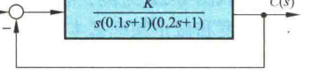
  <div style="font-style: italic; font-size: 0.92em; color: #666; margin-top: 0.35em;">图 6-21 控制系统结构图</div>
</div>

**解**　首先，确定开环增益 $K$。由于

$$
K_v=\lim_{s\to0}sG(s)=K=30\ \mathrm{s}^{-1},
$$

故待校正系统开环传递函数应取

$$
G_0(s)=\frac{30}{s(1+0.1s)(1+0.2s)}.
$$

然后，画出待校正系统的对数幅频渐近特性，如图 6-22 所示。由图 $\omega_c'=12\ \mathrm{rad/s}$，算出

$$
\gamma'=90^\circ-\arctan(0.1\omega_c')-\arctan(0.2\omega_c')=-27.6^\circ.
$$

说明待校正系统不稳定，且截止频率远大于要求值。在这种情况下，采用串联超前校正是无效的。可以证明，当超前网络的 $\alpha$ 值取到 100 时，系统的相角裕度仍不满 $30^\circ$，而截止频率却增至 $26\ \mathrm{rad/s}$。考虑到本例对系统截止频率值要求不大，故选用串联滞后校正可以满足需要的性能指标。

现在作如下计算：

$$
\gamma(\omega)=90^\circ-\arctan(0.1\omega)-\arctan(0.2\omega),
$$

并将 $\gamma(\omega)$ 曲线绘在图 6-22 中。根据 $\gamma''\geq40^\circ$ 要求和 $\varphi_c(\omega_c'')=-6^\circ$ 估值，按式（6-40）求得 $\gamma(\omega_c'')\geq46^\circ$。于是，由 $\gamma(\omega)$ 曲线查得 $\omega_c''=2.7\ \mathrm{rad/s}$。由于指标要求 $\omega_c''>2.3\ \mathrm{rad/s}$，故 $\omega_c''$ 可在 $2.3\sim2.7\ \mathrm{rad/s}$ 范围内任取。考虑到 $\omega_c''$ 取值较大时，已校正系统响应速度较快，且滞后网络时间常数 $T$ 值较小，便于实现，故选取 $\omega_c''=2.7\ \mathrm{rad/s}$。然后，在图 6-22 上查出当 $\omega_c''=2.7\ \mathrm{rad/s}$ 时，有 $L'(\omega_c'')=21\ \mathrm{dB}$，故可由式（6-41）求出 $b=0.09$，再由式（6-42）算出 $T=41\ \mathrm{s}$，则滞后网络的传递函数

$$
G_c(s)=\frac{1+bTs}{1+Ts}=\frac{1+3.7s}{1+41s}.
$$

校正网络的 $L_c(\omega)$ 和已校正系统的 $L''(\omega)$ 已绘于图 6-22 之中。

<div align="center">
  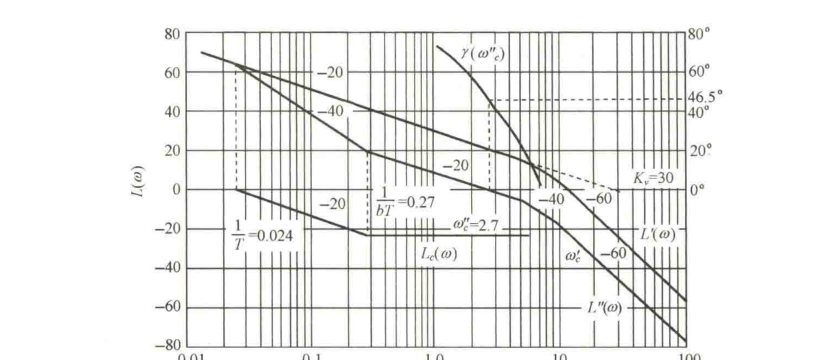
  <div style="font-style: italic; font-size: 0.92em; color: #666; margin-top: 0.35em;">图 6-22 例 6-4 系统开环对数幅频渐近特性</div>
</div>

最后校验相角裕度和幅值裕度。由式（6-27）及 $b=0.09$ 算得 $\varphi_c(\omega_c'')=-5.2^\circ$，于是求出 $\gamma''=41.3^\circ$，满足指标要求。然后用试算法可得已校正系统对数相频特性为 $-180^\circ$ 时的频率为 $6.8\ \mathrm{rad/s}$，求出已校正系统的幅值裕度为 $10.5\ \mathrm{dB}$，完全符合要求。

采用串联滞后校正，既能提高系统稳态精度，又基本不改变系统动态性能的原因是明显的。以图 6-22 为例，如果将已校正系统对数幅频特性向上平移 $21\ \mathrm{dB}$，则校正前后的相角裕度和截止频率基本相同，但开环增益却增大 11 倍。

串联滞后校正与串联超前校正两种方法，在完成系统校正任务方面是相同的，但有以下不同之处：

1）超前校正是利用超前网络的相角超前特性，而滞后校正则是利用滞后网络的高频幅值衰减特性。

2）为了满足严格的稳态性能要求，当采用无源校正网络时，超前校正要求一定的附加增益，而滞后校正一般不需要附加增益。

3）对于同一系统，采用超前校正的系统带宽大于采用滞后校正的系统带宽。从提高系统响应速度的观点来看，希望系统带宽越大越好；与此同时，带宽越大则系统越易受噪声干扰的影响，因此如果系统输入端噪声电平较高，一般不宜选用超前校正。

最后指出，在有些应用方面，采用滞后校正可能会得出时间常数大到不能实现的结果。这种不良后果的出现，是由于需要在足够小的频率值上安置滞后网络第一个交接频率 $1/T$，以保证在需要的频率范围内产生有效的高频幅值衰减特性所致。在这种情况下，最好采用串联滞后—超前校正。

### 4. 串联滞后—超前校正

这种校正方法兼有滞后校正和超前校正的优点，即已校正系统响应速度较快，超调量较小，抑制高频噪声的性能也较好。**当待校正系统不稳定，且要求校正后系统的响应速度、相角裕度和稳态精度较高时，以采用串联滞后—超前校正为宜。** 其基本原理是利用滞后—超前网络的超前部分来增大系统的相角裕度，同时利用滞后部分来改善系统的稳态性能。串联滞后—超前校正的设计步骤如下：

1）根据稳态性能要求确定开环增益 $K$。

2）绘制待校正系统的开环对数幅频渐近特性，求出待校正系统的截止频率 $\omega_c'$、相角裕度 $\gamma'$ 及幅值裕度 $h'\ (\mathrm{dB})$。

3）在待校正系统开环对数幅频渐近特性上，选择斜率从 $-20\ \mathrm{dB/dec}$ 变为 $-40\ \mathrm{dB/dec}$ 的交接频率作为校正网络超前部分的交接频率 $\omega_b$。

$\omega_b$ 的这种选法，可以降低已校正系统的阶次，且可保证中频区斜率为期望的 $-20\ \mathrm{dB/dec}$，并占据较宽的频带。

4）根据响应速度要求，选择系统的截止频率 $\omega_c''$ 和校正网络衰减因子 $1/\alpha$。要保证已校正系统的截止频率为所选的 $\omega_c''$，下列等式应成立：

$$
-20\lg\alpha+L'(\omega_c'')+20\lg T_b\omega_c''=0
\tag{6-43}
$$

式中，$T_b=1/\omega_b$；$L'(\omega_c'')+20\lg T_b\omega_c''$ 可由待校正系统开环对数幅频渐近特性的 $-20\ \mathrm{dB/dec}$ 延长线在 $\omega_c''$ 处的数值确定。因此，由式（6-43）可以求出 $\alpha$ 值。

5）根据相角裕度要求，估算校正网络滞后部分的交接频率 $\omega_a$。

6）校验已校正系统的各项性能指标。

**例 6-5**　设待校正系统开环传递函数为

$$
G_0(s)=\frac{K}{s\left(\dfrac{1}{6}s+1\right)\left(\dfrac{1}{2}s+1\right)}.
$$

要求设计校正装置，使系统满足下列性能指标：

1）在最大指令速度为 $180^\circ/\mathrm{s}$ 时，位置滞后误差不超过 $1^\circ$。

2）相角裕度为 $45^\circ\pm3^\circ$。

3）幅值裕度不低于 $10\ \mathrm{dB}$。

4）动态过程调节时间不超过 $3\ \mathrm{s}$。

**解**　首先确定开环增益。由题意，取

$$
K=K_v=180\ \mathrm{s}^{-1}.
$$

作待校正系统对数幅频渐近特性 $L'(\omega)$，如图 6-23 所示。图中，最低频段为 $-20\ \mathrm{dB/dec}$ 斜率直线，其延长线交 $\omega$ 轴于 $180\ \mathrm{rad/s}$，该值即 $K_v$ 的数值。由图得待校正系统截止频率 $\omega_c'=12.6\ \mathrm{rad/s}$，算出待校正系统的相角裕度 $\gamma'=-55.5^\circ$，幅值裕度 $h'=-30\ \mathrm{dB}$，表明待校正系统不稳定。

由于待校正系统在截止频率处的相角滞后远小于 $-180^\circ$，且响应速度有一定要求，故应优先考虑采用串联滞后—超前校正。论证如下：

首先，考虑采用串联超前校正。要把待校正系统的相角裕度从 $-55.5^\circ$ 提高到 $45^\circ$，至少选用两级串联超前网络。显然，校正后系统的截止频率将过大，可能超过 $25\ \mathrm{rad/s}$。从理论上说，截止频率越大，则系统的响应速度越快。譬如说，在 $\omega_c''=25\ \mathrm{rad/s}$ 时，系统动态过程的调节时间近似为 $0.34\ \mathrm{s}$，这将比性能指标要求提高近 10 倍，然而进一步分析发现：①伺服电机将出现速度饱和，这是因为超前校正系统要求伺服机构输出的变化速率超过了伺服电机的最大输出转速之故，于是，$0.34\ \mathrm{s}$ 的调节时间将变得毫无意义；②系统带宽过大，造成输出噪声电平过高；③需要附加前置放大器，使系统结构复杂化。

<div align="center">
  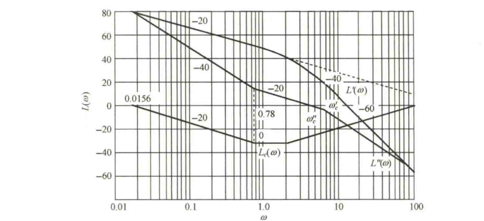
  <div style="font-style: italic; font-size: 0.92em; color: #666; margin-top: 0.35em;">图 6-23 例 6-5 系统开环对数幅频渐近特性</div>
</div>

其次，若采用串联滞后校正，可以使系统的相角裕度提高到 $45^\circ$ 左右，但是对于本例高性能系统，会产生两个很严重的缺点：①滞后网络时间常数太大，这是因为静态速度误差系数越大，所需要的滞后网络时间常数越大之故。对于本例，要求选 $\omega_c''=1$，相应的 $L'(\omega_c'')=45.1\ \mathrm{dB}$，根据式（6-41）求出 $b=1/200$，若取 $1/(bT)=0.1\omega_c''$，可得 $T=2000\ \mathrm{s}$，这样大的时间常数，实际上是无法实现的；②响应速度指标不满足，由于滞后校正极大地减小了系统的截止频率，使得系统响应滞缓。对于本例，粗略估算的调节时间约为 $9.6\ \mathrm{s}$，该值远大于性能指标的要求值。

上述论证表明，纯超前校正及纯滞后校正都不宜采用，应当选用串联滞后—超前校正。

为了利用滞后—超前网络的超前部分微分段的特性，研究图 6-23 发现，可取 $\omega_b=2\ \mathrm{rad/s}$，于是待校正系统对数幅频特性在 $\omega\leq6\ \mathrm{rad/s}$ 区间，其斜率均为 $-20\ \mathrm{dB/dec}$。

根据 $t_s\leq3\ \mathrm{s}$ 和 $\gamma''=45^\circ$ 的指标要求，不难算得 $\omega_c''\geq3.2\ \mathrm{rad/s}$。考虑到要求中频区斜率为 $-20\ \mathrm{dB/dec}$，故 $\omega_c''$ 应在 $3.2\sim6\ \mathrm{rad/s}$ 范围内选取。由于 $-20\ \mathrm{dB/dec}$ 的中频区应占据一定宽度，故选 $\omega_c''=3.5\ \mathrm{rad/s}$，相应的 $L'(\omega_c'')+20\lg T_b\omega_c''=34\ \mathrm{dB}$。由式（6-43）可算出 $1/\alpha=0.02$，此时，滞后—超前校正网络的频率特性可写为

$$
G_c(j\omega)=
\frac{(1+j\omega/\omega_a)(1+j\omega/\omega_b)}
{(1+j\alpha\omega/\omega_a)[1+j\omega/(\alpha\omega_b)]}
=\frac{(1+j\omega/\omega_a)(1+j\omega/2)}
{(1+j50\omega/\omega_a)(1+j\omega/100)}.
$$

相应的已校正系统的频率特性为

$$
G_c(j\omega)G_0(j\omega)=
\frac{180(1+j\omega/\omega_a)}
{j\omega(1+j\omega/6)(1+j50\omega/\omega_a)(1+j\omega/100)}.
$$

根据上式，利用相角裕度指标要求，可以确定校正网络参数 $\omega_a$。已校正系统的相角裕度

$$
\begin{aligned}
\gamma''={}&180^\circ+\arctan\frac{\omega_c''}{\omega_a}-90^\circ
-\arctan\frac{\omega_c''}{6}
-\arctan\frac{50\omega_c''}{\omega_a}
-\arctan\frac{\omega_c''}{100}\\
={}&57.7^\circ+\arctan\frac{3.5}{\omega_a}-\arctan\frac{175}{\omega_a}.
\end{aligned}
$$

考虑到 $\omega_a<\omega_b=2\ \mathrm{rad/s}$，故可取 $-\arctan(175/\omega_a)\approx-90^\circ$。因为要求 $\gamma''=45^\circ$，所以上式可简化为

$$
\arctan\frac{3.5}{\omega_a}=77.3^\circ,
$$

从而求得 $\omega_a=0.78\ \mathrm{rad/s}$。这样，已校正系统 $-20\ \mathrm{dB/dec}$ 斜率的中频区宽度 $H=6/0.78=7.69$，满足在期望特性校正法中导出的中频区宽度近似关系式

$$
H>\frac{1+\sin\gamma''}{1-\sin\gamma''}
=\frac{1+\sin45^\circ}{1-\sin45^\circ}=5.83.
$$

于是，校正网络和已校正系统的传递函数分别为

$$
G_c(s)=\frac{(1+1.28s)(1+0.5s)}{(1+64s)(1+0.01s)},
$$

$$
G_c(s)G_0(s)=\frac{180(1+1.28s)}{s(1+0.167s)(1+64s)(1+0.01s)}.
$$

其对数幅频特性 $L_c(\omega)$ 和 $L''(\omega)$ 已分别表示在图 6-23 之中。

最后，用计算的方法验算已校正系统的相角裕度和幅值裕度指标，求得 $\gamma''=45.5^\circ$，$h''(\mathrm{dB})=27\ \mathrm{dB}$，完全满足指标要求。

## 6-4　前馈校正

当系统性能指标要求为时域特征量时，为了改善控制系统的性能，除了采用串联校正方式外，还可以配置前置滤波器形成组合前馈校正方式，以获得某些改善系统性能的特殊功能。

### 1. 前置滤波组合校正

为了改善系统性能，在系统中常引入形如 $G_c(s)=(s+z)/(s+p)$ 的串联校正网络，以改变系统的闭环极点。但是，$G_c(s)$ 同时也会在系统闭环传递函数 $\Phi(s)$ 中增加一个新的零点。这个新增的零点可能会严重影响闭环系统的动态性能。此时，可考虑在系统的输入端串接一个前置滤波器，以消除新增闭环零点的不利影响。

**例 6-6**　设带有前置滤波器的控制系统如图 6-24 所示。图中，被控对象为 $G_0(s)=1/s$，PI 控制器为

$$
G_c(s)=K_1+\frac{K_2}{s}=\frac{K_1s+K_2}{s}.
$$

要求：①系统阻尼比 $\zeta_d=0.707$；②阶跃响应的超调量 $\sigma\%\leq5\%$；③阶跃响应的调节时间 $t_s\leq0.6\ \mathrm{s}$（$\Delta=2\%$）。试设计 $K_1$、$K_2$ 及 $G_p(s)$。

<div align="center">
  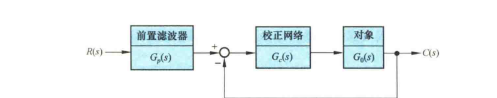
  <div style="font-style: italic; font-size: 0.92em; color: #666; margin-top: 0.35em;">图 6-24　带前置滤波器的控制系统结构图</div>
</div>

**解**　图 6-24 系统的闭环传递函数为

$$
\Phi(s)=\frac{(K_1s+K_2)G_p(s)}{s^2+K_1s+K_2}.
$$

闭环系统特征方程为

$$
s^2+K_1s+K_2=s^2+2\zeta_d\omega_ns+\omega_n^2=0.
$$

根据系统对阻尼比和调节时间的要求，令 $\zeta_d=0.707$，且由

$$
\frac{4.4}{\zeta_d\omega_n}\leq0.6\qquad(\Delta=2\%)
$$

求得 $\zeta_d\omega_n\geq7.33$。现取 $\zeta_d\omega_n=8$，故得 $\omega_n=8\sqrt2$。于是求出 PI 控制器参数

$$
K_1=2\zeta_d\omega_n=16,\qquad K_2=\omega_n^2=128.
$$

若不引入前置滤波器，相当于 $G_p(s)=1$，则系统的闭环传递函数为

$$
\Phi(s)=\frac{16(s+8)}{s^2+16s+128}
=\frac{\omega_n^2}{s^2+2\zeta_d\omega_ns+\omega_n^2}\frac{s+z}{z}.
$$

上式表明，此时系统为有零点的二阶系统。根据 $\zeta_d=1/\sqrt2$、$\omega_n=8\sqrt2$、$z=8$ 以及第三章相应公式，可得 $r=1.41$、$\beta_d=\arctan1=\pi/4$，并求得

$$
t_r=0.07\ \mathrm{s},\qquad t_p=0.2\ \mathrm{s},\qquad \sigma\%=20.0\%.
$$

显然，由于新增零点的影响，超调量无法满足设计指标要求。

考虑采用前置滤波器 $G_p(s)$ 来对消闭环传递函数 $\Phi(s)$ 中的零点，并同时保持系统原有的直流增益即 $\Phi(0)$ 不变，为此取

$$
G_p(s)=\frac{8}{s+8}.
$$

因而闭环传递函数变成

$$
\Phi(s)=\frac{128}{s^2+16s+128}.
$$

此时，系统属无零点的二阶系统。由于 $\beta=\arccos\zeta_d=\pi/4$，$\omega_d=\omega_n\sqrt{1-\zeta_d^2}=8$，可以算出

$$
t_r=\frac{\pi-\beta}{\omega_d}=0.29\ \mathrm{s},\qquad
t_p=\frac{\pi}{\omega_d}=0.39\ \mathrm{s},
$$

$$
\sigma\%=4.3\%,\qquad t_s=\frac{4.4}{\zeta_d\omega_n}=0.55\ \mathrm{s}\quad(\Delta=2\%).
$$

结果表明：系统设计指标要求全部满足。

MATLAB 验证：无前置滤波器时，单位阶跃响应如图 6-25 所示，测得 $\sigma\%=21\%$、$t_r=0.2\ \mathrm{s}$、$t_s=0.44\ \mathrm{s}$（$\Delta=2\%$）；有前置滤波器时，单位阶跃响应如图 6-26 所示，测得 $\sigma\%=4\%$、$t_r=0.4\ \mathrm{s}$、$t_s=0.52\ \mathrm{s}$（$\Delta=2\%$）。

<div align="center">
  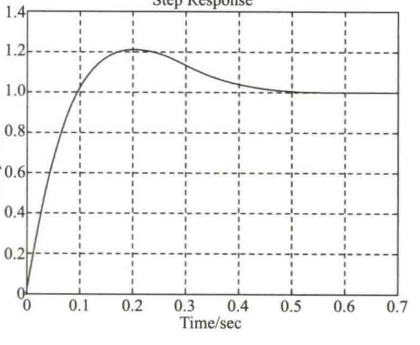
  <div style="font-style: italic; font-size: 0.92em; color: #666; margin-top: 0.35em;">图 6-25　无前置滤波器时系统的单位阶跃响应（MATLAB）</div>
</div>

<div align="center">
  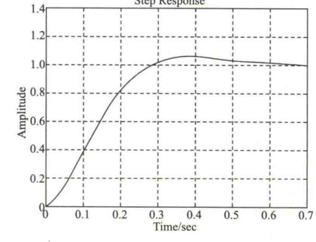
  <div style="font-style: italic; font-size: 0.92em; color: #666; margin-top: 0.35em;">图 6-26　有前置滤波器时系统的单位阶跃响应（MATLAB）</div>
</div>

MATLAB 文本如下：

```matlab
K1=16; K2=128; Gc=tf([K1 K2],[1 0]);
G0=tf([1],[1 0]); Gp=tf([8],[1 8]);
G=series(Gc,G0);
sys0=feedback(G,1);       % 无前置滤波器时的闭环传递函数
sys=series(sys0,Gp);      % 有前置滤波器时的闭环传递函数
figure(1); step(sys0); grid
figure(2); step(sys); grid
```

### 2. 最小节拍组合校正

一个好的控制系统，应该具有快速的阶跃响应和最小的超调量。最小节拍响应是指以最小的超调量快速达到并保持在稳态响应允许波动范围内的时间响应，如图 6-27 所示。

<div align="center">
  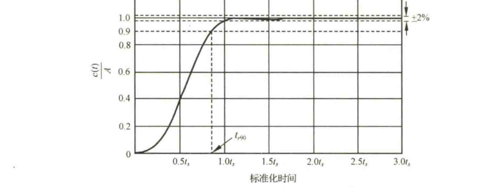
  <div style="font-style: italic; font-size: 0.92em; color: #666; margin-top: 0.35em;">图 6-27　最小节拍阶跃响应（$A$ 为阶跃输入的幅值）</div>
</div>

当系统输入为阶跃信号时，允许波动范围取为稳态响应的 $\pm2\%$ 误差带。因此，系统的调节时间就是响应首次进入波动带的时间。

最小节拍响应具有如下特征：①在阶跃输入作用下，稳态误差为零；②阶跃响应具有最小的上升时间和调节时间；③阶跃响应超调量小于 $2\%$。

最小节拍响应系统标准化闭环传递函数 $\Phi(s)$ 及其系数 $\alpha$、$\beta$、$\gamma$ 等的典型取值见表 6-3。表中还列出了各阶最小节拍响应系统的主要响应性能，其中所有的时间均取标准化时间。例如标准化调节时间 $t_s=4.82$，是表示 $\omega_nt_s=4.82$，而实际调节时间 $t_s=4.82/\omega_n$。

<div align="center">
  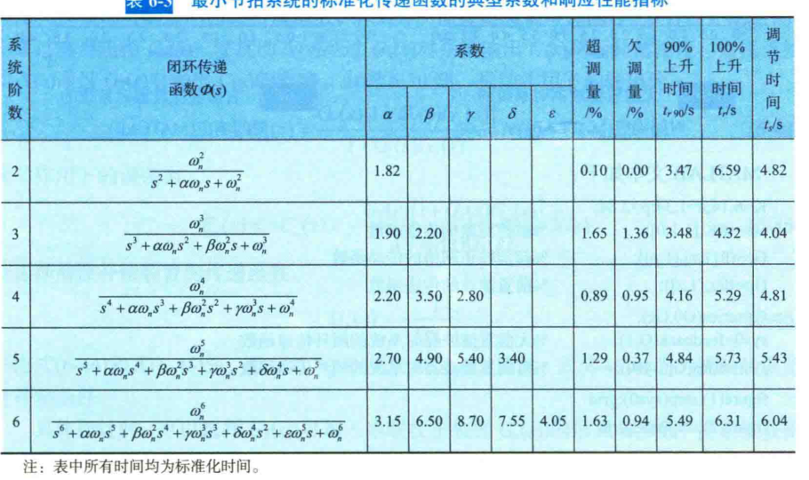
  <div style="font-style: italic; font-size: 0.92em; color: #666; margin-top: 0.35em;">表 6-3　最小节拍系统的标准化传递函数的典型系数和响应性能指标</div>
</div>

在设计具有最小节拍响应系统时，要选择合适的校正网络类型，并令校正后系统的闭环传递函数等于标准化闭环传递函数，由此确定所需要的校正网络参数。

**例 6-7**　设控制系统如图 6-24 所示。已知被控对象和超前校正网络分别为

$$
G_0(s)=\frac{K}{s(s+1)},\qquad G_c(s)=\frac{s+z}{s+p},
$$

前置滤波器为 $G_p(s)=z/(s+z)$。若要求系统调节时间 $t_s=2\ \mathrm{s}$（$\Delta=2\%$）左右，试选择增益 $K$ 及校正网络参数 $z$ 和 $p$，使该系统成为三阶最小节拍响应系统，并计算系统的实际动态性能指标。

**解**　系统开环传递函数为

$$
G(s)=G_c(s)G_p(s)G_0(s)=\frac{Kz}{s(s+1)(s+p)}.
$$

闭环传递函数为

$$
\Phi(s)=\frac{G_p(s)G_c(s)G_0(s)}{1+G_c(s)G_0(s)}
=\frac{Kz}{s^3+(p+1)s^2+(p+K)s+Kz}.
$$

三阶最小节拍标准化闭环传递函数为

$$
\Phi(s)=\frac{\omega_n^3}{s^3+\alpha\omega_ns^2+\beta\omega_n^2s+\omega_n^3}.
$$

比较两式，可得

$$
Kz=\omega_n^3,\qquad \alpha\omega_n=p+1,\qquad \beta\omega_n^2=p+K.
$$

查表 6-3，有 $\alpha=1.90$、$\beta=2.20$、$\omega_nt_s=4.04$。代入要求值 $t_s=2\ \mathrm{s}$，可求得 $\omega_n=2.02$。不难算得

$$
K=6.14,\qquad z=1.34,\qquad p=2.84.
$$

校正网络及前置滤波器分别为

$$
G_c(s)=\frac{s+1.34}{s+2.84},\qquad G_p(s)=\frac{1.34}{s+1.34}.
$$

系统的实际性能指标为 $\sigma\%=1.65\%$、$t_s=2\ \mathrm{s}$。上述计算结果表明，$\sigma\%$ 发生在容许的 $\Delta=\pm2\%$ 误差带内，因此也可以认为系统的 $\sigma\%=0$。

MATLAB 仿真表明：无前置滤波器时，单位阶跃响应如图 6-28 所示，测得 $\sigma\%=21\%$、$t_s=3.49\ \mathrm{s}$（$\Delta=2\%$）、$t_r=1.44\ \mathrm{s}$；有前置滤波器时，单位阶跃响应如图 6-29 所示，测得 $\sigma\%=2\%$、$t_s=2.4\ \mathrm{s}$（$\Delta=2\%$）。

<div align="center">
  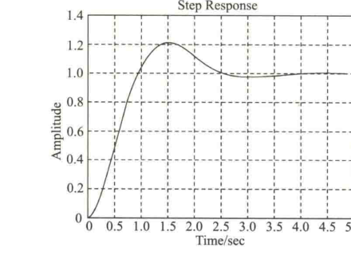
  <div style="font-style: italic; font-size: 0.92em; color: #666; margin-top: 0.35em;">图 6-28　无前置滤波器时系统的时间响应（MATLAB）</div>
</div>

<div align="center">
  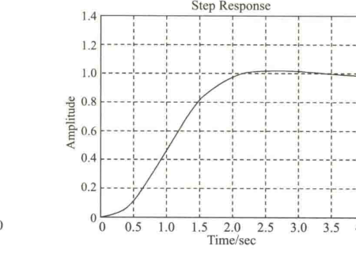
  <div style="font-style: italic; font-size: 0.92em; color: #666; margin-top: 0.35em;">图 6-29　有前置滤波器时系统的时间响应（MATLAB）</div>
</div>

MATLAB 文本如下：

```matlab
K=6.14; z=1.34; p=2.84;
G0=tf(K,[1,1,0]);             % 被控对象的传递函数
Gc=tf([1,z],[1,p]);           % 超前校正网络的传递函数
Gp=tf(z,[1,z]);               % 前置滤波器的传递函数
G=series(G0,Gc);
sys0=feedback(G,1);           % 无前置滤波器时系统的闭环传递函数
sys=series(Gp,sys0);          % 有前置滤波器时系统的闭环传递函数
figure(1); step(sys0); grid
figure(2); step(sys); grid
```

## 6-5　复合校正

串联校正和前馈校正，是控制系统工程中两种常用的校正方法，在一定程度上可以使已校正系统满足给定的性能指标要求。然而，如果控制系统中存在强扰动，特别是低频强扰动，或者系统的稳态精度和响应速度要求很高，则一般的校正方法难以满足要求。目前在工程实践中，例如在高速、高精度火炮控制系统中，还广泛采用一种把前馈控制和反馈控制有机结合起来的校正方法，这就是复合控制校正。

### 1. 复合校正的概念

为了减小或消除系统在特定输入作用下的稳态误差，可以提高系统的开环增益，或者采用高型别系统。但是，这两种方法都将影响系统的稳定性，并会降低系统的动态性能。当型别过高或开环增益过大时，系统甚至会失去稳定。此外，通过适当选择系统带宽的方法，可以抑制高频扰动，但对低频扰动却无能为力；采用比例—积分反馈校正，虽可抑制来自系统输入端的扰动，但反馈校正装置的设计比较困难，且难以满足系统的高性能要求。

如果在系统的反馈控制回路中加入前馈通路，组成一个前馈控制和反馈控制相组合的系统，只要系统参数选择得当，不但可以保持系统稳定，极大地减小乃至消除稳态误差，而且可以抑制几乎所有的可量测扰动，其中包括低频强扰动。这样的系统称为复合控制系统，相应的控制方式称为复合控制。把复合控制的思想用于系统设计，就是复合校正。在高精度的控制系统中，复合控制得到了广泛应用。

复合校正中的前馈装置是按不变性原理进行设计的，可分为按扰动补偿和按输入补偿两种方式。

### 2. 按扰动补偿的复合校正

设按扰动补偿的复合控制系统如图 6-30 所示。图中，$N(s)$ 为可量测扰动，$G_1(s)$ 和 $G_2(s)$ 为反馈部分的前向通路传递函数，$G_n(s)$ 为前馈补偿装置传递函数。复合校正的目的，是通过恰当选择 $G_n(s)$，使扰动 $N(s)$ 经过 $G_n(s)$ 对系统输出 $C(s)$ 产生补偿作用，以抵消扰动 $N(s)$ 通过 $G_2(s)$ 对输出 $C(s)$ 的影响。

<div align="center">
  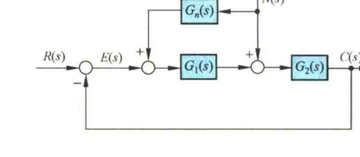
  <div style="font-style: italic; font-size: 0.92em; color: #666; margin-top: 0.35em;">图 6-30　按扰动补偿的复合控制系统结构图</div>
</div>

由图 6-30 知，扰动作用下的输出为

$$
C_n(s)=\frac{G_2(s)[1+G_1(s)G_n(s)]}{1+G_1(s)G_2(s)}N(s). \tag{6-44}
$$

扰动作用下的误差为

$$
E_n(s)=-C_n(s)=-\frac{G_2(s)[1+G_1(s)G_n(s)]}{1+G_1(s)G_2(s)}N(s). \tag{6-45}
$$

若选择前馈补偿装置的传递函数

$$
G_n(s)=-\frac{1}{G_1(s)}, \tag{6-46}
$$

则由式（6-44）和式（6-45）知，必有 $C_n(s)=0$ 以及 $E_n(s)=0$。因此，式（6-46）称为对扰动的误差全补偿条件。

具体设计时，可以选择 $G_1(s)$（可加入串联校正装置 $G_c(s)$）的形式与参数，使系统获得满意的动态性能和稳态性能；然后按式（6-46）确定前馈补偿装置的传递函数 $G_n(s)$，使系统完全不受可量测扰动的影响。然而，误差全补偿条件（6-46）在物理上往往无法准确实现，因为对由物理装置实现的 $G_1(s)$ 来说，其分母多项式次数总是大于或等于分子多项式的次数。因此在实际使用时，多在对系统性能起主要影响的频段内采用近似全补偿，或者采用稳态全补偿，以使前馈补偿装置易于物理实现。

从补偿原理来看，由于前馈补偿实际上是采用开环控制方式去补偿可量测的扰动信号，因此前馈补偿并不改变反馈控制系统的特性。从抑制扰动的角度来看，前馈控制可以减轻反馈控制的负担，所以反馈控制系统的增益可以取得小一些，以有利于系统的稳定性。所有这些都是用复合校正方法设计控制系统的有利因素。

**例 6-8**　设按扰动补偿的复合校正随动系统如图 6-31 所示。图中，$K_1$ 为综合放大器的增益，$1/(T_1s+1)$ 为滤波器的传递函数，$K_m/[s(T_ms+1)]$ 为伺服电机的传递函数，$N(s)$ 为负载转矩扰动。试设计前馈补偿装置 $G_n(s)$，使系统输出不受扰动影响。

<div align="center">
  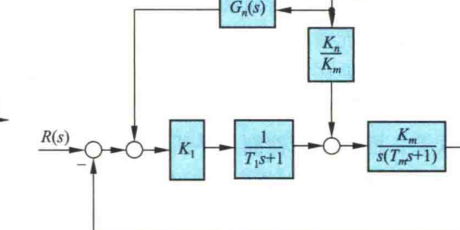
  <div style="font-style: italic; font-size: 0.92em; color: #666; margin-top: 0.35em;">图 6-31　带前馈补偿的随动系统结构图</div>
</div>

**解**　由图 6-31 可见，扰动对系统输出的影响由下式描述：

$$
C(s)=\frac{\dfrac{K_m}{s(T_ms+1)}\left[\dfrac{K_n}{K_m}+\dfrac{K_1}{T_1s+1}G_n(s)\right]N(s)}{1+\dfrac{K_1K_m}{s(T_1s+1)(T_ms+1)}}.
$$

令

$$
G_n(s)=-\frac{K_n}{K_1K_m}(T_1s+1),
$$

系统输出便可不受负载转矩扰动的影响。但是由于 $G_n(s)$ 的分子次数高于分母次数，故不便于物理实现。若令

$$
G_n(s)=-\frac{K_n}{K_1K_m}\frac{T_1s+1}{T_2s+1},\qquad T_1\gg T_2,
$$

则 $G_n(s)$ 在物理上能够实现，且达到近似全补偿要求，即在扰动信号作用的主要频段内进行了全补偿。此外，若取

$$
G_n(s)=-\frac{K_n}{K_1K_m},
$$

则在稳态时，系统输出完全不受扰动的影响。这就是稳态全补偿，它在物理上更易于实现。

采用前馈控制补偿扰动信号对系统输出的影响，是提高系统控制准确度的有效措施。但是，采用前馈补偿，首先要求扰动信号可以量测，其次要求前馈补偿装置在物理上是可实现的，并应力求简单。在实际应用中，多采用近似全补偿或稳态全补偿的方案。一般来说，主要扰动引起的误差，由前馈控制进行全部或部分补偿；次要扰动引起的误差，由反馈控制予以抑制。这样，在不提高开环增益的情况下，各种扰动引起的误差均可得到补偿，从而有利于同时兼顾提高系统稳定性和减小系统稳态误差的要求。此外，由于前馈控制是一种开环控制，要求构成前馈补偿装置的元部件具有较高的参数稳定性，否则将削弱补偿效果，并给系统输出造成新的误差。

### 3. 按输入补偿的复合校正

设按输入补偿的复合控制系统如图 6-32 所示。图中，$G(s)$ 为反馈系统的开环传递函数，$G_r(s)$ 为前馈补偿装置的传递函数。由图可知，系统的输出量为

$$
C(s)=[E(s)+G_r(s)R(s)]G(s). \tag{6-47}
$$

由于系统的误差

$$
E(s)=R(s)-C(s), \tag{6-48}
$$

所以可得

$$
C(s)=\frac{[1+G_r(s)]G(s)}{1+G(s)}R(s). \tag{6-49}
$$

<div align="center">
  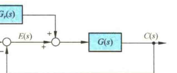
  <div style="font-style: italic; font-size: 0.92em; color: #666; margin-top: 0.35em;">图 6-32　按输入补偿的复合控制系统结构图</div>
</div>

如果选择前馈补偿装置的传递函数

$$
G_r(s)=\frac{1}{G(s)}, \tag{6-50}
$$

则式（6-49）变为 $C(s)=R(s)$，表明在式（6-50）成立的条件下，系统的输出量在任何时刻都可以完全无误地复现输入量，具有理想的时间响应特性。

为了说明前馈补偿装置能够完全消除误差的物理意义，将式（6-47）代入式（6-48），可得

$$
E(s)=\frac{[1-G_r(s)G(s)]}{1+G(s)}R(s). \tag{6-51}
$$

上式表明，在式（6-50）成立的条件下，恒有 $E(s)=0$；前馈补偿装置 $G_r(s)$ 的存在，相当于在系统中增加了一个输入信号 $G_r(s)R(s)$，其产生的误差信号与原输入信号 $R(s)$ 产生的误差信号相比，大小相等而方向相反。故式（6-50）称为对输入信号的误差全补偿条件。

由于 $G(s)$ 一般均具有比较复杂的形式，故全补偿条件（6-50）的物理实现相当困难。在工程实践中，大多采用满足跟踪精度要求的部分补偿条件，或者在对系统性能起主要影响的频段内实现近似全补偿，以使 $G_r(s)$ 的形式简单并易于物理实现。

为了便于分析按输入补偿的复合校正系统的误差和稳定性，需要引入等效开环传递函数的概念。由式（6-49）知，系统闭环传递函数为

$$
\Phi(s)=\frac{C(s)}{R(s)}=\frac{[1+G_r(s)]G(s)}{1+G(s)}. \tag{6-52}
$$

定义等效开环传递函数

$$
G_k(s)=\frac{\Phi(s)}{1-\Phi(s)}
=\frac{[1+G_r(s)]G(s)}{1-G_r(s)G(s)}. \tag{6-53}
$$

显然，式（6-52）和式（6-53）对于单位反馈复合控制系统才能成立。相应的误差传递函数为

$$
\Phi_e(s)=\frac{E(s)}{R(s)}=1-\Phi(s)
=\frac{1-G_r(s)G(s)}{1+G(s)}. \tag{6-54}
$$

上式亦可由式（6-51）直接导出。

在部分补偿情况下，$G_r(s)\ne1/G(s)$。设反馈系统的开环传递函数

$$
G(s)=\frac{K_v}{s(a_ns^{n-1}+a_{n-1}s^{n-2}+\cdots+a_2s+a_1)},
$$

相应的闭环传递函数

$$
\Phi(s)=\frac{K_v}{s(a_ns^{n-1}+a_{n-1}s^{n-2}+\cdots+a_2s+a_1)+K_v}. \tag{6-55}
$$

显然，这是Ⅰ型系统，存在常值速度误差，且加速度误差为无穷大。

若取输入信号的一阶导数作为前馈补偿信号，即

$$
G_r(s)=\lambda_1s,
$$

其中，常系数 $\lambda_1$ 表示前馈补偿信号的强度。此时，由式（6-52）得等效系统的闭环传递函数

$$
\Phi(s)=\frac{K_v(1+\lambda_1s)}{s(a_ns^{n-1}+a_{n-1}s^{n-2}+\cdots+a_2s+a_1)+K_v}. \tag{6-56}
$$

根据式（6-54），得等效系统的误差传递函数。当取 $\lambda_1=a_1/K_v$ 时，可得

$$
\Phi_e(s)=\frac{s^2(a_ns^{n-2}+a_{n-1}s^{n-3}+\cdots+a_2)}{s(a_ns^{n-1}+a_{n-1}s^{n-2}+\cdots+a_2s+a_1)+K_v}. \tag{6-57}
$$

于是，等效开环传递函数为

$$
G_k(s)=\frac{1-\Phi_e(s)}{\Phi_e(s)}
=\frac{a_1s+K_v}{s^2(a_ns^{n-2}+\cdots+a_2)}. \tag{6-58}
$$

上式表明，引入 $G_r(s)=\lambda_1s$ 的前馈补偿装置，并使 $\lambda_1=a_1/K_v$，可以使复合控制系统等效为Ⅱ型系统。此时，复合控制系统的速度误差为零，加速度误差为常值。利用式（6-57），根据终值定理方法不难验证这一结论。

若取输入信号的一阶导数和二阶导数的线性组合作为前馈补偿信号，即

$$
G_r(s)=\lambda_2s^2+\lambda_1s,
$$

则等效系统的闭环传递函数为

$$
\Phi(s)=\frac{K_v(1+\lambda_1s+\lambda_2s^2)}{s(a_ns^{n-1}+a_{n-1}s^{n-2}+\cdots+a_2s+a_1)+K_v}. \tag{6-59}
$$

取 $\lambda_1=a_1/K_v$、$\lambda_2=a_2/K_v$，可得

$$
\Phi_e(s)=\frac{s^3(a_ns^{n-3}+a_{n-1}s^{n-4}+\cdots+a_3)}{s(a_ns^{n-1}+a_{n-1}s^{n-2}+\cdots+a_2s+a_1)+K_v}, \tag{6-60}
$$

于是，等效开环传递函数为

$$
G_k(s)=\frac{a_2s^2+a_1s+K_v}{s^3(a_ns^{n-3}+a_{n-1}s^{n-4}+\cdots+a_3)}. \tag{6-61}
$$

由式（6-60）及式（6-61）可见，引入 $G_r(s)=\lambda_2s^2+\lambda_1s$ 的前馈补偿装置，并使 $\lambda_1=a_1/K_v$、$\lambda_2=a_2/K_v$，可以使复合控制系统等效为Ⅲ型系统。这时，复合控制系统的速度误差和加速度误差均为零，极大地提高了系统复现输入信号的能力和精度。

有时，前馈补偿信号不是加在系统的输入端，而是加在系统前向通路上某个环节的输入端，以简化误差全补偿条件，如图 6-33 所示。由图可知，复合控制系统的输出量、等效闭环传递函数及误差传递函数分别为

$$
C(s)=\frac{[G_1(s)+G_r(s)]G_2(s)}{1+G_1(s)G_2(s)}R(s),
$$

$$
\Phi(s)=\frac{[G_1(s)+G_r(s)]G_2(s)}{1+G_1(s)G_2(s)},
$$

$$
\Phi_e(s)=\frac{1-G_r(s)G_2(s)}{1+G_1(s)G_2(s)}. \tag{6-62}
$$

<div align="center">
  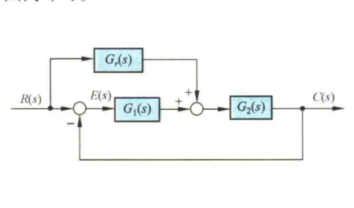
  <div style="font-style: italic; font-size: 0.92em; color: #666; margin-top: 0.35em;">图 6-33　按输入补偿的复合控制系统结构图</div>
</div>

由上式可见，当取

$$
G_r(s)=\frac{1}{G_2(s)} \tag{6-63}
$$

时，复合控制系统将实现误差全补偿。基于同样的理由，完全实现全补偿条件（6-63）是困难的。为了使 $G_r(s)$ 在物理上能够实现，通常只进行部分补偿，将系统误差减小至允许范围内即可。

从控制系统稳定性的角度来考察，比较式（6-55）、式（6-56）和式（6-59）可知，没有前馈控制时反馈控制系统的特征方程，与有前馈控制时复合控制系统的特征方程完全一致，表明系统的稳定性与前馈控制无关。因此，复合校正控制系统很好地解决了一般反馈控制系统在提高控制精度与确保系统稳定性之间存在的矛盾。

在控制工程实践中，输入信号的一阶导数和二阶导数，往往由测速发电机与无源网络的组合线路取得，如图 6-34 所示。由图可知，在假定无源网络的负载阻抗为无穷大且信号源内阻为零，即 $\beta R_w\approx0$ 的条件下，其中 $R_w$ 为测速发电机的分压电位器阻值，$\beta$ 为调整系数，无源网络的传递函数为

$$
G_c(s)=\frac{K_1(\tau s+1)}{Ts+1},
$$

其中

$$
K_1=\frac{R_2}{R_1+R_2},\qquad \tau=R_1C_1,\qquad T=\frac{R_1R_2C_1}{R_1+R_2}.
$$

<div align="center">
  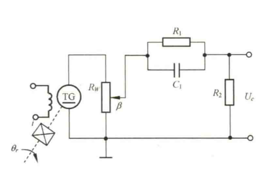
  <div style="font-style: italic; font-size: 0.92em; color: #666; margin-top: 0.35em;">图 6-34　测速发电机与无源网络的组合</div>
</div>

当不考虑负载效应时，整个测速发电机和无源网络的组合线路的传递函数为

$$
G_r(s)=K_1\frac{\tau s+1}{Ts+1}\,\beta K_ts
=\frac{\lambda_2s^2+\lambda_1s}{Ts+1}, \tag{6-64}
$$

式中

$$
\lambda_1=K_1K_t\beta,\qquad \lambda_2=K_1K_t\beta\tau,
$$

$K_t$ 为测速发电机的比电压（输出斜率）。显然，调整 $K_1$、$\beta$ 和 $\tau$ 的数值，可以使 $\lambda_1$ 和 $\lambda_2$ 满足设计要求。

由式（6-64）可见，由于无源网络无法提供纯微分信号，因此在前馈装置传递函数的分母上增加了一项寄生因式 $(Ts+1)$。在这种情况下，等效系统的闭环传递函数（6-59）演变为

$$
\Phi(s)=\frac{K_v[1+(\lambda_1+T)s+\lambda_2s^2]}{(Ts+1)[s(a_ns^{n-1}+a_{n-1}s^{n-2}+\cdots+a_2s+a_1)+K_v]}. \tag{6-65}
$$

根据式（6-54），可得等效系统的误差传递函数。若取

$$
\lambda_1=\frac{a_1}{K_v},\qquad \lambda_2=\frac{a_2+a_1T}{K_v}, \tag{6-66}
$$

也即 $K_1$、$\beta$ 和 $\tau$ 的选择，应使下列关系式成立：

$$
\beta=\frac{a_1}{K_1K_tK_v},\qquad
\tau=\frac{a_2+a_1T}{K_1K_tK_v\beta}, \tag{6-67}
$$

则等效开环传递函数为

$$
G_k(s)=\frac{(a_2+a_1T)s^2+(a_1+K_vT)s+K_v}{s^3[a_nTs^{n-2}+(a_n+a_{n-1}T)s^{n-3}+\cdots+(a_3+a_2T)]}. \tag{6-68}
$$

上式表明，若条件式（6-66）或式（6-67）成立，等效系统成为Ⅲ型系统，其速度误差及加速度误差均为零。

比较式（6-59）与式（6-65）可以看出，当前馈装置的传递函数为式（6-64）形式时，复合控制系统的特征方程也同样增加了因子 $(Ts+1)$，从而使闭环系统增加了一个 $s=-1/T$ 的极点。由于增加的闭环极点位于左半 $s$ 平面，对系统的稳定性没有影响，但是对系统的动态性能有影响。在设计系统时，应注意选择无源网络的 $R$ 和 $C$ 的数值，除使 $T$ 值满足式（6-67）外，还应使 $T$ 值较小，从而使附加闭环极点 $-1/T$ 远离虚轴，对系统动态性能的影响甚微。

不难理解，$G_r(s)=\lambda_1s$ 的前馈补偿规律可直接用测速发电机实现。为了便于调整参数，测速发电机的输出端应跨接分压电位器。

**例 6-9**　设复合校正随动系统如图 6-35 所示。试选择前馈补偿方案和参数，使复合控制系统等效为Ⅱ型或Ⅲ型系统。

<div align="center">
  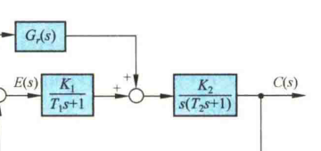
  <div style="font-style: italic; font-size: 0.92em; color: #666; margin-top: 0.35em;">图 6-35　复合校正随动系统结构图</div>
</div>

**解**　前馈补偿方案及其参数选择，可按如下几步讨论。

1）选择 $G_r(s)=\lambda_1s$。在图 6-35 中，令

$$
G_1(s)=\frac{K_1}{T_1s+1},\qquad G_2(s)=\frac{K_2}{s(T_2s+1)},
$$

$$
G(s)=G_1(s)G_2(s)=\frac{K_1K_2}{s[T_1T_2s^2+(T_1+T_2)s+1]}.
$$

易知：未补偿系统为Ⅰ型系统，且 $a_3=T_1T_2$、$a_2=T_1+T_2$、$a_1=1$。由式（6-62）得等效系统的误差传递函数

$$
\Phi_e(s)=\frac{T_1T_2s^3+(T_1+T_2-\lambda_1K_2T_1)s^2+(1-\lambda_1K_2)s}{s(T_1s+1)(T_2s+1)+K_1K_2}.
$$

显然，若选

$$
\lambda_1=\frac{1}{K_2},
$$

则复合控制系统等效为Ⅱ型系统，在斜坡函数输入时的稳态误差为零。实质上，取 $\lambda_1=1/K_2$ 只是一种部分补偿。

2）选择 $G_r(s)=\lambda_2s^2+\lambda_1s$。不难求得等效系统的闭环传递函数

$$
\Phi(s)=\frac{K_1K_2+K_2(\lambda_2s^2+\lambda_1s)(T_1s+1)}{s(T_1s+1)(T_2s+1)+K_1K_2},
$$

以及等效误差传递函数

$$
\Phi_e(s)=\frac{(T_1T_2-K_2T_1\lambda_2)s^3+(T_1+T_2-K_2T_1\lambda_1-K_2\lambda_2)s^2+(1-K_2\lambda_1)s}{s(T_1s+1)(T_2s+1)+K_1K_2}.
$$

若选

$$
\lambda_1=\frac{1}{K_2},\qquad \lambda_2=\frac{T_2}{K_2},
$$

可使 $\Phi_e(s)=0$。此时，由于满足误差全补偿条件 $G_r(s)=1/G_2(s)$，故复合校正系统对任何形式的输入信号均不产生误差。但是

$$
G_r(s)=\frac{s(T_2s+1)}{K_2}
$$

的形式难以准确实现，只能在对系统性能起主要影响的频段范围内近似实现。

3）选择

$$
G_r(s)=\frac{\lambda_2s^2+\lambda_1s}{Ts+1}.
$$

不难证明，当取

$$
\lambda_1=\frac{1}{K_2},\qquad \lambda_2=\frac{T_2+T}{K_2},
$$

复合校正系统等效为Ⅲ型系统，在加速度函数输入作用下，系统的稳态误差为零。在物理装置上，可考虑采用测速发电机与无源网络的组合线路近似实现上述补偿方案。

## 6-6　控制系统校正设计

**例 6-10　磁盘驱动读取系统（续）**

当忽略电机磁场影响时，具有 PD 控制器的磁盘驱动系统如图 6-36 所示。为了消除 PD 控制形成的零点因式 $(s+z)$ 对闭环动态性能的不利影响，系统配置了前置滤波器 $G_p(s)$。要求设计 PD 控制器 $G_c(s)$ 和前置滤波器 $G_p(s)$，使系统成为最小节拍响应系统，并满足以下设计指标：①单位阶跃响应超调量 $\sigma\%<5\%$；②单位阶跃响应调节时间 $t_s<50\ \mathrm{ms}$（$\Delta=2\%$）；③单位阶跃扰动作用下的最大响应小于 $5\times10^{-3}$。

<div align="center">
  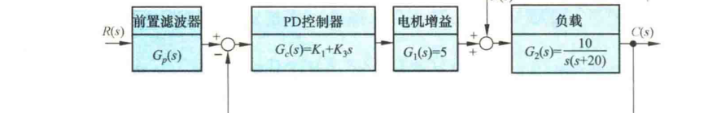
  <div style="font-style: italic; font-size: 0.92em; color: #666; margin-top: 0.35em;">图 6-36　带有 PD 控制器的磁盘驱动器控制系统（二阶系统模型）结构图</div>
</div>

**解**　由图 6-36 知，当不考虑 $G_p(s)$ 时，系统开环传递函数为

$$
G(s)=G_c(s)G_1(s)G_2(s)=\frac{50(K_1+K_3s)}{s(s+20)}.
$$

相应的闭环传递函数为

$$
\Phi(s)=\frac{G(s)}{1+G(s)}
=\frac{50(K_1+K_3s)}{s^2+(20+50K_3)s+50K_1}.
$$

由表 6-3 知，二阶最小节拍响应系统的标准化闭环传递函数为

$$
\Phi(s)=\frac{\omega_n^2}{s^2+\alpha\omega_ns+\omega_n^2},\qquad \alpha=1.82.
$$

标准化调节时间应为

$$
\omega_nt_s=4.82.
$$

根据设计指标要求，$t_s<50\ \mathrm{ms}$，应有 $\omega_n>96.4$，于是可取 $\omega_n=120$，其对应的调节时间

$$
t_s=\frac{4.82}{120}=40.2\ \mathrm{ms}<50\ \mathrm{ms}\qquad(\Delta=2\%),
$$

可以满足设计要求。这样，二阶最小节拍系统的标准化闭环传递函数为

$$
\Phi(s)=\frac{14400}{s^2+218.4s+14400}.
$$

令实际闭环传递函数与标准化闭环传递函数分母相等，有

$$
218.4=20+50K_3,\qquad 14400=50K_1.
$$

解得 $K_1=288$、$K_3=3.968$。于是，所需的 PD 控制器为

$$
G_c(s)=K_1+K_3s=3.968(s+72.58).
$$

为了消除 PD 控制器新增闭环零点 $(s+72.58)$ 的不利影响，将前置滤波器取为

$$
G_p(s)=\frac{72.58}{s+72.58}.
$$

最后，对所设计的系统进行仿真测试。无前置滤波器时单位阶跃输入响应如图 6-37 所示，仿真表明，闭环零点可以缩短系统的上升时间，但恶化了系统的超调量。

<div align="center">
  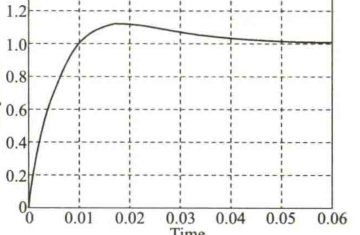
  <div style="font-style: italic; font-size: 0.92em; color: #666; margin-top: 0.35em;">图 6-37　无前置滤波器时系统的时间响应（MATLAB）</div>
</div>

有前置滤波器时系统的单位阶跃时间响应如图 6-38（a）所示，其动态性能大为改善，超调量 $\sigma\%=0.1\%$，调节时间 $t_s=40\ \mathrm{ms}$（$\Delta=2\%$）；同时，图 6-38（b）所示的有前置滤波器时系统的单位阶跃扰动响应，表明系统能有效抑制扰动的影响，最大扰动响应值为 $6.9\times10^{-4}$，从而全部满足设计指标要求。

<div align="center">
  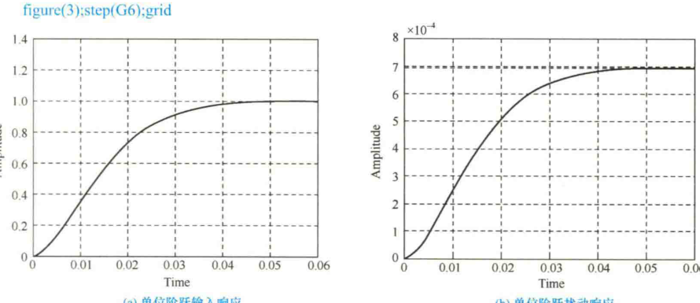
  <div style="font-style: italic; font-size: 0.92em; color: #666; margin-top: 0.35em;">图 6-38　有前置滤波器时系统的时间响应（MATLAB）</div>
</div>

MATLAB 文本：

```matlab
K1=288; K3=3.968;
Gc=tf([K3,K1],1);             % PD控制器的传递函数
G1=5;
G2=tf(10,[1,20,0]);           % 负载传递函数
Gp=tf(72.58,[1,72.58]);       % 前置滤波器的传递函数
G3=series(Gc,G1);
G=series(G3,G2);
G4=feedback(G,1);             % 无前置滤波器时系统的闭环传递函数
G5=series(Gp,G4);             % 有前置滤波器时系统的闭环传递函数
G6=feedback(G2,G3);           % 系统的扰动闭环传递函数
figure(1); step(G4); grid
figure(2); step(G5); grid
figure(3); step(G6); grid
```
