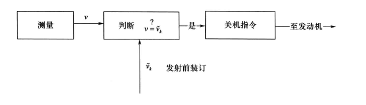
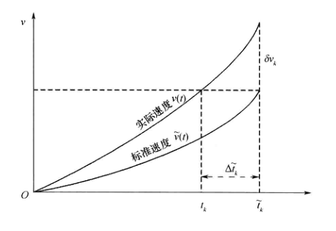
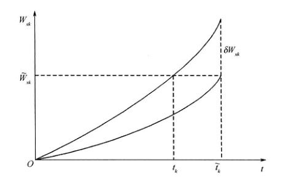
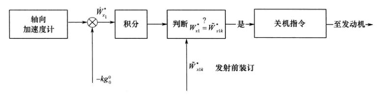
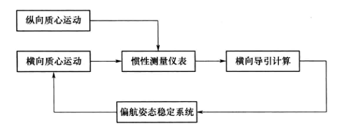
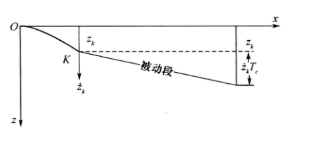

<!--
来源：远程火箭飞行动力学与制导（陈克俊）PDF，第 268-293 页。
本文件按扫描页重新校对；正文不保留分页标记。
-->

# 第7章 主动段的摄动制导方法

## 7.1 弹道摄动的基本原理

### 7.1.1 摄动法的基本思想

飞行力学介绍了飞行器的运动特性，给出了飞行中的运动方程与弹道计算方法。从理论上说，如果知道了发射条件，也就是给出运动方程的一组起始条件，则可以唯一地确定一条弹道。实际上，影响其运动的因素很多，诸如飞行运动的环境条件、弹体本身的特征参数、发动机与控制系统的特性，都会对弹道产生影响，因此，即使给定了发射条件，也无法准确地确定实际运动轨迹，事先只能给出运动的某些平均规律，设法使实际运动规律对这些平均运动规律的偏差是小量，那么就可在平均运动规律的基础上，利用小偏差理论来研究这些偏差对弹体运动特性的影响，称为弹道摄动理论。

#### 1. 标准条件与标准弹道

为了能反映出飞行器质心运动的“平均”运动情况，需要作出标准条件和标准弹道方程的假设，利用标准弹道方程在标准条件下计算出来的弹道叫标准弹道。

标准条件和标准弹道方程会随着研究问题的内容和性质不同而有所不同。不同的研究内容，可以有不同的标准条件和标准弹道方程，目的在于保证实际运动弹道对标准弹道的小偏差。

标准条件可以概括为下面三方面：

（1）地理条件：地球形状、旋转、重力加速度。

（2）气象条件：大气、气温、气压、密度。

（3）弹道条件：弹的尺寸、空气动力系数、重量、发动机推力以及控制系统放大系数等。

#### 2. 研究“扰动”对弹道偏差关系的方法

把实际弹道飞行条件和标准弹道飞行条件的偏差叫做“摄动”或“扰动”。扰动包括瞬时扰动与经常扰动，或称随机扰动与系统扰动。

研究“扰动”与弹道偏差的关系有两种方法：

（1）方法之一是“求差法”，分别求解标准条件下的弹道方程和实际条件下的弹道方程，将实际弹道参数和标准弹道参数求差。其优点是不论干扰大小都可避免运动稳定性问题；缺点是计算工作量大；扰动小时，仅仅是两个大数相减，会带来较大的计算误差，要求计算机有较长字长；不便于分析干扰与弹道偏差之间的关系，不方便应用于制导。

> 1. 两种弹道如何求解：采用同一组完整的非线性运动方程。第一次代入标称初始条件、标称结构与推力参数以及标准环境，数值积分得到标准弹道；第二次代入含初始偏差、参数偏差和环境干扰的实际条件，数值积分得到实际弹道，最后在相同时刻或同一特征点比较两组结果。
>
> 2. 两类弹道参数是什么：弹道参数是描述火箭飞行状态的量，例如位置、速度、弹道倾角、飞行时间和落点坐标。按标称条件计算的量是标准弹道参数，按受扰条件计算的量是实际弹道参数。
>
> 3. 运动稳定性限制：两条弹道均由原非线性方程独立求解，求差法不需要把实际弹道在标准弹道附近线性化，也不要求摄动方程的解保持稳定，所以干扰较大时仍可计算。这里不是说它能够消除火箭实际运动的不稳定，而是说它不受线性摄动方程稳定性条件的限制。
>
> 4. 计算工作量大：标准弹道和实际弹道都要进行一次完整的数值积分；改变干扰类型、干扰大小或参数后，通常还要重新计算实际弹道，因此需要反复求解整套运动方程。
>
> 5. 误差较大：扰动很小时，两组弹道参数非常接近，偏差由两个近似相等的大数相减得到，前面的相同有效数字被抵消，舍入误差便可能在结果中占较大比例，因此需要更高的计算精度和较长字长。
>
> 6. 不便用于制导：求差法只能直接给出某组干扰对应的最终差值，不能显式表示各干扰量与弹道偏差之间的灵敏度关系，难以据此快速计算制导修正量，因而不便直接用于实时制导。

（2）方法之二是“摄动法”，亦称微分法，一般情况下扰动较小可将实际弹道在标准弹道附近展开，取到一阶项来进行研究。摄动法实际上就是线性化法，该方法存在运动稳定性问题。

> 1. 在标准弹道附近展开的是什么：展开的是实际弹道所满足的非线性运动方程。把实际位置、速度、姿态等状态量以及有关参数写成“标准值加摄动量”，再将运动方程右端关于这些状态量、参数和外界干扰在标准弹道处作泰勒展开。保留一阶项后，便得到以各弹道参数偏差为未知量的线性摄动方程，用来近似描述实际弹道相对标准弹道的偏离。
>
> 2. 存在什么运动稳定性问题：线性摄动方程的解可能包含随时间增长的模态，使很小的初始偏差、参数扰动或计算误差不断放大。当摄动量增长到不能再视为小量时，忽略二阶及更高阶项的线性近似便会失效，计算结果也可能明显偏离真实弹道。因此，摄动法通常只适用于标准弹道附近且摄动量在所研究时间内保持足够小的情况；这里的“稳定性问题”不是摄动法使火箭产生了不稳定，而是要判断标准运动附近的偏差会衰减、保持有界还是不断增长。

### 7.1.2 用摄动法研究扰动因素对导弹落点偏差的影响

在给定发射条件下标准弹道通过目标，在实际情况下，由于各种扰动因素的影响，实际弹道将偏离标准弹道而产生落点偏差。影响落点偏差的因素很多，可分为两类：其一为随机扰动因素，其特点是随机的、无法预知的，由此而引起落点对目标散布，可用数理统计的方法研究散布特性；其二为系统扰动因素，其特点是非随机的，理论上说是确定的，但受条件的限制，不能确切掌握精确值，如起飞重量、燃耗后质量等，在标准条件选择适当时，系统扰动为小量，可用摄动法来研究。

由于实际射程（包含射程偏差 $\Delta L$ 与横程偏差 $\Delta H$）是实际飞行条件的函数，也就是发射时的实际气温、气压、重力加速度、发动机推力、空气动力系数等一系列参数的函数，用 $\lambda_i(i=1,2,\cdots,n)$ 来表示，用 $L_{\text{全}}$ 来表示全射程，则

$$
\begin{equation}
L_{\text{全}}=L_{\text{全}}(\lambda_1,\lambda_2,\cdots,\lambda_n).
\tag{7-1-1}
\end{equation}
$$

这里需强调的是 $\lambda_i(i=1,2,\cdots,n)$ 应是相互独立的，例如气温、压力和大气密度 $(T,P,\rho)$ 三个参数满足 $P=\rho gRT$，故只有两个独立参数。

把对应于标准飞行条件和标准弹道的参数上加“$\sim$”表示，则标准条件下的标准射程为

$$
\begin{equation}
\widetilde L_{\text{全}}
=\widetilde L_{\text{全}}(\widetilde\lambda_1,\widetilde\lambda_2,\cdots,\widetilde\lambda_n).
\tag{7-1-2}
\end{equation}
$$

而实际条件下的实际射程为

$$
\begin{equation}
L_{\text{全}}=L_{\text{全}}(\lambda_1,\lambda_2,\cdots,\lambda_n).
\tag{7-1-3}
\end{equation}
$$

如果令 $\Delta L_{\text{全}}=L_{\text{全}}-\widetilde L_{\text{全}}$，$\Delta\lambda_i=\lambda_i-\widetilde\lambda_i\ (i=1,2,\cdots,n)$，将实际射程在标准射程附近展开，则

$$
\begin{equation}
\Delta L_{\text{全}}
=\sum_{i=1}^{n}\frac{\partial L_{\text{全}}}{\partial\lambda_i}\Delta\lambda_i.
\tag{7-1-4}
\end{equation}
$$

用方程式(7-1-4)来研究由扰动 $\Delta\lambda_i$ 引起的射程偏差 $\Delta L_{\text{全}}$ 的方法就是摄动法。故摄动法的实质就是用线性函数来逼近非线性函数，或者说是用线性微分方程来逼近非线性微分方程。

由于在弹道不同段的运动情况不同，因而扰动也不同。弹道的射程可表达为

$$
\begin{equation}
L_{\text{全}}=L_{\text{主}}+L_{\text{自}}+L_{\text{再}}.
\tag{7-1-5}
\end{equation}
$$

其中，自由段射程只与主动段终点参数有关，即

$$
\begin{equation}
L_{\text{自}}=L_{\text{自}}(v_{xk},v_{yk},v_{zk},x_k,y_k,z_k).
\tag{7-1-6}
\end{equation}
$$

近似地可将再入段看成是自由段弹道的继续，可将射程偏差系数统一起来计算。

与被动段相比，主动段情况比较复杂，影响因素很多，最终的结果是引起主动段终点坐标与速度的偏差。因此，在进行摄动制导方法研究时，我们感兴趣的在于主动段终点弹道参数的偏差会引起多大的射程偏差，在考虑地球旋转影响时，可将全射程写成

$$
\begin{equation}
L_{\text{全}}=L_{\text{全}}(v_{xk},v_{yk},v_{zk},x_k,y_k,z_k,t_k).
\tag{7-1-7}
\end{equation}
$$

其中，$v_{xk},v_{yk},v_{zk},x_k,y_k,z_k,t_k$ 分别为关机点惯性坐标下的速度、位置与时间。

如果将落点偏差分解成射程偏差 $\Delta L$ 与横程偏差 $\Delta H$，则包括主动段射程偏差的全射程偏差系数为

$$
\begin{equation}
\left\{
\begin{aligned}
\Delta L={}&
\dfrac{\partial L}{\partial v_{xk}}\Delta v_{xk}
+\dfrac{\partial L}{\partial v_{yk}}\Delta v_{yk}
+\dfrac{\partial L}{\partial v_{zk}}\Delta v_{zk}\\
&+\dfrac{\partial L}{\partial x_k}\Delta x_k
+\dfrac{\partial L}{\partial y_k}\Delta y_k
+\dfrac{\partial L}{\partial z_k}\Delta z_k
+\dfrac{\partial L}{\partial t_k}\Delta t_k,\\[6pt]
\Delta H={}&
\dfrac{\partial H}{\partial v_{xk}}\Delta v_{xk}
+\dfrac{\partial H}{\partial v_{yk}}\Delta v_{yk}
+\dfrac{\partial H}{\partial v_{zk}}\Delta v_{zk}\\
&+\dfrac{\partial H}{\partial x_k}\Delta x_k
+\dfrac{\partial H}{\partial y_k}\Delta y_k
+\dfrac{\partial H}{\partial z_k}\Delta z_k
+\dfrac{\partial H}{\partial t_k}\Delta t_k.
\end{aligned}
\right.
\tag{7-1-8}
\end{equation}
$$

给定主动段终点的绝对弹道运动参量和起始发射点方位角与纬度，即可求出全射程偏差量。

### 7.1.3 主动段摄动方程的建立

由于弹道主动段射程较小，研究扰动因素对主动弹道参数偏差的影响时，可将纵向运动和侧向运动看成互相独立的两个运动，只研究纵向运动，其运动方程为

$$
\begin{equation}
\begin{cases}
\dot v(t)=\dfrac{1}{m}\left(P_e\cos\alpha-C_xqS_m-R'\delta_\varphi\sin\alpha\right)+g\sin\theta
\triangleq f_1(v,\theta,y,\alpha,\delta_\varphi,\lambda_i),\\[4pt]
\dot\theta(t)=\dfrac{1}{mv}\left(P_e\sin\alpha+C_y^\alpha qS_m\alpha+R'\delta_\varphi\cos\alpha\right)+\dfrac{g}{v}\cos\theta
\triangleq f_2(v,\theta,y,\alpha,\delta_\varphi,\lambda_i),\\[4pt]
\dot x(t)=v\cos\theta\triangleq f_3(v,\theta),\\
\dot y(t)=v\sin\theta\triangleq f_4(v,\theta),\\[4pt]
\dot W_{x1}=\dfrac{1}{m}\left(P_e-C_xqS_m\cos\alpha+C_y^\alpha qS_m\alpha\sin\alpha\right)
\triangleq f_5(v,\theta,y,\alpha,\delta_\varphi,\lambda_i),\\[4pt]
\dot W_{y1}=\dfrac{1}{m}\left(C_xqS_m\sin\alpha+C_y^\alpha qS_m\alpha\cos\alpha+2R'\delta_\varphi\right)
\triangleq f_6(v,\theta,y,\alpha,\delta_\varphi,\lambda_i),\\[4pt]
M_{z1}^{\alpha}\alpha+M_{z1}^{\delta}\delta_\varphi=0,\\
\delta_\varphi=a_0^\varphi(\theta+\alpha-\varphi_{pr}).
\end{cases}
\tag{7-1-9}
\end{equation}
$$

式中：前四个是质心运动方程，$\lambda_i$ 为诸干扰因素；第五、六式是视加速度方程，由此可求出扰动因素引起视速度的偏差；第七式是“力矩瞬时平衡”方程；第八式是控制方程，$a_0^\varphi$ 为放大系数。

如果将第八式的 $\delta_\varphi$ 表达式代入前几式，可消去 $\delta_\varphi$，那么

$$
\begin{equation}
\begin{cases}
\dot v(t)=f_1(v,\theta,y,\alpha,\lambda_i),\\
\dot\theta(t)=f_2(v,\theta,y,\alpha,\lambda_i),\\
\dot x(t)=f_3(v,\theta),\\
\dot y(t)=f_4(v,\theta),\\
\dot W_{x1}=f_5(v,\theta,y,\alpha,\lambda_i),\\
\dot W_{y1}=f_6(v,\theta,y,\alpha,\lambda_i),\\
M_{z1}^{\alpha}\alpha+M_{z1}^{\delta}a_0^\varphi(\theta+\alpha-\varphi_{pr})=0.
\end{cases}
\tag{7-1-10}
\end{equation}
$$

在方程组(7-1-10)中，第五、六式独立，其余五式包含 $v,\theta,x,y,\alpha$ 五个未知参数。如果在标准条件下，对给定起始条件用数值积分式(7-1-10)，则可解出标准弹道运动参数

$$
\widetilde v(t),\ \widetilde\theta(t),\ \widetilde x(t),\ \widetilde y(t),\ \widetilde\alpha(t),\ \widetilde W_{x1}(t),\ \widetilde W_{y1}(t).
$$

实际情况下，飞行条件将偏离标准条件，则运动参数的等时偏差为

$$
\begin{cases}
\Delta v(t)=v(t)-\widetilde v(t),\\
\delta\theta(t)=\theta(t)-\widetilde\theta(t),\\
\delta x(t)=x(t)-\widetilde x(t),\\
\delta y(t)=y(t)-\widetilde y(t),\\
\delta\alpha(t)=\alpha(t)-\widetilde\alpha(t),\\
\delta W_{x1}(t)=W_{x1}(t)-\widetilde W_{x1}(t),\\
\delta W_{y1}(t)=W_{y1}(t)-\widetilde W_{y1}(t).
\end{cases}
$$

根据变分与微分算子的可交换律，等时偏差的导数等于导数的等时偏差，即

$$
\frac{d}{dt}\delta v(t)=\delta\dot v(t).
$$

以 $\widetilde\lambda_i$ 表示标准飞行条件，$\lambda_i$ 表示实际飞行条件，则 $\delta\lambda_i=\lambda_i-\widetilde\lambda_i$ 为扰动，在小扰动情况下，可将实际弹道在标准弹道附近展开，则

$$
\begin{equation}
\begin{cases}
\delta\dot v=a_{11}\delta v+a_{12}\delta\theta+a_{13}\delta y+a_{14}\delta\alpha
+\displaystyle\sum_{i=1}^{n}\dfrac{\partial f_1}{\partial\lambda_i}\delta\lambda_i,\\
\delta\dot\theta=a_{21}\delta v+a_{22}\delta\theta+a_{23}\delta y+a_{24}\delta\alpha
+\displaystyle\sum_{i=1}^{n}\dfrac{\partial f_2}{\partial\lambda_i}\delta\lambda_i,\\
\delta\dot y=a_{31}\delta v+a_{32}\delta\theta,\\
\delta\dot x=a_{41}\delta v+a_{42}\delta\theta,\\
a_{51}\delta v+a_{52}\delta\theta+a_{53}\delta y+a_{54}\delta\alpha
+\displaystyle\sum_{i=1}^{n}\dfrac{\partial M_{z1}}{\partial\lambda_i}\delta\lambda_i=0,\\
\delta\dot W_{x1}=a_{61}\delta v+a_{62}\delta\theta+a_{63}\delta y+a_{64}\delta\alpha
+\displaystyle\sum_{i=1}^{n}\dfrac{\partial f_5}{\partial\lambda_i}\delta\lambda_i,\\
\delta\dot W_{y1}=a_{71}\delta v+a_{72}\delta\theta+a_{73}\delta y+a_{74}\delta\alpha
+\displaystyle\sum_{i=1}^{n}\dfrac{\partial f_6}{\partial\lambda_i}\delta\lambda_i.
\end{cases}
\tag{7-1-11}
\end{equation}
$$

其中，$\sum \partial f_1/\partial\lambda_i\,\delta\lambda_i$、$\sum \partial f_2/\partial\lambda_i\,\delta\lambda_i$、$\sum \partial M_{z1}/\partial\lambda_i\,\delta\lambda_i$、$\sum \partial f_5/\partial\lambda_i\,\delta\lambda_i$、$\sum \partial f_6/\partial\lambda_i\,\delta\lambda_i$ 为由诸扰动因素而产生的 $\dot v,\dot\theta,M_{z1},\dot W_{x1},\dot W_{y1}$ 的增量，分别令其为 $\varepsilon_v,\varepsilon_\theta,M_D,\varepsilon_{W_x},\varepsilon_{W_y}$，并从第五式中解出

$$
\delta\alpha=-\frac{1}{a_{54}}(a_{51}\delta v+a_{52}\delta\theta+a_{53}\delta y+M_D),
$$

代入式(7-1-11)消去 $\delta\alpha$，则得

$$
\begin{equation}
\frac{d\boldsymbol\xi}{dt}=A\boldsymbol\xi+\boldsymbol F.
\tag{7-1-12}
\end{equation}
$$

其中

$$
\boldsymbol\xi=
\begin{bmatrix}
\delta v&\delta\theta&\delta y&\delta x&\delta W_{x1}&\delta W_{y1}
\end{bmatrix}^{T},
\qquad
\boldsymbol F=
\begin{bmatrix}
\varepsilon'_v&\varepsilon'_\theta&0&0&\varepsilon'_{W_x}&\varepsilon'_{W_y}
\end{bmatrix}^{T},
$$

$$
A=
\begin{bmatrix}
a'_{11}&a'_{12}&a'_{13}&0&0&0\\
a'_{21}&a'_{22}&a'_{23}&0&0&0\\
a'_{31}&a'_{32}&0&0&0&0\\
a'_{41}&a'_{42}&0&0&0&0\\
a'_{61}&a'_{62}&a'_{63}&0&0&0\\
a'_{71}&a'_{72}&a'_{73}&0&0&0
\end{bmatrix}.
$$

故

$$
\begin{equation}
\boldsymbol\xi(t)=\Phi(t,t_0)\boldsymbol\xi(t_0)
+\int_{t_0}^{t}\Phi(t,\tau)\boldsymbol F(\tau)\,d\tau.
\tag{7-1-13}
\end{equation}
$$

其中，$\Phi(t,\tau)$ 为状态转移矩阵。给出各参数的初始偏差，根据方程式(7-1-13)可以计算任意时间的运动参数偏差。

### 7.1.4 弹体结构参数偏差对主动段弹道的影响

影响主动段弹道特性的因素很多，诸如发射条件偏差 $(\Delta B_0,\Delta\lambda_0,\Delta A_0,\Delta h_0)$，环境的变化 $(T,p,\rho)$，所采用的引力模型，风的影响和弹体结构参数的偏差等。本节仅研究弹体结构参数偏差对主动段弹道的影响。

#### 1. 弹体结构参数的偏差

结构参数的偏差是由安装和制造误差引起的，对于一个二级火箭，其主要的结构参数偏差为

$$
\begin{aligned}
\Delta\lambda_1&=\Delta G_{01}, &&\text{一级重量偏差},\\
\Delta\lambda_2&=\Delta\dot G_1, &&\text{一级秒耗量偏差},\\
\Delta\lambda_3&=\Delta P_{sp01}, &&\text{一级真空有效比推力偏差},\\
\Delta\lambda_4&=\Delta\left(\frac{1}{2}\rho_0S_{\max}\right), &&\text{主动段气动力特征系数偏差},\\
\Delta\lambda_5&=\Delta i=\frac{C_x-\widetilde C_x}{\widetilde C_x}, &&\text{主动段弹形系数偏差},\\
\Delta\lambda_6&=\Delta(\sigma_a\rho_0), &&\text{二级发动机高度特征系数偏差},\\
\Delta\lambda_7&=\Delta\varphi_{pr}, &&\text{主动段程序角偏差},\\
\Delta\lambda_8&=\Delta G_{02}, &&\text{二级重量偏差},\\
\Delta\lambda_9&=\Delta\dot G_2, &&\text{二级秒耗量偏差},\\
\Delta\lambda_{10}&=\Delta P_{sp02}, &&\text{二级真空有效比推力偏差},\\
\Delta\lambda_{11}&=\Delta v_{20}, &&\text{一级后效冲量偏差引起二级初始速度偏差},\\
\Delta\lambda_{12}&=\Delta W_{I1}, &&\text{一级预令关机点视速度误差}.
\end{aligned}
$$

根据式(7-1-9)，可求出 $\partial f_i/\partial\lambda_j\ (i=1,2,\cdots,6;\ j=1,2,\cdots,12)$，故方程式(7-1-12)中的扰动项为

$$
\begin{equation}
\boldsymbol F=
\begin{bmatrix}
\varepsilon'_v\\
\varepsilon'_\theta\\
0\\
0\\
\varepsilon'_{W_x}\\
\varepsilon'_{W_y}
\end{bmatrix}
=
\begin{bmatrix}
\dfrac{\partial f_1}{\partial\lambda_1}&\cdots&\dfrac{\partial f_1}{\partial\lambda_{12}}\\
\dfrac{\partial f_2}{\partial\lambda_1}&\cdots&\dfrac{\partial f_2}{\partial\lambda_{12}}\\
0&\cdots&0\\
0&\cdots&0\\
\dfrac{\partial f_5}{\partial\lambda_1}&\cdots&\dfrac{\partial f_5}{\partial\lambda_{12}}\\
\dfrac{\partial f_6}{\partial\lambda_1}&\cdots&\dfrac{\partial f_6}{\partial\lambda_{12}}
\end{bmatrix}
\begin{bmatrix}
\delta\lambda_1\\ \vdots\\ \delta\lambda_{12}
\end{bmatrix}.
\tag{7-1-14}
\end{equation}
$$

再代入方程式(7-1-13)，可求出等时偏差 $\delta v,\delta\theta,\delta y,\delta x,\delta W_{x1},\delta W_{y1}$。如果不考虑起始条件的偏差，则分别可简记为

$$
\begin{equation}
\begin{cases}
\delta v=\displaystyle\sum_{k=1}^{12}\xi_{1k}\delta\lambda_k,\\
\delta\theta=\displaystyle\sum_{k=1}^{12}\xi_{2k}\delta\lambda_k,\\
\delta y=\displaystyle\sum_{k=1}^{12}\xi_{3k}\delta\lambda_k,\\
\delta x=\displaystyle\sum_{k=1}^{12}\xi_{4k}\delta\lambda_k,\\
\delta W_{x1}=\displaystyle\sum_{k=1}^{12}\xi_{5k}\delta\lambda_k,\\
\delta W_{y1}=\displaystyle\sum_{k=1}^{12}\xi_{6k}\delta\lambda_k.
\end{cases}
\tag{7-1-15}
\end{equation}
$$

#### 2. 射程等时偏差

如果主动段终点是利用实际飞行时间 $t_k$ 等于标准飞行时间 $\widetilde t_k$ 时关机，则利用式(7-1-15)，可得由结构参数所引起的射程等时偏差

$$
\begin{equation}
\begin{aligned}
\delta L
&=\frac{\partial L}{\partial v_k}\delta v_k
+\frac{\partial L}{\partial\theta_k}\delta\theta_k
+\frac{\partial L}{\partial y_k}\delta y_k
+\frac{\partial L}{\partial x_k}\delta x_k\\
&=\frac{\partial L}{\partial v_k}\sum_{i=1}^{12}\xi_{1i}\delta\lambda_i
+\frac{\partial L}{\partial\theta_k}\sum_{i=1}^{12}\xi_{2i}\delta\lambda_i
+\frac{\partial L}{\partial y_k}\sum_{i=1}^{12}\xi_{3i}\delta\lambda_i
+\frac{\partial L}{\partial x_k}\sum_{i=1}^{12}\xi_{4i}\delta\lambda_i\\
&=\sum_{i=1}^{12}Z_i\delta\lambda_i.
\end{aligned}
\tag{7-1-16}
\end{equation}
$$

#### 3. 非等时关机的射程偏差

如果不采用等时关机，实际发动机关机时间 $t_k=\widetilde t_k+\Delta t_k$，而以 $\Delta v_k,\Delta\theta_k,\Delta x_k,\Delta y_k,\Delta W_{xk},\Delta W_{yk}$ 表示此时的运动量偏差，那么

$$
\begin{equation}
\Delta v_k=\delta v_k+\dot{\widetilde v}(\widetilde t_k)\Delta t_k
=\sum_{i=1}^{12}\xi_{1i}\delta\lambda_i+\dot{\widetilde v}(\widetilde t_k)\Delta t_k.
\tag{7-1-17}
\end{equation}
$$

其他同理，形式一致。由此而引起的射程偏差为

$$
\begin{equation}
\Delta L=\delta L+\dot L\Delta t_k
=\sum_{i=1}^{12}Z_i\delta\lambda_i+\dot L\Delta t_k.
\tag{7-1-18}
\end{equation}
$$

其中

$$
\dot L=
\frac{\partial L}{\partial v_k}\dot{\widetilde v}(\widetilde t_k)
+\frac{\partial L}{\partial\theta_k}\dot{\widetilde\theta}(\widetilde t_k)
+\frac{\partial L}{\partial y_k}\dot{\widetilde y}(\widetilde t_k)
+\frac{\partial L}{\partial x_k}\dot{\widetilde x}(\widetilde t_k).
$$

分析结构参数偏差对最大射程推进剂影响时，往往按“推进剂消耗量”控制发动机关机，设实际推进剂为 $Q$，标准推进剂为 $\widetilde Q$，则按“推进剂消耗量”控制发动机关机，即为

$$
Q(\widetilde t_k+\Delta t_k)-\widetilde Q(\widetilde t_k)=0.
$$

式中

$$
\begin{aligned}
Q(\widetilde t_k+\Delta t_k)
&=Q(\widetilde t_k)+\left.\frac{dQ}{dt}\right|_{t=\widetilde t_k}\Delta t_k
=Q_0-\dot G\,\widetilde t_k-\dot G(\widetilde t_k)\Delta t_k,\\
\widetilde Q(\widetilde t_k)&=\widetilde Q_0-\dot{\widetilde G}\,\widetilde t_k.
\end{aligned}
$$

所以

$$
\begin{equation}
\Delta\widetilde t_k=
\frac{1}{\dot{\widetilde G}(\widetilde t_k)}
\left(\delta Q_0-\delta\dot G\,\widetilde t_k\right).
\tag{7-1-19}
\end{equation}
$$

将式(7-1-19)代入式(7-1-18)，即可求出射程偏差 $\Delta L$。

#### 4. 利用共轭方程求射程偏差

用以上方法求射程偏差，需要求出状态方程式(7-1-12)的状态转移矩阵，并积分式(7-1-13)，实际上可利用共轭方程来求射程偏差。

等时射程偏差为

$$
\delta L=
\frac{\partial L}{\partial v_k}\delta v_k
+\frac{\partial L}{\partial\theta_k}\delta\theta_k
+\frac{\partial L}{\partial y_k}\delta y_k
+\frac{\partial L}{\partial x_k}\delta x_k,
$$

其中 $\delta v_k,\delta\theta_k,\delta y_k,\delta x_k$ 为方程在 $t=\widetilde t_k$ 时的解。如果设 $d\boldsymbol\xi/dt=A\boldsymbol\xi+\boldsymbol F$ 的共轭方程为

$$
\frac{d\boldsymbol Z}{dt}=-A^T\boldsymbol Z,
$$

则

$$
\begin{equation}
\boldsymbol Z^T\frac{d\boldsymbol\xi}{dt}
=\boldsymbol Z^TA\boldsymbol\xi+\boldsymbol Z^T\boldsymbol F.
\tag{7-1-20}
\end{equation}
$$

而

$$
\begin{equation}
\boldsymbol\xi^T\frac{d\boldsymbol Z}{dt}
=-\boldsymbol\xi^TA^T\boldsymbol Z
\quad\Longrightarrow\quad
\left(\frac{d\boldsymbol Z}{dt}\right)^T\boldsymbol\xi
=-\boldsymbol Z^TA\boldsymbol\xi.
\tag{7-1-21}
\end{equation}
$$

由式(7-1-20)加式(7-1-21)可得

$$
\frac{d(\boldsymbol Z^T\boldsymbol\xi)}{dt}=\boldsymbol Z^T\boldsymbol F.
$$

两边积分，得

$$
\begin{equation}
\begin{aligned}
&Z_{1k}\delta v_k+Z_{2k}\delta\theta_k+Z_{3k}\delta y_k+Z_{4k}\delta x_k\\
&\qquad=Z_{10}\delta v_0+Z_{20}\delta\theta_0+Z_{30}\delta y_0+Z_{40}\delta x_0
+\int_{t_0}^{\widetilde t_k}\boldsymbol Z^T\boldsymbol F\,dt.
\end{aligned}
\tag{7-1-22}
\end{equation}
$$

这里 $t_0$ 为发射瞬间，$\delta v_0=\delta\theta_0=\delta y_0=\delta x_0=0$。如果选择

$$
Z_{1k}=\frac{\partial L}{\partial v_k},\qquad
Z_{2k}=\frac{\partial L}{\partial\theta_k},\qquad
Z_{3k}=\frac{\partial L}{\partial y_k},\qquad
Z_{4k}=\frac{\partial L}{\partial x_k},
$$

由式(7-1-22)可得

$$
\begin{equation}
\delta L=Z_{1k}\delta v_k+Z_{2k}\delta\theta_k+Z_{3k}\delta y_k+Z_{4k}\delta x_k
=\int_{t_0}^{\widetilde t_k}\boldsymbol Z^T\boldsymbol F\,dt.
\tag{7-1-23}
\end{equation}
$$

这样，求出射程等时偏差后，由

$$
\Delta L=\delta L+\dot L\Delta t_k
$$

即可求出任一种关机情况下的射程偏差。

## 7.2 摄动制导的基本原理

### 7.2.1 弹头落点偏差控制原理

弹道导弹应能以所要求的精度命中在其射程范围内的目标，射程控制器则利用发射前装订的参数，根据所选定的制导方式进行射程控制，以保证导弹射程与发射点到目标之间的距离相等。

导弹的射程可以用发动机关机时刻 $t_k$ 时弹的运动参量来确定。设在 $t_k$ 瞬间弹相对于发射系 $oxyz$ 的运动参量为

$$
\begin{equation}
\begin{cases}
\boldsymbol r_k=\boldsymbol r(t_k)=(x_k,y_k,z_k)^T,\\
\dot{\boldsymbol r}_k=\dot{\boldsymbol r}(t_k)=(v_{xk},v_{yk},v_{zk})^T.
\end{cases}
\tag{7-2-1}
\end{equation}
$$

即 $L_{\text{全}}=L_{\text{全}}(\boldsymbol r_k,\dot{\boldsymbol r}_k)$。

> 式中，$\boldsymbol r_k$ 和 $\dot{\boldsymbol r}_k$ 分别表示关机时刻导弹质心在发射坐标系中的位置矢量和速度矢量，即由 $x_k,y_k,z_k$ 及 $v_{xk},v_{yk},v_{zk}$ 组成的质心平动状态参量。发动机关机后，在后续受力模型和关机时刻 $t_k$ 已知的条件下，这组位置与速度就是被动段运动的初始条件，由它们可以唯一确定后续弹道及最终落点，进而确定射程；这里不包括姿态角和角速度等绕质心转动参量。

如果用 $ox_ay_az_a$ 表示发射惯性坐标系，在 $t_k$ 瞬间其运动参量为

$$
\begin{equation}
\begin{cases}
\boldsymbol r_{ak}=\boldsymbol r_a(t_k)=(x_{ak},y_{ak},z_{ak})^T,\\
\dot{\boldsymbol r}_{ak}=\dot{\boldsymbol r}_a(t_k)
=(v_{axk},v_{ayk},v_{azk})^T
\end{cases}
\tag{7-2-2}
\end{equation}
$$

> 下标 $a$ 表示相应矢量或分量是在发射惯性坐标系 $ox_ay_az_a$ 中表示的；下标 $k$ 表示取发动机关机时刻 $t_k$ 的值。因此，$\boldsymbol r_{ak}$ 和 $\dot{\boldsymbol r}_{ak}$ 分别是关机时刻导弹质心在发射惯性坐标系中的位置矢量和速度矢量。

由于目标随地球旋转，故在地球上的全射程 $L_{\text{全}}$，不仅与绝对参数 $\boldsymbol r_{ak},\dot{\boldsymbol r}_{ak}$ 有关，而且与主动段关机时间 $t_k$ 有关

$$
\begin{equation}
L_{\text{全}}=L_{\text{全}}(\boldsymbol r_{ak},\dot{\boldsymbol r}_{ak},t_k)
\tag{7-2-3}
\end{equation}
$$

如果在发射坐标系内进行标准弹道计算，设发动机关机时间为 $\widetilde t_k$，运动参量为 $\widetilde{\boldsymbol r}_k,\dot{\widetilde{\boldsymbol r}}_k$，则由此而确定的标准弹道射程为

$$
\begin{equation}
\widetilde L_{\text{全}}
=\widetilde L_{\text{全}}(\widetilde{\boldsymbol r}_k,\dot{\widetilde{\boldsymbol r}}_k)
\tag{7-2-4}
\end{equation}
$$

在发射惯性系内表示为

$$
\begin{equation}
\widetilde L_{\text{全}}
=\widetilde L_{\text{全}}(\widetilde{\boldsymbol r}_{ak},\dot{\widetilde{\boldsymbol r}}_{ak},\widetilde t_k).
\tag{7-2-5}
\end{equation}
$$

标准弹道射程 $\widetilde L_{\text{全}}$ 即是对目标进行射击时所要求的射程。射程控制问题即是使

$$
\begin{equation}
\begin{aligned}
L_{\text{全}}(\boldsymbol r_k,\dot{\boldsymbol r}_k)
&=\widetilde L_{\text{全}}(\widetilde{\boldsymbol r}_k,\dot{\widetilde{\boldsymbol r}}_k),\\
L_{\text{全}}(\boldsymbol r_{ak},\dot{\boldsymbol r}_{ak},t_k)
&=\widetilde L_{\text{全}}(\widetilde{\boldsymbol r}_{ak},\dot{\widetilde{\boldsymbol r}}_{ak},\widetilde t_k).
\end{aligned}
\tag{7-2-6}
\end{equation}
$$

### 7.2.2 弹头落点偏差控制方法

简单而容易想到的射程控制方法是使发动机关机时刻 $t_k$ 与标准弹道的关机时刻相等，即

$$
\begin{equation}
t_k=\widetilde t_k.
\tag{7-2-7}
\end{equation}
$$

但由于扰动因素的影响，$t_k=\widetilde t_k$ 时，射程将存在等时偏差

$$
\begin{equation}
\delta L=
\frac{\partial L}{\partial\boldsymbol r_k}\delta\boldsymbol r_k
+\frac{\partial L}{\partial\dot{\boldsymbol r}_k}\delta\dot{\boldsymbol r}_k.
\tag{7-2-8}
\end{equation}
$$

因为是在标准弹道上展开的，式中偏导数都是对标准弹道的偏导数，即各偏导数中的运动参量都是标准弹道的运动参量。$\delta x_k,\delta y_k,\delta\dot x_k,\delta\dot y_k$（或 $\delta x_{ak},\delta y_{ak},\delta\dot x_{ak},\delta\dot y_{ak}$）表示关机点弹的相对（或绝对）弹道纵平面运动参量的等时偏差对射程等时偏差的影响，而 $\delta z_k,\delta z_{ak}$ 则表示弹道侧平面的等时偏差。计算表明，可以将导弹的运动分解成为纵平面运动和侧平面运动两个互相独立的运动来考虑。

> 这段话说明：式(7-2-8)中的偏导数均在标准弹道关机点处计算，表示射程对各关机点状态量的灵敏度；“等时偏差”是实际弹道与标准弹道在同一时刻的状态差，状态偏差与相应偏导数的乘积才是它对落点偏差的贡献。其中，$x,y$ 方向的位置和速度偏差主要影响纵向射程，$z$ 方向的状态偏差主要影响横程；在小扰动条件下，两类运动可近似分开研究。

当弹上法向与横向稳定系统正常工作时，可将弹头落点偏差分成射程偏差 $\Delta L$（纵向）和横向偏差 $\Delta H$（侧向），则

$$
\begin{equation}
\begin{cases}
\Delta L=L(x_k,y_k,v_k,\theta_k)-\widetilde L(\widetilde x_k,\widetilde y_k,\widetilde v_k,\widetilde\theta_k),\\
\Delta H=H(x_k,z_k,v_k,\sigma_k)-\widetilde H(\widetilde x_k,\widetilde z_k,\widetilde v_k,\widetilde\sigma_k).
\end{cases}
\tag{7-2-9}
\end{equation}
$$

> 关机点速度既可用发射坐标系中的三个分量 $(v_{xk},v_{yk},v_{zk})$ 表示，也可用速度大小 $v_k$ 和两个方向角表示，其中 $\theta_k$ 为速度倾角，$\sigma_k$ 为航迹偏航角，二者均可由三个速度分量换算得到。式(7-2-9)采用 $(v_k,\theta_k,\sigma_k)$，是因为 $v_k,\theta_k$ 直接描述纵平面内的速度状态，便于分析射程偏差；$v_k,\sigma_k$ 描述侧向速度状态，便于分析横程偏差，从而可将纵向运动和侧向运动近似分开研究。

对于发射惯性坐标系，情形与之类似。射程控制坐标系统的任务在于正确选择关机点参数，使 $\Delta L\to0,\Delta H\to0$。具体的有按时间关机、按速度关机、按射程关机等多种射程控制方案。

## 7.3 按速度关机的射程控制方案

### 7.3.1 速度关机方程

按时间关机的射程控制方案相对来说最为简单，但却存在较大的射程偏差，根据射程偏差方程

$$
\begin{equation}
\delta L=
\frac{\partial L}{\partial x_k}\delta x_k
+\frac{\partial L}{\partial y_k}\delta y_k
+\frac{\partial L}{\partial v_{xk}}\delta v_{xk}
+\frac{\partial L}{\partial v_{yk}}\delta v_{yk},
\tag{7-3-1}
\end{equation}
$$

或

$$
\begin{equation}
\delta L=
\frac{\partial L}{\partial x_k}\delta x_k
+\frac{\partial L}{\partial y_k}\delta y_k
+\frac{\partial L}{\partial v_k}\delta v_k
+\frac{\partial L}{\partial\theta_k}\delta\theta_k.
\tag{7-3-2}
\end{equation}
$$

式中前两项是由于关机点坐标偏差而引起的射程偏差，后两项是由于速度偏差而引起的射程偏差，它们前面的偏导数称为误差传递系数。

研究表明，射程对坐标的偏导数 $\partial L/\partial\boldsymbol r_k$ 比较小，而射程对速度的偏导数 $\partial L/\partial v_k$ 则较大，对于近程导弹来说，在最佳射角附近 $\partial L/\partial\theta_k$ 不大，且主动段飞行程序保证了 $\delta\theta_k$ 值比较小，故射程偏差的主要原因是 $\partial L/\partial v_k\,\delta v_k$，这启发我们能否可以用速度关机的方案。

设弹上有测量装置，能测出实际飞行速度的大小 $v$，然后与标准弹道关机速度 $\widetilde v_k$ 比较，二者相等时关机，则关机方程为

$$
\begin{equation}
v_k=\widetilde v_k.
\tag{7-3-3}
\end{equation}
$$

控制方案示意图如图7-1所示，此时主动段终点的速度偏差为

$$
\begin{equation}
\Delta v_k=v_k-\widetilde v_k=0.
\tag{7-3-4}
\end{equation}
$$

  
  
图7-1 按速度关机方案示意图

标准弹道在 $\widetilde t_k$ 时达到预定关机速度 $\widetilde v_k$。受到干扰后，实际火箭在同一时刻的速度一般不等于 $\widetilde v_k$，其等时速度偏差为 $\delta v_k=v(\widetilde t_k)-\widetilde v_k$。按速度关机要求实际速度达到 $\widetilde v_k$ 时才关机，因此实际关机时刻 $t_k$ 与标准关机时刻 $\widetilde t_k$ 之间存在时间偏差

$$
\begin{equation}
\Delta t_k=t_k-\widetilde t_k.
\tag{7-3-5}
\end{equation}
$$

即 $t_k=\widetilde t_k+\Delta t_k$。当 $\Delta t_k$ 为小量时，将实际速度 $v(t)$ 在 $\widetilde t_k$ 附近作一阶展开，得到

$$
v_k=v(t_k)=v(\widetilde t_k+\Delta t_k)
\approx v(\widetilde t_k)+\dot v(\widetilde t_k)\Delta t_k.
$$

实际关机点速度相对标准关机速度的偏差为

$$
\begin{equation}
\Delta v_k=v_k-\widetilde v_k
\approx v(\widetilde t_k)-\widetilde v_k
+\dot v(\widetilde t_k)\Delta t_k
=\delta v_k+\dot v(\widetilde t_k)\Delta t_k.
\tag{7-3-6}
\end{equation}
$$

按速度关机时 $v(t_k)=\widetilde v_k$，即 $\Delta v_k=0$，故

$$
\begin{equation}
\Delta t_k=-\frac{\delta v_k}{\dot v(\widetilde t_k)}
\approx-\frac{\delta v_k}{\dot{\widetilde v}_k}.
\tag{7-3-7}
\end{equation}
$$

> 令 $a_0=\dot{\widetilde v}_k$，并定义 $\varepsilon=\delta\dot v_k/a_0$，则 $\dot v(\widetilde t_k)=a_0(1+\varepsilon)$。函数 $1/(1+\varepsilon)$ 在 $\varepsilon=0$ 处作一阶泰勒展开即为 $1-\varepsilon$，因此 $\Delta t_k=-\dfrac{\delta v_k}{a_0}\dfrac{1}{1+\varepsilon}\approx-\dfrac{\delta v_k}{a_0}(1-\varepsilon)=-\dfrac{\delta v_k}{a_0}+\dfrac{\delta v_k\,\delta\dot v_k}{a_0^2}$。最后一项是两个一阶小量的乘积，属于二阶小量，略去后便得到 $\Delta t_k\approx-\delta v_k/\dot{\widetilde v}_k$。

式(7-3-7)表明，若实际速度在标准关机时刻偏大，则火箭会提前达到预定速度并提前关机；若实际速度偏小，则会延后关机。这一时间调整还会改变关机点的位置和速度方向，通常能够补偿一部分等时射程偏差，其具体效果将在下面分析。

如图7-2所示，设主动段在干扰作用下，实际弹道 $v$ 比标准弹道 $\widetilde v$ 大，若按时间关机，$t=\widetilde t_k$ 时产生速度偏差 $\delta v_k>0$，而使 $\delta L>0$；若按速度关机，关机时间为 $t_k$，比 $\widetilde t_k$ 提前了 $\Delta t_k$，使射程偏差减小。射程偏差 $\Delta L$ 是否确实小于 $\delta L$ 需要进一步研究，为此，首先导出按速度关机时的射程偏差公式，然后再与按时间关机的射程偏差公式进行比较。

  
  
图7-2 按速度关机与按时间关机的比较

### 7.3.2 方法误差分析

#### 1. 按速度关机时的射程偏差计算公式

在按速度关机的条件下，主动段终点运动参数对标准弹道主动段终点运动参数的偏差为

$$
\begin{equation}
\begin{cases}
\Delta v_k=v_k-\widetilde v_k=v(t_k)-\widetilde v(\widetilde t_k)=0,\\
\Delta\theta_k=\theta_k-\widetilde\theta_k=\theta(t_k)-\widetilde\theta(\widetilde t_k),\\
\Delta x_k=x_k-\widetilde x_k=x(t_k)-\widetilde x(\widetilde t_k),\\
\Delta y_k=y_k-\widetilde y_k=y(t_k)-\widetilde y(\widetilde t_k).
\end{cases}
\tag{7-3-8}
\end{equation}
$$

且

$$
\Delta L=L(x_k,y_k,v_k,\theta_k)
-\widetilde L(\widetilde x_k,\widetilde y_k,\widetilde v_k,\widetilde\theta_k).
$$

将按速度关机的实际射程在标准弹道附近展开，并取到一阶项，则

$$
\begin{equation}
\Delta L=
\frac{\partial L}{\partial\theta_k}\Delta\theta_k
+\frac{\partial L}{\partial x_k}\Delta x_k
+\frac{\partial L}{\partial y_k}\Delta y_k.
\tag{7-3-9}
\end{equation}
$$

式中：$\Delta\theta_k,\Delta x_k,\Delta y_k$ 为按速度关机的实际弹道关机时刻运动参数对标准弹道关机时刻运动参数的偏差。

#### 2. 按速度关机的射程偏差 $\Delta L$ 与按时间关机的射程偏差 $\delta L$ 比较

按速度关机时

$$
\begin{equation}
\Delta t_k=-\frac{\delta v_k}{\dot v_k}
\approx-\frac{\delta v_k}{\dot{\widetilde v}_k}.
\tag{7-3-10}
\end{equation}
$$

故

$$
\Delta\theta_k
=\delta\theta_k-\frac{\dot{\widetilde\theta}_k}{\dot{\widetilde v}_k}\delta v_k.
$$

> 1. 标准关机点倾角为 $\widetilde\theta_k=\widetilde\theta(\widetilde t_k)$。在同一时刻 $\widetilde t_k$，实际弹道与标准弹道的等时倾角偏差定义为 $\delta\theta_k=\theta(\widetilde t_k)-\widetilde\theta_k$；实际关机点倾角偏差则定义为 $\Delta\theta_k=\theta(t_k)-\widetilde\theta_k$。
>
> 2. 因 $t_k=\widetilde t_k+\Delta t_k$，将实际倾角在 $\widetilde t_k$ 附近作一阶展开：$\theta(t_k)\approx\theta(\widetilde t_k)+\dot\theta(\widetilde t_k)\Delta t_k\approx\theta(\widetilde t_k)+\dot{\widetilde\theta}_k\Delta t_k$。
>
> 3. 两边减去 $\widetilde\theta_k$，得到 $\Delta\theta_k\approx[\theta(\widetilde t_k)-\widetilde\theta_k]+\dot{\widetilde\theta}_k\Delta t_k=\delta\theta_k+\dot{\widetilde\theta}_k\Delta t_k$。
>
> 4. 再代入式(7-3-10)的 $\Delta t_k\approx-\delta v_k/\dot{\widetilde v}_k$，便得到 $\Delta\theta_k=\delta\theta_k-(\dot{\widetilde\theta}_k/\dot{\widetilde v}_k)\delta v_k$。

同理

$$
\begin{equation}
\begin{cases}
\Delta x_k=\delta x_k-\dfrac{\dot{\widetilde x}_k}{\dot{\widetilde v}_k}\delta v_k,\\[5pt]
\Delta y_k=\delta y_k-\dfrac{\dot{\widetilde y}_k}{\dot{\widetilde v}_k}\delta v_k.
\end{cases}
\tag{7-3-11}
\end{equation}
$$

代入式(7-3-9)，则得

$$
\begin{equation}
\begin{aligned}
\Delta L
&\approx-\frac{1}{\dot{\widetilde v}_k}
\left(\frac{\partial L}{\partial\theta_k}\dot{\widetilde\theta}_k
+\frac{\partial L}{\partial x_k}\dot{\widetilde x}_k
+\frac{\partial L}{\partial y_k}\dot{\widetilde y}_k\right)\delta v_k\\
&\quad+\frac{\partial L}{\partial\theta_k}\delta\theta_k
+\frac{\partial L}{\partial x_k}\delta x_k
+\frac{\partial L}{\partial y_k}\delta y_k.
\end{aligned}
\tag{7-3-12}
\end{equation}
$$

令

$$
\left(\frac{\partial L}{\partial v_k}\right)^*
=-\frac{1}{\dot{\widetilde v}_k}
\left(\frac{\partial L}{\partial\theta_k}\dot{\widetilde\theta}_k
+\frac{\partial L}{\partial x_k}\dot{\widetilde x}_k
+\frac{\partial L}{\partial y_k}\dot{\widetilde y}_k\right),
$$

则

$$
\begin{equation}
\Delta L=
\left(\frac{\partial L}{\partial v_k}\right)^*\delta v_k
+\frac{\partial L}{\partial\theta_k}\delta\theta_k
+\frac{\partial L}{\partial x_k}\delta x_k
+\frac{\partial L}{\partial y_k}\delta y_k.
\tag{7-3-13}
\end{equation}
$$

式(7-3-9)与式(7-3-13)相比较，差别只是第一项，举例比较如下。

例：设某弹

$$
\frac{\partial L}{\partial v_k}=9040\,\mathrm{s},\quad
\frac{\partial L}{\partial\theta_k}=26400\,\mathrm{m/(^\circ)},\quad
\frac{\partial L}{\partial x_k}=1.29,\quad
\frac{\partial L}{\partial y_k}=9.59,
$$

$$
\dot{\widetilde\theta}_k=-0.0433228\,{}^\circ/\mathrm{s},\quad
\dot{\widetilde v}_k=81.130\,\mathrm{m/s^2},\quad
\dot{\widetilde x}_k=6527.2\,\mathrm{m/s},\quad
\dot{\widetilde y}_k=1056.2\,\mathrm{m/s},
$$

且已知 $\delta v_k=1\,\mathrm{m/s}$，$\delta\theta_k=0.01^\circ$，$\delta x_k=1000\,\mathrm m$，$\delta y_k=1000\,\mathrm m$，$\delta t_k=-0.012326\,\mathrm s$，则

$$
\left(\frac{\partial L}{\partial v_k}\right)^*=-214.53623\,\mathrm s,
\qquad
\Delta L=10929.45\,\mathrm m,
\qquad
\delta L=20184.0\,\mathrm m.
$$

计算表明，$\left|(\partial L/\partial v_k)^*\right|\ll\left|\partial L/\partial v_k\right|$，故按速度关机所产生的射程偏差 $\Delta L$ 小于按时间关机偏差 $\delta L$，也可用以下形式说明二者关系。

$$
\begin{equation}
\begin{aligned}
\Delta L
&=-\frac{1}{\dot{\widetilde v}_k}
\left(\frac{\partial L}{\partial\theta_k}\dot{\widetilde\theta}_k
+\frac{\partial L}{\partial x_k}\dot{\widetilde x}_k
+\frac{\partial L}{\partial y_k}\dot{\widetilde y}_k\right)\delta v_k\\
&\quad+\frac{\partial L}{\partial v_k}\delta v_k
+\frac{\partial L}{\partial\theta_k}\delta\theta_k
+\frac{\partial L}{\partial x_k}\delta x_k
+\frac{\partial L}{\partial y_k}\delta y_k.
\end{aligned}
\tag{7-3-14}
\end{equation}
$$

即可得

$$
\Delta L=-\frac{\dot L}{\dot{\widetilde v}_k}\delta v_k+\delta L
=\dot{\widetilde L}\,\Delta t_k+\delta L,
\qquad
\Delta t_k=-\frac{\delta v_k}{\dot{\widetilde v}_k}.
$$

当 $\Delta v_k>0$ 时，$\delta L>0$，而 $\Delta t_k<0$，则 $\Delta L<\delta L$，故按速度关机的方案减小了射程偏差。

这种方案，可以减小射程偏差，但需要对导弹的飞行速度进行测量，因此弹上要有测量速度的设备，在结构上比按时间关机方案要复杂多了。

在射程控制方法中，始终存在着结构的简易性与控制的精确性的矛盾，这一矛盾促进了射程控制技术的发展，而控制的精确性是主要矛盾，应在保证精度的条件下使结构尽可能简单。

## 7.4 按视速度关机的射程控制方案

### 7.4.1 视速度关机方程

按速度关机方案与按时间关机方案比较，前者可以减小射程偏差，有明显的优越性，但在弹上测量飞行速度是困难的，如果在弹上安装加速度计，只能测量导弹的视加速度 $\dot{\boldsymbol W}$，如果对视加速度进行积分，只能得到视速度 $\boldsymbol W$，不能获得弹的飞行速度 $v$。为得到 $v$，必须计算出沿弹道的引力加速度 $\boldsymbol g$，需要复杂的导航计算。

对于中近程导弹来说，由于主动段沿实际弹道的引力加速度 $\boldsymbol g$ 与沿标准弹道的引力加速度 $\widetilde{\boldsymbol g}$ 相差不大，由此引起的射程偏差也小，可以不采用速度关机方案，采用按视速度关机方案。按视加速度组成关机方程的最简单方案是在弹纵轴方向上固连一加速度计，测得视速度为

$$
\begin{equation}
\dot W_{x1}=a_{x1}-g_{x1}.
\tag{7-4-1}
\end{equation}
$$

如果不考虑地球旋转影响

$$
\begin{equation}
\dot W_{x1}=\dot v\cos\alpha+v\dot\theta\sin\alpha+g\sin\varphi
\approx\dot v+v\dot\theta\alpha+g\sin\varphi.
\tag{7-4-2}
\end{equation}
$$

故轴向视速度

$$
\begin{equation}
W_{x1}\approx v+\int_0^t(v\dot\theta\alpha+g\sin\varphi)\,dt.
\tag{7-4-3}
\end{equation}
$$

如果考虑地球自转，则在轴向的加速度满足

$$
a_{x1}=a_{rx1}+a_{ex1}+a_{kx1}.
$$

式中 $a_{rx1},a_{ex1},a_{kx1}$ 分别为轴向的相对加速度、牵连加速度与哥氏加速度在 $Ox_1$ 方向投影。

则

$$
a_{rx1}=\dot v_{x1}=\dot v\cos\alpha+v\dot\theta\sin\alpha
\approx\dot v+\left(v\dot\theta-\frac{\dot v}{2}\alpha\right)\alpha.
$$

用 $\boldsymbol g^0$ 表示重力，则 $\boldsymbol g-\boldsymbol a_e=\boldsymbol g^0$，$g_{x1}-a_{ex1}=g^0_{x1}$，即

$$
-g\sin\varphi-a_{ex1}=-g^0\sin\varphi.
$$

那么由 $\dot{\boldsymbol W}=\boldsymbol a-\boldsymbol g$，在 $x_1$ 轴上投影，则

$$
\dot W_{x1}=a_{rx1}+a_{ex1}+a_{kx1}+g\sin\varphi
$$

$$
\dot W_{x1}=\dot v+\left(v\dot\theta-\frac{\dot v}{2}\alpha\right)\alpha
+g^0\sin\varphi+a_{kx1}.
$$

如果令

$$
\dot I_1=\left(v\dot\theta-\frac{\dot v}{2}\alpha\right)\alpha
+g^0\sin\varphi+a_{kx1},
$$

则

$$
\begin{equation}
\begin{cases}
\dot W_{x1}=\dot v+\dot I_1,\\
W_{x1}=v+I_1.
\end{cases}
\tag{7-4-4}
\end{equation}
$$

式中

$$
\begin{equation}
I_1(t)=\int_0^t
\left[\left(v\dot\theta-\frac{\dot v}{2}\alpha\right)\alpha
+g^0\sin\varphi+a_{kx1}\right]dt.
\tag{7-4-5}
\end{equation}
$$

可以看出，视速度 $W_{x1}$ 与速度 $v$ 之间，只差一项 $I_1(t)$，而 $I_1(t)$ 与 $\alpha,\varphi,v,\dot v,g^0,a_{kx1}$ 有关，因而由弹轴方向的一个加速度计来实现按速度关机的方案是困难的。

在关机时刻，式(7-4-4)可写成

$$
\begin{equation}
\begin{cases}
W_{x1k}=v_k+I_{1k},\\
\widetilde W_{x1k}=\widetilde v_k+\widetilde I_{1k}.
\end{cases}
\tag{7-4-6}
\end{equation}
$$

研究表明 $I_{1k}$ 为小量，$W_{x1k}$ 与 $v_k$ 很接近。如果以 $W_{x1k}=\widetilde W_{x1k}$ 作为关机条件，能否有较好效果，需要进行研究。这时关机点运动参量的偏差为

$$
\begin{equation}
\begin{cases}
\Delta W_{x1k}=W_{x1k}(t_k)-\widetilde W_{x1k}(\widetilde t_k)=0,\\
\Delta v_k=v_k(t_k)-\widetilde v_k(\widetilde t_k),\\
\Delta\theta_k=\theta_k(t_k)-\widetilde\theta_k(\widetilde t_k),\\
\Delta x_k=x_k(t_k)-\widetilde x_k(\widetilde t_k),\\
\Delta y_k=y_k(t_k)-\widetilde y_k(\widetilde t_k),\\
\Delta t_k=t_k-\widetilde t_k.
\end{cases}
\tag{7-4-7}
\end{equation}
$$

根据式(7-4-7)的第一式

$$
\delta W_{x1k}+\dot{\widetilde W}_{x1k}(\widetilde t_k)\Delta t_k=0,
$$

故

$$
\begin{equation}
\Delta t_k=-\frac{\delta W_{x1k}}{\dot W_{x1k}}
\approx-\frac{\delta W_{x1k}}{\dot{\widetilde W}_{x1k}}.
\tag{7-4-8}
\end{equation}
$$

因

$$
\delta W_{x1k}=\delta v_k+\delta I_{1k},
$$

故

$$
\begin{equation}
\Delta t_k=-\frac{\delta v_k}{\dot{\widetilde W}_{x1k}}
-\frac{\delta I_{1k}}{\dot{\widetilde W}_{x1k}}.
\tag{7-4-9}
\end{equation}
$$

与按速度关机类似，正是由于按视速度关机造成了这一时间补偿 $\Delta t_k$，从而使射程偏差与按时间关机的射程偏差比较要小得多，如图7-3所示。

  
  
图7-3 按视速度关机方案示意图

### 7.4.2 方法误差分析

比较式(7-4-9)与式(7-3-10)

$$
\begin{equation}
\begin{cases}
\Delta t_k=-\dfrac{\delta v_k}{\dot{\widetilde W}_{x1k}}
-\dfrac{\delta I_{1k}}{\dot{\widetilde W}_{x1k}}, &\text{按视速度关机},\\[6pt]
\Delta t_k\approx-\dfrac{\delta v_k}{\dot{\widetilde v}_k}, &\text{按速度关机}.
\end{cases}
\tag{7-4-10}
\end{equation}
$$

如果近似认为 $\dot{\widetilde W}_{x1k}=\dot{\widetilde v}_k$，则按视速度关机方案的时间补偿比按速度关机方案的时间多了一项，下面进行比较。

按视速度关机的射程偏差表达式为

$$
\begin{equation}
\Delta L=
\frac{\partial L}{\partial v_k}\Delta v_k
+\frac{\partial L}{\partial\theta_k}\Delta\theta_k
+\frac{\partial L}{\partial x_k}\Delta x_k
+\frac{\partial L}{\partial y_k}\Delta y_k.
\tag{7-4-11}
\end{equation}
$$

而

$$
\begin{equation}
\begin{cases}
\Delta v_k=\left(1-\dfrac{\dot{\widetilde v}_k}{\dot{\widetilde W}_{x1k}}\right)\delta v_k
-\dfrac{\dot{\widetilde v}_k}{\dot{\widetilde W}_{x1k}}\delta I_{1k},\\[6pt]
\Delta\theta_k=\delta\theta_k
-\dfrac{\dot{\widetilde\theta}_k}{\dot{\widetilde W}_{x1k}}\delta v_k
-\dfrac{\dot{\widetilde\theta}_k}{\dot{\widetilde W}_{x1k}}\delta I_{1k},\\[6pt]
\Delta x_k=\delta x_k
-\dfrac{\dot{\widetilde x}_k}{\dot{\widetilde W}_{x1k}}\delta v_k
-\dfrac{\dot{\widetilde x}_k}{\dot{\widetilde W}_{x1k}}\delta I_{1k},\\[6pt]
\Delta y_k=\delta y_k
-\dfrac{\dot{\widetilde y}_k}{\dot{\widetilde W}_{x1k}}\delta v_k
-\dfrac{\dot{\widetilde y}_k}{\dot{\widetilde W}_{x1k}}\delta I_{1k}.
\end{cases}
\tag{7-4-12}
\end{equation}
$$

则

$$
\begin{equation}
\begin{aligned}
\Delta L
&=\delta L-\frac{\dot{\widetilde L}}{\dot{\widetilde W}_{x1k}}(\delta v_k+\delta I_{1k})\\
&=\left(\frac{\partial L}{\partial v_k}\right)^{**}\delta v_k
+\frac{\partial L}{\partial\theta_k}\delta\theta_k
+\frac{\partial L}{\partial x_k}\delta x_k
+\frac{\partial L}{\partial y_k}\delta y_k
-\frac{\dot{\widetilde L}}{\dot{\widetilde W}_{x1k}}\delta I_{1k}.
\end{aligned}
\tag{7-4-13}
\end{equation}
$$

其中

$$
\left(\frac{\partial L}{\partial v_k}\right)^{**}
=\left(1-\frac{\dot{\widetilde v}_k}{\dot{\widetilde W}_{x1k}}\right)
\frac{\partial L}{\partial v_k}
-\frac{1}{\dot{\widetilde W}_{x1k}}
\left(\frac{\partial L}{\partial\theta_k}\dot{\widetilde\theta}_k
+\frac{\partial L}{\partial x_k}\dot{\widetilde x}_k
+\frac{\partial L}{\partial y_k}\dot{\widetilde y}_k\right).
$$

由此知

$$
\begin{equation}
\frac{\dot{\widetilde L}}{\dot{\widetilde W}_{x1k}}
=-\frac{\dot{\widetilde v}_k}{\dot{\widetilde W}_{x1k}}
\left[\frac{\partial L}{\partial v_k}
-\left(\frac{\partial L}{\partial v_k}\right)^*\right].
\tag{7-4-14}
\end{equation}
$$

因而

$$
\begin{equation}
\Delta L
=\Delta L_{\text{速}}
+\left[\frac{\partial L}{\partial v_k}
-\left(\frac{\partial L}{\partial v_k}\right)^*\right]
\frac{\dot{\widetilde v}_k}{\dot{\widetilde W}_{x1k}}
\left(\frac{\widetilde I_{1k}}{\dot{\widetilde W}_{x1k}}\delta v_k-\delta I_{1k}\right).
\tag{7-4-15}
\end{equation}
$$

故

$$
\begin{equation}
\Delta L_{\text{视}}-\Delta L_{\text{速}}
=\left[\frac{\partial L}{\partial v_k}
-\left(\frac{\partial L}{\partial v_k}\right)^*\right]
\left(\delta v_k-\frac{\dot{\widetilde v}_k}{\dot{\widetilde W}_{x1k}}\delta W_{x1k}\right).
\tag{7-4-16}
\end{equation}
$$

通常 $\Delta L_{\text{视}}-\Delta L_{\text{速}}>0$，其偏差大小取决于等时偏差 $\delta v_k,\delta I_{1k}$。$\delta v_k$ 主要是主动段飞行时切向干扰因素影响的结果，而 $\delta I_{1k}$ 主要是主动段飞行时法向干扰因素影响的结果。

使射程偏差增大的原因是在关机时利用 $W_{x1k}=\widetilde W_{x1k}$ 代替了 $v_k=\widetilde v_k$。故用轴向视速度关机来代替速度关机，相当于略去了 $[\delta I_{1k}+\dot I_{1k}(\widetilde t_k)\Delta t_k]$，使射程偏差增大。

### 7.4.3 带补偿的视速度关机方案

以上的误差分析启示我们，如果将加速度计所测得的轴向视加速度 $\dot W_{x1}$，人为减去一固定值，例如令

$$
\begin{equation}
\dot W^*_{x1}=\dot W_{x1}-kg_0^0.
\tag{7-4-17}
\end{equation}
$$

式中：$k$ 为待定系数，可称为补偿系数，$g_0^0=9.8\,\mathrm{m/s^2}$ 为常数。

积分式(7-4-17)得

$$
W^*_{x1k}=W_{x1k}-kg_0^0t_k.
$$

如果取

$$
\begin{equation}
W^*_{x1k}=\widetilde W^*_{x1k}
=\widetilde W_{x1k}-kg_0^0\widetilde t_k
\tag{7-4-18}
\end{equation}
$$

作为关机条件，适当选择补偿系数 $k$，能否减小射程偏差？由关机条件可得

$$
\begin{equation}
\Delta t_k=-\frac{\delta W_{x1k}(\widetilde t_k)+kg_0^0\widetilde t_k}
{\dot{\widetilde W}_{x1k}}.
\tag{7-4-19}
\end{equation}
$$

与以上讨论过程类似

$$
\begin{equation}
\Delta L^*-\Delta L_{\text{速}}
=\left[\frac{\partial L}{\partial v_k}
-\left(\frac{\partial L}{\partial v_k}\right)^*\right]
\left(\delta v_k
-\frac{\dot{\widetilde v}_k}{\dot{\widetilde W}_{x1k}-kg_0^0}\delta W_{x1k}\right).
\tag{7-4-20}
\end{equation}
$$

如果切向干扰是主要的，选择 $k=\widetilde I_{1k}/g_0^0$，则式(7-4-20)只保留法向干扰项。此时法向干扰对射程偏差的影响增大，因为

$$
\begin{equation}
\delta v_k-
\frac{\dot{\widetilde v}_k}{\dot{\widetilde W}_{x1k}-kg_0^0}\delta W_{x1k}
=\frac{\widetilde I_{1k}-kg_0^0}{\dot{\widetilde W}_{x1k}-kg_0^0}\delta v_k
-\frac{\dot{\widetilde v}_k}{\dot{\widetilde W}_{x1k}-kg_0^0}\delta I_{1k}.
\tag{7-4-21}
\end{equation}
$$

所以选择 $k$，可使上式为0，那么

$$
\begin{equation}
k=\frac{\widetilde I_{1k}-\dot{\widetilde v}_k\,\delta I_{1k}/\delta v_k}{g_0^0}.
\tag{7-4-22}
\end{equation}
$$

此时 $\Delta L^*=\Delta L_{\text{速}}$。但不论是切向干扰 $\delta v_k$，还是法向干扰 $\delta I_{1k}$，都是随机分量，在发射前完全确定是不可能的，只能适当考虑。

这种方案的示意图如图7-4所示。

  
  
图7-4 按视速度关机方案示意图

## 7.5 按射程关机的射程控制方案

### 7.5.1 带补偿的视速度关机方法误差分析

上节研究表明：沿轴向安装一个加速度计，即使采用补偿方法，仍会存在射程偏差 $\Delta L^*$。为了提高命中精度，显然必须在弹上增加测量装置，为此首先研究轴向视速度关机的射程偏差。

$$
\begin{equation}
\begin{aligned}
\Delta L
&=\frac{\partial L}{\partial v_{xk}}\Delta v_{xk}
+\frac{\partial L}{\partial v_{yk}}\Delta v_{yk}
+\frac{\partial L}{\partial x_k}\Delta x_k
+\frac{\partial L}{\partial y_k}\Delta y_k\\
&=\frac{\partial L}{\partial v_{xk}}\delta v_{xk}
+\frac{\partial L}{\partial v_{yk}}\delta v_{yk}
+\frac{\partial L}{\partial x_k}\delta x_k
+\frac{\partial L}{\partial y_k}\delta y_k
-\frac{\dot{\widetilde L}}{\dot{\widetilde W}_{xk}}\delta W_{xk}.
\end{aligned}
\tag{7-5-1}
\end{equation}
$$

式中

$$
\dot{\widetilde L}=
\frac{\partial L}{\partial v_{xk}}\dot{\widetilde v}_{xk}
+\frac{\partial L}{\partial v_{yk}}\dot{\widetilde v}_{yk}
+\frac{\partial L}{\partial x_k}\dot{\widetilde x}_k
+\frac{\partial L}{\partial y_k}\dot{\widetilde y}_k.
$$

设轴向视加速度为 $\dot W_x$，法向视加速度为 $\dot W_y$，俯仰角为 $\varphi$，则有

$$
\begin{equation}
\begin{cases}
\dot v_x=\dot W_x\cos\varphi-\dot W_y\sin\varphi+g_x,\\
\dot v_y=\dot W_x\sin\varphi+\dot W_y\cos\varphi+g_y.
\end{cases}
\tag{7-5-2}
\end{equation}
$$

故

$$
\begin{equation}
\begin{cases}
\delta\dot v_x=\cos\widetilde\varphi\,\delta\dot W_x
-\sin\widetilde\varphi\,\delta\dot W_y
-(\widetilde{\dot W}_x\sin\widetilde\varphi
+\widetilde{\dot W}_y\cos\widetilde\varphi)\delta\varphi+\delta g_x,\\
\delta\dot v_y=\sin\widetilde\varphi\,\delta\dot W_x
+\cos\widetilde\varphi\,\delta\dot W_y
+(\widetilde{\dot W}_x\cos\widetilde\varphi
-\widetilde{\dot W}_y\sin\widetilde\varphi)\delta\varphi+\delta g_y.
\end{cases}
\tag{7-5-3}
\end{equation}
$$

式中：$\delta g_x,\delta g_y$ 为实际弹道与标准弹道引力项等时偏差在发射坐标系中的分量，值较小，将其略去，则

$$
\begin{equation}
\begin{cases}
\delta\dot v_x\approx\cos\widetilde\varphi\,\delta\dot W_x
-\sin\widetilde\varphi\,\delta\dot W_y
-(\widetilde{\dot W}_x\sin\widetilde\varphi
+\widetilde{\dot W}_y\cos\widetilde\varphi)\delta\varphi,\\
\delta\dot v_y\approx\sin\widetilde\varphi\,\delta\dot W_x
+\cos\widetilde\varphi\,\delta\dot W_y
+(\widetilde{\dot W}_x\cos\widetilde\varphi
-\widetilde{\dot W}_y\sin\widetilde\varphi)\delta\varphi.
\end{cases}
\tag{7-5-4}
\end{equation}
$$

而

$$
\begin{equation}
\begin{cases}
\delta v_{xk}=\displaystyle\int_0^{\widetilde t_k}\delta\dot v_x\,dt,\\
\delta v_{yk}=\displaystyle\int_0^{\widetilde t_k}\delta\dot v_y\,dt,
\end{cases}
\tag{7-5-5}
\end{equation}
$$

$$
\begin{equation}
\begin{cases}
\delta x_k=\displaystyle\int_0^{\widetilde t_k}\int_0^t\delta\dot v_x(\tau)\,d\tau\,dt,\\
\delta y_k=\displaystyle\int_0^{\widetilde t_k}\int_0^t\delta\dot v_y(\tau)\,d\tau\,dt.
\end{cases}
\tag{7-5-6}
\end{equation}
$$

利用狄利赫利积分对上式变换

$$
\begin{equation}
\delta x_k=\int_0^{\widetilde t_k}\delta\dot v_x(\tau)(\widetilde t_k-\tau)\,d\tau.
\tag{7-5-7}
\end{equation}
$$

同理

$$
\begin{equation}
\delta y_k=\int_0^{\widetilde t_k}\delta\dot v_y(\tau)(\widetilde t_k-\tau)\,d\tau.
\tag{7-5-8}
\end{equation}
$$

将式(7-5-5)、式(7-5-7)、式(7-5-8)代入式(7-5-1)

$$
\begin{equation}
\Delta L=\int_0^{\widetilde t_k}
\left[
\left(c_1-\frac{\dot{\widetilde L}}{\dot{\widetilde W}_{xk}}\right)\delta\dot W_x
+c_2\delta\dot W_y
+\left(c_2\widetilde{\dot W}_x-c_1\widetilde{\dot W}_y\right)\delta\varphi
\right]dt.
\tag{7-5-9}
\end{equation}
$$

其中

$$
\begin{cases}
c_1=\cos\widetilde\varphi\dfrac{\partial L}{\partial v_{xk}}
+\sin\widetilde\varphi\dfrac{\partial L}{\partial v_{yk}}
+\left(\widetilde t_k-t\right)\cos\widetilde\varphi\dfrac{\partial L}{\partial x_k}
+\left(\widetilde t_k-t\right)\sin\widetilde\varphi\dfrac{\partial L}{\partial y_k},\\[6pt]
c_2=-\sin\widetilde\varphi\dfrac{\partial L}{\partial v_{xk}}
+\cos\widetilde\varphi\dfrac{\partial L}{\partial v_{yk}}
-\left(\widetilde t_k-t\right)\sin\widetilde\varphi\dfrac{\partial L}{\partial x_k}
+\left(\widetilde t_k-t\right)\cos\widetilde\varphi\dfrac{\partial L}{\partial y_k}.
\end{cases}
$$

由式(7-5-9)可以看出，如果在弹上可以实时测出轴向视加速度 $\dot W_x$、法向视加速度 $\dot W_y$、俯仰偏差角 $\delta\varphi$，则可以完全估算出射程偏差 $\Delta L$。

### 7.5.2 射程关机方程

研究满足 $\Delta L=0$ 的关机射程控制的补偿方法。为此，可以在关机方程中引入补偿信号 $W^*$，使射程偏差 $\Delta L_{\text{补}}=0$，这时关机方程为

$$
\begin{equation}
W_x(t_k)=\widetilde W_x(\widetilde t_k)-W^*.
\tag{7-5-10}
\end{equation}
$$

$$
\begin{equation}
\Delta t_k=-\frac{\delta W_{xk}+W^*}{\dot{\widetilde W}_{xk}}.
\tag{7-5-11}
\end{equation}
$$

代入方程式(7-5-1)，令 $\Delta L_{\text{补}}=0$，则

$$
\begin{equation}
W^*=\int_0^{\widetilde t_k}
\left[a_1(t)\delta\dot W_x+a_2(t)\delta\dot W_y+a_3(t)\delta\varphi\right]dt.
\tag{7-5-12}
\end{equation}
$$

其中

$$
a_1(t)=\frac{\dot{\widetilde W}_{xk}}{\dot{\widetilde L}}c_1-1,
\qquad
a_2(t)=\frac{\dot{\widetilde W}_{xk}}{\dot{\widetilde L}}c_2,
\qquad
a_3(t)=a_2(t)\widetilde{\dot W}_x-[a_1(t)+1]\widetilde{\dot W}_y.
$$

将式(7-5-12)代入式(7-5-10)，故关机方程为

$$
\begin{equation}
W_x(t_k)=\widetilde W_x(\widetilde t_k)
-\int_0^{\widetilde t_k}
\left[a_1(t)\delta\dot W_x+a_2(t)\delta\dot W_y+a_3(t)\delta\varphi\right]dt.
\tag{7-5-13}
\end{equation}
$$

如果不考虑 $\delta g_x,\delta g_y$ 和工具误差的影响，利用式(7-5-13)关机，应能使射程偏差为0。

由 $\delta g_x,\delta g_y$ 引起的射程偏差为

$$
\begin{equation}
\Delta L_g=\int_0^{\widetilde t_k}
\left\{
\left[\frac{\partial L}{\partial v_{xk}}+(\widetilde t_k-t)\frac{\partial L}{\partial x_k}\right]\delta g_x
+\left[\frac{\partial L}{\partial v_{yk}}+(\widetilde t_k-t)\frac{\partial L}{\partial y_k}\right]\delta g_y
\right\}dt.
\tag{7-5-14}
\end{equation}
$$

这个由引力加速度等时偏差引起的射程偏差，随射程增大而增大。

例：设某导弹主动段关机点弹道参数为

$$
\widetilde r_k=6472.84\,\mathrm{km},\quad
\widetilde x_{ak}=118.93\,\mathrm{km},\quad
\widetilde y_{ak}=100.63\,\mathrm{km},\quad
\widetilde t_k=250\,\mathrm s,
$$

$$
\frac{\partial L}{\partial v_{axk}}=6000\,\mathrm s,\quad
\frac{\partial L}{\partial v_{ayk}}=2500\,\mathrm s,\quad
\frac{\partial L}{\partial x_k}=2,\quad
\frac{\partial L}{\partial y_k}=10.
$$

若 $\Delta x_k=-2\times10^{-3}t\,\mathrm{km}$，$\Delta y_k=3\times10^{-3}t\,\mathrm{km}$，则 $1.581\,\mathrm{km}>|\Delta L_g|>1.505\,\mathrm{km}$。

由此可见，以上采用的 $\Delta L=0$ 补偿关机方案，由于没有能补偿 $\delta g_x,\delta g_y$，仍然存在较大的射程偏差，必须进一步进行补偿。能否完全补偿由于干扰而引起的偏差，关键在于在弹飞行过程中，能不能利用弹上测量设备，对干扰或因干扰产生的影响进行测量，并组成对干扰的完全补偿信号。由于 $\delta g_x,\delta g_y$ 是位置坐标的函数，计算中需解算弹的运动方程，可以利用共轭方程的方法进一步建立 $\Delta L=0$ 全补偿关机方程，从而进一步提高导弹制导精度。

## 7.6 横向导引与法向导引

### 7.6.1 横向导引

导弹制导的任务是使射程偏差 $\Delta L$ 和横程偏差 $\Delta H$ 都为0。已知横程偏差可表示为

$$
\begin{equation}
\Delta H=
\frac{\partial H}{\partial\dot{\boldsymbol r}_k}\Delta\dot{\boldsymbol r}_k
+\frac{\partial H}{\partial\boldsymbol r_k}\Delta\boldsymbol r_k,
\tag{7-6-1}
\end{equation}
$$

或

$$
\begin{equation}
\Delta H=
\frac{\partial H}{\partial\dot{\boldsymbol r}_{ak}}\Delta\dot{\boldsymbol r}_{ak}
+\frac{\partial H}{\partial\boldsymbol r_{ak}}\Delta\boldsymbol r_{ak}
+\frac{\partial H}{\partial t_k}\Delta t_k.
\tag{7-6-2}
\end{equation}
$$

横程控制即是要求在关机时刻 $t_k$ 满足

$$
\begin{equation}
\Delta H(t_k)=0.
\tag{7-6-3}
\end{equation}
$$

但关机时刻 $t_k$ 是由射程控制来确定的，由于干扰的随机性，不可能同时满足射程和横程偏差的关机条件，因此，往往采用先横程后射程的原则，即在标准弹道关机时刻 $\widetilde t_k$ 之前，某一时刻 $\widetilde t_k-T$ 开始，直到 $t_k$，一直保持

$$
\begin{equation}
\Delta H(t)=0,\qquad \widetilde t_k-T\le t<t_k.
\tag{7-6-4}
\end{equation}
$$

这就是说先满足横程控制的要求，并加以保持，再按射程控制的要求关机。因为横向只能控制 $z$ 与 $v_z$，为满足式(7-6-4)，必须在 $\widetilde t_k-T$ 之前足够长时间内对弹的质心横向运动进行控制，故称横向控制为横向导引。

式(7-6-1)中的偏差为全偏差，将其换成等时偏差，则

$$
\begin{equation}
\Delta H(t_k)=\delta H(t_k)+\dot{\widetilde H}(\widetilde t_k)\Delta t_k.
\tag{7-6-5}
\end{equation}
$$

式中

$$
\delta H(t_k)=
\frac{\partial H}{\partial\dot{\boldsymbol r}_k}\delta\dot{\boldsymbol r}_k
+\frac{\partial H}{\partial\boldsymbol r_k}\delta\boldsymbol r_k,
$$

或

$$
\delta H(t_k)=
\frac{\partial H}{\partial\dot{\boldsymbol r}_{ak}}\delta\dot{\boldsymbol r}_{ak}
+\frac{\partial H}{\partial\boldsymbol r_{ak}}\delta\boldsymbol r_{ak}.
$$

由于 $t_k$ 是按射程关机的时间，故

$$
\begin{equation}
\Delta L(t_k)=\delta L(t_k)+\dot{\widetilde L}(\widetilde t_k)\Delta t_k=0,
\qquad
\Delta t_k=-\frac{\delta L(t_k)}{\dot{\widetilde L}(\widetilde t_k)}.
\tag{7-6-6}
\end{equation}
$$

代入式(7-6-5)，则

$$
\begin{equation}
\Delta H(t_k)=\delta H(t_k)
-\frac{\dot{\widetilde H}(\widetilde t_k)}{\dot{\widetilde L}(\widetilde t_k)}\delta L(t_k).
\tag{7-6-7}
\end{equation}
$$

故

$$
\begin{equation}
\begin{aligned}
\Delta H(t_k)
&=\left(\frac{\partial H}{\partial\dot{\boldsymbol r}_k}
-\frac{\dot{\widetilde H}}{\dot{\widetilde L}}
\frac{\partial L}{\partial\dot{\boldsymbol r}_k}\right)_{\widetilde t_k}
\delta\dot{\boldsymbol r}_k
+\left(\frac{\partial H}{\partial\boldsymbol r_k}
-\frac{\dot{\widetilde H}}{\dot{\widetilde L}}
\frac{\partial L}{\partial\boldsymbol r_k}\right)_{\widetilde t_k}
\delta\boldsymbol r_k\\
&\triangleq K_1(\widetilde t_k)\delta\dot{\boldsymbol r}_k
+K_2(\widetilde t_k)\delta\boldsymbol r_k,
\end{aligned}
\tag{7-6-8}
\end{equation}
$$

或在发射惯性系中写成

$$
\Delta H(t_k)
\triangleq K_{1a}(\widetilde t_k)\delta\dot{\boldsymbol r}_{ak}
+K_{2a}(\widetilde t_k)\delta\boldsymbol r_{ak}.
$$

由标准弹道可以确定式(7-6-8)。如果令

$$
W_H(t)=K_1(\widetilde t_k)\delta\dot{\boldsymbol r}(t)
+K_2(\widetilde t_k)\delta\boldsymbol r(t),
$$

或

$$
W_H(t)=K_{1a}(\widetilde t_k)\delta\dot{\boldsymbol r}_a(t)
+K_{2a}(\widetilde t_k)\delta\boldsymbol r_a(t),
$$

称为横向控制函数。则当 $t\to t_k$ 时，$W_H(t)\to\Delta H(t)$。因此，按 $W_H(t)=0$ 控制横向质心运动与按 $\Delta H(t)\to0$ 控制是等价的。

横向导引系统，利用与射程控制所用的导弹位置速度信息相同，经过横向导引计算，得出控制函数 $W_H(t)$，并产生信号送入偏航姿态控制系统，实现对横向质心运动的控制，其控制结构的示意图如图7-5所示。

  
  
图7-5 横向导引控制结构示意图

对于中、近程导弹来说可以将弹的运动分为纵向与侧向两个平面运动来研究。横程偏差取决于主动段终点时侧向运动参数，如图7-6所示，此时

$$
\Delta H=z_k+\dot z_kT_c.
$$

  
  
图7-6 侧平面参量的变化

图7-6中 $Ox$ 为射向，通过目标，$z_k,\dot z_k$ 为关机点 $K$ 的侧向参量，$T_c$ 为被动段飞行时间。如果在弹上安装三个加速度表，则

$$
\begin{cases}
\dot v_z=-\dot W_x\sin\psi+\dot W_y\cos\psi\sin\gamma
+\dot W_z\cos\psi\cos\gamma+g_z
\approx-\dot W_x\psi+\dot W_y\gamma+\dot W_z+g_z,\\
\dot z=v_z.
\end{cases}
$$

考虑到偏航角、滚动角 $\gamma$ 都很小，$g_z$ 也是微量，故可令

$$
\begin{cases}
\dot v_z\approx\dot W_z-\dot W_x\psi,\\
\dot z=v_z\approx W_z-W_x\psi.
\end{cases}
$$

则

$$
\begin{equation}
\Delta H\approx(W_z-W_x\psi)T_c
+\int_0^{t_k}\dot W_z\,dt
-\psi\int_0^{t_k}\dot W_x\,dt.
\tag{7-6-9}
\end{equation}
$$

将其作为横向导引信号，加入偏航姿态稳定系统进行控制，使关机瞬间 $\Delta H\to0$。

### 7.6.2 法向导引

摄动制导也称 $\delta$ 制导，即是使射程偏差展开式的一阶项 $\Delta L^{(1)}=0$ 的制导方法，为了保证摄动制导的正确性，必须保证二阶以上各项是高阶小量，为此，要求实际弹道运动参量与标准弹道运动参量之差是小量，也就是要使实际弹道很接近标准弹道。特别是高阶射程偏导数比较大的那些运动参量，更应该是小量。计算和分析表明，在二阶射程偏导数中 $\partial^2L/\partial\theta^2$、$\partial^2L/\partial\theta\partial v$ 最大，因此，必须控制 $\Delta\theta(t_k)$ 小于允许值，这就是法向导引。

> 这里“因此”的含义是：摄动制导虽然令一阶射程偏差 $\Delta L^{(1)}=0$，但射程展开式中仍保留 $\tfrac12(\partial^2L/\partial\theta^2)(\Delta\theta)^2$ 和 $(\partial^2L/\partial\theta\partial v)\Delta\theta\,\Delta v$ 等二阶项。由于这两个倾角相关的二阶偏导数较大，关机点倾角偏差稍大就可能产生明显的残余射程误差，使一阶摄动近似失效，所以必须把 $|\Delta\theta(t_k)|$ 限制在允许范围内。通过法向控制通道使实际关机点速度倾角接近标准值的过程，就是法向导引；控制的是倾角偏差，而不是要求 $\theta$ 本身为零。

与横向导引类似，有

$$
\begin{aligned}
\Delta\theta(t_k)
&=\frac{\partial\theta}{\partial\dot{\boldsymbol r}_k}\Delta\dot{\boldsymbol r}_k
+\frac{\partial\theta}{\partial\boldsymbol r_k}\Delta\boldsymbol r_k
=\delta\theta(t_k)+\dot{\widetilde\theta}(\widetilde t_k)\Delta t_k\\
&=\left(\frac{\partial\theta}{\partial\dot{\boldsymbol r}_k}
-\frac{\dot{\widetilde\theta}}{\dot{\widetilde L}}
\frac{\partial L}{\partial\dot{\boldsymbol r}_k}\right)_{\widetilde t_k}
\delta\dot{\boldsymbol r}_k
+\left(\frac{\partial\theta}{\partial\boldsymbol r_k}
-\frac{\dot{\widetilde\theta}}{\dot{\widetilde L}}
\frac{\partial L}{\partial\boldsymbol r_k}\right)_{\widetilde t_k}
\delta\boldsymbol r_k.
\end{aligned}
$$

或

$$
\Delta\theta(t_k)=
\left(\frac{\partial\theta}{\partial\dot{\boldsymbol r}_{ak}}
-\frac{\dot{\widetilde\theta}}{\dot{\widetilde L}}
\frac{\partial L}{\partial\dot{\boldsymbol r}_{ak}}\right)_{\widetilde t_k}
\delta\dot{\boldsymbol r}_{ak}
+\left(\frac{\partial\theta}{\partial\boldsymbol r_{ak}}
-\frac{\dot{\widetilde\theta}}{\dot{\widetilde L}}
\frac{\partial L}{\partial\boldsymbol r_{ak}}\right)_{\widetilde t_k}
\delta\boldsymbol r_{ak}.
$$

式中

$$
\dot{\widetilde\theta}(\widetilde t_k)=
\left[
\frac{\partial\theta}{\partial v_x}\dot v_x
+\frac{\partial\theta}{\partial v_y}\dot v_y
+\frac{\partial\theta}{\partial v_z}\dot v_z
+\frac{\partial\theta}{\partial x}\dot x
+\frac{\partial\theta}{\partial y}\dot y
+\frac{\partial\theta}{\partial z}\dot z
\right]_{\widetilde t_k},
$$

或

$$
\dot{\widetilde\theta}(\widetilde t_k)=
\left[
\frac{\partial\theta}{\partial v_{ax}}\dot v_{ax}
+\frac{\partial\theta}{\partial v_{ay}}\dot v_{ay}
+\frac{\partial\theta}{\partial v_{az}}\dot v_{az}
+\frac{\partial\theta}{\partial x_a}\dot x_a
+\frac{\partial\theta}{\partial y_a}\dot y_a
+\frac{\partial\theta}{\partial z_a}\dot z_a
+\frac{\partial\theta}{\partial t_k}
\right]_{\widetilde t_k}.
$$

如果选择法向控制函数

$$
W_\theta(t)=
\left(\frac{\partial\theta}{\partial\dot{\boldsymbol r}_k}
-\frac{\dot{\widetilde\theta}}{\dot{\widetilde L}}
\frac{\partial L}{\partial\dot{\boldsymbol r}_k}\right)_{\widetilde t_k}
\delta\dot{\boldsymbol r}(t)
+\left(\frac{\partial\theta}{\partial\boldsymbol r_k}
-\frac{\dot{\widetilde\theta}}{\dot{\widetilde L}}
\frac{\partial L}{\partial\boldsymbol r_k}\right)_{\widetilde t_k}
\delta\boldsymbol r(t),
$$

或

$$
W_\theta(t)=
\left(\frac{\partial\theta}{\partial\dot{\boldsymbol r}_{ak}}
-\frac{\dot{\widetilde\theta}}{\dot{\widetilde L}}
\frac{\partial L}{\partial\dot{\boldsymbol r}_{ak}}\right)_{\widetilde t_k}
\delta\dot{\boldsymbol r}_a(t)
+\left(\frac{\partial\theta}{\partial\boldsymbol r_{ak}}
-\frac{\dot{\widetilde\theta}}{\dot{\widetilde L}}
\frac{\partial L}{\partial\boldsymbol r_{ak}}\right)_{\widetilde t_k}
\delta\boldsymbol r_a(t),
$$

在远离 $\widetilde t_k$ 的时间 $t_\theta$ 开始控制使 $W_\theta(t)\to0$，则当时间 $t>t_\theta$ 时，$W_\theta(t_k)\to\Delta\theta(t_k)\to0$，即满足了导引的要求。法向导引信号加在俯仰姿态控制系统上，通过对弹的质心的纵向运动参数的控制，以达到法向导引的要求。
