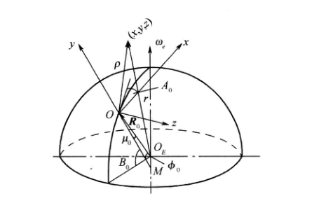
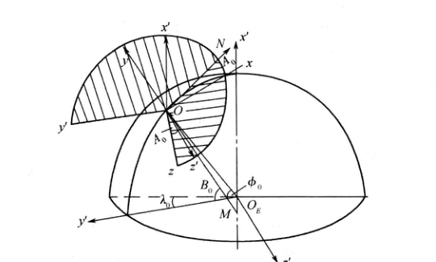

<!--
来源：远程火箭飞行动力学与制导（陈克俊）PDF，第 79-102 页。
本文件由扫描页 OCR 后整理为 Markdown；正文不保留分页标记。
-->

# 第3章 空间运动方程的建立

为了严格、全面地描述远程火箭的运动，提供准确的运动状态参数，需要建立准确的空间运动方程及相应的空间弹道计算方程。

## 3.1 远程火箭矢量形式的动力学方程

### 3.1.1 质心动力学方程

式(1-5-19)给出了任一变质量质点系在惯性坐标系中的质心动力学矢量方程

$$
m\frac{d^2\boldsymbol r_{c.m}}{dt^2}=\boldsymbol F_s+\boldsymbol F'_k+\boldsymbol F'_{rel}.
$$

符号说明

-------

<table style="margin-left: auto; margin-right: auto;">
  <tr>
    <th>符号</th>
    <th>含义</th>
  </tr>
  <tr>
    <td>$m$</td>
    <td>火箭瞬时质量</td>
  </tr>
  <tr>
    <td>$t$</td>
    <td>时间</td>
  </tr>
  <tr>
    <td>$\boldsymbol r_{c.m}$</td>
    <td>火箭质心在惯性坐标系中的位置矢量</td>
  </tr>
  <tr>
    <td>$\boldsymbol F_s$</td>
    <td>作用在火箭上的外力主矢量</td>
  </tr>
  <tr>
    <td>$\boldsymbol F'_k$</td>
    <td>附加哥氏力矢量</td>
  </tr>
  <tr>
    <td>$\boldsymbol F'_{rel}$</td>
    <td>附加相对力矢量</td>
  </tr>
</table>

-------

第2章结合火箭的实际对上述各力进行了讨论，并已知

$$
\begin{equation}
\boldsymbol F_s=m\boldsymbol g+\boldsymbol R+\boldsymbol P_{st}+\boldsymbol F_c
\tag{3-1-1}
\end{equation}
$$

符号说明

-------

<table style="margin-left: auto; margin-right: auto;">
  <tr>
    <th>符号</th>
    <th>含义</th>
  </tr>
  <tr>
    <td>$\boldsymbol F_s$</td>
    <td>作用在火箭上的外力主矢量</td>
  </tr>
  <tr>
    <td>$\boldsymbol g$</td>
    <td>重力加速度矢量</td>
  </tr>
  <tr>
    <td>$m\boldsymbol g$</td>
    <td>作用在火箭上的引力矢量</td>
  </tr>
  <tr>
    <td>$\boldsymbol R$</td>
    <td>作用在火箭上的气动力矢量</td>
  </tr>
  <tr>
    <td>$\boldsymbol P_{st}$</td>
    <td>发动机推力静分量矢量</td>
  </tr>
  <tr>
    <td>$\boldsymbol F_c$</td>
    <td>作用在火箭上的控制力矢量</td>
  </tr>
</table>

-------

而且已知

$$
\boldsymbol F'_{rel}=-\dot m\boldsymbol u_e,\qquad
\boldsymbol F'_k=-2m\boldsymbol\omega_T\times\boldsymbol\rho_e.
$$

符号说明

-------

<table width="100%">
  <colgroup>
    <col style="width: 35%;">
    <col style="width: 65%;">
  </colgroup>
  <tr>
    <th>符号</th>
    <th>含义</th>
  </tr>
  <tr>
    <td>$\boldsymbol F'_{rel}$</td>
    <td>附加相对力矢量</td>
  </tr>
  <tr>
    <td>$\boldsymbol F'_k$</td>
    <td>附加哥氏力矢量</td>
  </tr>
  <tr>
    <td>$\dot m$</td>
    <td>火箭质量变化率</td>
  </tr>
  <tr>
    <td>$\boldsymbol u_e$</td>
    <td>燃气相对火箭的喷出速度矢量</td>
  </tr>
  <tr>
    <td>$\boldsymbol\omega_T$</td>
    <td>火箭相对惯性坐标系的角速度矢量</td>
  </tr>
  <tr>
    <td>$\boldsymbol\rho_e$</td>
    <td>喷出质量元相对火箭质心的位置矢量</td>
  </tr>
</table>

-------

考虑到附加相对力 $\boldsymbol F'_{rel}$ 与发动机推力静分量合成的推力为 $\boldsymbol P$，见式(2-1-32)，则可得火箭在惯性坐标系中以矢量描述的质心动力学方程。为书写方便，以后 $\boldsymbol r_{c.m}$ 均写成 $\boldsymbol r$：

$$
\begin{equation}
m\frac{d^2\boldsymbol r}{dt^2}=\boldsymbol P+\boldsymbol R+\boldsymbol F_c+m\boldsymbol g+\boldsymbol F'_k.
\tag{3-1-2}
\end{equation}
$$

符号说明

-------

<table style="margin-left: auto; margin-right: auto;">
  <tr>
    <th>符号</th>
    <th>含义</th>
  </tr>
  <tr>
    <td>$\boldsymbol r$</td>
    <td>简写后的质心位置矢量</td>
  </tr>
  <tr>
    <td>$\dfrac{d^2\boldsymbol r}{dt^2}$</td>
    <td>火箭质心加速度矢量</td>
  </tr>
  <tr>
    <td>$\boldsymbol P$</td>
    <td>附加相对力与发动机推力静分量合成后的推力矢量</td>
  </tr>
  <tr>
    <td>$\boldsymbol R$</td>
    <td>作用在火箭上的气动力矢量</td>
  </tr>
  <tr>
    <td>$\boldsymbol F_c$</td>
    <td>作用在火箭上的控制力矢量</td>
  </tr>
  <tr>
    <td>$m\boldsymbol g$</td>
    <td>作用在火箭上的引力矢量</td>
  </tr>
  <tr>
    <td>$\boldsymbol F'_k$</td>
    <td>附加哥氏力矢量</td>
  </tr>
</table>

-------

### 3.1.2 绕质心转动的动力学方程

由变质量质点的绕质心运动方程

$$
\boldsymbol I\cdot\frac{d\boldsymbol\omega_T}{dt}
+\boldsymbol\omega_T\times(\boldsymbol I\cdot\boldsymbol\omega_T)
=\boldsymbol M_{c.m}+\boldsymbol M'_k+\boldsymbol M'_{rel}
$$

符号说明

-------

<table style="margin-left: auto; margin-right: auto;">
  <tr>
    <th>符号</th>
    <th>含义</th>
  </tr>
  <tr>
    <td>$\boldsymbol I$</td>
    <td>火箭对质心的转动惯量张量</td>
  </tr>
  <tr>
    <td>$\boldsymbol\omega_T$</td>
    <td>火箭相对惯性坐标系的角速度矢量</td>
  </tr>
  <tr>
    <td>$\dfrac{d\boldsymbol\omega_T}{dt}$</td>
    <td>火箭角速度对时间的导数</td>
  </tr>
  <tr>
    <td>$\boldsymbol M_{c.m}$</td>
    <td>作用在火箭上并对质心取矩的外力矩矢量</td>
  </tr>
  <tr>
    <td>$\boldsymbol M'_k$</td>
    <td>附加哥氏力矩</td>
  </tr>
  <tr>
    <td>$\boldsymbol M'_{rel}$</td>
    <td>附加相对力矩</td>
  </tr>
</table>

-------

及第2章描述的火箭所受到的外力矩

$$
\begin{equation}
\boldsymbol M_{c.m}=\boldsymbol M_{st}+\boldsymbol M_c+\boldsymbol M_d
\tag{3-1-3}
\end{equation}
$$

符号说明

-------

<table style="margin-left: auto; margin-right: auto;">
  <tr>
    <th>符号</th>
    <th>含义</th>
  </tr>
  <tr>
    <td>$\boldsymbol M_{c.m}$</td>
    <td>作用在火箭上并对质心取矩的外力矩矢量</td>
  </tr>
  <tr>
    <td>$\boldsymbol M_{st}$</td>
    <td>作用在火箭上的气动力矩</td>
  </tr>
  <tr>
    <td>$\boldsymbol M_c$</td>
    <td>控制力矩</td>
  </tr>
  <tr>
    <td>$\boldsymbol M_d$</td>
    <td>火箭相对大气有转动时引起的阻尼力矩</td>
  </tr>
</table>

-------

注意到附加相对力矩、附加哥氏力矩为

$$
\boldsymbol M'_{rel}=-m\boldsymbol\rho_e\times\boldsymbol u_e,\qquad
\boldsymbol M'_k=-m\boldsymbol\rho_e\times(\boldsymbol\omega_T\times\boldsymbol\rho_e),
$$

符号说明

-------

<table style="margin-left: auto; margin-right: auto;">
  <tr>
    <th>符号</th>
    <th>含义</th>
  </tr>
  <tr>
    <td>$\boldsymbol M'_{rel}$</td>
    <td>附加相对力矩</td>
  </tr>
  <tr>
    <td>$\boldsymbol M'_k$</td>
    <td>附加哥氏力矩</td>
  </tr>
  <tr>
    <td>$m$</td>
    <td>火箭瞬时质量</td>
  </tr>
  <tr>
    <td>$\boldsymbol\rho_e$</td>
    <td>喷出质量元相对火箭质心的位置矢量</td>
  </tr>
  <tr>
    <td>$\boldsymbol u_e$</td>
    <td>燃气相对火箭的喷出速度矢量</td>
  </tr>
  <tr>
    <td>$\boldsymbol\omega_T$</td>
    <td>火箭相对惯性坐标系的角速度矢量</td>
  </tr>
</table>

-------

即可得到用矢量描述的火箭绕质心转动的动力学方程为

$$
\begin{equation}
\boldsymbol I\cdot\frac{d\boldsymbol\omega_T}{dt}
+\boldsymbol\omega_T\times(\boldsymbol I\cdot\boldsymbol\omega_T)
=\boldsymbol M_{st}+\boldsymbol M_c+\boldsymbol M_d+\boldsymbol M'_k+\boldsymbol M'_{rel}.
\tag{3-1-4}
\end{equation}
$$

符号说明

-------

<table style="margin-left: auto; margin-right: auto;">
  <tr>
    <th>符号</th>
    <th>含义</th>
  </tr>
  <tr>
    <td>$\boldsymbol I$</td>
    <td>火箭对质心的转动惯量张量</td>
  </tr>
  <tr>
    <td>$\boldsymbol\omega_T$</td>
    <td>火箭相对惯性坐标系的角速度矢量</td>
  </tr>
  <tr>
    <td>$\dfrac{d\boldsymbol\omega_T}{dt}$</td>
    <td>火箭角速度对时间的导数</td>
  </tr>
  <tr>
    <td>$\boldsymbol M_{st}$</td>
    <td>作用在火箭上的气动力矩</td>
  </tr>
  <tr>
    <td>$\boldsymbol M_c$</td>
    <td>控制力矩</td>
  </tr>
  <tr>
    <td>$\boldsymbol M_d$</td>
    <td>火箭相对大气有转动时引起的阻尼力矩</td>
  </tr>
  <tr>
    <td>$\boldsymbol M'_k$</td>
    <td>附加哥氏力矩</td>
  </tr>
  <tr>
    <td>$\boldsymbol M'_{rel}$</td>
    <td>附加相对力矩</td>
  </tr>
</table>

-------

## 3.2 地面发射坐标系中的空间弹道方程

用矢量描述的火箭质心动力学方程和绕质心运动动力学方程给人以简洁、清晰的概念，但对这些微分方程求解还必须将其投影到选定的坐标系中来进行，通常是选择地面发射坐标系为描述火箭运动的参考系，该坐标系是定义在将地球看作以角速度 $\boldsymbol\omega_e$ 进行自转的两轴旋转椭球体上的。

### 3.2.1 地面发射坐标系中的质心动力学方程

由于地面发射坐标系为一动参考系，其相对于惯性坐标系以角速度 $\boldsymbol\omega_e$ 转动，故由矢量导数法则可知

$$
\frac{d^2\boldsymbol{r}_{c.m}}{dt^2}
=\frac{\delta^2\boldsymbol r}{\delta t^2}
+2\boldsymbol\omega_e\times\frac{\delta\boldsymbol r}{\delta t}
+\boldsymbol\omega_e\times(\boldsymbol\omega_e\times\boldsymbol r).
$$

将其代入式(3-1-2)并整理得

式(3-1-2)

---

$$
\begin{equation}
m\frac{d^2\boldsymbol r}{dt^2}
=\boldsymbol P+\boldsymbol R+\boldsymbol F_c+m\boldsymbol g+\boldsymbol F'_k.
\tag{3-1-2}
\end{equation}
$$

---

$$
\begin{equation}
m\frac{\delta^2\boldsymbol r}{\delta t^2}
=\boldsymbol P+\boldsymbol R+\boldsymbol F_c+m\boldsymbol g+\boldsymbol F'_k
-m\boldsymbol\omega_e\times(\boldsymbol\omega_e\times\boldsymbol r)
-2m\boldsymbol\omega_e\times\frac{\delta\boldsymbol r}{\delta t}.
\tag{3-2-1}
\end{equation}
$$

将上面等式各项在地面发射坐标系中分解，得到如下各项。

> 坐标系与基矢约定：式(3-2-1)仍是与具体基底无关的矢量方程。当导数作用于矢量时，$d/dt$ 表示相对于惯性坐标系的绝对导数，$\delta/\delta t$ 表示相对于随地球转动的地面发射坐标系的相对导数；这两个符号说明的是求导所依据的参考系，并不表示矢量已经采用相应坐标系的分量形式。
>
> 从下面的分项展开开始，各矢量最终都投影到地面发射坐标系的基矢 $\boldsymbol x^0,\boldsymbol y^0,\boldsymbol z^0$ 上。未特别标注坐标系的分量列阵，如 $[A_x,A_y,A_z]^T$，均默认表示矢量 $\boldsymbol A$ 在发射系中的分量。位置分量 $x,y,z$ 和速度分量 $v_x,v_y,v_z$ 也都采用发射系基矢；其中 $x,y,z$ 是相对于发射点的位置分量，而地心位置矢量 $\boldsymbol r$ 在发射系中的分量为
>
> $$[\boldsymbol r]_{Oxyz}=\begin{bmatrix}x+R_{0x}\\y+R_{0y}\\z+R_{0z}\end{bmatrix}.$$
>
> 下标 $B$ 和 $V$ 分别表示弹体坐标系和速度坐标系中的分量，例如 $[\boldsymbol P]_B$、$[\boldsymbol R]_V$；方向余弦阵 $G_B$、$G_V$ 将这些分量转换到地面发射坐标系。这里没有直接列写惯性坐标系基矢下的分量，惯性坐标系主要用于定义绝对导数和建立动力学方程。

#### 1. 相对加速度项

$$
\begin{equation}
\frac{\delta^2\boldsymbol r}{\delta t^2}=
\begin{bmatrix}
\dfrac{dv_x}{dt}\\[4pt]
\dfrac{dv_y}{dt}\\[4pt]
\dfrac{dv_z}{dt}
\end{bmatrix}
\tag{3-2-2}
\end{equation}
$$

> 注：式中 $\delta/\delta t$ 表示在随地球转动的地面发射坐标系中求导，$v_x$、$v_y$、$v_z$ 是火箭相对于地面发射坐标系的速度沿 $Ox$、$Oy$、$Oz$ 轴的分量，即
>
> $$\frac{\delta\boldsymbol r}{\delta t}=v_x\boldsymbol x^0+v_y\boldsymbol y^0+v_z\boldsymbol z^0.$$
>
> 对发射系中的观察者，基矢 $\boldsymbol x^0$、$\boldsymbol y^0$、$\boldsymbol z^0$ 是固定的，故它们的相对导数均为零，相对加速度的三个分量可直接写成 $dv_x/dt$、$dv_y/dt$、$dv_z/dt$。式(3-2-2)右端的列向量表示该相对加速度在发射系中的分量。
>
> 若改在惯性坐标系中对同一速度矢量求导，则还必须计入发射系基矢的转动。对任意矢量 $\boldsymbol A$，有
>
> $$\frac{d\boldsymbol A}{dt}=\frac{\delta\boldsymbol A}{\delta t}+\boldsymbol\omega_e\times\boldsymbol A.$$
>
> 因此
>
> $$\frac{d}{dt}\left(\frac{\delta\boldsymbol r}{\delta t}\right)=\frac{\delta^2\boldsymbol r}{\delta t^2}+\boldsymbol\omega_e\times\frac{\delta\boldsymbol r}{\delta t}.$$
>
> 这个叉乘项属于惯性系导数与旋转系导数之间的转换，已体现在式(3-2-1)的哥氏项中，因而不应再次加入式(3-2-2)。

#### 2. 推力 $\boldsymbol P$ 项

由式(2-1-32)知，推力 $\boldsymbol P$ 在弹体坐标系内描述形式最简单，即

式(2-1-32)

---

$$
\begin{equation}
P=-\dot m u_e+S_e(p_e-p_H)x^0
\tag{2-1-32}
\end{equation}
$$

---

$$
\begin{equation}
[\boldsymbol P]_B=
\begin{bmatrix}
-\dot m u_e+S_e(p_e-p_a)\\
0\\
0
\end{bmatrix}.
\tag{3-2-3}
\end{equation}
$$

弹体坐标系到地面发射坐标系的方向余弦阵 $G_B$，可按照式(1-3-6)所示的欧拉转动合成方法求得。由此可得推力 $\boldsymbol P$ 在地面发射坐标系中的分量为

式(1-3-6)：由三次欧拉转动合成方向余弦阵

---

$$
\begin{bmatrix}
x_1\\
y_1\\
z
\end{bmatrix}
=M_3[\alpha]
\begin{bmatrix}
x\\
y\\
z
\end{bmatrix};
\qquad
\begin{bmatrix}
x_1\\
y_2\\
z_2
\end{bmatrix}
=M_1[\beta]
\begin{bmatrix}
x_1\\
y_1\\
z
\end{bmatrix};
\qquad
\begin{bmatrix}
X\\
Y\\
Z
\end{bmatrix}
=M_3[\gamma]
\begin{bmatrix}
x_1\\
y_2\\
z_2
\end{bmatrix}
\tag{1-3-6}
$$

式中的 $x_1,y_1,y_2,z_2$ 是转动过程中产生的中间坐标轴。将三次转动合并，可得从 $Q(o-xyz)$ 系到 $P(O-XYZ)$ 系的方向余弦阵

$$
\begin{bmatrix}
X\\Y\\Z
\end{bmatrix}
=P_{PQ}
\begin{bmatrix}
x\\y\\z
\end{bmatrix},
\qquad
P_{PQ}=M_3[\gamma]M_1[\beta]M_3[\alpha].
$$

在当前问题中，同理先得到发射系基矢到弹体系基矢的方向余弦阵 $B_G$，再利用正交矩阵的逆等于其转置，得到弹体系分量到发射系分量的转换矩阵 $G_B$：

$$
B_G=M_1[\gamma]M_2[\psi]M_3[\varphi],
\qquad G_B=B_G^{-1}=B_G^T,
\qquad
[\boldsymbol P]_{Oxyz}=G_B[\boldsymbol P]_B.
$$

---

$$
\begin{equation}
\begin{bmatrix}
P_x\\P_y\\P_z
\end{bmatrix}
=G_B[\boldsymbol P]_B.
\tag{3-2-4}
\end{equation}
$$

#### 3. 气动力 $\boldsymbol R$ 项

已知火箭飞行中所受气动力在速度坐标系中的分量为

> 这里的“已知”来自第二章对速度坐标系和气动力分量的定义。速度坐标系的 $x_v$ 轴沿火箭相对于大气的速度方向，$y_v$ 轴位于火箭主对称面内并垂直于 $x_v$ 轴，$z_v$ 轴按右手规则确定。气动力合力 $\boldsymbol R$ 在这三个轴上分别分解为阻力、升力和侧力。
>
> 阻力大小 $X$ 按正值计算，但其方向与相对速度方向相反，因此在 $x_v$ 轴上的投影为 $-X$；升力和侧力按 $y_v$、$z_v$ 轴的正方向分别记为 $Y$、$Z$。故有
>
> $$\boldsymbol R=-X\boldsymbol x_v^0+Y\boldsymbol y_v^0+Z\boldsymbol z_v^0,\qquad [\boldsymbol R]_V=\begin{bmatrix}-X\\Y\\Z\end{bmatrix}.$$
>
> 三个分量由式(2-3-13)计算：$X=C_xqS_M$、$Y=C_yqS_M$、$Z=C_zqS_M$，其中 $q=\tfrac12\rho v^2$。因此这里的“已知”具体是指：当飞行状态 $v,\rho$、参考面积 $S_M$ 以及由气动数据确定的系数 $C_x,C_y,C_z$ 已知后，气动力在速度坐标系中的三个分量即可确定。

$$
[\boldsymbol R]_V=
\begin{bmatrix}
-X\\Y\\Z
\end{bmatrix}.
$$

由式(1-4-7)可知，速度坐标系到地面发射坐标系的方向余弦阵为 $G_V=V_G^T$，从而得到气动力 $\boldsymbol R$ 在地面发射坐标系中的分量为

式(1-4-7)：速度坐标系与发射坐标系的转换关系

---

$$
\begin{equation}
\begin{bmatrix}
\boldsymbol x_v^0\\
\boldsymbol y_v^0\\
\boldsymbol z_v^0
\end{bmatrix}
=V_G
\begin{bmatrix}
\boldsymbol x^0\\
\boldsymbol y^0\\
\boldsymbol z^0
\end{bmatrix}
\tag{1-4-7}
\end{equation}
$$

$V_G$ 将发射系基矢转换为速度系基矢。方向余弦阵为正交矩阵，因此反向转换矩阵为

$$
G_V=V_G^{-1}=V_G^T.
$$

---

$$
\begin{equation}
\begin{bmatrix}
R_x\\R_y\\R_z
\end{bmatrix}
=G_V
\begin{bmatrix}
-C_xqS_m\\
C_yqS_m\alpha\\
-C_zqS_m\beta
\end{bmatrix}.
\tag{3-2-5}
\end{equation}
$$

> 式中的 $\alpha$ 为攻角，表示速度轴 $x_v$ 在火箭主对称面内的投影与弹体纵轴 $x_1$ 之间的夹角；$\beta$ 为侧滑角，表示速度轴 $x_v$ 偏离火箭主对称面的夹角。它们描述的是速度坐标系相对于弹体坐标系的方向偏差，并不是由转换矩阵 $G_V$ 产生的。
>
> 当 $\alpha$、$\beta$ 较小时，升力系数和侧力系数可在零攻角、零侧滑角附近作一阶线性化。由式(2-3-17)有
>
> $$C_y^{\mathrm{(eff)}}\approx C_y^\alpha\alpha,\qquad C_z^{\mathrm{(eff)}}\approx C_z^\beta\beta.$$
>
> 因而升力和侧力分别与 $\alpha$、$\beta$ 成正比。式(3-2-5)将气动导数 $C_y^\alpha$、$C_z^\beta$ 简写为 $C_y$、$C_z$，并按照本式采用的侧力正方向约定写成
>
> $$Y=C_yqS_m\alpha,\qquad Z=-C_zqS_m\beta.$$
>
> 所以，$\alpha$ 和 $\beta$ 的出现来自小角度条件下的气动力线性模型；$G_V$ 只负责把已经得到的速度系气动力分量转换到地面发射坐标系。

#### 4. 控制力 $\boldsymbol F_c$ 项

由2.4节内容可知，无论执行机构是燃气舵还是不同配置形式的摇摆发动机，均可将控制力以弹体坐标系的分量表示为同一形式

$$
\begin{equation}
[\boldsymbol F_c]_B=
\begin{bmatrix}
-X_{1c}\\
Y_{1c}\\
Z_{1c}
\end{bmatrix}.
\tag{3-2-6}
\end{equation}
$$

> $\boldsymbol F_c$ 是控制机构相对于主推力产生的修正力，不包含主推力本身；主推力 $P$ 已在式(3-2-3)中单独给出。两者在弹体系中合成后为
>
> $$\begin{bmatrix}P\\0\\0\end{bmatrix}+\begin{bmatrix}-X_{1c}\\Y_{1c}\\Z_{1c}\end{bmatrix}=\begin{bmatrix}P-X_{1c}\\Y_{1c}\\Z_{1c}\end{bmatrix}.$$
>
> $X_{1c}$ 按正值定义，表示燃气舵产生的轴向阻力，或摇摆发动机偏转后轴向推力投影的减少量，因此实际分量写成 $-X_{1c}$；$Y_{1c},Z_{1c}$ 是控制机构产生的横向控制力。小偏转角下 $X_{1c}$ 是二阶小量，通常可近似取零。

而各力的具体计算公式则根据采用何种执行机构而定，因此控制力在地面坐标系的三分量可以用下式得到

$$
\begin{equation}
\begin{bmatrix}
F_{cx}\\F_{cy}\\F_{cz}
\end{bmatrix}
=G_B
\begin{bmatrix}
-X_{1c}\\
Y_{1c}\\
Z_{1c}
\end{bmatrix}.
\tag{3-2-7}
\end{equation}
$$

#### 5. 引力 $m\boldsymbol g$ 项

根据式(2-2-16)

$$
\begin{equation}
m\boldsymbol g=m g'_r\boldsymbol r^0+m g_{\omega e}\boldsymbol\omega_e^0,
\tag{2-2-16}
\end{equation}
$$

其中

$$
\begin{aligned}
g'_r&=-\frac{fM}{r^2}
\left[
1+J\left(\frac{a_e}{r}\right)^2(1-5\sin^2\phi)
\right]\\
g_{\omega e}&=-2\frac{fM}{r^2}J\left(\frac{a_e}{r}\right)^2\sin\phi.
\end{aligned}
$$

由图3-1可知，任一点地心矢径为

$$
\begin{equation}
\boldsymbol r=\boldsymbol R_0+\boldsymbol\rho
\tag{3-2-8}
\end{equation}
$$

图3-1 弹道上任一点的地心矢径和发射点的地心矢径

式中：$\boldsymbol\rho$ 为发射点到弹道上任意一点的矢径，在发射坐标系中的三个分量为 $x,y,z$；$\boldsymbol R_0$ 为发射点地心矢径，在发射坐标系上的三分量可由图3-1求得

$$
\begin{equation}
\begin{bmatrix}
R_{0x}\\R_{0y}\\R_{0z}
\end{bmatrix}=
\begin{bmatrix}
-R_0\sin\mu_0\cos A_0\\
R_0\cos\mu_0\\
R_0\sin\mu_0\sin A_0
\end{bmatrix}.
\tag{3-2-9}
\end{equation}
$$

式中，$A_0$ 为发射方位角；$\mu_0$ 为发射点的地理纬度与地心纬度之差，即

$$
\mu_0=B_0-\phi_0.
$$

由于假设地球为一两轴旋转的椭球体，故 $R_0$ 的长度可由子午椭圆方程求得

$$
R_0=\frac{a_eb_e}{\sqrt{a_e^2\sin^2\phi_0+b_e^2\cos^2\phi_0}}.
$$

由式(3-2-8)可得 $\boldsymbol r^0$ 在发射坐标系的表达式为

$$
\begin{equation}
\boldsymbol r^0=
\frac{x+R_{0x}}{r}\boldsymbol x^0
+\frac{y+R_{0y}}{r}\boldsymbol y^0
+\frac{z+R_{0z}}{r}\boldsymbol z^0.
\tag{3-2-10}
\end{equation}
$$

显然，$\boldsymbol\omega_e^0$ 在发射坐标系的表达式可写成

$$
\begin{equation}
\boldsymbol\omega_e^0=
\frac{\omega_{ex}}{\omega_e}\boldsymbol x^0
+\frac{\omega_{ey}}{\omega_e}\boldsymbol y^0
+\frac{\omega_{ez}}{\omega_e}\boldsymbol z^0.
\tag{3-2-11}
\end{equation}
$$

> 这是单位矢量归一化得到的。地球自转角速度矢量 $\boldsymbol\omega_e$ 在发射坐标系中的分解为
>
> $$\boldsymbol\omega_e=\omega_{ex}\boldsymbol x^0+\omega_{ey}\boldsymbol y^0+\omega_{ez}\boldsymbol z^0.$$
>
> 其中 $\omega_{ex},\omega_{ey},\omega_{ez}$ 是 $\boldsymbol\omega_e$ 在三个发射系基矢上的投影，$\omega_e=\lVert\boldsymbol\omega_e\rVert$ 是其大小。根据单位方向矢量的定义 $\boldsymbol\omega_e^0=\boldsymbol\omega_e/\omega_e$，将上式各分量同时除以 $\omega_e$，即得式(3-2-11)。

其中 $\omega_{ex},\omega_{ey},\omega_{ez}$ 由式(1-4-20)可知

式(1-4-20)：地球自转角速度在发射系中的分量

---

$$
\begin{equation}
\begin{bmatrix}
\omega_{ex}\\
\omega_{ey}\\
\omega_{ez}
\end{bmatrix}
=\omega_e
\begin{bmatrix}
\cos\phi_0\cos\alpha_0\\
\sin\phi_0\\
-\cos\phi_0\sin\alpha_0
\end{bmatrix}
\tag{1-4-20}
\end{equation}
$$

式(1-4-20)按圆球地球模型使用地心纬度 $\phi_0$ 和地心方位角 $\alpha_0$。本节采用两轴旋转椭球体，因此分别以地理纬度 $B_0$ 和射击方位角 $A_0$ 代替，即得到式(3-2-12)。

---

$$
\begin{equation}
\begin{bmatrix}
\omega_{ex}\\
\omega_{ey}\\
\omega_{ez}
\end{bmatrix}
=\omega_e
\begin{bmatrix}
\cos B_0\cos A_0\\
\sin B_0\\
-\cos B_0\sin A_0
\end{bmatrix}.
\tag{3-2-12}
\end{equation}
$$

于是可将式(2-2-16)写成发射坐标系分量形式

$$
\begin{equation}
m
\begin{bmatrix}
g_x\\g_y\\g_z
\end{bmatrix}
=m\frac{g'_r}{r}
\begin{bmatrix}
x+R_{0x}\\
y+R_{0y}\\
z+R_{0z}
\end{bmatrix}
+m\frac{g_{\omega e}}{\omega_e}
\begin{bmatrix}
\omega_{ex}\\
\omega_{ey}\\
\omega_{ez}
\end{bmatrix}.
\tag{3-2-13}
\end{equation}
$$

#### 6. 附加哥氏力 $\boldsymbol F'_k$ 项

由式(2-1-16)

$$
\boldsymbol F'_k=-2m\boldsymbol\omega_T\times\boldsymbol\rho_e.
$$

其中，$\boldsymbol\omega_T$ 为箭体相对于惯性坐标系或平移坐标系的转动角速度矢量，它在箭体坐标系中的分量表示为

$$
\boldsymbol\omega_T=
\begin{bmatrix}
\omega_{Tx1}&\omega_{Ty1}&\omega_{Tz1}
\end{bmatrix}^T.
$$

$\boldsymbol\rho_e$ 为质心到喷管出口中心点的矢量，即

$$
\boldsymbol\rho_e=-x_{1e}\boldsymbol x_1^0.
$$

因此，可得 $\boldsymbol F'_k$ 在箭体坐标系的三分量

$$
\begin{equation}
\begin{bmatrix}
F'_{kx1}\\F'_{ky1}\\F'_{kz1}
\end{bmatrix}
=2mx_{1e}
\begin{bmatrix}
0\\
\omega_{Tz1}\\
-\omega_{Ty1}
\end{bmatrix}.
\tag{3-2-14}
\end{equation}
$$

> 由附加哥氏力的矢量表达式 $\boldsymbol F'_k=-2m\boldsymbol\omega_T\times\boldsymbol\rho_e$，且喷管出口中心位于质心后方，故 $\boldsymbol\rho_e=-x_{1e}\boldsymbol x_1^0$。代入得
>
> $$\boldsymbol F'_k=2mx_{1e}\left(\boldsymbol\omega_T\times\boldsymbol x_1^0\right).$$
>
> 其中，$x_{1e}$ 是火箭质心到喷管出口中心沿弹体纵轴方向的距离，是一个正的标量；$\boldsymbol x_1^0$ 是弹体坐标系 $x_1$ 轴正方向的单位矢量，上标 $0$ 表示单位矢量。由于喷管出口位于质心后方，即 $-x_1$ 方向，所以位置矢量写成 $\boldsymbol\rho_e=-x_{1e}\boldsymbol x_1^0$。
>
> 在右手弹体坐标系中，$[\boldsymbol\omega_T]_B=[\omega_{Tx1},\omega_{Ty1},\omega_{Tz1}]^T$，$[\boldsymbol x_1^0]_B=[1,0,0]^T$，因此
>
> $$[\boldsymbol\omega_T\times\boldsymbol x_1^0]_B=\begin{bmatrix}0\\\omega_{Tz1}\\-\omega_{Ty1}\end{bmatrix}.$$
>
> 将该叉乘结果乘以 $2mx_{1e}$，即得到式(3-2-14)。其中 $x_1$ 分量为零，是因为 $\boldsymbol\omega_T\times\boldsymbol x_1^0$ 必然垂直于 $x_1$ 轴。

从而 $\boldsymbol F'_k$ 在发射坐标系中的分量可由下式来描述

$$
\begin{equation}
\begin{bmatrix}
F'_{kx}\\F'_{ky}\\F'_{kz}
\end{bmatrix}
=G_B
\begin{bmatrix}
F'_{kx1}\\F'_{ky1}\\F'_{kz1}
\end{bmatrix}.
\tag{3-2-15}
\end{equation}
$$

#### 7. 离心惯性力 $-m\boldsymbol\omega_e\times(\boldsymbol\omega_e\times\boldsymbol r)$ 项

记

$$
\begin{equation}
\boldsymbol a_e=\boldsymbol\omega_e\times(\boldsymbol\omega_e\times\boldsymbol r)
\tag{3-2-16}
\end{equation}
$$

> 这里使用火箭的地心位置矢量 $\boldsymbol r$，是因为地面发射坐标系随地球绕地轴转动，而不是绕发射点转动。若以火箭相对发射点的位置 $\boldsymbol\rho$ 表示，牵连加速度应同时包含发射点本身的向心加速度：
>
> $$\boldsymbol a_e=\boldsymbol\omega_e\times(\boldsymbol\omega_e\times\boldsymbol R_0)+\boldsymbol\omega_e\times(\boldsymbol\omega_e\times\boldsymbol\rho).$$
>
> 利用叉乘对加法的分配律，并注意 $\boldsymbol r=\boldsymbol R_0+\boldsymbol\rho$，上式可合并为
>
> $$\boldsymbol a_e=\boldsymbol\omega_e\times\left[\boldsymbol\omega_e\times(\boldsymbol R_0+\boldsymbol\rho)\right]=\boldsymbol\omega_e\times(\boldsymbol\omega_e\times\boldsymbol r).$$
>
> 因此，式(3-2-16)中的 $\boldsymbol r$ 必须是火箭相对于地心的位置矢量；若只使用 $\boldsymbol\rho$，就会漏掉发射点随地球自转产生的向心加速度。

为牵连加速度。根据式(3-2-12)，并注意到

$$
\boldsymbol r=(x+R_{0x})\boldsymbol x^0+(y+R_{0y})\boldsymbol y^0+(z+R_{0z})\boldsymbol z^0,
$$

> 由式(3-2-8)，火箭的地心位置矢量为 $\boldsymbol r=\boldsymbol R_0+\boldsymbol\rho$。其中，发射点的地心矢量和火箭相对发射点的位置矢量在发射系中分别为
>
> $$\boldsymbol R_0=R_{0x}\boldsymbol x^0+R_{0y}\boldsymbol y^0+R_{0z}\boldsymbol z^0,\qquad \boldsymbol\rho=x\boldsymbol x^0+y\boldsymbol y^0+z\boldsymbol z^0.$$
>
> 将对应分量相加，就得到 $\boldsymbol r$ 的三个发射系分量 $x+R_{0x}$、$y+R_{0y}$、$z+R_{0z}$。

则牵连加速度在发射坐标系中的分量形式为

$$
\begin{equation}
\begin{bmatrix}
a_{ex}\\a_{ey}\\a_{ez}
\end{bmatrix}=
\begin{bmatrix}
a_{11}&a_{12}&a_{13}\\
a_{21}&a_{22}&a_{23}\\
a_{31}&a_{32}&a_{33}
\end{bmatrix}
\begin{bmatrix}
x+R_{0x}\\
y+R_{0y}\\
z+R_{0z}
\end{bmatrix},
\tag{3-2-17}
\end{equation}
$$

其中

$$
\begin{gathered}
a_{11}=\omega_{ex}^2-\omega_e^2,\quad
a_{22}=\omega_{ey}^2-\omega_e^2,\quad
a_{33}=\omega_{ez}^2-\omega_e^2,\\
a_{12}=a_{21}=\omega_{ex}\omega_{ey},\quad
a_{13}=a_{31}=\omega_{ex}\omega_{ez},\quad
a_{23}=a_{32}=\omega_{ez}\omega_{ey}.
\end{gathered}
$$

从而离心惯性力 $\boldsymbol F_e$ 在发射坐标系中的分量可由下式来描述：

$$
\begin{equation}
\begin{bmatrix}
F_{ex}\\F_{ey}\\F_{ez}
\end{bmatrix}
=-m
\begin{bmatrix}
a_{ex}\\a_{ey}\\a_{ez}
\end{bmatrix}.
\tag{3-2-18}
\end{equation}
$$

> 与下方质心动力学方程的对应关系：令 $A=[a_{ij}]$，由式(3-2-17)有 $[\boldsymbol a_e]_{Oxyz}=A[\boldsymbol r]_{Oxyz}$。再代入式(3-2-18)，离心惯性力可直接写成
>
> $$[\boldsymbol F_e]_{Oxyz}=-mA\begin{bmatrix}x+R_{0x}\\y+R_{0y}\\z+R_{0z}\end{bmatrix}.$$

#### 8. 哥氏惯性力 $-2m\boldsymbol\omega_e\times\dfrac{\delta\boldsymbol r}{\delta t}$ 项

记

$$
\begin{equation}
\boldsymbol a_k=2\boldsymbol\omega_e\times\frac{\delta\boldsymbol r}{\delta t}
\tag{3-2-19}
\end{equation}
$$

为哥氏加速度。式中：

$$
\begin{equation}
\frac{\delta\boldsymbol r}{\delta t}=
\begin{bmatrix}
v_x&v_y&v_z
\end{bmatrix}^T
\tag{3-2-20}
\end{equation}
$$

为火箭相对于发射坐标系的速度。并注意到式(3-2-12)，则式(3-2-19)可写为

$$
\begin{equation}
\begin{bmatrix}
a_{kx}\\a_{ky}\\a_{kz}
\end{bmatrix}=
\begin{bmatrix}
b_{11}&b_{12}&b_{13}\\
b_{21}&b_{22}&b_{23}\\
b_{31}&b_{32}&b_{33}
\end{bmatrix}
\begin{bmatrix}
v_x\\v_y\\v_z
\end{bmatrix},
\tag{3-2-21}
\end{equation}
$$

其中

$$
\begin{gathered}
b_{11}=b_{22}=b_{33}=0,\\
b_{12}=-b_{21}=-2\omega_{ez},\quad
b_{31}=-b_{13}=-2\omega_{ey},\quad
b_{23}=-b_{32}=-2\omega_{ex}.
\end{gathered}
$$

从而可得哥氏惯性力 $\boldsymbol F_k$ 在发射坐标系的分量形式为

$$
\begin{equation}
\begin{bmatrix}
F_{kx}\\F_{ky}\\F_{kz}
\end{bmatrix}
=-m
\begin{bmatrix}
a_{kx}\\a_{ky}\\a_{kz}
\end{bmatrix}.
\tag{3-2-22}
\end{equation}
$$

> 与下方质心动力学方程的对应关系：令 $B=[b_{ij}]$，由式(3-2-21)有
>
> $$[\boldsymbol a_k]_{Oxyz}=B\begin{bmatrix}v_x\\v_y\\v_z\end{bmatrix}.$$
>
> 再代入式(3-2-22)，哥氏惯性力在发射系中的分量可写成
>
> $$[\boldsymbol F_k]_{Oxyz}=-mB\begin{bmatrix}v_x\\v_y\\v_z\end{bmatrix}.$$

将式(3-2-2)、式(3-2-4)、式(3-2-5)、式(3-2-7)、式(3-2-13)、式(3-2-15)、式(3-2-18)、式(3-2-22)代入式(3-2-1)，并令

$$
P=P_x-X_{1c},
$$

则在发射坐标系中建立的质心动力学方程为

$$
\begin{equation}
\begin{aligned}
m\begin{bmatrix}
\dfrac{dv_x}{dt}\\[4pt]
\dfrac{dv_y}{dt}\\[4pt]
\dfrac{dv_z}{dt}
\end{bmatrix}
={}&G_B
\begin{bmatrix}
P\\
Y_{1c}+2m\omega_{Tz1}x_{1e}\\
Z_{1c}-2m\omega_{Ty1}x_{1e}
\end{bmatrix}\\[4pt]
&+G_V
\begin{bmatrix}
-C_xqS_m\\
C_yqS_m\alpha\\
-C_zqS_m\beta
\end{bmatrix}\\[4pt]
&+m\frac{g'_r}{r}
\begin{bmatrix}
x+R_{0x}\\
y+R_{0y}\\
z+R_{0z}
\end{bmatrix}\\[4pt]
&+m\frac{g_{\omega e}}{\omega_e}
\begin{bmatrix}
\omega_{ex}\\
\omega_{ey}\\
\omega_{ez}
\end{bmatrix}\\[4pt]
&-mA
\begin{bmatrix}
x+R_{0x}\\
y+R_{0y}\\
z+R_{0z}
\end{bmatrix}\\[4pt]
&-mB
\begin{bmatrix}
v_x\\v_y\\v_z
\end{bmatrix}.
\end{aligned}
\tag{3-2-23}
\end{equation}
$$

> 未知参数说明：式(3-2-23)包含三个标量动力学方程，直接求解的运动状态量为发射系速度分量 $v_x,v_y,v_z$，方程给出它们的导数 $\dot v_x,\dot v_y,\dot v_z$。但右端还依赖位置 $x,y,z$，姿态角 $\varphi,\psi,\gamma$，弹道角 $\theta,\sigma,\nu$，攻角 $\alpha$、侧滑角 $\beta$，以及角速度分量 $\omega_{Ty1},\omega_{Tz1}$；这些都是与质心运动耦合的待求量，必须由运动学方程、转动方程和欧拉角关系补充确定。
>
> 其中，$G_B,G_V$ 由相应姿态角确定；$m,r,\Phi,R,h,q$ 由质量、位置和大气关系确定；$P,Y_{1c},Z_{1c}$ 以及 $C_x,C_y,C_z$ 分别由推进与控制模型、气动模型给出；$A,B$ 和地球引力项由地球参数及当前位置计算。因此这些量通常不是额外的独立状态变量，但若缺少相应模型，单靠式(3-2-23)也无法确定。

### 3.2.2 绕质心动力学方程在箭体坐标系的分解

将式(3-1-4)

$$
\boldsymbol I\cdot\frac{d\boldsymbol\omega_T}{dt}
+\boldsymbol\omega_T\times(\boldsymbol I\cdot\boldsymbol\omega_T)
=\boldsymbol M_{st}+\boldsymbol M_c+\boldsymbol M_d+\boldsymbol M'_k+\boldsymbol M'_{rel}
$$

的各项在箭体坐标系内进行分解。

由于箭体坐标系为中心惯量主轴坐标系，因此惯量张量式(1-4-29)可简化为

$$
\begin{equation}
\boldsymbol I=
\begin{bmatrix}
I_{x1}&0&0\\
0&I_{y1}&0\\
0&0&I_{z1}
\end{bmatrix}
\tag{3-2-24}
\end{equation}
$$

> 中心惯量主轴坐标系是以火箭质心为原点、三个坐标轴分别沿三条惯量主轴建立的坐标系。在该坐标系中，惯量张量的非对角元（惯性积）均为零，因此惯量张量可化为对角阵；对角元 $I_{x1},I_{y1},I_{z1}$ 分别是火箭绕 $x_1,y_1,z_1$ 轴的主惯量。

在第2章中已经给出稳定力矩、阻尼力矩在箭体坐标系中各分量的表达式为

$$
\boldsymbol M_{st}=
\begin{bmatrix}
0\\
M_{y1st}\\
M_{z1st}
\end{bmatrix}
=
\begin{bmatrix}
0\\
m_{y1}^{\beta}qS_Ml_k\beta\\
m_{z1}^{\alpha}qS_Ml_k\alpha
\end{bmatrix}
$$

$$
\boldsymbol M_d=
\begin{bmatrix}
M_{x1d}\\M_{y1d}\\M_{z1d}
\end{bmatrix}
=
\begin{bmatrix}
m_{x1}^{\bar{\omega}_{x1}}qS_Ml_k\bar{\omega}_{x1}\\
m_{y1}^{\bar{\omega}_{y1}}qS_Ml_k\bar{\omega}_{y1}\\
m_{z1}^{\bar{\omega}_{z1}}qS_Ml_k\bar{\omega}_{z1}
\end{bmatrix}.
$$

由于控制力矩和所采用的执行机构有关，这里以燃气舵作为执行机构，则其控制力矩即如式(2-4-18)、式(2-4-20)所示

$$
\boldsymbol M_c=
\begin{bmatrix}
M_{x1c}\\M_{y1c}\\M_{z1c}
\end{bmatrix}=
\begin{bmatrix}
-2R'r_c\delta_\gamma\\
-R'(x_c-x_g)\delta_\psi\\
-R'(x_c-x_g)\delta_\varphi
\end{bmatrix}
=
\begin{bmatrix}
M_{x1c}^{\delta_\gamma}\delta_\gamma\\
M_{y1c}^{\delta_\psi}\delta_\psi\\
M_{z1c}^{\delta_\varphi}\delta_\varphi
\end{bmatrix}.
$$

附加相对力矩和附加哥氏力矩其矢量表达式为式(2-1-29)

$$
\boldsymbol M'_{rel}=-\dot m\boldsymbol\rho_e\times\boldsymbol u_e
$$

$$
\boldsymbol M'_k
=-\frac{\delta\boldsymbol I}{\delta t}\cdot\boldsymbol\omega_T
-\dot m\boldsymbol\rho_e\times(\boldsymbol\omega_T\times\boldsymbol\rho_e).
$$

注意到在标准条件下，即发动机安装无误差，其推力轴线与箭体轴 $x_1$ 平行，则附加相对力矩为0，而如果控制系统中采用摇摆发动机为执行机构，该附加相对力矩即为控制力矩，其表达式如式(2-4-23)，因此，此处不再列写。

附加力矩向箭体坐标系分解时，只要注意到

$$
\boldsymbol\rho_e=-x_{1e}\boldsymbol x_1^0,
$$

则不难写出

$$
\boldsymbol M'_k=
-
\begin{bmatrix}
\dot I_{x1}\omega_{Tx1}\\
\dot I_{y1}\omega_{Ty1}\\
\dot I_{z1}\omega_{Tz1}
\end{bmatrix}
+\dot m
\begin{bmatrix}
0\\
-x_{1e}^2\omega_{Ty1}\\
-x_{1e}^2\omega_{Tz1}
\end{bmatrix}.
$$

则式(3-1-4)即可写成在箭体坐标系内的分量形式

$$
\begin{equation}
\begin{aligned}
&
\begin{bmatrix}
I_{x1}&0&0\\
0&I_{y1}&0\\
0&0&I_{z1}
\end{bmatrix}
\begin{bmatrix}
\dfrac{d\omega_{Tx1}}{dt}\\[4pt]
\dfrac{d\omega_{Ty1}}{dt}\\[4pt]
\dfrac{d\omega_{Tz1}}{dt}
\end{bmatrix}
\\[6pt]
&+\begin{bmatrix}
(I_{z1}-I_{y1})\omega_{Tz1}\omega_{Ty1}\\
(I_{x1}-I_{z1})\omega_{Tx1}\omega_{Tz1}\\
(I_{y1}-I_{x1})\omega_{Ty1}\omega_{Tx1}
\end{bmatrix}
\\[6pt]
&=
\begin{bmatrix}
0\\
m_{y1}^{\beta}qS_Ml_k\beta\\
m_{z1}^{\alpha}qS_Ml_k\alpha
\end{bmatrix}\\[6pt]
&+
\begin{bmatrix}
m_{x1}^{\bar{\omega}_{x1}}qS_Ml_k\bar{\omega}_{x1}\\
m_{y1}^{\bar{\omega}_{y1}}qS_Ml_k\bar{\omega}_{y1}\\
m_{z1}^{\bar{\omega}_{z1}}qS_Ml_k\bar{\omega}_{z1}
\end{bmatrix}\\[6pt]
&+
\begin{bmatrix}
-2R'r_c\delta_\gamma\\
-R'(x_c-x_g)\delta_\psi\\
-R'(x_c-x_g)\delta_\varphi
\end{bmatrix}\\[6pt]
&-
\begin{bmatrix}
\dot I_{x1}\omega_{Tx1}\\
\dot I_{y1}\omega_{Ty1}\\
\dot I_{z1}\omega_{Tz1}
\end{bmatrix}\\[6pt]
&+\dot m
\begin{bmatrix}
0\\
-x_{1e}^2\omega_{Ty1}\\
-x_{1e}^2\omega_{Tz1}
\end{bmatrix}.
\end{aligned}
\tag{3-2-25}
\end{equation}
$$

> 未知参数说明：式(3-2-25)同样包含三个标量动力学方程，直接求解的转动状态量为箭体角速度分量 $\omega_{Tx1},\omega_{Ty1},\omega_{Tz1}$，方程给出它们的导数。为了进一步得到火箭姿态，还需通过转动运动学方程求出欧拉角 $\varphi_T,\psi_T,\gamma_T$。
>
> 方程右端还含有攻角 $\alpha$、侧滑角 $\beta$ 和舵偏角 $\delta_\gamma,\delta_\psi,\delta_\varphi$；前两者由坐标系间的欧拉角关系确定，舵偏角由控制方程确定。阻尼力矩 $M_{x1d},M_{y1d},M_{z1d}$、气动力矩导数、动压 $q$、惯量 $I_{x1},I_{y1},I_{z1}$ 及其变化率 $\dot I_{x1},\dot I_{y1},\dot I_{z1}$，以及质量流率 $\dot m$ 和结构参数，则由气动、质量与结构模型计算。

### 3.2.3 补充方程

上面所建立的质心动力学方程和绕质心转动的动力学方程，其未知参数个数远大于方程的数目，因此要求解火箭运动参数还必须补充有关方程。

#### 1. 运动学方程

质心速度与位置参数关系方程

$$
\begin{equation}
\frac{dx}{dt}=v_x,\qquad
\frac{dy}{dt}=v_y,\qquad
\frac{dz}{dt}=v_z.
\tag{3-2-26}
\end{equation}
$$

由于

$$
\begin{equation}
\boldsymbol\omega_T
=\dot{\boldsymbol\varphi}_T
+\dot{\boldsymbol\psi}_T
+\dot{\boldsymbol\gamma}_T
\tag{3-2-27}
\end{equation}
$$

> 式中，$\dot{\boldsymbol\varphi}_T$、$\dot{\boldsymbol\psi}_T$、$\dot{\boldsymbol\gamma}_T$ 分别表示三次欧拉转动产生的瞬时角速度矢量，其方向沿各次转动所绕的轴。式(3-2-27)表示箭体总角速度等于这三个角速度矢量之和，并不是三个标量角速度的直接相加。

则不难得到火箭绕平移坐标系转动角速度 $\boldsymbol\omega_T$ 在箭体坐标系的分量为

$$
\begin{equation}
\begin{cases}
\omega_{Tx1}=\dot\gamma_T-\dot\varphi_T\sin\psi_T,\\
\omega_{Ty1}=\dot\psi_T\cos\gamma_T+\dot\varphi_T\cos\psi_T\sin\gamma_T,\\
\omega_{Tz1}=-\dot\psi_T\sin\gamma_T+\dot\varphi_T\cos\psi_T\cos\gamma_T.
\end{cases}
\tag{3-2-28}
\end{equation}
$$

> 按照“先绕 $z_T$ 轴转 $\varphi_T$、再绕新的 $y'$ 轴转 $\psi_T$、最后绕新的 $x_1$ 轴转 $\gamma_T$”的顺序，从平移坐标系到箭体坐标系的方向余弦阵为 $B_T=M_1[\gamma_T]M_2[\psi_T]M_3[\varphi_T]$，其中最右侧矩阵最先作用。对该矩阵乘积求导，并利用 $[\boldsymbol\omega_T^B]_\times=-\dot B_TB_T^T$ 提取箭体系中的角速度分量，所得角速度转换矩阵的三列依次为 $(-\sin\psi_T,\cos\psi_T\sin\gamma_T,\cos\psi_T\cos\gamma_T)^T$、$(0,\cos\gamma_T,-\sin\gamma_T)^T$ 和 $(1,0,0)^T$。它们分别乘以 $\dot\varphi_T$、$\dot\psi_T$、$\dot\gamma_T$ 后相加，即得到式(3-2-28)。

原则上可由此解得 $\dot\varphi_T,\dot\psi_T,\dot\gamma_T$。

箭体相对于地球的转动角速度 $\boldsymbol\omega$ 与箭体对于惯性坐标系或平移坐标系的转动角速度 $\boldsymbol\omega_T$、地球自转角速度 $\boldsymbol\omega_e$ 之间有下列关系：

$$
\begin{equation}
\boldsymbol\omega=\boldsymbol\omega_T-\boldsymbol\omega_e.
\tag{3-2-29}
\end{equation}
$$

注意到式(1-4-20)，则上式在箭体坐标系的投影分量表示式即为

$$
\begin{equation}
\begin{bmatrix}
\omega_{x1}\\\omega_{y1}\\\omega_{z1}
\end{bmatrix}=
\begin{bmatrix}
\omega_{Tx1}\\\omega_{Ty1}\\\omega_{Tz1}
\end{bmatrix}
-B_G
\begin{bmatrix}
\omega_{ex}\\\omega_{ey}\\\omega_{ez}
\end{bmatrix}.
\tag{3-2-30}
\end{equation}
$$

#### 2. 控制方程

式(2-4-11)已给出控制方程的一般方程。

式(2-4-11)：控制方程的一般形式

---

$$
\begin{equation}
\begin{cases}
F_\varphi(\delta_\varphi,x,y,z,\dot x,\dot y,\dot z,\varphi,\dot\varphi)=0,\\
F_\psi(\delta_\psi,x,y,z,\dot x,\dot y,\dot z,\psi,\dot\psi)=0,\\
F_\gamma(\delta_\gamma,x,y,z,\dot x,\dot y,\dot z,\gamma,\dot\gamma)=0.
\end{cases}
\tag{2-4-11}
\end{equation}
$$

---

#### 3. 欧拉角之间的联系方程

由式(1-4-31)知道 $\varphi_T,\psi_T,\gamma_T$ 与 $\varphi,\psi,\gamma$ 的联系方程为

式(1-4-31)：两组姿态角的联系方程

---

$$
\begin{equation}
\begin{cases}
\varphi_T=\varphi+\omega_{ez}t,\\
\psi_T=\psi+(\omega_{ey}\cos\varphi-\omega_{ex}\sin\varphi)t,\\
\gamma_T=\gamma+(\omega_{ey}\sin\varphi+\omega_{ex}\cos\varphi)t.
\end{cases}
\tag{1-4-31}
\end{equation}
$$

$\varphi_T$、$\psi_T$、$\gamma_T$ 分别为箭体相对于平移坐标系的俯仰角、偏航角和滚转角；$\varphi$、$\psi$、$\gamma$ 分别为箭体相对于随地球转动的发射坐标系的相应姿态角。

$\omega_{ex}$、$\omega_{ey}$、$\omega_{ez}$ 是地球自转角速度 $\boldsymbol\omega_e$ 在发射坐标系 $x$、$y$、$z$ 轴上的分量，$t$ 为从发射初始时刻起算的时间。两组姿态角之差即由发射坐标系随地球转动产生。

---

$$
\begin{cases}
\varphi_T=\varphi+\omega_{ez}t,\\
\psi_T=\psi+\omega_{ey}t\cos\varphi-\omega_{ex}t\sin\varphi,\\
\gamma_T=\gamma+\omega_{ey}t\sin\varphi+\omega_{ex}t\cos\varphi.
\end{cases}
$$

其中，$\varphi,\psi,\gamma$ 可由上式解得。

> $\varphi_T,\psi_T,\gamma_T$ 并不是预先给定的已知量。求解时，先由绕质心动力学方程(3-2-25)得到箭体角速度分量 $\omega_{Tx1},\omega_{Ty1},\omega_{Tz1}$，再由运动学方程(3-2-28)反求 $\dot\varphi_T,\dot\psi_T,\dot\gamma_T$，结合初始姿态角进行时间积分，得到 $\varphi_T,\psi_T,\gamma_T$。取得这三个平移系姿态角后，才利用式(1-4-31)换算出发射系姿态角 $\varphi,\psi,\gamma$。

注意到速度倾角 $\theta$ 及航迹偏航角 $\sigma$ 可由

$$
\begin{equation}
\theta=\arctan\frac{v_y}{\sqrt{v_x^2+v_z^2}},\qquad
\sigma=-\arcsin\frac{v_z}{v}.
\tag{3-2-31}
\end{equation}
$$

解算。则箭体坐标系、速度坐标系及地面发射坐标系中的八个欧拉角已知五个，其余三个可由方向余弦关系式(1-4-24)找到解式

$$
\begin{equation}
\begin{cases}
\sin\beta=\cos(\psi-\sigma)\cos\theta\sin\varphi\cos\gamma
+\sin(\psi-\sigma)\cos\theta\sin\gamma
-\sin\theta\cos\varphi\cos\gamma,\\
-\sin\alpha\cos\beta=\cos(\psi-\sigma)\cos\theta\sin\varphi\sin\gamma
-\sin(\psi-\sigma)\cos\theta\cos\gamma
-\sin\theta\cos\varphi\sin\gamma,\\
\sin v=\dfrac{\cos\alpha\cos\gamma\sin\varphi-\sin\gamma\sin\alpha}{\cos\theta}.
\end{cases}
\tag{3-2-32}
\end{equation}
$$

#### 4. 附加方程

1）速度计算方程

$$
\begin{equation}
v=\sqrt{v_x^2+v_y^2+v_z^2}.
\tag{3-2-33}
\end{equation}
$$

2）质量计算方程

$$
\begin{equation}
m=m_0-\dot m t.
\tag{3-2-34}
\end{equation}
$$

式中：$m_0$ 为火箭离开发射台瞬间的质量；$\dot m$ 为火箭发动机工作单位时间的质量消耗量；$t$ 为火箭离开发射台瞬间 $t=0$ 起的计时。

3）高度计算公式

因计算气动力影响，必须知道轨道上任一点距地面的高度 $h$，故要补充有关方程。

已知轨道上任一点距地心的距离为

$$
\begin{equation}
r=\sqrt{(x+R_{0x})^2+(y+R_{0y})^2+(z+R_{0z})^2}.
\tag{3-2-35}
\end{equation}
$$

因设地球为一两轴旋转椭球体，则地球表面任一点距地心的距离与该点之地心纬度 $\Phi$ 有关。由图3-1可知道空间任一点径 $\boldsymbol r$ 与赤道平面的夹角即为该点在地球上星下点所在的地心纬度角 $\Phi$，该角可由 $\boldsymbol r$ 与地球自转角速度矢量 $\boldsymbol\omega_e$ 之间的关系求得

$$
\sin\Phi=\frac{\boldsymbol r\cdot\boldsymbol\omega_e}{r\omega_e}.
$$

根据式(3-2-8)及式(3-2-12)即可写出

$$
\begin{equation}
\sin\Phi=
\frac{(x+R_{0x})\omega_{ex}+(y+R_{0y})\omega_{ey}+(z+R_{0z})\omega_{ez}}{r\omega_e}.
\tag{3-2-36}
\end{equation}
$$

则对应于地心纬度 $\Phi$ 之椭球表面距地心的距离可由式(2-2-20a)得到

$$
\begin{equation}
R=\frac{a_eb_e}{\sqrt{a_e^2\sin^2\Phi+b_e^2\cos^2\Phi}}.
\tag{3-2-37}
\end{equation}
$$

在理论弹道计算中计算高度时，可忽略 $\mu$ 的影响，空间任一点距地球表面的距离为

$$
\begin{equation}
h=r-R.
\tag{3-2-38}
\end{equation}
$$

### 3.2.4 空间运动方程

综合上述讨论，可整理得火箭在地面发射坐标系中的一般空间运动方程。为便于书写，下面仍用式(3-2-23)、式(3-2-25)以及补充方程组合表示：

$$
\begin{equation}
\left\{
\begin{aligned}
&m\begin{bmatrix}\dot v_x\\\dot v_y\\\dot v_z\end{bmatrix}
=G_B
\begin{bmatrix}
P\\
Y_{1c}+2m\omega_{Tz1}x_{1e}\\
Z_{1c}-2m\omega_{Ty1}x_{1e}
\end{bmatrix}
+G_V
\begin{bmatrix}
-C_xqS_m\\C_yqS_m\alpha\\-C_zqS_m\beta
\end{bmatrix}
+m\frac{g'_r}{r}
\begin{bmatrix}
x+R_{0x}\\y+R_{0y}\\z+R_{0z}
\end{bmatrix}
+m\frac{g_{\omega e}}{\omega_e}
\begin{bmatrix}
\omega_{ex}\\\omega_{ey}\\\omega_{ez}
\end{bmatrix}
-mA
\begin{bmatrix}
x+R_{0x}\\y+R_{0y}\\z+R_{0z}
\end{bmatrix}
-mB
\begin{bmatrix}
v_x\\v_y\\v_z
\end{bmatrix},\\
&\text{绕质心转动方程采用式(3-2-25)},\\
&\dot x=v_x,\quad \dot y=v_y,\quad \dot z=v_z,\\
&\text{并联立式(3-2-28)、式(3-2-30)、控制方程、式(3-2-31)--式(3-2-38)。}
\end{aligned}
\right.
\tag{3-2-39}
\end{equation}
$$

以上共32个方程，有32个未知量：$v_x,v_y,v_z,\omega_{Tx1},\omega_{Ty1},\omega_{Tz1},x,y,z,\varphi_T,\psi_T,\gamma_T,\omega_{x1},\omega_{y1},\omega_{z1},\omega_x,\omega_y,\omega_z,\varphi,\psi,\gamma,\theta,\sigma,\beta,\alpha$ 以及 $v,r,\Phi,R,h,m$ 等。原则上当已知控制方程的具体形式后给出32个起始条件，即可进行求解。

事实上，由于其中有些方程是确定量之间具有明确的关系方程，因此，这些量则不是任意给出的，如 $\varphi,\psi,\gamma,\theta,\sigma,\beta,\alpha,V,r,\Phi,R,h,v,m$ 等参数，当有关的参数起始条件给出时，它们也即相应地确定。

在动力学方程中，有关一些力和力矩（或力矩导数）的参数均可用上述方程组中解得的参数进行计算，其计算式在本章内已列出，这里不再重复了。

## 3.3 地面发射坐标系中的空间弹道方程的简化

### 3.3.1 空间运动方程简化假设条件

火箭空间一般方程较精确地描述了火箭在主动段运动规律。实际在研究火箭质心运动时，根据火箭飞行的情况，为计算方便，可作如下的假设。

（1）在一般方程中的一些欧拉角，如 $\varphi_T,\psi_T,\gamma_T,\varphi,\psi,\gamma,\theta,\sigma,v,\alpha,\beta$ 等在火箭有控制的条件下，主动段中所表现的数值均很小。因此可将一般方程中，上述这些角度的正弦值取为该角弧度值，而其余弦值取为1；当上述角值出现两个以上的乘积时，则作为高阶项略去，据此，一般方程中的方向余弦阵及附加方程中的一些有关欧拉角关系的方程式即可作出简化。当然，附加哥氏力项亦可略去。

> 这里的附加哥氏力是火箭内部质量流动与箭体转动共同产生的力，$\boldsymbol F'_k=-2\dot m\,\boldsymbol\omega_T\times\boldsymbol\rho_e$，不是地球自转产生的哥氏惯性力。由于推力约为 $P\approx\dot m u_e$，二者的量级之比约为 $|\boldsymbol F'_k|/P\sim2|\boldsymbol\omega_T||\boldsymbol\rho_e|/u_e$。在有控制的主动段中，箭体姿态变化平缓、转动角速度较小，而喷气速度 $u_e$ 很大，故附加哥氏力远小于推力，可在简化计算中略去。严格来说，这里还隐含了箭体没有快速旋转或剧烈姿态振荡的条件；若该条件不满足，则不能直接忽略此项。

（2）火箭绕质心转动方程是反映火箭飞行过程中的力矩平衡过程。对姿态稳定的火箭，这一动态过程进行得很快，以至对于火箭质心运动不发生什么影响。因此在研究火箭质心运动时，可不考虑动态过程，即将绕质心运动方程中与姿态角速度和角加速度有关项予以忽略，称为“瞬时平衡”假设。则由式(3-1-4)得

式(3-1-4)：火箭绕质心转动动力学方程

---

$$
\begin{equation}
\boldsymbol I\cdot\frac{d\boldsymbol\omega_T}{dt}
+\boldsymbol\omega_T\times(\boldsymbol I\cdot\boldsymbol\omega_T)
=\boldsymbol M_{st}+\boldsymbol M_c+\boldsymbol M_d+\boldsymbol M'_k+\boldsymbol M'_{rel}.
\tag{3-1-4}
\end{equation}
$$

---

$$
\boldsymbol M_{st}+\boldsymbol M_c=0.
$$

将式(2-3-39)及式(2-4-20)代入上式，则有

式(2-3-39)：稳定力矩

---

$$
\begin{equation}
\begin{cases}
M_{y1s}=m_y^\beta qS_Ml_k\beta,\\
M_{z1s}=m_z^\alpha qS_Ml_k\alpha.
\end{cases}
\tag{2-3-39}
\end{equation}
$$

---

式(2-4-20)：控制力矩

---

$$
\begin{equation}
\begin{cases}
M_{z1c}=M_{z\delta}\delta_z,\\
M_{y1c}=M_{y\delta}\delta_y,\\
M_{x1c}=M_{x\delta}\delta_x.
\end{cases}
\tag{2-4-20}
\end{equation}
$$

---

$$
\begin{equation}
\begin{cases}
M_z^\alpha\alpha+M_{z\delta}\delta_z=0,\\
M_y^\beta\beta+M_{y\delta}\delta_y=0,\\
\delta_x=0.
\end{cases}
\tag{3-3-1}
\end{equation}
$$

> 由式(2-3-39)，令 $M_y^\beta=m_y^\beta qS_Ml_k$、$M_z^\alpha=m_z^\alpha qS_Ml_k$，则稳定力矩在箭体坐标系中的分量为 $[\boldsymbol M_{st}]_B=[0,\,M_y^\beta\beta,\,M_z^\alpha\alpha]^T$。由式(2-4-20)，控制力矩为 $[\boldsymbol M_c]_B=[M_{x\delta}\delta_x,\,M_{y\delta}\delta_y,\,M_{z\delta}\delta_z]^T$。将二者代入瞬时平衡条件 $\boldsymbol M_{st}+\boldsymbol M_c=0$ 并按 $x_1,y_1,z_1$ 三轴逐分量展开，得到 $M_{x\delta}\delta_x=0$、$M_y^\beta\beta+M_{y\delta}\delta_y=0$、$M_z^\alpha\alpha+M_{z\delta}\delta_z=0$；由于 $M_{x\delta}\ne0$，第一式化为 $\delta_x=0$，调整分量排列顺序后即得式(3-3-1)。

对于控制方程如取式(2-4-13)

$$
\delta_\varphi=a_\varphi\Delta\varphi+k_{\varphi u}u_\varphi,
$$

将式(1-4-31)代入上式即得略去动态过程的控制方程为

$$
\begin{equation}
\begin{cases}
\delta_\varphi=a_\varphi(\varphi+\omega_{ey}t-\varphi_{pr})+k_{\varphi u}u_\varphi,\\
\delta_\psi=a_\psi[\psi+(\omega_{ey}\cos\varphi-\omega_{ex}\sin\varphi)t]+k_{\psi u}u_\psi,\\
\delta_\gamma=a_\gamma[\gamma+(\omega_{ey}\sin\varphi-\omega_{ex}\cos\varphi)t].
\end{cases}
\tag{3-3-2}
\end{equation}
$$

将式(3-3-2)代入式(3-3-1)，并据假设(1)可知有下面的欧拉角关系式

$$
\begin{equation}
\begin{cases}
\beta=-\delta_y/A_y,\\
v=0,\\
\alpha=A_z\delta_z,\\
\gamma=(\omega_{ex}\sin\varphi-\omega_{ey}\cos\varphi)t,\\
\psi=-(\omega_{ey}\sin\varphi+\omega_{ex}\cos\varphi)t.
\end{cases}
\tag{3-3-3}
\end{equation}
$$

其中

$$
\begin{equation}
A_z=\frac{M_{z\delta}}{M_z^\alpha+a_\varphi M_{z\delta}},\qquad
A_y=\frac{M_{y\delta}}{M_y^\beta+a_\psi M_{y\delta}}.
\tag{3-3-4}
\end{equation}
$$

### 3.3.2 空间弹道计算方程

根据以上假设，且忽略 $v$ 的影响，则可得到在发射坐标系中的空间弹道计算方程：

$$
\begin{equation}
\left\{
\begin{aligned}
&m
\begin{bmatrix}
\dot v_x\\\dot v_y\\\dot v_z
\end{bmatrix}=
\begin{bmatrix}
\cos\varphi\cos\psi-\sin\varphi\cos\theta\sin\psi\\
\sin\varphi\cos\psi\\
-\sin\psi
\end{bmatrix}P
+G_V
\begin{bmatrix}
-C_xqS_m\\
C_yqS_m\alpha\\
-C_zqS_m\beta
\end{bmatrix}
+m\frac{g'_r}{r}
\begin{bmatrix}
x+R_{0x}\\y+R_{0y}\\z+R_{0z}
\end{bmatrix}
+m\frac{g_{\omega e}}{\omega_e}
\begin{bmatrix}
\omega_{ex}\\\omega_{ey}\\\omega_{ez}
\end{bmatrix}
-mA
\begin{bmatrix}
x+R_{0x}\\y+R_{0y}\\z+R_{0z}
\end{bmatrix}
-mB
\begin{bmatrix}
v_x\\v_y\\v_z
\end{bmatrix},\\
&\dot x=v_x,\quad \dot y=v_y,\quad \dot z=v_z,\\
&\alpha=A_z\delta_z,\quad \beta=-A_y\delta_y,\quad v=0,\\
&\varphi=\arctan\frac{v_y}{\sqrt{v_x^2+v_z^2}},\quad
\sigma=-\arcsin\frac{v_z}{v},\\
&\delta_\varphi=a_\varphi(\varphi+\omega_{ey}t-\varphi_{pr})+k_{\varphi u}u_\varphi,\quad
\delta_\psi=a_\psi[\psi+(\omega_{ey}\cos\varphi-\omega_{ex}\sin\varphi)t]+k_{\psi u}u_\psi,\\
&r=\sqrt{(x+R_{0x})^2+(y+R_{0y})^2+(z+R_{0z})^2},\\
&\sin\Phi=\frac{(x+R_{0x})\omega_{ex}+(y+R_{0y})\omega_{ey}+(z+R_{0z})\omega_{ez}}{r\omega_e},\\
&R=\frac{a_eb_e}{\sqrt{a_e^2\sin^2\Phi+b_e^2\cos^2\Phi}},\quad
h=r-R,\quad
v=\sqrt{v_x^2+v_y^2+v_z^2},\quad
m=m_0-\dot mt.
\end{aligned}
\right.
\tag{3-3-5}
\end{equation}
$$

上式即为空间弹道的计算方程，给定相应的起始条件就可求得火箭质心运动参数。

在实际的弹道计算中，有时根据应用需要，用惯性加速度表测量参数视加速度 $W$ 作为参变量，根据式(2-4-3)不难写出除引力以外作用在火箭上的力在箭体坐标系内的各投影值

$$
\begin{equation}
\begin{bmatrix}
W_{x1}\\W_{y1}\\W_{z1}
\end{bmatrix}
=\frac{1}{m}
\left(
\begin{bmatrix}
P\\Y_{1c}\\Z_{1c}
\end{bmatrix}
+B_V
\begin{bmatrix}
-C_xqS_m\\
C_yqS_m\alpha\\
-C_zqS_m\beta
\end{bmatrix}
\right).
\tag{3-3-6}
\end{equation}
$$

将式(3-3-5)空间弹道计算方程中之质心动力学方程改写成下列形式

$$
\begin{equation}
m
\begin{bmatrix}
\dot v_x\\\dot v_y\\\dot v_z
\end{bmatrix}
=mG_B
\begin{bmatrix}
W_{x1}\\W_{y1}\\W_{z1}
\end{bmatrix}
+m\frac{g'_r}{r}
\begin{bmatrix}
x+R_{0x}\\y+R_{0y}\\z+R_{0z}
\end{bmatrix}
+m\frac{g_{\omega e}}{\omega_e}
\begin{bmatrix}
\omega_{ex}\\\omega_{ey}\\\omega_{ez}
\end{bmatrix}
-mA
\begin{bmatrix}
x+R_{0x}\\y+R_{0y}\\z+R_{0z}
\end{bmatrix}
-mB
\begin{bmatrix}
v_x\\v_y\\v_z
\end{bmatrix}.
\tag{3-3-7}
\end{equation}
$$

将式(3-3-7)代入式(3-3-5)中质心动力学方程即组成含 $W$ 参变量的空间弹道计算方程。

### 3.3.3 弹道参数计算

运用空间弹道方程解得的各个参数还可用来计算一些有实际应用价值的参量，如弹下点的位置（经、纬度）、方位角、射程角、火箭飞行过程中每个时刻的切向、法向、侧向加速度及过载。

#### 1. 弹下点的经纬度

弹下点地心纬度 $\Phi$ 在空间弹道方程的解算中已求得，而相应的地理纬度 $B$，则可根据两者的关系式(2-2-28)来求得。

为求弹下点经度 $\lambda$，因已知发射点的经度 $\lambda_0$，只需求出弹下点经度与发射点经度之差值 $\Delta\lambda$，则 $\lambda=\lambda_0+\Delta\lambda$。为此，在地心处建立一直角坐标系，$x'$ 轴与地球自转轴一致，$y'$ 轴在赤道面内，指向发射点子午线与赤道的交点，$z'$ 轴与上两轴组成右手直角坐标系，如图3-2所示。

由图3-2可见，将发射坐标系绕 $y$ 轴转 $A_0$，再绕新的侧轴转 $B_0$ 角即可找到这两坐标系的方向余弦阵，只要注意到两坐标系的原点不重合，且已知由 $O_E$ 到 $O$ 的矢量为 $\boldsymbol R_0$，则不难写出这两坐标系的坐标转换关系式

$$
\begin{bmatrix}
x'\\y'\\z'
\end{bmatrix}=
\begin{bmatrix}
\cos B_0&\sin B_0&0\\
-\sin B_0&\cos B_0&0\\
0&0&1
\end{bmatrix}
\begin{bmatrix}
\cos A_0&0&-\sin A_0\\
0&1&0\\
\sin A_0&0&\cos A_0
\end{bmatrix}
\begin{bmatrix}
x+R_{0x}\\y+R_{0y}\\z+R_{0z}
\end{bmatrix}.
$$

图3-2 计算经度差用的地心坐标系及其与发射坐标系的转换

亦即

$$
\begin{equation}
\begin{bmatrix}
x'\\y'\\z'
\end{bmatrix}=
\begin{bmatrix}
\cos B_0\cos A_0&\sin B_0&-\cos B_0\sin A_0\\
-\sin B_0\cos A_0&\cos B_0&\sin B_0\sin A_0\\
\sin A_0&0&\cos A_0
\end{bmatrix}
\begin{bmatrix}
x+R_{0x}\\y+R_{0y}\\z+R_{0z}
\end{bmatrix}.
\tag{3-3-8}
\end{equation}
$$

从而可得任一时刻弹下点的经度与发射点经度之差 $\Delta\lambda$ 的求解式为

$$
\begin{equation}
\tan\Delta\lambda=\frac{z'}{y'}.
\tag{3-3-9}
\end{equation}
$$

$\Delta\lambda$ 的取值可以由下式判断

$$
\begin{equation}
\Delta\lambda=
\begin{cases}
\arctan\dfrac{z'}{y'},&y'>0,\\[6pt]
\pi+\arctan\dfrac{z'}{y'},&y'<0.
\end{cases}
\tag{3-3-10}
\end{equation}
$$

#### 2. 方位角

根据地球为圆球或两轴旋转的椭球，方位角亦有地心方位角 $\alpha$ 或大地方位角 $A$。

利用图3-2之地心直角坐标系与地面发射坐标系的方向余弦关系，可写出火箭相对速度在地心直角坐标系的三分量为

$$
\begin{equation}
\begin{bmatrix}
v'_{x}\\v'_{y}\\v'_{z}
\end{bmatrix}=
\begin{bmatrix}
\cos B_0\cos A_0&\sin B_0&-\cos B_0\sin A_0\\
-\sin B_0\cos A_0&\cos B_0&\sin B_0\sin A_0\\
\sin A_0&0&\cos A_0
\end{bmatrix}
\begin{bmatrix}
v_x\\v_y\\v_z
\end{bmatrix}.
\tag{3-3-11}
\end{equation}
$$

任一时刻弹下点的经度 $\lambda=\lambda_0+\Delta\lambda$、地心纬度 $\Phi$、地理纬度 $B$ 为已知，在该弹下点处建立北天东右手直角坐标系，天轴有两个，它们与赤道平面的夹角分别为 $\Phi$、$B$，东轴均垂直弹下点所在的子午面，地心直角坐标系 $O_E-x'y'z'$ 与上两坐标系的方向余弦关系可将 $O_E-x'y'z'$ 绕 $x'$ 轴转 $\Delta\lambda$ 角，然后绕新的侧轴转 $-\Phi$ 或 $-B$ 而得到，这就不难写出相对速度在这两个北天东坐标系中的分量分别为

$$
\begin{equation}
\begin{bmatrix}
v_{ON}\\v_{OT}\\v_{OE}
\end{bmatrix}=
\begin{bmatrix}
-\sin\Phi\cos\Delta\lambda&\cos\Phi&-\sin\Phi\sin\Delta\lambda\\
\cos\Phi\cos\Delta\lambda&\sin\Phi&\cos\Phi\sin\Delta\lambda\\
\sin\Delta\lambda&0&-\cos\Delta\lambda
\end{bmatrix}
\begin{bmatrix}
v'_x\\v'_y\\v'_z
\end{bmatrix},
\tag{3-3-12}
\end{equation}
$$

$$
\begin{equation}
\begin{bmatrix}
v_N\\v_T\\v_E
\end{bmatrix}=
\begin{bmatrix}
-\sin B\cos\Delta\lambda&\cos B&-\sin B\sin\Delta\lambda\\
\cos B\cos\Delta\lambda&\sin B&\cos B\sin\Delta\lambda\\
\sin\Delta\lambda&0&-\cos\Delta\lambda
\end{bmatrix}
\begin{bmatrix}
v'_x\\v'_y\\v'_z
\end{bmatrix}.
\tag{3-3-13}
\end{equation}
$$

从而可求出任一时刻相对速度在弹下点的当地水平面的分量所对应的 $\alpha$ 或 $A$

$$
\begin{equation}
\alpha=\arctan\frac{v_{OE}}{v_{ON}},\qquad
A=\arctan\frac{v_E}{v_N}.
\tag{3-3-14}
\end{equation}
$$

#### 3. 弹下点对应的射程角 $\beta$

$$
\begin{equation}
\beta=\arccos\frac{\boldsymbol r\cdot\boldsymbol R_0}{rR_0}
=\arccos\frac{xR_{0x}+yR_{0y}+zR_{0z}+R_0^2}{rR_0}.
\tag{3-3-15}
\end{equation}
$$

#### 4. 切向、法向、侧向加速度

将火箭质心相对于地面坐标系的加速度沿速度坐标系三轴分解，则得出沿 $x_v^0,y_v^0,z_v^0$ 三轴的加速度分量，依次称为切向加速度、法向加速度及侧向加速度

$$
\begin{equation}
\begin{bmatrix}
a_t\\a_n\\a_s
\end{bmatrix}=
V_G
\begin{bmatrix}
\dot v_x\\\dot v_y\\\dot v_z
\end{bmatrix}.
\tag{3-3-16}
\end{equation}
$$

由空间弹道方程已解得

$$
\begin{equation}
\frac{\delta\boldsymbol v}{\delta t}
=\dot v_x\boldsymbol x^0+\dot v_y\boldsymbol y^0+\dot v_z\boldsymbol z^0
\tag{3-3-17}
\end{equation}
$$

且已知

$$
\begin{equation}
V_G=
\begin{bmatrix}
\cos\sigma\cos\theta&\sin\theta&-\sin\sigma\cos\theta\\
-\cos\sigma\sin\theta&\cos\theta&\sin\sigma\sin\theta\\
\sin\sigma&0&\cos\sigma
\end{bmatrix}.
\tag{3-3-18}
\end{equation}
$$

由上式可整理得到

$$
\begin{equation}
\begin{cases}
a_t=\dot v_x\cos\theta\cos\sigma+\dot v_y\sin\theta-\dot v_z\sin\sigma\cos\theta,\\
a_n=-\dot v_x\sin\theta\cos\sigma+\dot v_y\cos\theta+\dot v_z\sin\sigma\sin\theta,\\
a_s=\dot v_x\sin\sigma+\dot v_z\cos\sigma.
\end{cases}
\tag{3-3-19}
\end{equation}
$$

注意到关系式

$$
v_x=v\cos\theta\cos\sigma,\qquad
v_y=v\sin\theta,\qquad
v_z=-v\sin\sigma\cos\theta,
$$

则式(3-3-19)可写成另一种形式

$$
\begin{equation}
\begin{cases}
a_t=\dfrac{v_x\dot v_x+v_y\dot v_y+v_z\dot v_z}{v},\\[6pt]
a_n=\dfrac{-v_y(v_x\dot v_x+v_z\dot v_z)+(v_x^2+v_z^2)\dot v_y}{v\sqrt{v_x^2+v_z^2}},\\[6pt]
a_s=\dfrac{v_z\dot v_x-v_x\dot v_z}{\sqrt{v_x^2+v_z^2}}.
\end{cases}
\tag{3-3-20}
\end{equation}
$$

考虑到 $\sigma$ 为小量，则 $v_z$ 较之 $v_x,v_y$ 甚小，则可近似取

$$
v=\sqrt{v_x^2+v_y^2}.
$$

式(3-3-20)可近似为

$$
\begin{equation}
\begin{cases}
a_t=\dfrac{v_x\dot v_x+v_y\dot v_y}{v},\\[6pt]
a_n=\dfrac{-v_y\dot v_x+v_x\dot v_y}{v},\\[6pt]
a_s=\dot v_z.
\end{cases}
\tag{3-3-21}
\end{equation}
$$

式(3-3-19)、式(3-3-20)及式(3-3-21)均可用来计算火箭质心在速度坐标系中的切向加速度、法向加速度及侧向加速度。

#### 5. 轴向、法向、横向过载系数

在火箭总体设计中，从仪表和箭体强度设计角度考虑，需要知道它们要承受的加速度有多大。为此，设计者把火箭飞行中除引力以外的作用在火箭上的力 $\boldsymbol N$ 称为过载。显然，视加速度即为过载所产生的加速度，将 $\boldsymbol N$ 在箭体坐标系中分解为

$$
\begin{equation}
\begin{bmatrix}
N_{x1}\\N_{y1}\\N_{z1}
\end{bmatrix}
=m
\begin{bmatrix}
W_{x1}\\W_{y1}\\W_{z1}
\end{bmatrix}.
\tag{3-3-22}
\end{equation}
$$

过载系数定义为 $\boldsymbol N$ 被火箭质量 $m$ 与地面重力加速度 $g_0$ 之乘积除后的值，即

$$
\begin{equation}
\begin{bmatrix}
n_{x1}\\n_{y1}\\n_{z1}
\end{bmatrix}
=\frac{1}{g_0}
\begin{bmatrix}
W_{x1}\\W_{y1}\\W_{z1}
\end{bmatrix}.
\tag{3-3-23}
\end{equation}
$$

式中：$n_{x1},n_{y1},n_{z1}$ 分别称为火箭飞行中的轴向、法向、横向过载系数。

## 3.4 速度坐标系中的空间弹道方程与简化

### 3.4.1 速度坐标系中的质心动力学方程

由地面发射坐标中的质心动力学方程式(3-2-1)

$$
m\frac{\delta^2\boldsymbol r}{\delta t^2}
=\boldsymbol P+\boldsymbol R+\boldsymbol F_c+m\boldsymbol g+\boldsymbol F'_k
-m\boldsymbol\omega_e\times(\boldsymbol\omega_e\times\boldsymbol r)
-2m\boldsymbol\omega_e\times\frac{\delta\boldsymbol r}{\delta t}.
$$

将其在速度坐标系投影，根据矢量微分法则有

$$
\begin{equation}
\frac{\delta^2\boldsymbol r}{\delta t^2}
=\frac{d}{dt}(v\boldsymbol x_v^0)
=\dot v\boldsymbol x_v^0
+v\frac{d\boldsymbol x_v^0}{dt}.
\tag{3-4-1}
\end{equation}
$$

由于

$$
\begin{equation}
\frac{d\boldsymbol x_v^0}{dt}=\boldsymbol\omega_v\times\boldsymbol x_v^0
\tag{3-4-2}
\end{equation}
$$

其中，$\boldsymbol\omega_v$ 为速度坐标系相对于地面坐标系的转动角速度。由图1-12可知

$$
\begin{equation}
\boldsymbol\omega_v=\dot\Phi\,\boldsymbol x^0+\dot\theta\,\boldsymbol z_1^0+\dot\sigma\,\boldsymbol y_v^0.
\tag{3-4-3}
\end{equation}
$$

将 $\boldsymbol\omega_v$ 在速度坐标系投影，式(3-4-3)右端的投影分量可由图1-8的几何关系得出

$$
\begin{equation}
\begin{cases}
\omega_{vx}=\dot\sigma-\dot\Phi\sin\theta,\\
\omega_{vy}=\dot\theta\cos v+\dot\Phi\sin v\cos\theta,\\
\omega_{vz}=-\dot\theta\sin v+\dot\Phi\cos v\cos\theta.
\end{cases}
\tag{3-4-4}
\end{equation}
$$

故可得

$$
\frac{d\boldsymbol x_v^0}{dt}
=(-\dot\theta\sin v+\dot\Phi\cos v\cos\theta)\boldsymbol y_v^0
-(\dot\theta\cos v+\dot\Phi\sin v\cos\theta)\boldsymbol z_v^0.
$$

代入式(3-4-1)即得

$$
\begin{equation}
\frac{\delta^2\boldsymbol r}{\delta t^2}
=\dot v\boldsymbol x_v^0
+v(-\dot\theta\sin v+\dot\Phi\cos v\cos\theta)\boldsymbol y_v^0
-v(\dot\theta\cos v+\dot\Phi\sin v\cos\theta)\boldsymbol z_v^0.
\tag{3-4-5}
\end{equation}
$$

上式即为火箭质心相对于地面发射坐标系的加速度沿速度坐标系的分解。

将式(3-4-5)代入式(3-2-1)的左端，而式(3-2-1)的右端各项即可参照式(3-2-23)右端内容直接写出它们在速度坐标系的分量形式，最终可得在速度坐标系内的质心动力学方程为

$$
\begin{equation}
\begin{aligned}
m
\begin{bmatrix}
\dot v\\
v(-\dot\theta\sin v+\dot\Phi\cos v\cos\theta)\\
-v(\dot\theta\cos v+\dot\Phi\sin v\cos\theta)
\end{bmatrix}
={}&
V_B
\begin{bmatrix}
P\\
Y_{1c}+2m\omega_{Tz1}x_{1e}\\
Z_{1c}-2m\omega_{Ty1}x_{1e}
\end{bmatrix}+
\begin{bmatrix}
-C_xqS_m\\
C_yqS_m\alpha\\
-C_zqS_m\beta
\end{bmatrix}
\\
&
+mV_G
\left[
\frac{g'_r}{r}
\begin{bmatrix}
x+R_{0x}\\y+R_{0y}\\z+R_{0z}
\end{bmatrix}
+\frac{g_{\omega e}}{\omega_e}
\begin{bmatrix}
\omega_{ex}\\\omega_{ey}\\\omega_{ez}
\end{bmatrix}
\right]
\\
&
-mV_GA
\begin{bmatrix}
x+R_{0x}\\y+R_{0y}\\z+R_{0z}
\end{bmatrix}
-mV_GB
\begin{bmatrix}
v_x\\v_y\\v_z
\end{bmatrix}.
\end{aligned}
\tag{3-4-6}
\end{equation}
$$

观察上式，后两式中等式左端均有两个微分变量，为进行计算，现引进矩阵 $H_v$

$$
\begin{equation}
H_v=
\begin{bmatrix}
1&0&0\\
0&\cos v&-\sin v\\
0&\sin v&\cos v
\end{bmatrix}.
\tag{3-4-7}
\end{equation}
$$

用矩阵 $H_v$ 左乘式(3-4-6)，则得

$$
\begin{equation}
\begin{aligned}
m
\begin{bmatrix}
\dot v\\
v\dot\Phi\cos\theta\\
-v\dot\theta
\end{bmatrix}
={}&H_vV_B
\begin{bmatrix}
P\\
Y_{1c}+2m\omega_{Tz1}x_{1e}\\
Z_{1c}-2m\omega_{Ty1}x_{1e}
\end{bmatrix}
+H_v
\begin{bmatrix}
-C_xqS_m\\
C_yqS_m\alpha\\
-C_zqS_m\beta
\end{bmatrix}
\\
&
+mH_vV_G
\left[
\frac{g'_r}{r}
\begin{bmatrix}
x+R_{0x}\\y+R_{0y}\\z+R_{0z}
\end{bmatrix}
+\frac{g_{\omega e}}{\omega_e}
\begin{bmatrix}
\omega_{ex}\\\omega_{ey}\\\omega_{ez}
\end{bmatrix}
\right]
\\
&
-mH_vV_GA
\begin{bmatrix}
x+R_{0x}\\y+R_{0y}\\z+R_{0z}
\end{bmatrix}
-mH_vV_GB
\begin{bmatrix}
v_x\\v_y\\v_z
\end{bmatrix}.
\end{aligned}
\tag{3-4-8}
\end{equation}
$$

### 3.4.2 速度坐标系中的空间弹道方程

为简化书写，火箭质心动力学方程式(3-4-8)、火箭绕质心动力学方程式(3-2-25)在这里不再重述，下面仅给出为解算空间动力学方程需补充的一些方程式，由于这些方程与式(3-2-39)的补充方程基本相同，个别不同的方程式，其符号意义也是明确的，故直接列写如下：

$$
\begin{equation}
\left\{
\begin{aligned}
&\frac{dx}{dt}=v\cos\theta\cos\sigma,\quad
\frac{dy}{dt}=v\sin\theta\cos\sigma,\quad
\frac{dz}{dt}=-v\sin\sigma,\\
&\omega_{Tx1}=\dot\gamma_T-\dot\varphi_T\sin\psi_T,\\
&\omega_{Ty1}=\dot\psi_T\cos\gamma_T+\dot\varphi_T\cos\psi_T\sin\gamma_T,\\
&\omega_{Tz1}=-\dot\psi_T\sin\gamma_T+\dot\varphi_T\cos\psi_T\cos\gamma_T,\\
&\begin{bmatrix}\omega_{x1}\\\omega_{y1}\\\omega_{z1}\end{bmatrix}
=\begin{bmatrix}\omega_{Tx1}\\\omega_{Ty1}\\\omega_{Tz1}\end{bmatrix}
-B_G\begin{bmatrix}\omega_{ex}\\\omega_{ey}\\\omega_{ez}\end{bmatrix},\\
&F_\varphi(\delta_\varphi,x,y,z,\dot x,\dot y,\dot z,\varphi_T,\dot\varphi_T,\cdots)=0,\\
&F_\psi(\delta_\psi,x,y,z,\dot x,\dot y,\dot z,\psi_T,\dot\psi_T,\cdots)=0,\\
&F_\gamma(\delta_\gamma,x,y,z,\dot x,\dot y,\dot z,\gamma_T,\dot\gamma_T,\cdots)=0,\\
&\varphi_T=\varphi+\omega_{ez}t,\quad
\psi_T=\psi+\omega_{ey}t\cos\varphi-\omega_{ex}t\sin\varphi,\\
&\gamma_T=\gamma+\omega_{ey}t\sin\varphi+\omega_{ex}t\cos\varphi,\\
&\sin\beta=\cos(\varphi-\theta)\cos\sigma\sin\psi\cos\gamma
+\sin(\varphi-\theta)\cos\sigma\sin\gamma-\sin\sigma\cos\psi\cos\gamma,\\
&-\sin\alpha\cos\beta=\cos(\varphi-\theta)\cos\sigma\sin\psi\sin\gamma
-\sin(\varphi-\theta)\cos\sigma\cos\gamma-\sin\sigma\cos\psi\sin\gamma,\\
&\sin v=\frac{1}{\cos\sigma}(\cos\alpha\cos\psi\sin\gamma-\sin\psi\sin\alpha),\\
&r=\sqrt{(x+R_{0x})^2+(y+R_{0y})^2+(z+R_{0z})^2},\\
&\sin\Phi=\frac{(x+R_{0x})\omega_{ex}+(y+R_{0y})\omega_{ey}+(z+R_{0z})\omega_{ez}}{r\omega_e},\\
&R=\frac{a_eb_e}{\sqrt{a_e^2\sin^2\Phi+b_e^2\cos^2\Phi}},\quad
h=r-R,\quad
m=m_0-\dot mt.
\end{aligned}
\right.
\tag{3-4-9}
\end{equation}
$$

这样，即得到由式(3-4-8)、式(3-2-25)、式(3-4-9)共同组成的在速度坐标系内描述的空间弹道方程，共29个方程式，给定起始条件即可求解。

### 3.4.3 简化的弹道方程

在新型号火箭的初步设计阶段，由于各分系统参数未定，因而只需进行弹道的粗略计算。为此，对上述空间弹道方程作一些简化假设。

（1）地球视为一均质圆球，忽略地球扁率及 $g_{\omega e}$ 的影响。此时引力 $\boldsymbol g$ 沿矢径 $\boldsymbol r$ 的反向，且服从平方反比定律。即 $g_r=g'_r=-fM/r^2$，$g_{\omega e}=0$。

（2）由于工程设计人员在初步设计阶段只关心平均状态下的参数，故通常忽略地球旋转的影响，认为 $\boldsymbol\omega_e=0$。显然，平移坐标系与发射坐标系始终重合。

（3）忽略由于火箭内部介质相对于弹体流动所引起的附加哥氏力和全部附加力矩。

（4）认为在控制系统作用下，火箭始终处于力矩瞬时平衡状态。

（5）将欧拉角 $\alpha,\beta,\varphi,\psi,\theta,v,(\psi-\sigma)$ 视为小量，这些角度的正弦即取其角度的弧度值，其余弦取为1，且在等式中出现这些角度值之间的乘积时，则作为二阶以上项略去。则有

$$
\begin{equation}
H_v=
\begin{bmatrix}
1&0&0\\
0&1&-v\\
0&v&1
\end{bmatrix},
\tag{3-4-10}
\end{equation}
$$

$$
\begin{equation}
V_B=
\begin{bmatrix}
1&\alpha&-\beta\\
-\alpha&1&0\\
\beta&0&1
\end{bmatrix},
\tag{3-4-11}
\end{equation}
$$

$$
\begin{equation}
V_G=
\begin{bmatrix}
1&\theta&-\sigma\\
-\theta&1&0\\
\sigma&0&1
\end{bmatrix}.
\tag{3-4-12}
\end{equation}
$$

那么

$$
\begin{equation}
H_B=H_vV_B=
\begin{bmatrix}
1&\alpha&-\beta\\
-\alpha&1&-v\\
\beta&v&1
\end{bmatrix},
\tag{3-4-13}
\end{equation}
$$

$$
\begin{equation}
H_G=H_vV_G=
\begin{bmatrix}
1&\theta&-\sigma\\
-\theta&1&-v\\
\sigma&v&1
\end{bmatrix}.
\tag{3-4-14}
\end{equation}
$$

（6）考虑到控制力较小，故将控制力与 $\alpha,\beta,v$ 的乘积项略去。

（7）由于引力在 $x,z$ 方向的分量远小于在 $y$ 方向的分量，故将它们与 $\alpha$ 的乘积项略去。

根据以上假设，即可将式(3-4-8)与式(3-4-9)所组成的质心运动方程简化成两组方程。

第一组方程为

$$
\begin{equation}
\left\{
\begin{aligned}
m\dot v&=P-C_xqS_m+mg_r\frac{y+R}{r}\sin\theta+mg_r\frac{x}{r}\cos\theta,\\
mv\dot\theta&=(P+C_yqS_m)\alpha+mg_r\frac{y+R}{r}\cos\theta-mg_r\frac{x}{r}\sin\theta,\\
\dot x&=v\cos\theta,\\
\dot y&=v\sin\theta,\\
\alpha&=A_z(\varphi-\varphi_{pr}),\\
A_z&=\frac{M_{z\delta}}{M_z^\alpha+a_\varphi M_{z\delta}},\\
\varphi&=\theta+\alpha,\\
r&=\sqrt{x^2+(y+R)^2+z^2},\\
h&=r-R,\\
m&=m_0-\dot mt.
\end{aligned}
\right.
\tag{3-4-15}
\end{equation}
$$

当取 $r=\sqrt{x^2+(y+R)^2}$ 后，上式则与侧向参数无关，成为纵向运动方程式。给定起始条件即可求解。

第二组方程为

$$
\begin{equation}
\left\{
\begin{aligned}
mv\dot\sigma&=(P+C_zqS_m)\beta-mg_r\frac{z}{r}\sin\theta+mg_r\frac{z}{r},\\
\dot z&=-v\sigma,\\
\beta&=-A_y\delta_y,\\
A_y&=\frac{M_{y\delta}}{M_y^\beta+a_\psi M_{y\delta}},\\
\psi&=\sigma+\beta,\\
\delta_y&=a_\psi\psi.
\end{aligned}
\right.
\tag{3-4-16}
\end{equation}
$$

在第一组方程解得后，即可由此组方程解得侧向参数，称该组方程为侧向运动方程。
