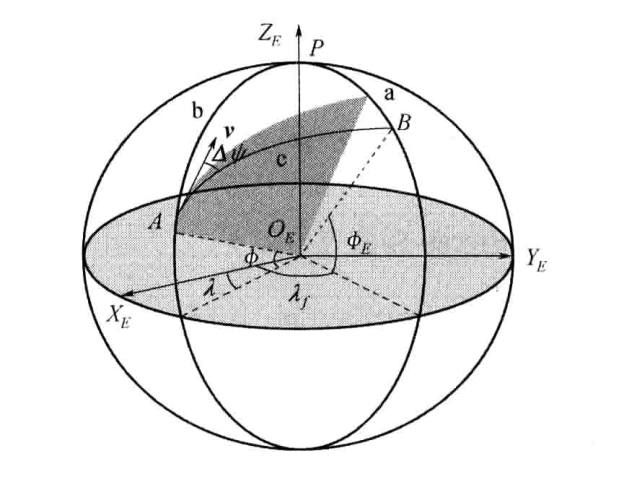
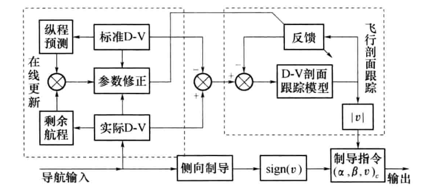

<!--
来源：远程火箭飞行动力学与制导（陈克俊）PDF，第 324-357 页。
本文件由扫描页 OCR 后整理为 Markdown；正文不保留分页标记。
-->

# 第9章 再入段的制导方法

## 9.1 再入制导的基本原理

跨大气层再入飞行器的再入方式一般可以分为：弹道式再入、有升力再入(又可分为低升阻比再入和高升阻比再入)，其相应的制导技术和方案也不同。弹道式再入主要是洲际导弹的再入方式，对运载器而言，主要是在再入初期(90km以上高空)，升力和阻力非常小，制导系统还不能正常工作的时候采用，对于其他阶段是不适用的；低升阻比再入方式广泛用于飞船等不可重复使用的高超声速、跨大气层再入飞行器；而对于可重复使用的跨大气层再入飞行器而言，一般采用较大升阻比的再入方式。

采用何种规律来调整再入飞行器升力变化的问题，便是再入制导规律设计问题。再入制导可分为标准轨道制导方法和预测制导方法两大类。

标准轨道制导是一种比较直观而有效的制导方法，制导算法所需计算量较小、容易实现。标准轨道制导方法广泛用于弹道导弹、运载火箭以及飞船再入制导，航天飞机早期的制导方案也曾考虑过这种传统意义上的标准轨道制导方法。不过航天飞机再入制导扩展了这种标准轨道制导方法，可重复使用运载器再入标准轨道制导也是基于航天飞机再入制导技术的广义的标准轨道制导。

### 9.1.1 标准轨道再入制导方法

传统的再入标准轨道制导的基本原理是：预先计算出合乎要求的再入标准轨道，并将所需的标准轨道参数(包括增益系数表)存储在计算机上；再入制导系统根据实际测量的飞行状态和标准轨道状态的关系，计算所需要的控制参数，控制飞行器按标准轨道再入飞行。

再入标准轨道制导的关键技术主要在于两个方面：（1）标准再入轨道设计；（2）再入制导控制规律。

标准再入轨道一般进行优化设计，用得较多的是非线性规划方法、极小值原理以及动态规划方法；再入制导要求存储标准再入轨道参数，可以根据经验确定制导控制规律，也可以建立状态误差的微分方程，运用经典自动控制方法、自适应控制方法、神经网络控制方法、模糊控制方法等，设计制导控制规律。

早期的标准再入轨道参数是以时间或速度为自变量存储的，研究表明按速度存储的效果优于按时间存储。而当前研究的再入制导方法往往按能量存储，其原因是速度变化不是单调的，而且航程与能量的关系更为密切。

有标准轨道的再入制导的目的是使运动参数接近标准再入轨道参数，使其着陆点满足要求。利用标准轨道的再入制导在实现中分成纵向制导和侧向制导，且以纵向制导为主。

总升力在半速度坐标系上投影，可表示为

教材式(9-1-1)为相应推导公式。

式中：L为总升力；L为总升力大小；v为倾侧角；%、z%为半速度坐标系y%、z方向的单位向量。

LcosV为总升力在纵向的投影，它的大小直接影响到飞行器升降快慢。Lsinv为总升力在侧向的投影，它影响飞行器的横向运动和横程。

飞行器受到的热负荷、过载，主要取决于飞行器的下降速度，而下降速度又主要取决于升力的纵向投影LcosV，LcosV的大小取决于攻角α和倾侧角V，在配平攻角不可调或攻角模型参数确定的条件下，控制LcosV大小的仅有控制变量V。纵向制导决定v的大小，而符号由侧向制导确定。

再入标准轨道制导一般是存储高度及其变化率、速度、阻力加速度以及航程等轨道参数，主要控制升阻比(L/D）。早期的标准轨道制导一般采用固定反馈增益控制

教材式(9-1-2)为相应推导公式。

教材式(9-1-3)为相应推导公式。

其中：V为径向速度，u为切向速度，R为航程，(L/D)。(L/D)。分别为升阻比的标准值和制导要求值。当实际飞行轨道对标准轨道的偏离较小时，采用上面制导方法，可能有几项反馈作用不大，这说明基本的再入动态特性具有一定的稳定性。研究表明K4增大，则航程控制能力增强，随之系统的稳定裕度减小，必须同时调整K1、K2使控制系统稳定。对稳定性的研究表明，速度较高时K4必定很小，只有在低速时才能增大。上述标准轨道制导规律也可以改进为

教材式(9-1-4)为相应推导公式。

其中S为微分算子，固定增益制导控制系统在诸多再入应用方面都具有较好效果，但是对于变增益系统，在末端改为对航程的修正更有效：

教材式(9-1-5)为相应推导公式。

上面制导控制规律主要用于升阻比较小的、采用配平攻角飞行的飞行器再入制导，且制导性能较好。实际再入飞行器往往采用最优化的反馈增益进行制导，有些飞船就是采用LQR方法求最佳反馈系数的标准轨道制导，它采用如下形式的控制规律：

教材式(9-1-6)为相应推导公式。

以上标准轨道再入制导方法一般不直接存储控制参数，新近的研究成果表明，标准轨道再入制导方法也可直接存储攻角和倾侧角：

教材式(9-1-7)为相应推导公式。

这属于PI控制，其中e表示能量，X表示状态，主要包括高度、飞行路径角以及剩余航程，反馈系数矩阵Kp、K,采用LQR方法获得。

### 9.1.2 再入轨道预测制导方法

预测制导一般无需标准轨道，能够在线计算再入走廊、航程，在线辨识大气参数、气动系数及其他参数和模型，以对实际参数、模型进行修正，并在线预测轨道。再入轨道预测制导能够降低多种不确定因素对再入制导的可行性、可靠性以及制导精度的影响程度，从而提高飞行器的可靠性、安全性，加快再入制导系统的设计进程，减少再入操作、运营费用，降低运载成本。

预测制导的基本思想是根据飞行器当前飞行状态，实时计算出满足一定要求的轨道，并根据得到的轨道信息对实际轨道进行控制，如将预测值与期望值进行比较，根据所得偏差信息对控制量进行估计、修正。

预测制导的关键技术之一是快速轨道预测，而根据轨道预测方法不同，预测制导一般可分为数值预测制导(也称快速运算预测)和解析预测(也称“闭式”预测）制导。其中数值预测制导主要采用数值积分方法进行轨道预测，而解析预测制导则在简化假设条件下，得到微分方程的解析解，从而近似预测再入轨道。

#### 1. 快速运算预测再入制导

快速运算预测再入制导的基本思想是：依靠飞行器上的快速计算机，对轨道方程进行积分，获得再入轨道的状态信息，然后根据这些信息对轨道进行校正。快速运算预测制导方法要对预测值与期望值进行比较，根据所得偏差信息对控制量进行修正。

快速运算预测再入制导一般要建立简化的再入运动数学模型，例如早期快速积分预测制导主要是考虑纵平面的运动(h，V，，R)状态信息，并对其进行积分，同时对升阻比、弹道系数进行估计、修正。这种预测制导主要考虑阻力加速度对航程的影响，认为常升阻比再入，因此主要迭代修正阻力加速度。

快速积分预测制导也可积分三自由度轨道方程，并建立终端状态对制导参数的敏感度函数，以此校正迭代过程，获得所需要的控制变量。这种方法首先定义标准的倾侧角和攻角模型(如图9-1所示)，通过更改制导模型参数，积分轨道方程得到终端状态信息，并与期望值进行比较，以获得终端状态误差对各个参数的敏感度函数。建立误差灵敏度函数是个离线过程，需要大量的计算。接着引入约束函数，在校正制导参数时，要求满足约束条件(温度、热流、过载、动压等)和终端条件。

*图9-1用于预测制导的倾侧角、攻角模型*

快速运算预测再入制导也可应用在类似于轨道生成/轨道跟踪的再入制导方法，不同的是该方法不仅在再入前生成飞行剖面，而且在再入过程中，根据实际飞行状态偏离标准状态的程度，决定是否重新用预测校正方法生成标准飞行剖面。每段被拟合为三次曲线，其控制规律采用线性反馈控制，以跟踪飞行剖面。仿真结果表明该算法迭代次数小于10次，能够实时计算，精度高、鲁棒性好。

快速运算预测制导的优点是它能够处理大范围的飞行条件，算法简单，通用性强、可移植性好，而且误差散布对制导方法的影响较小，制导精度也较高；而其缺点则是计算量大，一般难于实时计算。

#### 2. 解析预测再入制导

解析预测再入制导(也称“闭式”预测再入制导)的基本原理是对再入运动方程进行简化，得出近似的解析解，预测部分可能的轨道信息。解析预测制导往往假设某些参数不变，积分时忽略某些变化缓慢的变量。由于假设是有条件的，所以解析预测一般分段预测轨道，如在90km以上采用牛顿关于二体运动的方程，可以得到很精确的预测，90km以下则根据飞行特点进行简化。

例如：通过控制阻力加速度不变的飞行时段，则纵向航程可近似为

教材式(9-1-8)为相应推导公式。

式中：D、W分别为阻力加速度和重量。通过控制高度不变的飞行时段，则纵向航程为

教材式(9-1-9)为相应推导公式。

而对于平衡滑翔时段来说，则纵向航程为

教材式(9-1-10)为相应推导公式。

以上方法都是对纵程的预测，而同时预测纵程和横程。首先认为纵平面升阻比为常数，则有

教材式(9-1-11)为相应推导公式。

其次认为侧向转弯加速度为常数，此时可以计算横程

教材式(9-1-12)为相应推导公式。

从式(9-1-11)、式(9-1-12)可以看出纵程、横程是攻角和倾侧角的函数，“闭式”预测制导并没有直接从这两公式解出控制变量，而是建立敏感矩阵，更新控制变量

教材式(9-1-13)为相应推导公式。

解析预测制导的关键是对再入运动进行假设，而且制导能够控制飞行器接近假设的条件飞行，否则制导的精度较差。解析预测制导主要是对纵程进行预测，而对横程的预测只能局限在刻的条件下，也就是说，实际飞行路径往往会偏离假设，因此对横程预测的制导方法适应范围更窄。解析预测制导方法的优点是计算量小、速度快、所需内存少、对硬件要求低。缺点是不能灵活处理偏离假设的情况，对误差比较敏感，鲁棒性差。

快速积分预测可以与解析预测结合起来，解析预测的结果可以作为快速积分预测的初值，这样能够提高快速积分预测的收敛性和收敛速度。

随着计算机技术的不断发展，机载飞行计算机的运行速度将不断提高，数值积分运算所需时间将不再是制导方法所顾虑的主要因素，因此可以通过快速数值积分方法对再入轨道进行预测，以用于再入制导。由于快速运算预测制导需要在线积分再入运动微分方程，不依赖于对模型的各种假设，因此适应范围更广，将成为很有潜力的再入制导方法。

### 9.1.3 广义的标准轨道再入制导方法

传统意义上的再入标准轨道制导首先要求有一条满足再入走廊要求的标准再入轨道，而且往往需要进行优化设计；其次采用摄动方法，控制飞行器按照(或接近)标准轨道飞行。这种制导方法的关键技术之一是再入标准轨道的优化设计，特别是多维约束(主要指再入走廊)条件下的轨道优化设计，在理论和实践上都存在难度。

广义的标准轨道制导扩展了传统意义上的再入标准轨道制导概念，首先是在再入走廊内，优化设计满足航程和目标接口要求的标准再入飞行剖面，将再入轨道优化问题转化为飞行剖面优化问题。之后设计轨道跟踪控制器跟踪标准飞行剖面，一方面满足再入走廊要求，另一方面满足航程等要求。

这种方法的关键技术主要包括：

（1）再入吸热控制(包括再入走廊的确定)；

（2）标准再入飞行剖面设计；

（3）轨道跟踪控制规律；

（4）航程更新方法。

航天飞机再入制导即是一种广义的标准轨道制导，它综合了解析预测制导、标准轨道制导和在线生成飞行剖面的思想，但又不是简单的综合，而是根据当时的软硬件条件，进行了合理的改进。

这种广义的标准轨道再入制导的基本原理是：将再入制导可分为纵向和侧向制导，其制导原理结构示意图可如图9-2所示。

*图9-2广义的标准轨道再入制导原理结构示意图*

采用解析阻力加速度和速度(D-V)飞行剖面作为参考轨道，主要通过控制倾侧角，并对攻角进行微调，以跟踪D-V剖面，一方面控制再入吸热，另一方面对纵向航程进行预测、控制；动态对D-V部面进行调整，进行航程更新，以最终消除航程误差：飞行器的航向通过简单地倾侧逻辑进行控制。

（1）再入吸热控制技术。首先，将再入飞行路径约束转化为对阻力加速度的约束，并根据飞行器特性、飞行任务确定再入走廊：其次在再入走廊内设计D-V飞行剖面；最后采用轨道跟踪控制技术，控制飞行器在再入走廊内沿D-V飞行剖面飞行，从而对再入吸热进行控制。

（2）标准再入飞行面设计。广义的标准轨道再入制导没有明确的标准再入轨道，而是将标准再入轨道转化为满足一定要求的D-V飞行剖面，用于再入制导。再入制导只需要标准轨道在某一速度的升阻比、阻力加速度、高度变化率信息，而这些信息在一定条件下可以通过D-V剖面获得。因此可以在再入走廊内，采用分段解析函数，设计满足航程和末端能量管理要求的D-V剖面，作为标准轨道，对航程进行预测。

（3）轨道跟踪控制技术。一般再入制导采用控制攻角和倾侧角，限制侧滑角的制导控制策略。而广义的标准轨道再入制导的攻角变化规律是速度的函数，是事先设计好的，并综合考虑了再入吸热和侧向稳定性和机动性等要求。因此主要控制倾侧角，并适当调整攻角，以对参考D-V飞行剖面进行跟踪。采用摄动方法设计轨道跟踪控制器，轨道跟踪控制规律为PID控制，并采用线性反馈方法设计控制器增益系数，存储在飞行计算机中，以用于再入制导。其PID控制规律的形式如下：

教材式(9-1-14)为相应推导公式。

其中下标“c”表示制导指令，“0”表示参考值，可以根据参考D-V飞行剖面计算得到。根据上面公式则可以确定跟踪参考D-V飞行剖面所需要的倾侧角V的大小：

教材式(9-1-15)为相应推导公式。

至于倾侧角的符号则根据当前速度矢量与瞬时平面的夹角和侧向方位误差走廊的关系确定，当速度矢量与瞬时平面的夹角超过方位误差走廊时，则改变倾侧角的符号。

（4）航程更新方法。根据D-V剖面可以预测航程，但是在长时间、远航程的再入过程中，实际航程会逐渐偏离标准D-V剖面所预测的航程，因此再入制导系统需要不断更新参考D-V剖面来控制航程，消除航程误差。即：

（1）根据D-V剖面对剩余航程进行预测，并与实际剩余航程进行比较，调整参考D-V剖面，以符合实际情况。

（2）根据制导状态不同，调整不同段的飞行剖面，其基本思想是不改变D-V剖面形状，并尽量不调整后继部分剖面的航程。

总的来说，广义的标准轨道再入制导及其扩展的再入制导技术都不要求明确的空间再入标准轨道，而是以平面内的飞行剖面作为航程预测的依据，并采用轨道跟踪控制器跟踪参考飞行剖面，主要对热流和纵向航程进行控制，而侧向航程控制采用简单的倾侧翻转方法。

## 9.2 标准轨道再入制导方法

### 9.2.1 纵向制导

设标准返回轨道纵向升阻比为(L/D)。，实际升阻比为(L/D)，余量系数为K，则倾侧角V。为

教材式(9-2-1)为相应推导公式。

由于有干扰，实际的状态参数不等于标准轨道的状态参数，应改变倾侧角大小，使实际轨道接近标准再入轨道。设有误差时实际纵向控制升阻比为(L/D)。，则此时的倾侧角为

教材式(9-2-2)为相应推导公式。

教材式(9-2-3)为相应推导公式。

则如何确定升阻比增量△(L/D)是纵向制导的关键。关于△(L/D)的描述已在9.1.1节给出了几种表达形式，本节将以式(9-1-6)为例，即选取

教材式(9-2-4)为相应推导公式。

其中，An、Ah、AR、AR分别为飞行器的切向过载、爬高率、纵程和纵程变化率实际值与标准值的差，K、K²、K，和K.为纵向制导规律的反馈增益系数。对于一般意义的PID制导控制规律，关键的是各项系数的确定。目前确定制导参数的方法主要有以下几种：

（1）摄动法。也称固化系数法，就是在标准轨道附近进行泰勒展开，将制导系统简化为线性系统，采用经典控制的方法(如极点配置方法等)求一些基本反馈项的增益系数。如将制导系统简化为二阶或三阶系统，再采用固化系数法将系统看成常系数系统。对常系数系统用古典方法求解反馈增益系数ki。这种方法是标准轨道制导的理论基础，是最常用的方法之一。

（2）试验法。也称试探法，是在一定飞行段取不同系数的组合，以满足较好的制导控制性能。这种方法一般在摄动法的基础上，对其他非基本反馈项进行试探，以观其是否能够显著提高制导性能，如果不能改善制导性能，则一般会取消该项反馈。如取k为常数或分段为常数，然后对初始误差及其他误差进行仿真计算，通过试验确定满足落点精度要求的ki。显然该方法理论分析不够且与经验有关。

（3）最优化方法。即给出性能指标(一般是各种误差的组合)，采用最优化方法获取最佳增益系数。通常有两种方法解决这类问题：非线性规划方法求最佳增益系数：最优控制方法，如用最佳二次型性能指标选择最佳的反馈增益系数，即采用最优调节器理论，解Riccati方程得到最佳系数。性能指标最优化法得到了更为广泛的关注，下面给予简单介绍。

### 9.2.2 侧向制导

由式(9-2-2)知，当有误差时，其倾侧角v同标准返回轨道的v。不一样。纵向制导方程决定了V的大小，它满足了纵向制导的要求。此时，总升力L的侧向分量(L/D)DsinV也就确定了，不能调整。

但侧力LsinV的符号还可以改变。V反号不影响(L/D)。的大小和符号，也不影响侧力的大小，但可以改变侧力方向。利用这个特点可以在侧向制导设计中设计一个区间，使飞行器在此区间内自由飞行，当碰到边界时，让V反号，使侧向运动向相反方向进行，因此侧向制导实现的是开关控制。

因为最终横程要小于某一值，而开始偏差可能很大，也允许大一些，为此将边界设计成漏斗式的边界。该边界值为乙，当横程超过边界时，V就反号，实现开关控制，则侧向制导方程为

教材式(9-2-5)为相应推导公式。

其中Z为侧向运动参数，例如前面定义的横程，乙为侧向控制边界。

教材式(9-2-7)为相应推导公式。

由于乙是速度v的线性函数，而再入速度基本上是减速的，故侧向控制边界呈“漏斗形”。在侧向制导方程中，K,之项的引进是为了防止侧向运动的过调，因为v的反号并不等于乙的反号，而近似等于的反号，式中加上一个微分项可以改善侧向运动性能。系数C、C2、C,和C,的选择应综合考虑到在各种干扰条件下，飞行器制导控制系统的制导控制能力，通常要反复迭代才能确定。

侧向制导中漏斗形的中心线（面)的定义因横程的定义不同而不同。

（1）在球面上定义纵程和横程时，漏斗形的中心线为过再入点的星下点和开伞点的大圆弧ef。侧向运动参数取球面上定义的横程，而乙表示在大圆弧ef~两边在球面上的边界线。

（2）用标准再入纵平面的垂线定义横程，漏斗形的中心实际上是一个面，即过e点、厂点和地心的标准再入纵平面，漏斗的边界也是在标准再入纵平面两边的两个曲面(或平面)。

侧向制导方程中的侧向运动参数Z也可以定义为横程差(横坐标差)

教材式(9-2-8)为相应推导公式。

式中：Z为横坐标差；z,为飞行器在返回坐标系中的横坐标；z,为标准情况下飞行器在返回坐标系中的横坐标。此时漏斗的中心线为标准返回轨道在0。一x。。平面上的投影。此时的制导方程为

v(t):

教材式(9-2-9)为相应推导公式。

### 9.2.3 纵平面运动方程的线性化

为获取纵向制导规律式(9-2-4)中的反馈增益系数k、kz、ks、k4，可采用对简化的纵平面运动方程进行摄动的方法。为工程上易于实现，将时变的增益系数k、k、kk,逼近成常数或分段常数，得到所需的次优反馈增益系数。

为了简化纵平面运动方程，需作如下基本假设：

（1）地球形状、引力模型：不考虑地球旋转，地球为一均质圆球。

（2）大气模型：高度在91km以下采用标准大气的分段函数模型，91km以上采用数值插值办法得到。

（3）飞行过程中采用配平攻角飞行，α=nr，β=0，C=C(M)

教材式(9-2-10)为相应推导公式。

纵向运动的升阻比(C,/C,)。=(C/Cp)cosVo，V。由三自由度标准弹道设计给出。这时纵平面运动方程为py?

教材式(9-2-11)为相应推导公式。

式中：\Theta为当地速度倾角；r,=r，+h；r，为地球平均半径，h,为飞行终点高度；R为导弹在假想球面飞过的纵程。切向过载Copv's

教材式(9-2-12)为相应推导公式。

将式(9-2-11)对标准弹道线性化可得

教材式(9-2-13)为相应推导公式。

其中

教材式(9-2-14)为相应推导公式。

教材式(9-2-15)为相应推导公式。

由式(9-2-12)线性化过载系数可得

教材式(9-2-16)为相应推导公式。

式中

教材式(9-2-17)为相应推导公式。

由式(9-2-13)后两式和式(9-2-16)可得

教材式(9-2-18)为相应推导公式。

其中

教材式(9-2-19)为相应推导公式。

现将式(9-2-18)记为

教材式(9-2-20)为相应推导公式。

要求列写的方程式为

教材式(9-2-21)为相应推导公式。

将式(9-2-13)中Ai，△，Ah代入上式，则可以得到

其中

教材式(9-2-23)为相应推导公式。

教材式(9-2-24)为相应推导公式。

则式(9-2-22)可改写为

教材式(9-2-25)为相应推导公式。

### 9.2.4 最佳反馈增益系数的求解

经过线性化得到纵向小扰动状态空间方程式(9-2-25)，就可以用二次型性能指标最优的线性控制来求解反馈增益k、k2、k、ks。取性能指标

教材式(9-2-26)为相应推导公式。

其中F、Q为非负定阵，R为正定阵。可选择F、Q、R的形式如下：

式中：Angr、Ah,、AR、AR,为落点期望的精度；Anm、Ahm、ARmAR.为状态允许的最大偏差；[A(C,/C)。]为允许的最大控制偏差。利用极小值原理，哈密尔顿函数为

教材式(9-2-27)为相应推导公式。

其共轭方程及横截条件为

教材式(9-2-28)为相应推导公式。

教材式(9-2-29)为相应推导公式。

由极小值原理，最优控制U"使H,取极小值，即"He

教材式(9-2-30)为相应推导公式。

因R是正定的，其逆必存在，故

教材式(9-2-31)为相应推导公式。

由此可得dx'

教材式(9-2-32)为相应推导公式。

上述方程是线性的，且X"(t,）与a"(t,)有线性关系，因此可假设a=PX，则

教材式(9-2-33)为相应推导公式。

由式(9-2-32)和式(9-2-33)，可得

教材式(9-2-34)为相应推导公式。

由X的任意性，可得Riccati微分方程如下：

教材式(9-2-35)为相应推导公式。

最优控制为

教材式(9-2-36)为相应推导公式。

最佳反馈增益系数为

教材式(9-2-37)为相应推导公式。

由此可见，反向积分Riccati微分方程，即可得到反馈增益系数K。因为G、H、Q、R在(to,t,）上都是连续函数，所以Riccati微分方程在(fo,t,)上满足边界条件的解是存在的，而且是唯一的。

## 9.3 广义的标准轨道再入制导方法

### 9.3.1 简化的再入运动数学模型

在研究再入制导问题时，可考虑速度与地心量构成的瞬时平面的运动和目标平面法向的运动或侧向运动，进一步忽略地球扁率和自转的影响，则飞行器在瞬时平面内的再入运动数学模型可简化为

$$
\left\{
\begin{aligned}
\dot h&=\dot r=v\sin\theta \\
\dot v&=-g\sin\theta-D \\
\dot\theta&=\frac{1}{v}\left[L_v-\left(g+\frac{v^2}{r}\right)\cos\theta\right],\quad L_v=L\cos\nu \\
\dot R&\approx v\cos\theta
\end{aligned}
\right.
\tag{9-3-1}
$$

再入飞行器当前位置到目标的航程可由下面公式近似计算(见图9-3)：

$$
R=c\left[R_0+\left(h+h_f\right)/2\right]
\tag{9-3-2}
$$

$$
\left\{
\begin{aligned}
A&=\operatorname{arc\,cot}\left[\frac{\cos\phi\tan\phi_f-\sin\phi\cos\left(\lambda_f-\lambda\right)}{\sin\left(\lambda_f-\lambda\right)}\right] \\
c&=\arccos\left[\sin\phi\sin\phi_f+\cos\phi\cos\phi_f\cos\left(\lambda_f-\lambda\right)\right]
\end{aligned}
\right.
\tag{9-3-3}
$$

<em>图9-3 再入纵向运动平面和目标平面的几何关系</em>

当前时刻的方位误差为

$$
\Delta\psi=\psi-A
\tag{9-3-4}
$$

其中 $A(\lambda,\phi)$ 为当前点，$B(\lambda_f,\phi_f)$ 为目标点，$P$ 为极点，$c$ 为弧 $AB$ 所对应的角，$A$ 到 $B$ 的视线角为 $A$，速度方位角为 $\psi$，方位误差为 $\Delta\psi$。

### 9.3.2 广义的再入标准轨道制导原理

飞行器再入过程中主要依靠升力和阻力来控制再入轨道，而根据飞行器的结构布局，：一般不要求侧滑，因此再入制导主要采用攻角和倾侧角进行轨道控制。再入制导方法一般以控制倾侧角为主，以控制攻角为辅，其原因主要是基于以下考虑：

（1）设计一维制导控制规律相对于二维的要简单；

（2）基于再入吸热考虑。根据优化结果，认为大攻角再入有利于减少飞行器再入吸热，兼顾机动性则要求以最大升阻比飞行，因此攻角剖面一般事先优化确定；

（3）采用倾侧转弯不仅能够控制阻力加速度，还可以控制侧向航程，也就是说，只需设计倾侧角变化规律就可以完成再入制导任务。不过辅以攻角调制能够改善制导系统瞬态响应特性，提高制导性能。

综上所述，再入制导通常考虑各种综合因素确定标准攻角飞行剖面，然后重点设计倾侧角变化规律，对热流、过载、动压和纵向航程进行控制，并通过倾侧翻转来实现侧向航程控制。

总的来说，再入标准轨道制导可分为再入机动纵向制导和再入机动侧向制导。再入标准轨道制导采用阻力加速度/飞行速度(D-V)剖面作为参考轨道(飞行剖面)，主要通过控制倾侧角，跟踪D-V剖面，从而对驻点热流、过载、动压进行控制，同时对航程进行预测，并实时修正，以消除航程误差。再入标准轨道制导原理方案可如图9-4所示。

<em>图9-4 再入标准轨道制导原理图</em>

### 9.3.3 再入纵向制导

再入纵向制导的任务是跟踪标准(或参考)D-V飞行剖面，一方面保证再入轨道满足再入走廊要求，另一方面满足纵向航程和末端能量(包括速度和高度)的要求。再入纵向制导方法的主要步骤为：

（1）根据飞行器结构配置、再入走廊和飞行任务，选择合适的D-V剖面形状和分段，可对D-V剖面进行优化，存储得到标准的D-V部面，必要时进行适当的数据处理；

（2）在不进行航程更新的情况下，设计轨道跟踪控制器及增益系数，较好地跟踪标准D-V飞行部面：

（3）进一步设计制导控制规律，如选择合适的反馈组合形式，并进一步确定反馈增益，最终满足较小的航程误差；

（4）根据航程预测值和实际值之间的关系，适当调整D-V飞行剖面或相应的轨道参数，进行航程更新，以满足对再入航程的要求，并提高制导精度；

（5）最后综合考虑制导规律、增益系数和航程更新方法，以获得最佳制导性能。

本节主要研究再入飞行器纵向机动制导规律，包括航程预测、制导规律设计、增益系数确定等内容，而航程更新以及不同组合形式的标准轨道制导规律在后续章节进一步研究。

#### 1. 航程预测

一般的再入飞行器的侧向机动范围(相对纵向而言)不是很大，航程主要由纵向航程决定，而纵向航程可以通过D-V剖面解析地预计。在飞行器再入的大部分区域，飞行路径角θ很小，可以近似认为sino=0，则

教材式(9-3-5)为相应推导公式。

当飞行路径角较大时，上面公式误差较大，可进一步采用下面公式估计：

教材式(9-3-6)为相应推导公式。

此公式具有较高的航程预测精度，因此采用D-E飞行剖面前景广阔，一方面不用切换制导状态，另一方面能量单调下降，方便计算与分析。根据分段解析D-V剖面，可以解析求解D-V剖面的航程以及其他轨道参数，下面介绍具体的推导过程。在忽略地球扁率和自转的情况下，且在飞行路径角较小的情况下，考虑瞬时平面内的再入运动则有

教材式(9-3-7)为相应推导公式。

根据式(9-3-7)可对航程R进行预测：

教材式(9-3-8)为相应推导公式。

在飞行路径角θ较小时，可近似认为sino=0，cos=1，于是

教材式(9-3-9)为相应推导公式。

进一步根据能量的定义，则单位质量的能量E为

教材式(9-3-10)为相应推导公式。

结合式(9-3-7)、式(9-3-8)和式(9-3-9)，则当飞行路径角较大时，航程可进一步近似为

教材式(9-3-11)为相应推导公式。

然后根据D-V曲线的解析表达式，则可以直接积分D-V剖面，以进行航程预测。D-V曲线的解析表达式和分段航程预测公式见表9-1。

表9-1 再入D-V剖面航程估计

再入状态 阻力加速度剖面D 航程预计公式(ve[v~wD)

温控段

平衡滑翔段

常阻力段

过渡段

再入过程中飞行路径角一般较小，根据公式(9-3-7)，且为了方便起见，将瞬时平面内的升力L直接写为L(下同)，则高度变化率及其导数可近似为

教材式(9-3-12)为相应推导公式。

进一步根据标准大气模型，可以将大气密度近似为高度的解析函数，即

教材式(9-3-13)为相应推导公式。

则有

教材式(9-3-14)为相应推导公式。

由于

教材式(9-3-15)为相应推导公式。

于是可得到

教材式(9-3-16)为相应推导公式。

教材式(9-3-17)为相应推导公式。

对式(9-3-17)进行微分，可得到

2D²

教材式(9-3-18)为相应推导公式。

根据式(9-3-12)、式(9-3-17)和式(9-3-18)，进一步可得到

教材式(9-3-19)为相应推导公式。

教材式(9-3-20)为相应推导公式。

如果D-V剖面采用二次(或二次以下)曲线，则有

教材式(9-3-21)为相应推导公式。

教材式(9-3-22)为相应推导公式。

教材式(9-3-23)为相应推导公式。

则式(9-3-17)和式(9-3-20)可表示为

教材式(9-3-24)为相应推导公式。

教材式(9-3-25)为相应推导公式。

根据以上公式可以计算与D-V剖面相对应的轨道参数以及航程，如表9-1和表9-2所示。

表9-2 标准D-V飞行剖面轨道参数

再入状态 高度变化率(h） 标准升阻比(L/D)o

量[1-(or)-4h,G_h-C-≤:Ce(cm

温控段

善[1-(vv,)]-

平衡滑翔段

常阻力段

过渡段

#### 2. 轨道跟踪控制器

根据上述计算公式可以解析计算标准D-V剖面所对应的升阻比，并不能复现标准D-V剖面。究其原因是多方面的，如公式本身是近似的，而且再入运动是高度非线性的，微小的扰动可能导致实际轨道偏离标准轨道。因此需要设计轨道跟踪控制器，控制飞行器再入轨道按照或接近标准D-V部面飞行。

跟踪控制器的设计可以采用线性或非线性方法进行设计，本节主要根据摄动原理，采用线性化方法进行设计。在设计时认为实际轨道非常接近标准轨道，则定义以下小量偏差

教材式(9-3-26)为相应推导公式。

其中(L/D)c表示跟踪D-V剖面所需要的瞬时运动平面内的升阻比，下表“0”表示与标准D-V剖面对应的值，可通过表9-1和9-2计算得到。将公式(9-3-26)代入公式(9-3-19)，并忽略偏差的高次项，可以得到

教材式(9-3-27)为相应推导公式。

教材式(9-3-28)为相应推导公式。

因为升力式飞行器再入制导主要采用倾侧角进行制导控制，而且攻角是速度的函数，如果在当前速度进行摄动、展开，则有v=0，于是

教材式(9-3-29)为相应推导公式。

式(9-3-28)进一步可简化为采用线性反馈控制，则可得到D-V飞行面跟踪控制器，如图9-5所示。进一步可采用极点配置方法，使得动力学系统(9-3-30）具有二阶阻尼系统的性能：

教材式(9-3-31)为相应推导公式。

*图9-5D-V跟踪控制器结构示意图*

则可以求出反馈增益系数：（2D。

教材式(9-3-32)为相应推导公式。

2D,_3D。

由于阻力加速度变化率不易测量，可以将加速度变化率转化为高度变化率，于是得到新的反馈形式及反馈系数：

教材式(9-3-33)为相应推导公式。

根据跟踪性能仔细设计，并存储为表格，也可以拟合为速度或阻力加速度的函数。上面跟踪控制规律是最基本的纵向制导控制，为了减小稳态误差可以扩展为PID控制规律，进一步可以改进为更一般形式的PID跟踪控制规律：

教材式(9-3-34)为相应推导公式。

以上制导规律被广泛用于以控制倾侧角为主的可重复使用跨大气层飞行器再入制导和飞船的再入制导，甚至可以用于远程弹道导弹的制导。不过对于具体飞行器可能采用不同的组合形式，可以增加其他重要的反馈，也可以减少一些不起作用的反馈。本节主要采用阻力加速度、高度变化率、航程作为反馈，其他反馈不能显著改善制导性能，因为本节进一步吸取了航程更新的思想，在制导规律中融入航程更新技术。而航程更新能够大大增强再入制导的鲁棒性，提高制导精度。

#### 3. 增益系数确定

对于一般意义的PID制导控制规律，关键在于各项系数的确定，可综合运用摄动法、试验法和最优化法等方法设计确定最佳轨道跟踪控制器反馈增益系数，以获得较好的制导性能。最佳轨道跟踪控制器反馈增益系数可参考上节给出的方法进行求解确定。

### 9.3.4 再入制导的航程更新

再入标准轨道制导通过跟踪标准D-V飞行面，可以保证再入轨道满足再入走廊和末端能量管理的要求，至于到目标的航程不能完全依赖标准D-V剖面跟踪控制来满足。因为剖面对航程的预测是近似的，而且由于侧向机动，使得实际航程逐渐偏离D-V面所预测的航程。因此在飞行过程中要不断进行航程更新，使得实际航程逼近预测航程(或预测航程逼近实际航程)，从而动态消除航程误差。

有多种航程更新技术用于动态消除航程误差：

（1）更新参考飞行面，即在线调整参考飞行剖面及其轨道参数以适应实际飞行情况，其结果是参考轨道不断逼近实际轨道。更新参考飞行剖面有多种方案，较常用的是更新部分飞行剖面和更新整个飞行剖面，如图9-6所示。

*图9-6 剖面更新方案*

（2）更新实际飞行剖面，即结合再入制导进行轨道控制，使得实际再入轨道不断逼近标准轨道。这种方案实际上并不改变标准飞行面，而是在制导过程中融合航程更新技术。瞬时更新与标准D-V飞行剖面相对应的轨道参数，并反馈给制导控制系统进行轨道控制，使得实际航程逐渐逼近标准航程，这种方法也可称为“修正标准飞行剖面参数”的航程更新方法。

### 9.3.5 再入机动的侧向制导

升力式再入飞行器再入机动侧向制导，采用一系列倾侧翻转的方法改变倾侧角符号，控制侧向航程和速度方向。可以采用开关控制的原理、方法控制对准目标的角度误差，开关曲线可称之为侧向方位误差走廊，如图9-7(a)所示，而侧向方位误差可定义为速度与目标平面(如图9-7(b)的夹角，右偏于目标平面时为正。

*图9-7再入飞行方位误差及侧向方位误差走廊*

飞行器再入侧向机动制导除了确保最小倾侧角以进行侧向机动外，不额外计算倾侧角大小，只是根据方位误差确定倾侧翻转时机，即当侧向方位误差超过预定的方位误差走廊边界时，则改变倾侧角符号，使得再入飞行器朝向目标(或HAC)。方位误差走廊可分为高速区、中速区和低速区，低速区的走廊宽度线性减小，以保证侧向航程精度要求。下面公式为一个可行的方位误差走廊，公式中角度的单位为度，速度的单位为m/s。方位误差走廊的数学表达式如下：

教材式(9-3-35)为相应推导公式。

其中，Amax为所允许的最大方位误差，方位误差角Aw也可定义为速度方位角与到目标的视线方位角之差，速度方位角由导航系统给出，视线方位角通过公式计算得到，在整个再入过程中要求Aul≤△max。侧向制导需要选择Amax，以满足侧向航程及其他要求。

## 9.4 最优再入机动末制导方法

再入飞行器若是为以提高精度和突防为主的高级机动弹头，通常要求同时完成两大任务，即要命中目标又要使其落速方向满足弹道规划要求。本节将用优化原理解决这一复杂多约束条件下的闭路最优制导问题。

### 9.4.1 相对运动方程

为了简化问题，可将飞行器运动分解为俯冲平面和转弯平面，如图9-8所示。其中，俯冲平面定义为弹头质心O、目标O。和地心O所确定的平面，转弯平面定义为过目标和弹头质心而垂直于俯冲平面的平面。如图所示，v为速度矢量，为速度在俯冲平面内的方位角，为视线角，n,为速度方向与视线间的夹角，p为视线距离。设v在俯冲平面内，Yp<0，则

教材式(9-4-1)为相应推导公式。

由图知

教材式(9-4-2)为相应推导公式。

由式(9-4-2)中第二式，两边对时间求导，并将式(9-4-1)和式(9-4-2)代入，即可得俯冲平面内的相对运动方程：

教材式(9-4-3)为相应推导公式。

循冲平面转弯平面

*图9-8*

俯冲平面和转弯平面示意图同理，令

教材式(9-4-4)为相应推导公式。

n为速度矢量在转弯平面内与俯冲平面的夹角，为速度在转弯平面内的方向角，^为转弯平面内的视线角。与俯冲平面类似推导可得转弯平面内的相对运动方程：

教材式(9-4-5)为相应推导公式。

### 9.4.2 俯冲平面内最优导引规律

飞行器攻击段的最优导引律是终端有约束的，约束条件包括终端速度倾角和终端速度大小，速度大小放在下一节讨论，本节研究对落地速度倾角有约束、对地面固定目标进行攻击的导引规律。俯冲平面内的相对运动方程如式(9-4-3)所示，终端约束取视线角与要求的速度倾角相等，且视线转率为0，即

教材式(9-4-6)为相应推导公式。

此条件可保证终端的速度倾角等于要求的落地倾角。记

教材式(9-4-7)为相应推导公式。

可得状态方程

教材式(9-4-8)为相应推导公式。

终端约束表达式变为

教材式(9-4-9)为相应推导公式。

假定/V0，且定义待飞时间

教材式(9-4-10)为相应推导公式。

则状态方程简化为

教材式(9-4-11)为相应推导公式。

教材式(9-4-12)为相应推导公式。

则状态方程可改写为

教材式(9-4-13)为相应推导公式。

考虑到除终端速度倾角外对终端速度大小也有要求，因此在最优导引规律研究中应该使速度损失尽量小，以便有富余速度用来减速，落速大小主要取决于诱导阻力的大小，而诱导阻力的大小又近似与α成正比，且攻角α又近似与。的大小成正比，所以速度损失要小，即要求洛d要小，所以求最优导引规律的性能指标取为

教材式(9-4-14)为相应推导公式。

其中，x"(t,)Fx(t,）为补偿函数；F为一个对称半定常值矩阵，因为要求终端时刻x(t,)=0，故F→00。这是一个典型的二次型性能指标的最优控制问题，可利用极大值原理进行解析求解。根据极大值原理，线性系统二次型性能指标的最优控制为

教材式(9-4-15)为相应推导公式。

式中，R=1,u=%，于是可得

教材式(9-4-16)为相应推导公式。

式中P通过解如下逆Riccati矩阵微分方程得到：

教材式(9-4-17)为相应推导公式。

考虑到P为对称阵，令

教材式(9-4-18)为相应推导公式。

将A，B阵代入，写成分量形式，有

教材式(9-4-19)为相应推导公式。

终端条件为

引入小量△f,，剩余时间T。=t,-t+,，对上式按照从第三式到第一式的顺序逐个积分，可得

教材式(9-4-20)为相应推导公式。

2T?

显然当t=t,时，T=N,，

满足终端条件。考虑到，为小量，可简化得到

教材式(9-4-21)为相应推导公式。

对上式求逆从而可得

教材式(9-4-22)为相应推导公式。

将P矩阵代入最优控制式(9-4-16)，可得最优控制律为

教材式(9-4-23)为相应推导公式。

式(9-4-23)为弹头在俯冲平面内的最优导引律，从中可以看出，为了命中目标，且速度损失尽量小，其最优导引规律相当于比例导航参数为4的比例导引。因为终端有约束，增加了终端约束项，以保证命中点处速度方向满足要求。

### 9.4.3 转弯平面内最优导引规律

弹头在转弯平面内的运动方程如式(9-4-5)所示，类似俯冲平面，仍假设/v0，令T=-p/p，则运动方程简化为

教材式(9-4-24)为相应推导公式。

假设在命中目标时，仅要求转弯平面视线转率为零（(t,)=0)，而对视线方位角(t,)无要求，这是因为只要落速方向为pr，但转弯平面内沿什么方向进入没要求，故(t,)是自由的。取状态变量x=，控制变量u=，可得状态方程标准形式

教材式(9-4-25)为相应推导公式。

其中，

教材式(9-4-26)为相应推导公式。

性能指标取为

教材式(9-4-27)为相应推导公式。

要求终端时刻x(t,)=0，故F→80，同样为二次型性能指标最优控制问题。根据极大值原理，转弯平面内的最优控制律为

教材式(9-4-28)为相应推导公式。

式中，P通过解如下逆Riccati矩阵微分方程得到：

教材式(9-4-29)为相应推导公式。

将A，B阵代入，可得

教材式(9-4-30)为相应推导公式。

对上式进行积分，且考虑到T=t,-1+t,，可得

教材式(9-4-31)为相应推导公式。

考虑到△t，为小量，可简化得到

教材式(9-4-32)为相应推导公式。

将P矩阵代入最优控制式(9-4-28)，可得转弯平面内的最优控制律为=3元

教材式(9-4-33)为相应推导公式。

### 9.4.4 速度控制方法

根据攻击要求，落速需要限制在一定范围内，为了保证射程，在不加特殊控制情况下终端速度通常偏大，为此需要进行减速控制。整个减速过程中，任何时刻的减速目标如何确定至关重要，为此，需要设计一条理想速度曲线，如果整个过程速度按此理想速度曲线变化，或者尽量接近此变化曲线，则可以保证落速大小满足要求。当理想速度曲线设计好，如何把实际速度减小到理想速度曲线上，就是速度大小的控制问题。

#### 1. 理想速度曲线设计

为了便于计算，理想速度曲线尽量采用解析表达式。由第5章简化再入运动方程，可得

在0～80km高度范围内，大气密度可取p=Pe-附，其中p为h=0处的密度，β近似为一常数，通常取β=1/7110/m。由dt=dh/vsin\Theta，则式(9-4-34)可改写成dy?

教材式(9-4-35)为相应推导公式。

令K。

则式(9-4-21)为

dv?

教材式(9-4-36)为相应推导公式。

令t=0时，V=V，h=h，P=P。，积分式(9-4-36)可得

教材式(9-4-37)为相应推导公式。

若略去重力影响，弹头只受阻力作用，弹道为直线，\Theta=e为常数。又因弹头马赫数很大时可认为C,为常数。此时，K。=-C,Sp/βmsinθ也为常数，式(9-4-37)变为

教材式(9-4-38)为相应推导公式。

教材式(9-4-39)为相应推导公式。

在当前讨论范围内，=Yp，为了突出的作用，将K。写成K。=-Kol/sin，Kol=C,Sp。/βm。则式(9-4-39)可写为

教材式(9-4-40)为相应推导公式。

假如垂直降落，=-90°，则

教材式(9-4-41)为相应推导公式。

为了方便理解，逆向观察弹道，即令h=hp=0,v。=Vp(vs为期望终端速度)，则

教材式(9-4-42)为相应推导公式。

将式(9-4-42)按泰勒级数展开，且只取第一项，则可近似得到

教材式(9-4-43)为相应推导公式。

实际中=-90°不可能总是满足，为此可采用下面的经验公式：

教材式(9-4-44)为相应推导公式。

其中，c表示对±-90°的修正，可取为

教材式(9-4-45)为相应推导公式。

c≥2

#### 2. 速度大小控制

速度控制就是如何把实际速度控制到理想速度曲线上去。从减速角度讲，只要增大攻角，产生附加的诱导阻力，便可以达到减速的目的。由于飞行器具有面对称结构，采用BTT控制，设侧滑角恒为0。若不做减速运动，则阻力加速度为Pav's

Pv's

教材式(9-4-46)为相应推导公式。

其中，C为&=0时的阻力系数，Cx为&引起的诱导阻力系数。同样条件下若有附加的减速运动，设攻角为α(未知)，此时阻力加速度为

教材式(9-4-47)为相应推导公式。

短时间内近似认为v。V,P。p，则附加攻角引起的附加诱导阻力加速度可写为

教材式(9-4-48)为相应推导公式。

按导引规律要求的速度方向转率为

教材式(9-4-49)为相应推导公式。

而由附加攻角α%产生的A希望沿的垂直方向加上去，如图9-9所示，则=洛-

教材式(9-4-50)为相应推导公式。

*图9-9附加速度方向转率示意图*

考虑到速度方向转率即由攻角产生的法向过载实现，故可近似认为。与α成正比，可得

教材式(9-4-51)为相应推导公式。

进而，结合式(9-4-48)可得pv's

教材式(9-4-52)为相应推导公式。

设某一时刻实际速度v和理想速度的差为v-，如果认为在T,=-p/p时间内完成减速，则所需的平均加速度为(v-v)/T，，但实际上由于速度持续下降并不是在T，时间内完成，所以应加一修正系数K，故可以认为附加的切向加速度为

教材式(9-4-53)为相应推导公式。

由此可得附加攻角

教材式(9-4-54)为相应推导公式。

本来的攻角&可由导引规律确定，但是也可以采用下面的方法计算。无附加的减速运动，则

教材式(9-4-55)为相应推导公式。

pv's

教材式(9-4-56)为相应推导公式。

进而，可得

教材式(9-4-57)为相应推导公式。

教材式(9-4-58)为相应推导公式。

教材式(9-4-59)为相应推导公式。

教材式(9-4-60)为相应推导公式。

其中，诱导阻力加速度由下式求出：

教材式(9-4-61)为相应推导公式。

教材式(9-4-62)为相应推导公式。

2mC%则式(9-4-50)变成

教材式(9-4-63)为相应推导公式。

式(9-4-63)即为减速控制附加攻角后的速度方向转率计算公式，将其作分解得

教材式(9-4-64)为相应推导公式。

其中：

教材式(9-4-65)为相应推导公式。

### 9.4.5 导引参数确定

获得所需速度方向转率后，可近似地转化为需用过载的形式

教材式(9-4-66)为相应推导公式。

根据制导指令要求过载n,,n，，可得总的法向过载

教材式(9-4-67)为相应推导公式。

当采用倾斜转弯机动方式时，认为控制系统可保证侧滑角β=0，侧力Z=0，则攻角α可由下式近似求解确定

教材式(9-4-68)为相应推导公式。

式中：L为制导指令要求过载所对应的总升力。而倾侧角

教材式(9-4-69)为相应推导公式。

当采用双平面机动方式时，认为控制系统可保证飞行过程中倾侧角V=0，可分别由俯仰和偏航通道保证实际所要求的α和β或nyl、n.。则攻角α和侧滑角β可由下式近似求解确定

教材式(9-4-70)为相应推导公式。

式中：Y,Z分别为制导指令要求过载所对应的升力和侧力。
