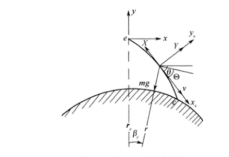

<!--
来源：远程火箭飞行动力学与制导（陈克俊）PDF，第 159-213 页。
本文件由扫描页 OCR 后整理为 Markdown；正文不保留分页标记。
-->

# 第5章 再入段运动特性分析与弹道设计

飞行器的被动段飞行弹道，根据其受力情况不同，可分为自由段和再入段。在再入段，飞行器受到地球引力、空气动力和空气动力矩的作用。由于空气动力的作用，使得飞行器在再入段具有以下特点：（1）飞行器运动参数与真空飞行时有较大的区别。（2）由于飞行器以高速进入稠密大气层，受到强大的空气动力作用而产生很大的过载，且飞行器表面也显著加热。这些在研究飞行器的落点精度和进行飞行器强度设计及防热措施时，都是要予以重视的问题。（3）可以利用空气动力的升力特性，进行再入机动飞行。根据上述再入段的特点，有必要对飞行器的再入段运动进行深入的研究。当然，自由段和再入段的界限是选在大气的任意界面上，其高度与要解决的问题、飞行器的特性、射程(或航程)等有关。例如，大气对远程弹头的运动参数开始产生影响的高度约为80~100 km，通常取80km作为再入段起点，有时为了讨论问题方便，也以主动段终点高度作为划分的界限。实际上，即使在自由段，飞行器也会受到微弱的空气动力作用，特别对近程弹道导弹，由于弹道高度不高，情况更是如此。因此，在本章将建立的考虑空气动力的再入段运动方程，也可用于研究考虑空气动力后的自由段，从而使自由段弹道精确化。

## 5.1 再入段运动方程

在再入段，飞行器是处于仅受地球引力、空气动力和空气动力矩作用的无动力、无控制的常质量飞行段，因此，很容易由第3章空间一般运动方程简化得到再入段运动方程。

### 5.1.1 矢量形式的再入段动力学方程

在上面推导的式(3-1-2)中，只要取P=0,F。=0,F=0；而在式(3-1-4)中，取M。=0,M=0,M=0。便得到在惯性空间中以矢量形式描述的再入段质心动力学方程

$$
\begin{equation}
m\frac{d^2\boldsymbol r}{dt^2}=\boldsymbol R+m\boldsymbol g
\tag{5-1-1}
\end{equation}
$$

和在平移坐标系中建立的绕质心动力学方程

$$
\begin{equation}
\boldsymbol I\cdot\frac{d\boldsymbol\omega_T}{dt}
\boldsymbol\omega_T\times(\boldsymbol I\cdot\boldsymbol\omega_T)
=\boldsymbol M_{st}+\boldsymbol M_d
\tag{5-1-2}
\end{equation}
$$

其中

$$
\begin{equation}
\boldsymbol\omega_T=\boldsymbol\omega+\boldsymbol\omega_e
\tag{5-1-3}
\end{equation}
$$

\omega为飞行器姿态相对于发射坐标系的转动角速度，\omega为地球自转角速度。

### 5.1.2 地面发射坐标系中再入段空间运动方程

对微分方程(5-1-1)、式(5-1-2)的求解须将其投影到选定的坐标系中。当考虑地球为均质旋转椭球体时，在地面发射坐标系中的再入段空间运动方程，可由式(3-2-39)简化得到。（1）由于是无动力飞行，故可在质心动力学方程中，取P=0。（2）再入是无控制飞行状态，故可去掉3个控制方程，且在动力学方程中，取

（3）再入飞行器无燃料消耗，在理想条件下，为常质量质点系，故可去掉1个质量计算方程，且m=0,ix=i,=1=0。（4）考虑到再入段飞行时间很短，且\omega为$10^{-4}$量级，故可近似取\omega=\omega，即

则可去掉与之间的联系方程和r与之间的联系方程，共6个。综上所述，在式(3-2-39)的32个方程的基础上，已去掉了10个，余下的22个也进行了简化，得到的在地面发射坐标系中的再入段空间运动方程如下：

$$
\begin{equation}
\left\{
\begin{aligned}
m\begin{bmatrix}
\dfrac{dv_x}{dt}\\[2pt]
\dfrac{dv_y}{dt}\\[2pt]
\dfrac{dv_z}{dt}
\end{bmatrix}
&=G_v\begin{bmatrix}-X\\Y\\Z\end{bmatrix}
+m\frac{g'_r}{r}\begin{bmatrix}x+R_{ox}\\y+R_{oy}\\z+R_{oz}\end{bmatrix}
+m\frac{g_{\omega_e}}{\omega_e}\begin{bmatrix}\omega_{ex}\\\omega_{ey}\\\omega_{ez}\end{bmatrix}\\
&\quad
-m\begin{bmatrix}a_{11}&a_{12}&a_{13}\\a_{21}&a_{22}&a_{23}\\a_{31}&a_{32}&a_{33}\end{bmatrix}
\begin{bmatrix}x+R_{ox}\\y+R_{oy}\\z+R_{oz}\end{bmatrix}
-m\begin{bmatrix}b_{11}&b_{12}&b_{13}\\b_{21}&b_{22}&b_{23}\\b_{31}&b_{32}&b_{33}\end{bmatrix}
\begin{bmatrix}v_x\\v_y\\v_z\end{bmatrix},\\
\begin{bmatrix}
I_{x1}\dfrac{d\omega_{x1}}{dt}\\[2pt]
I_{y1}\dfrac{d\omega_{y1}}{dt}\\[2pt]
I_{z1}\dfrac{d\omega_{z1}}{dt}
\end{bmatrix}
&+\begin{bmatrix}
(I_{x1}-I_{y1})\omega_{x1}\omega_{y1}\\
(I_{x1}-I_{z1})\omega_{x1}\omega_{z1}\\
(I_{y1}-I_{x1})\omega_{y1}\omega_{x1}
\end{bmatrix}
=\begin{bmatrix}0\\m_{y1st}qS_Ml_K\\m_{z1st}qS_Ml_K\end{bmatrix}
+\begin{bmatrix}
m_{x1}^{\bar\omega_{x1}}qS_Ml_K\bar\omega_{x1}\\
m_{y1}^{\bar\omega_{y1}}qS_Ml_K\bar\omega_{y1}\\
m_{z1}^{\bar\omega_{z1}}qS_Ml_K\bar\omega_{z1}
\end{bmatrix},\\
\begin{bmatrix}
\dfrac{dx}{dt}\\[2pt]
\dfrac{dy}{dt}\\[2pt]
\dfrac{dz}{dt}
\end{bmatrix}
&=\begin{bmatrix}v_x\\v_y\\v_z\end{bmatrix},\\
\begin{bmatrix}\omega_{x1}\\\omega_{y1}\\\omega_{z1}\end{bmatrix}
&=\begin{bmatrix}
\dot\gamma-\dot\varphi\sin\psi\\
\dot\psi\cos\gamma+\dot\varphi\cos\psi\sin\gamma\\
\dot\varphi\cos\psi\cos\gamma-\dot\psi\sin\gamma
\end{bmatrix},\\
\theta&=\arctan(v_y/v_x),\\
\sigma&=-\arcsin(v_z/v),\\
\sin\beta&=\cos(\varphi-\theta)\cos\sigma\sin\psi\cos\gamma
+\sin(\varphi-\theta)\cos\sigma\sin\gamma-\sin\sigma\cos\psi\cos\gamma,\\
-\sin\alpha\cos\beta&=\cos(\varphi-\theta)\cos\sigma\sin\psi\sin\gamma
-\sin(\varphi-\theta)\cos\sigma\cos\gamma-\sin\sigma\cos\psi\sin\gamma,\\
\sin\nu&=\frac{1}{\cos\sigma}(\cos\alpha\cos\psi\sin\gamma)-\sin\psi\sin\alpha,\\
r&=\sqrt{(x+R_{ox})^2+(y+R_{oy})^2+(z+R_{oz})^2},\\
\sin\phi&=\frac{(x+R_{ox})\omega_{ex}+(y+R_{oy})\omega_{ey}+(z+R_{oz})\omega_{ez}}{r\omega_e},\\
R&=\frac{a_eb_e}{\sqrt{a_e^2\sin^2\phi+b_e^2\cos^2\phi}},\\
h&=r-R,\\
v&=\sqrt{v_x^2+v_y^2+v_z^2}.
\end{aligned}
\right.
\tag{5-1-4}
\end{equation}
$$

式(5-1-4)共22个方程，包含22个未知量：V,,,x,y,z以及,V,,,,β,α,V,r,Φ,R,h,V。给出起始条件，便可进行弹道计算，但要注意的是：（1）22个起始条件不是任意给定的，只要给定前12个方程的Vy1,,x,,z,,,等12个参数的初值，则后10个参数的起始值a,o,β,α,V,r,Φ,R,h,v可相应地算出。（2）为了进行弹道数值计算，需将式(5-1-4)中\omega,1,\omega,与Φ,,的关系式整理成以下形式

$$
\begin{equation}
\begin{bmatrix}\dot\varphi\\\dot\psi\\\dot\gamma\end{bmatrix}
=\begin{bmatrix}
\dfrac{1}{\cos\psi}(\omega_{y1}\sin\gamma+\omega_{z1}\cos\gamma)\\
\omega_{y1}\cos\gamma-\omega_{z1}\sin\gamma\\
\omega_{x1}+\tan\psi(\omega_{y1}\sin\gamma+\omega_{z1}\cos\gamma)
\end{bmatrix}
\tag{5-1-5}
\end{equation}
$$

（3）当β,α为小角度时，力矩系数mylsr，mzls也常表示为

### 5.1.3 以总攻角、总升力表示的再入段空间弹道方程

在式(5-1-4)所示的再入段空间弹道方程中，气动力R表示在速度坐标系中，分别为阻力X、升力Y和侧力Z。这里，引入总攻角、总升力的概念，将气动力R用总攻角、总升力等表示，则可推导出适用于各种再入飞行器的再入段空间运动方程的另一种常用形式。如图5-1所示，定义总攻角为速度轴o,x,与飞行器纵轴o,之夹角，记作$\eta$，则空气动力R必定在xox,所决定的平面内，称为总攻角平面。显然，在总攻角平面内将气动力R沿飞行器纵轴方向x及垂直于x°的方向n°分解，可得

$$
\begin{equation}
\boldsymbol R=-X_1\boldsymbol x_1^0+N\boldsymbol n^0
\tag{5-1-6}
\end{equation}
$$

其中，X为轴向力，N称为总法向力。将此式与式(2-3-17)比较可知

$$
\begin{equation}
N\boldsymbol n^0=Y_1\boldsymbol y_1^0+Z_1\boldsymbol z_1^0
\tag{5-1-7}
\end{equation}
$$

由此推断出，n°沿zoy平面与xo,x,平面的交线O,P方向。同理，在总攻角平面内，可将气动力R沿速度轴方向x及垂直于速度轴的方向7°分解，可得

$$
\begin{equation}
\boldsymbol R=-X\boldsymbol x_v^0+L\boldsymbol l^0
\tag{5-1-8}
\end{equation}
$$

式中，X为阻力，L称为总升力。将此式与式(2-3-19)比较可知

$$
\begin{equation}
L\boldsymbol l^0=-Y\boldsymbol y_v^0+Z\boldsymbol z_v^0
\tag{5-1-9}
\end{equation}
$$

显然，°沿z平面与xx平面的交线,方向。

*图5-1总攻角$\eta$、总法向力N与总升力L*

应当指出，气动力R的作用点在压心，而不是质心0，为了讨论问题的方便，在作图中，R过质心o。下面先讨论总攻角$\eta$、总法向力N、总升力L与第2章介绍的攻角α、侧滑角β、法向力Y、横向力Z，及升力Y、侧力Z之间的关系，最后导出以总攻角、总升力等表示的再入段空间运动方程。（1）总攻角$\eta$与攻角α、侧滑角β之间的关系式按定义

$$
\begin{equation}
\begin{cases}
\cos\eta=\boldsymbol x_v^0\cdot\boldsymbol x_1^0,\\
\cos\alpha=\boldsymbol x_v^{\prime 0}\cdot\boldsymbol x_1^0,\\
\cos\beta=\boldsymbol x_v^0\cdot\boldsymbol x_v^{\prime 0}.
\end{cases}
\tag{5-1-10}
\end{equation}
$$

由图5-1可看出

注意到

于是

$$
\begin{equation}
\cos\eta=\cos\beta\cos\alpha
\tag{5-1-11}
\end{equation}
$$

此式即为总攻角$\eta$与攻角α、侧滑角β之间的准确关系式。由式(5-1-11)不难得到

$$
\begin{equation}
\sin^2\eta=\sin^2\alpha+\sin^2\beta-\sin^2\alpha\sin^2\beta
\tag{5-1-12}
\end{equation}
$$

当α、β为小角度时，$\eta$也为小角度，在精确到小角度平方量级时，则有如下的关系式

$$
\begin{equation}
\eta=\sqrt{\alpha^2+\beta^2}
\tag{5-1-13}
\end{equation}
$$

(2)轴向力X,、总法向力N与阻力X、总升力L之间的关系。由于X,N与X,L均在xo,x,所决定的平面内，如图5-2所示，则

$$
\begin{equation}
\begin{cases}
X=N\sin\eta+X_1\cos\eta,\\
L=N\cos\eta-X_1\sin\eta.
\end{cases}
\tag{5-1-14}
\end{equation}
$$

注意到

于是，轴向阻力系数C、总法向力系数C与阻力系数C,、总升力系数C,的关系为

$$
\begin{equation}
\begin{cases}
C_x=C_N\sin\eta+C_{x1}\cos\eta,\\
C_L=C_N\cos\eta-C_{x1}\sin\eta.
\end{cases}
\tag{5-1-15}
\end{equation}
$$

可见，由风洞试验给出C，C后，便可由此关系式得到C,C,。有的资料中，阻力系数也常用C,表示，轴向阻力系数常用C,表示。x(可)

*图5-2阻力X、总升力L与轴向力X、总法向力N的关系*

（3）总法向力N与法向力Y、横向力Z,之间的关系。注意到式(5-1-7)，N的大小为

$$
\begin{equation}
N=\sqrt{Y_1^2+Z_1^2}
\tag{5-1-16}
\end{equation}
$$

由图5-3可知

$$
\begin{equation}
\begin{cases}
Y_1=N\cos\phi_1,\\
Z_1=-N\sin\phi_1.
\end{cases}
\tag{5-1-17}
\end{equation}
$$

为y,P两点连成的大圆弧所对应的球心角，即y,P=。在图5-3的球面三角形x中，记=，由于轴垂直于平面，则在球面三角形x,xx中，Zx,xix,=90°，故球而三角形xxix为一球面直角三角形，则

$$
\begin{equation}
\sin\phi_2=\frac{\sin\beta}{\sin\eta}
\tag{5-1-18}
\end{equation}
$$

*图5-3总法向力N与法向力Y、横向力Z之间的关系*

又由余弦公式

得到

将式(5-1-11)代入上式，即可得

$$
\begin{equation}
\cos\phi_2=\frac{\sin\alpha\cos\beta}{\sin\eta}
\tag{5-1-19}
\end{equation}
$$

注意到=，并将式(5-1-18)、式(5-1-19)代入式(5-1-17)，则得到

$$
\begin{equation}
\begin{cases}
Y_1=N\dfrac{\sin\alpha\cos\beta}{\sin\eta},\\[4pt]
Z_1=-N\dfrac{\sin\beta}{\sin\eta}.
\end{cases}
\tag{5-1-20}
\end{equation}
$$

亦可写成系数形式

$$
\begin{equation}
\begin{cases}
C_{y1}=C_N\dfrac{\sin\alpha\cos\beta}{\sin\eta},\\[4pt]
C_{z1}=-C_N\dfrac{\sin\beta}{\sin\eta}.
\end{cases}
\tag{5-1-21}
\end{equation}
$$

且总法向力系数C与法向力系数C,、横向力系数C,有以下关系

$$
\begin{equation}
C_N^2=C_{y1}^2+C_{z1}^2
\tag{5-1-22}
\end{equation}
$$

（4）总升力L与升力Y、侧力Z之间的关系。由式(5-1-9)知，总升力的大小为

$$
\begin{equation}
L=\sqrt{Y^2+Z^2}
\tag{5-1-23}
\end{equation}
$$

由图5-4知

$$
\begin{equation}
\begin{cases}
Y=L\cos\phi_3,\\
Z=-L\sin\phi_3.
\end{cases}
\tag{5-1-24}
\end{equation}
$$

为yp,两点连成的大圆弧所对应的球心角，即y,p,=。

*图5-4总升力L与升力Y、侧力Z之间的关系*

在图5-4中，记ZyxP,=4，由于o,x,垂直于yo,p平面，故

注意到球面三角形x,xx中，xx,x,=90°-4，则

$$
\begin{equation}
\cos\phi_4=\frac{\sin\alpha}{\sin\eta}
\tag{5-1-25}
\end{equation}
$$

而由余弦公式

利用式(5-1-11)，可得

$$
\begin{equation}
\sin\phi_4=\frac{\cos\alpha\sin\beta}{\sin\eta}
\tag{5-1-26}
\end{equation}
$$

由于Φ=Φ，将式(5-1-25)、式(5-1-26)代入式(5-1-24)，得

$$
\begin{equation}
\begin{cases}
Y=L\dfrac{\sin\alpha}{\sin\eta},\\[4pt]
Z=-L\dfrac{\cos\alpha\sin\beta}{\sin\eta}.
\end{cases}
\tag{5-1-27}
\end{equation}
$$

显然，也可得到升力系数C，、侧力系数C，与总升力系数C,之间的关系

$$
\begin{equation}
\begin{cases}
C_y=C_L\dfrac{\sin\alpha}{\sin\eta},\\[4pt]
C_z=-C_L\dfrac{\cos\alpha\sin\beta}{\sin\eta}.
\end{cases}
\tag{5-1-28}
\end{equation}
$$

且有

$$
\begin{equation}
C_L^2=C_y^2+C_z^2
\tag{5-1-29}
\end{equation}
$$

（5）气动力R在地面发射坐标系中的表示。如图5-5所示，单位矢量1°与x,x，之间的关系为

*图5-5单位矢量[°与x,x之间的关系*

$$
\begin{equation}
\boldsymbol R=-X\boldsymbol x_v^0+L\boldsymbol l^0
=-X\boldsymbol x_v^0+\frac{L}{\sin\eta}(\boldsymbol x_1^0-\cos\eta\boldsymbol x_v^0)
\tag{5-1-30}
\end{equation}
$$

利用箭体坐标系o,-xJiz,与地面发射坐标系o-xyz的方向余弦阵G，以及速度坐标系o,-xyz,与oxyz关系方向余弦阵G,，可将x,x用xy2°表示。GB,G,见式(1-3-6)、式(1-3-8)，则

代入式(5-1-30)中，于是，在地面发射坐标系中R表示为

$$
\begin{equation}
\boldsymbol R=
\begin{bmatrix}R_x\\R_y\\R_z\end{bmatrix}
=-X\begin{bmatrix}
\cos\theta\cos\sigma\\
\sin\theta\cos\sigma\\
-\sin\sigma
\end{bmatrix}
+\frac{L}{\sin\eta}\begin{bmatrix}
\cos\varphi\cos\psi-\cos\eta\cos\theta\cos\sigma\\
\sin\varphi\cos\psi-\cos\eta\sin\theta\cos\sigma\\
-\sin\psi+\cos\eta\sin\sigma
\end{bmatrix}
\tag{5-1-31}
\end{equation}
$$

注意到

R又可写成

$$
\begin{equation}
\boldsymbol R
=-X\begin{bmatrix}
\dfrac{v_x}{v}\\[4pt]
\dfrac{v_y}{v}\\[4pt]
\dfrac{v_z}{v}
\end{bmatrix}
+\frac{L}{\sin\eta}\begin{bmatrix}
\cos\varphi\cos\psi-\cos\eta\dfrac{v_x}{v}\\[4pt]
\sin\varphi\cos\psi-\cos\eta\dfrac{v_y}{v}\\[4pt]
-\sin\psi-\cos\eta\dfrac{v_z}{v}
\end{bmatrix}
\tag{5-1-32}
\end{equation}
$$

(6)稳定力矩M，的表示。当飞行器的质心与压心同位于纵轴o,x上时，由式(2-3-40)可知

将式(5-1-20)代入上式，有

m,称为稳定力矩系数，则

$$
\begin{equation}
\boldsymbol M_{st}
=\begin{bmatrix}
0\\[2pt]
-m_\eta qS_Ml_K\dfrac{\sin\beta}{\sin\eta}\\[6pt]
-m_\eta qS_Ml_K\dfrac{\sin\alpha\cos\beta}{\sin\eta}
\end{bmatrix}
\tag{5-1-33}
\end{equation}
$$

根据以上讨论，在式(5-1-4)中，气动力R和稳定力矩M分别采用式(5-1-32)、式(5-1-33)的表示形式，并去掉计算v的第17个方程，而增加计算总攻角$\eta$的方程，则得到以总攻角、总升力表示的再入段空间弹道方程。此时的质心动力学方程、绕质心动力学方程形式为

$$
\begin{equation}
\begin{aligned}
m\begin{bmatrix}
\dfrac{dv_x}{dt}\\[2pt]
\dfrac{dv_y}{dt}\\[2pt]
\dfrac{dv_z}{dt}
\end{bmatrix}
&=-X\begin{bmatrix}\dfrac{v_x}{v}\\[4pt]\dfrac{v_y}{v}\\[4pt]\dfrac{v_z}{v}\end{bmatrix}
+\frac{L}{\sin\eta}\begin{bmatrix}
\cos\varphi\cos\psi-\dfrac{v_x}{v}\cos\eta\\[4pt]
\sin\varphi\cos\psi-\dfrac{v_y}{v}\cos\eta\\[4pt]
-\sin\psi-\dfrac{v_z}{v}\cos\eta
\end{bmatrix}
+m\frac{g'_r}{r}\begin{bmatrix}x+R_{ox}\\y+R_{oy}\\z+R_{oz}\end{bmatrix}\\
&\quad
+m\frac{g_{\omega_e}}{\omega_e}\begin{bmatrix}\omega_{ex}\\\omega_{ey}\\\omega_{ez}\end{bmatrix}
-m\begin{bmatrix}a_{11}&a_{12}&a_{13}\\a_{21}&a_{22}&a_{23}\\a_{31}&a_{32}&a_{33}\end{bmatrix}
\begin{bmatrix}x+R_{ox}\\y+R_{oy}\\z+R_{oz}\end{bmatrix}
-m\begin{bmatrix}b_{11}&b_{12}&b_{13}\\b_{21}&b_{22}&b_{23}\\b_{31}&b_{32}&b_{33}\end{bmatrix}
\begin{bmatrix}v_x\\v_y\\v_z\end{bmatrix},\\
\begin{bmatrix}
I_{x1}\dfrac{d\omega_{x1}}{dt}\\[2pt]
I_{y1}\dfrac{d\omega_{y1}}{dt}\\[2pt]
I_{z1}\dfrac{d\omega_{z1}}{dt}
\end{bmatrix}
&=\begin{bmatrix}
0\\[2pt]
-m_\eta qS_Ml_K\dfrac{\sin\beta}{\sin\eta}\\[6pt]
-m_\eta qS_Ml_K\dfrac{\sin\alpha\cos\beta}{\sin\eta}
\end{bmatrix}
+\begin{bmatrix}
m_{x1}^{\bar\omega_{x1}}qS_Ml_K\bar\omega_{x1}\\
m_{y1}^{\bar\omega_{y1}}qS_Ml_K\bar\omega_{y1}\\
m_{z1}^{\bar\omega_{z1}}qS_Ml_K\bar\omega_{z1}
\end{bmatrix}\\
&\quad
+\begin{bmatrix}
(I_{y1}-I_{z1})\omega_{z1}\omega_{y1}\\
(I_{z1}-I_{x1})\omega_{x1}\omega_{z1}\\
(I_{x1}-I_{y1})\omega_{y1}\omega_{x1}
\end{bmatrix}.
\end{aligned}
\tag{5-1-34}
\end{equation}
$$

总攻角$\eta$计算方程为

$$
\cos\eta=\cos\alpha\cos\beta
$$

以上关于,,1,,$\eta$等7个未知量的7个方程，加上与式(5-1-4)相同的计算x,y,z,,,,0,o,β,α,r,Φ,R,h,v等15未知量的15个计算方程，共22个未知量，22个方程，便构成了一套闭合的空间弹道方程。

### 5.1.4 简化的再入段平面运动方程

考虑到再入飞行器，特别是弹道导弹在再入段飞行的射程较小，飞行时间也较短，因此在研究其运动时，可作如下假设：

（1）不考虑地球旋转，即$\omega_e=0$；

（2）地球为一圆球，即引力场为一与地心距平方成反比的有心力场，令$g=\frac{\mu}{r^2}$；

（3）认为飞行器的纵轴始终处于由再入点的速度矢量$v_e$及地心矢$r_e$所决定的射面内，即侧滑角为$0$。

根据上述假设可知，飞行器在理想条件下的再入段运动将不存在垂直射面的侧力，因而整个再入段运动为一平面运动。

如图5-6所示，建立原点在再入点$e$的直角坐标系$e-xyz$，$e-xy$平面为再入点地心矢$r_e$与速度矢$v_e$所决定的平面，$ey$轴沿$r_e$的方向，$ex$轴垂直于$ey$轴，指向运动方向为正，$ez$轴由右手规则确定，$e-xy$所在的平面即为再入段的运动平面。记再入弹道上任一点地心矢$r$与$r_e$的夹角为$\beta_e$，称为再入段射程角，飞行速度$v$对$ex$轴的倾角为$\theta$，而$v$对当地水平线的倾角为$\Theta$，$\theta$与$\Theta$均为负值。于是，飞行器的运动为平面运动时，速度$v$既可用速度在$e-xy$平面内的分量$v_x,v_y$表示，也可用速度大小$v$和当地速度倾角$\Theta$表示；位置$r$既可用在$e-xy$平面内的位置分量$x,y$表示，也可用地心距$r$和射程角$\beta_e$表示。下面建立的是以$v,\Theta,r,\beta_e$对时间$t$的微分方程。

<em>图5-6 再入段坐标系与力</em>

根据质量为$m$的飞行器再入段量运动方程

$$
\begin{equation}
m\frac{d\boldsymbol v}{dt}=\boldsymbol R+m\boldsymbol g
\tag{5-1-35}
\end{equation}
$$

将上式向速度坐标系投影，就能获得投影形式的运动方程。注意到速度矢量的转动角速度为$\dot{\theta}$，则

$$
\begin{equation}
\frac{d\boldsymbol v}{dt}
=\frac{dv}{dt}\boldsymbol x_v^0
+v\frac{d\theta}{dt}\boldsymbol y_v^0
\tag{5-1-36}
\end{equation}
$$

注：式(5-1-36)中法向项的来源

---

速度矢量可以写成速度大小与速度方向单位矢量的乘积：

$$
\boldsymbol v=v\boldsymbol x_v^0
$$

对时间求导，有

$$
\frac{d\boldsymbol v}{dt}
=\frac{d}{dt}(v\boldsymbol x_v^0)
=\frac{dv}{dt}\boldsymbol x_v^0
+v\frac{d\boldsymbol x_v^0}{dt}
$$

关键在于，$\boldsymbol x_v^0$ 是沿速度方向的单位矢量。它的大小不变，但会随速度倾角 $\theta$ 转动；单位矢量转动时，其变化率垂直于自身，方向为 $\boldsymbol y_v^0$，大小等于角速度 $\dot{\theta}$，故

$$
\frac{d\boldsymbol x_v^0}{dt}
=\frac{d\theta}{dt}\boldsymbol y_v^0
$$

也可直接令

$$
\boldsymbol x_v^0=\cos\theta\,\boldsymbol i+\sin\theta\,\boldsymbol j
$$

则

$$
\frac{d\boldsymbol x_v^0}{dt}
=-\sin\theta\frac{d\theta}{dt}\boldsymbol i
+\cos\theta\frac{d\theta}{dt}\boldsymbol j
=\frac{d\theta}{dt}\boldsymbol y_v^0
$$

代回去便得到

$$
\frac{d\boldsymbol v}{dt}
=\frac{dv}{dt}\boldsymbol x_v^0
+v\frac{d\theta}{dt}\boldsymbol y_v^0
$$

因此，$v\dfrac{d\theta}{dt}\boldsymbol y_v^0$ 表示速度大小为 $v$ 时，由速度方向转动产生的法向加速度。即使速度大小不变，只要速度方向在转，也会有这一项。

---

由图5-6可见

$$
\begin{equation}
\begin{cases}
R_{x_v}=-X,\quad R_{y_v}=Y,\\
g_{x_v}=-g\sin\Theta,\quad g_{y_v}=-g\cos\Theta.
\end{cases}
\tag{5-1-37}
\end{equation}
$$

故将式(5-1-35)在速度坐标系上投影得

$$
\begin{equation}
\begin{cases}
\dfrac{dv}{dt}=-\dfrac{X}{m}-g\sin\Theta,\\[0.6em]
\dfrac{d\theta}{dt}=\dfrac{Y}{mv}-\dfrac{g}{v}\cos\Theta.
\end{cases}
\tag{5-1-38}
\end{equation}
$$

由图5-6还可看出$\theta,\Theta$有几何关系

$$
\begin{equation}
\Theta=\theta+\beta_e
\tag{5-1-39}
\end{equation}
$$

因此有

$$
\begin{equation}
\dot\Theta=\dot\theta+\dot\beta_e
\tag{5-1-40}
\end{equation}
$$

又由于速度矢量$V$在径向$r$及当地水平线方向(顺飞行器运动方向为正)上的投影分别为

$$
\begin{equation}
\begin{cases}
\dot r=v\sin\Theta,\\
r\dot\beta_e=v\cos\Theta.
\end{cases}
\tag{5-1-41}
\end{equation}
$$

综合式(5-1-38)和式(5-1-41)便得到飞行器在大气中的运动微分方程

$$
\begin{equation}
\begin{cases}
\dfrac{dv}{dt}=-\dfrac{X}{m}-g\sin\Theta,\\[0.6em]
\dfrac{d\Theta}{dt}=\dfrac{Y}{mv}+\left(\dfrac{v}{r}-\dfrac{g}{v}\right)\cos\Theta,\\[0.6em]
\dfrac{dr}{dt}=v\sin\Theta,\\[0.6em]
\dfrac{d\beta_e}{dt}=\dfrac{v}{r}\cos\Theta.
\end{cases}
\tag{5-1-42}
\end{equation}
$$

上述方程中，气动力$X$、$Y$与攻角$\alpha$有关，因此含5个未知量：$v,\Theta,r,\beta_e,\alpha$仅4个方程，要求解，还需补充以下方程

$$
\begin{equation}
\begin{cases}
I_{z1}\dfrac{d\omega_{z1}}{dt}
=m_{z1}^{\bar\omega_{z1}}qS_Ml_K\bar\omega_{z1}
+m_{z1sr}qS_Ml_K,\\[0.6em]
\dfrac{d\varphi}{dt}=\omega_{z1},\\[0.6em]
\alpha=\varphi+\beta_e-\Theta.
\end{cases}
\tag{5-1-43}
\end{equation}
$$

综合式(5-1-42)、式(5-1-43)便得到闭合的再入段平面质心运动方程。这里$\varphi$为弹体纵轴$o_1x_1$与$ex$轴的夹角，$o_1x_1$轴在$ex$轴下方时，$\varphi$为负值。当给定再入段起点(也即自由段终点)$e$的初始条件：$t=t_e,v=v_e,\Theta=\Theta_e,r=r_e,\beta_e=0,\omega_{z1}=\omega_{z1e}$以及$\varphi=\varphi_e,\alpha=\varphi_e-\Theta_e$后，可进行数值积分，直到$r=R$为止，即得到整个再入段的弹道参数。

显然，如果当整个被动段弹道均要计及空气动力的作用，只需以主动段终点的参数作为起始条件来求数值解，则可得整个被动段的弹道参数。

本节已介绍了再入段空间运动方程和简化的平面运动方程。一般来说，飞行器是以任意姿态进入大气层的，其运动包含质心运动和绕质心运动，但对于静稳定的再入飞行器，当有攻角时，稳定力矩将使其减小，通常在气动力较小时就使飞行器稳定下来。此时$\eta=0$，速度方向与飞行器纵轴重合，飞行器不再受到升力的作用，这样的再入称为“弹道再入”或“零攻角再入”、“零升力再入”。反之，如果在再入过程中，$\eta\ne0$，飞行器受到升力的作用，这种再入称为“有升力再入”。对于零攻角的再入弹道和有升力的再入弹道，下面将分别予以介绍。

## 5.2 零攻角再入弹道特性分析

无论飞行器是采用零攻角再入，还是有升力再入，用计算机数值积分求解完整的再入弹道都不是困难的事情。在飞行器的初步设计中，希望能迅速地求得飞行器的运动参数，分析各种因素对运动参数的影响。例如，在导弹初步设计中，对弹头结构所能承受的最小负加速度、热流及烧蚀问题感兴趣，便希望能有近似的解析解计算最小负加速度、最大热流等。显然用再入段的空间弹道方程(5-1-4)是得不到近似的解析解的。因此，在研究再入段运动参数的近似解时，一般都采用简化的再入段平面运动方程(5-1-42)。对零攻角再入，因$\eta=0$，故$L=0$，即$Y=Z=0$，由式(5-1-42)可写出零攻角再入时的运动微分方程

$$
\begin{equation}
\begin{cases}
\dfrac{dv}{dt}=-\dfrac{X}{m}-g\sin\Theta,\\[0.6em]
\dfrac{d\Theta}{dt}=\left(\dfrac{v}{r}-\dfrac{g}{v}\right)\cos\Theta,\\[0.6em]
\dfrac{dr}{dt}=v\sin\Theta,\\[0.6em]
\dfrac{d\beta_e}{dt}=\dfrac{v}{r}\cos\Theta.
\end{cases}
\tag{5-2-1}
\end{equation}
$$

注意到上式中第一式

为得到近似的解析解，假设大气密度$\rho$的标准分布和主动段一样，见式(2-3-12)，取为

$$
\rho=\rho_0 e^{-\beta h},\quad \beta\text{为常数}
$$

由于密度随高度变化有这样的近似解析式，所以再入段运动参数的近似解一般不以时间$t$为自变量，而以高度$h$为自变量。

### 5.2.1 再入段最小负加速度的近似计算

当飞行器以高速进入稠密大气层时，在巨大的空气阻力作用下，飞行器受到一个很大的加速度，该加速度方向与速度方向相反，当加速度的绝对值达到最大时，称为最小负加速度。对于远程导弹而言，最小负加速度可达几十个$g$，这就使弹头的结构强度，以及弹头内的控制仪表的正常工作受到很大影响。因此，最小负加速度是导弹初步设计中必须考虑的问题之一。

为了能找出最小负加速度的解析表达式，现作如下假设：

（1）忽略引力作用。除飞行器刚刚进入大气层的一小段弹道外，大部分弹道上的空气阻力均远远大于引力，因此，这种假设是合理的。此时，再入段弹道为一直线弹道。

（2）当地水平线的转动角速度为零，又由于前面已假设再入弹道为一直线弹道，则$\dot{\Theta}=0$，这是由于再入段射程角很小，可近似将球面看成平面。

（3）阻力系数$C_x$为常数。因为飞行器在达到最小负加速度以前，其飞行速度还相当大，即马赫数$M$相当大，此时阻力系数随$M$的变化仍很缓慢，故可忽略这种变化。

根据上述假设，运动方程(5-2-1)可简化为

$$
\begin{equation}
\begin{cases}
\dfrac{dv}{dt}=-\dfrac{X}{m},\\[0.6em]
\dfrac{dr}{dt}=v\sin\Theta_e.
\end{cases}
\tag{5-2-2}
\end{equation}
$$

注意到

则有

$$
\begin{equation}
\begin{cases}
\dfrac{dv}{dt}=-B\rho_0e^{-\beta h}v^2,\\[0.6em]
\dfrac{dh}{dt}=v\sin\Theta_e.
\end{cases}
\tag{5-2-3}
\end{equation}
$$

其中$B$称为弹道系数

由于

将式(5-2-3)代入上式即得

$$
\begin{equation}
\frac{dv}{dh}
=-\frac{B\rho_0}{\sin\Theta_e}e^{-\beta h}v
\tag{5-2-4}
\end{equation}
$$

因此

积分可得

考虑到再入点高度较高，故可取P。=0，则

$$
\begin{equation}
v=v_e\exp\left(\frac{B\rho_0}{\beta\sin\Theta_e}e^{-\beta h}\right)
\tag{5-2-5}
\end{equation}
$$

此即为在前述假设条件下，速度随高度变化的规律。由此再观察式(5-2-3)中第一式可知，是h的函数。现将该式对h微分可得

将式(5-2-4)代入上式即得

$$
\begin{equation}
\frac{d\dot v}{dh}
=B\rho v^2\left(\beta+\frac{2B\rho}{\sin\Theta_e}\right)
\tag{5-2-6}
\end{equation}
$$

为求最小负加速度发生的高度hm，可令上式右端等于零。显然，Bpv²不为零，故可得到

$$
\begin{equation}
\rho_m=-\frac{\beta\sin\Theta_e}{2B}
\tag{5-2-7}
\end{equation}
$$

由此可得

$$
\begin{equation}
h_m=\frac{1}{\beta}\ln\left(-\frac{C_xS_M\rho_0}{m\beta\sin\Theta_e}\right)
\tag{5-2-8}
\end{equation}
$$

可以看出，当m和愈大，或C，S愈小，则最小负加速度产生的高度就愈低。而且还有一个有趣的结论，即最小负加速度的高度与再入点速度>的大小无关。当h=hm时，由式(5-2-5)可得

再将式(5-2-7)代入上式，则有

$$
\begin{equation}
v_m=v_ee^{-\frac{1}{2}}
\tag{5-2-9}
\end{equation}
$$

因此

$$
\begin{equation}
v_m\cong0.61v_e
\tag{5-2-10}
\end{equation}
$$

由此说明，在前述假设条件下，飞行器处于最小负加速度时，其速度与飞行器的质量、尺寸及再入角\Theta。无关，而只与再入速度v。有关。将式(5-2-10)代入式(5-2-3)中第一式即得飞行器在再入段的最小负加速度

将式(5-2-7)及式(5-2-9)代入上式得

$$
\begin{equation}
\dot v_m=\frac{\beta v_e^2}{2e}\sin\Theta_e
\tag{5-2-11}
\end{equation}
$$

可见，最小负加速度只与飞行器再入点的运动参数v，。有关，而与飞行器的质量、尺寸无关。因此，为使m减小，或是减小v。，或是减小\omegal。

### 5.2.2 热流的近似计算

飞行器再入时很重要的一个问题是防热问题。再入时飞行器的巨大能量要通过大气的制动使机械能变成热能，并扩散到周围空气中去，可使空气的温度达到几千度，这是一般结构材料承受不了的。由于飞行器表面的温度很低，而围绕飞行器周围的空气温度很高，就形成了气流向再入飞行器传递热量。如何计算传递的热流，对再入飞行器的防热设计是很重要的。准确确定热交换过程及结构的温度场是一个很复杂的问题，这里只提供热流的计算公式，它是防热设计的基础。热流计算主要考虑三个量：平均的单位面积的对流热流9a；驻点的单位面积的对流热流qs；总的吸热量Q。需说明的是，热流量的大小与围绕飞行器表面的流场的性质有关，由于出现最大热流的高度比较高，围绕飞行器表面的气流是层流，所以下面推导的实际上是层流对流的热流计算公式，而且主要是用来比较各类弹道的优劣，完全用它来确定结构的工作环境是不够的。以下推导中假设条件与求最小负加速度时的假设相同。1.平均热流qav式中：9为飞行器表面单位时间单位面积由空气传给飞行器的热量；S为总表面积。根据热力学原理

$$
\begin{equation}
q_{av}=\frac{1}{4}c_f'\rho v^3
\tag{5-2-12}
\end{equation}
$$

其中，c,为与飞行器外形有关的常数，P为大气密度，v为飞行速度。将式(5-2-5)写成

$$
\begin{equation}
v=v_ee^{\frac{B}{\beta\sin\Theta_e}\rho}
\tag{5-2-13}
\end{equation}
$$

代入式(5-2-12)，有

$$
\begin{equation}
q_{av}=\frac{1}{4}c_f'v_e^3\rho e^{\frac{3B}{\beta\sin\Theta_e}\rho}
\tag{5-2-14}
\end{equation}
$$

将该式对密度p微分

当qa,达到最大值时，应满足dqa/dp=0，对应的密度记为Pm，显然，为0，则必有

求得

$$
\begin{equation}
\rho_{m1}=-\frac{\beta\sin\Theta_e}{3B}
\tag{5-2-15}
\end{equation}
$$

由此得到q达到最大值时的高度

$$
\begin{equation}
h_{m1}=\frac{1}{\beta}\ln\left(-\frac{3C_xS_M\rho_0}{2m\beta\sin\Theta_e}\right)
\tag{5-2-16}
\end{equation}
$$

当h=hm时，由式(5-2-13)可得再将式(5-2-15)代入上式，则有

$$
\begin{equation}
v_{m1}=v_ee^{-\frac{1}{3}}
\tag{5-2-17}
\end{equation}
$$

因此

$$
\begin{equation}
v_{m1}\cong0.72v_e
\tag{5-2-18}
\end{equation}
$$

最大平均热流为

$$
\begin{equation}
(q_{av})_{\max}
=-\frac{\beta}{6e}\frac{mc_f'}{C_xS_M}v_e^3\sin\Theta_e
\tag{5-2-19}
\end{equation}
$$

2.驻点热流qs驻点热流是对头部驻点的热流，它是最严重的情况。根据热力学原理

$$
\begin{equation}
q_s=k_s\sqrt{\rho}v^3
\tag{5-2-20}
\end{equation}
$$

其中，k，为取决于头部形状的系数。将式(5-2-13)代入上式，得

$$
\begin{equation}
q_s=k_s\sqrt{\rho}v_e^3e^{\frac{3B}{\beta\sin\Theta_e}\rho}
\tag{5-2-21}
\end{equation}
$$

令dqs/dp=0，求得出现最大驻点热流(qs）max时的密度pm²2为

$$
\begin{equation}
\rho_{m2}=-\frac{\beta\sin\Theta_e}{6B}
\tag{5-2-22}
\end{equation}
$$

由此得出，发生(q.）max的高度hm2为

$$
\begin{equation}
h_{m2}=\frac{1}{\beta}\ln\left(-\frac{3C_xS_M\rho_0}{m\beta\sin\Theta_e}\right)
\tag{5-2-23}
\end{equation}
$$

当h=hm²时，由式(5-2-13)可得

将式(5-2-22)代入上式，便得

$$
\begin{equation}
v_{m2}=v_ee^{-\frac{1}{6}}
\tag{5-2-24}
\end{equation}
$$

$$
\begin{equation}
v_{m2}\cong0.85v_e
\tag{5-2-25}
\end{equation}
$$

将式(5-2-22)、式(5-2-24)代入式(5-2-20)，得到最大驻点热流为

$$
\begin{equation}
(q_s)_{\max}
=k_s\sqrt{\frac{-m\beta\sin\Theta_e}{3eC_xS_M}}v_e^3
\tag{5-2-26}
\end{equation}
$$

3.总吸热量Q总吸热量计算公式为

$$
\begin{equation}
Q=\int_0^t\frac{1}{4}c_f'\rho v^3s_T\,dt
\tag{5-2-27}
\end{equation}
$$

注意到

可得

$$
\begin{equation}
dt=-\frac{1}{\beta\rho v\sin\Theta_e}\,d\rho
\tag{5-2-28}
\end{equation}
$$

代入式(5-2-27)，有

将式(5-2-13)代入该式，可得

于是

$$
\begin{equation}
Q=\frac{mc_f's_T}{4C_xS_M}v_e^2
\left[
e^{\frac{2B}{\beta\sin\Theta_e}\rho_e}
-e^{\frac{2B}{\beta\sin\Theta_e}\rho}
\right]
\tag{5-2-29}
\end{equation}
$$

如果再入点高度he很大，则p。很小，可近似取

而落地时，p=Po，速度近似为

$$
\begin{equation}
v_c=v_ee^{\frac{B}{\beta\sin\Theta_e}\rho_0}
\tag{5-2-30}
\end{equation}
$$

所以，飞行器从再入至落地总的吸热量为

$$
\begin{equation}
Q=\frac{mc_f's_T}{4C_xS_M}(v_e^2-v_c^2)
\tag{5-2-31}
\end{equation}
$$

将以上推导与最小负加速度的推导进行比较可以看出，在同样的假设条件下，有以下近似的结果。（1）当m和越大，或C、SM越小，则最大平均热流（qa）max和最大驻点热流（q，）max产生的高度hml、hm2就越低，而且hm、hm²与再入点速度v的大小无关。（2）飞行器处于最大平均热流和最大驻点热流时的速度vml、Vm2与飞行器的质量、尺寸及再入角\Theta无关，而只与再入速度>有关。不同于最小负加速度的是：热流的最大值与飞行器的结构参数m,C，SM直接有关，增大Cx,Sm或减小m可以减小(qa）max及(qs）max。分析（qs）max与总吸热量Q，我们还看到存在这样的问题：如果增大，则(qs）mx要增加，由式(5-2-30)知，V。将增大，则使Q减小。为了减小(q,)max应减小再入角，但\omega过小，又增加了飞行时间，使总吸热量加大，这也是不利的。因此，合理地选择一个再入角\Theta。是弹道再入中的一个重要问题。

### 5.2.3 运动参数的近似计算

大量计算结果说明，在大多数场合下，飞行器在再入段上的速度受空气阻力作用减小到v值的一半以前，就会使飞行器的加速度达到最小负加速度值。因此对于具有较大再入速度v。的飞行器要求其最小负加速度时，忽略引力的作用是可行的。欲求飞行器在整个再入段的运动参数时，则会因再入段的速度愈来愈小，如再忽略引力将引起较大的误差。不过，由于再入段引力加速度g的大小变化不大，故可取g=g。，以便求出运动参数的解析表述式。1.速度v.和当地速度倾角④的近似计算首先，从动量矩定理出发来进行讨论。显然，弹道上任一点飞行器对地心的动量矩为mrvcos\Theta，而所有外力对地心的外力矩就是阻力X对地心的外力矩，即为-rXcos\Theta，故由动量矩定理有

$$
\begin{equation}
\frac{d}{dt}(rv\cos\Theta)
=-r\frac{X}{m}\cos\Theta
=-r\frac{C_xS_M}{2m}\rho v^2\cos\Theta
\tag{5-2-32}
\end{equation}
$$

注意到

$$
\begin{equation}
\frac{dh}{dt}=v\sin\Theta
\tag{5-2-33}
\end{equation}
$$

用式(5-2-32)除以此式，则得

代入前式则得

$$
\begin{equation}
\frac{d(rv\cos\Theta)}{rv\cos\Theta}
=-k\rho\,dh=-k\rho_0e^{-\beta h}\,dh
\tag{5-2-34}
\end{equation}
$$

在实际计算中发现，对于再入倾角|。I较大的飞行器而言，在再入段可近似认为k为常数。这是由于飞行器再入时，速度不断减小，故马赫数M也不断减小，不过M仍然较1大得多，根据C.～M曲线可知，此时C,将随马赫数减小而增大，因此k的分子是不断增加的；此外，k的分母值也由于引力作用使得不断增大而逐渐增大，故可认为k近似为常数。不难看出，由于再入段是一负值，故k也为小于零的值。对式(5-2-34)两端从再入点e积分至再入段任一点，得

亦即

$$
\begin{equation}
rv\cos\Theta
=r_ev_e\cos\Theta_e
\exp\left[\frac{k}{\beta}(\rho-\rho_e)\right]
\tag{5-2-35}
\end{equation}
$$

若认为再入点处p。=0，则

$$
\begin{equation}
rv\cos\Theta
=r_ev_e\cos\Theta_e e^{\frac{k}{\beta}\rho}
\tag{5-2-36}
\end{equation}
$$

不难理解，若再入段处于真空时，则p=0，因此有

即满足动量矩守恒，也即为椭圆弹道的结果。而式(5-2-36)说明，考虑空气阻力后，<1，所以空气阻力的作用使得动量矩减小。式(5-2-36)中有三个未知数：r、V\Theta，即使以r为自变量亦须补充一个关系式。为此，注意到由动量矩对t的微分可得

由于前面已假设g=go，故有

将其代入上式得

将该式右端与式(5-2-32)右端相比较可知

根据式(5-2-33)，可将上式写为

运用式(5-2-36)，上式还可进一步改写为

$$
\begin{equation}
\frac{d(r\cos\Theta)}{r^3\cos^3\Theta}
=\frac{g_0}{r_e^2v_e^2\cos^2\Theta_e}
e^{-\frac{2k}{\beta}\rho}\,dh
\tag{5-2-37}
\end{equation}
$$

$$
\begin{equation}
\eta=-\frac{2k}{\beta}\rho_0e^{-\beta h}
\tag{5-2-38}
\end{equation}
$$

所以

将其代入式(5-2-37)，即为

由再入点e积分上式至再入段任一点，则得

$$
\begin{equation}
\frac{1}{2r^2\cos^2\Theta}
-\frac{1}{2r_e^2\cos^2\Theta_e}
=\frac{g_0}{\beta r_e^2v_e^2\cos^2\Theta_e}
\left(\int_0^\eta\frac{e^\xi}{\xi}\,d\xi
-\int_0^{\eta_e}\frac{e^\xi}{\xi}\,d\xi\right)
\tag{5-2-39}
\end{equation}
$$

$$
\begin{equation}
E(\eta)=\int_0^\eta\frac{e^\xi}{\xi}\,d\xi
\tag{5-2-40}
\end{equation}
$$

此为超越函数，其数值可根据n查表得到。因而式(5-2-39)可写成

经过整理可得

$$
\begin{equation}
r\cos\Theta
=\frac{r_e\cos\Theta_e}
{\sqrt{1+\dfrac{2g_0}{\beta v_e^2}
\left[E(\eta)-E(\eta_e)\right]}}
\tag{5-2-41}
\end{equation}
$$

由式(5-2-36)和式(5-2-41)即可求出以r为自变量的再入段任一点的速度v和当

地速度倾角，特别当令r=R时，有p=P，n==:Po，则可由式(5-2-41)求得落角\Theta，即

$$
\begin{equation}
\cos\Theta_c
=\frac{r_e\cos\Theta_e}
{R\sqrt{1+\dfrac{2g_0}{\beta v_e^2}
\left[E(\eta_0)-E(\eta_e)\right]}}
\tag{5-2-42}
\end{equation}
$$

从而代入式(5-2-36)即可求得落速

$$
\begin{equation}
v_c=\frac{r_ev_e\cos\Theta_e}{R\cos\Theta_c}e^{-\frac{\eta_0}{2}}
\tag{5-2-43}
\end{equation}
$$

需指出的是，若在整个再入段上将k看成常数误差过大，则可将k分段视为常数，以提高精度。2.再入段射程L。的近似计算由于再入段射程的L。变化率可写为注意到式(5-2-1)及式(5-2-33)，可得

$$
\begin{equation}
\frac{dL_e}{dh}=-\frac{R}{r}\cot\Theta
\tag{5-2-44}
\end{equation}
$$

积分上式，从再入点至弹道上任一点的射程为

$$
\begin{equation}
L_e=R\int_h^{h_e}\frac{\cot\Theta}{R+h}\,dh
\tag{5-2-45}
\end{equation}
$$

由于再入段射程小，可近似认为=\Theta。，则

$$
\begin{equation}
L_e=R\cot\Theta_e\ln\frac{R+h}{R+h_e}
\tag{5-2-46}
\end{equation}
$$

特别当h=0时，得到整个再入段射程为

$$
\begin{equation}
L_e=R\cot\Theta_e\ln\frac{R}{R+h_e}
\tag{5-2-47}
\end{equation}
$$

### 5.2.4 有空气阻力作用的被动段弹道特性

实际自由段并非处于绝对真空状态，只是空气密度非常稀薄。严格地说，飞行器在自由段也会受到空气阻力作用，特别是弹道导弹，导弹射程越小，弹道高度也就越低，因而阻力的影响也将逐渐明显。因此，实际自由段的弹道特性与理想真空中的椭圆弹道特性是有所区别的，了解这种区别，可使我们对弹道导弹运动规律的认识进一步深化。有空气阻力的被动段弹道与椭圆弹道的区别，具体有以下几方面。（1）在弹道对应点上，飞行速度的大小不等对于椭圆弹道，其升弧段和降弧段上具有相同地心距r的对应点之速度值相等。而对于有空气阻力的被动段弹道，在其上任取两个对应点q和g，如图5-7所示。由理论力学可知，导弹由g至g的动能改变量应等于作用在导弹上外力F所做的功，用公式表示即为

$$
\begin{equation}
\frac{1}{2}mv_{q'}^2-\frac{1}{2}mv_q^2
=\int_{(q)}^{(q')}F\,ds
\tag{5-2-48}
\end{equation}
$$

外力F包含有引力和空气阻力。由于q和q两点有相同的地心距，故引力做的功等于零，而空气阻力在导弹运动中做负功，故由式(5-2-48)可以看出

*图5-7有空气阻力时被动段弹道各点受力情况*

因为q和q是任意给定一个r所对应的两点，故可得出结论：考虑空气阻力的被动段弹道对应点之速度不等，且V(r)>降 (r)

$$
\begin{equation}
v_{\text{升}}(r)>v_{\text{降}}(r)
\tag{5-2-49}
\end{equation}
$$

并且当空气阻力作用越大时，两点速度值的差别也越大。（2）弹道的降弧段比升弧段陡由式(5-2-1)中的第二式和第三式可得

上式不难写为d(ln cos 0) = 号 dr _ dr在弹道上任取对应点q和q，对上式由q积分至q，即为便于讨论，将上述积分分成两段进行：一段从q至弹道顶点B，另一段由B至g'，则有

v弄(r)

因在弹道顶点处\Theta=0，故上式写为

弄(r)

噻(r)因q和q'地心距相同，故上式即为

v弄(r)

对于椭圆弹道，因对应点之速度值相同，故速度倾角也相等。而考虑空气阻力的被动段，之前已证明对应点速度不等，且v开(r)较V(r)大，据此可得

$$
\begin{equation}
\ln\cos\Theta_q>\ln\cos\Theta_{q'}
\tag{5-2-50}
\end{equation}
$$

亦即由上述讨论，可推广到整个被动段弹道均满足[0际(r)] >[0弄(r)]

$$
\begin{equation}
|\Theta_{\text{降}}(r)|>|\Theta_{\text{升}}(r)|
\tag{5-2-51}
\end{equation}
$$

所以，处于大气中的被动段弹道，其降弧段比升弧段要陡。（3）对应速度最小值vmin的点与弹道顶点不重合。椭圆弹道的顶点为远地点，故此点速度最小。而对有空气阻力的弹道而言，其v取最小值时，应满足根据式(5-2-1)中的第一式可知，在vmin处有

$$
\begin{equation}
\frac{X}{m}+g\sin\Theta=0
\tag{5-2-52}
\end{equation}
$$

由此可知，欲使飞行速度达到最小值，必须满足引力mg在弹道的切向分量与空气阻力X的大小相等，而方向相反。在升弧段上，由于阻力的方向与引力在弹道切线方向的分量一致，因而不能为零，而弹道顶点处引力与阻力相垂直故也不能相消，只有在降弧段上两者的方向才相反，故讠=0必发生在降弧段上。（4）被动段射程与导弹的质量大小有关。由椭圆弹道已知，其被动段射程完全取决于主动段终点的参数v、\Theta、r，而与导弹的质量m无关。但当导弹被动段考虑空气阻力影响时，由式(5-2-48)有

可见，在弹道上任意两对应点速度平方之差不仅与作用在导弹上的空气阻力大小有关，而且与导弹的质量m有关。这是由于在相同的v。条件下，质量大的导弹具有的动能也大，故空气阻力所造成的速度损失就比较小，因而射程就比较大。所以，导弹在大气中飞行时，其被动段射程不仅与主动段终点参数v、\Theta、r有关，还与主动段终点时导弹的质量m有关。

### 5.2.5 被动段弹道运动参数的特性分析

综合本节的内容，若对式(5-2-1)在给定起始条件t=0,V=V，③=\Thetak，r=r且β。=0来进行计算，即得到在被动段考虑空气阻力情况下的运动参数随时间变化的情况。通常，我们最感兴趣的运动参数是,V及阻力X，下面给出近程导弹的,V及阻力X随时间变化的典型情况，见图5-8。

*图5-8考虑空气阻力时被动段运动参数随时间变化的情况*

由图5-8可看出，在被动段开始时，由于导弹只受引力和阻力的作用，此两力均使导弹减速，故切向加速度为负值。以后由于速度不断减小，而飞行高度不断增加，空气密度越来越稀薄，因而阻力不断下降，同时由于速度倾角③也不断减小，使得引力的切向分量在减小，总的结果使得的绝对值不断减小。当导弹飞行至弹道顶点时，虽然在该点引力mg垂直于速度方向，但此时阻力X不为0，故尚未达到0。当导弹飞过顶点后，mg在速度方向的分量为正值，而与阻力X方向相反，由于此时X很小，故导弹沿降弧段飞行一小段就会使引力在速度方向的分量与阻力平衡，则出现=0，此时速度v取最小值vmin，以后由于引力的作用较阻力大，则变为正值，并逐渐增大，V也相应地增大。随着导弹飞行高度的降低，空气密度逐渐增大，所以空气阻力也在增大，它将促使减小。当空气阻力X与引力在切向的分量再次相等时，则又为零，这时飞行速度取得最大值Vmax，由于飞行速度很大，随着飞行高度的急剧下降，空气阻力很快增大而造成讠负的增大，则v迅速减小，在阻力达到最大值时，则取最小值。以后因v的减小，使得阻力也减小，同时，也因速度倾角③绝对值增大，而使引力在切向上的分量增大，致使值又有所回升。对于远程导弹被动段弹道中参数加速度、V、X的变化规律与上述情况大致相仿，只是在自由段中空气阻力基本为0，而再入时再入速度很大，且在引力作用下继续加速，较v还大，因而再入段飞行时间较短．在该段加速度、V、X变化较剧烈，变化的幅度也明显增加。

## 5.3 有升力再入弹道特性分析

对于再入飞行器，无论是弹头，还是航天器（卫星、飞船和航天飞机)，都涉及到再入弹道问题。飞行器以什么样的弹道再入，再入过程中是否对升力进行控制，与飞行器的特性和所要完成的任务有关。本节从飞行器采用弹道式再入时存在的问题出发，讨论有升力的再入弹道问题。

### 5.3.1 问题的提出及技术途径

1.弹头再入机动随着弹道导弹武器的迅速发展，导弹的威力越来越大，命中精度也越来越高，目前已发展到携带多个数十万吨TNT当量子弹头的洲际导弹，其命中精度已达到近100m的圆概率偏差，具有摧毁加固地下井的打击能力。为了对付攻方弹道导弹的袭击，出现了反弹道导弹的反导武器和反导防御体系。反导武器通常配置于所要保卫目标的附近，可成圆周形配置，也可配置于敌方可能实施突击的方向上。当预警雷达测得敌方来袭的弹道导弹参数后，将参数传送给反导系统，使反导系统能在敌方导弹进入防御空间时用高空拦截武器进行拦截，若有弹道导弹突破高空拦截区，还可使用低空拦截武器实施攻击。无论是高空拦截武器或是低空拦截武器都有一定的防御空间，通常称为杀伤区。而弹道导弹飞行速度大，相应穿过杀伤区的时间是很短的，因此拦截武器的反击时间是有限的，而且要求拦截武器有较好的机动性能。关于反导武器设计问题不属本门课程讨论范围。正因为反导武器的出现，势必刺激战略进攻武器的进一步完善和发展，要求弹道导弹具有突破对方反导防御体系的能力。目前，主要的突防技术包括采用多弹头和施放诱饵等手段，而在大气中的再入突防，一种有效的办法是进行再入弹道的机动，在导弹弹头接近目标时，突然改变其原来的弹道，作机动飞行，亦称机动变轨，其目的是造成反导导弹的脱靶量，或避开反导拦截区的攻击目标。突防采用的弹道如图5-9所示。高拦？杀伤区低拦杀伤区

*图5-9弹道导弹突防示意图*

如图5-9中，除弹道α外，其余的三条弹道均为机动弹道，分析如下：（1）弹道a以陡峭的再入角\Theta进行弹道再入，即较大，高速穿过杀伤区，以减少穿过杀伤区的时间，从而减小反导武器拦截的杀伤概率；（2）弹道b，弹头的再入弹道经过杀伤区，弹头进入杀伤区后，利用弹道的机动，造成低空反导武器有较大的脱靶量；（3）弹道c，弹头的再入机动弹道避开低拦杀伤区去攻击目标；（4）弹道d，对高拦杀伤区和低拦杀伤区均采用再入机动弹道，避开这两个杀伤区。这就从弹头的突防提出了再入机动弹道的研究问题。图5-10为某种具有末制导图像匹配系统的再入弹头攻击地面固定目标时，为保证末制导系统良好的工作

*图5-10*

具有末制导图像匹配系统的弹头再入机动弹道示意图条件和弹头落地速度要求时，采用的再入机动弹道示意图。图中L、h、t、n、α分别为再入段射程、飞行高度、飞行时间、法向过载和攻角。为实现弹头再入弹道的机动，可通过改变弹头的姿态产生一定的攻角来完成。而改变弹头的姿态可以在弹头尾部装发动机；装伸缩块，或称调整片、配平翼；或者利用质心偏移的方法来产生控制力矩。2.航天器的再入航天器要脱离运行轨道返回地面，可通过制动火箭给航天器一个速度增量公V，使飞行器进入与地球大气相交的椭圆轨道，然后进入大气层。从进入大气层到着陆系统开始工作(如降落伞打开)的这一飞行段称为再入段。航天器在地球大气中可能的降落轨道有：弹道式轨道、升力式轨道、跳跃式轨道和椭圆衰减式轨道。前三种轨道示意图如图5-11所示。大气边界

*图5-11航天器可能降落轨道*

轨道α为沿陡峭弹道的弹道式再入，轨道b为沿倾斜弹道的弹道式再入，轨道c为升力式轨道，轨道d为跳跃式轨道。航天器以较小的再入角进入大气层后，依靠升力，再次冲出大气层，做一段弹道式飞行，然后再进入大气层，也可以多次出入大气层，每进入一次大气层就利用大气进行一次减速，这种返回轨道的高度有较大起伏变化，故称作跳跃式轨道。对进入大气层后虽不再跳出大气层，但靠升力使再入轨道高度有较大起伏变化的轨道，称作跳跃式轨道。对于弹道式再入和升力式再入，下面将予以介绍。如果航天器采用弹道式再入，存在以下的主要问题。（1）着陆点散布大。由于航天器在大气层的运动处于无控状态，航天器落点位置的准确程度，主要取决于制动火箭的姿态和推力，而在制动结束后的降落过程中没有修正偏差的可能，因此需要有一个广阔的回收区。此外，还必须等到星下点轨迹恰好经过预想的落点上空。解决以上问题最可行的办法是在再入过程中，利用空气动力的升力特性来改变轨道，即通过控制升力，使航天器具有一定的纵向机动和侧向机动能力。（2）再入走廊狭窄。弹道式再入时，轨道的形状完全取决于航天器进入大气层时的初始条件，即取决于再入时的速度大小v。和再入角，由式(5-2-11)分析可知，最小负加速度与运动参数和\Theta有关。理论上讲，适当地控制再入角\Theta和速度v。的大小，可以使最大过载不超过充许值。实际上，用减小速度v。的办法来减小最大过载值是不可取的。因为速度v。的减小有赖于制动速度的增大，这将使制动火箭的总冲增加，使航天器质量增大，所以控制弹道式再入航天器最大过载的主要办法就是控制再入角\Theta。。若过大，则轨道过陡，受到的空气动力作用过大，减速过于激烈，以致使航天器受到的减速过载和气动加热超过航天器的结构、仪器设备或宇航员所容许承受的过载，或使航天器严重烧蚀，不能正常再入，因此存在一个最大再入角\omegamax，若?过小，可能使航天器进入大气层后受到的空气动力作用过小，不足以使它继续深入大气层，可能会在稠密大气层的边缘掠过而进入不了大气层，也不能正常再入。因此，存在一个最小再入角\omegalmin°可见，为了实现正常再入，再入角应满足下式

称这个范围为再入走廊。△0。=0lmax-0lmin为再入走廊的宽度，如图5-12所示。大气边界再入轨道

*图5-12航天器再入走廊示意图*

不同的航天器有不同的气动特性、防热结构和最大过载允许值，因而有不同的再入走廊。一般来说，航天器的再入走廊都比较狭窄。为了加宽再入走廊，可通过使航天器再入时具有一定的升力来实现。当航天器有一定的负攻角，那么它将以一定的负升力进入大气层，负升力使航天器的再入轨道向内弯曲，从而可以使航天器在|≤的某些情况下也可实现再入。与此类似，一个具有升力的航天器，以一定的正攻角再入，其正升力可以使轨道变缓，从而可以降低最大过载和热流峰值。这样就加大了再入走廊的宽度。综上所述，采用弹道式再入的航天器存在落点散布大、再入走廊狭窄等问题，而解决问题的方法就是采用有升力的再入机动弹道。目前，根据航天器的气动特征不同，航天器可分为三类：弹道式再入航天器、弹道一升力式再入航天器和升力式再入航天器。1）弹道式再入航天器虽然弹道式再入存在落点散布大和再入走廊狭窄等主要问题，但由于再入大气层不产生升力或不控制升力，再入轨道比较陡峭，所经历的航程和时间较短，因而气动加热的总量也较小，防热问题较易处理。此外它的气动外形也不复杂，可做成简单的旋成体。上述两点都使它的结构和防热设计大为简化，因而成为最先发展的一类再入航天器。2）弹道一升力式再入航天器在弹道式再入航天器的基础上，通过配置质心的办法，使航天器进入大气层时产生一定的升力就成为弹道一升力式再入航天器。其质心不配置在再入航天器的中心轴线上，而配置在偏离中心轴线的一段很小的距离处，同时使质心在压心之前。这样，航天器在大气中飞行时，在某一个攻角下，空气动力对质心的力矩为零，这个攻角称为配平攻角，记作$\alpha$，如图5-13所示。在配平攻角飞行状态下，航天器相应地产生一定的升力，此升力一般不大于阻力的一半，即升阻比小于等于0.5。

*图5-13以配平攻角飞行时作用在航天器上的空气动力*

以配平攻角飞行时的特性如下：（1）根据配平攻角的定义，空气动力R对质心0,的力矩为0，而R的压心为02，故空气动力R通过航天器的压心和质心。（2）由于R通过航天器的压心和质心，且再入航天器为旋成体，其压心02在再入航天器的几何纵轴上，所以R在o,y平面内，又R在ox平面内，故ox轴在o,平面内，即侧滑角β=0。（3）以配平攻角飞行时，由图5-13可知

$$
\begin{equation}
C_N(x_p-x_g)=C_{x1}\delta
\tag{5-3-1}
\end{equation}
$$

其中为质心0,偏离几何纵轴的距离。（4）以配平攻角飞行时α<0，这是因为以配平攻角飞行时，β=0，0,x,轴在平面内，此时,x,的正向必在o,轴正向及o轴正向所夹的直角之内，否则R不能通过质心，故由α的定义得到α<0。关于配平攻角$\alpha$的求取，注意到式(5-3-1)，C,Cx1,x,为攻角$\alpha$、马赫数M及飞行高度h的函数。因此，对于一定的M及h值，若某一$\alpha$对应的C,Cxl,x,满足于式(5-3-1)，则该$\alpha$值就是再入航天器在该M及h值下的配平攻角$\alpha$。弹道一升力式再入航天器的外形如图5-13所示，为简单的旋成体。在再入飞行过程中，通过姿态控制系统将再入航天器绕本身纵轴转动一个角度，就可以改变升力在当地铅垂平面和水平平面的分量。因此，以一定的逻辑程序控制滚动角，就可以控制航天器在大气中的运动轨道。从而在一定范围内可以控制航天器的着陆点位置，其最大过载也远小于弹道式再入时的最大过载。3）升力式再入航天器当要求再入航天器水平着陆时，例如航天飞机，必须给再入航关器足够大的升力。而能够实现水平着陆的升力式再入航天器的升阻比一般都大于1，也就是说升力大于阻力，这样大的升力不能再用偏离对称中心轴线配置质心的办法获得。因此，升力式再入航天器不能再用旋成体，只能采用不对称的升力体。现有的和正在研制的升力式再入航天器都是带翼的升力体，形状与飞机相似，主要由机翼产生升力和控制升力，以及反作用喷气与控制相结合的办法来控制它的机动飞行、下滑和水平着陆，并着陆到指定的机场跑道上。与弹道一升力式再入相比，升力式再入具有再入过载小、机动范围大和着陆精度高的三个特点。

### 5.3.2 再入走廊的确定

随着航天技术的发展，再入走廊的定义已发展为多样化。例如，可将再入走廊定义为导向预定着陆目标的“管子”。在此“管子”内，再入航天器满足所有的限制，如过载限制、热流限制、动压限制等。如图5-14所示的是某一航天器的再入走廊示意图和在此走廊内设计的一条再入基准轨道或飞行剖面。图中V为飞行速度，D为阻力加速度，四条边界分别为满足法向过载限制、动压限制、最大热流限制和平衡滑翔要求时，阻力加速度D随速度v的变化曲线。

法向过载边界动压边界基准轨道(飞行剖面)平衡滑翔边界

*图5-14再入走廊示意图*

下面介绍对于事先装订好总攻角$\eta$与飞行速度的关系的航天器，其再入走廊的确定。1．法向过载的限制法向过载n,应满足

$$
\begin{equation}
n_y\le n_{y\max}
\tag{5-3-2}
\end{equation}
$$

由于讨论中设侧滑角β=0，故Y=L，且注意到

$$
\begin{equation}
n_y=\frac{L}{mg_0}=\frac{C_LqS_M}{mg_0}
\tag{5-3-3}
\end{equation}
$$

$$
\begin{equation}
D=\frac{X}{m}=\frac{C_xqS_M}{m}
\tag{5-3-4}
\end{equation}
$$

将式(5-3-4)除式(5-3-3)，即得

于是，满足法向过载限制的边界为

$$
\begin{equation}
D=\frac{C_x}{C_L}g_0n_{y\max}
\tag{5-3-5}
\end{equation}
$$

由于已装订好总攻角$\eta$与飞行速度v的关系，于是，给定v值，可得到相应的Cr,C,值，从而得到阻力加速度D与飞行速度v的对应关系，故由式(5-3-5)得到满足法向过载限制的边界。2.动压的限制动压g应满足

$$
\begin{equation}
q\le q_{\max}
\tag{5-3-6}
\end{equation}
$$

由式(5-3-4)可知，满足动压限制的边界为

$$
\begin{equation}
D=\frac{C_x}{m}S_Mq_{\max}
\tag{5-3-7}
\end{equation}
$$

3.最大热流限制驻点热流是最严重的情况，应满足

$$
\begin{equation}
q_s\le(q_s)_{\max}
\tag{5-3-8}
\end{equation}
$$

由于

于是

而阻力加速度

所以，满足最大热流限制的边界为

$$
\begin{equation}
D=\frac{C_xS_M}{2m}\frac{(q_s)^2_{\max}}{k_s^2v^4}
\tag{5-3-9}
\end{equation}
$$

4.平衡滑翔边界为使再入航天器返回地面，再入大气层时应使d/dt≤0，即存在一个平衡滑翔边界

$$
\begin{equation}
\frac{d\Theta}{dt}=0
\tag{5-3-10}
\end{equation}
$$

由式(5-1-42)知，亦即

当0较小，可近似地认为cos\Theta=1，于是

所以，平衡滑翔边界为

$$
\begin{equation}
D=\left(g-\frac{v^2}{r}\right)\frac{C_x}{C_L}
\tag{5-3-11}
\end{equation}
$$

其中r为飞行器质心到地心之距离，可近似取r=r，便得到D与v的对应关系。

### 5.3.3 有升力再入时，运动参数的近似计算

对有升力的再入飞行器，在初步设计时，为便于对其弹道特性进行分析，研究再入机动弹道的控制规律，通常是在一定的假设条件下，求出有升力再入时运动方程的近似解析解。下面我们讨论再入段为平面运动情况下，弹道上任一点弹道参数和最小负加速度的近似解。在假设地球为一不旋转圆球的条件下，考虑空气阻力X和升力Y作用时的平面弹道方程已由运动微分方程式(5-1-42)给出。由此可知，影响再入弹道运动参数的外力有空气阻力X、升力Y、引力mg及离心力mv²/r。工程上通常是根据实际问题的要求对上述四个力给以一定的近似条件，简化数学模型，以求得解析解。多年以来很多学者在不同的近似条件下，得到各自的解析解，显然，不同近似条件下的解析解，无论是形式或是精度都是有差别的。这里，只介绍两种情况下的解析解。1．略去引力和离心力，且认为升阻比(Y/X)为常数时的再入弹道近似计算当略去引力和离心力后，由式(5-1-42)简化得到的运动微分方程为

$$
\begin{equation}
\begin{cases}
\dfrac{dv}{dt}=-\dfrac{X}{m},\\[4pt]
\dfrac{d\Theta}{dt}=\dfrac{Y}{mv},\\[4pt]
\dfrac{dr}{dt}=v\sin\Theta,\\[4pt]
\dfrac{dL}{dt}=R\dfrac{v}{r}\cos\Theta.
\end{cases}
\tag{5-3-12}
\end{equation}
$$

式中：L为再入段射程。1）弹道参数的近似计算记再入点的速度为V。，再入角为?，弹道上任一点的速度为V，当地速度倾角为③，V与可由下述公式的近似计算确定。（1）Y/X为非零常数时，

$$
\begin{equation}
v=v_e\exp\left[-\frac{X}{Y}(\Theta-\Theta_e)\right]
\tag{5-3-13}
\end{equation}
$$

$$
\begin{equation}
\cos\Theta=\cos\Theta_e+\frac{1}{2}\frac{Y}{X}\frac{C_xS_M}{m\beta}(\rho-\rho_e)
\tag{5-3-14}
\end{equation}
$$

（2）当Y/X=0时，则为零攻角弹道，时

$$
\begin{equation}
v=v_e\exp\left[\frac{C_{x0}S_M}{2m\beta\sin\Theta_e}(\rho-\rho_e)\right]
\tag{5-3-15}
\end{equation}
$$

$$
\begin{equation}
\Theta=\Theta_e
\tag{5-3-16}
\end{equation}
$$

后面的讨论均认为Y/X不为零。2）最小负加速度的求取将式(5-3-13)和式(5-3-14)代入式(5-3-12)中的第一式得

整理得

$$
\begin{equation}
\frac{dv}{dt}
=-\frac{X}{Y}\beta\left(\cos\Theta-\cos\Theta_e
+\frac{1}{2}\frac{Y}{X}\frac{C_xS_M}{m\beta}\rho_e\right)
v_e^2e^{-2\frac{X}{Y}(\Theta-\Theta_e)}
\tag{5-3-17}
\end{equation}
$$

由该式知，是\Theta的函数，因此可用此式对③微分求极值，式(5-3-17)对微分得

$$
\begin{equation}
\frac{d}{d\Theta}\left(\frac{dv}{dt}\right)
=\frac{X}{Y}\beta\left[
\left(\cos\Theta-\cos\Theta_e
+\frac{1}{2}\frac{Y}{X}\frac{C_xS_M}{m\beta}\rho_e\right)
\frac{2X}{Y}+\sin\Theta\right]
v_e^2e^{-2\frac{X}{Y}(\Theta-\Theta_e)}
\tag{5-3-18}
\end{equation}
$$

取极值时，上式等于0，从中可解得满足极值条件的弹道倾角，记为m，

将上式两边平方，并将右端改成余弦函数，且令

$$
\begin{equation}
\begin{cases}
a=2\dfrac{X}{Y},\\[4pt]
b=\dfrac{1}{2}\dfrac{Y}{X}\dfrac{C_xS_M}{m\beta}\rho_e-\cos\Theta_e,\\[6pt]
c=a^2b^2-1.
\end{cases}
\tag{5-3-19}
\end{equation}
$$

则可最终整理得

由此解得

$$
\begin{equation}
\cos\Theta_m=\frac{-ba^2\pm\sqrt{1+a^2(1-b^2)}}{a^2+1}
\tag{5-3-20}
\end{equation}
$$

式中：“_”号对应于最小负加速度的倾角值。将解得的代入式(5-3-17)，即可求得最小负加速度。由于假设Y/X为常数，观察式(5-3-12)中的第一式和第二式，不难知道，当切向加速度取得极值时，法向加速度也取极值。故可将m代入式(5-3-14)解出Pm，再去计算式(5-3-12)中的第二式即得法向最大加速度的值。3）求再入段射程将式(5-3-12)第四式除以第二式，则有

$$
\begin{equation}
\frac{dL}{d\Theta}=\frac{Rmv^2}{rY}\cos\Theta
\tag{5-3-21}
\end{equation}
$$

由于再入段高度较之地球半径R要小得多，故可认为r兰R，则上式即为

其中p以式(5-3-14)的关系式代入整理可得

$$
\begin{equation}
dL=\frac{\cos\Theta\,d\Theta}{\dfrac{1}{2}\dfrac{Y}{X}\dfrac{C_xS_M}{m}\rho}
\tag{5-3-22}
\end{equation}
$$

利用式(5-3-19)中的第二式，上式可写为

$$
\begin{equation}
dL=\frac{\cos\Theta\,d\Theta}{\beta(b+\cos\Theta)}
\tag{5-3-23}
\end{equation}
$$

将上式由再入点积分至再入段上的任一点，则左端L即表示该点距再入点的射程，即

$$
\begin{equation}
L=\int_{\Theta_e}^{\Theta}\frac{\cos\Theta}{\beta(b+\cos\Theta)}\,d\Theta
\tag{5-3-24}
\end{equation}
$$

亦即

$$
\begin{equation}
L=\frac{1}{\beta}\int_{\Theta_e}^{\Theta}\left(1-\frac{b}{b+\cos\Theta}\right)d\Theta
\tag{5-3-25}
\end{equation}
$$

$$
\begin{equation}
L=I_1+I_2
\tag{5-3-26}
\end{equation}
$$

其中

$$
\begin{equation}
I_1=\frac{1}{\beta}\int_{\Theta_e}^{\Theta}d\Theta
=\frac{1}{\beta}(\Theta-\Theta_e)
\tag{5-3-27}
\end{equation}
$$

$$
\begin{equation}
I_2=-\frac{b}{\beta}\int_{\Theta_e}^{\Theta}\frac{d\Theta}{b+\cos\Theta}
\tag{5-3-28}
\end{equation}
$$

I，的积分分两种情况：当62>1时，可积得

$$
\begin{equation}
I_2=-\frac{b}{\beta}\frac{2}{\sqrt{b^2-1}}
\left[
\tan^{-1}\left(\sqrt{\frac{b-1}{b+1}}\tan\frac{\Theta}{2}\right)
-\tan^{-1}\left(\sqrt{\frac{b-1}{b+1}}\tan\frac{\Theta_e}{2}\right)
\right]
\tag{5-3-29}
\end{equation}
$$

当b²<1时，可积得

$$
\begin{equation}
I_2=-\frac{b}{\beta}\frac{1}{\sqrt{1-b^2}}
\left[
\ln\frac{\sqrt{1-b^2}\tan\dfrac{\Theta}{2}+(1+b)}
{\sqrt{1-b^2}\tan\dfrac{\Theta}{2}-(1+b)}
-\ln\frac{\sqrt{1-b^2}\tan\dfrac{\Theta_e}{2}+(1+b)}
{\sqrt{1-b^2}\tan\dfrac{\Theta_e}{2}-(1+b)}
\right]
\tag{5-3-30}
\end{equation}
$$

2日

$$
\begin{equation}
I_2=-\frac{b}{\beta\sqrt{1-b^2}}
\left[
\ln\frac{\sqrt{1-b}\tan\dfrac{\Theta}{2}+\sqrt{1+b}}
{\sqrt{1-b}\tan\dfrac{\Theta}{2}-\sqrt{1+b}}
-\ln\frac{\sqrt{1-b}\tan\dfrac{\Theta_e}{2}+\sqrt{1+b}}
{\sqrt{1-b}\tan\dfrac{\Theta_e}{2}-\sqrt{1+b}}
\right]
\tag{5-3-31}
\end{equation}
$$

如果将上式中之tan

用三角关系式

的形式代入，经过整理，可得另一种形式

$$
\begin{equation}
I_2=-\frac{b}{\beta\sqrt{1-b^2}}
\ln\left[
\frac{1+b\cos\Theta+\sqrt{1-b^2}\sin\Theta}
{1+b\cos\Theta_e+\sqrt{1-b^2}\sin\Theta_e}
\cdot\frac{b+\cos\Theta_e}{b+\cos\Theta}
\right]
\tag{5-3-32}
\end{equation}
$$

将式(5-3-27)和式(5-3-29)或式(5-3-32)代入式(5-3-26)中,即得再入段任一点距离再入点的射程计算公式

$$
\begin{equation}
L=
\begin{cases}
\dfrac{1}{\beta}(\Theta-\Theta_e)
-\dfrac{2b}{\beta\sqrt{b^2-1}}
\left[
\arctan\left(\sqrt{\dfrac{b-1}{b+1}}\tan\dfrac{\Theta}{2}\right)
-\arctan\left(\sqrt{\dfrac{b-1}{b+1}}\tan\dfrac{\Theta_e}{2}\right)
\right],& b^2>1,\\[12pt]
\dfrac{1}{\beta}(\Theta-\Theta_e)
-\dfrac{b}{\beta\sqrt{1-b^2}}
\ln\left[
\dfrac{1+b\cos\Theta+\sqrt{1-b^2}\sin\Theta}
{1+b\cos\Theta_e+\sqrt{1-b^2}\sin\Theta_e}
\cdot\dfrac{b+\cos\Theta_e}{b+\cos\Theta}
\right],& b^2<1.
\end{cases}
\tag{5-3-33}
\end{equation}
$$

2.一般情况下的再入弹道近似计算前面的解析解是在忽略引力和离心力条件下获得的，这里我们讨论这两项力均不忽略时再入弹道的近似计算。1）弹道参数的近似计算在再入段精确弹道方程组(5-1-42)中，第二式最后一项表示引力和离心力垂直于速度矢量的分量，它对倾角③的影响，在陡峭再入时是小的，而在小角再入时是大的。为了便于求解，将该项中的cos\Theta在整个再入段取为常数，即取cos\Theta=cos\Theta。，这种近似只会引起一个小的倾角误差。因此方程组可简化为

$$
\begin{equation}
\begin{cases}
\dfrac{dv}{dt}=-\dfrac{X}{m}-g\sin\Theta,\\[4pt]
\dfrac{d\Theta}{dt}=\dfrac{Y}{mv}+\left(\dfrac{v}{r}-\dfrac{g}{v}\right)\cos\Theta_e,\\[6pt]
\dfrac{dh}{dt}=v\sin\Theta,\\[4pt]
\dfrac{dL}{dt}=R\dfrac{v}{r}\cos\Theta.
\end{cases}
\tag{5-3-34}
\end{equation}
$$

将式(5-3-34)中第一式、第二式分别以第三式来除，可得

$$
\begin{equation}
\frac{dv}{v}
=-\frac{C_xS_M\rho}{2m\sin\Theta}\,dh-\frac{g}{v^2}\,dh
\tag{5-3-35}
\end{equation}
$$

$$
\begin{equation}
\sin\Theta\,d\Theta
=-\frac{C_yS_M\rho}{2m}\,dh
+\left(\frac{1}{r}-\frac{g}{v^2}\right)\cos\Theta_e\,dh
\tag{5-3-36}
\end{equation}
$$

将dh=-dp/βp代入上式得

$$
\begin{equation}
\frac{dv}{v}
=\frac{C_xS_M}{2m\beta\sin\Theta}\,d\rho
+\frac{g}{\beta v^2}\frac{d\rho}{\rho}
\tag{5-3-37}
\end{equation}
$$

$$
\begin{equation}
\sin\Theta\,d\Theta
=-\frac{C_yS_M}{2m\beta}\,d\rho
-\frac{\cos\Theta_e}{\beta}\left(\frac{1}{r}-\frac{g}{v^2}\right)\frac{d\rho}{\rho}
\tag{5-3-38}
\end{equation}
$$

为了便于求解析解，考虑到再入机动时，一般速度较大，即马赫数M较大，故把Cx,C,视为常数。即使这样，也很难对式(5-3-37)及式(5-3-38)求解。考虑到无论是小角再入或是陡峭再入，引力在速度矢量方向的分量较之阻力要小得多，故首先对式(5-3-37)做如下近似

$$
\begin{equation}
\frac{dv}{v}
=\frac{C_xS_M}{2m\beta\sin\Theta}\,d\rho
\tag{5-3-39}
\end{equation}
$$

积分上式得

$$
\begin{equation}
\ln\frac{v}{v_e}
=\frac{C_xS_M}{2m\beta\sin\Theta_e}(\rho-\rho_e)
\tag{5-3-40}
\end{equation}
$$

将此解得的V作为一级近似值，若直接将其代入式(5-3-37)及式(5-3-38)两式的右端去求积分还是困难的，因此将g/v2按lnv/v。进行展开，即

现只取前三项，并写成：

$$
\begin{equation}
\frac{g}{v^2}
=\frac{g}{v_e^2}\left[
1+c_1\left(\ln\frac{v}{v_e}\right)
+c_2\left(\ln\frac{v}{v_e}\right)^2
\right]
\tag{5-3-41}
\end{equation}
$$

其中常系数cr,cz可以按照速度v需要改变范围，用拟合的办法确定。在大多数场合下，在再入速度减小到一半以前，即达到最小负加速度，因此常系数cC,可以在该范围内确定。将式(5-3-40)代入式(5-3-41)得

$$
\begin{equation}
\frac{g}{v^2}
=\frac{g}{v_e^2}\left[
1+c_1\frac{C_xS_M}{2m\beta\sin\Theta_e}(\rho-\rho_e)
+c_2\left(\frac{C_xS_M}{2m\beta\sin\Theta_e}\right)^2(\rho-\rho_e)^2
\right]
\tag{5-3-42}
\end{equation}
$$

将式(5-3-42)代入式(5-3-38)，因设C,C,为常数，且注意到再入段弹道高度h变化对于r来说是个小量，故可认为r为一常数，这样就可将式(5-3-38)积出为

$$
\begin{equation}
\cos\Theta=\cos\Theta_e+B_1(\rho-\rho_e)+B_2\ln\frac{\rho}{\rho_e}
+B_3f_1(\rho)
\tag{5-3-43}
\end{equation}
$$

其中

$$
\begin{equation}
\left\{
\begin{aligned}
B_1&=-\frac{C_yS_M}{2m\beta},\\
B_2&=-\frac{\cos\Theta_e}{\beta r},\\
B_3&=\frac{\cos\Theta_e}{\beta}\frac{g}{v_e^2},\\
B_4&=\frac{C_xS_M\rho_e}{2m\beta\sin\Theta_e},\\
f_1(\rho)&=(1-c_1B_4+c_2B_4^2)\ln\frac{\rho}{\rho_e}
+(c_1B_4-c_2B_4^2)\frac{\rho-\rho_e}{\rho_e}
+\frac{1}{2}c_2B_4^2\left(\frac{\rho-\rho_e}{\rho_e}\right)^2.
\end{aligned}
\right.
\tag{5-3-44}
\end{equation}
$$

为求v与p的关系，将方程式(5-3-37)两端由P。积分至p，积分变量为区别于上界p而记为p，则

$$
\begin{equation}
\ln\frac{v}{v_e}
=\frac{C_xS_M}{2m\beta}\int_{\rho_e}^{\rho}
\frac{d\bar\rho}{\sin\Theta(\bar\rho)}
+\frac{1}{\beta}\int_{\rho_e}^{\rho}\frac{g}{v^2}\frac{d\bar\rho}{\bar\rho}
\tag{5-3-45}
\end{equation}
$$

上式后一积分式，只需将式(5-3-42)代入即可积出，为

$$
\begin{equation}
\frac{1}{\beta}\int_{\rho_e}^{\rho}\frac{g}{v^2}\frac{d\bar\rho}{\bar\rho}
=\frac{1}{\beta}\frac{g}{v_e^2}f_1(\rho)
=-\frac{B_3}{\cos\Theta_e}f_1(\rho)
\tag{5-3-46}
\end{equation}
$$

其中B、f(p)如式(5-3-44)中所示。但式(5-3-45)第一积分式,需要代以(P)的值，这就需要通过方程(5-3-43)来求取。为此，将cos\Theta进行展开，只取到前两项，即将此关系式代入(5-3-43)则在任一P处有

$$
\begin{equation}
\Theta^2(\bar\rho)
=\Theta_e^2-2B_1(\bar\rho-\rho_e)
-2B_2\ln\frac{\bar\rho}{\rho_e}
-2B_3f_1(\bar\rho)
\tag{5-3-47}
\end{equation}
$$

并考虑到式(5-3-45)第一式积分值主要取决于\omega(P)在积分区间的最小绝对值，对有升力弹道，在正升力作用下，弹道是往上弯曲的，因此\Theta的绝对值将随P的增加而单调减小，一直到它的极小值。为了便于后面进行积分，将lnp/p以(1-p/p)进行展开并取前四项，即

则前式写成

$$
\begin{equation}
\zeta=\frac{\rho-\bar\rho}{\rho},\qquad
\ln\frac{\bar\rho}{\rho}=-\left(\zeta+\frac{1}{2}\zeta^2\right)
\tag{5-3-48}
\end{equation}
$$

在式(5-3-47)中，注意到

将式(5-3-48)代入上式得In 卫= In P

$$
\begin{equation}
\ln\frac{\bar\rho}{\rho_e}
=\ln\frac{\rho}{\rho_e}-\left(\zeta+\frac{1}{2}\zeta^2\right)
\tag{5-3-49}
\end{equation}
$$

再注意到

$$
\begin{equation}
\bar\rho-\rho_e
=-\rho\zeta+(\rho-\rho_e)
\tag{5-3-50}
\end{equation}
$$

将式(5-3-49)、式(5-3-50)代入式(5-3-47)，则有

上式中只有为变量，P是给定的再入段某点所决定的值。经过整理，上式可写

$$
\begin{equation}
\Theta^2(\bar\rho)=\bar\Theta^2+k_1\zeta+k_2\zeta^2
\tag{5-3-51}
\end{equation}
$$

其中

$$
\begin{equation}
\bar\Theta^2=\Theta_e^2
-\left(2B_1+\frac{2}{\rho_e}c_1B_3B_4
+c_2B_3B_4^2\frac{\rho-3\rho_e}{\rho_e}\right)(\rho-\rho_e)
-2(B_2+B_3-c_1B_3B_4+c_2B_3B_4^2)\ln\frac{\rho}{\rho_e}
\tag{5-3-52}
\end{equation}
$$

2c,B,B,P- 2c,B,B+ 2c,B,B号(p- P.)

$$
\begin{equation}
\begin{aligned}
k_1
&=2(B_1\rho+B_2+B_3-c_1B_3B_4+c_2B_3B_4^2)
+2c_1B_3B_4\frac{\rho}{\rho_e}
-2c_2B_3B_4^2\frac{\rho}{\rho_e}
+2c_2B_3B_4^2\frac{\rho}{\rho_e^2}(\rho-\rho_e)\\
&=2\left[
B_1\rho+B_2+B_3+c_1B_3B_4\left(\frac{\rho-\rho_e}{\rho_e}\right)
+c_2B_3B_4^2\frac{\rho}{\rho_e}\left(\frac{\rho-\rho_e}{\rho_e}\right)
\right]\\
&=2\left[
B_1\rho+B_2+B_3+c_1B_3B_4\left(\frac{\rho-\rho_e}{\rho_e}\right)
+c_2B_3B_4^2\left(\frac{\rho-\rho_e}{\rho_e}\right)^2
\right].
\end{aligned}
\tag{5-3-53}
\end{equation}
$$

$$
\begin{equation}
\begin{aligned}
k_2
&=B_2+B_3-c_1B_3B_4+c_2B_3B_4^2-c_2B_3B_4^2\frac{\rho^2}{\rho_e^2}\\
&=B_2+B_3-c_1B_3B_4-c_2B_3B_4^2\frac{\rho^2-\rho_e^2}{\rho_e^2}.
\end{aligned}
\tag{5-3-54}
\end{equation}
$$

有了上述辅助关系式，直接对式(5-3-45)着手进行积分还有困难，为此，还需将积分号内的分母sin\Theta按照再入角的值的大小用两种不同的形式展成③的级数。对于<60°时，可将其展成

$$
\begin{equation}
\frac{1}{\sin\Theta}
\cong\frac{1}{\Theta-\dfrac{1}{6}\Theta^3}
=\frac{1}{\Theta}+\frac{1}{6}\Theta
\tag{5-3-55}
\end{equation}
$$

利用该式，最大误差将小于3%。对于>45°时，同样的项可展成(。-\Theta)的级数，在达到最小负加速度之前，-是比小的，则

$$
\begin{equation}
\frac{1}{\sin\Theta}
=\frac{1}{\sin[\Theta_e-(\Theta_e-\Theta)]}
\cong\frac{1}{\sin\Theta_e}
+\frac{\cos\Theta_e}{\sin^2\Theta_e}(\Theta_e-\Theta)
\tag{5-3-56}
\end{equation}
$$

上式对于\Theta。=-45°，（0。-\Theta)=-2°，最大误差小于5%。下面根据再入角的大小对式(5-3-45)中的第一式进行积分。

根据式(5-3-51)和式(5-3-55)有

$$
\begin{equation}
\frac{C_xS_M}{2m\beta}\int_{\rho_e}^{\rho}\frac{d\bar\rho}{\sin\Theta(\bar\rho)}
=-\frac{C_xS_M\rho}{2m\beta}\left[
\int_{\rho_e}^{\rho}\frac{d\bar\rho}{\sqrt{\bar\Theta^2+k_1\zeta+k_2\zeta^2}}
+\frac{1}{6}\int_{\rho_e}^{\rho}\sqrt{\bar\Theta^2+k_1\zeta+k_2\zeta^2}\,d\bar\rho
\right]
\tag{5-3-57}
\end{equation}
$$

上式右端两项积分，只要将积分变量P用配元法写成变量，再根据k，的正负可用积分表查得积分结果。

$$
\begin{equation}
\int_{\rho_e}^{\rho}\frac{d\bar\rho}
{\sqrt{\bar\Theta^2+k_1\zeta+k_2\zeta^2}}
=-\frac{\rho}{\sqrt{k_2}}
\ln\frac{k_1+2\sqrt{k_2}\bar\Theta}
{k_1+2k_2(1-\sigma)+2\sqrt{k_2}\sqrt{\bar\Theta^2+k_1(1-\sigma)+k_2(1-\sigma)^2}}
\tag{5-3-58}
\end{equation}
$$

$$
\begin{equation}
\begin{aligned}
\frac{1}{6}\int_{\rho_e}^{\rho}\sqrt{\bar\Theta^2+k_1\zeta+k_2\zeta^2}\,d\bar\rho
&=-\frac{\rho}{24k_2}\left\{
k_1\bar\Theta-[k_1+2k_2(1-\sigma)]
\sqrt{\bar\Theta^2+k_1(1-\sigma)+k_2(1-\sigma)^2}
\right\}\\
&\quad
+\frac{\rho(k_1^2-4k_2\bar\Theta^2)}{48k_2\sqrt{k_2}}
\ln\frac{k_1+2\sqrt{k_2}\bar\Theta}
{k_1+2k_2(1-\sigma)+2\sqrt{k_2}\sqrt{\bar\Theta^2+k_1(1-\sigma)+k_2(1-\sigma)^2}}.
\end{aligned}
\tag{5-3-59}
\end{equation}
$$

上两式中曾令

$$
\begin{equation}
\sigma=\frac{\rho_e}{\rho}
\tag{5-3-60}
\end{equation}
$$

将式(5-3-58)、式(5-3-59)代入式(5-3-57)得

$$
\begin{equation}
\frac{C_xS_M}{2m\beta}\int_{\rho_e}^{\rho}
\frac{d\bar\rho}{\sin\Theta(\bar\rho)}
=\frac{B_5}{\sqrt{k_2}}f_2(\rho)+f_3(\rho)
\tag{5-3-61}
\end{equation}
$$

其中

$$
\begin{equation}
\left\{
\begin{aligned}
B_5&=\frac{C_xS_M\rho}{2m\beta}\left(1+\frac{4k_2\bar\Theta^2-k_1^2}{48k_2}\right),\\
f_2(\rho)&=\rho\ln\frac{k_1+2\sqrt{k_2}\bar\Theta}
{k_1+2k_2(1-\sigma)+2\sqrt{k_2}\sqrt{\bar\Theta^2+k_1(1-\sigma)+k_2(1-\sigma)^2}},\\
f_3(\rho)&=\frac{C_xS_M\rho}{48m\beta k_2}
\left\{k_1\bar\Theta-[k_1+2k_2(1-\sigma)]
\sqrt{\bar\Theta^2+k_1(1-\sigma)+k_2(1-\sigma)^2}\right\}.
\end{aligned}
\right.
\tag{5-3-62}
\end{equation}
$$

最后将式(5-3-46)、式(5-3-61)代入式(5-3-45)即可得到

$$
\begin{equation}
\ln\frac{v}{v_e}
=-\frac{B_3}{\cos\Theta_e}f_1(\rho)
+\frac{B_5}{\sqrt{k_2}}f_2(\rho)+f_3(\rho)
\tag{5-3-63}
\end{equation}
$$

$$
\begin{equation}
\int_{\rho_e}^{\rho}\frac{d\bar\rho}
{\sqrt{\bar\Theta^2+k_1\zeta+k_2\zeta^2}}
=-\frac{\rho}{\sqrt{-k_2}}
\left[
\arcsin\frac{k_1+2k_2(1-\sigma)}{\sqrt{k_1^2-4k_2\bar\Theta^2}}
-\arcsin\frac{k_1}{\sqrt{k_1^2-4k_2\bar\Theta^2}}
\right]
\tag{5-3-64}
\end{equation}
$$

$$
\begin{equation}
\begin{aligned}
\frac{1}{6}\int_{\rho_e}^{\rho}\sqrt{\bar\Theta^2+k_1\zeta+k_2\zeta^2}\,d\bar\rho
&=\frac{k_1^2-4k_2\bar\Theta^2}{48k_2\sqrt{-k_2}}\rho
\left[
\arcsin\frac{k_1+2k_2(1-\sigma)}{\sqrt{k_1^2-4k_2\bar\Theta^2}}
-\arcsin\frac{k_1}{\sqrt{k_1^2-4k_2\bar\Theta^2}}
\right]\\
&\quad
+\frac{\rho}{24k_2}\left\{[k_1+2k_2(1-\sigma)]
\sqrt{\bar\Theta^2+k_1(1-\sigma)+k_2(1-\sigma)^2}
-k_1\bar\Theta\right\}.
\end{aligned}
\tag{5-3-65}
\end{equation}
$$

将式(5-3-64)、式(5-3-65)代入式(5-3-57)得

$$
\begin{equation}
\frac{C_xS_M}{2m\beta}\int_{\rho_e}^{\rho}
\frac{d\bar\rho}{\sin\Theta(\bar\rho)}
=-\frac{B_5}{\sqrt{-k_2}}f_4(\rho)+f_3(\rho)
\tag{5-3-66}
\end{equation}
$$

其中

$$
\begin{equation}
f_4(\rho)=\rho\left[
\arcsin\frac{k_1+2k_2(1-\sigma)}{\sqrt{k_1^2-4k_2\bar\Theta^2}}
-\arcsin\frac{k_1}{\sqrt{k_1^2-4k_2\bar\Theta^2}}
\right]
\tag{5-3-67}
\end{equation}
$$

B,及f(p)如前面已给出将式(5-3-46)、式(5-3-66)代入式(5-3-45)得

$$
\begin{equation}
\ln\frac{v}{v_e}
=-\frac{B_3}{\cos\Theta_e}f_1(\rho)
-\frac{B_5}{\sqrt{-k_2}}f_4(\rho)+f_3(\rho)
\tag{5-3-68}
\end{equation}
$$

利用式(5-3-56)，并将式(5-3-51)代入，仿照上述方法可最终导得

$$
\begin{equation}
\ln\frac{v}{v_e}
=-\frac{B_3}{\cos\Theta_e}f_1(\rho)
+B_6(\rho-\rho_e)-\frac{B_7}{\sqrt{k_2}}f_2(\rho)-B_8f_3(\rho)
\tag{5-3-69}
\end{equation}
$$

其中

$$
\begin{equation}
\left\{
\begin{aligned}
B_6&=\frac{C_xS_M}{2m\beta}
\left(\frac{1}{\sin\Theta_e}
+\frac{\Theta_e\cos\Theta_e}{\sin^2\Theta_e}\right),\\
B_7&=-\frac{C_xS_M\cos\Theta_e(4k_2\bar\Theta^2-k_1^2)}
{16m\beta k_2\sin^2\Theta_e},\\
B_8&=\frac{6\cos\Theta_e}{\sin^2\Theta_e},
\end{aligned}
\right.
\tag{5-3-70}
\end{equation}
$$

(B、f2(p)、fs(p)如前给出

$$
\begin{equation}
\ln\frac{v}{v_e}
=-\frac{B_3}{\cos\Theta_e}f_1(\rho)
+B_6(\rho-\rho_e)-\frac{B_7}{\sqrt{-k_2}}f_4(\rho)-B_8f_3(\rho)
\tag{5-3-71}
\end{equation}
$$

其中B、B、B、Bs、f(p)、f(p)、fs(p)均同前。以上推导结果，由式(5-3-43)和根据\Theta、k,之值的大小或正负所决定的式(5-3-63)、式(5-3-68)、式(5-3-69)、式(5-3-71)中之一式组成再入段考虑升力时一般情况下的解析解。2）再入弹道上的最大加速度不难理解，再入弹道在为一平面弹道的假设条件下，其加速度大小值为

$$
\begin{equation}
a=\sqrt{\left(\frac{dv}{dt}\right)^2+\left(v\frac{d\Theta}{dt}\right)^2}
\tag{5-3-72}
\end{equation}
$$

考虑到再入段的最大加速度在v的一半以前出现，此时，升力和阻力较之引力和离心力要大得多，故只求取空气动力造成的最大加速度。据此，再入段任一点加速度为

$$
\begin{equation}
a=\frac{1}{m}\sqrt{X^2+Y^2}
=\frac{1}{2m}C_xS_M\rho v^2\sqrt{1+\left(\frac{C_y}{C_x}\right)^2}
\tag{5-3-73}
\end{equation}
$$

因假设C，C，为常数，而最大加速度满足条件

故得

$$
\begin{equation}
v^2\frac{d\rho}{dt}+2\rho v\frac{dv}{dt}=0
\tag{5-3-74}
\end{equation}
$$

注意到式(5-3-34)，则有

$$
\begin{equation}
\left(1+\frac{2g}{\beta v_m^2}\right)\sin\Theta_m
=-\frac{C_xS_M}{m\beta}\rho_m
\tag{5-3-75}
\end{equation}
$$

其中vm，mPm表示弹道上满足式(5-3-74)极值条件参数。

$$
\begin{equation}
\sin\Theta_m=-\frac{C_xS_M}{\beta m}\rho_m
\tag{5-3-76}
\end{equation}
$$

这样就可根据式(5-3-43)及式(5-3-76)来求解出m，Pm，注意到式(5-3-43)为一超越方程，直接求解是困难的。工程上的一个简便方法即是将式(5-3-43)与式(5-3-76)分别画出③～p关系曲线，两曲线的交点即为所要求的mPm。还有是用代的办法求解，关于迭代求解③的初值选取，只要注意到式(5-3-76)，即为前面讨论中忽略引力及离心力条件下，求最小负加速度的极值条件，那么就可用式(5-3-20)来求m，作为解式(5-3-76)的初值%。显然，由于引力和离心力较之升力和阻力确实小很多，故用式(5-3-20)解得的\Theta是一个很好的近似值。将③%代入式(5-3-76)求得pm，用此pm代入式(5-3-43)再算得m，若在精度上不能满足式(5-3-76)则进行逐次迭代，直至满足精度要求为止。一般情况下，迭代两次即可得到满意的结果。将最终得到的m,Pm代入根据k2,\Theta的正负和大小所选定的lnv/v。表达式可算得vm，这样最后即可用式(5-3-73)算得再入弹道上的最大加速度值。在图5-15、图5-16中，给出初始条件为v=10675m/s，h=122km的am/g~及v㎡～。的精确计算及近似解析解算得的结果。—精确数值解

*近似解析解一精确数值解

*近似解析解

*图5-15*

Vm~\Theta的关系曲线

*图5-16am/g~\Theta的关系曲线*

## 5.4 再入机动弹道的工程设计

飞行器再入大气层除了要满足一些限制，如攻角不能超过最大值，法向过载不能超过最大值，还可以对其提出某些性能指标为最佳的要求。例如，对再入机动弹头，希望机动后的落地速度最大；又如对航天飞机、飞船返回大气层时，为减小烧蚀的程度，往往要求输入到航天器的总热量最小，以及当有横向机动飞行时，希望横向机动距离最大。总之，可以归纳为一个满足某一性能指标的最佳弹道问题。性能指标很多，一般包括；（1）落地速度最大，或到某一点时速度最大。（2）再入飞行过程中总吸热量最小，即

（3）再入飞行过程中过载的积分最小，即

（4）总吸热量和过载的综合指标最小，即Q+k,J=min，ki为一系数（5）横向机动距离最大。性能指标不一样，其最佳控制规律也不一样，如攻角α的变化不一样。最佳控制规律可由优化原理设计得到，但这需要进行数值积分。如果有一个近似的控制规律，而无需进行数值积分，这对优化弹道的设计是十分有利的。所以人们在用优化原理设计再入机动弹道的同时，也在寻找近似的工程设计法，它不需要数值积分，仅需解代数方程，这种方法计算速度快，也便于分析，虽然它不是最优的，但对优化弹道设计仍十分有益。再入机动弹道可以是空间的，也可以是平面的。这里以平面再入机动弹道满足速度最大的性能指标为例，说明其工程设计法。为了选择控制规律α(h)，得到一些规律性的数值，除了弹道方程(5-1-42)所做的假设外，还需进一步做如下假设：（1）忽略引力影响。因为，当空气动力大时，引力与空气动力相比是一个较小的因素，在用工程法设计弹道时，可以暂不考虑引力影响。（2）当马赫数M>5。一般可认为空气动力系数C,C,仅是攻角α的函数，而与马赫数M、高度h无关。且Cx,C,近似取为

在以上假设下，式(5-1-42)简化为

$$
\begin{equation}
\begin{cases}
\dfrac{dv}{dt}=-\dfrac{\rho v^2S_M}{2m}C_x,\\[6pt]
\dfrac{d\Theta}{dt}=-\dfrac{\rho vS_M}{2m}C_y,\\[6pt]
\dfrac{dh}{dt}=v\sin\Theta.
\end{cases}
\tag{5-4-1}
\end{equation}
$$

其中

如果α为0或常数，上述方程可以得到解析解。因此，可以设想如果将控制规律α(h)认为是由若干段α为常数的小段组成，而对每一小段α为常数，Cx,C,也为常数，方程式(5-4-1)可以解出。当α为非0常数时，将式(5-4-1)的第一式除以第二式，可得

积分上式得到

$$
\begin{equation}
v=v_0\exp\left(-\frac{\Theta-\Theta_0}{k}\right)
\tag{5-4-2}
\end{equation}
$$

其中k=C/C,为升阻比，下标0表示初值。将式(5-4-1)的第二式除以第三式，又得

于是

积分上式则有

$$
\begin{equation}
\cos\Theta=\cos\Theta_0+\frac{C_y^\alpha\alpha S_M}{2m\beta}(\rho-\rho_0')
\tag{5-4-3}
\end{equation}
$$

为避免与地面大气密度p。的混淆，初始点密度用p表示。当α为0时，由式(5-4-1)第二式知

$$
\begin{equation}
\Theta=\Theta_0
\tag{5-4-4}
\end{equation}
$$

将式(5-4-1)第一式除以第三式，便得到

积分上式，且注意到α=0,C,=Cxo，于是

$$
\begin{equation}
v=v_0\exp\left[
\frac{C_{x0}S_M}{2m\beta\sin\Theta_0}(\rho-\rho_0')
\right]
\tag{5-4-5}
\end{equation}
$$

为叙述方便，以图5-9弹道d中选到低拦下界前的o-f段为例说明工程设计方法。从高度h处，<0，把弹道拉平，即\Theta，近似为0，此时高度为h，并使V，达到最大。到达低拦下界时，将弹道拉平的原因是使弹飞行的较高，减小阻力损失。为了拉平，如果以三段α为常数的方式进行，以图5-17的方式为最好。o-b段，攻角为常值α<0；b-c段，取α=0；c-f段，取常值攻角αz>0；\Theta表示b-c直线段的\Theta值。

*图5-17分三段α为常数方式的机动弹道*

记起始点o的参数为：Vo,,h，大气密度为P，终点f的参数为V，\omega,,h,，可推出用α，αz及\Theta表示的终点速度。由式(5-4-2)及式(5-4-5)，可知

其中

$$
\begin{equation}
k_1=\frac{C_{y1}}{C_{x1}}
=\frac{C_y^\alpha\alpha_1}{C_{x0}+C_x^\alpha\alpha_1^2}
\tag{5-4-6}
\end{equation}
$$

$$
\begin{equation}
k_2=\frac{C_{y2}}{C_{x2}}
=\frac{C_y^\alpha\alpha_2}{C_{x0}+C_x^\alpha\alpha_2^2}
\tag{5-4-7}
\end{equation}
$$

由上述v,V,V,的表达式，可推出

$$
\begin{equation}
v_f=v_0\exp\left[
-\frac{\Theta_b-\Theta_0}{k_1}
-\frac{\Theta_f-\Theta_c}{k_2}
+\frac{C_{x0}S_M}{2m\beta\sin\Theta_b}(\rho_c-\rho_b)
\right]
\tag{5-4-8}
\end{equation}
$$

由式(6-4-3)及式(6-4-4)，可知

其中

于是，可推出

$$
W=\frac{C_y^\alpha S_M}{2m\beta}
$$

$$
\begin{equation}
\rho_c-\rho_b=\rho_f-\rho_0'
-\frac{1}{W}\left(\frac{\cos\Theta_b-\cos\Theta_0}{\alpha_1}
+\frac{\cos\Theta_f-\cos\Theta_b}{\alpha_2}\right)
\tag{5-4-9}
\end{equation}
$$

将上式代入式(5-4-8)，则

$$
\begin{equation}
v_f=v_0e^{F(\alpha_1,\alpha_2,\Theta_b)}
\tag{5-4-10}
\end{equation}
$$

其中

$$
\begin{equation}
\begin{aligned}
F(\alpha_1,\alpha_2,\Theta_b)
&=-\frac{\Theta_b-\Theta_0}{k_1}
-\frac{\Theta_f-\Theta_b}{k_2}\\
&\quad
+\frac{C_{x0}S_M}{2m\beta\sin\Theta_b}
\left[
\rho_f-\rho_0'
-\frac{1}{W}\left(
\frac{\cos\Theta_b-\cos\Theta_0}{\alpha_1}
+\frac{\cos\Theta_f-\cos\Theta_b}{\alpha_2}
\right)
\right].
\end{aligned}
\tag{5-4-11}
\end{equation}
$$

于是，当v,,ho,,,h,一定时，有

$$
\begin{equation}
v_f=v_f(\alpha_1,\alpha_2,\Theta_b)
\tag{5-4-12}
\end{equation}
$$

因此，求使,最大的问题即是求函数的极值问题，下面分α=α和[+α2|两种情况进行讨论：（1）αα2|，即α±-αz<0，此时，求max就是求三元函数的极值问题。

可以得到使y,达到最大值的α，α,和，记

由于e不为0，所以必有

由式(5-4-11)，注意到其中k,k,的表达式为式(5-4-6)和式(5-4-7)，则

$$
\begin{equation}
\frac{\partial F}{\partial\alpha_1}
=\frac{\Theta_b-\Theta_0}{k_1^2}\frac{\partial k_1}{\partial\alpha_1}
-\frac{C_{x0}S_M}{2m\beta\sin\Theta_b}
\frac{-\cos\Theta_b+\cos\Theta_0}{W\alpha_1^2}
\tag{5-4-13}
\end{equation}
$$

代入式(5-4-13)，并令便得

$$
\begin{equation}
\alpha_1=-\sqrt{\frac{C_{x0}}{C_x^\alpha}
\left[
1-\frac{\cos\Theta_0-\cos\Theta_b}
{\sin\Theta_b(\Theta_b-\Theta_0)}
\right]}
\tag{5-4-14}
\end{equation}
$$

同理得到

$$
\begin{equation}
\alpha_2=\sqrt{\frac{C_{x0}}{C_x^\alpha}
\left[
1-\frac{\cos\Theta_f-\cos\Theta_b}
{\sin\Theta_b(\Theta_b-\Theta_f)}
\right]}
\tag{5-4-15}
\end{equation}
$$

其中\Theta满足可求出

$$
\begin{equation}
\cos\Theta_b=\frac{-P_2+\sqrt{P_2^2-4P_1P_3}}{2P_1}
\tag{5-4-16}
\end{equation}
$$

$$
\begin{aligned}
P_1&=-\frac{1}{k_1}+\frac{1}{k_2},\\
P_2&=\frac{C_{x0}S_M}{2m\beta}
\left[
\rho_f-\rho_0'
-\frac{1}{W}\left(\frac{\cos\Theta_f}{\alpha_2}
-\frac{\cos\Theta_0}{\alpha_1}\right)
\right],\\
P_3&=\frac{C_{x0}}{C_y^\alpha}\left(\frac{1}{\alpha_2}-\frac{1}{\alpha_1}\right)-P_1.
\end{aligned}
$$

其中

（2）[α=α2，即α=-αz<0，此时，求Vimax就是求二元函数的极值问题。令α=α，则

其中

$$
\begin{equation}
F(\alpha,\Theta_b)
=\frac{2\Theta_b-\Theta_0-\Theta_f}{k}
+\frac{C_{x0}S_M}{2m\beta\sin\Theta_b}
\left[
\rho_f-\rho_0'
+\frac{1}{W\alpha}(2\cos\Theta_b-\cos\Theta_0-\cos\Theta_f)
\right]
\tag{5-4-17}
\end{equation}
$$

欲求Vmax达到最大值，应满足

于是，求出\Theta，α应满足的条件为

$$
\begin{equation}
\cos\Theta_b=\frac{-a_2+\sqrt{a_2^2-4a_1a_3}}{2a_1}
\tag{5-4-18}
\end{equation}
$$

$$
\begin{equation}
\alpha=\sqrt{\frac{C_{x0}}{C_x^\alpha}
\left[
1-\frac{\cos\Theta_f+\cos\Theta_0-2\cos\Theta_b}
{\sin\Theta_b(2\Theta_b-\Theta_0-\Theta_f)}
\right]}
\tag{5-4-19}
\end{equation}
$$

$$
\begin{aligned}
a_1&=\frac{2}{k}>0,\\
a_2&=\frac{C_{x0}S_M}{2m\beta}
\left(\rho_f-\rho_0'-\frac{\cos\Theta_f+\cos\Theta_0}{W\alpha}\right),\\
a_3&=-\frac{2}{k}\left(1-\frac{C_{x0}}{C_x}\right)<0.
\end{aligned}
$$

其中

值得指出的是，实际上不取α=α2，因为约束条件越多，,值越小。上面求出了o-f段分三段时，使v,达到最大的攻角变化规律。而b,c两点的高度可由式(5-4-3)求出，即

$$
\begin{equation}
h_b=-\frac{1}{\beta}\ln\left\{
\frac{1}{\rho_0}\left[
\rho_0'+\frac{W}{\alpha_1}(\cos\Theta_b-\cos\Theta_0)
\right]
\right\}
\tag{5-4-20}
\end{equation}
$$

$$
\begin{equation}
h_c=-\frac{1}{\beta}\ln\left\{
\frac{1}{\rho_0}\left[
\rho_f-\frac{W}{\alpha_2}(\cos\Theta_f-\cos\Theta_b)
\right]
\right\}
\tag{5-4-21}
\end{equation}
$$

对某个具体算例，得到a随h的变化，如图5-18所示。实线为将a-f段分三段的情况，如果希望在分三段的基础上，再使v,增大，则对a-b,b-c,c-f三段的每一段再继续分二至三段。即在a-b段，求使v最大的控制量α在该段的变化规律；在段b-c，求使v最大的α在该段的变化规律；在c-f段，再求使v,最大的α变化规律。分七段时α(h)如图5-18中虚线所示。还可以在分七段的基础上，继续对每一段分段求最佳。图5-19中，将用优化原理设计出的最佳控制规律α(h)与用工程设计法得出的控制规律进行了比较。说明工程设计法选择α(h)是可行的，变化规律一致，且分段越多，越接近于最佳的α(h)。仿真计算表明，用工程法设计控制规律α(h)时，得到的速度v,值与优化原理算出的v,值相差不大。

*图5-18分三段与分七段的α(h)*

α分成十五段折线α分成七段折线α分成三段折线实曲线表示最佳弹道时的α(h)

*图5-19*

用优化原理与工程法设计的α(h)的比较
